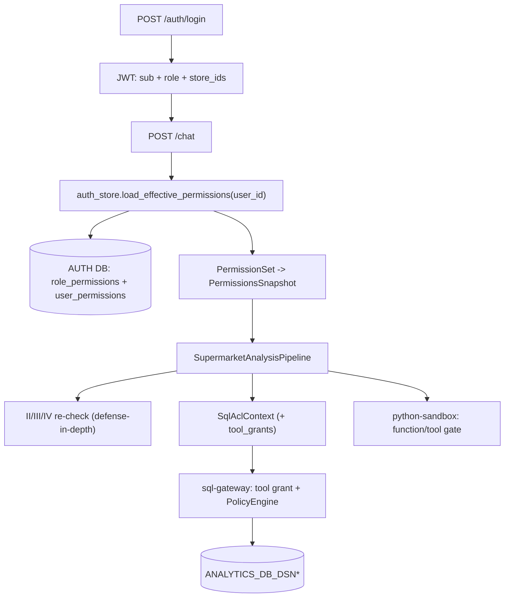

# Authentication & Permissions

Tài liệu luồng **đăng nhập user** và **phân quyền** trong supermarket stack (pipeline-centric).

Liên quan: [`CONFIGURATION_CHECKLIST.md`](CONFIGURATION_CHECKLIST.md), [`SUPERMARKET_ARCHITECTURE.md`](SUPERMARKET_ARCHITECTURE.md), [`PORTS.md`](PORTS.md).

---

## Hai lớp auth (không nhầm lẫn)

| Lớp | Mục đích | Cơ chế |
|-----|----------|--------|
| **User** | Ai được gọi `/chat`, `/upload`, … | `POST /auth/login` → JWT (`sub`, `role`, `store_ids`) |
| **Service** | Gateway có được gọi agents / sql-gateway không | `INTERNAL_SERVICE_TOKEN` + `REQUIRE_INTERNAL_AUTH=1` |

Business SQL (`ANALYTICS_DB_DSN*`) và auth SQL (`AUTH_DB_DSN`) là **hai pool tách biệt**.

---

## Đăng nhập username / password (production)

### API

```http
POST /auth/login
Content-Type: application/json

{"username": "hq.analyst", "password": "HqAn@lyst!Seed#26"}
```

Response:

```json
{
  "access_token": "<jwt>",
  "token_type": "bearer",
  "role": "hq_analyst",
  "display_name": "HQ Analyst"
}
```

Gọi API phân tích:

```http
POST /chat
Authorization: Bearer <jwt>
Content-Type: application/json

{"session_id": "sess-1", "message": "Phân tích doanh thu VIP tháng 3"}
```

### AUTH database

| File | Nội dung |
|------|----------|
| [`deploy/sql/auth/001_schema.sql`](../deploy/sql/auth/001_schema.sql) | `users` (username, password_hash bcrypt, role, store_ids), `oauth_accounts`, `sessions_audit` |
| [`deploy/sql/auth/003_password_login.sql`](../deploy/sql/auth/003_password_login.sql) | Migration cột password (DB đã tạo từ 001 cũ) |
| [`deploy/sql/auth/004_permissions.sql`](../deploy/sql/auth/004_permissions.sql) | Capability RBAC: `permissions`/`roles`/`role_permissions`/`user_permissions` + seed |
| [`scripts/seed_auth.py`](../scripts/seed_auth.py) | Seed user (`admin`, `hq.analyst`, `store.manager`) — hash+salt password lúc runtime, **không commit hash** |

**Seed users** — password **riêng từng user**, hash+salt bằng `scripts/seed_auth.py`; ưu tiên set qua env (`AUTH_SEED_ADMIN_PASSWORD`, `AUTH_SEED_HQ_ANALYST_PASSWORD`, `AUTH_SEED_STORE_MANAGER_PASSWORD`), nếu không set dùng default bootstrap và đổi trước prod:

| Username | Role | `store_ids` | Env password | Default bootstrap |
|----------|------|-------------|--------------|-------------------|
| `admin` | `admin` | *(null — full quyền)* | `AUTH_SEED_ADMIN_PASSWORD` | `Adm1n@Superm@rket#26` |
| `store.manager` | `store_manager` | `10001,10004` | `AUTH_SEED_STORE_MANAGER_PASSWORD` | `St0reManager!Seed#26` |
| `hq.analyst` | `hq_analyst` | *(null — toàn hệ thống)* | `AUTH_SEED_HQ_ANALYST_PASSWORD` | `HqAn@lyst!Seed#26` |

Seed / rotate user:

```powershell
# set env password riêng từng user (khuyến nghị) rồi chạy:
uv run python scripts/seed_auth.py
```

Env: `AUTH_DB_DSN` — đọc bởi [`agents/chat-gateway/src/chat_gateway/auth_store.py`](../agents/chat-gateway/src/chat_gateway/auth_store.py).

### JWT

| Biến | Mô tả |
|------|--------|
| `JWT_SECRET` | Ký HS256; prod ≥ 32 ký tự |
| `REQUIRE_PROD_AUTH=1` | Fail startup nếu secret yếu |

Claims trong token: `sub` (user_id), `role`, `store_ids` (list int hoặc null).

---

## Azure OAuth (tùy chọn — không bắt buộc)

Chỉ cần khi muốn SSO Microsoft 365. **Không** cần cho mô hình user/pass trong AUTH DB.

- `GET /auth/login` + `GET /auth/callback` — [`chat_gateway/oauth.py`](../agents/chat-gateway/src/chat_gateway/oauth.py)
- Biến: `OAUTH_PROVIDER=azure`, `OAUTH_CLIENT_*`, `AZURE_TENANT_ID`, `OAUTH_REDIRECT_URI`

---

## Dev auth (local only)

Merge [`.env.dev.example`](../.env.dev.example):

```dotenv
ALLOW_DEV_AUTH=1
REQUIRE_INTERNAL_AUTH=0
```

- `POST /auth/dev-login` — JWT không qua DB
- Request không có `Authorization` → user `dev-user` / `hq_analyst`

**Không bật trên production.**

---

## Mô hình capability (DB-driven RBAC)

Permission = **capability key** thuộc 3 nhóm, lưu trong AUTH DB:

| Nhóm | Key | Ý nghĩa |
|------|-----|---------|
| **data** | `data:table:<NAME>` · `data:table:*` | Quyền truy cập bảng |
| | `data:column_deny:<COL>` | Ẩn cột nhạy cảm |
| | `data:store_filter:required` | Bắt buộc lọc theo cửa hàng |
| **tool** | `tool:<server>:<action>` · `tool:*` | Quyền gọi MCP tool (sql-gateway validate/explain/execute, python-sandbox …) |
| **function** | `function:<tool_id>` · `function:*` | Quyền chạy recipe sandbox đã promote |

Wildcard dùng hậu tố `:*` tại mọi mốc segment (`tool:*`, `tool:sql-gateway:*`, `data:table:*`, `function:*`).

### Bảng AUTH DB ([`deploy/sql/auth/004_permissions.sql`](../deploy/sql/auth/004_permissions.sql))

| Bảng | Vai trò |
|------|---------|
| `permissions` | Catalog capability (thông tin) |
| `roles` | `admin`, `hq_analyst`, `store_manager` |
| `role_permissions` | Gán capability cho role |
| `user_permissions` | Override từng user: `effect` = `grant` / `revoke` |

**Effective permissions** = `role_permissions[user.role]` ∪ `user_permissions(grant)` ∖ `user_permissions(revoke)`.

Role `admin` = full quyền (`data:table:*`, `tool:*`, `function:*`). Tạo user full quyền: gán role `admin` (hoặc thêm 3 capability wildcard).

## Luồng phân quyền (workflow)



### Bước chi tiết

1. **`claims_from_user_dict`** — lấy `sub`, `role`, `store_ids` từ JWT (`user_claims.py`).
2. **`load_effective_permissions(user_id)`** — resolve capability từ AUTH DB (cache TTL ngắn); trả `PermissionSet`. User inactive/absent hoặc DB không truy cập được → trả `None` → **fail-closed**: `/chat` trả `403 permissions_unavailable`, không fallback YAML. Ngoại lệ duy nhất: dev mode (`ALLOW_DEV_AUTH=1`) fallback [`config/project.yaml`](../config/project.yaml) roles cho local/test.
3. **`PermissionSet.to_snapshot`** — expand `data:table:*` theo catalog; tách `denied_columns`, `tool_grants`, `allowed_functions`, `store_filter_required` → `PermissionsSnapshot`.
4. **Pipeline** (`pipeline.py`) — enforce + forward snapshot xuống II/III/IV:
   - `ContextPolicy.can_invoke_tool` trước `validate_sql`/`explain_sql`; `can_execute_sql` trước `execute_readonly`.
   - `can_invoke_function` lọc recipe candidate trước Agent IV.
   - `SqlAclContext.from_permissions` (kèm `tool_grants`) → mọi lệnh sql-gateway.
5. **Defense-in-depth**: agents II/III/IV nhận `permissions`, tự re-check tool/function → trả `policy_blocked` nếu thiếu.
6. **sql-gateway** (`tools_impl.py`) — check `tool:sql-gateway:<action>` + `PolicyEngine` (deny-by-default nếu `allowed_tables` rỗng).
7. **python-sandbox** (`tools_impl.py`) — `run_analysis_script`/`run_recipe_tool` check tool/function grant khi được truyền.

### Roles seed (mirror `config/project.yaml`)

| Role | Đặc điểm |
|------|----------|
| `admin` | `data:table:*`, `tool:*`, `function:*` (full) |
| `hq_analyst` | Nhiều bảng (`_HQ_TABLES`); mọi tool/function; không lọc cửa hàng |
| `store_manager` | Tập bảng nhỏ; `data:store_filter:required`; denied columns (VD `SPPRICE`) |

---

## Service-to-service auth

| Biến | Prod |
|------|------|
| `REQUIRE_INTERNAL_AUTH` | `1` |
| `INTERNAL_SERVICE_TOKEN` | Chuỗi ngẫu nhiên, giống nhau trên gateway + agents I–IV + sql-gateway |

Client gửi header: `Authorization: Bearer <token>` hoặc `X-Service-Token: <token>`.

Code: [`project_core/infra/auth_internal.py`](../packages/project-core/src/project_core/infra/auth_internal.py), [`chat_gateway/clients.py`](../agents/chat-gateway/src/chat_gateway/clients.py).

---

## Kiểm tra nhanh

```powershell
# 1. Login
curl -s -X POST http://localhost:18300/auth/login `
  -H "Content-Type: application/json" `
  -d '{"username":"hq.analyst","password":"HqAn@lyst!Seed#26"}'

# 2. Chat (thay TOKEN)
curl -s -X POST http://localhost:18300/chat `
  -H "Authorization: Bearer TOKEN" `
  -H "Content-Type: application/json" `
  -d '{"session_id":"test-1","message":"Xin chào"}'
```

Tests: `packages/project-test/integration/test_auth_login.py`, `test_sql_gateway_acl_enforcement.py`.
