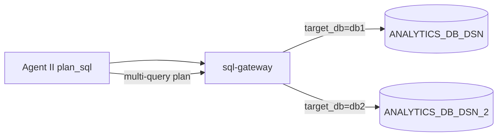

# Supermarket Multi-Agent — Configuration Checklist

Tài liệu tổng hợp **mọi key, URL, secret và nội dung** user cần bổ sung để chạy hệ thống (dev → prod).  
Template env: [`.env.example`](../.env.example) ở repo root.

---

## 0. Kiến trúc dữ liệu — 2 DB kinh doanh + 1 DB auth

Hệ thống **không** query business data từ một SQL Server duy nhất. Pipeline phân tích truy xuất **hai database kinh doanh** (readonly), do `sql-gateway` route theo `target_db`:

| `target_db` | Biến env | Ghi chú |
|-------------|----------|---------|
| `db1` | `ANALYTICS_DB_DSN` | DB kinh doanh 1 |
| `db2` | `ANALYTICS_DB_DSN_2` | DB kinh doanh 2 |
| — | `AUTH_DB_DSN` | Auth only — **không** dùng cho query kinh doanh |



- Agent II có thể emit **nhiều câu SQL** trong một plan; mỗi câu chỉ định `target_db`: `db1` hoặc `db2` (mặc định `db1`).
- `execute_readonly` / `explain_sql` (MCP): tham số `target_db` — xem `mcp-servers/sql-gateway/src/sql_gateway/tools_impl.py`.
- Mapping bảng → DB: user khai báo trong [`config/project.yaml`](../config/project.yaml) → `data_sources` và `data_dictionary/`.
- `data_dictionary/` cần mô tả schema **cả hai** DB; ghi rõ bảng thuộc `db1` hay `db2` (comment hoặc thư mục con tùy user).

**Lưu ý:** Join cross-DB không thực hiện trên SQL Server — pipeline chạy từng query trên đúng pool, Agent IV merge trong sandbox (pandas).

---

## 1. File `.env` (repo root)

Copy `.env.example` → `.env` và điền các giá trị bên dưới.

### 1.1 Bắt buộc cho production (LLM + SQL thật)

| Key | Mô tả | Đọc trong code |
|-----|--------|----------------|
| `OPENROUTER_API_KEY` | API key OpenRouter | `project_core/config/loader.py` → `get_openrouter_api_key()`; agents I–IV khi `ALLOW_LLM_STUB=0` |
| `ANALYTICS_DB_DSN` | ODBC readonly — DB kinh doanh 1 (`target_db=db1`) | `sql-gateway/tools_impl.py` |
| `ANALYTICS_DB_DSN_2` | ODBC readonly — DB kinh doanh 2 (`target_db=db2`) | `sql-gateway/tools_impl.py` |
| `REDIS_URL` | Redis STM (transcript / workflow / clarification) | `project_core/infra/stm/redis_store.py`, `platform-supermarket.yaml` |
| `MONGODB_URI` | MongoDB cho RAG + case study | `agents/chat-gateway/src/chat_gateway/orchestrator.py`, `scripts/index_schema_docs.py` |
| `JWT_SECRET` | Secret ký JWT (prod: chuỗi ngẫu nhiên ≥ 32 ký tự) | `agents/chat-gateway/src/chat_gateway/auth.py` |
| `ALLOW_LLM_STUB` | `0` = LLM thật, `1` = stub (dev/test) | Tất cả `agents/*/src/*/service.py` |

### 1.2 URL microservices (HTTP prod)

| Key | Port mặc định | Đọc trong code |
|-----|---------------|----------------|
| `CHAT_GATEWAY_URL` | 8300 | Client gọi API |
| `AGENT_I_URL` | 8201 | `agents/chat-gateway/src/chat_gateway/clients.py` |
| `AGENT_II_URL` | 8202 | ↑ |
| `AGENT_III_URL` | 8203 | ↑ |
| `AGENT_IV_URL` | 8204 | ↑ |
| `SQL_GATEWAY_URL` | 8101 | ↑ + `platform-supermarket.yaml` |

### 1.3 OAuth / Auth (Azure prod)

| Key | Mô tả | Đọc trong code |
|-----|--------|----------------|
| `OAUTH_PROVIDER` | `local` (dev) hoặc `azure` (prod) | `agents/chat-gateway/src/chat_gateway/oauth.py` |
| `OAUTH_CLIENT_ID` | Azure App Registration client ID | ↑ |
| `OAUTH_CLIENT_SECRET` | Azure client secret | ↑ |
| `OAUTH_REDIRECT_URI` | Callback URL, VD `https://your-domain/auth/callback` | ↑ (default: `http://localhost:8300/auth/callback`) |
| `AZURE_TENANT_ID` | Azure tenant ID hoặc `common` | ↑ |
| `AUTH_DB_DSN` | ODBC SQL Server **auth only** (không query kinh doanh) | `deploy/sql/auth/` — **gateway chưa wire lookup user** |

### 1.4 Dev / test flags

| Key | Giá trị dev | Giá trị prod | Đọc trong code |
|-----|-------------|--------------|----------------|
| `ALLOW_DEV_AUTH` | `1` | `0` | `chat-gateway/app.py`, `auth.py` — bật `POST /auth/dev-login` |
| `SQL_GATEWAY_INPROCESS` | `1` (gọi sql-gateway in-process) | unset / `0` | `chat-gateway/clients.py` |
| `CASE_STUDY_SCOPE` | `global` | `global` hoặc `actor` | Plan §7.1 — metadata case study |

### 1.5 Có default — nên set rõ khi deploy

| Key | Default | Đọc trong code |
|-----|---------|----------------|
| `CHAT_GATEWAY_PORT` | `8300` | `chat-gateway/app.py` |
| `AGENT_HTTP_PORT` | `8201`–`8204` (tùy agent) | `agents/*/src/*/app.py` |
| `PLATFORM_CONFIG` | `platform-supermarket.yaml` | Agents `app.py` |
| `PLATFORM_TRANSPORT` | `http` / `in_process` | `agents/base-runner/src/base_runner/runner.py` |
| `ARTIFACTS_DIR` | `data/artifacts` | `chat-gateway/app.py` — `GET /artifacts/{trace_id}/{file}` |
| `AGENT_ROOT_DIR` | cwd | `project_core/paths.py`, `config/env.py` |
| `AGENT_DATA_DIR` | `{ROOT}/data` | `project_core/paths.py` |
| `LOG_LEVEL` | `INFO` | `libs/commons/src/commons/logging.py` |

### 1.6 SQL gateway & sandbox tuning

| Key | Default | Đọc trong code |
|-----|---------|----------------|
| `SQL_GATEWAY_MAX_CONCURRENT` | `8` | `sql-gateway/tools_impl.py` |
| `SANDBOX_MAX_ROWS` | `200000` | `python-sandbox/tools_impl.py` |
| `SANDBOX_MAX_SECONDS` | `30` | ↑ |

### 1.7 MCP transport (sql-gateway SSE)

| Key | Default | Đọc trong code |
|-----|---------|----------------|
| `MCP_TRANSPORT` | `stdio` | `libs/mcp-core/.../transport/base.py` |
| `MCP_HTTP_HOST` | `0.0.0.0` | ↑ |
| `MCP_HTTP_PORT` | `8000` (prod sql-gateway: **8101**) | ↑ |
| `MCP_SSE_PATH` | `/sse` | ↑ |

### 1.8 Legacy / fallback (tùy chọn)

| Key | Ghi chú |
|-----|---------|
| `openroute_api_key` | Alias cũ của `OPENROUTER_API_KEY` |
| `OPENAI_API_KEY` | Fallback trong `libs/platform-core` |
| `OPENROUTER_BASE_URL` | Default `https://openrouter.ai/api/v1` |
| `MCP_TLS_CERT`, `MCP_TLS_KEY`, `MCP_TLS_CA` | TLS cho MCP SSE prod |

---

## 2. Config YAML

### 2.1 [`config/project.yaml`](../config/project.yaml)

| Mục | User cần bổ sung |
|-----|------------------|
| `data_sources.db1` | DSN env (`ANALYTICS_DB_DSN`) |
| `data_sources.db2` | DSN env (`ANALYTICS_DB_DSN_2`) |
| `roles.*.allowed_tables` | Khớp bảng thật — phân bổ đúng `db1` / `db2` (user định nghĩa) |
| `roles.*.denied_columns` | Cột nhạy cảm (VD `cost_price`, `margin_pct`) |
| `roles.store_manager.store_filter_required` | `true` nếu bắt buộc lọc `store_id` |
| `policy.max_rows`, `max_join_depth` | Tune theo DB prod |
| `artifacts.base_dir` | Path lưu parquet / png / xlsx |
| `budget.agent_caps`, `max_tokens_per_trace` | Tune giới hạn chi phí |

**Roles hiện tại tham chiếu bảng:** `sales`, `inventory`, `stores`, `customers`, `transactions`, `products`, `promotions`, `loyalty_tier`.

### 2.2 [`config/models.yaml`](../config/models.yaml)

| Mục | User cần bổ sung |
|-----|------------------|
| `profiles.*.model_id` | Model OpenRouter có quyền dùng |
| `agent_profiles` | Map agent → profile (router, sql_planner, risk_reviewer, analyst, embed) |

**Model mặc định hiện tại:**

- Chat: `xiaomi/mimo-v2.5`, `google/gemini-2.0-flash-001`
- Embed: `openai/text-embedding-3-small` (1536d)

### 2.3 [`platform-supermarket.yaml`](../platform-supermarket.yaml)

| Mục YAML | Biến env tương ứng |
|----------|-------------------|
| `memory.stm.url_env` | `REDIS_URL` |
| `memory.ltm.uri_env` | `MONGODB_URI` |
| `mcp_servers.sql-gateway.url_env` | `SQL_GATEWAY_URL` |
| `agents.conversational-router.endpoint_env` | `AGENT_I_URL` |
| `agents.sql-planner.endpoint_env` | `AGENT_II_URL` |
| `agents.risk-reviewer.endpoint_env` | `AGENT_III_URL` |
| `agents.data-analyst.endpoint_env` | `AGENT_IV_URL` |

---

## 3. Database & migrations

### 3.1 Hai SQL Server kinh doanh (query thật)

| Thành phần | Vị trí | Trạng thái repo |
|------------|--------|-----------------|
| **DB 1** connection | `.env` → `ANALYTICS_DB_DSN` | User điền |
| **DB 2** connection | `.env` → `ANALYTICS_DB_DSN_2` | User điền — bắt buộc nếu plan SQL dùng `target_db=db2` |
| Schema + seed | Hai SQL Server prod | **Chưa có migration trong repo** |
| Readonly user | Mỗi DB một account chỉ `SELECT` | User tạo |
| Route query | `target_db` trên MCP `execute_readonly` | `sql-gateway/tools_impl.py` |

### 3.2 Auth SQL Server (không phải DB kinh doanh)

| File | Nội dung |
|------|----------|
| [`deploy/sql/auth/001_schema.sql`](../deploy/sql/auth/001_schema.sql) | `users`, `oauth_accounts`, `sessions_audit` |
| [`deploy/sql/auth/002_seed.sql`](../deploy/sql/auth/002_seed.sql) | User mẫu — **đổi password trước prod** |

Connection: `.env` → `AUTH_DB_DSN`.  
**Lưu ý:** `chat-gateway` chưa lookup user từ Auth DB (chỉ JWT dev + Azure skeleton).

### 3.3 Redis

- Docker: [`docker-compose.yaml`](../docker-compose.yaml) → service `redis:6379`
- Env: `REDIS_URL=redis://localhost:6379/0`

### 3.4 MongoDB

- Docker: `docker-compose.yaml` → service `mongodb:27017`
- Env: `MONGODB_URI=mongodb://localhost:27017/supermarket_agent`
- Index RAG sau khi điền dictionary:

```bash
MONGODB_URI=... uv run python scripts/index_schema_docs.py
```

**Collections (plan §6.2):** `schema_chunks`, `case_studies`, `domain_definitions`, `brief_templates`, `negative_examples`.

---

## 4. Data dictionary

**Thư mục:** [`data_dictionary/`](../data_dictionary/)

| File | Trạng thái | Cần bổ sung |
|------|------------|-------------|
| `domain_definitions.md` | Stub | Định nghĩa VIP, điểm, metric nghiệp vụ |
| `brief_templates.md` | Stub | Template brief theo use case |
| `tables/sales.md` | Mẫu 6 cột | Schema + mô tả cột thật |
| `tables/customers.md` | Mẫu | Schema thật |
| `tables/transactions.md` | Mẫu | Schema thật |
| `sensitive_columns.md` | Mẫu | Cột cấm theo role |
| `tables/inventory.md` | **Thiếu** | Bảng trong `config/project.yaml` roles |
| `tables/stores.md` | **Thiếu** | ↑ |
| `tables/products.md` | **Thiếu** | ↑ |
| `tables/promotions.md` | **Thiếu** | ↑ |
| `tables/loyalty_tier.md` | **Thiếu** | ↑ |

---

## 5. Agent skills (prompt prod)

Khi `ALLOW_LLM_STUB=0`, cần skill đầy đủ:

| Agent | Thư mục skill | Trạng thái |
|-------|---------------|------------|
| I — conversational-router | `agents/conversational-router/src/conversational_router/skills/router/` | Chỉ `prompts/system_base.md` stub |
| II — sql-planner | `agents/sql-planner/src/sql_planner/skills/sql_planner/` | **Chưa có** |
| III — risk-reviewer | `agents/risk-reviewer/src/risk_reviewer/skills/risk_reviewer/` | **Chưa có** |
| IV — data-analyst | `agents/data-analyst/src/data_analyst/skills/analyst/` | **Chưa có** |

Mỗi skill cần: `SKILL.md`, `TOOLS.md`, `prompts/system_base.md`, `prompts/task_guide.md` (theo plan §9).

---

## 6. Docker Compose

File: [`docker-compose.yaml`](../docker-compose.yaml)

| Service | Port | Env quan trọng |
|---------|------|----------------|
| `redis` | 6379 | — |
| `mongodb` | 27017 | — |
| `sql-gateway` | 8101 | `ANALYTICS_DB_DSN`, `ANALYTICS_DB_DSN_2` |
| `conversational-router` | 8201 | `ALLOW_LLM_STUB=1` (dev) |
| `sql-planner` | 8202 | ↑ |
| `risk-reviewer` | 8203 | ↑ |
| `data-analyst` | 8204 | ↑ |
| `chat-gateway` | 8300 | `REDIS_URL`, `MONGODB_URI`, `ALLOW_DEV_AUTH`, `SQL_GATEWAY_INPROCESS` |

**Chưa có trong compose:** hai SQL Server kinh doanh, SQL Server auth, `python-sandbox` sidecar, `OPENROUTER_API_KEY`, `JWT_SECRET` prod.

---

## 7. Port map tổng hợp

| Service | Port |
|---------|------|
| chat-gateway | **8300** |
| Agent I (conversational-router) | **8201** |
| Agent II (sql-planner) | **8202** |
| Agent III (risk-reviewer) | **8203** |
| Agent IV (data-analyst) | **8204** |
| sql-gateway MCP (SSE) | **8101** |
| python-sandbox MCP | stdio (không HTTP) |
| Redis | 6379 |
| MongoDB | 27017 |

Chi tiết kiến trúc: [`docs/SUPERMARKET_ARCHITECTURE.md`](SUPERMARKET_ARCHITECTURE.md).

---

## 8. Checklist theo mục tiêu

### 8.1 Chạy test (84 tests, đã pass)

```env
ALLOW_LLM_STUB=1
ALLOW_DEV_AUTH=1
SQL_GATEWAY_INPROCESS=1
```

```bash
uv run pytest packages/project-test -q
```

### 8.2 Dev E2E (chat-gateway + agents)

1. `docker compose up redis mongodb`
2. Điền `.env`: `REDIS_URL`, `MONGODB_URI`
3. Start agents + chat-gateway (hoặc `docker compose up`)
4. `POST http://localhost:8300/auth/dev-login` → lấy JWT
5. `POST http://localhost:8300/chat` với `session_id`, `message`

### 8.3 Production phân tích thật

| # | Việc | Vị trí |
|---|------|--------|
| 1 | `OPENROUTER_API_KEY` | `.env` |
| 2 | `ALLOW_LLM_STUB=0` | `.env` |
| 3 | `ANALYTICS_DB_DSN` + `ANALYTICS_DB_DSN_2` + schema + readonly user (×2) | `.env` + 2× SQL Server |
| 4 | `data_dictionary/` đầy đủ + `index_schema_docs.py` | `data_dictionary/`, `scripts/` |
| 5 | Agent skills II–IV | `agents/*/skills/` |
| 6 | `JWT_SECRET` + OAuth Azure (`OAUTH_*`, `AZURE_TENANT_ID`) | `.env` |
| 7 | `ALLOW_DEV_AUTH=0` | `.env` |
| 8 | Wire `AUTH_DB_DSN` → user lookup trong gateway | **Chưa implement** |
| 9 | Migration / seed **cả hai** DB kinh doanh | **Chưa có trong repo** |
| 10 | `MONGODB_URI` + index vector collections | `.env` + Mongo |

---

## 9. Tham chiếu nhanh `.env.example`

```dotenv
OPENROUTER_API_KEY=
REDIS_URL=redis://localhost:6379/0
MONGODB_URI=mongodb://localhost:27017/supermarket_agent

SQL_GATEWAY_URL=http://localhost:8101
AGENT_I_URL=http://localhost:8201
AGENT_II_URL=http://localhost:8202
AGENT_III_URL=http://localhost:8203
AGENT_IV_URL=http://localhost:8204
CHAT_GATEWAY_URL=http://localhost:8300

# --- Business data: 2 readonly SQL Server pools ---
ANALYTICS_DB_DSN=Driver={...};Server=...;Database=...;Uid=readonly;Pwd=...;TrustServerCertificate=yes;
ANALYTICS_DB_DSN_2=Driver={...};Server=...;Database=...;Uid=readonly;Pwd=...;TrustServerCertificate=yes;

# Auth only — not for analytics queries
AUTH_DB_DSN=Driver={...};Server=...;Database=supermarket_auth;Uid=...;Pwd=...;TrustServerCertificate=yes;

JWT_SECRET=change-me-in-production
OAUTH_CLIENT_ID=
OAUTH_CLIENT_SECRET=
ALLOW_LLM_STUB=0
PLATFORM_TRANSPORT=http
CASE_STUDY_SCOPE=global
```

Bổ sung thêm khi deploy (chưa có trong `.env.example`):

```dotenv
OAUTH_PROVIDER=azure
OAUTH_REDIRECT_URI=https://your-domain/auth/callback
AZURE_TENANT_ID=your-tenant-id
ALLOW_DEV_AUTH=0
SQL_GATEWAY_INPROCESS=0
ARTIFACTS_DIR=data/artifacts
PLATFORM_CONFIG=platform-supermarket.yaml
MCP_TRANSPORT=sse
MCP_HTTP_PORT=8101
```
