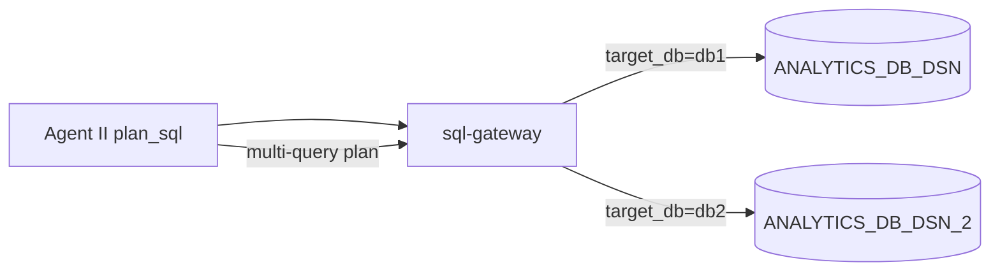

# Supermarket Multi-Agent — Configuration Checklist

Tài liệu tổng hợp **mọi key, URL, secret và nội dung** user cần bổ sung để chạy hệ thống (dev → prod).  
Template env: [`.env.example`](../.env.example) ở repo root.  
**Cổng local:** dải `18xxx` — xem [`PORTS.md`](PORTS.md).

**Cột trạng thái giá trị** (dùng trong các bảng audit bên dưới):

| Ký hiệu | Ý nghĩa |
|---------|---------|
| **Thật** | Giá trị thật, dùng được (local hoặc prod) |
| **Placeholder** | Có trong file nhưng là mẫu / không an toàn cho prod |
| **Mặc định** | Không ghi trong `.env` — runtime lấy default trong code |
| **Thiếu** | Rỗng hoặc chưa khai báo — tính năng liên quan chưa bật |
| **Không dùng** | Có trong `.env` nhưng **code chưa đọc** biến này |

> **Bảo mật:** Không commit `.env`. Tài liệu này **không** lặp lại secret thật — chỉ mô tả trạng thái.

---

## 0. Audit `.env` hiện tại (snapshot repo local)

Đối chiếu file [`.env`](../.env) với code (tháng 06/2026). Cập nhật lại sau khi bạn đổi `.env`.

### 0.1 Biến đã khai báo trong `.env`

| Key | Giá trị (rút gọn) | Trạng thái | Ghi chú |
|-----|-------------------|------------|---------|
| `OPENROUTER_API_KEY` | `sk-or-v1-…` (đã set) | **Thật** | LLM thật khi `ALLOW_LLM_STUB=0` |
| `REDIS_URL` | `redis://localhost:18379/0` | **Thật** | Host map Docker `18379:6379` |
| `MONGODB_URI` | `mongodb://localhost:18217/supermarket_agent` | **Thật** | Tránh `mongod` hệ thống `:27017` |
| `SQL_GATEWAY_URL` | `http://localhost:18101` | **Thật** | Compose nội bộ `sql-gateway:18101` |
| `AGENT_I_URL` … `AGENT_IV_URL` | `http://localhost:18201`–`18204` | **Thật** | Compose dùng tên service + cổng 1820x |
| `CHAT_GATEWAY_URL` | `http://localhost:18300` | **Thật** | Client gọi API |
| `ANALYTICS_DB_DSN` | ODBC → `DESKTOP-AUQEDC5` / `RESTORED_DB` | **Thật** | Readonly user `analysisagentreadonly` |
| `ANALYTICS_DB_DSN_2` | ODBC → `DESKTOP-AUQEDC5` / `RESTORED_DB2` | **Thật** | Pool `target_db=db2` |
| `AUTH_DB_DSN` | `localhost,18435` / `supermarket_auth` | **Placeholder** (sa mẫu) | **Đã wire** — `auth_store.authenticate()` |
| `JWT_SECRET` | *(đã generate ≥32 ký tự)* | **Thật** | `REQUIRE_PROD_AUTH=1` |
| `REQUIRE_INTERNAL_AUTH` / `INTERNAL_SERVICE_TOKEN` | đã set | **Thật** | Service auth bật |
| `ALLOW_DEV_AUTH` | `0` | **Prod** | Dev: [`.env.dev.example`](../.env.dev.example) |
| `ALLOW_LLM_STUB` | `0` | **Thật (intent)** | Agents I–III dùng OpenRouter thật |

### 0.2 Biến bảo mật & vận hành (prod defaults trong `.env`)

| Key | Default khi thiếu | Trạng thái | Ảnh hưởng |
|-----|-------------------|------------|-----------|
| `ALLOW_DEV_AUTH` | `0` | **Prod** | Dev: merge `.env.dev.example` |
| `REQUIRE_PROD_AUTH` | `1` | **Thật** | Chặn JWT yếu lúc startup |
| `REQUIRE_INTERNAL_AUTH` | `1` | **Thật** | Gateway ↔ agents/sql-gateway |
| `INTERNAL_SERVICE_TOKEN` | đã set | **Thật** | Cùng giá trị mọi app container |
| `SQL_GATEWAY_INPROCESS` | unset | **Mặc định HTTP** | Chỉ dev |
| `ARTIFACTS_DIR` | `data/artifacts` | **Mặc định** | OK local |
| `ATTACHMENTS_DIR` | `data/attachments` | **Mặc định** | OK local |
| `SQL_AUDIT_LOG_PATH` | `data/audit/sql_audit.jsonl` | **Mặc định** | OK local |
| `SQL_GATEWAY_HTTP_PORT` | `18101` | **Mặc định** | OK |
| `LOG_LEVEL` | `INFO` | **Mặc định** | OK |

### 0.3 Chênh lệch `.env` vs `docker-compose.yaml`

| Mục | `.env` local | Compose `chat-gateway` | Ghi chú |
|-----|--------------|------------------------|---------|
| `ALLOW_DEV_AUTH` | `0` | `env_file: .env` | Prod: không override |
| `REDIS_URL` / `MONGODB_URI` | `localhost` | service name Docker | Đúng khi chạy trong compose |
| `ALLOW_LLM_STUB` | `0` (LLM thật) | kế thừa `.env` | Agents trong compose cũng gọi OpenRouter thật |
| `OPENROUTER_API_KEY` | có | `env_file: .env` | Cần có trong `.env` khi `ALLOW_LLM_STUB=0` |

### 0.4 Việc còn thiếu để prod-ready (tóm tắt)

1. Chạy migration + seed AUTH DB (`deploy/sql/auth/`) và đổi password seed
2. `docker compose pull redis mongodb` + `docker compose up -d`
3. `uv run python scripts/index_schema_docs.py` (RAG Mongo)
4. Reverse proxy TLS (nếu expose public)
5. *(Tùy chọn)* Azure OAuth — xem [`AUTH_AND_PERMISSIONS.md`](AUTH_AND_PERMISSIONS.md)

---

## 0.5 Code stub / dev mode — chưa production-complete

| Thành phần | Điều kiện | Hành vi | Production? |
|------------|-----------|---------|-------------|
| **LLM stub** | `ALLOW_LLM_STUB=1` | Agent I: keyword route; II: `_stub_plan` SQL cứng; III: heuristic policy; IV: sandbox vẫn chạy nhưng recipe selector stub | **Không** — chỉ test |
| **User login** | `POST /auth/login` | bcrypt + `AUTH_DB_DSN` → JWT; capability resolve từ `role_permissions`/`user_permissions` | **Có** — xem [`AUTH_AND_PERMISSIONS.md`](AUTH_AND_PERMISSIONS.md) |
| **Dev auth** | `ALLOW_DEV_AUTH=1` | `POST /auth/dev-login` hoặc anonymous `hq_analyst` | **Không** (dev only) |
| **Azure OAuth** | `OAUTH_PROVIDER=azure` | SSO Microsoft — skeleton, **không bắt buộc** | Tùy chọn |
| **Internal service auth** | `REQUIRE_INTERNAL_AUTH=1` | Token giữa gateway ↔ agents/sql-gateway | **Prod** |
| **SQL in-process** | `SQL_GATEWAY_INPROCESS=1` | Import `sql_gateway.tools_impl` trong gateway process | Dev only |
| **Mongo RAG** | `MONGODB_URI` | `try_create_hybrid_retriever()` — lỗi import/connect → `None` im lặng | Cần Mongo + index |
| **Agent II retriever** | không có `pymongo` trên image II | Cùng fallback `None` | RAG trên II tắt trừ khi thêm dep |
| **CASE_STUDY_SCOPE** | env có | **Không đọc trong code** | Dead config |
| **Strands / MCP agent loop** | `platform-core` BaseAgentService | Import Strands MCP registry; supermarket agents `mcp_servers: []` — **không chạy ReAct MCP** | Kiến trúc dư, không ảnh hưởng hot path |
| **base-agent / base-runner** | template packages | `TODO.md`, example tools | Không dùng supermarket deploy |
| **python-sandbox MCP** | stdio sidecar | Pipeline chạy sandbox **in-process** trong data-analyst (IV) | MCP SSE entrypoint không dùng trong compose |

**Đường hot path production:** `POST /auth/login` → JWT → `POST /chat` → HTTP agents I–IV → `SupermarketAnalysisPipeline` (ACL + tool grants) → HTTP `sql-gateway` → ODBC; IV → `python_sandbox` in-process.

---

## 1. Kiến trúc dữ liệu — 2 DB kinh doanh + 1 DB auth

Hệ thống **không** query business data từ một SQL Server duy nhất. Pipeline phân tích truy xuất **hai database kinh doanh** (readonly), do `sql-gateway` route theo `target_db`:

| `target_db` | Biến env | Ghi chú |
|-------------|----------|---------|
| `db1` | `ANALYTICS_DB_DSN` | DB kinh doanh 1 |
| `db2` | `ANALYTICS_DB_DSN_2` | DB kinh doanh 2 |
| — | `AUTH_DB_DSN` | Auth only — **không** dùng cho query kinh doanh |


```mermaid
flowchart LR
    II[Agent II plan_sql] --> GW[sql-gateway]
    GW -->|target_db=db1| DB1[(ANALYTICS_DB_DSN)]
    GW -->|target_db=db2| DB2[(ANALYTICS_DB_DSN_2)]
    II -->|multi-query plan| GW
```

- Agent II có thể emit **nhiều câu SQL** trong một plan; mỗi câu chỉ định `target_db`: `db1` hoặc `db2` (mặc định `db1`).
- `execute_readonly` / `explain_sql` (MCP): tham số `target_db` — xem `mcp-servers/sql-gateway/src/sql_gateway/tools_impl.py`.
- Mapping bảng → DB: user khai báo trong [`config/project.yaml`](../config/project.yaml) → `data_sources` và `data_dictionary/`.
- `data_dictionary/` cần mô tả schema **cả hai** DB; ghi rõ bảng thuộc `db1` hay `db2` (comment hoặc thư mục con tùy user).

**Lưu ý:** Join cross-DB không thực hiện trên SQL Server — pipeline chạy từng query trên đúng pool, Agent IV merge trong sandbox (pandas).

---

## 1. File `.env` (repo root)

Copy `.env.example` → `.env` và điền các giá trị bên dưới.

### 1.1 Bắt buộc cho production (LLM + SQL thật)

| Key | Mô tả | Trạng thái `.env` | Đọc trong code |
|-----|--------|-------------------|----------------|
| `OPENROUTER_API_KEY` | API key OpenRouter | **Thật** (đã set) | `project_core/config/loader.py`; agents I–III khi `ALLOW_LLM_STUB=0` |
| `ANALYTICS_DB_DSN` | ODBC readonly — DB kinh doanh 1 (`target_db=db1`) | **Thật** | `sql-gateway/tools_impl.py` |
| `ANALYTICS_DB_DSN_2` | ODBC readonly — DB kinh doanh 2 (`target_db=db2`) | **Thật** | ↑ |
| `REDIS_URL` | Redis STM | **Mặc định local** | `project_core/infra/stm/redis_store.py` |
| `MONGODB_URI` | MongoDB RAG + case study | **Mặc định local** | `chat_gateway/orchestrator.py` |
| `JWT_SECRET` | Secret ký JWT (prod ≥ 32 ký tự) | **Placeholder** | `chat-gateway/auth.py` |
| `ALLOW_LLM_STUB` | `0` = LLM thật, `1` = stub | **Thật** (`0`) | Tất cả `agents/*/src/*/service.py` |

### 1.2 URL microservices (HTTP prod)

| Key | Port mặc định | Đọc trong code |
|-----|---------------|----------------|
| `CHAT_GATEWAY_URL` | 18300 | Client gọi API |
| `AGENT_I_URL` | 18201 | `agents/chat-gateway/src/chat_gateway/clients.py` |
| `AGENT_II_URL` | 18202 | ↑ |
| `AGENT_III_URL` | 18203 | ↑ |
| `AGENT_IV_URL` | 18204 | ↑ |
| `SQL_GATEWAY_URL` | 18101 | ↑ + `platform-supermarket.yaml` |

### 1.3 User login & service auth

Chi tiết: [`AUTH_AND_PERMISSIONS.md`](AUTH_AND_PERMISSIONS.md).

| Key / API | Mô tả | Đọc trong code |
|-----------|--------|----------------|
| `AUTH_DB_DSN` | SQL Server users (`username`, `password_hash` bcrypt) | `chat_gateway/auth_store.py` |
| `POST /auth/login` | Body `{username, password}` → JWT | `chat_gateway/app.py` |
| `JWT_SECRET` | Ký JWT | `chat_gateway/auth.py` |
| `REQUIRE_PROD_AUTH` | `1` = reject weak secret at startup | ↑ |
| `ALLOW_DEV_AUTH` | `0` prod; `1` → `/auth/dev-login` | ↑ |
| `REQUIRE_INTERNAL_AUTH` | `1` = bắt buộc token nội bộ | `project_core/infra/auth_internal.py` |
| `INTERNAL_SERVICE_TOKEN` | Shared secret gateway ↔ agents/sql-gateway | ↑, `chat_gateway/clients.py` |
| `AUTH_PERMISSIONS_CACHE_TTL` | TTL (giây) cache capability per-user (default 60) | `chat_gateway/auth_store.py` |
| Capability RBAC | `role_permissions`/`user_permissions` → tool/function/data grants | `auth_store.load_effective_permissions`, `domain/access/permission_set.py` |
| Fail-closed | AUTH DB không resolve được quyền → `/chat` trả `403 permissions_unavailable` (không fallback YAML; dev `ALLOW_DEV_AUTH=1` mới fallback) | `chat_gateway/orchestrator._build_permissions`, `app.py` |

**Azure OAuth (tùy chọn):** `OAUTH_PROVIDER`, `OAUTH_CLIENT_*`, `AZURE_TENANT_ID`, `OAUTH_REDIRECT_URI` — `chat_gateway/oauth.py`. Không cần nếu chỉ dùng username/password.

### 1.4 Dev / test flags

| Key | Giá trị dev | Giá trị prod | Trạng thái `.env` | Đọc trong code |
|-----|-------------|--------------|-------------------|----------------|
| `ALLOW_DEV_AUTH` | `1` | `0` | **Mặc định `0`** (compose = `1`) | `chat-gateway/app.py`, `auth.py` |
| `SQL_GATEWAY_INPROCESS` | `1` | unset / `0` | **Mặc định HTTP** | `chat-gateway/clients.py` |
| `CASE_STUDY_SCOPE` | `global` | `global` hoặc `actor` | **Không dùng trong code** | *(chưa implement)* |

### 1.5 Có default — nên set rõ khi deploy

| Key | Default | Đọc trong code |
|-----|---------|----------------|
| `CHAT_GATEWAY_PORT` | `18300` | `chat-gateway/app.py` |
| `AGENT_HTTP_PORT` | `18201`–`18204` (tùy agent) | `agents/*/src/*/app.py` |
| `PLATFORM_CONFIG` | `platform-supermarket.yaml` | Agents `app.py` |
| `PLATFORM_TRANSPORT` | `http` / `in_process` | `agents/base-runner/src/base_runner/runner.py` |
| `ARTIFACTS_DIR` | `data/artifacts` | `chat-gateway/app.py` — `GET /artifacts/{trace_id}/{file}` |
| `AGENT_ROOT_DIR` | cwd | `project_core/paths.py`, `config/env.py` |
| `AGENT_DATA_DIR` | `{ROOT}/data` | `project_core/paths.py` |
| `LOG_LEVEL` | `INFO` | `libs/commons/src/commons/logging.py` |

### 1.6 SQL gateway & sandbox tuning

| Key | Default | Đọc trong code |
|-----|---------|----------------|
| `SQL_GATEWAY_MAX_CONCURRENT` | `8` | `sql-gateway/tools_impl.py` |
| `SANDBOX_MAX_ROWS` | `200000` | `python-sandbox/tools_impl.py` |
| `SANDBOX_MAX_SECONDS` | `30` | ↑ |

### 1.7 MCP transport (sql-gateway SSE)

| Key | Default | Đọc trong code |
|-----|---------|----------------|
| `MCP_TRANSPORT` | `stdio` | `libs/mcp-core/.../transport/base.py` |
| `MCP_HTTP_HOST` | `0.0.0.0` | ↑ |
| `MCP_HTTP_PORT` | `8000` (sql-gateway HTTP dùng **18101** qua `SQL_GATEWAY_HTTP_PORT`) | ↑ |
| `MCP_SSE_PATH` | `/sse` | ↑ |

### 1.8 Legacy / fallback (tùy chọn)

| Key | Ghi chú |
|-----|---------|
| `openroute_api_key` | Alias cũ của `OPENROUTER_API_KEY` |
| `OPENAI_API_KEY` | Fallback trong `libs/platform-core` |
| `OPENROUTER_BASE_URL` | Default `https://openrouter.ai/api/v1` |
| `MCP_TLS_CERT`, `MCP_TLS_KEY`, `MCP_TLS_CA` | TLS cho MCP SSE prod |

---

## 2. Config YAML

### 2.1 [`config/project.yaml`](../config/project.yaml)

| Mục | User cần bổ sung |
|-----|------------------|
| `data_sources.db1` | DSN env (`ANALYTICS_DB_DSN`) |
| `data_sources.db2` | DSN env (`ANALYTICS_DB_DSN_2`) |
| `roles.*.allowed_tables` | Khớp bảng thật — phân bổ đúng `db1` / `db2` (user định nghĩa) |
| `roles.*.denied_columns` | Cột nhạy cảm (VD `cost_price`, `margin_pct`) |
| `roles.store_manager.store_filter_required` | `true` nếu bắt buộc lọc `store_id` |
| `policy.max_rows`, `max_join_depth` | Tune theo DB prod |
| `artifacts.base_dir` | Path lưu parquet / png / xlsx |
| `budget.agent_caps`, `max_tokens_per_trace` | Tune giới hạn chi phí |

**Roles hiện tại** (`config/project.yaml`): bảng thật supermarket — `STRANS`, `PMTRANS`, `CUSTOMER`, `CSCARD`, `STK_DTL`, `WebRpt_*`, … (không còn tên generic `sales`/`inventory`).

### 2.2 [`config/models.yaml`](../config/models.yaml)

| Mục | User cần bổ sung |
|-----|------------------|
| `profiles.*.model_id` | Model OpenRouter có quyền dùng |
| `agent_profiles` | Map agent → profile (router, sql_planner, risk_reviewer, analyst, embed) |

**Model mặc định hiện tại:**

- Chat: `xiaomi/mimo-v2.5`, `google/gemini-2.0-flash-001`
- Embed: `openai/text-embedding-3-small` (1536d)

### 2.3 [`platform-supermarket.yaml`](../platform-supermarket.yaml)

| Mục YAML | Biến env tương ứng |
|----------|-------------------|
| `memory.stm.url_env` | `REDIS_URL` |
| `memory.ltm.uri_env` | `MONGODB_URI` |
| `mcp_servers.sql-gateway.url_env` | `SQL_GATEWAY_URL` |
| `agents.conversational-router.endpoint_env` | `AGENT_I_URL` |
| `agents.sql-planner.endpoint_env` | `AGENT_II_URL` |
| `agents.risk-reviewer.endpoint_env` | `AGENT_III_URL` |
| `agents.data-analyst.endpoint_env` | `AGENT_IV_URL` |

---

## 3. Database & migrations

### 3.1 Hai SQL Server kinh doanh (query thật)

| Thành phần | Vị trí | Trạng thái repo |
|------------|--------|-----------------|
| **DB 1** connection | `.env` → `ANALYTICS_DB_DSN` | User điền |
| **DB 2** connection | `.env` → `ANALYTICS_DB_DSN_2` | User điền — bắt buộc nếu plan SQL dùng `target_db=db2` |
| Schema + seed | Hai SQL Server prod | **Chưa có migration trong repo** |
| Readonly user | Mỗi DB một account chỉ `SELECT` | User tạo |
| Route query | `target_db` trên MCP `execute_readonly` | `sql-gateway/tools_impl.py` |

### 3.2 Auth SQL Server (không phải DB kinh doanh)

| File | Nội dung |
|------|----------|
| [`deploy/sql/auth/001_schema.sql`](../deploy/sql/auth/001_schema.sql) | `users` (+ username, password_hash), `oauth_accounts`, `sessions_audit` |
| [`deploy/sql/auth/003_password_login.sql`](../deploy/sql/auth/003_password_login.sql) | Migration cột password (DB cũ) |
| [`deploy/sql/auth/004_permissions.sql`](../deploy/sql/auth/004_permissions.sql) | Capability RBAC: `permissions`/`roles`/`role_permissions`/`user_permissions` + seed |
| [`scripts/seed_auth.py`](../scripts/seed_auth.py) | Seed `admin`, `store.manager`, `hq.analyst` — hash+salt runtime, password riêng qua env (không commit hash) |
| [`deploy/sql/auth/README.md`](../deploy/sql/auth/README.md) | Hướng dẫn chạy migration + seed + cấp/thu quyền |

Connection: `.env` → `AUTH_DB_DSN`. Login: `POST /auth/login`; phân quyền capability (DB-driven) — [`AUTH_AND_PERMISSIONS.md`](AUTH_AND_PERMISSIONS.md).

### 3.3 Redis

- Docker: [`docker-compose.yaml`](../docker-compose.yaml) → Redis host **18379** (`18379:6379`)
- Env: `REDIS_URL=redis://localhost:18379/0`

### 3.4 MongoDB

- Docker: `docker-compose.yaml` → Mongo host **18217** (`18217:27017`)
- Env: `MONGODB_URI=mongodb://localhost:18217/supermarket_agent`
- Index RAG sau khi điền dictionary:

```bash
MONGODB_URI=... uv run python scripts/index_schema_docs.py
```

**Collections (plan §6.2):** `schema_chunks`, `case_studies`, `domain_definitions`, `brief_templates`, `negative_examples`.

---

## 4. Data dictionary

**Thư mục:** [`data_dictionary/`](../data_dictionary/)

| File / nhóm | Trạng thái | Ghi chú |
|-------------|------------|---------|
| `domain_definitions.md` | **Thật (draft)** | Glossary db1/db2, TRANS_CODE, điểm — cần xác nhận nghiệp vụ |
| `brief_templates.md` | **Thật (draft)** | Mẫu brief cho Agent I |
| `sensitive_columns.md` | **Draft** | Cột nhạy cảm theo role |
| `tables/db1/*.md` | **Một phần** | STRANS, PMTRANS, TRANSHDR_ARC, CRDTRANS_ARC, `shards.yaml` |
| `tables/db2/*.md` | **Khá đầy đủ** | ~35 bảng master + giao dịch + WebRpt |
| `db1/README.md`, `db2/README.md` | Có | Mô tả phân tách archive/live |

**Còn thiếu / cần làm:**

- Chạy `uv run python scripts/validate_data_dictionary.py` với DSN thật để đối chiếu schema DB
- Index vector: `MONGODB_URI=... uv run python scripts/index_schema_docs.py` (chưa xác minh đã chạy)
- Bảng trong `config/project.yaml` roles chưa có file `.md` riêng → bổ sung dần khi agent II cần

---

## 5. Agent skills (prompt prod)

Khi `ALLOW_LLM_STUB=0`, agents I–III dùng OpenRouter + skill files:

| Agent | Thư mục skill | Trạng thái |
|-------|---------------|------------|
| I — conversational-router | `agents/conversational-router/src/conversational_router/skills/router/` | **Có** — SKILL, TOOLS, ingress/clarify/synthesize guides |
| II — sql-planner | `agents/sql-planner/src/sql_planner/skills/sql_planner/` | **Có** — plan_sql + probe_feedback guides |
| III — risk-reviewer | `agents/risk-reviewer/src/risk_reviewer/skills/risk_reviewer/` | **Có** — review_guide; policy engine chạy trước LLM |
| IV — data-analyst | `agents/data-analyst/src/data_analyst/skills/analyst/` | **Có** — analyze/recipe guides; runtime chủ yếu `iv_analyzer` + sandbox |

**Cần tune thêm:** prompt theo schema thật, ví dụ SQL, negative examples trong Mongo.

---

## 6. Docker Compose

File: [`docker-compose.yaml`](../docker-compose.yaml)

| Service | Port | Env quan trọng | Ghi chú |
|---------|------|----------------|---------|
| `redis` | 18379 (→6379) | — | |
| `mongodb` | 18217 (→27017) | — | |
| `sql-gateway` | 18101 | `ANALYTICS_DB_DSN`, `ANALYTICS_DB_DSN_2` | HTTP entrypoint `sql-gateway-http` |
| `conversational-router` | 18201 | `OPENROUTER_API_KEY`, `ALLOW_LLM_STUB` | `.env` hiện `ALLOW_LLM_STUB=0` → LLM thật |
| `sql-planner` | 18202 | ↑ | |
| `risk-reviewer` | 18203 | ↑ | |
| `data-analyst` | 18204 | ↑ + `python-sandbox` in-process | |
| `chat-gateway` | 18300 | `.env` prod flags | Không override `ALLOW_DEV_AUTH` |

**Chưa có trong compose:** SQL Server kinh doanh (external), SQL Server auth, `python-sandbox` sidecar, `REQUIRE_INTERNAL_AUTH`, secrets prod trong env riêng.

---

## 7. Port map tổng hợp

| Service | Port |
|---------|------|
| chat-gateway | **18300** |
| Agent I (conversational-router) | **18201** |
| Agent II (sql-planner) | **18202** |
| Agent III (risk-reviewer) | **18203** |
| Agent IV (data-analyst) | **18204** |
| sql-gateway HTTP | **18101** |
| python-sandbox MCP | stdio (không HTTP) |
| Redis (host) | **18379** |
| MongoDB (host) | **18217** |

Chi tiết cổng: [`PORTS.md`](PORTS.md). Kiến trúc: [`SUPERMARKET_ARCHITECTURE.md`](SUPERMARKET_ARCHITECTURE.md).

---

## 8. Checklist theo mục tiêu

### 8.1 Chạy test (~202 tests)

```env
ALLOW_LLM_STUB=1
ALLOW_DEV_AUTH=1
SQL_GATEWAY_INPROCESS=1
```

```bash
uv run pytest packages/project-test -q --ignore=packages/project-test/integration/test_live_llm.py
```

Opt-in live tests: `ANALYTICS_DB_DSN` + `OPENROUTER_API_KEY` + `ALLOW_LLM_STUB=0`.

### 8.2 Dev E2E (merge `.env.dev.example`)

1. `docker compose pull redis mongodb && docker compose up -d redis mongodb`
2. Chạy AUTH SQL: `001_schema.sql`, `004_permissions.sql` → rồi `uv run python scripts/seed_auth.py`
3. Merge [`.env.dev.example`](../.env.dev.example) vào `.env` *(hoặc giữ prod auth + login thật)*
4. `docker compose up -d` hoặc `uv run chat-gateway`
5. **Prod path:** `POST /auth/login` → JWT → `POST /chat`
6. **Dev path:** `POST /auth/dev-login` → JWT → `POST /chat`

### 8.3 Production phân tích thật

| # | Việc | Trạng thái |
|---|------|------------|
| 1 | `OPENROUTER_API_KEY` + `ALLOW_LLM_STUB=0` | **Done** |
| 2 | `ANALYTICS_DB_DSN` ×2 | **Done** |
| 3 | JWT + internal service auth flags | **Done** |
| 4 | `POST /auth/login` + AUTH DB seed | **Code done** — cần chạy SQL trên server |
| 5 | Capability RBAC (`004_permissions.sql`) | **Code done** — chạy migration; gán role/override per-user |
| 6 | Redis/Mongo Docker (`18xxx` ports) | **Done** — `docker compose pull` |
| 7 | `index_schema_docs.py` + validate dictionary | **Cần chạy** |
| 8 | Đổi password seed / tạo user thật (role `admin` = full) | **Cần làm** |
| 9 | TLS reverse proxy (public) | **Tùy deploy** |

---

## 10. Prod — giá trị bạn **còn phải điền** trước go-live

Repo đã chuyển `.env` / `.env.example` / `docker-compose` sang **prod defaults**. Bảng dưới là những gì **vẫn trống hoặc placeholder** trong `.env` của bạn:

| Biến | Trạng thái hiện tại | Bạn cần làm |
|------|---------------------|-------------|
| `POST /auth/login` username/password | **Done** | `username` + `password` → JWT |
| `users` schema + seed | **Cần chạy SQL + script** | `001_schema.sql`, `003_password_login.sql` → `scripts/seed_auth.py` |
| Capability RBAC | **Cần chạy SQL** | `004_permissions.sql` (role/permission + per-user override) |
| `AUTH_DB_DSN` (password `sa`) | **Placeholder** | Password prod + chạy `deploy/sql/auth/*.sql` |
| `index_schema_docs.py` | **Chưa chạy** | Sau `docker compose up mongodb` |
| `data_dictionary` validate | **Một phần** | `uv run python scripts/validate_data_dictionary.py` |

**Không cần** (trừ khi sau này bật SSO Microsoft): `OAUTH_CLIENT_ID`, `OAUTH_CLIENT_SECRET`, `AZURE_TENANT_ID`, `OAUTH_REDIRECT_URI`.

**Đã xong (không cần sửa trừ khi rotate secret):**

| Biến | Ghi chú |
|------|---------|
| `OPENROUTER_API_KEY` | Đã set |
| `ANALYTICS_DB_DSN` / `_2` | DSN thật |
| `JWT_SECRET` | Đã generate (≥32 ký tự) |
| `INTERNAL_SERVICE_TOKEN` | Đã generate |
| `REQUIRE_PROD_AUTH=1`, `REQUIRE_INTERNAL_AUTH=1`, `ALLOW_DEV_AUTH=0` | Prod |
| `ALLOW_LLM_STUB=0` | LLM thật |
| Redis/Mongo | Docker images `redis:7-alpine`, `mongo:7` — **không cài local** |

**Triển khai:**

```powershell
docker compose pull redis mongodb
.\scripts\docker-build.ps1 all
docker compose up -d
uv run python scripts/index_schema_docs.py
```

**Dev local tạm:** copy nội dung [`.env.dev.example`](../.env.dev.example) vào `.env` (ghi đè các flag auth).

---

## 9. Tham chiếu nhanh `.env.example`

Prod template: [`.env.example`](../.env.example). Dev overrides: [`.env.dev.example`](../.env.dev.example).

**Không set trên prod:**

```dotenv
ALLOW_DEV_AUTH=1
SQL_GATEWAY_INPROCESS=1
ALLOW_LLM_STUB=1
OAUTH_PROVIDER=local
```

Tùy chọn ops:

```dotenv
ARTIFACTS_DIR=data/artifacts
PLATFORM_CONFIG=platform-supermarket.yaml
LOG_LEVEL=INFO
SQL_AUDIT_LOG_PATH=data/audit/sql_audit.jsonl
```
