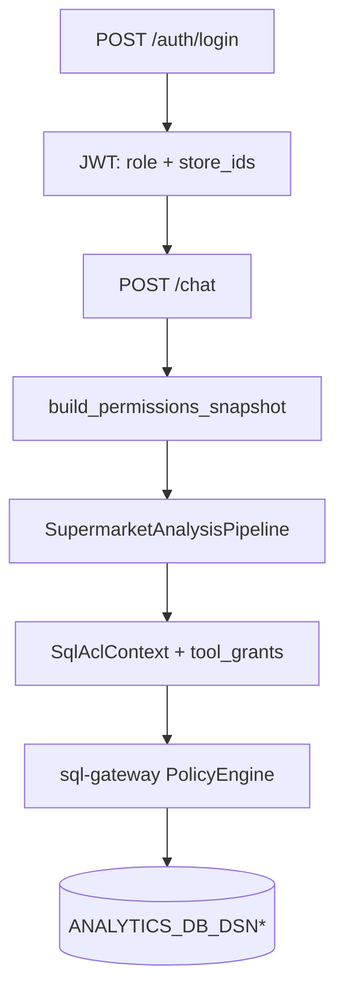

# Supermarket Multi-Agent Architecture

Production stack for supermarket analytics chatbot.

Chi tiết auth & ACL: [`AUTH_AND_PERMISSIONS.md`](AUTH_AND_PERMISSIONS.md). Cấu hình: [`CONFIGURATION_CHECKLIST.md`](CONFIGURATION_CHECKLIST.md).

## Services

| Service | Port (host) |
|---------|-------------|
| chat-gateway | 18300 |
| conversational-router (I) | 18201 |
| sql-planner (II) | 18202 |
| risk-reviewer (III) | 18203 |
| data-analyst (IV) | 18204 |
| sql-gateway HTTP | 18101 |
| Redis | 18379 |
| MongoDB | 18217 |

Bảng đầy đủ: [`PORTS.md`](PORTS.md).

## Data sources (business)

Query kinh doanh qua **hai** SQL Server readonly (peer — không phân cấp chính/phụ):

| `target_db` | Biến env |
|-------------|----------|
| `db1` | `ANALYTICS_DB_DSN` |
| `db2` | `ANALYTICS_DB_DSN_2` |

- `sql-gateway`: `execute_readonly` / `explain_sql` nhận `target_db` (`db1` mặc định, hoặc `db2`).
- Agent II có thể plan nhiều câu SQL; mỗi câu chọn `target_db` tương ứng.
- Bảng thuộc DB nào: user khai báo trong `data_dictionary/` và `config/project.yaml` → `data_sources`.
- Join cross-DB: merge ở Agent IV (pandas), không join trên SQL Server.

`AUTH_DB_DSN` — auth only (username/password), không query kinh doanh. Migration: `deploy/sql/auth/`.

## Authentication & permissions



1. User đăng nhập `POST /auth/login` với `username` / `password` (bcrypt trong AUTH DB).
2. Gateway cấp JWT (`sub`, `role`, `store_ids`).
3. Mỗi `/chat`: `load_effective_permissions(user_id)` resolve **capability** từ AUTH DB (`role_permissions` ∪ `user_permissions` grant ∖ revoke) → `PermissionsSnapshot` (tables, denied columns, `tool_grants`, `allowed_functions`). Không resolve được (user inactive/absent hoặc DB chết) → **fail-closed** `403`, không fallback (trừ dev `ALLOW_DEV_AUTH=1` → `config/project.yaml`).
4. Pipeline enforce `can_invoke_tool` / `can_execute_sql` / `can_invoke_function` và **forward** snapshot xuống agents II–IV (defense-in-depth: agent tự re-check).
5. sql-gateway enforce tool grant + `PolicyEngine` (deny-by-default nếu `allowed_tables` rỗng); python-sandbox gate tool/function.

Capability = `data:table:*`, `tool:*`, `function:*` (wildcard). Role `admin` = full quyền. Chi tiết: [`AUTH_AND_PERMISSIONS.md`](AUTH_AND_PERMISSIONS.md).

Service-to-service: `INTERNAL_SERVICE_TOKEN` khi `REQUIRE_INTERNAL_AUTH=1`.

## Flow (analysis)

1. User → `POST /chat` (Bearer JWT)
2. Agent I ingress → `route=analysis` + best-effort brief
3. `SupermarketAnalysisPipeline`: II plan → Policy → III risk → execute (per `target_db`) → IV analyze
4. II may `clarify` → I `clarification_bridge` → auto-resolve or MCQ
5. `FeedbackLoop.on_pipeline_complete` stages case studies on success

## Dev

```bash
uv sync
# Merge .env.dev.example for stub LLM + dev auth, or use real login:
set ALLOW_LLM_STUB=1
set ALLOW_DEV_AUTH=1
uv run chat-gateway
```

Prod login (không cần `ALLOW_DEV_AUTH`):

```bash
curl -X POST http://localhost:18300/auth/login \
  -H "Content-Type: application/json" \
  -d '{"username":"hq.analyst","password":"HqAn@lyst!Seed#26"}'
```

## Docker

```bash
docker compose pull redis mongodb
docker compose up -d
```

Điền `.env`: `ANALYTICS_DB_DSN`, `ANALYTICS_DB_DSN_2`, `AUTH_DB_DSN` (sau khi chạy `deploy/sql/auth/*.sql`).
