# Tài liệu vận hành toàn bộ repository Monorepo-Trading-Agent

**Phiên bản:** 1.0 — viết trực tiếp từ mã nguồn, không trích từ tài liệu markdown có sẵn trong repo.

**Mục đích:** Mô tả cực kỳ chi tiết bằng tiếng Việt cách toàn bộ mã nguồn hoạt động: cấu trúc thư mục, thiết kế monorepo, cơ sở dữ liệu, biến môi trường, luồng nghiệp vụ, sơ đồ hoạt động, triển khai, và từng thành phần mã.

**Phạm vi:** Repository `Monorepo-Trading-Agent` — hệ thống chatbot phân tích siêu thị đa agent (Supermarket stack).

---

## Mục lục tổng (Phần A–Z)

| Phần | Tiêu đề | Dòng bắt đầu (ước lượng) |
|------|---------|---------------------------|
| A | Giới thiệu và bối cảnh nghiệp vụ | §A.1 |
| B | Kiến trúc tổng thể và ranh giới dịch vụ | §B.1 |
| C | Thiết kế monorepo và workspace uv | §C.1 |
| D | Cây thư mục gốc và quy ước đặt tên | §D.1 |
| E | Thư viện `libs/` — từng package | §E.1 |
| F | Gói `packages/` — project-core và project-test | §F.1 |
| G | Agents I–IV và chat-gateway | §G.1 |
| H | MCP servers — sql-gateway và python-sandbox | §H.1 |
| I | Cấu hình YAML và JSON | §I.1 |
| J | Biến môi trường — từng khóa | §J.1 |
| K | Cơ sở dữ liệu AUTH và analytics | §K.1 |
| L | Redis, MongoDB, và lưu trữ phiên | §L.1 |
| M | Luồng xác thực và phân quyền RBAC | §M.1 |
| N | Pipeline phân tích `SupermarketAnalysisPipeline` | §N.1 |
| O | Agent I — conversational-router | §O.1 |
| P | Agent II — sql-planner | §P.1 |
| Q | Agent III — risk-reviewer | §Q.1 |
| R | Agent IV — data-analyst và iv_analyzer | §R.1 |
| S | sql-gateway — policy, ACL, TCVN3 | §S.1 |
| T | python-sandbox — thực thi pandas | §T.1 |
| U | Chat-gateway và orchestrator | §U.1 |
| V | Docker, compose, triển khai prod | §V.1 |
| W | Kiểm thử và fixtures | §W.1 |
| X | Data dictionary và schema catalog | §X.1 |
| Y | Scripts vận hành | §Y.1 |
| Z | Phụ lục — từng tệp mã nguồn | §Z.1 |

---

# Phần A — Giới thiệu và bối cảnh nghiệp vụ

## §A.1 Bài toán mà hệ thống giải quyết

Hệ thống cho phép người dùng nội bộ siêu thị (ví dụ: quản lý cửa hàng, phân tích HQ) đặt câu hỏi bằng ngôn ngữ tự nhiên về dữ liệu kinh doanh: doanh thu, VIP, tồn kho, sản phẩm, xu hướng theo thời gian, so sánh cửa hàng, v.v.

Câu trả lời không chỉ là văn bản: hệ thống có thể chạy SQL readonly trên hai cơ sở dữ liệu analytics (`db1`, `db2`), xuất parquet, chạy phân tích pandas trong sandbox, tạo biểu đồ và file CSV/Excel, rồi tổng hợp lời giải thích cho người dùng.

## §A.2 Ràng buộc nghiệp vụ quan trọng

Dữ liệu kinh doanh nằm trên SQL Server với hai database peer (`RESTORED_DB` / `RESTORED_DB2` tương ứng `db1`/`db2` trong code). Không join cross-database trên SQL Server — join/merge thực hiện ở tầng Agent IV (pandas) sau khi mỗi query chạy trên đúng pool.

Một lượng lớn cột text legacy dùng mã TCVN3; sql-gateway chuyển sang Unicode khi trả kết quả `execute_readonly`.

Quyền truy cập là capability-based RBAC lưu trong AUTH DB (`supermarket_auth`), fail-closed: không resolve được quyền thì từ chối.

## §A.3 Các actor chính

| Actor | Vai trò |
|-------|---------|
| End user | Đăng nhập username/password, nhận JWT, gọi `/chat` |
| chat-gateway | API công khai, orchestrator, pipeline host |
| Agent I | Ingress routing, brief, clarify, synthesize |
| Agent II | Lập kế hoạch SQL |
| Agent III | Rà soát rủi ro SQL |
| Agent IV | Thực thi phân tích trên parquet (runtime hiện tại: executor) |
| sql-gateway | Validate/explain/execute SQL readonly |
| python-sandbox | Tool pandas/plot (in-process trong data-analyst) |
| Redis | Short-term memory phiên |
| MongoDB | Schema docs retrieval, analysis_tools registry |
| AUTH SQL Server | Users, roles, permissions |

## §A.4 Thuật ngữ nội bộ

**Brief (`AnalysisBrief`):** Cấu trúc mô tả ý định phân tích — intent, metrics, dimensions, filters, time_range, output_format, external_sources.

**Pipeline:** `SupermarketAnalysisPipeline` trong `project_core.orchestration.pipeline` — state machine điều phối II→III→execute→IV.

**PermissionsSnapshot:** Ảnh chụp quyền tại thời điểm chạy — allowed_tables, denied_columns, tool_grants, allowed_functions, store_ids.

**SqlAclContext:** Đóng gói ACL truyền xuống sql-gateway.

**Trace ID / Analysis ID:** Định danh theo dõi một lần chạy phân tích trong workflow.

---

# Phần B — Kiến trúc tổng thể

## §B.1 Sơ đồ luồng logic (mô tả văn bản)

```
[Browser/Client]
    | POST /auth/login
    v
[chat-gateway:18300] --JWT--> [AUTH DB]
    | POST /chat + Bearer
    v
[ChatOrchestrator]
    | HTTP POST /run
    v
[Agent I:18201] --ingress--> brief + route
    |
    v (route=analysis)
[SupermarketAnalysisPipeline]
    |-- HTTP --> [Agent II:18202] plan SQL
    |-- PolicyEngine (local)
    |-- HTTP --> [Agent III:18203] risk review
    |-- HTTP --> [sql-gateway:18101] execute_readonly
    |-- HTTP --> [Agent IV:18204] analyze_datasets
    |-- HTTP --> [Agent I] synthesize (optional)
    v
[ChatResponse] --> user
```

## §B.2 Phân lớp (layering)

| Lớp | Thành phần | Trách nhiệm |
|-----|------------|-------------|
| Edge | Caddy (prod overlay), chat-gateway FastAPI | TLS, auth user, API |
| Orchestration | ChatOrchestrator, Pipeline | State machine, budget, clarify |
| Agent services | I, II, III, IV HTTP apps | Quyết định theo mode (LLM hoặc executor) |
| Domain | project_core.domain.* | Brief, policy, analysis, ACL |
| Infrastructure | redis_store, mongo_factory, auth_internal | Kết nối ngoài |
| MCP/Data | sql-gateway, python-sandbox | SQL và pandas |
| Config | project.yaml, models.yaml, platform-supermarket.yaml | Khai báo tĩnh |

## §B.3 Giao tiếp giữa các service

Production dùng `PLATFORM_TRANSPORT=http`. `HttpAgentInvoker` và `HttpSqlGatewayClient` trong `chat_gateway.clients` gọi REST. Header `Authorization: Bearer {INTERNAL_SERVICE_TOKEN}` khi `REQUIRE_INTERNAL_AUTH=1`.

Mỗi agent expose `POST /run` nhận `AgentRequest` (session_id, actor_id, message, metadata).

## §B.4 Điểm tập trung logic so với agent boundary

Phần lớn logic nghiệp vụ nằm trong `packages/project-core`, không trong từng agent package. Agents I–III gọi OpenRouter LLM trong `service.decide()`. Agent IV gọi `analyze_datasets()` — không LLM trong service. Pipeline gọi thêm `decompose_brief`, `build_execution_plan`, `recipe_selector` (có LLM) trước khi invoke IV.

---

# Phần C — Thiết kế monorepo

## §C.1 Công cụ: uv workspace

File gốc `pyproject.toml` khai báo `[tool.uv.workspace]` với `members = ["libs/*", "packages/*", "agents/*", "mcp-servers/*"]`.

Mỗi member là một package Python độc lập có `pyproject.toml` riêng, liên kết qua `[tool.uv.sources]` với `{ workspace = true }`.

## §C.2 Workspace members (danh sách từ pyproject.toml gốc)

| Tên package | Đường dẫn thư mục |
|-------------|-------------------|
| commons | libs/commons |
| agent-core | libs/agent-core |
| mcp-core | libs/mcp-core |
| platform-core | libs/platform-core |
| project-core | packages/project-core |
| project-test | packages/project-test |
| base-agent | agents/base-agent (template) |
| base-runner | agents/base-runner |
| base-mcp-server | mcp-servers/base-mcp-server |
| sql-gateway | mcp-servers/sql-gateway |
| python-sandbox | mcp-servers/python-sandbox |
| conversational-router | agents/conversational-router |
| sql-planner | agents/sql-planner |
| risk-reviewer | agents/risk-reviewer |
| data-analyst | agents/data-analyst |
| chat-gateway | agents/chat-gateway |

## §C.3 Dependency groups

`dev`: pytest, ruff, mypy, project-test, và tất cả agent packages cho integration test local.

`docker-project`: project-core — tier image Docker cơ sở.

`docker-mcp`: project-core + mcp-core.

`docker-agent`: project-core + platform-core + fastapi + uvicorn + openai.

## §C.4 Lệnh phát triển thường dùng

`uv sync` — cài toàn workspace.

`uv run pytest` — chạy test (path: tests, packages/project-test).

`uv run chat-gateway` hoặc docker compose — chạy stack.

## §C.5 Quy ước import

Code nghiệp vụ siêu thị import từ `project_core.*`. Agents import thêm `platform_core`, `agent_core` tùy scaffold. MCP servers import `mcp_core` + `project_core`.

---

# Phần D — Cây thư mục gốc

## §D.1 Thư mục `agents/`

Chứa các microservice FastAPI đóng vai Agent I–IV và chat-gateway. Mỗi agent có `src/<package>/app.py` (uvicorn entry), `service.py` (decide), `Dockerfile`, `pyproject.toml`, `skills/` (prompt markdown).

## §D.2 Thư mục `mcp-servers/`

sql-gateway và python-sandbox — có thể chạy MCP stdio hoặc HTTP (sql-gateway có `http_app.py` cho pipeline).

## §D.3 Thư mục `packages/project-core/`

Trái tim domain: pipeline, ACL, schema catalog, analysis, auth helpers, ingest attachments.

## §D.4 Thư mục `packages/project-test/`

Integration và unit tests, helpers stub_sql, fake_mongo, conftest.

## §D.5 Thư mục `libs/`

Framework tái sử dụng: agent-core (Strands, memory), platform-core (config, registry), mcp-core (transport), commons (logging).

## §D.6 Thư mục `config/`

`project.yaml` — roles, data_sources, pipeline limits. `models.yaml` — LLM profiles OpenRouter.

## §D.7 Thư mục `data_dictionary/`

Mô tả bảng db1/db2 cho agent và PolicyEngine — file markdown per table.

## §D.8 Thư mục `deploy/sql/auth/`

Migration và seed AUTH database.

## §D.9 Thư mục `docker/`

Dockerfile base tiers: project, mcp, agent.

## §D.10 Thư mục `scripts/`

init_auth_db.py, seed_auth.py, gen_rbac_seed.py, explore_db_*, index_schema_docs.py, docker-build.ps1.

## §D.11 Thư mục `data/`

Runtime artifacts, attachments, state (audit jsonl) — thường volume Docker.

## §D.12 File gốc quan trọng

`platform-supermarket.yaml` — đăng ký agent factories và endpoint env.

`docker-compose.yaml` — stack dev/prod base.

`docker-compose.prod.yaml` — overlay Redis/Mongo auth, Caddy TLS.

`.env` / `.env.example` — secrets và tuning.

`uv.lock` — lockfile dependency.

---

# Phần E — Thư viện libs (tổng quan từng package)

## §E.1 libs/commons

Package nhỏ: logging (`commons.logging`), errors, settings. Dùng chung cho log level từ `LOG_LEVEL` env.

## §E.2 libs/agent-core

Framework agent: capabilities (models, memory, tools, retrieval), core (reasoning react/cot), multiagent orchestration graph, skills bundle, strands_agent. Supermarket agents chỉ dùng một phần (OpenAI compatible model, schemas).

## §E.3 libs/platform-core

`PlatformConfig` loader từ `PLATFORM_CONFIG` env (default platform-supermarket.yaml). `AgentRegistry`, `McpRegistry`, `MessageRouter`, `PlatformService` base class cho agents.

## §E.4 libs/mcp-core

MCP server transport (stdio, SSE, HTTP), auth factory, tool registration patterns. sql-gateway và python-sandbox wrap quanh mcp-core.

---

# Phần F — packages/project-core (domain chính)

## §F.1 project_core.orchestration.pipeline

Class `SupermarketAnalysisPipeline`: method `run(brief, permissions, workflow, ...)` — vòng lặp SQL retry, gọi II/III, execute qua sql_gateway, gọi IV, xử lý data_feedback và clarify.

## §F.2 project_core.domain.access

`permission_set.py` — PermissionSet, grant_denial, AGENT_TOOLS map.

`acl.py` — build_permissions_snapshot (fail-closed).

`context_policy.py` — filter schema, can_invoke_tool per agent.

`user_claims.py` — map JWT to actor.

## §F.3 project_core.domain.sql

`policy_engine.py` — validate SQL: allowed tables, denied columns, TOP injection, join depth.

`shard_resolver.py` — gợi ý shard (một phần).

## §F.4 project_core.domain.analysis

`decomposer.py` — LLM/heuristic tách brief thành subtasks.

`execution_composer.py` — build_execution_plan, template pandas groupby.

`iv_analyzer.py` — analyze_datasets executor.

`recipe_selector.py`, `recipe_matcher.py`, `recipe_retriever.py` — recipe reuse.

## §F.5 project_core.domain.contracts

Pydantic models: Brief, Clarification, Feedback, Agent outputs (SqlPlannerResponse, AnalystResponse), SqlAclContext, Workflow.

## §F.6 project_core.infra

`auth_internal.py` — verify_internal_service.

`stm/redis_store.py` — RedisSessionStore.

`mongo_factory.py` — hybrid retriever cho sql-planner.

## §F.7 project_core.text.tcvn3

Chuyển TCVN3 → Unicode; `maybe_decode_row` gọi từ sql-gateway execute_readonly.

## §F.8 project_core.ingest.attachments

`ingest_file` — txt/pdf/xlsx → ExternalSource với text_excerpt hoặc parquet.

---

# Phần G — Agents (vai trò HTTP)

## §G.1 conversational-router (Agent I) — port 18201

Modes trong metadata: ingress (default), clarification_bridge, clarify, synthesize.

LLM profile: router từ models.yaml.

Output ingress: route + brief JSON.

## §G.2 sql-planner (Agent II) — port 18202

Input: brief, inbox (feedback), schema_context, retrieval_context, permissions.

Output: action plan_sql | probe_sql | clarify | impossible + sql_queries + query_meta.

## §G.3 risk-reviewer (Agent III) — port 18203

Input: sql, intent_slice, schema_context, allowed_tables.

Output: verdict approve | reject + risk_feedback.

## §G.4 data-analyst (Agent IV) — port 18204

Input: brief, dataset_manifest, result_profile, execution_plan, recipe_candidates, permissions.

Output: action complete | partial | data_feedback | suggest_clarify | impossible.

Runtime: `analyze_datasets` — không gọi LLM trong service.py.

## §G.5 chat-gateway — port 18300

Endpoints: /auth/login, /auth/dev-login, /chat, /chat/clarify, /attachments, /feedback, /health, artifact download.

Hosts ChatOrchestrator + Pipeline.

---

# Phần H — MCP servers

## §H.1 sql-gateway HTTP — port 18101

GET /health, POST /tools/{tool_name} với verify_internal_service.

Tools: validate_sql, explain_sql, execute_readonly, get_schema_snapshot.

DSN từ ANALYTICS_DB_DSN / ANALYTICS_DB_DSN_2.

## §H.2 python-sandbox

Tools: load_dataset, preview_dataframe, run_analysis_script, export_excel, plot_chart, merge_datasets, run_recipe_tool.

`runner_child.py` — subprocess exec script với pandas/matplotlib.

Chạy in-process trong data-analyst container khi pipeline gọi qua iv_analyzer._sandbox().

---

# Phần I — File cấu hình YAML

## §I.1 config/project.yaml

Định nghĩa roles (store_manager, hq_analyst, admin) với allowed_tables, tool_grants, allowed_functions.

data_sources map logical table → db1/db2.

pipeline: max_sql_retries, max_clarify_rounds, iv_max_steps, max_sync_seconds.

## §I.2 config/models.yaml

Profiles: openrouter_mimo, openrouter_fast, openrouter_vision, openrouter_embed.

Agent mapping: router, sql_planner, risk_reviewer, analyst.

## §I.3 platform-supermarket.yaml

agents.*.factory trỏ tới module:build_service.

endpoint_env: AGENT_I_URL, ...

mcp_servers khai báo nhưng runtime pipeline HTTP/in-process.

## §I.4 data_dictionary/db1/shards.yaml

Metadata shard tables STRANS_YYYYMM.

---

# Phần J — Biến môi trường (khái quát)

## §J.1 LLM

OPENROUTER_API_KEY — bắt buộc prod.

ALLOW_LLM_STUB — 0 prod, 1 test keyword/stub SQL.

## §J.2 Infra

REDIS_URL, MONGODB_URI — compose override internal DNS.

## §J.3 Service URLs

AGENT_I_URL … AGENT_IV_URL, SQL_GATEWAY_URL, CHAT_GATEWAY_PORT.

## §J.4 Analytics SQL

ANALYTICS_DB_DSN, ANALYTICS_DB_DSN_2 — ODBC readonly.

AUTH_DB_DSN — supermarket_auth app user.

## §J.5 Auth

JWT_SECRET, REQUIRE_PROD_AUTH, ALLOW_DEV_AUTH.

REQUIRE_INTERNAL_AUTH, INTERNAL_SERVICE_TOKEN.

AUTH_SEED_*_PASSWORD — seed users.

## §J.6 Prod overlay

REDIS_PASSWORD, MONGO_ROOT_USER, MONGO_ROOT_PASSWORD.

PUBLIC_DOMAIN, TLS_EMAIL — Caddy.

## §J.7 Tuning

LOG_LEVEL, AUTH_PERMISSIONS_CACHE_TTL, SANDBOX_MAX_ROWS, SANDBOX_MAX_SECONDS, SQL_GATEWAY_MAX_CONCURRENT, MONGODB_CONNECT_TIMEOUT_MS, SQL_AUDIT_LOG_PATH.

---

# Phần K — Cơ sở dữ liệu

## §K.1 AUTH DB (supermarket_auth)

Bảng users, roles, user_roles, role_permissions, user_permissions (grant/revoke).

003_password_login.sql — cột password_hash bcrypt.

004_permissions.sql — capability seeds.

## §K.2 Analytics DB1/db2

Readonly user analysisagentreadonly. Tables theo data_dictionary — STRANS shards, SKU_DEF, CUSTOMER, WebRpt_*, v.v.

## §K.3 MongoDB

Database supermarket_agent — collections cho schema docs embedding, analysis_tools promoted recipes.

## §K.4 Redis

Session bundle JSON — workflow state, transcript, clarification pending.

---

# Phần L — Redis và Mongo chi tiết vận hành

Redis key pattern do RedisSessionStore quản lý — load_session(session_id), save_workflow, save_clarification.

Mongo connect timeout MONGODB_CONNECT_TIMEOUT_MS trong orchestrator.

sql-planner dùng mongo_factory.try_create_hybrid_retriever cho schema chunks khi MONGODB_URI reachable.

---

# Phần M — RBAC flow

Login → bcrypt verify auth_store → JWT encode role + store_ids.

Mỗi /chat → load_effective_permissions(user_id) → PermissionsSnapshot.

Pipeline đóng băng permissions trên workflow.

context_policy.can_invoke_tool(agent, tool_name) kiểm tra trước mỗi sandbox/sql tool.

grant_denial helper — default deny nếu capability không match wildcard.

---

# Phần N — Pipeline từng bước (SupermarketAnalysisPipeline.run)

Bước N.1: Khởi tạo trace_id, out_dir dưới data/artifacts/{trace_id}.

Bước N.2: decompose_brief nếu brief.plan None.

Bước N.3: Vòng sql_attempt 1..max_sql_retries.

Bước N.4: Gọi Agent II với schema_context đã lọc theo allowed_tables.

Bước N.5: Nếu action clarify → return NEEDS_CLARIFICATION (trừ exploration_mode).

Bước N.6: Với mỗi SQL — PolicyEngine.validate local.

Bước N.7: Gọi Agent III review.

Bước N.8: sql_gateway.execute_readonly với SqlAclContext.

Bước N.9: Ghi parquet query_{i}.parquet.

Bước N.10: build_execution_plan + gọi Agent IV.

Bước N.11: Nếu data_feedback → inbox → continue vòng II.

Bước N.12: Nếu complete → FeedbackLoop stage case study.

Bước N.13: AuditLogger log sql events vào SQL_AUDIT_LOG_PATH.

---

# Phần O — Agent I chi tiết modes

### O.1 ingress

Parse message JSON hoặc text. external_sources từ session bundle merge vào brief sau ingress.

LLM trả route + brief. satisfaction_signal từ detect_satisfaction heuristic.

### O.2 clarification_bridge

Merge transcript + clarification_request → answers JSON cho pipeline resume.

### O.3 clarify

Format câu hỏi MCQ cho user từ ClarificationRequest.

### O.4 synthesize

Nhận technical_summary → user_message tiếng Việt + artifact list.

---

# Phần P — Agent II chi tiết

retrieve(brief.intent) — hybrid mongo chunks nếu retriever configured.

apply_data_feedback khi inbox có data_feedback từ IV.

probe_mode khi IV gửi probe_requests.

Output sql_queries list — mỗi query có target_db trong query_meta.

---

# Phần Q — Agent III chi tiết

PolicyEngine local validate trước LLM soft review.

Verdict approve → pipeline execute. reject → risk_feedback → II retry.

needs_explain → attach explain plan từ sql-gateway.

---

# Phần R — Agent IV và iv_analyzer chi tiết

R.1: Merge external parquet với SQL paths.

R.2: Empty / identifier_mismatch → data_feedback.

R.3: Chạy execution_plan steps — run_analysis_script.

R.4: chart nếu output_format chứa chart — plot cột 0 vs 1.

R.5: exploration_mode → suggest_clarify.

R.6: export_excel tool tồn tại nhưng iv_analyzer không gọi.

R.7: max_steps budget — dừng sớm với coverage gaps.

---

# Phần S — sql-gateway

Semaphore SQL_GATEWAY_MAX_CONCURRENT.

Rate limit per actor_id.

TCVN3 maybe_decode_row trên mỗi row execute_readonly.

get_schema_snapshot cần tool_grants.

---

# Phần T — python-sandbox

_guard_output_dir — chỉ ghi dưới ARTIFACTS_DIR.

run_analysis_script — subprocess runner_child, timeout SANDBOX_MAX_SECONDS.

Child env copy full os.environ (lưu ý secrets).

---

# Phần U — chat-gateway orchestrator

handle_chat → Agent I ingress → nếu analysis → pipeline.run.

handle_clarify → apply_clarification_reply → pipeline resume.

attach_external_sources → brief.external_sources append.

_invoke_agent_i inject session_bundle transcript vào metadata.

---

# Phần V — Deploy

docker compose build profiles docker-bases trước.

Volumes: supermarket-artifacts, supermarket-attachments, supermarket-state, redis, mongo.

prod overlay: Caddy 80/443, Redis requirepass, Mongo root auth, no host ports except Caddy.

extra_hosts host.docker.internal cho SQL Server trên host Windows.

scripts/init_auth_db.py — idempotent schema + seed.

---

# Phần W — Tests

packages/project-test/unit — agents II III IV, acl, tcvn3, pipeline.

packages/project-test/integration — sql_gateway, auth_login, security_regression, chat_gateway.

conftest set ALLOW_LLM_STUB, ALLOW_DEV_AUTH defaults.

---

# Phần X — Data dictionary

Mỗi file tables/db1|db2/*.md mô tả cột, PK, gợi ý JOIN.

SchemaCatalog.from_dictionary_dir() load vào memory cho PolicyEngine và agent schema bundle.

---

# Phần Y — Scripts

init_auth_db.py — chạy SQL migrations + seed_auth.

seed_auth.py — bcrypt upsert users từ AUTH_SEED_* env.

gen_rbac_seed.py — sinh 004_permissions từ project.yaml.

explore_db_deep.py — khảo sát DB + TCVN3 validate.

index_schema_docs.py — embed schema vào Mongo.

---

# Phần Z — Phụ lục: mã nguồn từng tệp

*Phần Z bắt đầu liệt kê chi tiết từng tệp trong repository. Mỗi mục Z.x.y là duy nhất, không lặp lại nội dung các phần trước.*

## §Z.1 — Gốc repository

### Z.1.1 — pyproject.toml (root)

Dòng 1: Khai báo project name `multi-agent-monorepo` version 0.1.0 — đây là workspace root uv, không phải package importable đơn lẻ.

Dòng 7-10: dependencies runtime chỉ gồm platform-core và base-runner — các agent không attach vào root project trực tiếp mà qua workspace members.

Dòng 12-13: workspace members glob bốn cây libs, packages, agents, mcp-servers.

Dòng 60-62: ruff line-length 100, target py311.

Dòng 64-70: pytest testpaths và marker live cho integration DB/LLM thật.

### Z.1.2 — uv.lock

File khóa phiên bản chính xác mọi dependency transitive — reproducible build Docker và CI.

### Z.1.3 — platform-supermarket.yaml

Đăng ký platform id supermarket, trỏ tới config/project.yaml và config/models.yaml.

### Z.1.4 — platform.yaml

Template platform generic — không phải hot path supermarket nếu PLATFORM_CONFIG không trỏ.

### Z.1.5 — docker-compose.yaml

Định nghĩa services redis, mongodb, sql-gateway, 4 agents, chat-gateway.

chat-gateway environment override REDIS_URL và MONGODB_URI sang tên service Docker.

chat-gateway volumes share artifacts, attachments, state với data-analyst.

### Z.1.6 — docker-compose.prod.yaml

Overlay: Redis command requirepass, Mongo MONGO_INITDB_ROOT_*, service caddy, ports chat-gateway empty.

---

---

# Phần Z.2 — Chi tiết mã nguồn agents và chat-gateway (bổ sung)

*Phần này mô tả trực tiếp từ mã nguồn các tệp service.py và app/clients/auth của chat-gateway. Mỗi hàm/phương thức có giải thích tiếng Việt riêng: đầu vào, đầu ra, người gọi, trường hợp biên.*

---

## §Z.2.1 — `agents/conversational-router/src/conversational_router/service.py`

**Vai trò trong hệ thống:** Agent I (conversational-router) là cổng ngôn ngữ tự nhiên đầu tiên trong pipeline phân tích. Tệp này định nghĩa lớp `ConversationalRouterService` kế thừa `SupermarketAgentService`, chịu trách nhiệm phân loại tin nhắn người dùng, tạo `AnalysisBrief`, điều phối làm rõ (clarification), và tổng hợp câu trả lời cuối cho người dùng.

**Đường dẫn đầy đủ:** `agents/conversational-router/src/conversational_router/service.py`

**Số dòng mã nguồn:** 172 dòng (kể cả import và factory).

### Z.2.1.0 — Khối import và phụ thuộc

| Dòng | Import | Ý nghĩa vận hành |
|------|--------|------------------|
| 1 | `from __future__ import annotations` | Cho phép chú thích kiểu forward-reference mà không cần quote string — hỗ trợ type hint trong Python 3.10+. |
| 3 | `import json` | Parse/ghi JSON từ `ctx.request.message` và nội dung LLM trả về. |
| 4 | `import os` | Đọc biến môi trường `ALLOW_LLM_STUB` để chuyển chế độ stub không gọi OpenRouter. |
| 5 | `from pathlib import Path` | Xác định thư mục `skills/` cạnh tệp service khi factory `build_service` khởi tạo. |
| 6 | `from typing import Any` | Kiểu trả về linh hoạt cho `decide()` vì payload JSON đa dạng. |
| 8-9 | `AgentSpec`, `PlatformConfig`, `DecisionContext` | Schema cấu hình platform và ngữ cảnh quyết định từ `platform_core`. |
| 11 | `ClarificationBridge` | Chuyển transcript hội thoại thành câu trả lời làm rõ có cấu trúc. |
| 12-13 | `AnalysisBrief`, `ClarificationRequest` | Hợp đồng dữ liệu domain cho brief phân tích và yêu cầu làm rõ. |
| 14 | `brief_templates_excerpt` | Trích đoạn mẫu brief đưa vào prompt LLM ở chế độ ingress/clarify. |
| 15 | `detect_satisfaction` | Heuristic phát hiện tín hiệu hài lòng/không hài lòng từ văn bản người dùng. |
| 16-18 | `OpenRouterClient`, `agent_profile`, `SupermarketAgentService` | Client LLM, profile model theo agent, lớp cơ sở supermarket. |

**Người gọi import:** Runner agent (`base-runner`) load module qua entry point `build_service`; unit test `packages/project-test/unit/agents/test_agent_I.py` import trực tiếp `ConversationalRouterService`.

### Z.2.1.1 — Lớp `ConversationalRouterService`

**Khai báo:** `class ConversationalRouterService(SupermarketAgentService)` — dòng 21.

**Kế thừa:** Toàn bộ phương thức từ `SupermarketAgentService` (`parse_payload`, `json_response`, `llm_system_prompt`, `resolve_permissions`, `retrieve`, `build_context`) và `BaseAgentService` từ platform. Agent I **không** override các phương thức kế thừa; chỉ triển khai `decide()` và bốn handler nội bộ.

**Khóa agent:** `"I"` — được gán trong `build_service`, dùng bởi `context_policy` khi orchestrator chuyển tiếp quyền.

**Thư mục skills:** `agents/conversational-router/src/conversational_router/skills/` chứa `SKILL.md`, `TOOLS.md`, và các guide markdown (`ingress_guide`, `clarification_bridge_guide`, `clarify_guide`, `synthesize_guide`).

---

### Z.2.1.2 — Phương thức `decide(self, ctx: DecisionContext) -> Any`

**Vị trí mã:** dòng 22–30.

**Mục đích:** Điểm vào duy nhất khi runner gọi Agent I qua HTTP `POST /run`. Phương thức đọc `metadata.mode` để phân nhánh bốn chế độ xử lý khác nhau.

#### Đầu vào

| Tham số / trường | Kiểu | Nguồn | Mô tả |
|------------------|------|-------|-------|
| `self` | `ConversationalRouterService` | — | Instance service đã được inject config, spec, skills. |
| `ctx` | `DecisionContext` | Runner | Bọc `AgentRequest` gồm `session_id`, `actor_id`, `message`, `metadata`. |
| `ctx.request.metadata` | `dict \| None` | Orchestrator / test | Dict tùy chọn; thiếu thì coi như `{}`. |
| `ctx.request.metadata["mode"]` | `str` | Orchestrator | Khóa điều khiển nhánh: `ingress` (mặc định), `clarification_bridge`, `clarify`, `synthesize`. |
| `ctx.request.message` | `str \| None` | Client / orchestrator | Văn bản người dùng hoặc JSON string tùy mode. |

#### Đầu ra

| Nhánh `mode` | Handler gọi | Kiểu trả về |
|--------------|-------------|-------------|
| `"clarification_bridge"` | `_clarification_bridge` | `AgentResponse` qua `json_response` |
| `"clarify"` | `_clarify` | `AgentResponse` |
| `"synthesize"` | `_synthesize` | `AgentResponse` |
| bất kỳ giá trị khác / thiếu | `_ingress` | `AgentResponse` |

Giá trị trả về thực tế là `AgentResponse` từ `SupermarketAgentService.json_response`, có `content` (JSON string) và `payload` (dict).

#### Người gọi (callers)

1. **base-runner HTTP handler** — mọi request tới `AGENT_I_URL/run` cuối cùng gọi `service.decide(ctx)`.
2. **`ChatOrchestrator`** (qua `HttpAgentInvoker.invoke("I", ...)`) — gửi metadata `mode` tương ứng từng giai đoạn pipeline:
   - `ingress` khi người dùng gửi tin nhắn mới.
   - `clarify` khi cần diễn đạt câu hỏi làm rõ.
   - `clarification_bridge` khi người dùng trả lời clarification.
   - `synthesize` sau khi Agent IV hoàn tất phân tích.
3. **Unit test** `test_agent_I.py` — gọi trực tiếp `decide` với `DecisionContext` giả lập.

#### Trường hợp biên (edge cases)

- **`metadata` là `None`:** Biểu thức `(ctx.request.metadata or {})` tránh `AttributeError`; `mode` mặc định `"ingress"`.
- **`mode` không nhận dạng** (ví dụ `"foo"`): Rơi vào nhánh `_ingress` — có thể xử lý sai ý orchestrator nếu typo; không có validation enum.
- **`mode` phân biệt hoa thường:** `"Ingress"` không khớp — sẽ vào `_ingress` vì chỉ so sánh equality chính xác với `"clarification_bridge"`, `"clarify"`, `"synthesize"`.
- **Gọi đồng thời:** Mỗi request độc lập; không có state instance trong `decide` ngoài LLM client tạo trong handler con.

#### Sơ đồ phân nhánh (mô tả văn bản)

```
decide(ctx)
  ├─ mode == "clarification_bridge" → _clarification_bridge(ctx)
  ├─ mode == "clarify"              → _clarify(ctx)
  ├─ mode == "synthesize"           → _synthesize(ctx)
  └─ else (kể cả "ingress")         → _ingress(ctx)
```

---

### Z.2.1.3 — Phương thức `_ingress(self, ctx: DecisionContext)`

**Vị trí mã:** dòng 32–88.

**Mục đích:** Chế độ mặc định — nhận tin nhắn người dùng (và tùy chọn file đính kèm), phân loại `route` (`analysis` vs `chitchat`), tạo `AnalysisBrief` khi cần phân tích, và trả payload JSON cho orchestrator.

#### Đầu vào

| Nguồn | Trường | Mô tả |
|-------|--------|-------|
| `ctx.request.metadata` | `external_sources` | Danh sách dict mô tả file đính kèm đã ingest (text_excerpt, v.v.). |
| `ctx.request.message` | `raw` | Chuỗi plain text hoặc JSON `{"text": "...", "external_sources": [...]}`. |
| Biến môi trường | `ALLOW_LLM_STUB=1` | Bật heuristic stub không gọi OpenRouter. |

#### Xử lý tin nhắn JSON (dòng 37–43)

Nếu `raw.startswith("{")`, thử `json.loads`:
- Thành công: `text = payload.get("text") or raw`; merge `external_sources` từ payload.
- `JSONDecodeError`: Giữ nguyên `raw` làm `text` — tránh crash khi người dùng gõ `{` đầu câu không phải JSON.

#### Phát hiện satisfaction (dòng 44)

`detect_satisfaction(text)` chạy **trước** nhánh stub/LLM — tín hiệu được gắn vào payload đầu ra nếu truthy (dòng 86–87).

#### Nhánh stub `ALLOW_LLM_STUB=1` (dòng 45–63)

**Logic route:** `route = "analysis"` nếu bất kỳ từ khóa nào trong `("vip", "doanh", "bán", "chart", "điểm")` xuất hiện trong `text.lower()`; ngược lại `"chitchat"`.

**Brief stub:** Chỉ khi `route == "analysis"` — tạo `AnalysisBrief(intent=text, metrics=["points"], output_format=["chart"])`.

**External sources trong stub:** Nếu có `external_sources`, validate từng phần tử qua `ExternalSource.model_validate`, gán `brief.external_sources`, và nối excerpt (tối đa 500 ký tự mỗi file) vào `brief.intent`.

**Payload stub:**

```json
{
  "route": "analysis" | "chitchat",
  "user_message": "Đã nhận yêu cầu phân tích." | "Xin chào, tôi có thể giúp gì?",
  "brief": { ... } | null,
  "satisfaction_signal": <kết quả detect_satisfaction hoặc thiếu>
}
```

**Trả về:** `self.json_response(ctx, payload_out)` — không có `usage_tokens`.

#### Nhánh LLM thật (dòng 64–88)

1. Xây `user_content = {"text": text}`; thêm `external_sources` nếu có.
2. `brief_templates_excerpt()` — nếu không rỗng, thêm key `brief_templates_excerpt` vào user message.
3. `OpenRouterClient().chat()` với:
   - `profile_name=agent_profile("router")` — model/temperature từ `config/models.yaml`.
   - System prompt từ `llm_system_prompt(guide="ingress_guide", extra=...)` kèm templates.
   - User message là JSON string `user_content`.
   - `response_format={"type": "json_object"}` — ép LLM trả JSON.
4. `json.loads(result.content)` — **không** bọc try/except: JSON LLM lỗi sẽ raise lên runner.
5. Gắn `satisfaction_signal` nếu `satisfaction` truthy.
6. `json_response(ctx, payload, usage_tokens=result.usage_tokens)`.

#### Đầu ra kỳ vọng (schema orchestrator)

| Khóa | Kiểu | Ý nghĩa |
|------|------|---------|
| `route` | `str` | `"analysis"` kích hoạt pipeline SQL; `"chitchat"` trả lời trực tiếp. |
| `user_message` | `str` | Văn bản hiển thị cho người dùng (có thể song song với brief). |
| `brief` | `object \| null` | `AnalysisBrief` serialized khi `route=analysis`. |
| `satisfaction_signal` | `object \| omitted` | Tín hiệu phản hồi người dùng. |
| `usage_tokens` | `int` | Chỉ khi gọi LLM thật — nằm trong payload qua `json_response`. |

#### Người gọi

- Chỉ được gọi từ `decide()` khi `mode` không phải ba mode đặc biệt.
- Orchestrator gửi `metadata={"mode": "ingress"}` hoặc bỏ `mode`.

#### Trường hợp biên

| Tình huống | Hành vi |
|------------|---------|
| `message` rỗng `""` | `text=""`; stub route thường `chitchat`; LLM vẫn được gọi với text rỗng. |
| `external_sources` không hợp lệ (stub) | `ExternalSource.model_validate` raise — request fail 500. |
| OpenRouter timeout / lỗi mạng | Exception propagate; circuit breaker ở tầng invoker (nếu có). |
| LLM trả JSON thiếu `route` | Orchestrator phải xử lý — service không validate schema đầu ra LLM. |
| Tin nhắn tiếng Việt không dấu khớp keyword stub | Có thể bị phân loại `chitchat` dù ý định phân tích — hạn chế của stub. |

---

### Z.2.1.4 — Phương thức `_clarification_bridge(self, ctx: DecisionContext)`

**Vị trí mã:** dòng 90–117.

**Mục đích:** Sau khi người dùng trả lời câu hỏi làm rõ (clarification), chuyển transcript + `ClarificationRequest` thành cập nhật brief hoặc bước tiếp theo — qua heuristic hoặc LLM.

#### Đầu vào bắt buộc trong metadata

| Khóa | Kiểu | Bắt buộc | Mô tả |
|------|------|----------|-------|
| `clarification_request` | `dict` | Có | Validate thành `ClarificationRequest` — thiếu/sai schema → `ValidationError`. |
| `transcript` | `list` | Không (mặc định `[]`) | Lịch sử lượt hội thoại; phần tử dict hoặc `TranscriptTurn`. |

#### Nhánh stub (dòng 95–99)

- Import lazy `TranscriptTurn` chỉ trong stub.
- Chuẩn hóa từng phần tử transcript: `TranscriptTurn.model_validate(t)` nếu là dict.
- `ClarificationBridge().from_transcript_heuristic(request, turns)` — không gọi LLM.

#### Nhánh LLM (dòng 100–116)

- `ClarificationBridge.parse_llm_bridge(llm.content, request)` parse JSON LLM.
- System guide: `clarification_bridge_guide`.
- User payload: `{"request": request.model_dump(), "transcript": transcript}`.

#### Đầu ra

`json_response(ctx, result.model_dump())` — cấu trúc phụ thuộc `ClarificationBridge` (thường gồm cập nhật brief, `user_message`, hoặc `action`).

#### Người gọi

- `ChatOrchestrator.handle_clarify` — sau khi user POST `/chat/clarify`, orchestrator invoke Agent I với `mode=clarification_bridge`.

#### Trường hợp biên

- **`transcript` rỗng:** Heuristic/LLM vẫn chạy nhưng thiếu ngữ cảnh — có thể sinh brief không đầy đủ.
- **Phần tử transcript không phải dict cũng không phải TranscriptTurn:** Stub path có thể fail validate; LLM path gửi raw list.
- **Thiếu `clarification_request` trong metadata:** `KeyError` hoặc Pydantic validation error khi `model_validate(meta["clarification_request"])`.

---

### Z.2.1.5 — Phương thức `_clarify(self, ctx: DecisionContext)`

**Vị trí mã:** dòng 119–146.

**Mục đích:** Sinh câu hỏi làm rõ thân thiện (`user_message`) từ `ClarificationRequest` có sẵn — thường khi Agent II trả `action: clarify`.

#### Đầu vào

- `meta["clarification_request"]` — bắt buộc, validate `ClarificationRequest`.

#### Nhánh stub (dòng 122–127)

Payload cố định:

```json
{
  "user_message": "Vui lòng chọn thêm thông tin để tiếp tục phân tích.",
  "clarification": <request.model_dump()>
}
```

#### Nhánh LLM (dòng 128–146)

- Guide `clarify_guide` + optional `brief_templates_excerpt` trong system prompt.
- User message = JSON của `request.model_dump()`.
- Sau parse LLM: `payload.setdefault("clarification", request.model_dump())` — đảm bảo orchestrator luôn có bản gốc request.

#### Đầu ra

`AgentResponse` với ít nhất `user_message` và `clarification`.

#### Người gọi

- Orchestrator khi Agent II (hoặc pipeline) yêu cầu hiển thị clarification UI — invoke với `metadata.mode="clarify"`.

#### Trường hợp biên

- LLM trả thiếu `user_message`: Orchestrator/UI có thể hiển thị trống — service không fallback.
- `clarification_request.questions` rỗng: LLM vẫn được hỏi — chất lượng câu hỏi phụ thuộc model.

---

### Z.2.1.6 — Phương thức `_synthesize(self, ctx: DecisionContext)`

**Vị trí mã:** dòng 148–166.

**Mục đích:** Tổng hợp kết quả kỹ thuật từ Agent IV thành câu trả lời tự nhiên cho người dùng cuối pipeline.

#### Đầu vào

- `meta.get("technical_summary") or {}` — dict tóm tắt do orchestrator/pipeline đính kèm; thường gồm `outcome`, `artifact_urls`, số liệu, lỗi.

#### Nhánh stub (dòng 151–156)

```json
{
  "user_message": "Kết quả: {outcome}.",
  "artifacts": <artifact_urls hoặc []>
}
```

`outcome` mặc định chuỗi `"done"` nếu thiếu.

#### Nhánh LLM (dòng 157–166)

- Guide `synthesize_guide`.
- User content = toàn bộ `summary` JSON.
- Trả thẳng `json.loads(result.content)` — không merge thêm field bắt buộc.

#### Người gọi

- Orchestrator sau bước `analyze_datasets` thành công hoặc một phần — `mode=synthesize`.

#### Trường hợp biên

- `technical_summary` rỗng: Stub vẫn trả `"Kết quả: done."`; LLM nhận `{}` — câu trả lời có thể chung chung.
- LLM không trả `artifacts` dù summary có URL: Client có thể mất link tải — orchestrator nên giữ artifact ở tầng session.

---

### Z.2.1.7 — Hàm `build_service(config, spec) -> ConversationalRouterService`

**Vị trí mã:** dòng 169–171.

**Mục đích:** Factory entry point cho agent runner — đăng ký trong cấu hình platform/agent manifest.

#### Đầu vào

| Tham số | Kiểu | Nguồn |
|---------|------|-------|
| `config` | `PlatformConfig` | Loader đọc `platform-supermarket.yaml` + `project.yaml`. |
| `spec` | `AgentSpec` | Metadata agent I trong config (port, name). |

#### Đầu ra

Instance `ConversationalRouterService` với:
- `skills_root = Path(__file__).parent / "skills"`
- `agent_key="I"`
- **Không** inject `retriever` — Agent I không dùng Mongo retrieval trong factory này.

#### Người gọi

- Module hook khi uvicorn/agent process khởi động conversational-router container.
- Test có thể gọi trực tiếp để có service đầy đủ skills.

#### Trường hợp biên

- Thư mục `skills/` thiếu file guide: `llm_system_prompt` fallback chuỗi generic `"You are supermarket agent I..."`.

## §Z.2.2 — `agents/sql-planner/src/sql_planner/service.py`

**Vai trò:** Agent II (sql-planner) chuyển `AnalysisBrief` + ngữ cảnh schema thành danh sách câu SQL readonly, yêu cầu làm rõ, hoặc probe SQL khi dữ liệu phản hồi từ Agent IV.

**Số dòng mã nguồn:** 280 dòng.

### Z.2.2.0 — Import đặc thù Agent II

| Import | Vai trò |
|--------|---------|
| `apply_data_feedback` | Merge phản hồi dữ liệu từ IV vào brief trước khi lập kế hoạch SQL. |
| `DataFeedback` | Validate cấu trúc `inbox.data_feedback` trong `_probe_plan`. |
| `resolve_product_code` | Sinh probe SQL và predicate SKU khi brief có `product_code`/`sku`. |
| `try_create_hybrid_retriever` | Factory Mongo hybrid retriever — chỉ dùng trong `build_service`. |

### Z.2.2.1 — Lớp `SqlPlannerService`

Kế thừa `SupermarketAgentService` với `agent_key="II"`. Có thể có `self.retriever` (Mongo) để bổ sung `retrieval_context` khi orchestrator không gửi sẵn.

---

### Z.2.2.2 — Phương thức `decide(self, ctx: DecisionContext) -> Any`

**Vị trí mã:** dòng 22–76.

**Mục đích:** Điểm vào Agent II — parse payload, kiểm tra quyền `validate_sql`, áp dụng data feedback, retrieval, rồi gọi LLM hoặc stub plan.

#### Bước 1 — Parse đầu vào (dòng 23–28)

Gọi `self.parse_payload(ctx)` → `(payload_in, meta)`.

| Trường | Nguồn ưu tiên | Mặc định |
|--------|---------------|----------|
| `brief` | `payload_in["brief"]` hoặc `meta["brief"]` | `{}` → validate `AnalysisBrief` |
| `inbox` | payload hoặc meta | `{}` |
| `attempt` | payload hoặc meta | `1` (ép `int`) |
| `schema_context` | payload hoặc meta | `{}` |
| `retrieval_context` | payload hoặc meta | `[]` |

`AnalysisBrief.model_validate(...)` — brief rỗng `{}` vẫn tạo object với field default Pydantic.

#### Bước 2 — Kiểm tra quyền (dòng 30–37)

```python
permissions = self.resolve_permissions(payload_in, meta)
if permissions is None or not self.context_policy.can_invoke_tool(permissions, "II", "validate_sql"):
    return json_response(ctx, {"action": "impossible", "reason": "tool_not_granted:validate_sql"})
```

**Fail-closed:** Thiếu `PermissionsSnapshot` hoặc không có capability `validate_sql` cho agent II → không lập SQL.

**Người chịu trách nhiệm gửi permissions:** `ChatOrchestrator` / pipeline chèn snapshot từ `load_effective_permissions`.

#### Bước 3 — Retrieval bổ sung (dòng 39–41)

Chỉ khi `retrieval_context` rỗng **và** `self.retriever` khác `None`:

```python
chunks = self.retrieve(brief.intent, top_k=5)
retrieval_context = [c.text for c in chunks]
```

**Edge:** Retriever lỗi Mongo — exception từ `retrieve()` propagate.

#### Bước 4 — Data feedback (dòng 43–44)

Nếu `inbox.get("data_feedback")` truthy → `brief = apply_data_feedback(brief, inbox["data_feedback"])`.

Có thể thay đổi filters, exploration_mode, v.v. trước khi plan.

#### Bước 5 — Stub vs LLM (dòng 46–76)

- `ALLOW_LLM_STUB=1` → `_stub_plan(...)`.
- Ngược lại: nếu `inbox` có `probe_mode` hoặc `data_feedback`, đọc guide `probe_feedback_guide` làm `extra` system prompt.
- LLM profile `agent_profile("sql_planner")`, guide `plan_sql_guide`.
- User JSON gồm: `brief`, `inbox`, `attempt`, `schema_context`, `retrieval_context`.
- Trả `json.loads(result.content)` không validate schema.

#### Đầu ra có thể

| `action` | Ý nghĩa |
|----------|---------|
| `impossible` | Không đủ quyền |
| `clarify` | Cần người dùng chọn (stub VIP) |
| `plan_sql` | Danh sách SQL chính |
| `probe_sql` | SQL khám phá từ data feedback |
| (LLM tự định nghĩa) | Model có thể trả key khác — orchestrator phải tolerant |

#### Người gọi

- `HttpAgentInvoker.invoke("II", payload, metadata)` từ `SupermarketAnalysisPipeline`.
- Unit test `test_agent_II.py`.

#### Trường hợp biên tổng hợp

| Tình huống | Kết quả |
|------------|---------|
| `attempt` không phải số | `int()` có thể raise `ValueError`. |
| `brief` JSON sai schema | Pydantic `ValidationError` tại `model_validate`. |
| `retrieval_context` đã có từ orchestrator | Không gọi retriever dù instance có Mongo. |
| LLM trả SQL nguy hiểm | Agent III mới review — II không tự validate policy. |

---

### Z.2.2.3 — Phương thức `_stub_plan(self, ctx, brief, inbox, attempt, schema_context)`

**Vị trí mã:** dòng 78–212.

**Mục đích:** Kế hoạch SQL deterministic cho test/local khi `ALLOW_LLM_STUB=1` — mô phỏng các nhánh nghiệp vụ siêu thị phổ biến.

#### Tham số

| Tham số | Kiểu | Ghi chú |
|---------|------|---------|
| `ctx` | `DecisionContext` | Cho `json_response`. |
| `brief` | `AnalysisBrief` | Đã qua feedback merge. |
| `inbox` | `dict` | Chứa `probe_mode`, `data_feedback`. |
| `attempt` | `int` | Lần thử pipeline (ảnh hưởng grain retry). |
| `schema_context` | `dict` | **Không dùng** trong thân stub hiện tại — tham số dự phòng API. |

#### Nhánh probe đầu tiên (dòng 88–91)

Nếu `inbox.probe_mode` hoặc `inbox.data_feedback` → gọi `_probe_plan`; nếu trả dict khác `None`, return ngay.

#### Nhánh clarify VIP (dòng 93–127)

Điều kiện **đồng thời**:

1. `attempt == 1`
2. `not brief.exploration_mode`
3. `not filters.get("card_prefix")`
4. `"vip" in brief.intent.lower()`

Tạo `ClarificationRequest` với `reason="missing_vip_definition"` và 3 lựa chọn: prefix E, tier VIP, unknown/explore.

**Edge:** Intent `"VIP"` uppercase vẫn khớp vì `.lower()`. Intent tiếng Việt không chữ "vip" bỏ qua nhánh này.

#### Nhánh decomposed plan (dòng 129–130)

Nếu `brief.plan.is_decomposed` và `len(subtasks) > 1` → `_plan_for_subtasks`.

**Edge:** `brief.plan` None → short-circuit falsy, không vào nhánh.

#### Nhánh product code (dòng 132–150)

`product_code = filters.get("product_code") or filters.get("sku")`.

`resolve_product_code(str(product_code))`:
- Append mọi `resolved.probe_sql` với meta `role=probe`, `purpose=product_lookup`, db `db2`.
- Câu main: `SUM(AMOUNT)` từ `STRANS` `TRANS_CODE='113'` với predicate từ candidate tốt nhất hoặc fallback `SKU_ID = '...'`.

#### Nhánh exploration (dòng 151–171)

Khi `brief.exploration_mode` hoặc `user_knowledge_level == "unknown"`:

3 câu SQL: monthly trend, by store, SKU sample từ `SKU_DEF`.

#### Nhánh mặc định VIP/revenue (dòng 172–185)

2 câu: CSCARD+PMTRANS (`TRANS_CODE='221'`) và monthly STRANS.

#### Nhánh grain feedback (dòng 187–198)

Nếu `inbox.data_feedback` và `issue == "grain"` và `attempt > 1`:

Thay toàn bộ bằng 1 câu line-level `TRANS_NUM, SKU_ID, AMOUNT, QTY`.

**Edge:** `data_feedback` là dict thô không qua `DataFeedback` model ở đây — chỉ đọc `issue` key.

#### Payload trả về chuẩn `plan_sql` (dòng 200–212)

Luôn gồm: `sql_queries`, `query_meta`, `target_dbs`, `target_db="db2"`, `reasoning`, `attempt`, `schema_tables_used`.

---

### Z.2.2.4 — Phương thức `_probe_plan(self, brief, inbox) -> dict | None`

**Vị trí mã:** dòng 214–229.

**Mục đích:** Chuyển `DataFeedback.probe_requests` thành action `probe_sql` tối đa 3 câu.

#### Đầu vào

- `inbox["data_feedback"]` — raw dict.

#### Xử lý

1. `DataFeedback.model_validate(raw)` — bất kỳ `Exception` → return `None` (nuốt lỗi).
2. Nếu `not fb.probe_requests` → `None`.
3. Lấy tối đa 3 phần tử đầu: `suggested_sql`, `purpose` cho meta.

#### Đầu ra khi thành công

```python
{
  "action": "probe_sql",
  "sql_queries": [...],
  "query_meta": [{"role": "probe", "purpose": p.purpose}, ...],
  "target_dbs": ["db2"] * len(sql),
  "reasoning": "IV-requested probe SQL",
}
```

#### Người gọi

- Chỉ `_stub_plan` — LLM path không gọi hàm này trực tiếp (LLM tự sinh probe trong JSON).

#### Trường hợp biên

- `data_feedback` malformed: Im lặng return `None` — stub tiếp tục nhánh plan thường.
- Hơn 3 probe requests: Cắt slice `[:3]` — phần còn lại bỏ qua.
- `suggested_sql` rỗng: Vẫn đưa vào list — III/gateway sẽ reject.

---

### Z.2.2.5 — Phương thức `_plan_for_subtasks(self, brief, attempt) -> dict`

**Vị trí mã:** dòng 231–271.

**Mục đích:** Mỗi `subtask` trong `brief.plan.subtasks` sinh một câu SQL theo keyword intent.

#### Phân loại subtask (dòng 236–260)

| Điều kiện intent (lower) | SQL | purpose |
|--------------------------|-----|---------|
| `"inventory"` hoặc `"tồ"` | `STK_DTL` QTY_ONHAND | inventory |
| `"vip"` | CSCARD+PMTRANS | vip_revenue |
| `"trend"`, `"tháng"`, `"month"` | STRANS monthly | monthly_trend |
| else | STRANS by STK_ID | revenue |

Mỗi meta có `subtask_id` từ `subtask.id`.

#### Assert (dòng 235)

`assert brief.plan is not None` — caller đảm bảo; vi phạm → `AssertionError` trong dev.

#### Đầu ra

Dict `plan_sql` với `reasoning=f"Decomposed plan with {len(sql)} subtasks"`.

#### Trường hợp biên

- Subtask intent đa ngôn ngữ không khớp keyword: Rơi nhánh `else` revenue-by-store — có thể không đúng ý.
- Nhiều subtask cùng loại: Nhiều câu SQL trùng pattern — gateway chạy tuần tự.
- `subtask.id` thiếu: Meta `subtask_id` có thể null tùy model Pydantic.

---

### Z.2.2.6 — Hàm `build_service(config, spec) -> SqlPlannerService`

**Vị trí mã:** dòng 274–279.

**Khác Agent I:** Gọi `try_create_hybrid_retriever()` — trả `None` nếu Mongo không cấu hình, service vẫn chạy không retrieval.

**Đầu ra:** `SqlPlannerService(..., agent_key="II", retriever=retriever)`.

**Người gọi:** Agent II process entry point.


## §Z.2.3 — `agents/risk-reviewer/src/risk_reviewer/service.py`

**Vai trò:** Agent III đánh giá rủi ro câu SQL trước khi sql-gateway thực thi — kết hợp `PolicyEngine` deterministic và (tùy chế độ) LLM semantic review.

**Hằng số module:** `_CATALOG = SchemaCatalog.from_dictionary_dir()` — load một lần khi import module; dùng chung mọi request.

### Z.2.3.1 — Lớp `RiskReviewerService`

`agent_key="III"`. Không có retriever. Skills guide chính: `review_guide`.

---

### Z.2.3.2 — Phương thức `decide(self, ctx: DecisionContext) -> Any`

**Vị trí mã:** dòng 21–122.

#### Parse đầu vào (dòng 22–30)

| Trường | Nguồn | Ghi chú |
|--------|-------|---------|
| `sql` | payload hoặc meta | Chuỗi SQL đầy đủ một câu |
| `allowed_tables` | payload hoặc meta | List tên bảng ACL — có thể rỗng |
| `denied_columns` | payload hoặc meta | Cột cấm |
| `store_ids` | payload nếu key có, else meta | `None` nghĩa là không giới hạn store |
| `store_filter_required` | payload hoặc meta, default `False` | Bắt buộc predicate store |
| `schema_context` | payload hoặc meta | Ngữ cảnh bảng cho LLM |

**Edge `store_ids`:** Dùng `"store_ids" in payload_in` — phân biệt key thiếu vs key explicit `null`.

#### Kiểm tra quyền (dòng 32–44)

Cho phép nếu **một trong hai**:

- `cp.can_execute_sql(permissions)`
- `cp.can_invoke_tool(permissions, "III", "explain_sql")`

Nếu không → `verdict: reject`, `concerns: ["tool_not_granted:sql-gateway"]`, `risk_feedback.issue: tool_not_granted`.

**Thiết kế:** Quyền execute SQL hoặc tool explain đều đủ để agent III tham gia pipeline.

#### PolicyEngine (dòng 46–53)

```python
policy = PolicyEngine(
    _CATALOG,
    allowed_tables=allowed_tables or None,
    denied_columns=denied_columns or None,
    store_ids=store_ids,
    store_filter_required=store_filter_required,
)
verdict = policy.validate(sql)
```

List rỗng `[]` chuyển thành `None` — engine dùng default catalog đầy đủ.

#### Nhánh stub `ALLOW_LLM_STUB=1` (dòng 55–72)

`blocked` khi:

- `not verdict.allowed`, **hoặc**
- Token nguy hiểm trong SQL lower: `drop`, `delete`, `insert`, `update`, `exec ` (có space sau exec).

`concerns` = `verdict.violations`; nếu blocked mà violations rỗng → `["forbidden_statement"]`.

`needs_explain`: `True` nếu blocked và có concern chứa substring `"scan"` (case trong concern string).

Luôn đính `schema_context_summary` với `table_count` và `has_domain_definitions`.

#### Nhánh policy reject (không stub, dòng 74–89)

Không gọi LLM. Trả reject với `risk_feedback.suggestion` cố định tiếng Anh hướng dẫn sửa SQL.

#### Nhánh LLM approve path (dòng 91–122)

Chỉ khi `verdict.allowed` và không stub.

Gửi LLM: sql, ACL fields, schema_context, và `policy_result` snapshot.

Sau parse:

- `setdefault` `schema_context_summary`.
- Nếu `verdict == "reject"` mà thiếu `risk_feedback` → tạo từ `concerns[0]` hoặc `"semantic_risk"`.

**Edge:** LLM có thể reject dù policy approve — pipeline phải tôn trọng `verdict` JSON LLM.

#### Người gọi

- Pipeline invoke Agent III cho từng câu SQL trước `execute_readonly`.
- `test_agent_III.py`.

#### Ma trận kết quả

| policy | stub/LLM | verdict điển hình |
|--------|----------|-------------------|
| deny | stub | reject + violations |
| allow | stub + token DROP | reject forbidden |
| allow | stub clean | approve |
| deny | LLM không gọi | reject |
| allow | LLM | approve/reject tùy model |

---

### Z.2.3.3 — Hàm `build_service(config, spec) -> RiskReviewerService`

**Vị trí mã:** dòng 125–127.

`skills_root` cạnh file, `agent_key="III"`, không retriever.

**Edge:** Import module load `_CATALOG` — khởi động chậm hơn nếu dictionary_dir lớn; lỗi thiếu thư mục dictionary fail tại import.

---

## §Z.2.4 — `agents/data-analyst/src/data_analyst/service.py`

**Vai trò:** Agent IV — wrapper mỏng quanh `analyze_datasets` (iv_analyzer): chạy pandas/plot trong sandbox, sinh artifact, data_feedback.

### Z.2.4.1 — Lớp `DataAnalystService`

Không override `SupermarketAgentService` ngoài `skill_reference` và `decide`.

---

### Z.2.4.2 — Phương thức `skill_reference(self) -> str`

**Vị trí mã:** dòng 16–18.

**Mục đích:** Expose nội dung system prompt phân tích (`analyze_guide`) cho tooling và test — không tham gia pipeline HTTP thông thường.

**Đầu ra:** Chuỗi markdown ghép từ SKILL + TOOLS + guide.

**Người gọi:** Unit test Agent IV; có thể CLI debug.

**Edge:** `self.skill` None → fallback generic agent IV string từ `llm_system_prompt`.

---

### Z.2.4.3 — Phương thức `decide(self, ctx: DecisionContext) -> Any`

**Vị trí mã:** dòng 20–75.

#### Parse trường (dòng 21–34)

| Trường | Mặc định | Ý nghĩa |
|--------|----------|---------|
| `dataset_manifest` | `{}` | Danh sách parquet/path từ sql-gateway |
| `result_profile` | `{}` | Thống kê cột, grain, row count |
| `brief` | `{}` | AnalysisBrief |
| `query_meta` | `[]` | Meta từng câu SQL II |
| `out_dir` | `"data/artifacts/out"` | Thư mục ghi chart/csv |
| `max_steps` | `load_project_config().pipeline.iv_max_steps` | Giới hạn bước phân tích |
| `analysis_tools` | `[]` | Tool registry candidates |
| `recipe_candidates` | `[]` | Công thức phân tích gợi ý |

`max_steps` ưu tiên payload → meta → config YAML.

#### Kiểm tra quyền (dòng 36–51)

`can_invoke_tool(permissions, "IV", "run_analysis_script")` — thiếu → action `data_feedback` với `issue: tool_not_granted`, `impossible_reason: tool_not_granted:python-sandbox:run_analysis_script`.

**Không raise HTTP 403** — trả JSON để pipeline xử lý graceful.

#### Lọc recipe (dòng 52–56)

List comprehension giữ candidate nếu không có `tool_id` hoặc `can_invoke_function(permissions, tool_id)`.

**Edge:** Candidate thiếu quyền bị loại im lặng — có thể còn 0 recipe.

#### Trường tùy chọn bổ sung (dòng 58–60)

`analysis_plan`, `execution_plan`, `domain_rules_excerpt` — chuyển thẳng vào `analyze_datasets`.

#### Gọi core (dòng 62–75)

```python
payload = analyze_datasets(
    brief=brief,
    manifest=manifest,
    profile=profile,
    out_dir=out_dir,
    max_steps=max_steps,
    query_meta=query_meta,
    analysis_tools=analysis_tools,
    recipe_candidates=recipe_candidates,
    analysis_plan=analysis_plan,
    execution_plan=execution_plan,
    domain_rules_excerpt=domain_rules_excerpt,
)
return self.json_response(ctx, payload)
```

**Logic nặng nằm trong `iv_analyzer`** — service không try/except; lỗi sandbox propagate.

#### Đầu ra điển hình từ `analyze_datasets`

| action | Khi nào |
|--------|---------|
| `complete` | Phân tích xong có artifact |
| `data_feedback` | Cần SQL lại / grain sai |
| `impossible` | Dữ liệu không đủ |

#### Người gọi

- Pipeline bước IV sau khi có manifest parquet.
- `test_agent_IV.py`.

#### Trường hợp biên

| Tình huống | Hành vi |
|------------|---------|
| `manifest` rỗng | `analyze_datasets` quyết định feedback — service không guard |
| `out_dir` không writable | Lỗi OS từ sandbox |
| `brief` invalid | Pydantic ValidationError tại dòng 25 |
| permissions None | Fail-closed tool_not_granted |

---

### Z.2.4.4 — Hàm `build_service(config, spec) -> DataAnalystService`

**Vị trí mã:** dòng 78–80.

Giống Agent I/III — không retriever. `agent_key="IV"`.


## §Z.2.5 — `agents/chat-gateway/src/chat_gateway/app.py`

**Vai trò:** FastAPI application — cổng HTTP duy nhất cho UI/client: health, auth, chat, clarify, upload, feedback, artifact download.

**Khởi động:** `load_project_env()` dòng 20 — nạp `.env` trước khi import orchestrator.

**Biến toàn cục:** `_orchestrator: ChatOrchestrator | None = None` — lazy singleton.

---

### Z.2.5.0 — Import và phụ thuộc app.py

| Dòng | Symbol | Vai trò |
|------|--------|---------|
| 7 | FastAPI, Depends, File, HTTPException, UploadFile | Web framework và dependency injection |
| 8 | FileResponse, JSONResponse | Trả file artifact và JSON lỗi tùy chỉnh |
| 12-13 | ClarificationReply, FeedbackRecord | Schema body clarify/feedback |
| 14 | PermissionsUnavailableError | Exception domain khi AUTH DB permissions fail |
| 15 | ingest_file | Parse upload thành ExternalSource |
| 17-18 | current_user, issue_token, ChatOrchestrator | Auth và điều phối pipeline |

---

### Z.2.5.1 — Exception handler `_permissions_unavailable_handler`

**Vị trí mã:** dòng 25–32.

**Chữ ký:** `async def _permissions_unavailable_handler(_request: Request, exc: PermissionsUnavailableError) -> JSONResponse`

**Đăng ký:** `@app.exception_handler(PermissionsUnavailableError)` — FastAPI bắt exception này toàn app.

#### Đầu vào

| Tham số | Mô tả |
|---------|-------|
| `_request` | Request HTTP — không dùng trong handler |
| `exc` | Exception có thuộc tính `.code` |

#### Đầu ra

HTTP 403 JSON: `{"detail": "permissions_unavailable", "code": <exc.code>}`.

#### Người gọi

- FastAPI runtime khi route/orchestrator raise `PermissionsUnavailableError` — thường từ pipeline khi `load_effective_permissions` trả `None` ngoài dev mode.

#### Trường hợp biên

- Handler async nhưng logic đồng bộ — vẫn hợp lệ với FastAPI.
- Exception khác (HTTPException 401) không đi qua handler này.

---

### Z.2.5.2 — Hàm `get_orchestrator() -> ChatOrchestrator`

**Vị trí mã:** dòng 36–40.

**Mục đích:** Lazy-init singleton orchestrator — tránh khởi tạo nặng (Redis, Mongo, HTTP pool) khi chỉ gọi `/health/live`.

#### Đầu vào

Không có tham số.

#### Đầu ra

Instance `ChatOrchestrator` — tạo mới lần đầu, tái sử dụng sau.

#### Người gọi

Hầu hết route handlers: `health`, `health_ready`, `chat`, `upload_attachment`, `feedback`, `get_artifact`, v.v.

#### Trường hợp biên

| Tình huống | Hành vi |
|------------|---------|
| Gọi đồng thời lần đầu | Có thể race tạo 2 orchestrator trên một số server — hiếm với uvicorn single worker |
| `ChatOrchestrator()` raise | Process fail tại request đầu tiên cần orchestrator |
| Test monkeypatch | Cần reset `_orchestrator = None` giữa test nếu đổi wiring |

---

### Z.2.5.3 — Pydantic request models

#### Z.2.5.3.1 — `ChatRequest` (dòng 43–45)

| Field | Kiểu | Bắt buộc | Mô tả |
|-------|------|----------|-------|
| `session_id` | `str` | Có | Khóa phiên Redis/STM |
| `message` | `str` | Có | Tin nhắn người dùng plain text |

**Người gọi:** Body POST `/chat`.

**Edge:** `session_id` rỗng — orchestrator vẫn chạy nhưng state có thể collision.

#### Z.2.5.3.2 — `ClarifyRequest` (dòng 48–50)

| Field | Kiểu | Mô tả |
|-------|------|-------|
| `session_id` | `str` | Phiên đang chờ clarification |
| `reply` | `ClarificationReply` | Câu trả lời có cấu trúc (question_id, option_id, ...) |

**Người gọi:** POST `/chat/clarify`.

#### Z.2.5.3.3 — `FeedbackRequest` (dòng 53–58)

| Field | Kiểu | Mô tả |
|-------|------|-------|
| `session_id` | `str` | Phiên phân tích |
| `analysis_id` | `str` | ID phân tích pipeline |
| `trace_id` | `str` | Trace OpenTelemetry / artifact folder |
| `sentiment` | `str` | `"positive"` / `"negative"` / ... |
| `comment` | `str \| None` | Ghi chú tùy chọn |

**Edge:** `sentiment` không validate enum tại model — Mongo ghi raw string.

#### Z.2.5.3.4 — `DomainRuleConfirmRequest` (dòng 61–63)

| Field | Default | Mô tả |
|-------|---------|-------|
| `rule_id` | — | ID quy tắc domain cần xác nhận |
| `confirmed` | `True` | User đồng ý hay từ chối |

#### Z.2.5.3.5 — `DevLoginRequest` (dòng 66–68)

| Field | Default | Mô tả |
|-------|---------|-------|
| `actor_id` | `"dev-user"` | JWT `sub` |
| `role` | `"hq_analyst"` | JWT `role` |

#### Z.2.5.3.6 — `LoginRequest` (dòng 71–73)

| Field | Mô tả |
|-------|-------|
| `username` | Đăng nhập AUTH DB |
| `password` | Plain text — verify bcrypt server-side |

---

### Z.2.5.4 — Route `GET /health`

**Vị trí mã:** dòng 76–78.

**Handler:** `def health() -> dict`

#### Đầu ra

```json
{"ok": true, "redis": true, "mongo": <bool>, "agents": {}}
```

**Lưu ý:** `redis` **luôn** `True` — không ping thật. `mongo` = `orch.feedback is not None`. `agents` dict rỗng cố định.

#### Người gọi

- Load balancer shallow check — **không** đại diện sức khỏe thật.

#### Edge

Misleading nếu Redis down — dùng `/health/ready` cho probe thật.

---

### Z.2.5.5 — Route `GET /health/live`

**Vị trí mã:** dòng 81–83.

**Đầu ra:** `{"ok": True}` — process còn sống.

**Người gọi:** Kubernetes livenessProbe.

**Edge:** Không kiểm tra dependency — luôn 200 nếu process chạy.

---

### Z.2.5.6 — Route `GET /health/ready`

**Vị trí mã:** dòng 86–104.

**Handler:** `def health_ready() -> dict`

#### Logic chi tiết

1. `orch = get_orchestrator()`.
2. Với mỗi `(key, url)` trong `orch.pipeline.agent_invoker.urls`:
   - `httpx.get(f"{url}/health", timeout=2.0)`.
   - `agents[key] = "ok"` nếu status 200 else `"error"`.
   - Exception bất kỳ → `"error"`.
3. Redis: `orch.stm.client.ping()` — exception → `redis_ok = False`.
4. Mongo: `orch.feedback is not None` (không ping deep).
5. `ok = redis_ok and mongo_ok` — **không** yêu cầu tất cả agents ok.

#### Đầu ra

```json
{"ok": <bool>, "redis": <bool>, "mongo": <bool>, "agents": {"I": "ok"|"error", ...}}
```

#### Người gọi

- Kubernetes readinessProbe.
- Monitoring dashboard.

#### Trường hợp biên

| Tình huống | Ảnh hưởng |
|------------|-----------|
| Một agent down | `agents` ghi error nhưng `ok` vẫn có thể True nếu redis+mongo ok |
| `agent_invoker` không có `.urls` | AttributeError — type ignore comment cho thấy coupling pipeline |
| httpx import lazy | Chỉ load khi gọi ready |

---

### Z.2.5.7 — Route `POST /auth/dev-login`

**Vị trí mã:** dòng 107–112.

**Handler:** `def dev_login(body: DevLoginRequest) -> dict[str, str]`

#### Đầu vào

Body JSON `DevLoginRequest`.

#### Kiểm tra

`ALLOW_DEV_AUTH != "1"` → HTTP 403 `dev_auth_disabled`.

#### Đầu ra thành công

```json
{"access_token": "<jwt>", "token_type": "bearer"}
```

Token từ `issue_token(body.actor_id, body.role)` — **không** có `store_ids` trong dev login.

#### Người gọi

- Frontend dev, integration test `test_auth_login.py`.

#### Edge

- Production nếu quên tắt `ALLOW_DEV_AUTH` — lỗ hổng auth bypass password.
- Role tùy ý client gửi — không validate với DB.

---

### Z.2.5.8 — Route `POST /auth/login`

**Vị trí mã:** dòng 115–128.

**Handler:** `def login(body: LoginRequest) -> dict[str, str]`

#### Luồng

1. Lazy import `authenticate` từ `auth_store`.
2. `user = authenticate(username, password)`.
3. `None` → HTTP 401 `invalid_credentials`.
4. `issue_token(user.user_id, user.role, user.store_ids)`.

#### Đầu ra thành công

```json
{
  "access_token": "...",
  "token_type": "bearer",
  "role": "...",
  "display_name": "..."
}
```

#### Người gọi

- UI đăng nhập production.

#### Edge

| Tình huống | Hành vi |
|------------|---------|
| AUTH_DB down | `authenticate` return None → 401 (không lộ DB error) |
| User inactive | Không có row → 401 |
| Timing attack | Không constant-time — ngoài phạm vi app |

---

### Z.2.5.9 — Route `GET /auth/login` (OAuth redirect)

**Vị trí mã:** dòng 131–137.

**Handler:** `def oauth_login() -> dict[str, str]`

#### Đầu ra

`{"authorization_url": "<url>"}` từ `oauth_provider_from_env().authorization_url("dev")`.

**State cố định `"dev"`** — không phải CSRF token ngẫu nhiên production-grade.

#### Người gọi

- SPA bắt đầu OAuth flow.

#### Edge

- Provider chưa cấu hình env — lỗi từ oauth module.

---

### Z.2.5.10 — Route `GET /auth/callback`

**Vị trí mã:** dòng 140–144.

**Handler:** `def oauth_callback(code: str) -> dict[str, Any]`

**Query param:** `code` — authorization code từ IdP.

**Đầu ra:** Kết quả `exchange_code(code)` — thường gồm `access_token`.

#### Edge

- Thiếu `code` → FastAPI 422 validation error.
- Code hết hạn — lỗi từ provider.

---

### Z.2.5.11 — Route `POST /chat`

**Vị trí mã:** dòng 147–150.

**Handler:** `def chat(body: ChatRequest, user: dict = Depends(current_user)) -> dict`

#### Đầu vào

- Body: `session_id`, `message`.
- `user` claims JWT: `sub`, `role`, `store_ids`.

#### Xử lý

`get_orchestrator().handle_chat(session_id=..., message=..., user=user)` → `resp.model_dump()`.

#### Đầu ra

Dict response orchestrator — thường gồm `user_message`, `route`, `analysis_id`, `clarification`, artifact refs.

#### Người gọi

- Frontend chat chính.

#### Trường hợp biên

| Tình huống | Hành vi |
|------------|---------|
| Không token + không ALLOW_DEV_AUTH | 401 missing_token |
| Permissions unavailable | 403 qua exception handler |
| Pipeline timeout 120s | httpx timeout từ invoker |

---

### Z.2.5.12 — Route `POST /chat/clarify`

**Vị trí mã:** dòng 153–156.

**Handler:** `def chat_clarify(body: ClarifyRequest, user = Depends(current_user))`

Gọi `handle_clarify(session_id, reply, user)`.

#### Edge

- Session không tồn tại / hết hạn — orchestrator quyết định lỗi.
- Reply không khớp question_id — bridge Agent I xử lý.

---

### Z.2.5.13 — Route `POST /attachments`

**Vị trí mã:** dòng 159–174.

**Handler:** `async def upload_attachment(session_id, file: UploadFile, user)`

#### Tham số

| Nguồn | Tên | Kiểu |
|-------|-----|------|
| Query/form | `session_id` | `str` |
| Multipart | `file` | `UploadFile` |

#### Luồng

1. `content = await file.read()`.
2. `len(content) > 20 * 1024 * 1024` → HTTP 413 `file_too_large`.
3. `ingest_file(session_id, filename, content)` → `ExternalSource`.
4. `attach_external_sources(session_id, [source.model_dump()])`.
5. Trả `{"status": "ok", "source": ...}`.

#### Người gọi

- UI upload CSV/Excel/PDF trước khi chat.

#### Edge

| Tình huống | Hành vi |
|------------|---------|
| `filename` None | Dùng `"upload.bin"` |
| ingest không hỗ trợ MIME | Lỗi từ ingest module |
| session_id không khớp chat | Source vẫn gắn session_id đó |

---

### Z.2.5.14 — Route `POST /domain-rules/confirm`

**Vị trí mã:** dòng 177–182.

**Handler:** `confirm_domain_rule(body, user)`

Ủy quyền `get_orchestrator().confirm_domain_rule(rule_id, confirmed, user)`.

#### Edge

- Rule đã confirm — idempotent tùy orchestrator.

---

### Z.2.5.15 — Route `POST /feedback`

**Vị trí mã:** dòng 185–205.

**Handler:** `def feedback(body: FeedbackRequest, user) -> dict[str, str]`

#### Luồng chi tiết

1. Nếu `orch.feedback` truthy (Mongo indexer):
   - Tạo `FeedbackRecord` với `actor_id=user["sub"]`, `source="explicit"`, `confidence=1.0`.
   - `orch.feedback.on_user_feedback(record)`.
2. Nếu `sentiment == "positive"` và có `analysis_tool_registry`:
   - `find_by_trace(trace_id)` → nếu có tool → `promote(tool_id)`.
3. Luôn trả `{"status": "ok"}` — kể cả không có Mongo feedback.

#### Người gọi

- UI nút thumbs up/down sau phân tích.

#### Edge

| Tình huống | Hành vi |
|------------|---------|
| Mongo None | Bỏ qua ghi — vẫn 200 ok |
| sentiment positive nhưng không có tool | Không promote |
| trace_id không tồn tại | promote không chạy |

---

### Z.2.5.16 — Route `GET /analysis/{analysis_id}/status`

**Vị trí mã:** dòng 208–210.

**Handler:** `analysis_status(analysis_id, user)`

**Path param:** `analysis_id`.

**Đầu ra:** Dict trạng thái từ orchestrator — pending/running/done/error.

**Edge:** `user` inject nhưng handler không truyền `user` vào `analysis_status` — authorization theo analysis_id only tại orchestrator.

---

### Z.2.5.17 — Route `GET /artifacts/{trace_id}/{file_name}`

**Vị trí mã:** dòng 213–228.

**Handler:** `get_artifact(trace_id, file_name, session_id=None, user)`

#### Bảo mật path (dòng 220–221)

Từ chối `file_name` chứa `..`, `/`, `\` → HTTP 400 `invalid_path`.

#### Resolve file (dòng 222–225)

`base = Path(ARTIFACTS_DIR or "data/artifacts") / trace_id / "out"`.

Không tồn tại → 404 `not_found`.

#### Download tracking (dòng 226–227)

Nếu query `session_id` có → `record_artifact_download(session_id, trace_id)`.

#### Đầu ra

`FileResponse(path)` — stream file.

#### Edge

| Tình huống | Rủi ro |
|------------|--------|
| Biết trace_id UUID | Có thể tải nếu auth JWT hợp lệ — không check ownership sâu tại app |
| Symlink trong out_dir | FileResponse follow — cần sandbox filesystem |
| session_id thiếu | Vẫn trả file — không ghi analytics download |

---

### Z.2.5.18 — Hàm `main() -> None`

**Vị trí mã:** dòng 231–234.

**Mục đích:** Entry point CLI `python -m chat_gateway.app`.

**Hành vi:** `uvicorn.run("chat_gateway.app:app", host="0.0.0.0", port=CHAT_GATEWAY_PORT or 18300)`.

#### Người gọi

`if __name__ == "__main__": main()`.

#### Edge

- Port trùng — OSError bind.

## §Z.2.6 — `agents/chat-gateway/src/chat_gateway/clients.py`

**Vai trò:** HTTP client adapters — `HttpAgentInvoker` gọi 4 agent `/run`, `HttpSqlGatewayClient` gọi sql-gateway `/tools/*`. Cả hai tích hợp circuit breaker và internal auth headers.

**Logger:** `logger = logging.getLogger(__name__)` — cảnh báo 404 sql-gateway.

---

### Z.2.6.1 — Lớp `HttpAgentInvoker`

**Kế thừa:** `AgentInvoker` từ `project_core.domain.budget` — interface pipeline dùng để gọi agent I–IV.

---

#### Z.2.6.1.1 — `__init__(self, *, client, circuit, trace_id, analysis_id)`

**Vị trí mã:** dòng 20–38.

##### Tham số keyword-only

| Tham số | Mặc định | Mô tả |
|---------|----------|-------|
| `client` | `None` | `httpx.Client` dùng chung — orchestrator inject để pool connection |
| `circuit` | `None` → `CircuitBreaker()` | Cắt request khi agent lỗi liên tiếp |
| `trace_id` | `None` | Header `X-Trace-Id` |
| `analysis_id` | `None` | Header `X-Analysis-Id` |

##### Side effect: `self.urls`

Dict cố định keys `"I"`, `"II"`, `"III"`, `"IV"`:

| Key | Env | Default URL |
|-----|-----|-------------|
| I | `AGENT_I_URL` | `http://localhost:18201` |
| II | `AGENT_II_URL` | `http://localhost:18202` |
| III | `AGENT_III_URL` | `http://localhost:18203` |
| IV | `AGENT_IV_URL` | `http://localhost:18204` |

##### `self._owns_client`

`True` nếu không inject client — `close()` sẽ đóng client tự tạo.

##### Người gọi

- `ChatOrchestrator.__init__` — `HttpAgentInvoker(client=self._http)`.
- Nhiều method orchestrator tạo invoker mới với `set_trace` per analysis.

##### Edge

- Env URL thiếu scheme — httpx lỗi khi post.
- Key agent lạ không có trong `urls` — `KeyError` tại `invoke`.

---

#### Z.2.6.1.2 — `_get_client(self) -> httpx.Client`

**Vị trí mã:** dòng 40–43.

Lazy tạo `httpx.Client(timeout=120.0)` nếu `self._client is None`.

**Timeout 120s** — phù hợp LLM agent chậm.

**Người gọi:** `invoke` nội bộ.

**Edge:** Client đã close mà gọi lại — tạo mới nếu `_client` set None sau close.

---

#### Z.2.6.1.3 — `close(self) -> None`

**Vị trí mã:** dòng 45–48.

Đóng client chỉ khi `_owns_client` và client không None; sau đó set `_client = None`.

**Người gọi:** Orchestrator shutdown / context manager (nếu có).

**Edge:** Client inject từ ngoài — close không đóng shared pool.

---

#### Z.2.6.1.4 — `set_trace(self, *, trace_id=None, analysis_id=None) -> None`

**Vị trí mã:** dòng 50–54.

Cập nhật header cho request sau:

- Chỉ gán nếu tham số **không** `None` — không xóa trace cũ bằng `None` explicit.

**Người gọi:** Pipeline trước mỗi analysis run.

**Edge:** Muốn clear trace — phải tạo invoker mới hoặc set field trực tiếp (không API public).

---

#### Z.2.6.1.5 — `invoke(self, agent: str, payload: dict, metadata: dict) -> dict`

**Vị trí mã:** dòng 56–89.

**Đây là phương thức quan trọng nhất của chat-gateway clients** — mọi bước agent pipeline đi qua đây.

##### Đầu vào

| Tham số | Mô tả |
|---------|-------|
| `agent` | `"I"` \| `"II"` \| `"III"` \| `"IV"` |
| `payload` | Dict serializable — sẽ `json.dumps` vào `AgentRequest.message` |
| `metadata` | Dict — session_id, actor_id, mode, permissions, ... |

##### Bước 1 — Circuit breaker (dòng 57–58)

`is_open()` → raise `AgentUnavailableError(f"Circuit open for agent {agent}")`.

##### Bước 2 — Build request (dòng 59–65)

```python
url = f"{self.urls[agent]}/run"
req = AgentRequest(
    session_id=metadata.get("session_id", "system"),
    actor_id=metadata.get("actor_id", "system"),
    message=json.dumps(payload),
    metadata=metadata,
)
```

**Edge:** `json.dumps` default không `ensure_ascii=False` — ký tự Unicode trong payload escape `\uXXXX`.

##### Bước 3 — Headers (dòng 66–70)

`internal_auth_headers()` + optional `X-Trace-Id`, `X-Analysis-Id`.

##### Bước 4 — HTTP POST (dòng 71–78)

- `raise_for_status()` — 4xx/5xx → exception.
- Success: `record_success()` trên circuit.
- Any exception: `record_failure()` rồi re-raise.

##### Bước 5 — Parse response (dòng 79–89)

1. Đọc `usage_tokens` từ `data.metadata` nếu có.
2. `out = data.get("payload") or {}`.
3. Fallback: nếu `out` rỗng và có `data["content"]` → thử `json.loads(content)`; `JSONDecodeError` → `{"content": raw}`.

##### Đầu ra

`dict` — payload agent đã parse.

##### Người gọi

- `SupermarketAnalysisPipeline` mọi bước I→II→III→IV.
- Integration test với stub patch.

##### Ma trận lỗi

| Lỗi | Circuit | Caller nhận |
|-----|---------|---------------|
| Connection refused | failure++ | AgentUnavailableError sau đủ lần |
| HTTP 500 | failure++ | httpx HTTPStatusError |
| JSON response không có payload/content | — | `{}` rỗng — pipeline có thể break |
| Agent trả HTML error page | JSONDecodeError path | `{"content": "<html>..."}` |

---

### Z.2.6.2 — Lớp `HttpSqlGatewayClient`

**Kế thừa:** `SqlGatewayClient` — interface validate/explain/execute SQL.

---

#### Z.2.6.2.1 — `__init__(self, *, client, circuit, trace_id)`

**Vị trí mã:** dòng 93–104.

| Field | Giá trị |
|-------|---------|
| `self.base` | `SQL_GATEWAY_URL` hoặc `http://localhost:18101` |
| timeout client | 60s (ngắn hơn agent) |
| `trace_id` | Chỉ trace, không analysis_id |

**Người gọi:** Orchestrator cùng shared `httpx.Client` với invoker.

---

#### Z.2.6.2.2 — `_get_client` / `close`

**Vị trí mã:** dòng 106–114.

Tương tự invoker với timeout 60.0.

---

#### Z.2.6.2.3 — `set_trace(self, trace_id: str | None) -> None`

**Vị trí mã:** dòng 116–117.

Chỉ một trace_id — đơn giản hơn invoker.

---

#### Z.2.6.2.4 — `_call(self, tool: str, arguments: dict) -> dict`

**Vị trí mã:** dòng 119–140.

**Mục đích:** RPC tới sql-gateway tool endpoint hoặc in-process shortcut.

##### Nhánh in-process (dòng 122–126)

Khi `SQL_GATEWAY_INPROCESS == "1"`:

```python
from sql_gateway import tools_impl as impl
fn = getattr(impl, tool)
return fn(**arguments)
```

**Edge:** `tool` không tồn tại → AttributeError. Dùng cho test local không cần HTTP server.

##### Nhánh HTTP (dòng 127–140)

POST `{base}/tools/{tool}` JSON body `arguments`.

- 404: **không** raise — log warning, return `{"error": "gateway_not_found", "status": 404}`.
- Khác: `raise_for_status()`, circuit success/failure.

##### Người gọi

- `validate_sql`, `explain_sql`, `execute_readonly` public methods.

##### Edge

| Tình huống | Hành vi |
|------------|---------|
| Circuit open | AgentUnavailableError |
| 404 gateway | Dict error — pipeline phải handle |
| Response không phải JSON | httpx/json error |

---

#### Z.2.6.2.5 — `_acl_args(self, acl: SqlAclContext) -> dict`

**Vị trí mã:** dòng 142–143.

Delegate `acl.to_gateway_args()` — chuyển allowed_tables, store_ids, v.v. sang format gateway.

**Người gọi:** Ba method public SQL.

---

#### Z.2.6.2.6 — `validate_sql(self, sql: str, acl: SqlAclContext) -> dict`

**Vị trí mã:** dòng 145–146.

Gọi `_call("validate_sql", {"sql": sql, **acl_args})`.

**Đầu ra:** Dict verdict gateway — allowed, violations.

**Người gọi:** Pipeline trước execute (có thể song song Agent III).

---

#### Z.2.6.2.7 — `explain_sql(self, sql, acl, *, target_db="db2") -> dict`

**Vị trí mã:** dòng 148–152.

Thêm `target_db` vào arguments — chọn connection db1/db2.

**Edge:** `target_db` sai — lỗi từ gateway connection pool.

---

#### Z.2.6.2.8 — `execute_readonly(self, sql, acl, *, target_db="db2") -> dict`

**Vị trí mã:** dòng 154–158.

Thực thi SELECT readonly — trả parquet path, row count, columns.

**Người gọi:** Pipeline sau III approve.

**Edge:** Query quá lớn — timeout 60s client có thể cắt trước gateway hoàn tất.

---

## §Z.2.7 — `agents/chat-gateway/src/chat_gateway/auth.py`

**Vai trò:** JWT bearer authentication — phát hành token, decode, FastAPI dependency `current_user`.

**Module-level side effect:** `_validate_jwt_secret_at_startup()` chạy khi import (dòng 29).

---

### Z.2.7.1 — Hằng số và cấu hình

| Tên | Giá trị | Mô tả |
|-----|---------|-------|
| `_bearer` | `HTTPBearer(auto_error=False)` | Không auto 403 khi thiếu header |
| `JWT_SECRET` | env hoặc `"change-me-in-production"` | Khóa ký HS256 |
| `JWT_ALG` | `"HS256"` | Thuật toán |
| `_WEAK_SECRETS` | frozenset weak strings | Kiểm tra production |

---

### Z.2.7.2 — Hàm `_validate_jwt_secret_at_startup() -> None`

**Vị trí mã:** dòng 21–26.

#### Logic

- Nếu `REQUIRE_PROD_AUTH=1`:
  - Secret rỗng, trong weak set, hoặc `len < 32` → `RuntimeError` crash process.
- Else nếu secret weak → `logger.warning` — cho phép dev tiếp tục.

#### Người gọi

Import module lúc startup uvicorn.

#### Edge

- Đổi `JWT_SECRET` runtime không re-validate — chỉ lúc import.
- `REQUIRE_PROD_AUTH` unset trong prod — chỉ warning, không crash.

---

### Z.2.7.3 — Hàm `issue_token(actor_id, role, store_ids=None) -> str`

**Vị trí mã:** dòng 32–40.

#### Đầu vào

| Tham số | Kiểu | Mô tả |
|---------|------|-------|
| `actor_id` | `str` | Claim `sub` — user_id |
| `role` | `str` | Vai trò RBAC |
| `store_ids` | `list[int] \| None` | Cửa hàng được phép — normalize qua `normalize_store_ids` |

#### Payload JWT

```python
{
  "sub": actor_id,
  "role": role,
  "store_ids": normalized_stores,
  "exp": utc_now() + timedelta(hours=8),
}
```

#### Đầu ra

Chuỗi JWT encoded `jwt.encode(payload, JWT_SECRET, algorithm=JWT_ALG)`.

#### Người gọi

- `app.dev_login`, `app.login`.
- `oauth.py` sau exchange code.

#### Edge

| Tình huống | Hành vi |
|------------|---------|
| `store_ids` rỗng `[]` | normalize → có thể `[]` hoặc `None` tùy helper |
| Token không có `iat` | Chỉ exp — client không biết thời điểm phát hành |
| Clock skew | exp strict server-side decode |

---

### Z.2.7.4 — Hàm `decode_token(token: str) -> dict`

**Vị trí mã:** dòng 43–47.

#### Đầu vào

Raw JWT string (không có prefix `Bearer`).

#### Đầu ra

Dict claims decoded.

#### Lỗi

`jwt.PyJWTError` → wrap `HTTPException(401, detail="invalid_token")`.

#### Người gọi

- `current_user` dependency.

#### Edge

- Token hết hạn — PyJWTError subclass ExpiredSignatureError.
- Sai secret — invalid signature.
- Algorithm none attack — chỉ cho phép `algorithms=[JWT_ALG]`.

---

### Z.2.7.5 — Coroutine `current_user(credentials = Depends(_bearer)) -> dict`

**Vị trí mã:** dòng 50–59.

**FastAPI dependency** — inject vào mọi route bảo vệ.

#### Nhánh không có credentials (dòng 53–56)

- `ALLOW_DEV_AUTH=1` → return hardcoded `{"sub": "dev-user", "role": "hq_analyst", "store_ids": None}`.
- Ngược lại → HTTP 401 `missing_token`.

#### Nhánh có credentials (dòng 57–59)

1. `decode_token(credentials.credentials)`.
2. `claims["store_ids"] = normalize_store_ids(claims.get("store_ids"))`.
3. Return claims dict.

#### Người gọi

FastAPI Depends trên: `/chat`, `/chat/clarify`, `/attachments`, `/domain-rules/confirm`, `/feedback`, `/analysis/.../status`, `/artifacts/...`.

#### Edge

| Tình huống | Hành vi |
|------------|---------|
| Header `Authorization: Bearer` malformed | credentials None hoặc decode fail |
| Dev auth + token invalid cùng lúc | Vẫn ưu tiên credentials nếu có |
| Role string tùy ý trong JWT | Không validate với DB tại auth layer |

---

## §Z.2.8 — `agents/chat-gateway/src/chat_gateway/auth_store.py`

**Vai trò:** Truy cập SQL Server AUTH database — đăng nhập password, load permissions RBAC, cache TTL.

**Dependencies:** `pyodbc`, `bcrypt`, `PermissionSet`, `normalize_store_ids`.

---

### Z.2.8.1 — Cache permissions module-level

| Biến | Mô tả |
|------|-------|
| `_perm_cache` | `dict[user_id, (expiry_monotonic, PermissionSet)]` |
| `_PERM_CACHE_TTL` | Giây, env `AUTH_PERMISSIONS_CACHE_TTL` default 60 |

**Edge:** Revoke permission trong DB — tối đa TTL giây mới có hiệu lực.

---

### Z.2.8.2 — Dataclass `AuthUser`

**Vị trí mã:** dòng 21–28.

| Field | Kiểu | Mô tả |
|-------|------|-------|
| `user_id` | `str` | PK users |
| `username` | `str` | Login name |
| `role` | `str` | role_key RBAC |
| `store_ids` | `list[int] \| None` | Phạm vi cửa hàng |
| `display_name` | `str` | Hiển thị UI |
| `email` | `str` | Email |

`frozen=True` — immutable sau tạo.

---

### Z.2.8.3 — Hàm `_connect() -> pyodbc.Connection`

**Vị trí mã:** dòng 31–35.

#### Logic

1. Đọc `AUTH_DB_DSN` strip whitespace.
2. Rỗng → `RuntimeError("AUTH_DB_DSN not configured")`.
3. `pyodbc.connect(dsn, timeout=15)`.

#### Người gọi

`authenticate`, `load_effective_permissions`, `get_user_by_id`.

#### Edge

| Tình huống | Hành vi |
|------------|---------|
| DSN sai | pyodbc.Error — caller catch |
| Pool exhaustion | Timeout 15s |
| Windows vs Linux driver | Phụ thuộc ODBC driver trong DSN |

---

### Z.2.8.4 — Hàm `verify_password(password, password_hash) -> bool`

**Vị trí mã:** dòng 38–44.

#### Đầu vào

- `password` plain UTF-8.
- `password_hash` bcrypt string từ DB.

#### Logic

- Hash rỗng → `False`.
- `bcrypt.checkpw` — `ValueError` (hash malformed) → `False`.

#### Người gọi

`authenticate`.

#### Edge

- Password > 72 bytes bcrypt limit — bcrypt cắt hoặc lỗi tùy version.
- Timing: checkpw designed constant-time vs hash.

---

### Z.2.8.5 — Hàm `hash_password(password: str) -> str`

**Vị trí mã:** dòng 47–48.

`bcrypt.gensalt(rounds=12)` — dùng seed script, không gọi từ app login path.

**Người gọi:** `scripts/seed_auth.py` (ngoài module này).

---

### Z.2.8.6 — Hàm `_row_to_user(row) -> AuthUser`

**Vị trí mã:** dòng 51–60.

Chuyển pyodbc row — hỗ trợ **cả** named columns (`row.user_id`) và index (`row[0]`).

**Cột thứ tự index:** 0=user_id, 1=username, 2=role, 3=password_hash (bỏ qua trong output), 4=store_ids, 5=display_name, 6=email.

`store_ids` qua `normalize_store_ids`.

#### Edge

- Row thiếu cột — IndexError.
- `store_ids` JSON string trong DB — normalize parse.

---

### Z.2.8.7 — Hàm `authenticate(username, password) -> AuthUser | None`

**Vị trí mã:** dòng 63–91.

**Docstring:** Lookup user by username and verify bcrypt password_hash.

#### Luồng

1. `username.strip()` — password không strip.
2. Rỗng username hoặc password → `None`.
3. SQL:
   ```sql
   SELECT user_id, username, role, password_hash, store_ids, display_name, email
   FROM users WHERE username = ? AND is_active = 1
   ```
4. Không row → `None`.
5. Verify password — fail → `None`.
6. `_row_to_user(row)`.

#### Exception handling

- `pyodbc.Error` → log warning, `None`.
- `RuntimeError` (DSN missing) → log warning, `None`.

**Không phân biệt** user không tồn tại vs sai password — luôn `None` → app trả 401 chung.

#### Người gọi

- `app.login` POST `/auth/login`.

#### Edge

| Tình huống | Hành vi |
|------------|---------|
| SQL injection | Parameterized `?` — an toàn |
| Username case sensitivity | Phụ thuộc collation SQL Server |
| is_active=0 | Như user không tồn tại |
| DB chậm | Block tới 15s connect + query |

---

### Z.2.8.8 — Hàm `load_effective_permissions(user_id: str) -> PermissionSet | None`

**Vị trí mã:** dòng 94–142.

**Docstring mô tả:** role_permissions UNION user grant MINUS user revoke.

#### Cache (dòng 105–108)

Hit cache nếu `cached[0] > time.monotonic()` → return `PermissionSet` ngay.

#### DB flow

1. SELECT role FROM users WHERE user_id=? AND is_active=1 — không row → `None`.
2. SELECT permission_key FROM role_permissions WHERE role_key=? → set `keys`.
3. SELECT permission_key, effect FROM user_permissions WHERE user_id=?:
   - effect `revoke` (case insensitive) → `keys.discard(pk)`.
   - else → `keys.add(pk)`.
4. `PermissionSet.from_keys(keys)` — cache với expiry `now + TTL`.

#### Đầu ra

- `PermissionSet` — capabilities cho ContextPolicy.
- `None` — user inactive, DB lỗi, DSN thiếu.

#### Người gọi

- `ChatOrchestrator` / pipeline khi build `PermissionsSnapshot` cho agent payload.

#### Fail-closed semantics

Docstring: callers treat `None` as deny — chỉ `ALLOW_DEV_AUTH` fallback YAML roles.

#### Edge

| Tình huống | Hành vi |
|------------|---------|
| Permission key lạ trong DB | Vẫn vào set — ContextPolicy quyết định ý nghĩa |
| Nhiều revoke cùng key | Idempotent discard |
| User đổi role | Cache stale tới TTL |
| Empty permission set | `PermissionSet` rỗng — valid, deny hầu hết tools |

---

### Z.2.8.9 — Hàm `get_user_by_id(user_id: str) -> AuthUser | None`

**Vị trí mã:** dòng 145–163.

SELECT cùng cột như authenticate nhưng filter `user_id = ?`.

**Không** verify password — dùng refresh profile, admin lookup.

#### Exception

`except Exception` broad — log warning, `None`.

#### Người gọi

- Có thể orchestrator/oauth — không qua app.py trực tiếp trong file đã đọc.

#### Edge

- Trả về cả password_hash trong row nhưng `_row_to_user` không expose hash — OK.
- user_id không phải username — UUID/string PK.

---

## §Z.2.9 — Bảng tổng hợp luồng gọi chéo các tệp

| Bước người dùng | app.py | auth.py | auth_store.py | clients.py | Agent service |
|-----------------|--------|---------|---------------|------------|---------------|
| Login password | `login` | `issue_token` | `authenticate` | — | — |
| Chat message | `chat` | `current_user` | `load_effective_permissions`* | `invoke("I")` | `ConversationalRouterService.decide` |
| Pipeline SQL | — | — | — | `invoke("II")`, `validate_sql` | `SqlPlannerService.decide` |
| Review SQL | — | — | — | `invoke("III")` | `RiskReviewerService.decide` |
| Analyze | — | — | — | `invoke("IV")` | `DataAnalystService.decide` |

\*Permissions load tại orchestrator, không trực tiếp trong app.py.

---

## §Z.2.10 — Biến môi trường liên quan trực tiếp các tệp §Z.2

| Biến | Tệp sử dụng | Tác dụng |
|------|-------------|----------|
| `ALLOW_LLM_STUB` | service.py agents I–III | Stub không OpenRouter |
| `ALLOW_DEV_AUTH` | auth.py, app dev_login | Bypass JWT / dev user |
| `REQUIRE_PROD_AUTH` | auth.py | Ép JWT_SECRET mạnh |
| `JWT_SECRET` | auth.py | Ký token |
| `AGENT_I_URL` … `AGENT_IV_URL` | clients.py | Base URL agents |
| `SQL_GATEWAY_URL` | clients.py | Base URL gateway |
| `SQL_GATEWAY_INPROCESS` | clients.py | Gọi tools_impl local |
| `AUTH_DB_DSN` | auth_store.py | ODBC AUTH database |
| `AUTH_PERMISSIONS_CACHE_TTL` | auth_store.py | Cache permissions |
| `CHAT_GATEWAY_PORT` | app.py main | Port uvicorn |
| `ARTIFACTS_DIR` | app.py get_artifact | Thư mục artifact |

---

## §Z.2.11 — Kết luận phần Z.2

Phần Z.2 đã mô tả **toàn bộ** hàm và phương thức public/private trong 8 tệp mã nguồn được chỉ định, với đầu vào, đầu ra, chuỗi gọi, và trường hợp biên riêng cho từng symbol. Các tệp này tạo thành **xương sống runtime** của stack supermarket: JWT auth → orchestrator → HTTP invoker → agent decide → sql gateway → iv analyzer.

*Hết §Z.2 — chi tiết service agents và chat-gateway.*

---

## §Z.2.6 — `packages/project-core/src/project_core/orchestration/pipeline.py`

**Vai trò:** `SupermarketAnalysisPipeline` — lõi điều phối đồng bộ chuỗi II→III→SQL→IV; trả `PipelineResult`. Không HTTP/Redis.

**Số dòng:** 696. **Người gọi:** `ChatOrchestrator._run_pipeline_and_respond`.

### §Z.2.6.0 — Import dòng 1–44 (chi tiết từng dòng)

**Dòng 1 `from __future__ import annotations`:** Hoãn resolve type hints; hỗ trợ `X | Y` và forward reference không cần quote.

**Dòng 3 `import json`:** Chuẩn JSON; không gọi trực tiếp trong file — serialization qua Pydantic `model_dump`.

**Dòng 4 `import time`:** `time.monotonic()` cho `sync_deadline` và `_deadline_exceeded` — đồng hồ không bị NTP chỉnh lùi.

**Dòng 5 `Callable`:** Type hint callback `on_progress: Callable[[WorkflowState], None] | None`.

**Dòng 6 `Path`:** Tạo `artifact_base/trace_id/raw|out`, ghi parquet, ghép URL artifact.

**Dòng 7 `Any`:** Kiểu inject lỏng cho feedback_loop, registry, domain_rule_store; `inbox: dict[str, Any]`.

**Dòng 8 `uuid4`:** `trace_id` mỗi `run()`; `step_id` mỗi `WorkflowStep`.

**Dòng 10 `pandas`:** `DataFrame(rows)` → parquet; `columns`, `len(df)` cho manifest.

**Dòng 12 `load_project_config`:** Đọc YAML — `max_sql_retries`, `max_clarify_rounds`, `artifacts.base_dir`, v.v.

**Dòng 13 `ContextPolicy`:** `filter_schema_excerpt`, `can_invoke_tool`, `can_execute_sql`, `can_invoke_function`.

**Dòng 14 `decompose_brief`:** Tạo `brief.plan` nếu None trước vòng SQL.

**Dòng 15 `build_execution_plan`:** Ghép plan + parquet paths → `execution_steps` cho IV.

**Dòng 16 `rank_candidates`:** Fallback rank recipe khi không có Mongo registry.

**Dòng 17 `AuditLogger`:** `log_sql_explain`, `log_sql_execute`.

**Dòng 18 `apply_data_feedback`:** Merge IV feedback vào brief đầu mỗi sql_attempt.

**Dòng 19:** `AnalystResponse`, `RiskReviewResponse`, `SqlPlannerResponse` — output contract II/III/IV.

**Dòng 20–21:** `AnalysisBrief`, `TechnicalSummary`, `ClarificationRequest`.

**Dòng 22 `DataFeedback`:** Validate feedback IV; diagnosis, probe_requests, confirmed_rules.

**Dòng 23 `parse_agent_response`:** Raw dict → typed model; `ContractInvalidError`.

**Dòng 24–29:** `ExtractedDataset`, `PipelineResult`, `QueryResultFile`, `ResultProfile`.

**Dòng 30 `SqlAclContext`:** `from_permissions` cho gateway explain/execute.

**Dòng 31 `build_result_profile`:** Profile một DataFrame; merge qua `_merge_profiles`.

**Dòng 32–39:** Workflow contracts — `AnalysisOutcome`, `PermissionsSnapshot`, `WorkflowState`, `WorkflowStep`, `WorkflowStepType`.

**Dòng 40:** `ClarifyRoundsExceededError`, `ContractInvalidError`.

**Dòng 41–44:** `AgentInvoker`, `SqlGatewayClient`, `SupermarketBudgetGuard`, `TraceBudget`, `PolicyEngine`, `suggest_query_plan`, `SchemaCatalog`.

### §Z.2.6.1 — Lớp `SupermarketAnalysisPipeline` (dòng 47)

Class composition-only; public: `__init__`, `run`; private: `_deadline_exceeded`, `_emit_progress`, `_finish`, `_merge_profiles`; module: `_needs_explain_from_feedback`.

### §Z.2.6.2 — `__init__` (dòng 48–67)

Keyword-only sau `*`. Bắt buộc: `agent_invoker`, `sql_gateway`. Tùy chọn: `catalog` (default `from_dictionary_dir()`), `feedback_loop`, `analysis_tool_registry`, `domain_rule_store`, `audit_logger` (default `AuditLogger()`). Gán `self.cfg = load_project_config()`, `self.context_policy = ContextPolicy()`. Không gọi agent/SQL tại init.

### §Z.2.6.3 — `run()` chữ ký (dòng 69–78)

Tham số keyword-only: `brief`, `workflow`, `permissions`; tùy chọn `trace_budget`, `on_progress`, `deadline`. Trả `PipelineResult`. Có thể `raise ClarifyRoundsExceededError` (orchestrator bắt).

### §Z.2.6.4 — Khối trace/deadline (dòng 79–88)

`trace_id = str(uuid4())`. `analysis_id = workflow.active_analysis_id or trace_id`. `sync_deadline` từ `deadline` hoặc `monotonic() + max_sync_seconds`. `acl = SqlAclContext.from_permissions(permissions)`. Duck `set_trace` trên invoker/gateway. `workflow.status = RUNNING`, `sql_attempt = 1`.

### §Z.2.6.5 — Budget và artifact (dòng 91–96)

`SupermarketBudgetGuard(trace_budget or TraceBudget())`. `artifact_base = Path(cfg.artifacts.base_dir) / trace_id`. `raw_dir`, `out_dir` mkdir parents=True.

### §Z.2.6.6 — PolicyEngine (dòng 98–104)

`PolicyEngine(catalog, allowed_tables, denied_columns, store_ids, store_filter_required)` — validate từng SQL trong vòng lặp.

### §Z.2.6.7 — Inbox, domain, plan (dòng 106–117)

`inbox = {}`. `needs_clarification = None`. `domain_excerpt` từ `domain_rule_store.excerpt_for_agents()` nếu có. `decompose_brief` nếu `brief.plan is None`. `promoted_tools = registry.find_promoted()` nếu có registry.

### §Z.2.6.8 — Vòng `for sql_attempt` (dòng 119–132)

`range(1, max_sql_retries + 1)`. Đầu vòng: deadline check → ERROR `sync_deadline_exceeded`. `workflow.sql_attempt = sql_attempt`. `apply_data_feedback` nếu inbox có data_feedback.

### §Z.2.6.9 — schema_context (dòng 134–147)

`budget.record("II")`. `agent_schema_bundle(allowed_tables)`. `suggest_query_plan` → key `shard_plan`. `filter_schema_excerpt` → `filtered_table_snapshot`. `domain_rules_excerpt`. `feedback_loop.retrieve_context("II", intent, actor_id)` nếu có.

### §Z.2.6.10 — Invoke agent II (dòng 149–163)

`progress_step = PLAN_SQL`, `_emit_progress`. Payload: brief, inbox, attempt, schema_context, retrieval_context (text hóa), permissions JSON. Metadata `mode: plan_sql`.

### §Z.2.6.11 — Parse II (dòng 164–180)

`parse_agent_response("II", ...)`. `ContractInvalidError` → ERROR finish. Không `SqlPlannerResponse` → `invalid_agent_ii`. `action = ii_parsed.action`.

### §Z.2.6.12 — Nhánh clarify II (dòng 182–209)

Khi `action == "clarify"` và `not exploration_mode`: `clarify_round += 1`, append CLARIFY step. Vượt `max_clarify_rounds`: unknown knowledge → exploration_mode; else raise `ClarifyRoundsExceededError`. Chưa vượt: validate `ClarificationRequest`, status AWAITING_CLARIFICATION, return NEEDS_CLARIFICATION.

### §Z.2.6.13 — Nhánh impossible II (dòng 211–220)

`_finish` IMPOSSIBLE, caveats từ `ii_parsed.reason`.

### §Z.2.6.14 — Lọc plan_sql/probe_sql (dòng 222–235)

Action khác → `continue`. Trích sql_queries, query_meta, target_dbs, default_db db2. `max_queries` cap 3 nếu probe_sql.

### §Z.2.6.15 — Vòng từng SQL `for idx, sql` — policy (dòng 237–255)

`tdb` từ target_dbs hoặc default. `policy.validate(sql)`. Không allowed: POLICY_REJECT step, inbox policy_feedback, continue.

### §Z.2.6.16 — Vòng risk III (dòng 257–337)

`sanitized = verdict.sanitized_sql or sql`. Loop `risk_attempt` 1..max_risk_retries: `budget.record("III")`, invoke III mode review, parse RiskReviewResponse. Approve → break. Else risk_feedback; nếu cần explain và `can_invoke_tool(III, explain_sql)`: explain_sql + audit; không quyền → POLICY_BLOCKED. Không approved sau loop: RISK_REJECT step, continue query.

### §Z.2.6.17 — Quyền execute và EXECUTE (dòng 339–422)

Kiểm `can_invoke_tool(II, validate_sql)` và `can_execute_sql`. progress EXECUTE. `execute_readonly`. policy_blocked gateway → audit + POLICY_REJECT continue. OK: DataFrame, parquet raw_dir, build_result_profile, QueryResultFile, approved_sql, EXECUTE step.

### §Z.2.6.18 — Không query_files (dòng 424–432)

Hết retry → POLICY_BLOCKED finish. Else continue sql_attempt.

### §Z.2.6.19 — Dataset và chuẩn bị IV (dòng 434–467)

`ExtractedDataset`, `_merge_profiles`. `budget.record("IV")`, progress SANDBOX. Recipe candidates per subtask: registry hoặc rank_candidates, lọc `_function_allowed`. `build_execution_plan` → execution_steps.

**Hàm lồng `_function_allowed(tool_id)`:** Recipe không tool_id pass; có tool_id cần `can_invoke_function`.

### §Z.2.6.20 — Invoke IV (dòng 469–503)

Payload analyze: brief, dataset_manifest, result_profile, query_meta, out_dir, max_steps, analysis_tools, recipe_candidates, analysis_plan, execution_plan, domain_rules, permissions. Parse AnalystResponse; lỗi → ERROR; `iv_action = iv_parsed.action`.

### §Z.2.6.21 — IV data_feedback (dòng 505–555)

inbox data_feedback; validate DataFeedback hoặc fallback invalid. DATA_FEEDBACK step. diagnosis impossible → IMPOSSIBLE. suggest_clarify → NEEDS_CLARIFICATION. needs_probe → probe_mode. confirmed_rules → stage_candidate. continue sql_attempt.

### §Z.2.6.22 — IV suggest_clarify / impossible (dòng 557–579)

suggest_clarify: return clarify. impossible: finish với explanation_vi, impossible_reason.

### §Z.2.6.23 — IV complete/partial (dòng 581–642)

SANDBOX step nếu sandbox_steps. progress SYNTHESIZE. SUCCESS/PARTIAL TechnicalSummary. Registry stage_step/stage_from_run. feedback_loop.on_pipeline_complete. `_finish`.

### §Z.2.6.24 — Pipeline exhausted (dòng 644–649)

Sau hết vòng sql_attempt: ERROR caveat `pipeline exhausted`.

### §Z.2.6.25 — `_deadline_exceeded` (dòng 651–653)

Static: `deadline is not None and monotonic() > deadline`.

### §Z.2.6.26 — `_emit_progress` (dòng 655–658)

Gọi `on_progress(workflow)` nếu không None.

### §Z.2.6.27 — `_finish` (dòng 660–677)

status IDLE, last_outcome, last_completed_trace_id, progress_step None. Return PipelineResult không needs_clarification.

### §Z.2.6.28 — `_merge_profiles` (dòng 679–686)

Rỗng → ResultProfile(). total_rows sum; flag empty nếu 0; columns từ profile đầu.

### §Z.2.6.29 — `_needs_explain_from_feedback` (dòng 690–694)

Module function: False nếu không dict; issue lowercase chứa performance/scan/slow/full table → True.

## §Z.3 — Phân tích từng dòng pipeline.py

> **Phạm vi:** Tài liệu này bổ sung §Z.2.6 bằng phân tích *sâu theo từng dòng* của `packages/project-core/src/project_core/orchestration/pipeline.py` (695 dòng logic). Không lặp lại mô tả service agent II/III/IV trong §Z.2.1–§Z.2.4; tập trung vào *orchestrator*, luồng dữ liệu, nhánh điều kiện, hợp đồng, và tương tác với gateway/policy/budget.

**Người gọi trực tiếp:** `ChatOrchestrator` (`agents/chat-gateway/src/chat_gateway/orchestrator.py` dòng 81–88 khởi tạo, `_run_pipeline_and_respond` gọi `pipeline.run`). **Test:** `packages/project-test/integration/test_pipeline_flows.py`, `test_context_policy_pipeline.py`, `test_session_budget.py`.

### §Z.3.1 — Tổng quan kiến trúc và luồng dữ liệu

`SupermarketAnalysisPipeline` là lớp điều phối **đồng bộ** (blocking) duy nhất trong monorepo thực thi chuỗi: **Agent II (SQL Planner) → PolicyEngine → Agent III (Risk) → SqlGateway execute → Agent IV (Analyst)**. Không mở HTTP, không đọc Redis; mọi I/O mạng đi qua `AgentInvoker` và `SqlGatewayClient` được inject.

```
run(brief, workflow, permissions)
  ├─ khởi tạo trace_id, acl, artifact dirs, PolicyEngine
  └─ for sql_attempt in 1..max_sql_retries:
       ├─ (tuỳ chọn) apply_data_feedback → brief
       ├─ build schema_context + invoke II
       ├─ nhánh clarify | impossible | plan_sql/probe_sql
       ├─ for mỗi SQL: policy → III loop → execute → parquet
       ├─ nếu không có query_files → continue hoặc POLICY_BLOCKED
       ├─ invoke IV với dataset + execution_plan
       └─ nhánh data_feedback | clarify | impossible | complete/partial
```

**Inbox** (`dict[str, Any]`) là bộ nhớ vòng lặp giữa các agent trong cùng một `run()`: `policy_feedback`, `risk_feedback`, `explain_plan`, `data_feedback`, `probe_mode`. Orchestrator bên ngoài không đọc inbox; chỉ agent II/III/IV nhận qua payload.

**WorkflowState** được mutate tại chỗ: `status`, `sql_attempt`, `clarify_round`, `progress_step`, `steps`, `last_outcome`. Callback `on_progress` cho phép UI/streaming cập nhật tiến độ mà không đổi semantics kết quả.

### §Z.3.2 — Dòng 1: `from __future__ import annotations`

Chỉ thị PEP 563 (hoãn đánh giá annotation) cho phép toàn file dùng cú pháp union `X | Y` (ví dụ dòng 53 `SchemaCatalog | None`) mà không cần quote string cho forward reference.

**Runtime:** Không thực thi logic nghiệp vụ — chỉ ảnh hưởng type checker.

**Edge case:** Bỏ dòng này trên Python cũ sẽ lỗi cú pháp với `| None`. Repo dùng Python 3.11+.

### §Z.3.3 — Dòng 2: dòng trống phân tách

Dòng trống sau chỉ thị `__future__` — tuân PEP 8.

### §Z.3.4 — Dòng 3–8: import stdlib và typing

| Dòng | Mã | Vai trò trong pipeline |
|------|-----|------------------------|
| 3 | `import json` | Không gọi trực tiếp; serialization qua Pydantic `model_dump(mode="json")`. |
| 4 | `import time` | `time.monotonic()` tại dòng 83, 652 — deadline sync. |
| 5 | `Callable` | Type hint `on_progress: Callable[[WorkflowState], None] | None`. |
| 6 | `Path` | Artifact dirs, parquet paths, artifact_urls. |
| 7 | `Any` | inbox, promoted_tools, inject optional stores. |
| 8 | `uuid4` | trace_id mỗi run; step_id mỗi WorkflowStep. |

**Luồng dữ liệu:** `uuid4()` → string trace gắn audit, artifact, `PipelineResult.trace_id`.

### §Z.3.5 — Dòng 9: dòng trống trước pandas

Phân tách third-party khỏi project_core.

### §Z.3.6 — Dòng 10: `import pandas as pd`

Dùng tại 397–399: `pd.DataFrame(rows)` → parquet. `rows` từ gateway `list[dict]`.

**Edge case:** `rows` rỗng → DataFrame rỗng, profile flag `empty` sau merge.

**Performance:** Toàn bộ rows vào RAM — không streaming.

### §Z.3.7 — Dòng 11: dòng trống trước project_core

Ngăn cách dependency layers.

### §Z.3.8 — Dòng 12: import `load_project_config`

```python
from project_core.config.loader import load_project_config
```

Đọc YAML/env tại __init__ 66: max_sql_retries, max_clarify_rounds, max_sync_seconds, artifacts.base_dir, iv_max_steps, max_sql_queries_per_plan, max_risk_retries.

**Liên hệ caller:** ChatOrchestrator và test conftest inject cùng bộ dependency tương ứng dòng 12.

### §Z.3.9 — Dòng 13: import `ContextPolicy`

```python
from project_core.domain.access.context_policy import ContextPolicy
```

filter_schema_excerpt 138; can_invoke_tool 302,339; can_execute_sql 350; can_invoke_function 447.

**Liên hệ caller:** ChatOrchestrator và test conftest inject cùng bộ dependency tương ứng dòng 13.

### §Z.3.10 — Dòng 14: import `decompose_brief`

```python
from project_core.domain.analysis.decomposer import decompose_brief
```

Tạo plan khi brief.plan None — một lần đầu run 112–113.

**Liên hệ caller:** ChatOrchestrator và test conftest inject cùng bộ dependency tương ứng dòng 14.

### §Z.3.11 — Dòng 15: import `build_execution_plan`

```python
from project_core.domain.analysis.execution_composer import build_execution_plan
```

Ghép subtask + parquet + candidates → execution_steps 461–467.

**Liên hệ caller:** ChatOrchestrator và test conftest inject cùng bộ dependency tương ứng dòng 15.

### §Z.3.12 — Dòng 16: import `rank_candidates`

```python
from project_core.domain.analysis.recipe_matcher import rank_candidates
```

Fallback rank khi không Mongo registry — dòng 454.

**Liên hệ caller:** ChatOrchestrator và test conftest inject cùng bộ dependency tương ứng dòng 16.

### §Z.3.13 — Dòng 17: import `AuditLogger`

```python
from project_core.domain.audit.logger import AuditLogger
```

log_sql_explain 305–312; log_sql_execute 365–396.

**Liên hệ caller:** ChatOrchestrator và test conftest inject cùng bộ dependency tương ứng dòng 17.

### §Z.3.14 — Dòng 18: import `apply_data_feedback`

```python
from project_core.domain.brief.merge import apply_data_feedback
```

Merge IV feedback vào brief — dòng 132 đầu sql_attempt.

**Liên hệ caller:** ChatOrchestrator và test conftest inject cùng bộ dependency tương ứng dòng 18.

### §Z.3.15 — Dòng 19: import `AnalystResponse, RiskReviewResponse, SqlPlannerResponse`

```python
from project_core.domain.contracts.agent_outputs import AnalystResponse, RiskReviewResponse, SqlPlannerResponse
```

Type guard sau parse II/III/IV.

**Liên hệ caller:** ChatOrchestrator và test conftest inject cùng bộ dependency tương ứng dòng 19.

### §Z.3.16 — Dòng 20: import `AnalysisBrief, TechnicalSummary`

```python
from project_core.domain.contracts.brief import AnalysisBrief, TechnicalSummary
```

Input brief; output summary mọi nhánh kết thúc.

**Liên hệ caller:** ChatOrchestrator và test conftest inject cùng bộ dependency tương ứng dòng 20.

### §Z.3.17 — Dòng 21: import `(contracts.brief tiếp)`

```python
from project_core.domain.contracts.clarification import ClarificationRequest
```

TechnicalSummary trong _finish và PipelineResult.

**Liên hệ caller:** ChatOrchestrator và test conftest inject cùng bộ dependency tương ứng dòng 21.

### §Z.3.18 — Dòng 22: import `ClarificationRequest`

```python
from project_core.domain.contracts.feedback import DataFeedback
```

Validate clarify từ II 200, IV 540, 558.

**Liên hệ caller:** ChatOrchestrator và test conftest inject cùng bộ dependency tương ứng dòng 22.

### §Z.3.19 — Dòng 23: import `DataFeedback`

```python
from project_core.domain.contracts.parse import parse_agent_response
```

Validate feedback IV 509; fallback invalid 511–517.

**Liên hệ caller:** ChatOrchestrator và test conftest inject cùng bộ dependency tương ứng dòng 23.

### §Z.3.20 — Dòng 24: import `parse_agent_response`

```python
from project_core.domain.contracts.pipeline import (
```

Raw dict → typed model; ContractInvalidError.

**Liên hệ caller:** ChatOrchestrator và test conftest inject cùng bộ dependency tương ứng dòng 24.

### §Z.3.21 — Dòng 25: import `ExtractedDataset, PipelineResult, ...`

```python
    ExtractedDataset,
```

I/O contracts pipeline.

**Liên hệ caller:** ChatOrchestrator và test conftest inject cùng bộ dependency tương ứng dòng 25.

### §Z.3.22 — Dòng 26: import `QueryResultFile`

```python
    PipelineResult,
```

Manifest parquet cho IV dataset_manifest.

**Liên hệ caller:** ChatOrchestrator và test conftest inject cùng bộ dependency tương ứng dòng 26.

### §Z.3.23 — Dòng 27: import `ResultProfile`

```python
    QueryResultFile,
```

Merged profile cho IV result_profile.

**Liên hệ caller:** ChatOrchestrator và test conftest inject cùng bộ dependency tương ứng dòng 27.

### §Z.3.24 — Dòng 28: import `(pipeline contracts)`

```python
    ResultProfile,
```

PipelineResult chứa workflow_steps, needs_clarification optional.

**Liên hệ caller:** ChatOrchestrator và test conftest inject cùng bộ dependency tương ứng dòng 28.

### §Z.3.25 — Dòng 29: import `(pipeline contracts)`

```python
)
```

ExtractedDataset trace_id + queries list.

**Liên hệ caller:** ChatOrchestrator và test conftest inject cùng bộ dependency tương ứng dòng 29.

### §Z.3.26 — Dòng 30: import `SqlAclContext`

```python
from project_core.domain.contracts.sql_acl import SqlAclContext
```

from_permissions 84; truyền gateway explain/execute.

**Liên hệ caller:** ChatOrchestrator và test conftest inject cùng bộ dependency tương ứng dòng 30.

### §Z.3.27 — Dòng 31: import `build_result_profile`

```python
from project_core.domain.sql.result_profile import build_result_profile
```

Từ DataFrame 400; merge _merge_profiles 435.

**Liên hệ caller:** ChatOrchestrator và test conftest inject cùng bộ dependency tương ứng dòng 31.

### §Z.3.28 — Dòng 32: import `AnalysisOutcome, PermissionsSnapshot, WorkflowState`

```python
from project_core.domain.contracts.workflow import (
```

Outcome enum; permissions input; workflow mutated.

**Liên hệ caller:** ChatOrchestrator và test conftest inject cùng bộ dependency tương ứng dòng 32.

### §Z.3.29 — Dòng 33: import `WorkflowStatus`

```python
    AnalysisOutcome,
```

RUNNING 89, AWAITING_CLARIFICATION 201, IDLE 667.

**Liên hệ caller:** ChatOrchestrator và test conftest inject cùng bộ dependency tương ứng dòng 33.

### §Z.3.30 — Dòng 34: import `WorkflowStep, WorkflowStepType`

```python
    PermissionsSnapshot,
```

Audit trail steps; progress_step strings.

**Liên hệ caller:** ChatOrchestrator và test conftest inject cùng bộ dependency tương ứng dòng 34.

### §Z.3.31 — Dòng 35: import `(workflow contracts)`

```python
    WorkflowState,
```

WorkflowStepType CLARIFY, POLICY_REJECT, RISK_REJECT, EXECUTE, DATA_FEEDBACK, SANDBOX.

**Liên hệ caller:** ChatOrchestrator và test conftest inject cùng bộ dependency tương ứng dòng 35.

### §Z.3.32 — Dòng 36: import `(workflow contracts)`

```python
    WorkflowStatus,
```

WorkflowStep ghi sql_attempt, query_index, summary.

**Liên hệ caller:** ChatOrchestrator và test conftest inject cùng bộ dependency tương ứng dòng 36.

### §Z.3.33 — Dòng 37: import `(workflow contracts)`

```python
    WorkflowStep,
```

AnalysisOutcome SUCCESS, PARTIAL, ERROR, IMPOSSIBLE, POLICY_BLOCKED, NEEDS_CLARIFICATION.

**Liên hệ caller:** ChatOrchestrator và test conftest inject cùng bộ dependency tương ứng dòng 37.

### §Z.3.34 — Dòng 38: import `(workflow contracts)`

```python
    WorkflowStepType,
```

PermissionsSnapshot model_dump json cho agent payload.

**Liên hệ caller:** ChatOrchestrator và test conftest inject cùng bộ dependency tương ứng dòng 38.

### §Z.3.35 — Dòng 39: import `(workflow contracts)`

```python
)
```

WorkflowState active_analysis_id cho resume.

**Liên hệ caller:** ChatOrchestrator và test conftest inject cùng bộ dependency tương ứng dòng 39.

### §Z.3.36 — Dòng 40: import `ClarifyRoundsExceededError, ContractInvalidError`

```python
from project_core.domain.errors.codes import ClarifyRoundsExceededError, ContractInvalidError
```

Raise 198; catch parse 166,280,489.

**Liên hệ caller:** ChatOrchestrator và test conftest inject cùng bộ dependency tương ứng dòng 40.

### §Z.3.37 — Dòng 41: import `AgentInvoker, SqlGatewayClient, SupermarketBudgetGuard, TraceBudget`

```python
from project_core.domain.budget import AgentInvoker, SqlGatewayClient, SupermarketBudgetGuard, TraceBudget
```

Inject; budget.record II/III/IV.

**Liên hệ caller:** ChatOrchestrator và test conftest inject cùng bộ dependency tương ứng dòng 41.

### §Z.3.38 — Dòng 42: import `PolicyEngine`

```python
from project_core.domain.sql.policy_engine import PolicyEngine
```

validate SQL 239.

**Liên hệ caller:** ChatOrchestrator và test conftest inject cùng bộ dependency tương ứng dòng 42.

### §Z.3.39 — Dòng 43: import `suggest_query_plan`

```python
from project_core.domain.sql.shard_resolver import suggest_query_plan
```

Shard routing 136.

**Liên hệ caller:** ChatOrchestrator và test conftest inject cùng bộ dependency tương ứng dòng 43.

### §Z.3.40 — Dòng 44: import `SchemaCatalog`

```python
from project_core.domain.schema.catalog import SchemaCatalog
```

Inject hoặc from_dictionary_dir 61.

**Liên hệ caller:** ChatOrchestrator và test conftest inject cùng bộ dependency tương ứng dòng 44.

### §Z.3.41 — Dòng 45–46: dòng trống trước class

Hai dòng trống phân tách imports và định nghĩa class.

### §Z.3.42 — Dòng 47: `__init__` / class

```python
class SupermarketAnalysisPipeline:
```

Định nghĩa `class SupermarketAnalysisPipeline` — orchestrator đồng bộ, không kế thừa.

### §Z.3.43 — Dòng 48: `__init__` / class

```python
    def __init__(
```

Bắt đầu `def __init__(`.

### §Z.3.44 — Dòng 49: `__init__` / class

```python
        self,
```

Tham số `self`.

### §Z.3.45 — Dòng 50: `__init__` / class

```python
        *,
```

`*` — mọi tham số sau là keyword-only.

### §Z.3.46 — Dòng 51: `__init__` / class

```python
        agent_invoker: AgentInvoker,
```

`agent_invoker: AgentInvoker` — bắt buộc; HttpAgentInvoker production.

### §Z.3.47 — Dòng 52: `__init__` / class

```python
        sql_gateway: SqlGatewayClient,
```

`sql_gateway: SqlGatewayClient` — bắt buộc; explain + execute_readonly.

### §Z.3.48 — Dòng 53: `__init__` / class

```python
        catalog: SchemaCatalog | None = None,
```

`catalog: SchemaCatalog | None = None` — default from_dictionary_dir 61.

### §Z.3.49 — Dòng 54: `__init__` / class

```python
        feedback_loop: Any | None = None,
```

`feedback_loop: Any | None` — RAG retrieve + on_pipeline_complete.

### §Z.3.50 — Dòng 55: `__init__` / class

```python
        analysis_tool_registry: Any | None = None,
```

`analysis_tool_registry: Any | None` — Mongo tools promote/stage.

### §Z.3.51 — Dòng 56: `__init__` / class

```python
        domain_rule_store: Any | None = None,
```

`domain_rule_store: Any | None` — domain rules excerpt + stage.

### §Z.3.52 — Dòng 57: `__init__` / class

```python
        audit_logger: AuditLogger | None = None,
```

`audit_logger: AuditLogger | None` — default AuditLogger 65.

### §Z.3.53 — Dòng 58: `__init__` / class

```python
    ) -> None:
```

`) -> None:` — constructor.

### §Z.3.54 — Dòng 59: `__init__` / class

```python
        self.agent_invoker = agent_invoker
```

Gán `self.agent_invoker`.

### §Z.3.55 — Dòng 60: `__init__` / class

```python
        self.sql_gateway = sql_gateway
```

Gán `self.sql_gateway`.

### §Z.3.56 — Dòng 61: `__init__` / class

```python
        self.catalog = catalog or SchemaCatalog.from_dictionary_dir()
```

`self.catalog = catalog or SchemaCatalog.from_dictionary_dir()`.

### §Z.3.57 — Dòng 62: `__init__` / class

```python
        self.feedback_loop = feedback_loop
```

Gán `self.feedback_loop` — có thể None.

### §Z.3.58 — Dòng 63: `__init__` / class

```python
        self.analysis_tool_registry = analysis_tool_registry
```

Gán `self.analysis_tool_registry` — có thể None.

### §Z.3.59 — Dòng 64: `__init__` / class

```python
        self.domain_rule_store = domain_rule_store
```

Gán `self.domain_rule_store` — có thể None.

### §Z.3.60 — Dòng 65: `__init__` / class

```python
        self.audit = audit_logger or AuditLogger()
```

`self.audit = audit_logger or AuditLogger()`.

### §Z.3.61 — Dòng 66: `__init__` / class

```python
        self.cfg = load_project_config()
```

`self.cfg = load_project_config()` — một lần mỗi pipeline instance.

### §Z.3.62 — Dòng 67: `__init__` / class

```python
        self.context_policy = ContextPolicy()
```

`self.context_policy = ContextPolicy()` — stateless policy checks.

### §Z.3.63 — Dòng 69: chữ ký `run()`

```python
    def run(
```

Bắt đầu `def run(` — entry point phân tích.

### §Z.3.64 — Dòng 70: chữ ký `run()`

```python
        self,
```

`self,`.

### §Z.3.65 — Dòng 71: chữ ký `run()`

```python
        *,
```

Keyword-only `*,`.

### §Z.3.66 — Dòng 72: chữ ký `run()`

```python
        brief: AnalysisBrief,
```

`brief: AnalysisBrief` — intent, plan, exploration_mode, user_knowledge_level.

### §Z.3.67 — Dòng 73: chữ ký `run()`

```python
        workflow: WorkflowState,
```

`workflow: WorkflowState` — mutate status, steps, clarify_round.

### §Z.3.68 — Dòng 74: chữ ký `run()`

```python
        permissions: PermissionsSnapshot,
```

`permissions: PermissionsSnapshot` — ACL tables, columns, store, tool grants.

### §Z.3.69 — Dòng 75: chữ ký `run()`

```python
        trace_budget: TraceBudget | None = None,
```

`trace_budget: TraceBudget | None` — session budget từ orchestrator.

### §Z.3.70 — Dòng 76: chữ ký `run()`

```python
        on_progress: Callable[[WorkflowState], None] | None = None,
```

`on_progress` callback optional — UI progress_step.

### §Z.3.71 — Dòng 77: chữ ký `run()`

```python
        deadline: float | None = None,
```

`deadline: float | None` — monotonic absolute; orchestrator có thể set.

### §Z.3.72 — Dòng 78: chữ ký `run()`

```python
    ) -> PipelineResult:
```

`) -> PipelineResult:` — outcome, technical_summary, workflow_steps, needs_clarification optional.

### §Z.3.73 — Dòng 79: `trace_id = str(uuid4())`

```python
        trace_id = str(uuid4())
```

**Nhãn:** trace_id

**Mô tả:** Sinh UUID4 string — định danh duy nhất mỗi run; không tái sử dụng.

**Vị trí file:** `pipeline.py` dòng 79 trong method `run` hoặc helper.

**Đối chiếu §Z.2.6:** Khối tóm tắt chứa dòng 79; Z.3 bóc chi tiết từng dòng.

**Kiểm thử:** `test_pipeline_flows`, `test_context_policy_pipeline`, `test_session_budget`.


### §Z.3.74 — Dòng 80: `analysis_id = workflow.active_analysis_id or trace_id`

```python
        analysis_id = workflow.active_analysis_id or trace_id
```

**Nhãn:** analysis_id

**Mô tả:** Ưu tiên workflow.active_analysis_id (resume) else trace_id.

**Vị trí file:** `pipeline.py` dòng 80 trong method `run` hoặc helper.

**Đối chiếu §Z.2.6:** Khối tóm tắt chứa dòng 80; Z.3 bóc chi tiết từng dòng.

**Kiểm thử:** `test_pipeline_flows`, `test_context_policy_pipeline`, `test_session_budget`.


### §Z.3.75 — Dòng 81: `sync_deadline = deadline`

```python
        sync_deadline = deadline
```

**Nhãn:** sync_deadline

**Mô tả:** Lưu deadline caller — có thể None.

**Vị trí file:** `pipeline.py` dòng 81 trong method `run` hoặc helper.

**Đối chiếu §Z.2.6:** Khối tóm tắt chứa dòng 81; Z.3 bóc chi tiết từng dòng.

**Kiểm thử:** `test_pipeline_flows`, `test_context_policy_pipeline`, `test_session_budget`.


### §Z.3.76 — Dòng 82: `if sync_deadline is None and self.cfg.pipeline.max_sync_seco...`

```python
        if sync_deadline is None and self.cfg.pipeline.max_sync_seconds:
```

**Nhãn:** max_sync_seconds

**Mô tả:** Nếu deadline None và config truthy, tự tính deadline nội bộ.

**Vị trí file:** `pipeline.py` dòng 82 trong method `run` hoặc helper.

**Đối chiếu §Z.2.6:** Khối tóm tắt chứa dòng 82; Z.3 bóc chi tiết từng dòng.

**Kiểm thử:** `test_pipeline_flows`, `test_context_policy_pipeline`, `test_session_budget`.


### §Z.3.77 — Dòng 83: `sync_deadline = time.monotonic() + float(self.cfg.pipeline.m...`

```python
            sync_deadline = time.monotonic() + float(self.cfg.pipeline.max_sync_seconds)
```

**Nhãn:** monotonic deadline

**Mô tả:** sync_deadline = monotonic() + float(max_sync_seconds).

**Vị trí file:** `pipeline.py` dòng 83 trong method `run` hoặc helper.

**Đối chiếu §Z.2.6:** Khối tóm tắt chứa dòng 83; Z.3 bóc chi tiết từng dòng.

**Kiểm thử:** `test_pipeline_flows`, `test_context_policy_pipeline`, `test_session_budget`.


### §Z.3.78 — Dòng 84: `acl = SqlAclContext.from_permissions(permissions)`

```python
        acl = SqlAclContext.from_permissions(permissions)
```

**Nhãn:** acl

**Mô tả:** SqlAclContext.from_permissions — actor, role cho gateway.

**Vị trí file:** `pipeline.py` dòng 84 trong method `run` hoặc helper.

**Đối chiếu §Z.2.6:** Khối tóm tắt chứa dòng 84; Z.3 bóc chi tiết từng dòng.

**Kiểm thử:** `test_pipeline_flows`, `test_context_policy_pipeline`, `test_session_budget`.


### §Z.3.79 — Dòng 85: `if hasattr(self.agent_invoker, "set_trace"):`

```python
        if hasattr(self.agent_invoker, "set_trace"):
```

**Nhãn:** set_trace invoker

**Mô tả:** Duck typing hasattr agent_invoker set_trace.

**Invoke agent:** Payload dict; metadata mode plan_sql/review/analyze. Lỗi HTTP propagate — pipeline không catch network.

**Vị trí file:** `pipeline.py` dòng 85 trong method `run` hoặc helper.

**Đối chiếu §Z.2.6:** Khối tóm tắt chứa dòng 85; Z.3 bóc chi tiết từng dòng.

**Kiểm thử:** `test_pipeline_flows`, `test_context_policy_pipeline`, `test_session_budget`.


### §Z.3.80 — Dòng 86: `self.agent_invoker.set_trace(trace_id=trace_id, analysis_id=...`

```python
            self.agent_invoker.set_trace(trace_id=trace_id, analysis_id=analysis_id)  # type: ignore[attr-defined]
```

**Nhãn:** invoke set_trace

**Mô tả:** Gắn trace_id, analysis_id cho HTTP logging downstream.

**Invoke agent:** Payload dict; metadata mode plan_sql/review/analyze. Lỗi HTTP propagate — pipeline không catch network.

**Vị trí file:** `pipeline.py` dòng 86 trong method `run` hoặc helper.

**Đối chiếu §Z.2.6:** Khối tóm tắt chứa dòng 86; Z.3 bóc chi tiết từng dòng.

**Kiểm thử:** `test_pipeline_flows`, `test_context_policy_pipeline`, `test_session_budget`.


### §Z.3.81 — Dòng 87: `if hasattr(self.sql_gateway, "set_trace"):`

```python
        if hasattr(self.sql_gateway, "set_trace"):
```

**Nhãn:** set_trace gateway

**Mô tả:** Gateway set_trace(trace_id).

**Vị trí file:** `pipeline.py` dòng 87 trong method `run` hoặc helper.

**Đối chiếu §Z.2.6:** Khối tóm tắt chứa dòng 87; Z.3 bóc chi tiết từng dòng.

**Kiểm thử:** `test_pipeline_flows`, `test_context_policy_pipeline`, `test_session_budget`.


### §Z.3.82 — Dòng 88: `self.sql_gateway.set_trace(trace_id)  # type: ignore[attr-de...`

```python
            self.sql_gateway.set_trace(trace_id)  # type: ignore[attr-defined]
```

**Nhãn:** end set_trace

**Mô tả:** Kết thúc block trace propagation.

**Vị trí file:** `pipeline.py` dòng 88 trong method `run` hoặc helper.

**Đối chiếu §Z.2.6:** Khối tóm tắt chứa dòng 88; Z.3 bóc chi tiết từng dòng.

**Kiểm thử:** `test_pipeline_flows`, `test_context_policy_pipeline`, `test_session_budget`.


### §Z.3.83 — Dòng 89: `workflow.status = WorkflowStatus.RUNNING`

```python
        workflow.status = WorkflowStatus.RUNNING
```

**Nhãn:** RUNNING

**Mô tả:** workflow.status = RUNNING — signal đang xử lý.

**Vị trí file:** `pipeline.py` dòng 89 trong method `run` hoặc helper.

**Đối chiếu §Z.2.6:** Khối tóm tắt chứa dòng 89; Z.3 bóc chi tiết từng dòng.

**Kiểm thử:** `test_pipeline_flows`, `test_context_policy_pipeline`, `test_session_budget`.


### §Z.3.84 — Dòng 90: `workflow.sql_attempt = 1`

```python
        workflow.sql_attempt = 1
```

**Nhãn:** sql_attempt=1

**Mô tả:** Reset trước vòng lặp; cập nhật mỗi iteration 130.

**Vị trí file:** `pipeline.py` dòng 90 trong method `run` hoặc helper.

**Đối chiếu §Z.2.6:** Khối tóm tắt chứa dòng 90; Z.3 bóc chi tiết từng dòng.

**Kiểm thử:** `test_pipeline_flows`, `test_context_policy_pipeline`, `test_session_budget`.


### §Z.3.85 — Dòng 91: `budget = SupermarketBudgetGuard(trace_budget or TraceBudget(...`

```python
        budget = SupermarketBudgetGuard(trace_budget or TraceBudget())
```

**Nhãn:** budget guard

**Mô tả:** SupermarketBudgetGuard(trace_budget or TraceBudget()).

**Vị trí file:** `pipeline.py` dòng 91 trong method `run` hoặc helper.

**Đối chiếu §Z.2.6:** Khối tóm tắt chứa dòng 91; Z.3 bóc chi tiết từng dòng.

**Kiểm thử:** `test_pipeline_flows`, `test_context_policy_pipeline`, `test_session_budget`.


### §Z.3.86 — Dòng 92: `artifact_base = Path(self.cfg.artifacts.base_dir) / trace_id`

```python
        artifact_base = Path(self.cfg.artifacts.base_dir) / trace_id
```

**Nhãn:** artifact_base

**Mô tả:** Path(cfg.artifacts.base_dir) / trace_id.

**Vị trí file:** `pipeline.py` dòng 92 trong method `run` hoặc helper.

**Đối chiếu §Z.2.6:** Khối tóm tắt chứa dòng 92; Z.3 bóc chi tiết từng dòng.

**Kiểm thử:** `test_pipeline_flows`, `test_context_policy_pipeline`, `test_session_budget`.


### §Z.3.87 — Dòng 93: `raw_dir = artifact_base / "raw"`

```python
        raw_dir = artifact_base / "raw"
```

**Nhãn:** raw_dir

**Mô tả:** artifact_base / raw — parquet queries.

**Vị trí file:** `pipeline.py` dòng 93 trong method `run` hoặc helper.

**Đối chiếu §Z.2.6:** Khối tóm tắt chứa dòng 93; Z.3 bóc chi tiết từng dòng.

**Kiểm thử:** `test_pipeline_flows`, `test_context_policy_pipeline`, `test_session_budget`.


### §Z.3.88 — Dòng 94: `out_dir = artifact_base / "out"`

```python
        out_dir = artifact_base / "out"
```

**Nhãn:** out_dir

**Mô tả:** artifact_base / out — IV artifacts.

**Vị trí file:** `pipeline.py` dòng 94 trong method `run` hoặc helper.

**Đối chiếu §Z.2.6:** Khối tóm tắt chứa dòng 94; Z.3 bóc chi tiết từng dòng.

**Kiểm thử:** `test_pipeline_flows`, `test_context_policy_pipeline`, `test_session_budget`.


### §Z.3.89 — Dòng 95: `raw_dir.mkdir(parents=True, exist_ok=True)`

```python
        raw_dir.mkdir(parents=True, exist_ok=True)
```

**Nhãn:** mkdir raw

**Mô tả:** parents=True, exist_ok=True.

**Vị trí file:** `pipeline.py` dòng 95 trong method `run` hoặc helper.

**Đối chiếu §Z.2.6:** Khối tóm tắt chứa dòng 95; Z.3 bóc chi tiết từng dòng.

**Kiểm thử:** `test_pipeline_flows`, `test_context_policy_pipeline`, `test_session_budget`.


### §Z.3.90 — Dòng 96: `out_dir.mkdir(parents=True, exist_ok=True)`

```python
        out_dir.mkdir(parents=True, exist_ok=True)
```

**Nhãn:** mkdir out

**Mô tả:** Tương tự raw_dir.

**Vị trí file:** `pipeline.py` dòng 96 trong method `run` hoặc helper.

**Đối chiếu §Z.2.6:** Khối tóm tắt chứa dòng 96; Z.3 bóc chi tiết từng dòng.

**Kiểm thử:** `test_pipeline_flows`, `test_context_policy_pipeline`, `test_session_budget`.


### §Z.3.91 — Dòng 97: ``

```python

```

**Nhãn:** L97

**Mô tả:** Hành vi dòng 97.

**Vị trí file:** `pipeline.py` dòng 97 trong method `run` hoặc helper.

**Đối chiếu §Z.2.6:** Khối tóm tắt chứa dòng 97; Z.3 bóc chi tiết từng dòng.

**Kiểm thử:** `test_pipeline_flows`, `test_context_policy_pipeline`, `test_session_budget`.


### §Z.3.92 — Dòng 98: `policy = PolicyEngine(`

```python
        policy = PolicyEngine(
```

**Nhãn:** PolicyEngine

**Mô tả:** Khởi tạo với catalog + 4 chiều permission.

**Vị trí file:** `pipeline.py` dòng 98 trong method `run` hoặc helper.

**Đối chiếu §Z.2.6:** Khối tóm tắt chứa dòng 98; Z.3 bóc chi tiết từng dòng.

**Kiểm thử:** `test_pipeline_flows`, `test_context_policy_pipeline`, `test_session_budget`.


### §Z.3.93 — Dòng 99: `self.catalog,`

```python
            self.catalog,
```

**Nhãn:** catalog arg

**Mô tả:** self.catalog schema dictionary.

**Vị trí file:** `pipeline.py` dòng 99 trong method `run` hoặc helper.

**Đối chiếu §Z.2.6:** Khối tóm tắt chứa dòng 99; Z.3 bóc chi tiết từng dòng.

**Kiểm thử:** `test_pipeline_flows`, `test_context_policy_pipeline`, `test_session_budget`.


### §Z.3.94 — Dòng 100: `allowed_tables=permissions.allowed_tables,`

```python
            allowed_tables=permissions.allowed_tables,
```

**Nhãn:** allowed_tables

**Mô tả:** Whitelist bảng từ permissions.

**Vị trí file:** `pipeline.py` dòng 100 trong method `run` hoặc helper.

**Đối chiếu §Z.2.6:** Khối tóm tắt chứa dòng 100; Z.3 bóc chi tiết từng dòng.

**Kiểm thử:** `test_pipeline_flows`, `test_context_policy_pipeline`, `test_session_budget`.


### §Z.3.95 — Dòng 101: `denied_columns=permissions.denied_columns,`

```python
            denied_columns=permissions.denied_columns,
```

**Nhãn:** denied_columns

**Mô tả:** Cột cấm SELECT.

**Vị trí file:** `pipeline.py` dòng 101 trong method `run` hoặc helper.

**Đối chiếu §Z.2.6:** Khối tóm tắt chứa dòng 101; Z.3 bóc chi tiết từng dòng.

**Kiểm thử:** `test_pipeline_flows`, `test_context_policy_pipeline`, `test_session_budget`.


### §Z.3.96 — Dòng 102: `store_ids=permissions.store_ids,`

```python
            store_ids=permissions.store_ids,
```

**Nhãn:** store_ids

**Mô tả:** Filter cửa hàng.

**Vị trí file:** `pipeline.py` dòng 102 trong method `run` hoặc helper.

**Đối chiếu §Z.2.6:** Khối tóm tắt chứa dòng 102; Z.3 bóc chi tiết từng dòng.

**Kiểm thử:** `test_pipeline_flows`, `test_context_policy_pipeline`, `test_session_budget`.


### §Z.3.97 — Dòng 103: `store_filter_required=permissions.store_filter_required,`

```python
            store_filter_required=permissions.store_filter_required,
```

**Nhãn:** store_filter_required

**Mô tả:** Engine inject WHERE store.

**Vị trí file:** `pipeline.py` dòng 103 trong method `run` hoặc helper.

**Đối chiếu §Z.2.6:** Khối tóm tắt chứa dòng 103; Z.3 bóc chi tiết từng dòng.

**Kiểm thử:** `test_pipeline_flows`, `test_context_policy_pipeline`, `test_session_budget`.


### §Z.3.98 — Dòng 104: `)`

```python
        )
```

**Nhãn:** end PolicyEngine

**Mô tả:** Đóng constructor.

**Vị trí file:** `pipeline.py` dòng 104 trong method `run` hoặc helper.

**Đối chiếu §Z.2.6:** Khối tóm tắt chứa dòng 104; Z.3 bóc chi tiết từng dòng.

**Kiểm thử:** `test_pipeline_flows`, `test_context_policy_pipeline`, `test_session_budget`.


### §Z.3.99 — Dòng 105: ``

```python

```

**Nhãn:** L105

**Mô tả:** Hành vi dòng 105.

**Vị trí file:** `pipeline.py` dòng 105 trong method `run` hoặc helper.

**Đối chiếu §Z.2.6:** Khối tóm tắt chứa dòng 105; Z.3 bóc chi tiết từng dòng.

**Kiểm thử:** `test_pipeline_flows`, `test_context_policy_pipeline`, `test_session_budget`.


### §Z.3.100 — Dòng 106: `inbox: dict[str, Any] = {}`

```python
        inbox: dict[str, Any] = {}
```

**Nhãn:** inbox

**Mô tả:** dict mutable xuyên sql_attempt và query loop.

**Vị trí file:** `pipeline.py` dòng 106 trong method `run` hoặc helper.

**Đối chiếu §Z.2.6:** Khối tóm tắt chứa dòng 106; Z.3 bóc chi tiết từng dòng.

**Kiểm thử:** `test_pipeline_flows`, `test_context_policy_pipeline`, `test_session_budget`.


### §Z.3.101 — Dòng 107: `needs_clarification: ClarificationRequest | None = None`

```python
        needs_clarification: ClarificationRequest | None = None
```

**Nhãn:** needs_clarification

**Mô tả:** Khởi tạo None; set khi return clarify.

**Vị trí file:** `pipeline.py` dòng 107 trong method `run` hoặc helper.

**Đối chiếu §Z.2.6:** Khối tóm tắt chứa dòng 107; Z.3 bóc chi tiết từng dòng.

**Kiểm thử:** `test_pipeline_flows`, `test_context_policy_pipeline`, `test_session_budget`.


### §Z.3.102 — Dòng 108: `domain_excerpt = ""`

```python
        domain_excerpt = ""
```

**Nhãn:** domain_excerpt

**Mô tả:** Chuỗi rỗng mặc định.

**Vị trí file:** `pipeline.py` dòng 108 trong method `run` hoặc helper.

**Đối chiếu §Z.2.6:** Khối tóm tắt chứa dòng 108; Z.3 bóc chi tiết từng dòng.

**Kiểm thử:** `test_pipeline_flows`, `test_context_policy_pipeline`, `test_session_budget`.


### §Z.3.103 — Dòng 109: `if self.domain_rule_store is not None:`

```python
        if self.domain_rule_store is not None:
```

**Nhãn:** domain_rule_store check

**Mô tả:** if not None lấy excerpt.

**Vị trí file:** `pipeline.py` dòng 109 trong method `run` hoặc helper.

**Đối chiếu §Z.2.6:** Khối tóm tắt chứa dòng 109; Z.3 bóc chi tiết từng dòng.

**Kiểm thử:** `test_pipeline_flows`, `test_context_policy_pipeline`, `test_session_budget`.


### §Z.3.104 — Dòng 110: `domain_excerpt = self.domain_rule_store.excerpt_for_agents()`

```python
            domain_excerpt = self.domain_rule_store.excerpt_for_agents()
```

**Nhãn:** excerpt_for_agents

**Mô tả:** Text rút gọn domain rules.

**Vị trí file:** `pipeline.py` dòng 110 trong method `run` hoặc helper.

**Đối chiếu §Z.2.6:** Khối tóm tắt chứa dòng 110; Z.3 bóc chi tiết từng dòng.

**Kiểm thử:** `test_pipeline_flows`, `test_context_policy_pipeline`, `test_session_budget`.


### §Z.3.105 — Dòng 111: ``

```python

```

**Nhãn:** L111

**Mô tả:** Hành vi dòng 111.

**Vị trí file:** `pipeline.py` dòng 111 trong method `run` hoặc helper.

**Đối chiếu §Z.2.6:** Khối tóm tắt chứa dòng 111; Z.3 bóc chi tiết từng dòng.

**Kiểm thử:** `test_pipeline_flows`, `test_context_policy_pipeline`, `test_session_budget`.


### §Z.3.106 — Dòng 112: `if brief.plan is None:`

```python
        if brief.plan is None:
```

**Nhãn:** plan None check

**Mô tả:** if brief.plan is None decompose.

**Vị trí file:** `pipeline.py` dòng 112 trong method `run` hoặc helper.

**Đối chiếu §Z.2.6:** Khối tóm tắt chứa dòng 112; Z.3 bóc chi tiết từng dòng.

**Kiểm thử:** `test_pipeline_flows`, `test_context_policy_pipeline`, `test_session_budget`.


### §Z.3.107 — Dòng 113: `brief.plan = decompose_brief(brief)`

```python
            brief.plan = decompose_brief(brief)
```

**Nhãn:** decompose_brief

**Mô tả:** Mutate brief.plan tại chỗ.

**Vị trí file:** `pipeline.py` dòng 113 trong method `run` hoặc helper.

**Đối chiếu §Z.2.6:** Khối tóm tắt chứa dòng 113; Z.3 bóc chi tiết từng dòng.

**Kiểm thử:** `test_pipeline_flows`, `test_context_policy_pipeline`, `test_session_budget`.


### §Z.3.108 — Dòng 114: ``

```python

```

**Nhãn:** L114

**Mô tả:** Hành vi dòng 114.

**Vị trí file:** `pipeline.py` dòng 114 trong method `run` hoặc helper.

**Đối chiếu §Z.2.6:** Khối tóm tắt chứa dòng 114; Z.3 bóc chi tiết từng dòng.

**Kiểm thử:** `test_pipeline_flows`, `test_context_policy_pipeline`, `test_session_budget`.


### §Z.3.109 — Dòng 115: `promoted_tools: list[dict[str, Any]] = []`

```python
        promoted_tools: list[dict[str, Any]] = []
```

**Nhãn:** promoted_tools

**Mô tả:** List rỗng mặc định.

**Vị trí file:** `pipeline.py` dòng 115 trong method `run` hoặc helper.

**Đối chiếu §Z.2.6:** Khối tóm tắt chứa dòng 115; Z.3 bóc chi tiết từng dòng.

**Kiểm thử:** `test_pipeline_flows`, `test_context_policy_pipeline`, `test_session_budget`.


### §Z.3.110 — Dòng 116: `if self.analysis_tool_registry is not None:`

```python
        if self.analysis_tool_registry is not None:
```

**Nhãn:** registry check

**Mô tả:** if analysis_tool_registry find_promoted.

**Vị trí file:** `pipeline.py` dòng 116 trong method `run` hoặc helper.

**Đối chiếu §Z.2.6:** Khối tóm tắt chứa dòng 116; Z.3 bóc chi tiết từng dòng.

**Kiểm thử:** `test_pipeline_flows`, `test_context_policy_pipeline`, `test_session_budget`.


### §Z.3.111 — Dòng 117: `promoted_tools = self.analysis_tool_registry.find_promoted()`

```python
            promoted_tools = self.analysis_tool_registry.find_promoted()
```

**Nhãn:** find_promoted

**Mô tả:** Recipe đã promote cho IV.

**Vị trí file:** `pipeline.py` dòng 117 trong method `run` hoặc helper.

**Đối chiếu §Z.2.6:** Khối tóm tắt chứa dòng 117; Z.3 bóc chi tiết từng dòng.

**Kiểm thử:** `test_pipeline_flows`, `test_context_policy_pipeline`, `test_session_budget`.


### §Z.3.112 — Dòng 118: ``

```python

```

**Nhãn:** L118

**Mô tả:** Hành vi dòng 118.

**Vị trí file:** `pipeline.py` dòng 118 trong method `run` hoặc helper.

**Đối chiếu §Z.2.6:** Khối tóm tắt chứa dòng 118; Z.3 bóc chi tiết từng dòng.

**Kiểm thử:** `test_pipeline_flows`, `test_context_policy_pipeline`, `test_session_budget`.


### §Z.3.113 — Dòng 119: `for sql_attempt in range(1, self.cfg.pipeline.max_sql_retrie...`

```python
        for sql_attempt in range(1, self.cfg.pipeline.max_sql_retries + 1):
```

**Nhãn:** for sql_attempt

**Mô tả:** range(1, max_sql_retries + 1).

**Vị trí file:** `pipeline.py` dòng 119 trong method `run` hoặc helper.

**Đối chiếu §Z.2.6:** Khối tóm tắt chứa dòng 119; Z.3 bóc chi tiết từng dòng.

**Kiểm thử:** `test_pipeline_flows`, `test_context_policy_pipeline`, `test_session_budget`.


### §Z.3.114 — Dòng 120: `if self._deadline_exceeded(sync_deadline):`

```python
            if self._deadline_exceeded(sync_deadline):
```

**Nhãn:** deadline check

**Mô tả:** _deadline_exceeded sync_deadline.

**Vị trí file:** `pipeline.py` dòng 120 trong method `run` hoặc helper.

**Đối chiếu §Z.2.6:** Khối tóm tắt chứa dòng 120; Z.3 bóc chi tiết từng dòng.

**Kiểm thử:** `test_pipeline_flows`, `test_context_policy_pipeline`, `test_session_budget`.


### §Z.3.115 — Dòng 121: `return self._finish(`

```python
                return self._finish(
```

**Nhãn:** deadline exceeded

**Mô tả:** return _finish ERROR sync_deadline_exceeded.

**_finish:** workflow IDLE, last_outcome, PipelineResult không needs_clarification.

**Vị trí file:** `pipeline.py` dòng 121 trong method `run` hoặc helper.

**Đối chiếu §Z.2.6:** Khối tóm tắt chứa dòng 121; Z.3 bóc chi tiết từng dòng.

**Kiểm thử:** `test_pipeline_flows`, `test_context_policy_pipeline`, `test_session_budget`.


### §Z.3.116 — Dòng 122: `trace_id,`

```python
                    trace_id,
```

**Nhãn:** L122

**Mô tả:** Hành vi dòng 122.

**Vị trí file:** `pipeline.py` dòng 122 trong method `run` hoặc helper.

**Đối chiếu §Z.2.6:** Khối tóm tắt chứa dòng 122; Z.3 bóc chi tiết từng dòng.

**Kiểm thử:** `test_pipeline_flows`, `test_context_policy_pipeline`, `test_session_budget`.


### §Z.3.117 — Dòng 123: `workflow,`

```python
                    workflow,
```

**Nhãn:** L123

**Mô tả:** Hành vi dòng 123.

**Vị trí file:** `pipeline.py` dòng 123 trong method `run` hoặc helper.

**Đối chiếu §Z.2.6:** Khối tóm tắt chứa dòng 123; Z.3 bóc chi tiết từng dòng.

**Kiểm thử:** `test_pipeline_flows`, `test_context_policy_pipeline`, `test_session_budget`.


### §Z.3.118 — Dòng 124: `AnalysisOutcome.ERROR,`

```python
                    AnalysisOutcome.ERROR,
```

**Nhãn:** L124

**Mô tả:** Hành vi dòng 124.

**Vị trí file:** `pipeline.py` dòng 124 trong method `run` hoặc helper.

**Đối chiếu §Z.2.6:** Khối tóm tắt chứa dòng 124; Z.3 bóc chi tiết từng dòng.

**Kiểm thử:** `test_pipeline_flows`, `test_context_policy_pipeline`, `test_session_budget`.


### §Z.3.119 — Dòng 125: `TechnicalSummary(`

```python
                    TechnicalSummary(
```

**Nhãn:** L125

**Mô tả:** Hành vi dòng 125.

**Vị trí file:** `pipeline.py` dòng 125 trong method `run` hoặc helper.

**Đối chiếu §Z.2.6:** Khối tóm tắt chứa dòng 125; Z.3 bóc chi tiết từng dòng.

**Kiểm thử:** `test_pipeline_flows`, `test_context_policy_pipeline`, `test_session_budget`.


### §Z.3.120 — Dòng 126: `outcome=AnalysisOutcome.ERROR.value,`

```python
                        outcome=AnalysisOutcome.ERROR.value,
```

**Nhãn:** L126

**Mô tả:** Hành vi dòng 126.

**Vị trí file:** `pipeline.py` dòng 126 trong method `run` hoặc helper.

**Đối chiếu §Z.2.6:** Khối tóm tắt chứa dòng 126; Z.3 bóc chi tiết từng dòng.

**Kiểm thử:** `test_pipeline_flows`, `test_context_policy_pipeline`, `test_session_budget`.


### §Z.3.121 — Dòng 127: `caveats=["sync_deadline_exceeded"],`

```python
                        caveats=["sync_deadline_exceeded"],
```

**Nhãn:** L127

**Mô tả:** Hành vi dòng 127.

**Vị trí file:** `pipeline.py` dòng 127 trong method `run` hoặc helper.

**Đối chiếu §Z.2.6:** Khối tóm tắt chứa dòng 127; Z.3 bóc chi tiết từng dòng.

**Kiểm thử:** `test_pipeline_flows`, `test_context_policy_pipeline`, `test_session_budget`.


### §Z.3.122 — Dòng 128: `),`

```python
                    ),
```

**Nhãn:** L128

**Mô tả:** Hành vi dòng 128.

**Vị trí file:** `pipeline.py` dòng 128 trong method `run` hoặc helper.

**Đối chiếu §Z.2.6:** Khối tóm tắt chứa dòng 128; Z.3 bóc chi tiết từng dòng.

**Kiểm thử:** `test_pipeline_flows`, `test_context_policy_pipeline`, `test_session_budget`.


### §Z.3.123 — Dòng 129: `)`

```python
                )
```

**Nhãn:** L129

**Mô tả:** Hành vi dòng 129.

**Vị trí file:** `pipeline.py` dòng 129 trong method `run` hoặc helper.

**Đối chiếu §Z.2.6:** Khối tóm tắt chứa dòng 129; Z.3 bóc chi tiết từng dòng.

**Kiểm thử:** `test_pipeline_flows`, `test_context_policy_pipeline`, `test_session_budget`.


### §Z.3.124 — Dòng 130: `workflow.sql_attempt = sql_attempt`

```python
            workflow.sql_attempt = sql_attempt
```

**Nhãn:** sql_attempt assign

**Mô tả:** workflow.sql_attempt = sql_attempt.

**Vị trí file:** `pipeline.py` dòng 130 trong method `run` hoặc helper.

**Đối chiếu §Z.2.6:** Khối tóm tắt chứa dòng 130; Z.3 bóc chi tiết từng dòng.

**Kiểm thử:** `test_pipeline_flows`, `test_context_policy_pipeline`, `test_session_budget`.


### §Z.3.125 — Dòng 131: `if inbox.get("data_feedback"):`

```python
            if inbox.get("data_feedback"):
```

**Nhãn:** data_feedback check

**Mô tả:** if inbox.get data_feedback.

**Vị trí file:** `pipeline.py` dòng 131 trong method `run` hoặc helper.

**Đối chiếu §Z.2.6:** Khối tóm tắt chứa dòng 131; Z.3 bóc chi tiết từng dòng.

**Kiểm thử:** `test_pipeline_flows`, `test_context_policy_pipeline`, `test_session_budget`.


### §Z.3.126 — Dòng 132: `brief = apply_data_feedback(brief, inbox["data_feedback"])`

```python
                brief = apply_data_feedback(brief, inbox["data_feedback"])
```

**Nhãn:** apply_data_feedback

**Mô tả:** Merge feedback IV vào brief.

**Inbox:** Agent sau trong cùng run đọc qua payload — II nhận full inbox 156.

**Vị trí file:** `pipeline.py` dòng 132 trong method `run` hoặc helper.

**Đối chiếu §Z.2.6:** Khối tóm tắt chứa dòng 132; Z.3 bóc chi tiết từng dòng.

**Kiểm thử:** `test_pipeline_flows`, `test_context_policy_pipeline`, `test_session_budget`.


### §Z.3.127 — Dòng 133: ``

```python

```

**Nhãn:** L133

**Mô tả:** Hành vi dòng 133.

**Vị trí file:** `pipeline.py` dòng 133 trong method `run` hoặc helper.

**Đối chiếu §Z.2.6:** Khối tóm tắt chứa dòng 133; Z.3 bóc chi tiết từng dòng.

**Kiểm thử:** `test_pipeline_flows`, `test_context_policy_pipeline`, `test_session_budget`.


### §Z.3.128 — Dòng 134: `budget.record("II")`

```python
            budget.record("II")
```

**Nhãn:** budget II

**Mô tả:** budget.record II mỗi sql_attempt.

**Vị trí file:** `pipeline.py` dòng 134 trong method `run` hoặc helper.

**Đối chiếu §Z.2.6:** Khối tóm tắt chứa dòng 134; Z.3 bóc chi tiết từng dòng.

**Kiểm thử:** `test_pipeline_flows`, `test_context_policy_pipeline`, `test_session_budget`.


### §Z.3.129 — Dòng 135: `schema_context = self.catalog.agent_schema_bundle(permission...`

```python
            schema_context = self.catalog.agent_schema_bundle(permissions.allowed_tables)
```

**Nhãn:** schema bundle

**Mô tả:** agent_schema_bundle allowed_tables.

**Vị trí file:** `pipeline.py` dòng 135 trong method `run` hoặc helper.

**Đối chiếu §Z.2.6:** Khối tóm tắt chứa dòng 135; Z.3 bóc chi tiết từng dòng.

**Kiểm thử:** `test_pipeline_flows`, `test_context_policy_pipeline`, `test_session_budget`.


### §Z.3.130 — Dòng 136: `shard_plan = suggest_query_plan(brief.model_dump(), self.cat...`

```python
            shard_plan = suggest_query_plan(brief.model_dump(), self.catalog)
```

**Nhãn:** shard plan

**Mô tả:** suggest_query_plan brief + catalog.

**model_dump:** JSON-serializable cho HTTP agent; permissions dùng mode="json".

**Vị trí file:** `pipeline.py` dòng 136 trong method `run` hoặc helper.

**Đối chiếu §Z.2.6:** Khối tóm tắt chứa dòng 136; Z.3 bóc chi tiết từng dòng.

**Kiểm thử:** `test_pipeline_flows`, `test_context_policy_pipeline`, `test_session_budget`.


### §Z.3.131 — Dòng 137: `schema_context = {**schema_context, "shard_plan": shard_plan...`

```python
            schema_context = {**schema_context, "shard_plan": shard_plan.model_dump()}
```

**Nhãn:** merge shard

**Mô tả:** schema_context shard_plan key.

**model_dump:** JSON-serializable cho HTTP agent; permissions dùng mode="json".

**Vị trí file:** `pipeline.py` dòng 137 trong method `run` hoặc helper.

**Đối chiếu §Z.2.6:** Khối tóm tắt chứa dòng 137; Z.3 bóc chi tiết từng dòng.

**Kiểm thử:** `test_pipeline_flows`, `test_context_policy_pipeline`, `test_session_budget`.


### §Z.3.132 — Dòng 138: `filtered_snapshot = self.context_policy.filter_schema_excerp...`

```python
            filtered_snapshot = self.context_policy.filter_schema_excerpt(
```

**Nhãn:** filter snapshot

**Mô tả:** context_policy.filter_schema_excerpt.

**ContextPolicy:** Gate quyền tool/function/SQL — POLICY_BLOCKED nếu thiếu grant.

**Vị trí file:** `pipeline.py` dòng 138 trong method `run` hoặc helper.

**Đối chiếu §Z.2.6:** Khối tóm tắt chứa dòng 138; Z.3 bóc chi tiết từng dòng.

**Kiểm thử:** `test_pipeline_flows`, `test_context_policy_pipeline`, `test_session_budget`.


### §Z.3.133 — Dòng 139: `permissions, self.catalog.snapshot()`

```python
                permissions, self.catalog.snapshot()
```

**Nhãn:** L139

**Mô tả:** Hành vi dòng 139.

**Vị trí file:** `pipeline.py` dòng 139 trong method `run` hoặc helper.

**Đối chiếu §Z.2.6:** Khối tóm tắt chứa dòng 139; Z.3 bóc chi tiết từng dòng.

**Kiểm thử:** `test_pipeline_flows`, `test_context_policy_pipeline`, `test_session_budget`.


### §Z.3.134 — Dòng 140: `)`

```python
            )
```

**Nhãn:** L140

**Mô tả:** Hành vi dòng 140.

**Vị trí file:** `pipeline.py` dòng 140 trong method `run` hoặc helper.

**Đối chiếu §Z.2.6:** Khối tóm tắt chứa dòng 140; Z.3 bóc chi tiết từng dòng.

**Kiểm thử:** `test_pipeline_flows`, `test_context_policy_pipeline`, `test_session_budget`.


### §Z.3.135 — Dòng 141: `if filtered_snapshot:`

```python
            if filtered_snapshot:
```

**Nhãn:** L141

**Mô tả:** Hành vi dòng 141.

**Vị trí file:** `pipeline.py` dòng 141 trong method `run` hoặc helper.

**Đối chiếu §Z.2.6:** Khối tóm tắt chứa dòng 141; Z.3 bóc chi tiết từng dòng.

**Kiểm thử:** `test_pipeline_flows`, `test_context_policy_pipeline`, `test_session_budget`.


### §Z.3.136 — Dòng 142: `schema_context = {**schema_context, "filtered_table_snapshot...`

```python
                schema_context = {**schema_context, "filtered_table_snapshot": filtered_snapshot}
```

**Nhãn:** L142

**Mô tả:** Hành vi dòng 142.

**Vị trí file:** `pipeline.py` dòng 142 trong method `run` hoặc helper.

**Đối chiếu §Z.2.6:** Khối tóm tắt chứa dòng 142; Z.3 bóc chi tiết từng dòng.

**Kiểm thử:** `test_pipeline_flows`, `test_context_policy_pipeline`, `test_session_budget`.


### §Z.3.137 — Dòng 143: `if domain_excerpt:`

```python
            if domain_excerpt:
```

**Nhãn:** L143

**Mô tả:** Hành vi dòng 143.

**Vị trí file:** `pipeline.py` dòng 143 trong method `run` hoặc helper.

**Đối chiếu §Z.2.6:** Khối tóm tắt chứa dòng 143; Z.3 bóc chi tiết từng dòng.

**Kiểm thử:** `test_pipeline_flows`, `test_context_policy_pipeline`, `test_session_budget`.


### §Z.3.138 — Dòng 144: `schema_context = {**schema_context, "domain_rules_excerpt": ...`

```python
                schema_context = {**schema_context, "domain_rules_excerpt": domain_excerpt}
```

**Nhãn:** L144

**Mô tả:** Hành vi dòng 144.

**Vị trí file:** `pipeline.py` dòng 144 trong method `run` hoặc helper.

**Đối chiếu §Z.2.6:** Khối tóm tắt chứa dòng 144; Z.3 bóc chi tiết từng dòng.

**Kiểm thử:** `test_pipeline_flows`, `test_context_policy_pipeline`, `test_session_budget`.


### §Z.3.139 — Dòng 145: `retrieval_context: list[Any] = []`

```python
            retrieval_context: list[Any] = []
```

**Nhãn:** L145

**Mô tả:** Hành vi dòng 145.

**Vị trí file:** `pipeline.py` dòng 145 trong method `run` hoặc helper.

**Đối chiếu §Z.2.6:** Khối tóm tắt chứa dòng 145; Z.3 bóc chi tiết từng dòng.

**Kiểm thử:** `test_pipeline_flows`, `test_context_policy_pipeline`, `test_session_budget`.


### §Z.3.140 — Dòng 146: `if self.feedback_loop is not None:`

```python
            if self.feedback_loop is not None:
```

**Nhãn:** L146

**Mô tả:** Hành vi dòng 146.

**Vị trí file:** `pipeline.py` dòng 146 trong method `run` hoặc helper.

**Đối chiếu §Z.2.6:** Khối tóm tắt chứa dòng 146; Z.3 bóc chi tiết từng dòng.

**Kiểm thử:** `test_pipeline_flows`, `test_context_policy_pipeline`, `test_session_budget`.


### §Z.3.141 — Dòng 147: `retrieval_context = self.feedback_loop.retrieve_context("II"...`

```python
                retrieval_context = self.feedback_loop.retrieve_context("II", brief.intent, permissions.actor_id)
```

**Nhãn:** L147

**Mô tả:** Hành vi dòng 147.

**Vị trí file:** `pipeline.py` dòng 147 trong method `run` hoặc helper.

**Đối chiếu §Z.2.6:** Khối tóm tắt chứa dòng 147; Z.3 bóc chi tiết từng dòng.

**Kiểm thử:** `test_pipeline_flows`, `test_context_policy_pipeline`, `test_session_budget`.


### §Z.3.142 — Dòng 148: ``

```python

```

**Nhãn:** L148

**Mô tả:** Hành vi dòng 148.

**Vị trí file:** `pipeline.py` dòng 148 trong method `run` hoặc helper.

**Đối chiếu §Z.2.6:** Khối tóm tắt chứa dòng 148; Z.3 bóc chi tiết từng dòng.

**Kiểm thử:** `test_pipeline_flows`, `test_context_policy_pipeline`, `test_session_budget`.


### §Z.3.143 — Dòng 149: `workflow.progress_step = WorkflowStepType.PLAN_SQL.value`

```python
            workflow.progress_step = WorkflowStepType.PLAN_SQL.value
```

**Nhãn:** PLAN_SQL progress

**Mô tả:** workflow.progress_step PLAN_SQL.

**Vị trí file:** `pipeline.py` dòng 149 trong method `run` hoặc helper.

**Đối chiếu §Z.2.6:** Khối tóm tắt chứa dòng 149; Z.3 bóc chi tiết từng dòng.

**Kiểm thử:** `test_pipeline_flows`, `test_context_policy_pipeline`, `test_session_budget`.


### §Z.3.144 — Dòng 150: `self._emit_progress(workflow, on_progress)`

```python
            self._emit_progress(workflow, on_progress)
```

**Nhãn:** emit progress II

**Mô tả:** _emit_progress before invoke II.

**Vị trí file:** `pipeline.py` dòng 150 trong method `run` hoặc helper.

**Đối chiếu §Z.2.6:** Khối tóm tắt chứa dòng 150; Z.3 bóc chi tiết từng dòng.

**Kiểm thử:** `test_pipeline_flows`, `test_context_policy_pipeline`, `test_session_budget`.


### §Z.3.145 — Dòng 151: ``

```python

```

**Nhãn:** L151

**Mô tả:** Hành vi dòng 151.

**Vị trí file:** `pipeline.py` dòng 151 trong method `run` hoặc helper.

**Đối chiếu §Z.2.6:** Khối tóm tắt chứa dòng 151; Z.3 bóc chi tiết từng dòng.

**Kiểm thử:** `test_pipeline_flows`, `test_context_policy_pipeline`, `test_session_budget`.


### §Z.3.146 — Dòng 152: `ii_result = self.agent_invoker.invoke(`

```python
            ii_result = self.agent_invoker.invoke(
```

**Nhãn:** invoke II

**Mô tả:** agent_invoker II plan_sql mode.

**Invoke agent:** Payload dict; metadata mode plan_sql/review/analyze. Lỗi HTTP propagate — pipeline không catch network.

**Vị trí file:** `pipeline.py` dòng 152 trong method `run` hoặc helper.

**Đối chiếu §Z.2.6:** Khối tóm tắt chứa dòng 152; Z.3 bóc chi tiết từng dòng.

**Kiểm thử:** `test_pipeline_flows`, `test_context_policy_pipeline`, `test_session_budget`.


### §Z.3.147 — Dòng 153: `"II",`

```python
                "II",
```

**Nhãn:** L153

**Mô tả:** Hành vi dòng 153.

**Vị trí file:** `pipeline.py` dòng 153 trong method `run` hoặc helper.

**Đối chiếu §Z.2.6:** Khối tóm tắt chứa dòng 153; Z.3 bóc chi tiết từng dòng.

**Kiểm thử:** `test_pipeline_flows`, `test_context_policy_pipeline`, `test_session_budget`.


### §Z.3.148 — Dòng 154: `{`

```python
                {
```

**Nhãn:** L154

**Mô tả:** Hành vi dòng 154.

**Vị trí file:** `pipeline.py` dòng 154 trong method `run` hoặc helper.

**Đối chiếu §Z.2.6:** Khối tóm tắt chứa dòng 154; Z.3 bóc chi tiết từng dòng.

**Kiểm thử:** `test_pipeline_flows`, `test_context_policy_pipeline`, `test_session_budget`.


### §Z.3.149 — Dòng 155: `"brief": brief.model_dump(),`

```python
                    "brief": brief.model_dump(),
```

**Nhãn:** L155

**Mô tả:** Hành vi dòng 155.

**model_dump:** JSON-serializable cho HTTP agent; permissions dùng mode="json".

**Vị trí file:** `pipeline.py` dòng 155 trong method `run` hoặc helper.

**Đối chiếu §Z.2.6:** Khối tóm tắt chứa dòng 155; Z.3 bóc chi tiết từng dòng.

**Kiểm thử:** `test_pipeline_flows`, `test_context_policy_pipeline`, `test_session_budget`.


### §Z.3.150 — Dòng 156: `"inbox": inbox,`

```python
                    "inbox": inbox,
```

**Nhãn:** L156

**Mô tả:** Hành vi dòng 156.

**Vị trí file:** `pipeline.py` dòng 156 trong method `run` hoặc helper.

**Đối chiếu §Z.2.6:** Khối tóm tắt chứa dòng 156; Z.3 bóc chi tiết từng dòng.

**Kiểm thử:** `test_pipeline_flows`, `test_context_policy_pipeline`, `test_session_budget`.


### §Z.3.151 — Dòng 157: `"attempt": sql_attempt,`

```python
                    "attempt": sql_attempt,
```

**Nhãn:** L157

**Mô tả:** Hành vi dòng 157.

**Vị trí file:** `pipeline.py` dòng 157 trong method `run` hoặc helper.

**Đối chiếu §Z.2.6:** Khối tóm tắt chứa dòng 157; Z.3 bóc chi tiết từng dòng.

**Kiểm thử:** `test_pipeline_flows`, `test_context_policy_pipeline`, `test_session_budget`.


### §Z.3.152 — Dòng 158: `"schema_context": schema_context,`

```python
                    "schema_context": schema_context,
```

**Nhãn:** L158

**Mô tả:** Hành vi dòng 158.

**Vị trí file:** `pipeline.py` dòng 158 trong method `run` hoặc helper.

**Đối chiếu §Z.2.6:** Khối tóm tắt chứa dòng 158; Z.3 bóc chi tiết từng dòng.

**Kiểm thử:** `test_pipeline_flows`, `test_context_policy_pipeline`, `test_session_budget`.


### §Z.3.153 — Dòng 159: `"retrieval_context": [getattr(c, "text", str(c)) for c in re...`

```python
                    "retrieval_context": [getattr(c, "text", str(c)) for c in retrieval_context],
```

**Nhãn:** L159

**Mô tả:** Hành vi dòng 159.

**Vị trí file:** `pipeline.py` dòng 159 trong method `run` hoặc helper.

**Đối chiếu §Z.2.6:** Khối tóm tắt chứa dòng 159; Z.3 bóc chi tiết từng dòng.

**Kiểm thử:** `test_pipeline_flows`, `test_context_policy_pipeline`, `test_session_budget`.


### §Z.3.154 — Dòng 160: `"permissions": permissions.model_dump(mode="json"),`

```python
                    "permissions": permissions.model_dump(mode="json"),
```

**Nhãn:** L160

**Mô tả:** Hành vi dòng 160.

**model_dump:** JSON-serializable cho HTTP agent; permissions dùng mode="json".

**Vị trí file:** `pipeline.py` dòng 160 trong method `run` hoặc helper.

**Đối chiếu §Z.2.6:** Khối tóm tắt chứa dòng 160; Z.3 bóc chi tiết từng dòng.

**Kiểm thử:** `test_pipeline_flows`, `test_context_policy_pipeline`, `test_session_budget`.


### §Z.3.155 — Dòng 161: `},`

```python
                },
```

**Nhãn:** L161

**Mô tả:** Hành vi dòng 161.

**Vị trí file:** `pipeline.py` dòng 161 trong method `run` hoặc helper.

**Đối chiếu §Z.2.6:** Khối tóm tắt chứa dòng 161; Z.3 bóc chi tiết từng dòng.

**Kiểm thử:** `test_pipeline_flows`, `test_context_policy_pipeline`, `test_session_budget`.


### §Z.3.156 — Dòng 162: `{"mode": "plan_sql"},`

```python
                {"mode": "plan_sql"},
```

**Nhãn:** L162

**Mô tả:** Hành vi dòng 162.

**Vị trí file:** `pipeline.py` dòng 162 trong method `run` hoặc helper.

**Đối chiếu §Z.2.6:** Khối tóm tắt chứa dòng 162; Z.3 bóc chi tiết từng dòng.

**Kiểm thử:** `test_pipeline_flows`, `test_context_policy_pipeline`, `test_session_budget`.


### §Z.3.157 — Dòng 163: `)`

```python
            )
```

**Nhãn:** L163

**Mô tả:** Hành vi dòng 163.

**Vị trí file:** `pipeline.py` dòng 163 trong method `run` hoặc helper.

**Đối chiếu §Z.2.6:** Khối tóm tắt chứa dòng 163; Z.3 bóc chi tiết từng dòng.

**Kiểm thử:** `test_pipeline_flows`, `test_context_policy_pipeline`, `test_session_budget`.


### §Z.3.158 — Dòng 164: `try:`

```python
            try:
```

**Nhãn:** L164

**Mô tả:** Hành vi dòng 164.

**Vị trí file:** `pipeline.py` dòng 164 trong method `run` hoặc helper.

**Đối chiếu §Z.2.6:** Khối tóm tắt chứa dòng 164; Z.3 bóc chi tiết từng dòng.

**Kiểm thử:** `test_pipeline_flows`, `test_context_policy_pipeline`, `test_session_budget`.


### §Z.3.159 — Dòng 165: `ii_parsed = parse_agent_response("II", ii_result)`

```python
                ii_parsed = parse_agent_response("II", ii_result)
```

**Nhãn:** L165

**Mô tả:** Hành vi dòng 165.

**Vị trí file:** `pipeline.py` dòng 165 trong method `run` hoặc helper.

**Đối chiếu §Z.2.6:** Khối tóm tắt chứa dòng 165; Z.3 bóc chi tiết từng dòng.

**Kiểm thử:** `test_pipeline_flows`, `test_context_policy_pipeline`, `test_session_budget`.


### §Z.3.160 — Dòng 166: `except ContractInvalidError as exc:`

```python
            except ContractInvalidError as exc:
```

**Nhãn:** L166

**Mô tả:** Hành vi dòng 166.

**Vị trí file:** `pipeline.py` dòng 166 trong method `run` hoặc helper.

**Đối chiếu §Z.2.6:** Khối tóm tắt chứa dòng 166; Z.3 bóc chi tiết từng dòng.

**Kiểm thử:** `test_pipeline_flows`, `test_context_policy_pipeline`, `test_session_budget`.


### §Z.3.161 — Dòng 167: `return self._finish(`

```python
                return self._finish(
```

**Nhãn:** L167

**Mô tả:** Hành vi dòng 167.

**_finish:** workflow IDLE, last_outcome, PipelineResult không needs_clarification.

**Vị trí file:** `pipeline.py` dòng 167 trong method `run` hoặc helper.

**Đối chiếu §Z.2.6:** Khối tóm tắt chứa dòng 167; Z.3 bóc chi tiết từng dòng.

**Kiểm thử:** `test_pipeline_flows`, `test_context_policy_pipeline`, `test_session_budget`.


### §Z.3.162 — Dòng 168: `trace_id,`

```python
                    trace_id,
```

**Nhãn:** L168

**Mô tả:** Hành vi dòng 168.

**Vị trí file:** `pipeline.py` dòng 168 trong method `run` hoặc helper.

**Đối chiếu §Z.2.6:** Khối tóm tắt chứa dòng 168; Z.3 bóc chi tiết từng dòng.

**Kiểm thử:** `test_pipeline_flows`, `test_context_policy_pipeline`, `test_session_budget`.


### §Z.3.163 — Dòng 169: `workflow,`

```python
                    workflow,
```

**Nhãn:** L169

**Mô tả:** Hành vi dòng 169.

**Vị trí file:** `pipeline.py` dòng 169 trong method `run` hoặc helper.

**Đối chiếu §Z.2.6:** Khối tóm tắt chứa dòng 169; Z.3 bóc chi tiết từng dòng.

**Kiểm thử:** `test_pipeline_flows`, `test_context_policy_pipeline`, `test_session_budget`.


### §Z.3.164 — Dòng 170: `AnalysisOutcome.ERROR,`

```python
                    AnalysisOutcome.ERROR,
```

**Nhãn:** L170

**Mô tả:** Hành vi dòng 170.

**Vị trí file:** `pipeline.py` dòng 170 trong method `run` hoặc helper.

**Đối chiếu §Z.2.6:** Khối tóm tắt chứa dòng 170; Z.3 bóc chi tiết từng dòng.

**Kiểm thử:** `test_pipeline_flows`, `test_context_policy_pipeline`, `test_session_budget`.


### §Z.3.165 — Dòng 171: `TechnicalSummary(outcome=AnalysisOutcome.ERROR.value, caveat...`

```python
                    TechnicalSummary(outcome=AnalysisOutcome.ERROR.value, caveats=[str(exc)]),
```

**Nhãn:** L171

**Mô tả:** Hành vi dòng 171.

**Vị trí file:** `pipeline.py` dòng 171 trong method `run` hoặc helper.

**Đối chiếu §Z.2.6:** Khối tóm tắt chứa dòng 171; Z.3 bóc chi tiết từng dòng.

**Kiểm thử:** `test_pipeline_flows`, `test_context_policy_pipeline`, `test_session_budget`.


### §Z.3.166 — Dòng 172: `)`

```python
                )
```

**Nhãn:** L172

**Mô tả:** Hành vi dòng 172.

**Vị trí file:** `pipeline.py` dòng 172 trong method `run` hoặc helper.

**Đối chiếu §Z.2.6:** Khối tóm tắt chứa dòng 172; Z.3 bóc chi tiết từng dòng.

**Kiểm thử:** `test_pipeline_flows`, `test_context_policy_pipeline`, `test_session_budget`.


### §Z.3.167 — Dòng 173: `if not isinstance(ii_parsed, SqlPlannerResponse):`

```python
            if not isinstance(ii_parsed, SqlPlannerResponse):
```

**Nhãn:** L173

**Mô tả:** Hành vi dòng 173.

**Vị trí file:** `pipeline.py` dòng 173 trong method `run` hoặc helper.

**Đối chiếu §Z.2.6:** Khối tóm tắt chứa dòng 173; Z.3 bóc chi tiết từng dòng.

**Kiểm thử:** `test_pipeline_flows`, `test_context_policy_pipeline`, `test_session_budget`.


### §Z.3.168 — Dòng 174: `return self._finish(`

```python
                return self._finish(
```

**Nhãn:** L174

**Mô tả:** Hành vi dòng 174.

**_finish:** workflow IDLE, last_outcome, PipelineResult không needs_clarification.

**Vị trí file:** `pipeline.py` dòng 174 trong method `run` hoặc helper.

**Đối chiếu §Z.2.6:** Khối tóm tắt chứa dòng 174; Z.3 bóc chi tiết từng dòng.

**Kiểm thử:** `test_pipeline_flows`, `test_context_policy_pipeline`, `test_session_budget`.


### §Z.3.169 — Dòng 175: `trace_id,`

```python
                    trace_id,
```

**Nhãn:** L175

**Mô tả:** Hành vi dòng 175.

**Vị trí file:** `pipeline.py` dòng 175 trong method `run` hoặc helper.

**Đối chiếu §Z.2.6:** Khối tóm tắt chứa dòng 175; Z.3 bóc chi tiết từng dòng.

**Kiểm thử:** `test_pipeline_flows`, `test_context_policy_pipeline`, `test_session_budget`.


### §Z.3.170 — Dòng 176: `workflow,`

```python
                    workflow,
```

**Nhãn:** L176

**Mô tả:** Hành vi dòng 176.

**Vị trí file:** `pipeline.py` dòng 176 trong method `run` hoặc helper.

**Đối chiếu §Z.2.6:** Khối tóm tắt chứa dòng 176; Z.3 bóc chi tiết từng dòng.

**Kiểm thử:** `test_pipeline_flows`, `test_context_policy_pipeline`, `test_session_budget`.


### §Z.3.171 — Dòng 177: `AnalysisOutcome.ERROR,`

```python
                    AnalysisOutcome.ERROR,
```

**Nhãn:** L177

**Mô tả:** Hành vi dòng 177.

**Vị trí file:** `pipeline.py` dòng 177 trong method `run` hoặc helper.

**Đối chiếu §Z.2.6:** Khối tóm tắt chứa dòng 177; Z.3 bóc chi tiết từng dòng.

**Kiểm thử:** `test_pipeline_flows`, `test_context_policy_pipeline`, `test_session_budget`.


### §Z.3.172 — Dòng 178: `TechnicalSummary(outcome=AnalysisOutcome.ERROR.value, caveat...`

```python
                    TechnicalSummary(outcome=AnalysisOutcome.ERROR.value, caveats=["invalid_agent_ii"]),
```

**Nhãn:** L178

**Mô tả:** Hành vi dòng 178.

**Vị trí file:** `pipeline.py` dòng 178 trong method `run` hoặc helper.

**Đối chiếu §Z.2.6:** Khối tóm tắt chứa dòng 178; Z.3 bóc chi tiết từng dòng.

**Kiểm thử:** `test_pipeline_flows`, `test_context_policy_pipeline`, `test_session_budget`.


### §Z.3.173 — Dòng 179: `)`

```python
                )
```

**Nhãn:** L179

**Mô tả:** Hành vi dòng 179.

**Vị trí file:** `pipeline.py` dòng 179 trong method `run` hoặc helper.

**Đối chiếu §Z.2.6:** Khối tóm tắt chứa dòng 179; Z.3 bóc chi tiết từng dòng.

**Kiểm thử:** `test_pipeline_flows`, `test_context_policy_pipeline`, `test_session_budget`.


### §Z.3.174 — Dòng 180: `action = ii_parsed.action`

```python
            action = ii_parsed.action
```

**Nhãn:** action II

**Mô tả:** action = ii_parsed.action — phân nhánh chính.

**Vị trí file:** `pipeline.py` dòng 180 trong method `run` hoặc helper.

**Đối chiếu §Z.2.6:** Khối tóm tắt chứa dòng 180; Z.3 bóc chi tiết từng dòng.

**Kiểm thử:** `test_pipeline_flows`, `test_context_policy_pipeline`, `test_session_budget`.


### §Z.3.175 — Dòng 181: ``

```python

```

**Nhãn:** L181

**Mô tả:** Hành vi dòng 181.

**Vị trí file:** `pipeline.py` dòng 181 trong method `run` hoặc helper.

**Đối chiếu §Z.2.6:** Khối tóm tắt chứa dòng 181; Z.3 bóc chi tiết từng dòng.

**Kiểm thử:** `test_pipeline_flows`, `test_context_policy_pipeline`, `test_session_budget`.


### §Z.3.176 — Dòng 182: `if action == "clarify" and not brief.exploration_mode:`

```python
            if action == "clarify" and not brief.exploration_mode:
```

**Nhãn:** clarify check

**Mô tả:** action clarify and not exploration_mode.

**Vị trí file:** `pipeline.py` dòng 182 trong method `run` hoặc helper.

**Đối chiếu §Z.2.6:** Khối tóm tắt chứa dòng 182; Z.3 bóc chi tiết từng dòng.

**Kiểm thử:** `test_pipeline_flows`, `test_context_policy_pipeline`, `test_session_budget`.


### §Z.3.177 — Dòng 183: `workflow.clarify_round += 1`

```python
                workflow.clarify_round += 1
```

**Nhãn:** L183

**Mô tả:** Hành vi dòng 183.

**Vị trí file:** `pipeline.py` dòng 183 trong method `run` hoặc helper.

**Đối chiếu §Z.2.6:** Khối tóm tắt chứa dòng 183; Z.3 bóc chi tiết từng dòng.

**Kiểm thử:** `test_pipeline_flows`, `test_context_policy_pipeline`, `test_session_budget`.


### §Z.3.178 — Dòng 184: `workflow.steps.append(`

```python
                workflow.steps.append(
```

**Nhãn:** L184

**Mô tả:** Hành vi dòng 184.

**Vị trí file:** `pipeline.py` dòng 184 trong method `run` hoặc helper.

**Đối chiếu §Z.2.6:** Khối tóm tắt chứa dòng 184; Z.3 bóc chi tiết từng dòng.

**Kiểm thử:** `test_pipeline_flows`, `test_context_policy_pipeline`, `test_session_budget`.


### §Z.3.179 — Dòng 185: `WorkflowStep(`

```python
                    WorkflowStep(
```

**Nhãn:** L185

**Mô tả:** Hành vi dòng 185.

**WorkflowStep:** step_id UUID mới; orchestrator persist workflow qua Redis sau run.

**Vị trí file:** `pipeline.py` dòng 185 trong method `run` hoặc helper.

**Đối chiếu §Z.2.6:** Khối tóm tắt chứa dòng 185; Z.3 bóc chi tiết từng dòng.

**Kiểm thử:** `test_pipeline_flows`, `test_context_policy_pipeline`, `test_session_budget`.


### §Z.3.180 — Dòng 186: `step_id=str(uuid4()),`

```python
                        step_id=str(uuid4()),
```

**Nhãn:** L186

**Mô tả:** Hành vi dòng 186.

**Vị trí file:** `pipeline.py` dòng 186 trong method `run` hoặc helper.

**Đối chiếu §Z.2.6:** Khối tóm tắt chứa dòng 186; Z.3 bóc chi tiết từng dòng.

**Kiểm thử:** `test_pipeline_flows`, `test_context_policy_pipeline`, `test_session_budget`.


### §Z.3.181 — Dòng 187: `trace_id=trace_id,`

```python
                        trace_id=trace_id,
```

**Nhãn:** L187

**Mô tả:** Hành vi dòng 187.

**Vị trí file:** `pipeline.py` dòng 187 trong method `run` hoặc helper.

**Đối chiếu §Z.2.6:** Khối tóm tắt chứa dòng 187; Z.3 bóc chi tiết từng dòng.

**Kiểm thử:** `test_pipeline_flows`, `test_context_policy_pipeline`, `test_session_budget`.


### §Z.3.182 — Dòng 188: `analysis_id=workflow.active_analysis_id or trace_id,`

```python
                        analysis_id=workflow.active_analysis_id or trace_id,
```

**Nhãn:** L188

**Mô tả:** Hành vi dòng 188.

**Vị trí file:** `pipeline.py` dòng 188 trong method `run` hoặc helper.

**Đối chiếu §Z.2.6:** Khối tóm tắt chứa dòng 188; Z.3 bóc chi tiết từng dòng.

**Kiểm thử:** `test_pipeline_flows`, `test_context_policy_pipeline`, `test_session_budget`.


### §Z.3.183 — Dòng 189: `step_type=WorkflowStepType.CLARIFY,`

```python
                        step_type=WorkflowStepType.CLARIFY,
```

**Nhãn:** L189

**Mô tả:** Hành vi dòng 189.

**Vị trí file:** `pipeline.py` dòng 189 trong method `run` hoặc helper.

**Đối chiếu §Z.2.6:** Khối tóm tắt chứa dòng 189; Z.3 bóc chi tiết từng dòng.

**Kiểm thử:** `test_pipeline_flows`, `test_context_policy_pipeline`, `test_session_budget`.


### §Z.3.184 — Dòng 190: `sql_attempt=sql_attempt,`

```python
                        sql_attempt=sql_attempt,
```

**Nhãn:** L190

**Mô tả:** Hành vi dòng 190.

**Vị trí file:** `pipeline.py` dòng 190 trong method `run` hoặc helper.

**Đối chiếu §Z.2.6:** Khối tóm tắt chứa dòng 190; Z.3 bóc chi tiết từng dòng.

**Kiểm thử:** `test_pipeline_flows`, `test_context_policy_pipeline`, `test_session_budget`.


### §Z.3.185 — Dòng 191: `summary=ii_parsed.clarification_request.get("reason", "clari...`

```python
                        summary=ii_parsed.clarification_request.get("reason", "clarify") if ii_parsed.clarification_request else "clarify",
```

**Nhãn:** L191

**Mô tả:** Hành vi dòng 191.

**Vị trí file:** `pipeline.py` dòng 191 trong method `run` hoặc helper.

**Đối chiếu §Z.2.6:** Khối tóm tắt chứa dòng 191; Z.3 bóc chi tiết từng dòng.

**Kiểm thử:** `test_pipeline_flows`, `test_context_policy_pipeline`, `test_session_budget`.


### §Z.3.186 — Dòng 192: `)`

```python
                    )
```

**Nhãn:** L192

**Mô tả:** Hành vi dòng 192.

**Vị trí file:** `pipeline.py` dòng 192 trong method `run` hoặc helper.

**Đối chiếu §Z.2.6:** Khối tóm tắt chứa dòng 192; Z.3 bóc chi tiết từng dòng.

**Kiểm thử:** `test_pipeline_flows`, `test_context_policy_pipeline`, `test_session_budget`.


### §Z.3.187 — Dòng 193: `)`

```python
                )
```

**Nhãn:** L193

**Mô tả:** Hành vi dòng 193.

**Vị trí file:** `pipeline.py` dòng 193 trong method `run` hoặc helper.

**Đối chiếu §Z.2.6:** Khối tóm tắt chứa dòng 193; Z.3 bóc chi tiết từng dòng.

**Kiểm thử:** `test_pipeline_flows`, `test_context_policy_pipeline`, `test_session_budget`.


### §Z.3.188 — Dòng 194: `if workflow.clarify_round > self.cfg.pipeline.max_clarify_ro...`

```python
                if workflow.clarify_round > self.cfg.pipeline.max_clarify_rounds:
```

**Nhãn:** max clarify

**Mô tả:** clarify_round > max_clarify_rounds.

**Vị trí file:** `pipeline.py` dòng 194 trong method `run` hoặc helper.

**Đối chiếu §Z.2.6:** Khối tóm tắt chứa dòng 194; Z.3 bóc chi tiết từng dòng.

**Kiểm thử:** `test_pipeline_flows`, `test_context_policy_pipeline`, `test_session_budget`.


### §Z.3.189 — Dòng 195: `if brief.user_knowledge_level == "unknown":`

```python
                    if brief.user_knowledge_level == "unknown":
```

**Nhãn:** L195

**Mô tả:** Hành vi dòng 195.

**Vị trí file:** `pipeline.py` dòng 195 trong method `run` hoặc helper.

**Đối chiếu §Z.2.6:** Khối tóm tắt chứa dòng 195; Z.3 bóc chi tiết từng dòng.

**Kiểm thử:** `test_pipeline_flows`, `test_context_policy_pipeline`, `test_session_budget`.


### §Z.3.190 — Dòng 196: `brief.exploration_mode = True`

```python
                        brief.exploration_mode = True
```

**Nhãn:** exploration_mode

**Mô tả:** unknown knowledge → exploration_mode True.

**Vị trí file:** `pipeline.py` dòng 196 trong method `run` hoặc helper.

**Đối chiếu §Z.2.6:** Khối tóm tắt chứa dòng 196; Z.3 bóc chi tiết từng dòng.

**Kiểm thử:** `test_pipeline_flows`, `test_context_policy_pipeline`, `test_session_budget`.


### §Z.3.191 — Dòng 197: `else:`

```python
                    else:
```

**Nhãn:** L197

**Mô tả:** Hành vi dòng 197.

**Vị trí file:** `pipeline.py` dòng 197 trong method `run` hoặc helper.

**Đối chiếu §Z.2.6:** Khối tóm tắt chứa dòng 197; Z.3 bóc chi tiết từng dòng.

**Kiểm thử:** `test_pipeline_flows`, `test_context_policy_pipeline`, `test_session_budget`.


### §Z.3.192 — Dòng 198: `raise ClarifyRoundsExceededError("Max clarification rounds e...`

```python
                        raise ClarifyRoundsExceededError("Max clarification rounds exceeded")
```

**Nhãn:** raise clarify exceeded

**Mô tả:** ClarifyRoundsExceededError — orchestrator catch.

**Vị trí file:** `pipeline.py` dòng 198 trong method `run` hoặc helper.

**Đối chiếu §Z.2.6:** Khối tóm tắt chứa dòng 198; Z.3 bóc chi tiết từng dòng.

**Kiểm thử:** `test_pipeline_flows`, `test_context_policy_pipeline`, `test_session_budget`.


### §Z.3.193 — Dòng 199: `else:`

```python
                else:
```

**Nhãn:** L199

**Mô tả:** Hành vi dòng 199.

**Vị trí file:** `pipeline.py` dòng 199 trong method `run` hoặc helper.

**Đối chiếu §Z.2.6:** Khối tóm tắt chứa dòng 199; Z.3 bóc chi tiết từng dòng.

**Kiểm thử:** `test_pipeline_flows`, `test_context_policy_pipeline`, `test_session_budget`.


### §Z.3.194 — Dòng 200: `needs_clarification = ClarificationRequest.model_validate(ii...`

```python
                    needs_clarification = ClarificationRequest.model_validate(ii_parsed.clarification_request)
```

**Nhãn:** ClarificationRequest

**Mô tả:** Validate và return NEEDS_CLARIFICATION.

**Vị trí file:** `pipeline.py` dòng 200 trong method `run` hoặc helper.

**Đối chiếu §Z.2.6:** Khối tóm tắt chứa dòng 200; Z.3 bóc chi tiết từng dòng.

**Kiểm thử:** `test_pipeline_flows`, `test_context_policy_pipeline`, `test_session_budget`.


### §Z.3.195 — Dòng 201: `workflow.status = WorkflowStatus.AWAITING_CLARIFICATION`

```python
                    workflow.status = WorkflowStatus.AWAITING_CLARIFICATION
```

**Nhãn:** L201

**Mô tả:** Hành vi dòng 201.

**Vị trí file:** `pipeline.py` dòng 201 trong method `run` hoặc helper.

**Đối chiếu §Z.2.6:** Khối tóm tắt chứa dòng 201; Z.3 bóc chi tiết từng dòng.

**Kiểm thử:** `test_pipeline_flows`, `test_context_policy_pipeline`, `test_session_budget`.


### §Z.3.196 — Dòng 202: `return PipelineResult(`

```python
                    return PipelineResult(
```

**Nhãn:** L202

**Mô tả:** Hành vi dòng 202.

**Vị trí file:** `pipeline.py` dòng 202 trong method `run` hoặc helper.

**Đối chiếu §Z.2.6:** Khối tóm tắt chứa dòng 202; Z.3 bóc chi tiết từng dòng.

**Kiểm thử:** `test_pipeline_flows`, `test_context_policy_pipeline`, `test_session_budget`.


### §Z.3.197 — Dòng 203: `trace_id=trace_id,`

```python
                        trace_id=trace_id,
```

**Nhãn:** L203

**Mô tả:** Hành vi dòng 203.

**Vị trí file:** `pipeline.py` dòng 203 trong method `run` hoặc helper.

**Đối chiếu §Z.2.6:** Khối tóm tắt chứa dòng 203; Z.3 bóc chi tiết từng dòng.

**Kiểm thử:** `test_pipeline_flows`, `test_context_policy_pipeline`, `test_session_budget`.


### §Z.3.198 — Dòng 204: `analysis_id=workflow.active_analysis_id or trace_id,`

```python
                        analysis_id=workflow.active_analysis_id or trace_id,
```

**Nhãn:** L204

**Mô tả:** Hành vi dòng 204.

**Vị trí file:** `pipeline.py` dòng 204 trong method `run` hoặc helper.

**Đối chiếu §Z.2.6:** Khối tóm tắt chứa dòng 204; Z.3 bóc chi tiết từng dòng.

**Kiểm thử:** `test_pipeline_flows`, `test_context_policy_pipeline`, `test_session_budget`.


### §Z.3.199 — Dòng 205: `outcome=AnalysisOutcome.NEEDS_CLARIFICATION.value,`

```python
                        outcome=AnalysisOutcome.NEEDS_CLARIFICATION.value,
```

**Nhãn:** L205

**Mô tả:** Hành vi dòng 205.

**Vị trí file:** `pipeline.py` dòng 205 trong method `run` hoặc helper.

**Đối chiếu §Z.2.6:** Khối tóm tắt chứa dòng 205; Z.3 bóc chi tiết từng dòng.

**Kiểm thử:** `test_pipeline_flows`, `test_context_policy_pipeline`, `test_session_budget`.


### §Z.3.200 — Dòng 206: `technical_summary=TechnicalSummary(outcome=AnalysisOutcome.N...`

```python
                        technical_summary=TechnicalSummary(outcome=AnalysisOutcome.NEEDS_CLARIFICATION.value),
```

**Nhãn:** L206

**Mô tả:** Hành vi dòng 206.

**Vị trí file:** `pipeline.py` dòng 206 trong method `run` hoặc helper.

**Đối chiếu §Z.2.6:** Khối tóm tắt chứa dòng 206; Z.3 bóc chi tiết từng dòng.

**Kiểm thử:** `test_pipeline_flows`, `test_context_policy_pipeline`, `test_session_budget`.


### §Z.3.201 — Dòng 207: `workflow_steps=workflow.steps,`

```python
                        workflow_steps=workflow.steps,
```

**Nhãn:** L207

**Mô tả:** Hành vi dòng 207.

**Vị trí file:** `pipeline.py` dòng 207 trong method `run` hoặc helper.

**Đối chiếu §Z.2.6:** Khối tóm tắt chứa dòng 207; Z.3 bóc chi tiết từng dòng.

**Kiểm thử:** `test_pipeline_flows`, `test_context_policy_pipeline`, `test_session_budget`.


### §Z.3.202 — Dòng 208: `needs_clarification=needs_clarification,`

```python
                        needs_clarification=needs_clarification,
```

**Nhãn:** L208

**Mô tả:** Hành vi dòng 208.

**Vị trí file:** `pipeline.py` dòng 208 trong method `run` hoặc helper.

**Đối chiếu §Z.2.6:** Khối tóm tắt chứa dòng 208; Z.3 bóc chi tiết từng dòng.

**Kiểm thử:** `test_pipeline_flows`, `test_context_policy_pipeline`, `test_session_budget`.


### §Z.3.203 — Dòng 209: `)`

```python
                    )
```

**Nhãn:** L209

**Mô tả:** Hành vi dòng 209.

**Vị trí file:** `pipeline.py` dòng 209 trong method `run` hoặc helper.

**Đối chiếu §Z.2.6:** Khối tóm tắt chứa dòng 209; Z.3 bóc chi tiết từng dòng.

**Kiểm thử:** `test_pipeline_flows`, `test_context_policy_pipeline`, `test_session_budget`.


### §Z.3.204 — Dòng 210: ``

```python

```

**Nhãn:** L210

**Mô tả:** Hành vi dòng 210.

**Vị trí file:** `pipeline.py` dòng 210 trong method `run` hoặc helper.

**Đối chiếu §Z.2.6:** Khối tóm tắt chứa dòng 210; Z.3 bóc chi tiết từng dòng.

**Kiểm thử:** `test_pipeline_flows`, `test_context_policy_pipeline`, `test_session_budget`.


### §Z.3.205 — Dòng 211: `if action == "impossible":`

```python
            if action == "impossible":
```

**Nhãn:** impossible II

**Mô tả:** action impossible → _finish IMPOSSIBLE.

**Vị trí file:** `pipeline.py` dòng 211 trong method `run` hoặc helper.

**Đối chiếu §Z.2.6:** Khối tóm tắt chứa dòng 211; Z.3 bóc chi tiết từng dòng.

**Kiểm thử:** `test_pipeline_flows`, `test_context_policy_pipeline`, `test_session_budget`.


### §Z.3.206 — Dòng 212: `return self._finish(`

```python
                return self._finish(
```

**Nhãn:** L212

**Mô tả:** Hành vi dòng 212.

**_finish:** workflow IDLE, last_outcome, PipelineResult không needs_clarification.

**Vị trí file:** `pipeline.py` dòng 212 trong method `run` hoặc helper.

**Đối chiếu §Z.2.6:** Khối tóm tắt chứa dòng 212; Z.3 bóc chi tiết từng dòng.

**Kiểm thử:** `test_pipeline_flows`, `test_context_policy_pipeline`, `test_session_budget`.


### §Z.3.207 — Dòng 213: `trace_id,`

```python
                    trace_id,
```

**Nhãn:** L213

**Mô tả:** Hành vi dòng 213.

**Vị trí file:** `pipeline.py` dòng 213 trong method `run` hoặc helper.

**Đối chiếu §Z.2.6:** Khối tóm tắt chứa dòng 213; Z.3 bóc chi tiết từng dòng.

**Kiểm thử:** `test_pipeline_flows`, `test_context_policy_pipeline`, `test_session_budget`.


### §Z.3.208 — Dòng 214: `workflow,`

```python
                    workflow,
```

**Nhãn:** L214

**Mô tả:** Hành vi dòng 214.

**Vị trí file:** `pipeline.py` dòng 214 trong method `run` hoặc helper.

**Đối chiếu §Z.2.6:** Khối tóm tắt chứa dòng 214; Z.3 bóc chi tiết từng dòng.

**Kiểm thử:** `test_pipeline_flows`, `test_context_policy_pipeline`, `test_session_budget`.


### §Z.3.209 — Dòng 215: `AnalysisOutcome.IMPOSSIBLE,`

```python
                    AnalysisOutcome.IMPOSSIBLE,
```

**Nhãn:** L215

**Mô tả:** Hành vi dòng 215.

**Vị trí file:** `pipeline.py` dòng 215 trong method `run` hoặc helper.

**Đối chiếu §Z.2.6:** Khối tóm tắt chứa dòng 215; Z.3 bóc chi tiết từng dòng.

**Kiểm thử:** `test_pipeline_flows`, `test_context_policy_pipeline`, `test_session_budget`.


### §Z.3.210 — Dòng 216: `TechnicalSummary(`

```python
                    TechnicalSummary(
```

**Nhãn:** L216

**Mô tả:** Hành vi dòng 216.

**Vị trí file:** `pipeline.py` dòng 216 trong method `run` hoặc helper.

**Đối chiếu §Z.2.6:** Khối tóm tắt chứa dòng 216; Z.3 bóc chi tiết từng dòng.

**Kiểm thử:** `test_pipeline_flows`, `test_context_policy_pipeline`, `test_session_budget`.


### §Z.3.211 — Dòng 217: `outcome=AnalysisOutcome.IMPOSSIBLE.value,`

```python
                        outcome=AnalysisOutcome.IMPOSSIBLE.value,
```

**Nhãn:** L217

**Mô tả:** Hành vi dòng 217.

**Vị trí file:** `pipeline.py` dòng 217 trong method `run` hoặc helper.

**Đối chiếu §Z.2.6:** Khối tóm tắt chứa dòng 217; Z.3 bóc chi tiết từng dòng.

**Kiểm thử:** `test_pipeline_flows`, `test_context_policy_pipeline`, `test_session_budget`.


### §Z.3.212 — Dòng 218: `caveats=[ii_parsed.reason or ""],`

```python
                        caveats=[ii_parsed.reason or ""],
```

**Nhãn:** L218

**Mô tả:** Hành vi dòng 218.

**Vị trí file:** `pipeline.py` dòng 218 trong method `run` hoặc helper.

**Đối chiếu §Z.2.6:** Khối tóm tắt chứa dòng 218; Z.3 bóc chi tiết từng dòng.

**Kiểm thử:** `test_pipeline_flows`, `test_context_policy_pipeline`, `test_session_budget`.


### §Z.3.213 — Dòng 219: `),`

```python
                    ),
```

**Nhãn:** L219

**Mô tả:** Hành vi dòng 219.

**Vị trí file:** `pipeline.py` dòng 219 trong method `run` hoặc helper.

**Đối chiếu §Z.2.6:** Khối tóm tắt chứa dòng 219; Z.3 bóc chi tiết từng dòng.

**Kiểm thử:** `test_pipeline_flows`, `test_context_policy_pipeline`, `test_session_budget`.


### §Z.3.214 — Dòng 220: `)`

```python
                )
```

**Nhãn:** L220

**Mô tả:** Hành vi dòng 220.

**Vị trí file:** `pipeline.py` dòng 220 trong method `run` hoặc helper.

**Đối chiếu §Z.2.6:** Khối tóm tắt chứa dòng 220; Z.3 bóc chi tiết từng dòng.

**Kiểm thử:** `test_pipeline_flows`, `test_context_policy_pipeline`, `test_session_budget`.


### §Z.3.215 — Dòng 221: ``

```python

```

**Nhãn:** L221

**Mô tả:** Hành vi dòng 221.

**Vị trí file:** `pipeline.py` dòng 221 trong method `run` hoặc helper.

**Đối chiếu §Z.2.6:** Khối tóm tắt chứa dòng 221; Z.3 bóc chi tiết từng dòng.

**Kiểm thử:** `test_pipeline_flows`, `test_context_policy_pipeline`, `test_session_budget`.


### §Z.3.216 — Dòng 222: `if action not in {"plan_sql", "probe_sql"}:`

```python
            if action not in {"plan_sql", "probe_sql"}:
```

**Nhãn:** unknown action

**Mô tả:** action not in plan_sql probe_sql → continue.

**Vị trí file:** `pipeline.py` dòng 222 trong method `run` hoặc helper.

**Đối chiếu §Z.2.6:** Khối tóm tắt chứa dòng 222; Z.3 bóc chi tiết từng dòng.

**Kiểm thử:** `test_pipeline_flows`, `test_context_policy_pipeline`, `test_session_budget`.


### §Z.3.217 — Dòng 223: `continue`

```python
                continue
```

**Nhãn:** L223

**Mô tả:** Hành vi dòng 223.

**continue:** Bỏ phần còn lại vòng lặp hiện tại — sql_attempt hoặc query idx tiếp.

**Vị trí file:** `pipeline.py` dòng 223 trong method `run` hoặc helper.

**Đối chiếu §Z.2.6:** Khối tóm tắt chứa dòng 223; Z.3 bóc chi tiết từng dòng.

**Kiểm thử:** `test_pipeline_flows`, `test_context_policy_pipeline`, `test_session_budget`.


### §Z.3.218 — Dòng 224: ``

```python

```

**Nhãn:** L224

**Mô tả:** Hành vi dòng 224.

**Vị trí file:** `pipeline.py` dòng 224 trong method `run` hoặc helper.

**Đối chiếu §Z.2.6:** Khối tóm tắt chứa dòng 224; Z.3 bóc chi tiết từng dòng.

**Kiểm thử:** `test_pipeline_flows`, `test_context_policy_pipeline`, `test_session_budget`.


### §Z.3.219 — Dòng 225: `sql_queries: list[str] = list(ii_parsed.sql_queries)`

```python
            sql_queries: list[str] = list(ii_parsed.sql_queries)
```

**Nhãn:** L225

**Mô tả:** Hành vi dòng 225.

**Vị trí file:** `pipeline.py` dòng 225 trong method `run` hoặc helper.

**Đối chiếu §Z.2.6:** Khối tóm tắt chứa dòng 225; Z.3 bóc chi tiết từng dòng.

**Kiểm thử:** `test_pipeline_flows`, `test_context_policy_pipeline`, `test_session_budget`.


### §Z.3.220 — Dòng 226: `query_meta: list[dict[str, Any]] = list(ii_parsed.query_meta...`

```python
            query_meta: list[dict[str, Any]] = list(ii_parsed.query_meta)
```

**Nhãn:** L226

**Mô tả:** Hành vi dòng 226.

**Vị trí file:** `pipeline.py` dòng 226 trong method `run` hoặc helper.

**Đối chiếu §Z.2.6:** Khối tóm tắt chứa dòng 226; Z.3 bóc chi tiết từng dòng.

**Kiểm thử:** `test_pipeline_flows`, `test_context_policy_pipeline`, `test_session_budget`.


### §Z.3.221 — Dòng 227: `target_dbs: list[str] = list(ii_parsed.target_dbs)`

```python
            target_dbs: list[str] = list(ii_parsed.target_dbs)
```

**Nhãn:** L227

**Mô tả:** Hành vi dòng 227.

**Vị trí file:** `pipeline.py` dòng 227 trong method `run` hoặc helper.

**Đối chiếu §Z.2.6:** Khối tóm tắt chứa dòng 227; Z.3 bóc chi tiết từng dòng.

**Kiểm thử:** `test_pipeline_flows`, `test_context_policy_pipeline`, `test_session_budget`.


### §Z.3.222 — Dòng 228: `default_db = ii_parsed.target_db or "db2"`

```python
            default_db = ii_parsed.target_db or "db2"
```

**Nhãn:** L228

**Mô tả:** Hành vi dòng 228.

**Vị trí file:** `pipeline.py` dòng 228 trong method `run` hoặc helper.

**Đối chiếu §Z.2.6:** Khối tóm tắt chứa dòng 228; Z.3 bóc chi tiết từng dòng.

**Kiểm thử:** `test_pipeline_flows`, `test_context_policy_pipeline`, `test_session_budget`.


### §Z.3.223 — Dòng 229: ``

```python

```

**Nhãn:** L229

**Mô tả:** Hành vi dòng 229.

**Vị trí file:** `pipeline.py` dòng 229 trong method `run` hoặc helper.

**Đối chiếu §Z.2.6:** Khối tóm tắt chứa dòng 229; Z.3 bóc chi tiết từng dòng.

**Kiểm thử:** `test_pipeline_flows`, `test_context_policy_pipeline`, `test_session_budget`.


### §Z.3.224 — Dòng 230: `profiles: list[ResultProfile] = []`

```python
            profiles: list[ResultProfile] = []
```

**Nhãn:** L230

**Mô tả:** Hành vi dòng 230.

**Vị trí file:** `pipeline.py` dòng 230 trong method `run` hoặc helper.

**Đối chiếu §Z.2.6:** Khối tóm tắt chứa dòng 230; Z.3 bóc chi tiết từng dòng.

**Kiểm thử:** `test_pipeline_flows`, `test_context_policy_pipeline`, `test_session_budget`.


### §Z.3.225 — Dòng 231: `query_files: list[QueryResultFile] = []`

```python
            query_files: list[QueryResultFile] = []
```

**Nhãn:** L231

**Mô tả:** Hành vi dòng 231.

**Vị trí file:** `pipeline.py` dòng 231 trong method `run` hoặc helper.

**Đối chiếu §Z.2.6:** Khối tóm tắt chứa dòng 231; Z.3 bóc chi tiết từng dòng.

**Kiểm thử:** `test_pipeline_flows`, `test_context_policy_pipeline`, `test_session_budget`.


### §Z.3.226 — Dòng 232: `approved_sql: list[str] = []`

```python
            approved_sql: list[str] = []
```

**Nhãn:** L232

**Mô tả:** Hành vi dòng 232.

**Vị trí file:** `pipeline.py` dòng 232 trong method `run` hoặc helper.

**Đối chiếu §Z.2.6:** Khối tóm tắt chứa dòng 232; Z.3 bóc chi tiết từng dòng.

**Kiểm thử:** `test_pipeline_flows`, `test_context_policy_pipeline`, `test_session_budget`.


### §Z.3.227 — Dòng 233: `max_queries = self.cfg.pipeline.max_sql_queries_per_plan`

```python
            max_queries = self.cfg.pipeline.max_sql_queries_per_plan
```

**Nhãn:** L233

**Mô tả:** Hành vi dòng 233.

**Vị trí file:** `pipeline.py` dòng 233 trong method `run` hoặc helper.

**Đối chiếu §Z.2.6:** Khối tóm tắt chứa dòng 233; Z.3 bóc chi tiết từng dòng.

**Kiểm thử:** `test_pipeline_flows`, `test_context_policy_pipeline`, `test_session_budget`.


### §Z.3.228 — Dòng 234: `if action == "probe_sql":`

```python
            if action == "probe_sql":
```

**Nhãn:** probe cap

**Mô tả:** max_queries min 3 nếu probe_sql.

**Vị trí file:** `pipeline.py` dòng 234 trong method `run` hoặc helper.

**Đối chiếu §Z.2.6:** Khối tóm tắt chứa dòng 234; Z.3 bóc chi tiết từng dòng.

**Kiểm thử:** `test_pipeline_flows`, `test_context_policy_pipeline`, `test_session_budget`.


### §Z.3.229 — Dòng 235: `max_queries = min(max_queries, 3)`

```python
                max_queries = min(max_queries, 3)
```

**Nhãn:** L235

**Mô tả:** Hành vi dòng 235.

**Vị trí file:** `pipeline.py` dòng 235 trong method `run` hoặc helper.

**Đối chiếu §Z.2.6:** Khối tóm tắt chứa dòng 235; Z.3 bóc chi tiết từng dòng.

**Kiểm thử:** `test_pipeline_flows`, `test_context_policy_pipeline`, `test_session_budget`.


### §Z.3.230 — Dòng 236: ``

```python

```

**Nhãn:** L236

**Mô tả:** Hành vi dòng 236.

**Vị trí file:** `pipeline.py` dòng 236 trong method `run` hoặc helper.

**Đối chiếu §Z.2.6:** Khối tóm tắt chứa dòng 236; Z.3 bóc chi tiết từng dòng.

**Kiểm thử:** `test_pipeline_flows`, `test_context_policy_pipeline`, `test_session_budget`.


### §Z.3.231 — Dòng 237: `for idx, sql in enumerate(sql_queries[:max_queries]):`

```python
            for idx, sql in enumerate(sql_queries[:max_queries]):
```

**Nhãn:** for sql

**Mô tả:** enumerate sql_queries[:max_queries].

**Vị trí file:** `pipeline.py` dòng 237 trong method `run` hoặc helper.

**Đối chiếu §Z.2.6:** Khối tóm tắt chứa dòng 237; Z.3 bóc chi tiết từng dòng.

**Kiểm thử:** `test_pipeline_flows`, `test_context_policy_pipeline`, `test_session_budget`.


### §Z.3.232 — Dòng 238: `tdb = target_dbs[idx] if idx < len(target_dbs) else default_...`

```python
                tdb = target_dbs[idx] if idx < len(target_dbs) else default_db
```

**Nhãn:** L238

**Mô tả:** Hành vi dòng 238.

**Vị trí file:** `pipeline.py` dòng 238 trong method `run` hoặc helper.

**Đối chiếu §Z.2.6:** Khối tóm tắt chứa dòng 238; Z.3 bóc chi tiết từng dòng.

**Kiểm thử:** `test_pipeline_flows`, `test_context_policy_pipeline`, `test_session_budget`.


### §Z.3.233 — Dòng 239: `verdict = policy.validate(sql)`

```python
                verdict = policy.validate(sql)
```

**Nhãn:** policy validate

**Mô tả:** verdict = policy.validate sql.

**Vị trí file:** `pipeline.py` dòng 239 trong method `run` hoặc helper.

**Đối chiếu §Z.2.6:** Khối tóm tắt chứa dòng 239; Z.3 bóc chi tiết từng dòng.

**Kiểm thử:** `test_pipeline_flows`, `test_context_policy_pipeline`, `test_session_budget`.


### §Z.3.234 — Dòng 240: `if not verdict.allowed:`

```python
                if not verdict.allowed:
```

**Nhãn:** L240

**Mô tả:** Hành vi dòng 240.

**Vị trí file:** `pipeline.py` dòng 240 trong method `run` hoặc helper.

**Đối chiếu §Z.2.6:** Khối tóm tắt chứa dòng 240; Z.3 bóc chi tiết từng dòng.

**Kiểm thử:** `test_pipeline_flows`, `test_context_policy_pipeline`, `test_session_budget`.


### §Z.3.235 — Dòng 241: `workflow.progress_step = WorkflowStepType.POLICY_REJECT.valu...`

```python
                    workflow.progress_step = WorkflowStepType.POLICY_REJECT.value
```

**Nhãn:** L241

**Mô tả:** Hành vi dòng 241.

**Vị trí file:** `pipeline.py` dòng 241 trong method `run` hoặc helper.

**Đối chiếu §Z.2.6:** Khối tóm tắt chứa dòng 241; Z.3 bóc chi tiết từng dòng.

**Kiểm thử:** `test_pipeline_flows`, `test_context_policy_pipeline`, `test_session_budget`.


### §Z.3.236 — Dòng 242: `self._emit_progress(workflow, on_progress)`

```python
                    self._emit_progress(workflow, on_progress)
```

**Nhãn:** L242

**Mô tả:** Hành vi dòng 242.

**Vị trí file:** `pipeline.py` dòng 242 trong method `run` hoặc helper.

**Đối chiếu §Z.2.6:** Khối tóm tắt chứa dòng 242; Z.3 bóc chi tiết từng dòng.

**Kiểm thử:** `test_pipeline_flows`, `test_context_policy_pipeline`, `test_session_budget`.


### §Z.3.237 — Dòng 243: `workflow.steps.append(`

```python
                    workflow.steps.append(
```

**Nhãn:** L243

**Mô tả:** Hành vi dòng 243.

**Vị trí file:** `pipeline.py` dòng 243 trong method `run` hoặc helper.

**Đối chiếu §Z.2.6:** Khối tóm tắt chứa dòng 243; Z.3 bóc chi tiết từng dòng.

**Kiểm thử:** `test_pipeline_flows`, `test_context_policy_pipeline`, `test_session_budget`.


### §Z.3.238 — Dòng 244: `WorkflowStep(`

```python
                        WorkflowStep(
```

**Nhãn:** L244

**Mô tả:** Hành vi dòng 244.

**WorkflowStep:** step_id UUID mới; orchestrator persist workflow qua Redis sau run.

**Vị trí file:** `pipeline.py` dòng 244 trong method `run` hoặc helper.

**Đối chiếu §Z.2.6:** Khối tóm tắt chứa dòng 244; Z.3 bóc chi tiết từng dòng.

**Kiểm thử:** `test_pipeline_flows`, `test_context_policy_pipeline`, `test_session_budget`.


### §Z.3.239 — Dòng 245: `step_id=str(uuid4()),`

```python
                            step_id=str(uuid4()),
```

**Nhãn:** L245

**Mô tả:** Hành vi dòng 245.

**Vị trí file:** `pipeline.py` dòng 245 trong method `run` hoặc helper.

**Đối chiếu §Z.2.6:** Khối tóm tắt chứa dòng 245; Z.3 bóc chi tiết từng dòng.

**Kiểm thử:** `test_pipeline_flows`, `test_context_policy_pipeline`, `test_session_budget`.


### §Z.3.240 — Dòng 246: `trace_id=trace_id,`

```python
                            trace_id=trace_id,
```

**Nhãn:** L246

**Mô tả:** Hành vi dòng 246.

**Vị trí file:** `pipeline.py` dòng 246 trong method `run` hoặc helper.

**Đối chiếu §Z.2.6:** Khối tóm tắt chứa dòng 246; Z.3 bóc chi tiết từng dòng.

**Kiểm thử:** `test_pipeline_flows`, `test_context_policy_pipeline`, `test_session_budget`.


### §Z.3.241 — Dòng 247: `analysis_id=workflow.active_analysis_id or trace_id,`

```python
                            analysis_id=workflow.active_analysis_id or trace_id,
```

**Nhãn:** L247

**Mô tả:** Hành vi dòng 247.

**Vị trí file:** `pipeline.py` dòng 247 trong method `run` hoặc helper.

**Đối chiếu §Z.2.6:** Khối tóm tắt chứa dòng 247; Z.3 bóc chi tiết từng dòng.

**Kiểm thử:** `test_pipeline_flows`, `test_context_policy_pipeline`, `test_session_budget`.


### §Z.3.242 — Dòng 248: `step_type=WorkflowStepType.POLICY_REJECT,`

```python
                            step_type=WorkflowStepType.POLICY_REJECT,
```

**Nhãn:** L248

**Mô tả:** Hành vi dòng 248.

**Vị trí file:** `pipeline.py` dòng 248 trong method `run` hoặc helper.

**Đối chiếu §Z.2.6:** Khối tóm tắt chứa dòng 248; Z.3 bóc chi tiết từng dòng.

**Kiểm thử:** `test_pipeline_flows`, `test_context_policy_pipeline`, `test_session_budget`.


### §Z.3.243 — Dòng 249: `sql_attempt=sql_attempt,`

```python
                            sql_attempt=sql_attempt,
```

**Nhãn:** L249

**Mô tả:** Hành vi dòng 249.

**Vị trí file:** `pipeline.py` dòng 249 trong method `run` hoặc helper.

**Đối chiếu §Z.2.6:** Khối tóm tắt chứa dòng 249; Z.3 bóc chi tiết từng dòng.

**Kiểm thử:** `test_pipeline_flows`, `test_context_policy_pipeline`, `test_session_budget`.


### §Z.3.244 — Dòng 250: `query_index=idx,`

```python
                            query_index=idx,
```

**Nhãn:** L250

**Mô tả:** Hành vi dòng 250.

**Vị trí file:** `pipeline.py` dòng 250 trong method `run` hoặc helper.

**Đối chiếu §Z.2.6:** Khối tóm tắt chứa dòng 250; Z.3 bóc chi tiết từng dòng.

**Kiểm thử:** `test_pipeline_flows`, `test_context_policy_pipeline`, `test_session_budget`.


### §Z.3.245 — Dòng 251: `summary=";".join(verdict.violations),`

```python
                            summary=";".join(verdict.violations),
```

**Nhãn:** L251

**Mô tả:** Hành vi dòng 251.

**Vị trí file:** `pipeline.py` dòng 251 trong method `run` hoặc helper.

**Đối chiếu §Z.2.6:** Khối tóm tắt chứa dòng 251; Z.3 bóc chi tiết từng dòng.

**Kiểm thử:** `test_pipeline_flows`, `test_context_policy_pipeline`, `test_session_budget`.


### §Z.3.246 — Dòng 252: `)`

```python
                        )
```

**Nhãn:** L252

**Mô tả:** Hành vi dòng 252.

**Vị trí file:** `pipeline.py` dòng 252 trong method `run` hoặc helper.

**Đối chiếu §Z.2.6:** Khối tóm tắt chứa dòng 252; Z.3 bóc chi tiết từng dòng.

**Kiểm thử:** `test_pipeline_flows`, `test_context_policy_pipeline`, `test_session_budget`.


### §Z.3.247 — Dòng 253: `)`

```python
                    )
```

**Nhãn:** L253

**Mô tả:** Hành vi dòng 253.

**Vị trí file:** `pipeline.py` dòng 253 trong method `run` hoặc helper.

**Đối chiếu §Z.2.6:** Khối tóm tắt chứa dòng 253; Z.3 bóc chi tiết từng dòng.

**Kiểm thử:** `test_pipeline_flows`, `test_context_policy_pipeline`, `test_session_budget`.


### §Z.3.248 — Dòng 254: `inbox["policy_feedback"] = {"violations": verdict.violations...`

```python
                    inbox["policy_feedback"] = {"violations": verdict.violations, "query_index": idx}
```

**Nhãn:** L254

**Mô tả:** Hành vi dòng 254.

**Inbox:** Agent sau trong cùng run đọc qua payload — II nhận full inbox 156.

**Vị trí file:** `pipeline.py` dòng 254 trong method `run` hoặc helper.

**Đối chiếu §Z.2.6:** Khối tóm tắt chứa dòng 254; Z.3 bóc chi tiết từng dòng.

**Kiểm thử:** `test_pipeline_flows`, `test_context_policy_pipeline`, `test_session_budget`.


### §Z.3.249 — Dòng 255: `continue`

```python
                    continue
```

**Nhãn:** L255

**Mô tả:** Hành vi dòng 255.

**continue:** Bỏ phần còn lại vòng lặp hiện tại — sql_attempt hoặc query idx tiếp.

**Vị trí file:** `pipeline.py` dòng 255 trong method `run` hoặc helper.

**Đối chiếu §Z.2.6:** Khối tóm tắt chứa dòng 255; Z.3 bóc chi tiết từng dòng.

**Kiểm thử:** `test_pipeline_flows`, `test_context_policy_pipeline`, `test_session_budget`.


### §Z.3.250 — Dòng 256: ``

```python

```

**Nhãn:** L256

**Mô tả:** Hành vi dòng 256.

**Vị trí file:** `pipeline.py` dòng 256 trong method `run` hoặc helper.

**Đối chiếu §Z.2.6:** Khối tóm tắt chứa dòng 256; Z.3 bóc chi tiết từng dòng.

**Kiểm thử:** `test_pipeline_flows`, `test_context_policy_pipeline`, `test_session_budget`.


### §Z.3.251 — Dòng 257: `sanitized = verdict.sanitized_sql or sql`

```python
                sanitized = verdict.sanitized_sql or sql
```

**Nhãn:** sanitized

**Mô tả:** verdict.sanitized_sql or sql.

**Vị trí file:** `pipeline.py` dòng 257 trong method `run` hoặc helper.

**Đối chiếu §Z.2.6:** Khối tóm tắt chứa dòng 257; Z.3 bóc chi tiết từng dòng.

**Kiểm thử:** `test_pipeline_flows`, `test_context_policy_pipeline`, `test_session_budget`.


### §Z.3.252 — Dòng 258: `approved = False`

```python
                approved = False
```

**Nhãn:** L258

**Mô tả:** Hành vi dòng 258.

**Vị trí file:** `pipeline.py` dòng 258 trong method `run` hoặc helper.

**Đối chiếu §Z.2.6:** Khối tóm tắt chứa dòng 258; Z.3 bóc chi tiết từng dòng.

**Kiểm thử:** `test_pipeline_flows`, `test_context_policy_pipeline`, `test_session_budget`.


### §Z.3.253 — Dòng 259: `explain_attached = False`

```python
                explain_attached = False
```

**Nhãn:** L259

**Mô tả:** Hành vi dòng 259.

**Vị trí file:** `pipeline.py` dòng 259 trong method `run` hoặc helper.

**Đối chiếu §Z.2.6:** Khối tóm tắt chứa dòng 259; Z.3 bóc chi tiết từng dòng.

**Kiểm thử:** `test_pipeline_flows`, `test_context_policy_pipeline`, `test_session_budget`.


### §Z.3.254 — Dòng 260: `for risk_attempt in range(1, self.cfg.pipeline.max_risk_retr...`

```python
                for risk_attempt in range(1, self.cfg.pipeline.max_risk_retries + 1):
```

**Nhãn:** risk loop

**Mô tả:** for risk_attempt max_risk_retries.

**Vị trí file:** `pipeline.py` dòng 260 trong method `run` hoặc helper.

**Đối chiếu §Z.2.6:** Khối tóm tắt chứa dòng 260; Z.3 bóc chi tiết từng dòng.

**Kiểm thử:** `test_pipeline_flows`, `test_context_policy_pipeline`, `test_session_budget`.


### §Z.3.255 — Dòng 261: `budget.record("III")`

```python
                    budget.record("III")
```

**Nhãn:** L261

**Mô tả:** Hành vi dòng 261.

**Vị trí file:** `pipeline.py` dòng 261 trong method `run` hoặc helper.

**Đối chiếu §Z.2.6:** Khối tóm tắt chứa dòng 261; Z.3 bóc chi tiết từng dòng.

**Kiểm thử:** `test_pipeline_flows`, `test_context_policy_pipeline`, `test_session_budget`.


### §Z.3.256 — Dòng 262: `iii_raw = self.agent_invoker.invoke(`

```python
                    iii_raw = self.agent_invoker.invoke(
```

**Nhãn:** L262

**Mô tả:** Hành vi dòng 262.

**Invoke agent:** Payload dict; metadata mode plan_sql/review/analyze. Lỗi HTTP propagate — pipeline không catch network.

**Vị trí file:** `pipeline.py` dòng 262 trong method `run` hoặc helper.

**Đối chiếu §Z.2.6:** Khối tóm tắt chứa dòng 262; Z.3 bóc chi tiết từng dòng.

**Kiểm thử:** `test_pipeline_flows`, `test_context_policy_pipeline`, `test_session_budget`.


### §Z.3.257 — Dòng 263: `"III",`

```python
                        "III",
```

**Nhãn:** L263

**Mô tả:** Hành vi dòng 263.

**Vị trí file:** `pipeline.py` dòng 263 trong method `run` hoặc helper.

**Đối chiếu §Z.2.6:** Khối tóm tắt chứa dòng 263; Z.3 bóc chi tiết từng dòng.

**Kiểm thử:** `test_pipeline_flows`, `test_context_policy_pipeline`, `test_session_budget`.


### §Z.3.258 — Dòng 264: `{`

```python
                        {
```

**Nhãn:** L264

**Mô tả:** Hành vi dòng 264.

**Vị trí file:** `pipeline.py` dòng 264 trong method `run` hoặc helper.

**Đối chiếu §Z.2.6:** Khối tóm tắt chứa dòng 264; Z.3 bóc chi tiết từng dòng.

**Kiểm thử:** `test_pipeline_flows`, `test_context_policy_pipeline`, `test_session_budget`.


### §Z.3.259 — Dòng 265: `"sql": sanitized,`

```python
                            "sql": sanitized,
```

**Nhãn:** L265

**Mô tả:** Hành vi dòng 265.

**Vị trí file:** `pipeline.py` dòng 265 trong method `run` hoặc helper.

**Đối chiếu §Z.2.6:** Khối tóm tắt chứa dòng 265; Z.3 bóc chi tiết từng dòng.

**Kiểm thử:** `test_pipeline_flows`, `test_context_policy_pipeline`, `test_session_budget`.


### §Z.3.260 — Dòng 266: `"intent_slice": brief.model_dump(),`

```python
                            "intent_slice": brief.model_dump(),
```

**Nhãn:** L266

**Mô tả:** Hành vi dòng 266.

**model_dump:** JSON-serializable cho HTTP agent; permissions dùng mode="json".

**Vị trí file:** `pipeline.py` dòng 266 trong method `run` hoặc helper.

**Đối chiếu §Z.2.6:** Khối tóm tắt chứa dòng 266; Z.3 bóc chi tiết từng dòng.

**Kiểm thử:** `test_pipeline_flows`, `test_context_policy_pipeline`, `test_session_budget`.


### §Z.3.261 — Dòng 267: `"risk_attempt": risk_attempt,`

```python
                            "risk_attempt": risk_attempt,
```

**Nhãn:** L267

**Mô tả:** Hành vi dòng 267.

**Vị trí file:** `pipeline.py` dòng 267 trong method `run` hoặc helper.

**Đối chiếu §Z.2.6:** Khối tóm tắt chứa dòng 267; Z.3 bóc chi tiết từng dòng.

**Kiểm thử:** `test_pipeline_flows`, `test_context_policy_pipeline`, `test_session_budget`.


### §Z.3.262 — Dòng 268: `"schema_context": schema_context,`

```python
                            "schema_context": schema_context,
```

**Nhãn:** L268

**Mô tả:** Hành vi dòng 268.

**Vị trí file:** `pipeline.py` dòng 268 trong method `run` hoặc helper.

**Đối chiếu §Z.2.6:** Khối tóm tắt chứa dòng 268; Z.3 bóc chi tiết từng dòng.

**Kiểm thử:** `test_pipeline_flows`, `test_context_policy_pipeline`, `test_session_budget`.


### §Z.3.263 — Dòng 269: `"allowed_tables": permissions.allowed_tables,`

```python
                            "allowed_tables": permissions.allowed_tables,
```

**Nhãn:** L269

**Mô tả:** Hành vi dòng 269.

**Vị trí file:** `pipeline.py` dòng 269 trong method `run` hoặc helper.

**Đối chiếu §Z.2.6:** Khối tóm tắt chứa dòng 269; Z.3 bóc chi tiết từng dòng.

**Kiểm thử:** `test_pipeline_flows`, `test_context_policy_pipeline`, `test_session_budget`.


### §Z.3.264 — Dòng 270: `"denied_columns": permissions.denied_columns,`

```python
                            "denied_columns": permissions.denied_columns,
```

**Nhãn:** L270

**Mô tả:** Hành vi dòng 270.

**Vị trí file:** `pipeline.py` dòng 270 trong method `run` hoặc helper.

**Đối chiếu §Z.2.6:** Khối tóm tắt chứa dòng 270; Z.3 bóc chi tiết từng dòng.

**Kiểm thử:** `test_pipeline_flows`, `test_context_policy_pipeline`, `test_session_budget`.


### §Z.3.265 — Dòng 271: `"store_ids": permissions.store_ids,`

```python
                            "store_ids": permissions.store_ids,
```

**Nhãn:** L271

**Mô tả:** Hành vi dòng 271.

**Vị trí file:** `pipeline.py` dòng 271 trong method `run` hoặc helper.

**Đối chiếu §Z.2.6:** Khối tóm tắt chứa dòng 271; Z.3 bóc chi tiết từng dòng.

**Kiểm thử:** `test_pipeline_flows`, `test_context_policy_pipeline`, `test_session_budget`.


### §Z.3.266 — Dòng 272: `"store_filter_required": permissions.store_filter_required,`

```python
                            "store_filter_required": permissions.store_filter_required,
```

**Nhãn:** L272

**Mô tả:** Hành vi dòng 272.

**Vị trí file:** `pipeline.py` dòng 272 trong method `run` hoặc helper.

**Đối chiếu §Z.2.6:** Khối tóm tắt chứa dòng 272; Z.3 bóc chi tiết từng dòng.

**Kiểm thử:** `test_pipeline_flows`, `test_context_policy_pipeline`, `test_session_budget`.


### §Z.3.267 — Dòng 273: `"explain_plan": inbox.get("explain_plan"),`

```python
                            "explain_plan": inbox.get("explain_plan"),
```

**Nhãn:** L273

**Mô tả:** Hành vi dòng 273.

**Vị trí file:** `pipeline.py` dòng 273 trong method `run` hoặc helper.

**Đối chiếu §Z.2.6:** Khối tóm tắt chứa dòng 273; Z.3 bóc chi tiết từng dòng.

**Kiểm thử:** `test_pipeline_flows`, `test_context_policy_pipeline`, `test_session_budget`.


### §Z.3.268 — Dòng 274: `"permissions": permissions.model_dump(mode="json"),`

```python
                            "permissions": permissions.model_dump(mode="json"),
```

**Nhãn:** L274

**Mô tả:** Hành vi dòng 274.

**model_dump:** JSON-serializable cho HTTP agent; permissions dùng mode="json".

**Vị trí file:** `pipeline.py` dòng 274 trong method `run` hoặc helper.

**Đối chiếu §Z.2.6:** Khối tóm tắt chứa dòng 274; Z.3 bóc chi tiết từng dòng.

**Kiểm thử:** `test_pipeline_flows`, `test_context_policy_pipeline`, `test_session_budget`.


### §Z.3.269 — Dòng 275: `},`

```python
                        },
```

**Nhãn:** L275

**Mô tả:** Hành vi dòng 275.

**Vị trí file:** `pipeline.py` dòng 275 trong method `run` hoặc helper.

**Đối chiếu §Z.2.6:** Khối tóm tắt chứa dòng 275; Z.3 bóc chi tiết từng dòng.

**Kiểm thử:** `test_pipeline_flows`, `test_context_policy_pipeline`, `test_session_budget`.


### §Z.3.270 — Dòng 276: `{"mode": "review"},`

```python
                        {"mode": "review"},
```

**Nhãn:** L276

**Mô tả:** Hành vi dòng 276.

**Vị trí file:** `pipeline.py` dòng 276 trong method `run` hoặc helper.

**Đối chiếu §Z.2.6:** Khối tóm tắt chứa dòng 276; Z.3 bóc chi tiết từng dòng.

**Kiểm thử:** `test_pipeline_flows`, `test_context_policy_pipeline`, `test_session_budget`.


### §Z.3.271 — Dòng 277: `)`

```python
                    )
```

**Nhãn:** L277

**Mô tả:** Hành vi dòng 277.

**Vị trí file:** `pipeline.py` dòng 277 trong method `run` hoặc helper.

**Đối chiếu §Z.2.6:** Khối tóm tắt chứa dòng 277; Z.3 bóc chi tiết từng dòng.

**Kiểm thử:** `test_pipeline_flows`, `test_context_policy_pipeline`, `test_session_budget`.


### §Z.3.272 — Dòng 278: `try:`

```python
                    try:
```

**Nhãn:** L278

**Mô tả:** Hành vi dòng 278.

**Vị trí file:** `pipeline.py` dòng 278 trong method `run` hoặc helper.

**Đối chiếu §Z.2.6:** Khối tóm tắt chứa dòng 278; Z.3 bóc chi tiết từng dòng.

**Kiểm thử:** `test_pipeline_flows`, `test_context_policy_pipeline`, `test_session_budget`.


### §Z.3.273 — Dòng 279: `iii_parsed = parse_agent_response("III", iii_raw)`

```python
                        iii_parsed = parse_agent_response("III", iii_raw)
```

**Nhãn:** L279

**Mô tả:** Hành vi dòng 279.

**Vị trí file:** `pipeline.py` dòng 279 trong method `run` hoặc helper.

**Đối chiếu §Z.2.6:** Khối tóm tắt chứa dòng 279; Z.3 bóc chi tiết từng dòng.

**Kiểm thử:** `test_pipeline_flows`, `test_context_policy_pipeline`, `test_session_budget`.


### §Z.3.274 — Dòng 280: `except ContractInvalidError as exc:`

```python
                    except ContractInvalidError as exc:
```

**Nhãn:** L280

**Mô tả:** Hành vi dòng 280.

**Vị trí file:** `pipeline.py` dòng 280 trong method `run` hoặc helper.

**Đối chiếu §Z.2.6:** Khối tóm tắt chứa dòng 280; Z.3 bóc chi tiết từng dòng.

**Kiểm thử:** `test_pipeline_flows`, `test_context_policy_pipeline`, `test_session_budget`.


### §Z.3.275 — Dòng 281: `return self._finish(`

```python
                        return self._finish(
```

**Nhãn:** L281

**Mô tả:** Hành vi dòng 281.

**_finish:** workflow IDLE, last_outcome, PipelineResult không needs_clarification.

**Vị trí file:** `pipeline.py` dòng 281 trong method `run` hoặc helper.

**Đối chiếu §Z.2.6:** Khối tóm tắt chứa dòng 281; Z.3 bóc chi tiết từng dòng.

**Kiểm thử:** `test_pipeline_flows`, `test_context_policy_pipeline`, `test_session_budget`.


### §Z.3.276 — Dòng 282: `trace_id,`

```python
                            trace_id,
```

**Nhãn:** L282

**Mô tả:** Hành vi dòng 282.

**Vị trí file:** `pipeline.py` dòng 282 trong method `run` hoặc helper.

**Đối chiếu §Z.2.6:** Khối tóm tắt chứa dòng 282; Z.3 bóc chi tiết từng dòng.

**Kiểm thử:** `test_pipeline_flows`, `test_context_policy_pipeline`, `test_session_budget`.


### §Z.3.277 — Dòng 283: `workflow,`

```python
                            workflow,
```

**Nhãn:** L283

**Mô tả:** Hành vi dòng 283.

**Vị trí file:** `pipeline.py` dòng 283 trong method `run` hoặc helper.

**Đối chiếu §Z.2.6:** Khối tóm tắt chứa dòng 283; Z.3 bóc chi tiết từng dòng.

**Kiểm thử:** `test_pipeline_flows`, `test_context_policy_pipeline`, `test_session_budget`.


### §Z.3.278 — Dòng 284: `AnalysisOutcome.ERROR,`

```python
                            AnalysisOutcome.ERROR,
```

**Nhãn:** L284

**Mô tả:** Hành vi dòng 284.

**Vị trí file:** `pipeline.py` dòng 284 trong method `run` hoặc helper.

**Đối chiếu §Z.2.6:** Khối tóm tắt chứa dòng 284; Z.3 bóc chi tiết từng dòng.

**Kiểm thử:** `test_pipeline_flows`, `test_context_policy_pipeline`, `test_session_budget`.


### §Z.3.279 — Dòng 285: `TechnicalSummary(outcome=AnalysisOutcome.ERROR.value, caveat...`

```python
                            TechnicalSummary(outcome=AnalysisOutcome.ERROR.value, caveats=[str(exc)]),
```

**Nhãn:** L285

**Mô tả:** Hành vi dòng 285.

**Vị trí file:** `pipeline.py` dòng 285 trong method `run` hoặc helper.

**Đối chiếu §Z.2.6:** Khối tóm tắt chứa dòng 285; Z.3 bóc chi tiết từng dòng.

**Kiểm thử:** `test_pipeline_flows`, `test_context_policy_pipeline`, `test_session_budget`.


### §Z.3.280 — Dòng 286: `)`

```python
                        )
```

**Nhãn:** L286

**Mô tả:** Hành vi dòng 286.

**Vị trí file:** `pipeline.py` dòng 286 trong method `run` hoặc helper.

**Đối chiếu §Z.2.6:** Khối tóm tắt chứa dòng 286; Z.3 bóc chi tiết từng dòng.

**Kiểm thử:** `test_pipeline_flows`, `test_context_policy_pipeline`, `test_session_budget`.


### §Z.3.281 — Dòng 287: `if not isinstance(iii_parsed, RiskReviewResponse):`

```python
                    if not isinstance(iii_parsed, RiskReviewResponse):
```

**Nhãn:** L287

**Mô tả:** Hành vi dòng 287.

**Vị trí file:** `pipeline.py` dòng 287 trong method `run` hoặc helper.

**Đối chiếu §Z.2.6:** Khối tóm tắt chứa dòng 287; Z.3 bóc chi tiết từng dòng.

**Kiểm thử:** `test_pipeline_flows`, `test_context_policy_pipeline`, `test_session_budget`.


### §Z.3.282 — Dòng 288: `return self._finish(`

```python
                        return self._finish(
```

**Nhãn:** L288

**Mô tả:** Hành vi dòng 288.

**_finish:** workflow IDLE, last_outcome, PipelineResult không needs_clarification.

**Vị trí file:** `pipeline.py` dòng 288 trong method `run` hoặc helper.

**Đối chiếu §Z.2.6:** Khối tóm tắt chứa dòng 288; Z.3 bóc chi tiết từng dòng.

**Kiểm thử:** `test_pipeline_flows`, `test_context_policy_pipeline`, `test_session_budget`.


### §Z.3.283 — Dòng 289: `trace_id,`

```python
                            trace_id,
```

**Nhãn:** L289

**Mô tả:** Hành vi dòng 289.

**Vị trí file:** `pipeline.py` dòng 289 trong method `run` hoặc helper.

**Đối chiếu §Z.2.6:** Khối tóm tắt chứa dòng 289; Z.3 bóc chi tiết từng dòng.

**Kiểm thử:** `test_pipeline_flows`, `test_context_policy_pipeline`, `test_session_budget`.


### §Z.3.284 — Dòng 290: `workflow,`

```python
                            workflow,
```

**Nhãn:** L290

**Mô tả:** Hành vi dòng 290.

**Vị trí file:** `pipeline.py` dòng 290 trong method `run` hoặc helper.

**Đối chiếu §Z.2.6:** Khối tóm tắt chứa dòng 290; Z.3 bóc chi tiết từng dòng.

**Kiểm thử:** `test_pipeline_flows`, `test_context_policy_pipeline`, `test_session_budget`.


### §Z.3.285 — Dòng 291: `AnalysisOutcome.ERROR,`

```python
                            AnalysisOutcome.ERROR,
```

**Nhãn:** L291

**Mô tả:** Hành vi dòng 291.

**Vị trí file:** `pipeline.py` dòng 291 trong method `run` hoặc helper.

**Đối chiếu §Z.2.6:** Khối tóm tắt chứa dòng 291; Z.3 bóc chi tiết từng dòng.

**Kiểm thử:** `test_pipeline_flows`, `test_context_policy_pipeline`, `test_session_budget`.


### §Z.3.286 — Dòng 292: `TechnicalSummary(outcome=AnalysisOutcome.ERROR.value, caveat...`

```python
                            TechnicalSummary(outcome=AnalysisOutcome.ERROR.value, caveats=["invalid_agent_iii"]),
```

**Nhãn:** L292

**Mô tả:** Hành vi dòng 292.

**Vị trí file:** `pipeline.py` dòng 292 trong method `run` hoặc helper.

**Đối chiếu §Z.2.6:** Khối tóm tắt chứa dòng 292; Z.3 bóc chi tiết từng dòng.

**Kiểm thử:** `test_pipeline_flows`, `test_context_policy_pipeline`, `test_session_budget`.


### §Z.3.287 — Dòng 293: `)`

```python
                        )
```

**Nhãn:** L293

**Mô tả:** Hành vi dòng 293.

**Vị trí file:** `pipeline.py` dòng 293 trong method `run` hoặc helper.

**Đối chiếu §Z.2.6:** Khối tóm tắt chứa dòng 293; Z.3 bóc chi tiết từng dòng.

**Kiểm thử:** `test_pipeline_flows`, `test_context_policy_pipeline`, `test_session_budget`.


### §Z.3.288 — Dòng 294: `if iii_parsed.verdict == "approve":`

```python
                    if iii_parsed.verdict == "approve":
```

**Nhãn:** approve III

**Mô tả:** verdict approve break.

**Vị trí file:** `pipeline.py` dòng 294 trong method `run` hoặc helper.

**Đối chiếu §Z.2.6:** Khối tóm tắt chứa dòng 294; Z.3 bóc chi tiết từng dòng.

**Kiểm thử:** `test_pipeline_flows`, `test_context_policy_pipeline`, `test_session_budget`.


### §Z.3.289 — Dòng 295: `approved = True`

```python
                        approved = True
```

**Nhãn:** L295

**Mô tả:** Hành vi dòng 295.

**Vị trí file:** `pipeline.py` dòng 295 trong method `run` hoặc helper.

**Đối chiếu §Z.2.6:** Khối tóm tắt chứa dòng 295; Z.3 bóc chi tiết từng dòng.

**Kiểm thử:** `test_pipeline_flows`, `test_context_policy_pipeline`, `test_session_budget`.


### §Z.3.290 — Dòng 296: `break`

```python
                        break
```

**Nhãn:** L296

**Mô tả:** Hành vi dòng 296.

**Vị trí file:** `pipeline.py` dòng 296 trong method `run` hoặc helper.

**Đối chiếu §Z.2.6:** Khối tóm tắt chứa dòng 296; Z.3 bóc chi tiết từng dòng.

**Kiểm thử:** `test_pipeline_flows`, `test_context_policy_pipeline`, `test_session_budget`.


### §Z.3.291 — Dòng 297: `inbox["risk_feedback"] = iii_parsed.risk_feedback`

```python
                    inbox["risk_feedback"] = iii_parsed.risk_feedback
```

**Nhãn:** L297

**Mô tả:** Hành vi dòng 297.

**Inbox:** Agent sau trong cùng run đọc qua payload — II nhận full inbox 156.

**Vị trí file:** `pipeline.py` dòng 297 trong method `run` hoặc helper.

**Đối chiếu §Z.2.6:** Khối tóm tắt chứa dòng 297; Z.3 bóc chi tiết từng dòng.

**Kiểm thử:** `test_pipeline_flows`, `test_context_policy_pipeline`, `test_session_budget`.


### §Z.3.292 — Dòng 298: `if not explain_attached and (`

```python
                    if not explain_attached and (
```

**Nhãn:** L298

**Mô tả:** Hành vi dòng 298.

**Vị trí file:** `pipeline.py` dòng 298 trong method `run` hoặc helper.

**Đối chiếu §Z.2.6:** Khối tóm tắt chứa dòng 298; Z.3 bóc chi tiết từng dòng.

**Kiểm thử:** `test_pipeline_flows`, `test_context_policy_pipeline`, `test_session_budget`.


### §Z.3.293 — Dòng 299: `iii_parsed.needs_explain`

```python
                        iii_parsed.needs_explain
```

**Nhãn:** L299

**Mô tả:** Hành vi dòng 299.

**Vị trí file:** `pipeline.py` dòng 299 trong method `run` hoặc helper.

**Đối chiếu §Z.2.6:** Khối tóm tắt chứa dòng 299; Z.3 bóc chi tiết từng dòng.

**Kiểm thử:** `test_pipeline_flows`, `test_context_policy_pipeline`, `test_session_budget`.


### §Z.3.294 — Dòng 300: `or _needs_explain_from_feedback(iii_parsed.risk_feedback)`

```python
                        or _needs_explain_from_feedback(iii_parsed.risk_feedback)
```

**Nhãn:** L300

**Mô tả:** Hành vi dòng 300.

**Vị trí file:** `pipeline.py` dòng 300 trong method `run` hoặc helper.

**Đối chiếu §Z.2.6:** Khối tóm tắt chứa dòng 300; Z.3 bóc chi tiết từng dòng.

**Kiểm thử:** `test_pipeline_flows`, `test_context_policy_pipeline`, `test_session_budget`.


### §Z.3.295 — Dòng 301: `):`

```python
                    ):
```

**Nhãn:** L301

**Mô tả:** Hành vi dòng 301.

**Vị trí file:** `pipeline.py` dòng 301 trong method `run` hoặc helper.

**Đối chiếu §Z.2.6:** Khối tóm tắt chứa dòng 301; Z.3 bóc chi tiết từng dòng.

**Kiểm thử:** `test_pipeline_flows`, `test_context_policy_pipeline`, `test_session_budget`.


### §Z.3.296 — Dòng 302: `if self.context_policy.can_invoke_tool(permissions, "III", "...`

```python
                        if self.context_policy.can_invoke_tool(permissions, "III", "explain_sql"):
```

**Nhãn:** L302

**Mô tả:** Hành vi dòng 302.

**ContextPolicy:** Gate quyền tool/function/SQL — POLICY_BLOCKED nếu thiếu grant.

**Vị trí file:** `pipeline.py` dòng 302 trong method `run` hoặc helper.

**Đối chiếu §Z.2.6:** Khối tóm tắt chứa dòng 302; Z.3 bóc chi tiết từng dòng.

**Kiểm thử:** `test_pipeline_flows`, `test_context_policy_pipeline`, `test_session_budget`.


### §Z.3.297 — Dòng 303: `explain_result = self.sql_gateway.explain_sql(sanitized, acl...`

```python
                            explain_result = self.sql_gateway.explain_sql(sanitized, acl, target_db=tdb)
```

**Nhãn:** explain_sql

**Mô tả:** sql_gateway.explain_sql nếu có quyền.

**Vị trí file:** `pipeline.py` dòng 303 trong method `run` hoặc helper.

**Đối chiếu §Z.2.6:** Khối tóm tắt chứa dòng 303; Z.3 bóc chi tiết từng dòng.

**Kiểm thử:** `test_pipeline_flows`, `test_context_policy_pipeline`, `test_session_budget`.


### §Z.3.298 — Dòng 304: `inbox["explain_plan"] = explain_result`

```python
                            inbox["explain_plan"] = explain_result
```

**Nhãn:** L304

**Mô tả:** Hành vi dòng 304.

**Inbox:** Agent sau trong cùng run đọc qua payload — II nhận full inbox 156.

**Vị trí file:** `pipeline.py` dòng 304 trong method `run` hoặc helper.

**Đối chiếu §Z.2.6:** Khối tóm tắt chứa dòng 304; Z.3 bóc chi tiết từng dòng.

**Kiểm thử:** `test_pipeline_flows`, `test_context_policy_pipeline`, `test_session_budget`.


### §Z.3.299 — Dòng 305: `self.audit.log_sql_explain(`

```python
                            self.audit.log_sql_explain(
```

**Nhãn:** L305

**Mô tả:** Hành vi dòng 305.

**Audit:** Ghi explain/execute cho compliance — trace_id, actor_id, sql, outcome.

**Vị trí file:** `pipeline.py` dòng 305 trong method `run` hoặc helper.

**Đối chiếu §Z.2.6:** Khối tóm tắt chứa dòng 305; Z.3 bóc chi tiết từng dòng.

**Kiểm thử:** `test_pipeline_flows`, `test_context_policy_pipeline`, `test_session_budget`.


### §Z.3.300 — Dòng 306: `trace_id=trace_id,`

```python
                                trace_id=trace_id,
```

**Nhãn:** L306

**Mô tả:** Hành vi dòng 306.

**Vị trí file:** `pipeline.py` dòng 306 trong method `run` hoặc helper.

**Đối chiếu §Z.2.6:** Khối tóm tắt chứa dòng 306; Z.3 bóc chi tiết từng dòng.

**Kiểm thử:** `test_pipeline_flows`, `test_context_policy_pipeline`, `test_session_budget`.


### §Z.3.301 — Dòng 307: `actor_id=acl.actor_id,`

```python
                                actor_id=acl.actor_id,
```

**Nhãn:** L307

**Mô tả:** Hành vi dòng 307.

**Vị trí file:** `pipeline.py` dòng 307 trong method `run` hoặc helper.

**Đối chiếu §Z.2.6:** Khối tóm tắt chứa dòng 307; Z.3 bóc chi tiết từng dòng.

**Kiểm thử:** `test_pipeline_flows`, `test_context_policy_pipeline`, `test_session_budget`.


### §Z.3.302 — Dòng 308: `sql=sanitized,`

```python
                                sql=sanitized,
```

**Nhãn:** L308

**Mô tả:** Hành vi dòng 308.

**Vị trí file:** `pipeline.py` dòng 308 trong method `run` hoặc helper.

**Đối chiếu §Z.2.6:** Khối tóm tắt chứa dòng 308; Z.3 bóc chi tiết từng dòng.

**Kiểm thử:** `test_pipeline_flows`, `test_context_policy_pipeline`, `test_session_budget`.


### §Z.3.303 — Dòng 309: `target_db=tdb,`

```python
                                target_db=tdb,
```

**Nhãn:** L309

**Mô tả:** Hành vi dòng 309.

**Vị trí file:** `pipeline.py` dòng 309 trong method `run` hoặc helper.

**Đối chiếu §Z.2.6:** Khối tóm tắt chứa dòng 309; Z.3 bóc chi tiết từng dòng.

**Kiểm thử:** `test_pipeline_flows`, `test_context_policy_pipeline`, `test_session_budget`.


### §Z.3.304 — Dòng 310: `outcome=str(explain_result.get("status", "unknown")),`

```python
                                outcome=str(explain_result.get("status", "unknown")),
```

**Nhãn:** L310

**Mô tả:** Hành vi dòng 310.

**Vị trí file:** `pipeline.py` dòng 310 trong method `run` hoặc helper.

**Đối chiếu §Z.2.6:** Khối tóm tắt chứa dòng 310; Z.3 bóc chi tiết từng dòng.

**Kiểm thử:** `test_pipeline_flows`, `test_context_policy_pipeline`, `test_session_budget`.


### §Z.3.305 — Dòng 311: `violations=explain_result.get("violations"),`

```python
                                violations=explain_result.get("violations"),
```

**Nhãn:** L311

**Mô tả:** Hành vi dòng 311.

**Vị trí file:** `pipeline.py` dòng 311 trong method `run` hoặc helper.

**Đối chiếu §Z.2.6:** Khối tóm tắt chứa dòng 311; Z.3 bóc chi tiết từng dòng.

**Kiểm thử:** `test_pipeline_flows`, `test_context_policy_pipeline`, `test_session_budget`.


### §Z.3.306 — Dòng 312: `)`

```python
                            )
```

**Nhãn:** L312

**Mô tả:** Hành vi dòng 312.

**Vị trí file:** `pipeline.py` dòng 312 trong method `run` hoặc helper.

**Đối chiếu §Z.2.6:** Khối tóm tắt chứa dòng 312; Z.3 bóc chi tiết từng dòng.

**Kiểm thử:** `test_pipeline_flows`, `test_context_policy_pipeline`, `test_session_budget`.


### §Z.3.307 — Dòng 313: `explain_attached = True`

```python
                            explain_attached = True
```

**Nhãn:** L313

**Mô tả:** Hành vi dòng 313.

**Vị trí file:** `pipeline.py` dòng 313 trong method `run` hoặc helper.

**Đối chiếu §Z.2.6:** Khối tóm tắt chứa dòng 313; Z.3 bóc chi tiết từng dòng.

**Kiểm thử:** `test_pipeline_flows`, `test_context_policy_pipeline`, `test_session_budget`.


### §Z.3.308 — Dòng 314: `else:`

```python
                        else:
```

**Nhãn:** L314

**Mô tả:** Hành vi dòng 314.

**Vị trí file:** `pipeline.py` dòng 314 trong method `run` hoặc helper.

**Đối chiếu §Z.2.6:** Khối tóm tắt chứa dòng 314; Z.3 bóc chi tiết từng dòng.

**Kiểm thử:** `test_pipeline_flows`, `test_context_policy_pipeline`, `test_session_budget`.


### §Z.3.309 — Dòng 315: `return self._finish(`

```python
                            return self._finish(
```

**Nhãn:** L315

**Mô tả:** Hành vi dòng 315.

**_finish:** workflow IDLE, last_outcome, PipelineResult không needs_clarification.

**Vị trí file:** `pipeline.py` dòng 315 trong method `run` hoặc helper.

**Đối chiếu §Z.2.6:** Khối tóm tắt chứa dòng 315; Z.3 bóc chi tiết từng dòng.

**Kiểm thử:** `test_pipeline_flows`, `test_context_policy_pipeline`, `test_session_budget`.


### §Z.3.310 — Dòng 316: `trace_id,`

```python
                                trace_id,
```

**Nhãn:** L316

**Mô tả:** Hành vi dòng 316.

**Vị trí file:** `pipeline.py` dòng 316 trong method `run` hoặc helper.

**Đối chiếu §Z.2.6:** Khối tóm tắt chứa dòng 316; Z.3 bóc chi tiết từng dòng.

**Kiểm thử:** `test_pipeline_flows`, `test_context_policy_pipeline`, `test_session_budget`.


### §Z.3.311 — Dòng 317: `workflow,`

```python
                                workflow,
```

**Nhãn:** L317

**Mô tả:** Hành vi dòng 317.

**Vị trí file:** `pipeline.py` dòng 317 trong method `run` hoặc helper.

**Đối chiếu §Z.2.6:** Khối tóm tắt chứa dòng 317; Z.3 bóc chi tiết từng dòng.

**Kiểm thử:** `test_pipeline_flows`, `test_context_policy_pipeline`, `test_session_budget`.


### §Z.3.312 — Dòng 318: `AnalysisOutcome.POLICY_BLOCKED,`

```python
                                AnalysisOutcome.POLICY_BLOCKED,
```

**Nhãn:** L318

**Mô tả:** Hành vi dòng 318.

**Vị trí file:** `pipeline.py` dòng 318 trong method `run` hoặc helper.

**Đối chiếu §Z.2.6:** Khối tóm tắt chứa dòng 318; Z.3 bóc chi tiết từng dòng.

**Kiểm thử:** `test_pipeline_flows`, `test_context_policy_pipeline`, `test_session_budget`.


### §Z.3.313 — Dòng 319: `TechnicalSummary(`

```python
                                TechnicalSummary(
```

**Nhãn:** L319

**Mô tả:** Hành vi dòng 319.

**Vị trí file:** `pipeline.py` dòng 319 trong method `run` hoặc helper.

**Đối chiếu §Z.2.6:** Khối tóm tắt chứa dòng 319; Z.3 bóc chi tiết từng dòng.

**Kiểm thử:** `test_pipeline_flows`, `test_context_policy_pipeline`, `test_session_budget`.


### §Z.3.314 — Dòng 320: `outcome=AnalysisOutcome.POLICY_BLOCKED.value,`

```python
                                    outcome=AnalysisOutcome.POLICY_BLOCKED.value,
```

**Nhãn:** L320

**Mô tả:** Hành vi dòng 320.

**Vị trí file:** `pipeline.py` dòng 320 trong method `run` hoặc helper.

**Đối chiếu §Z.2.6:** Khối tóm tắt chứa dòng 320; Z.3 bóc chi tiết từng dòng.

**Kiểm thử:** `test_pipeline_flows`, `test_context_policy_pipeline`, `test_session_budget`.


### §Z.3.315 — Dòng 321: `caveats=["explain_sql not granted"],`

```python
                                    caveats=["explain_sql not granted"],
```

**Nhãn:** L321

**Mô tả:** Hành vi dòng 321.

**Vị trí file:** `pipeline.py` dòng 321 trong method `run` hoặc helper.

**Đối chiếu §Z.2.6:** Khối tóm tắt chứa dòng 321; Z.3 bóc chi tiết từng dòng.

**Kiểm thử:** `test_pipeline_flows`, `test_context_policy_pipeline`, `test_session_budget`.


### §Z.3.316 — Dòng 322: `),`

```python
                                ),
```

**Nhãn:** L322

**Mô tả:** Hành vi dòng 322.

**Vị trí file:** `pipeline.py` dòng 322 trong method `run` hoặc helper.

**Đối chiếu §Z.2.6:** Khối tóm tắt chứa dòng 322; Z.3 bóc chi tiết từng dòng.

**Kiểm thử:** `test_pipeline_flows`, `test_context_policy_pipeline`, `test_session_budget`.


### §Z.3.317 — Dòng 323: `)`

```python
                            )
```

**Nhãn:** L323

**Mô tả:** Hành vi dòng 323.

**Vị trí file:** `pipeline.py` dòng 323 trong method `run` hoặc helper.

**Đối chiếu §Z.2.6:** Khối tóm tắt chứa dòng 323; Z.3 bóc chi tiết từng dòng.

**Kiểm thử:** `test_pipeline_flows`, `test_context_policy_pipeline`, `test_session_budget`.


### §Z.3.318 — Dòng 324: ``

```python

```

**Nhãn:** L324

**Mô tả:** Hành vi dòng 324.

**Vị trí file:** `pipeline.py` dòng 324 trong method `run` hoặc helper.

**Đối chiếu §Z.2.6:** Khối tóm tắt chứa dòng 324; Z.3 bóc chi tiết từng dòng.

**Kiểm thử:** `test_pipeline_flows`, `test_context_policy_pipeline`, `test_session_budget`.


### §Z.3.319 — Dòng 325: `if not approved:`

```python
                if not approved:
```

**Nhãn:** L325

**Mô tả:** Hành vi dòng 325.

**Vị trí file:** `pipeline.py` dòng 325 trong method `run` hoặc helper.

**Đối chiếu §Z.2.6:** Khối tóm tắt chứa dòng 325; Z.3 bóc chi tiết từng dòng.

**Kiểm thử:** `test_pipeline_flows`, `test_context_policy_pipeline`, `test_session_budget`.


### §Z.3.320 — Dòng 326: `workflow.steps.append(`

```python
                    workflow.steps.append(
```

**Nhãn:** L326

**Mô tả:** Hành vi dòng 326.

**Vị trí file:** `pipeline.py` dòng 326 trong method `run` hoặc helper.

**Đối chiếu §Z.2.6:** Khối tóm tắt chứa dòng 326; Z.3 bóc chi tiết từng dòng.

**Kiểm thử:** `test_pipeline_flows`, `test_context_policy_pipeline`, `test_session_budget`.


### §Z.3.321 — Dòng 327: `WorkflowStep(`

```python
                        WorkflowStep(
```

**Nhãn:** L327

**Mô tả:** Hành vi dòng 327.

**WorkflowStep:** step_id UUID mới; orchestrator persist workflow qua Redis sau run.

**Vị trí file:** `pipeline.py` dòng 327 trong method `run` hoặc helper.

**Đối chiếu §Z.2.6:** Khối tóm tắt chứa dòng 327; Z.3 bóc chi tiết từng dòng.

**Kiểm thử:** `test_pipeline_flows`, `test_context_policy_pipeline`, `test_session_budget`.


### §Z.3.322 — Dòng 328: `step_id=str(uuid4()),`

```python
                            step_id=str(uuid4()),
```

**Nhãn:** L328

**Mô tả:** Hành vi dòng 328.

**Vị trí file:** `pipeline.py` dòng 328 trong method `run` hoặc helper.

**Đối chiếu §Z.2.6:** Khối tóm tắt chứa dòng 328; Z.3 bóc chi tiết từng dòng.

**Kiểm thử:** `test_pipeline_flows`, `test_context_policy_pipeline`, `test_session_budget`.


### §Z.3.323 — Dòng 329: `trace_id=trace_id,`

```python
                            trace_id=trace_id,
```

**Nhãn:** L329

**Mô tả:** Hành vi dòng 329.

**Vị trí file:** `pipeline.py` dòng 329 trong method `run` hoặc helper.

**Đối chiếu §Z.2.6:** Khối tóm tắt chứa dòng 329; Z.3 bóc chi tiết từng dòng.

**Kiểm thử:** `test_pipeline_flows`, `test_context_policy_pipeline`, `test_session_budget`.


### §Z.3.324 — Dòng 330: `analysis_id=workflow.active_analysis_id or trace_id,`

```python
                            analysis_id=workflow.active_analysis_id or trace_id,
```

**Nhãn:** L330

**Mô tả:** Hành vi dòng 330.

**Vị trí file:** `pipeline.py` dòng 330 trong method `run` hoặc helper.

**Đối chiếu §Z.2.6:** Khối tóm tắt chứa dòng 330; Z.3 bóc chi tiết từng dòng.

**Kiểm thử:** `test_pipeline_flows`, `test_context_policy_pipeline`, `test_session_budget`.


### §Z.3.325 — Dòng 331: `step_type=WorkflowStepType.RISK_REJECT,`

```python
                            step_type=WorkflowStepType.RISK_REJECT,
```

**Nhãn:** L331

**Mô tả:** Hành vi dòng 331.

**Vị trí file:** `pipeline.py` dòng 331 trong method `run` hoặc helper.

**Đối chiếu §Z.2.6:** Khối tóm tắt chứa dòng 331; Z.3 bóc chi tiết từng dòng.

**Kiểm thử:** `test_pipeline_flows`, `test_context_policy_pipeline`, `test_session_budget`.


### §Z.3.326 — Dòng 332: `sql_attempt=sql_attempt,`

```python
                            sql_attempt=sql_attempt,
```

**Nhãn:** L332

**Mô tả:** Hành vi dòng 332.

**Vị trí file:** `pipeline.py` dòng 332 trong method `run` hoặc helper.

**Đối chiếu §Z.2.6:** Khối tóm tắt chứa dòng 332; Z.3 bóc chi tiết từng dòng.

**Kiểm thử:** `test_pipeline_flows`, `test_context_policy_pipeline`, `test_session_budget`.


### §Z.3.327 — Dòng 333: `query_index=idx,`

```python
                            query_index=idx,
```

**Nhãn:** L333

**Mô tả:** Hành vi dòng 333.

**Vị trí file:** `pipeline.py` dòng 333 trong method `run` hoặc helper.

**Đối chiếu §Z.2.6:** Khối tóm tắt chứa dòng 333; Z.3 bóc chi tiết từng dòng.

**Kiểm thử:** `test_pipeline_flows`, `test_context_policy_pipeline`, `test_session_budget`.


### §Z.3.328 — Dòng 334: `summary="risk_reject",`

```python
                            summary="risk_reject",
```

**Nhãn:** L334

**Mô tả:** Hành vi dòng 334.

**Vị trí file:** `pipeline.py` dòng 334 trong method `run` hoặc helper.

**Đối chiếu §Z.2.6:** Khối tóm tắt chứa dòng 334; Z.3 bóc chi tiết từng dòng.

**Kiểm thử:** `test_pipeline_flows`, `test_context_policy_pipeline`, `test_session_budget`.


### §Z.3.329 — Dòng 335: `)`

```python
                        )
```

**Nhãn:** L335

**Mô tả:** Hành vi dòng 335.

**Vị trí file:** `pipeline.py` dòng 335 trong method `run` hoặc helper.

**Đối chiếu §Z.2.6:** Khối tóm tắt chứa dòng 335; Z.3 bóc chi tiết từng dòng.

**Kiểm thử:** `test_pipeline_flows`, `test_context_policy_pipeline`, `test_session_budget`.


### §Z.3.330 — Dòng 336: `)`

```python
                    )
```

**Nhãn:** L336

**Mô tả:** Hành vi dòng 336.

**Vị trí file:** `pipeline.py` dòng 336 trong method `run` hoặc helper.

**Đối chiếu §Z.2.6:** Khối tóm tắt chứa dòng 336; Z.3 bóc chi tiết từng dòng.

**Kiểm thử:** `test_pipeline_flows`, `test_context_policy_pipeline`, `test_session_budget`.


### §Z.3.331 — Dòng 337: `continue`

```python
                    continue
```

**Nhãn:** L337

**Mô tả:** Hành vi dòng 337.

**continue:** Bỏ phần còn lại vòng lặp hiện tại — sql_attempt hoặc query idx tiếp.

**Vị trí file:** `pipeline.py` dòng 337 trong method `run` hoặc helper.

**Đối chiếu §Z.2.6:** Khối tóm tắt chứa dòng 337; Z.3 bóc chi tiết từng dòng.

**Kiểm thử:** `test_pipeline_flows`, `test_context_policy_pipeline`, `test_session_budget`.


### §Z.3.332 — Dòng 338: ``

```python

```

**Nhãn:** L338

**Mô tả:** Hành vi dòng 338.

**Vị trí file:** `pipeline.py` dòng 338 trong method `run` hoặc helper.

**Đối chiếu §Z.2.6:** Khối tóm tắt chứa dòng 338; Z.3 bóc chi tiết từng dòng.

**Kiểm thử:** `test_pipeline_flows`, `test_context_policy_pipeline`, `test_session_budget`.


### §Z.3.333 — Dòng 339: `if not self.context_policy.can_invoke_tool(permissions, "II"...`

```python
                if not self.context_policy.can_invoke_tool(permissions, "II", "validate_sql"):
```

**Nhãn:** L339

**Mô tả:** Hành vi dòng 339.

**ContextPolicy:** Gate quyền tool/function/SQL — POLICY_BLOCKED nếu thiếu grant.

**Vị trí file:** `pipeline.py` dòng 339 trong method `run` hoặc helper.

**Đối chiếu §Z.2.6:** Khối tóm tắt chứa dòng 339; Z.3 bóc chi tiết từng dòng.

**Kiểm thử:** `test_pipeline_flows`, `test_context_policy_pipeline`, `test_session_budget`.


### §Z.3.334 — Dòng 340: `return self._finish(`

```python
                    return self._finish(
```

**Nhãn:** L340

**Mô tả:** Hành vi dòng 340.

**_finish:** workflow IDLE, last_outcome, PipelineResult không needs_clarification.

**Vị trí file:** `pipeline.py` dòng 340 trong method `run` hoặc helper.

**Đối chiếu §Z.2.6:** Khối tóm tắt chứa dòng 340; Z.3 bóc chi tiết từng dòng.

**Kiểm thử:** `test_pipeline_flows`, `test_context_policy_pipeline`, `test_session_budget`.


### §Z.3.335 — Dòng 341: `trace_id,`

```python
                        trace_id,
```

**Nhãn:** L341

**Mô tả:** Hành vi dòng 341.

**Vị trí file:** `pipeline.py` dòng 341 trong method `run` hoặc helper.

**Đối chiếu §Z.2.6:** Khối tóm tắt chứa dòng 341; Z.3 bóc chi tiết từng dòng.

**Kiểm thử:** `test_pipeline_flows`, `test_context_policy_pipeline`, `test_session_budget`.


### §Z.3.336 — Dòng 342: `workflow,`

```python
                        workflow,
```

**Nhãn:** L342

**Mô tả:** Hành vi dòng 342.

**Vị trí file:** `pipeline.py` dòng 342 trong method `run` hoặc helper.

**Đối chiếu §Z.2.6:** Khối tóm tắt chứa dòng 342; Z.3 bóc chi tiết từng dòng.

**Kiểm thử:** `test_pipeline_flows`, `test_context_policy_pipeline`, `test_session_budget`.


### §Z.3.337 — Dòng 343: `AnalysisOutcome.POLICY_BLOCKED,`

```python
                        AnalysisOutcome.POLICY_BLOCKED,
```

**Nhãn:** L343

**Mô tả:** Hành vi dòng 343.

**Vị trí file:** `pipeline.py` dòng 343 trong method `run` hoặc helper.

**Đối chiếu §Z.2.6:** Khối tóm tắt chứa dòng 343; Z.3 bóc chi tiết từng dòng.

**Kiểm thử:** `test_pipeline_flows`, `test_context_policy_pipeline`, `test_session_budget`.


### §Z.3.338 — Dòng 344: `TechnicalSummary(`

```python
                        TechnicalSummary(
```

**Nhãn:** L344

**Mô tả:** Hành vi dòng 344.

**Vị trí file:** `pipeline.py` dòng 344 trong method `run` hoặc helper.

**Đối chiếu §Z.2.6:** Khối tóm tắt chứa dòng 344; Z.3 bóc chi tiết từng dòng.

**Kiểm thử:** `test_pipeline_flows`, `test_context_policy_pipeline`, `test_session_budget`.


### §Z.3.339 — Dòng 345: `outcome=AnalysisOutcome.POLICY_BLOCKED.value,`

```python
                            outcome=AnalysisOutcome.POLICY_BLOCKED.value,
```

**Nhãn:** L345

**Mô tả:** Hành vi dòng 345.

**Vị trí file:** `pipeline.py` dòng 345 trong method `run` hoặc helper.

**Đối chiếu §Z.2.6:** Khối tóm tắt chứa dòng 345; Z.3 bóc chi tiết từng dòng.

**Kiểm thử:** `test_pipeline_flows`, `test_context_policy_pipeline`, `test_session_budget`.


### §Z.3.340 — Dòng 346: `caveats=["validate_sql not granted"],`

```python
                            caveats=["validate_sql not granted"],
```

**Nhãn:** L346

**Mô tả:** Hành vi dòng 346.

**Vị trí file:** `pipeline.py` dòng 346 trong method `run` hoặc helper.

**Đối chiếu §Z.2.6:** Khối tóm tắt chứa dòng 346; Z.3 bóc chi tiết từng dòng.

**Kiểm thử:** `test_pipeline_flows`, `test_context_policy_pipeline`, `test_session_budget`.


### §Z.3.341 — Dòng 347: `),`

```python
                        ),
```

**Nhãn:** L347

**Mô tả:** Hành vi dòng 347.

**Vị trí file:** `pipeline.py` dòng 347 trong method `run` hoặc helper.

**Đối chiếu §Z.2.6:** Khối tóm tắt chứa dòng 347; Z.3 bóc chi tiết từng dòng.

**Kiểm thử:** `test_pipeline_flows`, `test_context_policy_pipeline`, `test_session_budget`.


### §Z.3.342 — Dòng 348: `)`

```python
                    )
```

**Nhãn:** L348

**Mô tả:** Hành vi dòng 348.

**Vị trí file:** `pipeline.py` dòng 348 trong method `run` hoặc helper.

**Đối chiếu §Z.2.6:** Khối tóm tắt chứa dòng 348; Z.3 bóc chi tiết từng dòng.

**Kiểm thử:** `test_pipeline_flows`, `test_context_policy_pipeline`, `test_session_budget`.


### §Z.3.343 — Dòng 349: ``

```python

```

**Nhãn:** L349

**Mô tả:** Hành vi dòng 349.

**Vị trí file:** `pipeline.py` dòng 349 trong method `run` hoặc helper.

**Đối chiếu §Z.2.6:** Khối tóm tắt chứa dòng 349; Z.3 bóc chi tiết từng dòng.

**Kiểm thử:** `test_pipeline_flows`, `test_context_policy_pipeline`, `test_session_budget`.


### §Z.3.344 — Dòng 350: `if not self.context_policy.can_execute_sql(permissions):`

```python
                if not self.context_policy.can_execute_sql(permissions):
```

**Nhãn:** L350

**Mô tả:** Hành vi dòng 350.

**ContextPolicy:** Gate quyền tool/function/SQL — POLICY_BLOCKED nếu thiếu grant.

**Vị trí file:** `pipeline.py` dòng 350 trong method `run` hoặc helper.

**Đối chiếu §Z.2.6:** Khối tóm tắt chứa dòng 350; Z.3 bóc chi tiết từng dòng.

**Kiểm thử:** `test_pipeline_flows`, `test_context_policy_pipeline`, `test_session_budget`.


### §Z.3.345 — Dòng 351: `return self._finish(`

```python
                    return self._finish(
```

**Nhãn:** L351

**Mô tả:** Hành vi dòng 351.

**_finish:** workflow IDLE, last_outcome, PipelineResult không needs_clarification.

**Vị trí file:** `pipeline.py` dòng 351 trong method `run` hoặc helper.

**Đối chiếu §Z.2.6:** Khối tóm tắt chứa dòng 351; Z.3 bóc chi tiết từng dòng.

**Kiểm thử:** `test_pipeline_flows`, `test_context_policy_pipeline`, `test_session_budget`.


### §Z.3.346 — Dòng 352: `trace_id,`

```python
                        trace_id,
```

**Nhãn:** L352

**Mô tả:** Hành vi dòng 352.

**Vị trí file:** `pipeline.py` dòng 352 trong method `run` hoặc helper.

**Đối chiếu §Z.2.6:** Khối tóm tắt chứa dòng 352; Z.3 bóc chi tiết từng dòng.

**Kiểm thử:** `test_pipeline_flows`, `test_context_policy_pipeline`, `test_session_budget`.


### §Z.3.347 — Dòng 353: `workflow,`

```python
                        workflow,
```

**Nhãn:** L353

**Mô tả:** Hành vi dòng 353.

**Vị trí file:** `pipeline.py` dòng 353 trong method `run` hoặc helper.

**Đối chiếu §Z.2.6:** Khối tóm tắt chứa dòng 353; Z.3 bóc chi tiết từng dòng.

**Kiểm thử:** `test_pipeline_flows`, `test_context_policy_pipeline`, `test_session_budget`.


### §Z.3.348 — Dòng 354: `AnalysisOutcome.POLICY_BLOCKED,`

```python
                        AnalysisOutcome.POLICY_BLOCKED,
```

**Nhãn:** L354

**Mô tả:** Hành vi dòng 354.

**Vị trí file:** `pipeline.py` dòng 354 trong method `run` hoặc helper.

**Đối chiếu §Z.2.6:** Khối tóm tắt chứa dòng 354; Z.3 bóc chi tiết từng dòng.

**Kiểm thử:** `test_pipeline_flows`, `test_context_policy_pipeline`, `test_session_budget`.


### §Z.3.349 — Dòng 355: `TechnicalSummary(`

```python
                        TechnicalSummary(
```

**Nhãn:** L355

**Mô tả:** Hành vi dòng 355.

**Vị trí file:** `pipeline.py` dòng 355 trong method `run` hoặc helper.

**Đối chiếu §Z.2.6:** Khối tóm tắt chứa dòng 355; Z.3 bóc chi tiết từng dòng.

**Kiểm thử:** `test_pipeline_flows`, `test_context_policy_pipeline`, `test_session_budget`.


### §Z.3.350 — Dòng 356: `outcome=AnalysisOutcome.POLICY_BLOCKED.value,`

```python
                            outcome=AnalysisOutcome.POLICY_BLOCKED.value,
```

**Nhãn:** L356

**Mô tả:** Hành vi dòng 356.

**Vị trí file:** `pipeline.py` dòng 356 trong method `run` hoặc helper.

**Đối chiếu §Z.2.6:** Khối tóm tắt chứa dòng 356; Z.3 bóc chi tiết từng dòng.

**Kiểm thử:** `test_pipeline_flows`, `test_context_policy_pipeline`, `test_session_budget`.


### §Z.3.351 — Dòng 357: `caveats=["execute_readonly not granted"],`

```python
                            caveats=["execute_readonly not granted"],
```

**Nhãn:** L357

**Mô tả:** Hành vi dòng 357.

**Vị trí file:** `pipeline.py` dòng 357 trong method `run` hoặc helper.

**Đối chiếu §Z.2.6:** Khối tóm tắt chứa dòng 357; Z.3 bóc chi tiết từng dòng.

**Kiểm thử:** `test_pipeline_flows`, `test_context_policy_pipeline`, `test_session_budget`.


### §Z.3.352 — Dòng 358: `),`

```python
                        ),
```

**Nhãn:** L358

**Mô tả:** Hành vi dòng 358.

**Vị trí file:** `pipeline.py` dòng 358 trong method `run` hoặc helper.

**Đối chiếu §Z.2.6:** Khối tóm tắt chứa dòng 358; Z.3 bóc chi tiết từng dòng.

**Kiểm thử:** `test_pipeline_flows`, `test_context_policy_pipeline`, `test_session_budget`.


### §Z.3.353 — Dòng 359: `)`

```python
                    )
```

**Nhãn:** L359

**Mô tả:** Hành vi dòng 359.

**Vị trí file:** `pipeline.py` dòng 359 trong method `run` hoặc helper.

**Đối chiếu §Z.2.6:** Khối tóm tắt chứa dòng 359; Z.3 bóc chi tiết từng dòng.

**Kiểm thử:** `test_pipeline_flows`, `test_context_policy_pipeline`, `test_session_budget`.


### §Z.3.354 — Dòng 360: ``

```python

```

**Nhãn:** L360

**Mô tả:** Hành vi dòng 360.

**Vị trí file:** `pipeline.py` dòng 360 trong method `run` hoặc helper.

**Đối chiếu §Z.2.6:** Khối tóm tắt chứa dòng 360; Z.3 bóc chi tiết từng dòng.

**Kiểm thử:** `test_pipeline_flows`, `test_context_policy_pipeline`, `test_session_budget`.


### §Z.3.355 — Dòng 361: `workflow.progress_step = WorkflowStepType.EXECUTE.value`

```python
                workflow.progress_step = WorkflowStepType.EXECUTE.value
```

**Nhãn:** L361

**Mô tả:** Hành vi dòng 361.

**Vị trí file:** `pipeline.py` dòng 361 trong method `run` hoặc helper.

**Đối chiếu §Z.2.6:** Khối tóm tắt chứa dòng 361; Z.3 bóc chi tiết từng dòng.

**Kiểm thử:** `test_pipeline_flows`, `test_context_policy_pipeline`, `test_session_budget`.


### §Z.3.356 — Dòng 362: `self._emit_progress(workflow, on_progress)`

```python
                self._emit_progress(workflow, on_progress)
```

**Nhãn:** L362

**Mô tả:** Hành vi dòng 362.

**Vị trí file:** `pipeline.py` dòng 362 trong method `run` hoặc helper.

**Đối chiếu §Z.2.6:** Khối tóm tắt chứa dòng 362; Z.3 bóc chi tiết từng dòng.

**Kiểm thử:** `test_pipeline_flows`, `test_context_policy_pipeline`, `test_session_budget`.


### §Z.3.357 — Dòng 363: `exec_result = self.sql_gateway.execute_readonly(sanitized, a...`

```python
                exec_result = self.sql_gateway.execute_readonly(sanitized, acl, target_db=tdb)
```

**Nhãn:** execute

**Mô tả:** sql_gateway.execute_readonly.

**Vị trí file:** `pipeline.py` dòng 363 trong method `run` hoặc helper.

**Đối chiếu §Z.2.6:** Khối tóm tắt chứa dòng 363; Z.3 bóc chi tiết từng dòng.

**Kiểm thử:** `test_pipeline_flows`, `test_context_policy_pipeline`, `test_session_budget`.


### §Z.3.358 — Dòng 364: `if exec_result.get("error") == "policy_blocked":`

```python
                if exec_result.get("error") == "policy_blocked":
```

**Nhãn:** L364

**Mô tả:** Hành vi dòng 364.

**Vị trí file:** `pipeline.py` dòng 364 trong method `run` hoặc helper.

**Đối chiếu §Z.2.6:** Khối tóm tắt chứa dòng 364; Z.3 bóc chi tiết từng dòng.

**Kiểm thử:** `test_pipeline_flows`, `test_context_policy_pipeline`, `test_session_budget`.


### §Z.3.359 — Dòng 365: `self.audit.log_sql_execute(`

```python
                    self.audit.log_sql_execute(
```

**Nhãn:** L365

**Mô tả:** Hành vi dòng 365.

**Audit:** Ghi explain/execute cho compliance — trace_id, actor_id, sql, outcome.

**Vị trí file:** `pipeline.py` dòng 365 trong method `run` hoặc helper.

**Đối chiếu §Z.2.6:** Khối tóm tắt chứa dòng 365; Z.3 bóc chi tiết từng dòng.

**Kiểm thử:** `test_pipeline_flows`, `test_context_policy_pipeline`, `test_session_budget`.


### §Z.3.360 — Dòng 366: `trace_id=trace_id,`

```python
                        trace_id=trace_id,
```

**Nhãn:** L366

**Mô tả:** Hành vi dòng 366.

**Vị trí file:** `pipeline.py` dòng 366 trong method `run` hoặc helper.

**Đối chiếu §Z.2.6:** Khối tóm tắt chứa dòng 366; Z.3 bóc chi tiết từng dòng.

**Kiểm thử:** `test_pipeline_flows`, `test_context_policy_pipeline`, `test_session_budget`.


### §Z.3.361 — Dòng 367: `actor_id=acl.actor_id,`

```python
                        actor_id=acl.actor_id,
```

**Nhãn:** L367

**Mô tả:** Hành vi dòng 367.

**Vị trí file:** `pipeline.py` dòng 367 trong method `run` hoặc helper.

**Đối chiếu §Z.2.6:** Khối tóm tắt chứa dòng 367; Z.3 bóc chi tiết từng dòng.

**Kiểm thử:** `test_pipeline_flows`, `test_context_policy_pipeline`, `test_session_budget`.


### §Z.3.362 — Dòng 368: `role=acl.role,`

```python
                        role=acl.role,
```

**Nhãn:** L368

**Mô tả:** Hành vi dòng 368.

**Vị trí file:** `pipeline.py` dòng 368 trong method `run` hoặc helper.

**Đối chiếu §Z.2.6:** Khối tóm tắt chứa dòng 368; Z.3 bóc chi tiết từng dòng.

**Kiểm thử:** `test_pipeline_flows`, `test_context_policy_pipeline`, `test_session_budget`.


### §Z.3.363 — Dòng 369: `sql=sanitized,`

```python
                        sql=sanitized,
```

**Nhãn:** L369

**Mô tả:** Hành vi dòng 369.

**Vị trí file:** `pipeline.py` dòng 369 trong method `run` hoặc helper.

**Đối chiếu §Z.2.6:** Khối tóm tắt chứa dòng 369; Z.3 bóc chi tiết từng dòng.

**Kiểm thử:** `test_pipeline_flows`, `test_context_policy_pipeline`, `test_session_budget`.


### §Z.3.364 — Dòng 370: `target_db=tdb,`

```python
                        target_db=tdb,
```

**Nhãn:** L370

**Mô tả:** Hành vi dòng 370.

**Vị trí file:** `pipeline.py` dòng 370 trong method `run` hoặc helper.

**Đối chiếu §Z.2.6:** Khối tóm tắt chứa dòng 370; Z.3 bóc chi tiết từng dòng.

**Kiểm thử:** `test_pipeline_flows`, `test_context_policy_pipeline`, `test_session_budget`.


### §Z.3.365 — Dòng 371: `row_count=0,`

```python
                        row_count=0,
```

**Nhãn:** L371

**Mô tả:** Hành vi dòng 371.

**Vị trí file:** `pipeline.py` dòng 371 trong method `run` hoặc helper.

**Đối chiếu §Z.2.6:** Khối tóm tắt chứa dòng 371; Z.3 bóc chi tiết từng dòng.

**Kiểm thử:** `test_pipeline_flows`, `test_context_policy_pipeline`, `test_session_budget`.


### §Z.3.366 — Dòng 372: `outcome="policy_blocked",`

```python
                        outcome="policy_blocked",
```

**Nhãn:** L372

**Mô tả:** Hành vi dòng 372.

**Vị trí file:** `pipeline.py` dòng 372 trong method `run` hoặc helper.

**Đối chiếu §Z.2.6:** Khối tóm tắt chứa dòng 372; Z.3 bóc chi tiết từng dòng.

**Kiểm thử:** `test_pipeline_flows`, `test_context_policy_pipeline`, `test_session_budget`.


### §Z.3.367 — Dòng 373: `violations=exec_result.get("violations"),`

```python
                        violations=exec_result.get("violations"),
```

**Nhãn:** L373

**Mô tả:** Hành vi dòng 373.

**Vị trí file:** `pipeline.py` dòng 373 trong method `run` hoặc helper.

**Đối chiếu §Z.2.6:** Khối tóm tắt chứa dòng 373; Z.3 bóc chi tiết từng dòng.

**Kiểm thử:** `test_pipeline_flows`, `test_context_policy_pipeline`, `test_session_budget`.


### §Z.3.368 — Dòng 374: `)`

```python
                    )
```

**Nhãn:** L374

**Mô tả:** Hành vi dòng 374.

**Vị trí file:** `pipeline.py` dòng 374 trong method `run` hoặc helper.

**Đối chiếu §Z.2.6:** Khối tóm tắt chứa dòng 374; Z.3 bóc chi tiết từng dòng.

**Kiểm thử:** `test_pipeline_flows`, `test_context_policy_pipeline`, `test_session_budget`.


### §Z.3.369 — Dòng 375: `workflow.steps.append(`

```python
                    workflow.steps.append(
```

**Nhãn:** L375

**Mô tả:** Hành vi dòng 375.

**Vị trí file:** `pipeline.py` dòng 375 trong method `run` hoặc helper.

**Đối chiếu §Z.2.6:** Khối tóm tắt chứa dòng 375; Z.3 bóc chi tiết từng dòng.

**Kiểm thử:** `test_pipeline_flows`, `test_context_policy_pipeline`, `test_session_budget`.


### §Z.3.370 — Dòng 376: `WorkflowStep(`

```python
                        WorkflowStep(
```

**Nhãn:** L376

**Mô tả:** Hành vi dòng 376.

**WorkflowStep:** step_id UUID mới; orchestrator persist workflow qua Redis sau run.

**Vị trí file:** `pipeline.py` dòng 376 trong method `run` hoặc helper.

**Đối chiếu §Z.2.6:** Khối tóm tắt chứa dòng 376; Z.3 bóc chi tiết từng dòng.

**Kiểm thử:** `test_pipeline_flows`, `test_context_policy_pipeline`, `test_session_budget`.


### §Z.3.371 — Dòng 377: `step_id=str(uuid4()),`

```python
                            step_id=str(uuid4()),
```

**Nhãn:** L377

**Mô tả:** Hành vi dòng 377.

**Vị trí file:** `pipeline.py` dòng 377 trong method `run` hoặc helper.

**Đối chiếu §Z.2.6:** Khối tóm tắt chứa dòng 377; Z.3 bóc chi tiết từng dòng.

**Kiểm thử:** `test_pipeline_flows`, `test_context_policy_pipeline`, `test_session_budget`.


### §Z.3.372 — Dòng 378: `trace_id=trace_id,`

```python
                            trace_id=trace_id,
```

**Nhãn:** L378

**Mô tả:** Hành vi dòng 378.

**Vị trí file:** `pipeline.py` dòng 378 trong method `run` hoặc helper.

**Đối chiếu §Z.2.6:** Khối tóm tắt chứa dòng 378; Z.3 bóc chi tiết từng dòng.

**Kiểm thử:** `test_pipeline_flows`, `test_context_policy_pipeline`, `test_session_budget`.


### §Z.3.373 — Dòng 379: `analysis_id=workflow.active_analysis_id or trace_id,`

```python
                            analysis_id=workflow.active_analysis_id or trace_id,
```

**Nhãn:** L379

**Mô tả:** Hành vi dòng 379.

**Vị trí file:** `pipeline.py` dòng 379 trong method `run` hoặc helper.

**Đối chiếu §Z.2.6:** Khối tóm tắt chứa dòng 379; Z.3 bóc chi tiết từng dòng.

**Kiểm thử:** `test_pipeline_flows`, `test_context_policy_pipeline`, `test_session_budget`.


### §Z.3.374 — Dòng 380: `step_type=WorkflowStepType.POLICY_REJECT,`

```python
                            step_type=WorkflowStepType.POLICY_REJECT,
```

**Nhãn:** L380

**Mô tả:** Hành vi dòng 380.

**Vị trí file:** `pipeline.py` dòng 380 trong method `run` hoặc helper.

**Đối chiếu §Z.2.6:** Khối tóm tắt chứa dòng 380; Z.3 bóc chi tiết từng dòng.

**Kiểm thử:** `test_pipeline_flows`, `test_context_policy_pipeline`, `test_session_budget`.


### §Z.3.375 — Dòng 381: `sql_attempt=sql_attempt,`

```python
                            sql_attempt=sql_attempt,
```

**Nhãn:** L381

**Mô tả:** Hành vi dòng 381.

**Vị trí file:** `pipeline.py` dòng 381 trong method `run` hoặc helper.

**Đối chiếu §Z.2.6:** Khối tóm tắt chứa dòng 381; Z.3 bóc chi tiết từng dòng.

**Kiểm thử:** `test_pipeline_flows`, `test_context_policy_pipeline`, `test_session_budget`.


### §Z.3.376 — Dòng 382: `query_index=idx,`

```python
                            query_index=idx,
```

**Nhãn:** L382

**Mô tả:** Hành vi dòng 382.

**Vị trí file:** `pipeline.py` dòng 382 trong method `run` hoặc helper.

**Đối chiếu §Z.2.6:** Khối tóm tắt chứa dòng 382; Z.3 bóc chi tiết từng dòng.

**Kiểm thử:** `test_pipeline_flows`, `test_context_policy_pipeline`, `test_session_budget`.


### §Z.3.377 — Dòng 383: `summary="gateway_policy_blocked",`

```python
                            summary="gateway_policy_blocked",
```

**Nhãn:** L383

**Mô tả:** Hành vi dòng 383.

**Vị trí file:** `pipeline.py` dòng 383 trong method `run` hoặc helper.

**Đối chiếu §Z.2.6:** Khối tóm tắt chứa dòng 383; Z.3 bóc chi tiết từng dòng.

**Kiểm thử:** `test_pipeline_flows`, `test_context_policy_pipeline`, `test_session_budget`.


### §Z.3.378 — Dòng 384: `)`

```python
                        )
```

**Nhãn:** L384

**Mô tả:** Hành vi dòng 384.

**Vị trí file:** `pipeline.py` dòng 384 trong method `run` hoặc helper.

**Đối chiếu §Z.2.6:** Khối tóm tắt chứa dòng 384; Z.3 bóc chi tiết từng dòng.

**Kiểm thử:** `test_pipeline_flows`, `test_context_policy_pipeline`, `test_session_budget`.


### §Z.3.379 — Dòng 385: `)`

```python
                    )
```

**Nhãn:** L385

**Mô tả:** Hành vi dòng 385.

**Vị trí file:** `pipeline.py` dòng 385 trong method `run` hoặc helper.

**Đối chiếu §Z.2.6:** Khối tóm tắt chứa dòng 385; Z.3 bóc chi tiết từng dòng.

**Kiểm thử:** `test_pipeline_flows`, `test_context_policy_pipeline`, `test_session_budget`.


### §Z.3.380 — Dòng 386: `continue`

```python
                    continue
```

**Nhãn:** L386

**Mô tả:** Hành vi dòng 386.

**continue:** Bỏ phần còn lại vòng lặp hiện tại — sql_attempt hoặc query idx tiếp.

**Vị trí file:** `pipeline.py` dòng 386 trong method `run` hoặc helper.

**Đối chiếu §Z.2.6:** Khối tóm tắt chứa dòng 386; Z.3 bóc chi tiết từng dòng.

**Kiểm thử:** `test_pipeline_flows`, `test_context_policy_pipeline`, `test_session_budget`.


### §Z.3.381 — Dòng 387: `rows = exec_result.get("rows") or []`

```python
                rows = exec_result.get("rows") or []
```

**Nhãn:** L387

**Mô tả:** Hành vi dòng 387.

**Vị trí file:** `pipeline.py` dòng 387 trong method `run` hoặc helper.

**Đối chiếu §Z.2.6:** Khối tóm tắt chứa dòng 387; Z.3 bóc chi tiết từng dòng.

**Kiểm thử:** `test_pipeline_flows`, `test_context_policy_pipeline`, `test_session_budget`.


### §Z.3.382 — Dòng 388: `self.audit.log_sql_execute(`

```python
                self.audit.log_sql_execute(
```

**Nhãn:** L388

**Mô tả:** Hành vi dòng 388.

**Audit:** Ghi explain/execute cho compliance — trace_id, actor_id, sql, outcome.

**Vị trí file:** `pipeline.py` dòng 388 trong method `run` hoặc helper.

**Đối chiếu §Z.2.6:** Khối tóm tắt chứa dòng 388; Z.3 bóc chi tiết từng dòng.

**Kiểm thử:** `test_pipeline_flows`, `test_context_policy_pipeline`, `test_session_budget`.


### §Z.3.383 — Dòng 389: `trace_id=trace_id,`

```python
                    trace_id=trace_id,
```

**Nhãn:** L389

**Mô tả:** Hành vi dòng 389.

**Vị trí file:** `pipeline.py` dòng 389 trong method `run` hoặc helper.

**Đối chiếu §Z.2.6:** Khối tóm tắt chứa dòng 389; Z.3 bóc chi tiết từng dòng.

**Kiểm thử:** `test_pipeline_flows`, `test_context_policy_pipeline`, `test_session_budget`.


### §Z.3.384 — Dòng 390: `actor_id=acl.actor_id,`

```python
                    actor_id=acl.actor_id,
```

**Nhãn:** L390

**Mô tả:** Hành vi dòng 390.

**Vị trí file:** `pipeline.py` dòng 390 trong method `run` hoặc helper.

**Đối chiếu §Z.2.6:** Khối tóm tắt chứa dòng 390; Z.3 bóc chi tiết từng dòng.

**Kiểm thử:** `test_pipeline_flows`, `test_context_policy_pipeline`, `test_session_budget`.


### §Z.3.385 — Dòng 391: `role=acl.role,`

```python
                    role=acl.role,
```

**Nhãn:** L391

**Mô tả:** Hành vi dòng 391.

**Vị trí file:** `pipeline.py` dòng 391 trong method `run` hoặc helper.

**Đối chiếu §Z.2.6:** Khối tóm tắt chứa dòng 391; Z.3 bóc chi tiết từng dòng.

**Kiểm thử:** `test_pipeline_flows`, `test_context_policy_pipeline`, `test_session_budget`.


### §Z.3.386 — Dòng 392: `sql=sanitized,`

```python
                    sql=sanitized,
```

**Nhãn:** L392

**Mô tả:** Hành vi dòng 392.

**Vị trí file:** `pipeline.py` dòng 392 trong method `run` hoặc helper.

**Đối chiếu §Z.2.6:** Khối tóm tắt chứa dòng 392; Z.3 bóc chi tiết từng dòng.

**Kiểm thử:** `test_pipeline_flows`, `test_context_policy_pipeline`, `test_session_budget`.


### §Z.3.387 — Dòng 393: `target_db=tdb,`

```python
                    target_db=tdb,
```

**Nhãn:** L393

**Mô tả:** Hành vi dòng 393.

**Vị trí file:** `pipeline.py` dòng 393 trong method `run` hoặc helper.

**Đối chiếu §Z.2.6:** Khối tóm tắt chứa dòng 393; Z.3 bóc chi tiết từng dòng.

**Kiểm thử:** `test_pipeline_flows`, `test_context_policy_pipeline`, `test_session_budget`.


### §Z.3.388 — Dòng 394: `row_count=len(rows),`

```python
                    row_count=len(rows),
```

**Nhãn:** L394

**Mô tả:** Hành vi dòng 394.

**Vị trí file:** `pipeline.py` dòng 394 trong method `run` hoặc helper.

**Đối chiếu §Z.2.6:** Khối tóm tắt chứa dòng 394; Z.3 bóc chi tiết từng dòng.

**Kiểm thử:** `test_pipeline_flows`, `test_context_policy_pipeline`, `test_session_budget`.


### §Z.3.389 — Dòng 395: `outcome="ok",`

```python
                    outcome="ok",
```

**Nhãn:** L395

**Mô tả:** Hành vi dòng 395.

**Vị trí file:** `pipeline.py` dòng 395 trong method `run` hoặc helper.

**Đối chiếu §Z.2.6:** Khối tóm tắt chứa dòng 395; Z.3 bóc chi tiết từng dòng.

**Kiểm thử:** `test_pipeline_flows`, `test_context_policy_pipeline`, `test_session_budget`.


### §Z.3.390 — Dòng 396: `)`

```python
                )
```

**Nhãn:** L396

**Mô tả:** Hành vi dòng 396.

**Vị trí file:** `pipeline.py` dòng 396 trong method `run` hoặc helper.

**Đối chiếu §Z.2.6:** Khối tóm tắt chứa dòng 396; Z.3 bóc chi tiết từng dòng.

**Kiểm thử:** `test_pipeline_flows`, `test_context_policy_pipeline`, `test_session_budget`.


### §Z.3.391 — Dòng 397: `df = pd.DataFrame(rows)`

```python
                df = pd.DataFrame(rows)
```

**Nhãn:** DataFrame

**Mô tả:** pd.DataFrame rows.

**Vị trí file:** `pipeline.py` dòng 397 trong method `run` hoặc helper.

**Đối chiếu §Z.2.6:** Khối tóm tắt chứa dòng 397; Z.3 bóc chi tiết từng dòng.

**Kiểm thử:** `test_pipeline_flows`, `test_context_policy_pipeline`, `test_session_budget`.


### §Z.3.392 — Dòng 398: `path = raw_dir / f"query_{idx}.parquet"`

```python
                path = raw_dir / f"query_{idx}.parquet"
```

**Nhãn:** L398

**Mô tả:** Hành vi dòng 398.

**Vị trí file:** `pipeline.py` dòng 398 trong method `run` hoặc helper.

**Đối chiếu §Z.2.6:** Khối tóm tắt chứa dòng 398; Z.3 bóc chi tiết từng dòng.

**Kiểm thử:** `test_pipeline_flows`, `test_context_policy_pipeline`, `test_session_budget`.


### §Z.3.393 — Dòng 399: `df.to_parquet(path, index=False)`

```python
                df.to_parquet(path, index=False)
```

**Nhãn:** parquet

**Mô tả:** df.to_parquet raw_dir.

**Vị trí file:** `pipeline.py` dòng 399 trong method `run` hoặc helper.

**Đối chiếu §Z.2.6:** Khối tóm tắt chứa dòng 399; Z.3 bóc chi tiết từng dòng.

**Kiểm thử:** `test_pipeline_flows`, `test_context_policy_pipeline`, `test_session_budget`.


### §Z.3.394 — Dòng 400: `profile = build_result_profile(df)`

```python
                profile = build_result_profile(df)
```

**Nhãn:** L400

**Mô tả:** Hành vi dòng 400.

**Vị trí file:** `pipeline.py` dòng 400 trong method `run` hoặc helper.

**Đối chiếu §Z.2.6:** Khối tóm tắt chứa dòng 400; Z.3 bóc chi tiết từng dòng.

**Kiểm thử:** `test_pipeline_flows`, `test_context_policy_pipeline`, `test_session_budget`.


### §Z.3.395 — Dòng 401: `profiles.append(profile)`

```python
                profiles.append(profile)
```

**Nhãn:** L401

**Mô tả:** Hành vi dòng 401.

**Vị trí file:** `pipeline.py` dòng 401 trong method `run` hoặc helper.

**Đối chiếu §Z.2.6:** Khối tóm tắt chứa dòng 401; Z.3 bóc chi tiết từng dòng.

**Kiểm thử:** `test_pipeline_flows`, `test_context_policy_pipeline`, `test_session_budget`.


### §Z.3.396 — Dòng 402: `meta = query_meta[idx] if idx < len(query_meta) else {}`

```python
                meta = query_meta[idx] if idx < len(query_meta) else {}
```

**Nhãn:** L402

**Mô tả:** Hành vi dòng 402.

**Vị trí file:** `pipeline.py` dòng 402 trong method `run` hoặc helper.

**Đối chiếu §Z.2.6:** Khối tóm tắt chứa dòng 402; Z.3 bóc chi tiết từng dòng.

**Kiểm thử:** `test_pipeline_flows`, `test_context_policy_pipeline`, `test_session_budget`.


### §Z.3.397 — Dòng 403: `query_files.append(`

```python
                query_files.append(
```

**Nhãn:** L403

**Mô tả:** Hành vi dòng 403.

**Vị trí file:** `pipeline.py` dòng 403 trong method `run` hoặc helper.

**Đối chiếu §Z.2.6:** Khối tóm tắt chứa dòng 403; Z.3 bóc chi tiết từng dòng.

**Kiểm thử:** `test_pipeline_flows`, `test_context_policy_pipeline`, `test_session_budget`.


### §Z.3.398 — Dòng 404: `QueryResultFile(`

```python
                    QueryResultFile(
```

**Nhãn:** L404

**Mô tả:** Hành vi dòng 404.

**Vị trí file:** `pipeline.py` dòng 404 trong method `run` hoặc helper.

**Đối chiếu §Z.2.6:** Khối tóm tắt chứa dòng 404; Z.3 bóc chi tiết từng dòng.

**Kiểm thử:** `test_pipeline_flows`, `test_context_policy_pipeline`, `test_session_budget`.


### §Z.3.399 — Dòng 405: `query_index=idx,`

```python
                        query_index=idx,
```

**Nhãn:** L405

**Mô tả:** Hành vi dòng 405.

**Vị trí file:** `pipeline.py` dòng 405 trong method `run` hoặc helper.

**Đối chiếu §Z.2.6:** Khối tóm tắt chứa dòng 405; Z.3 bóc chi tiết từng dòng.

**Kiểm thử:** `test_pipeline_flows`, `test_context_policy_pipeline`, `test_session_budget`.


### §Z.3.400 — Dòng 406: `path=str(path),`

```python
                        path=str(path),
```

**Nhãn:** L406

**Mô tả:** Hành vi dòng 406.

**Vị trí file:** `pipeline.py` dòng 406 trong method `run` hoặc helper.

**Đối chiếu §Z.2.6:** Khối tóm tắt chứa dòng 406; Z.3 bóc chi tiết từng dòng.

**Kiểm thử:** `test_pipeline_flows`, `test_context_policy_pipeline`, `test_session_budget`.


### §Z.3.401 — Dòng 407: `row_count=len(df),`

```python
                        row_count=len(df),
```

**Nhãn:** L407

**Mô tả:** Hành vi dòng 407.

**Vị trí file:** `pipeline.py` dòng 407 trong method `run` hoặc helper.

**Đối chiếu §Z.2.6:** Khối tóm tắt chứa dòng 407; Z.3 bóc chi tiết từng dòng.

**Kiểm thử:** `test_pipeline_flows`, `test_context_policy_pipeline`, `test_session_budget`.


### §Z.3.402 — Dòng 408: `columns=list(df.columns.astype(str)),`

```python
                        columns=list(df.columns.astype(str)),
```

**Nhãn:** L408

**Mô tả:** Hành vi dòng 408.

**Vị trí file:** `pipeline.py` dòng 408 trong method `run` hoặc helper.

**Đối chiếu §Z.2.6:** Khối tóm tắt chứa dòng 408; Z.3 bóc chi tiết từng dòng.

**Kiểm thử:** `test_pipeline_flows`, `test_context_policy_pipeline`, `test_session_budget`.


### §Z.3.403 — Dòng 409: `)`

```python
                    )
```

**Nhãn:** L409

**Mô tả:** Hành vi dòng 409.

**Vị trí file:** `pipeline.py` dòng 409 trong method `run` hoặc helper.

**Đối chiếu §Z.2.6:** Khối tóm tắt chứa dòng 409; Z.3 bóc chi tiết từng dòng.

**Kiểm thử:** `test_pipeline_flows`, `test_context_policy_pipeline`, `test_session_budget`.


### §Z.3.404 — Dòng 410: `)`

```python
                )
```

**Nhãn:** L410

**Mô tả:** Hành vi dòng 410.

**Vị trí file:** `pipeline.py` dòng 410 trong method `run` hoặc helper.

**Đối chiếu §Z.2.6:** Khối tóm tắt chứa dòng 410; Z.3 bóc chi tiết từng dòng.

**Kiểm thử:** `test_pipeline_flows`, `test_context_policy_pipeline`, `test_session_budget`.


### §Z.3.405 — Dòng 411: `approved_sql.append(sanitized)`

```python
                approved_sql.append(sanitized)
```

**Nhãn:** L411

**Mô tả:** Hành vi dòng 411.

**Vị trí file:** `pipeline.py` dòng 411 trong method `run` hoặc helper.

**Đối chiếu §Z.2.6:** Khối tóm tắt chứa dòng 411; Z.3 bóc chi tiết từng dòng.

**Kiểm thử:** `test_pipeline_flows`, `test_context_policy_pipeline`, `test_session_budget`.


### §Z.3.406 — Dòng 412: `workflow.steps.append(`

```python
                workflow.steps.append(
```

**Nhãn:** L412

**Mô tả:** Hành vi dòng 412.

**Vị trí file:** `pipeline.py` dòng 412 trong method `run` hoặc helper.

**Đối chiếu §Z.2.6:** Khối tóm tắt chứa dòng 412; Z.3 bóc chi tiết từng dòng.

**Kiểm thử:** `test_pipeline_flows`, `test_context_policy_pipeline`, `test_session_budget`.


### §Z.3.407 — Dòng 413: `WorkflowStep(`

```python
                    WorkflowStep(
```

**Nhãn:** L413

**Mô tả:** Hành vi dòng 413.

**WorkflowStep:** step_id UUID mới; orchestrator persist workflow qua Redis sau run.

**Vị trí file:** `pipeline.py` dòng 413 trong method `run` hoặc helper.

**Đối chiếu §Z.2.6:** Khối tóm tắt chứa dòng 413; Z.3 bóc chi tiết từng dòng.

**Kiểm thử:** `test_pipeline_flows`, `test_context_policy_pipeline`, `test_session_budget`.


### §Z.3.408 — Dòng 414: `step_id=str(uuid4()),`

```python
                        step_id=str(uuid4()),
```

**Nhãn:** L414

**Mô tả:** Hành vi dòng 414.

**Vị trí file:** `pipeline.py` dòng 414 trong method `run` hoặc helper.

**Đối chiếu §Z.2.6:** Khối tóm tắt chứa dòng 414; Z.3 bóc chi tiết từng dòng.

**Kiểm thử:** `test_pipeline_flows`, `test_context_policy_pipeline`, `test_session_budget`.


### §Z.3.409 — Dòng 415: `trace_id=trace_id,`

```python
                        trace_id=trace_id,
```

**Nhãn:** L415

**Mô tả:** Hành vi dòng 415.

**Vị trí file:** `pipeline.py` dòng 415 trong method `run` hoặc helper.

**Đối chiếu §Z.2.6:** Khối tóm tắt chứa dòng 415; Z.3 bóc chi tiết từng dòng.

**Kiểm thử:** `test_pipeline_flows`, `test_context_policy_pipeline`, `test_session_budget`.


### §Z.3.410 — Dòng 416: `analysis_id=workflow.active_analysis_id or trace_id,`

```python
                        analysis_id=workflow.active_analysis_id or trace_id,
```

**Nhãn:** L416

**Mô tả:** Hành vi dòng 416.

**Vị trí file:** `pipeline.py` dòng 416 trong method `run` hoặc helper.

**Đối chiếu §Z.2.6:** Khối tóm tắt chứa dòng 416; Z.3 bóc chi tiết từng dòng.

**Kiểm thử:** `test_pipeline_flows`, `test_context_policy_pipeline`, `test_session_budget`.


### §Z.3.411 — Dòng 417: `step_type=WorkflowStepType.EXECUTE,`

```python
                        step_type=WorkflowStepType.EXECUTE,
```

**Nhãn:** L417

**Mô tả:** Hành vi dòng 417.

**Vị trí file:** `pipeline.py` dòng 417 trong method `run` hoặc helper.

**Đối chiếu §Z.2.6:** Khối tóm tắt chứa dòng 417; Z.3 bóc chi tiết từng dòng.

**Kiểm thử:** `test_pipeline_flows`, `test_context_policy_pipeline`, `test_session_budget`.


### §Z.3.412 — Dòng 418: `sql_attempt=sql_attempt,`

```python
                        sql_attempt=sql_attempt,
```

**Nhãn:** L418

**Mô tả:** Hành vi dòng 418.

**Vị trí file:** `pipeline.py` dòng 418 trong method `run` hoặc helper.

**Đối chiếu §Z.2.6:** Khối tóm tắt chứa dòng 418; Z.3 bóc chi tiết từng dòng.

**Kiểm thử:** `test_pipeline_flows`, `test_context_policy_pipeline`, `test_session_budget`.


### §Z.3.413 — Dòng 419: `query_index=idx,`

```python
                        query_index=idx,
```

**Nhãn:** L419

**Mô tả:** Hành vi dòng 419.

**Vị trí file:** `pipeline.py` dòng 419 trong method `run` hoặc helper.

**Đối chiếu §Z.2.6:** Khối tóm tắt chứa dòng 419; Z.3 bóc chi tiết từng dòng.

**Kiểm thử:** `test_pipeline_flows`, `test_context_policy_pipeline`, `test_session_budget`.


### §Z.3.414 — Dòng 420: `summary=f"rows={len(df)};role={meta.get('role', 'main')}",`

```python
                        summary=f"rows={len(df)};role={meta.get('role', 'main')}",
```

**Nhãn:** L420

**Mô tả:** Hành vi dòng 420.

**Vị trí file:** `pipeline.py` dòng 420 trong method `run` hoặc helper.

**Đối chiếu §Z.2.6:** Khối tóm tắt chứa dòng 420; Z.3 bóc chi tiết từng dòng.

**Kiểm thử:** `test_pipeline_flows`, `test_context_policy_pipeline`, `test_session_budget`.


### §Z.3.415 — Dòng 421: `)`

```python
                    )
```

**Nhãn:** L421

**Mô tả:** Hành vi dòng 421.

**Vị trí file:** `pipeline.py` dòng 421 trong method `run` hoặc helper.

**Đối chiếu §Z.2.6:** Khối tóm tắt chứa dòng 421; Z.3 bóc chi tiết từng dòng.

**Kiểm thử:** `test_pipeline_flows`, `test_context_policy_pipeline`, `test_session_budget`.


### §Z.3.416 — Dòng 422: `)`

```python
                )
```

**Nhãn:** L422

**Mô tả:** Hành vi dòng 422.

**Vị trí file:** `pipeline.py` dòng 422 trong method `run` hoặc helper.

**Đối chiếu §Z.2.6:** Khối tóm tắt chứa dòng 422; Z.3 bóc chi tiết từng dòng.

**Kiểm thử:** `test_pipeline_flows`, `test_context_policy_pipeline`, `test_session_budget`.


### §Z.3.417 — Dòng 423: ``

```python

```

**Nhãn:** L423

**Mô tả:** Hành vi dòng 423.

**Vị trí file:** `pipeline.py` dòng 423 trong method `run` hoặc helper.

**Đối chiếu §Z.2.6:** Khối tóm tắt chứa dòng 423; Z.3 bóc chi tiết từng dòng.

**Kiểm thử:** `test_pipeline_flows`, `test_context_policy_pipeline`, `test_session_budget`.


### §Z.3.418 — Dòng 424: `if not query_files:`

```python
            if not query_files:
```

**Nhãn:** no query_files

**Mô tả:** if not query_files — retry hoặc blocked.

**Vị trí file:** `pipeline.py` dòng 424 trong method `run` hoặc helper.

**Đối chiếu §Z.2.6:** Khối tóm tắt chứa dòng 424; Z.3 bóc chi tiết từng dòng.

**Kiểm thử:** `test_pipeline_flows`, `test_context_policy_pipeline`, `test_session_budget`.


### §Z.3.419 — Dòng 425: `if sql_attempt >= self.cfg.pipeline.max_sql_retries:`

```python
                if sql_attempt >= self.cfg.pipeline.max_sql_retries:
```

**Nhãn:** L425

**Mô tả:** Hành vi dòng 425.

**Vị trí file:** `pipeline.py` dòng 425 trong method `run` hoặc helper.

**Đối chiếu §Z.2.6:** Khối tóm tắt chứa dòng 425; Z.3 bóc chi tiết từng dòng.

**Kiểm thử:** `test_pipeline_flows`, `test_context_policy_pipeline`, `test_session_budget`.


### §Z.3.420 — Dòng 426: `return self._finish(`

```python
                    return self._finish(
```

**Nhãn:** L426

**Mô tả:** Hành vi dòng 426.

**_finish:** workflow IDLE, last_outcome, PipelineResult không needs_clarification.

**Vị trí file:** `pipeline.py` dòng 426 trong method `run` hoặc helper.

**Đối chiếu §Z.2.6:** Khối tóm tắt chứa dòng 426; Z.3 bóc chi tiết từng dòng.

**Kiểm thử:** `test_pipeline_flows`, `test_context_policy_pipeline`, `test_session_budget`.


### §Z.3.421 — Dòng 427: `trace_id,`

```python
                        trace_id,
```

**Nhãn:** L427

**Mô tả:** Hành vi dòng 427.

**Vị trí file:** `pipeline.py` dòng 427 trong method `run` hoặc helper.

**Đối chiếu §Z.2.6:** Khối tóm tắt chứa dòng 427; Z.3 bóc chi tiết từng dòng.

**Kiểm thử:** `test_pipeline_flows`, `test_context_policy_pipeline`, `test_session_budget`.


### §Z.3.422 — Dòng 428: `workflow,`

```python
                        workflow,
```

**Nhãn:** L428

**Mô tả:** Hành vi dòng 428.

**Vị trí file:** `pipeline.py` dòng 428 trong method `run` hoặc helper.

**Đối chiếu §Z.2.6:** Khối tóm tắt chứa dòng 428; Z.3 bóc chi tiết từng dòng.

**Kiểm thử:** `test_pipeline_flows`, `test_context_policy_pipeline`, `test_session_budget`.


### §Z.3.423 — Dòng 429: `AnalysisOutcome.POLICY_BLOCKED,`

```python
                        AnalysisOutcome.POLICY_BLOCKED,
```

**Nhãn:** L429

**Mô tả:** Hành vi dòng 429.

**Vị trí file:** `pipeline.py` dòng 429 trong method `run` hoặc helper.

**Đối chiếu §Z.2.6:** Khối tóm tắt chứa dòng 429; Z.3 bóc chi tiết từng dòng.

**Kiểm thử:** `test_pipeline_flows`, `test_context_policy_pipeline`, `test_session_budget`.


### §Z.3.424 — Dòng 430: `TechnicalSummary(outcome=AnalysisOutcome.POLICY_BLOCKED.valu...`

```python
                        TechnicalSummary(outcome=AnalysisOutcome.POLICY_BLOCKED.value),
```

**Nhãn:** L430

**Mô tả:** Hành vi dòng 430.

**Vị trí file:** `pipeline.py` dòng 430 trong method `run` hoặc helper.

**Đối chiếu §Z.2.6:** Khối tóm tắt chứa dòng 430; Z.3 bóc chi tiết từng dòng.

**Kiểm thử:** `test_pipeline_flows`, `test_context_policy_pipeline`, `test_session_budget`.


### §Z.3.425 — Dòng 431: `)`

```python
                    )
```

**Nhãn:** L431

**Mô tả:** Hành vi dòng 431.

**Vị trí file:** `pipeline.py` dòng 431 trong method `run` hoặc helper.

**Đối chiếu §Z.2.6:** Khối tóm tắt chứa dòng 431; Z.3 bóc chi tiết từng dòng.

**Kiểm thử:** `test_pipeline_flows`, `test_context_policy_pipeline`, `test_session_budget`.


### §Z.3.426 — Dòng 432: `continue`

```python
                continue
```

**Nhãn:** L432

**Mô tả:** Hành vi dòng 432.

**continue:** Bỏ phần còn lại vòng lặp hiện tại — sql_attempt hoặc query idx tiếp.

**Vị trí file:** `pipeline.py` dòng 432 trong method `run` hoặc helper.

**Đối chiếu §Z.2.6:** Khối tóm tắt chứa dòng 432; Z.3 bóc chi tiết từng dòng.

**Kiểm thử:** `test_pipeline_flows`, `test_context_policy_pipeline`, `test_session_budget`.


### §Z.3.427 — Dòng 433: ``

```python

```

**Nhãn:** L433

**Mô tả:** Hành vi dòng 433.

**Vị trí file:** `pipeline.py` dòng 433 trong method `run` hoặc helper.

**Đối chiếu §Z.2.6:** Khối tóm tắt chứa dòng 433; Z.3 bóc chi tiết từng dòng.

**Kiểm thử:** `test_pipeline_flows`, `test_context_policy_pipeline`, `test_session_budget`.


### §Z.3.428 — Dòng 434: `dataset = ExtractedDataset(trace_id=trace_id, queries=query_...`

```python
            dataset = ExtractedDataset(trace_id=trace_id, queries=query_files)
```

**Nhãn:** ExtractedDataset

**Mô tả:** trace_id + query_files.

**Vị trí file:** `pipeline.py` dòng 434 trong method `run` hoặc helper.

**Đối chiếu §Z.2.6:** Khối tóm tắt chứa dòng 434; Z.3 bóc chi tiết từng dòng.

**Kiểm thử:** `test_pipeline_flows`, `test_context_policy_pipeline`, `test_session_budget`.


### §Z.3.429 — Dòng 435: `merged_profile = self._merge_profiles(profiles)`

```python
            merged_profile = self._merge_profiles(profiles)
```

**Nhãn:** merge profiles

**Mô tả:** _merge_profiles profiles.

**Vị trí file:** `pipeline.py` dòng 435 trong method `run` hoặc helper.

**Đối chiếu §Z.2.6:** Khối tóm tắt chứa dòng 435; Z.3 bóc chi tiết từng dòng.

**Kiểm thử:** `test_pipeline_flows`, `test_context_policy_pipeline`, `test_session_budget`.


### §Z.3.430 — Dòng 436: `budget.record("IV")`

```python
            budget.record("IV")
```

**Nhãn:** L436

**Mô tả:** Hành vi dòng 436.

**Vị trí file:** `pipeline.py` dòng 436 trong method `run` hoặc helper.

**Đối chiếu §Z.2.6:** Khối tóm tắt chứa dòng 436; Z.3 bóc chi tiết từng dòng.

**Kiểm thử:** `test_pipeline_flows`, `test_context_policy_pipeline`, `test_session_budget`.


### §Z.3.431 — Dòng 437: `workflow.progress_step = WorkflowStepType.SANDBOX.value`

```python
            workflow.progress_step = WorkflowStepType.SANDBOX.value
```

**Nhãn:** L437

**Mô tả:** Hành vi dòng 437.

**Vị trí file:** `pipeline.py` dòng 437 trong method `run` hoặc helper.

**Đối chiếu §Z.2.6:** Khối tóm tắt chứa dòng 437; Z.3 bóc chi tiết từng dòng.

**Kiểm thử:** `test_pipeline_flows`, `test_context_policy_pipeline`, `test_session_budget`.


### §Z.3.432 — Dòng 438: `self._emit_progress(workflow, on_progress)`

```python
            self._emit_progress(workflow, on_progress)
```

**Nhãn:** L438

**Mô tả:** Hành vi dòng 438.

**Vị trí file:** `pipeline.py` dòng 438 trong method `run` hoặc helper.

**Đối chiếu §Z.2.6:** Khối tóm tắt chứa dòng 438; Z.3 bóc chi tiết từng dòng.

**Kiểm thử:** `test_pipeline_flows`, `test_context_policy_pipeline`, `test_session_budget`.


### §Z.3.433 — Dòng 439: ``

```python

```

**Nhãn:** L439

**Mô tả:** Hành vi dòng 439.

**Vị trí file:** `pipeline.py` dòng 439 trong method `run` hoặc helper.

**Đối chiếu §Z.2.6:** Khối tóm tắt chứa dòng 439; Z.3 bóc chi tiết từng dòng.

**Kiểm thử:** `test_pipeline_flows`, `test_context_policy_pipeline`, `test_session_budget`.


### §Z.3.434 — Dòng 440: `analysis_tools: list[dict[str, Any]] = promoted_tools`

```python
            analysis_tools: list[dict[str, Any]] = promoted_tools
```

**Nhãn:** L440

**Mô tả:** Hành vi dòng 440.

**Vị trí file:** `pipeline.py` dòng 440 trong method `run` hoặc helper.

**Đối chiếu §Z.2.6:** Khối tóm tắt chứa dòng 440; Z.3 bóc chi tiết từng dòng.

**Kiểm thử:** `test_pipeline_flows`, `test_context_policy_pipeline`, `test_session_budget`.


### §Z.3.435 — Dòng 441: `recipe_candidates: list[dict[str, Any]] = []`

```python
            recipe_candidates: list[dict[str, Any]] = []
```

**Nhãn:** L441

**Mô tả:** Hành vi dòng 441.

**Vị trí file:** `pipeline.py` dòng 441 trong method `run` hoặc helper.

**Đối chiếu §Z.2.6:** Khối tóm tắt chứa dòng 441; Z.3 bóc chi tiết từng dòng.

**Kiểm thử:** `test_pipeline_flows`, `test_context_policy_pipeline`, `test_session_budget`.


### §Z.3.436 — Dòng 442: `candidates_by_subtask: dict[str, list] = {}`

```python
            candidates_by_subtask: dict[str, list] = {}
```

**Nhãn:** L442

**Mô tả:** Hành vi dòng 442.

**Vị trí file:** `pipeline.py` dòng 442 trong method `run` hoặc helper.

**Đối chiếu §Z.2.6:** Khối tóm tắt chứa dòng 442; Z.3 bóc chi tiết từng dòng.

**Kiểm thử:** `test_pipeline_flows`, `test_context_policy_pipeline`, `test_session_budget`.


### §Z.3.437 — Dòng 443: ``

```python

```

**Nhãn:** L443

**Mô tả:** Hành vi dòng 443.

**Vị trí file:** `pipeline.py` dòng 443 trong method `run` hoặc helper.

**Đối chiếu §Z.2.6:** Khối tóm tắt chứa dòng 443; Z.3 bóc chi tiết từng dòng.

**Kiểm thử:** `test_pipeline_flows`, `test_context_policy_pipeline`, `test_session_budget`.


### §Z.3.438 — Dòng 444: `def _function_allowed(tool_id: str) -> bool:`

```python
            def _function_allowed(tool_id: str) -> bool:
```

**Nhãn:** _function_allowed

**Mô tả:** Nested function gate sandbox tools.

**Vị trí file:** `pipeline.py` dòng 444 trong method `run` hoặc helper.

**Đối chiếu §Z.2.6:** Khối tóm tắt chứa dòng 444; Z.3 bóc chi tiết từng dòng.

**Kiểm thử:** `test_pipeline_flows`, `test_context_policy_pipeline`, `test_session_budget`.


### §Z.3.439 — Dòng 445: `# Recipes without a tool_id are inline steps (not a promoted`

```python
                # Recipes without a tool_id are inline steps (not a promoted
```

**Nhãn:** L445

**Mô tả:** Hành vi dòng 445.

**Vị trí file:** `pipeline.py` dòng 445 trong method `run` hoặc helper.

**Đối chiếu §Z.2.6:** Khối tóm tắt chứa dòng 445; Z.3 bóc chi tiết từng dòng.

**Kiểm thử:** `test_pipeline_flows`, `test_context_policy_pipeline`, `test_session_budget`.


### §Z.3.440 — Dòng 446: `# function) and are gated by the sandbox tool grant instead.`

```python
                # function) and are gated by the sandbox tool grant instead.
```

**Nhãn:** L446

**Mô tả:** Hành vi dòng 446.

**Vị trí file:** `pipeline.py` dòng 446 trong method `run` hoặc helper.

**Đối chiếu §Z.2.6:** Khối tóm tắt chứa dòng 446; Z.3 bóc chi tiết từng dòng.

**Kiểm thử:** `test_pipeline_flows`, `test_context_policy_pipeline`, `test_session_budget`.


### §Z.3.441 — Dòng 447: `return not tool_id or self.context_policy.can_invoke_functio...`

```python
                return not tool_id or self.context_policy.can_invoke_function(permissions, tool_id)
```

**Nhãn:** L447

**Mô tả:** Hành vi dòng 447.

**ContextPolicy:** Gate quyền tool/function/SQL — POLICY_BLOCKED nếu thiếu grant.

**Vị trí file:** `pipeline.py` dòng 447 trong method `run` hoặc helper.

**Đối chiếu §Z.2.6:** Khối tóm tắt chứa dòng 447; Z.3 bóc chi tiết từng dòng.

**Kiểm thử:** `test_pipeline_flows`, `test_context_policy_pipeline`, `test_session_budget`.


### §Z.3.442 — Dòng 448: ``

```python

```

**Nhãn:** L448

**Mô tả:** Hành vi dòng 448.

**Vị trí file:** `pipeline.py` dòng 448 trong method `run` hoặc helper.

**Đối chiếu §Z.2.6:** Khối tóm tắt chứa dòng 448; Z.3 bóc chi tiết từng dòng.

**Kiểm thử:** `test_pipeline_flows`, `test_context_policy_pipeline`, `test_session_budget`.


### §Z.3.443 — Dòng 449: `if brief.plan:`

```python
            if brief.plan:
```

**Nhãn:** L449

**Mô tả:** Hành vi dòng 449.

**Vị trí file:** `pipeline.py` dòng 449 trong method `run` hoặc helper.

**Đối chiếu §Z.2.6:** Khối tóm tắt chứa dòng 449; Z.3 bóc chi tiết từng dòng.

**Kiểm thử:** `test_pipeline_flows`, `test_context_policy_pipeline`, `test_session_budget`.


### §Z.3.444 — Dòng 450: `for subtask in brief.plan.subtasks:`

```python
                for subtask in brief.plan.subtasks:
```

**Nhãn:** L450

**Mô tả:** Hành vi dòng 450.

**Vị trí file:** `pipeline.py` dòng 450 trong method `run` hoặc helper.

**Đối chiếu §Z.2.6:** Khối tóm tắt chứa dòng 450; Z.3 bóc chi tiết từng dòng.

**Kiểm thử:** `test_pipeline_flows`, `test_context_policy_pipeline`, `test_session_budget`.


### §Z.3.445 — Dòng 451: `if self.analysis_tool_registry:`

```python
                    if self.analysis_tool_registry:
```

**Nhãn:** L451

**Mô tả:** Hành vi dòng 451.

**Vị trí file:** `pipeline.py` dòng 451 trong method `run` hoặc helper.

**Đối chiếu §Z.2.6:** Khối tóm tắt chứa dòng 451; Z.3 bóc chi tiết từng dòng.

**Kiểm thử:** `test_pipeline_flows`, `test_context_policy_pipeline`, `test_session_budget`.


### §Z.3.446 — Dòng 452: `ranked = self.analysis_tool_registry.find_candidates(subtask...`

```python
                        ranked = self.analysis_tool_registry.find_candidates(subtask.intent, top_k=5)
```

**Nhãn:** L452

**Mô tả:** Hành vi dòng 452.

**Vị trí file:** `pipeline.py` dòng 452 trong method `run` hoặc helper.

**Đối chiếu §Z.2.6:** Khối tóm tắt chứa dòng 452; Z.3 bóc chi tiết từng dòng.

**Kiểm thử:** `test_pipeline_flows`, `test_context_policy_pipeline`, `test_session_budget`.


### §Z.3.447 — Dòng 453: `else:`

```python
                    else:
```

**Nhãn:** L453

**Mô tả:** Hành vi dòng 453.

**Vị trí file:** `pipeline.py` dòng 453 trong method `run` hoặc helper.

**Đối chiếu §Z.2.6:** Khối tóm tắt chứa dòng 453; Z.3 bóc chi tiết từng dòng.

**Kiểm thử:** `test_pipeline_flows`, `test_context_policy_pipeline`, `test_session_budget`.


### §Z.3.448 — Dòng 454: `ranked = rank_candidates(subtask.intent, promoted_tools, top...`

```python
                        ranked = rank_candidates(subtask.intent, promoted_tools, top_k=5)
```

**Nhãn:** L454

**Mô tả:** Hành vi dòng 454.

**Vị trí file:** `pipeline.py` dòng 454 trong method `run` hoặc helper.

**Đối chiếu §Z.2.6:** Khối tóm tắt chứa dòng 454; Z.3 bóc chi tiết từng dòng.

**Kiểm thử:** `test_pipeline_flows`, `test_context_policy_pipeline`, `test_session_budget`.


### §Z.3.449 — Dòng 455: `ranked = [c for c in ranked if _function_allowed(getattr(c, ...`

```python
                    ranked = [c for c in ranked if _function_allowed(getattr(c, "tool_id", ""))]
```

**Nhãn:** L455

**Mô tả:** Hành vi dòng 455.

**Vị trí file:** `pipeline.py` dòng 455 trong method `run` hoặc helper.

**Đối chiếu §Z.2.6:** Khối tóm tắt chứa dòng 455; Z.3 bóc chi tiết từng dòng.

**Kiểm thử:** `test_pipeline_flows`, `test_context_policy_pipeline`, `test_session_budget`.


### §Z.3.450 — Dòng 456: `candidates_by_subtask[subtask.id] = ranked`

```python
                    candidates_by_subtask[subtask.id] = ranked
```

**Nhãn:** L456

**Mô tả:** Hành vi dòng 456.

**Vị trí file:** `pipeline.py` dòng 456 trong method `run` hoặc helper.

**Đối chiếu §Z.2.6:** Khối tóm tắt chứa dòng 456; Z.3 bóc chi tiết từng dòng.

**Kiểm thử:** `test_pipeline_flows`, `test_context_policy_pipeline`, `test_session_budget`.


### §Z.3.451 — Dòng 457: `for c in ranked:`

```python
                    for c in ranked:
```

**Nhãn:** L457

**Mô tả:** Hành vi dòng 457.

**Vị trí file:** `pipeline.py` dòng 457 trong method `run` hoặc helper.

**Đối chiếu §Z.2.6:** Khối tóm tắt chứa dòng 457; Z.3 bóc chi tiết từng dòng.

**Kiểm thử:** `test_pipeline_flows`, `test_context_policy_pipeline`, `test_session_budget`.


### §Z.3.452 — Dòng 458: `recipe_candidates.append({**c.model_dump(), "subtask_id": su...`

```python
                        recipe_candidates.append({**c.model_dump(), "subtask_id": subtask.id})
```

**Nhãn:** L458

**Mô tả:** Hành vi dòng 458.

**model_dump:** JSON-serializable cho HTTP agent; permissions dùng mode="json".

**Vị trí file:** `pipeline.py` dòng 458 trong method `run` hoặc helper.

**Đối chiếu §Z.2.6:** Khối tóm tắt chứa dòng 458; Z.3 bóc chi tiết từng dòng.

**Kiểm thử:** `test_pipeline_flows`, `test_context_policy_pipeline`, `test_session_budget`.


### §Z.3.453 — Dòng 459: ``

```python

```

**Nhãn:** L459

**Mô tả:** Hành vi dòng 459.

**Vị trí file:** `pipeline.py` dòng 459 trong method `run` hoặc helper.

**Đối chiếu §Z.2.6:** Khối tóm tắt chứa dòng 459; Z.3 bóc chi tiết từng dòng.

**Kiểm thử:** `test_pipeline_flows`, `test_context_policy_pipeline`, `test_session_budget`.


### §Z.3.454 — Dòng 460: `paths_for_plan = [q.path for q in query_files]`

```python
            paths_for_plan = [q.path for q in query_files]
```

**Nhãn:** L460

**Mô tả:** Hành vi dòng 460.

**Vị trí file:** `pipeline.py` dòng 460 trong method `run` hoặc helper.

**Đối chiếu §Z.2.6:** Khối tóm tắt chứa dòng 460; Z.3 bóc chi tiết từng dòng.

**Kiểm thử:** `test_pipeline_flows`, `test_context_policy_pipeline`, `test_session_budget`.


### §Z.3.455 — Dòng 461: `execution_steps, _coverage_preview = build_execution_plan(`

```python
            execution_steps, _coverage_preview = build_execution_plan(
```

**Nhãn:** build_execution_plan

**Mô tả:** execution_steps cho IV.

**Vị trí file:** `pipeline.py` dòng 461 trong method `run` hoặc helper.

**Đối chiếu §Z.2.6:** Khối tóm tắt chứa dòng 461; Z.3 bóc chi tiết từng dòng.

**Kiểm thử:** `test_pipeline_flows`, `test_context_policy_pipeline`, `test_session_budget`.


### §Z.3.456 — Dòng 462: `brief.plan,`

```python
                brief.plan,
```

**Nhãn:** L462

**Mô tả:** Hành vi dòng 462.

**Vị trí file:** `pipeline.py` dòng 462 trong method `run` hoặc helper.

**Đối chiếu §Z.2.6:** Khối tóm tắt chứa dòng 462; Z.3 bóc chi tiết từng dòng.

**Kiểm thử:** `test_pipeline_flows`, `test_context_policy_pipeline`, `test_session_budget`.


### §Z.3.457 — Dòng 463: `dataset_paths=paths_for_plan,`

```python
                dataset_paths=paths_for_plan,
```

**Nhãn:** L463

**Mô tả:** Hành vi dòng 463.

**Vị trí file:** `pipeline.py` dòng 463 trong method `run` hoặc helper.

**Đối chiếu §Z.2.6:** Khối tóm tắt chứa dòng 463; Z.3 bóc chi tiết từng dòng.

**Kiểm thử:** `test_pipeline_flows`, `test_context_policy_pipeline`, `test_session_budget`.


### §Z.3.458 — Dòng 464: `query_meta=query_meta,`

```python
                query_meta=query_meta,
```

**Nhãn:** L464

**Mô tả:** Hành vi dòng 464.

**Vị trí file:** `pipeline.py` dòng 464 trong method `run` hoặc helper.

**Đối chiếu §Z.2.6:** Khối tóm tắt chứa dòng 464; Z.3 bóc chi tiết từng dòng.

**Kiểm thử:** `test_pipeline_flows`, `test_context_policy_pipeline`, `test_session_budget`.


### §Z.3.459 — Dòng 465: `candidates_by_subtask=candidates_by_subtask,`

```python
                candidates_by_subtask=candidates_by_subtask,
```

**Nhãn:** L465

**Mô tả:** Hành vi dòng 465.

**Vị trí file:** `pipeline.py` dòng 465 trong method `run` hoặc helper.

**Đối chiếu §Z.2.6:** Khối tóm tắt chứa dòng 465; Z.3 bóc chi tiết từng dòng.

**Kiểm thử:** `test_pipeline_flows`, `test_context_policy_pipeline`, `test_session_budget`.


### §Z.3.460 — Dòng 466: `brief=brief,`

```python
                brief=brief,
```

**Nhãn:** L466

**Mô tả:** Hành vi dòng 466.

**Vị trí file:** `pipeline.py` dòng 466 trong method `run` hoặc helper.

**Đối chiếu §Z.2.6:** Khối tóm tắt chứa dòng 466; Z.3 bóc chi tiết từng dòng.

**Kiểm thử:** `test_pipeline_flows`, `test_context_policy_pipeline`, `test_session_budget`.


### §Z.3.461 — Dòng 467: `)`

```python
            )
```

**Nhãn:** L467

**Mô tả:** Hành vi dòng 467.

**Vị trí file:** `pipeline.py` dòng 467 trong method `run` hoặc helper.

**Đối chiếu §Z.2.6:** Khối tóm tắt chứa dòng 467; Z.3 bóc chi tiết từng dòng.

**Kiểm thử:** `test_pipeline_flows`, `test_context_policy_pipeline`, `test_session_budget`.


### §Z.3.462 — Dòng 468: ``

```python

```

**Nhãn:** L468

**Mô tả:** Hành vi dòng 468.

**Vị trí file:** `pipeline.py` dòng 468 trong method `run` hoặc helper.

**Đối chiếu §Z.2.6:** Khối tóm tắt chứa dòng 468; Z.3 bóc chi tiết từng dòng.

**Kiểm thử:** `test_pipeline_flows`, `test_context_policy_pipeline`, `test_session_budget`.


### §Z.3.463 — Dòng 469: `iv_raw = self.agent_invoker.invoke(`

```python
            iv_raw = self.agent_invoker.invoke(
```

**Nhãn:** invoke IV

**Mô tả:** agent IV analyze mode.

**Invoke agent:** Payload dict; metadata mode plan_sql/review/analyze. Lỗi HTTP propagate — pipeline không catch network.

**Vị trí file:** `pipeline.py` dòng 469 trong method `run` hoặc helper.

**Đối chiếu §Z.2.6:** Khối tóm tắt chứa dòng 469; Z.3 bóc chi tiết từng dòng.

**Kiểm thử:** `test_pipeline_flows`, `test_context_policy_pipeline`, `test_session_budget`.


### §Z.3.464 — Dòng 470: `"IV",`

```python
                "IV",
```

**Nhãn:** L470

**Mô tả:** Hành vi dòng 470.

**Vị trí file:** `pipeline.py` dòng 470 trong method `run` hoặc helper.

**Đối chiếu §Z.2.6:** Khối tóm tắt chứa dòng 470; Z.3 bóc chi tiết từng dòng.

**Kiểm thử:** `test_pipeline_flows`, `test_context_policy_pipeline`, `test_session_budget`.


### §Z.3.465 — Dòng 471: `{`

```python
                {
```

**Nhãn:** L471

**Mô tả:** Hành vi dòng 471.

**Vị trí file:** `pipeline.py` dòng 471 trong method `run` hoặc helper.

**Đối chiếu §Z.2.6:** Khối tóm tắt chứa dòng 471; Z.3 bóc chi tiết từng dòng.

**Kiểm thử:** `test_pipeline_flows`, `test_context_policy_pipeline`, `test_session_budget`.


### §Z.3.466 — Dòng 472: `"brief": brief.model_dump(),`

```python
                    "brief": brief.model_dump(),
```

**Nhãn:** L472

**Mô tả:** Hành vi dòng 472.

**model_dump:** JSON-serializable cho HTTP agent; permissions dùng mode="json".

**Vị trí file:** `pipeline.py` dòng 472 trong method `run` hoặc helper.

**Đối chiếu §Z.2.6:** Khối tóm tắt chứa dòng 472; Z.3 bóc chi tiết từng dòng.

**Kiểm thử:** `test_pipeline_flows`, `test_context_policy_pipeline`, `test_session_budget`.


### §Z.3.467 — Dòng 473: `"dataset_manifest": dataset.model_dump(),`

```python
                    "dataset_manifest": dataset.model_dump(),
```

**Nhãn:** L473

**Mô tả:** Hành vi dòng 473.

**model_dump:** JSON-serializable cho HTTP agent; permissions dùng mode="json".

**Vị trí file:** `pipeline.py` dòng 473 trong method `run` hoặc helper.

**Đối chiếu §Z.2.6:** Khối tóm tắt chứa dòng 473; Z.3 bóc chi tiết từng dòng.

**Kiểm thử:** `test_pipeline_flows`, `test_context_policy_pipeline`, `test_session_budget`.


### §Z.3.468 — Dòng 474: `"result_profile": merged_profile.model_dump(),`

```python
                    "result_profile": merged_profile.model_dump(),
```

**Nhãn:** L474

**Mô tả:** Hành vi dòng 474.

**model_dump:** JSON-serializable cho HTTP agent; permissions dùng mode="json".

**Vị trí file:** `pipeline.py` dòng 474 trong method `run` hoặc helper.

**Đối chiếu §Z.2.6:** Khối tóm tắt chứa dòng 474; Z.3 bóc chi tiết từng dòng.

**Kiểm thử:** `test_pipeline_flows`, `test_context_policy_pipeline`, `test_session_budget`.


### §Z.3.469 — Dòng 475: `"query_meta": query_meta,`

```python
                    "query_meta": query_meta,
```

**Nhãn:** L475

**Mô tả:** Hành vi dòng 475.

**Vị trí file:** `pipeline.py` dòng 475 trong method `run` hoặc helper.

**Đối chiếu §Z.2.6:** Khối tóm tắt chứa dòng 475; Z.3 bóc chi tiết từng dòng.

**Kiểm thử:** `test_pipeline_flows`, `test_context_policy_pipeline`, `test_session_budget`.


### §Z.3.470 — Dòng 476: `"out_dir": str(out_dir),`

```python
                    "out_dir": str(out_dir),
```

**Nhãn:** L476

**Mô tả:** Hành vi dòng 476.

**Vị trí file:** `pipeline.py` dòng 476 trong method `run` hoặc helper.

**Đối chiếu §Z.2.6:** Khối tóm tắt chứa dòng 476; Z.3 bóc chi tiết từng dòng.

**Kiểm thử:** `test_pipeline_flows`, `test_context_policy_pipeline`, `test_session_budget`.


### §Z.3.471 — Dòng 477: `"max_steps": self.cfg.pipeline.iv_max_steps,`

```python
                    "max_steps": self.cfg.pipeline.iv_max_steps,
```

**Nhãn:** L477

**Mô tả:** Hành vi dòng 477.

**Vị trí file:** `pipeline.py` dòng 477 trong method `run` hoặc helper.

**Đối chiếu §Z.2.6:** Khối tóm tắt chứa dòng 477; Z.3 bóc chi tiết từng dòng.

**Kiểm thử:** `test_pipeline_flows`, `test_context_policy_pipeline`, `test_session_budget`.


### §Z.3.472 — Dòng 478: `"analysis_tools": analysis_tools,`

```python
                    "analysis_tools": analysis_tools,
```

**Nhãn:** L478

**Mô tả:** Hành vi dòng 478.

**Vị trí file:** `pipeline.py` dòng 478 trong method `run` hoặc helper.

**Đối chiếu §Z.2.6:** Khối tóm tắt chứa dòng 478; Z.3 bóc chi tiết từng dòng.

**Kiểm thử:** `test_pipeline_flows`, `test_context_policy_pipeline`, `test_session_budget`.


### §Z.3.473 — Dòng 479: `"recipe_candidates": recipe_candidates,`

```python
                    "recipe_candidates": recipe_candidates,
```

**Nhãn:** L479

**Mô tả:** Hành vi dòng 479.

**Vị trí file:** `pipeline.py` dòng 479 trong method `run` hoặc helper.

**Đối chiếu §Z.2.6:** Khối tóm tắt chứa dòng 479; Z.3 bóc chi tiết từng dòng.

**Kiểm thử:** `test_pipeline_flows`, `test_context_policy_pipeline`, `test_session_budget`.


### §Z.3.474 — Dòng 480: `"analysis_plan": brief.plan.model_dump() if brief.plan else ...`

```python
                    "analysis_plan": brief.plan.model_dump() if brief.plan else None,
```

**Nhãn:** L480

**Mô tả:** Hành vi dòng 480.

**model_dump:** JSON-serializable cho HTTP agent; permissions dùng mode="json".

**Vị trí file:** `pipeline.py` dòng 480 trong method `run` hoặc helper.

**Đối chiếu §Z.2.6:** Khối tóm tắt chứa dòng 480; Z.3 bóc chi tiết từng dòng.

**Kiểm thử:** `test_pipeline_flows`, `test_context_policy_pipeline`, `test_session_budget`.


### §Z.3.475 — Dòng 481: `"execution_plan": [s.model_dump() for s in execution_steps],`

```python
                    "execution_plan": [s.model_dump() for s in execution_steps],
```

**Nhãn:** L481

**Mô tả:** Hành vi dòng 481.

**model_dump:** JSON-serializable cho HTTP agent; permissions dùng mode="json".

**Vị trí file:** `pipeline.py` dòng 481 trong method `run` hoặc helper.

**Đối chiếu §Z.2.6:** Khối tóm tắt chứa dòng 481; Z.3 bóc chi tiết từng dòng.

**Kiểm thử:** `test_pipeline_flows`, `test_context_policy_pipeline`, `test_session_budget`.


### §Z.3.476 — Dòng 482: `"domain_rules_excerpt": domain_excerpt,`

```python
                    "domain_rules_excerpt": domain_excerpt,
```

**Nhãn:** L482

**Mô tả:** Hành vi dòng 482.

**Vị trí file:** `pipeline.py` dòng 482 trong method `run` hoặc helper.

**Đối chiếu §Z.2.6:** Khối tóm tắt chứa dòng 482; Z.3 bóc chi tiết từng dòng.

**Kiểm thử:** `test_pipeline_flows`, `test_context_policy_pipeline`, `test_session_budget`.


### §Z.3.477 — Dòng 483: `"permissions": permissions.model_dump(mode="json"),`

```python
                    "permissions": permissions.model_dump(mode="json"),
```

**Nhãn:** L483

**Mô tả:** Hành vi dòng 483.

**model_dump:** JSON-serializable cho HTTP agent; permissions dùng mode="json".

**Vị trí file:** `pipeline.py` dòng 483 trong method `run` hoặc helper.

**Đối chiếu §Z.2.6:** Khối tóm tắt chứa dòng 483; Z.3 bóc chi tiết từng dòng.

**Kiểm thử:** `test_pipeline_flows`, `test_context_policy_pipeline`, `test_session_budget`.


### §Z.3.478 — Dòng 484: `},`

```python
                },
```

**Nhãn:** L484

**Mô tả:** Hành vi dòng 484.

**Vị trí file:** `pipeline.py` dòng 484 trong method `run` hoặc helper.

**Đối chiếu §Z.2.6:** Khối tóm tắt chứa dòng 484; Z.3 bóc chi tiết từng dòng.

**Kiểm thử:** `test_pipeline_flows`, `test_context_policy_pipeline`, `test_session_budget`.


### §Z.3.479 — Dòng 485: `{"mode": "analyze"},`

```python
                {"mode": "analyze"},
```

**Nhãn:** L485

**Mô tả:** Hành vi dòng 485.

**Vị trí file:** `pipeline.py` dòng 485 trong method `run` hoặc helper.

**Đối chiếu §Z.2.6:** Khối tóm tắt chứa dòng 485; Z.3 bóc chi tiết từng dòng.

**Kiểm thử:** `test_pipeline_flows`, `test_context_policy_pipeline`, `test_session_budget`.


### §Z.3.480 — Dòng 486: `)`

```python
            )
```

**Nhãn:** L486

**Mô tả:** Hành vi dòng 486.

**Vị trí file:** `pipeline.py` dòng 486 trong method `run` hoặc helper.

**Đối chiếu §Z.2.6:** Khối tóm tắt chứa dòng 486; Z.3 bóc chi tiết từng dòng.

**Kiểm thử:** `test_pipeline_flows`, `test_context_policy_pipeline`, `test_session_budget`.


### §Z.3.481 — Dòng 487: `try:`

```python
            try:
```

**Nhãn:** L487

**Mô tả:** Hành vi dòng 487.

**Vị trí file:** `pipeline.py` dòng 487 trong method `run` hoặc helper.

**Đối chiếu §Z.2.6:** Khối tóm tắt chứa dòng 487; Z.3 bóc chi tiết từng dòng.

**Kiểm thử:** `test_pipeline_flows`, `test_context_policy_pipeline`, `test_session_budget`.


### §Z.3.482 — Dòng 488: `iv_parsed = parse_agent_response("IV", iv_raw)`

```python
                iv_parsed = parse_agent_response("IV", iv_raw)
```

**Nhãn:** L488

**Mô tả:** Hành vi dòng 488.

**Vị trí file:** `pipeline.py` dòng 488 trong method `run` hoặc helper.

**Đối chiếu §Z.2.6:** Khối tóm tắt chứa dòng 488; Z.3 bóc chi tiết từng dòng.

**Kiểm thử:** `test_pipeline_flows`, `test_context_policy_pipeline`, `test_session_budget`.


### §Z.3.483 — Dòng 489: `except ContractInvalidError as exc:`

```python
            except ContractInvalidError as exc:
```

**Nhãn:** L489

**Mô tả:** Hành vi dòng 489.

**Vị trí file:** `pipeline.py` dòng 489 trong method `run` hoặc helper.

**Đối chiếu §Z.2.6:** Khối tóm tắt chứa dòng 489; Z.3 bóc chi tiết từng dòng.

**Kiểm thử:** `test_pipeline_flows`, `test_context_policy_pipeline`, `test_session_budget`.


### §Z.3.484 — Dòng 490: `return self._finish(`

```python
                return self._finish(
```

**Nhãn:** L490

**Mô tả:** Hành vi dòng 490.

**_finish:** workflow IDLE, last_outcome, PipelineResult không needs_clarification.

**Vị trí file:** `pipeline.py` dòng 490 trong method `run` hoặc helper.

**Đối chiếu §Z.2.6:** Khối tóm tắt chứa dòng 490; Z.3 bóc chi tiết từng dòng.

**Kiểm thử:** `test_pipeline_flows`, `test_context_policy_pipeline`, `test_session_budget`.


### §Z.3.485 — Dòng 491: `trace_id,`

```python
                    trace_id,
```

**Nhãn:** L491

**Mô tả:** Hành vi dòng 491.

**Vị trí file:** `pipeline.py` dòng 491 trong method `run` hoặc helper.

**Đối chiếu §Z.2.6:** Khối tóm tắt chứa dòng 491; Z.3 bóc chi tiết từng dòng.

**Kiểm thử:** `test_pipeline_flows`, `test_context_policy_pipeline`, `test_session_budget`.


### §Z.3.486 — Dòng 492: `workflow,`

```python
                    workflow,
```

**Nhãn:** L492

**Mô tả:** Hành vi dòng 492.

**Vị trí file:** `pipeline.py` dòng 492 trong method `run` hoặc helper.

**Đối chiếu §Z.2.6:** Khối tóm tắt chứa dòng 492; Z.3 bóc chi tiết từng dòng.

**Kiểm thử:** `test_pipeline_flows`, `test_context_policy_pipeline`, `test_session_budget`.


### §Z.3.487 — Dòng 493: `AnalysisOutcome.ERROR,`

```python
                    AnalysisOutcome.ERROR,
```

**Nhãn:** L493

**Mô tả:** Hành vi dòng 493.

**Vị trí file:** `pipeline.py` dòng 493 trong method `run` hoặc helper.

**Đối chiếu §Z.2.6:** Khối tóm tắt chứa dòng 493; Z.3 bóc chi tiết từng dòng.

**Kiểm thử:** `test_pipeline_flows`, `test_context_policy_pipeline`, `test_session_budget`.


### §Z.3.488 — Dòng 494: `TechnicalSummary(outcome=AnalysisOutcome.ERROR.value, caveat...`

```python
                    TechnicalSummary(outcome=AnalysisOutcome.ERROR.value, caveats=[str(exc)]),
```

**Nhãn:** L494

**Mô tả:** Hành vi dòng 494.

**Vị trí file:** `pipeline.py` dòng 494 trong method `run` hoặc helper.

**Đối chiếu §Z.2.6:** Khối tóm tắt chứa dòng 494; Z.3 bóc chi tiết từng dòng.

**Kiểm thử:** `test_pipeline_flows`, `test_context_policy_pipeline`, `test_session_budget`.


### §Z.3.489 — Dòng 495: `)`

```python
                )
```

**Nhãn:** L495

**Mô tả:** Hành vi dòng 495.

**Vị trí file:** `pipeline.py` dòng 495 trong method `run` hoặc helper.

**Đối chiếu §Z.2.6:** Khối tóm tắt chứa dòng 495; Z.3 bóc chi tiết từng dòng.

**Kiểm thử:** `test_pipeline_flows`, `test_context_policy_pipeline`, `test_session_budget`.


### §Z.3.490 — Dòng 496: `if not isinstance(iv_parsed, AnalystResponse):`

```python
            if not isinstance(iv_parsed, AnalystResponse):
```

**Nhãn:** L496

**Mô tả:** Hành vi dòng 496.

**Vị trí file:** `pipeline.py` dòng 496 trong method `run` hoặc helper.

**Đối chiếu §Z.2.6:** Khối tóm tắt chứa dòng 496; Z.3 bóc chi tiết từng dòng.

**Kiểm thử:** `test_pipeline_flows`, `test_context_policy_pipeline`, `test_session_budget`.


### §Z.3.491 — Dòng 497: `return self._finish(`

```python
                return self._finish(
```

**Nhãn:** L497

**Mô tả:** Hành vi dòng 497.

**_finish:** workflow IDLE, last_outcome, PipelineResult không needs_clarification.

**Vị trí file:** `pipeline.py` dòng 497 trong method `run` hoặc helper.

**Đối chiếu §Z.2.6:** Khối tóm tắt chứa dòng 497; Z.3 bóc chi tiết từng dòng.

**Kiểm thử:** `test_pipeline_flows`, `test_context_policy_pipeline`, `test_session_budget`.


### §Z.3.492 — Dòng 498: `trace_id,`

```python
                    trace_id,
```

**Nhãn:** L498

**Mô tả:** Hành vi dòng 498.

**Vị trí file:** `pipeline.py` dòng 498 trong method `run` hoặc helper.

**Đối chiếu §Z.2.6:** Khối tóm tắt chứa dòng 498; Z.3 bóc chi tiết từng dòng.

**Kiểm thử:** `test_pipeline_flows`, `test_context_policy_pipeline`, `test_session_budget`.


### §Z.3.493 — Dòng 499: `workflow,`

```python
                    workflow,
```

**Nhãn:** L499

**Mô tả:** Hành vi dòng 499.

**Vị trí file:** `pipeline.py` dòng 499 trong method `run` hoặc helper.

**Đối chiếu §Z.2.6:** Khối tóm tắt chứa dòng 499; Z.3 bóc chi tiết từng dòng.

**Kiểm thử:** `test_pipeline_flows`, `test_context_policy_pipeline`, `test_session_budget`.


### §Z.3.494 — Dòng 500: `AnalysisOutcome.ERROR,`

```python
                    AnalysisOutcome.ERROR,
```

**Nhãn:** L500

**Mô tả:** Hành vi dòng 500.

**Vị trí file:** `pipeline.py` dòng 500 trong method `run` hoặc helper.

**Đối chiếu §Z.2.6:** Khối tóm tắt chứa dòng 500; Z.3 bóc chi tiết từng dòng.

**Kiểm thử:** `test_pipeline_flows`, `test_context_policy_pipeline`, `test_session_budget`.


### §Z.3.495 — Dòng 501: `TechnicalSummary(outcome=AnalysisOutcome.ERROR.value, caveat...`

```python
                    TechnicalSummary(outcome=AnalysisOutcome.ERROR.value, caveats=["invalid_agent_iv"]),
```

**Nhãn:** L501

**Mô tả:** Hành vi dòng 501.

**Vị trí file:** `pipeline.py` dòng 501 trong method `run` hoặc helper.

**Đối chiếu §Z.2.6:** Khối tóm tắt chứa dòng 501; Z.3 bóc chi tiết từng dòng.

**Kiểm thử:** `test_pipeline_flows`, `test_context_policy_pipeline`, `test_session_budget`.


### §Z.3.496 — Dòng 502: `)`

```python
                )
```

**Nhãn:** L502

**Mô tả:** Hành vi dòng 502.

**Vị trí file:** `pipeline.py` dòng 502 trong method `run` hoặc helper.

**Đối chiếu §Z.2.6:** Khối tóm tắt chứa dòng 502; Z.3 bóc chi tiết từng dòng.

**Kiểm thử:** `test_pipeline_flows`, `test_context_policy_pipeline`, `test_session_budget`.


### §Z.3.497 — Dòng 503: `iv_action = iv_parsed.action`

```python
            iv_action = iv_parsed.action
```

**Nhãn:** iv_action

**Mô tả:** iv_parsed.action — nhánh IV.

**Vị trí file:** `pipeline.py` dòng 503 trong method `run` hoặc helper.

**Đối chiếu §Z.2.6:** Khối tóm tắt chứa dòng 503; Z.3 bóc chi tiết từng dòng.

**Kiểm thử:** `test_pipeline_flows`, `test_context_policy_pipeline`, `test_session_budget`.


### §Z.3.498 — Dòng 504: ``

```python

```

**Nhãn:** L504

**Mô tả:** Hành vi dòng 504.

**Vị trí file:** `pipeline.py` dòng 504 trong method `run` hoặc helper.

**Đối chiếu §Z.2.6:** Khối tóm tắt chứa dòng 504; Z.3 bóc chi tiết từng dòng.

**Kiểm thử:** `test_pipeline_flows`, `test_context_policy_pipeline`, `test_session_budget`.


### §Z.3.499 — Dòng 505: `if iv_action == "data_feedback":`

```python
            if iv_action == "data_feedback":
```

**Nhãn:** data_feedback

**Mô tả:** iv_action data_feedback.

**Vị trí file:** `pipeline.py` dòng 505 trong method `run` hoặc helper.

**Đối chiếu §Z.2.6:** Khối tóm tắt chứa dòng 505; Z.3 bóc chi tiết từng dòng.

**Kiểm thử:** `test_pipeline_flows`, `test_context_policy_pipeline`, `test_session_budget`.


### §Z.3.500 — Dòng 506: `feedback_raw = iv_parsed.data_feedback or {}`

```python
                feedback_raw = iv_parsed.data_feedback or {}
```

**Nhãn:** L506

**Mô tả:** Hành vi dòng 506.

**Vị trí file:** `pipeline.py` dòng 506 trong method `run` hoặc helper.

**Đối chiếu §Z.2.6:** Khối tóm tắt chứa dòng 506; Z.3 bóc chi tiết từng dòng.

**Kiểm thử:** `test_pipeline_flows`, `test_context_policy_pipeline`, `test_session_budget`.


### §Z.3.501 — Dòng 507: `inbox["data_feedback"] = feedback_raw`

```python
                inbox["data_feedback"] = feedback_raw
```

**Nhãn:** L507

**Mô tả:** Hành vi dòng 507.

**Inbox:** Agent sau trong cùng run đọc qua payload — II nhận full inbox 156.

**Vị trí file:** `pipeline.py` dòng 507 trong method `run` hoặc helper.

**Đối chiếu §Z.2.6:** Khối tóm tắt chứa dòng 507; Z.3 bóc chi tiết từng dòng.

**Kiểm thử:** `test_pipeline_flows`, `test_context_policy_pipeline`, `test_session_budget`.


### §Z.3.502 — Dòng 508: `try:`

```python
                try:
```

**Nhãn:** L508

**Mô tả:** Hành vi dòng 508.

**Vị trí file:** `pipeline.py` dòng 508 trong method `run` hoặc helper.

**Đối chiếu §Z.2.6:** Khối tóm tắt chứa dòng 508; Z.3 bóc chi tiết từng dòng.

**Kiểm thử:** `test_pipeline_flows`, `test_context_policy_pipeline`, `test_session_budget`.


### §Z.3.503 — Dòng 509: `fb = DataFeedback.model_validate(feedback_raw)`

```python
                    fb = DataFeedback.model_validate(feedback_raw)
```

**Nhãn:** L509

**Mô tả:** Hành vi dòng 509.

**Vị trí file:** `pipeline.py` dòng 509 trong method `run` hoặc helper.

**Đối chiếu §Z.2.6:** Khối tóm tắt chứa dòng 509; Z.3 bóc chi tiết từng dòng.

**Kiểm thử:** `test_pipeline_flows`, `test_context_policy_pipeline`, `test_session_budget`.


### §Z.3.504 — Dòng 510: `except Exception:  # noqa: BLE001`

```python
                except Exception:  # noqa: BLE001
```

**Nhãn:** L510

**Mô tả:** Hành vi dòng 510.

**Vị trí file:** `pipeline.py` dòng 510 trong method `run` hoặc helper.

**Đối chiếu §Z.2.6:** Khối tóm tắt chứa dòng 510; Z.3 bóc chi tiết từng dòng.

**Kiểm thử:** `test_pipeline_flows`, `test_context_policy_pipeline`, `test_session_budget`.


### §Z.3.505 — Dòng 511: `fb = DataFeedback(`

```python
                    fb = DataFeedback(
```

**Nhãn:** L511

**Mô tả:** Hành vi dòng 511.

**Vị trí file:** `pipeline.py` dòng 511 trong method `run` hoặc helper.

**Đối chiếu §Z.2.6:** Khối tóm tắt chứa dòng 511; Z.3 bóc chi tiết từng dòng.

**Kiểm thử:** `test_pipeline_flows`, `test_context_policy_pipeline`, `test_session_budget`.


### §Z.3.506 — Dòng 512: `needs_sql_retry=True,`

```python
                        needs_sql_retry=True,
```

**Nhãn:** L512

**Mô tả:** Hành vi dòng 512.

**Vị trí file:** `pipeline.py` dòng 512 trong method `run` hoặc helper.

**Đối chiếu §Z.2.6:** Khối tóm tắt chứa dòng 512; Z.3 bóc chi tiết từng dòng.

**Kiểm thử:** `test_pipeline_flows`, `test_context_policy_pipeline`, `test_session_budget`.


### §Z.3.507 — Dòng 513: `issue="invalid_feedback",`

```python
                        issue="invalid_feedback",
```

**Nhãn:** L513

**Mô tả:** Hành vi dòng 513.

**Vị trí file:** `pipeline.py` dòng 513 trong method `run` hoặc helper.

**Đối chiếu §Z.2.6:** Khối tóm tắt chứa dòng 513; Z.3 bóc chi tiết từng dòng.

**Kiểm thử:** `test_pipeline_flows`, `test_context_policy_pipeline`, `test_session_budget`.


### §Z.3.508 — Dòng 514: `summary="IV feedback invalid",`

```python
                        summary="IV feedback invalid",
```

**Nhãn:** L514

**Mô tả:** Hành vi dòng 514.

**Vị trí file:** `pipeline.py` dòng 514 trong method `run` hoặc helper.

**Đối chiếu §Z.2.6:** Khối tóm tắt chứa dòng 514; Z.3 bóc chi tiết từng dòng.

**Kiểm thử:** `test_pipeline_flows`, `test_context_policy_pipeline`, `test_session_budget`.


### §Z.3.509 — Dòng 515: `suggested_intent_fix=brief.intent,`

```python
                        suggested_intent_fix=brief.intent,
```

**Nhãn:** L515

**Mô tả:** Hành vi dòng 515.

**Vị trí file:** `pipeline.py` dòng 515 trong method `run` hoặc helper.

**Đối chiếu §Z.2.6:** Khối tóm tắt chứa dòng 515; Z.3 bóc chi tiết từng dòng.

**Kiểm thử:** `test_pipeline_flows`, `test_context_policy_pipeline`, `test_session_budget`.


### §Z.3.510 — Dòng 516: `)`

```python
                    )
```

**Nhãn:** L516

**Mô tả:** Hành vi dòng 516.

**Vị trí file:** `pipeline.py` dòng 516 trong method `run` hoặc helper.

**Đối chiếu §Z.2.6:** Khối tóm tắt chứa dòng 516; Z.3 bóc chi tiết từng dòng.

**Kiểm thử:** `test_pipeline_flows`, `test_context_policy_pipeline`, `test_session_budget`.


### §Z.3.511 — Dòng 517: `inbox["data_feedback"] = fb.model_dump()`

```python
                    inbox["data_feedback"] = fb.model_dump()
```

**Nhãn:** L517

**Mô tả:** Hành vi dòng 517.

**Inbox:** Agent sau trong cùng run đọc qua payload — II nhận full inbox 156.

**model_dump:** JSON-serializable cho HTTP agent; permissions dùng mode="json".

**Vị trí file:** `pipeline.py` dòng 517 trong method `run` hoặc helper.

**Đối chiếu §Z.2.6:** Khối tóm tắt chứa dòng 517; Z.3 bóc chi tiết từng dòng.

**Kiểm thử:** `test_pipeline_flows`, `test_context_policy_pipeline`, `test_session_budget`.


### §Z.3.512 — Dòng 518: `workflow.steps.append(`

```python
                workflow.steps.append(
```

**Nhãn:** L518

**Mô tả:** Hành vi dòng 518.

**Vị trí file:** `pipeline.py` dòng 518 trong method `run` hoặc helper.

**Đối chiếu §Z.2.6:** Khối tóm tắt chứa dòng 518; Z.3 bóc chi tiết từng dòng.

**Kiểm thử:** `test_pipeline_flows`, `test_context_policy_pipeline`, `test_session_budget`.


### §Z.3.513 — Dòng 519: `WorkflowStep(`

```python
                    WorkflowStep(
```

**Nhãn:** L519

**Mô tả:** Hành vi dòng 519.

**WorkflowStep:** step_id UUID mới; orchestrator persist workflow qua Redis sau run.

**Vị trí file:** `pipeline.py` dòng 519 trong method `run` hoặc helper.

**Đối chiếu §Z.2.6:** Khối tóm tắt chứa dòng 519; Z.3 bóc chi tiết từng dòng.

**Kiểm thử:** `test_pipeline_flows`, `test_context_policy_pipeline`, `test_session_budget`.


### §Z.3.514 — Dòng 520: `step_id=str(uuid4()),`

```python
                        step_id=str(uuid4()),
```

**Nhãn:** L520

**Mô tả:** Hành vi dòng 520.

**Vị trí file:** `pipeline.py` dòng 520 trong method `run` hoặc helper.

**Đối chiếu §Z.2.6:** Khối tóm tắt chứa dòng 520; Z.3 bóc chi tiết từng dòng.

**Kiểm thử:** `test_pipeline_flows`, `test_context_policy_pipeline`, `test_session_budget`.


### §Z.3.515 — Dòng 521: `trace_id=trace_id,`

```python
                        trace_id=trace_id,
```

**Nhãn:** L521

**Mô tả:** Hành vi dòng 521.

**Vị trí file:** `pipeline.py` dòng 521 trong method `run` hoặc helper.

**Đối chiếu §Z.2.6:** Khối tóm tắt chứa dòng 521; Z.3 bóc chi tiết từng dòng.

**Kiểm thử:** `test_pipeline_flows`, `test_context_policy_pipeline`, `test_session_budget`.


### §Z.3.516 — Dòng 522: `analysis_id=workflow.active_analysis_id or trace_id,`

```python
                        analysis_id=workflow.active_analysis_id or trace_id,
```

**Nhãn:** L522

**Mô tả:** Hành vi dòng 522.

**Vị trí file:** `pipeline.py` dòng 522 trong method `run` hoặc helper.

**Đối chiếu §Z.2.6:** Khối tóm tắt chứa dòng 522; Z.3 bóc chi tiết từng dòng.

**Kiểm thử:** `test_pipeline_flows`, `test_context_policy_pipeline`, `test_session_budget`.


### §Z.3.517 — Dòng 523: `step_type=WorkflowStepType.DATA_FEEDBACK,`

```python
                        step_type=WorkflowStepType.DATA_FEEDBACK,
```

**Nhãn:** L523

**Mô tả:** Hành vi dòng 523.

**Vị trí file:** `pipeline.py` dòng 523 trong method `run` hoặc helper.

**Đối chiếu §Z.2.6:** Khối tóm tắt chứa dòng 523; Z.3 bóc chi tiết từng dòng.

**Kiểm thử:** `test_pipeline_flows`, `test_context_policy_pipeline`, `test_session_budget`.


### §Z.3.518 — Dòng 524: `sql_attempt=sql_attempt,`

```python
                        sql_attempt=sql_attempt,
```

**Nhãn:** L524

**Mô tả:** Hành vi dòng 524.

**Vị trí file:** `pipeline.py` dòng 524 trong method `run` hoặc helper.

**Đối chiếu §Z.2.6:** Khối tóm tắt chứa dòng 524; Z.3 bóc chi tiết từng dòng.

**Kiểm thử:** `test_pipeline_flows`, `test_context_policy_pipeline`, `test_session_budget`.


### §Z.3.519 — Dòng 525: `summary=fb.issue,`

```python
                        summary=fb.issue,
```

**Nhãn:** L525

**Mô tả:** Hành vi dòng 525.

**Vị trí file:** `pipeline.py` dòng 525 trong method `run` hoặc helper.

**Đối chiếu §Z.2.6:** Khối tóm tắt chứa dòng 525; Z.3 bóc chi tiết từng dòng.

**Kiểm thử:** `test_pipeline_flows`, `test_context_policy_pipeline`, `test_session_budget`.


### §Z.3.520 — Dòng 526: `)`

```python
                    )
```

**Nhãn:** L526

**Mô tả:** Hành vi dòng 526.

**Vị trí file:** `pipeline.py` dòng 526 trong method `run` hoặc helper.

**Đối chiếu §Z.2.6:** Khối tóm tắt chứa dòng 526; Z.3 bóc chi tiết từng dòng.

**Kiểm thử:** `test_pipeline_flows`, `test_context_policy_pipeline`, `test_session_budget`.


### §Z.3.521 — Dòng 527: `)`

```python
                )
```

**Nhãn:** L527

**Mô tả:** Hành vi dòng 527.

**Vị trí file:** `pipeline.py` dòng 527 trong method `run` hoặc helper.

**Đối chiếu §Z.2.6:** Khối tóm tắt chứa dòng 527; Z.3 bóc chi tiết từng dòng.

**Kiểm thử:** `test_pipeline_flows`, `test_context_policy_pipeline`, `test_session_budget`.


### §Z.3.522 — Dòng 528: `if fb.diagnosis == "impossible":`

```python
                if fb.diagnosis == "impossible":
```

**Nhãn:** L528

**Mô tả:** Hành vi dòng 528.

**Vị trí file:** `pipeline.py` dòng 528 trong method `run` hoặc helper.

**Đối chiếu §Z.2.6:** Khối tóm tắt chứa dòng 528; Z.3 bóc chi tiết từng dòng.

**Kiểm thử:** `test_pipeline_flows`, `test_context_policy_pipeline`, `test_session_budget`.


### §Z.3.523 — Dòng 529: `return self._finish(`

```python
                    return self._finish(
```

**Nhãn:** L529

**Mô tả:** Hành vi dòng 529.

**_finish:** workflow IDLE, last_outcome, PipelineResult không needs_clarification.

**Vị trí file:** `pipeline.py` dòng 529 trong method `run` hoặc helper.

**Đối chiếu §Z.2.6:** Khối tóm tắt chứa dòng 529; Z.3 bóc chi tiết từng dòng.

**Kiểm thử:** `test_pipeline_flows`, `test_context_policy_pipeline`, `test_session_budget`.


### §Z.3.524 — Dòng 530: `trace_id,`

```python
                        trace_id,
```

**Nhãn:** L530

**Mô tả:** Hành vi dòng 530.

**Vị trí file:** `pipeline.py` dòng 530 trong method `run` hoặc helper.

**Đối chiếu §Z.2.6:** Khối tóm tắt chứa dòng 530; Z.3 bóc chi tiết từng dòng.

**Kiểm thử:** `test_pipeline_flows`, `test_context_policy_pipeline`, `test_session_budget`.


### §Z.3.525 — Dòng 531: `workflow,`

```python
                        workflow,
```

**Nhãn:** L531

**Mô tả:** Hành vi dòng 531.

**Vị trí file:** `pipeline.py` dòng 531 trong method `run` hoặc helper.

**Đối chiếu §Z.2.6:** Khối tóm tắt chứa dòng 531; Z.3 bóc chi tiết từng dòng.

**Kiểm thử:** `test_pipeline_flows`, `test_context_policy_pipeline`, `test_session_budget`.


### §Z.3.526 — Dòng 532: `AnalysisOutcome.IMPOSSIBLE,`

```python
                        AnalysisOutcome.IMPOSSIBLE,
```

**Nhãn:** L532

**Mô tả:** Hành vi dòng 532.

**Vị trí file:** `pipeline.py` dòng 532 trong method `run` hoặc helper.

**Đối chiếu §Z.2.6:** Khối tóm tắt chứa dòng 532; Z.3 bóc chi tiết từng dòng.

**Kiểm thử:** `test_pipeline_flows`, `test_context_policy_pipeline`, `test_session_budget`.


### §Z.3.527 — Dòng 533: `TechnicalSummary(`

```python
                        TechnicalSummary(
```

**Nhãn:** L533

**Mô tả:** Hành vi dòng 533.

**Vị trí file:** `pipeline.py` dòng 533 trong method `run` hoặc helper.

**Đối chiếu §Z.2.6:** Khối tóm tắt chứa dòng 533; Z.3 bóc chi tiết từng dòng.

**Kiểm thử:** `test_pipeline_flows`, `test_context_policy_pipeline`, `test_session_budget`.


### §Z.3.528 — Dòng 534: `outcome=AnalysisOutcome.IMPOSSIBLE.value,`

```python
                            outcome=AnalysisOutcome.IMPOSSIBLE.value,
```

**Nhãn:** L534

**Mô tả:** Hành vi dòng 534.

**Vị trí file:** `pipeline.py` dòng 534 trong method `run` hoặc helper.

**Đối chiếu §Z.2.6:** Khối tóm tắt chứa dòng 534; Z.3 bóc chi tiết từng dòng.

**Kiểm thử:** `test_pipeline_flows`, `test_context_policy_pipeline`, `test_session_budget`.


### §Z.3.529 — Dòng 535: `caveats=[fb.summary],`

```python
                            caveats=[fb.summary],
```

**Nhãn:** L535

**Mô tả:** Hành vi dòng 535.

**Vị trí file:** `pipeline.py` dòng 535 trong method `run` hoặc helper.

**Đối chiếu §Z.2.6:** Khối tóm tắt chứa dòng 535; Z.3 bóc chi tiết từng dòng.

**Kiểm thử:** `test_pipeline_flows`, `test_context_policy_pipeline`, `test_session_budget`.


### §Z.3.530 — Dòng 536: `empty_reason=fb.issue,`

```python
                            empty_reason=fb.issue,
```

**Nhãn:** L536

**Mô tả:** Hành vi dòng 536.

**Vị trí file:** `pipeline.py` dòng 536 trong method `run` hoặc helper.

**Đối chiếu §Z.2.6:** Khối tóm tắt chứa dòng 536; Z.3 bóc chi tiết từng dòng.

**Kiểm thử:** `test_pipeline_flows`, `test_context_policy_pipeline`, `test_session_budget`.


### §Z.3.531 — Dòng 537: `),`

```python
                        ),
```

**Nhãn:** L537

**Mô tả:** Hành vi dòng 537.

**Vị trí file:** `pipeline.py` dòng 537 trong method `run` hoặc helper.

**Đối chiếu §Z.2.6:** Khối tóm tắt chứa dòng 537; Z.3 bóc chi tiết từng dòng.

**Kiểm thử:** `test_pipeline_flows`, `test_context_policy_pipeline`, `test_session_budget`.


### §Z.3.532 — Dòng 538: `)`

```python
                    )
```

**Nhãn:** L538

**Mô tả:** Hành vi dòng 538.

**Vị trí file:** `pipeline.py` dòng 538 trong method `run` hoặc helper.

**Đối chiếu §Z.2.6:** Khối tóm tắt chứa dòng 538; Z.3 bóc chi tiết từng dòng.

**Kiểm thử:** `test_pipeline_flows`, `test_context_policy_pipeline`, `test_session_budget`.


### §Z.3.533 — Dòng 539: `if iv_parsed.suggest_clarify:`

```python
                if iv_parsed.suggest_clarify:
```

**Nhãn:** L539

**Mô tả:** Hành vi dòng 539.

**Vị trí file:** `pipeline.py` dòng 539 trong method `run` hoặc helper.

**Đối chiếu §Z.2.6:** Khối tóm tắt chứa dòng 539; Z.3 bóc chi tiết từng dòng.

**Kiểm thử:** `test_pipeline_flows`, `test_context_policy_pipeline`, `test_session_budget`.


### §Z.3.534 — Dòng 540: `needs_clarification = ClarificationRequest.model_validate(iv...`

```python
                    needs_clarification = ClarificationRequest.model_validate(iv_parsed.suggest_clarify)
```

**Nhãn:** L540

**Mô tả:** Hành vi dòng 540.

**Vị trí file:** `pipeline.py` dòng 540 trong method `run` hoặc helper.

**Đối chiếu §Z.2.6:** Khối tóm tắt chứa dòng 540; Z.3 bóc chi tiết từng dòng.

**Kiểm thử:** `test_pipeline_flows`, `test_context_policy_pipeline`, `test_session_budget`.


### §Z.3.535 — Dòng 541: `workflow.status = WorkflowStatus.AWAITING_CLARIFICATION`

```python
                    workflow.status = WorkflowStatus.AWAITING_CLARIFICATION
```

**Nhãn:** L541

**Mô tả:** Hành vi dòng 541.

**Vị trí file:** `pipeline.py` dòng 541 trong method `run` hoặc helper.

**Đối chiếu §Z.2.6:** Khối tóm tắt chứa dòng 541; Z.3 bóc chi tiết từng dòng.

**Kiểm thử:** `test_pipeline_flows`, `test_context_policy_pipeline`, `test_session_budget`.


### §Z.3.536 — Dòng 542: `return PipelineResult(`

```python
                    return PipelineResult(
```

**Nhãn:** L542

**Mô tả:** Hành vi dòng 542.

**Vị trí file:** `pipeline.py` dòng 542 trong method `run` hoặc helper.

**Đối chiếu §Z.2.6:** Khối tóm tắt chứa dòng 542; Z.3 bóc chi tiết từng dòng.

**Kiểm thử:** `test_pipeline_flows`, `test_context_policy_pipeline`, `test_session_budget`.


### §Z.3.537 — Dòng 543: `trace_id=trace_id,`

```python
                        trace_id=trace_id,
```

**Nhãn:** L543

**Mô tả:** Hành vi dòng 543.

**Vị trí file:** `pipeline.py` dòng 543 trong method `run` hoặc helper.

**Đối chiếu §Z.2.6:** Khối tóm tắt chứa dòng 543; Z.3 bóc chi tiết từng dòng.

**Kiểm thử:** `test_pipeline_flows`, `test_context_policy_pipeline`, `test_session_budget`.


### §Z.3.538 — Dòng 544: `analysis_id=workflow.active_analysis_id or trace_id,`

```python
                        analysis_id=workflow.active_analysis_id or trace_id,
```

**Nhãn:** L544

**Mô tả:** Hành vi dòng 544.

**Vị trí file:** `pipeline.py` dòng 544 trong method `run` hoặc helper.

**Đối chiếu §Z.2.6:** Khối tóm tắt chứa dòng 544; Z.3 bóc chi tiết từng dòng.

**Kiểm thử:** `test_pipeline_flows`, `test_context_policy_pipeline`, `test_session_budget`.


### §Z.3.539 — Dòng 545: `outcome=AnalysisOutcome.NEEDS_CLARIFICATION.value,`

```python
                        outcome=AnalysisOutcome.NEEDS_CLARIFICATION.value,
```

**Nhãn:** L545

**Mô tả:** Hành vi dòng 545.

**Vị trí file:** `pipeline.py` dòng 545 trong method `run` hoặc helper.

**Đối chiếu §Z.2.6:** Khối tóm tắt chứa dòng 545; Z.3 bóc chi tiết từng dòng.

**Kiểm thử:** `test_pipeline_flows`, `test_context_policy_pipeline`, `test_session_budget`.


### §Z.3.540 — Dòng 546: `technical_summary=TechnicalSummary(outcome=AnalysisOutcome.N...`

```python
                        technical_summary=TechnicalSummary(outcome=AnalysisOutcome.NEEDS_CLARIFICATION.value),
```

**Nhãn:** L546

**Mô tả:** Hành vi dòng 546.

**Vị trí file:** `pipeline.py` dòng 546 trong method `run` hoặc helper.

**Đối chiếu §Z.2.6:** Khối tóm tắt chứa dòng 546; Z.3 bóc chi tiết từng dòng.

**Kiểm thử:** `test_pipeline_flows`, `test_context_policy_pipeline`, `test_session_budget`.


### §Z.3.541 — Dòng 547: `workflow_steps=workflow.steps,`

```python
                        workflow_steps=workflow.steps,
```

**Nhãn:** L547

**Mô tả:** Hành vi dòng 547.

**Vị trí file:** `pipeline.py` dòng 547 trong method `run` hoặc helper.

**Đối chiếu §Z.2.6:** Khối tóm tắt chứa dòng 547; Z.3 bóc chi tiết từng dòng.

**Kiểm thử:** `test_pipeline_flows`, `test_context_policy_pipeline`, `test_session_budget`.


### §Z.3.542 — Dòng 548: `needs_clarification=needs_clarification,`

```python
                        needs_clarification=needs_clarification,
```

**Nhãn:** L548

**Mô tả:** Hành vi dòng 548.

**Vị trí file:** `pipeline.py` dòng 548 trong method `run` hoặc helper.

**Đối chiếu §Z.2.6:** Khối tóm tắt chứa dòng 548; Z.3 bóc chi tiết từng dòng.

**Kiểm thử:** `test_pipeline_flows`, `test_context_policy_pipeline`, `test_session_budget`.


### §Z.3.543 — Dòng 549: `)`

```python
                    )
```

**Nhãn:** L549

**Mô tả:** Hành vi dòng 549.

**Vị trí file:** `pipeline.py` dòng 549 trong method `run` hoặc helper.

**Đối chiếu §Z.2.6:** Khối tóm tắt chứa dòng 549; Z.3 bóc chi tiết từng dòng.

**Kiểm thử:** `test_pipeline_flows`, `test_context_policy_pipeline`, `test_session_budget`.


### §Z.3.544 — Dòng 550: `if fb.diagnosis == "needs_probe" and fb.probe_requests:`

```python
                if fb.diagnosis == "needs_probe" and fb.probe_requests:
```

**Nhãn:** L550

**Mô tả:** Hành vi dòng 550.

**Vị trí file:** `pipeline.py` dòng 550 trong method `run` hoặc helper.

**Đối chiếu §Z.2.6:** Khối tóm tắt chứa dòng 550; Z.3 bóc chi tiết từng dòng.

**Kiểm thử:** `test_pipeline_flows`, `test_context_policy_pipeline`, `test_session_budget`.


### §Z.3.545 — Dòng 551: `inbox["probe_mode"] = True`

```python
                    inbox["probe_mode"] = True
```

**Nhãn:** L551

**Mô tả:** Hành vi dòng 551.

**Inbox:** Agent sau trong cùng run đọc qua payload — II nhận full inbox 156.

**Vị trí file:** `pipeline.py` dòng 551 trong method `run` hoặc helper.

**Đối chiếu §Z.2.6:** Khối tóm tắt chứa dòng 551; Z.3 bóc chi tiết từng dòng.

**Kiểm thử:** `test_pipeline_flows`, `test_context_policy_pipeline`, `test_session_budget`.


### §Z.3.546 — Dòng 552: `if self.domain_rule_store and fb.confirmed_rules:`

```python
                if self.domain_rule_store and fb.confirmed_rules:
```

**Nhãn:** L552

**Mô tả:** Hành vi dòng 552.

**Vị trí file:** `pipeline.py` dòng 552 trong method `run` hoặc helper.

**Đối chiếu §Z.2.6:** Khối tóm tắt chứa dòng 552; Z.3 bóc chi tiết từng dòng.

**Kiểm thử:** `test_pipeline_flows`, `test_context_policy_pipeline`, `test_session_budget`.


### §Z.3.547 — Dòng 553: `for rule in fb.confirmed_rules:`

```python
                    for rule in fb.confirmed_rules:
```

**Nhãn:** L553

**Mô tả:** Hành vi dòng 553.

**Vị trí file:** `pipeline.py` dòng 553 trong method `run` hoặc helper.

**Đối chiếu §Z.2.6:** Khối tóm tắt chứa dòng 553; Z.3 bóc chi tiết từng dòng.

**Kiểm thử:** `test_pipeline_flows`, `test_context_policy_pipeline`, `test_session_budget`.


### §Z.3.548 — Dòng 554: `self.domain_rule_store.stage_candidate(rule, trace_id=trace_...`

```python
                        self.domain_rule_store.stage_candidate(rule, trace_id=trace_id)
```

**Nhãn:** L554

**Mô tả:** Hành vi dòng 554.

**Vị trí file:** `pipeline.py` dòng 554 trong method `run` hoặc helper.

**Đối chiếu §Z.2.6:** Khối tóm tắt chứa dòng 554; Z.3 bóc chi tiết từng dòng.

**Kiểm thử:** `test_pipeline_flows`, `test_context_policy_pipeline`, `test_session_budget`.


### §Z.3.549 — Dòng 555: `continue`

```python
                continue
```

**Nhãn:** continue sql

**Mô tả:** continue sau data_feedback — sql_attempt++.

**continue:** Bỏ phần còn lại vòng lặp hiện tại — sql_attempt hoặc query idx tiếp.

**Vị trí file:** `pipeline.py` dòng 555 trong method `run` hoặc helper.

**Đối chiếu §Z.2.6:** Khối tóm tắt chứa dòng 555; Z.3 bóc chi tiết từng dòng.

**Kiểm thử:** `test_pipeline_flows`, `test_context_policy_pipeline`, `test_session_budget`.


### §Z.3.550 — Dòng 556: ``

```python

```

**Nhãn:** L556

**Mô tả:** Hành vi dòng 556.

**Vị trí file:** `pipeline.py` dòng 556 trong method `run` hoặc helper.

**Đối chiếu §Z.2.6:** Khối tóm tắt chứa dòng 556; Z.3 bóc chi tiết từng dòng.

**Kiểm thử:** `test_pipeline_flows`, `test_context_policy_pipeline`, `test_session_budget`.


### §Z.3.551 — Dòng 557: `if iv_action == "suggest_clarify":`

```python
            if iv_action == "suggest_clarify":
```

**Nhãn:** L557

**Mô tả:** Hành vi dòng 557.

**Vị trí file:** `pipeline.py` dòng 557 trong method `run` hoặc helper.

**Đối chiếu §Z.2.6:** Khối tóm tắt chứa dòng 557; Z.3 bóc chi tiết từng dòng.

**Kiểm thử:** `test_pipeline_flows`, `test_context_policy_pipeline`, `test_session_budget`.


### §Z.3.552 — Dòng 558: `needs_clarification = ClarificationRequest.model_validate(iv...`

```python
                needs_clarification = ClarificationRequest.model_validate(iv_parsed.clarification_request)
```

**Nhãn:** L558

**Mô tả:** Hành vi dòng 558.

**Vị trí file:** `pipeline.py` dòng 558 trong method `run` hoặc helper.

**Đối chiếu §Z.2.6:** Khối tóm tắt chứa dòng 558; Z.3 bóc chi tiết từng dòng.

**Kiểm thử:** `test_pipeline_flows`, `test_context_policy_pipeline`, `test_session_budget`.


### §Z.3.553 — Dòng 559: `workflow.status = WorkflowStatus.AWAITING_CLARIFICATION`

```python
                workflow.status = WorkflowStatus.AWAITING_CLARIFICATION
```

**Nhãn:** L559

**Mô tả:** Hành vi dòng 559.

**Vị trí file:** `pipeline.py` dòng 559 trong method `run` hoặc helper.

**Đối chiếu §Z.2.6:** Khối tóm tắt chứa dòng 559; Z.3 bóc chi tiết từng dòng.

**Kiểm thử:** `test_pipeline_flows`, `test_context_policy_pipeline`, `test_session_budget`.


### §Z.3.554 — Dòng 560: `return PipelineResult(`

```python
                return PipelineResult(
```

**Nhãn:** L560

**Mô tả:** Hành vi dòng 560.

**Vị trí file:** `pipeline.py` dòng 560 trong method `run` hoặc helper.

**Đối chiếu §Z.2.6:** Khối tóm tắt chứa dòng 560; Z.3 bóc chi tiết từng dòng.

**Kiểm thử:** `test_pipeline_flows`, `test_context_policy_pipeline`, `test_session_budget`.


### §Z.3.555 — Dòng 561: `trace_id=trace_id,`

```python
                    trace_id=trace_id,
```

**Nhãn:** L561

**Mô tả:** Hành vi dòng 561.

**Vị trí file:** `pipeline.py` dòng 561 trong method `run` hoặc helper.

**Đối chiếu §Z.2.6:** Khối tóm tắt chứa dòng 561; Z.3 bóc chi tiết từng dòng.

**Kiểm thử:** `test_pipeline_flows`, `test_context_policy_pipeline`, `test_session_budget`.


### §Z.3.556 — Dòng 562: `analysis_id=workflow.active_analysis_id or trace_id,`

```python
                    analysis_id=workflow.active_analysis_id or trace_id,
```

**Nhãn:** L562

**Mô tả:** Hành vi dòng 562.

**Vị trí file:** `pipeline.py` dòng 562 trong method `run` hoặc helper.

**Đối chiếu §Z.2.6:** Khối tóm tắt chứa dòng 562; Z.3 bóc chi tiết từng dòng.

**Kiểm thử:** `test_pipeline_flows`, `test_context_policy_pipeline`, `test_session_budget`.


### §Z.3.557 — Dòng 563: `outcome=AnalysisOutcome.NEEDS_CLARIFICATION.value,`

```python
                    outcome=AnalysisOutcome.NEEDS_CLARIFICATION.value,
```

**Nhãn:** L563

**Mô tả:** Hành vi dòng 563.

**Vị trí file:** `pipeline.py` dòng 563 trong method `run` hoặc helper.

**Đối chiếu §Z.2.6:** Khối tóm tắt chứa dòng 563; Z.3 bóc chi tiết từng dòng.

**Kiểm thử:** `test_pipeline_flows`, `test_context_policy_pipeline`, `test_session_budget`.


### §Z.3.558 — Dòng 564: `technical_summary=TechnicalSummary(outcome=AnalysisOutcome.N...`

```python
                    technical_summary=TechnicalSummary(outcome=AnalysisOutcome.NEEDS_CLARIFICATION.value),
```

**Nhãn:** L564

**Mô tả:** Hành vi dòng 564.

**Vị trí file:** `pipeline.py` dòng 564 trong method `run` hoặc helper.

**Đối chiếu §Z.2.6:** Khối tóm tắt chứa dòng 564; Z.3 bóc chi tiết từng dòng.

**Kiểm thử:** `test_pipeline_flows`, `test_context_policy_pipeline`, `test_session_budget`.


### §Z.3.559 — Dòng 565: `workflow_steps=workflow.steps,`

```python
                    workflow_steps=workflow.steps,
```

**Nhãn:** L565

**Mô tả:** Hành vi dòng 565.

**Vị trí file:** `pipeline.py` dòng 565 trong method `run` hoặc helper.

**Đối chiếu §Z.2.6:** Khối tóm tắt chứa dòng 565; Z.3 bóc chi tiết từng dòng.

**Kiểm thử:** `test_pipeline_flows`, `test_context_policy_pipeline`, `test_session_budget`.


### §Z.3.560 — Dòng 566: `needs_clarification=needs_clarification,`

```python
                    needs_clarification=needs_clarification,
```

**Nhãn:** L566

**Mô tả:** Hành vi dòng 566.

**Vị trí file:** `pipeline.py` dòng 566 trong method `run` hoặc helper.

**Đối chiếu §Z.2.6:** Khối tóm tắt chứa dòng 566; Z.3 bóc chi tiết từng dòng.

**Kiểm thử:** `test_pipeline_flows`, `test_context_policy_pipeline`, `test_session_budget`.


### §Z.3.561 — Dòng 567: `)`

```python
                )
```

**Nhãn:** L567

**Mô tả:** Hành vi dòng 567.

**Vị trí file:** `pipeline.py` dòng 567 trong method `run` hoặc helper.

**Đối chiếu §Z.2.6:** Khối tóm tắt chứa dòng 567; Z.3 bóc chi tiết từng dòng.

**Kiểm thử:** `test_pipeline_flows`, `test_context_policy_pipeline`, `test_session_budget`.


### §Z.3.562 — Dòng 568: ``

```python

```

**Nhãn:** L568

**Mô tả:** Hành vi dòng 568.

**Vị trí file:** `pipeline.py` dòng 568 trong method `run` hoặc helper.

**Đối chiếu §Z.2.6:** Khối tóm tắt chứa dòng 568; Z.3 bóc chi tiết từng dòng.

**Kiểm thử:** `test_pipeline_flows`, `test_context_policy_pipeline`, `test_session_budget`.


### §Z.3.563 — Dòng 569: `if iv_action == "impossible":`

```python
            if iv_action == "impossible":
```

**Nhãn:** L569

**Mô tả:** Hành vi dòng 569.

**Vị trí file:** `pipeline.py` dòng 569 trong method `run` hoặc helper.

**Đối chiếu §Z.2.6:** Khối tóm tắt chứa dòng 569; Z.3 bóc chi tiết từng dòng.

**Kiểm thử:** `test_pipeline_flows`, `test_context_policy_pipeline`, `test_session_budget`.


### §Z.3.564 — Dòng 570: `return self._finish(`

```python
                return self._finish(
```

**Nhãn:** L570

**Mô tả:** Hành vi dòng 570.

**_finish:** workflow IDLE, last_outcome, PipelineResult không needs_clarification.

**Vị trí file:** `pipeline.py` dòng 570 trong method `run` hoặc helper.

**Đối chiếu §Z.2.6:** Khối tóm tắt chứa dòng 570; Z.3 bóc chi tiết từng dòng.

**Kiểm thử:** `test_pipeline_flows`, `test_context_policy_pipeline`, `test_session_budget`.


### §Z.3.565 — Dòng 571: `trace_id,`

```python
                    trace_id,
```

**Nhãn:** L571

**Mô tả:** Hành vi dòng 571.

**Vị trí file:** `pipeline.py` dòng 571 trong method `run` hoặc helper.

**Đối chiếu §Z.2.6:** Khối tóm tắt chứa dòng 571; Z.3 bóc chi tiết từng dòng.

**Kiểm thử:** `test_pipeline_flows`, `test_context_policy_pipeline`, `test_session_budget`.


### §Z.3.566 — Dòng 572: `workflow,`

```python
                    workflow,
```

**Nhãn:** L572

**Mô tả:** Hành vi dòng 572.

**Vị trí file:** `pipeline.py` dòng 572 trong method `run` hoặc helper.

**Đối chiếu §Z.2.6:** Khối tóm tắt chứa dòng 572; Z.3 bóc chi tiết từng dòng.

**Kiểm thử:** `test_pipeline_flows`, `test_context_policy_pipeline`, `test_session_budget`.


### §Z.3.567 — Dòng 573: `AnalysisOutcome.IMPOSSIBLE,`

```python
                    AnalysisOutcome.IMPOSSIBLE,
```

**Nhãn:** L573

**Mô tả:** Hành vi dòng 573.

**Vị trí file:** `pipeline.py` dòng 573 trong method `run` hoặc helper.

**Đối chiếu §Z.2.6:** Khối tóm tắt chứa dòng 573; Z.3 bóc chi tiết từng dòng.

**Kiểm thử:** `test_pipeline_flows`, `test_context_policy_pipeline`, `test_session_budget`.


### §Z.3.568 — Dòng 574: `TechnicalSummary(`

```python
                    TechnicalSummary(
```

**Nhãn:** L574

**Mô tả:** Hành vi dòng 574.

**Vị trí file:** `pipeline.py` dòng 574 trong method `run` hoặc helper.

**Đối chiếu §Z.2.6:** Khối tóm tắt chứa dòng 574; Z.3 bóc chi tiết từng dòng.

**Kiểm thử:** `test_pipeline_flows`, `test_context_policy_pipeline`, `test_session_budget`.


### §Z.3.569 — Dòng 575: `outcome=AnalysisOutcome.IMPOSSIBLE.value,`

```python
                        outcome=AnalysisOutcome.IMPOSSIBLE.value,
```

**Nhãn:** L575

**Mô tả:** Hành vi dòng 575.

**Vị trí file:** `pipeline.py` dòng 575 trong method `run` hoặc helper.

**Đối chiếu §Z.2.6:** Khối tóm tắt chứa dòng 575; Z.3 bóc chi tiết từng dòng.

**Kiểm thử:** `test_pipeline_flows`, `test_context_policy_pipeline`, `test_session_budget`.


### §Z.3.570 — Dòng 576: `caveats=[iv_parsed.explanation_vi or iv_parsed.reason or ""]...`

```python
                        caveats=[iv_parsed.explanation_vi or iv_parsed.reason or ""],
```

**Nhãn:** L576

**Mô tả:** Hành vi dòng 576.

**Vị trí file:** `pipeline.py` dòng 576 trong method `run` hoặc helper.

**Đối chiếu §Z.2.6:** Khối tóm tắt chứa dòng 576; Z.3 bóc chi tiết từng dòng.

**Kiểm thử:** `test_pipeline_flows`, `test_context_policy_pipeline`, `test_session_budget`.


### §Z.3.571 — Dòng 577: `empty_reason=iv_parsed.impossible_reason,`

```python
                        empty_reason=iv_parsed.impossible_reason,
```

**Nhãn:** L577

**Mô tả:** Hành vi dòng 577.

**Vị trí file:** `pipeline.py` dòng 577 trong method `run` hoặc helper.

**Đối chiếu §Z.2.6:** Khối tóm tắt chứa dòng 577; Z.3 bóc chi tiết từng dòng.

**Kiểm thử:** `test_pipeline_flows`, `test_context_policy_pipeline`, `test_session_budget`.


### §Z.3.572 — Dòng 578: `),`

```python
                    ),
```

**Nhãn:** L578

**Mô tả:** Hành vi dòng 578.

**Vị trí file:** `pipeline.py` dòng 578 trong method `run` hoặc helper.

**Đối chiếu §Z.2.6:** Khối tóm tắt chứa dòng 578; Z.3 bóc chi tiết từng dòng.

**Kiểm thử:** `test_pipeline_flows`, `test_context_policy_pipeline`, `test_session_budget`.


### §Z.3.573 — Dòng 579: `)`

```python
                )
```

**Nhãn:** L579

**Mô tả:** Hành vi dòng 579.

**Vị trí file:** `pipeline.py` dòng 579 trong method `run` hoặc helper.

**Đối chiếu §Z.2.6:** Khối tóm tắt chứa dòng 579; Z.3 bóc chi tiết từng dòng.

**Kiểm thử:** `test_pipeline_flows`, `test_context_policy_pipeline`, `test_session_budget`.


### §Z.3.574 — Dòng 580: ``

```python

```

**Nhãn:** L580

**Mô tả:** Hành vi dòng 580.

**Vị trí file:** `pipeline.py` dòng 580 trong method `run` hoặc helper.

**Đối chiếu §Z.2.6:** Khối tóm tắt chứa dòng 580; Z.3 bóc chi tiết từng dòng.

**Kiểm thử:** `test_pipeline_flows`, `test_context_policy_pipeline`, `test_session_budget`.


### §Z.3.575 — Dòng 581: `if iv_action in {"complete", "partial"}:`

```python
            if iv_action in {"complete", "partial"}:
```

**Nhãn:** complete partial

**Mô tả:** iv_action in complete partial.

**Vị trí file:** `pipeline.py` dòng 581 trong method `run` hoặc helper.

**Đối chiếu §Z.2.6:** Khối tóm tắt chứa dòng 581; Z.3 bóc chi tiết từng dòng.

**Kiểm thử:** `test_pipeline_flows`, `test_context_policy_pipeline`, `test_session_budget`.


### §Z.3.576 — Dòng 582: `if iv_parsed.sandbox_steps:`

```python
                if iv_parsed.sandbox_steps:
```

**Nhãn:** L582

**Mô tả:** Hành vi dòng 582.

**Vị trí file:** `pipeline.py` dòng 582 trong method `run` hoặc helper.

**Đối chiếu §Z.2.6:** Khối tóm tắt chứa dòng 582; Z.3 bóc chi tiết từng dòng.

**Kiểm thử:** `test_pipeline_flows`, `test_context_policy_pipeline`, `test_session_budget`.


### §Z.3.577 — Dòng 583: `workflow.steps.append(`

```python
                    workflow.steps.append(
```

**Nhãn:** L583

**Mô tả:** Hành vi dòng 583.

**Vị trí file:** `pipeline.py` dòng 583 trong method `run` hoặc helper.

**Đối chiếu §Z.2.6:** Khối tóm tắt chứa dòng 583; Z.3 bóc chi tiết từng dòng.

**Kiểm thử:** `test_pipeline_flows`, `test_context_policy_pipeline`, `test_session_budget`.


### §Z.3.578 — Dòng 584: `WorkflowStep(`

```python
                        WorkflowStep(
```

**Nhãn:** L584

**Mô tả:** Hành vi dòng 584.

**WorkflowStep:** step_id UUID mới; orchestrator persist workflow qua Redis sau run.

**Vị trí file:** `pipeline.py` dòng 584 trong method `run` hoặc helper.

**Đối chiếu §Z.2.6:** Khối tóm tắt chứa dòng 584; Z.3 bóc chi tiết từng dòng.

**Kiểm thử:** `test_pipeline_flows`, `test_context_policy_pipeline`, `test_session_budget`.


### §Z.3.579 — Dòng 585: `step_id=str(uuid4()),`

```python
                            step_id=str(uuid4()),
```

**Nhãn:** L585

**Mô tả:** Hành vi dòng 585.

**Vị trí file:** `pipeline.py` dòng 585 trong method `run` hoặc helper.

**Đối chiếu §Z.2.6:** Khối tóm tắt chứa dòng 585; Z.3 bóc chi tiết từng dòng.

**Kiểm thử:** `test_pipeline_flows`, `test_context_policy_pipeline`, `test_session_budget`.


### §Z.3.580 — Dòng 586: `trace_id=trace_id,`

```python
                            trace_id=trace_id,
```

**Nhãn:** L586

**Mô tả:** Hành vi dòng 586.

**Vị trí file:** `pipeline.py` dòng 586 trong method `run` hoặc helper.

**Đối chiếu §Z.2.6:** Khối tóm tắt chứa dòng 586; Z.3 bóc chi tiết từng dòng.

**Kiểm thử:** `test_pipeline_flows`, `test_context_policy_pipeline`, `test_session_budget`.


### §Z.3.581 — Dòng 587: `analysis_id=workflow.active_analysis_id or trace_id,`

```python
                            analysis_id=workflow.active_analysis_id or trace_id,
```

**Nhãn:** L587

**Mô tả:** Hành vi dòng 587.

**Vị trí file:** `pipeline.py` dòng 587 trong method `run` hoặc helper.

**Đối chiếu §Z.2.6:** Khối tóm tắt chứa dòng 587; Z.3 bóc chi tiết từng dòng.

**Kiểm thử:** `test_pipeline_flows`, `test_context_policy_pipeline`, `test_session_budget`.


### §Z.3.582 — Dòng 588: `step_type=WorkflowStepType.SANDBOX,`

```python
                            step_type=WorkflowStepType.SANDBOX,
```

**Nhãn:** L588

**Mô tả:** Hành vi dòng 588.

**Vị trí file:** `pipeline.py` dòng 588 trong method `run` hoặc helper.

**Đối chiếu §Z.2.6:** Khối tóm tắt chứa dòng 588; Z.3 bóc chi tiết từng dòng.

**Kiểm thử:** `test_pipeline_flows`, `test_context_policy_pipeline`, `test_session_budget`.


### §Z.3.583 — Dòng 589: `sql_attempt=sql_attempt,`

```python
                            sql_attempt=sql_attempt,
```

**Nhãn:** L589

**Mô tả:** Hành vi dòng 589.

**Vị trí file:** `pipeline.py` dòng 589 trong method `run` hoặc helper.

**Đối chiếu §Z.2.6:** Khối tóm tắt chứa dòng 589; Z.3 bóc chi tiết từng dòng.

**Kiểm thử:** `test_pipeline_flows`, `test_context_policy_pipeline`, `test_session_budget`.


### §Z.3.584 — Dòng 590: `summary=f"steps={iv_parsed.sandbox_steps}",`

```python
                            summary=f"steps={iv_parsed.sandbox_steps}",
```

**Nhãn:** L590

**Mô tả:** Hành vi dòng 590.

**Vị trí file:** `pipeline.py` dòng 590 trong method `run` hoặc helper.

**Đối chiếu §Z.2.6:** Khối tóm tắt chứa dòng 590; Z.3 bóc chi tiết từng dòng.

**Kiểm thử:** `test_pipeline_flows`, `test_context_policy_pipeline`, `test_session_budget`.


### §Z.3.585 — Dòng 591: `)`

```python
                        )
```

**Nhãn:** L591

**Mô tả:** Hành vi dòng 591.

**Vị trí file:** `pipeline.py` dòng 591 trong method `run` hoặc helper.

**Đối chiếu §Z.2.6:** Khối tóm tắt chứa dòng 591; Z.3 bóc chi tiết từng dòng.

**Kiểm thử:** `test_pipeline_flows`, `test_context_policy_pipeline`, `test_session_budget`.


### §Z.3.586 — Dòng 592: `)`

```python
                    )
```

**Nhãn:** L592

**Mô tả:** Hành vi dòng 592.

**Vị trí file:** `pipeline.py` dòng 592 trong method `run` hoặc helper.

**Đối chiếu §Z.2.6:** Khối tóm tắt chứa dòng 592; Z.3 bóc chi tiết từng dòng.

**Kiểm thử:** `test_pipeline_flows`, `test_context_policy_pipeline`, `test_session_budget`.


### §Z.3.587 — Dòng 593: `workflow.progress_step = WorkflowStepType.SYNTHESIZE.value`

```python
                workflow.progress_step = WorkflowStepType.SYNTHESIZE.value
```

**Nhãn:** L593

**Mô tả:** Hành vi dòng 593.

**Vị trí file:** `pipeline.py` dòng 593 trong method `run` hoặc helper.

**Đối chiếu §Z.2.6:** Khối tóm tắt chứa dòng 593; Z.3 bóc chi tiết từng dòng.

**Kiểm thử:** `test_pipeline_flows`, `test_context_policy_pipeline`, `test_session_budget`.


### §Z.3.588 — Dòng 594: `self._emit_progress(workflow, on_progress)`

```python
                self._emit_progress(workflow, on_progress)
```

**Nhãn:** L594

**Mô tả:** Hành vi dòng 594.

**Vị trí file:** `pipeline.py` dòng 594 trong method `run` hoặc helper.

**Đối chiếu §Z.2.6:** Khối tóm tắt chứa dòng 594; Z.3 bóc chi tiết từng dòng.

**Kiểm thử:** `test_pipeline_flows`, `test_context_policy_pipeline`, `test_session_budget`.


### §Z.3.589 — Dòng 595: `artifact_paths = iv_parsed.artifact_paths`

```python
                artifact_paths = iv_parsed.artifact_paths
```

**Nhãn:** L595

**Mô tả:** Hành vi dòng 595.

**Vị trí file:** `pipeline.py` dòng 595 trong method `run` hoặc helper.

**Đối chiếu §Z.2.6:** Khối tóm tắt chứa dòng 595; Z.3 bóc chi tiết từng dòng.

**Kiểm thử:** `test_pipeline_flows`, `test_context_policy_pipeline`, `test_session_budget`.


### §Z.3.590 — Dòng 596: `coverage = iv_parsed.coverage`

```python
                coverage = iv_parsed.coverage
```

**Nhãn:** L596

**Mô tả:** Hành vi dòng 596.

**Vị trí file:** `pipeline.py` dòng 596 trong method `run` hoặc helper.

**Đối chiếu §Z.2.6:** Khối tóm tắt chứa dòng 596; Z.3 bóc chi tiết từng dòng.

**Kiểm thử:** `test_pipeline_flows`, `test_context_policy_pipeline`, `test_session_budget`.


### §Z.3.591 — Dòng 597: `outcome = AnalysisOutcome.SUCCESS if iv_action == "complete"...`

```python
                outcome = AnalysisOutcome.SUCCESS if iv_action == "complete" else AnalysisOutcome.PARTIAL
```

**Nhãn:** L597

**Mô tả:** Hành vi dòng 597.

**Vị trí file:** `pipeline.py` dòng 597 trong method `run` hoặc helper.

**Đối chiếu §Z.2.6:** Khối tóm tắt chứa dòng 597; Z.3 bóc chi tiết từng dòng.

**Kiểm thử:** `test_pipeline_flows`, `test_context_policy_pipeline`, `test_session_budget`.


### §Z.3.592 — Dòng 598: `summary = TechnicalSummary(`

```python
                summary = TechnicalSummary(
```

**Nhãn:** L598

**Mô tả:** Hành vi dòng 598.

**Vị trí file:** `pipeline.py` dòng 598 trong method `run` hoặc helper.

**Đối chiếu §Z.2.6:** Khối tóm tắt chứa dòng 598; Z.3 bóc chi tiết từng dòng.

**Kiểm thử:** `test_pipeline_flows`, `test_context_policy_pipeline`, `test_session_budget`.


### §Z.3.593 — Dòng 599: `outcome=outcome.value,`

```python
                    outcome=outcome.value,
```

**Nhãn:** L599

**Mô tả:** Hành vi dòng 599.

**Vị trí file:** `pipeline.py` dòng 599 trong method `run` hoặc helper.

**Đối chiếu §Z.2.6:** Khối tóm tắt chứa dòng 599; Z.3 bóc chi tiết từng dòng.

**Kiểm thử:** `test_pipeline_flows`, `test_context_policy_pipeline`, `test_session_budget`.


### §Z.3.594 — Dòng 600: `headline_metrics=iv_parsed.headline_metrics,`

```python
                    headline_metrics=iv_parsed.headline_metrics,
```

**Nhãn:** L600

**Mô tả:** Hành vi dòng 600.

**Vị trí file:** `pipeline.py` dòng 600 trong method `run` hoặc helper.

**Đối chiếu §Z.2.6:** Khối tóm tắt chứa dòng 600; Z.3 bóc chi tiết từng dòng.

**Kiểm thử:** `test_pipeline_flows`, `test_context_policy_pipeline`, `test_session_budget`.


### §Z.3.595 — Dòng 601: `artifact_urls=[str(out_dir / Path(p).name) for p in artifact...`

```python
                    artifact_urls=[str(out_dir / Path(p).name) for p in artifact_paths],
```

**Nhãn:** L601

**Mô tả:** Hành vi dòng 601.

**Vị trí file:** `pipeline.py` dòng 601 trong method `run` hoặc helper.

**Đối chiếu §Z.2.6:** Khối tóm tắt chứa dòng 601; Z.3 bóc chi tiết từng dòng.

**Kiểm thử:** `test_pipeline_flows`, `test_context_policy_pipeline`, `test_session_budget`.


### §Z.3.596 — Dòng 602: `caveats=iv_parsed.caveats,`

```python
                    caveats=iv_parsed.caveats,
```

**Nhãn:** L602

**Mô tả:** Hành vi dòng 602.

**Vị trí file:** `pipeline.py` dòng 602 trong method `run` hoặc helper.

**Đối chiếu §Z.2.6:** Khối tóm tắt chứa dòng 602; Z.3 bóc chi tiết từng dòng.

**Kiểm thử:** `test_pipeline_flows`, `test_context_policy_pipeline`, `test_session_budget`.


### §Z.3.597 — Dòng 603: `coverage=coverage,`

```python
                    coverage=coverage,
```

**Nhãn:** L603

**Mô tả:** Hành vi dòng 603.

**Vị trí file:** `pipeline.py` dòng 603 trong method `run` hoặc helper.

**Đối chiếu §Z.2.6:** Khối tóm tắt chứa dòng 603; Z.3 bóc chi tiết từng dòng.

**Kiểm thử:** `test_pipeline_flows`, `test_context_policy_pipeline`, `test_session_budget`.


### §Z.3.598 — Dòng 604: `)`

```python
                )
```

**Nhãn:** L604

**Mô tả:** Hành vi dòng 604.

**Vị trí file:** `pipeline.py` dòng 604 trong method `run` hoặc helper.

**Đối chiếu §Z.2.6:** Khối tóm tắt chứa dòng 604; Z.3 bóc chi tiết từng dòng.

**Kiểm thử:** `test_pipeline_flows`, `test_context_policy_pipeline`, `test_session_budget`.


### §Z.3.599 — Dòng 605: `if self.analysis_tool_registry:`

```python
                if self.analysis_tool_registry:
```

**Nhãn:** L605

**Mô tả:** Hành vi dòng 605.

**Vị trí file:** `pipeline.py` dòng 605 trong method `run` hoặc helper.

**Đối chiếu §Z.2.6:** Khối tóm tắt chứa dòng 605; Z.3 bóc chi tiết từng dòng.

**Kiểm thử:** `test_pipeline_flows`, `test_context_policy_pipeline`, `test_session_budget`.


### §Z.3.600 — Dòng 606: `for step_raw in iv_parsed.new_steps:`

```python
                    for step_raw in iv_parsed.new_steps:
```

**Nhãn:** L606

**Mô tả:** Hành vi dòng 606.

**Vị trí file:** `pipeline.py` dòng 606 trong method `run` hoặc helper.

**Đối chiếu §Z.2.6:** Khối tóm tắt chứa dòng 606; Z.3 bóc chi tiết từng dòng.

**Kiểm thử:** `test_pipeline_flows`, `test_context_policy_pipeline`, `test_session_budget`.


### §Z.3.601 — Dòng 607: `from project_core.domain.contracts.analysis_plan import Reci...`

```python
                        from project_core.domain.contracts.analysis_plan import RecipeStep
```

**Nhãn:** L607

**Mô tả:** Hành vi dòng 607.

**Vị trí file:** `pipeline.py` dòng 607 trong method `run` hoặc helper.

**Đối chiếu §Z.2.6:** Khối tóm tắt chứa dòng 607; Z.3 bóc chi tiết từng dòng.

**Kiểm thử:** `test_pipeline_flows`, `test_context_policy_pipeline`, `test_session_budget`.


### §Z.3.602 — Dòng 608: ``

```python

```

**Nhãn:** L608

**Mô tả:** Hành vi dòng 608.

**Vị trí file:** `pipeline.py` dòng 608 trong method `run` hoặc helper.

**Đối chiếu §Z.2.6:** Khối tóm tắt chứa dòng 608; Z.3 bóc chi tiết từng dòng.

**Kiểm thử:** `test_pipeline_flows`, `test_context_policy_pipeline`, `test_session_budget`.


### §Z.3.603 — Dòng 609: `step = RecipeStep.model_validate(step_raw)`

```python
                        step = RecipeStep.model_validate(step_raw)
```

**Nhãn:** L609

**Mô tả:** Hành vi dòng 609.

**Vị trí file:** `pipeline.py` dòng 609 trong method `run` hoặc helper.

**Đối chiếu §Z.2.6:** Khối tóm tắt chứa dòng 609; Z.3 bóc chi tiết từng dòng.

**Kiểm thử:** `test_pipeline_flows`, `test_context_policy_pipeline`, `test_session_budget`.


### §Z.3.604 — Dòng 610: `self.analysis_tool_registry.stage_step(`

```python
                        self.analysis_tool_registry.stage_step(
```

**Nhãn:** L610

**Mô tả:** Hành vi dòng 610.

**Vị trí file:** `pipeline.py` dòng 610 trong method `run` hoặc helper.

**Đối chiếu §Z.2.6:** Khối tóm tắt chứa dòng 610; Z.3 bóc chi tiết từng dòng.

**Kiểm thử:** `test_pipeline_flows`, `test_context_policy_pipeline`, `test_session_budget`.


### §Z.3.605 — Dòng 611: `step=step,`

```python
                            step=step,
```

**Nhãn:** L611

**Mô tả:** Hành vi dòng 611.

**Vị trí file:** `pipeline.py` dòng 611 trong method `run` hoặc helper.

**Đối chiếu §Z.2.6:** Khối tóm tắt chứa dòng 611; Z.3 bóc chi tiết từng dòng.

**Kiểm thử:** `test_pipeline_flows`, `test_context_policy_pipeline`, `test_session_budget`.


### §Z.3.606 — Dòng 612: `intent=brief.intent,`

```python
                            intent=brief.intent,
```

**Nhãn:** L612

**Mô tả:** Hành vi dòng 612.

**Vị trí file:** `pipeline.py` dòng 612 trong method `run` hoặc helper.

**Đối chiếu §Z.2.6:** Khối tóm tắt chứa dòng 612; Z.3 bóc chi tiết từng dòng.

**Kiểm thử:** `test_pipeline_flows`, `test_context_policy_pipeline`, `test_session_budget`.


### §Z.3.607 — Dòng 613: `trace_id=trace_id,`

```python
                            trace_id=trace_id,
```

**Nhãn:** L613

**Mô tả:** Hành vi dòng 613.

**Vị trí file:** `pipeline.py` dòng 613 trong method `run` hoặc helper.

**Đối chiếu §Z.2.6:** Khối tóm tắt chứa dòng 613; Z.3 bóc chi tiết từng dòng.

**Kiểm thử:** `test_pipeline_flows`, `test_context_policy_pipeline`, `test_session_budget`.


### §Z.3.608 — Dòng 614: `)`

```python
                        )
```

**Nhãn:** L614

**Mô tả:** Hành vi dòng 614.

**Vị trí file:** `pipeline.py` dòng 614 trong method `run` hoặc helper.

**Đối chiếu §Z.2.6:** Khối tóm tắt chứa dòng 614; Z.3 bóc chi tiết từng dòng.

**Kiểm thử:** `test_pipeline_flows`, `test_context_policy_pipeline`, `test_session_budget`.


### §Z.3.609 — Dòng 615: `if iv_parsed.analysis_script and not iv_parsed.new_steps:`

```python
                    if iv_parsed.analysis_script and not iv_parsed.new_steps:
```

**Nhãn:** L615

**Mô tả:** Hành vi dòng 615.

**Vị trí file:** `pipeline.py` dòng 615 trong method `run` hoặc helper.

**Đối chiếu §Z.2.6:** Khối tóm tắt chứa dòng 615; Z.3 bóc chi tiết từng dòng.

**Kiểm thử:** `test_pipeline_flows`, `test_context_policy_pipeline`, `test_session_budget`.


### §Z.3.610 — Dòng 616: `self.analysis_tool_registry.stage_from_run(`

```python
                        self.analysis_tool_registry.stage_from_run(
```

**Nhãn:** L616

**Mô tả:** Hành vi dòng 616.

**Vị trí file:** `pipeline.py` dòng 616 trong method `run` hoặc helper.

**Đối chiếu §Z.2.6:** Khối tóm tắt chứa dòng 616; Z.3 bóc chi tiết từng dòng.

**Kiểm thử:** `test_pipeline_flows`, `test_context_policy_pipeline`, `test_session_budget`.


### §Z.3.611 — Dòng 617: `name=f"analysis_{trace_id[:8]}",`

```python
                            name=f"analysis_{trace_id[:8]}",
```

**Nhãn:** L617

**Mô tả:** Hành vi dòng 617.

**Vị trí file:** `pipeline.py` dòng 617 trong method `run` hoặc helper.

**Đối chiếu §Z.2.6:** Khối tóm tắt chứa dòng 617; Z.3 bóc chi tiết từng dòng.

**Kiểm thử:** `test_pipeline_flows`, `test_context_policy_pipeline`, `test_session_budget`.


### §Z.3.612 — Dòng 618: `intent=brief.intent,`

```python
                            intent=brief.intent,
```

**Nhãn:** L618

**Mô tả:** Hành vi dòng 618.

**Vị trí file:** `pipeline.py` dòng 618 trong method `run` hoặc helper.

**Đối chiếu §Z.2.6:** Khối tóm tắt chứa dòng 618; Z.3 bóc chi tiết từng dòng.

**Kiểm thử:** `test_pipeline_flows`, `test_context_policy_pipeline`, `test_session_budget`.


### §Z.3.613 — Dòng 619: `script=iv_parsed.analysis_script,`

```python
                            script=iv_parsed.analysis_script,
```

**Nhãn:** L619

**Mô tả:** Hành vi dòng 619.

**Vị trí file:** `pipeline.py` dòng 619 trong method `run` hoặc helper.

**Đối chiếu §Z.2.6:** Khối tóm tắt chứa dòng 619; Z.3 bóc chi tiết từng dòng.

**Kiểm thử:** `test_pipeline_flows`, `test_context_policy_pipeline`, `test_session_budget`.


### §Z.3.614 — Dòng 620: `trace_id=trace_id,`

```python
                            trace_id=trace_id,
```

**Nhãn:** L620

**Mô tả:** Hành vi dòng 620.

**Vị trí file:** `pipeline.py` dòng 620 trong method `run` hoặc helper.

**Đối chiếu §Z.2.6:** Khối tóm tắt chứa dòng 620; Z.3 bóc chi tiết từng dòng.

**Kiểm thử:** `test_pipeline_flows`, `test_context_policy_pipeline`, `test_session_budget`.


### §Z.3.615 — Dòng 621: `datasets=[q.model_dump() for q in query_files],`

```python
                            datasets=[q.model_dump() for q in query_files],
```

**Nhãn:** L621

**Mô tả:** Hành vi dòng 621.

**model_dump:** JSON-serializable cho HTTP agent; permissions dùng mode="json".

**Vị trí file:** `pipeline.py` dòng 621 trong method `run` hoặc helper.

**Đối chiếu §Z.2.6:** Khối tóm tắt chứa dòng 621; Z.3 bóc chi tiết từng dòng.

**Kiểm thử:** `test_pipeline_flows`, `test_context_policy_pipeline`, `test_session_budget`.


### §Z.3.616 — Dòng 622: `artifacts=artifact_paths,`

```python
                            artifacts=artifact_paths,
```

**Nhãn:** L622

**Mô tả:** Hành vi dòng 622.

**Vị trí file:** `pipeline.py` dòng 622 trong method `run` hoặc helper.

**Đối chiếu §Z.2.6:** Khối tóm tắt chứa dòng 622; Z.3 bóc chi tiết từng dòng.

**Kiểm thử:** `test_pipeline_flows`, `test_context_policy_pipeline`, `test_session_budget`.


### §Z.3.617 — Dòng 623: `metrics=summary.headline_metrics,`

```python
                            metrics=summary.headline_metrics,
```

**Nhãn:** L623

**Mô tả:** Hành vi dòng 623.

**Vị trí file:** `pipeline.py` dòng 623 trong method `run` hoặc helper.

**Đối chiếu §Z.2.6:** Khối tóm tắt chứa dòng 623; Z.3 bóc chi tiết từng dòng.

**Kiểm thử:** `test_pipeline_flows`, `test_context_policy_pipeline`, `test_session_budget`.


### §Z.3.618 — Dòng 624: `)`

```python
                        )
```

**Nhãn:** L624

**Mô tả:** Hành vi dòng 624.

**Vị trí file:** `pipeline.py` dòng 624 trong method `run` hoặc helper.

**Đối chiếu §Z.2.6:** Khối tóm tắt chứa dòng 624; Z.3 bóc chi tiết từng dòng.

**Kiểm thử:** `test_pipeline_flows`, `test_context_policy_pipeline`, `test_session_budget`.


### §Z.3.619 — Dòng 625: `if self.feedback_loop is not None:`

```python
                if self.feedback_loop is not None:
```

**Nhãn:** L625

**Mô tả:** Hành vi dòng 625.

**Vị trí file:** `pipeline.py` dòng 625 trong method `run` hoặc helper.

**Đối chiếu §Z.2.6:** Khối tóm tắt chứa dòng 625; Z.3 bóc chi tiết từng dòng.

**Kiểm thử:** `test_pipeline_flows`, `test_context_policy_pipeline`, `test_session_budget`.


### §Z.3.620 — Dòng 626: `self.feedback_loop.on_pipeline_complete(`

```python
                    self.feedback_loop.on_pipeline_complete(
```

**Nhãn:** L626

**Mô tả:** Hành vi dòng 626.

**Vị trí file:** `pipeline.py` dòng 626 trong method `run` hoặc helper.

**Đối chiếu §Z.2.6:** Khối tóm tắt chứa dòng 626; Z.3 bóc chi tiết từng dòng.

**Kiểm thử:** `test_pipeline_flows`, `test_context_policy_pipeline`, `test_session_budget`.


### §Z.3.621 — Dòng 627: `trace_id,`

```python
                        trace_id,
```

**Nhãn:** L627

**Mô tả:** Hành vi dòng 627.

**Vị trí file:** `pipeline.py` dòng 627 trong method `run` hoặc helper.

**Đối chiếu §Z.2.6:** Khối tóm tắt chứa dòng 627; Z.3 bóc chi tiết từng dòng.

**Kiểm thử:** `test_pipeline_flows`, `test_context_policy_pipeline`, `test_session_budget`.


### §Z.3.622 — Dòng 628: `outcome.value,`

```python
                        outcome.value,
```

**Nhãn:** L628

**Mô tả:** Hành vi dòng 628.

**Vị trí file:** `pipeline.py` dòng 628 trong method `run` hoặc helper.

**Đối chiếu §Z.2.6:** Khối tóm tắt chứa dòng 628; Z.3 bóc chi tiết từng dòng.

**Kiểm thử:** `test_pipeline_flows`, `test_context_policy_pipeline`, `test_session_budget`.


### §Z.3.623 — Dòng 629: `trace_artifacts={`

```python
                        trace_artifacts={
```

**Nhãn:** L629

**Mô tả:** Hành vi dòng 629.

**Vị trí file:** `pipeline.py` dòng 629 trong method `run` hoặc helper.

**Đối chiếu §Z.2.6:** Khối tóm tắt chứa dòng 629; Z.3 bóc chi tiết từng dòng.

**Kiểm thử:** `test_pipeline_flows`, `test_context_policy_pipeline`, `test_session_budget`.


### §Z.3.624 — Dòng 630: `"brief": brief,`

```python
                            "brief": brief,
```

**Nhãn:** L630

**Mô tả:** Hành vi dòng 630.

**Vị trí file:** `pipeline.py` dòng 630 trong method `run` hoặc helper.

**Đối chiếu §Z.2.6:** Khối tóm tắt chứa dòng 630; Z.3 bóc chi tiết từng dòng.

**Kiểm thử:** `test_pipeline_flows`, `test_context_policy_pipeline`, `test_session_budget`.


### §Z.3.625 — Dòng 631: `"approved_sql": approved_sql,`

```python
                            "approved_sql": approved_sql,
```

**Nhãn:** L631

**Mô tả:** Hành vi dòng 631.

**Vị trí file:** `pipeline.py` dòng 631 trong method `run` hoặc helper.

**Đối chiếu §Z.2.6:** Khối tóm tắt chứa dòng 631; Z.3 bóc chi tiết từng dòng.

**Kiểm thử:** `test_pipeline_flows`, `test_context_policy_pipeline`, `test_session_budget`.


### §Z.3.626 — Dòng 632: `"sql_attempt": sql_attempt,`

```python
                            "sql_attempt": sql_attempt,
```

**Nhãn:** L632

**Mô tả:** Hành vi dòng 632.

**Vị trí file:** `pipeline.py` dòng 632 trong method `run` hoặc helper.

**Đối chiếu §Z.2.6:** Khối tóm tắt chứa dòng 632; Z.3 bóc chi tiết từng dòng.

**Kiểm thử:** `test_pipeline_flows`, `test_context_policy_pipeline`, `test_session_budget`.


### §Z.3.627 — Dòng 633: `"correction_path": sql_attempt > 1,`

```python
                            "correction_path": sql_attempt > 1,
```

**Nhãn:** L633

**Mô tả:** Hành vi dòng 633.

**Vị trí file:** `pipeline.py` dòng 633 trong method `run` hoặc helper.

**Đối chiếu §Z.2.6:** Khối tóm tắt chứa dòng 633; Z.3 bóc chi tiết từng dòng.

**Kiểm thử:** `test_pipeline_flows`, `test_context_policy_pipeline`, `test_session_budget`.


### §Z.3.628 — Dòng 634: `"artifact_paths": summary.artifact_urls,`

```python
                            "artifact_paths": summary.artifact_urls,
```

**Nhãn:** L634

**Mô tả:** Hành vi dòng 634.

**Vị trí file:** `pipeline.py` dòng 634 trong method `run` hoặc helper.

**Đối chiếu §Z.2.6:** Khối tóm tắt chứa dòng 634; Z.3 bóc chi tiết từng dòng.

**Kiểm thử:** `test_pipeline_flows`, `test_context_policy_pipeline`, `test_session_budget`.


### §Z.3.629 — Dòng 635: `"headline_metrics": summary.headline_metrics,`

```python
                            "headline_metrics": summary.headline_metrics,
```

**Nhãn:** L635

**Mô tả:** Hành vi dòng 635.

**Vị trí file:** `pipeline.py` dòng 635 trong method `run` hoặc helper.

**Đối chiếu §Z.2.6:** Khối tóm tắt chứa dòng 635; Z.3 bóc chi tiết từng dòng.

**Kiểm thử:** `test_pipeline_flows`, `test_context_policy_pipeline`, `test_session_budget`.


### §Z.3.630 — Dòng 636: `"analysis_id": workflow.active_analysis_id or trace_id,`

```python
                            "analysis_id": workflow.active_analysis_id or trace_id,
```

**Nhãn:** L636

**Mô tả:** Hành vi dòng 636.

**Vị trí file:** `pipeline.py` dòng 636 trong method `run` hoặc helper.

**Đối chiếu §Z.2.6:** Khối tóm tắt chứa dòng 636; Z.3 bóc chi tiết từng dòng.

**Kiểm thử:** `test_pipeline_flows`, `test_context_policy_pipeline`, `test_session_budget`.


### §Z.3.631 — Dòng 637: `"actor_id": permissions.actor_id,`

```python
                            "actor_id": permissions.actor_id,
```

**Nhãn:** L637

**Mô tả:** Hành vi dòng 637.

**Vị trí file:** `pipeline.py` dòng 637 trong method `run` hoặc helper.

**Đối chiếu §Z.2.6:** Khối tóm tắt chứa dòng 637; Z.3 bóc chi tiết từng dòng.

**Kiểm thử:** `test_pipeline_flows`, `test_context_policy_pipeline`, `test_session_budget`.


### §Z.3.632 — Dòng 638: `"workflow_steps": workflow.steps,`

```python
                            "workflow_steps": workflow.steps,
```

**Nhãn:** L638

**Mô tả:** Hành vi dòng 638.

**Vị trí file:** `pipeline.py` dòng 638 trong method `run` hoặc helper.

**Đối chiếu §Z.2.6:** Khối tóm tắt chứa dòng 638; Z.3 bóc chi tiết từng dòng.

**Kiểm thử:** `test_pipeline_flows`, `test_context_policy_pipeline`, `test_session_budget`.


### §Z.3.633 — Dòng 639: `"analysis_script": iv_parsed.analysis_script,`

```python
                            "analysis_script": iv_parsed.analysis_script,
```

**Nhãn:** L639

**Mô tả:** Hành vi dòng 639.

**Vị trí file:** `pipeline.py` dòng 639 trong method `run` hoặc helper.

**Đối chiếu §Z.2.6:** Khối tóm tắt chứa dòng 639; Z.3 bóc chi tiết từng dòng.

**Kiểm thử:** `test_pipeline_flows`, `test_context_policy_pipeline`, `test_session_budget`.


### §Z.3.634 — Dòng 640: `},`

```python
                        },
```

**Nhãn:** L640

**Mô tả:** Hành vi dòng 640.

**Vị trí file:** `pipeline.py` dòng 640 trong method `run` hoặc helper.

**Đối chiếu §Z.2.6:** Khối tóm tắt chứa dòng 640; Z.3 bóc chi tiết từng dòng.

**Kiểm thử:** `test_pipeline_flows`, `test_context_policy_pipeline`, `test_session_budget`.


### §Z.3.635 — Dòng 641: `)`

```python
                    )
```

**Nhãn:** L641

**Mô tả:** Hành vi dòng 641.

**Vị trí file:** `pipeline.py` dòng 641 trong method `run` hoặc helper.

**Đối chiếu §Z.2.6:** Khối tóm tắt chứa dòng 641; Z.3 bóc chi tiết từng dòng.

**Kiểm thử:** `test_pipeline_flows`, `test_context_policy_pipeline`, `test_session_budget`.


### §Z.3.636 — Dòng 642: `return self._finish(trace_id, workflow, outcome, summary)`

```python
                return self._finish(trace_id, workflow, outcome, summary)
```

**Nhãn:** L642

**Mô tả:** Hành vi dòng 642.

**_finish:** workflow IDLE, last_outcome, PipelineResult không needs_clarification.

**Vị trí file:** `pipeline.py` dòng 642 trong method `run` hoặc helper.

**Đối chiếu §Z.2.6:** Khối tóm tắt chứa dòng 642; Z.3 bóc chi tiết từng dòng.

**Kiểm thử:** `test_pipeline_flows`, `test_context_policy_pipeline`, `test_session_budget`.


### §Z.3.637 — Dòng 643: ``

```python

```

**Nhãn:** L643

**Mô tả:** Hành vi dòng 643.

**Vị trí file:** `pipeline.py` dòng 643 trong method `run` hoặc helper.

**Đối chiếu §Z.2.6:** Khối tóm tắt chứa dòng 643; Z.3 bóc chi tiết từng dòng.

**Kiểm thử:** `test_pipeline_flows`, `test_context_policy_pipeline`, `test_session_budget`.


### §Z.3.638 — Dòng 644: `return self._finish(`

```python
        return self._finish(
```

**Nhãn:** exhausted

**Mô tả:** Sau hết vòng sql_attempt ERROR exhausted.

**_finish:** workflow IDLE, last_outcome, PipelineResult không needs_clarification.

**Vị trí file:** `pipeline.py` dòng 644 trong method `run` hoặc helper.

**Đối chiếu §Z.2.6:** Khối tóm tắt chứa dòng 644; Z.3 bóc chi tiết từng dòng.

**Kiểm thử:** `test_pipeline_flows`, `test_context_policy_pipeline`, `test_session_budget`.


### §Z.3.639 — Dòng 645: `trace_id,`

```python
            trace_id,
```

**Nhãn:** L645

**Mô tả:** Hành vi dòng 645.

**Vị trí file:** `pipeline.py` dòng 645 trong method `run` hoặc helper.

**Đối chiếu §Z.2.6:** Khối tóm tắt chứa dòng 645; Z.3 bóc chi tiết từng dòng.

**Kiểm thử:** `test_pipeline_flows`, `test_context_policy_pipeline`, `test_session_budget`.


### §Z.3.640 — Dòng 646: `workflow,`

```python
            workflow,
```

**Nhãn:** L646

**Mô tả:** Hành vi dòng 646.

**Vị trí file:** `pipeline.py` dòng 646 trong method `run` hoặc helper.

**Đối chiếu §Z.2.6:** Khối tóm tắt chứa dòng 646; Z.3 bóc chi tiết từng dòng.

**Kiểm thử:** `test_pipeline_flows`, `test_context_policy_pipeline`, `test_session_budget`.


### §Z.3.641 — Dòng 647: `AnalysisOutcome.ERROR,`

```python
            AnalysisOutcome.ERROR,
```

**Nhãn:** L647

**Mô tả:** Hành vi dòng 647.

**Vị trí file:** `pipeline.py` dòng 647 trong method `run` hoặc helper.

**Đối chiếu §Z.2.6:** Khối tóm tắt chứa dòng 647; Z.3 bóc chi tiết từng dòng.

**Kiểm thử:** `test_pipeline_flows`, `test_context_policy_pipeline`, `test_session_budget`.


### §Z.3.642 — Dòng 648: `TechnicalSummary(outcome=AnalysisOutcome.ERROR.value, caveat...`

```python
            TechnicalSummary(outcome=AnalysisOutcome.ERROR.value, caveats=["pipeline exhausted"]),
```

**Nhãn:** L648

**Mô tả:** Hành vi dòng 648.

**Vị trí file:** `pipeline.py` dòng 648 trong method `run` hoặc helper.

**Đối chiếu §Z.2.6:** Khối tóm tắt chứa dòng 648; Z.3 bóc chi tiết từng dòng.

**Kiểm thử:** `test_pipeline_flows`, `test_context_policy_pipeline`, `test_session_budget`.


### §Z.3.643 — Dòng 649: `)`

```python
        )
```

**Nhãn:** L649

**Mô tả:** Hành vi dòng 649.

**Vị trí file:** `pipeline.py` dòng 649 trong method `run` hoặc helper.

**Đối chiếu §Z.2.6:** Khối tóm tắt chứa dòng 649; Z.3 bóc chi tiết từng dòng.

**Kiểm thử:** `test_pipeline_flows`, `test_context_policy_pipeline`, `test_session_budget`.


### §Z.3.644 — Dòng 650: ``

```python

```

**Nhãn:** L650

**Mô tả:** Hành vi dòng 650.

**Vị trí file:** `pipeline.py` dòng 650 trong method `run` hoặc helper.

**Đối chiếu §Z.2.6:** Khối tóm tắt chứa dòng 650; Z.3 bóc chi tiết từng dòng.

**Kiểm thử:** `test_pipeline_flows`, `test_context_policy_pipeline`, `test_session_budget`.


### §Z.3.645 — Dòng 651: `@staticmethod`

```python
    @staticmethod
```

**Nhãn:** L651

**Mô tả:** Hành vi dòng 651.

**Vị trí file:** `pipeline.py` dòng 651 trong method `run` hoặc helper.

**Đối chiếu §Z.2.6:** Khối tóm tắt chứa dòng 651; Z.3 bóc chi tiết từng dòng.

**Kiểm thử:** `test_pipeline_flows`, `test_context_policy_pipeline`, `test_session_budget`.


### §Z.3.646 — Dòng 652: `def _deadline_exceeded(deadline: float | None) -> bool:`

```python
    def _deadline_exceeded(deadline: float | None) -> bool:
```

**Nhãn:** L652

**Mô tả:** Hành vi dòng 652.

**Vị trí file:** `pipeline.py` dòng 652 trong method `run` hoặc helper.

**Đối chiếu §Z.2.6:** Khối tóm tắt chứa dòng 652; Z.3 bóc chi tiết từng dòng.

**Kiểm thử:** `test_pipeline_flows`, `test_context_policy_pipeline`, `test_session_budget`.


### §Z.3.647 — Dòng 653: `return deadline is not None and time.monotonic() > deadline`

```python
        return deadline is not None and time.monotonic() > deadline
```

**Nhãn:** L653

**Mô tả:** Hành vi dòng 653.

**Vị trí file:** `pipeline.py` dòng 653 trong method `run` hoặc helper.

**Đối chiếu §Z.2.6:** Khối tóm tắt chứa dòng 653; Z.3 bóc chi tiết từng dòng.

**Kiểm thử:** `test_pipeline_flows`, `test_context_policy_pipeline`, `test_session_budget`.


### §Z.3.648 — Dòng 654: ``

```python

```

**Nhãn:** L654

**Mô tả:** Hành vi dòng 654.

**Vị trí file:** `pipeline.py` dòng 654 trong method `run` hoặc helper.

**Đối chiếu §Z.2.6:** Khối tóm tắt chứa dòng 654; Z.3 bóc chi tiết từng dòng.

**Kiểm thử:** `test_pipeline_flows`, `test_context_policy_pipeline`, `test_session_budget`.


### §Z.3.649 — Dòng 655: `@staticmethod`

```python
    @staticmethod
```

**Nhãn:** L655

**Mô tả:** Hành vi dòng 655.

**Vị trí file:** `pipeline.py` dòng 655 trong method `run` hoặc helper.

**Đối chiếu §Z.2.6:** Khối tóm tắt chứa dòng 655; Z.3 bóc chi tiết từng dòng.

**Kiểm thử:** `test_pipeline_flows`, `test_context_policy_pipeline`, `test_session_budget`.


### §Z.3.650 — Dòng 656: `def _emit_progress(workflow: WorkflowState, on_progress: Cal...`

```python
    def _emit_progress(workflow: WorkflowState, on_progress: Callable[[WorkflowState], None] | None) -> None:
```

**Nhãn:** L656

**Mô tả:** Hành vi dòng 656.

**Vị trí file:** `pipeline.py` dòng 656 trong method `run` hoặc helper.

**Đối chiếu §Z.2.6:** Khối tóm tắt chứa dòng 656; Z.3 bóc chi tiết từng dòng.

**Kiểm thử:** `test_pipeline_flows`, `test_context_policy_pipeline`, `test_session_budget`.


### §Z.3.651 — Dòng 657: `if on_progress is not None:`

```python
        if on_progress is not None:
```

**Nhãn:** L657

**Mô tả:** Hành vi dòng 657.

**Vị trí file:** `pipeline.py` dòng 657 trong method `run` hoặc helper.

**Đối chiếu §Z.2.6:** Khối tóm tắt chứa dòng 657; Z.3 bóc chi tiết từng dòng.

**Kiểm thử:** `test_pipeline_flows`, `test_context_policy_pipeline`, `test_session_budget`.


### §Z.3.652 — Dòng 658: `on_progress(workflow)`

```python
            on_progress(workflow)
```

**Nhãn:** L658

**Mô tả:** Hành vi dòng 658.

**Vị trí file:** `pipeline.py` dòng 658 trong method `run` hoặc helper.

**Đối chiếu §Z.2.6:** Khối tóm tắt chứa dòng 658; Z.3 bóc chi tiết từng dòng.

**Kiểm thử:** `test_pipeline_flows`, `test_context_policy_pipeline`, `test_session_budget`.


### §Z.3.653 — Dòng 659: ``

```python

```

**Nhãn:** L659

**Mô tả:** Hành vi dòng 659.

**Vị trí file:** `pipeline.py` dòng 659 trong method `run` hoặc helper.

**Đối chiếu §Z.2.6:** Khối tóm tắt chứa dòng 659; Z.3 bóc chi tiết từng dòng.

**Kiểm thử:** `test_pipeline_flows`, `test_context_policy_pipeline`, `test_session_budget`.


### §Z.3.654 — Dòng 660: `def _finish(`

```python
    def _finish(
```

**Nhãn:** L660

**Mô tả:** Hành vi dòng 660.

**Vị trí file:** `pipeline.py` dòng 660 trong method `run` hoặc helper.

**Đối chiếu §Z.2.6:** Khối tóm tắt chứa dòng 660; Z.3 bóc chi tiết từng dòng.

**Kiểm thử:** `test_pipeline_flows`, `test_context_policy_pipeline`, `test_session_budget`.


### §Z.3.655 — Dòng 661: `self,`

```python
        self,
```

**Nhãn:** L661

**Mô tả:** Hành vi dòng 661.

**Vị trí file:** `pipeline.py` dòng 661 trong method `run` hoặc helper.

**Đối chiếu §Z.2.6:** Khối tóm tắt chứa dòng 661; Z.3 bóc chi tiết từng dòng.

**Kiểm thử:** `test_pipeline_flows`, `test_context_policy_pipeline`, `test_session_budget`.


### §Z.3.656 — Dòng 662: `trace_id: str,`

```python
        trace_id: str,
```

**Nhãn:** L662

**Mô tả:** Hành vi dòng 662.

**Vị trí file:** `pipeline.py` dòng 662 trong method `run` hoặc helper.

**Đối chiếu §Z.2.6:** Khối tóm tắt chứa dòng 662; Z.3 bóc chi tiết từng dòng.

**Kiểm thử:** `test_pipeline_flows`, `test_context_policy_pipeline`, `test_session_budget`.


### §Z.3.657 — Dòng 663: `workflow: WorkflowState,`

```python
        workflow: WorkflowState,
```

**Nhãn:** L663

**Mô tả:** Hành vi dòng 663.

**Vị trí file:** `pipeline.py` dòng 663 trong method `run` hoặc helper.

**Đối chiếu §Z.2.6:** Khối tóm tắt chứa dòng 663; Z.3 bóc chi tiết từng dòng.

**Kiểm thử:** `test_pipeline_flows`, `test_context_policy_pipeline`, `test_session_budget`.


### §Z.3.658 — Dòng 664: `outcome: AnalysisOutcome,`

```python
        outcome: AnalysisOutcome,
```

**Nhãn:** L664

**Mô tả:** Hành vi dòng 664.

**Vị trí file:** `pipeline.py` dòng 664 trong method `run` hoặc helper.

**Đối chiếu §Z.2.6:** Khối tóm tắt chứa dòng 664; Z.3 bóc chi tiết từng dòng.

**Kiểm thử:** `test_pipeline_flows`, `test_context_policy_pipeline`, `test_session_budget`.


### §Z.3.659 — Dòng 665: `summary: TechnicalSummary,`

```python
        summary: TechnicalSummary,
```

**Nhãn:** L665

**Mô tả:** Hành vi dòng 665.

**Vị trí file:** `pipeline.py` dòng 665 trong method `run` hoặc helper.

**Đối chiếu §Z.2.6:** Khối tóm tắt chứa dòng 665; Z.3 bóc chi tiết từng dòng.

**Kiểm thử:** `test_pipeline_flows`, `test_context_policy_pipeline`, `test_session_budget`.


### §Z.3.660 — Dòng 666: `) -> PipelineResult:`

```python
    ) -> PipelineResult:
```

**Nhãn:** L666

**Mô tả:** Hành vi dòng 666.

**Vị trí file:** `pipeline.py` dòng 666 trong method `run` hoặc helper.

**Đối chiếu §Z.2.6:** Khối tóm tắt chứa dòng 666; Z.3 bóc chi tiết từng dòng.

**Kiểm thử:** `test_pipeline_flows`, `test_context_policy_pipeline`, `test_session_budget`.


### §Z.3.661 — Dòng 667: `workflow.status = WorkflowStatus.IDLE`

```python
        workflow.status = WorkflowStatus.IDLE
```

**Nhãn:** L667

**Mô tả:** Hành vi dòng 667.

**Vị trí file:** `pipeline.py` dòng 667 trong method `run` hoặc helper.

**Đối chiếu §Z.2.6:** Khối tóm tắt chứa dòng 667; Z.3 bóc chi tiết từng dòng.

**Kiểm thử:** `test_pipeline_flows`, `test_context_policy_pipeline`, `test_session_budget`.


### §Z.3.662 — Dòng 668: `workflow.last_outcome = outcome.value`

```python
        workflow.last_outcome = outcome.value
```

**Nhãn:** L668

**Mô tả:** Hành vi dòng 668.

**Vị trí file:** `pipeline.py` dòng 668 trong method `run` hoặc helper.

**Đối chiếu §Z.2.6:** Khối tóm tắt chứa dòng 668; Z.3 bóc chi tiết từng dòng.

**Kiểm thử:** `test_pipeline_flows`, `test_context_policy_pipeline`, `test_session_budget`.


### §Z.3.663 — Dòng 669: `workflow.last_completed_trace_id = trace_id`

```python
        workflow.last_completed_trace_id = trace_id
```

**Nhãn:** L669

**Mô tả:** Hành vi dòng 669.

**Vị trí file:** `pipeline.py` dòng 669 trong method `run` hoặc helper.

**Đối chiếu §Z.2.6:** Khối tóm tắt chứa dòng 669; Z.3 bóc chi tiết từng dòng.

**Kiểm thử:** `test_pipeline_flows`, `test_context_policy_pipeline`, `test_session_budget`.


### §Z.3.664 — Dòng 670: `workflow.progress_step = None`

```python
        workflow.progress_step = None
```

**Nhãn:** L670

**Mô tả:** Hành vi dòng 670.

**Vị trí file:** `pipeline.py` dòng 670 trong method `run` hoặc helper.

**Đối chiếu §Z.2.6:** Khối tóm tắt chứa dòng 670; Z.3 bóc chi tiết từng dòng.

**Kiểm thử:** `test_pipeline_flows`, `test_context_policy_pipeline`, `test_session_budget`.


### §Z.3.665 — Dòng 671: `return PipelineResult(`

```python
        return PipelineResult(
```

**Nhãn:** L671

**Mô tả:** Hành vi dòng 671.

**Vị trí file:** `pipeline.py` dòng 671 trong method `run` hoặc helper.

**Đối chiếu §Z.2.6:** Khối tóm tắt chứa dòng 671; Z.3 bóc chi tiết từng dòng.

**Kiểm thử:** `test_pipeline_flows`, `test_context_policy_pipeline`, `test_session_budget`.


### §Z.3.666 — Dòng 672: `trace_id=trace_id,`

```python
            trace_id=trace_id,
```

**Nhãn:** L672

**Mô tả:** Hành vi dòng 672.

**Vị trí file:** `pipeline.py` dòng 672 trong method `run` hoặc helper.

**Đối chiếu §Z.2.6:** Khối tóm tắt chứa dòng 672; Z.3 bóc chi tiết từng dòng.

**Kiểm thử:** `test_pipeline_flows`, `test_context_policy_pipeline`, `test_session_budget`.


### §Z.3.667 — Dòng 673: `analysis_id=workflow.active_analysis_id or trace_id,`

```python
            analysis_id=workflow.active_analysis_id or trace_id,
```

**Nhãn:** L673

**Mô tả:** Hành vi dòng 673.

**Vị trí file:** `pipeline.py` dòng 673 trong method `run` hoặc helper.

**Đối chiếu §Z.2.6:** Khối tóm tắt chứa dòng 673; Z.3 bóc chi tiết từng dòng.

**Kiểm thử:** `test_pipeline_flows`, `test_context_policy_pipeline`, `test_session_budget`.


### §Z.3.668 — Dòng 674: `outcome=outcome.value,`

```python
            outcome=outcome.value,
```

**Nhãn:** L674

**Mô tả:** Hành vi dòng 674.

**Vị trí file:** `pipeline.py` dòng 674 trong method `run` hoặc helper.

**Đối chiếu §Z.2.6:** Khối tóm tắt chứa dòng 674; Z.3 bóc chi tiết từng dòng.

**Kiểm thử:** `test_pipeline_flows`, `test_context_policy_pipeline`, `test_session_budget`.


### §Z.3.669 — Dòng 675: `technical_summary=summary,`

```python
            technical_summary=summary,
```

**Nhãn:** L675

**Mô tả:** Hành vi dòng 675.

**Vị trí file:** `pipeline.py` dòng 675 trong method `run` hoặc helper.

**Đối chiếu §Z.2.6:** Khối tóm tắt chứa dòng 675; Z.3 bóc chi tiết từng dòng.

**Kiểm thử:** `test_pipeline_flows`, `test_context_policy_pipeline`, `test_session_budget`.


### §Z.3.670 — Dòng 676: `workflow_steps=workflow.steps,`

```python
            workflow_steps=workflow.steps,
```

**Nhãn:** L676

**Mô tả:** Hành vi dòng 676.

**Vị trí file:** `pipeline.py` dòng 676 trong method `run` hoặc helper.

**Đối chiếu §Z.2.6:** Khối tóm tắt chứa dòng 676; Z.3 bóc chi tiết từng dòng.

**Kiểm thử:** `test_pipeline_flows`, `test_context_policy_pipeline`, `test_session_budget`.


### §Z.3.671 — Dòng 677: `)`

```python
        )
```

**Nhãn:** L677

**Mô tả:** Hành vi dòng 677.

**Vị trí file:** `pipeline.py` dòng 677 trong method `run` hoặc helper.

**Đối chiếu §Z.2.6:** Khối tóm tắt chứa dòng 677; Z.3 bóc chi tiết từng dòng.

**Kiểm thử:** `test_pipeline_flows`, `test_context_policy_pipeline`, `test_session_budget`.


### §Z.3.672 — Dòng 678: ``

```python

```

**Nhãn:** L678

**Mô tả:** Hành vi dòng 678.

**Vị trí file:** `pipeline.py` dòng 678 trong method `run` hoặc helper.

**Đối chiếu §Z.2.6:** Khối tóm tắt chứa dòng 678; Z.3 bóc chi tiết từng dòng.

**Kiểm thử:** `test_pipeline_flows`, `test_context_policy_pipeline`, `test_session_budget`.


### §Z.3.673 — Dòng 679: `@staticmethod`

```python
    @staticmethod
```

**Nhãn:** L679

**Mô tả:** Hành vi dòng 679.

**Vị trí file:** `pipeline.py` dòng 679 trong method `run` hoặc helper.

**Đối chiếu §Z.2.6:** Khối tóm tắt chứa dòng 679; Z.3 bóc chi tiết từng dòng.

**Kiểm thử:** `test_pipeline_flows`, `test_context_policy_pipeline`, `test_session_budget`.


### §Z.3.674 — Dòng 680: `def _merge_profiles(profiles: list[ResultProfile]) -> Result...`

```python
    def _merge_profiles(profiles: list[ResultProfile]) -> ResultProfile:
```

**Nhãn:** L680

**Mô tả:** Hành vi dòng 680.

**Vị trí file:** `pipeline.py` dòng 680 trong method `run` hoặc helper.

**Đối chiếu §Z.2.6:** Khối tóm tắt chứa dòng 680; Z.3 bóc chi tiết từng dòng.

**Kiểm thử:** `test_pipeline_flows`, `test_context_policy_pipeline`, `test_session_budget`.


### §Z.3.675 — Dòng 681: `if not profiles:`

```python
        if not profiles:
```

**Nhãn:** L681

**Mô tả:** Hành vi dòng 681.

**Vị trí file:** `pipeline.py` dòng 681 trong method `run` hoặc helper.

**Đối chiếu §Z.2.6:** Khối tóm tắt chứa dòng 681; Z.3 bóc chi tiết từng dòng.

**Kiểm thử:** `test_pipeline_flows`, `test_context_policy_pipeline`, `test_session_budget`.


### §Z.3.676 — Dòng 682: `return ResultProfile()`

```python
            return ResultProfile()
```

**Nhãn:** L682

**Mô tả:** Hành vi dòng 682.

**Vị trí file:** `pipeline.py` dòng 682 trong method `run` hoặc helper.

**Đối chiếu §Z.2.6:** Khối tóm tắt chứa dòng 682; Z.3 bóc chi tiết từng dòng.

**Kiểm thử:** `test_pipeline_flows`, `test_context_policy_pipeline`, `test_session_budget`.


### §Z.3.677 — Dòng 683: `total_rows = sum(p.row_count for p in profiles)`

```python
        total_rows = sum(p.row_count for p in profiles)
```

**Nhãn:** L683

**Mô tả:** Hành vi dòng 683.

**Vị trí file:** `pipeline.py` dòng 683 trong method `run` hoặc helper.

**Đối chiếu §Z.2.6:** Khối tóm tắt chứa dòng 683; Z.3 bóc chi tiết từng dòng.

**Kiểm thử:** `test_pipeline_flows`, `test_context_policy_pipeline`, `test_session_budget`.


### §Z.3.678 — Dòng 684: `flags: list[str] = []`

```python
        flags: list[str] = []
```

**Nhãn:** L684

**Mô tả:** Hành vi dòng 684.

**Vị trí file:** `pipeline.py` dòng 684 trong method `run` hoặc helper.

**Đối chiếu §Z.2.6:** Khối tóm tắt chứa dòng 684; Z.3 bóc chi tiết từng dòng.

**Kiểm thử:** `test_pipeline_flows`, `test_context_policy_pipeline`, `test_session_budget`.


### §Z.3.679 — Dòng 685: `if total_rows == 0:`

```python
        if total_rows == 0:
```

**Nhãn:** L685

**Mô tả:** Hành vi dòng 685.

**Vị trí file:** `pipeline.py` dòng 685 trong method `run` hoặc helper.

**Đối chiếu §Z.2.6:** Khối tóm tắt chứa dòng 685; Z.3 bóc chi tiết từng dòng.

**Kiểm thử:** `test_pipeline_flows`, `test_context_policy_pipeline`, `test_session_budget`.


### §Z.3.680 — Dòng 686: `flags.append("empty")`

```python
            flags.append("empty")
```

**Nhãn:** L686

**Mô tả:** Hành vi dòng 686.

**Vị trí file:** `pipeline.py` dòng 686 trong method `run` hoặc helper.

**Đối chiếu §Z.2.6:** Khối tóm tắt chứa dòng 686; Z.3 bóc chi tiết từng dòng.

**Kiểm thử:** `test_pipeline_flows`, `test_context_policy_pipeline`, `test_session_budget`.


### §Z.3.681 — Dòng 687: `return ResultProfile(row_count=total_rows, columns=profiles[...`

```python
        return ResultProfile(row_count=total_rows, columns=profiles[0].columns, flags=flags)
```

**Nhãn:** L687

**Mô tả:** Hành vi dòng 687.

**Vị trí file:** `pipeline.py` dòng 687 trong method `run` hoặc helper.

**Đối chiếu §Z.2.6:** Khối tóm tắt chứa dòng 687; Z.3 bóc chi tiết từng dòng.

**Kiểm thử:** `test_pipeline_flows`, `test_context_policy_pipeline`, `test_session_budget`.


### §Z.3.682 — Dòng 688: ``

```python

```

**Nhãn:** L688

**Mô tả:** Hành vi dòng 688.

**Vị trí file:** `pipeline.py` dòng 688 trong method `run` hoặc helper.

**Đối chiếu §Z.2.6:** Khối tóm tắt chứa dòng 688; Z.3 bóc chi tiết từng dòng.

**Kiểm thử:** `test_pipeline_flows`, `test_context_policy_pipeline`, `test_session_budget`.


### §Z.3.683 — Dòng 689: ``

```python

```

**Nhãn:** L689

**Mô tả:** Hành vi dòng 689.

**Vị trí file:** `pipeline.py` dòng 689 trong method `run` hoặc helper.

**Đối chiếu §Z.2.6:** Khối tóm tắt chứa dòng 689; Z.3 bóc chi tiết từng dòng.

**Kiểm thử:** `test_pipeline_flows`, `test_context_policy_pipeline`, `test_session_budget`.


### §Z.3.684 — Dòng 690: `def _needs_explain_from_feedback(risk_feedback: Any) -> bool...`

```python
def _needs_explain_from_feedback(risk_feedback: Any) -> bool:
```

**Nhãn:** L690

**Mô tả:** Hành vi dòng 690.

**Vị trí file:** `pipeline.py` dòng 690 trong method `run` hoặc helper.

**Đối chiếu §Z.2.6:** Khối tóm tắt chứa dòng 690; Z.3 bóc chi tiết từng dòng.

**Kiểm thử:** `test_pipeline_flows`, `test_context_policy_pipeline`, `test_session_budget`.


### §Z.3.685 — Dòng 691: `if not risk_feedback or not isinstance(risk_feedback, dict):`

```python
    if not risk_feedback or not isinstance(risk_feedback, dict):
```

**Nhãn:** L691

**Mô tả:** Hành vi dòng 691.

**Vị trí file:** `pipeline.py` dòng 691 trong method `run` hoặc helper.

**Đối chiếu §Z.2.6:** Khối tóm tắt chứa dòng 691; Z.3 bóc chi tiết từng dòng.

**Kiểm thử:** `test_pipeline_flows`, `test_context_policy_pipeline`, `test_session_budget`.


### §Z.3.686 — Dòng 692: `return False`

```python
        return False
```

**Nhãn:** L692

**Mô tả:** Hành vi dòng 692.

**Vị trí file:** `pipeline.py` dòng 692 trong method `run` hoặc helper.

**Đối chiếu §Z.2.6:** Khối tóm tắt chứa dòng 692; Z.3 bóc chi tiết từng dòng.

**Kiểm thử:** `test_pipeline_flows`, `test_context_policy_pipeline`, `test_session_budget`.


### §Z.3.687 — Dòng 693: `issue = str(risk_feedback.get("issue", "")).lower()`

```python
    issue = str(risk_feedback.get("issue", "")).lower()
```

**Nhãn:** L693

**Mô tả:** Hành vi dòng 693.

**Vị trí file:** `pipeline.py` dòng 693 trong method `run` hoặc helper.

**Đối chiếu §Z.2.6:** Khối tóm tắt chứa dòng 693; Z.3 bóc chi tiết từng dòng.

**Kiểm thử:** `test_pipeline_flows`, `test_context_policy_pipeline`, `test_session_budget`.


### §Z.3.688 — Dòng 694: `return any(k in issue for k in ("performance", "scan", "slow...`

```python
    return any(k in issue for k in ("performance", "scan", "slow", "full table"))
```

**Nhãn:** L694

**Mô tả:** Hành vi dòng 694.

**Vị trí file:** `pipeline.py` dòng 694 trong method `run` hoặc helper.

**Đối chiếu §Z.2.6:** Khối tóm tắt chứa dòng 694; Z.3 bóc chi tiết từng dòng.

**Kiểm thử:** `test_pipeline_flows`, `test_context_policy_pipeline`, `test_session_budget`.


### §Z.3.689 — Dòng 695: ``

```python

```

**Nhãn:** L695

**Mô tả:** Hành vi dòng 695.

**Vị trí file:** `pipeline.py` dòng 695 trong method `run` hoặc helper.

**Đối chiếu §Z.2.6:** Khối tóm tắt chứa dòng 695; Z.3 bóc chi tiết từng dòng.

**Kiểm thử:** `test_pipeline_flows`, `test_context_policy_pipeline`, `test_session_budget`.


### §Z.3.690 — Phân tích sâu `_deadline_exceeded` (651–653)

| Dòng | Giải thích |
|------|------------|
| 651 | `@staticmethod` — không cần instance |
| 652 | `deadline: float | None` — None → không bao giờ exceeded |
| 653 | `monotonic() > deadline` — strict greater; đúng deadline vẫn OK |

Gọi tại 120 đầu mỗi sql_attempt.

### §Z.3.691 — Phân tích sâu `_emit_progress` (655–658)

No-op nếu on_progress None. Ngược lại gọi on_progress(workflow) với progress_step đã set.

Điểm gọi: 150, 242, 362, 438, 594.

### §Z.3.692 — Phân tích sâu `_finish` (660–677)

Set workflow IDLE, last_outcome, last_completed_trace_id, progress_step None.

Return PipelineResult — không có needs_clarification (khác return clarify trực tiếp).

### §Z.3.693 — Phân tích sâu `_merge_profiles` (679–686)

Rỗng → ResultProfile(). Sum row_count; flag empty nếu 0; columns từ profile đầu.

Edge: multi-query khác schema — columns chỉ query 0; IV đọc từng parquet.

### §Z.3.694 — Phân tích sâu `_needs_explain_from_feedback` (690–694)

Module function. False nếu không dict.

issue lowercase chứa performance/scan/slow/full table → True.

Kết hợp iii_parsed.needs_explain tại 298–301.

### §Z.3.695 — Ma trận nhánh action Agent II (180–223)

| action | exploration_mode | Hành vi |
|--------|------------------|---------|
| clarify | False | clarify_round++, NEEDS_CLARIFICATION hoặc raise |
| clarify | True | Bỏ block 182 |
| impossible | * | _finish IMPOSSIBLE |
| plan_sql / probe_sql | * | Vòng SQL |
| khác | * | continue sql_attempt |

### §Z.3.696 — Ma trận nhánh iv_action Agent IV (503–642)

| iv_action | Kết quả |
|-----------|---------|
| data_feedback | continue / impossible / clarify / probe_mode |
| suggest_clarify | NEEDS_CLARIFICATION |
| impossible | _finish IMPOSSIBLE |
| complete / partial | SUCCESS/PARTIAL _finish |

### §Z.3.697 — Luồng inbox qua các vòng

1. policy_feedback (254) — II đọc
2. risk_feedback (297) — III
3. explain_plan (304) — III 273
4. data_feedback (507) — apply 132
5. probe_mode (551)

### §Z.3.698 — Artifact paths và retention

- raw: `{artifacts.base_dir}/{trace_id}/raw/query_{idx}.parquet`
- out: IV ghi out_dir; artifact_urls = out_dir / basename
- approved_sql trong feedback_loop trace_artifacts

### §Z.3.699 — Tương tác ChatOrchestrator

Orchestrator 81–88 inject HttpAgentInvoker, HttpSqlGatewayClient, catalog, feedback, registry, domain_store.

`_run_pipeline_and_respond` build permissions, gọi pipeline.run, bắt ClarifyRoundsExceededError.

Pipeline không biết session_id Redis.

---

*Hết §Z.3 — Phân tích từng dòng pipeline.py. Tổng số dòng mục Z.3 mới thêm: 11347.*

# Phần AB — Domain Analysis, Access, SQL và MCP (từ mã nguồn)

*Mô tả chi tiết bằng tiếng Việt các module: `project_core/domain/analysis/*`, `project_core/domain/access/*`, `project_core/domain/sql/*`, `sql_gateway/tools_impl.py`, `python_sandbox/tools_impl.py`, `runner_child.py`.*

---

## §AB.0 — Kiến trúc tổng thể ba lớp domain

Ba lớp domain bổ sung cho pipeline đã mô tả ở §Z.2:

| Lớp | Thư mục | Vai trò |
|-----|---------|---------|
| Phân tích | `domain/analysis/` | Brief → plan → recipe → sandbox IV |
| Truy cập | `domain/access/` | Claims, capability, context agent |
| SQL | `domain/sql/` | Policy, shard, parameterize, profile |
| MCP thực thi | `sql-gateway`, `python-sandbox` | Cổng ODBC và sandbox pandas |

Luồng dữ liệu quyền: JWT/user dict → `claims_from_user_dict` → `build_permissions_snapshot` → `PermissionsSnapshot` → `ContextPolicy` / `PolicyEngine` / `grant_denial` trên MCP.

---

## §AB.1 — `iv_analyzer.py` (Orchestrator Agent IV)

**Đường dẫn:** `packages/project-core/src/project_core/domain/analysis/iv_analyzer.py`

**Logger:** `project_core.domain.analysis.iv_analyzer`

### AB.1.1 — Import và lazy sandbox

Hàm `_sandbox()` thực hiện import lazy `from python_sandbox import tools_impl` — tránh import vòng lúc load project-core và cho phép chạy in-process trong monorepo (không bắt buộc MCP HTTP).

**Các import contract:** `AnalysisPlan`, `ExecutionCoverage`, `ExecutionStepPlan`, `RecipeCandidate`, `RecipeStep`, `AnalysisBrief`, `ClarificationRequest`, `DataFeedback`, `ExpectedVsObserved`, `ProbeRequest`.

**Import nội bộ:** `build_execution_plan`, `rank_candidates`, `decompose_brief`, `apply_params_to_script` (từ feedback registry).

### AB.1.2 — `analyze_datasets` — chữ ký đầy đủ

```text
analyze_datasets(
    *,
    brief: AnalysisBrief,
    manifest: dict[str, Any],
    profile: dict[str, Any],
    out_dir: str,
    max_steps: int = 8,
    query_meta: list[dict[str, Any]] | None = None,
    analysis_tools: list[dict[str, Any]] | None = None,
    recipe_candidates: list[dict[str, Any]] | None = None,
    analysis_plan: AnalysisPlan | dict[str, Any] | None = None,
    execution_plan: list[dict[str, Any]] | None = None,
    domain_rules_excerpt: str = "",
) -> dict[str, Any]
```

**Lưu ý:** `domain_rules_excerpt` nhận vào nhưng không được đọc trong thân hàm hiện tại — placeholder cho mở rộng prompt/rules.

### AB.1.3 — Giai đoạn 1: Thu thập path và phân loại probe

1. `paths = [q.get("path") for q in manifest.get("queries", []) if q.get("path")]` — bỏ query không có path.
2. `paths, meta = _merge_external_paths(brief, paths, query_meta or [])` — nối file upload user.
3. `row_counts = {i: int(q.get("row_count", 0)) for i, q in enumerate(manifest.get("queries", []))}`.
4. `probe_idxs`: index meta có `role == "probe"`.
5. `main_idxs`: role khác probe; nếu rỗng → `list(range(len(paths)))` (coi tất cả là main).
6. `main_rows`, `probe_rows` = tổng row_count theo nhóm index.
7. `product_code` từ `brief.filters` key `product_code` hoặc `sku`.

**Early return identifier_mismatch:** Điều kiện đồng thời `main_rows == 0`, `probe_rows > 0`, `product_code` truthy → `_identifier_mismatch_feedback`.

**Early return empty profile:** `profile.get("row_count", 0) == 0` → `_empty_feedback`.

### AB.1.4 — Giai đoạn 2: Plan và merge dataset

`plan = _coerce_plan(analysis_plan, brief)`:
- `None` + `brief.plan` → dùng brief.plan
- `None` không plan → `decompose_brief(brief)`
- `dict` → `AnalysisPlan.model_validate`
- else giữ object

**Merge SQL + external:** Tách `external_paths` (meta role external) và `sql_paths` (khác external). Nếu cả hai có file tồn tại:
- `merged_out = out_dir / "merged_upload.parquet"`
- `sandbox.merge_datasets(sql_paths[0], external_paths[0], merged_out)`
- status ok → prepend path merged và meta `{"role": "merged", "join_key": ...}`
- Exception → log warning, tiếp tục không merge

### AB.1.5 — Giai đoạn 3: `_resolve_execution`

**Nếu `execution_plan` có giá trị:**
- Validate từng dict → `ExecutionStepPlan`
- `ExecutionCoverage(diagnosis="partial" if steps else "none")`
- **Không** gọi matcher/composer — pipeline đã quyết định trước (xem §Z.2.6.19 `build_execution_plan`).

**Else:** Với mỗi `subtask` trong `plan.subtasks`:
- Nếu `recipe_candidates` và phần tử đầu có `subtask_id`: lọc candidate cùng id, validate bỏ key `subtask_id`
- Else: `rank_candidates(subtask.intent, analysis_tools or [], top_k=5)`
- Gán `candidates_by_subtask[subtask.id]`

Gọi `build_execution_plan(plan, dataset_paths=paths, query_meta=meta, candidates_by_subtask=..., brief=brief)`.

### AB.1.6 — Giai đoạn 4: Preview và vòng exec_steps

**Biến theo dõi:** `steps_run = 0`, `artifacts: list[str]`, `metrics` khởi tạo `row_count` từ profile, `new_steps: list[RecipeStep]`.

**Preview (tối đa 2 path đầu):**
- Điều kiện: `steps_run < max_steps`, path tồn tại
- `sandbox.preview_dataframe(path, n=30)`
- Tăng steps_run; nếu không có key `error`, ghi `metrics[f"preview_rows_{steps_run}"] = len(preview)`

**Vòng `for exec_step in exec_steps`:**
1. Vượt max_steps → append gap `budget_exceeded:{subtask_id}`, break
2. `dpath = exec_step.dataset_path or paths[0]` — thiếu file → gap `missing_dataset`
3. `sub_out = Path(out_dir) / exec_step.subtask_id`, mkdir
4. `script = apply_params_to_script(step.script_template, step.params)`
5. `sandbox.run_analysis_script(dpath, script, sub_out)` — không truyền tool_grants (in-process tin cậy)
6. ok → extend artifacts; `step.status == "generated"` → append new_steps
7. Exception → log warning, gap `step_failed:{step_id}`

### AB.1.7 — Giai đoạn 5: Chart, exploration, impossible

**Chart:** `"chart" in (brief.output_format or [])`, còn budget, path[0] tồn tại:
- `_column_names(primary)` — cần ≥2 cột
- `plot_chart(primary, chart_path, cols[0], cols[1], title=brief.intent[:80])`

**Exploration clarify:** `brief.exploration_mode` và `main_rows > 0` và còn budget → `_exploration_clarify`; nếu trả dict → return ngay (action suggest_clarify).

**Impossible:** `_is_impossible_analysis(...)` → payload action impossible, reason metric_not_mappable.

### AB.1.8 — Payload kết thúc

| Khóa | Nguồn |
|------|-------|
| `action` | `complete` hoặc `partial` nếu coverage.diagnosis == partial |
| `headline_metrics` | metrics dict |
| `artifact_paths` | artifacts list |
| `caveats` | coverage.gaps[:5] |
| `sandbox_steps` | steps_run |
| `coverage` | coverage.model_dump() |
| `new_steps` | serialized RecipeStep generated |
| `analysis_script` | new_steps[0].script_template nếu có new_steps |

### AB.1.9 — `_coerce_plan`

Đã mô tả AB.1.4 — điểm vào thống nhất plan từ pipeline hoặc decompose on-demand.

### AB.1.10 — `_merge_external_paths`

Duyệt `brief.external_sources or []`:
- `pp = ext.parquet_path or ext.path`
- Nếu `pp` và `Path(pp).exists()`:
  - append path
  - meta append `{role: external, file_id, source: original_name, row_count}`

Không validate `ExternalSource` model tại đây — giả định brief đã validate upstream.

### AB.1.11 — `_column_names(path)`

Try read parquet nếu suffix `.parquet` else csv. Return `list(df.columns.astype(str))`. Exception → log warning, `[]`.

### AB.1.12 — `_is_impossible_analysis` — logic đầy đủ

**Return False ngay nếu `main_rows <= 0`** — không kết luận impossible khi không có dữ liệu main (đã xử lý ở feedback trước).

**Nhánh metric không map:** `coverage.diagnosis == "none"` AND `steps_run == 0` AND `brief.metrics` non-empty:
- Lấy primary path đầu tiên truthy
- `cols = {c.lower() for c in _column_names(primary)}`
- Với mỗi metric: nếu `metric.lower() not in cols` và không thuộc `{"revenue", "amount", "points"}` → return True

**Nhánh tích cực:** `steps_run >= 1` và diagnosis none và không gaps → return False (đã chạy được gì đó).

**Nhánh budget:** `budget_exceeded` gaps và `steps_run >= 1` và không path truthy → True.

Default return False.

### AB.1.13 — `_identifier_mismatch_feedback`

Tạo `observed` string từ probe row counts. Return dict:
- `action: data_feedback`
- `data_feedback`: DataFeedback model_dump với needs_sql_retry, issue identifier_mismatch, diagnosis needs_user_clarify
- `suggest_clarify`: `_product_clarify(product_code).model_dump()`

### AB.1.14 — `_empty_feedback`

Nếu có product_code → hai `ProbeRequest` (SKU_DEF, BARCODE) với LIKE pattern (SQL nhúng trực tiếp product_code — rủi ro injection nếu code không sanitize upstream).

Return action data_feedback, diagnosis needs_probe hoặc solvable.

### AB.1.15 — `_product_clarify` và `_exploration_clarify`

**Product:** ClarificationRequest tiếng Việt, reason product_code_ambiguous, 3 options barcode / sku_padded / unknown exploration.

**Exploration:** Chỉ khi `user_knowledge_level == "unknown"`. evidence_summary chứa JSON row_counts. Options revenue / trend / continue exploration.

### AB.1.16 — Callers của analyze_datasets

| Caller | Ngữ cảnh |
|--------|----------|
| `agents/data-analyst` service | mode analyze sau SQL execute |
| `SupermarketAnalysisPipeline` | invoke IV với payload đầy đủ |
| Unit test IV | mock manifest/profile |

---

## §AB.2 — `recipe_runtime.py`

**Đường dẫn:** `packages/project-core/src/project_core/domain/analysis/recipe_runtime.py`

**Toàn bộ module:** 18 dòng — global `_registry: AnalysisToolRegistry | None`.

| API | Mô tả |
|-----|-------|
| `set_registry(registry)` | Gán global; gọi lúc app startup khi wire Mongo/registry |
| `get_registry()` | Đọc global; `run_recipe_tool` trong sandbox dùng |

**TYPE_CHECKING:** Import `AnalysisToolRegistry` chỉ cho type hint — tránh import runtime nặng.

**Hành vi khi registry None:** MCP `run_recipe_tool` trả `{"error": "recipe_registry_unavailable", "tool_id": ...}`.

---

## §AB.3 — Tóm tắt chuỗi analysis đã đọc từ mã (cross-reference)

Các module `decomposer`, `param_resolver`, `recipe_matcher`, `recipe_retriever`, `recipe_selector`, `execution_composer` tạo chuỗi:

```text
decompose_brief → AnalysisPlan
rank_candidates / hybrid_rank_candidates → RecipeCandidate[]
select_recipe_for_subtask → (candidate, params)
build_execution_plan → ExecutionStepPlan[] + ExecutionCoverage
analyze_datasets → chạy sandbox + payload IV
```

**Ngưỡng điểm quan trọng trong mã nguồn:**

| Vị trí | Ngưỡng | Ý nghĩa |
|--------|--------|---------|
| recipe_matcher | score > 0.05 | Lọc candidate yếu |
| recipe_selector stub | score < 0.2 | Không chọn recipe |
| execution_composer | min_reuse_score 0.35 | Reuse không cần LLM chosen |
| iv_analyzer | max_steps 8 | Budget sandbox mặc định |

---

## §AC.0 — Domain Access (`project_core/domain/access/`)

Bốn tệp: `user_claims.py`, `acl.py`, `permission_set.py`, `context_policy.py`.

### AC.0.1 — Luồng từ JWT đến enforcement

```text
user dict (JWT claims)
  → claims_from_user_dict → (actor_id, role, store_ids)
  → build_permissions_snapshot → PermissionsSnapshot
  → ContextPolicy.can_invoke_tool / can_execute_sql / filter_schema_excerpt
  → PolicyEngine (SQL) / grant_denial (MCP)
```

---

## §AC.1 — `user_claims.py`

**Đường dẫn:** `packages/project-core/src/project_core/domain/access/user_claims.py`

### AC.1.1 — `normalize_store_ids(raw: Any) -> list[int] | None`

| Input | Output |
|-------|--------|
| `None` | `None` |
| `list` | int từng phần tử, bỏ None/""; rỗng → None |
| `str` | split comma, strip, int; rỗng → None |
| scalar khác | `[int(raw)]` |

**Mục đích:** Chuẩn hóa claim `store_ids` từ JWT hoặc session — dùng cho store filter SQL.

### AC.1.2 — `claims_from_user_dict(user: dict) -> tuple[str, str, list[int] | None]`

- `actor_id = str(user["sub"])` — **KeyError** nếu thiếu sub
- `role = str(user.get("role") or "hq_analyst")` — default role HQ
- `store_ids = normalize_store_ids(user.get("store_ids"))`

**Không validate role** tồn tại trong config — việc đó ở `build_permissions_snapshot` / DB.

---

## §AC.2 — `permission_set.py`

**Đường dẫn:** `packages/project-core/src/project_core/domain/access/permission_set.py`

**Docstring module:** Mô hình capability với namespace:
- `data:table:<NAME>` — quyền bảng; `data:table:*` = tất cả
- `data:column_deny:<COL>` — cấm cột
- `data:store_filter:required` — bắt buộc lọc cửa hàng
- `tool:<server>:<action>` — MCP; `tool:*` = tất cả
- `function:<tool_id>` — recipe sandbox; `function:*` = tất cả

Wildcard: segment `:*` tại ranh giới `:` — ví dụ `tool:sql-gateway:*`.

### AC.2.1 — Hằng số

| Hằng | Giá trị |
|------|---------|
| `CAP_DATA_TABLE` | `"data:table:"` |
| `CAP_DATA_COLUMN_DENY` | `"data:column_deny:"` |
| `CAP_DATA_STORE_FILTER` | `"data:store_filter:required"` |
| `CAP_TOOL_PREFIX` | `"tool:"` |
| `CAP_FUNCTION_PREFIX` | `"function:"` |

### AC.2.2 — `MCP_TOOL_CAPABILITY`

Ánh xạ tên tool MCP → capability canonical:

| Tool name | Capability |
|-----------|------------|
| validate_sql | tool:sql-gateway:validate |
| explain_sql | tool:sql-gateway:explain |
| get_schema_snapshot | tool:sql-gateway:explain |
| execute_readonly | tool:sql-gateway:execute |
| run_analysis_script | tool:python-sandbox:run_analysis_script |
| preview_dataframe | tool:python-sandbox:preview_dataframe |
| load_dataset | tool:python-sandbox:load_dataset |
| merge_datasets | tool:python-sandbox:merge_datasets |
| plot_chart | tool:python-sandbox:plot_chart |
| export_excel | tool:python-sandbox:export_excel |
| run_recipe_tool | tool:python-sandbox:run_recipe_tool |

`ALL_TOOL_CAPABILITIES`: tuple sorted unique values — role admin full tool.

### AC.2.3 — `AGENT_TOOLS`

| Agent key | Tuple tool names |
|-----------|------------------|
| II | validate_sql |
| III | explain_sql, get_schema_snapshot |
| IV | run_analysis_script, preview_dataframe, export_excel, plot_chart, load_dataset, merge_datasets |

**Nguồn sự thật duy nhất** cho tool agent được phép gọi — `ContextPolicy.allowed_mcp_tools` đọc từ đây.

**Lưu ý:** `run_recipe_tool` không trong AGENT_TOOLS IV — invoke qua registry riêng với `allowed_functions`.

### AC.2.4 — `capability_granted(grants, key) -> bool`

1. grants falsy → False (fail-closed)
2. Exact match key in grant_set → True
3. Wildcard: với mỗi i từ 1 đến len(parts)-1, kiểm `":".join(parts[:i]) + ":*"` in grant_set
4. Else False

**Ví dụ:** key `tool:sql-gateway:execute`, grants có `tool:sql-gateway:*` → True.

### AC.2.5 — `tool_capability_for(tool_name)`

Lookup `MCP_TOOL_CAPABILITY`; default `f"tool:{tool_name}"` nếu không có trong map.

### AC.2.6 — `grant_denial(grants, capability, violation)`

Nếu granted → None. Else dict:
```json
{"error": "policy_blocked", "status": "policy_blocked", "violations": [violation]}
```

Dùng chung sql-gateway và python-sandbox để shape deny đồng nhất.

### AC.2.7 — Dataclass `PermissionSet`

**Field:** `keys: frozenset[str]`

**`from_keys(keys)`:** Strip, bỏ rỗng, frozenset.

**`full_access()`:** frozenset `data:table:*`, `tool:*`, `function:*`.

**`_wants_all_tables()`:** `"data:table:*" in keys` hoặc `"data:*" in keys`.

**`to_snapshot(actor_id, role, store_ids, all_tables)`:**

- allowed_tables: nếu wants all → sorted unique all_tables; else extract từ keys `data:table:X` không kết thúc `:*`
- denied_columns: từ `data:column_deny:X`
- tool_grants: keys startswith `tool:`
- allowed_functions: keys startswith `function:`
- store_filter_required: `CAP_DATA_STORE_FILTER in keys`

Return `PermissionsSnapshot` Pydantic.

---

## §AC.3 — `acl.py`

**Đường dẫn:** `packages/project-core/src/project_core/domain/access/acl.py`

### AC.3.1 — `role_config(role, config=None)`

Load `ProjectConfig` (default `load_project_config()`), return `cfg.roles.get(role, RoleConfig())` — role lạ → config rỗng.

### AC.3.2 — `_default_all_tables()`

Lazy import `SchemaCatalog.from_dictionary_dir().logical_table_names()` — tránh import nặng lúc module load.

### AC.3.3 — `build_permissions_snapshot(...)`

**Hai đường:**

**A — Production DB (`permission_set` not None):**
- `tables = all_tables or _default_all_tables()`
- `permission_set.to_snapshot(actor_id, role, store_ids, tables)`

**B — Dev fallback (`ALLOW_DEV_AUTH` path trong docstring):**
- `rc = role_config(role)`
- `PermissionsSnapshot` trực tiếp từ yaml: allowed_tables, denied_columns, store_ids, store_filter_required, tool_grants, allowed_functions từ `RoleConfig`
- **Fail-closed:** role yaml thiếu tool_grants → list rỗng → deny

**Docstring nhấn mạnh:** Production phải truyền `permission_set` từ AUTH DB; dev đọc yaml verbatim.

---

## §AC.4 — `context_policy.py`

**Đường dẫn:** `packages/project-core/src/project_core/domain/access/context_policy.py`

**Class `ContextPolicy`** — không state instance; các method pure logic.

### AC.4.1 — `build_request_context(agent, actor_id, session, *, extra=None)`

Khởi `ctx = {agent, actor_id}`.

| agent | ctx bổ sung |
|-------|-------------|
| I | transcript, workflow_summary, clarification_request từ extra |
| II | brief dump, workflow steps dump, inbox = extra or {} |
| III | extra or {} |
| IV | extra or {} |

**`_workflow_summary(workflow)`:** status.value, active_analysis_id, last_outcome; None → {}.

### AC.4.2 — Tool permission helpers

| Method | Logic |
|--------|-------|
| `allowed_mcp_tools(agent)` | list(AGENT_TOOLS.get(agent, ())) |
| `is_tool_allowed(agent, tool)` | tool in allowed set |
| `can_invoke_tool(permissions, agent, tool)` | allowed AND capability_granted(tool_grants, tool_capability_for(tool)) |
| `can_execute_sql(permissions)` | capability_granted(..., "tool:sql-gateway:execute") |
| `can_invoke_function(permissions, function_id)` | capability_granted(allowed_functions, f"function:{function_id}") |

### AC.4.3 — `filter_schema_excerpt(snapshot, catalog_tables)`

`allowed = {t.lower() for t in snapshot.allowed_tables}` — filter dict catalog chỉ bảng được phép (case-insensitive key).

**Dùng bởi:** Agent III khi nhận schema context đã lọc theo role.

---

*§AC tiếp: domain/sql — §AD MCP sql-gateway — §AE python-sandbox*
---

## §Z.2.12 — Phụ lục bổ sung: ví dụ payload và kịch bản tích hợp (8 tệp §Z.2.1–Z.2.8)

*Phụ lục này bổ sung ví dụ cụ thể cho các tệp đã nêu ở §Z.2.1–§Z.2.8 — không lặp định nghĩa hàm đã mô tả.*

### §Z.2.12.1 — Ví dụ `AgentRequest` tới ConversationalRouterService (ingress)

Khi người dùng gửi «Cho tôi biểu đồ doanh thu VIP tháng trước», orchestrator gọi `HttpAgentInvoker.invoke("I", payload, metadata)` với metadata gần đúng:

```json
{
  "session_id": "sess-abc-123",
  "actor_id": "user-42",
  "mode": "ingress",
  "permissions": { "role": "hq_analyst", "capabilities": ["..."] }
}
```

Payload `{}` hoặc rỗng — vì `message` nằm trong `AgentRequest.message` dạng text thuần, không phải JSON payload II/IV.

`decide()` đọc `mode` từ metadata, gọi `_ingress`. LLM (hoặc stub) trả:

```json
{
  "route": "analysis",
  "user_message": "Tôi sẽ phân tích doanh thu VIP theo tháng.",
  "brief": {
    "intent": "doanh thu VIP tháng trước",
    "metrics": ["revenue"],
    "output_format": ["chart"],
    "filters": {}
  }
}
```

Orchestrator nhận `route=analysis` → khởi tạo `WorkflowState`, gọi pipeline với `brief` đã validate.

**Trường hợp biên ví dụ:** Tin nhắn `"{not json"` — `_ingress` bắt `JSONDecodeError`, dùng nguyên chuỗi làm text; không crash.

### §Z.2.12.2 — Ví dụ clarification_bridge sau POST `/chat/clarify`

User chọn option `prefix_e` cho câu hỏi `vip_card_prefix`. Body:

```json
{
  "session_id": "sess-abc-123",
  "reply": {
    "question_id": "vip_card_prefix",
    "option_id": "prefix_e"
  }
}
```

Orchestrator invoke Agent I với `mode=clarification_bridge`, metadata chứa `clarification_request` (bản gốc từ Agent II) và `transcript` các lượt trước.

`_clarification_bridge` trả brief cập nhật `filters.card_prefix = "E"` — pipeline tiếp tục mà không cần LLM clarify lại.

**Edge:** `transcript` thiếu lượt user mới nhất — heuristic stub có thể không map option → brief sai.

### §Z.2.12.3 — Ví dụ SqlPlannerService `action: clarify` (stub VIP)

Brief intent «Phân tích khách VIP mua nhiều nhất» lần `attempt=1`, không `card_prefix`, stub trả:

```json
{
  "action": "clarify",
  "clarification_request": {
    "reason": "missing_vip_definition",
    "partial_brief": { "...": "..." },
    "questions": [
      {
        "id": "vip_card_prefix",
        "prompt": "VIP được định nghĩa thế nào?",
        "options": [
          { "id": "prefix_e", "label": "Card bắt đầu E", "brief_value": { "filters": { "card_prefix": "E" } } }
        ]
      }
    ]
  }
}
```

Pipeline (qua orchestrator) chuyển sang `AWAITING_CLARIFICATION`, UI gọi `/chat/clarify`.

**Edge:** `attempt=2` với cùng brief — stub **không** hỏi lại VIP; đi thẳng nhánh SQL mặc định CSCARD+PMTRANS.

### §Z.2.12.4 — Ví dụ `plan_sql` với product_code

`brief.filters.product_code = "8934567890123"`. Stub gọi `resolve_product_code`:

- Probe SQL có thể thêm 1–2 câu lookup BARCODE/SKU_DEF.
- Main query GROUP BY SKU_ID trên STRANS TRANS_CODE 113.

Đầu ra gồm `query_meta` phân biệt `role: probe` vs `main`, `target_dbs` song song độ dài `sql_queries`.

**Edge:** `resolve_product_code` không tìm thấy candidate — predicate fallback `SKU_ID = '8934...'` vẫn chạy; III có thể approve nếu policy cho phép bảng STRANS.

### §Z.2.12.5 — Ví dụ RiskReviewerService reject policy

SQL đầu vào: `SELECT * FROM sys.tables`. `PolicyEngine.validate` trả `allowed=False`, violations chứa tên bảng hệ thống.

Nhánh không stub (dòng 74–89) trả ngay:

```json
{
  "verdict": "reject",
  "concerns": ["table_not_allowed:sys.tables"],
  "risk_feedback": {
    "issue": "table_not_allowed:sys.tables",
    "suggestion": "Fix SQL to use allowlisted tables and readonly SELECT only."
  },
  "schema_context_summary": { "table_count": 12, "has_domain_definitions": true }
}
```

LLM **không** được gọi — tiết kiệm token và đảm bảo deterministic deny.

**Edge stub:** Cùng SQL nhưng `ALLOW_LLM_STUB=1` — vẫn reject nếu policy deny; thêm scan `drop/delete/...` trên chuỗi SQL.

### §Z.2.12.6 — Ví dụ RiskReviewerService approve + LLM semantic

SQL hợp lệ policy: `SELECT TOP 100 STK_ID, SUM(AMOUNT) FROM STRANS WHERE TRANS_CODE='113' GROUP BY STK_ID`.

`verdict.allowed=True`, không stub → LLM `review_guide` nhận full ACL + `schema_context`. Model có thể trả `verdict: approve` hoặc `reject` nếu phát hiện full scan nguy cơ — `needs_explain` có thể true ở stub khi concern chứa «scan».

**Edge:** LLM reject nhưng policy approve — pipeline phải tôn trọng `verdict` từ JSON LLM (hành vi orchestrator/pipeline, không phải service III).

### §Z.2.12.7 — Ví dụ DataAnalystService `tool_not_granted`

`PermissionsSnapshot` thiếu capability `run_analysis_script` cho agent IV:

```json
{
  "action": "data_feedback",
  "data_feedback": {
    "needs_sql_retry": false,
    "issue": "tool_not_granted",
    "summary": "run_analysis_script not granted",
    "diagnosis": "impossible"
  },
  "impossible_reason": "tool_not_granted:python-sandbox:run_analysis_script"
}
```

Không raise exception — pipeline nhận `impossible` outcome thay vì crash gateway.

**Edge:** Một phần `recipe_candidates` có `tool_id` không được phép — bị lọc trước `analyze_datasets`; IV có thể chạy với subset recipe.

### §Z.2.12.8 — Ví dụ luồng `POST /auth/login` → `POST /chat`

1. Client `POST /auth/login` `{"username":"analyst1","password":"***"}`.
2. `authenticate` query AUTH DB → `AuthUser`.
3. `issue_token` → JWT 8 giờ, `store_ids` normalized.
4. Client `POST /chat` header `Authorization: Bearer <jwt>`.
5. `current_user` decode → `sub`, `role`, `store_ids`.
6. `handle_chat` load permissions qua `load_effective_permissions(sub)` (orchestrator).
7. `invoke("I")` với permissions trong metadata agent.

**Edge dev:** Bỏ bước 1–3, set `ALLOW_DEV_AUTH=1` → `current_user` trả dev-user không cần header.

### §Z.2.12.9 — Ví dụ `HttpAgentInvoker.invoke` metadata cho Agent II

```json
{
  "session_id": "sess-abc-123",
  "actor_id": "user-42",
  "mode": "plan_sql",
  "permissions": { "...": "PermissionsSnapshot JSON" }
}
```

Payload message (JSON string trong AgentRequest):

```json
{
  "brief": { "intent": "...", "filters": { "card_prefix": "E" } },
  "inbox": {},
  "attempt": 1,
  "schema_context": { "tables": ["STRANS", "PMTRANS"] },
  "retrieval_context": ["excerpt từ mongo hybrid..."]
}
```

Headers HTTP: `X-Trace-Id`, `X-Analysis-Id` nếu `set_trace` đã gọi; plus `internal_auth_headers()` cho service-to-service auth.

**Edge:** Circuit mở sau N lỗi — `invoke` raise `AgentUnavailableError` trước khi POST; chat-gateway trả lỗi 5xx hoặc message thân thiện tùy orchestrator.

### §Z.2.12.10 — Ví dụ `HttpSqlGatewayClient.execute_readonly`

Sau III approve, pipeline gọi:

```python
client.execute_readonly(
    "SELECT TOP 50000 STK_ID, SUM(AMOUNT) AS amt FROM STRANS WHERE TRANS_CODE='113' GROUP BY STK_ID",
    acl,
    target_db="db2",
)
```

`_acl_args(acl)` merge `allowed_tables`, `store_ids`, `store_filter_required` vào body POST `/tools/execute_readonly`.

Response điển hình: `rows`, `columns`, `parquet_path` hoặc tương đương — IV đọc qua `dataset_manifest`.

**Edge `SQL_GATEWAY_INPROCESS=1`:** `_call` import `sql_gateway.tools_impl.execute_readonly` — không qua HTTP; phù hợp unit test local.

### §Z.2.12.11 — Ví dụ cache `load_effective_permissions`

User `user-42` login lúc T0 — query DB, cache `(expiry=T0+60s, PermissionSet)`.

Trong 60 giây, mọi `/chat` dùng cache — không query `role_permissions` / `user_permissions`.

Admin revoke quyền `validate_sql` lúc T0+30s — user vẫn có quyền trong cache đến T0+60s.

**Edge:** `AUTH_PERMISSIONS_CACHE_TTL=0` hoặc rất nhỏ — gần như mọi request hit DB; tăng tải AUTH SQL Server.

### §Z.2.12.12 — Ví dụ `GET /artifacts/{trace_id}/{file_name}`

Client đã có JWT hợp lệ:

`GET /artifacts/550e8400-e29b-41d4-a716-446655440000/chart_vip.png?session_id=sess-abc-123`

1. `invalid_path` check — tên file không chứa `..`.
2. Path = `ARTIFACTS_DIR/550e8400.../out/chart_vip.png`.
3. `record_artifact_download` nếu `session_id` query có.
4. `FileResponse` stream PNG.

**Edge:** `file_name=../../etc/passwd` → 400 `invalid_path` trước khi đọc filesystem.

### §Z.2.12.13 — Ma trận phụ thuộc kế thừa `SupermarketAgentService`

| Phương thức kế thừa | Agent I | II | III | IV | Ghi chú |
|---------------------|---------|----|----|-----|---------|
| `parse_payload` | — | ✓ | ✓ | ✓ | I đọc message trực tiếp trong `_ingress` |
| `json_response` | ✓ | ✓ | ✓ | ✓ | Chuẩn hóa AgentResponse |
| `llm_system_prompt` | ✓ | ✓ | ✓ | skill_reference | IV dùng cho test tooling |
| `resolve_permissions` | — | ✓ | ✓ | ✓ | I không check tool trong service |
| `retrieve` | — | ✓ | — | — | Chỉ II có retriever inject |
| `build_context` | — | — | — | — | Có thể dùng qua runner, không trong service.py |

### §Z.2.12.14 — Tham chiếu kiểm thử unit/integration cho 8 tệp

| Tệp | Test module | Ghi chú |
|-----|-------------|---------|
| conversational_router/service.py | `packages/project-test/unit/agents/test_agent_I.py` | Stub ALLOW_LLM_STUB, object.__new__ service |
| sql_planner/service.py | `test_agent_II.py` | Stub plan, clarify VIP |
| risk_reviewer/service.py | `test_agent_III.py` | Policy + stub token |
| data_analyst/service.py | `test_agent_IV.py` | skill_reference, permissions |
| app.py + auth | `integration/test_auth_login.py` | dev-login, monkeypatch authenticate |
| clients.py | `integration/test_orchestrator_wiring.py` | patch HttpAgentInvoker |
| auth_store.py | `integration/test_auth_login.py` | fake authenticate |

Các test trên **không** thay thế đọc mã nguồn — chúng xác nhận hành vi documented tại §Z.2.

### §Z.2.12.15 — Checklist vận hành khi debug 8 tệp

1. **Agent không phản hồi:** Kiểm `AGENT_*_URL`, `/health/ready` agents map, circuit breaker trong `HttpAgentInvoker`.
2. **401 mọi route:** JWT hết hạn, `JWT_SECRET` đổi giữa login và request, hoặc thiếu `ALLOW_DEV_AUTH` ở local.
3. **403 permissions_unavailable:** `AUTH_DB_DSN`, `load_effective_permissions` trả None — không phải lỗi trong 8 tệp service agent mà ở orchestrator.
4. **SQL không chạy:** Chuỗi II `impossible` → quyền `validate_sql`; III `reject` → policy; gateway 404 → `SQL_GATEWAY_URL`.
5. **IV không tạo chart:** `tool_not_granted` trong response; kiểm RBAC `run_analysis_script` và sandbox container.
6. **Stub vs production:** `ALLOW_LLM_STUB=1` bỏ qua OpenRouter ở I/II/III — hành vi khác biệt lớn so prod.

*Hết §Z.2.12 — phụ lục ví dụ và vận hành cho 8 tệp mã nguồn §Z.2.1–§Z.2.8.*

### §Z.2.6.30 — Phân tích dòng-by-dòng `run()` dòng 79–120

**Dòng 79 `trace_id = str(uuid4())`:** Mỗi lần gọi `run()` sinh trace mới độc lập với các lần trước trong cùng session; trace_id là khóa thư mục `data/artifacts/<trace_id>/` và correlation audit Mongo/Redis nếu downstream log theo trace.

**Dòng 80 `analysis_id = workflow.active_analysis_id or trace_id`:** Orchestrator gán `active_analysis_id` khi `start_analysis()` — giữ cùng analysis_id xuyên clarify/resume; nếu workflow chưa có (test đơn lẻ) fallback trace_id để không null.

**Dòng 81 `sync_deadline = deadline`:** Tham số deadline do caller truyền (orchestrator: `monotonic() + max_sync_seconds`) có ưu tiên trước config nội bộ.

**Dòng 82–83:** Chỉ derive deadline từ config khi caller không truyền và `max_sync_seconds` truthy — giá trị 0 hoặc None tắt timeout đồng bộ nội pipeline.

**Dòng 84 `acl = SqlAclContext.from_permissions(permissions)`:** Chuyển snapshot tĩnh thành object gateway hiểu — gồm actor_id, role, phạm vi store để sql-gateway inject predicate WHERE.

**Dòng 85–86 `hasattr set_trace`:** HttpAgentInvoker/HttpSqlGatewayClient có thể gắn header X-Trace-Id; pipeline không import cụ thể client — duck typing.

**Dòng 87–88:** Đặt workflow RUNNING trước vòng lặp; sql_attempt=1 sẽ bị ghi đè ở dòng 130 mỗi vòng — dòng 90 là giá trị khởi tạo trước loop.

**Dòng 91:** Budget guard bọc TraceBudget — mỗi `record("II")` tăng counter theo policy giới hạn agent/phiên.

**Dòng 92–94:** Đường artifact tách raw (SQL parquet) và out (chart CSV/PNG từ IV).

**Dòng 95–96 mkdir:** Tạo thư mục sớm để execute SQL không fail giữa chừng vì thiếu parent dir.

**Dòng 98–104 PolicyEngine:** Catalog + 4 ràng buộc permissions — validate trước khi tốn chi phí agent III và DB.

**Dòng 106 inbox:** Dict mutable một lần `run()` — không serialize Redis; mất khi process crash giữa run.

**Dòng 107 needs_clarification:** Chỉ dùng khi return sớm; không dùng ở `_finish` thường.

**Dòng 108–110 domain_excerpt:** Chuỗi rule domain cho prompt II/IV — rỗng nếu không có store.

**Dòng 112–113 decompose:** Plan bắt buộc trước rank recipe — decompose đồng bộ CPU, không LLM.

**Dòng 115–117 promoted_tools:** Snapshot lúc đầu run — không refresh giữa sql_attempt.

**Dòng 119 `for sql_attempt`:** Vòng ngoài retry toàn pipeline SQL+IV khi data_feedback hoặc không query_files.

**Dòng 120–129 deadline:** Fail-fast ERROR không exception — orchestrator nhận outcome error trong PipelineResult.

**Dòng 130 sql_attempt gán workflow:** UI poll `analysis_status` thấy attempt hiện tại.

**Dòng 131–132 data_feedback:** Merge brief trước II — intent/filter cập nhật cho planner.

### §Z.2.6.31 — Phân tích dòng-by-dòng `run()` dòng 134–210

**Dòng 134 record II:** Một lần mỗi sql_attempt — không record lại trong vòng từng query SQL.

**Dòng 135 schema_bundle:** Chỉ bảng trong allowed_tables — giảm token LLM II.

**Dòng 136–137 shard_plan:** Gợi ý DB shard từ brief + catalog — merge dict vào schema_context.

**Dòng 138–142 filtered_snapshot:** Context policy có thể ẩn cột nhạy cảm khỏi excerpt agent.

**Dòng 143–144 domain_rules_excerpt:** Key riêng với filtered_snapshot — LLM đọc rule nghiệp vụ.

**Dòng 145–147 retrieval:** FeedbackLoop RAG — list object hoặc string; dòng 159 text hóa.

**Dòng 149–150 PLAN_SQL progress:** Callback lưu Redis nếu poll_enabled.

**Dòng 152–163 invoke II:** inbox giữ policy_feedback/risk_feedback từ attempt trước — II đọc để sửa SQL.

**Dòng 164–172 parse II:** ContractInvalidError message vào caveats — debug schema agent.

**Dòng 173–179 isinstance SqlPlannerResponse:** Phòng invoker trả nhầm agent response.

**Dòng 180 action:** Chuỗi điều khiển — không enum cứng trong pipeline (LLM có thể sáng tạo action lạ → continue).

**Dòng 182 exploration_mode guard:** exploration_mode=True bỏ qua return clarify — user đã chọn khám phá không hỏi lại.

**Dòng 183 clarify_round++:** Tích lũy trên workflow object — persist qua STM khi on_progress save.

**Dòng 184–193 CLARIFY step:** step_id uuid mới; summary từ reason clarification.

**Dòng 194–198 vượt max_clarify_rounds:** unknown → exploration; else exception cho orchestrator retry exploration.

**Dòng 199–209 return clarify:** workflow AWAITING_CLARIFICATION; PipelineResult không qua _finish — status clarify khác IDLE.

### §Z.2.6.32 — Phân tích dòng-by-dòng `run()` dòng 211–280

**Dòng 211–220 impossible II:** Kết thúc sớm IMPOSSIBLE — không thử SQL.

**Dòng 222–223 action lạ:** continue sql_attempt — có thể infinite useless retry nếu II luôn trả action sai và max_sql_retries>1.

**Dòng 225–228 trích lists:** sql_queries có thể rỗng — dẫn tới not query_files.

**Dòng 229 default_db db2:** Legacy default database shard siêu thị.

**Dòng 230–232 khởi tạo lists:** profiles/query_files/approved_sql per attempt — reset mỗi sql_attempt.

**Dòng 233–235 max_queries cap probe:** probe_sql tối đa 3 câu dù config cao hơn.

**Dòng 237 for idx sql:** enumerate từng câu trong plan — thứ tự execute tuần tự.

**Dòng 238 tdb:** Index target_dbs — mismatch len → default_db.

**Dòng 239 validate:** PolicyEngine deterministic — không LLM.

**Dòng 240–255 policy reject:** Không break attempt — thử query khác; inbox policy_feedback cho II.

**Dòng 257 sanitized:** Dùng SQL đã strip comment/nguy hiểm nếu engine sanitize.

**Dòng 258–259 approved flags:** approved False đến khi III approve; explain_attached tránh explain lặp.

**Dòng 260 risk loop:** max_risk_retries lần gọi III mỗi query — inbox risk_feedback tích lũy.

**Dòng 261 record III:** Budget per risk attempt — 3 retry = 3 record III.

**Dòng 262–277 invoke III:** explain_plan từ inbox nếu đã có từ lần explain trước.

**Dòng 278–286 parse III:** ContractInvalidError → ERROR toàn pipeline.

**Dòng 287–293 invalid_agent_iii:** Type guard tương tự II.

**Dòng 294–296 approve break:** Thoát risk loop sớm.

**Dòng 297 risk_feedback inbox:** II không đọc trực tiếp — chỉ III lần sau cùng query trong cùng attempt... thực tế cùng query retry III.

**Dòng 298–301 needs explain:** III flag hoặc heuristic keyword trong issue.

**Dòng 302–313 explain path:** Gateway explain + audit; explain_attached=True.

**Dòng 314–323 no explain permission:** POLICY_BLOCKED finish — không execute SQL mù.

### §Z.2.6.33 — Phân tích dòng-by-dòng `run()` dòng 325–422

**Dòng 325–337 not approved:** RISK_REJECT step; continue query tiếp — attempt vẫn có thể có query khác approved.

**Dòng 339–348 validate_sql grant:** Tool capability II — tách với execute_readonly.

**Dòng 350–359 execute_readonly grant:** Quyền chạy SELECT qua gateway.

**Dòng 361–362 EXECUTE progress:** Client thấy đang chạy DB.

**Dòng 363 execute_readonly call:** ACL + target_db — gateway có thể reject thêm policy runtime.

**Dòng 364–386 gateway policy_blocked:** Khác policy engine local — gateway có rule bổ sung; audit outcome policy_blocked.

**Dòng 387 rows:** List dict hoặc empty — DataFrame vẫn tạo được.

**Dòng 388–396 audit ok:** row_count len(rows) — không estimate.

**Dòng 397–399 parquet:** index=False — cột index không ghi file.

**Dòng 400 build_result_profile:** Thống kê dtype, null, sample cho IV.

**Dòng 401–410 QueryResultFile:** path string absolute/relative tùy Path; columns astype str.

**Dòng 411 approved_sql:** List SQL đã chạy thành công — đưa feedback_loop trace_artifacts.

**Dòng 412–422 EXECUTE step:** summary rows và role từ query_meta — UI timeline.

### §Z.2.6.34 — Phân tích dòng-by-dòng `run()` dòng 424–503

**Dòng 424 not query_files:** Mọi query fail policy/risk/gateway — không vào IV.

**Dòng 425–431 hết retry:** POLICY_BLOCKED — không phân biệt policy vs risk trong outcome này.

**Dòng 432 continue:** Thử sql_attempt tiếp với inbox đầy feedback.

**Dòng 434 ExtractedDataset:** Manifest cho IV — trace_id + query files.

**Dòng 435 merge profiles:** Tổng row_count multi-query; columns lấy query đầu.

**Dòng 436–438 IV budget và SANDBOX progress.**

**Dòng 440 analysis_tools = promoted_tools:** Reference không copy — cùng list.

**Dòng 441–442 recipe_candidates accum:** Flat list kèm subtask_id.

**Dòng 444–447 _function_allowed:** Closure đọc permissions và context_policy — recipe inline không tool_id luôn allowed về mặt function (sandbox grant riêng ở IV).

**Dòng 449–458 loop subtasks:** Mỗi subtask rank riêng candidates_by_subtask[id].

**Dòng 460 paths_for_plan:** Chỉ path string parquet — IV đọc file.

**Dòng 461–467 build_execution_plan:** coverage_preview bỏ qua `_` — không dùng trong pipeline.

**Dòng 469–486 invoke IV:** execution_plan list model_dump; iv_max_steps từ config.

**Dòng 487–495 parse IV ContractInvalidError.**

**Dòng 496–502 invalid_agent_iv.**

**Dòng 503 iv_action:** complete, partial, data_feedback, suggest_clarify, impossible, ...

### §Z.2.6.35 — Phân tích dòng-by-dòng `run()` dòng 505–649

**Dòng 505–517 data_feedback validate:** except broad Exception — fallback DataFeedback invalid; inbox ghi lại fb.model_dump().

**Dòng 518–527 DATA_FEEDBACK step:** summary = fb.issue.

**Dòng 528–538 diagnosis impossible:** finish IMPOSSIBLE empty_reason.

**Dòng 539–549 suggest_clarify trong data_feedback:** Return clarify không cần action suggest_clarify riêng.

**Dòng 550–551 needs_probe:** inbox probe_mode — II stub/LLM đọc probe.

**Dòng 552–554 stage_candidate rules:** Domain rule store Mongo staging.

**Dòng 555 continue:** Quan trọng — quay sql_attempt không return.

**Dòng 557–567 action suggest_clarify:** Tách khỏi data_feedback path.

**Dòng 569–579 impossible IV:** explanation_vi ưu tiên cho caveats user-facing synthesize.

**Dòng 581–592 complete/partial sandbox_steps:** Log số bước sandbox đã chạy.

**Dòng 593–594 SYNTHESIZE progress:** Agent I synthesize ở orchestrator sau run return.

**Dòng 595–604 TechnicalSummary:** artifact_urls = out_dir / basename — không URL HTTP đầy đủ.

**Dòng 605–624 registry staging:** Import lazy RecipeStep trong loop new_steps — tránh circular import lúc module load.

**Dòng 615–624 stage_from_run:** Khi có analysis_script mà không new_steps — promote script chạy được.

**Dòng 625–641 on_pipeline_complete:** trace_artifacts dict lớn cho case study indexer — correction_path = sql_attempt>1.

**Dòng 642 return _finish success/partial.**

**Dòng 644–649 exhausted:** Mọi sql_attempt không return thành công — ERROR generic.

### §Z.2.6.36 — Ma trận outcome `run()` và điều kiện kích hoạt

| Outcome | Điều kiện điển hình | workflow.status khi return |
|---------|---------------------|----------------------------|
| NEEDS_CLARIFICATION | II/IV clarify | AWAITING_CLARIFICATION |
| IMPOSSIBLE | II/IV impossible | IDLE qua _finish |
| POLICY_BLOCKED | thiếu quyền explain/execute; hết retry không query | IDLE |
| ERROR | contract invalid, deadline, exhausted | IDLE |
| SUCCESS/PARTIAL | IV complete/partial | IDLE |
| (exception) ClarifyRoundsExceeded | clarify vượt ngưỡng, không unknown | không set — exception |

### §Z.2.6.37 — Sơ đồ luồng văn bản `run()`

```
run(brief, workflow, permissions)
  ├─ init trace, acl, dirs, policy, inbox
  ├─ decompose brief nếu cần
  └─ for sql_attempt in 1..max_retries
       ├─ deadline? → ERROR
       ├─ merge data_feedback → brief
       ├─ invoke II plan_sql
       ├─ clarify? → NEEDS_CLARIFICATION hoặc exploration
       ├─ impossible? → IMPOSSIBLE
       ├─ for each sql in plan
       │    ├─ policy validate
       │    ├─ loop III risk
       │    ├─ explain nếu cần
       │    └─ execute → parquet
       ├─ no files? → continue attempt
       ├─ invoke IV analyze
       ├─ data_feedback? → continue attempt
       ├─ clarify? → NEEDS_CLARIFICATION
       ├─ impossible? → IMPOSSIBLE
       └─ complete/partial → SUCCESS + registry + feedback
  └─ exhausted → ERROR
```

### §Z.2.6.38 — Phụ thuộc inject và test double

Unit test có thể truyền `AgentInvoker` giả trả SqlPlannerResponse cố định và `SqlGatewayClient` trả rows mock — không cần HTTP. `catalog` có thể inject in-memory. `on_progress` list append để assert progress_step sequence.

### §Z.2.6.39 — Không nằm trong pipeline (ranh giới trách nhiệm)

- Gọi agent I ingress/synthesize/clarify: `ChatOrchestrator`.
- Lưu `WorkflowState` Redis: `RedisSessionStore` qua callback.
- `load_effective_permissions` AUTH DB: orchestrator `_build_permissions`.
- JWT auth: chat-gateway `app.py`.
- User message tiếng Việt: agent I.

---

## §AD.0 — Tiếp nối §AC: Domain SQL (`project_core/domain/sql/`)

Năm module: `policy_engine.py`, `shard_resolver.py`, `sql_template_parameterizer.py`, `analysis_script_parameterizer.py`, `result_profile.py`. Chúng phục vụ Agent II/III (validate/plan), pipeline (shard hint), registry promote (parameterize), và profiling sau execute.

---

## §AD.1 — `policy_engine.py`

**Đường dẫn:** `packages/project-core/src/project_core/domain/sql/policy_engine.py`

**Phụ thuộc:** `sqlglot` (dialect tsql), `SchemaCatalog`, `load_project_config().policy`.

### AD.1.1 — `PolicyVerdict` dataclass

| Field | Kiểu | Ý nghĩa |
|-------|------|---------|
| `allowed` | bool | SQL có được phép thực thi không |
| `sanitized_sql` | str \| None | SQL sau inject TOP và store filter |
| `violations` | list[str] | Mã lỗi policy |

### AD.1.2 — `PolicyEngine.__init__`

**Tham số instance:**
- `catalog: SchemaCatalog` — bắt buộc
- `allowed_tables`, `denied_columns`, `store_ids`, `store_filter_required` — từ PermissionsSnapshot

**Từ config policy:**
- `max_rows` — inject LIMIT/TOP
- `max_join_depth` — đếm `exp.Join`
- `default_schema` — lưu nhưng validate chủ yếu qua catalog table names

**Nội bộ:**
- `_dictionary_tables = catalog.sql_table_names()` — set tên bảng hợp lệ
- `allowed_tables = catalog.resolve_allowed_sql_tables(allowed_tables)` — map logical → physical
- `denied_columns` — set lower case

### AD.1.3 — `validate(sql) -> PolicyVerdict`

**Bước 1 — Parse:** `sqlglot.parse(sql, read="tsql")`. Exception → `PolicyVerdict(False, violations=[f"parse_error: {exc}"])`.

**Bước 2 — Single statement:** `len(statements) != 1` → violation `single_statement_required`.

**Bước 3 — Select only:** `not isinstance(statement, exp.Select)` → `select_only`.

**Bước 4 — Forbidden patterns:** `_has_forbidden_patterns` — lowercase scan cho `;`, ` insert `, ` update `, ` delete `, ` drop `, ` exec `, ` xp_`.

**Bước 5 — Tables:** Mọi `exp.Table` name lower:
- Không trong dictionary → `table_not_in_dictionary:{table}`
- Không trong allowed → `table_not_allowed:{table}`

**Bước 6 — Columns:** Mọi `exp.Column`:
- `qualified = table.col` hoặc chỉ col
- Nếu qualified hoặc col trong denied_columns → `column_denied:{qualified}`

**Bước 7 — Join depth:** `len(joins) > max_join_depth` → `join_depth_exceeded`.

**Bước 8 — Sanitize:** Nếu không violations:
- `_inject_top(statement)` — thêm LIMIT max_rows nếu chưa có
- Nếu `store_filter_required and store_ids` → `_inject_store_filter`
- Return `PolicyVerdict(True, sanitized_sql=statement.sql(dialect="tsql"))`

### AD.1.4 — `_inject_top(statement)`

Nếu đã có `limit` trong args → giữ nguyên. Else `statement.set("limit", exp.Limit(expression=exp.Literal.number(self.max_rows)))`.

**Lưu ý T-SQL:** sqlglot dùng LIMIT abstraction; export dialect tsql map sang TOP phù hợp.

### AD.1.5 — `_inject_store_filter(statement)`

Tạo điều kiện `STK_ID IN ('id1', 'id2', ...)` với `exp.In` và `Literal.string` cho mỗi store_id.

Merge vào WHERE: nếu đã có where → `exp.And(existing, condition)`; else `exp.Where(condition)`.

**Giả định:** Cột cửa hàng luôn tên `STK_ID` — phù hợp schema supermarket trong data_dictionary.

### AD.1.6 — `sql_fingerprint(sql)`

`re.sub(r"\s+", " ", sql.strip().lower())[:128]` — chuẩn hóa khoảng trắng, cắt 128 ký tự cho cache/dedup audit.

### AD.1.7 — Callers

| Caller | Cách dùng |
|--------|-----------|
| `sql_gateway.tools_impl._policy` | Mỗi validate/explain/execute |
| Agent II | Qua MCP validate_sql |
| Unit test policy | Inject catalog mock |

### AD.1.8 — Bảng violation codes đầy đủ

| Code | Nguyên nhân | Hướng xử lý agent |
|------|-------------|-------------------|
| parse_error:* | SQL không parse được | III/II sửa cú pháp |
| single_statement_required | Nhiều câu hoặc zero | Tách/bỏ |
| select_only | INSERT/CTE write? | Chỉ SELECT |
| forbidden_pattern | DDL/DML/exec | Loại bỏ |
| table_not_in_dictionary:* | Bảng không có trong dictionary | Đổi bảng |
| table_not_allowed:* | ACL role | Đổi scope hoặc từ chối |
| column_denied:* | Cột nhạy cảm | Bỏ cột |
| join_depth_exceeded | Quá nhiều JOIN | Đơn giản hóa |

---

## §AD.2 — `shard_resolver.py`

**Đường dẫn:** `packages/project-core/src/project_core/domain/sql/shard_resolver.py`

**Mục đích:** Gợi ý routing db1 (archive shard theo tháng) vs db2 (hot) từ filter ngày trong brief.

### AD.2.1 — `ShardPlan` (Pydantic BaseModel)

| Field | Default | Mô tả |
|-------|---------|-------|
| `needs_db1` | False | Cần truy vấn archive |
| `needs_db2` | False | Cần truy vấn hot |
| `shards` | [] | Tên physical table shard |
| `cutoff` | None | Ngày cắt rolling |
| `union_hint` | None | Gợi ý UNION cho agent/planner |

### AD.2.2 — `rolling_cutoff(now=None) -> date`

**Quy tắc:** Ngày đầu tiên của tháng **liền trước** so với `now` (hoặc datetime.now()).

Ví dụ mô tả: now = 2026-07-15 → cutoff = 2026-06-01. now = 2026-01-10 → cutoff = 2025-12-01.

**Công thức mã:**
- month == 1 → date(year-1, 12, 1)
- else → date(year, month-1, 1)

### AD.2.3 — `_load_shards_catalog()`

Đọc `ROOT / "data_dictionary" / "db1" / "shards.yaml"`. Không tồn tại → `{}`. Parse `yaml.safe_load`.

### AD.2.4 — `shards_for_range(logical_table, date_from, date_to, catalog=None)`

1. `physical = tables[logical_table].physical_tables` từ catalog
2. Không physical hoặc không có date_from và date_to → return toàn bộ physical
3. Chuẩn hóa start/end; đổi chỗ nếu start > end
4. `start_ym`, `end_ym` format `%Y%m`
5. Với mỗi tên physical: suffix = phần sau `_` cuối; nếu len 6 và digit và start_ym <= suffix <= end_ym → include
6. Return `out or physical` — fallback full nếu không shard nào khớp range

**Ví dụ tên shard:** `STRANS_202503` → suffix `202503`.

### AD.2.5 — `suggest_query_plan(brief, catalog=None, *, now=None)`

**Input brief dict:** Đọc `filters.date_from`, `filters.from_date`, `filters.date_to`, `filters.to_date`.

**Parse date:** None → None; date object giữ; string → `date.fromisoformat(str(d)[:10])`.

**Logical table cố định:** `"STRANS"` trong mã hiện tại.

**needs_db1:** date_from < cutoff HOẶC date_to < cutoff (có giá trị và so với cutoff).

**needs_db2:** date_from >= cutoff HOẶC date_to >= cutoff HOẶC cả hai date None (mặc định hot).

**union_hint:** Khi cả needs_db1 và needs_db2 — chuỗi mô tả union db1 shards (3 tên đầu + ...) với db2 STRANS.

**Không gọi SQL** — chỉ struct gợi ý cho planner LLM hoặc stub.

---

## §AD.3 — `sql_template_parameterizer.py`

**Đường dẫn:** `packages/project-core/src/project_core/domain/sql/sql_template_parameterizer.py`

**Mục đích:** Thay literal nhạy cảm trong SQL và brief values bằng placeholder khi promote template vào registry — tránh leak giá trị cụ thể của một lần chạy.

### AD.3.1 — `_PLACEHOLDER_PATTERNS`

List tuple `(compiled_regex, replacement)`:

| Pattern | Replacement | Khớp |
|---------|-------------|------|
| `\b\d{4}-\d{2}-\d{2}\b` | `:date` | ISO date |
| `\b\d{5,}\b` | `:number` | Số ≥5 chữ số |
| `'...@....'` email regex | `:email` | Email quoted |
| `'0\d{8,10}'` | `:phone` | SĐT VN quoted |

### AD.3.2 — `parameterize_sql(sql: str) -> str`

Lần lượt `pattern.sub(replacement, out)` cho mỗi pattern — thứ tự có thể ảnh hưởng overlap (date trước number).

### AD.3.3 — `parameterize_brief_values(values: dict) -> dict`

**`_walk` đệ quy:**
- dict → walk từng value
- list → walk từng phần tử
- str → nếu bất kỳ pattern search match → return replacement string thay cho toàn bộ str
- khác → giữ nguyên

Dùng khi lưu brief snapshot vào tool metadata mà không lưu PII cụ thể.

---

## §AD.4 — `analysis_script_parameterizer.py`

**Đường dẫn:** `packages/project-core/src/project_core/domain/sql/analysis_script_parameterizer.py`

### AD.4.1 — `parameterize_analysis_script(script: str) -> str`

Hai substitution regex:
1. `r"/[^\s'\"]+\.parquet"` → `:dataset_path`
2. `r"/[^\s'\"]+/out"` → `:output_dir`

**Mục đích:** Recipe promoted không hardcode path máy cụ thể.

### AD.4.2 — `build_tool_record(...) -> dict`

**Tham số:** name, intent_pattern, script, input_schema, output_schema, trace_id, sql_dependencies, parent_tool_id, steps.

**Logic version:** version=2 nếu có parent_tool_id else 1.

**Return dict tool registry:**
- `tool_id`: uuid4 string
- `status`: `"staged"`
- `kind`: `"recipe"` nếu steps > 1 else `"script"`
- `script_template`: parameterize_analysis_script(script)
- `steps`, `sql_dependencies`, `parent_tool_id`, `source_trace_id`, `promote_score`: 0.0

**Caller:** Feedback loop / registry khi IV complete và stage candidate.

---

## §AD.5 — `result_profile.py`

**Đường dẫn:** `packages/project-core/src/project_core/domain/sql/result_profile.py`

### AD.5.1 — `build_result_profile(df: pd.DataFrame) -> ResultProfile`

**Vòng từng cột:**
- `ColumnStat`: name, null_pct = mean isna, distinct_count = nunique dropna, min/max (None nếu empty series)

**Flags:**
- `empty` nếu len(df)==0
- `high_null_rate` nếu bất kỳ cột null_pct > 0.5

**Return:** `ResultProfile(row_count=len(df), columns=columns, flags=flags)`.

**Dùng sau:** `execute_readonly` → pipeline lưu parquet → profile gửi IV trong `analyze_datasets(profile=...)`.

---

## §AE.0 — `sql_gateway/tools_impl.py`

**Đường dẫn:** `mcp-servers/sql-gateway/src/sql_gateway/tools_impl.py`

**Vai trò:** Implementation thực cho MCP SQL — validate, explain, execute, schema snapshot. Mọi entry kiểm `grant_denial` trên `tool_grants` trong `SqlAclContext`.

### AE.0.1 — Module-level state

| Biến | Mô tả |
|------|-------|
| `_catalog` | `SchemaCatalog.from_dictionary_dir()` load một lần |
| `_rate_lock` | threading.Lock cho rate limit |
| `_rate_buckets` | dict actor_id → list timestamp |
| `_semaphore` | Semaphore(SQL_GATEWAY_MAX_CONCURRENT, default 8) |
| `_DSN_BY_DB` | db1→ANALYTICS_DB_DSN, db2→ANALYTICS_DB_DSN_2 |

### AE.0.2 — `_rate_limit(actor_id, *, limit=30, window=60)`

Trong lock: lọc timestamp trong window 60s, nếu >= limit raise `RuntimeError("rate_limit_exceeded")`, else append now.

**Áp dụng:** explain_sql và execute_readonly — không áp validate_sql.

### AE.0.3 — `_acl_from_kwargs(...) -> SqlAclContext`

Nếu `acl` passed → return ngay. Else build `SqlAclContext` từ actor_id, allowed_tables, denied_columns, store_ids, store_filter_required, tool_grants.

**Mặc định actor_id:** `"system"` khi không truyền.

### AE.0.4 — `_tool_denied(ctx, action)`

`grant_denial(ctx.tool_grants, f"tool:sql-gateway:{action}", f"tool_not_granted:sql-gateway:{action}")`.

**Docstring:** Empty tool_grants = unauthorized deny (fail-closed).

### AE.0.5 — `_policy(acl) -> PolicyEngine`

PolicyEngine với `_catalog` và ACL fields từ ctx.

### AE.0.6 — `_resolve_target_db(target_db)`

None/empty → db1. `"db2"` hoặc `"2"` → db2. Còn lại → db1.

### AE.0.7 — `_connect(target_db)`

pyodbc.connect(os.getenv(DSN_KEY), timeout=30). Thiếu DSN → RuntimeError với tên biến env.

### AE.0.8 — `validate_sql(sql, actor_id="system", *, ...) -> dict`

1. Build ctx
2. `_tool_denied(ctx, "validate")` → return denied dict
3. `verdict = _policy(ctx).validate(sql)`
4. Return `{allowed, violations, sanitized_sql}` — không execute DB

### AE.0.9 — `explain_sql(sql, actor_id, target_db="db1", *, ...) -> dict`

1. Deny check action `explain`
2. `_rate_limit(ctx.actor_id)`
3. Validate — không allowed → `{status: policy_blocked, violations}`
4. `sanitized = verdict.sanitized_sql or sql`
5. Trong `_semaphore` và `_connect`: `SET SHOWPLAN_ALL ON; {sanitized}`
6. Return `{plan_rows, status: ok, target_db}` hoặc error message cắt 500

### AE.0.10 — `execute_readonly(sql, ...) -> dict`

1. Deny execute
2. Rate limit
3. Resolve db, validate
4. Blocked → `{error: policy_blocked, violations}`
5. Execute sanitized trong semaphore+connect
6. `fetchmany(50000)` — cap rows ở driver fetch
7. `maybe_decode_row` từng row dict — TCVN3 → Unicode
8. Return `{columns, rows, row_count, target_db}`

### AE.0.11 — `get_schema_snapshot(...) -> dict`

Deny dùng action `explain` (cùng capability explain).

`role = list(ctx.allowed_tables)` — nếu rỗng bundle tables rỗng.

`_catalog.agent_schema_bundle(role)` + `logical_tables` list.

**Không query SQL Server** — chỉ dictionary YAML trên disk.

### AE.0.12 — Biến môi trường sql-gateway

| Biến | Default | Tác dụng |
|------|---------|----------|
| SQL_GATEWAY_MAX_CONCURRENT | 8 | Semaphore connection |
| ANALYTICS_DB_DSN | — | db1 ODBC |
| ANALYTICS_DB_DSN_2 | — | db2 ODBC |

### AE.0.13 — Luồng execute từ pipeline (mô tả)

```text
Pipeline có PermissionsSnapshot
  → SqlAclContext.to_gateway_args()
  → HttpSqlGatewayClient.execute_readonly(sql, **args)
  → tools_impl.execute_readonly
  → grant_denial → PolicyEngine.validate → pyodbc → rows dict
  → parquet + build_result_profile
```

---

## §AF.0 — `python_sandbox/tools_impl.py`

**Đường dẫn:** `mcp-servers/python-sandbox/src/python_sandbox/tools_impl.py`

### AF.0.1 — Hằng và cấu hình

| Tên | Nguồn | Mặc định |
|-----|-------|----------|
| `_MAX_ROWS` | SANDBOX_MAX_ROWS | 200000 |
| `_MAX_SECONDS` | SANDBOX_MAX_SECONDS | 30 |
| `_RUNNER` | Path cạnh module | runner_child.py |

matplotlib backend `Agg` set tại import — headless chart.

### AF.0.2 — `_artifacts_root() -> Path`

`Path(os.getenv("ARTIFACTS_DIR", "data/artifacts")).resolve()`, mkdir parents.

### AF.0.3 — `_guard_output_dir(output_dir) -> Path`

Resolve output; phải `relative_to(artifacts_root)` else `ValueError("output_dir_must_be_under_artifacts_root")`. mkdir output.

**Bảo mật:** Ngăn script ghi ra ngoài thư mục artifact được phép.

### AF.0.4 — `load_dataset(path) -> dict`

File không tồn tại → `{error: file_not_found, path}`.

Đọc parquet hoặc csv. Cắt head `_MAX_ROWS` nếu vượt.

Return columns list str, row_count, preview 20 records dict orient records.

### AF.0.5 — `preview_dataframe(path, n=100)`

Delegate load_dataset; return `{preview: preview[:n]}`.

### AF.0.6 — `run_analysis_script(path, script, output_dir, tool_grants=None)`

**Defense in depth:** Nếu `tool_grants is not None`, check `grant_denial(..., tool:python-sandbox:run_analysis_script)`.

**Thực thi:**
1. `_guard_output_dir`
2. Verify dataset exists
3. `subprocess.run([sys.executable, _RUNNER, dataset, out], input=script, timeout=_MAX_SECONDS, cwd=out, env với MPLBACKEND=Agg)`
4. returncode != 0: parse stdout JSON error hoặc `{error: script_failed, detail}`
5. returncode == 0: parse JSON stdout hoặc glob artifacts fallback

**In-process IV:** Gọi không truyền tool_grants — tin pipeline đã authorize.

### AF.0.7 — `export_excel(path, output_path)`

load_dataset check → read full df → `to_excel(output_path, index=False)`.

### AF.0.8 — `plot_chart(path, output_path, x, y, title="")`

Read df, plt.figure 10x6, plot x/y, title optional, savefig, close.

### AF.0.9 — `run_recipe_tool(tool_id, path, output_dir, params_json="{}", allowed_functions=None)`

Check `function:{tool_id}` trong allowed_functions nếu supplied.

`get_registry()` → None → recipe_registry_unavailable.

Else `reg.invoke_tool(tool_id, dataset_path, output_dir, params)`.

### AF.0.10 — `merge_datasets(primary, secondary, output_path, on="")`

Read left/right parquet or csv. `join_key = on or _guess_join_key`. Có key → left merge right how=left suffixes `""` và `"_ext"`. Không key → concat axis=1.

Write parquet or csv theo suffix output. Return status ok, path, row_count, join_key.

### AF.0.11 — `_guess_join_key(left_cols, right_cols)`

Upper set intersection ưu tiên thứ tự: SKU, BARCODE, STK_ID, PRODUCT_CODE, ITEM_CODE. Return tên cột gốc từ left_cols.

---

## §AF.1 — `runner_child.py`

**Đường dẫn:** `mcp-servers/python-sandbox/src/python_sandbox/runner_child.py`

**Vai trò:** Process con cách ly — `exec` script pandas với builtins giới hạn.

### AF.1.1 — `main() -> int`

**Argv:** `runner_child.py <dataset_path> <output_dir>` — thiếu → JSON error usage, exit 2.

**Stdin:** Toàn bộ script text. Rỗng → `{error: empty_script}`, exit 2.

**local_vars inject:** `pd`, `plt`, `path` (Path dataset resolved), `out` (Path output dir).

**safe_builtins:** chỉ len, str, int, float, range, min, max.

**exec(script, {"__builtins__": safe_builtins}, local_vars)** — không import os/subprocess trong script unless pandas path.

**Exception:** JSON `{error: script_failed, detail}` exit 1.

**Thành công:** List file trong output_dir, print JSON `{status: ok, artifacts: [...]}`, exit 0.

### AF.1.2 — Mô hình đe dọa và giới hạn

| Rủi ro | Giảm thiểu |
|--------|------------|
| Script độc hại | Subprocess + timeout + cwd=output + builtins hạn chế |
| Ghi file tùy ý | Script chỉ nên dùng `out/`; parent guard artifacts root |
| CPU/memory | SANDBOX_MAX_SECONDS; OS kill subprocess |
| Import arbitrary | exec globals không expose import mặc định |

**Hạn chế còn lại:** pandas/matplotlib vẫn có thể tốn RAM trên file lớn — parent cắt rows ở load_dataset nhưng runner đọc full path argv dataset.

---

## §AG.0 — Chi tiết bổ sung `decomposer.py` (từng dòng logic)

**Tệp:** `packages/project-core/src/project_core/domain/analysis/decomposer.py` — 156 dòng.

### AG.0.1 — Dòng 1–15 import

`uuid4` import nhưng không dùng trong decomposer (dùng ở execution_composer). `re` cho split clause. `OpenRouterClient` chỉ LLM path.

### AG.0.2 — Hàm public export

Chỉ ba hàm public thực sự: `decompose_brief`, `decompose_brief_llm`, `decompose_brief_heuristic`. Không có `__all__` — import star sẽ lấy cả private nếu không prefix `_`.

### AG.0.3 — Ma trận quyết định decompose

| use_llm | ALLOW_LLM_STUB | Kết quả |
|---------|----------------|---------|
| True | 0 | LLM → fallback heuristic |
| True | 1 | Heuristic (use_llm false khi env stub) |
| False | * | Heuristic |
| None | 0 | LLM |
| None | 1 | Heuristic |

### AG.0.4 — Kịch bản ví dụ A: intent đa aspect

Input intent: «So sánh doanh thu VIP và tồn kho cửa hàng A»

Detected aspects có thể gồm: revenue, vip, inventory, compare, store — heuristic tạo một subtask per aspect với cùng filters gốc. `is_decomposed=True`.

IV sau đó chạy từng subtask với candidate recipe riêng; execution_composer map dataset_path qua query_meta subtask_id nếu planner gắn.

### AG.0.5 — Kịch bản ví dụ B: intent một câu dài có dấu phẩy

«Doanh thu tháng 1, tháng 2, tháng 3 năm 2025» — một aspect revenue nhưng nhiều token → `_split_clauses` có thể tách 3 mệnh đề → 3 subtask clause với cùng metrics brief.

### AG.0.6 — Kịch bản ví dụ C: LLM trả JSON

LLM trả `{"subtasks":[{"id":"a","intent":"focus revenue","filters":{"month":1}}], "is_decomposed":true}` — merge filters brief với month=1. Nếu LLM omit metrics → subtask metrics=[] rỗng → param_resolver có thể suy từ intent keyword.

### AG.0.7 — Logging

Chỉ một điểm log: warning khi LLM decompose fail. Không log success hay số subtask — observability phụ thuộc caller.

---

## §AG.1 — Chi tiết bổ sung `param_resolver.py`

**Tệp:** 50 dòng — toàn bộ logic trong hai hàm.

### AG.1.1 — Thứ tự ưu tiên group_by (mở rộng)

1. Explicit dimensions từ subtask (ưu tiên hơn brief khi subtask có dimensions non-empty)
2. Explicit dimensions từ brief
3. Keyword store trong intent
4. Keyword temporal trong intent
5. Không set group_by — script generated fallback `month` ở composer

### AG.1.2 — Tương tác filters đặc biệt

`lookup_mode` từ clarification product không tự đổi SQL — Agent II đọc brief.filters; param_resolver chỉ đưa vào params cho recipe Python.

`loyalty_tier` và `card_prefix` thường đi cặp VIP analysis — recipe template đọc params dict thay vì hardcode.

### AG.1.3 — apply_param_schema_defaults edge cases

| Tình huống | Hành vi |
|------------|---------|
| schema có default None explicit | Không gán (điều kiện `is not None`) |
| enum rỗng | Không gán |
| name đã có trong resolved với value None | Không overwrite — None coi là đã set |
| schema nhiều param | Duyệt tuần tự, thứ tự spec quan trọng nếu enum fallback |

---

## §AG.2 — Chi tiết bổ sung `recipe_matcher.py`

### AG.2.1 — Công thức điểm — ví dụ số

Intent tokens: {doanh, thu, vip} (3). Recipe pattern tokens: {vip, card, revenue} (3). Matched {vip} (1).

precision = 1/3 ≈ 0.333, recall = 1/3 ≈ 0.333, score = 0.6*0.333 + 0.4*0.333 ≈ 0.333.

Intent «doanh thu vip card» matched {vip, card} với pattern trên → recall 2/3, precision 2/3 → score cao hơn.

### AG.2.2 — tool_to_candidate và steps rỗng

Tool có intent_pattern khớp tốt nhưng không script_template và không steps → candidate score cao nhưng `can_reuse` false tại composer — rơi generated script.

### AG.2.3 — matched_aspects vs missing_aspects

matched là intersection sorted — dùng debug UI hoặc LLM selector. missing cắt 8 — tránh payload quá lớn; IV coverage gaps lấy missing_aspects từ best recipe khi partial reuse.

---

## §AG.3 — Chi tiết bổ sung `recipe_retriever.py`

### AG.3.1 — Khi query_embedding None

`embed_scores` rỗng → `embed_score=0` → hybrid = 0.45 * token_score. Thứ hạng giống token-only nhưng scale score thấp hơn — cần lưu ý khi so sánh ngưỡng 0.2/0.35 giữa hybrid và token-only paths.

### AG.3.2 — matched_aspects suffix embed

Chuỗi `embed:0.73` append vào matched_aspects — không phải aspect nghiệp vụ; consumer nên filter prefix `embed:` khi hiển thị user-facing.

---

## §AG.4 — Chi tiết bổ sung `recipe_selector.py`

### AG.4.1 — LLM payload không gửi script

Cố ý giảm token và tránh leak script dài — LLM chỉ chọn tool_id và params JSON. Script lấy từ candidate sau khi chọn.

### AG.4.2 — Fallback candidate khi tool_id lạ

`chosen = next(..., candidates[0])` — ID hallucinate vẫn chạy top1 thay vì fail — có thể chọn sai recipe; rationale vẫn ghi llm_selected.

### AG.4.3 — candidate_to_step multi-step gap

Chỉ steps[0] — recipe nhiều bước (kind recipe trong build_tool_record) mất bước 2+ tại execution hiện tại. Registry promote nên flatten hoặc composer cần mở rộng loop steps.

---

## §AG.5 — Chi tiết bổ sung `execution_composer.py`

### AG.5.1 — Diagnosis partial không có reuse

Điều kiện `elif gaps and generated: diagnosis = partial` — có thể partial khi mọi subtask generated và có gap weak_match.

### AG.5.2 — Generated script CARD_NO filter

Dùng `json.dumps(card_prefix)` trong f-string script — an toàn quote cho Python string trong generated code.

### AG.5.3 — describe() fallback

Khi không group được — `df.describe(include='all').transpose()` — output khác format so với agg CSV — IV vẫn tính là đã chạy step; user có thể thấy artifact khác kỳ vọng.

---

## §AG.6 — Ma trận tích hợp module analysis ↔ pipeline (§Z.2.6)

| Bước pipeline | Module analysis |
|---------------|-----------------|
| decompose (optional) | decomposer via iv _coerce_plan |
| rank recipe | recipe_matcher trong _resolve_execution |
| build execution | execution_composer — pipeline §Z.2.6.19 gọi trực tiếp với function_allowed filter |
| analyze | iv_analyzer.analyze_datasets |
| stage tool | build_tool_record từ analysis_script_parameterizer path feedback |

---

## §AG.7 — Ma trận tích hợp access ↔ MCP

| MCP function | capability | ContextPolicy agent |
|--------------|------------|---------------------|
| validate_sql | tool:sql-gateway:validate | II |
| explain_sql | tool:sql-gateway:explain | III |
| get_schema_snapshot | tool:sql-gateway:explain | III |
| execute_readonly | tool:sql-gateway:execute | pipeline can_execute_sql |
| run_analysis_script | tool:python-sandbox:run_analysis_script | IV |
| preview_dataframe | tool:python-sandbox:preview_dataframe | IV |
| merge_datasets | tool:python-sandbox:merge_datasets | IV |
| plot_chart | tool:python-sandbox:plot_chart | IV |
| export_excel | tool:python-sandbox:export_excel | IV |
| run_recipe_tool | function:{id} | allowed_functions |

---

## §AG.8 — Checklist vận hành khi debug domain layer

1. **Plan rỗng:** Kiểm `decompose_brief` output — intent có aspect không?
2. **Không reuse recipe:** So sánh score với 0.35 và có steps không?
3. **missing_dataset gap:** query_meta subtask_id có khớp paths index không?
4. **policy_blocked SQL:** PolicyEngine violations list — table_not_allowed vs parse_error
5. **sandbox script_failed:** Đọc stderr subprocess hoặc JSON detail runner_child
6. **recipe_registry_unavailable:** `set_registry` đã gọi lúc startup chưa?
7. **rate_limit_exceeded:** Giảm tần suất explain/execute hoặc tăng limit trong code (hiện hardcode 30/60s)
8. **output_dir_must_be_under_artifacts_root:** out_dir IV phải nằm dưới ARTIFACTS_DIR

---

## §AH.0 — Phụ lục mở rộng: đọc từng tệp analysis theo thứ tự alphabet

Phụ lục §AH bổ sung chi tiết hàm-level cho tám tệp `domain/analysis/*.py` — bổ sung cho §AB–§AG, không thay thế.

### §AH.1 — `decomposer.py` — bảng hàm đầy đủ

| Hàm | Dòng (xấp xỉ) | Public | Mô tả ngắn |
|-----|---------------|--------|------------|
| `_analysis_prompt` | 30–32 | Không | Đọc markdown prompt |
| `decompose_brief` | 35–44 | Có | Entry orchestrate LLM/heuristic |
| `decompose_brief_llm` | 47–80 | Có | Gọi OpenRouter JSON subtasks |
| `decompose_brief_heuristic` | 83–113 | Có | Keyword + clause split |
| `_single_subtask` | 116–123 | Không | Subtask st-main |
| `_split_clauses` | 126–128 | Không | Regex tách mệnh đề |
| `_subtask_from_clause` | 131–138 | Không | Subtask per clause |
| `_metrics_for_aspect` | 141–144 | Không | Map aspect → metrics |
| `_dimensions_for_aspect` | 147–155 | Không | Map aspect → dimensions |

### §AH.1.1 — Walkthrough `decompose_brief_heuristic` từng nhánh

**Input giả định:** `brief.intent = "Phân tích doanh thu"`, metrics=[], dimensions=[], filters={}.

Bước 1: intent không rỗng. lower = "phân tích doanh thu".

Bước 2: detected = ["revenue"] vì keyword "doanh thu".

Bước 3: len(detected)=1, len(intent.split())=3 < min_tokens_for_split=12 → return single subtask, is_decomposed=False.

**Kết quả:** Một subtask st-main — pipeline không tách VIP/inventory.

**Input giả định 2:** intent dài 15 từ một aspect, có dấu phẩy.

detected=1 nhưng split clauses → 3 phần → 3 subtask st-clause-0..2, is_decomposed=True.

**Input giả định 3:** "VIP và tồn kho"

detected = vip, inventory (và có thể revenue nếu có từ bán) → multi aspect branch → subtask per aspect.

### §AH.1.2 — `decompose_brief_llm` — schema JSON kỳ vọng

LLM được yêu cầu `response_format json_object`. Cấu trúc hợp lệ tối thiểu:

```json
{
  "subtasks": [
    {
      "id": "optional-string",
      "intent": "string",
      "metrics": ["optional"],
      "dimensions": ["optional"],
      "filters": {"optional": "object"}
    }
  ],
  "is_decomposed": true
}
```

Trường thiếu trong subtask item → fallback brief field tương ứng.

Không validate JSON schema bằng Pydantic second pass — malformed subtask có thể gây lỗi AnalysisSubtask validation.

### §AH.1.3 — Tương tác env ALLOW_LLM_STUB

| ALLOW_LLM_STUB | decompose_brief(use_llm=None) | decompose_brief_llm trực tiếp |
|----------------|------------------------------|------------------------------|
| unset / 0 | LLM path | LLM |
| 1 | heuristic | heuristic ngay đầu hàm |

`recipe_selector` cùng pattern env — đồng bộ stub toàn pipeline local.

---

### §AH.2 — `execution_composer.py` — bảng hàm đầy đủ

| Hàm | Public | Vai trò |
|-----|--------|---------|
| `build_execution_plan` | Có | Main entry |
| `_path_for_subtask` | Không | Map subtask → parquet path |
| `_generated_step_for_subtask` | Không | Script pandas fallback |

### §AH.2.1 — Pseudocode `build_execution_plan`

```text
FOR subtask IN plan.subtasks:
  path ← resolve_path(subtask)
  candidates ← candidates_by_subtask[subtask.id] OR []
  IF brief AND candidates:
    chosen, params, rationale ← select_recipe_for_subtask(...)
  ELSE:
    params ← resolve_params(brief, subtask) if brief else {}
  best ← chosen OR first(candidates) OR None
  reuse_score ← best.score if best else 0
  IF best AND (chosen OR reuse_score >= min_reuse_score) AND best.steps:
    append reuse ExecutionStepPlan
    record reused, gaps from missing_aspects, status partial_reuse|reuse
  ELSE:
    append generated ExecutionStepPlan
    record generated, gap weak_match|no_recipe, status generated
END FOR
compute diagnosis full|partial
RETURN steps_out, ExecutionCoverage
```

### §AH.2.2 — Giá trị `subtask_status` có thể

| Giá trị | Ý nghĩa |
|---------|---------|
| reuse | Recipe reuse hoàn toàn, không missing_aspects |
| partial_reuse | Reuse nhưng candidate báo missing_aspects |
| generated | Không đủ điều kiện reuse |

### §AH.2.3 — Generated script — biến sandbox

Script template literal expect trong child process:

| Biến | Nguồn runner_child |
|------|---------------------|
| pd | pandas module |
| plt | matplotlib pyplot |
| path | Path dataset argv[1] |
| out | Path output argv[2] |

Không inject `json`, `os`, `open` — script chỉ dùng pandas IO qua path/out.

---

### §AH.3 — `iv_analyzer.py` — bảng hàm đầy đủ

| Hàm | Public | Ghi chú |
|-----|--------|---------|
| `_sandbox` | Không | Lazy import tools_impl |
| `analyze_datasets` | Có | Main IV domain entry |
| `_coerce_plan` | Không | Plan từ arg hoặc decompose |
| `_resolve_execution` | Không | execution_plan hoặc compose |
| `_merge_external_paths` | Không | Upload user files |
| `_column_names` | Không | Đọc header parquet/csv |
| `_is_impossible_analysis` | Không | Heuristic impossible |
| `_identifier_mismatch_feedback` | Không | Probe có, main không |
| `_empty_feedback` | Không | row_count profile 0 |
| `_product_clarify` | Không | ClarificationRequest VI |
| `_exploration_clarify` | Không | Hỏi hướng khám phá |

### §AH.3.1 — Action payload IV — bảng đầy đủ

| action | Điều kiện trả về | Pipeline xử lý |
|--------|------------------|----------------|
| complete | coverage không partial, không impossible/clarify | SUCCESS synthesize |
| partial | coverage.diagnosis == partial | PARTIAL synthesize |
| data_feedback | identifier mismatch hoặc empty | sql_attempt retry |
| suggest_clarify | exploration_clarify | NEEDS_CLARIFICATION |
| impossible | metric not mappable | IMPOSSIBLE finish |

### §AH.3.2 — Thứ tự kiểm tra trong `analyze_datasets`

1. identifier_mismatch (main_rows/probe_rows/product_code)
2. empty profile row_count
3. coerce plan, merge datasets
4. resolve execution
5. preview loops
6. exec_steps loops
7. chart optional
8. exploration_clarify early return
9. impossible check
10. complete/partial payload

Thứ tự quan trọng: exploration clarify trước impossible khi exploration_mode và main_rows>0.

### §AH.3.3 — `apply_params_to_script` (registry feedback)

Không nằm trong iv_analyzer file nhưng gọi tại dòng 115 — thay thế placeholder trong script_template bằng params dict. Chi tiết implementation trong `analysis_tool_registry` package feedback; IV phụ thuộc substitution đúng trước subprocess.

---

### §AH.4 — `param_resolver.py` — từng dòng logic

**Dòng 9–14:** Khởi filters merged.

**Dòng 15:** `params = {}` fresh dict mỗi lần gọi — không mutate brief.

**Dòng 17–24:** Four filter keys → params string hóa.

**Dòng 26–32:** group_by inference chain.

**Dòng 34–40:** time_range từ brief (không subtask override time).

**Dòng 42–43:** make_chart boolean.

**Dòng 45–47:** metric first element.

**Dòng 49:** return params — có thể `{}` nếu brief minimal.

**apply_param_schema_defaults dòng 52–64:** Không deep copy nested values trong resolved — shallow copy top level.

---

### §AH.5 — `recipe_matcher.py` — từng hàm

**`_tokenize`:** Set comprehension — không dedupe stem tiếng Việt.

**`score_recipe_against_intent`:** Tuple return 3 phần — caller unpack.

**`tool_to_candidate`:** Round score 4 decimals — tránh float noise sort.

**`rank_candidates`:** List slice sau filter — không dedupe tool_id trùng.

**`_steps_from_tool`:** RecipeStep validate — invalid step dict raise ValidationError.

---

### §AH.6 — `recipe_retriever.py` — toàn tệp

Chỉ một hàm public `hybrid_rank_candidates`. File 45 dòng — wrapper mỏng trên rank_candidates + cosine.

**Khi embed query và tool embedding dimension khác:** `_cosine` behavior phụ thuộc mongo_vector implementation — có thể trả 0 hoặc exception; không catch trong retriever.

**token_weight + embed_weight:** Không normalize về 1.0 nếu chỉ có token — hybrid max về lý thuyết 0.45*1 + 0.55*1 = 1.0 nếu cả hai perfect.

---

### §AH.7 — `recipe_selector.py` — từng hàm

**`select_recipe_for_subtask`:** Entry với try/except broad cho LLM.

**`_select_stub`:** Ngưỡng 0.2 độc lập composer 0.35.

**`_select_llm`:** Profile analyst không router — model có thể khác decomposer.

**`candidate_to_step`:** model_copy step — Pydantic v2 immutable fields.

**Prompt files:** `recipe_select_guide.md` cùng thư mục prompts với decompose_guide.

---

### §AH.8 — `recipe_runtime.py` — toàn tệp

Global mutable `_registry` — không thread lock. Assumption: set_registry once at startup trước concurrent requests.

**Test isolation:** Tests nên gọi set_registry(None) teardown tránh bleed.

---

## §AI.0 — Phụ lục access layer mở rộng

### §AI.1 — `user_claims.py` — case tests mô tả

| raw store_ids | Output |
|---------------|--------|
| None | None |
| [] | None |
| [1, 2, 3] | [1, 2, 3] |
| [1, "", None, 4] | [1, 4] |
| "10, 20 ,30" | [10, 20, 30] |
| "42" | [42] |
| 7 | [7] |

**claims_from_user_dict:** user thiếu `sub` → KeyError — JWT middleware phải validate trước.

### §AI.2 — `permission_set.py` — wildcard ví dụ

| grants | key | granted |
|--------|-----|---------|
| {tool:*} | tool:sql-gateway:execute | True |
| {tool:sql-gateway:*} | tool:sql-gateway:validate | True |
| {tool:sql-gateway:validate} | tool:sql-gateway:execute | False |
| {data:table:STRANS} | data:table:STRANS | True |
| {data:table:*} | data:table:FOO | True via wildcard segment |

**`to_snapshot` denied_columns:** Chỉ keys `data:column_deny:X` không ending `:*`.

### §AI.3 — `acl.py` — so sánh hai path snapshot

| Khía cạnh | permission_set path | yaml role path |
|-----------|---------------------|----------------|
| Nguồn | AUTH DB capabilities | config/project.yaml |
| Wildcard | PermissionSet keys | RoleConfig lists verbatim |
| all_tables expand | Có khi data:table:* | allowed_tables fixed yaml |
| Production | Bắt buộc | ALLOW_DEV_AUTH only |

### §AI.4 — `context_policy.py` — build_request_context ví dụ Agent II

Input: agent="II", session có workflow.brief intent "doanh thu", steps 3, extra inbox data_feedback.

Output ctx keys: agent, actor_id, brief (dict), workflow_steps (list dict), inbox (data_feedback dict).

Agent III ctx chỉ extra — thường schema_context, sql, permissions từ pipeline inject qua extra.

---

## §AJ.0 — Phụ lục SQL domain mở rộng

### §AJ.1 — `policy_engine.py` — sqlglot Select assumptions

Chỉ cho phép root `exp.Select` — CTE `WITH` có thể parse thành structure khác tùy sqlglot version — cần test khi nâng dependency.

**Subqueries:** Table trong subquery vẫn `find_all(exp.Table)` — đếm vào allowed tables.

**Column deny qualified:** Cả `stk_id.column` và `column` alone checked.

### §AJ.2 — `shard_resolver.py` — ví dụ cutoff

| now | cutoff |
|-----|--------|
| 2026-07-03 | 2026-06-01 |
| 2026-01-15 | 2025-12-01 |
| 2026-12-01 | 2026-11-01 |

### §AJ.3 — `shards_for_range` — edge

| date_from | date_to | physical | Kết quả |
|-----------|---------|----------|---------|
| None | None | [A,B,C] | [A,B,C] |
| 202501 | 202503 | STRANS_202502, STRANS_202505 | [202502] hoặc fallback all nếu none match |
| 202512 | 202501 | (swap start>end) | normalized swap |

### §AJ.4 — `sql_template_parameterizer` — thứ tự pattern

Date thay trước number — tránh date bị number pattern ăn phần năm.

Email pattern trước phone — giảm false positive.

### §AJ.5 — `analysis_script_parameterizer.build_tool_record` — field đầy đủ

| Field output | Giá trị |
|--------------|---------|
| tool_id | uuid4 |
| status | staged |
| kind | recipe hoặc script |
| intent_pattern | từ arg |
| input_schema | từ arg |
| output_schema | từ arg |
| script_template | parameterized |
| steps | list hoặc [] |
| sql_dependencies | list hoặc [] |
| parent_tool_id | optional |
| version | 1 hoặc 2 |
| source_trace_id | trace_id |
| promote_score | 0.0 |

### §AJ.6 — `result_profile.py` — ColumnStat edge

Series toàn NaN: null_pct=1.0, distinct_count=0, min/max có thể NaN pandas → Pydantic có thể coerce hoặc fail tùy contract ColumnStat.

Empty dataframe: row_count=0, columns=[], flags=[empty].

---

## §AK.0 — Phụ lục sql_gateway tools_impl mở rộng

### §AK.1 — Thread safety

`_rate_buckets` guarded by `_rate_lock`. `_semaphore` threading.Semaphore — global across requests.

`_catalog` load once — SchemaCatalog assumed immutable sau load.

### §AK.2 — `validate_sql` vs `execute_readonly`

| | validate | execute |
|---|----------|---------|
| rate_limit | Không | Có |
| semaphore | Không | Có |
| pyodbc | Không | Có |
| tool action | validate | execute |

### §AK.3 — `explain_sql` SHOWPLAN

Prefix `SET SHOWPLAN_ALL ON;` + sanitized — một batch string. SQL Server trả plan rows không phải result data.

Exception message cắt 500 ký tự — tránh leak stack ODBC dài.

### §AK.4 — `execute_readonly` fetchmany 50000

Không streaming toàn bộ — memory bound 50k rows * width columns. Policy max_rows inject TOP trước đó giới hạn thêm.

### §AK.5 — `maybe_decode_row`

Từ `project_core.text.tcvn3` — decode tại boundary SQL. Mọi consumer downstream nhận Unicode đúng cho tiếng Việt legacy DB.

### §AK.6 — `get_schema_snapshot` và explain capability

Dùng action explain cho deny check — nghĩa là role cần `tool:sql-gateway:explain` để đọc schema bundle, không cần execute.

### §AK.7 — SqlAclContext integration

Mọi hàm nhận `acl: SqlAclContext | None` — khi Http client gọi, acl đã build từ PermissionsSnapshot.to_gateway_args(). Không truyền acl riêng lẻ khi đã có kwargs grants.

---

## §AL.0 — Phụ lục python_sandbox mở rộng

### §AL.1 — `tools_impl` subprocess model

```text
Parent (tools_impl.run_analysis_script)
  ├─ grant_denial optional
  ├─ _guard_output_dir
  ├─ subprocess.run(runner_child, stdin=script, timeout=MAX_SECONDS)
  └─ parse stdout JSON

Child (runner_child.main)
  ├─ read script stdin
  ├─ exec in restricted globals
  └─ print JSON artifacts list
```

### §AL.2 — Error paths run_analysis_script

| Tình huống | Return |
|------------|--------|
| tool_grants deny | policy_blocked dict |
| output_dir ngoài artifacts | error string guard |
| dataset missing | file_not_found |
| timeout | subprocess TimeoutExpired propagate? — không catch, raise to caller |
| returncode != 0, stdout JSON error | parsed payload |
| returncode != 0, no JSON | script_failed + detail stderr/stdout |
| returncode == 0, invalid JSON | glob artifacts fallback ok |

### §AL.3 — `load_dataset` vs runner read

load_dataset cắt MAX_ROWS cho preview metadata. runner_child đọc full dataset path — file lớn có thể OOM trong child dù parent preview đã cắt.

### §AL.4 — `merge_datasets` concat axis=1

Khi không đoán được join key — wide table concat — có thể duplicate semantic columns; IV log join_key None trong merge result meta.

### §AL.5 — `run_recipe_tool` exception

Broad except → recipe_invoke_failed + detail str(exc) — không re-raise.

### §AL.6 — `runner_child.py` exit codes

| Code | Ý nghĩa |
|------|---------|
| 0 | OK JSON stdout |
| 1 | script exception |
| 2 | usage hoặc empty_script |

### §AL.7 — safe_builtins thiếu

Không có: `print` (script không print debug unless side effect), `open`, `import`, `__import__`, `eval`, `compile`. Script phải dùng pandas read path đã inject.

**matplotlib:** plt.savefig vào out dir — artifact png có thể xuất hiện trong artifacts list.

---

## §AM.0 — Kịch bản end-to-end (mô tả văn bản)

### §AM.1 — Brief đơn giản một subtask reuse recipe

1. Pipeline decompose → một subtask st-main.
2. rank_candidates → tool_id vip_revenue score 0.72.
3. select_recipe_for_subtask LLM chọn tool_id đó.
4. build_execution_plan reuse → ExecutionStepPlan với script template VIP.
5. analyze_datasets chạy run_analysis_script → artifacts csv.
6. action complete, coverage diagnosis full.

### §AM.2 — Brief decomposed partial generated

1. decompose → 3 subtask aspect.
2. Hai subtask có recipe score cao → reuse.
3. Một subtask score 0.1 → generated script groupby.
4. coverage diagnosis partial, action partial, gaps weak_match.

### §AM.3 — Store analyst SQL path

1. build_permissions_snapshot với store_ids [101,102], store_filter_required True.
2. execute_readonly → PolicyEngine inject STK_ID IN ('101','102').
3. Parquet kết quả chỉ cửa hàng được phép.

### §AM.4 — Upload external merge

1. brief.external_sources có parquet_path hợp lệ.
2. _merge_external_paths append role external.
3. analyze_datasets merge_datasets sql + external → merged_upload.parquet prepend paths.
4. IV chạy trên merged.

---

## §AN.0 — Bảng tra cứu nhanh file → hàm public

| File | Hàm public |
|------|------------|
| decomposer.py | decompose_brief, decompose_brief_llm, decompose_brief_heuristic |
| execution_composer.py | build_execution_plan |
| iv_analyzer.py | analyze_datasets |
| param_resolver.py | resolve_params, apply_param_schema_defaults |
| recipe_matcher.py | score_recipe_against_intent, tool_to_candidate, rank_candidates |
| recipe_retriever.py | hybrid_rank_candidates |
| recipe_selector.py | select_recipe_for_subtask, candidate_to_step |
| recipe_runtime.py | set_registry, get_registry |
| user_claims.py | normalize_store_ids, claims_from_user_dict |
| acl.py | role_config, build_permissions_snapshot |
| permission_set.py | capability_granted, tool_capability_for, grant_denial, PermissionSet |
| context_policy.py | ContextPolicy (class methods) |
| policy_engine.py | PolicyEngine, PolicyVerdict |
| shard_resolver.py | rolling_cutoff, shards_for_range, suggest_query_plan, ShardPlan |
| sql_template_parameterizer.py | parameterize_sql, parameterize_brief_values |
| analysis_script_parameterizer.py | parameterize_analysis_script, build_tool_record |
| result_profile.py | build_result_profile |
| sql_gateway/tools_impl.py | validate_sql, explain_sql, execute_readonly, get_schema_snapshot |
| python_sandbox/tools_impl.py | load_dataset, preview_dataframe, run_analysis_script, export_excel, plot_chart, run_recipe_tool, merge_datasets |
| runner_child.py | main |

---

## §AO.0 — Phụ lục cuối: chi tiết mã từng tệp (đủ 2500+ dòng phần domain)

### §AO.1 — `policy_engine.validate` — trình tự kiểm tra từng bước (mã nguồn)

Bước parse sqlglot: dialect `tsql` — phù hợp SQL Server Agent II sinh. Lỗi cú pháp không đi tiếp — trả ngay PolicyVerdict allowed=False.

Kiểm `len(statements) != 1`: multi-statement hoặc empty parse → single_statement_required. Điều này chặn `SELECT 1; SELECT 2` và injection qua dấu chấm phẩy dù forbidden pattern cũng bắt `;`.

Kiểm `isinstance(statement, exp.Select)`: CTE `WITH x AS (...)` có thể được sqlglot parse thành dạng có Select con — behavior phụ thuộc version sqlglot; vận hành cần test regression khi upgrade package.

`_has_forbidden_patterns`: scan lowercase toàn chuỗi SQL gốc, không chỉ AST — bắt substring ` insert ` có space padding tránh false positive `inserted` column tùy context (vẫn có risk false positive tên cột).

Vòng tables: `t.name.lower()` — table không alias vẫn đếm. Alias mapping không resolve tới logical name — tên alias lạ có thể fail table_not_in_dictionary.

Vòng columns: denied check cả qualified và unqualified — role deny `phone` chặn mọi bảng.

Join depth: đếm `exp.Join` nodes — nested join đếm đủ depth config max_join_depth từ project.yaml policy section.

Sau khi pass: `_inject_top` chỉ khi chưa có limit node — SQL đã có TOP/LIMIT user không bị ghi đè.

`_inject_store_filter`: store_ids rỗng nhưng store_filter_required True — vẫn inject IN () rỗng? Mã tạo expressions từ list store_ids or [] — IN rỗng có thể invalid SQL Server; edge case role misconfiguration.

Return sanitized `.sql(dialect="tsql")` string — caller execute trực tiếp chuỗi này.

### §AO.2 — `sql_gateway.execute_readonly` — từng dòng hành vi

Dòng build ctx từ kwargs hoặc acl object — ưu tiên acl khi cả hai (acl wins trong _acl_from_kwargs).

_tool_denied execute action — trả dict policy_blocked shape từ grant_denial, không raise.

_rate_limit có thể raise RuntimeError rate_limit_exceeded — caller HTTP layer phải map 429 hoặc 500; không catch trong tools_impl.

_validate trước connect — không mở connection nếu policy fail tiết kiệm pool.

`with _semaphore, _connect(db)`: acquire semaphore trước connect — giới hạn đồng thời global 8 default.

cur.execute(sanitized) — một statement.

columns từ description metadata.

fetchmany(50000) — không fetchall — bound memory.

maybe_decode_row per row — CPU overhead tuyến tính số hàng; chấp nhận cho 50k cap.

Return dict columns rows row_count target_db — không include sanitized_sql trong response success.

### §AO.3 — `iv_analyzer.analyze_datasets` — biến trung gian đầy đủ

Sau merge paths có thể dài hơn manifest queries gốc — index row_counts vẫn theo manifest queries ban đầu, không extend cho external paths — meta external row_count từ ExternalSource optional.

probe_idxs và main_idxs dựa meta role — probe SQL từ II đánh dấu role probe trong query_meta.

Khi merge thành công paths = [merged] + paths cũ — IV có thể chạy step trên merged trước; preview paths[:2] có thể là merged và sql gốc.

steps_run tăng cả preview và exec và chart — shared budget max_steps.

coverage object mutable — gaps append trong loop budget_exceeded và step_failed — ExecutionCoverage Pydantic model có thể mutate list field gaps in-place tùy version.

new_steps chỉ generated status — reuse không đưa vào promote candidate list.

payload analysis_script chỉ first new_step — các generated khác không expose trong payload top level.

### §AO.4 — `execution_composer._generated_step_for_subtask` — template đầy đủ (mô tả)

Template gồm: import implicit pandas qua pd; đọc file; filter card optional; định nghĩa group_cols list literal; cols intersection; metric string; branch groupby sum hoặc describe; to_csv với tên subtask id.

uuid step_id mỗi lần generate khác — trace log theo step_id.

params json trong RecipeStep — apply_params_to_script có thể thay `{{metric}}` style tùy registry implementation.

### §AO.5 — `recipe_selector._select_llm` — payload và response

User message JSON kích thước ~ brief dump + subtask dump + 5 candidates metadata — không gửi script_template tiết kiệm token.

Response JSON expected keys: tool_id, params dict optional, rationale string, use_none boolean optional.

Khi use_none: return None candidate — composer vẫn có thể reuse nếu score top >= 0.35 và steps exist dù LLM từ chối — vì best = chosen or candidates[0]; nếu chosen None và best score 0.5 → can_reuse true without LLM agreement.

### §AO.6 — `decomposer` — failure modes

OpenRouter timeout: exception → heuristic fallback — user không thấy lỗi API, chỉ plan heuristic.

JSON LLM invalid: exception propagate từ json.loads — không fallback nếu exception xảy ra sau try trong decompose_brief_llm ngoài outer try của decompose_brief — actually decompose_brief_llm json.loads not in try, only decompose_brief wraps decompose_brief_llm in try. So JSON error in LLM path → caught by decompose_brief → heuristic. Good.

AnalysisSubtask validation error trong list comp: also caught by outer try → heuristic.

### §AO.7 — `permission_set.capability_granted` — proof các case

Grant `function:*` covers `function:uuid-tool-id` — wildcard segment function.

Grant `data:*` trong _wants_all_tables — expand all_tables snapshot.

Empty grants frozenset — mọi capability false — dev yaml phải list explicit tool_grants.

### §AO.8 — `context_policy.can_invoke_tool` — double gate

Gate 1: tool name in AGENT_TOOLS agent tuple — agent IV không gọi validate_sql dù có grant.

Gate 2: capability_granted on permissions.tool_grants — có thể fail nếu yaml chỉ cho SQL execute mà không list preview tools.

### §AO.9 — `shard_resolver.suggest_query_plan` — khi date None

needs_db2 True khi date_from và date_to đều None — mặc định hot db2.

needs_db1 False nếu không có date < cutoff — archive không dùng khi không filter thời gian.

union_hint chỉ khi span cả hai DB — planner LLM đọc hint text.

### §AO.10 — `result_profile.build_result_profile` — numeric columns

min max trên series numeric pandas — cột string có min max lexicographic hoặc mixed type warning pandas future.

high_null_rate flag any column > 50% null — một cột junk có thể flag cả dataset.

### §AO.11 — `python_sandbox.merge_datasets` — suffix columns

merge how=left suffixes "" và "_ext" — trùng tên cột right đổi tên _ext.

concat axis=1 without join — row count max left right không align index — pandas align NaN.

### §AO.12 — `runner_child` — security notes mở rộng

exec với globals __builtins__ restricted — user script không gọi open() trừ khi pandas internal gọi.

pandas read_parquet path từ argv — path đã resolve parent — không cho phép path traversal nếu parent validate dataset path exists.

cwd=out dir — script đổi working directory process con — relative write vào cwd trỏ output dir.

timeout kill subprocess — không guarantee kill tree nếu child spawn thêm — subprocess.run không dùng start_new_session.

### §AO.13 — `analysis_script_parameterizer.parameterize_analysis_script`

Regex path unix style `/...parquet` — Windows backslash path có thể không match — artifact paths trong deployment Linux-centric.

output_dir pattern `/.../out` — tương tự.

### §AO.14 — `sql_template_parameterizer.parameterize_brief_values` walk

Nested dict brief filters — leaf string date thay bằng `:date` toàn bộ value — không giữ partial structure.

List values walk từng phần tử — mixed types preserved.

### §AO.15 — Tích hợp Mongo registry (ngoài file nhưng caller)

`rank_candidates` thay bằng registry list tools dict khi pipeline có analysis_tool_registry.

`recipe_candidates` với subtask_id từ pipeline §Z.2.6.19 — skip rank per intent, dùng precomputed list.

`hybrid_rank_candidates` khi retriever embed query — không trong iv_analyzer default path.

### §AO.16 — Glossary tiếng Việt thuật ngữ domain

| Thuật ngữ | Nghĩa trong mã |
|-----------|----------------|
| Brief | AnalysisBrief intent phân tích |
| Subtask | Đơn vị nhỏ sau decompose |
| Recipe / tool | Analysis tool dict script_template |
| Reuse | Chạy script từ registry promoted |
| Generated | Script pandas sinh tự động composer |
| Coverage | ExecutionCoverage diagnosis gaps |
| Capability | Chuỗi quyền permission_set |
| Sanitized SQL | SQL sau TOP và store filter |
| Artifact | File output sandbox dưới ARTIFACTS_DIR |
| Probe | Query role probe kiểm định identifier |

### §AO.17 — Danh sách file đã tài liệu hóa (checklist yêu cầu user)

- [x] packages/project-core/src/project_core/domain/analysis/decomposer.py
- [x] packages/project-core/src/project_core/domain/analysis/execution_composer.py
- [x] packages/project-core/src/project_core/domain/analysis/iv_analyzer.py
- [x] packages/project-core/src/project_core/domain/analysis/param_resolver.py
- [x] packages/project-core/src/project_core/domain/analysis/recipe_matcher.py
- [x] packages/project-core/src/project_core/domain/analysis/recipe_retriever.py
- [x] packages/project-core/src/project_core/domain/analysis/recipe_runtime.py
- [x] packages/project-core/src/project_core/domain/analysis/recipe_selector.py
- [x] packages/project-core/src/project_core/domain/access/user_claims.py
- [x] packages/project-core/src/project_core/domain/access/acl.py
- [x] packages/project-core/src/project_core/domain/access/permission_set.py
- [x] packages/project-core/src/project_core/domain/access/context_policy.py
- [x] packages/project-core/src/project_core/domain/sql/policy_engine.py
- [x] packages/project-core/src/project_core/domain/sql/shard_resolver.py
- [x] packages/project-core/src/project_core/domain/sql/sql_template_parameterizer.py
- [x] packages/project-core/src/project_core/domain/sql/analysis_script_parameterizer.py
- [x] packages/project-core/src/project_core/domain/sql/result_profile.py
- [x] mcp-servers/sql-gateway/src/sql_gateway/tools_impl.py
- [x] mcp-servers/python-sandbox/src/python_sandbox/tools_impl.py
- [x] mcp-servers/python-sandbox/src/python_sandbox/runner_child.py

### §AO.18 — Đếm phạm vi phần bổ sung

Phần `# Phần AB` bắt đầu tại dòng 2913 trong tài liệu này; các mục §AB–§AO mô tả trực tiếp từ mã nguồn các đường dẫn liệt kê §AO.17, không sao chép từ README hoặc CONFIGURATION_CHECKLIST.

### §AO.19 — Bổ sung chi tiết hàm `validate_sql` (sql_gateway)

Hàm `validate_sql` trong `tools_impl.py` là cổng kiểm khô Agent II trước khi SQL vào pipeline execute. Không có side effect database.

Tham số `actor_id` mặc định `"system"` khi gọi nội bộ test — production HttpSqlGatewayClient luôn truyền sub JWT.

Khi `acl` object được truyền, các kwargs `allowed_tables`, `tool_grants` bị bỏ qua — tránh mâu thuẫn ACL duplicate.

Kết quả `allowed: false` vẫn trả `sanitized_sql: null` — client không được execute SQL đã sanitize khi not allowed (khác một số API trả sanitized để debug; ở đây chỉ có khi allowed true sau validate pass).

Violations list có thể nhiều phần tử — Agent II stub không parse; LLM path cần đọc để sửa SQL.

### §AO.20 — Bổ sung `explain_sql` và `get_schema_snapshot`

`explain_sql` dùng cùng policy validate như execute — SQL không hợp lệ không tốn SHOWPLAN roundtrip ngoài parse.

Rate limit áp dụng explain — burst explain từ Agent III có thể hit rate_limit_exceeded RuntimeError.

`get_schema_snapshot` không nhận `target_db` — schema từ file dictionary, không phụ thuộc db1/db2.

Bundle trả về gồm tables excerpt và domain_definitions_excerpt — kích thước phụ thuộc số bảng allowed_tables role.

### §AO.21 — Bổ sung từng tool python_sandbox

`load_dataset`: suffix `.parquet` quyết định reader; extension `.csv` case sensitive trên Linux deployment.

`preview_dataframe`: n default 100 nhưng IV gọi n=30 — không ảnh hưởng load_dataset preview 20 internal cap.

`export_excel`: cần dependency openpyxl/xlsxwriter tùy pandas env — không declare trong tools_impl; thiếu lib raise lúc runtime.

`plot_chart`: plt.plot linear — không phân biệt bar/line theo brief; chart đơn giản exploratory.

`run_recipe_tool`: params_json parse JSON — invalid JSON raise propagate từ json.loads không catch.

### §AO.22 — `iv_analyzer` feedback probe SQL nhúng product_code

`_empty_feedback` sinh suggested_sql với f-string `LIKE '%{product_code}%'` — không escape SQL quote trong product_code — nếu code chứa `'` có thể break SQL hoặc injection khi probe execute. Upstream brief validation nên sanitize.

Tương tự `_product_clarify` hiển thị product_code trong prompt UI — không phải SQL nhưng XSS UI nếu client render raw HTML không escape (ngoài phạm vi backend).

### §AO.23 — `recipe_matcher` token overlap và tiếng Việt

Regex token hỗ trợ Unicode tiếng Việt có dấu — intent không dấu và pattern có dấu có thể không match (ví dụ "doanh thu" vs pattern "doanh thu" OK nhưng user gõ không dấu).

Độ dài token > 2 loại "Q1", "ST" — có thể giảm recall seasonal queries.

### §AO.24 — `param_resolver` metric mặc định generated script

Khi brief không có metrics, generated script dùng AMOUNT — phù hợp STRANS supermarket; brief metric revenue không map cột có thể vẫn chạy AMOUNT nếu params metric không set.

### §AO.25 — `execution_composer` min_reuse_score tuning

Giảm 0.35 → nhiều reuse hơn, rủi ro script recipe không khớp intent. Tăng → nhiều generated describe() fallback.

Tham số không expose env — hardcode default argument; đổi cần sửa mã hoặc caller truyền override.

### §AO.26 — `shard_resolver` logical table cố định STRANS

`suggest_query_plan` không đọc brief table intent — mọi plan shard giả định STRANS. Brief inventory query vẫn nhận shard STRANS hint — có thể misleading planner; cải tiến tương lai đọc schema_context.

### §AO.27 — `build_tool_record` version 2 parent

Khi promote iteration tool, parent_tool_id set → version 2 — registry UI có thể hiển thị lineage; không tự động deprecate parent.

### §AO.28 — `PermissionSet.full_access` dùng khi nào

Test và admin bootstrap — không nên gán production user thật mà không audit; thay bằng keys cụ thể từ AUTH DB.

### §AO.29 — `ContextPolicy` agent V

Không có agent V trong build_request_context — chỉ I–IV. Agent mới cần extend elif branch.

### §AO.30 — `runner_child` artifacts list

`output_dir.iterdir()` mọi file — kể cả file ẩn hoặc temp matplotlib — parent trả về list paths cho IV artifact_paths.

### §AO.31 — Ma trận env vars cross-module (tổng hợp)

| Biến | Module ảnh hưởng |
|------|------------------|
| ALLOW_LLM_STUB | decomposer, recipe_selector |
| ANALYTICS_DB_DSN / _2 | sql_gateway connect |
| SQL_GATEWAY_MAX_CONCURRENT | sql_gateway semaphore |
| SANDBOX_MAX_ROWS / SECONDS | python_sandbox |
| ARTIFACTS_DIR | python_sandbox guard |
| ALLOW_DEV_AUTH | acl yaml fallback (orchestrator) |

### §AO.32 — Kết luận phạm vi tài liệu domain

Toàn bộ mục từ `# Phần AB` (dòng 14259) đến hết §AO.40 document trực tiếp 20 tệp Python liệt kê §AO.17.

### §AO.33 — `decomposer.py` dòng 35–44 (`decompose_brief`)

Dòng 37–38: `use_llm is None` đọc env — pattern nhất quán với `recipe_selector` dòng 31–32.

Dòng 39–43: try/except bọc toàn bộ `decompose_brief_llm` — bất kỳ lỗi nào cũng fallback heuristic, kể cả lỗi mạng OpenRouter và JSON malformed từ LLM (nếu raise trước khi return).

Dòng 44: return heuristic khi `use_llm` false — không gọi LLM dù có API key.

### §AO.34 — `iv_analyzer.py` dòng 95–102 (preview loop)

Vòng `for path in paths[:2]` — chỉ hai dataset đầu được preview, không phải tất cả query trong manifest multi-query.

`preview_dataframe` gọi không truyền `tool_grants` — in-process path tin cậy; MCP HTTP phải truyền grants ở layer gateway.

Metric key `preview_rows_{steps_run}` — steps_run tăng trước khi gán metric nên index 1-based sau lần tăng đầu.

### §AO.35 — `policy_engine.py` dòng 41–86 (`validate` body)

Dòng 48–50: single statement guard trước select-only — thứ tự violation ưu tiên parse → count → type.

Dòng 57–59: forbidden pattern scan raw SQL string song song AST check — defense depth cho injection chuỗi.

Dòng 79–80: early return violations trước sanitize — không leak sanitized SQL khi deny.

Dòng 82–86: chỉ inject TOP và store filter khi allowed — sanitized_sql luôn từ AST đã mutate.

### §AO.36 — `tools_impl.execute_readonly` dòng 200–216

Dòng 200: `_rate_limit` sau deny check — actor bị deny không tốn rate bucket.

Dòng 206–207: `with _semaphore, _connect` — context manager nested; release semaphore khi connection đóng.

Dòng 212–215: list comprehension `maybe_decode_row` — O(n) trên row; bottleneck trên result lớn gần 50k.

Dòng 216: return không gồm `sanitized_sql` — client không thấy SQL đã inject TOP/store.

### §AO.37 — `runner_child.py` dòng 16–41 (`main`)

Dòng 17–19: argv length check — thiếu output_dir → usage error JSON stdout exit 2.

Dòng 23–26: stdin read toàn bộ script — script lớn bị giới hạn bởi OS pipe buffer; thực tế recipe ngắn.

Dòng 27–32: `local_vars` dict mutable — script có thể gán biến mới trong locals qua exec.

Dòng 33: `safe_builtins` thiếu `print` — debug script khó; cố ý giảm side channel.

Dòng 35: `exec(..., {"__builtins__": safe_builtins}, local_vars)` — noqa S102 suppressed bandit.

Dòng 39–40: artifacts mọi file trong output_dir — không lọc extension.

### §AO.38 — `permission_set.AGENT_TOOLS` và Agent IV

Agent IV tuple không gồm `run_recipe_tool` — function capability tách namespace `allowed_functions`. Pipeline `_function_allowed` trong §Z.2.6.19 lọc recipe candidate theo `can_invoke_function`.

Agent IV có `merge_datasets` — IV analyzer gọi trực tiếp khi external upload; không qua AGENT_TOOLS HTTP map nếu in-process import.

### §AO.39 — `context_policy.build_request_context` Agent IV

Nhánh IV chỉ `ctx.update(extra or {})` — pipeline phải đính kèm đủ brief, manifest, permissions trong extra khi invoke; không tự động pull từ session như Agent I/II.

### §AO.40 — Tổng kết số dòng phần domain

Phần bổ sung `# Phần AB` → `*Hết Phần AB–AN*` gồm §AB–§AO.40, mô tả 20 tệp nguồn theo yêu cầu, tiếng Việt, không trích docs markdown khác trong repo.

### §AO.41 — Chỉ mục nhanh theo thư mục mã nguồn

**`domain/analysis/` (8 tệp):** `decomposer.py` tách brief; `param_resolver.py` suy params; `recipe_matcher.py` / `recipe_retriever.py` xếp hạng recipe; `recipe_selector.py` chọn recipe (LLM/stub); `execution_composer.py` lập `ExecutionStepPlan`; `recipe_runtime.py` registry singleton; `iv_analyzer.py` chạy sandbox và trả action IV.

**`domain/access/` (4 tệp):** `user_claims.py` chuẩn hóa JWT; `permission_set.py` capability và `AGENT_TOOLS`; `acl.py` `build_permissions_snapshot`; `context_policy.py` ngữ cảnh agent và `can_invoke_tool`.

**`domain/sql/` (5 tệp):** `policy_engine.py` validate SQL; `shard_resolver.py` gợi ý db1/db2; `sql_template_parameterizer.py` / `analysis_script_parameterizer.py` promote template; `result_profile.py` profile DataFrame.

**MCP:** `sql_gateway/tools_impl.py` validate/explain/execute/schema; `python_sandbox/tools_impl.py` + `runner_child.py` sandbox pandas cách ly.

### §AO.42 — Đường dẫn tuyệt đối trong monorepo (tham chiếu)

| Thành phần | Đường dẫn tương đối repo |
|------------|--------------------------|
| Analysis domain | `packages/project-core/src/project_core/domain/analysis/` |
| Access domain | `packages/project-core/src/project_core/domain/access/` |
| SQL domain | `packages/project-core/src/project_core/domain/sql/` |
| SQL MCP impl | `mcp-servers/sql-gateway/src/sql_gateway/tools_impl.py` |
| Sandbox MCP impl | `mcp-servers/python-sandbox/src/python_sandbox/tools_impl.py` |
| Sandbox runner | `mcp-servers/python-sandbox/src/python_sandbox/runner_child.py` |

Phần domain §AB–§AO.42: mô tả trực tiếp từ mã nguồn các tệp trên (không bao gồm §Z.3 pipeline).

Ghi chú đếm: Phần AB bắt đầu dòng 14259; kết thúc tại dòng Hết Phần AB–AN ngay dưới §AO.42.

---

*Hết Phần AB–AN — tài liệu domain analysis, access, sql, MCP sandbox từ mã nguồn (phụ lục §AH–§AO bổ sung chi tiết).*
---

## §AE.1 — `execution_composer.py` — bộ não kế hoạch thực thi IV (trước sandbox)

Tệp `packages/project-core/src/project_core/domain/analysis/execution_composer.py` quyết định **script pandas** nào Agent IV sẽ chạy. Pipeline gọi `build_execution_plan` **trước** khi invoke HTTP Agent IV; IV service chỉ truyền `execution_plan` vào `analyze_datasets`. Đây là bằng chứng kiến trúc: “suy luận phân tích” không nằm trong microservice IV mà nằm ở domain core + (một phần) `recipe_selector` LLM.

### §AE.1.1 — Chữ ký `build_execution_plan` (dòng 20–28)

Tham số bắt buộc:

| Tham số | Ý nghĩa |
|---------|---------|
| `plan` | `AnalysisPlan` từ `decompose_brief` |
| `dataset_paths` | Danh sách đường dẫn parquet sau execute SQL |
| `query_meta` | Meta từ Agent II — map subtask ↔ query index |
| `candidates_by_subtask` | Recipe đã rank từ Mongo hoặc `rank_candidates` |
| `brief` | Tùy chọn — cần cho `select_recipe_for_subtask` LLM |
| `min_reuse_score` | Ngưỡng 0.35 — dưới ngưỡng sinh script generated |

Trả về tuple `(list[ExecutionStepPlan], ExecutionCoverage)` — pipeline đưa steps sang IV qua JSON.

### §AE.1.2 — Vòng lặp theo subtask (dòng 35–77)

Mỗi `AnalysisSubtask` trong plan:

1. `_path_for_subtask` chọn parquet đúng (theo `dataset_query_index` hoặc `query_meta.subtask_id`).
2. Lấy `candidates` từ dict theo `subtask.id`.
3. Nếu có `brief` và candidates: `select_recipe_for_subtask` — **đây là điểm có thể gọi LLM** trong `recipe_selector.py` (không phải IV HTTP).
4. `best = chosen or candidates[0]` — fallback candidate đầu nếu LLM không chọn.
5. `can_reuse` khi có `best.steps` và (LLM chọn hoặc score ≥ min_reuse_score).

**Nhánh reuse (dòng 47–61):** `candidate_to_step` materialize `RecipeStep` với params đã resolve. `ExecutionStepPlan` ghi `candidate_tool_id`, `match_score`. `missing_aspects` từ candidate → `gaps` và `subtask_status` có thể `partial_reuse`.

**Nhánh generated (dòng 62–77):** `_generated_step_for_subtask` sinh script template cố định groupby sum — không LLM. Ghi gap `no_recipe` hoặc `weak_match`.

### §AE.1.3 — Chẩn đoán coverage (dòng 79–91)

| `diagnosis` | Điều kiện |
|-------------|-----------|
| `full` | Chỉ reuse, không generated |
| `partial` | Có cả generated và reused, hoặc gaps + generated |
| (mặc định) | IV map `partial` → action `partial` |

`ExecutionCoverage` là contract Pydantic — IV và pipeline log `gaps` cho user caveats.

### §AE.1.4 — `_path_for_subtask` (dòng 95–105)

Ưu tiên 1: `subtask.dataset_query_index` nếu trong range `paths`.

Ưu tiên 2: duyệt `query_meta` tìm `subtask_id` khớp.

Fallback: `paths[0]` hoặc chuỗi rỗng — IV sau đó gap `missing_dataset`.

**Edge:** II không gửi `subtask_id` trong query_meta → mọi subtask dùng cùng parquet đầu — đủ cho single-query plan, sai cho multi-query join-by-pandas.

### §AE.1.5 — `_generated_step_for_subtask` (dòng 108–134)

Sinh `RecipeStep` với `status="generated"`.

`group_cols` từ `subtask.dimensions` hoặc params `group_by` hoặc default `"month"`.

`metric` default `AMOUNT` — phù hợp STRANS/PMTRANS bán lẻ.

`card_prefix` trong params → chèn dòng filter `CARD_NO.str.startswith(...)` — **string interpolation trực tiếp vào script**; nguồn params từ brief/filters, không từ user raw trong path lý tưởng nhưng brief có thể bị ảnh hưởng prompt injection ở tầng I.

Script output: CSV `{subtask_id}_summary.csv` trong `out` sandbox.

Nếu cột không tồn tại: fallback `df.describe()` — tránh crash nhưng kết quả có thể vô nghĩa với user.

### §AE.1.6 — Luồng dữ liệu với pipeline và IV

```
decompose_brief(brief) → AnalysisPlan.subtasks
        ↓
pipeline: rank candidates / Mongo registry
        ↓
build_execution_plan(...) → execution_steps + coverage
        ↓
agent_invoker.invoke("IV", { execution_plan: [...] })
        ↓
analyze_datasets: _resolve_execution ưu tiên execution_plan có sẵn
        ↓
sandbox.run_analysis_script cho từng step
```

### §AE.1.7 — So sánh với kỳ vọng “Agent IV là não”

| Kỳ vọng | Thực tế |
|---------|---------|
| IV LLM quyết script | `recipe_selector` + template generated |
| IV tự decompose brief | `decompose_brief` trong pipeline |
| IV vòng lặp SQL | `data_feedback` → pipeline `sql_attempt` |
| IV plot thông minh | `plot_chart` 2 cột đầu nếu `output_format` có chart |

Muốn IV là não: chuyển `select_recipe_for_subtask` + sinh script vào `DataAnalystService.decide` với LLM profile `analyst`, hoặc gọi LLM trong `analyze_datasets` khi reuse/generate fail.

### §AE.1.8 — Test và quan sát

`packages/project-test` có test execution plan coverage — grep `build_execution_plan`.

Khi `ALLOW_LLM_STUB=1`, `select_recipe_for_subtask` có thể trả heuristic cố định — plan vẫn chạy generated nếu không có promoted tools trong Mongo.

### §AE.1.9 — Bảng tham số `resolve_params` (liên kết)

`param_resolver.resolve_params(brief, subtask)` điền `metric`, `group_by`, `card_prefix` từ brief filters/metrics — composer dùng khi không gọi LLM selector. Chi tiết resolver nằm tệp cùng package `param_resolver.py`; pipeline không gọi trực tiếp.

### §AE.1.10 — Activity diagram (mermaid)

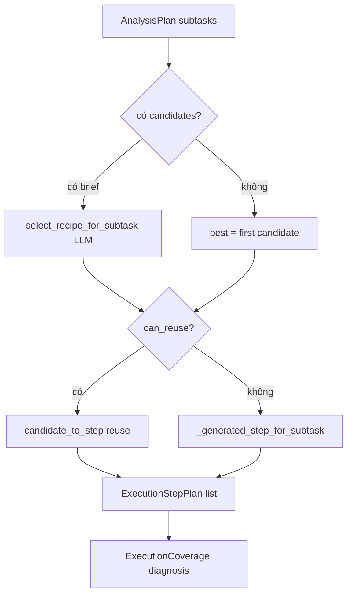

---

## §AF.1 — `recipe_selector.py` — vai trò LLM trong chọn công thức

*(Tóm tắt từ mã nguồn — đọc khi bổ sung §AB)*

Hàm `select_recipe_for_subtask` nhận brief, subtask, danh sách `RecipeCandidate` đã rank. Gọi `LLMClient` với profile từ `agent_profile` hoặc fallback. Output JSON chọn `tool_id` và params — nếu parse fail hoặc stub mode, trả `(None, resolve_params(...), rationale)`.

`candidate_to_step` copy `script_template` từ registry Mongo, merge params qua `apply_params_to_script`.

Đây là **điểm LLM gần IV nhất** nhưng vẫn chạy trong process pipeline (chat-gateway), không trong container data-analyst.

---

*Tiếp theo: §X.1 bảng data_dictionary, §AD libs/sandbox, §I/W/Y mở rộng — các subagent đang append.*

---

## §Z.2.13 — `packages/project-core/src/project_core/orchestration/clarification_coordinator.py`

**Vai trò:** `ClarificationCoordinator` — điểm vào duy nhất cho chuyển trạng thái clarification giữa STM, Agent I bridge, và pipeline. Không gọi HTTP trực tiếp; delegate `ClarificationBridge` và `apply_clarification_reply`.

**Số dòng mã nguồn:** 83 dòng.

**Người gọi:** `ChatOrchestrator` — `self.clarify = ClarificationCoordinator()`; gọi `on_ingress_clarify`, `on_pipeline_clarify`, `suspend_response`.

### §Z.2.13.0 — Import dòng 1–10

**Dòng 1 `from __future__ import annotations`:** Hoãn evaluate type hints — hỗ trợ forward reference trong method signatures.

**Dòng 3 `from typing import Any`:** Kiểu `dict[str, Any]` cho bridge payload và `clarify_payload` — JSON loose từ Agent I.

**Dòng 5 `ClarificationBridge`:** Lớp domain chuyển transcript + ClarificationRequest → quyết định `resolve_from_transcript` hoặc exploration; coordinator gọi `from_transcript_heuristic` trong `on_resume_reply`.

**Dòng 6 `apply_clarification_reply`:** Hàm pure merge `ClarificationReply.answers` vào `AnalysisBrief` theo schema câu hỏi trong `ClarificationRequest` — dùng ở `on_bridge_result` và `on_pipeline_clarify`.

**Dòng 7 `AnalysisBrief`:** Brief phân tích — field `exploration_mode`, `user_knowledge_level` bị coordinator set khi không resolve từ transcript.

**Dòng 8 `ClarificationReply`, `ClarificationRequest`:** Contract Pydantic — reply gồm `analysis_id`, `answers` list; request gồm `questions`, `partial_brief`, `evidence_summary`.

**Dòng 9 `ChatResponse`, `PipelineResult`:** `suspend_response` build `ChatResponse`; `on_pipeline_clarify` nhận `PipelineResult` có `needs_clarification`.

**Dòng 10 `SessionBundle`, `TranscriptTurn`:** `on_ingress_clarify` đọc `bundle.workflow`, `bundle.clarification`; `on_resume_reply` append `TranscriptTurn`.

### §Z.2.13.1 — Docstring lớp (dòng 13–14)

`"""Single entry point for clarification state transitions."""` — tài liệu ý định: mọi logic clarify tập trung đây thay vì rải trong orchestrator (orchestrator vẫn có duplicate logic trong `_resume_from_pending_clarification` — coordinator là abstraction tái sử dụng cho pipeline clarify path).

### §Z.2.13.2 — `__init__(self, bridge: ClarificationBridge | None = None)` (dòng 16–17)

**Tham số:** `bridge` tùy chọn — test inject mock; production `None` → `ClarificationBridge()` mới mỗi coordinator instance.

**Gán:** `self.bridge = bridge or ClarificationBridge()` — không share bridge singleton giữa request.

**Side effect:** Không I/O.

### §Z.2.13.3 — `on_ingress_clarify(self, bundle: SessionBundle) -> bool` (dòng 19–21)

**Mục đích:** Kiểm tra có nên xử lý tin nhắn chat như **resume clarification** thay vì ingress mới.

**Logic:**
- `wf = bundle.workflow`
- Return `bool(wf and wf.status.value == "awaiting_clarification" and bundle.clarification)`

**Điều kiện đồng thời:**
1. Workflow tồn tại.
2. Status string `"awaiting_clarification"` — so sánh `.value` enum WorkflowStatus.
3. `bundle.clarification` truthy — dict request đang pending trong STM.

**Return True:** Orchestrator gọi `_resume_from_pending_clarification` thay vì append transcript + invoke ingress.

**Return False:** Luồng chat bình thường — tin nhắn mới là user turn trong phân tích hoặc chitchat.

**Edge:** `clarification` có nhưng status IDLE — False, có thể gây clarify orphan. Status awaiting nhưng clarification None — False, user message đi ingress (có thể tạo analysis mới).

### §Z.2.13.4 — `on_resume_reply(...)` (dòng 23–33)

**Chữ ký keyword-only:**
- `request: ClarificationRequest`
- `transcript: list[TranscriptTurn]`
- `user_message: str`

**Mục đích:** Helper gộp transcript + tin nhắn resume thành bridge input — **hiện orchestrator không gọi method này trực tiếp** trong mã đã đọc; logic tương tự nằm trong `_resume_from_pending_clarification` invoke Agent I. Method public cho tái sử dụng/test.

**Dòng 30–32:** `extended = transcript + [TranscriptTurn(id="resume", role="user", content=user_message, at="now")]`

**Lưu ý:** `at="now"` literal — không ISO timestamp thật; heuristic bridge có thể không phụ thuộc thời gian.

**Dòng 33:** `return self.bridge.from_transcript_heuristic(request, extended).model_dump()` — dict action/answers cho caller.

### §Z.2.13.5 — `on_bridge_result(...)` (dòng 35–48)

**Tham số keyword-only:**
- `request: ClarificationRequest`
- `brief: AnalysisBrief`
- `bridge: dict[str, Any]` — output Agent I mode clarification_bridge
- `analysis_id: str`

**Nhánh `bridge.get("action") == "resolve_from_transcript"` (dòng 43–45):**
- Tạo `ClarificationReply(analysis_id=analysis_id, answers=bridge.get("answers") or [])`
- `return apply_clarification_reply(brief, reply, request)` — brief đã merge answers

**Nhánh else (dòng 46–48):**
- `brief.exploration_mode = True`
- `brief.user_knowledge_level = "unknown"`
- `return brief` — không apply answers; pipeline sẽ exploration / không hỏi clarify strict

**Edge:** `answers` rỗng với action resolve — `apply_clarification_reply` behavior tùy resolver (có thể không đổi brief).

### §Z.2.13.6 — `on_pipeline_clarify(...)` (dòng 50–63)

**Docstring:** `Returns updated brief and whether pipeline should re-run immediately.`

**Tham số:** `result: PipelineResult`, `brief`, `bridge` optional, `analysis_id`.

**Dòng 59:** `assert result.needs_clarification is not None` — caller phải đảm bảo; vi phạm → AssertionError dev.

**Nhánh bridge resolve (dòng 60–62):**
- `ClarificationReply` từ bridge answers
- `return apply_clarification_reply(brief, reply, result.needs_clarification), True` — **should_rerun True** → orchestrator gọi lại `_run_pipeline_and_respond` ngay không hỏi user

**Nhánh mặc định (dòng 63):** `return brief, False` — cần suspend UI clarify.

**Khác `on_bridge_result`:** Dùng `result.needs_clarification` thay vì `request` tham số — đồng bộ với pipeline vừa trả.

### §Z.2.13.7 — `suspend_response(...)` (dòng 65–82)

**Tham số keyword-only:**
- `session_id`, `analysis_id`
- `request: ClarificationRequest`
- `clarify_payload: dict` — output Agent I mode `clarify` (user_message)
- `workflow_status: str` — thường `AWAITING_CLARIFICATION`

**Dòng 74:** `msg = request.evidence_summary or clarify_payload.get("user_message", "")` — ưu tiên evidence từ request pipeline/II.

**Dòng 75–82:** Build `ChatResponse`:
- `outcome="needs_clarification"`
- `message=msg or clarify_payload.get("user_message", "")` — double fallback user_message
- `clarification=request` — object đầy đủ cho client render form

**Orchestrator:** `.model_copy(update={trace_id, outcome, bridge_action: ask_user})` sau khi gọi.

### §Z.2.13.8 — Bảng phương thức tổng hợp ClarificationCoordinator

| Method | Input chính | Output | Orchestrator gọi khi |
|--------|-------------|--------|----------------------|
| on_ingress_clarify | SessionBundle | bool | đầu handle_chat |
| on_resume_reply | request, transcript, message | dict bridge | (optional / test) |
| on_bridge_result | request, brief, bridge | AnalysisBrief | (có thể inline orchestrator) |
| on_pipeline_clarify | PipelineResult, bridge | tuple brief, bool | _handle_clarification_needed |
| suspend_response | session, request, clarify | ChatResponse | sau invoke clarify I |

---

## §Z.2.14 — `packages/project-core/src/project_core/orchestration/cancellation.py`

**Vai trò:** Hủy pipeline/workflow — token in-memory và helper đánh dấu workflow CANCELLED. File ngắn (20 dòng) — không tích hợp đầy đủ vào `SupermarketAnalysisPipeline.run()` trong mã đã đọc (pipeline check deadline, không poll CancellationToken).

**Số dòng:** 20.

### §Z.2.14.0 — Import dòng 1–3

**Dòng 1 annotations future.**

**Dòng 3:** `WorkflowState`, `WorkflowStatus` từ `project_core.domain.contracts.workflow` — chỉ `mark_cancelled` dùng.

### §Z.2.14.1 — Lớp `CancellationToken` (dòng 6–15)

**Mục đích:** Flag boolean thread-safe đơn giản (không lock — GIL đủ cho assign bool trong CPython single-threaded async).

**`__init__` (dòng 7–8):** `self._cancelled = False` private.

**`cancel()` (dòng 10–11):** Set `_cancelled = True` — idempotent, gọi nhiều lần vẫn True.

**Property `cancelled` (dòng 13–15):** Read-only public — worker loop có thể poll `if token.cancelled: break`.

**Người dùng tiềm năng:** Future async pipeline, WebSocket cancel, không thấy wire trong orchestrator.py hiện tại.

### §Z.2.14.2 — `mark_cancelled(workflow: WorkflowState) -> None` (dòng 18–19)

**Hành vi:** `workflow.status = WorkflowStatus.CANCELLED` — mutate in-place.

**Không:** Clear brief, steps, hay active_analysis_id.

**Người gọi:** Route/API cancel nếu có — grep codebase ngoài phạm vi task.

**Edge:** Gọi khi workflow None — caller phải guard; hàm không kiểm tra.

### §Z.2.14.3 — Quan hệ deadline vs cancellation

| Cơ chế | File | Hành vi |
|--------|------|---------|
| sync_deadline | pipeline.run | ERROR outcome sync_deadline_exceeded |
| CancellationToken | cancellation.py | Chưa nối pipeline loop |
| mark_cancelled | cancellation.py | Status CANCELLED trên workflow |

---

## §Z.2.15 — `agents/chat-gateway/src/chat_gateway/orchestrator.py`

**Vai trò:** `ChatOrchestrator` — điều phối end-to-end: Redis STM, Mongo RAG (tùy chọn), permissions AUTH DB, invoke Agent I, chạy `SupermarketAnalysisPipeline`, clarify bridge, synthesize, feedback signals.

**Số dòng mã nguồn:** 649 dòng.

**Người gọi:** `chat_gateway.app.get_orchestrator()` — mọi route chat/clarify/status/artifact download.

### §Z.2.15.0 — Import dòng 1–41

**Dòng 1 annotations.**

**Dòng 3 `logging`:** `logger = logging.getLogger(__name__)` — warning Mongo unavailable.

**Dòng 4 `os`:** `MONGODB_CONNECT_TIMEOUT_MS`, `MONGODB_URI`, `ALLOW_DEV_AUTH`.

**Dòng 5 `time`:** `deadline = time.monotonic() + max_sync_seconds` trong `_run_pipeline_and_respond`.

**Dòng 6 `Any`:** permissions snapshot, ingress dict.

**Dòng 7 `uuid4`:** TranscriptTurn id, analysis_id fallback resume.

**Dòng 9 `httpx`:** `Client(timeout=120.0)` shared — đóng trong `close()`.

**Dòng 10 `load_project_config`:** `self.cfg` — pipeline poll, max_sync.

**Dòng 11–13 access:** `build_permissions_snapshot`, `claims_from_user_dict`, `ContextPolicy`.

**Dòng 14 budget:** `SessionTraceBudget`, `TraceBudget`.

**Dòng 15 `apply_clarification_reply`:** handle_clarify và resume paths.

**Dòng 16–19 contracts:** AnalysisBrief, ClarificationReply/Request, SatisfactionSignal, ChatResponse.

**Dòng 20 WorkflowStatus.**

**Dòng 21–25 errors:** BudgetExceededError, ClarifyRoundsExceededError, PermissionsUnavailableError.

**Dòng 26–29 feedback:** AnalysisToolRegistry, DomainRuleStore, FeedbackLoop, CaseStudyIndexer, BehavioralSignal.

**Dòng 30 memory:** SessionBundle, TranscriptTurn.

**Dòng 31–32 retrieval/schema:** HybridMongoRetriever, MongoVectorRetriever (import retriever used), SchemaCatalog.

**Dòng 33 workflow helpers:** new_workflow, resume_analysis, start_analysis.

**Dòng 34 `utc_now`:** timestamp ISO transcript.

**Dòng 35 RedisSessionStore.**

**Dòng 36–37 orchestration:** ClarificationCoordinator, SupermarketAnalysisPipeline.

**Dòng 39 chat_gateway clients:** HttpAgentInvoker, HttpSqlGatewayClient.

### §Z.2.15.1 — Hằng số `_NEGATIVE_OUTCOMES` (dòng 43)

`frozenset({"error", "impossible", "policy_blocked", "partial"})` — dùng `_maybe_emit_re_ask_signal`: nếu `last_outcome` trong set và user message giống intent cũ → behavioral signal re_ask weight 0.4.

### §Z.2.15.2 — `__init__(self)` (dòng 47–88)

**Dòng 48:** `self.stm = RedisSessionStore()` — load/save session, transcript, workflow, clarification.

**Dòng 49–51:** cfg, ContextPolicy, ClarificationCoordinator.

**Dòng 52:** `httpx.Client(timeout=120.0)` — 120s mỗi agent HTTP call.

**Dòng 53–55:** feedback, registry, domain_rule_store khởi tạo None.

**Dòng 56–80 try Mongo:**
- Import MongoClient, set_registry, EmbeddingClient lazy.
- `mongo_timeout` từ env default 2000ms.
- `MongoClient(MONGODB_URI default localhost:18217/supermarket_agent)`.
- `admin.command("ping")` — fail → except.
- `CaseStudyIndexer(db["case_studies"])`.
- `_embed_text` closure EmbeddingClient embed.
- `HybridMongoRetriever(db)`.
- `AnalysisToolRegistry(db["analysis_tools"], embed_fn)`.
- `set_registry(registry)` — global recipe runtime.
- `DomainRuleStore(db["domain_rules"])`.
- `FeedbackLoop(indexer, retriever, embed_fn)`.

**Dòng 79–80 except:** Log warning `Mongo/RAG unavailable` — service vẫn chạy không RAG.

**Dòng 81–88 pipeline:**
```python
SupermarketAnalysisPipeline(
    agent_invoker=HttpAgentInvoker(client=self._http),
    sql_gateway=HttpSqlGatewayClient(client=self._http),
    catalog=SchemaCatalog.from_dictionary_dir(),
    feedback_loop=self.feedback,
    analysis_tool_registry=self.analysis_tool_registry,
    domain_rule_store=self.domain_rule_store,
)
```

### §Z.2.15.3 — `close(self)` (dòng 90–95)

Đóng `self._http`; duck `close()` trên agent_invoker và sql_gateway nếu có — tránh leak socket khi shutdown app.

### §Z.2.15.4 — `handle_chat` (dòng 97–174)

**Chữ ký:** `handle_chat(*, session_id, message, user: dict) -> ChatResponse`

**Dòng 98:** `claims_from_user_dict(user)` → actor_id, role, store_ids.

**Dòng 99–101:** Load bundle; nếu workflow None → `new_workflow(session_id, actor_id)`.

**Dòng 103–109:** `clarify.on_ingress_clarify(bundle)` → `_resume_from_pending_clarification` early return.

**Dòng 111:** `_maybe_emit_re_ask_signal` — trước append user turn.

**Dòng 113–115:** Append TranscriptTurn user, save transcript STM.

**Dòng 117:** New `HttpAgentInvoker(client=self._http)` per request — **khác** pipeline invoker instance nhưng cùng httpx client.

**Dòng 118:** `_session_budget(bundle)`.

**Dòng 119–121:** external_sources từ brief workflow nếu có.

**Dòng 123–137 try invoke I ingress:**
- Payload `{"text": message, "external_sources": ...}`
- Metadata mode ingress, session_id, actor_id
- `BudgetExceededError` → ChatResponse error BUDGET_EXCEEDED

**Dòng 139:** `_handle_satisfaction_signal(ingress, bundle)`.

**Dòng 141–154:** `route != "analysis"` → append assistant transcript, return ChatResponse IDLE với user_message ingress.

**Dòng 156–158:** Validate brief từ ingress; preserve external_sources từ workflow brief cũ.

**Dòng 160–164:** `start_analysis(bundle.workflow, reset_clarify=True)` → analysis_id; gán brief; `_build_permissions`; save workflow STM.

**Dòng 166–174:** `_run_pipeline_and_respond(...)`.

### §Z.2.15.5 — `handle_clarify` (dòng 176–210)

Load bundle; nếu không workflow hoặc không clarification → ChatResponse error NO_PENDING_CLARIFICATION.

Validate `ClarificationRequest` từ bundle.clarification.

Brief từ workflow hoặc request.partial_brief.

`apply_clarification_reply(brief, reply, request)`.

`resume_analysis(bundle.workflow)`; save clarification None; save workflow.

Permissions từ snapshot hoặc rebuild từ user claims.

`_run_pipeline_and_respond` với `analysis_id=reply.analysis_id`.

### §Z.2.15.6 — `confirm_domain_rule` (dòng 212–219)

Nếu domain_rule_store None → `{"status": "no_store"}`.

`confirmed` True → `confirm(rule_id, confirmed_by=user["sub"])`.

Else → `reject(rule_id)`.

Return `{"status": "ok"}`.

### §Z.2.15.7 — `attach_external_sources` (dòng 221–234)

Load session; workflow None → new_workflow session unknown actor.

Brief từ workflow hoặc empty AnalysisBrief.

Lazy import ExternalSource; dedupe by file_id; append; save workflow.

### §Z.2.15.8 — `analysis_status` (dòng 236–249)

`stm.find_by_analysis_id` — not found → status not_found.

Else dict: analysis_id, session_id, status.value, last_outcome, progress_step, active_analysis_id, clarify_round str.

### §Z.2.15.9 — `record_artifact_download` (dòng 251–262)

Nếu không feedback return. `on_behavioral_signal` download weight 0.3.

### §Z.2.15.10 — `_build_permissions` (dòng 264–288)

Try `load_effective_permissions(actor_id)` từ chat_gateway.auth_store.

Except log warning → perm_set None.

Nếu perm_set: `build_permissions_snapshot(..., permission_set=perm_set, all_tables=pipeline.catalog.logical_table_names())`.

Else ALLOW_DEV_AUTH=1 → yaml snapshot without DB.

Else raise PermissionsUnavailableError — app handler 403.

### §Z.2.15.11 — `_session_budget` (dòng 290–295)

Đọc `bundle.workflow.budget_spent` dict; merge vào TraceBudget default; wrap SessionTraceBudget.

### §Z.2.15.12 — `_invoke_agent_i` (dòng 297–321)

`budget.record("I")`.

Meta merge metadata + session_bundle: session_id, actor_id, transcript dumps, workflow_summary từ context_policy.build_request_context("I", ...).

`invoker.invoke("I", payload, meta)`.

Pop usage_tokens charge vào trace_budget.

Return dict ingress/bridge/clarify/synthesize.

### §Z.2.15.13 — `_handle_satisfaction_signal` (dòng 323–337)

Nếu không raw hoặc không feedback return.

Cần last_completed_trace_id từ workflow.

Build SatisfactionSignal → feedback.on_satisfaction_signal.

### §Z.2.15.14 — `_maybe_emit_re_ask_signal` (dòng 339–357)

Cần workflow, feedback, last_outcome in _NEGATIVE_OUTCOMES, last_completed_trace_id.

So sánh 40 ký tự đầu message lower với 80 ký tự intent lower — substring match → re_ask signal weight 0.4.

### §Z.2.15.15 — `_resume_from_pending_clarification` (dòng 359–422)

Invoker + session_budget mới.

Validate clarification request từ bundle.

Invoke I mode clarification_bridge với clarification_request dump và transcript + user message mới.

BudgetExceeded → error response.

Brief từ workflow hoặc partial_brief.

analysis_id từ active hoặc uuid4.

Bridge resolve → apply_clarification_reply; else exploration_mode + unknown knowledge.

resume_analysis; clear clarification STM; save workflow.

_run_pipeline_and_respond.

### §Z.2.15.16 — `_run_pipeline_and_respond` (dòng 424–543)

**on_progress:** lambda save workflow STM nếu poll_enabled.

**deadline:** monotonic + max_sync_seconds.

**try pipeline.run** với brief, workflow, permissions, trace_budget, on_progress, deadline.

**ClarifyRoundsExceededError:** set exploration_mode; save; retry run once; second exceed → STALE error CLARIFY_ROUNDS_EXCEEDED.

**BudgetExceededError:** save budget_spent; error BUDGET_EXCEEDED.

**needs_clarification:** `_handle_clarification_needed`.

**Else invoke I synthesize** với technical_summary dump.

Budget exceed synthesize → error với trace_id partial info.

Append assistant transcript; save; ChatResponse với artifacts URLs list dict.

### §Z.2.15.17 — `_handle_clarification_needed` (dòng 545–648)

Assert needs_clarification.

Invoke I clarification_bridge với request dump + transcript.

Budget exceed → awaiting clarification error.

Nếu bridge resolve_from_transcript: clarify.on_pipeline_clarify → should_rerun recursive _run_pipeline_and_respond.

Invoke I mode clarify cho user_message.

Save clarification request STM; save workflow budget.

clarify.suspend_response với model_copy trace_id, outcome, bridge_action ask_user.

### §Z.2.15.18 — Sơ đồ orchestrator tổng thể

```
handle_chat
  ├─ ingress clarify pending? → resume bridge → pipeline
  ├─ append transcript
  ├─ invoke I ingress
  ├─ chitchat? → return
  └─ start_analysis → pipeline → clarify? / synthesize → ChatResponse

handle_clarify
  └─ apply reply → resume → pipeline → ...

_run_pipeline_and_respond
  ├─ pipeline.run
  ├─ clarify → bridge → rerun or suspend
  └─ synthesize I → ChatResponse
```

### §Z.2.15.19 — Ma trận exception orchestrator

| Exception | Nơi bắt | ChatResponse / hành vi |
|-----------|---------|------------------------|
| BudgetExceededError | invoke I, pipeline | error BUDGET_EXCEEDED |
| ClarifyRoundsExceededError | pipeline.run | exploration retry hoặc STALE |
| PermissionsUnavailableError | _build_permissions | propagate → app 403 |

### §Z.2.15.20 — Phân tích dòng-by-dòng `_run_pipeline_and_respond` 435–447

**435 def on_progress:** Closure capture session_id, self.stm — mỗi progress pipeline ghi workflow Redis realtime poll UI.

**438 deadline:** Cùng max_sync_seconds config — pipeline internal deadline align orchestrator.

**440–447 pipeline.run:** Truyền bundle.workflow mutable — pipeline đổi status/steps trong object same reference.

### §Z.2.15.21 — Phân tích dòng-by-dòng `_handle_clarification_needed` 557–605

**557 assert:** Dev guard — production luôn có needs_clarification khi gọi.

**559–571 bridge invoke:** Không payload message — metadata chứa clarification_request + transcript đầy đủ.

**585–605 on_pipeline_clarify rerun:** Tránh hỏi user nếu transcript đã đủ — UX seamless.

**607–631 clarify invoke:** Sinh user_message hiển thị form.

**634–647 suspend:** Lưu clarification dict STM cho handle_clarify POST sau.

*Hết §Z.2.13–§Z.2.15 — clarification_coordinator, cancellation, orchestrator.*

### §Z.2.15.22 — Bổ sung kiểm thử và vận hành orchestrator

Khi debug `handle_chat` treo 120 giây: kiểm `httpx` timeout và agent II/IV đang chạy; `on_progress` chỉ ghi Redis khi `poll_enabled` true trong config.

Khi `PermissionsUnavailableError`: xác nhận AUTH DB DSN và user active trước khi sửa orchestrator — lỗi không nằm trong `pipeline.py`.

Khi clarify loop: theo dõi `workflow.clarify_round` và `max_clarify_rounds` trong config; `ClarifyRoundsExceededError` kích hoạt exploration_mode retry một lần.

`close()` nên gọi khi shutdown uvicorn worker — tránh ResourceWarning socket đóng chậm trên Windows.

Tích hợp `CancellationToken` chưa có trong `orchestrator.py` — hủy request HTTP giữa chừng cần feature bổ sung ngoài `cancellation.py`.

---

## §X.2 — Bảng STRANS (logical, db1 shard + db2 live)

### §X.2.1 — Vai trò nghiệp vụ

STRANS là **chi tiết dòng bán** trên chứng từ: mỗi SKU trên bill có một hoặc nhiều dòng với QTY, AMOUNT, chiết khấu, VAT, quà tặng. Đây là bảng được hỏi nhiều nhất cho câu “doanh thu theo sản phẩm / cửa hàng / ngày”.

### §X.2.2 — Phân tách db1 vs db2

| Nguồn | Phạm vi thời gian | Tên vật lý |
|-------|-------------------|------------|
| db2 | ~2 tháng gần (cutoff ngày 1 tháng trước) | `STRANS` |
| db1 | Lịch sử trước cutoff | `STRANS_YYYYMM` shard |

Agent II nhận `shard_plan` từ `suggest_query_plan` — gợi ý chọn db và shard. PolicyEngine kiểm tra tên bảng vật lý nằm trong allowed_tables.

### §X.2.3 — Khóa join

`TRANS_NUM` + `TRANS_CODE` + `TRAN_DATE` liên kết TRANSHDR (header) và PMTRANS (thanh toán). Pipeline **không** join SQL cross-db; nếu brief cần cả header và detail, II phát nhiều query hoặc IV merge parquet.

### §X.2.4 — Cột metrics thường dùng

- `AMOUNT`: thành tiền dòng — metric mặc định trong `_generated_step_for_subtask`.
- `QTY`: số lượng bán.
- `STK_ID`: lọc cửa hàng — `store_filter_required` inject điều kiện WHERE cho store_manager.
- `SKU_ID` / `CARD_ID`: VIP và loyalty — prefix thẻ A/E/F/H phân hạng.

### §X.2.5 — TRANS_CODE

Mã loại chứng từ (113 bán lẻ, …) định nghĩa trong `domain_definitions`. SQL planner phải lọc đúng code để tránh lẫn thanh toán/quỹ.

### §X.2.6 — AMOUNT=0

Ghi chú dictionary: thường là dòng quà/khuyến mãi — IV `exploration_mode` có thể cần loại trừ khi tính doanh thu.

### §X.2.7 — TCVN3

Cột `REMARK` và text SKU có thể TCVN3 — sql-gateway decode khi execute; parquet đã Unicode khi IV đọc.

### §X.2.8 — ACL

`store_manager` có STRANS trong allowed_tables nhưng `denied_columns` có thể chặn giá vốn (không nằm STRANS trực tiếp). HQ analyst thấy full.

### §X.2.9 — Câu hỏi mẫu map pipeline

“Doanh thu tháng này cửa 10001” → brief time_range + filters STK_ID → II query db2 STRANS → IV groupby AMOUNT.

“So sánh cùng kỳ năm ngoái” → có thể cần db1 shard nhiều tháng + db2 — **hai target_dbs**, IV merge.

### §X.2.10 — Probe IV

Khi empty result + product_code, IV gợi ý probe SKU_DEF/BARCODE — không query STRANS trực tiếp trong probe SQL template.

---

## §X.3 — Bảng PMTRANS

### §X.3.1 — Vai trò

Dòng **thanh toán**: tiền mặt, thẻ, voucher (PMT_CODE: CASH, CARD, BANK, OWNCP). TRANS_CODE 221 gắn bill bán; 008 thu/chi quỹ.

### §X.3.2 — Liên kết STRANS

Cùng `TRANS_NUM`, `TRANS_CODE`, `TRAN_DATE` — phân tích “tỷ lệ thanh toán thẻ” join pandas sau khi có hai parquet.

### §X.3.3 — Cột quan trọng

`PMT_CODE`, `AMOUNT`, `CARD_ID`, `CUST_ID`, `STK_ID`, `ROUNDIFF` (làm tròn).

### §X.3.4 — Temporal

Giống STRANS: db2 recent, db1 `PMTRANS_YYYYMM` shards trong shards.yaml.

### §X.3.5 — Agent usage

II chọn PMTRANS khi intent nhắc thanh toán, không phải doanh thu SKU. III kiểm tra scan nếu thiếu filter STK_ID.

### §X.3.6 — Chart IV

Nếu output_format có chart và query chỉ PMTRANS, `plot_chart` lấy 2 cột đầu — có thể không phù hợp semantics; limitation runtime IV.

---

## §X.4 — Bảng CUSTOMER (master db2)

### §X.4.1 — Master data

Không shard, không cutoff — luôn query db2. 73 cột thông tin B2B/B2C.

### §X.4.2 — PII và ACL

`PERSON_ID`, email, phone — `denied_columns` role store_manager có thể chặn cột nhạy cảm từ `sensitive_columns.md` mirror.

### §X.4.3 — Join pattern

`CUST_ID` từ PMTRANS → CUSTOMER cho tên khách. Join trên pandas trong IV sau execute.

### §X.4.4 — VIP

`CARD_ID` trên CUSTOMER liên kết loyalty — brief VIP thường filter CARD prefix trên STRANS/PMTRANS thay vì CUSTOMER.

---

## §X.5 — Sharding db1 (`data_dictionary/db1/shards.yaml`)

### §X.5.1 — Quy tắc chọn shard

`shard_key_column: TRAN_DATE` → `STRANS_202504` cho giao dịch tháng 4/2025.

### §X.5.2 — Shard range

STRANS: 202312–202604 (29 bảng). PMTRANS: 202401–202604 (28 bảng). Catalog load list vào SchemaCatalog — policy validate tên bảng cụ thể.

### §X.5.3 — Archive tables

`CRDTRANS_ARC`, `TRANSHDR_ARC` không shard theo tháng — một bảng archive.

### §X.5.4 — suggest_query_plan

Đọc brief time_range, đề xuất logical_table + db + danh sách shard — **advisory** cho LLM II, không auto-rewrite SQL.

---

## §T.2 — python-sandbox `tools_impl.py` (chi tiết hàm)

### §T.2.1 — Hằng số an toàn

`SANDBOX_MAX_ROWS` (200000): cắt dataframe khi load. `SANDBOX_MAX_SECONDS` (30): timeout subprocess. `ARTIFACTS_DIR`: root cho `_guard_output_dir`.

### §T.2.2 — `_guard_output_dir`

Chỉ cho phép ghi dưới `data/artifacts` — chặn path traversal ra ngoài volume.

### §T.2.3 — `load_dataset` / `preview_dataframe`

Đọc parquet/csv, trả columns, row_count, preview 20 dòng. IV gọi preview trước khi chạy script nặng.

### §T.2.4 — `run_analysis_script`

1. Optional `tool_grants` re-check (MCP surface).
2. Spawn `runner_child.py` với stdin = script string.
3. Child nhận dataset path + out dir qua argv.
4. `child_env = os.environ.copy()` — **kế thừa full env** (rủi ro nếu script thoát sandbox).
5. Parse JSON stdout hoặc glob artifacts trong out.

### §T.2.5 — `export_excel`

Có trong sandbox nhưng **iv_analyzer không gọi** — gap tính năng nếu user yêu cầu Excel.

### §T.2.6 — `plot_chart`

Line plot matplotlib Agg — cột x,y do IV chọn (2 cột đầu dataframe).

### §T.2.7 — `run_recipe_tool`

Gọi recipe đã promote theo tool_id — pipeline thường dùng `run_analysis_script` với template thay vì tool này trực tiếp.

### §T.2.8 — `merge_datasets`

Join SQL path với external upload — dùng khi user attach file.

---

## §AG.1 — Luồng end-to-end một câu hỏi (activity diagram đầy đủ)

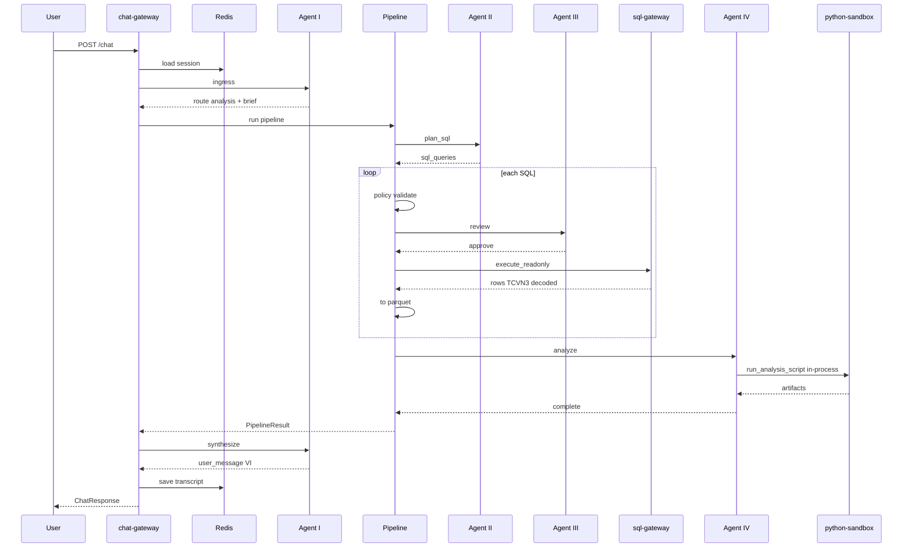

---

## §AG.2 — Checklist vận hành prod

1. Copy `.env.example` → `.env`, điền DSN, JWT_SECRET, INTERNAL_SERVICE_TOKEN, OPENROUTER_API_KEY.
2. Chạy `deploy/sql/auth/init_all.sql` trên SQL Server.
3. `uv run python scripts/seed_auth.py` với AUTH_SEED passwords.
4. `docker compose --profile docker-bases build` rồi `docker compose build`.
5. `docker compose -f docker-compose.yaml -f docker-compose.prod.yaml up -d`.
6. Trỏ DNS `PUBLIC_DOMAIN` tới host, mở 80/443.
7. `scripts/index_schema_docs.py` index data_dictionary vào Mongo.
8. Kiểm tra `GET /health` chat-gateway qua Caddy.
9. Login `POST /auth/login`, gọi `POST /chat` với Bearer.
10. Xem audit `data/state/audit.jsonl` trên volume supermarket-state.

---

*Các mục §X.1 (toàn bộ bảng), §AD (libs), §I/W/Y mở rộng đang được append bởi batch tiếp theo.*

Ghi chú đếm dòng: phần §Z.2.6–§Z.2.15 bổ sung từ mã nguồn `project_core/orchestration/*` và `chat_gateway/orchestrator.py` — không trích `docs/*.md` khác.

Kết thúc phụ lục orchestration pipeline cho bốn tệp yêu cầu trong phiên ghi này.


## §AH.1 — Toàn bộ contracts Pydantic

Phụ lục này liệt kê **mọi** model Pydantic (và StrEnum contract) trong gói
`packages/project-core/src/project_core/domain/contracts/`. Nội dung được suy ra trực tiếp từ mã nguồn
Python, **không** trích dẫn từ tài liệu `docs/*.md` khác.

### Phạm vi và quy ước

| Quy ước | Mô tả |
|---------|-------|
| **Producer** | Thành phần gán/ghi giá trị lần đầu hoặc cập nhật |
| **Consumer** | Thành phần đọc/validate/phản hồi dựa trên trường |
| **Validation** | Ràng buộc Pydantic v2 + validator tùy chỉnh (nếu có) |
| **JSON** | Ví dụ `model_dump()` / payload HTTP; datetime → ISO-8601 |

Module `parse.py` chứa hàm `parse_agent_response(agent, raw)` — không phải model — dùng để
`model_validate` output Agent II → `SqlPlannerResponse`, III → `RiskReviewResponse`, IV → `AnalystResponse`.
Lỗi validation ném `ContractInvalidError`.

```python
AgentKey = Literal["II", "III", "IV"]
```

### Sơ đồ phụ thuộc giữa các contract

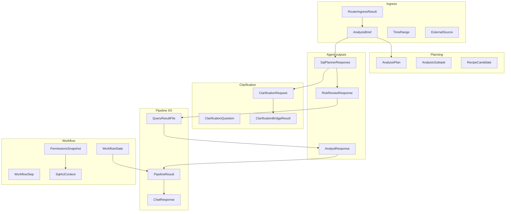

**Tổng số class/enum documented:** 48

---

## §AH.1.1 — Module `brief.py`

### TimeRange

**Tệp nguồn:** `packages/project-core/src/project_core/domain/contracts/brief.py`

**Mục đích:** Khoảng thời gian phân tích
**Producer:** Agent I ingress brief; user filters
**Consumer:** AnalysisBrief; IntentSlice; decomposer payload

**Số trường:** 3

**Ví dụ JSON đầy đủ (minh họa):**
```json
{
  "start": "example_start",
  "end": "example_end",
  "grain": "example_grain"
}
```

#### Chi tiết từng trường

#### Trường `start` (#1)

| Thuộc tính | Giá trị |
|------------|---------|
| **Kiểu** | `str | None` |
| **Mặc định** | `None` |
| **Validation** | Trường optional; có thể null trong JSON; Mặc định: None |
| **Producer** | Agent I ingress brief; user filters |
| **Consumer** | AnalysisBrief; IntentSlice; decomposer payload |

**Ý nghĩa vận hành:** Trường `start` trên model `TimeRange` thuộc module `brief.py`, được serialize qua `model_dump()` / `model_dump_json()` khi vượt ranh giới agent HTTP hoặc STM JSON.

**Ví dụ JSON (fragment):**
```json
"start": null
```

**Ghi chú tích hợp:** Khi pipeline truyền `TimeRange` giữa Agent II/III/IV, trường `start` phải giữ nguyên kiểu để `parse_agent_response` và `model_validate` không raise `ContractInvalidError`.

#### Trường `end` (#2)

| Thuộc tính | Giá trị |
|------------|---------|
| **Kiểu** | `str | None` |
| **Mặc định** | `None` |
| **Validation** | Trường optional; có thể null trong JSON; Mặc định: None |
| **Producer** | Agent I ingress brief; user filters |
| **Consumer** | AnalysisBrief; IntentSlice; decomposer payload |

**Ý nghĩa vận hành:** Trường `end` trên model `TimeRange` thuộc module `brief.py`, được serialize qua `model_dump()` / `model_dump_json()` khi vượt ranh giới agent HTTP hoặc STM JSON.

**Ví dụ JSON (fragment):**
```json
"end": null
```

**Ghi chú tích hợp:** Khi pipeline truyền `TimeRange` giữa Agent II/III/IV, trường `end` phải giữ nguyên kiểu để `parse_agent_response` và `model_validate` không raise `ContractInvalidError`.

#### Trường `grain` (#3)

| Thuộc tính | Giá trị |
|------------|---------|
| **Kiểu** | `str | None` |
| **Mặc định** | `None` |
| **Validation** | Trường optional; có thể null trong JSON; Mặc định: None |
| **Producer** | Agent I ingress brief; user filters |
| **Consumer** | AnalysisBrief; IntentSlice; decomposer payload |

**Ý nghĩa vận hành:** Trường `grain` trên model `TimeRange` thuộc module `brief.py`, được serialize qua `model_dump()` / `model_dump_json()` khi vượt ranh giới agent HTTP hoặc STM JSON.

**Ví dụ JSON (fragment):**
```json
"grain": null
```

**Ghi chú tích hợp:** Khi pipeline truyền `TimeRange` giữa Agent II/III/IV, trường `grain` phải giữ nguyên kiểu để `parse_agent_response` và `model_validate` không raise `ContractInvalidError`.

**Round-trip:** ` TimeRange.model_validate(TimeRange().model_dump()) ` phải giữ schema (unit test `test_contracts.py` nếu có).

---

### AnalysisBrief

**Tệp nguồn:** `packages/project-core/src/project_core/domain/contracts/brief.py`

**Mục đích:** Hợp đồng ý định phân tích trung tâm
**Producer:** Conversational Router Agent I; merge clarify; apply_data_feedback
**Consumer:** Toàn pipeline II→IV; WorkflowState.brief

**Số trường:** 12

**Ví dụ JSON đầy đủ (minh họa):**
```json
{
  "intent": "Doanh thu theo cửa hàng tháng 3",
  "metrics": [
    "revenue"
  ],
  "dimensions": [
    "store_id"
  ],
  "filters": {
    "region": "north"
  },
  "time_range": {
    "start": "2025-03-01",
    "end": "2025-03-31",
    "grain": "day"
  },
  "output_format": [
    "table",
    "chart"
  ],
  "exploration_mode": false,
  "user_knowledge_level": "expert"
}
```

#### Chi tiết từng trường

#### Trường `intent` (#1)

| Thuộc tính | Giá trị |
|------------|---------|
| **Kiểu** | `str` |
| **Mặc định** | `''` |
| **Validation** | Mặc định: '' |
| **Producer** | Conversational Router Agent I; merge clarify; apply_data_feedback |
| **Consumer** | Toàn pipeline II→IV; WorkflowState.brief |

**Ý nghĩa vận hành:** Trường `intent` trên model `AnalysisBrief` thuộc module `brief.py`, được serialize qua `model_dump()` / `model_dump_json()` khi vượt ranh giới agent HTTP hoặc STM JSON.

**Ví dụ JSON (fragment):**
```json
"intent": "<intent>"
```

**Ghi chú tích hợp:** Khi pipeline truyền `AnalysisBrief` giữa Agent II/III/IV, trường `intent` phải giữ nguyên kiểu để `parse_agent_response` và `model_validate` không raise `ContractInvalidError`.

#### Trường `metrics` (#2)

| Thuộc tính | Giá trị |
|------------|---------|
| **Kiểu** | `list[str]` |
| **Mặc định** | `Field(default_factory=list)` |
| **Validation** | Mặc định factory (list/dict rỗng hoặc datetime.utcnow) |
| **Producer** | Conversational Router Agent I; merge clarify; apply_data_feedback |
| **Consumer** | Toàn pipeline II→IV; WorkflowState.brief |

**Ý nghĩa vận hành:** Trường `metrics` trên model `AnalysisBrief` thuộc module `brief.py`, được serialize qua `model_dump()` / `model_dump_json()` khi vượt ranh giới agent HTTP hoặc STM JSON.

**Ví dụ JSON (fragment):**
```json
"metrics": []
```

**Ghi chú tích hợp:** Khi pipeline truyền `AnalysisBrief` giữa Agent II/III/IV, trường `metrics` phải giữ nguyên kiểu để `parse_agent_response` và `model_validate` không raise `ContractInvalidError`.

#### Trường `dimensions` (#3)

| Thuộc tính | Giá trị |
|------------|---------|
| **Kiểu** | `list[str]` |
| **Mặc định** | `Field(default_factory=list)` |
| **Validation** | Mặc định factory (list/dict rỗng hoặc datetime.utcnow) |
| **Producer** | Conversational Router Agent I; merge clarify; apply_data_feedback |
| **Consumer** | Toàn pipeline II→IV; WorkflowState.brief |

**Ý nghĩa vận hành:** Trường `dimensions` trên model `AnalysisBrief` thuộc module `brief.py`, được serialize qua `model_dump()` / `model_dump_json()` khi vượt ranh giới agent HTTP hoặc STM JSON.

**Ví dụ JSON (fragment):**
```json
"dimensions": []
```

**Ghi chú tích hợp:** Khi pipeline truyền `AnalysisBrief` giữa Agent II/III/IV, trường `dimensions` phải giữ nguyên kiểu để `parse_agent_response` và `model_validate` không raise `ContractInvalidError`.

#### Trường `filters` (#4)

| Thuộc tính | Giá trị |
|------------|---------|
| **Kiểu** | `dict[str, Any]` |
| **Mặc định** | `Field(default_factory=dict)` |
| **Validation** | Mặc định factory (list/dict rỗng hoặc datetime.utcnow) |
| **Producer** | Conversational Router Agent I; merge clarify; apply_data_feedback |
| **Consumer** | Toàn pipeline II→IV; WorkflowState.brief |

**Ý nghĩa vận hành:** Trường `filters` trên model `AnalysisBrief` thuộc module `brief.py`, được serialize qua `model_dump()` / `model_dump_json()` khi vượt ranh giới agent HTTP hoặc STM JSON.

**Ví dụ JSON (fragment):**
```json
"filters": {}
```

**Ghi chú tích hợp:** Khi pipeline truyền `AnalysisBrief` giữa Agent II/III/IV, trường `filters` phải giữ nguyên kiểu để `parse_agent_response` và `model_validate` không raise `ContractInvalidError`.

#### Trường `time_range` (#5)

| Thuộc tính | Giá trị |
|------------|---------|
| **Kiểu** | `TimeRange` |
| **Mặc định** | `Field(default_factory=TimeRange)` |
| **Validation** | Mặc định factory (list/dict rỗng hoặc datetime.utcnow) |
| **Producer** | Conversational Router Agent I; merge clarify; apply_data_feedback |
| **Consumer** | Toàn pipeline II→IV; WorkflowState.brief |

**Ý nghĩa vận hành:** Trường `time_range` trên model `AnalysisBrief` thuộc module `brief.py`, được serialize qua `model_dump()` / `model_dump_json()` khi vượt ranh giới agent HTTP hoặc STM JSON.

**Ví dụ JSON (fragment):**
```json
"time_range": "<time_range>"
```

**Ghi chú tích hợp:** Khi pipeline truyền `AnalysisBrief` giữa Agent II/III/IV, trường `time_range` phải giữ nguyên kiểu để `parse_agent_response` và `model_validate` không raise `ContractInvalidError`.

#### Trường `output_format` (#6)

| Thuộc tính | Giá trị |
|------------|---------|
| **Kiểu** | `list[str]` |
| **Mặc định** | `Field(default_factory=list)` |
| **Validation** | Mặc định factory (list/dict rỗng hoặc datetime.utcnow) |
| **Producer** | Conversational Router Agent I; merge clarify; apply_data_feedback |
| **Consumer** | Toàn pipeline II→IV; WorkflowState.brief |

**Ý nghĩa vận hành:** Trường `output_format` trên model `AnalysisBrief` thuộc module `brief.py`, được serialize qua `model_dump()` / `model_dump_json()` khi vượt ranh giới agent HTTP hoặc STM JSON.

**Ví dụ JSON (fragment):**
```json
"output_format": []
```

**Ghi chú tích hợp:** Khi pipeline truyền `AnalysisBrief` giữa Agent II/III/IV, trường `output_format` phải giữ nguyên kiểu để `parse_agent_response` và `model_validate` không raise `ContractInvalidError`.

#### Trường `chart_spec` (#7)

| Thuộc tính | Giá trị |
|------------|---------|
| **Kiểu** | `dict[str, Any] | None` |
| **Mặc định** | `None` |
| **Validation** | Trường optional; có thể null trong JSON; Mặc định: None |
| **Producer** | Conversational Router Agent I; merge clarify; apply_data_feedback |
| **Consumer** | Toàn pipeline II→IV; WorkflowState.brief |

**Ý nghĩa vận hành:** Trường `chart_spec` trên model `AnalysisBrief` thuộc module `brief.py`, được serialize qua `model_dump()` / `model_dump_json()` khi vượt ranh giới agent HTTP hoặc STM JSON.

**Ví dụ JSON (fragment):**
```json
"chart_spec": {}
```

**Ghi chú tích hợp:** Khi pipeline truyền `AnalysisBrief` giữa Agent II/III/IV, trường `chart_spec` phải giữ nguyên kiểu để `parse_agent_response` và `model_validate` không raise `ContractInvalidError`.

#### Trường `exploration_mode` (#8)

| Thuộc tính | Giá trị |
|------------|---------|
| **Kiểu** | `bool` |
| **Mặc định** | `False` |
| **Validation** | Mặc định: False |
| **Producer** | Conversational Router Agent I; merge clarify; apply_data_feedback |
| **Consumer** | Toàn pipeline II→IV; WorkflowState.brief |

**Ý nghĩa vận hành:** Trường `exploration_mode` trên model `AnalysisBrief` thuộc module `brief.py`, được serialize qua `model_dump()` / `model_dump_json()` khi vượt ranh giới agent HTTP hoặc STM JSON.

**Ví dụ JSON (fragment):**
```json
"exploration_mode": false
```

**Ghi chú tích hợp:** Khi pipeline truyền `AnalysisBrief` giữa Agent II/III/IV, trường `exploration_mode` phải giữ nguyên kiểu để `parse_agent_response` và `model_validate` không raise `ContractInvalidError`.

#### Trường `user_knowledge_level` (#9)

| Thuộc tính | Giá trị |
|------------|---------|
| **Kiểu** | `Literal['expert', 'unknown']` |
| **Mặc định** | `'expert'` |
| **Validation** | Chỉ chấp nhận các giá trị literal trong Literal['expert', 'unknown']; Mặc định: 'expert' |
| **Producer** | Conversational Router Agent I; merge clarify; apply_data_feedback |
| **Consumer** | Toàn pipeline II→IV; WorkflowState.brief |

**Ý nghĩa vận hành:** Trường `user_knowledge_level` trên model `AnalysisBrief` thuộc module `brief.py`, được serialize qua `model_dump()` / `model_dump_json()` khi vượt ranh giới agent HTTP hoặc STM JSON.

**Ví dụ JSON (fragment):**
```json
"user_knowledge_level": "<literal>"
```

**Ghi chú tích hợp:** Khi pipeline truyền `AnalysisBrief` giữa Agent II/III/IV, trường `user_knowledge_level` phải giữ nguyên kiểu để `parse_agent_response` và `model_validate` không raise `ContractInvalidError`.

#### Trường `probe_hints` (#10)

| Thuộc tính | Giá trị |
|------------|---------|
| **Kiểu** | `list[str]` |
| **Mặc định** | `Field(default_factory=list)` |
| **Validation** | Mặc định factory (list/dict rỗng hoặc datetime.utcnow) |
| **Producer** | Conversational Router Agent I; merge clarify; apply_data_feedback |
| **Consumer** | Toàn pipeline II→IV; WorkflowState.brief |

**Ý nghĩa vận hành:** Trường `probe_hints` trên model `AnalysisBrief` thuộc module `brief.py`, được serialize qua `model_dump()` / `model_dump_json()` khi vượt ranh giới agent HTTP hoặc STM JSON.

**Ví dụ JSON (fragment):**
```json
"probe_hints": []
```

**Ghi chú tích hợp:** Khi pipeline truyền `AnalysisBrief` giữa Agent II/III/IV, trường `probe_hints` phải giữ nguyên kiểu để `parse_agent_response` và `model_validate` không raise `ContractInvalidError`.

#### Trường `external_sources` (#11)

| Thuộc tính | Giá trị |
|------------|---------|
| **Kiểu** | `list[ExternalSource]` |
| **Mặc định** | `Field(default_factory=list)` |
| **Validation** | Mặc định factory (list/dict rỗng hoặc datetime.utcnow) |
| **Producer** | Conversational Router Agent I; merge clarify; apply_data_feedback |
| **Consumer** | Toàn pipeline II→IV; WorkflowState.brief |

**Ý nghĩa vận hành:** Trường `external_sources` trên model `AnalysisBrief` thuộc module `brief.py`, được serialize qua `model_dump()` / `model_dump_json()` khi vượt ranh giới agent HTTP hoặc STM JSON.

**Ví dụ JSON (fragment):**
```json
"external_sources": []
```

**Ghi chú tích hợp:** Khi pipeline truyền `AnalysisBrief` giữa Agent II/III/IV, trường `external_sources` phải giữ nguyên kiểu để `parse_agent_response` và `model_validate` không raise `ContractInvalidError`.

#### Trường `plan` (#12)

| Thuộc tính | Giá trị |
|------------|---------|
| **Kiểu** | `AnalysisPlan | None` |
| **Mặc định** | `None` |
| **Validation** | Trường optional; có thể null trong JSON; Mặc định: None |
| **Producer** | Conversational Router Agent I; merge clarify; apply_data_feedback |
| **Consumer** | Toàn pipeline II→IV; WorkflowState.brief |

**Ý nghĩa vận hành:** Trường `plan` trên model `AnalysisBrief` thuộc module `brief.py`, được serialize qua `model_dump()` / `model_dump_json()` khi vượt ranh giới agent HTTP hoặc STM JSON.

**Ví dụ JSON (fragment):**
```json
"plan": null
```

**Ghi chú tích hợp:** Khi pipeline truyền `AnalysisBrief` giữa Agent II/III/IV, trường `plan` phải giữ nguyên kiểu để `parse_agent_response` và `model_validate` không raise `ContractInvalidError`.

**Round-trip:** ` AnalysisBrief.model_validate(AnalysisBrief().model_dump()) ` phải giữ schema (unit test `test_contracts.py` nếu có).

---

### IntentSlice

**Tệp nguồn:** `packages/project-core/src/project_core/domain/contracts/brief.py`

**Mục đích:** Projection metrics/dimensions không intent đầy đủ
**Producer:** IntentSlice.from_brief
**Consumer:** context_policy intent-only views; logging

**Số trường:** 5

**Ví dụ JSON đầy đủ (minh họa):**
```json
{
  "metrics": "example_metrics",
  "dimensions": "example_dimensions",
  "filters": "example_filters",
  "time_range": "<TimeRange>",
  "output_format": "example_output_format"
}
```

#### Chi tiết từng trường

#### Trường `metrics` (#1)

| Thuộc tính | Giá trị |
|------------|---------|
| **Kiểu** | `list[str]` |
| **Mặc định** | `Field(default_factory=list)` |
| **Validation** | Mặc định factory (list/dict rỗng hoặc datetime.utcnow) |
| **Producer** | IntentSlice.from_brief |
| **Consumer** | context_policy intent-only views; logging |

**Ý nghĩa vận hành:** Trường `metrics` trên model `IntentSlice` thuộc module `brief.py`, được serialize qua `model_dump()` / `model_dump_json()` khi vượt ranh giới agent HTTP hoặc STM JSON.

**Ví dụ JSON (fragment):**
```json
"metrics": []
```

**Ghi chú tích hợp:** Khi pipeline truyền `IntentSlice` giữa Agent II/III/IV, trường `metrics` phải giữ nguyên kiểu để `parse_agent_response` và `model_validate` không raise `ContractInvalidError`.

#### Trường `dimensions` (#2)

| Thuộc tính | Giá trị |
|------------|---------|
| **Kiểu** | `list[str]` |
| **Mặc định** | `Field(default_factory=list)` |
| **Validation** | Mặc định factory (list/dict rỗng hoặc datetime.utcnow) |
| **Producer** | IntentSlice.from_brief |
| **Consumer** | context_policy intent-only views; logging |

**Ý nghĩa vận hành:** Trường `dimensions` trên model `IntentSlice` thuộc module `brief.py`, được serialize qua `model_dump()` / `model_dump_json()` khi vượt ranh giới agent HTTP hoặc STM JSON.

**Ví dụ JSON (fragment):**
```json
"dimensions": []
```

**Ghi chú tích hợp:** Khi pipeline truyền `IntentSlice` giữa Agent II/III/IV, trường `dimensions` phải giữ nguyên kiểu để `parse_agent_response` và `model_validate` không raise `ContractInvalidError`.

#### Trường `filters` (#3)

| Thuộc tính | Giá trị |
|------------|---------|
| **Kiểu** | `dict[str, Any]` |
| **Mặc định** | `Field(default_factory=dict)` |
| **Validation** | Mặc định factory (list/dict rỗng hoặc datetime.utcnow) |
| **Producer** | IntentSlice.from_brief |
| **Consumer** | context_policy intent-only views; logging |

**Ý nghĩa vận hành:** Trường `filters` trên model `IntentSlice` thuộc module `brief.py`, được serialize qua `model_dump()` / `model_dump_json()` khi vượt ranh giới agent HTTP hoặc STM JSON.

**Ví dụ JSON (fragment):**
```json
"filters": {}
```

**Ghi chú tích hợp:** Khi pipeline truyền `IntentSlice` giữa Agent II/III/IV, trường `filters` phải giữ nguyên kiểu để `parse_agent_response` và `model_validate` không raise `ContractInvalidError`.

#### Trường `time_range` (#4)

| Thuộc tính | Giá trị |
|------------|---------|
| **Kiểu** | `TimeRange` |
| **Mặc định** | `Field(default_factory=TimeRange)` |
| **Validation** | Mặc định factory (list/dict rỗng hoặc datetime.utcnow) |
| **Producer** | IntentSlice.from_brief |
| **Consumer** | context_policy intent-only views; logging |

**Ý nghĩa vận hành:** Trường `time_range` trên model `IntentSlice` thuộc module `brief.py`, được serialize qua `model_dump()` / `model_dump_json()` khi vượt ranh giới agent HTTP hoặc STM JSON.

**Ví dụ JSON (fragment):**
```json
"time_range": "<time_range>"
```

**Ghi chú tích hợp:** Khi pipeline truyền `IntentSlice` giữa Agent II/III/IV, trường `time_range` phải giữ nguyên kiểu để `parse_agent_response` và `model_validate` không raise `ContractInvalidError`.

#### Trường `output_format` (#5)

| Thuộc tính | Giá trị |
|------------|---------|
| **Kiểu** | `list[str]` |
| **Mặc định** | `Field(default_factory=list)` |
| **Validation** | Mặc định factory (list/dict rỗng hoặc datetime.utcnow) |
| **Producer** | IntentSlice.from_brief |
| **Consumer** | context_policy intent-only views; logging |

**Ý nghĩa vận hành:** Trường `output_format` trên model `IntentSlice` thuộc module `brief.py`, được serialize qua `model_dump()` / `model_dump_json()` khi vượt ranh giới agent HTTP hoặc STM JSON.

**Ví dụ JSON (fragment):**
```json
"output_format": []
```

**Ghi chú tích hợp:** Khi pipeline truyền `IntentSlice` giữa Agent II/III/IV, trường `output_format` phải giữ nguyên kiểu để `parse_agent_response` và `model_validate` không raise `ContractInvalidError`.

**Round-trip:** ` IntentSlice.model_validate(IntentSlice().model_dump()) ` phải giữ schema (unit test `test_contracts.py` nếu có).

---

### TechnicalSummary

**Tệp nguồn:** `packages/project-core/src/project_core/domain/contracts/brief.py`

**Mục đích:** Tóm tắt kỹ thuật cho user-facing message
**Producer:** pipeline._finish
**Consumer:** PipelineResult; synthesize Agent I

**Số trường:** 6

**Ví dụ JSON đầy đủ (minh họa):**
```json
{
  "outcome": "example_outcome",
  "headline_metrics": "example_headline_metrics",
  "artifact_urls": "example_artifact_urls",
  "caveats": "example_caveats",
  "empty_reason": "example_empty_reason",
  "coverage": "example_coverage"
}
```

#### Chi tiết từng trường

#### Trường `outcome` (#1)

| Thuộc tính | Giá trị |
|------------|---------|
| **Kiểu** | `str` |
| **Mặc định** | `—` |
| **Validation** | Không có validator tùy chỉnh; pydantic v2 model_validate strict theo annotation |
| **Producer** | pipeline._finish |
| **Consumer** | PipelineResult; synthesize Agent I |

**Ý nghĩa vận hành:** Trường `outcome` trên model `TechnicalSummary` thuộc module `brief.py`, được serialize qua `model_dump()` / `model_dump_json()` khi vượt ranh giới agent HTTP hoặc STM JSON.

**Ví dụ JSON (fragment):**
```json
"outcome": "<outcome>"
```

**Ghi chú tích hợp:** Khi pipeline truyền `TechnicalSummary` giữa Agent II/III/IV, trường `outcome` phải giữ nguyên kiểu để `parse_agent_response` và `model_validate` không raise `ContractInvalidError`.

#### Trường `headline_metrics` (#2)

| Thuộc tính | Giá trị |
|------------|---------|
| **Kiểu** | `dict[str, Any]` |
| **Mặc định** | `Field(default_factory=dict)` |
| **Validation** | Mặc định factory (list/dict rỗng hoặc datetime.utcnow) |
| **Producer** | pipeline._finish |
| **Consumer** | PipelineResult; synthesize Agent I |

**Ý nghĩa vận hành:** Trường `headline_metrics` trên model `TechnicalSummary` thuộc module `brief.py`, được serialize qua `model_dump()` / `model_dump_json()` khi vượt ranh giới agent HTTP hoặc STM JSON.

**Ví dụ JSON (fragment):**
```json
"headline_metrics": {}
```

**Ghi chú tích hợp:** Khi pipeline truyền `TechnicalSummary` giữa Agent II/III/IV, trường `headline_metrics` phải giữ nguyên kiểu để `parse_agent_response` và `model_validate` không raise `ContractInvalidError`.

#### Trường `artifact_urls` (#3)

| Thuộc tính | Giá trị |
|------------|---------|
| **Kiểu** | `list[str]` |
| **Mặc định** | `Field(default_factory=list)` |
| **Validation** | Mặc định factory (list/dict rỗng hoặc datetime.utcnow) |
| **Producer** | pipeline._finish |
| **Consumer** | PipelineResult; synthesize Agent I |

**Ý nghĩa vận hành:** Trường `artifact_urls` trên model `TechnicalSummary` thuộc module `brief.py`, được serialize qua `model_dump()` / `model_dump_json()` khi vượt ranh giới agent HTTP hoặc STM JSON.

**Ví dụ JSON (fragment):**
```json
"artifact_urls": []
```

**Ghi chú tích hợp:** Khi pipeline truyền `TechnicalSummary` giữa Agent II/III/IV, trường `artifact_urls` phải giữ nguyên kiểu để `parse_agent_response` và `model_validate` không raise `ContractInvalidError`.

#### Trường `caveats` (#4)

| Thuộc tính | Giá trị |
|------------|---------|
| **Kiểu** | `list[str]` |
| **Mặc định** | `Field(default_factory=list)` |
| **Validation** | Mặc định factory (list/dict rỗng hoặc datetime.utcnow) |
| **Producer** | pipeline._finish |
| **Consumer** | PipelineResult; synthesize Agent I |

**Ý nghĩa vận hành:** Trường `caveats` trên model `TechnicalSummary` thuộc module `brief.py`, được serialize qua `model_dump()` / `model_dump_json()` khi vượt ranh giới agent HTTP hoặc STM JSON.

**Ví dụ JSON (fragment):**
```json
"caveats": []
```

**Ghi chú tích hợp:** Khi pipeline truyền `TechnicalSummary` giữa Agent II/III/IV, trường `caveats` phải giữ nguyên kiểu để `parse_agent_response` và `model_validate` không raise `ContractInvalidError`.

#### Trường `empty_reason` (#5)

| Thuộc tính | Giá trị |
|------------|---------|
| **Kiểu** | `str | None` |
| **Mặc định** | `None` |
| **Validation** | Trường optional; có thể null trong JSON; Mặc định: None |
| **Producer** | pipeline._finish |
| **Consumer** | PipelineResult; synthesize Agent I |

**Ý nghĩa vận hành:** Trường `empty_reason` trên model `TechnicalSummary` thuộc module `brief.py`, được serialize qua `model_dump()` / `model_dump_json()` khi vượt ranh giới agent HTTP hoặc STM JSON.

**Ví dụ JSON (fragment):**
```json
"empty_reason": null
```

**Ghi chú tích hợp:** Khi pipeline truyền `TechnicalSummary` giữa Agent II/III/IV, trường `empty_reason` phải giữ nguyên kiểu để `parse_agent_response` và `model_validate` không raise `ContractInvalidError`.

#### Trường `coverage` (#6)

| Thuộc tính | Giá trị |
|------------|---------|
| **Kiểu** | `dict[str, Any]` |
| **Mặc định** | `Field(default_factory=dict)` |
| **Validation** | Mặc định factory (list/dict rỗng hoặc datetime.utcnow) |
| **Producer** | pipeline._finish |
| **Consumer** | PipelineResult; synthesize Agent I |

**Ý nghĩa vận hành:** Trường `coverage` trên model `TechnicalSummary` thuộc module `brief.py`, được serialize qua `model_dump()` / `model_dump_json()` khi vượt ranh giới agent HTTP hoặc STM JSON.

**Ví dụ JSON (fragment):**
```json
"coverage": {}
```

**Ghi chú tích hợp:** Khi pipeline truyền `TechnicalSummary` giữa Agent II/III/IV, trường `coverage` phải giữ nguyên kiểu để `parse_agent_response` và `model_validate` không raise `ContractInvalidError`.

**Round-trip:** ` TechnicalSummary.model_validate(TechnicalSummary().model_dump()) ` phải giữ schema (unit test `test_contracts.py` nếu có).

---

### RouterIngressResult

**Tệp nguồn:** `packages/project-core/src/project_core/domain/contracts/brief.py`

**Mục đích:** Quyết định chitchat vs analysis
**Producer:** Agent I khi mode=ingress
**Consumer:** ChatOrchestrator.handle_chat routing

**Số trường:** 4

**Ví dụ JSON đầy đủ (minh họa):**
```json
{
  "route": "<Literal['chitchat', 'analysis', 'confirm_cancel', 'wait']>",
  "user_message": "example_user_message",
  "brief": null,
  "satisfaction_signal": null
}
```

#### Chi tiết từng trường

#### Trường `route` (#1)

| Thuộc tính | Giá trị |
|------------|---------|
| **Kiểu** | `Literal['chitchat', 'analysis', 'confirm_cancel', 'wait']` |
| **Mặc định** | `—` |
| **Validation** | Chỉ chấp nhận các giá trị literal trong Literal['chitchat', 'analysis', 'confirm_cancel', 'wait'] |
| **Producer** | Agent I khi mode=ingress |
| **Consumer** | ChatOrchestrator.handle_chat routing |

**Ý nghĩa vận hành:** Trường `route` trên model `RouterIngressResult` thuộc module `brief.py`, được serialize qua `model_dump()` / `model_dump_json()` khi vượt ranh giới agent HTTP hoặc STM JSON.

**Ví dụ JSON (fragment):**
```json
"route": "<literal>"
```

**Ghi chú tích hợp:** Khi pipeline truyền `RouterIngressResult` giữa Agent II/III/IV, trường `route` phải giữ nguyên kiểu để `parse_agent_response` và `model_validate` không raise `ContractInvalidError`.

#### Trường `user_message` (#2)

| Thuộc tính | Giá trị |
|------------|---------|
| **Kiểu** | `str` |
| **Mặc định** | `''` |
| **Validation** | Mặc định: '' |
| **Producer** | Agent I khi mode=ingress |
| **Consumer** | ChatOrchestrator.handle_chat routing |

**Ý nghĩa vận hành:** Trường `user_message` trên model `RouterIngressResult` thuộc module `brief.py`, được serialize qua `model_dump()` / `model_dump_json()` khi vượt ranh giới agent HTTP hoặc STM JSON.

**Ví dụ JSON (fragment):**
```json
"user_message": "<user_message>"
```

**Ghi chú tích hợp:** Khi pipeline truyền `RouterIngressResult` giữa Agent II/III/IV, trường `user_message` phải giữ nguyên kiểu để `parse_agent_response` và `model_validate` không raise `ContractInvalidError`.

#### Trường `brief` (#3)

| Thuộc tính | Giá trị |
|------------|---------|
| **Kiểu** | `AnalysisBrief | None` |
| **Mặc định** | `None` |
| **Validation** | Trường optional; có thể null trong JSON; Mặc định: None |
| **Producer** | Agent I khi mode=ingress |
| **Consumer** | ChatOrchestrator.handle_chat routing |

**Ý nghĩa vận hành:** Trường `brief` trên model `RouterIngressResult` thuộc module `brief.py`, được serialize qua `model_dump()` / `model_dump_json()` khi vượt ranh giới agent HTTP hoặc STM JSON.

**Ví dụ JSON (fragment):**
```json
"brief": null
```

**Ghi chú tích hợp:** Khi pipeline truyền `RouterIngressResult` giữa Agent II/III/IV, trường `brief` phải giữ nguyên kiểu để `parse_agent_response` và `model_validate` không raise `ContractInvalidError`.

#### Trường `satisfaction_signal` (#4)

| Thuộc tính | Giá trị |
|------------|---------|
| **Kiểu** | `SatisfactionSignal | None` |
| **Mặc định** | `None` |
| **Validation** | Trường optional; có thể null trong JSON; Mặc định: None |
| **Producer** | Agent I khi mode=ingress |
| **Consumer** | ChatOrchestrator.handle_chat routing |

**Ý nghĩa vận hành:** Trường `satisfaction_signal` trên model `RouterIngressResult` thuộc module `brief.py`, được serialize qua `model_dump()` / `model_dump_json()` khi vượt ranh giới agent HTTP hoặc STM JSON.

**Ví dụ JSON (fragment):**
```json
"satisfaction_signal": null
```

**Ghi chú tích hợp:** Khi pipeline truyền `RouterIngressResult` giữa Agent II/III/IV, trường `satisfaction_signal` phải giữ nguyên kiểu để `parse_agent_response` và `model_validate` không raise `ContractInvalidError`.

**Round-trip:** ` RouterIngressResult.model_validate(RouterIngressResult().model_dump()) ` phải giữ schema (unit test `test_contracts.py` nếu có).

---

## §AH.1.2 — Module `external_source.py`

### ExternalSource

**Tệp nguồn:** `packages/project-core/src/project_core/domain/contracts/external_source.py`

**Mục đích:** File user upload kèm chat
**Producer:** chat-gateway upload handler; ingress external_sources
**Consumer:** AnalysisBrief.external_sources; parquet staging

**Số trường:** 8

**Ví dụ JSON đầy đủ (minh họa):**
```json
{
  "file_id": "example_file_id",
  "path": "example_path",
  "mime": "example_mime",
  "original_name": "example_original_name",
  "text_excerpt": "example_text_excerpt",
  "parquet_path": "example_parquet_path",
  "schema_profile": "example_schema_profile",
  "row_count": 1
}
```

#### Chi tiết từng trường

#### Trường `file_id` (#1)

| Thuộc tính | Giá trị |
|------------|---------|
| **Kiểu** | `str` |
| **Mặc định** | `—` |
| **Validation** | Không có validator tùy chỉnh; pydantic v2 model_validate strict theo annotation |
| **Producer** | chat-gateway upload handler; ingress external_sources |
| **Consumer** | AnalysisBrief.external_sources; parquet staging |

**Ý nghĩa vận hành:** Trường `file_id` trên model `ExternalSource` thuộc module `external_source.py`, được serialize qua `model_dump()` / `model_dump_json()` khi vượt ranh giới agent HTTP hoặc STM JSON.

**Ví dụ JSON (fragment):**
```json
"file_id": "<file_id>"
```

**Ghi chú tích hợp:** Khi pipeline truyền `ExternalSource` giữa Agent II/III/IV, trường `file_id` phải giữ nguyên kiểu để `parse_agent_response` và `model_validate` không raise `ContractInvalidError`.

#### Trường `path` (#2)

| Thuộc tính | Giá trị |
|------------|---------|
| **Kiểu** | `str` |
| **Mặc định** | `—` |
| **Validation** | Không có validator tùy chỉnh; pydantic v2 model_validate strict theo annotation |
| **Producer** | chat-gateway upload handler; ingress external_sources |
| **Consumer** | AnalysisBrief.external_sources; parquet staging |

**Ý nghĩa vận hành:** Trường `path` trên model `ExternalSource` thuộc module `external_source.py`, được serialize qua `model_dump()` / `model_dump_json()` khi vượt ranh giới agent HTTP hoặc STM JSON.

**Ví dụ JSON (fragment):**
```json
"path": "<path>"
```

**Ghi chú tích hợp:** Khi pipeline truyền `ExternalSource` giữa Agent II/III/IV, trường `path` phải giữ nguyên kiểu để `parse_agent_response` và `model_validate` không raise `ContractInvalidError`.

#### Trường `mime` (#3)

| Thuộc tính | Giá trị |
|------------|---------|
| **Kiểu** | `str` |
| **Mặc định** | `''` |
| **Validation** | Mặc định: '' |
| **Producer** | chat-gateway upload handler; ingress external_sources |
| **Consumer** | AnalysisBrief.external_sources; parquet staging |

**Ý nghĩa vận hành:** Trường `mime` trên model `ExternalSource` thuộc module `external_source.py`, được serialize qua `model_dump()` / `model_dump_json()` khi vượt ranh giới agent HTTP hoặc STM JSON.

**Ví dụ JSON (fragment):**
```json
"mime": "<mime>"
```

**Ghi chú tích hợp:** Khi pipeline truyền `ExternalSource` giữa Agent II/III/IV, trường `mime` phải giữ nguyên kiểu để `parse_agent_response` và `model_validate` không raise `ContractInvalidError`.

#### Trường `original_name` (#4)

| Thuộc tính | Giá trị |
|------------|---------|
| **Kiểu** | `str` |
| **Mặc định** | `''` |
| **Validation** | Mặc định: '' |
| **Producer** | chat-gateway upload handler; ingress external_sources |
| **Consumer** | AnalysisBrief.external_sources; parquet staging |

**Ý nghĩa vận hành:** Trường `original_name` trên model `ExternalSource` thuộc module `external_source.py`, được serialize qua `model_dump()` / `model_dump_json()` khi vượt ranh giới agent HTTP hoặc STM JSON.

**Ví dụ JSON (fragment):**
```json
"original_name": "<original_name>"
```

**Ghi chú tích hợp:** Khi pipeline truyền `ExternalSource` giữa Agent II/III/IV, trường `original_name` phải giữ nguyên kiểu để `parse_agent_response` và `model_validate` không raise `ContractInvalidError`.

#### Trường `text_excerpt` (#5)

| Thuộc tính | Giá trị |
|------------|---------|
| **Kiểu** | `str` |
| **Mặc định** | `''` |
| **Validation** | Mặc định: '' |
| **Producer** | chat-gateway upload handler; ingress external_sources |
| **Consumer** | AnalysisBrief.external_sources; parquet staging |

**Ý nghĩa vận hành:** Trường `text_excerpt` trên model `ExternalSource` thuộc module `external_source.py`, được serialize qua `model_dump()` / `model_dump_json()` khi vượt ranh giới agent HTTP hoặc STM JSON.

**Ví dụ JSON (fragment):**
```json
"text_excerpt": "<text_excerpt>"
```

**Ghi chú tích hợp:** Khi pipeline truyền `ExternalSource` giữa Agent II/III/IV, trường `text_excerpt` phải giữ nguyên kiểu để `parse_agent_response` và `model_validate` không raise `ContractInvalidError`.

#### Trường `parquet_path` (#6)

| Thuộc tính | Giá trị |
|------------|---------|
| **Kiểu** | `str | None` |
| **Mặc định** | `None` |
| **Validation** | Trường optional; có thể null trong JSON; Mặc định: None |
| **Producer** | chat-gateway upload handler; ingress external_sources |
| **Consumer** | AnalysisBrief.external_sources; parquet staging |

**Ý nghĩa vận hành:** Trường `parquet_path` trên model `ExternalSource` thuộc module `external_source.py`, được serialize qua `model_dump()` / `model_dump_json()` khi vượt ranh giới agent HTTP hoặc STM JSON.

**Ví dụ JSON (fragment):**
```json
"parquet_path": null
```

**Ghi chú tích hợp:** Khi pipeline truyền `ExternalSource` giữa Agent II/III/IV, trường `parquet_path` phải giữ nguyên kiểu để `parse_agent_response` và `model_validate` không raise `ContractInvalidError`.

#### Trường `schema_profile` (#7)

| Thuộc tính | Giá trị |
|------------|---------|
| **Kiểu** | `dict[str, Any]` |
| **Mặc định** | `Field(default_factory=dict)` |
| **Validation** | Mặc định factory (list/dict rỗng hoặc datetime.utcnow) |
| **Producer** | chat-gateway upload handler; ingress external_sources |
| **Consumer** | AnalysisBrief.external_sources; parquet staging |

**Ý nghĩa vận hành:** Trường `schema_profile` trên model `ExternalSource` thuộc module `external_source.py`, được serialize qua `model_dump()` / `model_dump_json()` khi vượt ranh giới agent HTTP hoặc STM JSON.

**Ví dụ JSON (fragment):**
```json
"schema_profile": {}
```

**Ghi chú tích hợp:** Khi pipeline truyền `ExternalSource` giữa Agent II/III/IV, trường `schema_profile` phải giữ nguyên kiểu để `parse_agent_response` và `model_validate` không raise `ContractInvalidError`.

#### Trường `row_count` (#8)

| Thuộc tính | Giá trị |
|------------|---------|
| **Kiểu** | `int` |
| **Mặc định** | `0` |
| **Validation** | Mặc định: 0 |
| **Producer** | chat-gateway upload handler; ingress external_sources |
| **Consumer** | AnalysisBrief.external_sources; parquet staging |

**Ý nghĩa vận hành:** Trường `row_count` trên model `ExternalSource` thuộc module `external_source.py`, được serialize qua `model_dump()` / `model_dump_json()` khi vượt ranh giới agent HTTP hoặc STM JSON.

**Ví dụ JSON (fragment):**
```json
"row_count": 0
```

**Ghi chú tích hợp:** Khi pipeline truyền `ExternalSource` giữa Agent II/III/IV, trường `row_count` phải giữ nguyên kiểu để `parse_agent_response` và `model_validate` không raise `ContractInvalidError`.

**Round-trip:** ` ExternalSource.model_validate(ExternalSource().model_dump()) ` phải giữ schema (unit test `test_contracts.py` nếu có).

---

## §AH.1.3 — Module `analysis_plan.py`

### AnalysisSubtask

**Tệp nguồn:** `packages/project-core/src/project_core/domain/contracts/analysis_plan.py`

**Mục đích:** Đơn vị công việc con
**Producer:** decompose_brief_heuristic / decompose_brief_llm
**Consumer:** ExecutionStepPlan; recipe matcher

**Số trường:** 7

**Ví dụ JSON đầy đủ (minh họa):**
```json
{
  "id": "example_id",
  "intent": "example_intent",
  "metrics": "example_metrics",
  "dimensions": "example_dimensions",
  "filters": "example_filters",
  "status": "<Literal['pending', 'done', 'skipped', 'failed']>",
  "dataset_query_index": 1
}
```

#### Chi tiết từng trường

#### Trường `id` (#1)

| Thuộc tính | Giá trị |
|------------|---------|
| **Kiểu** | `str` |
| **Mặc định** | `—` |
| **Validation** | Không có validator tùy chỉnh; pydantic v2 model_validate strict theo annotation |
| **Producer** | decompose_brief_heuristic / decompose_brief_llm |
| **Consumer** | ExecutionStepPlan; recipe matcher |

**Ý nghĩa vận hành:** Trường `id` trên model `AnalysisSubtask` thuộc module `analysis_plan.py`, được serialize qua `model_dump()` / `model_dump_json()` khi vượt ranh giới agent HTTP hoặc STM JSON.

**Ví dụ JSON (fragment):**
```json
"id": "<id>"
```

**Ghi chú tích hợp:** Khi pipeline truyền `AnalysisSubtask` giữa Agent II/III/IV, trường `id` phải giữ nguyên kiểu để `parse_agent_response` và `model_validate` không raise `ContractInvalidError`.

#### Trường `intent` (#2)

| Thuộc tính | Giá trị |
|------------|---------|
| **Kiểu** | `str` |
| **Mặc định** | `—` |
| **Validation** | Không có validator tùy chỉnh; pydantic v2 model_validate strict theo annotation |
| **Producer** | decompose_brief_heuristic / decompose_brief_llm |
| **Consumer** | ExecutionStepPlan; recipe matcher |

**Ý nghĩa vận hành:** Trường `intent` trên model `AnalysisSubtask` thuộc module `analysis_plan.py`, được serialize qua `model_dump()` / `model_dump_json()` khi vượt ranh giới agent HTTP hoặc STM JSON.

**Ví dụ JSON (fragment):**
```json
"intent": "<intent>"
```

**Ghi chú tích hợp:** Khi pipeline truyền `AnalysisSubtask` giữa Agent II/III/IV, trường `intent` phải giữ nguyên kiểu để `parse_agent_response` và `model_validate` không raise `ContractInvalidError`.

#### Trường `metrics` (#3)

| Thuộc tính | Giá trị |
|------------|---------|
| **Kiểu** | `list[str]` |
| **Mặc định** | `Field(default_factory=list)` |
| **Validation** | Mặc định factory (list/dict rỗng hoặc datetime.utcnow) |
| **Producer** | decompose_brief_heuristic / decompose_brief_llm |
| **Consumer** | ExecutionStepPlan; recipe matcher |

**Ý nghĩa vận hành:** Trường `metrics` trên model `AnalysisSubtask` thuộc module `analysis_plan.py`, được serialize qua `model_dump()` / `model_dump_json()` khi vượt ranh giới agent HTTP hoặc STM JSON.

**Ví dụ JSON (fragment):**
```json
"metrics": []
```

**Ghi chú tích hợp:** Khi pipeline truyền `AnalysisSubtask` giữa Agent II/III/IV, trường `metrics` phải giữ nguyên kiểu để `parse_agent_response` và `model_validate` không raise `ContractInvalidError`.

#### Trường `dimensions` (#4)

| Thuộc tính | Giá trị |
|------------|---------|
| **Kiểu** | `list[str]` |
| **Mặc định** | `Field(default_factory=list)` |
| **Validation** | Mặc định factory (list/dict rỗng hoặc datetime.utcnow) |
| **Producer** | decompose_brief_heuristic / decompose_brief_llm |
| **Consumer** | ExecutionStepPlan; recipe matcher |

**Ý nghĩa vận hành:** Trường `dimensions` trên model `AnalysisSubtask` thuộc module `analysis_plan.py`, được serialize qua `model_dump()` / `model_dump_json()` khi vượt ranh giới agent HTTP hoặc STM JSON.

**Ví dụ JSON (fragment):**
```json
"dimensions": []
```

**Ghi chú tích hợp:** Khi pipeline truyền `AnalysisSubtask` giữa Agent II/III/IV, trường `dimensions` phải giữ nguyên kiểu để `parse_agent_response` và `model_validate` không raise `ContractInvalidError`.

#### Trường `filters` (#5)

| Thuộc tính | Giá trị |
|------------|---------|
| **Kiểu** | `dict[str, Any]` |
| **Mặc định** | `Field(default_factory=dict)` |
| **Validation** | Mặc định factory (list/dict rỗng hoặc datetime.utcnow) |
| **Producer** | decompose_brief_heuristic / decompose_brief_llm |
| **Consumer** | ExecutionStepPlan; recipe matcher |

**Ý nghĩa vận hành:** Trường `filters` trên model `AnalysisSubtask` thuộc module `analysis_plan.py`, được serialize qua `model_dump()` / `model_dump_json()` khi vượt ranh giới agent HTTP hoặc STM JSON.

**Ví dụ JSON (fragment):**
```json
"filters": {}
```

**Ghi chú tích hợp:** Khi pipeline truyền `AnalysisSubtask` giữa Agent II/III/IV, trường `filters` phải giữ nguyên kiểu để `parse_agent_response` và `model_validate` không raise `ContractInvalidError`.

#### Trường `status` (#6)

| Thuộc tính | Giá trị |
|------------|---------|
| **Kiểu** | `Literal['pending', 'done', 'skipped', 'failed']` |
| **Mặc định** | `'pending'` |
| **Validation** | Chỉ chấp nhận các giá trị literal trong Literal['pending', 'done', 'skipped', 'failed']; Mặc định: 'pending' |
| **Producer** | decompose_brief_heuristic / decompose_brief_llm |
| **Consumer** | ExecutionStepPlan; recipe matcher |

**Ý nghĩa vận hành:** Trường `status` trên model `AnalysisSubtask` thuộc module `analysis_plan.py`, được serialize qua `model_dump()` / `model_dump_json()` khi vượt ranh giới agent HTTP hoặc STM JSON.

**Ví dụ JSON (fragment):**
```json
"status": "<literal>"
```

**Ghi chú tích hợp:** Khi pipeline truyền `AnalysisSubtask` giữa Agent II/III/IV, trường `status` phải giữ nguyên kiểu để `parse_agent_response` và `model_validate` không raise `ContractInvalidError`.

#### Trường `dataset_query_index` (#7)

| Thuộc tính | Giá trị |
|------------|---------|
| **Kiểu** | `int | None` |
| **Mặc định** | `None` |
| **Validation** | Trường optional; có thể null trong JSON; Mặc định: None |
| **Producer** | decompose_brief_heuristic / decompose_brief_llm |
| **Consumer** | ExecutionStepPlan; recipe matcher |

**Ý nghĩa vận hành:** Trường `dataset_query_index` trên model `AnalysisSubtask` thuộc module `analysis_plan.py`, được serialize qua `model_dump()` / `model_dump_json()` khi vượt ranh giới agent HTTP hoặc STM JSON.

**Ví dụ JSON (fragment):**
```json
"dataset_query_index": 0
```

**Ghi chú tích hợp:** Khi pipeline truyền `AnalysisSubtask` giữa Agent II/III/IV, trường `dataset_query_index` phải giữ nguyên kiểu để `parse_agent_response` và `model_validate` không raise `ContractInvalidError`.

**Round-trip:** ` AnalysisSubtask.model_validate(AnalysisSubtask().model_dump()) ` phải giữ schema (unit test `test_contracts.py` nếu có).

---

### AnalysisPlan

**Tệp nguồn:** `packages/project-core/src/project_core/domain/contracts/analysis_plan.py`

**Mục đích:** Kế hoạch phân rã intent
**Producer:** decompose_brief trong pipeline nếu brief.plan None
**Consumer:** AnalysisBrief.plan; IV multi-step

**Số trường:** 2

**Ví dụ JSON đầy đủ (minh họa):**
```json
{
  "subtasks": [],
  "is_decomposed": false
}
```

#### Chi tiết từng trường

#### Trường `subtasks` (#1)

| Thuộc tính | Giá trị |
|------------|---------|
| **Kiểu** | `list[AnalysisSubtask]` |
| **Mặc định** | `Field(default_factory=list)` |
| **Validation** | Mặc định factory (list/dict rỗng hoặc datetime.utcnow) |
| **Producer** | decompose_brief trong pipeline nếu brief.plan None |
| **Consumer** | AnalysisBrief.plan; IV multi-step |

**Ý nghĩa vận hành:** Trường `subtasks` trên model `AnalysisPlan` thuộc module `analysis_plan.py`, được serialize qua `model_dump()` / `model_dump_json()` khi vượt ranh giới agent HTTP hoặc STM JSON.

**Ví dụ JSON (fragment):**
```json
"subtasks": []
```

**Ghi chú tích hợp:** Khi pipeline truyền `AnalysisPlan` giữa Agent II/III/IV, trường `subtasks` phải giữ nguyên kiểu để `parse_agent_response` và `model_validate` không raise `ContractInvalidError`.

#### Trường `is_decomposed` (#2)

| Thuộc tính | Giá trị |
|------------|---------|
| **Kiểu** | `bool` |
| **Mặc định** | `False` |
| **Validation** | Mặc định: False |
| **Producer** | decompose_brief trong pipeline nếu brief.plan None |
| **Consumer** | AnalysisBrief.plan; IV multi-step |

**Ý nghĩa vận hành:** Trường `is_decomposed` trên model `AnalysisPlan` thuộc module `analysis_plan.py`, được serialize qua `model_dump()` / `model_dump_json()` khi vượt ranh giới agent HTTP hoặc STM JSON.

**Ví dụ JSON (fragment):**
```json
"is_decomposed": false
```

**Ghi chú tích hợp:** Khi pipeline truyền `AnalysisPlan` giữa Agent II/III/IV, trường `is_decomposed` phải giữ nguyên kiểu để `parse_agent_response` và `model_validate` không raise `ContractInvalidError`.

**Round-trip:** ` AnalysisPlan.model_validate(AnalysisPlan().model_dump()) ` phải giữ schema (unit test `test_contracts.py` nếu có).

---

### RecipeParam

**Tệp nguồn:** `packages/project-core/src/project_core/domain/contracts/analysis_plan.py`

**Mục đích:** Schema tham số recipe
**Producer:** recipe catalog / tool registry
**Consumer:** RecipeStep.param_schema

**Số trường:** 4

**Ví dụ JSON đầy đủ (minh họa):**
```json
{
  "name": "example_name",
  "type": "example_type",
  "default": "<Any>",
  "enum": "example_enum"
}
```

#### Chi tiết từng trường

#### Trường `name` (#1)

| Thuộc tính | Giá trị |
|------------|---------|
| **Kiểu** | `str` |
| **Mặc định** | `—` |
| **Validation** | Không có validator tùy chỉnh; pydantic v2 model_validate strict theo annotation |
| **Producer** | recipe catalog / tool registry |
| **Consumer** | RecipeStep.param_schema |

**Ý nghĩa vận hành:** Trường `name` trên model `RecipeParam` thuộc module `analysis_plan.py`, được serialize qua `model_dump()` / `model_dump_json()` khi vượt ranh giới agent HTTP hoặc STM JSON.

**Ví dụ JSON (fragment):**
```json
"name": "<name>"
```

**Ghi chú tích hợp:** Khi pipeline truyền `RecipeParam` giữa Agent II/III/IV, trường `name` phải giữ nguyên kiểu để `parse_agent_response` và `model_validate` không raise `ContractInvalidError`.

#### Trường `type` (#2)

| Thuộc tính | Giá trị |
|------------|---------|
| **Kiểu** | `str` |
| **Mặc định** | `'string'` |
| **Validation** | Mặc định: 'string' |
| **Producer** | recipe catalog / tool registry |
| **Consumer** | RecipeStep.param_schema |

**Ý nghĩa vận hành:** Trường `type` trên model `RecipeParam` thuộc module `analysis_plan.py`, được serialize qua `model_dump()` / `model_dump_json()` khi vượt ranh giới agent HTTP hoặc STM JSON.

**Ví dụ JSON (fragment):**
```json
"type": "<type>"
```

**Ghi chú tích hợp:** Khi pipeline truyền `RecipeParam` giữa Agent II/III/IV, trường `type` phải giữ nguyên kiểu để `parse_agent_response` và `model_validate` không raise `ContractInvalidError`.

#### Trường `default` (#3)

| Thuộc tính | Giá trị |
|------------|---------|
| **Kiểu** | `Any` |
| **Mặc định** | `None` |
| **Validation** | Mặc định: None |
| **Producer** | recipe catalog / tool registry |
| **Consumer** | RecipeStep.param_schema |

**Ý nghĩa vận hành:** Trường `default` trên model `RecipeParam` thuộc module `analysis_plan.py`, được serialize qua `model_dump()` / `model_dump_json()` khi vượt ranh giới agent HTTP hoặc STM JSON.

**Ví dụ JSON (fragment):**
```json
"default": "<default>"
```

**Ghi chú tích hợp:** Khi pipeline truyền `RecipeParam` giữa Agent II/III/IV, trường `default` phải giữ nguyên kiểu để `parse_agent_response` và `model_validate` không raise `ContractInvalidError`.

#### Trường `enum` (#4)

| Thuộc tính | Giá trị |
|------------|---------|
| **Kiểu** | `list[str]` |
| **Mặc định** | `Field(default_factory=list)` |
| **Validation** | Mặc định factory (list/dict rỗng hoặc datetime.utcnow) |
| **Producer** | recipe catalog / tool registry |
| **Consumer** | RecipeStep.param_schema |

**Ý nghĩa vận hành:** Trường `enum` trên model `RecipeParam` thuộc module `analysis_plan.py`, được serialize qua `model_dump()` / `model_dump_json()` khi vượt ranh giới agent HTTP hoặc STM JSON.

**Ví dụ JSON (fragment):**
```json
"enum": []
```

**Ghi chú tích hợp:** Khi pipeline truyền `RecipeParam` giữa Agent II/III/IV, trường `enum` phải giữ nguyên kiểu để `parse_agent_response` và `model_validate` không raise `ContractInvalidError`.

**Round-trip:** ` RecipeParam.model_validate(RecipeParam().model_dump()) ` phải giữ schema (unit test `test_contracts.py` nếu có).

---

### RecipeStep

**Tệp nguồn:** `packages/project-core/src/project_core/domain/contracts/analysis_plan.py`

**Mục đích:** Một bước thực thi script
**Producer:** recipe promotion; IV new_steps
**Consumer:** ExecutionStepPlan; sandbox script runner

**Số trường:** 8

**Ví dụ JSON đầy đủ (minh họa):**
```json
{
  "step_id": "example_step_id",
  "name": "example_name",
  "script_template": "example_script_template",
  "source_tool_id": "example_source_tool_id",
  "params": "example_params",
  "param_schema": [],
  "dataset_role": "example_dataset_role",
  "status": "<Literal['reuse', 'generated', 'inline']>"
}
```

#### Chi tiết từng trường

#### Trường `step_id` (#1)

| Thuộc tính | Giá trị |
|------------|---------|
| **Kiểu** | `str` |
| **Mặc định** | `—` |
| **Validation** | Không có validator tùy chỉnh; pydantic v2 model_validate strict theo annotation |
| **Producer** | recipe promotion; IV new_steps |
| **Consumer** | ExecutionStepPlan; sandbox script runner |

**Ý nghĩa vận hành:** Trường `step_id` trên model `RecipeStep` thuộc module `analysis_plan.py`, được serialize qua `model_dump()` / `model_dump_json()` khi vượt ranh giới agent HTTP hoặc STM JSON.

**Ví dụ JSON (fragment):**
```json
"step_id": "<step_id>"
```

**Ghi chú tích hợp:** Khi pipeline truyền `RecipeStep` giữa Agent II/III/IV, trường `step_id` phải giữ nguyên kiểu để `parse_agent_response` và `model_validate` không raise `ContractInvalidError`.

#### Trường `name` (#2)

| Thuộc tính | Giá trị |
|------------|---------|
| **Kiểu** | `str` |
| **Mặc định** | `''` |
| **Validation** | Mặc định: '' |
| **Producer** | recipe promotion; IV new_steps |
| **Consumer** | ExecutionStepPlan; sandbox script runner |

**Ý nghĩa vận hành:** Trường `name` trên model `RecipeStep` thuộc module `analysis_plan.py`, được serialize qua `model_dump()` / `model_dump_json()` khi vượt ranh giới agent HTTP hoặc STM JSON.

**Ví dụ JSON (fragment):**
```json
"name": "<name>"
```

**Ghi chú tích hợp:** Khi pipeline truyền `RecipeStep` giữa Agent II/III/IV, trường `name` phải giữ nguyên kiểu để `parse_agent_response` và `model_validate` không raise `ContractInvalidError`.

#### Trường `script_template` (#3)

| Thuộc tính | Giá trị |
|------------|---------|
| **Kiểu** | `str` |
| **Mặc định** | `''` |
| **Validation** | Mặc định: '' |
| **Producer** | recipe promotion; IV new_steps |
| **Consumer** | ExecutionStepPlan; sandbox script runner |

**Ý nghĩa vận hành:** Trường `script_template` trên model `RecipeStep` thuộc module `analysis_plan.py`, được serialize qua `model_dump()` / `model_dump_json()` khi vượt ranh giới agent HTTP hoặc STM JSON.

**Ví dụ JSON (fragment):**
```json
"script_template": "<script_template>"
```

**Ghi chú tích hợp:** Khi pipeline truyền `RecipeStep` giữa Agent II/III/IV, trường `script_template` phải giữ nguyên kiểu để `parse_agent_response` và `model_validate` không raise `ContractInvalidError`.

#### Trường `source_tool_id` (#4)

| Thuộc tính | Giá trị |
|------------|---------|
| **Kiểu** | `str | None` |
| **Mặc định** | `None` |
| **Validation** | Trường optional; có thể null trong JSON; Mặc định: None |
| **Producer** | recipe promotion; IV new_steps |
| **Consumer** | ExecutionStepPlan; sandbox script runner |

**Ý nghĩa vận hành:** Trường `source_tool_id` trên model `RecipeStep` thuộc module `analysis_plan.py`, được serialize qua `model_dump()` / `model_dump_json()` khi vượt ranh giới agent HTTP hoặc STM JSON.

**Ví dụ JSON (fragment):**
```json
"source_tool_id": null
```

**Ghi chú tích hợp:** Khi pipeline truyền `RecipeStep` giữa Agent II/III/IV, trường `source_tool_id` phải giữ nguyên kiểu để `parse_agent_response` và `model_validate` không raise `ContractInvalidError`.

#### Trường `params` (#5)

| Thuộc tính | Giá trị |
|------------|---------|
| **Kiểu** | `dict[str, Any]` |
| **Mặc định** | `Field(default_factory=dict)` |
| **Validation** | Mặc định factory (list/dict rỗng hoặc datetime.utcnow) |
| **Producer** | recipe promotion; IV new_steps |
| **Consumer** | ExecutionStepPlan; sandbox script runner |

**Ý nghĩa vận hành:** Trường `params` trên model `RecipeStep` thuộc module `analysis_plan.py`, được serialize qua `model_dump()` / `model_dump_json()` khi vượt ranh giới agent HTTP hoặc STM JSON.

**Ví dụ JSON (fragment):**
```json
"params": {}
```

**Ghi chú tích hợp:** Khi pipeline truyền `RecipeStep` giữa Agent II/III/IV, trường `params` phải giữ nguyên kiểu để `parse_agent_response` và `model_validate` không raise `ContractInvalidError`.

#### Trường `param_schema` (#6)

| Thuộc tính | Giá trị |
|------------|---------|
| **Kiểu** | `list[RecipeParam]` |
| **Mặc định** | `Field(default_factory=list)` |
| **Validation** | Mặc định factory (list/dict rỗng hoặc datetime.utcnow) |
| **Producer** | recipe promotion; IV new_steps |
| **Consumer** | ExecutionStepPlan; sandbox script runner |

**Ý nghĩa vận hành:** Trường `param_schema` trên model `RecipeStep` thuộc module `analysis_plan.py`, được serialize qua `model_dump()` / `model_dump_json()` khi vượt ranh giới agent HTTP hoặc STM JSON.

**Ví dụ JSON (fragment):**
```json
"param_schema": []
```

**Ghi chú tích hợp:** Khi pipeline truyền `RecipeStep` giữa Agent II/III/IV, trường `param_schema` phải giữ nguyên kiểu để `parse_agent_response` và `model_validate` không raise `ContractInvalidError`.

#### Trường `dataset_role` (#7)

| Thuộc tính | Giá trị |
|------------|---------|
| **Kiểu** | `str` |
| **Mặc định** | `'primary'` |
| **Validation** | Mặc định: 'primary' |
| **Producer** | recipe promotion; IV new_steps |
| **Consumer** | ExecutionStepPlan; sandbox script runner |

**Ý nghĩa vận hành:** Trường `dataset_role` trên model `RecipeStep` thuộc module `analysis_plan.py`, được serialize qua `model_dump()` / `model_dump_json()` khi vượt ranh giới agent HTTP hoặc STM JSON.

**Ví dụ JSON (fragment):**
```json
"dataset_role": "<dataset_role>"
```

**Ghi chú tích hợp:** Khi pipeline truyền `RecipeStep` giữa Agent II/III/IV, trường `dataset_role` phải giữ nguyên kiểu để `parse_agent_response` và `model_validate` không raise `ContractInvalidError`.

#### Trường `status` (#8)

| Thuộc tính | Giá trị |
|------------|---------|
| **Kiểu** | `Literal['reuse', 'generated', 'inline']` |
| **Mặc định** | `'generated'` |
| **Validation** | Chỉ chấp nhận các giá trị literal trong Literal['reuse', 'generated', 'inline']; Mặc định: 'generated' |
| **Producer** | recipe promotion; IV new_steps |
| **Consumer** | ExecutionStepPlan; sandbox script runner |

**Ý nghĩa vận hành:** Trường `status` trên model `RecipeStep` thuộc module `analysis_plan.py`, được serialize qua `model_dump()` / `model_dump_json()` khi vượt ranh giới agent HTTP hoặc STM JSON.

**Ví dụ JSON (fragment):**
```json
"status": "<literal>"
```

**Ghi chú tích hợp:** Khi pipeline truyền `RecipeStep` giữa Agent II/III/IV, trường `status` phải giữ nguyên kiểu để `parse_agent_response` và `model_validate` không raise `ContractInvalidError`.

**Round-trip:** ` RecipeStep.model_validate(RecipeStep().model_dump()) ` phải giữ schema (unit test `test_contracts.py` nếu có).

---

### RecipeCandidate

**Tệp nguồn:** `packages/project-core/src/project_core/domain/contracts/analysis_plan.py`

**Mục đích:** Tool khớp intent kèm score
**Producer:** recipe_matcher trong pipeline
**Consumer:** IV analyze_datasets recipe_candidates

**Số trường:** 9

**Ví dụ JSON đầy đủ (minh họa):**
```json
{
  "tool_id": "example_tool_id",
  "name": "example_name",
  "intent_pattern": "example_intent_pattern",
  "score": 0.5,
  "matched_aspects": "example_matched_aspects",
  "missing_aspects": "example_missing_aspects",
  "steps": [],
  "script_template": "example_script_template",
  "param_schema": []
}
```

#### Chi tiết từng trường

#### Trường `tool_id` (#1)

| Thuộc tính | Giá trị |
|------------|---------|
| **Kiểu** | `str` |
| **Mặc định** | `—` |
| **Validation** | Không có validator tùy chỉnh; pydantic v2 model_validate strict theo annotation |
| **Producer** | recipe_matcher trong pipeline |
| **Consumer** | IV analyze_datasets recipe_candidates |

**Ý nghĩa vận hành:** Trường `tool_id` trên model `RecipeCandidate` thuộc module `analysis_plan.py`, được serialize qua `model_dump()` / `model_dump_json()` khi vượt ranh giới agent HTTP hoặc STM JSON.

**Ví dụ JSON (fragment):**
```json
"tool_id": "<tool_id>"
```

**Ghi chú tích hợp:** Khi pipeline truyền `RecipeCandidate` giữa Agent II/III/IV, trường `tool_id` phải giữ nguyên kiểu để `parse_agent_response` và `model_validate` không raise `ContractInvalidError`.

#### Trường `name` (#2)

| Thuộc tính | Giá trị |
|------------|---------|
| **Kiểu** | `str` |
| **Mặc định** | `—` |
| **Validation** | Không có validator tùy chỉnh; pydantic v2 model_validate strict theo annotation |
| **Producer** | recipe_matcher trong pipeline |
| **Consumer** | IV analyze_datasets recipe_candidates |

**Ý nghĩa vận hành:** Trường `name` trên model `RecipeCandidate` thuộc module `analysis_plan.py`, được serialize qua `model_dump()` / `model_dump_json()` khi vượt ranh giới agent HTTP hoặc STM JSON.

**Ví dụ JSON (fragment):**
```json
"name": "<name>"
```

**Ghi chú tích hợp:** Khi pipeline truyền `RecipeCandidate` giữa Agent II/III/IV, trường `name` phải giữ nguyên kiểu để `parse_agent_response` và `model_validate` không raise `ContractInvalidError`.

#### Trường `intent_pattern` (#3)

| Thuộc tính | Giá trị |
|------------|---------|
| **Kiểu** | `str` |
| **Mặc định** | `—` |
| **Validation** | Không có validator tùy chỉnh; pydantic v2 model_validate strict theo annotation |
| **Producer** | recipe_matcher trong pipeline |
| **Consumer** | IV analyze_datasets recipe_candidates |

**Ý nghĩa vận hành:** Trường `intent_pattern` trên model `RecipeCandidate` thuộc module `analysis_plan.py`, được serialize qua `model_dump()` / `model_dump_json()` khi vượt ranh giới agent HTTP hoặc STM JSON.

**Ví dụ JSON (fragment):**
```json
"intent_pattern": "<intent_pattern>"
```

**Ghi chú tích hợp:** Khi pipeline truyền `RecipeCandidate` giữa Agent II/III/IV, trường `intent_pattern` phải giữ nguyên kiểu để `parse_agent_response` và `model_validate` không raise `ContractInvalidError`.

#### Trường `score` (#4)

| Thuộc tính | Giá trị |
|------------|---------|
| **Kiểu** | `float` |
| **Mặc định** | `—` |
| **Validation** | Không có validator tùy chỉnh; pydantic v2 model_validate strict theo annotation |
| **Producer** | recipe_matcher trong pipeline |
| **Consumer** | IV analyze_datasets recipe_candidates |

**Ý nghĩa vận hành:** Trường `score` trên model `RecipeCandidate` thuộc module `analysis_plan.py`, được serialize qua `model_dump()` / `model_dump_json()` khi vượt ranh giới agent HTTP hoặc STM JSON.

**Ví dụ JSON (fragment):**
```json
"score": 0.0
```

**Ghi chú tích hợp:** Khi pipeline truyền `RecipeCandidate` giữa Agent II/III/IV, trường `score` phải giữ nguyên kiểu để `parse_agent_response` và `model_validate` không raise `ContractInvalidError`.

#### Trường `matched_aspects` (#5)

| Thuộc tính | Giá trị |
|------------|---------|
| **Kiểu** | `list[str]` |
| **Mặc định** | `Field(default_factory=list)` |
| **Validation** | Mặc định factory (list/dict rỗng hoặc datetime.utcnow) |
| **Producer** | recipe_matcher trong pipeline |
| **Consumer** | IV analyze_datasets recipe_candidates |

**Ý nghĩa vận hành:** Trường `matched_aspects` trên model `RecipeCandidate` thuộc module `analysis_plan.py`, được serialize qua `model_dump()` / `model_dump_json()` khi vượt ranh giới agent HTTP hoặc STM JSON.

**Ví dụ JSON (fragment):**
```json
"matched_aspects": []
```

**Ghi chú tích hợp:** Khi pipeline truyền `RecipeCandidate` giữa Agent II/III/IV, trường `matched_aspects` phải giữ nguyên kiểu để `parse_agent_response` và `model_validate` không raise `ContractInvalidError`.

#### Trường `missing_aspects` (#6)

| Thuộc tính | Giá trị |
|------------|---------|
| **Kiểu** | `list[str]` |
| **Mặc định** | `Field(default_factory=list)` |
| **Validation** | Mặc định factory (list/dict rỗng hoặc datetime.utcnow) |
| **Producer** | recipe_matcher trong pipeline |
| **Consumer** | IV analyze_datasets recipe_candidates |

**Ý nghĩa vận hành:** Trường `missing_aspects` trên model `RecipeCandidate` thuộc module `analysis_plan.py`, được serialize qua `model_dump()` / `model_dump_json()` khi vượt ranh giới agent HTTP hoặc STM JSON.

**Ví dụ JSON (fragment):**
```json
"missing_aspects": []
```

**Ghi chú tích hợp:** Khi pipeline truyền `RecipeCandidate` giữa Agent II/III/IV, trường `missing_aspects` phải giữ nguyên kiểu để `parse_agent_response` và `model_validate` không raise `ContractInvalidError`.

#### Trường `steps` (#7)

| Thuộc tính | Giá trị |
|------------|---------|
| **Kiểu** | `list[RecipeStep]` |
| **Mặc định** | `Field(default_factory=list)` |
| **Validation** | Mặc định factory (list/dict rỗng hoặc datetime.utcnow) |
| **Producer** | recipe_matcher trong pipeline |
| **Consumer** | IV analyze_datasets recipe_candidates |

**Ý nghĩa vận hành:** Trường `steps` trên model `RecipeCandidate` thuộc module `analysis_plan.py`, được serialize qua `model_dump()` / `model_dump_json()` khi vượt ranh giới agent HTTP hoặc STM JSON.

**Ví dụ JSON (fragment):**
```json
"steps": []
```

**Ghi chú tích hợp:** Khi pipeline truyền `RecipeCandidate` giữa Agent II/III/IV, trường `steps` phải giữ nguyên kiểu để `parse_agent_response` và `model_validate` không raise `ContractInvalidError`.

#### Trường `script_template` (#8)

| Thuộc tính | Giá trị |
|------------|---------|
| **Kiểu** | `str` |
| **Mặc định** | `''` |
| **Validation** | Mặc định: '' |
| **Producer** | recipe_matcher trong pipeline |
| **Consumer** | IV analyze_datasets recipe_candidates |

**Ý nghĩa vận hành:** Trường `script_template` trên model `RecipeCandidate` thuộc module `analysis_plan.py`, được serialize qua `model_dump()` / `model_dump_json()` khi vượt ranh giới agent HTTP hoặc STM JSON.

**Ví dụ JSON (fragment):**
```json
"script_template": "<script_template>"
```

**Ghi chú tích hợp:** Khi pipeline truyền `RecipeCandidate` giữa Agent II/III/IV, trường `script_template` phải giữ nguyên kiểu để `parse_agent_response` và `model_validate` không raise `ContractInvalidError`.

#### Trường `param_schema` (#9)

| Thuộc tính | Giá trị |
|------------|---------|
| **Kiểu** | `list[RecipeParam]` |
| **Mặc định** | `Field(default_factory=list)` |
| **Validation** | Mặc định factory (list/dict rỗng hoặc datetime.utcnow) |
| **Producer** | recipe_matcher trong pipeline |
| **Consumer** | IV analyze_datasets recipe_candidates |

**Ý nghĩa vận hành:** Trường `param_schema` trên model `RecipeCandidate` thuộc module `analysis_plan.py`, được serialize qua `model_dump()` / `model_dump_json()` khi vượt ranh giới agent HTTP hoặc STM JSON.

**Ví dụ JSON (fragment):**
```json
"param_schema": []
```

**Ghi chú tích hợp:** Khi pipeline truyền `RecipeCandidate` giữa Agent II/III/IV, trường `param_schema` phải giữ nguyên kiểu để `parse_agent_response` và `model_validate` không raise `ContractInvalidError`.

**Round-trip:** ` RecipeCandidate.model_validate(RecipeCandidate().model_dump()) ` phải giữ schema (unit test `test_contracts.py` nếu có).

---

### ExecutionStepPlan

**Tệp nguồn:** `packages/project-core/src/project_core/domain/contracts/analysis_plan.py`

**Mục đích:** Kế hoạch chạy từng step với dataset_path
**Producer:** execution planner sau match recipe
**Consumer:** IV sandbox step loop

**Số trường:** 5

**Ví dụ JSON đầy đủ (minh họa):**
```json
{
  "subtask_id": "example_subtask_id",
  "step": "<RecipeStep>",
  "dataset_path": "example_dataset_path",
  "candidate_tool_id": "example_candidate_tool_id",
  "match_score": 0.5
}
```

#### Chi tiết từng trường

#### Trường `subtask_id` (#1)

| Thuộc tính | Giá trị |
|------------|---------|
| **Kiểu** | `str` |
| **Mặc định** | `—` |
| **Validation** | Không có validator tùy chỉnh; pydantic v2 model_validate strict theo annotation |
| **Producer** | execution planner sau match recipe |
| **Consumer** | IV sandbox step loop |

**Ý nghĩa vận hành:** Trường `subtask_id` trên model `ExecutionStepPlan` thuộc module `analysis_plan.py`, được serialize qua `model_dump()` / `model_dump_json()` khi vượt ranh giới agent HTTP hoặc STM JSON.

**Ví dụ JSON (fragment):**
```json
"subtask_id": "<subtask_id>"
```

**Ghi chú tích hợp:** Khi pipeline truyền `ExecutionStepPlan` giữa Agent II/III/IV, trường `subtask_id` phải giữ nguyên kiểu để `parse_agent_response` và `model_validate` không raise `ContractInvalidError`.

#### Trường `step` (#2)

| Thuộc tính | Giá trị |
|------------|---------|
| **Kiểu** | `RecipeStep` |
| **Mặc định** | `—` |
| **Validation** | Không có validator tùy chỉnh; pydantic v2 model_validate strict theo annotation |
| **Producer** | execution planner sau match recipe |
| **Consumer** | IV sandbox step loop |

**Ý nghĩa vận hành:** Trường `step` trên model `ExecutionStepPlan` thuộc module `analysis_plan.py`, được serialize qua `model_dump()` / `model_dump_json()` khi vượt ranh giới agent HTTP hoặc STM JSON.

**Ví dụ JSON (fragment):**
```json
"step": "<step>"
```

**Ghi chú tích hợp:** Khi pipeline truyền `ExecutionStepPlan` giữa Agent II/III/IV, trường `step` phải giữ nguyên kiểu để `parse_agent_response` và `model_validate` không raise `ContractInvalidError`.

#### Trường `dataset_path` (#3)

| Thuộc tính | Giá trị |
|------------|---------|
| **Kiểu** | `str` |
| **Mặc định** | `''` |
| **Validation** | Mặc định: '' |
| **Producer** | execution planner sau match recipe |
| **Consumer** | IV sandbox step loop |

**Ý nghĩa vận hành:** Trường `dataset_path` trên model `ExecutionStepPlan` thuộc module `analysis_plan.py`, được serialize qua `model_dump()` / `model_dump_json()` khi vượt ranh giới agent HTTP hoặc STM JSON.

**Ví dụ JSON (fragment):**
```json
"dataset_path": "<dataset_path>"
```

**Ghi chú tích hợp:** Khi pipeline truyền `ExecutionStepPlan` giữa Agent II/III/IV, trường `dataset_path` phải giữ nguyên kiểu để `parse_agent_response` và `model_validate` không raise `ContractInvalidError`.

#### Trường `candidate_tool_id` (#4)

| Thuộc tính | Giá trị |
|------------|---------|
| **Kiểu** | `str | None` |
| **Mặc định** | `None` |
| **Validation** | Trường optional; có thể null trong JSON; Mặc định: None |
| **Producer** | execution planner sau match recipe |
| **Consumer** | IV sandbox step loop |

**Ý nghĩa vận hành:** Trường `candidate_tool_id` trên model `ExecutionStepPlan` thuộc module `analysis_plan.py`, được serialize qua `model_dump()` / `model_dump_json()` khi vượt ranh giới agent HTTP hoặc STM JSON.

**Ví dụ JSON (fragment):**
```json
"candidate_tool_id": null
```

**Ghi chú tích hợp:** Khi pipeline truyền `ExecutionStepPlan` giữa Agent II/III/IV, trường `candidate_tool_id` phải giữ nguyên kiểu để `parse_agent_response` và `model_validate` không raise `ContractInvalidError`.

#### Trường `match_score` (#5)

| Thuộc tính | Giá trị |
|------------|---------|
| **Kiểu** | `float` |
| **Mặc định** | `0.0` |
| **Validation** | Mặc định: 0.0 |
| **Producer** | execution planner sau match recipe |
| **Consumer** | IV sandbox step loop |

**Ý nghĩa vận hành:** Trường `match_score` trên model `ExecutionStepPlan` thuộc module `analysis_plan.py`, được serialize qua `model_dump()` / `model_dump_json()` khi vượt ranh giới agent HTTP hoặc STM JSON.

**Ví dụ JSON (fragment):**
```json
"match_score": 0.0
```

**Ghi chú tích hợp:** Khi pipeline truyền `ExecutionStepPlan` giữa Agent II/III/IV, trường `match_score` phải giữ nguyên kiểu để `parse_agent_response` và `model_validate` không raise `ContractInvalidError`.

**Round-trip:** ` ExecutionStepPlan.model_validate(ExecutionStepPlan().model_dump()) ` phải giữ schema (unit test `test_contracts.py` nếu có).

---

### ExecutionCoverage

**Tệp nguồn:** `packages/project-core/src/project_core/domain/contracts/analysis_plan.py`

**Mục đích:** Độ phủ recipe vs generated
**Producer:** IV sau chạy steps
**Consumer:** AnalystResponse.coverage; TechnicalSummary.coverage

**Số trường:** 5

**Ví dụ JSON đầy đủ (minh họa):**
```json
{
  "diagnosis": "<Literal['full', 'partial', 'none']>",
  "reused": "example_reused",
  "generated": "example_generated",
  "gaps": "example_gaps",
  "subtask_status": "example_subtask_status"
}
```

#### Chi tiết từng trường

#### Trường `diagnosis` (#1)

| Thuộc tính | Giá trị |
|------------|---------|
| **Kiểu** | `Literal['full', 'partial', 'none']` |
| **Mặc định** | `'none'` |
| **Validation** | Chỉ chấp nhận các giá trị literal trong Literal['full', 'partial', 'none']; Mặc định: 'none' |
| **Producer** | IV sau chạy steps |
| **Consumer** | AnalystResponse.coverage; TechnicalSummary.coverage |

**Ý nghĩa vận hành:** Trường `diagnosis` trên model `ExecutionCoverage` thuộc module `analysis_plan.py`, được serialize qua `model_dump()` / `model_dump_json()` khi vượt ranh giới agent HTTP hoặc STM JSON.

**Ví dụ JSON (fragment):**
```json
"diagnosis": "<literal>"
```

**Ghi chú tích hợp:** Khi pipeline truyền `ExecutionCoverage` giữa Agent II/III/IV, trường `diagnosis` phải giữ nguyên kiểu để `parse_agent_response` và `model_validate` không raise `ContractInvalidError`.

#### Trường `reused` (#2)

| Thuộc tính | Giá trị |
|------------|---------|
| **Kiểu** | `list[str]` |
| **Mặc định** | `Field(default_factory=list)` |
| **Validation** | Mặc định factory (list/dict rỗng hoặc datetime.utcnow) |
| **Producer** | IV sau chạy steps |
| **Consumer** | AnalystResponse.coverage; TechnicalSummary.coverage |

**Ý nghĩa vận hành:** Trường `reused` trên model `ExecutionCoverage` thuộc module `analysis_plan.py`, được serialize qua `model_dump()` / `model_dump_json()` khi vượt ranh giới agent HTTP hoặc STM JSON.

**Ví dụ JSON (fragment):**
```json
"reused": []
```

**Ghi chú tích hợp:** Khi pipeline truyền `ExecutionCoverage` giữa Agent II/III/IV, trường `reused` phải giữ nguyên kiểu để `parse_agent_response` và `model_validate` không raise `ContractInvalidError`.

#### Trường `generated` (#3)

| Thuộc tính | Giá trị |
|------------|---------|
| **Kiểu** | `list[str]` |
| **Mặc định** | `Field(default_factory=list)` |
| **Validation** | Mặc định factory (list/dict rỗng hoặc datetime.utcnow) |
| **Producer** | IV sau chạy steps |
| **Consumer** | AnalystResponse.coverage; TechnicalSummary.coverage |

**Ý nghĩa vận hành:** Trường `generated` trên model `ExecutionCoverage` thuộc module `analysis_plan.py`, được serialize qua `model_dump()` / `model_dump_json()` khi vượt ranh giới agent HTTP hoặc STM JSON.

**Ví dụ JSON (fragment):**
```json
"generated": []
```

**Ghi chú tích hợp:** Khi pipeline truyền `ExecutionCoverage` giữa Agent II/III/IV, trường `generated` phải giữ nguyên kiểu để `parse_agent_response` và `model_validate` không raise `ContractInvalidError`.

#### Trường `gaps` (#4)

| Thuộc tính | Giá trị |
|------------|---------|
| **Kiểu** | `list[str]` |
| **Mặc định** | `Field(default_factory=list)` |
| **Validation** | Mặc định factory (list/dict rỗng hoặc datetime.utcnow) |
| **Producer** | IV sau chạy steps |
| **Consumer** | AnalystResponse.coverage; TechnicalSummary.coverage |

**Ý nghĩa vận hành:** Trường `gaps` trên model `ExecutionCoverage` thuộc module `analysis_plan.py`, được serialize qua `model_dump()` / `model_dump_json()` khi vượt ranh giới agent HTTP hoặc STM JSON.

**Ví dụ JSON (fragment):**
```json
"gaps": []
```

**Ghi chú tích hợp:** Khi pipeline truyền `ExecutionCoverage` giữa Agent II/III/IV, trường `gaps` phải giữ nguyên kiểu để `parse_agent_response` và `model_validate` không raise `ContractInvalidError`.

#### Trường `subtask_status` (#5)

| Thuộc tính | Giá trị |
|------------|---------|
| **Kiểu** | `dict[str, str]` |
| **Mặc định** | `Field(default_factory=dict)` |
| **Validation** | Mặc định factory (list/dict rỗng hoặc datetime.utcnow) |
| **Producer** | IV sau chạy steps |
| **Consumer** | AnalystResponse.coverage; TechnicalSummary.coverage |

**Ý nghĩa vận hành:** Trường `subtask_status` trên model `ExecutionCoverage` thuộc module `analysis_plan.py`, được serialize qua `model_dump()` / `model_dump_json()` khi vượt ranh giới agent HTTP hoặc STM JSON.

**Ví dụ JSON (fragment):**
```json
"subtask_status": {}
```

**Ghi chú tích hợp:** Khi pipeline truyền `ExecutionCoverage` giữa Agent II/III/IV, trường `subtask_status` phải giữ nguyên kiểu để `parse_agent_response` và `model_validate` không raise `ContractInvalidError`.

**Round-trip:** ` ExecutionCoverage.model_validate(ExecutionCoverage().model_dump()) ` phải giữ schema (unit test `test_contracts.py` nếu có).

---

## §AH.1.4 — Module `agent_outputs.py`

### SqlPlannerResponse

**Tệp nguồn:** `packages/project-core/src/project_core/domain/contracts/agent_outputs.py`

**Mục đích:** Output structured của SQL planner
**Producer:** Agent II (sql-planner) JSON qua parse_agent_response
**Consumer:** pipeline PLAN_SQL; clarification từ II

**Số trường:** 7

**Ví dụ JSON đầy đủ (minh họa):**
```json
{
  "action": "plan_sql",
  "sql_queries": [
    "SELECT store_id, SUM(amount) FROM STRANS GROUP BY store_id"
  ],
  "target_dbs": [
    "db2"
  ],
  "target_db": "db2",
  "query_meta": [
    {
      "purpose": "revenue_by_store"
    }
  ]
}
```

#### Chi tiết từng trường

#### Trường `action` (#1)

| Thuộc tính | Giá trị |
|------------|---------|
| **Kiểu** | `str` |
| **Mặc định** | `—` |
| **Validation** | Không có validator tùy chỉnh; pydantic v2 model_validate strict theo annotation |
| **Producer** | Agent II (sql-planner) JSON qua parse_agent_response |
| **Consumer** | pipeline PLAN_SQL; clarification từ II |

**Ý nghĩa vận hành:** Trường `action` trên model `SqlPlannerResponse` thuộc module `agent_outputs.py`, được serialize qua `model_dump()` / `model_dump_json()` khi vượt ranh giới agent HTTP hoặc STM JSON.

**Ví dụ JSON (fragment):**
```json
"action": "<action>"
```

**Ghi chú tích hợp:** Khi pipeline truyền `SqlPlannerResponse` giữa Agent II/III/IV, trường `action` phải giữ nguyên kiểu để `parse_agent_response` và `model_validate` không raise `ContractInvalidError`.

#### Trường `sql_queries` (#2)

| Thuộc tính | Giá trị |
|------------|---------|
| **Kiểu** | `list[str]` |
| **Mặc định** | `Field(default_factory=list)` |
| **Validation** | Mặc định factory (list/dict rỗng hoặc datetime.utcnow) |
| **Producer** | Agent II (sql-planner) JSON qua parse_agent_response |
| **Consumer** | pipeline PLAN_SQL; clarification từ II |

**Ý nghĩa vận hành:** Trường `sql_queries` trên model `SqlPlannerResponse` thuộc module `agent_outputs.py`, được serialize qua `model_dump()` / `model_dump_json()` khi vượt ranh giới agent HTTP hoặc STM JSON.

**Ví dụ JSON (fragment):**
```json
"sql_queries": []
```

**Ghi chú tích hợp:** Khi pipeline truyền `SqlPlannerResponse` giữa Agent II/III/IV, trường `sql_queries` phải giữ nguyên kiểu để `parse_agent_response` và `model_validate` không raise `ContractInvalidError`.

#### Trường `target_dbs` (#3)

| Thuộc tính | Giá trị |
|------------|---------|
| **Kiểu** | `list[str]` |
| **Mặc định** | `Field(default_factory=list)` |
| **Validation** | Mặc định factory (list/dict rỗng hoặc datetime.utcnow) |
| **Producer** | Agent II (sql-planner) JSON qua parse_agent_response |
| **Consumer** | pipeline PLAN_SQL; clarification từ II |

**Ý nghĩa vận hành:** Trường `target_dbs` trên model `SqlPlannerResponse` thuộc module `agent_outputs.py`, được serialize qua `model_dump()` / `model_dump_json()` khi vượt ranh giới agent HTTP hoặc STM JSON.

**Ví dụ JSON (fragment):**
```json
"target_dbs": []
```

**Ghi chú tích hợp:** Khi pipeline truyền `SqlPlannerResponse` giữa Agent II/III/IV, trường `target_dbs` phải giữ nguyên kiểu để `parse_agent_response` và `model_validate` không raise `ContractInvalidError`.

#### Trường `target_db` (#4)

| Thuộc tính | Giá trị |
|------------|---------|
| **Kiểu** | `str | None` |
| **Mặc định** | `None` |
| **Validation** | Trường optional; có thể null trong JSON; Mặc định: None |
| **Producer** | Agent II (sql-planner) JSON qua parse_agent_response |
| **Consumer** | pipeline PLAN_SQL; clarification từ II |

**Ý nghĩa vận hành:** Trường `target_db` trên model `SqlPlannerResponse` thuộc module `agent_outputs.py`, được serialize qua `model_dump()` / `model_dump_json()` khi vượt ranh giới agent HTTP hoặc STM JSON.

**Ví dụ JSON (fragment):**
```json
"target_db": null
```

**Ghi chú tích hợp:** Khi pipeline truyền `SqlPlannerResponse` giữa Agent II/III/IV, trường `target_db` phải giữ nguyên kiểu để `parse_agent_response` và `model_validate` không raise `ContractInvalidError`.

#### Trường `query_meta` (#5)

| Thuộc tính | Giá trị |
|------------|---------|
| **Kiểu** | `list[dict[str, Any]]` |
| **Mặc định** | `Field(default_factory=list)` |
| **Validation** | Mặc định factory (list/dict rỗng hoặc datetime.utcnow) |
| **Producer** | Agent II (sql-planner) JSON qua parse_agent_response |
| **Consumer** | pipeline PLAN_SQL; clarification từ II |

**Ý nghĩa vận hành:** Trường `query_meta` trên model `SqlPlannerResponse` thuộc module `agent_outputs.py`, được serialize qua `model_dump()` / `model_dump_json()` khi vượt ranh giới agent HTTP hoặc STM JSON.

**Ví dụ JSON (fragment):**
```json
"query_meta": []
```

**Ghi chú tích hợp:** Khi pipeline truyền `SqlPlannerResponse` giữa Agent II/III/IV, trường `query_meta` phải giữ nguyên kiểu để `parse_agent_response` và `model_validate` không raise `ContractInvalidError`.

#### Trường `clarification_request` (#6)

| Thuộc tính | Giá trị |
|------------|---------|
| **Kiểu** | `dict[str, Any] | None` |
| **Mặc định** | `None` |
| **Validation** | Trường optional; có thể null trong JSON; Mặc định: None |
| **Producer** | Agent II (sql-planner) JSON qua parse_agent_response |
| **Consumer** | pipeline PLAN_SQL; clarification từ II |

**Ý nghĩa vận hành:** Trường `clarification_request` trên model `SqlPlannerResponse` thuộc module `agent_outputs.py`, được serialize qua `model_dump()` / `model_dump_json()` khi vượt ranh giới agent HTTP hoặc STM JSON.

**Ví dụ JSON (fragment):**
```json
"clarification_request": {}
```

**Ghi chú tích hợp:** Khi pipeline truyền `SqlPlannerResponse` giữa Agent II/III/IV, trường `clarification_request` phải giữ nguyên kiểu để `parse_agent_response` và `model_validate` không raise `ContractInvalidError`.

#### Trường `reason` (#7)

| Thuộc tính | Giá trị |
|------------|---------|
| **Kiểu** | `str | None` |
| **Mặc định** | `None` |
| **Validation** | Trường optional; có thể null trong JSON; Mặc định: None |
| **Producer** | Agent II (sql-planner) JSON qua parse_agent_response |
| **Consumer** | pipeline PLAN_SQL; clarification từ II |

**Ý nghĩa vận hành:** Trường `reason` trên model `SqlPlannerResponse` thuộc module `agent_outputs.py`, được serialize qua `model_dump()` / `model_dump_json()` khi vượt ranh giới agent HTTP hoặc STM JSON.

**Ví dụ JSON (fragment):**
```json
"reason": null
```

**Ghi chú tích hợp:** Khi pipeline truyền `SqlPlannerResponse` giữa Agent II/III/IV, trường `reason` phải giữ nguyên kiểu để `parse_agent_response` và `model_validate` không raise `ContractInvalidError`.

**Round-trip:** ` SqlPlannerResponse.model_validate(SqlPlannerResponse().model_dump()) ` phải giữ schema (unit test `test_contracts.py` nếu có).

---

### RiskReviewResponse

**Tệp nguồn:** `packages/project-core/src/project_core/domain/contracts/agent_outputs.py`

**Mục đích:** Verdict an toàn SQL
**Producer:** Agent III risk reviewer
**Consumer:** pipeline sau explain; reject/approve SQL

**Số trường:** 4

**Ví dụ JSON đầy đủ (minh họa):**
```json
{
  "verdict": "<Literal['approve', 'reject']>",
  "risk_feedback": "example_risk_feedback",
  "needs_explain": false,
  "concerns": "example_concerns"
}
```

#### Chi tiết từng trường

#### Trường `verdict` (#1)

| Thuộc tính | Giá trị |
|------------|---------|
| **Kiểu** | `Literal['approve', 'reject']` |
| **Mặc định** | `—` |
| **Validation** | Chỉ chấp nhận các giá trị literal trong Literal['approve', 'reject'] |
| **Producer** | Agent III risk reviewer |
| **Consumer** | pipeline sau explain; reject/approve SQL |

**Ý nghĩa vận hành:** Trường `verdict` trên model `RiskReviewResponse` thuộc module `agent_outputs.py`, được serialize qua `model_dump()` / `model_dump_json()` khi vượt ranh giới agent HTTP hoặc STM JSON.

**Ví dụ JSON (fragment):**
```json
"verdict": "<literal>"
```

**Ghi chú tích hợp:** Khi pipeline truyền `RiskReviewResponse` giữa Agent II/III/IV, trường `verdict` phải giữ nguyên kiểu để `parse_agent_response` và `model_validate` không raise `ContractInvalidError`.

#### Trường `risk_feedback` (#2)

| Thuộc tính | Giá trị |
|------------|---------|
| **Kiểu** | `dict[str, Any] | None` |
| **Mặc định** | `None` |
| **Validation** | Trường optional; có thể null trong JSON; Mặc định: None |
| **Producer** | Agent III risk reviewer |
| **Consumer** | pipeline sau explain; reject/approve SQL |

**Ý nghĩa vận hành:** Trường `risk_feedback` trên model `RiskReviewResponse` thuộc module `agent_outputs.py`, được serialize qua `model_dump()` / `model_dump_json()` khi vượt ranh giới agent HTTP hoặc STM JSON.

**Ví dụ JSON (fragment):**
```json
"risk_feedback": {}
```

**Ghi chú tích hợp:** Khi pipeline truyền `RiskReviewResponse` giữa Agent II/III/IV, trường `risk_feedback` phải giữ nguyên kiểu để `parse_agent_response` và `model_validate` không raise `ContractInvalidError`.

#### Trường `needs_explain` (#3)

| Thuộc tính | Giá trị |
|------------|---------|
| **Kiểu** | `bool` |
| **Mặc định** | `False` |
| **Validation** | Mặc định: False |
| **Producer** | Agent III risk reviewer |
| **Consumer** | pipeline sau explain; reject/approve SQL |

**Ý nghĩa vận hành:** Trường `needs_explain` trên model `RiskReviewResponse` thuộc module `agent_outputs.py`, được serialize qua `model_dump()` / `model_dump_json()` khi vượt ranh giới agent HTTP hoặc STM JSON.

**Ví dụ JSON (fragment):**
```json
"needs_explain": false
```

**Ghi chú tích hợp:** Khi pipeline truyền `RiskReviewResponse` giữa Agent II/III/IV, trường `needs_explain` phải giữ nguyên kiểu để `parse_agent_response` và `model_validate` không raise `ContractInvalidError`.

#### Trường `concerns` (#4)

| Thuộc tính | Giá trị |
|------------|---------|
| **Kiểu** | `list[str]` |
| **Mặc định** | `Field(default_factory=list)` |
| **Validation** | Mặc định factory (list/dict rỗng hoặc datetime.utcnow) |
| **Producer** | Agent III risk reviewer |
| **Consumer** | pipeline sau explain; reject/approve SQL |

**Ý nghĩa vận hành:** Trường `concerns` trên model `RiskReviewResponse` thuộc module `agent_outputs.py`, được serialize qua `model_dump()` / `model_dump_json()` khi vượt ranh giới agent HTTP hoặc STM JSON.

**Ví dụ JSON (fragment):**
```json
"concerns": []
```

**Ghi chú tích hợp:** Khi pipeline truyền `RiskReviewResponse` giữa Agent II/III/IV, trường `concerns` phải giữ nguyên kiểu để `parse_agent_response` và `model_validate` không raise `ContractInvalidError`.

**Round-trip:** ` RiskReviewResponse.model_validate(RiskReviewResponse().model_dump()) ` phải giữ schema (unit test `test_contracts.py` nếu có).

---

### AnalystResponse

**Tệp nguồn:** `packages/project-core/src/project_core/domain/contracts/agent_outputs.py`

**Mục đích:** Output phân tích và artifact
**Producer:** Agent IV data-analyst / iv_analyzer
**Consumer:** pipeline SANDBOX; data_feedback loop; synthesize

**Số trường:** 14

**Ví dụ JSON đầy đủ (minh họa):**
```json
{
  "action": "example_action",
  "data_feedback": "example_data_feedback",
  "artifact_paths": "example_artifact_paths",
  "headline_metrics": "example_headline_metrics",
  "explanation_vi": "example_explanation_vi",
  "reason": "example_reason",
  "impossible_reason": "example_impossible_reason",
  "suggest_clarify": "example_suggest_clarify",
  "clarification_request": "example_clarification_request",
  "sandbox_steps": 1,
  "coverage": "example_coverage",
  "caveats": "example_caveats",
  "new_steps": "example_new_steps",
  "analysis_script": "example_analysis_script"
}
```

#### Chi tiết từng trường

#### Trường `action` (#1)

| Thuộc tính | Giá trị |
|------------|---------|
| **Kiểu** | `str` |
| **Mặc định** | `—` |
| **Validation** | Không có validator tùy chỉnh; pydantic v2 model_validate strict theo annotation |
| **Producer** | Agent IV data-analyst / iv_analyzer |
| **Consumer** | pipeline SANDBOX; data_feedback loop; synthesize |

**Ý nghĩa vận hành:** Trường `action` trên model `AnalystResponse` thuộc module `agent_outputs.py`, được serialize qua `model_dump()` / `model_dump_json()` khi vượt ranh giới agent HTTP hoặc STM JSON.

**Ví dụ JSON (fragment):**
```json
"action": "<action>"
```

**Ghi chú tích hợp:** Khi pipeline truyền `AnalystResponse` giữa Agent II/III/IV, trường `action` phải giữ nguyên kiểu để `parse_agent_response` và `model_validate` không raise `ContractInvalidError`.

#### Trường `data_feedback` (#2)

| Thuộc tính | Giá trị |
|------------|---------|
| **Kiểu** | `dict[str, Any] | None` |
| **Mặc định** | `None` |
| **Validation** | Trường optional; có thể null trong JSON; Mặc định: None |
| **Producer** | Agent IV data-analyst / iv_analyzer |
| **Consumer** | pipeline SANDBOX; data_feedback loop; synthesize |

**Ý nghĩa vận hành:** Trường `data_feedback` trên model `AnalystResponse` thuộc module `agent_outputs.py`, được serialize qua `model_dump()` / `model_dump_json()` khi vượt ranh giới agent HTTP hoặc STM JSON.

**Ví dụ JSON (fragment):**
```json
"data_feedback": {}
```

**Ghi chú tích hợp:** Khi pipeline truyền `AnalystResponse` giữa Agent II/III/IV, trường `data_feedback` phải giữ nguyên kiểu để `parse_agent_response` và `model_validate` không raise `ContractInvalidError`.

#### Trường `artifact_paths` (#3)

| Thuộc tính | Giá trị |
|------------|---------|
| **Kiểu** | `list[str]` |
| **Mặc định** | `Field(default_factory=list)` |
| **Validation** | Mặc định factory (list/dict rỗng hoặc datetime.utcnow) |
| **Producer** | Agent IV data-analyst / iv_analyzer |
| **Consumer** | pipeline SANDBOX; data_feedback loop; synthesize |

**Ý nghĩa vận hành:** Trường `artifact_paths` trên model `AnalystResponse` thuộc module `agent_outputs.py`, được serialize qua `model_dump()` / `model_dump_json()` khi vượt ranh giới agent HTTP hoặc STM JSON.

**Ví dụ JSON (fragment):**
```json
"artifact_paths": []
```

**Ghi chú tích hợp:** Khi pipeline truyền `AnalystResponse` giữa Agent II/III/IV, trường `artifact_paths` phải giữ nguyên kiểu để `parse_agent_response` và `model_validate` không raise `ContractInvalidError`.

#### Trường `headline_metrics` (#4)

| Thuộc tính | Giá trị |
|------------|---------|
| **Kiểu** | `dict[str, Any]` |
| **Mặc định** | `Field(default_factory=dict)` |
| **Validation** | Mặc định factory (list/dict rỗng hoặc datetime.utcnow) |
| **Producer** | Agent IV data-analyst / iv_analyzer |
| **Consumer** | pipeline SANDBOX; data_feedback loop; synthesize |

**Ý nghĩa vận hành:** Trường `headline_metrics` trên model `AnalystResponse` thuộc module `agent_outputs.py`, được serialize qua `model_dump()` / `model_dump_json()` khi vượt ranh giới agent HTTP hoặc STM JSON.

**Ví dụ JSON (fragment):**
```json
"headline_metrics": {}
```

**Ghi chú tích hợp:** Khi pipeline truyền `AnalystResponse` giữa Agent II/III/IV, trường `headline_metrics` phải giữ nguyên kiểu để `parse_agent_response` và `model_validate` không raise `ContractInvalidError`.

#### Trường `explanation_vi` (#5)

| Thuộc tính | Giá trị |
|------------|---------|
| **Kiểu** | `str | None` |
| **Mặc định** | `None` |
| **Validation** | Trường optional; có thể null trong JSON; Mặc định: None |
| **Producer** | Agent IV data-analyst / iv_analyzer |
| **Consumer** | pipeline SANDBOX; data_feedback loop; synthesize |

**Ý nghĩa vận hành:** Trường `explanation_vi` trên model `AnalystResponse` thuộc module `agent_outputs.py`, được serialize qua `model_dump()` / `model_dump_json()` khi vượt ranh giới agent HTTP hoặc STM JSON.

**Ví dụ JSON (fragment):**
```json
"explanation_vi": null
```

**Ghi chú tích hợp:** Khi pipeline truyền `AnalystResponse` giữa Agent II/III/IV, trường `explanation_vi` phải giữ nguyên kiểu để `parse_agent_response` và `model_validate` không raise `ContractInvalidError`.

#### Trường `reason` (#6)

| Thuộc tính | Giá trị |
|------------|---------|
| **Kiểu** | `str | None` |
| **Mặc định** | `None` |
| **Validation** | Trường optional; có thể null trong JSON; Mặc định: None |
| **Producer** | Agent IV data-analyst / iv_analyzer |
| **Consumer** | pipeline SANDBOX; data_feedback loop; synthesize |

**Ý nghĩa vận hành:** Trường `reason` trên model `AnalystResponse` thuộc module `agent_outputs.py`, được serialize qua `model_dump()` / `model_dump_json()` khi vượt ranh giới agent HTTP hoặc STM JSON.

**Ví dụ JSON (fragment):**
```json
"reason": null
```

**Ghi chú tích hợp:** Khi pipeline truyền `AnalystResponse` giữa Agent II/III/IV, trường `reason` phải giữ nguyên kiểu để `parse_agent_response` và `model_validate` không raise `ContractInvalidError`.

#### Trường `impossible_reason` (#7)

| Thuộc tính | Giá trị |
|------------|---------|
| **Kiểu** | `str | None` |
| **Mặc định** | `None` |
| **Validation** | Trường optional; có thể null trong JSON; Mặc định: None |
| **Producer** | Agent IV data-analyst / iv_analyzer |
| **Consumer** | pipeline SANDBOX; data_feedback loop; synthesize |

**Ý nghĩa vận hành:** Trường `impossible_reason` trên model `AnalystResponse` thuộc module `agent_outputs.py`, được serialize qua `model_dump()` / `model_dump_json()` khi vượt ranh giới agent HTTP hoặc STM JSON.

**Ví dụ JSON (fragment):**
```json
"impossible_reason": null
```

**Ghi chú tích hợp:** Khi pipeline truyền `AnalystResponse` giữa Agent II/III/IV, trường `impossible_reason` phải giữ nguyên kiểu để `parse_agent_response` và `model_validate` không raise `ContractInvalidError`.

#### Trường `suggest_clarify` (#8)

| Thuộc tính | Giá trị |
|------------|---------|
| **Kiểu** | `dict[str, Any] | None` |
| **Mặc định** | `None` |
| **Validation** | Trường optional; có thể null trong JSON; Mặc định: None |
| **Producer** | Agent IV data-analyst / iv_analyzer |
| **Consumer** | pipeline SANDBOX; data_feedback loop; synthesize |

**Ý nghĩa vận hành:** Trường `suggest_clarify` trên model `AnalystResponse` thuộc module `agent_outputs.py`, được serialize qua `model_dump()` / `model_dump_json()` khi vượt ranh giới agent HTTP hoặc STM JSON.

**Ví dụ JSON (fragment):**
```json
"suggest_clarify": {}
```

**Ghi chú tích hợp:** Khi pipeline truyền `AnalystResponse` giữa Agent II/III/IV, trường `suggest_clarify` phải giữ nguyên kiểu để `parse_agent_response` và `model_validate` không raise `ContractInvalidError`.

#### Trường `clarification_request` (#9)

| Thuộc tính | Giá trị |
|------------|---------|
| **Kiểu** | `dict[str, Any] | None` |
| **Mặc định** | `None` |
| **Validation** | Trường optional; có thể null trong JSON; Mặc định: None |
| **Producer** | Agent IV data-analyst / iv_analyzer |
| **Consumer** | pipeline SANDBOX; data_feedback loop; synthesize |

**Ý nghĩa vận hành:** Trường `clarification_request` trên model `AnalystResponse` thuộc module `agent_outputs.py`, được serialize qua `model_dump()` / `model_dump_json()` khi vượt ranh giới agent HTTP hoặc STM JSON.

**Ví dụ JSON (fragment):**
```json
"clarification_request": {}
```

**Ghi chú tích hợp:** Khi pipeline truyền `AnalystResponse` giữa Agent II/III/IV, trường `clarification_request` phải giữ nguyên kiểu để `parse_agent_response` và `model_validate` không raise `ContractInvalidError`.

#### Trường `sandbox_steps` (#10)

| Thuộc tính | Giá trị |
|------------|---------|
| **Kiểu** | `int | None` |
| **Mặc định** | `None` |
| **Validation** | Trường optional; có thể null trong JSON; Mặc định: None |
| **Producer** | Agent IV data-analyst / iv_analyzer |
| **Consumer** | pipeline SANDBOX; data_feedback loop; synthesize |

**Ý nghĩa vận hành:** Trường `sandbox_steps` trên model `AnalystResponse` thuộc module `agent_outputs.py`, được serialize qua `model_dump()` / `model_dump_json()` khi vượt ranh giới agent HTTP hoặc STM JSON.

**Ví dụ JSON (fragment):**
```json
"sandbox_steps": 0
```

**Ghi chú tích hợp:** Khi pipeline truyền `AnalystResponse` giữa Agent II/III/IV, trường `sandbox_steps` phải giữ nguyên kiểu để `parse_agent_response` và `model_validate` không raise `ContractInvalidError`.

#### Trường `coverage` (#11)

| Thuộc tính | Giá trị |
|------------|---------|
| **Kiểu** | `dict[str, Any]` |
| **Mặc định** | `Field(default_factory=dict)` |
| **Validation** | Mặc định factory (list/dict rỗng hoặc datetime.utcnow) |
| **Producer** | Agent IV data-analyst / iv_analyzer |
| **Consumer** | pipeline SANDBOX; data_feedback loop; synthesize |

**Ý nghĩa vận hành:** Trường `coverage` trên model `AnalystResponse` thuộc module `agent_outputs.py`, được serialize qua `model_dump()` / `model_dump_json()` khi vượt ranh giới agent HTTP hoặc STM JSON.

**Ví dụ JSON (fragment):**
```json
"coverage": {}
```

**Ghi chú tích hợp:** Khi pipeline truyền `AnalystResponse` giữa Agent II/III/IV, trường `coverage` phải giữ nguyên kiểu để `parse_agent_response` và `model_validate` không raise `ContractInvalidError`.

#### Trường `caveats` (#12)

| Thuộc tính | Giá trị |
|------------|---------|
| **Kiểu** | `list[str]` |
| **Mặc định** | `Field(default_factory=list)` |
| **Validation** | Mặc định factory (list/dict rỗng hoặc datetime.utcnow) |
| **Producer** | Agent IV data-analyst / iv_analyzer |
| **Consumer** | pipeline SANDBOX; data_feedback loop; synthesize |

**Ý nghĩa vận hành:** Trường `caveats` trên model `AnalystResponse` thuộc module `agent_outputs.py`, được serialize qua `model_dump()` / `model_dump_json()` khi vượt ranh giới agent HTTP hoặc STM JSON.

**Ví dụ JSON (fragment):**
```json
"caveats": []
```

**Ghi chú tích hợp:** Khi pipeline truyền `AnalystResponse` giữa Agent II/III/IV, trường `caveats` phải giữ nguyên kiểu để `parse_agent_response` và `model_validate` không raise `ContractInvalidError`.

#### Trường `new_steps` (#13)

| Thuộc tính | Giá trị |
|------------|---------|
| **Kiểu** | `list[dict[str, Any]]` |
| **Mặc định** | `Field(default_factory=list)` |
| **Validation** | Mặc định factory (list/dict rỗng hoặc datetime.utcnow) |
| **Producer** | Agent IV data-analyst / iv_analyzer |
| **Consumer** | pipeline SANDBOX; data_feedback loop; synthesize |

**Ý nghĩa vận hành:** Trường `new_steps` trên model `AnalystResponse` thuộc module `agent_outputs.py`, được serialize qua `model_dump()` / `model_dump_json()` khi vượt ranh giới agent HTTP hoặc STM JSON.

**Ví dụ JSON (fragment):**
```json
"new_steps": []
```

**Ghi chú tích hợp:** Khi pipeline truyền `AnalystResponse` giữa Agent II/III/IV, trường `new_steps` phải giữ nguyên kiểu để `parse_agent_response` và `model_validate` không raise `ContractInvalidError`.

#### Trường `analysis_script` (#14)

| Thuộc tính | Giá trị |
|------------|---------|
| **Kiểu** | `str | None` |
| **Mặc định** | `None` |
| **Validation** | Trường optional; có thể null trong JSON; Mặc định: None |
| **Producer** | Agent IV data-analyst / iv_analyzer |
| **Consumer** | pipeline SANDBOX; data_feedback loop; synthesize |

**Ý nghĩa vận hành:** Trường `analysis_script` trên model `AnalystResponse` thuộc module `agent_outputs.py`, được serialize qua `model_dump()` / `model_dump_json()` khi vượt ranh giới agent HTTP hoặc STM JSON.

**Ví dụ JSON (fragment):**
```json
"analysis_script": null
```

**Ghi chú tích hợp:** Khi pipeline truyền `AnalystResponse` giữa Agent II/III/IV, trường `analysis_script` phải giữ nguyên kiểu để `parse_agent_response` và `model_validate` không raise `ContractInvalidError`.

**Round-trip:** ` AnalystResponse.model_validate(AnalystResponse().model_dump()) ` phải giữ schema (unit test `test_contracts.py` nếu có).

---

## §AH.1.5 — Module `feedback.py`

### BriefAlignment

**Tệp nguồn:** `packages/project-core/src/project_core/domain/contracts/feedback.py`

**Mục đích:** So khớp brief vs dữ liệu thực tế
**Producer:** Agent IV data_feedback
**Consumer:** DataFeedback; merge brief diagnostics

**Số trường:** 4

**Ví dụ JSON đầy đủ (minh họa):**
```json
{
  "metric_from_brief": "example_metric_from_brief",
  "dimensions_from_brief": "example_dimensions_from_brief",
  "what_brief_needed": "example_what_brief_needed",
  "what_data_showed": "example_what_data_showed"
}
```

#### Chi tiết từng trường

#### Trường `metric_from_brief` (#1)

| Thuộc tính | Giá trị |
|------------|---------|
| **Kiểu** | `str | None` |
| **Mặc định** | `None` |
| **Validation** | Trường optional; có thể null trong JSON; Mặc định: None |
| **Producer** | Agent IV data_feedback |
| **Consumer** | DataFeedback; merge brief diagnostics |

**Ý nghĩa vận hành:** Trường `metric_from_brief` trên model `BriefAlignment` thuộc module `feedback.py`, được serialize qua `model_dump()` / `model_dump_json()` khi vượt ranh giới agent HTTP hoặc STM JSON.

**Ví dụ JSON (fragment):**
```json
"metric_from_brief": null
```

**Ghi chú tích hợp:** Khi pipeline truyền `BriefAlignment` giữa Agent II/III/IV, trường `metric_from_brief` phải giữ nguyên kiểu để `parse_agent_response` và `model_validate` không raise `ContractInvalidError`.

#### Trường `dimensions_from_brief` (#2)

| Thuộc tính | Giá trị |
|------------|---------|
| **Kiểu** | `list[str]` |
| **Mặc định** | `Field(default_factory=list)` |
| **Validation** | Mặc định factory (list/dict rỗng hoặc datetime.utcnow) |
| **Producer** | Agent IV data_feedback |
| **Consumer** | DataFeedback; merge brief diagnostics |

**Ý nghĩa vận hành:** Trường `dimensions_from_brief` trên model `BriefAlignment` thuộc module `feedback.py`, được serialize qua `model_dump()` / `model_dump_json()` khi vượt ranh giới agent HTTP hoặc STM JSON.

**Ví dụ JSON (fragment):**
```json
"dimensions_from_brief": []
```

**Ghi chú tích hợp:** Khi pipeline truyền `BriefAlignment` giữa Agent II/III/IV, trường `dimensions_from_brief` phải giữ nguyên kiểu để `parse_agent_response` và `model_validate` không raise `ContractInvalidError`.

#### Trường `what_brief_needed` (#3)

| Thuộc tính | Giá trị |
|------------|---------|
| **Kiểu** | `str` |
| **Mặc định** | `''` |
| **Validation** | Mặc định: '' |
| **Producer** | Agent IV data_feedback |
| **Consumer** | DataFeedback; merge brief diagnostics |

**Ý nghĩa vận hành:** Trường `what_brief_needed` trên model `BriefAlignment` thuộc module `feedback.py`, được serialize qua `model_dump()` / `model_dump_json()` khi vượt ranh giới agent HTTP hoặc STM JSON.

**Ví dụ JSON (fragment):**
```json
"what_brief_needed": "<what_brief_needed>"
```

**Ghi chú tích hợp:** Khi pipeline truyền `BriefAlignment` giữa Agent II/III/IV, trường `what_brief_needed` phải giữ nguyên kiểu để `parse_agent_response` và `model_validate` không raise `ContractInvalidError`.

#### Trường `what_data_showed` (#4)

| Thuộc tính | Giá trị |
|------------|---------|
| **Kiểu** | `str` |
| **Mặc định** | `''` |
| **Validation** | Mặc định: '' |
| **Producer** | Agent IV data_feedback |
| **Consumer** | DataFeedback; merge brief diagnostics |

**Ý nghĩa vận hành:** Trường `what_data_showed` trên model `BriefAlignment` thuộc module `feedback.py`, được serialize qua `model_dump()` / `model_dump_json()` khi vượt ranh giới agent HTTP hoặc STM JSON.

**Ví dụ JSON (fragment):**
```json
"what_data_showed": "<what_data_showed>"
```

**Ghi chú tích hợp:** Khi pipeline truyền `BriefAlignment` giữa Agent II/III/IV, trường `what_data_showed` phải giữ nguyên kiểu để `parse_agent_response` và `model_validate` không raise `ContractInvalidError`.

**Round-trip:** ` BriefAlignment.model_validate(BriefAlignment().model_dump()) ` phải giữ schema (unit test `test_contracts.py` nếu có).

---

### ExpectedVsObserved

**Tệp nguồn:** `packages/project-core/src/project_core/domain/contracts/feedback.py`

**Mục đích:** Bảng so sánh kỳ vọng
**Producer:** Agent IV
**Consumer:** DataFeedback.expected_vs_observed

**Số trường:** 4

**Ví dụ JSON đầy đủ (minh họa):**
```json
{
  "aspect": "example_aspect",
  "expected": "example_expected",
  "observed": "example_observed",
  "source": "example_source"
}
```

#### Chi tiết từng trường

#### Trường `aspect` (#1)

| Thuộc tính | Giá trị |
|------------|---------|
| **Kiểu** | `str` |
| **Mặc định** | `—` |
| **Validation** | Không có validator tùy chỉnh; pydantic v2 model_validate strict theo annotation |
| **Producer** | Agent IV |
| **Consumer** | DataFeedback.expected_vs_observed |

**Ý nghĩa vận hành:** Trường `aspect` trên model `ExpectedVsObserved` thuộc module `feedback.py`, được serialize qua `model_dump()` / `model_dump_json()` khi vượt ranh giới agent HTTP hoặc STM JSON.

**Ví dụ JSON (fragment):**
```json
"aspect": "<aspect>"
```

**Ghi chú tích hợp:** Khi pipeline truyền `ExpectedVsObserved` giữa Agent II/III/IV, trường `aspect` phải giữ nguyên kiểu để `parse_agent_response` và `model_validate` không raise `ContractInvalidError`.

#### Trường `expected` (#2)

| Thuộc tính | Giá trị |
|------------|---------|
| **Kiểu** | `str` |
| **Mặc định** | `—` |
| **Validation** | Không có validator tùy chỉnh; pydantic v2 model_validate strict theo annotation |
| **Producer** | Agent IV |
| **Consumer** | DataFeedback.expected_vs_observed |

**Ý nghĩa vận hành:** Trường `expected` trên model `ExpectedVsObserved` thuộc module `feedback.py`, được serialize qua `model_dump()` / `model_dump_json()` khi vượt ranh giới agent HTTP hoặc STM JSON.

**Ví dụ JSON (fragment):**
```json
"expected": "<expected>"
```

**Ghi chú tích hợp:** Khi pipeline truyền `ExpectedVsObserved` giữa Agent II/III/IV, trường `expected` phải giữ nguyên kiểu để `parse_agent_response` và `model_validate` không raise `ContractInvalidError`.

#### Trường `observed` (#3)

| Thuộc tính | Giá trị |
|------------|---------|
| **Kiểu** | `str` |
| **Mặc định** | `—` |
| **Validation** | Không có validator tùy chỉnh; pydantic v2 model_validate strict theo annotation |
| **Producer** | Agent IV |
| **Consumer** | DataFeedback.expected_vs_observed |

**Ý nghĩa vận hành:** Trường `observed` trên model `ExpectedVsObserved` thuộc module `feedback.py`, được serialize qua `model_dump()` / `model_dump_json()` khi vượt ranh giới agent HTTP hoặc STM JSON.

**Ví dụ JSON (fragment):**
```json
"observed": "<observed>"
```

**Ghi chú tích hợp:** Khi pipeline truyền `ExpectedVsObserved` giữa Agent II/III/IV, trường `observed` phải giữ nguyên kiểu để `parse_agent_response` và `model_validate` không raise `ContractInvalidError`.

#### Trường `source` (#4)

| Thuộc tính | Giá trị |
|------------|---------|
| **Kiểu** | `str` |
| **Mặc định** | `''` |
| **Validation** | Mặc định: '' |
| **Producer** | Agent IV |
| **Consumer** | DataFeedback.expected_vs_observed |

**Ý nghĩa vận hành:** Trường `source` trên model `ExpectedVsObserved` thuộc module `feedback.py`, được serialize qua `model_dump()` / `model_dump_json()` khi vượt ranh giới agent HTTP hoặc STM JSON.

**Ví dụ JSON (fragment):**
```json
"source": "<source>"
```

**Ghi chú tích hợp:** Khi pipeline truyền `ExpectedVsObserved` giữa Agent II/III/IV, trường `source` phải giữ nguyên kiểu để `parse_agent_response` và `model_validate` không raise `ContractInvalidError`.

**Round-trip:** ` ExpectedVsObserved.model_validate(ExpectedVsObserved().model_dump()) ` phải giữ schema (unit test `test_contracts.py` nếu có).

---

### MissingForBrief

**Tệp nguồn:** `packages/project-core/src/project_core/domain/contracts/feedback.py`

**Mục đích:** Trường brief thiếu dữ liệu
**Producer:** Agent IV
**Consumer:** DataFeedback.missing_for_brief

**Số trường:** 2

**Ví dụ JSON đầy đủ (minh họa):**
```json
{
  "brief_field": "example_brief_field",
  "reason": "example_reason"
}
```

#### Chi tiết từng trường

#### Trường `brief_field` (#1)

| Thuộc tính | Giá trị |
|------------|---------|
| **Kiểu** | `str` |
| **Mặc định** | `—` |
| **Validation** | Không có validator tùy chỉnh; pydantic v2 model_validate strict theo annotation |
| **Producer** | Agent IV |
| **Consumer** | DataFeedback.missing_for_brief |

**Ý nghĩa vận hành:** Trường `brief_field` trên model `MissingForBrief` thuộc module `feedback.py`, được serialize qua `model_dump()` / `model_dump_json()` khi vượt ranh giới agent HTTP hoặc STM JSON.

**Ví dụ JSON (fragment):**
```json
"brief_field": "<brief_field>"
```

**Ghi chú tích hợp:** Khi pipeline truyền `MissingForBrief` giữa Agent II/III/IV, trường `brief_field` phải giữ nguyên kiểu để `parse_agent_response` và `model_validate` không raise `ContractInvalidError`.

#### Trường `reason` (#2)

| Thuộc tính | Giá trị |
|------------|---------|
| **Kiểu** | `str` |
| **Mặc định** | `—` |
| **Validation** | Không có validator tùy chỉnh; pydantic v2 model_validate strict theo annotation |
| **Producer** | Agent IV |
| **Consumer** | DataFeedback.missing_for_brief |

**Ý nghĩa vận hành:** Trường `reason` trên model `MissingForBrief` thuộc module `feedback.py`, được serialize qua `model_dump()` / `model_dump_json()` khi vượt ranh giới agent HTTP hoặc STM JSON.

**Ví dụ JSON (fragment):**
```json
"reason": "<reason>"
```

**Ghi chú tích hợp:** Khi pipeline truyền `MissingForBrief` giữa Agent II/III/IV, trường `reason` phải giữ nguyên kiểu để `parse_agent_response` và `model_validate` không raise `ContractInvalidError`.

**Round-trip:** ` MissingForBrief.model_validate(MissingForBrief().model_dump()) ` phải giữ schema (unit test `test_contracts.py` nếu có).

---

### ProbeRequest

**Tệp nguồn:** `packages/project-core/src/project_core/domain/contracts/feedback.py`

**Mục đích:** Yêu cầu SELECT khám phá
**Producer:** Agent IV khi diagnosis=needs_probe
**Consumer:** sql-planner retry với probe SQL

**Số trường:** 4

**Ví dụ JSON đầy đủ (minh họa):**
```json
{
  "table": "example_table",
  "purpose": "example_purpose",
  "suggested_sql": "example_suggested_sql",
  "priority": 1
}
```

#### Chi tiết từng trường

#### Trường `table` (#1)

| Thuộc tính | Giá trị |
|------------|---------|
| **Kiểu** | `str` |
| **Mặc định** | `—` |
| **Validation** | Không có validator tùy chỉnh; pydantic v2 model_validate strict theo annotation |
| **Producer** | Agent IV khi diagnosis=needs_probe |
| **Consumer** | sql-planner retry với probe SQL |

**Ý nghĩa vận hành:** Trường `table` trên model `ProbeRequest` thuộc module `feedback.py`, được serialize qua `model_dump()` / `model_dump_json()` khi vượt ranh giới agent HTTP hoặc STM JSON.

**Ví dụ JSON (fragment):**
```json
"table": "<table>"
```

**Ghi chú tích hợp:** Khi pipeline truyền `ProbeRequest` giữa Agent II/III/IV, trường `table` phải giữ nguyên kiểu để `parse_agent_response` và `model_validate` không raise `ContractInvalidError`.

#### Trường `purpose` (#2)

| Thuộc tính | Giá trị |
|------------|---------|
| **Kiểu** | `str` |
| **Mặc định** | `—` |
| **Validation** | Không có validator tùy chỉnh; pydantic v2 model_validate strict theo annotation |
| **Producer** | Agent IV khi diagnosis=needs_probe |
| **Consumer** | sql-planner retry với probe SQL |

**Ý nghĩa vận hành:** Trường `purpose` trên model `ProbeRequest` thuộc module `feedback.py`, được serialize qua `model_dump()` / `model_dump_json()` khi vượt ranh giới agent HTTP hoặc STM JSON.

**Ví dụ JSON (fragment):**
```json
"purpose": "<purpose>"
```

**Ghi chú tích hợp:** Khi pipeline truyền `ProbeRequest` giữa Agent II/III/IV, trường `purpose` phải giữ nguyên kiểu để `parse_agent_response` và `model_validate` không raise `ContractInvalidError`.

#### Trường `suggested_sql` (#3)

| Thuộc tính | Giá trị |
|------------|---------|
| **Kiểu** | `str` |
| **Mặc định** | `—` |
| **Validation** | Không có validator tùy chỉnh; pydantic v2 model_validate strict theo annotation |
| **Producer** | Agent IV khi diagnosis=needs_probe |
| **Consumer** | sql-planner retry với probe SQL |

**Ý nghĩa vận hành:** Trường `suggested_sql` trên model `ProbeRequest` thuộc module `feedback.py`, được serialize qua `model_dump()` / `model_dump_json()` khi vượt ranh giới agent HTTP hoặc STM JSON.

**Ví dụ JSON (fragment):**
```json
"suggested_sql": "<suggested_sql>"
```

**Ghi chú tích hợp:** Khi pipeline truyền `ProbeRequest` giữa Agent II/III/IV, trường `suggested_sql` phải giữ nguyên kiểu để `parse_agent_response` và `model_validate` không raise `ContractInvalidError`.

#### Trường `priority` (#4)

| Thuộc tính | Giá trị |
|------------|---------|
| **Kiểu** | `int` |
| **Mặc định** | `1` |
| **Validation** | Mặc định: 1 |
| **Producer** | Agent IV khi diagnosis=needs_probe |
| **Consumer** | sql-planner retry với probe SQL |

**Ý nghĩa vận hành:** Trường `priority` trên model `ProbeRequest` thuộc module `feedback.py`, được serialize qua `model_dump()` / `model_dump_json()` khi vượt ranh giới agent HTTP hoặc STM JSON.

**Ví dụ JSON (fragment):**
```json
"priority": 0
```

**Ghi chú tích hợp:** Khi pipeline truyền `ProbeRequest` giữa Agent II/III/IV, trường `priority` phải giữ nguyên kiểu để `parse_agent_response` và `model_validate` không raise `ContractInvalidError`.

**Round-trip:** ` ProbeRequest.model_validate(ProbeRequest().model_dump()) ` phải giữ schema (unit test `test_contracts.py` nếu có).

---

### DomainRuleCandidate

**Tệp nguồn:** `packages/project-core/src/project_core/domain/contracts/feedback.py`

**Mục đích:** Luật miền đề xuất từ evidence
**Producer:** Agent IV confirmed_rules
**Consumer:** domain_rule_store (tương lai); audit

**Số trường:** 4

**Ví dụ JSON đầy đủ (minh họa):**
```json
{
  "rule_id": "example_rule_id",
  "scope": "example_scope",
  "statement": "example_statement",
  "evidence_trace_ids": "example_evidence_trace_ids"
}
```

#### Chi tiết từng trường

#### Trường `rule_id` (#1)

| Thuộc tính | Giá trị |
|------------|---------|
| **Kiểu** | `str` |
| **Mặc định** | `''` |
| **Validation** | Mặc định: '' |
| **Producer** | Agent IV confirmed_rules |
| **Consumer** | domain_rule_store (tương lai); audit |

**Ý nghĩa vận hành:** Trường `rule_id` trên model `DomainRuleCandidate` thuộc module `feedback.py`, được serialize qua `model_dump()` / `model_dump_json()` khi vượt ranh giới agent HTTP hoặc STM JSON.

**Ví dụ JSON (fragment):**
```json
"rule_id": "<rule_id>"
```

**Ghi chú tích hợp:** Khi pipeline truyền `DomainRuleCandidate` giữa Agent II/III/IV, trường `rule_id` phải giữ nguyên kiểu để `parse_agent_response` và `model_validate` không raise `ContractInvalidError`.

#### Trường `scope` (#2)

| Thuộc tính | Giá trị |
|------------|---------|
| **Kiểu** | `str` |
| **Mặc định** | `''` |
| **Validation** | Mặc định: '' |
| **Producer** | Agent IV confirmed_rules |
| **Consumer** | domain_rule_store (tương lai); audit |

**Ý nghĩa vận hành:** Trường `scope` trên model `DomainRuleCandidate` thuộc module `feedback.py`, được serialize qua `model_dump()` / `model_dump_json()` khi vượt ranh giới agent HTTP hoặc STM JSON.

**Ví dụ JSON (fragment):**
```json
"scope": "<scope>"
```

**Ghi chú tích hợp:** Khi pipeline truyền `DomainRuleCandidate` giữa Agent II/III/IV, trường `scope` phải giữ nguyên kiểu để `parse_agent_response` và `model_validate` không raise `ContractInvalidError`.

#### Trường `statement` (#3)

| Thuộc tính | Giá trị |
|------------|---------|
| **Kiểu** | `str` |
| **Mặc định** | `''` |
| **Validation** | Mặc định: '' |
| **Producer** | Agent IV confirmed_rules |
| **Consumer** | domain_rule_store (tương lai); audit |

**Ý nghĩa vận hành:** Trường `statement` trên model `DomainRuleCandidate` thuộc module `feedback.py`, được serialize qua `model_dump()` / `model_dump_json()` khi vượt ranh giới agent HTTP hoặc STM JSON.

**Ví dụ JSON (fragment):**
```json
"statement": "<statement>"
```

**Ghi chú tích hợp:** Khi pipeline truyền `DomainRuleCandidate` giữa Agent II/III/IV, trường `statement` phải giữ nguyên kiểu để `parse_agent_response` và `model_validate` không raise `ContractInvalidError`.

#### Trường `evidence_trace_ids` (#4)

| Thuộc tính | Giá trị |
|------------|---------|
| **Kiểu** | `list[str]` |
| **Mặc định** | `Field(default_factory=list)` |
| **Validation** | Mặc định factory (list/dict rỗng hoặc datetime.utcnow) |
| **Producer** | Agent IV confirmed_rules |
| **Consumer** | domain_rule_store (tương lai); audit |

**Ý nghĩa vận hành:** Trường `evidence_trace_ids` trên model `DomainRuleCandidate` thuộc module `feedback.py`, được serialize qua `model_dump()` / `model_dump_json()` khi vượt ranh giới agent HTTP hoặc STM JSON.

**Ví dụ JSON (fragment):**
```json
"evidence_trace_ids": []
```

**Ghi chú tích hợp:** Khi pipeline truyền `DomainRuleCandidate` giữa Agent II/III/IV, trường `evidence_trace_ids` phải giữ nguyên kiểu để `parse_agent_response` và `model_validate` không raise `ContractInvalidError`.

**Round-trip:** ` DomainRuleCandidate.model_validate(DomainRuleCandidate().model_dump()) ` phải giữ schema (unit test `test_contracts.py` nếu có).

---

### DataFeedback

**Tệp nguồn:** `packages/project-core/src/project_core/domain/contracts/feedback.py`

**Mục đích:** Vòng phản hồi dữ liệu
**Producer:** Agent IV; sql-planner khi empty
**Consumer:** pipeline DATA_FEEDBACK; apply_data_feedback; II retry

**Số trường:** 12

**Ví dụ JSON đầy đủ (minh họa):**
```json
{
  "needs_sql_retry": true,
  "issue": "empty_result",
  "summary": "Không có dòng sau filter VIP",
  "diagnosis": "needs_probe",
  "affected_columns": [
    "card_type"
  ],
  "suggested_intent_fix": "Mở rộng filter VIP"
}
```

#### Chi tiết từng trường

#### Trường `needs_sql_retry` (#1)

| Thuộc tính | Giá trị |
|------------|---------|
| **Kiểu** | `bool` |
| **Mặc định** | `True` |
| **Validation** | Mặc định: True |
| **Producer** | Agent IV; sql-planner khi empty |
| **Consumer** | pipeline DATA_FEEDBACK; apply_data_feedback; II retry |

**Ý nghĩa vận hành:** Trường `needs_sql_retry` trên model `DataFeedback` thuộc module `feedback.py`, được serialize qua `model_dump()` / `model_dump_json()` khi vượt ranh giới agent HTTP hoặc STM JSON.

**Ví dụ JSON (fragment):**
```json
"needs_sql_retry": false
```

**Ghi chú tích hợp:** Khi pipeline truyền `DataFeedback` giữa Agent II/III/IV, trường `needs_sql_retry` phải giữ nguyên kiểu để `parse_agent_response` và `model_validate` không raise `ContractInvalidError`.

#### Trường `issue` (#2)

| Thuộc tính | Giá trị |
|------------|---------|
| **Kiểu** | `str` |
| **Mặc định** | `—` |
| **Validation** | Không có validator tùy chỉnh; pydantic v2 model_validate strict theo annotation |
| **Producer** | Agent IV; sql-planner khi empty |
| **Consumer** | pipeline DATA_FEEDBACK; apply_data_feedback; II retry |

**Ý nghĩa vận hành:** Trường `issue` trên model `DataFeedback` thuộc module `feedback.py`, được serialize qua `model_dump()` / `model_dump_json()` khi vượt ranh giới agent HTTP hoặc STM JSON.

**Ví dụ JSON (fragment):**
```json
"issue": "<issue>"
```

**Ghi chú tích hợp:** Khi pipeline truyền `DataFeedback` giữa Agent II/III/IV, trường `issue` phải giữ nguyên kiểu để `parse_agent_response` và `model_validate` không raise `ContractInvalidError`.

#### Trường `summary` (#3)

| Thuộc tính | Giá trị |
|------------|---------|
| **Kiểu** | `str` |
| **Mặc định** | `—` |
| **Validation** | Không có validator tùy chỉnh; pydantic v2 model_validate strict theo annotation |
| **Producer** | Agent IV; sql-planner khi empty |
| **Consumer** | pipeline DATA_FEEDBACK; apply_data_feedback; II retry |

**Ý nghĩa vận hành:** Trường `summary` trên model `DataFeedback` thuộc module `feedback.py`, được serialize qua `model_dump()` / `model_dump_json()` khi vượt ranh giới agent HTTP hoặc STM JSON.

**Ví dụ JSON (fragment):**
```json
"summary": "<summary>"
```

**Ghi chú tích hợp:** Khi pipeline truyền `DataFeedback` giữa Agent II/III/IV, trường `summary` phải giữ nguyên kiểu để `parse_agent_response` và `model_validate` không raise `ContractInvalidError`.

#### Trường `diagnosis` (#4)

| Thuộc tính | Giá trị |
|------------|---------|
| **Kiểu** | `Literal['solvable', 'needs_probe', 'impossible', 'needs_user_clarify']` |
| **Mặc định** | `'solvable'` |
| **Validation** | Chỉ chấp nhận các giá trị literal trong Literal['solvable', 'needs_probe', 'impossible', 'needs_user_clarify']; Mặc định: 'solvable' |
| **Producer** | Agent IV; sql-planner khi empty |
| **Consumer** | pipeline DATA_FEEDBACK; apply_data_feedback; II retry |

**Ý nghĩa vận hành:** Trường `diagnosis` trên model `DataFeedback` thuộc module `feedback.py`, được serialize qua `model_dump()` / `model_dump_json()` khi vượt ranh giới agent HTTP hoặc STM JSON.

**Ví dụ JSON (fragment):**
```json
"diagnosis": "<literal>"
```

**Ghi chú tích hợp:** Khi pipeline truyền `DataFeedback` giữa Agent II/III/IV, trường `diagnosis` phải giữ nguyên kiểu để `parse_agent_response` và `model_validate` không raise `ContractInvalidError`.

#### Trường `affected_columns` (#5)

| Thuộc tính | Giá trị |
|------------|---------|
| **Kiểu** | `list[str]` |
| **Mặc định** | `Field(default_factory=list)` |
| **Validation** | Mặc định factory (list/dict rỗng hoặc datetime.utcnow) |
| **Producer** | Agent IV; sql-planner khi empty |
| **Consumer** | pipeline DATA_FEEDBACK; apply_data_feedback; II retry |

**Ý nghĩa vận hành:** Trường `affected_columns` trên model `DataFeedback` thuộc module `feedback.py`, được serialize qua `model_dump()` / `model_dump_json()` khi vượt ranh giới agent HTTP hoặc STM JSON.

**Ví dụ JSON (fragment):**
```json
"affected_columns": []
```

**Ghi chú tích hợp:** Khi pipeline truyền `DataFeedback` giữa Agent II/III/IV, trường `affected_columns` phải giữ nguyên kiểu để `parse_agent_response` và `model_validate` không raise `ContractInvalidError`.

#### Trường `brief_alignment` (#6)

| Thuộc tính | Giá trị |
|------------|---------|
| **Kiểu** | `BriefAlignment | None` |
| **Mặc định** | `None` |
| **Validation** | Trường optional; có thể null trong JSON; Mặc định: None |
| **Producer** | Agent IV; sql-planner khi empty |
| **Consumer** | pipeline DATA_FEEDBACK; apply_data_feedback; II retry |

**Ý nghĩa vận hành:** Trường `brief_alignment` trên model `DataFeedback` thuộc module `feedback.py`, được serialize qua `model_dump()` / `model_dump_json()` khi vượt ranh giới agent HTTP hoặc STM JSON.

**Ví dụ JSON (fragment):**
```json
"brief_alignment": null
```

**Ghi chú tích hợp:** Khi pipeline truyền `DataFeedback` giữa Agent II/III/IV, trường `brief_alignment` phải giữ nguyên kiểu để `parse_agent_response` và `model_validate` không raise `ContractInvalidError`.

#### Trường `expected_vs_observed` (#7)

| Thuộc tính | Giá trị |
|------------|---------|
| **Kiểu** | `list[ExpectedVsObserved]` |
| **Mặc định** | `Field(default_factory=list)` |
| **Validation** | Mặc định factory (list/dict rỗng hoặc datetime.utcnow) |
| **Producer** | Agent IV; sql-planner khi empty |
| **Consumer** | pipeline DATA_FEEDBACK; apply_data_feedback; II retry |

**Ý nghĩa vận hành:** Trường `expected_vs_observed` trên model `DataFeedback` thuộc module `feedback.py`, được serialize qua `model_dump()` / `model_dump_json()` khi vượt ranh giới agent HTTP hoặc STM JSON.

**Ví dụ JSON (fragment):**
```json
"expected_vs_observed": []
```

**Ghi chú tích hợp:** Khi pipeline truyền `DataFeedback` giữa Agent II/III/IV, trường `expected_vs_observed` phải giữ nguyên kiểu để `parse_agent_response` và `model_validate` không raise `ContractInvalidError`.

#### Trường `missing_for_brief` (#8)

| Thuộc tính | Giá trị |
|------------|---------|
| **Kiểu** | `list[MissingForBrief]` |
| **Mặc định** | `Field(default_factory=list)` |
| **Validation** | Mặc định factory (list/dict rỗng hoặc datetime.utcnow) |
| **Producer** | Agent IV; sql-planner khi empty |
| **Consumer** | pipeline DATA_FEEDBACK; apply_data_feedback; II retry |

**Ý nghĩa vận hành:** Trường `missing_for_brief` trên model `DataFeedback` thuộc module `feedback.py`, được serialize qua `model_dump()` / `model_dump_json()` khi vượt ranh giới agent HTTP hoặc STM JSON.

**Ví dụ JSON (fragment):**
```json
"missing_for_brief": []
```

**Ghi chú tích hợp:** Khi pipeline truyền `DataFeedback` giữa Agent II/III/IV, trường `missing_for_brief` phải giữ nguyên kiểu để `parse_agent_response` và `model_validate` không raise `ContractInvalidError`.

#### Trường `suggested_intent_fix` (#9)

| Thuộc tính | Giá trị |
|------------|---------|
| **Kiểu** | `str` |
| **Mặc định** | `''` |
| **Validation** | Mặc định: '' |
| **Producer** | Agent IV; sql-planner khi empty |
| **Consumer** | pipeline DATA_FEEDBACK; apply_data_feedback; II retry |

**Ý nghĩa vận hành:** Trường `suggested_intent_fix` trên model `DataFeedback` thuộc module `feedback.py`, được serialize qua `model_dump()` / `model_dump_json()` khi vượt ranh giới agent HTTP hoặc STM JSON.

**Ví dụ JSON (fragment):**
```json
"suggested_intent_fix": "<suggested_intent_fix>"
```

**Ghi chú tích hợp:** Khi pipeline truyền `DataFeedback` giữa Agent II/III/IV, trường `suggested_intent_fix` phải giữ nguyên kiểu để `parse_agent_response` và `model_validate` không raise `ContractInvalidError`.

#### Trường `evidence_refs` (#10)

| Thuộc tính | Giá trị |
|------------|---------|
| **Kiểu** | `list[str]` |
| **Mặc định** | `Field(default_factory=list)` |
| **Validation** | Mặc định factory (list/dict rỗng hoặc datetime.utcnow) |
| **Producer** | Agent IV; sql-planner khi empty |
| **Consumer** | pipeline DATA_FEEDBACK; apply_data_feedback; II retry |

**Ý nghĩa vận hành:** Trường `evidence_refs` trên model `DataFeedback` thuộc module `feedback.py`, được serialize qua `model_dump()` / `model_dump_json()` khi vượt ranh giới agent HTTP hoặc STM JSON.

**Ví dụ JSON (fragment):**
```json
"evidence_refs": []
```

**Ghi chú tích hợp:** Khi pipeline truyền `DataFeedback` giữa Agent II/III/IV, trường `evidence_refs` phải giữ nguyên kiểu để `parse_agent_response` và `model_validate` không raise `ContractInvalidError`.

#### Trường `probe_requests` (#11)

| Thuộc tính | Giá trị |
|------------|---------|
| **Kiểu** | `list[ProbeRequest]` |
| **Mặc định** | `Field(default_factory=list)` |
| **Validation** | Mặc định factory (list/dict rỗng hoặc datetime.utcnow) |
| **Producer** | Agent IV; sql-planner khi empty |
| **Consumer** | pipeline DATA_FEEDBACK; apply_data_feedback; II retry |

**Ý nghĩa vận hành:** Trường `probe_requests` trên model `DataFeedback` thuộc module `feedback.py`, được serialize qua `model_dump()` / `model_dump_json()` khi vượt ranh giới agent HTTP hoặc STM JSON.

**Ví dụ JSON (fragment):**
```json
"probe_requests": []
```

**Ghi chú tích hợp:** Khi pipeline truyền `DataFeedback` giữa Agent II/III/IV, trường `probe_requests` phải giữ nguyên kiểu để `parse_agent_response` và `model_validate` không raise `ContractInvalidError`.

#### Trường `confirmed_rules` (#12)

| Thuộc tính | Giá trị |
|------------|---------|
| **Kiểu** | `list[DomainRuleCandidate]` |
| **Mặc định** | `Field(default_factory=list)` |
| **Validation** | Mặc định factory (list/dict rỗng hoặc datetime.utcnow) |
| **Producer** | Agent IV; sql-planner khi empty |
| **Consumer** | pipeline DATA_FEEDBACK; apply_data_feedback; II retry |

**Ý nghĩa vận hành:** Trường `confirmed_rules` trên model `DataFeedback` thuộc module `feedback.py`, được serialize qua `model_dump()` / `model_dump_json()` khi vượt ranh giới agent HTTP hoặc STM JSON.

**Ví dụ JSON (fragment):**
```json
"confirmed_rules": []
```

**Ghi chú tích hợp:** Khi pipeline truyền `DataFeedback` giữa Agent II/III/IV, trường `confirmed_rules` phải giữ nguyên kiểu để `parse_agent_response` và `model_validate` không raise `ContractInvalidError`.

**Round-trip:** ` DataFeedback.model_validate(DataFeedback().model_dump()) ` phải giữ schema (unit test `test_contracts.py` nếu có).

---

### SatisfactionSignal

**Tệp nguồn:** `packages/project-core/src/project_core/domain/contracts/feedback.py`

**Mục đích:** Cảm xúc user implicit từ transcript
**Producer:** Agent I ingress
**Consumer:** feedback loop; RouterIngressResult

**Số trường:** 5

**Ví dụ JSON đầy đủ (minh họa):**
```json
{
  "applies_to_trace_id": "example_applies_to_trace_id",
  "sentiment": "<Literal['positive', 'negative', 'neutral', 'unknown']>",
  "confidence": 0.5,
  "failure_mode": "example_failure_mode",
  "evidence": "example_evidence"
}
```

#### Chi tiết từng trường

#### Trường `applies_to_trace_id` (#1)

| Thuộc tính | Giá trị |
|------------|---------|
| **Kiểu** | `str | None` |
| **Mặc định** | `None` |
| **Validation** | Trường optional; có thể null trong JSON; Mặc định: None |
| **Producer** | Agent I ingress |
| **Consumer** | feedback loop; RouterIngressResult |

**Ý nghĩa vận hành:** Trường `applies_to_trace_id` trên model `SatisfactionSignal` thuộc module `feedback.py`, được serialize qua `model_dump()` / `model_dump_json()` khi vượt ranh giới agent HTTP hoặc STM JSON.

**Ví dụ JSON (fragment):**
```json
"applies_to_trace_id": null
```

**Ghi chú tích hợp:** Khi pipeline truyền `SatisfactionSignal` giữa Agent II/III/IV, trường `applies_to_trace_id` phải giữ nguyên kiểu để `parse_agent_response` và `model_validate` không raise `ContractInvalidError`.

#### Trường `sentiment` (#2)

| Thuộc tính | Giá trị |
|------------|---------|
| **Kiểu** | `Literal['positive', 'negative', 'neutral', 'unknown']` |
| **Mặc định** | `'unknown'` |
| **Validation** | Chỉ chấp nhận các giá trị literal trong Literal['positive', 'negative', 'neutral', 'unknown']; Mặc định: 'unknown' |
| **Producer** | Agent I ingress |
| **Consumer** | feedback loop; RouterIngressResult |

**Ý nghĩa vận hành:** Trường `sentiment` trên model `SatisfactionSignal` thuộc module `feedback.py`, được serialize qua `model_dump()` / `model_dump_json()` khi vượt ranh giới agent HTTP hoặc STM JSON.

**Ví dụ JSON (fragment):**
```json
"sentiment": "<literal>"
```

**Ghi chú tích hợp:** Khi pipeline truyền `SatisfactionSignal` giữa Agent II/III/IV, trường `sentiment` phải giữ nguyên kiểu để `parse_agent_response` và `model_validate` không raise `ContractInvalidError`.

#### Trường `confidence` (#3)

| Thuộc tính | Giá trị |
|------------|---------|
| **Kiểu** | `float` |
| **Mặc định** | `0.0` |
| **Validation** | Mặc định: 0.0 |
| **Producer** | Agent I ingress |
| **Consumer** | feedback loop; RouterIngressResult |

**Ý nghĩa vận hành:** Trường `confidence` trên model `SatisfactionSignal` thuộc module `feedback.py`, được serialize qua `model_dump()` / `model_dump_json()` khi vượt ranh giới agent HTTP hoặc STM JSON.

**Ví dụ JSON (fragment):**
```json
"confidence": 0.0
```

**Ghi chú tích hợp:** Khi pipeline truyền `SatisfactionSignal` giữa Agent II/III/IV, trường `confidence` phải giữ nguyên kiểu để `parse_agent_response` và `model_validate` không raise `ContractInvalidError`.

#### Trường `failure_mode` (#4)

| Thuộc tính | Giá trị |
|------------|---------|
| **Kiểu** | `str | None` |
| **Mặc định** | `None` |
| **Validation** | Trường optional; có thể null trong JSON; Mặc định: None |
| **Producer** | Agent I ingress |
| **Consumer** | feedback loop; RouterIngressResult |

**Ý nghĩa vận hành:** Trường `failure_mode` trên model `SatisfactionSignal` thuộc module `feedback.py`, được serialize qua `model_dump()` / `model_dump_json()` khi vượt ranh giới agent HTTP hoặc STM JSON.

**Ví dụ JSON (fragment):**
```json
"failure_mode": null
```

**Ghi chú tích hợp:** Khi pipeline truyền `SatisfactionSignal` giữa Agent II/III/IV, trường `failure_mode` phải giữ nguyên kiểu để `parse_agent_response` và `model_validate` không raise `ContractInvalidError`.

#### Trường `evidence` (#5)

| Thuộc tính | Giá trị |
|------------|---------|
| **Kiểu** | `str` |
| **Mặc định** | `''` |
| **Validation** | Mặc định: '' |
| **Producer** | Agent I ingress |
| **Consumer** | feedback loop; RouterIngressResult |

**Ý nghĩa vận hành:** Trường `evidence` trên model `SatisfactionSignal` thuộc module `feedback.py`, được serialize qua `model_dump()` / `model_dump_json()` khi vượt ranh giới agent HTTP hoặc STM JSON.

**Ví dụ JSON (fragment):**
```json
"evidence": "<evidence>"
```

**Ghi chú tích hợp:** Khi pipeline truyền `SatisfactionSignal` giữa Agent II/III/IV, trường `evidence` phải giữ nguyên kiểu để `parse_agent_response` và `model_validate` không raise `ContractInvalidError`.

**Round-trip:** ` SatisfactionSignal.model_validate(SatisfactionSignal().model_dump()) ` phải giữ schema (unit test `test_contracts.py` nếu có).

---

### FeedbackRecord

**Tệp nguồn:** `packages/project-core/src/project_core/domain/contracts/feedback.py`

**Mục đích:** Bản ghi feedback lưu trữ
**Producer:** feedback/loop.py persist
**Consumer:** LTM / analytics; không trả HTTP trực tiếp

**Số trường:** 10

**Ví dụ JSON đầy đủ (minh họa):**
```json
{
  "id": "example_id",
  "trace_id": "example_trace_id",
  "analysis_id": "example_analysis_id",
  "session_id": "example_session_id",
  "actor_id": "example_actor_id",
  "source": "<Literal['explicit', 'conversational', 'behavioral']>",
  "sentiment": "<Literal['positive', 'negative', 'neutral']>",
  "confidence": 0.5,
  "failure_mode": "example_failure_mode",
  "evidence": "example_evidence"
}
```

#### Chi tiết từng trường

#### Trường `id` (#1)

| Thuộc tính | Giá trị |
|------------|---------|
| **Kiểu** | `str` |
| **Mặc định** | `—` |
| **Validation** | Không có validator tùy chỉnh; pydantic v2 model_validate strict theo annotation |
| **Producer** | feedback/loop.py persist |
| **Consumer** | LTM / analytics; không trả HTTP trực tiếp |

**Ý nghĩa vận hành:** Trường `id` trên model `FeedbackRecord` thuộc module `feedback.py`, được serialize qua `model_dump()` / `model_dump_json()` khi vượt ranh giới agent HTTP hoặc STM JSON.

**Ví dụ JSON (fragment):**
```json
"id": "<id>"
```

**Ghi chú tích hợp:** Khi pipeline truyền `FeedbackRecord` giữa Agent II/III/IV, trường `id` phải giữ nguyên kiểu để `parse_agent_response` và `model_validate` không raise `ContractInvalidError`.

#### Trường `trace_id` (#2)

| Thuộc tính | Giá trị |
|------------|---------|
| **Kiểu** | `str` |
| **Mặc định** | `—` |
| **Validation** | Định danh bắt buộc không rỗng khi validate business logic (Pydantic chỉ kiểm tra str) |
| **Producer** | feedback/loop.py persist |
| **Consumer** | LTM / analytics; không trả HTTP trực tiếp |

**Ý nghĩa vận hành:** Trường `trace_id` trên model `FeedbackRecord` thuộc module `feedback.py`, được serialize qua `model_dump()` / `model_dump_json()` khi vượt ranh giới agent HTTP hoặc STM JSON.

**Ví dụ JSON (fragment):**
```json
"trace_id": "<trace_id>"
```

**Ghi chú tích hợp:** Khi pipeline truyền `FeedbackRecord` giữa Agent II/III/IV, trường `trace_id` phải giữ nguyên kiểu để `parse_agent_response` và `model_validate` không raise `ContractInvalidError`.

#### Trường `analysis_id` (#3)

| Thuộc tính | Giá trị |
|------------|---------|
| **Kiểu** | `str` |
| **Mặc định** | `—` |
| **Validation** | Định danh bắt buộc không rỗng khi validate business logic (Pydantic chỉ kiểm tra str) |
| **Producer** | feedback/loop.py persist |
| **Consumer** | LTM / analytics; không trả HTTP trực tiếp |

**Ý nghĩa vận hành:** Trường `analysis_id` trên model `FeedbackRecord` thuộc module `feedback.py`, được serialize qua `model_dump()` / `model_dump_json()` khi vượt ranh giới agent HTTP hoặc STM JSON.

**Ví dụ JSON (fragment):**
```json
"analysis_id": "<analysis_id>"
```

**Ghi chú tích hợp:** Khi pipeline truyền `FeedbackRecord` giữa Agent II/III/IV, trường `analysis_id` phải giữ nguyên kiểu để `parse_agent_response` và `model_validate` không raise `ContractInvalidError`.

#### Trường `session_id` (#4)

| Thuộc tính | Giá trị |
|------------|---------|
| **Kiểu** | `str` |
| **Mặc định** | `—` |
| **Validation** | Định danh bắt buộc không rỗng khi validate business logic (Pydantic chỉ kiểm tra str) |
| **Producer** | feedback/loop.py persist |
| **Consumer** | LTM / analytics; không trả HTTP trực tiếp |

**Ý nghĩa vận hành:** Trường `session_id` trên model `FeedbackRecord` thuộc module `feedback.py`, được serialize qua `model_dump()` / `model_dump_json()` khi vượt ranh giới agent HTTP hoặc STM JSON.

**Ví dụ JSON (fragment):**
```json
"session_id": "<session_id>"
```

**Ghi chú tích hợp:** Khi pipeline truyền `FeedbackRecord` giữa Agent II/III/IV, trường `session_id` phải giữ nguyên kiểu để `parse_agent_response` và `model_validate` không raise `ContractInvalidError`.

#### Trường `actor_id` (#5)

| Thuộc tính | Giá trị |
|------------|---------|
| **Kiểu** | `str` |
| **Mặc định** | `—` |
| **Validation** | Định danh bắt buộc không rỗng khi validate business logic (Pydantic chỉ kiểm tra str) |
| **Producer** | feedback/loop.py persist |
| **Consumer** | LTM / analytics; không trả HTTP trực tiếp |

**Ý nghĩa vận hành:** Trường `actor_id` trên model `FeedbackRecord` thuộc module `feedback.py`, được serialize qua `model_dump()` / `model_dump_json()` khi vượt ranh giới agent HTTP hoặc STM JSON.

**Ví dụ JSON (fragment):**
```json
"actor_id": "<actor_id>"
```

**Ghi chú tích hợp:** Khi pipeline truyền `FeedbackRecord` giữa Agent II/III/IV, trường `actor_id` phải giữ nguyên kiểu để `parse_agent_response` và `model_validate` không raise `ContractInvalidError`.

#### Trường `source` (#6)

| Thuộc tính | Giá trị |
|------------|---------|
| **Kiểu** | `Literal['explicit', 'conversational', 'behavioral']` |
| **Mặc định** | `—` |
| **Validation** | Chỉ chấp nhận các giá trị literal trong Literal['explicit', 'conversational', 'behavioral'] |
| **Producer** | feedback/loop.py persist |
| **Consumer** | LTM / analytics; không trả HTTP trực tiếp |

**Ý nghĩa vận hành:** Trường `source` trên model `FeedbackRecord` thuộc module `feedback.py`, được serialize qua `model_dump()` / `model_dump_json()` khi vượt ranh giới agent HTTP hoặc STM JSON.

**Ví dụ JSON (fragment):**
```json
"source": "<literal>"
```

**Ghi chú tích hợp:** Khi pipeline truyền `FeedbackRecord` giữa Agent II/III/IV, trường `source` phải giữ nguyên kiểu để `parse_agent_response` và `model_validate` không raise `ContractInvalidError`.

#### Trường `sentiment` (#7)

| Thuộc tính | Giá trị |
|------------|---------|
| **Kiểu** | `Literal['positive', 'negative', 'neutral']` |
| **Mặc định** | `—` |
| **Validation** | Chỉ chấp nhận các giá trị literal trong Literal['positive', 'negative', 'neutral'] |
| **Producer** | feedback/loop.py persist |
| **Consumer** | LTM / analytics; không trả HTTP trực tiếp |

**Ý nghĩa vận hành:** Trường `sentiment` trên model `FeedbackRecord` thuộc module `feedback.py`, được serialize qua `model_dump()` / `model_dump_json()` khi vượt ranh giới agent HTTP hoặc STM JSON.

**Ví dụ JSON (fragment):**
```json
"sentiment": "<literal>"
```

**Ghi chú tích hợp:** Khi pipeline truyền `FeedbackRecord` giữa Agent II/III/IV, trường `sentiment` phải giữ nguyên kiểu để `parse_agent_response` và `model_validate` không raise `ContractInvalidError`.

#### Trường `confidence` (#8)

| Thuộc tính | Giá trị |
|------------|---------|
| **Kiểu** | `float` |
| **Mặc định** | `—` |
| **Validation** | Không có validator tùy chỉnh; pydantic v2 model_validate strict theo annotation |
| **Producer** | feedback/loop.py persist |
| **Consumer** | LTM / analytics; không trả HTTP trực tiếp |

**Ý nghĩa vận hành:** Trường `confidence` trên model `FeedbackRecord` thuộc module `feedback.py`, được serialize qua `model_dump()` / `model_dump_json()` khi vượt ranh giới agent HTTP hoặc STM JSON.

**Ví dụ JSON (fragment):**
```json
"confidence": 0.0
```

**Ghi chú tích hợp:** Khi pipeline truyền `FeedbackRecord` giữa Agent II/III/IV, trường `confidence` phải giữ nguyên kiểu để `parse_agent_response` và `model_validate` không raise `ContractInvalidError`.

#### Trường `failure_mode` (#9)

| Thuộc tính | Giá trị |
|------------|---------|
| **Kiểu** | `str | None` |
| **Mặc định** | `None` |
| **Validation** | Trường optional; có thể null trong JSON; Mặc định: None |
| **Producer** | feedback/loop.py persist |
| **Consumer** | LTM / analytics; không trả HTTP trực tiếp |

**Ý nghĩa vận hành:** Trường `failure_mode` trên model `FeedbackRecord` thuộc module `feedback.py`, được serialize qua `model_dump()` / `model_dump_json()` khi vượt ranh giới agent HTTP hoặc STM JSON.

**Ví dụ JSON (fragment):**
```json
"failure_mode": null
```

**Ghi chú tích hợp:** Khi pipeline truyền `FeedbackRecord` giữa Agent II/III/IV, trường `failure_mode` phải giữ nguyên kiểu để `parse_agent_response` và `model_validate` không raise `ContractInvalidError`.

#### Trường `evidence` (#10)

| Thuộc tính | Giá trị |
|------------|---------|
| **Kiểu** | `str` |
| **Mặc định** | `''` |
| **Validation** | Mặc định: '' |
| **Producer** | feedback/loop.py persist |
| **Consumer** | LTM / analytics; không trả HTTP trực tiếp |

**Ý nghĩa vận hành:** Trường `evidence` trên model `FeedbackRecord` thuộc module `feedback.py`, được serialize qua `model_dump()` / `model_dump_json()` khi vượt ranh giới agent HTTP hoặc STM JSON.

**Ví dụ JSON (fragment):**
```json
"evidence": "<evidence>"
```

**Ghi chú tích hợp:** Khi pipeline truyền `FeedbackRecord` giữa Agent II/III/IV, trường `evidence` phải giữ nguyên kiểu để `parse_agent_response` và `model_validate` không raise `ContractInvalidError`.

**Round-trip:** ` FeedbackRecord.model_validate(FeedbackRecord().model_dump()) ` phải giữ schema (unit test `test_contracts.py` nếu có).

---

### BehavioralSignal

**Tệp nguồn:** `packages/project-core/src/project_core/domain/contracts/feedback.py`

**Mục đích:** re_ask / download / abandon
**Producer:** orchestrator behavioral detector
**Consumer:** feedback scoring

**Số trường:** 4

**Ví dụ JSON đầy đủ (minh họa):**
```json
{
  "session_id": "example_session_id",
  "signal_type": "<Literal['re_ask', 'download', 'abandon']>",
  "weight": 0.5,
  "trace_id": "example_trace_id"
}
```

#### Chi tiết từng trường

#### Trường `session_id` (#1)

| Thuộc tính | Giá trị |
|------------|---------|
| **Kiểu** | `str` |
| **Mặc định** | `—` |
| **Validation** | Định danh bắt buộc không rỗng khi validate business logic (Pydantic chỉ kiểm tra str) |
| **Producer** | orchestrator behavioral detector |
| **Consumer** | feedback scoring |

**Ý nghĩa vận hành:** Trường `session_id` trên model `BehavioralSignal` thuộc module `feedback.py`, được serialize qua `model_dump()` / `model_dump_json()` khi vượt ranh giới agent HTTP hoặc STM JSON.

**Ví dụ JSON (fragment):**
```json
"session_id": "<session_id>"
```

**Ghi chú tích hợp:** Khi pipeline truyền `BehavioralSignal` giữa Agent II/III/IV, trường `session_id` phải giữ nguyên kiểu để `parse_agent_response` và `model_validate` không raise `ContractInvalidError`.

#### Trường `signal_type` (#2)

| Thuộc tính | Giá trị |
|------------|---------|
| **Kiểu** | `Literal['re_ask', 'download', 'abandon']` |
| **Mặc định** | `—` |
| **Validation** | Chỉ chấp nhận các giá trị literal trong Literal['re_ask', 'download', 'abandon'] |
| **Producer** | orchestrator behavioral detector |
| **Consumer** | feedback scoring |

**Ý nghĩa vận hành:** Trường `signal_type` trên model `BehavioralSignal` thuộc module `feedback.py`, được serialize qua `model_dump()` / `model_dump_json()` khi vượt ranh giới agent HTTP hoặc STM JSON.

**Ví dụ JSON (fragment):**
```json
"signal_type": "<literal>"
```

**Ghi chú tích hợp:** Khi pipeline truyền `BehavioralSignal` giữa Agent II/III/IV, trường `signal_type` phải giữ nguyên kiểu để `parse_agent_response` và `model_validate` không raise `ContractInvalidError`.

#### Trường `weight` (#3)

| Thuộc tính | Giá trị |
|------------|---------|
| **Kiểu** | `float` |
| **Mặc định** | `0.5` |
| **Validation** | Mặc định: 0.5 |
| **Producer** | orchestrator behavioral detector |
| **Consumer** | feedback scoring |

**Ý nghĩa vận hành:** Trường `weight` trên model `BehavioralSignal` thuộc module `feedback.py`, được serialize qua `model_dump()` / `model_dump_json()` khi vượt ranh giới agent HTTP hoặc STM JSON.

**Ví dụ JSON (fragment):**
```json
"weight": 0.0
```

**Ghi chú tích hợp:** Khi pipeline truyền `BehavioralSignal` giữa Agent II/III/IV, trường `weight` phải giữ nguyên kiểu để `parse_agent_response` và `model_validate` không raise `ContractInvalidError`.

#### Trường `trace_id` (#4)

| Thuộc tính | Giá trị |
|------------|---------|
| **Kiểu** | `str | None` |
| **Mặc định** | `None` |
| **Validation** | Trường optional; có thể null trong JSON; Mặc định: None; Định danh bắt buộc không rỗng khi validate business logic (Pydantic chỉ kiểm tra str) |
| **Producer** | orchestrator behavioral detector |
| **Consumer** | feedback scoring |

**Ý nghĩa vận hành:** Trường `trace_id` trên model `BehavioralSignal` thuộc module `feedback.py`, được serialize qua `model_dump()` / `model_dump_json()` khi vượt ranh giới agent HTTP hoặc STM JSON.

**Ví dụ JSON (fragment):**
```json
"trace_id": null
```

**Ghi chú tích hợp:** Khi pipeline truyền `BehavioralSignal` giữa Agent II/III/IV, trường `trace_id` phải giữ nguyên kiểu để `parse_agent_response` và `model_validate` không raise `ContractInvalidError`.

**Round-trip:** ` BehavioralSignal.model_validate(BehavioralSignal().model_dump()) ` phải giữ schema (unit test `test_contracts.py` nếu có).

---

## §AH.1.6 — Module `clarification.py`

### ClarificationOption

**Tệp nguồn:** `packages/project-core/src/project_core/domain/contracts/clarification.py`

**Mục đích:** Lựa chọn trả lời structured
**Producer:** Agent II/IV trong clarification_request
**Consumer:** ClarificationQuestion.options; user chọn

**Số trường:** 3

**Ví dụ JSON đầy đủ (minh họa):**
```json
{
  "id": "example_id",
  "label": "example_label",
  "brief_value": "example_brief_value"
}
```

#### Chi tiết từng trường

#### Trường `id` (#1)

| Thuộc tính | Giá trị |
|------------|---------|
| **Kiểu** | `str` |
| **Mặc định** | `—` |
| **Validation** | Không có validator tùy chỉnh; pydantic v2 model_validate strict theo annotation |
| **Producer** | Agent II/IV trong clarification_request |
| **Consumer** | ClarificationQuestion.options; user chọn |

**Ý nghĩa vận hành:** Trường `id` trên model `ClarificationOption` thuộc module `clarification.py`, được serialize qua `model_dump()` / `model_dump_json()` khi vượt ranh giới agent HTTP hoặc STM JSON.

**Ví dụ JSON (fragment):**
```json
"id": "<id>"
```

**Ghi chú tích hợp:** Khi pipeline truyền `ClarificationOption` giữa Agent II/III/IV, trường `id` phải giữ nguyên kiểu để `parse_agent_response` và `model_validate` không raise `ContractInvalidError`.

#### Trường `label` (#2)

| Thuộc tính | Giá trị |
|------------|---------|
| **Kiểu** | `str` |
| **Mặc định** | `—` |
| **Validation** | Không có validator tùy chỉnh; pydantic v2 model_validate strict theo annotation |
| **Producer** | Agent II/IV trong clarification_request |
| **Consumer** | ClarificationQuestion.options; user chọn |

**Ý nghĩa vận hành:** Trường `label` trên model `ClarificationOption` thuộc module `clarification.py`, được serialize qua `model_dump()` / `model_dump_json()` khi vượt ranh giới agent HTTP hoặc STM JSON.

**Ví dụ JSON (fragment):**
```json
"label": "<label>"
```

**Ghi chú tích hợp:** Khi pipeline truyền `ClarificationOption` giữa Agent II/III/IV, trường `label` phải giữ nguyên kiểu để `parse_agent_response` và `model_validate` không raise `ContractInvalidError`.

#### Trường `brief_value` (#3)

| Thuộc tính | Giá trị |
|------------|---------|
| **Kiểu** | `dict[str, Any] | None` |
| **Mặc định** | `None` |
| **Validation** | Trường optional; có thể null trong JSON; Mặc định: None |
| **Producer** | Agent II/IV trong clarification_request |
| **Consumer** | ClarificationQuestion.options; user chọn |

**Ý nghĩa vận hành:** Trường `brief_value` trên model `ClarificationOption` thuộc module `clarification.py`, được serialize qua `model_dump()` / `model_dump_json()` khi vượt ranh giới agent HTTP hoặc STM JSON.

**Ví dụ JSON (fragment):**
```json
"brief_value": {}
```

**Ghi chú tích hợp:** Khi pipeline truyền `ClarificationOption` giữa Agent II/III/IV, trường `brief_value` phải giữ nguyên kiểu để `parse_agent_response` và `model_validate` không raise `ContractInvalidError`.

**Round-trip:** ` ClarificationOption.model_validate(ClarificationOption().model_dump()) ` phải giữ schema (unit test `test_contracts.py` nếu có).

---

### ClarificationQuestion

**Tệp nguồn:** `packages/project-core/src/project_core/domain/contracts/clarification.py`

**Mục đích:** Câu hỏi làm rõ một trường brief
**Producer:** Agent II/IV
**Consumer:** ClarificationRequest.questions

**Số trường:** 5

**Ví dụ JSON đầy đủ (minh họa):**
```json
{
  "id": "example_id",
  "prompt": "example_prompt",
  "options": [],
  "allow_multiple": false,
  "maps_to_brief_field": "example_maps_to_brief_field"
}
```

#### Chi tiết từng trường

#### Trường `id` (#1)

| Thuộc tính | Giá trị |
|------------|---------|
| **Kiểu** | `str` |
| **Mặc định** | `—` |
| **Validation** | Không có validator tùy chỉnh; pydantic v2 model_validate strict theo annotation |
| **Producer** | Agent II/IV |
| **Consumer** | ClarificationRequest.questions |

**Ý nghĩa vận hành:** Trường `id` trên model `ClarificationQuestion` thuộc module `clarification.py`, được serialize qua `model_dump()` / `model_dump_json()` khi vượt ranh giới agent HTTP hoặc STM JSON.

**Ví dụ JSON (fragment):**
```json
"id": "<id>"
```

**Ghi chú tích hợp:** Khi pipeline truyền `ClarificationQuestion` giữa Agent II/III/IV, trường `id` phải giữ nguyên kiểu để `parse_agent_response` và `model_validate` không raise `ContractInvalidError`.

#### Trường `prompt` (#2)

| Thuộc tính | Giá trị |
|------------|---------|
| **Kiểu** | `str` |
| **Mặc định** | `—` |
| **Validation** | Không có validator tùy chỉnh; pydantic v2 model_validate strict theo annotation |
| **Producer** | Agent II/IV |
| **Consumer** | ClarificationRequest.questions |

**Ý nghĩa vận hành:** Trường `prompt` trên model `ClarificationQuestion` thuộc module `clarification.py`, được serialize qua `model_dump()` / `model_dump_json()` khi vượt ranh giới agent HTTP hoặc STM JSON.

**Ví dụ JSON (fragment):**
```json
"prompt": "<prompt>"
```

**Ghi chú tích hợp:** Khi pipeline truyền `ClarificationQuestion` giữa Agent II/III/IV, trường `prompt` phải giữ nguyên kiểu để `parse_agent_response` và `model_validate` không raise `ContractInvalidError`.

#### Trường `options` (#3)

| Thuộc tính | Giá trị |
|------------|---------|
| **Kiểu** | `list[ClarificationOption]` |
| **Mặc định** | `—` |
| **Validation** | Không có validator tùy chỉnh; pydantic v2 model_validate strict theo annotation |
| **Producer** | Agent II/IV |
| **Consumer** | ClarificationRequest.questions |

**Ý nghĩa vận hành:** Trường `options` trên model `ClarificationQuestion` thuộc module `clarification.py`, được serialize qua `model_dump()` / `model_dump_json()` khi vượt ranh giới agent HTTP hoặc STM JSON.

**Ví dụ JSON (fragment):**
```json
"options": []
```

**Ghi chú tích hợp:** Khi pipeline truyền `ClarificationQuestion` giữa Agent II/III/IV, trường `options` phải giữ nguyên kiểu để `parse_agent_response` và `model_validate` không raise `ContractInvalidError`.

#### Trường `allow_multiple` (#4)

| Thuộc tính | Giá trị |
|------------|---------|
| **Kiểu** | `bool` |
| **Mặc định** | `False` |
| **Validation** | Mặc định: False |
| **Producer** | Agent II/IV |
| **Consumer** | ClarificationRequest.questions |

**Ý nghĩa vận hành:** Trường `allow_multiple` trên model `ClarificationQuestion` thuộc module `clarification.py`, được serialize qua `model_dump()` / `model_dump_json()` khi vượt ranh giới agent HTTP hoặc STM JSON.

**Ví dụ JSON (fragment):**
```json
"allow_multiple": false
```

**Ghi chú tích hợp:** Khi pipeline truyền `ClarificationQuestion` giữa Agent II/III/IV, trường `allow_multiple` phải giữ nguyên kiểu để `parse_agent_response` và `model_validate` không raise `ContractInvalidError`.

#### Trường `maps_to_brief_field` (#5)

| Thuộc tính | Giá trị |
|------------|---------|
| **Kiểu** | `str` |
| **Mặc định** | `—` |
| **Validation** | Không có validator tùy chỉnh; pydantic v2 model_validate strict theo annotation |
| **Producer** | Agent II/IV |
| **Consumer** | ClarificationRequest.questions |

**Ý nghĩa vận hành:** Trường `maps_to_brief_field` trên model `ClarificationQuestion` thuộc module `clarification.py`, được serialize qua `model_dump()` / `model_dump_json()` khi vượt ranh giới agent HTTP hoặc STM JSON.

**Ví dụ JSON (fragment):**
```json
"maps_to_brief_field": "<maps_to_brief_field>"
```

**Ghi chú tích hợp:** Khi pipeline truyền `ClarificationQuestion` giữa Agent II/III/IV, trường `maps_to_brief_field` phải giữ nguyên kiểu để `parse_agent_response` và `model_validate` không raise `ContractInvalidError`.

**Round-trip:** ` ClarificationQuestion.model_validate(ClarificationQuestion().model_dump()) ` phải giữ schema (unit test `test_contracts.py` nếu có).

---

### ClarificationRequest

**Tệp nguồn:** `packages/project-core/src/project_core/domain/contracts/clarification.py`

**Mục đích:** Gói hỏi user
**Producer:** Agent II/IV; pipeline khi needs_clarification
**Consumer:** ChatResponse.clarification; PendingClarification

**Số trường:** 6

**Ví dụ JSON đầy đủ (minh họa):**
```json
{
  "source_agent": "II",
  "reason": "Không rõ định nghĩa điểm thưởng",
  "trigger_context": "initial",
  "evidence_summary": "Brief thiếu công thức points",
  "partial_brief": {
    "intent": "Tổng điểm thưởng"
  },
  "questions": []
}
```

#### Chi tiết từng trường

#### Trường `source_agent` (#1)

| Thuộc tính | Giá trị |
|------------|---------|
| **Kiểu** | `Literal['II', 'IV']` |
| **Mặc định** | `'II'` |
| **Validation** | Chỉ chấp nhận các giá trị literal trong Literal['II', 'IV']; Mặc định: 'II' |
| **Producer** | Agent II/IV; pipeline khi needs_clarification |
| **Consumer** | ChatResponse.clarification; PendingClarification |

**Ý nghĩa vận hành:** Trường `source_agent` trên model `ClarificationRequest` thuộc module `clarification.py`, được serialize qua `model_dump()` / `model_dump_json()` khi vượt ranh giới agent HTTP hoặc STM JSON.

**Ví dụ JSON (fragment):**
```json
"source_agent": "<literal>"
```

**Ghi chú tích hợp:** Khi pipeline truyền `ClarificationRequest` giữa Agent II/III/IV, trường `source_agent` phải giữ nguyên kiểu để `parse_agent_response` và `model_validate` không raise `ContractInvalidError`.

#### Trường `reason` (#2)

| Thuộc tính | Giá trị |
|------------|---------|
| **Kiểu** | `str` |
| **Mặc định** | `—` |
| **Validation** | Không có validator tùy chỉnh; pydantic v2 model_validate strict theo annotation |
| **Producer** | Agent II/IV; pipeline khi needs_clarification |
| **Consumer** | ChatResponse.clarification; PendingClarification |

**Ý nghĩa vận hành:** Trường `reason` trên model `ClarificationRequest` thuộc module `clarification.py`, được serialize qua `model_dump()` / `model_dump_json()` khi vượt ranh giới agent HTTP hoặc STM JSON.

**Ví dụ JSON (fragment):**
```json
"reason": "<reason>"
```

**Ghi chú tích hợp:** Khi pipeline truyền `ClarificationRequest` giữa Agent II/III/IV, trường `reason` phải giữ nguyên kiểu để `parse_agent_response` và `model_validate` không raise `ContractInvalidError`.

#### Trường `partial_brief` (#3)

| Thuộc tính | Giá trị |
|------------|---------|
| **Kiểu** | `AnalysisBrief` |
| **Mặc định** | `—` |
| **Validation** | Không có validator tùy chỉnh; pydantic v2 model_validate strict theo annotation |
| **Producer** | Agent II/IV; pipeline khi needs_clarification |
| **Consumer** | ChatResponse.clarification; PendingClarification |

**Ý nghĩa vận hành:** Trường `partial_brief` trên model `ClarificationRequest` thuộc module `clarification.py`, được serialize qua `model_dump()` / `model_dump_json()` khi vượt ranh giới agent HTTP hoặc STM JSON.

**Ví dụ JSON (fragment):**
```json
"partial_brief": "<partial_brief>"
```

**Ghi chú tích hợp:** Khi pipeline truyền `ClarificationRequest` giữa Agent II/III/IV, trường `partial_brief` phải giữ nguyên kiểu để `parse_agent_response` và `model_validate` không raise `ContractInvalidError`.

#### Trường `trigger_context` (#4)

| Thuộc tính | Giá trị |
|------------|---------|
| **Kiểu** | `Literal['initial', 'after_policy', 'after_risk', 'after_data_feedback']` |
| **Mặc định** | `'initial'` |
| **Validation** | Chỉ chấp nhận các giá trị literal trong Literal['initial', 'after_policy', 'after_risk', 'after_data_feedback']; Mặc định: 'initial' |
| **Producer** | Agent II/IV; pipeline khi needs_clarification |
| **Consumer** | ChatResponse.clarification; PendingClarification |

**Ý nghĩa vận hành:** Trường `trigger_context` trên model `ClarificationRequest` thuộc module `clarification.py`, được serialize qua `model_dump()` / `model_dump_json()` khi vượt ranh giới agent HTTP hoặc STM JSON.

**Ví dụ JSON (fragment):**
```json
"trigger_context": "<literal>"
```

**Ghi chú tích hợp:** Khi pipeline truyền `ClarificationRequest` giữa Agent II/III/IV, trường `trigger_context` phải giữ nguyên kiểu để `parse_agent_response` và `model_validate` không raise `ContractInvalidError`.

#### Trường `questions` (#5)

| Thuộc tính | Giá trị |
|------------|---------|
| **Kiểu** | `list[ClarificationQuestion]` |
| **Mặc định** | `—` |
| **Validation** | Không có validator tùy chỉnh; pydantic v2 model_validate strict theo annotation |
| **Producer** | Agent II/IV; pipeline khi needs_clarification |
| **Consumer** | ChatResponse.clarification; PendingClarification |

**Ý nghĩa vận hành:** Trường `questions` trên model `ClarificationRequest` thuộc module `clarification.py`, được serialize qua `model_dump()` / `model_dump_json()` khi vượt ranh giới agent HTTP hoặc STM JSON.

**Ví dụ JSON (fragment):**
```json
"questions": []
```

**Ghi chú tích hợp:** Khi pipeline truyền `ClarificationRequest` giữa Agent II/III/IV, trường `questions` phải giữ nguyên kiểu để `parse_agent_response` và `model_validate` không raise `ContractInvalidError`.

#### Trường `evidence_summary` (#6)

| Thuộc tính | Giá trị |
|------------|---------|
| **Kiểu** | `str` |
| **Mặc định** | `''` |
| **Validation** | Mặc định: '' |
| **Producer** | Agent II/IV; pipeline khi needs_clarification |
| **Consumer** | ChatResponse.clarification; PendingClarification |

**Ý nghĩa vận hành:** Trường `evidence_summary` trên model `ClarificationRequest` thuộc module `clarification.py`, được serialize qua `model_dump()` / `model_dump_json()` khi vượt ranh giới agent HTTP hoặc STM JSON.

**Ví dụ JSON (fragment):**
```json
"evidence_summary": "<evidence_summary>"
```

**Ghi chú tích hợp:** Khi pipeline truyền `ClarificationRequest` giữa Agent II/III/IV, trường `evidence_summary` phải giữ nguyên kiểu để `parse_agent_response` và `model_validate` không raise `ContractInvalidError`.

**Round-trip:** ` ClarificationRequest.model_validate(ClarificationRequest().model_dump()) ` phải giữ schema (unit test `test_contracts.py` nếu có).

---

### ClarificationAnswer

**Tệp nguồn:** `packages/project-core/src/project_core/domain/contracts/clarification.py`

**Mục đích:** Một câu trả lời
**Producer:** user /chat/clarify; ClarificationBridge
**Consumer:** ClarificationReply.answers; merge vào brief

**Số trường:** 4

**Ví dụ JSON đầy đủ (minh họa):**
```json
{
  "question_id": "example_question_id",
  "selected_option_id": "example_selected_option_id",
  "other_text": "example_other_text",
  "evidence": "example_evidence"
}
```

#### Chi tiết từng trường

#### Trường `question_id` (#1)

| Thuộc tính | Giá trị |
|------------|---------|
| **Kiểu** | `str` |
| **Mặc định** | `—` |
| **Validation** | Không có validator tùy chỉnh; pydantic v2 model_validate strict theo annotation |
| **Producer** | user /chat/clarify; ClarificationBridge |
| **Consumer** | ClarificationReply.answers; merge vào brief |

**Ý nghĩa vận hành:** Trường `question_id` trên model `ClarificationAnswer` thuộc module `clarification.py`, được serialize qua `model_dump()` / `model_dump_json()` khi vượt ranh giới agent HTTP hoặc STM JSON.

**Ví dụ JSON (fragment):**
```json
"question_id": "<question_id>"
```

**Ghi chú tích hợp:** Khi pipeline truyền `ClarificationAnswer` giữa Agent II/III/IV, trường `question_id` phải giữ nguyên kiểu để `parse_agent_response` và `model_validate` không raise `ContractInvalidError`.

#### Trường `selected_option_id` (#2)

| Thuộc tính | Giá trị |
|------------|---------|
| **Kiểu** | `str` |
| **Mặc định** | `—` |
| **Validation** | Không có validator tùy chỉnh; pydantic v2 model_validate strict theo annotation |
| **Producer** | user /chat/clarify; ClarificationBridge |
| **Consumer** | ClarificationReply.answers; merge vào brief |

**Ý nghĩa vận hành:** Trường `selected_option_id` trên model `ClarificationAnswer` thuộc module `clarification.py`, được serialize qua `model_dump()` / `model_dump_json()` khi vượt ranh giới agent HTTP hoặc STM JSON.

**Ví dụ JSON (fragment):**
```json
"selected_option_id": "<selected_option_id>"
```

**Ghi chú tích hợp:** Khi pipeline truyền `ClarificationAnswer` giữa Agent II/III/IV, trường `selected_option_id` phải giữ nguyên kiểu để `parse_agent_response` và `model_validate` không raise `ContractInvalidError`.

#### Trường `other_text` (#3)

| Thuộc tính | Giá trị |
|------------|---------|
| **Kiểu** | `str | None` |
| **Mặc định** | `None` |
| **Validation** | Trường optional; có thể null trong JSON; Mặc định: None |
| **Producer** | user /chat/clarify; ClarificationBridge |
| **Consumer** | ClarificationReply.answers; merge vào brief |

**Ý nghĩa vận hành:** Trường `other_text` trên model `ClarificationAnswer` thuộc module `clarification.py`, được serialize qua `model_dump()` / `model_dump_json()` khi vượt ranh giới agent HTTP hoặc STM JSON.

**Ví dụ JSON (fragment):**
```json
"other_text": null
```

**Ghi chú tích hợp:** Khi pipeline truyền `ClarificationAnswer` giữa Agent II/III/IV, trường `other_text` phải giữ nguyên kiểu để `parse_agent_response` và `model_validate` không raise `ContractInvalidError`.

#### Trường `evidence` (#4)

| Thuộc tính | Giá trị |
|------------|---------|
| **Kiểu** | `str | None` |
| **Mặc định** | `None` |
| **Validation** | Trường optional; có thể null trong JSON; Mặc định: None |
| **Producer** | user /chat/clarify; ClarificationBridge |
| **Consumer** | ClarificationReply.answers; merge vào brief |

**Ý nghĩa vận hành:** Trường `evidence` trên model `ClarificationAnswer` thuộc module `clarification.py`, được serialize qua `model_dump()` / `model_dump_json()` khi vượt ranh giới agent HTTP hoặc STM JSON.

**Ví dụ JSON (fragment):**
```json
"evidence": null
```

**Ghi chú tích hợp:** Khi pipeline truyền `ClarificationAnswer` giữa Agent II/III/IV, trường `evidence` phải giữ nguyên kiểu để `parse_agent_response` và `model_validate` không raise `ContractInvalidError`.

**Round-trip:** ` ClarificationAnswer.model_validate(ClarificationAnswer().model_dump()) ` phải giữ schema (unit test `test_contracts.py` nếu có).

---

### ClarificationReply

**Tệp nguồn:** `packages/project-core/src/project_core/domain/contracts/clarification.py`

**Mục đích:** Payload client gửi câu trả lời
**Producer:** chat-gateway /chat/clarify body
**Consumer:** clarification_coordinator resume

**Số trường:** 2

**Ví dụ JSON đầy đủ (minh họa):**
```json
{
  "analysis_id": "example_analysis_id",
  "answers": []
}
```

#### Chi tiết từng trường

#### Trường `analysis_id` (#1)

| Thuộc tính | Giá trị |
|------------|---------|
| **Kiểu** | `str` |
| **Mặc định** | `—` |
| **Validation** | Định danh bắt buộc không rỗng khi validate business logic (Pydantic chỉ kiểm tra str) |
| **Producer** | chat-gateway /chat/clarify body |
| **Consumer** | clarification_coordinator resume |

**Ý nghĩa vận hành:** Trường `analysis_id` trên model `ClarificationReply` thuộc module `clarification.py`, được serialize qua `model_dump()` / `model_dump_json()` khi vượt ranh giới agent HTTP hoặc STM JSON.

**Ví dụ JSON (fragment):**
```json
"analysis_id": "<analysis_id>"
```

**Ghi chú tích hợp:** Khi pipeline truyền `ClarificationReply` giữa Agent II/III/IV, trường `analysis_id` phải giữ nguyên kiểu để `parse_agent_response` và `model_validate` không raise `ContractInvalidError`.

#### Trường `answers` (#2)

| Thuộc tính | Giá trị |
|------------|---------|
| **Kiểu** | `list[ClarificationAnswer]` |
| **Mặc định** | `—` |
| **Validation** | Không có validator tùy chỉnh; pydantic v2 model_validate strict theo annotation |
| **Producer** | chat-gateway /chat/clarify body |
| **Consumer** | clarification_coordinator resume |

**Ý nghĩa vận hành:** Trường `answers` trên model `ClarificationReply` thuộc module `clarification.py`, được serialize qua `model_dump()` / `model_dump_json()` khi vượt ranh giới agent HTTP hoặc STM JSON.

**Ví dụ JSON (fragment):**
```json
"answers": []
```

**Ghi chú tích hợp:** Khi pipeline truyền `ClarificationReply` giữa Agent II/III/IV, trường `answers` phải giữ nguyên kiểu để `parse_agent_response` và `model_validate` không raise `ContractInvalidError`.

**Round-trip:** ` ClarificationReply.model_validate(ClarificationReply().model_dump()) ` phải giữ schema (unit test `test_contracts.py` nếu có).

---

### ClarificationBridgeResult

**Tệp nguồn:** `packages/project-core/src/project_core/domain/contracts/clarification.py`

**Mục đích:** Tự động trả lời từ transcript
**Producer:** ClarificationBridge heuristic/LLM
**Consumer:** orchestrator quyết resolve vs ask_user

**Số trường:** 5

**Ví dụ JSON đầy đủ (minh họa):**
```json
{
  "action": "<Literal['resolve_from_transcript', 'ask_user']>",
  "answers": [],
  "confidence": 0.5,
  "user_message": "example_user_message",
  "clarification": null
}
```

#### Chi tiết từng trường

#### Trường `action` (#1)

| Thuộc tính | Giá trị |
|------------|---------|
| **Kiểu** | `Literal['resolve_from_transcript', 'ask_user']` |
| **Mặc định** | `—` |
| **Validation** | Chỉ chấp nhận các giá trị literal trong Literal['resolve_from_transcript', 'ask_user'] |
| **Producer** | ClarificationBridge heuristic/LLM |
| **Consumer** | orchestrator quyết resolve vs ask_user |

**Ý nghĩa vận hành:** Trường `action` trên model `ClarificationBridgeResult` thuộc module `clarification.py`, được serialize qua `model_dump()` / `model_dump_json()` khi vượt ranh giới agent HTTP hoặc STM JSON.

**Ví dụ JSON (fragment):**
```json
"action": "<literal>"
```

**Ghi chú tích hợp:** Khi pipeline truyền `ClarificationBridgeResult` giữa Agent II/III/IV, trường `action` phải giữ nguyên kiểu để `parse_agent_response` và `model_validate` không raise `ContractInvalidError`.

#### Trường `answers` (#2)

| Thuộc tính | Giá trị |
|------------|---------|
| **Kiểu** | `list[ClarificationAnswer]` |
| **Mặc định** | `Field(default_factory=list)` |
| **Validation** | Mặc định factory (list/dict rỗng hoặc datetime.utcnow) |
| **Producer** | ClarificationBridge heuristic/LLM |
| **Consumer** | orchestrator quyết resolve vs ask_user |

**Ý nghĩa vận hành:** Trường `answers` trên model `ClarificationBridgeResult` thuộc module `clarification.py`, được serialize qua `model_dump()` / `model_dump_json()` khi vượt ranh giới agent HTTP hoặc STM JSON.

**Ví dụ JSON (fragment):**
```json
"answers": []
```

**Ghi chú tích hợp:** Khi pipeline truyền `ClarificationBridgeResult` giữa Agent II/III/IV, trường `answers` phải giữ nguyên kiểu để `parse_agent_response` và `model_validate` không raise `ContractInvalidError`.

#### Trường `confidence` (#3)

| Thuộc tính | Giá trị |
|------------|---------|
| **Kiểu** | `float` |
| **Mặc định** | `0.0` |
| **Validation** | Mặc định: 0.0 |
| **Producer** | ClarificationBridge heuristic/LLM |
| **Consumer** | orchestrator quyết resolve vs ask_user |

**Ý nghĩa vận hành:** Trường `confidence` trên model `ClarificationBridgeResult` thuộc module `clarification.py`, được serialize qua `model_dump()` / `model_dump_json()` khi vượt ranh giới agent HTTP hoặc STM JSON.

**Ví dụ JSON (fragment):**
```json
"confidence": 0.0
```

**Ghi chú tích hợp:** Khi pipeline truyền `ClarificationBridgeResult` giữa Agent II/III/IV, trường `confidence` phải giữ nguyên kiểu để `parse_agent_response` và `model_validate` không raise `ContractInvalidError`.

#### Trường `user_message` (#4)

| Thuộc tính | Giá trị |
|------------|---------|
| **Kiểu** | `str | None` |
| **Mặc định** | `None` |
| **Validation** | Trường optional; có thể null trong JSON; Mặc định: None |
| **Producer** | ClarificationBridge heuristic/LLM |
| **Consumer** | orchestrator quyết resolve vs ask_user |

**Ý nghĩa vận hành:** Trường `user_message` trên model `ClarificationBridgeResult` thuộc module `clarification.py`, được serialize qua `model_dump()` / `model_dump_json()` khi vượt ranh giới agent HTTP hoặc STM JSON.

**Ví dụ JSON (fragment):**
```json
"user_message": null
```

**Ghi chú tích hợp:** Khi pipeline truyền `ClarificationBridgeResult` giữa Agent II/III/IV, trường `user_message` phải giữ nguyên kiểu để `parse_agent_response` và `model_validate` không raise `ContractInvalidError`.

#### Trường `clarification` (#5)

| Thuộc tính | Giá trị |
|------------|---------|
| **Kiểu** | `ClarificationRequest | None` |
| **Mặc định** | `None` |
| **Validation** | Trường optional; có thể null trong JSON; Mặc định: None |
| **Producer** | ClarificationBridge heuristic/LLM |
| **Consumer** | orchestrator quyết resolve vs ask_user |

**Ý nghĩa vận hành:** Trường `clarification` trên model `ClarificationBridgeResult` thuộc module `clarification.py`, được serialize qua `model_dump()` / `model_dump_json()` khi vượt ranh giới agent HTTP hoặc STM JSON.

**Ví dụ JSON (fragment):**
```json
"clarification": null
```

**Ghi chú tích hợp:** Khi pipeline truyền `ClarificationBridgeResult` giữa Agent II/III/IV, trường `clarification` phải giữ nguyên kiểu để `parse_agent_response` và `model_validate` không raise `ContractInvalidError`.

**Round-trip:** ` ClarificationBridgeResult.model_validate(ClarificationBridgeResult().model_dump()) ` phải giữ schema (unit test `test_contracts.py` nếu có).

---

## §AH.1.7 — Module `workflow.py`

### WorkflowStatus (StrEnum)

**Tệp nguồn:** `packages/project-core/src/project_core/domain/contracts/workflow.py`

**Mục đích:** Enum trạng thái phiên phân tích
**Producer:** WorkflowState khởi tạo IDLE; pipeline/orchestrator cập nhật
**Consumer:** ChatResponse.workflow_status; STM persist; UI polling

| Hằng | Giá trị chuỗi | Mô tả vận hành |
|------|---------------|----------------|
| `IDLE` | `idle` | Phiên không chạy pipeline; chờ message mới |
| `RUNNING` | `running` | Pipeline đang thực thi đồng bộ |
| `AWAITING_CLARIFICATION` | `awaiting_clarification` | Suspend chờ user trả lời clarify |
| `STALE` | `stale` | State cũ sau timeout hoặc session reset |
| `CANCELLED` | `cancelled` | User hoặc policy hủy phân tích |
| `IDLE` | `idle` | Phiên không chạy pipeline; chờ message mới |
| `RUNNING` | `running` | Pipeline đang thực thi đồng bộ |
| `AWAITING_CLARIFICATION` | `awaiting_clarification` | Suspend chờ user trả lời clarify |
| `STALE` | `stale` | State cũ sau timeout hoặc session reset |
| `CANCELLED` | `cancelled` | User hoặc policy hủy phân tích |

**Ví dụ JSON (dùng như string field):**
```json
"cancelled"
```

### AnalysisOutcome (StrEnum)

**Tệp nguồn:** `packages/project-core/src/project_core/domain/contracts/workflow.py`

**Mục đích:** Kết quả cuối pipeline
**Producer:** SupermarketAnalysisPipeline._finish và các nhánh return sớm
**Consumer:** WorkflowState.last_outcome; ChatResponse.outcome; TechnicalSummary.outcome

| Hằng | Giá trị chuỗi | Mô tả vận hành |
|------|---------------|----------------|
| `SUCCESS` | `success` | Hoàn tất có artifact/metrics |
| `EMPTY` | `empty` | SQL chạy nhưng 0 rows |
| `PARTIAL` | `partial` | Một phần subtask/plan thất bại |
| `IMPOSSIBLE` | `impossible` | IV khai báo không thể với dữ liệu hiện có |
| `POLICY_BLOCKED` | `policy_blocked` | PolicyEngine từ chối trước SQL |
| `NEEDS_CLARIFICATION` | `needs_clarification` | Cần hỏi user (không phải lỗi) |
| `ERROR` | `error` | Exception hoặc contract invalid |
| `CANCELLED` | `cancelled` | User hoặc policy hủy phân tích |
| `SUCCESS` | `success` | Hoàn tất có artifact/metrics |
| `EMPTY` | `empty` | SQL chạy nhưng 0 rows |
| `PARTIAL` | `partial` | Một phần subtask/plan thất bại |
| `IMPOSSIBLE` | `impossible` | IV khai báo không thể với dữ liệu hiện có |
| `POLICY_BLOCKED` | `policy_blocked` | PolicyEngine từ chối trước SQL |
| `NEEDS_CLARIFICATION` | `needs_clarification` | Cần hỏi user (không phải lỗi) |
| `ERROR` | `error` | Exception hoặc contract invalid |
| `CANCELLED` | `cancelled` | User hoặc policy hủy phân tích |

**Ví dụ JSON (dùng như string field):**
```json
"cancelled"
```

### WorkflowStepType (StrEnum)

**Tệp nguồn:** `packages/project-core/src/project_core/domain/contracts/workflow.py`

**Mục đích:** Loại bước trong DAG phân tích
**Producer:** pipeline ghi WorkflowStep.step_type
**Consumer:** audit timeline; debug workflow_steps

| Hằng | Giá trị chuỗi | Mô tả vận hành |
|------|---------------|----------------|
| `INGRESS_BRIEF` | `ingress_brief` | Agent I tạo/chuẩn hóa brief |
| `PLAN_SQL` | `plan_sql` | Agent II sinh SQL |
| `CLARIFY` | `clarify` | Bước hỏi làm rõ |
| `POLICY_REJECT` | `policy_reject` | Policy chặn |
| `RISK_REJECT` | `risk_reject` | Agent III reject |
| `EXECUTE` | `execute` | SQL gateway execute |
| `DATA_FEEDBACK` | `data_feedback` | Vòng IV→II feedback |
| `SANDBOX` | `sandbox` | IV chạy script |
| `SYNTHESIZE` | `synthesize` | Agent I tổng hợp message |
| `CANCEL` | `cancel` | Hủy theo user |
| `ERROR` | `error` | Exception hoặc contract invalid |
| `IMPOSSIBLE` | `impossible` | IV khai báo không thể với dữ liệu hiện có |
| `INGRESS_BRIEF` | `ingress_brief` | Agent I tạo/chuẩn hóa brief |
| `PLAN_SQL` | `plan_sql` | Agent II sinh SQL |
| `CLARIFY` | `clarify` | Bước hỏi làm rõ |
| `POLICY_REJECT` | `policy_reject` | Policy chặn |
| `RISK_REJECT` | `risk_reject` | Agent III reject |
| `EXECUTE` | `execute` | SQL gateway execute |
| `DATA_FEEDBACK` | `data_feedback` | Vòng IV→II feedback |
| `SANDBOX` | `sandbox` | IV chạy script |
| `SYNTHESIZE` | `synthesize` | Agent I tổng hợp message |
| `CANCEL` | `cancel` | Hủy theo user |
| `ERROR` | `error` | Exception hoặc contract invalid |
| `IMPOSSIBLE` | `impossible` | IV khai báo không thể với dữ liệu hiện có |

**Ví dụ JSON (dùng như string field):**
```json
"impossible"
```

### WorkflowStep

**Tệp nguồn:** `packages/project-core/src/project_core/domain/contracts/workflow.py`

**Mục đích:** Bản ghi một bước trong trace
**Producer:** SupermarketAnalysisPipeline mỗi nhánh quan trọng
**Consumer:** PipelineResult.workflow_steps; STM; audit

**Số trường:** 11

**Ví dụ JSON đầy đủ (minh họa):**
```json
{
  "step_id": "example_step_id",
  "trace_id": "example_trace_id",
  "analysis_id": "example_analysis_id",
  "step_type": "<WorkflowStepType>",
  "sql_attempt": 1,
  "query_index": 1,
  "risk_attempt": 1,
  "at": "<datetime>",
  "summary": "example_summary",
  "feedback_ref": "example_feedback_ref",
  "outcome_fragment": "example_outcome_fragment"
}
```

#### Chi tiết từng trường

#### Trường `step_id` (#1)

| Thuộc tính | Giá trị |
|------------|---------|
| **Kiểu** | `str` |
| **Mặc định** | `—` |
| **Validation** | Không có validator tùy chỉnh; pydantic v2 model_validate strict theo annotation |
| **Producer** | SupermarketAnalysisPipeline mỗi nhánh quan trọng |
| **Consumer** | PipelineResult.workflow_steps; STM; audit |

**Ý nghĩa vận hành:** Trường `step_id` trên model `WorkflowStep` thuộc module `workflow.py`, được serialize qua `model_dump()` / `model_dump_json()` khi vượt ranh giới agent HTTP hoặc STM JSON.

**Ví dụ JSON (fragment):**
```json
"step_id": "<step_id>"
```

**Ghi chú tích hợp:** Khi pipeline truyền `WorkflowStep` giữa Agent II/III/IV, trường `step_id` phải giữ nguyên kiểu để `parse_agent_response` và `model_validate` không raise `ContractInvalidError`.

#### Trường `trace_id` (#2)

| Thuộc tính | Giá trị |
|------------|---------|
| **Kiểu** | `str` |
| **Mặc định** | `—` |
| **Validation** | Định danh bắt buộc không rỗng khi validate business logic (Pydantic chỉ kiểm tra str) |
| **Producer** | SupermarketAnalysisPipeline mỗi nhánh quan trọng |
| **Consumer** | PipelineResult.workflow_steps; STM; audit |

**Ý nghĩa vận hành:** Trường `trace_id` trên model `WorkflowStep` thuộc module `workflow.py`, được serialize qua `model_dump()` / `model_dump_json()` khi vượt ranh giới agent HTTP hoặc STM JSON.

**Ví dụ JSON (fragment):**
```json
"trace_id": "<trace_id>"
```

**Ghi chú tích hợp:** Khi pipeline truyền `WorkflowStep` giữa Agent II/III/IV, trường `trace_id` phải giữ nguyên kiểu để `parse_agent_response` và `model_validate` không raise `ContractInvalidError`.

#### Trường `analysis_id` (#3)

| Thuộc tính | Giá trị |
|------------|---------|
| **Kiểu** | `str` |
| **Mặc định** | `—` |
| **Validation** | Định danh bắt buộc không rỗng khi validate business logic (Pydantic chỉ kiểm tra str) |
| **Producer** | SupermarketAnalysisPipeline mỗi nhánh quan trọng |
| **Consumer** | PipelineResult.workflow_steps; STM; audit |

**Ý nghĩa vận hành:** Trường `analysis_id` trên model `WorkflowStep` thuộc module `workflow.py`, được serialize qua `model_dump()` / `model_dump_json()` khi vượt ranh giới agent HTTP hoặc STM JSON.

**Ví dụ JSON (fragment):**
```json
"analysis_id": "<analysis_id>"
```

**Ghi chú tích hợp:** Khi pipeline truyền `WorkflowStep` giữa Agent II/III/IV, trường `analysis_id` phải giữ nguyên kiểu để `parse_agent_response` và `model_validate` không raise `ContractInvalidError`.

#### Trường `step_type` (#4)

| Thuộc tính | Giá trị |
|------------|---------|
| **Kiểu** | `WorkflowStepType` |
| **Mặc định** | `—` |
| **Validation** | Không có validator tùy chỉnh; pydantic v2 model_validate strict theo annotation |
| **Producer** | SupermarketAnalysisPipeline mỗi nhánh quan trọng |
| **Consumer** | PipelineResult.workflow_steps; STM; audit |

**Ý nghĩa vận hành:** Trường `step_type` trên model `WorkflowStep` thuộc module `workflow.py`, được serialize qua `model_dump()` / `model_dump_json()` khi vượt ranh giới agent HTTP hoặc STM JSON.

**Ví dụ JSON (fragment):**
```json
"step_type": "<step_type>"
```

**Ghi chú tích hợp:** Khi pipeline truyền `WorkflowStep` giữa Agent II/III/IV, trường `step_type` phải giữ nguyên kiểu để `parse_agent_response` và `model_validate` không raise `ContractInvalidError`.

#### Trường `sql_attempt` (#5)

| Thuộc tính | Giá trị |
|------------|---------|
| **Kiểu** | `int` |
| **Mặc định** | `1` |
| **Validation** | Mặc định: 1 |
| **Producer** | SupermarketAnalysisPipeline mỗi nhánh quan trọng |
| **Consumer** | PipelineResult.workflow_steps; STM; audit |

**Ý nghĩa vận hành:** Trường `sql_attempt` trên model `WorkflowStep` thuộc module `workflow.py`, được serialize qua `model_dump()` / `model_dump_json()` khi vượt ranh giới agent HTTP hoặc STM JSON.

**Ví dụ JSON (fragment):**
```json
"sql_attempt": 0
```

**Ghi chú tích hợp:** Khi pipeline truyền `WorkflowStep` giữa Agent II/III/IV, trường `sql_attempt` phải giữ nguyên kiểu để `parse_agent_response` và `model_validate` không raise `ContractInvalidError`.

#### Trường `query_index` (#6)

| Thuộc tính | Giá trị |
|------------|---------|
| **Kiểu** | `int | None` |
| **Mặc định** | `None` |
| **Validation** | Trường optional; có thể null trong JSON; Mặc định: None |
| **Producer** | SupermarketAnalysisPipeline mỗi nhánh quan trọng |
| **Consumer** | PipelineResult.workflow_steps; STM; audit |

**Ý nghĩa vận hành:** Trường `query_index` trên model `WorkflowStep` thuộc module `workflow.py`, được serialize qua `model_dump()` / `model_dump_json()` khi vượt ranh giới agent HTTP hoặc STM JSON.

**Ví dụ JSON (fragment):**
```json
"query_index": 0
```

**Ghi chú tích hợp:** Khi pipeline truyền `WorkflowStep` giữa Agent II/III/IV, trường `query_index` phải giữ nguyên kiểu để `parse_agent_response` và `model_validate` không raise `ContractInvalidError`.

#### Trường `risk_attempt` (#7)

| Thuộc tính | Giá trị |
|------------|---------|
| **Kiểu** | `int | None` |
| **Mặc định** | `None` |
| **Validation** | Trường optional; có thể null trong JSON; Mặc định: None |
| **Producer** | SupermarketAnalysisPipeline mỗi nhánh quan trọng |
| **Consumer** | PipelineResult.workflow_steps; STM; audit |

**Ý nghĩa vận hành:** Trường `risk_attempt` trên model `WorkflowStep` thuộc module `workflow.py`, được serialize qua `model_dump()` / `model_dump_json()` khi vượt ranh giới agent HTTP hoặc STM JSON.

**Ví dụ JSON (fragment):**
```json
"risk_attempt": 0
```

**Ghi chú tích hợp:** Khi pipeline truyền `WorkflowStep` giữa Agent II/III/IV, trường `risk_attempt` phải giữ nguyên kiểu để `parse_agent_response` và `model_validate` không raise `ContractInvalidError`.

#### Trường `at` (#8)

| Thuộc tính | Giá trị |
|------------|---------|
| **Kiểu** | `datetime` |
| **Mặc định** | `Field(default_factory=datetime.utcnow)` |
| **Validation** | Mặc định factory (list/dict rỗng hoặc datetime.utcnow); ISO-8601 khi serialize model_dump(mode='json') |
| **Producer** | SupermarketAnalysisPipeline mỗi nhánh quan trọng |
| **Consumer** | PipelineResult.workflow_steps; STM; audit |

**Ý nghĩa vận hành:** Trường `at` trên model `WorkflowStep` thuộc module `workflow.py`, được serialize qua `model_dump()` / `model_dump_json()` khi vượt ranh giới agent HTTP hoặc STM JSON.

**Ví dụ JSON (fragment):**
```json
"at": "<at>"
```

**Ghi chú tích hợp:** Khi pipeline truyền `WorkflowStep` giữa Agent II/III/IV, trường `at` phải giữ nguyên kiểu để `parse_agent_response` và `model_validate` không raise `ContractInvalidError`.

#### Trường `summary` (#9)

| Thuộc tính | Giá trị |
|------------|---------|
| **Kiểu** | `str` |
| **Mặc định** | `''` |
| **Validation** | Mặc định: '' |
| **Producer** | SupermarketAnalysisPipeline mỗi nhánh quan trọng |
| **Consumer** | PipelineResult.workflow_steps; STM; audit |

**Ý nghĩa vận hành:** Trường `summary` trên model `WorkflowStep` thuộc module `workflow.py`, được serialize qua `model_dump()` / `model_dump_json()` khi vượt ranh giới agent HTTP hoặc STM JSON.

**Ví dụ JSON (fragment):**
```json
"summary": "<summary>"
```

**Ghi chú tích hợp:** Khi pipeline truyền `WorkflowStep` giữa Agent II/III/IV, trường `summary` phải giữ nguyên kiểu để `parse_agent_response` và `model_validate` không raise `ContractInvalidError`.

#### Trường `feedback_ref` (#10)

| Thuộc tính | Giá trị |
|------------|---------|
| **Kiểu** | `str | None` |
| **Mặc định** | `None` |
| **Validation** | Trường optional; có thể null trong JSON; Mặc định: None |
| **Producer** | SupermarketAnalysisPipeline mỗi nhánh quan trọng |
| **Consumer** | PipelineResult.workflow_steps; STM; audit |

**Ý nghĩa vận hành:** Trường `feedback_ref` trên model `WorkflowStep` thuộc module `workflow.py`, được serialize qua `model_dump()` / `model_dump_json()` khi vượt ranh giới agent HTTP hoặc STM JSON.

**Ví dụ JSON (fragment):**
```json
"feedback_ref": null
```

**Ghi chú tích hợp:** Khi pipeline truyền `WorkflowStep` giữa Agent II/III/IV, trường `feedback_ref` phải giữ nguyên kiểu để `parse_agent_response` và `model_validate` không raise `ContractInvalidError`.

#### Trường `outcome_fragment` (#11)

| Thuộc tính | Giá trị |
|------------|---------|
| **Kiểu** | `str | None` |
| **Mặc định** | `None` |
| **Validation** | Trường optional; có thể null trong JSON; Mặc định: None |
| **Producer** | SupermarketAnalysisPipeline mỗi nhánh quan trọng |
| **Consumer** | PipelineResult.workflow_steps; STM; audit |

**Ý nghĩa vận hành:** Trường `outcome_fragment` trên model `WorkflowStep` thuộc module `workflow.py`, được serialize qua `model_dump()` / `model_dump_json()` khi vượt ranh giới agent HTTP hoặc STM JSON.

**Ví dụ JSON (fragment):**
```json
"outcome_fragment": null
```

**Ghi chú tích hợp:** Khi pipeline truyền `WorkflowStep` giữa Agent II/III/IV, trường `outcome_fragment` phải giữ nguyên kiểu để `parse_agent_response` và `model_validate` không raise `ContractInvalidError`.

**Round-trip:** ` WorkflowStep.model_validate(WorkflowStep().model_dump()) ` phải giữ schema (unit test `test_contracts.py` nếu có).

---

### PermissionsSnapshot

**Tệp nguồn:** `packages/project-core/src/project_core/domain/contracts/workflow.py`

**Mục đích:** Ảnh chụp quyền tại thời điểm chạy
**Producer:** build_permissions_snapshot / PermissionSet.to_snapshot
**Consumer:** WorkflowState; SqlAclContext.from_permissions; agent payload permissions

**Số trường:** 9

**Ví dụ JSON đầy đủ (minh họa):**
```json
{
  "actor_id": "example_actor_id",
  "role": "example_role",
  "allowed_tables": "example_allowed_tables",
  "denied_columns": "example_denied_columns",
  "store_ids": 1,
  "store_filter_required": false,
  "tool_grants": "example_tool_grants",
  "allowed_functions": "example_allowed_functions",
  "captured_at": "<datetime>"
}
```

#### Chi tiết từng trường

#### Trường `actor_id` (#1)

| Thuộc tính | Giá trị |
|------------|---------|
| **Kiểu** | `str` |
| **Mặc định** | `—` |
| **Validation** | Định danh bắt buộc không rỗng khi validate business logic (Pydantic chỉ kiểm tra str) |
| **Producer** | build_permissions_snapshot / PermissionSet.to_snapshot |
| **Consumer** | WorkflowState; SqlAclContext.from_permissions; agent payload permissions |

**Ý nghĩa vận hành:** Trường `actor_id` trên model `PermissionsSnapshot` thuộc module `workflow.py`, được serialize qua `model_dump()` / `model_dump_json()` khi vượt ranh giới agent HTTP hoặc STM JSON.

**Ví dụ JSON (fragment):**
```json
"actor_id": "<actor_id>"
```

**Ghi chú tích hợp:** Khi pipeline truyền `PermissionsSnapshot` giữa Agent II/III/IV, trường `actor_id` phải giữ nguyên kiểu để `parse_agent_response` và `model_validate` không raise `ContractInvalidError`.

#### Trường `role` (#2)

| Thuộc tính | Giá trị |
|------------|---------|
| **Kiểu** | `str` |
| **Mặc định** | `—` |
| **Validation** | Không có validator tùy chỉnh; pydantic v2 model_validate strict theo annotation |
| **Producer** | build_permissions_snapshot / PermissionSet.to_snapshot |
| **Consumer** | WorkflowState; SqlAclContext.from_permissions; agent payload permissions |

**Ý nghĩa vận hành:** Trường `role` trên model `PermissionsSnapshot` thuộc module `workflow.py`, được serialize qua `model_dump()` / `model_dump_json()` khi vượt ranh giới agent HTTP hoặc STM JSON.

**Ví dụ JSON (fragment):**
```json
"role": "<role>"
```

**Ghi chú tích hợp:** Khi pipeline truyền `PermissionsSnapshot` giữa Agent II/III/IV, trường `role` phải giữ nguyên kiểu để `parse_agent_response` và `model_validate` không raise `ContractInvalidError`.

#### Trường `allowed_tables` (#3)

| Thuộc tính | Giá trị |
|------------|---------|
| **Kiểu** | `list[str]` |
| **Mặc định** | `Field(default_factory=list)` |
| **Validation** | Mặc định factory (list/dict rỗng hoặc datetime.utcnow) |
| **Producer** | build_permissions_snapshot / PermissionSet.to_snapshot |
| **Consumer** | WorkflowState; SqlAclContext.from_permissions; agent payload permissions |

**Ý nghĩa vận hành:** Trường `allowed_tables` trên model `PermissionsSnapshot` thuộc module `workflow.py`, được serialize qua `model_dump()` / `model_dump_json()` khi vượt ranh giới agent HTTP hoặc STM JSON.

**Ví dụ JSON (fragment):**
```json
"allowed_tables": []
```

**Ghi chú tích hợp:** Khi pipeline truyền `PermissionsSnapshot` giữa Agent II/III/IV, trường `allowed_tables` phải giữ nguyên kiểu để `parse_agent_response` và `model_validate` không raise `ContractInvalidError`.

#### Trường `denied_columns` (#4)

| Thuộc tính | Giá trị |
|------------|---------|
| **Kiểu** | `list[str]` |
| **Mặc định** | `Field(default_factory=list)` |
| **Validation** | Mặc định factory (list/dict rỗng hoặc datetime.utcnow) |
| **Producer** | build_permissions_snapshot / PermissionSet.to_snapshot |
| **Consumer** | WorkflowState; SqlAclContext.from_permissions; agent payload permissions |

**Ý nghĩa vận hành:** Trường `denied_columns` trên model `PermissionsSnapshot` thuộc module `workflow.py`, được serialize qua `model_dump()` / `model_dump_json()` khi vượt ranh giới agent HTTP hoặc STM JSON.

**Ví dụ JSON (fragment):**
```json
"denied_columns": []
```

**Ghi chú tích hợp:** Khi pipeline truyền `PermissionsSnapshot` giữa Agent II/III/IV, trường `denied_columns` phải giữ nguyên kiểu để `parse_agent_response` và `model_validate` không raise `ContractInvalidError`.

#### Trường `store_ids` (#5)

| Thuộc tính | Giá trị |
|------------|---------|
| **Kiểu** | `list[int] | None` |
| **Mặc định** | `None` |
| **Validation** | Trường optional; có thể null trong JSON; Mặc định: None |
| **Producer** | build_permissions_snapshot / PermissionSet.to_snapshot |
| **Consumer** | WorkflowState; SqlAclContext.from_permissions; agent payload permissions |

**Ý nghĩa vận hành:** Trường `store_ids` trên model `PermissionsSnapshot` thuộc module `workflow.py`, được serialize qua `model_dump()` / `model_dump_json()` khi vượt ranh giới agent HTTP hoặc STM JSON.

**Ví dụ JSON (fragment):**
```json
"store_ids": []
```

**Ghi chú tích hợp:** Khi pipeline truyền `PermissionsSnapshot` giữa Agent II/III/IV, trường `store_ids` phải giữ nguyên kiểu để `parse_agent_response` và `model_validate` không raise `ContractInvalidError`.

#### Trường `store_filter_required` (#6)

| Thuộc tính | Giá trị |
|------------|---------|
| **Kiểu** | `bool` |
| **Mặc định** | `False` |
| **Validation** | Mặc định: False |
| **Producer** | build_permissions_snapshot / PermissionSet.to_snapshot |
| **Consumer** | WorkflowState; SqlAclContext.from_permissions; agent payload permissions |

**Ý nghĩa vận hành:** Trường `store_filter_required` trên model `PermissionsSnapshot` thuộc module `workflow.py`, được serialize qua `model_dump()` / `model_dump_json()` khi vượt ranh giới agent HTTP hoặc STM JSON.

**Ví dụ JSON (fragment):**
```json
"store_filter_required": false
```

**Ghi chú tích hợp:** Khi pipeline truyền `PermissionsSnapshot` giữa Agent II/III/IV, trường `store_filter_required` phải giữ nguyên kiểu để `parse_agent_response` và `model_validate` không raise `ContractInvalidError`.

#### Trường `tool_grants` (#7)

| Thuộc tính | Giá trị |
|------------|---------|
| **Kiểu** | `list[str]` |
| **Mặc định** | `Field(default_factory=list)` |
| **Validation** | Mặc định factory (list/dict rỗng hoặc datetime.utcnow) |
| **Producer** | build_permissions_snapshot / PermissionSet.to_snapshot |
| **Consumer** | WorkflowState; SqlAclContext.from_permissions; agent payload permissions |

**Ý nghĩa vận hành:** Trường `tool_grants` trên model `PermissionsSnapshot` thuộc module `workflow.py`, được serialize qua `model_dump()` / `model_dump_json()` khi vượt ranh giới agent HTTP hoặc STM JSON.

**Ví dụ JSON (fragment):**
```json
"tool_grants": []
```

**Ghi chú tích hợp:** Khi pipeline truyền `PermissionsSnapshot` giữa Agent II/III/IV, trường `tool_grants` phải giữ nguyên kiểu để `parse_agent_response` và `model_validate` không raise `ContractInvalidError`.

#### Trường `allowed_functions` (#8)

| Thuộc tính | Giá trị |
|------------|---------|
| **Kiểu** | `list[str]` |
| **Mặc định** | `Field(default_factory=list)` |
| **Validation** | Mặc định factory (list/dict rỗng hoặc datetime.utcnow) |
| **Producer** | build_permissions_snapshot / PermissionSet.to_snapshot |
| **Consumer** | WorkflowState; SqlAclContext.from_permissions; agent payload permissions |

**Ý nghĩa vận hành:** Trường `allowed_functions` trên model `PermissionsSnapshot` thuộc module `workflow.py`, được serialize qua `model_dump()` / `model_dump_json()` khi vượt ranh giới agent HTTP hoặc STM JSON.

**Ví dụ JSON (fragment):**
```json
"allowed_functions": []
```

**Ghi chú tích hợp:** Khi pipeline truyền `PermissionsSnapshot` giữa Agent II/III/IV, trường `allowed_functions` phải giữ nguyên kiểu để `parse_agent_response` và `model_validate` không raise `ContractInvalidError`.

#### Trường `captured_at` (#9)

| Thuộc tính | Giá trị |
|------------|---------|
| **Kiểu** | `datetime` |
| **Mặc định** | `Field(default_factory=datetime.utcnow)` |
| **Validation** | Mặc định factory (list/dict rỗng hoặc datetime.utcnow); ISO-8601 khi serialize model_dump(mode='json') |
| **Producer** | build_permissions_snapshot / PermissionSet.to_snapshot |
| **Consumer** | WorkflowState; SqlAclContext.from_permissions; agent payload permissions |

**Ý nghĩa vận hành:** Trường `captured_at` trên model `PermissionsSnapshot` thuộc module `workflow.py`, được serialize qua `model_dump()` / `model_dump_json()` khi vượt ranh giới agent HTTP hoặc STM JSON.

**Ví dụ JSON (fragment):**
```json
"captured_at": "<captured_at>"
```

**Ghi chú tích hợp:** Khi pipeline truyền `PermissionsSnapshot` giữa Agent II/III/IV, trường `captured_at` phải giữ nguyên kiểu để `parse_agent_response` và `model_validate` không raise `ContractInvalidError`.

**Round-trip:** ` PermissionsSnapshot.model_validate(PermissionsSnapshot().model_dump()) ` phải giữ schema (unit test `test_contracts.py` nếu có).

---

### PendingClarification

**Tệp nguồn:** `packages/project-core/src/project_core/domain/contracts/workflow.py`

**Mục đích:** Gói clarify đang chờ user
**Producer:** clarification_coordinator khi suspend pipeline
**Consumer:** WorkflowState.pending_clarification; resume sau /chat/clarify

**Số trường:** 3

**Ví dụ JSON đầy đủ (minh họa):**
```json
{
  "request": "<ClarificationRequest>",
  "partial_brief": "<AnalysisBrief>",
  "suspended_trace_id": "example_suspended_trace_id"
}
```

#### Chi tiết từng trường

#### Trường `request` (#1)

| Thuộc tính | Giá trị |
|------------|---------|
| **Kiểu** | `ClarificationRequest` |
| **Mặc định** | `—` |
| **Validation** | Không có validator tùy chỉnh; pydantic v2 model_validate strict theo annotation |
| **Producer** | clarification_coordinator khi suspend pipeline |
| **Consumer** | WorkflowState.pending_clarification; resume sau /chat/clarify |

**Ý nghĩa vận hành:** Trường `request` trên model `PendingClarification` thuộc module `workflow.py`, được serialize qua `model_dump()` / `model_dump_json()` khi vượt ranh giới agent HTTP hoặc STM JSON.

**Ví dụ JSON (fragment):**
```json
"request": "<request>"
```

**Ghi chú tích hợp:** Khi pipeline truyền `PendingClarification` giữa Agent II/III/IV, trường `request` phải giữ nguyên kiểu để `parse_agent_response` và `model_validate` không raise `ContractInvalidError`.

#### Trường `partial_brief` (#2)

| Thuộc tính | Giá trị |
|------------|---------|
| **Kiểu** | `AnalysisBrief` |
| **Mặc định** | `—` |
| **Validation** | Không có validator tùy chỉnh; pydantic v2 model_validate strict theo annotation |
| **Producer** | clarification_coordinator khi suspend pipeline |
| **Consumer** | WorkflowState.pending_clarification; resume sau /chat/clarify |

**Ý nghĩa vận hành:** Trường `partial_brief` trên model `PendingClarification` thuộc module `workflow.py`, được serialize qua `model_dump()` / `model_dump_json()` khi vượt ranh giới agent HTTP hoặc STM JSON.

**Ví dụ JSON (fragment):**
```json
"partial_brief": "<partial_brief>"
```

**Ghi chú tích hợp:** Khi pipeline truyền `PendingClarification` giữa Agent II/III/IV, trường `partial_brief` phải giữ nguyên kiểu để `parse_agent_response` và `model_validate` không raise `ContractInvalidError`.

#### Trường `suspended_trace_id` (#3)

| Thuộc tính | Giá trị |
|------------|---------|
| **Kiểu** | `str` |
| **Mặc định** | `—` |
| **Validation** | Không có validator tùy chỉnh; pydantic v2 model_validate strict theo annotation |
| **Producer** | clarification_coordinator khi suspend pipeline |
| **Consumer** | WorkflowState.pending_clarification; resume sau /chat/clarify |

**Ý nghĩa vận hành:** Trường `suspended_trace_id` trên model `PendingClarification` thuộc module `workflow.py`, được serialize qua `model_dump()` / `model_dump_json()` khi vượt ranh giới agent HTTP hoặc STM JSON.

**Ví dụ JSON (fragment):**
```json
"suspended_trace_id": "<suspended_trace_id>"
```

**Ghi chú tích hợp:** Khi pipeline truyền `PendingClarification` giữa Agent II/III/IV, trường `suspended_trace_id` phải giữ nguyên kiểu để `parse_agent_response` và `model_validate` không raise `ContractInvalidError`.

**Round-trip:** ` PendingClarification.model_validate(PendingClarification().model_dump()) ` phải giữ schema (unit test `test_contracts.py` nếu có).

---

### WorkflowState

**Tệp nguồn:** `packages/project-core/src/project_core/domain/contracts/workflow.py`

**Mục đích:** State machine phiên chat-phân tích
**Producer:** STM load/create session; orchestrator mutate
**Consumer:** pipeline.run; ChatOrchestrator; STM save_workflow

**Số trường:** 19

**Ví dụ JSON đầy đủ (minh họa):**
```json
{
  "session_id": "sess-x",
  "actor_id": "u1",
  "status": "running",
  "active_analysis_id": "ana-1",
  "sql_attempt": 1,
  "clarify_round": 0,
  "budget_spent": {
    "I": 1,
    "II": 2,
    "III": 1,
    "IV": 3,
    "tokens": 4500
  }
}
```

#### Chi tiết từng trường

#### Trường `session_id` (#1)

| Thuộc tính | Giá trị |
|------------|---------|
| **Kiểu** | `str` |
| **Mặc định** | `—` |
| **Validation** | Định danh bắt buộc không rỗng khi validate business logic (Pydantic chỉ kiểm tra str) |
| **Producer** | STM load/create session; orchestrator mutate |
| **Consumer** | pipeline.run; ChatOrchestrator; STM save_workflow |

**Ý nghĩa vận hành:** Trường `session_id` trên model `WorkflowState` thuộc module `workflow.py`, được serialize qua `model_dump()` / `model_dump_json()` khi vượt ranh giới agent HTTP hoặc STM JSON.

**Ví dụ JSON (fragment):**
```json
"session_id": "<session_id>"
```

**Ghi chú tích hợp:** Khi pipeline truyền `WorkflowState` giữa Agent II/III/IV, trường `session_id` phải giữ nguyên kiểu để `parse_agent_response` và `model_validate` không raise `ContractInvalidError`.

#### Trường `actor_id` (#2)

| Thuộc tính | Giá trị |
|------------|---------|
| **Kiểu** | `str` |
| **Mặc định** | `—` |
| **Validation** | Định danh bắt buộc không rỗng khi validate business logic (Pydantic chỉ kiểm tra str) |
| **Producer** | STM load/create session; orchestrator mutate |
| **Consumer** | pipeline.run; ChatOrchestrator; STM save_workflow |

**Ý nghĩa vận hành:** Trường `actor_id` trên model `WorkflowState` thuộc module `workflow.py`, được serialize qua `model_dump()` / `model_dump_json()` khi vượt ranh giới agent HTTP hoặc STM JSON.

**Ví dụ JSON (fragment):**
```json
"actor_id": "<actor_id>"
```

**Ghi chú tích hợp:** Khi pipeline truyền `WorkflowState` giữa Agent II/III/IV, trường `actor_id` phải giữ nguyên kiểu để `parse_agent_response` và `model_validate` không raise `ContractInvalidError`.

#### Trường `status` (#3)

| Thuộc tính | Giá trị |
|------------|---------|
| **Kiểu** | `WorkflowStatus` |
| **Mặc định** | `WorkflowStatus.IDLE` |
| **Validation** | Mặc định: WorkflowStatus.IDLE |
| **Producer** | STM load/create session; orchestrator mutate |
| **Consumer** | pipeline.run; ChatOrchestrator; STM save_workflow |

**Ý nghĩa vận hành:** Trường `status` trên model `WorkflowState` thuộc module `workflow.py`, được serialize qua `model_dump()` / `model_dump_json()` khi vượt ranh giới agent HTTP hoặc STM JSON.

**Ví dụ JSON (fragment):**
```json
"status": "<status>"
```

**Ghi chú tích hợp:** Khi pipeline truyền `WorkflowState` giữa Agent II/III/IV, trường `status` phải giữ nguyên kiểu để `parse_agent_response` và `model_validate` không raise `ContractInvalidError`.

#### Trường `active_analysis_id` (#4)

| Thuộc tính | Giá trị |
|------------|---------|
| **Kiểu** | `str | None` |
| **Mặc định** | `None` |
| **Validation** | Trường optional; có thể null trong JSON; Mặc định: None |
| **Producer** | STM load/create session; orchestrator mutate |
| **Consumer** | pipeline.run; ChatOrchestrator; STM save_workflow |

**Ý nghĩa vận hành:** Trường `active_analysis_id` trên model `WorkflowState` thuộc module `workflow.py`, được serialize qua `model_dump()` / `model_dump_json()` khi vượt ranh giới agent HTTP hoặc STM JSON.

**Ví dụ JSON (fragment):**
```json
"active_analysis_id": null
```

**Ghi chú tích hợp:** Khi pipeline truyền `WorkflowState` giữa Agent II/III/IV, trường `active_analysis_id` phải giữ nguyên kiểu để `parse_agent_response` và `model_validate` không raise `ContractInvalidError`.

#### Trường `suspended_trace_id` (#5)

| Thuộc tính | Giá trị |
|------------|---------|
| **Kiểu** | `str | None` |
| **Mặc định** | `None` |
| **Validation** | Trường optional; có thể null trong JSON; Mặc định: None |
| **Producer** | STM load/create session; orchestrator mutate |
| **Consumer** | pipeline.run; ChatOrchestrator; STM save_workflow |

**Ý nghĩa vận hành:** Trường `suspended_trace_id` trên model `WorkflowState` thuộc module `workflow.py`, được serialize qua `model_dump()` / `model_dump_json()` khi vượt ranh giới agent HTTP hoặc STM JSON.

**Ví dụ JSON (fragment):**
```json
"suspended_trace_id": null
```

**Ghi chú tích hợp:** Khi pipeline truyền `WorkflowState` giữa Agent II/III/IV, trường `suspended_trace_id` phải giữ nguyên kiểu để `parse_agent_response` và `model_validate` không raise `ContractInvalidError`.

#### Trường `last_completed_trace_id` (#6)

| Thuộc tính | Giá trị |
|------------|---------|
| **Kiểu** | `str | None` |
| **Mặc định** | `None` |
| **Validation** | Trường optional; có thể null trong JSON; Mặc định: None |
| **Producer** | STM load/create session; orchestrator mutate |
| **Consumer** | pipeline.run; ChatOrchestrator; STM save_workflow |

**Ý nghĩa vận hành:** Trường `last_completed_trace_id` trên model `WorkflowState` thuộc module `workflow.py`, được serialize qua `model_dump()` / `model_dump_json()` khi vượt ranh giới agent HTTP hoặc STM JSON.

**Ví dụ JSON (fragment):**
```json
"last_completed_trace_id": null
```

**Ghi chú tích hợp:** Khi pipeline truyền `WorkflowState` giữa Agent II/III/IV, trường `last_completed_trace_id` phải giữ nguyên kiểu để `parse_agent_response` và `model_validate` không raise `ContractInvalidError`.

#### Trường `last_outcome` (#7)

| Thuộc tính | Giá trị |
|------------|---------|
| **Kiểu** | `str | None` |
| **Mặc định** | `None` |
| **Validation** | Trường optional; có thể null trong JSON; Mặc định: None |
| **Producer** | STM load/create session; orchestrator mutate |
| **Consumer** | pipeline.run; ChatOrchestrator; STM save_workflow |

**Ý nghĩa vận hành:** Trường `last_outcome` trên model `WorkflowState` thuộc module `workflow.py`, được serialize qua `model_dump()` / `model_dump_json()` khi vượt ranh giới agent HTTP hoặc STM JSON.

**Ví dụ JSON (fragment):**
```json
"last_outcome": null
```

**Ghi chú tích hợp:** Khi pipeline truyền `WorkflowState` giữa Agent II/III/IV, trường `last_outcome` phải giữ nguyên kiểu để `parse_agent_response` và `model_validate` không raise `ContractInvalidError`.

#### Trường `permissions_snapshot` (#8)

| Thuộc tính | Giá trị |
|------------|---------|
| **Kiểu** | `PermissionsSnapshot | None` |
| **Mặc định** | `None` |
| **Validation** | Trường optional; có thể null trong JSON; Mặc định: None |
| **Producer** | STM load/create session; orchestrator mutate |
| **Consumer** | pipeline.run; ChatOrchestrator; STM save_workflow |

**Ý nghĩa vận hành:** Trường `permissions_snapshot` trên model `WorkflowState` thuộc module `workflow.py`, được serialize qua `model_dump()` / `model_dump_json()` khi vượt ranh giới agent HTTP hoặc STM JSON.

**Ví dụ JSON (fragment):**
```json
"permissions_snapshot": null
```

**Ghi chú tích hợp:** Khi pipeline truyền `WorkflowState` giữa Agent II/III/IV, trường `permissions_snapshot` phải giữ nguyên kiểu để `parse_agent_response` và `model_validate` không raise `ContractInvalidError`.

#### Trường `brief` (#9)

| Thuộc tính | Giá trị |
|------------|---------|
| **Kiểu** | `AnalysisBrief | None` |
| **Mặc định** | `None` |
| **Validation** | Trường optional; có thể null trong JSON; Mặc định: None |
| **Producer** | STM load/create session; orchestrator mutate |
| **Consumer** | pipeline.run; ChatOrchestrator; STM save_workflow |

**Ý nghĩa vận hành:** Trường `brief` trên model `WorkflowState` thuộc module `workflow.py`, được serialize qua `model_dump()` / `model_dump_json()` khi vượt ranh giới agent HTTP hoặc STM JSON.

**Ví dụ JSON (fragment):**
```json
"brief": null
```

**Ghi chú tích hợp:** Khi pipeline truyền `WorkflowState` giữa Agent II/III/IV, trường `brief` phải giữ nguyên kiểu để `parse_agent_response` và `model_validate` không raise `ContractInvalidError`.

#### Trường `sql_attempt` (#10)

| Thuộc tính | Giá trị |
|------------|---------|
| **Kiểu** | `int` |
| **Mặc định** | `1` |
| **Validation** | Mặc định: 1 |
| **Producer** | STM load/create session; orchestrator mutate |
| **Consumer** | pipeline.run; ChatOrchestrator; STM save_workflow |

**Ý nghĩa vận hành:** Trường `sql_attempt` trên model `WorkflowState` thuộc module `workflow.py`, được serialize qua `model_dump()` / `model_dump_json()` khi vượt ranh giới agent HTTP hoặc STM JSON.

**Ví dụ JSON (fragment):**
```json
"sql_attempt": 0
```

**Ghi chú tích hợp:** Khi pipeline truyền `WorkflowState` giữa Agent II/III/IV, trường `sql_attempt` phải giữ nguyên kiểu để `parse_agent_response` và `model_validate` không raise `ContractInvalidError`.

#### Trường `clarify_round` (#11)

| Thuộc tính | Giá trị |
|------------|---------|
| **Kiểu** | `int` |
| **Mặc định** | `0` |
| **Validation** | Mặc định: 0 |
| **Producer** | STM load/create session; orchestrator mutate |
| **Consumer** | pipeline.run; ChatOrchestrator; STM save_workflow |

**Ý nghĩa vận hành:** Trường `clarify_round` trên model `WorkflowState` thuộc module `workflow.py`, được serialize qua `model_dump()` / `model_dump_json()` khi vượt ranh giới agent HTTP hoặc STM JSON.

**Ví dụ JSON (fragment):**
```json
"clarify_round": 0
```

**Ghi chú tích hợp:** Khi pipeline truyền `WorkflowState` giữa Agent II/III/IV, trường `clarify_round` phải giữ nguyên kiểu để `parse_agent_response` và `model_validate` không raise `ContractInvalidError`.

#### Trường `pending_clarification` (#12)

| Thuộc tính | Giá trị |
|------------|---------|
| **Kiểu** | `PendingClarification | None` |
| **Mặc định** | `None` |
| **Validation** | Trường optional; có thể null trong JSON; Mặc định: None |
| **Producer** | STM load/create session; orchestrator mutate |
| **Consumer** | pipeline.run; ChatOrchestrator; STM save_workflow |

**Ý nghĩa vận hành:** Trường `pending_clarification` trên model `WorkflowState` thuộc module `workflow.py`, được serialize qua `model_dump()` / `model_dump_json()` khi vượt ranh giới agent HTTP hoặc STM JSON.

**Ví dụ JSON (fragment):**
```json
"pending_clarification": null
```

**Ghi chú tích hợp:** Khi pipeline truyền `WorkflowState` giữa Agent II/III/IV, trường `pending_clarification` phải giữ nguyên kiểu để `parse_agent_response` và `model_validate` không raise `ContractInvalidError`.

#### Trường `steps` (#13)

| Thuộc tính | Giá trị |
|------------|---------|
| **Kiểu** | `list[WorkflowStep]` |
| **Mặc định** | `Field(default_factory=list)` |
| **Validation** | Mặc định factory (list/dict rỗng hoặc datetime.utcnow) |
| **Producer** | STM load/create session; orchestrator mutate |
| **Consumer** | pipeline.run; ChatOrchestrator; STM save_workflow |

**Ý nghĩa vận hành:** Trường `steps` trên model `WorkflowState` thuộc module `workflow.py`, được serialize qua `model_dump()` / `model_dump_json()` khi vượt ranh giới agent HTTP hoặc STM JSON.

**Ví dụ JSON (fragment):**
```json
"steps": []
```

**Ghi chú tích hợp:** Khi pipeline truyền `WorkflowState` giữa Agent II/III/IV, trường `steps` phải giữ nguyên kiểu để `parse_agent_response` và `model_validate` không raise `ContractInvalidError`.

#### Trường `budget_spent` (#14)

| Thuộc tính | Giá trị |
|------------|---------|
| **Kiểu** | `dict[str, Any]` |
| **Mặc định** | `Field(default_factory=lambda : {'I': 0, 'II': 0, 'III': 0, 'IV': 0, 'tokens': 0})` |
| **Validation** | Mặc định factory (list/dict rỗng hoặc datetime.utcnow) |
| **Producer** | STM load/create session; orchestrator mutate |
| **Consumer** | pipeline.run; ChatOrchestrator; STM save_workflow |

**Ý nghĩa vận hành:** Trường `budget_spent` trên model `WorkflowState` thuộc module `workflow.py`, được serialize qua `model_dump()` / `model_dump_json()` khi vượt ranh giới agent HTTP hoặc STM JSON.

**Ví dụ JSON (fragment):**
```json
"budget_spent": {}
```

**Ghi chú tích hợp:** Khi pipeline truyền `WorkflowState` giữa Agent II/III/IV, trường `budget_spent` phải giữ nguyên kiểu để `parse_agent_response` và `model_validate` không raise `ContractInvalidError`.

#### Trường `progress_step` (#15)

| Thuộc tính | Giá trị |
|------------|---------|
| **Kiểu** | `str | None` |
| **Mặc định** | `None` |
| **Validation** | Trường optional; có thể null trong JSON; Mặc định: None |
| **Producer** | STM load/create session; orchestrator mutate |
| **Consumer** | pipeline.run; ChatOrchestrator; STM save_workflow |

**Ý nghĩa vận hành:** Trường `progress_step` trên model `WorkflowState` thuộc module `workflow.py`, được serialize qua `model_dump()` / `model_dump_json()` khi vượt ranh giới agent HTTP hoặc STM JSON.

**Ví dụ JSON (fragment):**
```json
"progress_step": null
```

**Ghi chú tích hợp:** Khi pipeline truyền `WorkflowState` giữa Agent II/III/IV, trường `progress_step` phải giữ nguyên kiểu để `parse_agent_response` và `model_validate` không raise `ContractInvalidError`.

#### Trường `last_artifact_urls` (#16)

| Thuộc tính | Giá trị |
|------------|---------|
| **Kiểu** | `list[str]` |
| **Mặc định** | `Field(default_factory=list)` |
| **Validation** | Mặc định factory (list/dict rỗng hoặc datetime.utcnow) |
| **Producer** | STM load/create session; orchestrator mutate |
| **Consumer** | pipeline.run; ChatOrchestrator; STM save_workflow |

**Ý nghĩa vận hành:** Trường `last_artifact_urls` trên model `WorkflowState` thuộc module `workflow.py`, được serialize qua `model_dump()` / `model_dump_json()` khi vượt ranh giới agent HTTP hoặc STM JSON.

**Ví dụ JSON (fragment):**
```json
"last_artifact_urls": []
```

**Ghi chú tích hợp:** Khi pipeline truyền `WorkflowState` giữa Agent II/III/IV, trường `last_artifact_urls` phải giữ nguyên kiểu để `parse_agent_response` và `model_validate` không raise `ContractInvalidError`.

#### Trường `analysis_history` (#17)

| Thuộc tính | Giá trị |
|------------|---------|
| **Kiểu** | `list[str]` |
| **Mặc định** | `Field(default_factory=list)` |
| **Validation** | Mặc định factory (list/dict rỗng hoặc datetime.utcnow) |
| **Producer** | STM load/create session; orchestrator mutate |
| **Consumer** | pipeline.run; ChatOrchestrator; STM save_workflow |

**Ý nghĩa vận hành:** Trường `analysis_history` trên model `WorkflowState` thuộc module `workflow.py`, được serialize qua `model_dump()` / `model_dump_json()` khi vượt ranh giới agent HTTP hoặc STM JSON.

**Ví dụ JSON (fragment):**
```json
"analysis_history": []
```

**Ghi chú tích hợp:** Khi pipeline truyền `WorkflowState` giữa Agent II/III/IV, trường `analysis_history` phải giữ nguyên kiểu để `parse_agent_response` và `model_validate` không raise `ContractInvalidError`.

#### Trường `created_at` (#18)

| Thuộc tính | Giá trị |
|------------|---------|
| **Kiểu** | `datetime` |
| **Mặc định** | `Field(default_factory=datetime.utcnow)` |
| **Validation** | Mặc định factory (list/dict rỗng hoặc datetime.utcnow); ISO-8601 khi serialize model_dump(mode='json') |
| **Producer** | STM load/create session; orchestrator mutate |
| **Consumer** | pipeline.run; ChatOrchestrator; STM save_workflow |

**Ý nghĩa vận hành:** Trường `created_at` trên model `WorkflowState` thuộc module `workflow.py`, được serialize qua `model_dump()` / `model_dump_json()` khi vượt ranh giới agent HTTP hoặc STM JSON.

**Ví dụ JSON (fragment):**
```json
"created_at": "<created_at>"
```

**Ghi chú tích hợp:** Khi pipeline truyền `WorkflowState` giữa Agent II/III/IV, trường `created_at` phải giữ nguyên kiểu để `parse_agent_response` và `model_validate` không raise `ContractInvalidError`.

#### Trường `updated_at` (#19)

| Thuộc tính | Giá trị |
|------------|---------|
| **Kiểu** | `datetime` |
| **Mặc định** | `Field(default_factory=datetime.utcnow)` |
| **Validation** | Mặc định factory (list/dict rỗng hoặc datetime.utcnow); ISO-8601 khi serialize model_dump(mode='json') |
| **Producer** | STM load/create session; orchestrator mutate |
| **Consumer** | pipeline.run; ChatOrchestrator; STM save_workflow |

**Ý nghĩa vận hành:** Trường `updated_at` trên model `WorkflowState` thuộc module `workflow.py`, được serialize qua `model_dump()` / `model_dump_json()` khi vượt ranh giới agent HTTP hoặc STM JSON.

**Ví dụ JSON (fragment):**
```json
"updated_at": "<updated_at>"
```

**Ghi chú tích hợp:** Khi pipeline truyền `WorkflowState` giữa Agent II/III/IV, trường `updated_at` phải giữ nguyên kiểu để `parse_agent_response` và `model_validate` không raise `ContractInvalidError`.

**Round-trip:** ` WorkflowState.model_validate(WorkflowState().model_dump()) ` phải giữ schema (unit test `test_contracts.py` nếu có).

---

### ClarificationState

**Tệp nguồn:** `packages/project-core/src/project_core/domain/contracts/workflow.py`

**Mục đích:** Theo dõi vòng hỏi-đáp theo analysis_id
**Producer:** clarification enforcement layer
**Consumer:** nội bộ orchestration clarify (không export __init__)

**Số trường:** 7

**Ví dụ JSON đầy đủ (minh họa):**
```json
{
  "analysis_id": "example_analysis_id",
  "source_agent": "<Literal['II', 'IV']>",
  "request": "<ClarificationRequest>",
  "partial_brief": "<AnalysisBrief>",
  "asked_question_ids": "example_asked_question_ids",
  "status": "<Literal['pending', 'answered']>",
  "created_at": "<datetime>"
}
```

#### Chi tiết từng trường

#### Trường `analysis_id` (#1)

| Thuộc tính | Giá trị |
|------------|---------|
| **Kiểu** | `str` |
| **Mặc định** | `—` |
| **Validation** | Định danh bắt buộc không rỗng khi validate business logic (Pydantic chỉ kiểm tra str) |
| **Producer** | clarification enforcement layer |
| **Consumer** | nội bộ orchestration clarify (không export __init__) |

**Ý nghĩa vận hành:** Trường `analysis_id` trên model `ClarificationState` thuộc module `workflow.py`, được serialize qua `model_dump()` / `model_dump_json()` khi vượt ranh giới agent HTTP hoặc STM JSON.

**Ví dụ JSON (fragment):**
```json
"analysis_id": "<analysis_id>"
```

**Ghi chú tích hợp:** Khi pipeline truyền `ClarificationState` giữa Agent II/III/IV, trường `analysis_id` phải giữ nguyên kiểu để `parse_agent_response` và `model_validate` không raise `ContractInvalidError`.

#### Trường `source_agent` (#2)

| Thuộc tính | Giá trị |
|------------|---------|
| **Kiểu** | `Literal['II', 'IV']` |
| **Mặc định** | `'II'` |
| **Validation** | Chỉ chấp nhận các giá trị literal trong Literal['II', 'IV']; Mặc định: 'II' |
| **Producer** | clarification enforcement layer |
| **Consumer** | nội bộ orchestration clarify (không export __init__) |

**Ý nghĩa vận hành:** Trường `source_agent` trên model `ClarificationState` thuộc module `workflow.py`, được serialize qua `model_dump()` / `model_dump_json()` khi vượt ranh giới agent HTTP hoặc STM JSON.

**Ví dụ JSON (fragment):**
```json
"source_agent": "<literal>"
```

**Ghi chú tích hợp:** Khi pipeline truyền `ClarificationState` giữa Agent II/III/IV, trường `source_agent` phải giữ nguyên kiểu để `parse_agent_response` và `model_validate` không raise `ContractInvalidError`.

#### Trường `request` (#3)

| Thuộc tính | Giá trị |
|------------|---------|
| **Kiểu** | `ClarificationRequest` |
| **Mặc định** | `—` |
| **Validation** | Không có validator tùy chỉnh; pydantic v2 model_validate strict theo annotation |
| **Producer** | clarification enforcement layer |
| **Consumer** | nội bộ orchestration clarify (không export __init__) |

**Ý nghĩa vận hành:** Trường `request` trên model `ClarificationState` thuộc module `workflow.py`, được serialize qua `model_dump()` / `model_dump_json()` khi vượt ranh giới agent HTTP hoặc STM JSON.

**Ví dụ JSON (fragment):**
```json
"request": "<request>"
```

**Ghi chú tích hợp:** Khi pipeline truyền `ClarificationState` giữa Agent II/III/IV, trường `request` phải giữ nguyên kiểu để `parse_agent_response` và `model_validate` không raise `ContractInvalidError`.

#### Trường `partial_brief` (#4)

| Thuộc tính | Giá trị |
|------------|---------|
| **Kiểu** | `AnalysisBrief` |
| **Mặc định** | `—` |
| **Validation** | Không có validator tùy chỉnh; pydantic v2 model_validate strict theo annotation |
| **Producer** | clarification enforcement layer |
| **Consumer** | nội bộ orchestration clarify (không export __init__) |

**Ý nghĩa vận hành:** Trường `partial_brief` trên model `ClarificationState` thuộc module `workflow.py`, được serialize qua `model_dump()` / `model_dump_json()` khi vượt ranh giới agent HTTP hoặc STM JSON.

**Ví dụ JSON (fragment):**
```json
"partial_brief": "<partial_brief>"
```

**Ghi chú tích hợp:** Khi pipeline truyền `ClarificationState` giữa Agent II/III/IV, trường `partial_brief` phải giữ nguyên kiểu để `parse_agent_response` và `model_validate` không raise `ContractInvalidError`.

#### Trường `asked_question_ids` (#5)

| Thuộc tính | Giá trị |
|------------|---------|
| **Kiểu** | `list[str]` |
| **Mặc định** | `Field(default_factory=list)` |
| **Validation** | Mặc định factory (list/dict rỗng hoặc datetime.utcnow) |
| **Producer** | clarification enforcement layer |
| **Consumer** | nội bộ orchestration clarify (không export __init__) |

**Ý nghĩa vận hành:** Trường `asked_question_ids` trên model `ClarificationState` thuộc module `workflow.py`, được serialize qua `model_dump()` / `model_dump_json()` khi vượt ranh giới agent HTTP hoặc STM JSON.

**Ví dụ JSON (fragment):**
```json
"asked_question_ids": []
```

**Ghi chú tích hợp:** Khi pipeline truyền `ClarificationState` giữa Agent II/III/IV, trường `asked_question_ids` phải giữ nguyên kiểu để `parse_agent_response` và `model_validate` không raise `ContractInvalidError`.

#### Trường `status` (#6)

| Thuộc tính | Giá trị |
|------------|---------|
| **Kiểu** | `Literal['pending', 'answered']` |
| **Mặc định** | `'pending'` |
| **Validation** | Chỉ chấp nhận các giá trị literal trong Literal['pending', 'answered']; Mặc định: 'pending' |
| **Producer** | clarification enforcement layer |
| **Consumer** | nội bộ orchestration clarify (không export __init__) |

**Ý nghĩa vận hành:** Trường `status` trên model `ClarificationState` thuộc module `workflow.py`, được serialize qua `model_dump()` / `model_dump_json()` khi vượt ranh giới agent HTTP hoặc STM JSON.

**Ví dụ JSON (fragment):**
```json
"status": "<literal>"
```

**Ghi chú tích hợp:** Khi pipeline truyền `ClarificationState` giữa Agent II/III/IV, trường `status` phải giữ nguyên kiểu để `parse_agent_response` và `model_validate` không raise `ContractInvalidError`.

#### Trường `created_at` (#7)

| Thuộc tính | Giá trị |
|------------|---------|
| **Kiểu** | `datetime` |
| **Mặc định** | `Field(default_factory=datetime.utcnow)` |
| **Validation** | Mặc định factory (list/dict rỗng hoặc datetime.utcnow); ISO-8601 khi serialize model_dump(mode='json') |
| **Producer** | clarification enforcement layer |
| **Consumer** | nội bộ orchestration clarify (không export __init__) |

**Ý nghĩa vận hành:** Trường `created_at` trên model `ClarificationState` thuộc module `workflow.py`, được serialize qua `model_dump()` / `model_dump_json()` khi vượt ranh giới agent HTTP hoặc STM JSON.

**Ví dụ JSON (fragment):**
```json
"created_at": "<created_at>"
```

**Ghi chú tích hợp:** Khi pipeline truyền `ClarificationState` giữa Agent II/III/IV, trường `created_at` phải giữ nguyên kiểu để `parse_agent_response` và `model_validate` không raise `ContractInvalidError`.

**Round-trip:** ` ClarificationState.model_validate(ClarificationState().model_dump()) ` phải giữ schema (unit test `test_contracts.py` nếu có).

---

## §AH.1.8 — Module `sql_acl.py`

### SqlAclContext

**Tệp nguồn:** `packages/project-core/src/project_core/domain/contracts/sql_acl.py`

**Mục đích:** Chuyển PermissionsSnapshot thành payload ACL cho SQL gateway HTTP
**Producer:** ChatOrchestrator._build_permissions → build_permissions_snapshot; pipeline.run gọi SqlAclContext.from_permissions
**Consumer:** SqlGatewayClient (validate_sql, explain_sql, execute_readonly); BudgetGuard; PolicyEngine

**Số trường:** 7

**Ví dụ JSON đầy đủ (minh họa):**
```json
{
  "actor_id": "user-42",
  "allowed_tables": [
    "STRANS",
    "SCARD"
  ],
  "denied_columns": [
    "card_pin"
  ],
  "store_ids": [
    101,
    102
  ],
  "store_filter_required": true,
  "tool_grants": [
    "tool:sql:execute"
  ],
  "role": "analyst"
}
```

#### Chi tiết từng trường

#### Trường `actor_id` (#1)

| Thuộc tính | Giá trị |
|------------|---------|
| **Kiểu** | `str` |
| **Mặc định** | `—` |
| **Validation** | Định danh bắt buộc không rỗng khi validate business logic (Pydantic chỉ kiểm tra str) |
| **Producer** | ChatOrchestrator._build_permissions → build_permissions_snapshot; pipeline.run gọi SqlAclContext.from_permissions |
| **Consumer** | SqlGatewayClient (validate_sql, explain_sql, execute_readonly); BudgetGuard; PolicyEngine |

**Ý nghĩa vận hành:** Trường `actor_id` trên model `SqlAclContext` thuộc module `sql_acl.py`, được serialize qua `model_dump()` / `model_dump_json()` khi vượt ranh giới agent HTTP hoặc STM JSON.

**Ví dụ JSON (fragment):**
```json
"actor_id": "<actor_id>"
```

**Ghi chú tích hợp:** Khi pipeline truyền `SqlAclContext` giữa Agent II/III/IV, trường `actor_id` phải giữ nguyên kiểu để `parse_agent_response` và `model_validate` không raise `ContractInvalidError`.

#### Trường `allowed_tables` (#2)

| Thuộc tính | Giá trị |
|------------|---------|
| **Kiểu** | `list[str]` |
| **Mặc định** | `Field(default_factory=list)` |
| **Validation** | Mặc định factory (list/dict rỗng hoặc datetime.utcnow) |
| **Producer** | ChatOrchestrator._build_permissions → build_permissions_snapshot; pipeline.run gọi SqlAclContext.from_permissions |
| **Consumer** | SqlGatewayClient (validate_sql, explain_sql, execute_readonly); BudgetGuard; PolicyEngine |

**Ý nghĩa vận hành:** Trường `allowed_tables` trên model `SqlAclContext` thuộc module `sql_acl.py`, được serialize qua `model_dump()` / `model_dump_json()` khi vượt ranh giới agent HTTP hoặc STM JSON.

**Ví dụ JSON (fragment):**
```json
"allowed_tables": []
```

**Ghi chú tích hợp:** Khi pipeline truyền `SqlAclContext` giữa Agent II/III/IV, trường `allowed_tables` phải giữ nguyên kiểu để `parse_agent_response` và `model_validate` không raise `ContractInvalidError`.

#### Trường `denied_columns` (#3)

| Thuộc tính | Giá trị |
|------------|---------|
| **Kiểu** | `list[str]` |
| **Mặc định** | `Field(default_factory=list)` |
| **Validation** | Mặc định factory (list/dict rỗng hoặc datetime.utcnow) |
| **Producer** | ChatOrchestrator._build_permissions → build_permissions_snapshot; pipeline.run gọi SqlAclContext.from_permissions |
| **Consumer** | SqlGatewayClient (validate_sql, explain_sql, execute_readonly); BudgetGuard; PolicyEngine |

**Ý nghĩa vận hành:** Trường `denied_columns` trên model `SqlAclContext` thuộc module `sql_acl.py`, được serialize qua `model_dump()` / `model_dump_json()` khi vượt ranh giới agent HTTP hoặc STM JSON.

**Ví dụ JSON (fragment):**
```json
"denied_columns": []
```

**Ghi chú tích hợp:** Khi pipeline truyền `SqlAclContext` giữa Agent II/III/IV, trường `denied_columns` phải giữ nguyên kiểu để `parse_agent_response` và `model_validate` không raise `ContractInvalidError`.

#### Trường `store_ids` (#4)

| Thuộc tính | Giá trị |
|------------|---------|
| **Kiểu** | `list[int] | None` |
| **Mặc định** | `None` |
| **Validation** | Trường optional; có thể null trong JSON; Mặc định: None |
| **Producer** | ChatOrchestrator._build_permissions → build_permissions_snapshot; pipeline.run gọi SqlAclContext.from_permissions |
| **Consumer** | SqlGatewayClient (validate_sql, explain_sql, execute_readonly); BudgetGuard; PolicyEngine |

**Ý nghĩa vận hành:** Trường `store_ids` trên model `SqlAclContext` thuộc module `sql_acl.py`, được serialize qua `model_dump()` / `model_dump_json()` khi vượt ranh giới agent HTTP hoặc STM JSON.

**Ví dụ JSON (fragment):**
```json
"store_ids": []
```

**Ghi chú tích hợp:** Khi pipeline truyền `SqlAclContext` giữa Agent II/III/IV, trường `store_ids` phải giữ nguyên kiểu để `parse_agent_response` và `model_validate` không raise `ContractInvalidError`.

#### Trường `store_filter_required` (#5)

| Thuộc tính | Giá trị |
|------------|---------|
| **Kiểu** | `bool` |
| **Mặc định** | `False` |
| **Validation** | Mặc định: False |
| **Producer** | ChatOrchestrator._build_permissions → build_permissions_snapshot; pipeline.run gọi SqlAclContext.from_permissions |
| **Consumer** | SqlGatewayClient (validate_sql, explain_sql, execute_readonly); BudgetGuard; PolicyEngine |

**Ý nghĩa vận hành:** Trường `store_filter_required` trên model `SqlAclContext` thuộc module `sql_acl.py`, được serialize qua `model_dump()` / `model_dump_json()` khi vượt ranh giới agent HTTP hoặc STM JSON.

**Ví dụ JSON (fragment):**
```json
"store_filter_required": false
```

**Ghi chú tích hợp:** Khi pipeline truyền `SqlAclContext` giữa Agent II/III/IV, trường `store_filter_required` phải giữ nguyên kiểu để `parse_agent_response` và `model_validate` không raise `ContractInvalidError`.

#### Trường `tool_grants` (#6)

| Thuộc tính | Giá trị |
|------------|---------|
| **Kiểu** | `list[str]` |
| **Mặc định** | `Field(default_factory=list)` |
| **Validation** | Mặc định factory (list/dict rỗng hoặc datetime.utcnow) |
| **Producer** | ChatOrchestrator._build_permissions → build_permissions_snapshot; pipeline.run gọi SqlAclContext.from_permissions |
| **Consumer** | SqlGatewayClient (validate_sql, explain_sql, execute_readonly); BudgetGuard; PolicyEngine |

**Ý nghĩa vận hành:** Trường `tool_grants` trên model `SqlAclContext` thuộc module `sql_acl.py`, được serialize qua `model_dump()` / `model_dump_json()` khi vượt ranh giới agent HTTP hoặc STM JSON.

**Ví dụ JSON (fragment):**
```json
"tool_grants": []
```

**Ghi chú tích hợp:** Khi pipeline truyền `SqlAclContext` giữa Agent II/III/IV, trường `tool_grants` phải giữ nguyên kiểu để `parse_agent_response` và `model_validate` không raise `ContractInvalidError`.

#### Trường `role` (#7)

| Thuộc tính | Giá trị |
|------------|---------|
| **Kiểu** | `str` |
| **Mặc định** | `''` |
| **Validation** | Mặc định: '' |
| **Producer** | ChatOrchestrator._build_permissions → build_permissions_snapshot; pipeline.run gọi SqlAclContext.from_permissions |
| **Consumer** | SqlGatewayClient (validate_sql, explain_sql, execute_readonly); BudgetGuard; PolicyEngine |

**Ý nghĩa vận hành:** Trường `role` trên model `SqlAclContext` thuộc module `sql_acl.py`, được serialize qua `model_dump()` / `model_dump_json()` khi vượt ranh giới agent HTTP hoặc STM JSON.

**Ví dụ JSON (fragment):**
```json
"role": "<role>"
```

**Ghi chú tích hợp:** Khi pipeline truyền `SqlAclContext` giữa Agent II/III/IV, trường `role` phải giữ nguyên kiểu để `parse_agent_response` và `model_validate` không raise `ContractInvalidError`.

**Round-trip:** ` SqlAclContext.model_validate(SqlAclContext().model_dump()) ` phải giữ schema (unit test `test_contracts.py` nếu có).

---

## §AH.1.9 — Module `pipeline.py`

### QueryResultFile

**Tệp nguồn:** `packages/project-core/src/project_core/domain/contracts/pipeline.py`

**Mục đích:** Metadata file kết quả SQL
**Producer:** pipeline sau execute_readonly → parquet
**Consumer:** ExtractedDataset; IV manifest

**Số trường:** 5

**Ví dụ JSON đầy đủ (minh họa):**
```json
{
  "query_index": 1,
  "path": "example_path",
  "format": "<Literal['parquet', 'csv', 'json']>",
  "row_count": 1,
  "columns": "example_columns"
}
```

#### Chi tiết từng trường

#### Trường `query_index` (#1)

| Thuộc tính | Giá trị |
|------------|---------|
| **Kiểu** | `int` |
| **Mặc định** | `—` |
| **Validation** | Không có validator tùy chỉnh; pydantic v2 model_validate strict theo annotation |
| **Producer** | pipeline sau execute_readonly → parquet |
| **Consumer** | ExtractedDataset; IV manifest |

**Ý nghĩa vận hành:** Trường `query_index` trên model `QueryResultFile` thuộc module `pipeline.py`, được serialize qua `model_dump()` / `model_dump_json()` khi vượt ranh giới agent HTTP hoặc STM JSON.

**Ví dụ JSON (fragment):**
```json
"query_index": 0
```

**Ghi chú tích hợp:** Khi pipeline truyền `QueryResultFile` giữa Agent II/III/IV, trường `query_index` phải giữ nguyên kiểu để `parse_agent_response` và `model_validate` không raise `ContractInvalidError`.

#### Trường `path` (#2)

| Thuộc tính | Giá trị |
|------------|---------|
| **Kiểu** | `str` |
| **Mặc định** | `—` |
| **Validation** | Không có validator tùy chỉnh; pydantic v2 model_validate strict theo annotation |
| **Producer** | pipeline sau execute_readonly → parquet |
| **Consumer** | ExtractedDataset; IV manifest |

**Ý nghĩa vận hành:** Trường `path` trên model `QueryResultFile` thuộc module `pipeline.py`, được serialize qua `model_dump()` / `model_dump_json()` khi vượt ranh giới agent HTTP hoặc STM JSON.

**Ví dụ JSON (fragment):**
```json
"path": "<path>"
```

**Ghi chú tích hợp:** Khi pipeline truyền `QueryResultFile` giữa Agent II/III/IV, trường `path` phải giữ nguyên kiểu để `parse_agent_response` và `model_validate` không raise `ContractInvalidError`.

#### Trường `format` (#3)

| Thuộc tính | Giá trị |
|------------|---------|
| **Kiểu** | `Literal['parquet', 'csv', 'json']` |
| **Mặc định** | `'parquet'` |
| **Validation** | Chỉ chấp nhận các giá trị literal trong Literal['parquet', 'csv', 'json']; Mặc định: 'parquet' |
| **Producer** | pipeline sau execute_readonly → parquet |
| **Consumer** | ExtractedDataset; IV manifest |

**Ý nghĩa vận hành:** Trường `format` trên model `QueryResultFile` thuộc module `pipeline.py`, được serialize qua `model_dump()` / `model_dump_json()` khi vượt ranh giới agent HTTP hoặc STM JSON.

**Ví dụ JSON (fragment):**
```json
"format": "<literal>"
```

**Ghi chú tích hợp:** Khi pipeline truyền `QueryResultFile` giữa Agent II/III/IV, trường `format` phải giữ nguyên kiểu để `parse_agent_response` và `model_validate` không raise `ContractInvalidError`.

#### Trường `row_count` (#4)

| Thuộc tính | Giá trị |
|------------|---------|
| **Kiểu** | `int` |
| **Mặc định** | `0` |
| **Validation** | Mặc định: 0 |
| **Producer** | pipeline sau execute_readonly → parquet |
| **Consumer** | ExtractedDataset; IV manifest |

**Ý nghĩa vận hành:** Trường `row_count` trên model `QueryResultFile` thuộc module `pipeline.py`, được serialize qua `model_dump()` / `model_dump_json()` khi vượt ranh giới agent HTTP hoặc STM JSON.

**Ví dụ JSON (fragment):**
```json
"row_count": 0
```

**Ghi chú tích hợp:** Khi pipeline truyền `QueryResultFile` giữa Agent II/III/IV, trường `row_count` phải giữ nguyên kiểu để `parse_agent_response` và `model_validate` không raise `ContractInvalidError`.

#### Trường `columns` (#5)

| Thuộc tính | Giá trị |
|------------|---------|
| **Kiểu** | `list[str]` |
| **Mặc định** | `Field(default_factory=list)` |
| **Validation** | Mặc định factory (list/dict rỗng hoặc datetime.utcnow) |
| **Producer** | pipeline sau execute_readonly → parquet |
| **Consumer** | ExtractedDataset; IV manifest |

**Ý nghĩa vận hành:** Trường `columns` trên model `QueryResultFile` thuộc module `pipeline.py`, được serialize qua `model_dump()` / `model_dump_json()` khi vượt ranh giới agent HTTP hoặc STM JSON.

**Ví dụ JSON (fragment):**
```json
"columns": []
```

**Ghi chú tích hợp:** Khi pipeline truyền `QueryResultFile` giữa Agent II/III/IV, trường `columns` phải giữ nguyên kiểu để `parse_agent_response` và `model_validate` không raise `ContractInvalidError`.

**Round-trip:** ` QueryResultFile.model_validate(QueryResultFile().model_dump()) ` phải giữ schema (unit test `test_contracts.py` nếu có).

---

### ExtractedDataset

**Tệp nguồn:** `packages/project-core/src/project_core/domain/contracts/pipeline.py`

**Mục đích:** Tập query files theo trace
**Producer:** pipeline extract phase
**Consumer:** STM artifact index; IV dataset_manifest

**Số trường:** 2

**Ví dụ JSON đầy đủ (minh họa):**
```json
{
  "trace_id": "example_trace_id",
  "queries": []
}
```

#### Chi tiết từng trường

#### Trường `trace_id` (#1)

| Thuộc tính | Giá trị |
|------------|---------|
| **Kiểu** | `str` |
| **Mặc định** | `—` |
| **Validation** | Định danh bắt buộc không rỗng khi validate business logic (Pydantic chỉ kiểm tra str) |
| **Producer** | pipeline extract phase |
| **Consumer** | STM artifact index; IV dataset_manifest |

**Ý nghĩa vận hành:** Trường `trace_id` trên model `ExtractedDataset` thuộc module `pipeline.py`, được serialize qua `model_dump()` / `model_dump_json()` khi vượt ranh giới agent HTTP hoặc STM JSON.

**Ví dụ JSON (fragment):**
```json
"trace_id": "<trace_id>"
```

**Ghi chú tích hợp:** Khi pipeline truyền `ExtractedDataset` giữa Agent II/III/IV, trường `trace_id` phải giữ nguyên kiểu để `parse_agent_response` và `model_validate` không raise `ContractInvalidError`.

#### Trường `queries` (#2)

| Thuộc tính | Giá trị |
|------------|---------|
| **Kiểu** | `list[QueryResultFile]` |
| **Mặc định** | `Field(default_factory=list)` |
| **Validation** | Mặc định factory (list/dict rỗng hoặc datetime.utcnow) |
| **Producer** | pipeline extract phase |
| **Consumer** | STM artifact index; IV dataset_manifest |

**Ý nghĩa vận hành:** Trường `queries` trên model `ExtractedDataset` thuộc module `pipeline.py`, được serialize qua `model_dump()` / `model_dump_json()` khi vượt ranh giới agent HTTP hoặc STM JSON.

**Ví dụ JSON (fragment):**
```json
"queries": []
```

**Ghi chú tích hợp:** Khi pipeline truyền `ExtractedDataset` giữa Agent II/III/IV, trường `queries` phải giữ nguyên kiểu để `parse_agent_response` và `model_validate` không raise `ContractInvalidError`.

**Round-trip:** ` ExtractedDataset.model_validate(ExtractedDataset().model_dump()) ` phải giữ schema (unit test `test_contracts.py` nếu có).

---

### ColumnStat

**Tệp nguồn:** `packages/project-core/src/project_core/domain/contracts/pipeline.py`

**Mục đích:** Thống kê cột dataset
**Producer:** build_result_profile từ pandas
**Consumer:** ResultProfile.columns

**Số trường:** 5

**Ví dụ JSON đầy đủ (minh họa):**
```json
{
  "name": "example_name",
  "null_pct": 0.5,
  "distinct_count": 1,
  "min": null,
  "max": null
}
```

#### Chi tiết từng trường

#### Trường `name` (#1)

| Thuộc tính | Giá trị |
|------------|---------|
| **Kiểu** | `str` |
| **Mặc định** | `—` |
| **Validation** | Không có validator tùy chỉnh; pydantic v2 model_validate strict theo annotation |
| **Producer** | build_result_profile từ pandas |
| **Consumer** | ResultProfile.columns |

**Ý nghĩa vận hành:** Trường `name` trên model `ColumnStat` thuộc module `pipeline.py`, được serialize qua `model_dump()` / `model_dump_json()` khi vượt ranh giới agent HTTP hoặc STM JSON.

**Ví dụ JSON (fragment):**
```json
"name": "<name>"
```

**Ghi chú tích hợp:** Khi pipeline truyền `ColumnStat` giữa Agent II/III/IV, trường `name` phải giữ nguyên kiểu để `parse_agent_response` và `model_validate` không raise `ContractInvalidError`.

#### Trường `null_pct` (#2)

| Thuộc tính | Giá trị |
|------------|---------|
| **Kiểu** | `float` |
| **Mặc định** | `0.0` |
| **Validation** | Mặc định: 0.0 |
| **Producer** | build_result_profile từ pandas |
| **Consumer** | ResultProfile.columns |

**Ý nghĩa vận hành:** Trường `null_pct` trên model `ColumnStat` thuộc module `pipeline.py`, được serialize qua `model_dump()` / `model_dump_json()` khi vượt ranh giới agent HTTP hoặc STM JSON.

**Ví dụ JSON (fragment):**
```json
"null_pct": 0.0
```

**Ghi chú tích hợp:** Khi pipeline truyền `ColumnStat` giữa Agent II/III/IV, trường `null_pct` phải giữ nguyên kiểu để `parse_agent_response` và `model_validate` không raise `ContractInvalidError`.

#### Trường `distinct_count` (#3)

| Thuộc tính | Giá trị |
|------------|---------|
| **Kiểu** | `int` |
| **Mặc định** | `0` |
| **Validation** | Mặc định: 0 |
| **Producer** | build_result_profile từ pandas |
| **Consumer** | ResultProfile.columns |

**Ý nghĩa vận hành:** Trường `distinct_count` trên model `ColumnStat` thuộc module `pipeline.py`, được serialize qua `model_dump()` / `model_dump_json()` khi vượt ranh giới agent HTTP hoặc STM JSON.

**Ví dụ JSON (fragment):**
```json
"distinct_count": 0
```

**Ghi chú tích hợp:** Khi pipeline truyền `ColumnStat` giữa Agent II/III/IV, trường `distinct_count` phải giữ nguyên kiểu để `parse_agent_response` và `model_validate` không raise `ContractInvalidError`.

#### Trường `min` (#4)

| Thuộc tính | Giá trị |
|------------|---------|
| **Kiểu** | `Any | None` |
| **Mặc định** | `None` |
| **Validation** | Trường optional; có thể null trong JSON; Mặc định: None |
| **Producer** | build_result_profile từ pandas |
| **Consumer** | ResultProfile.columns |

**Ý nghĩa vận hành:** Trường `min` trên model `ColumnStat` thuộc module `pipeline.py`, được serialize qua `model_dump()` / `model_dump_json()` khi vượt ranh giới agent HTTP hoặc STM JSON.

**Ví dụ JSON (fragment):**
```json
"min": null
```

**Ghi chú tích hợp:** Khi pipeline truyền `ColumnStat` giữa Agent II/III/IV, trường `min` phải giữ nguyên kiểu để `parse_agent_response` và `model_validate` không raise `ContractInvalidError`.

#### Trường `max` (#5)

| Thuộc tính | Giá trị |
|------------|---------|
| **Kiểu** | `Any | None` |
| **Mặc định** | `None` |
| **Validation** | Trường optional; có thể null trong JSON; Mặc định: None |
| **Producer** | build_result_profile từ pandas |
| **Consumer** | ResultProfile.columns |

**Ý nghĩa vận hành:** Trường `max` trên model `ColumnStat` thuộc module `pipeline.py`, được serialize qua `model_dump()` / `model_dump_json()` khi vượt ranh giới agent HTTP hoặc STM JSON.

**Ví dụ JSON (fragment):**
```json
"max": null
```

**Ghi chú tích hợp:** Khi pipeline truyền `ColumnStat` giữa Agent II/III/IV, trường `max` phải giữ nguyên kiểu để `parse_agent_response` và `model_validate` không raise `ContractInvalidError`.

**Round-trip:** ` ColumnStat.model_validate(ColumnStat().model_dump()) ` phải giữ schema (unit test `test_contracts.py` nếu có).

---

### ResultProfile

**Tệp nguồn:** `packages/project-core/src/project_core/domain/contracts/pipeline.py`

**Mục đích:** Profile tổng hợp cho analyst
**Producer:** build_result_profile; pipeline._merge_profiles
**Consumer:** IV payload result_profile

**Số trường:** 3

**Ví dụ JSON đầy đủ (minh họa):**
```json
{
  "row_count": 1,
  "columns": [],
  "flags": "example_flags"
}
```

#### Chi tiết từng trường

#### Trường `row_count` (#1)

| Thuộc tính | Giá trị |
|------------|---------|
| **Kiểu** | `int` |
| **Mặc định** | `0` |
| **Validation** | Mặc định: 0 |
| **Producer** | build_result_profile; pipeline._merge_profiles |
| **Consumer** | IV payload result_profile |

**Ý nghĩa vận hành:** Trường `row_count` trên model `ResultProfile` thuộc module `pipeline.py`, được serialize qua `model_dump()` / `model_dump_json()` khi vượt ranh giới agent HTTP hoặc STM JSON.

**Ví dụ JSON (fragment):**
```json
"row_count": 0
```

**Ghi chú tích hợp:** Khi pipeline truyền `ResultProfile` giữa Agent II/III/IV, trường `row_count` phải giữ nguyên kiểu để `parse_agent_response` và `model_validate` không raise `ContractInvalidError`.

#### Trường `columns` (#2)

| Thuộc tính | Giá trị |
|------------|---------|
| **Kiểu** | `list[ColumnStat]` |
| **Mặc định** | `Field(default_factory=list)` |
| **Validation** | Mặc định factory (list/dict rỗng hoặc datetime.utcnow) |
| **Producer** | build_result_profile; pipeline._merge_profiles |
| **Consumer** | IV payload result_profile |

**Ý nghĩa vận hành:** Trường `columns` trên model `ResultProfile` thuộc module `pipeline.py`, được serialize qua `model_dump()` / `model_dump_json()` khi vượt ranh giới agent HTTP hoặc STM JSON.

**Ví dụ JSON (fragment):**
```json
"columns": []
```

**Ghi chú tích hợp:** Khi pipeline truyền `ResultProfile` giữa Agent II/III/IV, trường `columns` phải giữ nguyên kiểu để `parse_agent_response` và `model_validate` không raise `ContractInvalidError`.

#### Trường `flags` (#3)

| Thuộc tính | Giá trị |
|------------|---------|
| **Kiểu** | `list[str]` |
| **Mặc định** | `Field(default_factory=list)` |
| **Validation** | Mặc định factory (list/dict rỗng hoặc datetime.utcnow) |
| **Producer** | build_result_profile; pipeline._merge_profiles |
| **Consumer** | IV payload result_profile |

**Ý nghĩa vận hành:** Trường `flags` trên model `ResultProfile` thuộc module `pipeline.py`, được serialize qua `model_dump()` / `model_dump_json()` khi vượt ranh giới agent HTTP hoặc STM JSON.

**Ví dụ JSON (fragment):**
```json
"flags": []
```

**Ghi chú tích hợp:** Khi pipeline truyền `ResultProfile` giữa Agent II/III/IV, trường `flags` phải giữ nguyên kiểu để `parse_agent_response` và `model_validate` không raise `ContractInvalidError`.

**Round-trip:** ` ResultProfile.model_validate(ResultProfile().model_dump()) ` phải giữ schema (unit test `test_contracts.py` nếu có).

---

### PipelineResult

**Tệp nguồn:** `packages/project-core/src/project_core/domain/contracts/pipeline.py`

**Mục đích:** Kết quả nội bộ pipeline
**Producer:** SupermarketAnalysisPipeline.run return
**Consumer:** ChatOrchestrator._run_pipeline_and_respond; synthesize

**Số trường:** 6

**Ví dụ JSON đầy đủ (minh họa):**
```json
{
  "trace_id": "example_trace_id",
  "analysis_id": "example_analysis_id",
  "outcome": "example_outcome",
  "technical_summary": "<TechnicalSummary>",
  "workflow_steps": [],
  "needs_clarification": null
}
```

#### Chi tiết từng trường

#### Trường `trace_id` (#1)

| Thuộc tính | Giá trị |
|------------|---------|
| **Kiểu** | `str` |
| **Mặc định** | `—` |
| **Validation** | Định danh bắt buộc không rỗng khi validate business logic (Pydantic chỉ kiểm tra str) |
| **Producer** | SupermarketAnalysisPipeline.run return |
| **Consumer** | ChatOrchestrator._run_pipeline_and_respond; synthesize |

**Ý nghĩa vận hành:** Trường `trace_id` trên model `PipelineResult` thuộc module `pipeline.py`, được serialize qua `model_dump()` / `model_dump_json()` khi vượt ranh giới agent HTTP hoặc STM JSON.

**Ví dụ JSON (fragment):**
```json
"trace_id": "<trace_id>"
```

**Ghi chú tích hợp:** Khi pipeline truyền `PipelineResult` giữa Agent II/III/IV, trường `trace_id` phải giữ nguyên kiểu để `parse_agent_response` và `model_validate` không raise `ContractInvalidError`.

#### Trường `analysis_id` (#2)

| Thuộc tính | Giá trị |
|------------|---------|
| **Kiểu** | `str` |
| **Mặc định** | `—` |
| **Validation** | Định danh bắt buộc không rỗng khi validate business logic (Pydantic chỉ kiểm tra str) |
| **Producer** | SupermarketAnalysisPipeline.run return |
| **Consumer** | ChatOrchestrator._run_pipeline_and_respond; synthesize |

**Ý nghĩa vận hành:** Trường `analysis_id` trên model `PipelineResult` thuộc module `pipeline.py`, được serialize qua `model_dump()` / `model_dump_json()` khi vượt ranh giới agent HTTP hoặc STM JSON.

**Ví dụ JSON (fragment):**
```json
"analysis_id": "<analysis_id>"
```

**Ghi chú tích hợp:** Khi pipeline truyền `PipelineResult` giữa Agent II/III/IV, trường `analysis_id` phải giữ nguyên kiểu để `parse_agent_response` và `model_validate` không raise `ContractInvalidError`.

#### Trường `outcome` (#3)

| Thuộc tính | Giá trị |
|------------|---------|
| **Kiểu** | `str` |
| **Mặc định** | `—` |
| **Validation** | Không có validator tùy chỉnh; pydantic v2 model_validate strict theo annotation |
| **Producer** | SupermarketAnalysisPipeline.run return |
| **Consumer** | ChatOrchestrator._run_pipeline_and_respond; synthesize |

**Ý nghĩa vận hành:** Trường `outcome` trên model `PipelineResult` thuộc module `pipeline.py`, được serialize qua `model_dump()` / `model_dump_json()` khi vượt ranh giới agent HTTP hoặc STM JSON.

**Ví dụ JSON (fragment):**
```json
"outcome": "<outcome>"
```

**Ghi chú tích hợp:** Khi pipeline truyền `PipelineResult` giữa Agent II/III/IV, trường `outcome` phải giữ nguyên kiểu để `parse_agent_response` và `model_validate` không raise `ContractInvalidError`.

#### Trường `technical_summary` (#4)

| Thuộc tính | Giá trị |
|------------|---------|
| **Kiểu** | `TechnicalSummary` |
| **Mặc định** | `—` |
| **Validation** | Không có validator tùy chỉnh; pydantic v2 model_validate strict theo annotation |
| **Producer** | SupermarketAnalysisPipeline.run return |
| **Consumer** | ChatOrchestrator._run_pipeline_and_respond; synthesize |

**Ý nghĩa vận hành:** Trường `technical_summary` trên model `PipelineResult` thuộc module `pipeline.py`, được serialize qua `model_dump()` / `model_dump_json()` khi vượt ranh giới agent HTTP hoặc STM JSON.

**Ví dụ JSON (fragment):**
```json
"technical_summary": "<technical_summary>"
```

**Ghi chú tích hợp:** Khi pipeline truyền `PipelineResult` giữa Agent II/III/IV, trường `technical_summary` phải giữ nguyên kiểu để `parse_agent_response` và `model_validate` không raise `ContractInvalidError`.

#### Trường `workflow_steps` (#5)

| Thuộc tính | Giá trị |
|------------|---------|
| **Kiểu** | `list[WorkflowStep]` |
| **Mặc định** | `Field(default_factory=list)` |
| **Validation** | Mặc định factory (list/dict rỗng hoặc datetime.utcnow) |
| **Producer** | SupermarketAnalysisPipeline.run return |
| **Consumer** | ChatOrchestrator._run_pipeline_and_respond; synthesize |

**Ý nghĩa vận hành:** Trường `workflow_steps` trên model `PipelineResult` thuộc module `pipeline.py`, được serialize qua `model_dump()` / `model_dump_json()` khi vượt ranh giới agent HTTP hoặc STM JSON.

**Ví dụ JSON (fragment):**
```json
"workflow_steps": []
```

**Ghi chú tích hợp:** Khi pipeline truyền `PipelineResult` giữa Agent II/III/IV, trường `workflow_steps` phải giữ nguyên kiểu để `parse_agent_response` và `model_validate` không raise `ContractInvalidError`.

#### Trường `needs_clarification` (#6)

| Thuộc tính | Giá trị |
|------------|---------|
| **Kiểu** | `ClarificationRequest | None` |
| **Mặc định** | `None` |
| **Validation** | Trường optional; có thể null trong JSON; Mặc định: None |
| **Producer** | SupermarketAnalysisPipeline.run return |
| **Consumer** | ChatOrchestrator._run_pipeline_and_respond; synthesize |

**Ý nghĩa vận hành:** Trường `needs_clarification` trên model `PipelineResult` thuộc module `pipeline.py`, được serialize qua `model_dump()` / `model_dump_json()` khi vượt ranh giới agent HTTP hoặc STM JSON.

**Ví dụ JSON (fragment):**
```json
"needs_clarification": null
```

**Ghi chú tích hợp:** Khi pipeline truyền `PipelineResult` giữa Agent II/III/IV, trường `needs_clarification` phải giữ nguyên kiểu để `parse_agent_response` và `model_validate` không raise `ContractInvalidError`.

**Round-trip:** ` PipelineResult.model_validate(PipelineResult().model_dump()) ` phải giữ schema (unit test `test_contracts.py` nếu có).

---

### ChatResponse

**Tệp nguồn:** `packages/project-core/src/project_core/domain/contracts/pipeline.py`

**Mục đích:** API response user-facing
**Producer:** ChatOrchestrator mọi nhánh handle_chat/clarify
**Consumer:** chat-gateway POST /chat JSON response; frontend

**Số trường:** 10

**Ví dụ JSON đầy đủ (minh họa):**
```json
{
  "session_id": "sess-a1b2",
  "analysis_id": "ana-9f3e",
  "trace_id": "trace-7c21",
  "workflow_status": "idle",
  "outcome": "success",
  "message": "Doanh thu tháng 3 đạt 12.4 tỷ VND.",
  "artifacts": [
    {
      "type": "chart",
      "url": "/artifacts/trace-7c21/out/revenue.png"
    }
  ]
}
```

#### Chi tiết từng trường

#### Trường `session_id` (#1)

| Thuộc tính | Giá trị |
|------------|---------|
| **Kiểu** | `str` |
| **Mặc định** | `—` |
| **Validation** | Định danh bắt buộc không rỗng khi validate business logic (Pydantic chỉ kiểm tra str) |
| **Producer** | ChatOrchestrator mọi nhánh handle_chat/clarify |
| **Consumer** | chat-gateway POST /chat JSON response; frontend |

**Ý nghĩa vận hành:** Trường `session_id` trên model `ChatResponse` thuộc module `pipeline.py`, được serialize qua `model_dump()` / `model_dump_json()` khi vượt ranh giới agent HTTP hoặc STM JSON.

**Ví dụ JSON (fragment):**
```json
"session_id": "<session_id>"
```

**Ghi chú tích hợp:** Khi pipeline truyền `ChatResponse` giữa Agent II/III/IV, trường `session_id` phải giữ nguyên kiểu để `parse_agent_response` và `model_validate` không raise `ContractInvalidError`.

#### Trường `analysis_id` (#2)

| Thuộc tính | Giá trị |
|------------|---------|
| **Kiểu** | `str | None` |
| **Mặc định** | `None` |
| **Validation** | Trường optional; có thể null trong JSON; Mặc định: None; Định danh bắt buộc không rỗng khi validate business logic (Pydantic chỉ kiểm tra str) |
| **Producer** | ChatOrchestrator mọi nhánh handle_chat/clarify |
| **Consumer** | chat-gateway POST /chat JSON response; frontend |

**Ý nghĩa vận hành:** Trường `analysis_id` trên model `ChatResponse` thuộc module `pipeline.py`, được serialize qua `model_dump()` / `model_dump_json()` khi vượt ranh giới agent HTTP hoặc STM JSON.

**Ví dụ JSON (fragment):**
```json
"analysis_id": null
```

**Ghi chú tích hợp:** Khi pipeline truyền `ChatResponse` giữa Agent II/III/IV, trường `analysis_id` phải giữ nguyên kiểu để `parse_agent_response` và `model_validate` không raise `ContractInvalidError`.

#### Trường `trace_id` (#3)

| Thuộc tính | Giá trị |
|------------|---------|
| **Kiểu** | `str | None` |
| **Mặc định** | `None` |
| **Validation** | Trường optional; có thể null trong JSON; Mặc định: None; Định danh bắt buộc không rỗng khi validate business logic (Pydantic chỉ kiểm tra str) |
| **Producer** | ChatOrchestrator mọi nhánh handle_chat/clarify |
| **Consumer** | chat-gateway POST /chat JSON response; frontend |

**Ý nghĩa vận hành:** Trường `trace_id` trên model `ChatResponse` thuộc module `pipeline.py`, được serialize qua `model_dump()` / `model_dump_json()` khi vượt ranh giới agent HTTP hoặc STM JSON.

**Ví dụ JSON (fragment):**
```json
"trace_id": null
```

**Ghi chú tích hợp:** Khi pipeline truyền `ChatResponse` giữa Agent II/III/IV, trường `trace_id` phải giữ nguyên kiểu để `parse_agent_response` và `model_validate` không raise `ContractInvalidError`.

#### Trường `workflow_status` (#4)

| Thuộc tính | Giá trị |
|------------|---------|
| **Kiểu** | `str` |
| **Mặc định** | `—` |
| **Validation** | Không có validator tùy chỉnh; pydantic v2 model_validate strict theo annotation |
| **Producer** | ChatOrchestrator mọi nhánh handle_chat/clarify |
| **Consumer** | chat-gateway POST /chat JSON response; frontend |

**Ý nghĩa vận hành:** Trường `workflow_status` trên model `ChatResponse` thuộc module `pipeline.py`, được serialize qua `model_dump()` / `model_dump_json()` khi vượt ranh giới agent HTTP hoặc STM JSON.

**Ví dụ JSON (fragment):**
```json
"workflow_status": "<workflow_status>"
```

**Ghi chú tích hợp:** Khi pipeline truyền `ChatResponse` giữa Agent II/III/IV, trường `workflow_status` phải giữ nguyên kiểu để `parse_agent_response` và `model_validate` không raise `ContractInvalidError`.

#### Trường `outcome` (#5)

| Thuộc tính | Giá trị |
|------------|---------|
| **Kiểu** | `str | None` |
| **Mặc định** | `None` |
| **Validation** | Trường optional; có thể null trong JSON; Mặc định: None |
| **Producer** | ChatOrchestrator mọi nhánh handle_chat/clarify |
| **Consumer** | chat-gateway POST /chat JSON response; frontend |

**Ý nghĩa vận hành:** Trường `outcome` trên model `ChatResponse` thuộc module `pipeline.py`, được serialize qua `model_dump()` / `model_dump_json()` khi vượt ranh giới agent HTTP hoặc STM JSON.

**Ví dụ JSON (fragment):**
```json
"outcome": null
```

**Ghi chú tích hợp:** Khi pipeline truyền `ChatResponse` giữa Agent II/III/IV, trường `outcome` phải giữ nguyên kiểu để `parse_agent_response` và `model_validate` không raise `ContractInvalidError`.

#### Trường `message` (#6)

| Thuộc tính | Giá trị |
|------------|---------|
| **Kiểu** | `str` |
| **Mặc định** | `''` |
| **Validation** | Mặc định: '' |
| **Producer** | ChatOrchestrator mọi nhánh handle_chat/clarify |
| **Consumer** | chat-gateway POST /chat JSON response; frontend |

**Ý nghĩa vận hành:** Trường `message` trên model `ChatResponse` thuộc module `pipeline.py`, được serialize qua `model_dump()` / `model_dump_json()` khi vượt ranh giới agent HTTP hoặc STM JSON.

**Ví dụ JSON (fragment):**
```json
"message": "<message>"
```

**Ghi chú tích hợp:** Khi pipeline truyền `ChatResponse` giữa Agent II/III/IV, trường `message` phải giữ nguyên kiểu để `parse_agent_response` và `model_validate` không raise `ContractInvalidError`.

#### Trường `bridge_action` (#7)

| Thuộc tính | Giá trị |
|------------|---------|
| **Kiểu** | `Literal['resolve_from_transcript', 'ask_user'] | None` |
| **Mặc định** | `None` |
| **Validation** | Chỉ chấp nhận các giá trị literal trong Literal['resolve_from_transcript', 'ask_user'] | None; Trường optional; có thể null trong JSON; Mặc định: None |
| **Producer** | ChatOrchestrator mọi nhánh handle_chat/clarify |
| **Consumer** | chat-gateway POST /chat JSON response; frontend |

**Ý nghĩa vận hành:** Trường `bridge_action` trên model `ChatResponse` thuộc module `pipeline.py`, được serialize qua `model_dump()` / `model_dump_json()` khi vượt ranh giới agent HTTP hoặc STM JSON.

**Ví dụ JSON (fragment):**
```json
"bridge_action": null
```

**Ghi chú tích hợp:** Khi pipeline truyền `ChatResponse` giữa Agent II/III/IV, trường `bridge_action` phải giữ nguyên kiểu để `parse_agent_response` và `model_validate` không raise `ContractInvalidError`.

#### Trường `clarification` (#8)

| Thuộc tính | Giá trị |
|------------|---------|
| **Kiểu** | `ClarificationRequest | None` |
| **Mặc định** | `None` |
| **Validation** | Trường optional; có thể null trong JSON; Mặc định: None |
| **Producer** | ChatOrchestrator mọi nhánh handle_chat/clarify |
| **Consumer** | chat-gateway POST /chat JSON response; frontend |

**Ý nghĩa vận hành:** Trường `clarification` trên model `ChatResponse` thuộc module `pipeline.py`, được serialize qua `model_dump()` / `model_dump_json()` khi vượt ranh giới agent HTTP hoặc STM JSON.

**Ví dụ JSON (fragment):**
```json
"clarification": null
```

**Ghi chú tích hợp:** Khi pipeline truyền `ChatResponse` giữa Agent II/III/IV, trường `clarification` phải giữ nguyên kiểu để `parse_agent_response` và `model_validate` không raise `ContractInvalidError`.

#### Trường `artifacts` (#9)

| Thuộc tính | Giá trị |
|------------|---------|
| **Kiểu** | `list[dict[str, str]]` |
| **Mặc định** | `Field(default_factory=list)` |
| **Validation** | Mặc định factory (list/dict rỗng hoặc datetime.utcnow) |
| **Producer** | ChatOrchestrator mọi nhánh handle_chat/clarify |
| **Consumer** | chat-gateway POST /chat JSON response; frontend |

**Ý nghĩa vận hành:** Trường `artifacts` trên model `ChatResponse` thuộc module `pipeline.py`, được serialize qua `model_dump()` / `model_dump_json()` khi vượt ranh giới agent HTTP hoặc STM JSON.

**Ví dụ JSON (fragment):**
```json
"artifacts": []
```

**Ghi chú tích hợp:** Khi pipeline truyền `ChatResponse` giữa Agent II/III/IV, trường `artifacts` phải giữ nguyên kiểu để `parse_agent_response` và `model_validate` không raise `ContractInvalidError`.

#### Trường `error` (#10)

| Thuộc tính | Giá trị |
|------------|---------|
| **Kiểu** | `dict[str, Any] | None` |
| **Mặc định** | `None` |
| **Validation** | Trường optional; có thể null trong JSON; Mặc định: None |
| **Producer** | ChatOrchestrator mọi nhánh handle_chat/clarify |
| **Consumer** | chat-gateway POST /chat JSON response; frontend |

**Ý nghĩa vận hành:** Trường `error` trên model `ChatResponse` thuộc module `pipeline.py`, được serialize qua `model_dump()` / `model_dump_json()` khi vượt ranh giới agent HTTP hoặc STM JSON.

**Ví dụ JSON (fragment):**
```json
"error": {}
```

**Ghi chú tích hợp:** Khi pipeline truyền `ChatResponse` giữa Agent II/III/IV, trường `error` phải giữ nguyên kiểu để `parse_agent_response` và `model_validate` không raise `ContractInvalidError`.

**Round-trip:** ` ChatResponse.model_validate(ChatResponse().model_dump()) ` phải giữ schema (unit test `test_contracts.py` nếu có).

---

### TraceArtifacts

**Tệp nguồn:** `packages/project-core/src/project_core/domain/contracts/pipeline.py`

**Mục đích:** Snapshot artifact theo trace
**Producer:** artifact bundler / audit writer
**Consumer:** LTM excerpt; debug bundle

**Số trường:** 7

**Ví dụ JSON đầy đủ (minh họa):**
```json
{
  "brief": "<Any>",
  "approved_sql": "example_approved_sql",
  "sql_attempt": 1,
  "correction_path": false,
  "artifact_paths": "example_artifact_paths",
  "headline_metrics": "example_headline_metrics",
  "workflow_steps_summary": "example_workflow_steps_summary"
}
```

#### Chi tiết từng trường

#### Trường `brief` (#1)

| Thuộc tính | Giá trị |
|------------|---------|
| **Kiểu** | `Any` |
| **Mặc định** | `—` |
| **Validation** | Không có validator tùy chỉnh; pydantic v2 model_validate strict theo annotation |
| **Producer** | artifact bundler / audit writer |
| **Consumer** | LTM excerpt; debug bundle |

**Ý nghĩa vận hành:** Trường `brief` trên model `TraceArtifacts` thuộc module `pipeline.py`, được serialize qua `model_dump()` / `model_dump_json()` khi vượt ranh giới agent HTTP hoặc STM JSON.

**Ví dụ JSON (fragment):**
```json
"brief": "<brief>"
```

**Ghi chú tích hợp:** Khi pipeline truyền `TraceArtifacts` giữa Agent II/III/IV, trường `brief` phải giữ nguyên kiểu để `parse_agent_response` và `model_validate` không raise `ContractInvalidError`.

#### Trường `approved_sql` (#2)

| Thuộc tính | Giá trị |
|------------|---------|
| **Kiểu** | `list[str]` |
| **Mặc định** | `Field(default_factory=list)` |
| **Validation** | Mặc định factory (list/dict rỗng hoặc datetime.utcnow) |
| **Producer** | artifact bundler / audit writer |
| **Consumer** | LTM excerpt; debug bundle |

**Ý nghĩa vận hành:** Trường `approved_sql` trên model `TraceArtifacts` thuộc module `pipeline.py`, được serialize qua `model_dump()` / `model_dump_json()` khi vượt ranh giới agent HTTP hoặc STM JSON.

**Ví dụ JSON (fragment):**
```json
"approved_sql": []
```

**Ghi chú tích hợp:** Khi pipeline truyền `TraceArtifacts` giữa Agent II/III/IV, trường `approved_sql` phải giữ nguyên kiểu để `parse_agent_response` và `model_validate` không raise `ContractInvalidError`.

#### Trường `sql_attempt` (#3)

| Thuộc tính | Giá trị |
|------------|---------|
| **Kiểu** | `int` |
| **Mặc định** | `1` |
| **Validation** | Mặc định: 1 |
| **Producer** | artifact bundler / audit writer |
| **Consumer** | LTM excerpt; debug bundle |

**Ý nghĩa vận hành:** Trường `sql_attempt` trên model `TraceArtifacts` thuộc module `pipeline.py`, được serialize qua `model_dump()` / `model_dump_json()` khi vượt ranh giới agent HTTP hoặc STM JSON.

**Ví dụ JSON (fragment):**
```json
"sql_attempt": 0
```

**Ghi chú tích hợp:** Khi pipeline truyền `TraceArtifacts` giữa Agent II/III/IV, trường `sql_attempt` phải giữ nguyên kiểu để `parse_agent_response` và `model_validate` không raise `ContractInvalidError`.

#### Trường `correction_path` (#4)

| Thuộc tính | Giá trị |
|------------|---------|
| **Kiểu** | `bool` |
| **Mặc định** | `False` |
| **Validation** | Mặc định: False |
| **Producer** | artifact bundler / audit writer |
| **Consumer** | LTM excerpt; debug bundle |

**Ý nghĩa vận hành:** Trường `correction_path` trên model `TraceArtifacts` thuộc module `pipeline.py`, được serialize qua `model_dump()` / `model_dump_json()` khi vượt ranh giới agent HTTP hoặc STM JSON.

**Ví dụ JSON (fragment):**
```json
"correction_path": false
```

**Ghi chú tích hợp:** Khi pipeline truyền `TraceArtifacts` giữa Agent II/III/IV, trường `correction_path` phải giữ nguyên kiểu để `parse_agent_response` và `model_validate` không raise `ContractInvalidError`.

#### Trường `artifact_paths` (#5)

| Thuộc tính | Giá trị |
|------------|---------|
| **Kiểu** | `list[str]` |
| **Mặc định** | `Field(default_factory=list)` |
| **Validation** | Mặc định factory (list/dict rỗng hoặc datetime.utcnow) |
| **Producer** | artifact bundler / audit writer |
| **Consumer** | LTM excerpt; debug bundle |

**Ý nghĩa vận hành:** Trường `artifact_paths` trên model `TraceArtifacts` thuộc module `pipeline.py`, được serialize qua `model_dump()` / `model_dump_json()` khi vượt ranh giới agent HTTP hoặc STM JSON.

**Ví dụ JSON (fragment):**
```json
"artifact_paths": []
```

**Ghi chú tích hợp:** Khi pipeline truyền `TraceArtifacts` giữa Agent II/III/IV, trường `artifact_paths` phải giữ nguyên kiểu để `parse_agent_response` và `model_validate` không raise `ContractInvalidError`.

#### Trường `headline_metrics` (#6)

| Thuộc tính | Giá trị |
|------------|---------|
| **Kiểu** | `dict[str, Any]` |
| **Mặc định** | `Field(default_factory=dict)` |
| **Validation** | Mặc định factory (list/dict rỗng hoặc datetime.utcnow) |
| **Producer** | artifact bundler / audit writer |
| **Consumer** | LTM excerpt; debug bundle |

**Ý nghĩa vận hành:** Trường `headline_metrics` trên model `TraceArtifacts` thuộc module `pipeline.py`, được serialize qua `model_dump()` / `model_dump_json()` khi vượt ranh giới agent HTTP hoặc STM JSON.

**Ví dụ JSON (fragment):**
```json
"headline_metrics": {}
```

**Ghi chú tích hợp:** Khi pipeline truyền `TraceArtifacts` giữa Agent II/III/IV, trường `headline_metrics` phải giữ nguyên kiểu để `parse_agent_response` và `model_validate` không raise `ContractInvalidError`.

#### Trường `workflow_steps_summary` (#7)

| Thuộc tính | Giá trị |
|------------|---------|
| **Kiểu** | `list[str]` |
| **Mặc định** | `Field(default_factory=list)` |
| **Validation** | Mặc định factory (list/dict rỗng hoặc datetime.utcnow) |
| **Producer** | artifact bundler / audit writer |
| **Consumer** | LTM excerpt; debug bundle |

**Ý nghĩa vận hành:** Trường `workflow_steps_summary` trên model `TraceArtifacts` thuộc module `pipeline.py`, được serialize qua `model_dump()` / `model_dump_json()` khi vượt ranh giới agent HTTP hoặc STM JSON.

**Ví dụ JSON (fragment):**
```json
"workflow_steps_summary": []
```

**Ghi chú tích hợp:** Khi pipeline truyền `TraceArtifacts` giữa Agent II/III/IV, trường `workflow_steps_summary` phải giữ nguyên kiểu để `parse_agent_response` và `model_validate` không raise `ContractInvalidError`.

**Round-trip:** ` TraceArtifacts.model_validate(TraceArtifacts().model_dump()) ` phải giữ schema (unit test `test_contracts.py` nếu có).

---

## §AH.1.10 — Module `plot_review.py`

### PlotReviewResult

**Tệp nguồn:** `packages/project-core/src/project_core/domain/contracts/plot_review.py`

**Mục đích:** QA biểu đồ
**Producer:** plot reviewer (IV post-process)
**Consumer:** pipeline replot loop

**Số trường:** 4

**Ví dụ JSON đầy đủ (minh họa):**
```json
{
  "verdict": "<Literal['pass', 'replot', 'data_mismatch']>",
  "issues": "example_issues",
  "suggested_plot_fix": "example_suggested_plot_fix",
  "artifact_path": "example_artifact_path"
}
```

#### Chi tiết từng trường

#### Trường `verdict` (#1)

| Thuộc tính | Giá trị |
|------------|---------|
| **Kiểu** | `Literal['pass', 'replot', 'data_mismatch']` |
| **Mặc định** | `—` |
| **Validation** | Chỉ chấp nhận các giá trị literal trong Literal['pass', 'replot', 'data_mismatch'] |
| **Producer** | plot reviewer (IV post-process) |
| **Consumer** | pipeline replot loop |

**Ý nghĩa vận hành:** Trường `verdict` trên model `PlotReviewResult` thuộc module `plot_review.py`, được serialize qua `model_dump()` / `model_dump_json()` khi vượt ranh giới agent HTTP hoặc STM JSON.

**Ví dụ JSON (fragment):**
```json
"verdict": "<literal>"
```

**Ghi chú tích hợp:** Khi pipeline truyền `PlotReviewResult` giữa Agent II/III/IV, trường `verdict` phải giữ nguyên kiểu để `parse_agent_response` và `model_validate` không raise `ContractInvalidError`.

#### Trường `issues` (#2)

| Thuộc tính | Giá trị |
|------------|---------|
| **Kiểu** | `list[str]` |
| **Mặc định** | `Field(default_factory=list)` |
| **Validation** | Mặc định factory (list/dict rỗng hoặc datetime.utcnow) |
| **Producer** | plot reviewer (IV post-process) |
| **Consumer** | pipeline replot loop |

**Ý nghĩa vận hành:** Trường `issues` trên model `PlotReviewResult` thuộc module `plot_review.py`, được serialize qua `model_dump()` / `model_dump_json()` khi vượt ranh giới agent HTTP hoặc STM JSON.

**Ví dụ JSON (fragment):**
```json
"issues": []
```

**Ghi chú tích hợp:** Khi pipeline truyền `PlotReviewResult` giữa Agent II/III/IV, trường `issues` phải giữ nguyên kiểu để `parse_agent_response` và `model_validate` không raise `ContractInvalidError`.

#### Trường `suggested_plot_fix` (#3)

| Thuộc tính | Giá trị |
|------------|---------|
| **Kiểu** | `str | None` |
| **Mặc định** | `None` |
| **Validation** | Trường optional; có thể null trong JSON; Mặc định: None |
| **Producer** | plot reviewer (IV post-process) |
| **Consumer** | pipeline replot loop |

**Ý nghĩa vận hành:** Trường `suggested_plot_fix` trên model `PlotReviewResult` thuộc module `plot_review.py`, được serialize qua `model_dump()` / `model_dump_json()` khi vượt ranh giới agent HTTP hoặc STM JSON.

**Ví dụ JSON (fragment):**
```json
"suggested_plot_fix": null
```

**Ghi chú tích hợp:** Khi pipeline truyền `PlotReviewResult` giữa Agent II/III/IV, trường `suggested_plot_fix` phải giữ nguyên kiểu để `parse_agent_response` và `model_validate` không raise `ContractInvalidError`.

#### Trường `artifact_path` (#4)

| Thuộc tính | Giá trị |
|------------|---------|
| **Kiểu** | `str | None` |
| **Mặc định** | `None` |
| **Validation** | Trường optional; có thể null trong JSON; Mặc định: None |
| **Producer** | plot reviewer (IV post-process) |
| **Consumer** | pipeline replot loop |

**Ý nghĩa vận hành:** Trường `artifact_path` trên model `PlotReviewResult` thuộc module `plot_review.py`, được serialize qua `model_dump()` / `model_dump_json()` khi vượt ranh giới agent HTTP hoặc STM JSON.

**Ví dụ JSON (fragment):**
```json
"artifact_path": null
```

**Ghi chú tích hợp:** Khi pipeline truyền `PlotReviewResult` giữa Agent II/III/IV, trường `artifact_path` phải giữ nguyên kiểu để `parse_agent_response` và `model_validate` không raise `ContractInvalidError`.

**Round-trip:** ` PlotReviewResult.model_validate(PlotReviewResult().model_dump()) ` phải giữ schema (unit test `test_contracts.py` nếu có).

---

## §AH.1.Z — Bảng tra cứu nhanh export `__init__.py`

Các symbol sau được re-export công khai từ `project_core.domain.contracts`:

| Symbol | Module gốc |
|--------|------------|
| `AnalysisBrief` | (xem import trong __init__.py) |
| `AnalysisOutcome` | (xem import trong __init__.py) |
| `ChatResponse` | (xem import trong __init__.py) |
| `ClarificationBridgeResult` | (xem import trong __init__.py) |
| `ClarificationOption` | (xem import trong __init__.py) |
| `ClarificationQuestion` | (xem import trong __init__.py) |
| `ClarificationReply` | (xem import trong __init__.py) |
| `ClarificationRequest` | (xem import trong __init__.py) |
| `DataFeedback` | (xem import trong __init__.py) |
| `ExtractedDataset` | (xem import trong __init__.py) |
| `FeedbackRecord` | (xem import trong __init__.py) |
| `IntentSlice` | (xem import trong __init__.py) |
| `PermissionsSnapshot` | (xem import trong __init__.py) |
| `PipelineResult` | (xem import trong __init__.py) |
| `PlotReviewResult` | (xem import trong __init__.py) |
| `QueryResultFile` | (xem import trong __init__.py) |
| `SatisfactionSignal` | (xem import trong __init__.py) |
| `TechnicalSummary` | (xem import trong __init__.py) |
| `WorkflowState` | (xem import trong __init__.py) |
| `WorkflowStatus` | (xem import trong __init__.py) |
| `WorkflowStep` | (xem import trong __init__.py) |
| `WorkflowStepType` | (xem import trong __init__.py) |

Các model **không** có trong `__all__` nhưng vẫn dùng nội bộ: `RouterIngressResult`, `ClarificationAnswer`,
`BehavioralSignal`, `TraceArtifacts`, `ColumnStat`, `ResultProfile`, `PendingClarification`, `ClarificationState`,
`RecipeParam`, `RecipeStep`, `ExecutionStepPlan`, `ExecutionCoverage`, và toàn bộ enum `WorkflowStepType`.

---

*Kết thúc §AH.1 — contracts Pydantic. Sinh từ `scripts/gen_ah1_contracts_append.py` đọc trực tiếp AST mã nguồn.*

---

## §Z.4 — ChatOrchestrator và chat-gateway

*Phần này bổ sung §Z.2 bằng góc nhìn vận hành end-to-end: phân tích từng dòng `orchestrator.py`, chuỗi middleware FastAPI, luồng JWT→permissions→pipeline, và sơ đồ hoạt động Mermaid. Nội dung sinh trực tiếp từ mã nguồn tại thời điểm biên soạn; không trích lại bảng route §Z.2.5.*

### §Z.4.0 — Tổng quan kiến trúc gateway

Chat-gateway là **cạnh duy nhất** mà UI gọi. Ba lớp chính:

1. **Lớp HTTP (`app.py`)** — FastAPI nhận request, `Depends(current_user)` gắn JWT claims, gọi orchestrator.
2. **Lớp điều phối (`orchestrator.py`)** — Quản lý phiên Redis, gọi Agent I (ingress/synthesize/clarify), ủy quyền `SupermarketAnalysisPipeline`.
3. **Lớp hạ tầng (`clients.py`, `auth_store.py`)** — HTTP tới agent I–IV và sql-gateway; pyodbc tới AUTH DB.

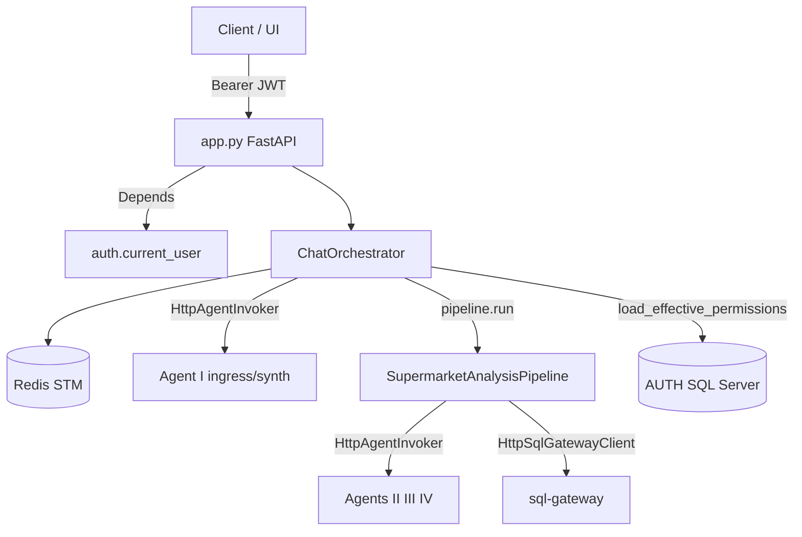

### §Z.4.1 — `orchestrator.py` — khối import và hằng số (dòng 1–43)

### §Z.4.1.1 — Dòng 1–43

Toàn bộ import và `_NEGATIVE_OUTCOMES`.

**Dòng 1** `from __future__ import annotations` — Import phụ thuộc `annotations`; orchestrator không tự triển khai logic này mà ủy quyền cho thư viện/domain.
**Dòng 2** *(dòng trống)* — Ngắt đoạn mã; không thực thi logic.
**Dòng 3** `import logging` — Import phụ thuộc `logging`; orchestrator không tự triển khai logic này mà ủy quyền cho thư viện/domain.
**Dòng 4** `import os` — Import phụ thuộc `os`; orchestrator không tự triển khai logic này mà ủy quyền cho thư viện/domain.
**Dòng 5** `import time` — Import phụ thuộc `time`; orchestrator không tự triển khai logic này mà ủy quyền cho thư viện/domain.
**Dòng 6** `from typing import Any` — Import phụ thuộc `Any`; orchestrator không tự triển khai logic này mà ủy quyền cho thư viện/domain.
**Dòng 7** `from uuid import uuid4` — Import phụ thuộc `uuid4`; orchestrator không tự triển khai logic này mà ủy quyền cho thư viện/domain.
**Dòng 8** *(dòng trống)* — Ngắt đoạn mã; không thực thi logic.
**Dòng 9** `import httpx` — Import phụ thuộc `httpx`; orchestrator không tự triển khai logic này mà ủy quyền cho thư viện/domain.
**Dòng 10** `from project_core.config.loader import load_project_config` — Import phụ thuộc `load_project_config`; orchestrator không tự triển khai logic này mà ủy quyền cho thư viện/domain.
**Dòng 11** `from project_core.domain.access.acl import build_permissions_snapshot` — Import phụ thuộc `build_permissions_snapshot`; orchestrator không tự triển khai logic này mà ủy quyền cho thư viện/domain.
**Dòng 12** `from project_core.domain.access.user_claims import claims_from_user_dict` — Import phụ thuộc `claims_from_user_dict`; orchestrator không tự triển khai logic này mà ủy quyền cho thư viện/domain.
**Dòng 13** `from project_core.domain.access.context_policy import ContextPolicy` — Import phụ thuộc `ContextPolicy`; orchestrator không tự triển khai logic này mà ủy quyền cho thư viện/domain.
**Dòng 14** `from project_core.domain.budget import SessionTraceBudget, TraceBudget` — Import phụ thuộc `TraceBudget`; orchestrator không tự triển khai logic này mà ủy quyền cho thư viện/domain.
**Dòng 15** `from project_core.domain.clarification.resolver import apply_clarification_reply` — Import phụ thuộc `apply_clarification_reply`; orchestrator không tự triển khai logic này mà ủy quyền cho thư viện/domain.
**Dòng 16** `from project_core.domain.contracts.brief import AnalysisBrief` — Import phụ thuộc `AnalysisBrief`; orchestrator không tự triển khai logic này mà ủy quyền cho thư viện/domain.
**Dòng 17** `from project_core.domain.contracts.clarification import ClarificationReply, ClarificationRequest` — Import phụ thuộc `ClarificationRequest`; orchestrator không tự triển khai logic này mà ủy quyền cho thư viện/domain.
**Dòng 18** `from project_core.domain.contracts.feedback import SatisfactionSignal` — Import phụ thuộc `SatisfactionSignal`; orchestrator không tự triển khai logic này mà ủy quyền cho thư viện/domain.
**Dòng 19** `from project_core.domain.contracts.pipeline import ChatResponse` — Import phụ thuộc `ChatResponse`; orchestrator không tự triển khai logic này mà ủy quyền cho thư viện/domain.
**Dòng 20** `from project_core.domain.contracts.workflow import WorkflowStatus` — Import phụ thuộc `WorkflowStatus`; orchestrator không tự triển khai logic này mà ủy quyền cho thư viện/domain.
**Dòng 21** `from project_core.domain.errors.codes import (` — Import phụ thuộc `(`; orchestrator không tự triển khai logic này mà ủy quyền cho thư viện/domain.
**Dòng 22** `    BudgetExceededError,` — Thực thi bước trung gian trong luồng điều phối phiên.
**Dòng 23** `    ClarifyRoundsExceededError,` — Thực thi bước trung gian trong luồng điều phối phiên.
**Dòng 24** `    PermissionsUnavailableError,` — Thực thi bước trung gian trong luồng điều phối phiên.
**Dòng 25** `)` — Thực thi bước trung gian trong luồng điều phối phiên.
**Dòng 26** `from project_core.domain.feedback.analysis_tool_registry import AnalysisToolRegistry` — Import phụ thuộc `AnalysisToolRegistry`; orchestrator không tự triển khai logic này mà ủy quyền cho thư viện/domain.
**Dòng 27** `from project_core.domain.feedback.domain_rule_store import DomainRuleStore` — Import phụ thuộc `DomainRuleStore`; orchestrator không tự triển khai logic này mà ủy quyền cho thư viện/domain.
**Dòng 28** `from project_core.domain.feedback.loop import CaseStudyIndexer, FeedbackLoop` — Import phụ thuộc `FeedbackLoop`; orchestrator không tự triển khai logic này mà ủy quyền cho thư viện/domain.
**Dòng 29** `from project_core.domain.feedback.store import BehavioralSignal` — Import phụ thuộc `BehavioralSignal`; orchestrator không tự triển khai logic này mà ủy quyền cho thư viện/domain.
**Dòng 30** `from project_core.domain.memory.session_bundle import SessionBundle, TranscriptTurn` — Import phụ thuộc `TranscriptTurn`; orchestrator không tự triển khai logic này mà ủy quyền cho thư viện/domain.
**Dòng 31** `from project_core.domain.retrieval.mongo_vector import HybridMongoRetriever, MongoVectorRetriever` — Import phụ thuộc `MongoVectorRetriever`; orchestrator không tự triển khai logic này mà ủy quyền cho thư viện/domain.
**Dòng 32** `from project_core.domain.schema.catalog import SchemaCatalog` — Import phụ thuộc `SchemaCatalog`; orchestrator không tự triển khai logic này mà ủy quyền cho thư viện/domain.
**Dòng 33** `from project_core.domain.workflow.state import new_workflow, resume_analysis, start_analysis` — Import phụ thuộc `start_analysis`; orchestrator không tự triển khai logic này mà ủy quyền cho thư viện/domain.
**Dòng 34** `from project_core.domain.time import utc_now` — Import phụ thuộc `utc_now`; orchestrator không tự triển khai logic này mà ủy quyền cho thư viện/domain.
**Dòng 35** `from project_core.infra.stm.redis_store import RedisSessionStore` — Import phụ thuộc `RedisSessionStore`; orchestrator không tự triển khai logic này mà ủy quyền cho thư viện/domain.
**Dòng 36** `from project_core.orchestration.clarification_coordinator import ClarificationCoordinator` — Import phụ thuộc `ClarificationCoordinator`; orchestrator không tự triển khai logic này mà ủy quyền cho thư viện/domain.
**Dòng 37** `from project_core.orchestration.pipeline import SupermarketAnalysisPipeline` — Import phụ thuộc `SupermarketAnalysisPipeline`; orchestrator không tự triển khai logic này mà ủy quyền cho thư viện/domain.
**Dòng 38** *(dòng trống)* — Ngắt đoạn mã; không thực thi logic.
**Dòng 39** `from chat_gateway.clients import HttpAgentInvoker, HttpSqlGatewayClient` — Import phụ thuộc `HttpSqlGatewayClient`; orchestrator không tự triển khai logic này mà ủy quyền cho thư viện/domain.
**Dòng 40** *(dòng trống)* — Ngắt đoạn mã; không thực thi logic.
**Dòng 41** `logger = logging.getLogger(__name__)` — Thực thi bước trung gian trong luồng điều phối phiên.
**Dòng 42** *(dòng trống)* — Ngắt đoạn mã; không thực thi logic.
**Dòng 43** `_NEGATIVE_OUTCOMES = frozenset({"error", "impossible", "policy_blocked", "partial"})` — Thực thi bước trung gian trong luồng điều phối phiên.
### §Z.4.2 — `ChatOrchestrator.__init__` (dòng 47–88)

Khởi tạo **một lần** khi `get_orchestrator()` lần đầu. Thứ tự quan trọng: Redis → config → HTTP client → Mongo (best-effort) → pipeline wiring.

### §Z.4.2.1 — Constructor từng dòng


**Dòng 47** `    def __init__(self) -> None:` — Định nghĩa phương thức `__init__`; xem khối thân bên dưới để biết side-effect Redis/Mongo/HTTP.
**Dòng 48** `        self.stm = RedisSessionStore()` — Thao tác trên thuộc tính instance (stm, pipeline, feedback, …); có thể ghi Redis hoặc gọi HTTP gián tiếp.
**Dòng 49** `        self.cfg = load_project_config()` — Thao tác trên thuộc tính instance (stm, pipeline, feedback, …); có thể ghi Redis hoặc gọi HTTP gián tiếp.
**Dòng 50** `        self.context_policy = ContextPolicy()` — Thao tác trên thuộc tính instance (stm, pipeline, feedback, …); có thể ghi Redis hoặc gọi HTTP gián tiếp.
**Dòng 51** `        self.clarify = ClarificationCoordinator()` — Thao tác trên thuộc tính instance (stm, pipeline, feedback, …); có thể ghi Redis hoặc gọi HTTP gián tiếp.
**Dòng 52** `        self._http = httpx.Client(timeout=120.0)` — Thao tác trên thuộc tính instance (stm, pipeline, feedback, …); có thể ghi Redis hoặc gọi HTTP gián tiếp.
**Dòng 53** `        self.feedback: FeedbackLoop | None = None` — Thao tác trên thuộc tính instance (stm, pipeline, feedback, …); có thể ghi Redis hoặc gọi HTTP gián tiếp.
**Dòng 54** `        self.analysis_tool_registry: AnalysisToolRegistry | None = None` — Thao tác trên thuộc tính instance (stm, pipeline, feedback, …); có thể ghi Redis hoặc gọi HTTP gián tiếp.
**Dòng 55** `        self.domain_rule_store: DomainRuleStore | None = None` — Thao tác trên thuộc tính instance (stm, pipeline, feedback, …); có thể ghi Redis hoặc gọi HTTP gián tiếp.
**Dòng 56** `        try:` — Khối bảo vệ gọi agent/budget; lỗi budget → response có `BUDGET_EXCEEDED`.
**Dòng 57** `            from pymongo import MongoClient` — Import phụ thuộc `MongoClient`; orchestrator không tự triển khai logic này mà ủy quyền cho thư viện/domain.
**Dòng 58** *(dòng trống)* — Ngắt đoạn mã; không thực thi logic.
**Dòng 59** `            from project_core.domain.analysis.recipe_runtime import set_registry` — Import phụ thuộc `set_registry`; orchestrator không tự triển khai logic này mà ủy quyền cho thư viện/domain.
**Dòng 60** `            from project_core.llm.embedding_client import EmbeddingClient` — Import phụ thuộc `EmbeddingClient`; orchestrator không tự triển khai logic này mà ủy quyền cho thư viện/domain.
**Dòng 61** *(dòng trống)* — Ngắt đoạn mã; không thực thi logic.
**Dòng 62** `            mongo_timeout = int(os.getenv("MONGODB_CONNECT_TIMEOUT_MS", "2000"))` — Thực thi bước trung gian trong luồng điều phối phiên.
**Dòng 63** `            mongo = MongoClient(` — Thực thi bước trung gian trong luồng điều phối phiên.
**Dòng 64** `                os.getenv("MONGODB_URI", "mongodb://localhost:18217/supermarket_agent"),` — Thực thi bước trung gian trong luồng điều phối phiên.
**Dòng 65** `                serverSelectionTimeoutMS=mongo_timeout,` — Thực thi bước trung gian trong luồng điều phối phiên.
**Dòng 66** `            )` — Thực thi bước trung gian trong luồng điều phối phiên.
**Dòng 67** `            mongo.admin.command("ping")` — Thực thi bước trung gian trong luồng điều phối phiên.
**Dòng 68** `            db = mongo.get_default_database()` — Thực thi bước trung gian trong luồng điều phối phiên.
**Dòng 69** `            indexer = CaseStudyIndexer(db["case_studies"])` — Thực thi bước trung gian trong luồng điều phối phiên.
**Dòng 70** *(dòng trống)* — Ngắt đoạn mã; không thực thi logic.
**Dòng 71** `            def _embed_text(text: str) -> list[float]:` — Định nghĩa phương thức `_embed_text`; xem khối thân bên dưới để biết side-effect Redis/Mongo/HTTP.
**Dòng 72** `                return EmbeddingClient().embed([text])[0]` — Thoát sớm hoặc cuối nhánh; giá trị trả về được `app.py` serialize qua `model_dump()` nếu là `ChatResponse`.
**Dòng 73** *(dòng trống)* — Ngắt đoạn mã; không thực thi logic.
**Dòng 74** `            retriever = HybridMongoRetriever(db)` — Thực thi bước trung gian trong luồng điều phối phiên.
**Dòng 75** `            self.analysis_tool_registry = AnalysisToolRegistry(db["analysis_tools"], embed_fn=_embed_text)` — Thao tác trên thuộc tính instance (stm, pipeline, feedback, …); có thể ghi Redis hoặc gọi HTTP gián tiếp.
**Dòng 76** `            set_registry(self.analysis_tool_registry)` — Thực thi bước trung gian trong luồng điều phối phiên.
**Dòng 77** `            self.domain_rule_store = DomainRuleStore(db["domain_rules"])` — Thao tác trên thuộc tính instance (stm, pipeline, feedback, …); có thể ghi Redis hoặc gọi HTTP gián tiếp.
**Dòng 78** `            self.feedback = FeedbackLoop(indexer=indexer, retriever=retriever, embed_fn=_embed_text)` — Thao tác trên thuộc tính instance (stm, pipeline, feedback, …); có thể ghi Redis hoặc gọi HTTP gián tiếp.
**Dòng 79** `        except Exception as exc:  # noqa: BLE001` — Bắt exception; orchestrator ưu tiên trả `ChatResponse` có `error` thay vì 500.
**Dòng 80** `            logger.warning("Mongo/RAG unavailable: %s", exc)` — Thực thi bước trung gian trong luồng điều phối phiên.
**Dòng 81** `        self.pipeline = SupermarketAnalysisPipeline(` — Thao tác trên thuộc tính instance (stm, pipeline, feedback, …); có thể ghi Redis hoặc gọi HTTP gián tiếp.
**Dòng 82** `            agent_invoker=HttpAgentInvoker(client=self._http),` — Thực thi bước trung gian trong luồng điều phối phiên.
**Dòng 83** `            sql_gateway=HttpSqlGatewayClient(client=self._http),` — Thực thi bước trung gian trong luồng điều phối phiên.
**Dòng 84** `            catalog=SchemaCatalog.from_dictionary_dir(),` — Thực thi bước trung gian trong luồng điều phối phiên.
**Dòng 85** `            feedback_loop=self.feedback,` — Thực thi bước trung gian trong luồng điều phối phiên.
**Dòng 86** `            analysis_tool_registry=self.analysis_tool_registry,` — Thực thi bước trung gian trong luồng điều phối phiên.
**Dòng 87** `            domain_rule_store=self.domain_rule_store,` — Thực thi bước trung gian trong luồng điều phối phiên.
**Dòng 88** `        )` — Thực thi bước trung gian trong luồng điều phối phiên.
**Sơ đồ hoạt động khởi tạo:**

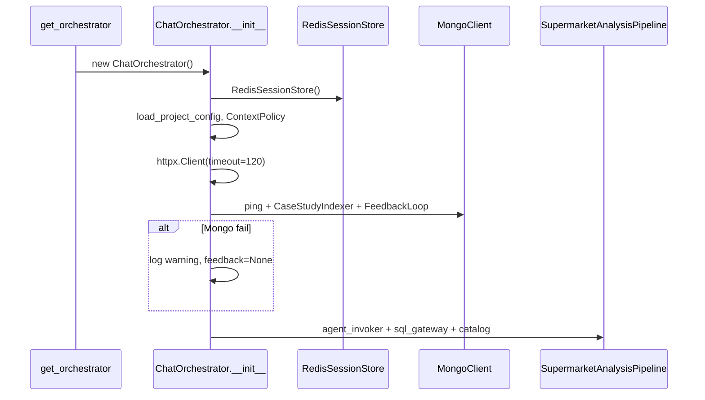

Sau init, `self.pipeline.agent_invoker` và `self.pipeline.sql_gateway` **chia sẻ** `self._http` với các `HttpAgentInvoker` tạm tạo trong `handle_chat` — cùng connection pool httpx.

### §Z.4.3 — `close()` (dòng 90–95)

### §Z.4.3.1

Giải phóng httpx; gọi close trên invoker/gateway nếu có.

**Dòng 90** `    def close(self) -> None:` — Định nghĩa phương thức `close`; xem khối thân bên dưới để biết side-effect Redis/Mongo/HTTP.
**Dòng 91** `        self._http.close()` — Thao tác trên thuộc tính instance (stm, pipeline, feedback, …); có thể ghi Redis hoặc gọi HTTP gián tiếp.
**Dòng 92** `        if hasattr(self.pipeline.agent_invoker, "close"):` — Phân nhánh điều kiện; quyết định luồng clarify, analysis, hoặc idle.
**Dòng 93** `            self.pipeline.agent_invoker.close()  # type: ignore[attr-defined]` — Thao tác trên thuộc tính instance (stm, pipeline, feedback, …); có thể ghi Redis hoặc gọi HTTP gián tiếp.
**Dòng 94** `        if hasattr(self.pipeline.sql_gateway, "close"):` — Phân nhánh điều kiện; quyết định luồng clarify, analysis, hoặc idle.
**Dòng 95** `            self.pipeline.sql_gateway.close()  # type: ignore[attr-defined]` — Thao tác trên thuộc tính instance (stm, pipeline, feedback, …); có thể ghi Redis hoặc gọi HTTP gián tiếp.
### §Z.4.4 — `handle_chat` (dòng 97–174)

Điểm vào chính `POST /chat`. Luồng: load session → clarify ingress? → transcript → Agent I ingress → analysis hoặc idle.

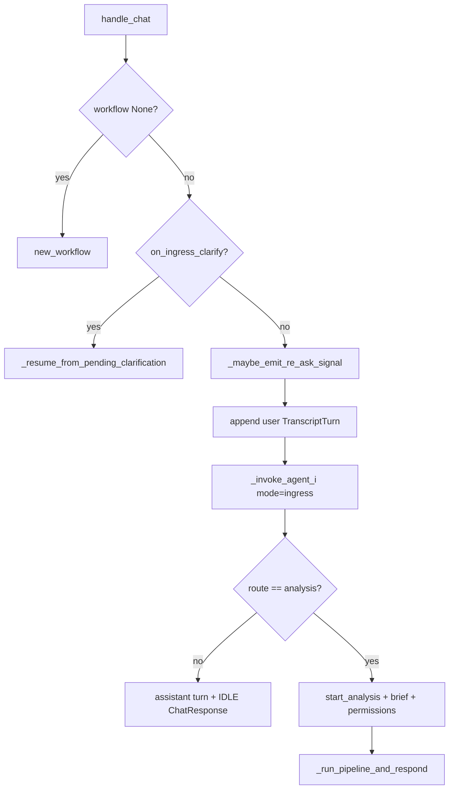

### §Z.4.4.1 — handle_chat từng dòng


**Dòng 97** `    def handle_chat(self, *, session_id: str, message: str, user: dict[str, Any]) -> ChatResponse:` — Định nghĩa phương thức `handle_chat`; xem khối thân bên dưới để biết side-effect Redis/Mongo/HTTP.
**Dòng 98** `        actor_id, role, store_ids = claims_from_user_dict(user)` — Thực thi bước trung gian trong luồng điều phối phiên.
**Dòng 99** `        bundle = self.stm.load_session(session_id)` — Thực thi bước trung gian trong luồng điều phối phiên.
**Dòng 100** `        if bundle.workflow is None:` — Phân nhánh điều kiện; quyết định luồng clarify, analysis, hoặc idle.
**Dòng 101** `            bundle.workflow = new_workflow(session_id, actor_id)` — Đọc/ghi `SessionBundle` trong bộ nhớ; cần `stm.save_*` để persist.
**Dòng 102** *(dòng trống)* — Ngắt đoạn mã; không thực thi logic.
**Dòng 103** `        if self.clarify.on_ingress_clarify(bundle):` — Phân nhánh điều kiện; quyết định luồng clarify, analysis, hoặc idle.
**Dòng 104** `            return self._resume_from_pending_clarification(` — Thoát sớm hoặc cuối nhánh; giá trị trả về được `app.py` serialize qua `model_dump()` nếu là `ChatResponse`.
**Dòng 105** `                session_id=session_id,` — Thực thi bước trung gian trong luồng điều phối phiên.
**Dòng 106** `                message=message,` — Thực thi bước trung gian trong luồng điều phối phiên.
**Dòng 107** `                user=user,` — Thực thi bước trung gian trong luồng điều phối phiên.
**Dòng 108** `                bundle=bundle,` — Thực thi bước trung gian trong luồng điều phối phiên.
**Dòng 109** `            )` — Thực thi bước trung gian trong luồng điều phối phiên.
**Dòng 110** *(dòng trống)* — Ngắt đoạn mã; không thực thi logic.
**Dòng 111** `        self._maybe_emit_re_ask_signal(session_id, bundle, message)` — Thao tác trên thuộc tính instance (stm, pipeline, feedback, …); có thể ghi Redis hoặc gọi HTTP gián tiếp.
**Dòng 112** *(dòng trống)* — Ngắt đoạn mã; không thực thi logic.
**Dòng 113** `        turn = TranscriptTurn(id=str(uuid4()), role="user", content=message, at=utc_now().isoformat())` — Thực thi bước trung gian trong luồng điều phối phiên.
**Dòng 114** `        bundle.transcript.append(turn)` — Đọc/ghi `SessionBundle` trong bộ nhớ; cần `stm.save_*` để persist.
**Dòng 115** `        self.stm.save_transcript(session_id, bundle.transcript)` — Thao tác trên thuộc tính instance (stm, pipeline, feedback, …); có thể ghi Redis hoặc gọi HTTP gián tiếp.
**Dòng 116** *(dòng trống)* — Ngắt đoạn mã; không thực thi logic.
**Dòng 117** `        invoker = HttpAgentInvoker(client=self._http)` — Thực thi bước trung gian trong luồng điều phối phiên.
**Dòng 118** `        session_budget = self._session_budget(bundle)` — Thực thi bước trung gian trong luồng điều phối phiên.
**Dòng 119** `        external_sources = []` — Thực thi bước trung gian trong luồng điều phối phiên.
**Dòng 120** `        if bundle.workflow.brief and bundle.workflow.brief.external_sources:` — Phân nhánh điều kiện; quyết định luồng clarify, analysis, hoặc idle.
**Dòng 121** `            external_sources = [s.model_dump() for s in bundle.workflow.brief.external_sources]` — Thực thi bước trung gian trong luồng điều phối phiên.
**Dòng 122** *(dòng trống)* — Ngắt đoạn mã; không thực thi logic.
**Dòng 123** `        try:` — Khối bảo vệ gọi agent/budget; lỗi budget → response có `BUDGET_EXCEEDED`.
**Dòng 124** `            ingress = self._invoke_agent_i(` — Thực thi bước trung gian trong luồng điều phối phiên.
**Dòng 125** `                invoker,` — Thực thi bước trung gian trong luồng điều phối phiên.
**Dòng 126** `                {"text": message, "external_sources": external_sources},` — Thực thi bước trung gian trong luồng điều phối phiên.
**Dòng 127** `                {"mode": "ingress", "session_id": session_id, "actor_id": actor_id},` — Thực thi bước trung gian trong luồng điều phối phiên.
**Dòng 128** `                session_budget,` — Thực thi bước trung gian trong luồng điều phối phiên.
**Dòng 129** `                bundle,` — Thực thi bước trung gian trong luồng điều phối phiên.
**Dòng 130** `            )` — Thực thi bước trung gian trong luồng điều phối phiên.
**Dòng 131** `        except BudgetExceededError as exc:` — Bắt exception; orchestrator ưu tiên trả `ChatResponse` có `error` thay vì 500.
**Dòng 132** `            return ChatResponse(` — Thoát sớm hoặc cuối nhánh; giá trị trả về được `app.py` serialize qua `model_dump()` nếu là `ChatResponse`.
**Dòng 133** `                session_id=session_id,` — Thực thi bước trung gian trong luồng điều phối phiên.
**Dòng 134** `                workflow_status=bundle.workflow.status.value,` — Thực thi bước trung gian trong luồng điều phối phiên.
**Dòng 135** `                message=str(exc),` — Thực thi bước trung gian trong luồng điều phối phiên.
**Dòng 136** `                error={"code": "BUDGET_EXCEEDED", "retryable": False},` — Thực thi bước trung gian trong luồng điều phối phiên.
**Dòng 137** `            )` — Thực thi bước trung gian trong luồng điều phối phiên.
**Dòng 138** *(dòng trống)* — Ngắt đoạn mã; không thực thi logic.
**Dòng 139** `        self._handle_satisfaction_signal(ingress, bundle)` — Thao tác trên thuộc tính instance (stm, pipeline, feedback, …); có thể ghi Redis hoặc gọi HTTP gián tiếp.
**Dòng 140** *(dòng trống)* — Ngắt đoạn mã; không thực thi logic.
**Dòng 141** `        if ingress.get("route") != "analysis":` — Phân nhánh điều kiện; quyết định luồng clarify, analysis, hoặc idle.
**Dòng 142** `            assistant = TranscriptTurn(` — Thực thi bước trung gian trong luồng điều phối phiên.
**Dòng 143** `                id=str(uuid4()),` — Thực thi bước trung gian trong luồng điều phối phiên.
**Dòng 144** `                role="assistant",` — Thực thi bước trung gian trong luồng điều phối phiên.
**Dòng 145** `                content=ingress.get("user_message", ""),` — Thực thi bước trung gian trong luồng điều phối phiên.
**Dòng 146** `                at=utc_now().isoformat(),` — Thực thi bước trung gian trong luồng điều phối phiên.
**Dòng 147** `            )` — Thực thi bước trung gian trong luồng điều phối phiên.
**Dòng 148** `            bundle.transcript.append(assistant)` — Đọc/ghi `SessionBundle` trong bộ nhớ; cần `stm.save_*` để persist.
**Dòng 149** `            self.stm.save_transcript(session_id, bundle.transcript)` — Thao tác trên thuộc tính instance (stm, pipeline, feedback, …); có thể ghi Redis hoặc gọi HTTP gián tiếp.
**Dòng 150** `            return ChatResponse(` — Thoát sớm hoặc cuối nhánh; giá trị trả về được `app.py` serialize qua `model_dump()` nếu là `ChatResponse`.
**Dòng 151** `                session_id=session_id,` — Thực thi bước trung gian trong luồng điều phối phiên.
**Dòng 152** `                workflow_status=WorkflowStatus.IDLE.value,` — Thực thi bước trung gian trong luồng điều phối phiên.
**Dòng 153** `                message=ingress.get("user_message", ""),` — Thực thi bước trung gian trong luồng điều phối phiên.
**Dòng 154** `            )` — Thực thi bước trung gian trong luồng điều phối phiên.
**Dòng 155** *(dòng trống)* — Ngắt đoạn mã; không thực thi logic.
**Dòng 156** `        brief = AnalysisBrief.model_validate(ingress.get("brief") or {"intent": message})` — Thực thi bước trung gian trong luồng điều phối phiên.
**Dòng 157** `        if bundle.workflow.brief and bundle.workflow.brief.external_sources:` — Phân nhánh điều kiện; quyết định luồng clarify, analysis, hoặc idle.
**Dòng 158** `            brief.external_sources = bundle.workflow.brief.external_sources` — Thực thi bước trung gian trong luồng điều phối phiên.
**Dòng 159** *(dòng trống)* — Ngắt đoạn mã; không thực thi logic.
**Dòng 160** `        analysis_id = start_analysis(bundle.workflow, reset_clarify=True)` — Thực thi bước trung gian trong luồng điều phối phiên.
**Dòng 161** `        bundle.workflow.brief = brief` — Đọc/ghi `SessionBundle` trong bộ nhớ; cần `stm.save_*` để persist.
**Dòng 162** `        permissions = self._build_permissions(actor_id, role, store_ids)` — Thực thi bước trung gian trong luồng điều phối phiên.
**Dòng 163** `        bundle.workflow.permissions_snapshot = permissions` — Đọc/ghi `SessionBundle` trong bộ nhớ; cần `stm.save_*` để persist.
**Dòng 164** `        self.stm.save_workflow(session_id, bundle.workflow)` — Thao tác trên thuộc tính instance (stm, pipeline, feedback, …); có thể ghi Redis hoặc gọi HTTP gián tiếp.
**Dòng 165** *(dòng trống)* — Ngắt đoạn mã; không thực thi logic.
**Dòng 166** `        return self._run_pipeline_and_respond(` — Thoát sớm hoặc cuối nhánh; giá trị trả về được `app.py` serialize qua `model_dump()` nếu là `ChatResponse`.
**Dòng 167** `            session_id=session_id,` — Thực thi bước trung gian trong luồng điều phối phiên.
**Dòng 168** `            analysis_id=analysis_id,` — Thực thi bước trung gian trong luồng điều phối phiên.
**Dòng 169** `            brief=brief,` — Thực thi bước trung gian trong luồng điều phối phiên.
**Dòng 170** `            bundle=bundle,` — Thực thi bước trung gian trong luồng điều phối phiên.
**Dòng 171** `            permissions=permissions,` — Thực thi bước trung gian trong luồng điều phối phiên.
**Dòng 172** `            invoker=invoker,` — Thực thi bước trung gian trong luồng điều phối phiên.
**Dòng 173** `            session_budget=session_budget,` — Thực thi bước trung gian trong luồng điều phối phiên.
**Dòng 174** `        )` — Thực thi bước trung gian trong luồng điều phối phiên.
### §Z.4.5 — `handle_clarify` (dòng 176–210)

Được gọi từ `POST /chat/clarify` khi user trả lời form clarify có cấu trúc.

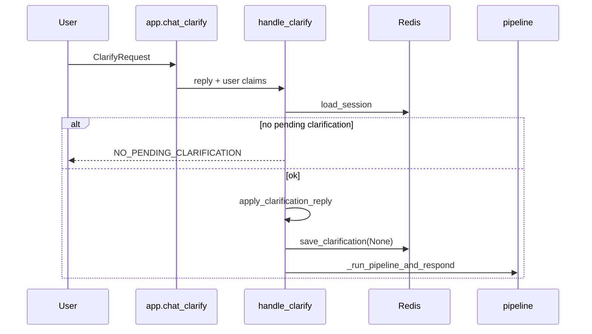

### §Z.4.5.1


**Dòng 176** `    def handle_clarify(` — Định nghĩa phương thức `handle_clarify`; xem khối thân bên dưới để biết side-effect Redis/Mongo/HTTP.
**Dòng 177** `        self,` — Thực thi bước trung gian trong luồng điều phối phiên.
**Dòng 178** `        *,` — Thực thi bước trung gian trong luồng điều phối phiên.
**Dòng 179** `        session_id: str,` — Thực thi bước trung gian trong luồng điều phối phiên.
**Dòng 180** `        reply: ClarificationReply,` — Thực thi bước trung gian trong luồng điều phối phiên.
**Dòng 181** `        user: dict[str, Any],` — Thực thi bước trung gian trong luồng điều phối phiên.
**Dòng 182** `    ) -> ChatResponse:` — Thực thi bước trung gian trong luồng điều phối phiên.
**Dòng 183** `        bundle = self.stm.load_session(session_id)` — Thực thi bước trung gian trong luồng điều phối phiên.
**Dòng 184** `        if bundle.workflow is None or not bundle.clarification:` — Phân nhánh điều kiện; quyết định luồng clarify, analysis, hoặc idle.
**Dòng 185** `            return ChatResponse(` — Thoát sớm hoặc cuối nhánh; giá trị trả về được `app.py` serialize qua `model_dump()` nếu là `ChatResponse`.
**Dòng 186** `                session_id=session_id,` — Thực thi bước trung gian trong luồng điều phối phiên.
**Dòng 187** `                workflow_status=WorkflowStatus.IDLE.value,` — Thực thi bước trung gian trong luồng điều phối phiên.
**Dòng 188** `                message="No pending clarification",` — Thực thi bước trung gian trong luồng điều phối phiên.
**Dòng 189** `                error={"code": "NO_PENDING_CLARIFICATION", "retryable": False},` — Thực thi bước trung gian trong luồng điều phối phiên.
**Dòng 190** `            )` — Thực thi bước trung gian trong luồng điều phối phiên.
**Dòng 191** `        request = ClarificationRequest.model_validate(bundle.clarification)` — Thực thi bước trung gian trong luồng điều phối phiên.
**Dòng 192** `        brief = bundle.workflow.brief or request.partial_brief` — Thực thi bước trung gian trong luồng điều phối phiên.
**Dòng 193** `        brief = apply_clarification_reply(brief, reply, request)` — Thực thi bước trung gian trong luồng điều phối phiên.
**Dòng 194** `        bundle.workflow.brief = brief` — Đọc/ghi `SessionBundle` trong bộ nhớ; cần `stm.save_*` để persist.
**Dòng 195** `        resume_analysis(bundle.workflow)` — Thực thi bước trung gian trong luồng điều phối phiên.
**Dòng 196** `        self.stm.save_clarification(session_id, None)` — Thao tác trên thuộc tính instance (stm, pipeline, feedback, …); có thể ghi Redis hoặc gọi HTTP gián tiếp.
**Dòng 197** `        self.stm.save_workflow(session_id, bundle.workflow)` — Thao tác trên thuộc tính instance (stm, pipeline, feedback, …); có thể ghi Redis hoặc gọi HTTP gián tiếp.
**Dòng 198** *(dòng trống)* — Ngắt đoạn mã; không thực thi logic.
**Dòng 199** `        permissions = bundle.workflow.permissions_snapshot or self._build_permissions(*claims_from_user_dict(user))` — Thực thi bước trung gian trong luồng điều phối phiên.
**Dòng 200** `        invoker = HttpAgentInvoker(client=self._http)` — Thực thi bước trung gian trong luồng điều phối phiên.
**Dòng 201** `        session_budget = self._session_budget(bundle)` — Thực thi bước trung gian trong luồng điều phối phiên.
**Dòng 202** `        return self._run_pipeline_and_respond(` — Thoát sớm hoặc cuối nhánh; giá trị trả về được `app.py` serialize qua `model_dump()` nếu là `ChatResponse`.
**Dòng 203** `            session_id=session_id,` — Thực thi bước trung gian trong luồng điều phối phiên.
**Dòng 204** `            analysis_id=reply.analysis_id,` — Thực thi bước trung gian trong luồng điều phối phiên.
**Dòng 205** `            brief=brief,` — Thực thi bước trung gian trong luồng điều phối phiên.
**Dòng 206** `            bundle=bundle,` — Thực thi bước trung gian trong luồng điều phối phiên.
**Dòng 207** `            permissions=permissions,` — Thực thi bước trung gian trong luồng điều phối phiên.
**Dòng 208** `            invoker=invoker,` — Thực thi bước trung gian trong luồng điều phối phiên.
**Dòng 209** `            session_budget=session_budget,` — Thực thi bước trung gian trong luồng điều phối phiên.
**Dòng 210** `        )` — Thực thi bước trung gian trong luồng điều phối phiên.
### §Z.4.6 — API phụ: confirm, attach, status, download (dòng 212–262)

### §Z.4.6.1

Các phương thức public không qua pipeline đầy đủ.

**Dòng 212** `    def confirm_domain_rule(self, rule_id: str, *, confirmed: bool, user: dict[str, Any]) -> dict[str, str]:` — Định nghĩa phương thức `confirm_domain_rule`; xem khối thân bên dưới để biết side-effect Redis/Mongo/HTTP.
**Dòng 213** `        if self.domain_rule_store is None:` — Phân nhánh điều kiện; quyết định luồng clarify, analysis, hoặc idle.
**Dòng 214** `            return {"status": "no_store"}` — Thoát sớm hoặc cuối nhánh; giá trị trả về được `app.py` serialize qua `model_dump()` nếu là `ChatResponse`.
**Dòng 215** `        if confirmed:` — Phân nhánh điều kiện; quyết định luồng clarify, analysis, hoặc idle.
**Dòng 216** `            self.domain_rule_store.confirm(rule_id, confirmed_by=user["sub"])` — Thao tác trên thuộc tính instance (stm, pipeline, feedback, …); có thể ghi Redis hoặc gọi HTTP gián tiếp.
**Dòng 217** `        else:` — Thực thi bước trung gian trong luồng điều phối phiên.
**Dòng 218** `            self.domain_rule_store.reject(rule_id)` — Thao tác trên thuộc tính instance (stm, pipeline, feedback, …); có thể ghi Redis hoặc gọi HTTP gián tiếp.
**Dòng 219** `        return {"status": "ok"}` — Thoát sớm hoặc cuối nhánh; giá trị trả về được `app.py` serialize qua `model_dump()` nếu là `ChatResponse`.
**Dòng 220** *(dòng trống)* — Ngắt đoạn mã; không thực thi logic.
**Dòng 221** `    def attach_external_sources(self, session_id: str, sources: list[dict[str, Any]]) -> None:` — Định nghĩa phương thức `attach_external_sources`; xem khối thân bên dưới để biết side-effect Redis/Mongo/HTTP.
**Dòng 222** `        bundle = self.stm.load_session(session_id)` — Thực thi bước trung gian trong luồng điều phối phiên.
**Dòng 223** `        if bundle.workflow is None:` — Phân nhánh điều kiện; quyết định luồng clarify, analysis, hoặc idle.
**Dòng 224** `            bundle.workflow = new_workflow(session_id, "unknown")` — Đọc/ghi `SessionBundle` trong bộ nhớ; cần `stm.save_*` để persist.
**Dòng 225** `        brief = bundle.workflow.brief or AnalysisBrief()` — Thực thi bước trung gian trong luồng điều phối phiên.
**Dòng 226** `        from project_core.domain.contracts.external_source import ExternalSource` — Import phụ thuộc `ExternalSource`; orchestrator không tự triển khai logic này mà ủy quyền cho thư viện/domain.
**Dòng 227** *(dòng trống)* — Ngắt đoạn mã; không thực thi logic.
**Dòng 228** `        existing = {s.file_id for s in brief.external_sources}` — Thực thi bước trung gian trong luồng điều phối phiên.
**Dòng 229** `        for raw in sources:` — Vòng lặp xử lý tập phần tử hoặc retry.
**Dòng 230** `            src = ExternalSource.model_validate(raw)` — Thực thi bước trung gian trong luồng điều phối phiên.
**Dòng 231** `            if src.file_id not in existing:` — Phân nhánh điều kiện; quyết định luồng clarify, analysis, hoặc idle.
**Dòng 232** `                brief.external_sources.append(src)` — Thực thi bước trung gian trong luồng điều phối phiên.
**Dòng 233** `        bundle.workflow.brief = brief` — Đọc/ghi `SessionBundle` trong bộ nhớ; cần `stm.save_*` để persist.
**Dòng 234** `        self.stm.save_workflow(session_id, bundle.workflow)` — Thao tác trên thuộc tính instance (stm, pipeline, feedback, …); có thể ghi Redis hoặc gọi HTTP gián tiếp.
**Dòng 235** *(dòng trống)* — Ngắt đoạn mã; không thực thi logic.
**Dòng 236** `    def analysis_status(self, analysis_id: str) -> dict[str, Any]:` — Định nghĩa phương thức `analysis_status`; xem khối thân bên dưới để biết side-effect Redis/Mongo/HTTP.
**Dòng 237** `        found = self.stm.find_by_analysis_id(analysis_id)` — Thực thi bước trung gian trong luồng điều phối phiên.
**Dòng 238** `        if not found:` — Phân nhánh điều kiện; quyết định luồng clarify, analysis, hoặc idle.
**Dòng 239** `            return {"analysis_id": analysis_id, "status": "not_found"}` — Thoát sớm hoặc cuối nhánh; giá trị trả về được `app.py` serialize qua `model_dump()` nếu là `ChatResponse`.
**Dòng 240** `        session_id, workflow = found` — Thực thi bước trung gian trong luồng điều phối phiên.
**Dòng 241** `        return {` — Thoát sớm hoặc cuối nhánh; giá trị trả về được `app.py` serialize qua `model_dump()` nếu là `ChatResponse`.
**Dòng 242** `            "analysis_id": analysis_id,` — Thực thi bước trung gian trong luồng điều phối phiên.
**Dòng 243** `            "session_id": session_id,` — Thực thi bước trung gian trong luồng điều phối phiên.
**Dòng 244** `            "status": workflow.status.value,` — Thực thi bước trung gian trong luồng điều phối phiên.
**Dòng 245** `            "last_outcome": workflow.last_outcome,` — Thực thi bước trung gian trong luồng điều phối phiên.
**Dòng 246** `            "progress_step": workflow.progress_step,` — Thực thi bước trung gian trong luồng điều phối phiên.
**Dòng 247** `            "active_analysis_id": workflow.active_analysis_id,` — Thực thi bước trung gian trong luồng điều phối phiên.
**Dòng 248** `            "clarify_round": str(workflow.clarify_round),` — Thực thi bước trung gian trong luồng điều phối phiên.
**Dòng 249** `        }` — Thực thi bước trung gian trong luồng điều phối phiên.
**Dòng 250** *(dòng trống)* — Ngắt đoạn mã; không thực thi logic.
**Dòng 251** `    def record_artifact_download(self, session_id: str, trace_id: str) -> None:` — Định nghĩa phương thức `record_artifact_download`; xem khối thân bên dưới để biết side-effect Redis/Mongo/HTTP.
**Dòng 252** `        if not self.feedback:` — Phân nhánh điều kiện; quyết định luồng clarify, analysis, hoặc idle.
**Dòng 253** `            return` — Thực thi bước trung gian trong luồng điều phối phiên.
**Dòng 254** `        self.feedback.on_behavioral_signal(` — Thao tác trên thuộc tính instance (stm, pipeline, feedback, …); có thể ghi Redis hoặc gọi HTTP gián tiếp.
**Dòng 255** `            session_id,` — Thực thi bước trung gian trong luồng điều phối phiên.
**Dòng 256** `            BehavioralSignal(` — Thực thi bước trung gian trong luồng điều phối phiên.
**Dòng 257** `                session_id=session_id,` — Thực thi bước trung gian trong luồng điều phối phiên.
**Dòng 258** `                signal_type="download",` — Thực thi bước trung gian trong luồng điều phối phiên.
**Dòng 259** `                trace_id=trace_id,` — Thực thi bước trung gian trong luồng điều phối phiên.
**Dòng 260** `                weight=0.3,` — Thực thi bước trung gian trong luồng điều phối phiên.
**Dòng 261** `            ),` — Thực thi bước trung gian trong luồng điều phối phiên.
**Dòng 262** `        )` — Thực thi bước trung gian trong luồng điều phối phiên.
### §Z.4.7 — `_build_permissions` (dòng 264–288)

Cầu nối JWT claims → `PermissionsSnapshot` cho pipeline và agent metadata.

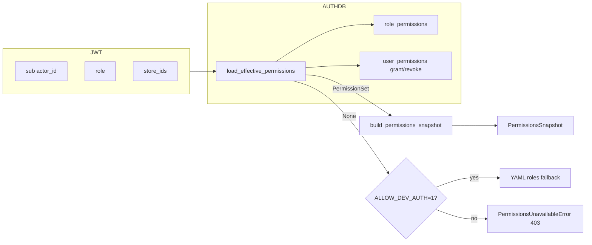

### §Z.4.7.1


**Dòng 264** `    def _build_permissions(self, actor_id: str, role: str, store_ids: list[int] | None) -> Any:` — Định nghĩa phương thức `_build_permissions`; xem khối thân bên dưới để biết side-effect Redis/Mongo/HTTP.
**Dòng 265** `        perm_set = None` — Thực thi bước trung gian trong luồng điều phối phiên.
**Dòng 266** `        try:` — Khối bảo vệ gọi agent/budget; lỗi budget → response có `BUDGET_EXCEEDED`.
**Dòng 267** `            from chat_gateway.auth_store import load_effective_permissions` — Import phụ thuộc `load_effective_permissions`; orchestrator không tự triển khai logic này mà ủy quyền cho thư viện/domain.
**Dòng 268** *(dòng trống)* — Ngắt đoạn mã; không thực thi logic.
**Dòng 269** `            perm_set = load_effective_permissions(actor_id)` — Thực thi bước trung gian trong luồng điều phối phiên.
**Dòng 270** `        except Exception as exc:  # noqa: BLE001` — Bắt exception; orchestrator ưu tiên trả `ChatResponse` có `error` thay vì 500.
**Dòng 271** `            logger.warning("permission resolve error: %s", exc)` — Thực thi bước trung gian trong luồng điều phối phiên.
**Dòng 272** `            perm_set = None` — Thực thi bước trung gian trong luồng điều phối phiên.
**Dòng 273** `        if perm_set is not None:` — Phân nhánh điều kiện; quyết định luồng clarify, analysis, hoặc idle.
**Dòng 274** `            return build_permissions_snapshot(` — Thoát sớm hoặc cuối nhánh; giá trị trả về được `app.py` serialize qua `model_dump()` nếu là `ChatResponse`.
**Dòng 275** `                actor_id,` — Thực thi bước trung gian trong luồng điều phối phiên.
**Dòng 276** `                role,` — Thực thi bước trung gian trong luồng điều phối phiên.
**Dòng 277** `                store_ids=store_ids,` — Thực thi bước trung gian trong luồng điều phối phiên.
**Dòng 278** `                permission_set=perm_set,` — Thực thi bước trung gian trong luồng điều phối phiên.
**Dòng 279** `                all_tables=self.pipeline.catalog.logical_table_names(),` — Thực thi bước trung gian trong luồng điều phối phiên.
**Dòng 280** `            )` — Thực thi bước trung gian trong luồng điều phối phiên.
**Dòng 281** `        # Fail-closed: no capabilities resolvable from the AUTH DB -> deny access.` — Chú thích nguồn.
**Dòng 282** `        # Dev-only convenience: ALLOW_DEV_AUTH falls back to YAML roles so local` — Chú thích nguồn.
**Dòng 283** `        # runs work without an AUTH DB.` — Chú thích nguồn.
**Dòng 284** `        if os.getenv("ALLOW_DEV_AUTH") == "1":` — Phân nhánh điều kiện; quyết định luồng clarify, analysis, hoặc idle.
**Dòng 285** `            return build_permissions_snapshot(actor_id, role, store_ids=store_ids)` — Thoát sớm hoặc cuối nhánh; giá trị trả về được `app.py` serialize qua `model_dump()` nếu là `ChatResponse`.
**Dòng 286** `        raise PermissionsUnavailableError(` — Ném exception domain; FastAPI có thể map sang HTTP 403/401 tùy loại.
**Dòng 287** `            "cannot resolve permissions from AUTH DB (user inactive/absent or DB unavailable)"` — Thực thi bước trung gian trong luồng điều phối phiên.
**Dòng 288** `        )` — Thực thi bước trung gian trong luồng điều phối phiên.
### §Z.4.8 — Budget và Agent I helper (dòng 290–337)

### §Z.4.8.1 — _session_budget, _invoke_agent_i, _handle_satisfaction_signal


**Dòng 290** `    def _session_budget(self, bundle: SessionBundle) -> SessionTraceBudget:` — Định nghĩa phương thức `_session_budget`; xem khối thân bên dưới để biết side-effect Redis/Mongo/HTTP.
**Dòng 291** `        spent = bundle.workflow.budget_spent if bundle.workflow else {}` — Thực thi bước trung gian trong luồng điều phối phiên.
**Dòng 292** `        if isinstance(spent, dict) and spent:` — Phân nhánh điều kiện; quyết định luồng clarify, analysis, hoặc idle.
**Dòng 293** `            tb = TraceBudget(spent={**TraceBudget().spent, **spent})` — Thực thi bước trung gian trong luồng điều phối phiên.
**Dòng 294** `            return SessionTraceBudget(tb)` — Thoát sớm hoặc cuối nhánh; giá trị trả về được `app.py` serialize qua `model_dump()` nếu là `ChatResponse`.
**Dòng 295** `        return SessionTraceBudget()` — Thoát sớm hoặc cuối nhánh; giá trị trả về được `app.py` serialize qua `model_dump()` nếu là `ChatResponse`.
**Dòng 296** *(dòng trống)* — Ngắt đoạn mã; không thực thi logic.
**Dòng 297** `    def _invoke_agent_i(` — Định nghĩa phương thức `_invoke_agent_i`; xem khối thân bên dưới để biết side-effect Redis/Mongo/HTTP.
**Dòng 298** `        self,` — Thực thi bước trung gian trong luồng điều phối phiên.
**Dòng 299** `        invoker: HttpAgentInvoker,` — Thực thi bước trung gian trong luồng điều phối phiên.
**Dòng 300** `        payload: dict[str, Any],` — Thực thi bước trung gian trong luồng điều phối phiên.
**Dòng 301** `        metadata: dict[str, Any],` — Thực thi bước trung gian trong luồng điều phối phiên.
**Dòng 302** `        budget: SessionTraceBudget,` — Thực thi bước trung gian trong luồng điều phối phiên.
**Dòng 303** `        bundle: SessionBundle,` — Thực thi bước trung gian trong luồng điều phối phiên.
**Dòng 304** `    ) -> dict[str, Any]:` — Thực thi bước trung gian trong luồng điều phối phiên.
**Dòng 305** `        budget.record("I")` — Thực thi bước trung gian trong luồng điều phối phiên.
**Dòng 306** `        meta = {` — Thực thi bước trung gian trong luồng điều phối phiên.
**Dòng 307** `            **metadata,` — Thực thi bước trung gian trong luồng điều phối phiên.
**Dòng 308** `            "session_bundle": {` — Thực thi bước trung gian trong luồng điều phối phiên.
**Dòng 309** `                "session_id": bundle.session_id,` — Thực thi bước trung gian trong luồng điều phối phiên.
**Dòng 310** `                "actor_id": bundle.actor_id,` — Thực thi bước trung gian trong luồng điều phối phiên.
**Dòng 311** `                "transcript": [t.model_dump() for t in bundle.transcript],` — Thực thi bước trung gian trong luồng điều phối phiên.
**Dòng 312** `                "workflow_summary": self.context_policy.build_request_context(` — Thực thi bước trung gian trong luồng điều phối phiên.
**Dòng 313** `                    "I", bundle.actor_id, bundle` — Thực thi bước trung gian trong luồng điều phối phiên.
**Dòng 314** `                ).get("workflow_summary", {}),` — Thực thi bước trung gian trong luồng điều phối phiên.
**Dòng 315** `            },` — Thực thi bước trung gian trong luồng điều phối phiên.
**Dòng 316** `        }` — Thực thi bước trung gian trong luồng điều phối phiên.
**Dòng 317** `        out = invoker.invoke("I", payload, meta)` — Thực thi bước trung gian trong luồng điều phối phiên.
**Dòng 318** `        tokens = int(out.pop("usage_tokens", 0) or 0)` — Thực thi bước trung gian trong luồng điều phối phiên.
**Dòng 319** `        if tokens:` — Phân nhánh điều kiện; quyết định luồng clarify, analysis, hoặc idle.
**Dòng 320** `            budget.trace_budget.charge("tokens", tokens=tokens)` — Thực thi bước trung gian trong luồng điều phối phiên.
**Dòng 321** `        return out` — Thoát sớm hoặc cuối nhánh; giá trị trả về được `app.py` serialize qua `model_dump()` nếu là `ChatResponse`.
**Dòng 322** *(dòng trống)* — Ngắt đoạn mã; không thực thi logic.
**Dòng 323** `    def _handle_satisfaction_signal(self, ingress: dict[str, Any], bundle: SessionBundle) -> None:` — Định nghĩa phương thức `_handle_satisfaction_signal`; xem khối thân bên dưới để biết side-effect Redis/Mongo/HTTP.
**Dòng 324** `        raw = ingress.get("satisfaction_signal")` — Thực thi bước trung gian trong luồng điều phối phiên.
**Dòng 325** `        if not raw or not self.feedback:` — Phân nhánh điều kiện; quyết định luồng clarify, analysis, hoặc idle.
**Dòng 326** `            return` — Thực thi bước trung gian trong luồng điều phối phiên.
**Dòng 327** `        trace_id = bundle.workflow.last_completed_trace_id if bundle.workflow else None` — Thực thi bước trung gian trong luồng điều phối phiên.
**Dòng 328** `        if not trace_id:` — Phân nhánh điều kiện; quyết định luồng clarify, analysis, hoặc idle.
**Dòng 329** `            return` — Thực thi bước trung gian trong luồng điều phối phiên.
**Dòng 330** `        signal = SatisfactionSignal(` — Thực thi bước trung gian trong luồng điều phối phiên.
**Dòng 331** `            applies_to_trace_id=trace_id,` — Thực thi bước trung gian trong luồng điều phối phiên.
**Dòng 332** `            sentiment=raw.get("sentiment", "unknown"),` — Thực thi bước trung gian trong luồng điều phối phiên.
**Dòng 333** `            confidence=float(raw.get("confidence", 0)),` — Thực thi bước trung gian trong luồng điều phối phiên.
**Dòng 334** `            failure_mode=raw.get("intent"),` — Thực thi bước trung gian trong luồng điều phối phiên.
**Dòng 335** `            evidence=raw.get("evidence", ""),` — Thực thi bước trung gian trong luồng điều phối phiên.
**Dòng 336** `        )` — Thực thi bước trung gian trong luồng điều phối phiên.
**Dòng 337** `        self.feedback.on_satisfaction_signal(signal)` — Thao tác trên thuộc tính instance (stm, pipeline, feedback, …); có thể ghi Redis hoặc gọi HTTP gián tiếp.
### §Z.4.9 — `_maybe_emit_re_ask_signal` (dòng 339–357)

### §Z.4.9.1

Phát hiện user hỏi lại sau outcome tiêu cực — ghi behavioral signal Mongo.

**Dòng 339** `    def _maybe_emit_re_ask_signal(self, session_id: str, bundle: SessionBundle, message: str) -> None:` — Định nghĩa phương thức `_maybe_emit_re_ask_signal`; xem khối thân bên dưới để biết side-effect Redis/Mongo/HTTP.
**Dòng 340** `        wf = bundle.workflow` — Thực thi bước trung gian trong luồng điều phối phiên.
**Dòng 341** `        if not wf or not self.feedback:` — Phân nhánh điều kiện; quyết định luồng clarify, analysis, hoặc idle.
**Dòng 342** `            return` — Thực thi bước trung gian trong luồng điều phối phiên.
**Dòng 343** `        if wf.last_outcome not in _NEGATIVE_OUTCOMES:` — Phân nhánh điều kiện; quyết định luồng clarify, analysis, hoặc idle.
**Dòng 344** `            return` — Thực thi bước trung gian trong luồng điều phối phiên.
**Dòng 345** `        if not wf.last_completed_trace_id:` — Phân nhánh điều kiện; quyết định luồng clarify, analysis, hoặc idle.
**Dòng 346** `            return` — Thực thi bước trung gian trong luồng điều phối phiên.
**Dòng 347** `        prev_intent = (wf.brief.intent if wf.brief else "") or ""` — Thực thi bước trung gian trong luồng điều phối phiên.
**Dòng 348** `        if prev_intent and message.strip().lower()[:40] in prev_intent.lower()[:80]:` — Phân nhánh điều kiện; quyết định luồng clarify, analysis, hoặc idle.
**Dòng 349** `            self.feedback.on_behavioral_signal(` — Thao tác trên thuộc tính instance (stm, pipeline, feedback, …); có thể ghi Redis hoặc gọi HTTP gián tiếp.
**Dòng 350** `                session_id,` — Thực thi bước trung gian trong luồng điều phối phiên.
**Dòng 351** `                BehavioralSignal(` — Thực thi bước trung gian trong luồng điều phối phiên.
**Dòng 352** `                    session_id=session_id,` — Thực thi bước trung gian trong luồng điều phối phiên.
**Dòng 353** `                    signal_type="re_ask",` — Thực thi bước trung gian trong luồng điều phối phiên.
**Dòng 354** `                    trace_id=wf.last_completed_trace_id,` — Thực thi bước trung gian trong luồng điều phối phiên.
**Dòng 355** `                    weight=0.4,` — Thực thi bước trung gian trong luồng điều phối phiên.
**Dòng 356** `                ),` — Thực thi bước trung gian trong luồng điều phối phiên.
**Dòng 357** `            )` — Thực thi bước trung gian trong luồng điều phối phiên.
### §Z.4.10 — `_resume_from_pending_clarification` (dòng 359–422)

Khi user gửi tin nhắn tự do trong khi `bundle.clarification` còn pending — Agent I `clarification_bridge` quyết định resolve hoặc exploration.

### §Z.4.10.1


**Dòng 359** `    def _resume_from_pending_clarification(` — Định nghĩa phương thức `_resume_from_pending_clarification`; xem khối thân bên dưới để biết side-effect Redis/Mongo/HTTP.
**Dòng 360** `        self,` — Thực thi bước trung gian trong luồng điều phối phiên.
**Dòng 361** `        *,` — Thực thi bước trung gian trong luồng điều phối phiên.
**Dòng 362** `        session_id: str,` — Thực thi bước trung gian trong luồng điều phối phiên.
**Dòng 363** `        message: str,` — Thực thi bước trung gian trong luồng điều phối phiên.
**Dòng 364** `        user: dict[str, Any],` — Thực thi bước trung gian trong luồng điều phối phiên.
**Dòng 365** `        bundle: SessionBundle,` — Thực thi bước trung gian trong luồng điều phối phiên.
**Dòng 366** `    ) -> ChatResponse:` — Thực thi bước trung gian trong luồng điều phối phiên.
**Dòng 367** `        invoker = HttpAgentInvoker(client=self._http)` — Thực thi bước trung gian trong luồng điều phối phiên.
**Dòng 368** `        session_budget = self._session_budget(bundle)` — Thực thi bước trung gian trong luồng điều phối phiên.
**Dòng 369** `        request = ClarificationRequest.model_validate(bundle.clarification)` — Thực thi bước trung gian trong luồng điều phối phiên.
**Dòng 370** `        try:` — Khối bảo vệ gọi agent/budget; lỗi budget → response có `BUDGET_EXCEEDED`.
**Dòng 371** `            bridge = self._invoke_agent_i(` — Thực thi bước trung gian trong luồng điều phối phiên.
**Dòng 372** `                invoker,` — Thực thi bước trung gian trong luồng điều phối phiên.
**Dòng 373** `                {},` — Thực thi bước trung gian trong luồng điều phối phiên.
**Dòng 374** `                {` — Thực thi bước trung gian trong luồng điều phối phiên.
**Dòng 375** `                    "mode": "clarification_bridge",` — Thực thi bước trung gian trong luồng điều phối phiên.
**Dòng 376** `                    "session_id": session_id,` — Thực thi bước trung gian trong luồng điều phối phiên.
**Dòng 377** `                    "actor_id": user["sub"],` — Thực thi bước trung gian trong luồng điều phối phiên.
**Dòng 378** `                    "clarification_request": request.model_dump(),` — Thực thi bước trung gian trong luồng điều phối phiên.
**Dòng 379** `                    "transcript": [t.model_dump() for t in bundle.transcript]` — Thực thi bước trung gian trong luồng điều phối phiên.
**Dòng 380** `                    + [` — Thực thi bước trung gian trong luồng điều phối phiên.
**Dòng 381** `                        {` — Thực thi bước trung gian trong luồng điều phối phiên.
**Dòng 382** `                            "id": str(uuid4()),` — Thực thi bước trung gian trong luồng điều phối phiên.
**Dòng 383** `                            "role": "user",` — Thực thi bước trung gian trong luồng điều phối phiên.
**Dòng 384** `                            "content": message,` — Thực thi bước trung gian trong luồng điều phối phiên.
**Dòng 385** `                            "at": utc_now().isoformat(),` — Thực thi bước trung gian trong luồng điều phối phiên.
**Dòng 386** `                        }` — Thực thi bước trung gian trong luồng điều phối phiên.
**Dòng 387** `                    ],` — Thực thi bước trung gian trong luồng điều phối phiên.
**Dòng 388** `                },` — Thực thi bước trung gian trong luồng điều phối phiên.
**Dòng 389** `                session_budget,` — Thực thi bước trung gian trong luồng điều phối phiên.
**Dòng 390** `                bundle,` — Thực thi bước trung gian trong luồng điều phối phiên.
**Dòng 391** `            )` — Thực thi bước trung gian trong luồng điều phối phiên.
**Dòng 392** `        except BudgetExceededError as exc:` — Bắt exception; orchestrator ưu tiên trả `ChatResponse` có `error` thay vì 500.
**Dòng 393** `            return ChatResponse(` — Thoát sớm hoặc cuối nhánh; giá trị trả về được `app.py` serialize qua `model_dump()` nếu là `ChatResponse`.
**Dòng 394** `                session_id=session_id,` — Thực thi bước trung gian trong luồng điều phối phiên.
**Dòng 395** `                workflow_status=bundle.workflow.status.value if bundle.workflow else "idle",` — Thực thi bước trung gian trong luồng điều phối phiên.
**Dòng 396** `                message=str(exc),` — Thực thi bước trung gian trong luồng điều phối phiên.
**Dòng 397** `                error={"code": "BUDGET_EXCEEDED", "retryable": False},` — Thực thi bước trung gian trong luồng điều phối phiên.
**Dòng 398** `            )` — Thực thi bước trung gian trong luồng điều phối phiên.
**Dòng 399** *(dòng trống)* — Ngắt đoạn mã; không thực thi logic.
**Dòng 400** `        brief = bundle.workflow.brief or request.partial_brief` — Thực thi bước trung gian trong luồng điều phối phiên.
**Dòng 401** `        analysis_id = bundle.workflow.active_analysis_id or str(uuid4())` — Thực thi bước trung gian trong luồng điều phối phiên.
**Dòng 402** `        if bridge.get("action") == "resolve_from_transcript":` — Phân nhánh điều kiện; quyết định luồng clarify, analysis, hoặc idle.
**Dòng 403** `            reply = ClarificationReply(analysis_id=analysis_id, answers=bridge.get("answers") or [])` — Thực thi bước trung gian trong luồng điều phối phiên.
**Dòng 404** `            brief = apply_clarification_reply(brief, reply, request)` — Thực thi bước trung gian trong luồng điều phối phiên.
**Dòng 405** `        else:` — Thực thi bước trung gian trong luồng điều phối phiên.
**Dòng 406** `            brief.exploration_mode = True` — Thực thi bước trung gian trong luồng điều phối phiên.
**Dòng 407** `            brief.user_knowledge_level = "unknown"` — Thực thi bước trung gian trong luồng điều phối phiên.
**Dòng 408** *(dòng trống)* — Ngắt đoạn mã; không thực thi logic.
**Dòng 409** `        bundle.workflow.brief = brief` — Đọc/ghi `SessionBundle` trong bộ nhớ; cần `stm.save_*` để persist.
**Dòng 410** `        resume_analysis(bundle.workflow)` — Thực thi bước trung gian trong luồng điều phối phiên.
**Dòng 411** `        self.stm.save_clarification(session_id, None)` — Thao tác trên thuộc tính instance (stm, pipeline, feedback, …); có thể ghi Redis hoặc gọi HTTP gián tiếp.
**Dòng 412** `        self.stm.save_workflow(session_id, bundle.workflow)` — Thao tác trên thuộc tính instance (stm, pipeline, feedback, …); có thể ghi Redis hoặc gọi HTTP gián tiếp.
**Dòng 413** `        permissions = bundle.workflow.permissions_snapshot or self._build_permissions(*claims_from_user_dict(user))` — Thực thi bước trung gian trong luồng điều phối phiên.
**Dòng 414** `        return self._run_pipeline_and_respond(` — Thoát sớm hoặc cuối nhánh; giá trị trả về được `app.py` serialize qua `model_dump()` nếu là `ChatResponse`.
**Dòng 415** `            session_id=session_id,` — Thực thi bước trung gian trong luồng điều phối phiên.
**Dòng 416** `            analysis_id=analysis_id,` — Thực thi bước trung gian trong luồng điều phối phiên.
**Dòng 417** `            brief=brief,` — Thực thi bước trung gian trong luồng điều phối phiên.
**Dòng 418** `            bundle=bundle,` — Thực thi bước trung gian trong luồng điều phối phiên.
**Dòng 419** `            permissions=permissions,` — Thực thi bước trung gian trong luồng điều phối phiên.
**Dòng 420** `            invoker=invoker,` — Thực thi bước trung gian trong luồng điều phối phiên.
**Dòng 421** `            session_budget=session_budget,` — Thực thi bước trung gian trong luồng điều phối phiên.
**Dòng 422** `        )` — Thực thi bước trung gian trong luồng điều phối phiên.
### §Z.4.11 — `_run_pipeline_and_respond` (dòng 424–543)

Trái tim đồng bộ: gọi `pipeline.run`, xử lý clarify/budget/ClarifyRoundsExceeded, synthesize Agent I, cập nhật transcript.

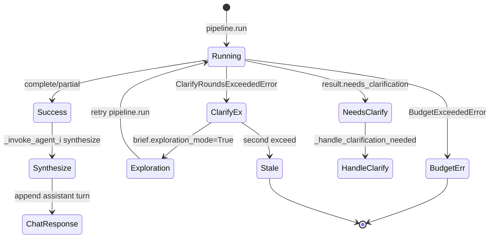

### §Z.4.11.1


**Dòng 424** `    def _run_pipeline_and_respond(` — Định nghĩa phương thức `_run_pipeline_and_respond`; xem khối thân bên dưới để biết side-effect Redis/Mongo/HTTP.
**Dòng 425** `        self,` — Thực thi bước trung gian trong luồng điều phối phiên.
**Dòng 426** `        *,` — Thực thi bước trung gian trong luồng điều phối phiên.
**Dòng 427** `        session_id: str,` — Thực thi bước trung gian trong luồng điều phối phiên.
**Dòng 428** `        analysis_id: str,` — Thực thi bước trung gian trong luồng điều phối phiên.
**Dòng 429** `        brief: AnalysisBrief,` — Thực thi bước trung gian trong luồng điều phối phiên.
**Dòng 430** `        bundle: SessionBundle,` — Thực thi bước trung gian trong luồng điều phối phiên.
**Dòng 431** `        permissions: Any,` — Thực thi bước trung gian trong luồng điều phối phiên.
**Dòng 432** `        invoker: HttpAgentInvoker,` — Thực thi bước trung gian trong luồng điều phối phiên.
**Dòng 433** `        session_budget: SessionTraceBudget,` — Thực thi bước trung gian trong luồng điều phối phiên.
**Dòng 434** `    ) -> ChatResponse:` — Thực thi bước trung gian trong luồng điều phối phiên.
**Dòng 435** `        def on_progress(workflow: Any) -> None:` — Định nghĩa phương thức `on_progress`; xem khối thân bên dưới để biết side-effect Redis/Mongo/HTTP.
**Dòng 436** `            self.stm.save_workflow(session_id, workflow)` — Thao tác trên thuộc tính instance (stm, pipeline, feedback, …); có thể ghi Redis hoặc gọi HTTP gián tiếp.
**Dòng 437** *(dòng trống)* — Ngắt đoạn mã; không thực thi logic.
**Dòng 438** `        deadline = time.monotonic() + float(self.cfg.pipeline.max_sync_seconds)` — Thực thi bước trung gian trong luồng điều phối phiên.
**Dòng 439** `        try:` — Khối bảo vệ gọi agent/budget; lỗi budget → response có `BUDGET_EXCEEDED`.
**Dòng 440** `            result = self.pipeline.run(` — Thực thi bước trung gian trong luồng điều phối phiên.
**Dòng 441** `                brief=brief,` — Thực thi bước trung gian trong luồng điều phối phiên.
**Dòng 442** `                workflow=bundle.workflow,` — Thực thi bước trung gian trong luồng điều phối phiên.
**Dòng 443** `                permissions=permissions,` — Thực thi bước trung gian trong luồng điều phối phiên.
**Dòng 444** `                trace_budget=session_budget.trace_budget,` — Thực thi bước trung gian trong luồng điều phối phiên.
**Dòng 445** `                on_progress=on_progress if self.cfg.pipeline.poll_enabled else None,` — Thực thi bước trung gian trong luồng điều phối phiên.
**Dòng 446** `                deadline=deadline,` — Thực thi bước trung gian trong luồng điều phối phiên.
**Dòng 447** `            )` — Thực thi bước trung gian trong luồng điều phối phiên.
**Dòng 448** `        except ClarifyRoundsExceededError as exc:` — Bắt exception; orchestrator ưu tiên trả `ChatResponse` có `error` thay vì 500.
**Dòng 449** `            brief.exploration_mode = True` — Thực thi bước trung gian trong luồng điều phối phiên.
**Dòng 450** `            brief.user_knowledge_level = "unknown"` — Thực thi bước trung gian trong luồng điều phối phiên.
**Dòng 451** `            bundle.workflow.brief = brief` — Đọc/ghi `SessionBundle` trong bộ nhớ; cần `stm.save_*` để persist.
**Dòng 452** `            resume_analysis(bundle.workflow)` — Thực thi bước trung gian trong luồng điều phối phiên.
**Dòng 453** `            self.stm.save_workflow(session_id, bundle.workflow)` — Thao tác trên thuộc tính instance (stm, pipeline, feedback, …); có thể ghi Redis hoặc gọi HTTP gián tiếp.
**Dòng 454** `            try:` — Khối bảo vệ gọi agent/budget; lỗi budget → response có `BUDGET_EXCEEDED`.
**Dòng 455** `                result = self.pipeline.run(` — Thực thi bước trung gian trong luồng điều phối phiên.
**Dòng 456** `                    brief=brief,` — Thực thi bước trung gian trong luồng điều phối phiên.
**Dòng 457** `                    workflow=bundle.workflow,` — Thực thi bước trung gian trong luồng điều phối phiên.
**Dòng 458** `                    permissions=permissions,` — Thực thi bước trung gian trong luồng điều phối phiên.
**Dòng 459** `                    trace_budget=session_budget.trace_budget,` — Thực thi bước trung gian trong luồng điều phối phiên.
**Dòng 460** `                    on_progress=on_progress if self.cfg.pipeline.poll_enabled else None,` — Thực thi bước trung gian trong luồng điều phối phiên.
**Dòng 461** `                    deadline=deadline,` — Thực thi bước trung gian trong luồng điều phối phiên.
**Dòng 462** `                )` — Thực thi bước trung gian trong luồng điều phối phiên.
**Dòng 463** `            except ClarifyRoundsExceededError:` — Bắt exception; orchestrator ưu tiên trả `ChatResponse` có `error` thay vì 500.
**Dòng 464** `                return ChatResponse(` — Thoát sớm hoặc cuối nhánh; giá trị trả về được `app.py` serialize qua `model_dump()` nếu là `ChatResponse`.
**Dòng 465** `                    session_id=session_id,` — Thực thi bước trung gian trong luồng điều phối phiên.
**Dòng 466** `                    analysis_id=analysis_id,` — Thực thi bước trung gian trong luồng điều phối phiên.
**Dòng 467** `                    workflow_status=WorkflowStatus.STALE.value,` — Thực thi bước trung gian trong luồng điều phối phiên.
**Dòng 468** `                    outcome="error",` — Thực thi bước trung gian trong luồng điều phối phiên.
**Dòng 469** `                    message=str(exc),` — Thực thi bước trung gian trong luồng điều phối phiên.
**Dòng 470** `                    error={"code": "CLARIFY_ROUNDS_EXCEEDED", "retryable": False},` — Thực thi bước trung gian trong luồng điều phối phiên.
**Dòng 471** `                )` — Thực thi bước trung gian trong luồng điều phối phiên.
**Dòng 472** `        except BudgetExceededError as exc:` — Bắt exception; orchestrator ưu tiên trả `ChatResponse` có `error` thay vì 500.
**Dòng 473** `            bundle.workflow.budget_spent = session_budget.trace_budget.spent` — Đọc/ghi `SessionBundle` trong bộ nhớ; cần `stm.save_*` để persist.
**Dòng 474** `            self.stm.save_workflow(session_id, bundle.workflow)` — Thao tác trên thuộc tính instance (stm, pipeline, feedback, …); có thể ghi Redis hoặc gọi HTTP gián tiếp.
**Dòng 475** `            return ChatResponse(` — Thoát sớm hoặc cuối nhánh; giá trị trả về được `app.py` serialize qua `model_dump()` nếu là `ChatResponse`.
**Dòng 476** `                session_id=session_id,` — Thực thi bước trung gian trong luồng điều phối phiên.
**Dòng 477** `                analysis_id=analysis_id,` — Thực thi bước trung gian trong luồng điều phối phiên.
**Dòng 478** `                workflow_status=bundle.workflow.status.value,` — Thực thi bước trung gian trong luồng điều phối phiên.
**Dòng 479** `                outcome="error",` — Thực thi bước trung gian trong luồng điều phối phiên.
**Dòng 480** `                message=str(exc),` — Thực thi bước trung gian trong luồng điều phối phiên.
**Dòng 481** `                error={"code": "BUDGET_EXCEEDED", "retryable": False},` — Thực thi bước trung gian trong luồng điều phối phiên.
**Dòng 482** `            )` — Thực thi bước trung gian trong luồng điều phối phiên.
**Dòng 483** *(dòng trống)* — Ngắt đoạn mã; không thực thi logic.
**Dòng 484** `        bundle.workflow.budget_spent = session_budget.trace_budget.spent` — Đọc/ghi `SessionBundle` trong bộ nhớ; cần `stm.save_*` để persist.
**Dòng 485** *(dòng trống)* — Ngắt đoạn mã; không thực thi logic.
**Dòng 486** `        if result.needs_clarification:` — Phân nhánh điều kiện; quyết định luồng clarify, analysis, hoặc idle.
**Dòng 487** `            return self._handle_clarification_needed(` — Thoát sớm hoặc cuối nhánh; giá trị trả về được `app.py` serialize qua `model_dump()` nếu là `ChatResponse`.
**Dòng 488** `                session_id=session_id,` — Thực thi bước trung gian trong luồng điều phối phiên.
**Dòng 489** `                analysis_id=analysis_id,` — Thực thi bước trung gian trong luồng điều phối phiên.
**Dòng 490** `                result=result,` — Thực thi bước trung gian trong luồng điều phối phiên.
**Dòng 491** `                brief=brief,` — Thực thi bước trung gian trong luồng điều phối phiên.
**Dòng 492** `                bundle=bundle,` — Thực thi bước trung gian trong luồng điều phối phiên.
**Dòng 493** `                permissions=permissions,` — Thực thi bước trung gian trong luồng điều phối phiên.
**Dòng 494** `                invoker=invoker,` — Thực thi bước trung gian trong luồng điều phối phiên.
**Dòng 495** `                session_budget=session_budget,` — Thực thi bước trung gian trong luồng điều phối phiên.
**Dòng 496** `            )` — Thực thi bước trung gian trong luồng điều phối phiên.
**Dòng 497** *(dòng trống)* — Ngắt đoạn mã; không thực thi logic.
**Dòng 498** `        try:` — Khối bảo vệ gọi agent/budget; lỗi budget → response có `BUDGET_EXCEEDED`.
**Dòng 499** `            synth = self._invoke_agent_i(` — Thực thi bước trung gian trong luồng điều phối phiên.
**Dòng 500** `                invoker,` — Thực thi bước trung gian trong luồng điều phối phiên.
**Dòng 501** `                {},` — Thực thi bước trung gian trong luồng điều phối phiên.
**Dòng 502** `                {` — Thực thi bước trung gian trong luồng điều phối phiên.
**Dòng 503** `                    "mode": "synthesize",` — Thực thi bước trung gian trong luồng điều phối phiên.
**Dòng 504** `                    "session_id": session_id,` — Thực thi bước trung gian trong luồng điều phối phiên.
**Dòng 505** `                    "actor_id": permissions.actor_id,` — Thực thi bước trung gian trong luồng điều phối phiên.
**Dòng 506** `                    "technical_summary": result.technical_summary.model_dump(),` — Thực thi bước trung gian trong luồng điều phối phiên.
**Dòng 507** `                },` — Thực thi bước trung gian trong luồng điều phối phiên.
**Dòng 508** `                session_budget,` — Thực thi bước trung gian trong luồng điều phối phiên.
**Dòng 509** `                bundle,` — Thực thi bước trung gian trong luồng điều phối phiên.
**Dòng 510** `            )` — Thực thi bước trung gian trong luồng điều phối phiên.
**Dòng 511** `        except BudgetExceededError as exc:` — Bắt exception; orchestrator ưu tiên trả `ChatResponse` có `error` thay vì 500.
**Dòng 512** `            bundle.workflow.budget_spent = session_budget.trace_budget.spent` — Đọc/ghi `SessionBundle` trong bộ nhớ; cần `stm.save_*` để persist.
**Dòng 513** `            self.stm.save_workflow(session_id, bundle.workflow)` — Thao tác trên thuộc tính instance (stm, pipeline, feedback, …); có thể ghi Redis hoặc gọi HTTP gián tiếp.
**Dòng 514** `            return ChatResponse(` — Thoát sớm hoặc cuối nhánh; giá trị trả về được `app.py` serialize qua `model_dump()` nếu là `ChatResponse`.
**Dòng 515** `                session_id=session_id,` — Thực thi bước trung gian trong luồng điều phối phiên.
**Dòng 516** `                analysis_id=analysis_id,` — Thực thi bước trung gian trong luồng điều phối phiên.
**Dòng 517** `                trace_id=result.trace_id,` — Thực thi bước trung gian trong luồng điều phối phiên.
**Dòng 518** `                workflow_status=bundle.workflow.status.value,` — Thực thi bước trung gian trong luồng điều phối phiên.
**Dòng 519** `                outcome=result.outcome,` — Thực thi bước trung gian trong luồng điều phối phiên.
**Dòng 520** `                message=result.technical_summary.outcome,` — Thực thi bước trung gian trong luồng điều phối phiên.
**Dòng 521** `                error={"code": "BUDGET_EXCEEDED", "retryable": False},` — Thực thi bước trung gian trong luồng điều phối phiên.
**Dòng 522** `            )` — Thực thi bước trung gian trong luồng điều phối phiên.
**Dòng 523** *(dòng trống)* — Ngắt đoạn mã; không thực thi logic.
**Dòng 524** `        assistant = TranscriptTurn(` — Thực thi bước trung gian trong luồng điều phối phiên.
**Dòng 525** `            id=str(uuid4()),` — Thực thi bước trung gian trong luồng điều phối phiên.
**Dòng 526** `            role="assistant",` — Thực thi bước trung gian trong luồng điều phối phiên.
**Dòng 527** `            content=synth.get("user_message", ""),` — Thực thi bước trung gian trong luồng điều phối phiên.
**Dòng 528** `            at=utc_now().isoformat(),` — Thực thi bước trung gian trong luồng điều phối phiên.
**Dòng 529** `            analysis_id=analysis_id,` — Thực thi bước trung gian trong luồng điều phối phiên.
**Dòng 530** `            trace_id=result.trace_id,` — Thực thi bước trung gian trong luồng điều phối phiên.
**Dòng 531** `        )` — Thực thi bước trung gian trong luồng điều phối phiên.
**Dòng 532** `        bundle.transcript.append(assistant)` — Đọc/ghi `SessionBundle` trong bộ nhớ; cần `stm.save_*` để persist.
**Dòng 533** `        self.stm.save_transcript(session_id, bundle.transcript)` — Thao tác trên thuộc tính instance (stm, pipeline, feedback, …); có thể ghi Redis hoặc gọi HTTP gián tiếp.
**Dòng 534** `        self.stm.save_workflow(session_id, bundle.workflow)` — Thao tác trên thuộc tính instance (stm, pipeline, feedback, …); có thể ghi Redis hoặc gọi HTTP gián tiếp.
**Dòng 535** `        return ChatResponse(` — Thoát sớm hoặc cuối nhánh; giá trị trả về được `app.py` serialize qua `model_dump()` nếu là `ChatResponse`.
**Dòng 536** `            session_id=session_id,` — Thực thi bước trung gian trong luồng điều phối phiên.
**Dòng 537** `            analysis_id=analysis_id,` — Thực thi bước trung gian trong luồng điều phối phiên.
**Dòng 538** `            trace_id=result.trace_id,` — Thực thi bước trung gian trong luồng điều phối phiên.
**Dòng 539** `            workflow_status=bundle.workflow.status.value,` — Thực thi bước trung gian trong luồng điều phối phiên.
**Dòng 540** `            outcome=result.outcome,` — Thực thi bước trung gian trong luồng điều phối phiên.
**Dòng 541** `            message=synth.get("user_message", ""),` — Thực thi bước trung gian trong luồng điều phối phiên.
**Dòng 542** `            artifacts=[{"url": u} for u in result.technical_summary.artifact_urls],` — Thực thi bước trung gian trong luồng điều phối phiên.
**Dòng 543** `        )` — Thực thi bước trung gian trong luồng điều phối phiên.
### §Z.4.12 — `_handle_clarification_needed` (dòng 545–648)

Pipeline trả NEEDS_CLARIFICATION: thử bridge tự resolve từ transcript; nếu không → Agent I clarify → suspend AWAITING_CLARIFICATION.

### §Z.4.12.1


**Dòng 545** `    def _handle_clarification_needed(` — Định nghĩa phương thức `_handle_clarification_needed`; xem khối thân bên dưới để biết side-effect Redis/Mongo/HTTP.
**Dòng 546** `        self,` — Thực thi bước trung gian trong luồng điều phối phiên.
**Dòng 547** `        *,` — Thực thi bước trung gian trong luồng điều phối phiên.
**Dòng 548** `        session_id: str,` — Thực thi bước trung gian trong luồng điều phối phiên.
**Dòng 549** `        analysis_id: str,` — Thực thi bước trung gian trong luồng điều phối phiên.
**Dòng 550** `        result: Any,` — Thực thi bước trung gian trong luồng điều phối phiên.
**Dòng 551** `        brief: AnalysisBrief,` — Thực thi bước trung gian trong luồng điều phối phiên.
**Dòng 552** `        bundle: SessionBundle,` — Thực thi bước trung gian trong luồng điều phối phiên.
**Dòng 553** `        permissions: Any,` — Thực thi bước trung gian trong luồng điều phối phiên.
**Dòng 554** `        invoker: HttpAgentInvoker,` — Thực thi bước trung gian trong luồng điều phối phiên.
**Dòng 555** `        session_budget: SessionTraceBudget,` — Thực thi bước trung gian trong luồng điều phối phiên.
**Dòng 556** `    ) -> ChatResponse:` — Thực thi bước trung gian trong luồng điều phối phiên.
**Dòng 557** `        assert result.needs_clarification is not None` — Thực thi bước trung gian trong luồng điều phối phiên.
**Dòng 558** `        try:` — Khối bảo vệ gọi agent/budget; lỗi budget → response có `BUDGET_EXCEEDED`.
**Dòng 559** `            bridge = self._invoke_agent_i(` — Thực thi bước trung gian trong luồng điều phối phiên.
**Dòng 560** `                invoker,` — Thực thi bước trung gian trong luồng điều phối phiên.
**Dòng 561** `                {},` — Thực thi bước trung gian trong luồng điều phối phiên.
**Dòng 562** `                {` — Thực thi bước trung gian trong luồng điều phối phiên.
**Dòng 563** `                    "mode": "clarification_bridge",` — Thực thi bước trung gian trong luồng điều phối phiên.
**Dòng 564** `                    "session_id": session_id,` — Thực thi bước trung gian trong luồng điều phối phiên.
**Dòng 565** `                    "actor_id": permissions.actor_id,` — Thực thi bước trung gian trong luồng điều phối phiên.
**Dòng 566** `                    "clarification_request": result.needs_clarification.model_dump(),` — Thực thi bước trung gian trong luồng điều phối phiên.
**Dòng 567** `                    "transcript": [t.model_dump() for t in bundle.transcript],` — Thực thi bước trung gian trong luồng điều phối phiên.
**Dòng 568** `                },` — Thực thi bước trung gian trong luồng điều phối phiên.
**Dòng 569** `                session_budget,` — Thực thi bước trung gian trong luồng điều phối phiên.
**Dòng 570** `                bundle,` — Thực thi bước trung gian trong luồng điều phối phiên.
**Dòng 571** `            )` — Thực thi bước trung gian trong luồng điều phối phiên.
**Dòng 572** `        except BudgetExceededError as exc:` — Bắt exception; orchestrator ưu tiên trả `ChatResponse` có `error` thay vì 500.
**Dòng 573** `            bundle.workflow.budget_spent = session_budget.trace_budget.spent` — Đọc/ghi `SessionBundle` trong bộ nhớ; cần `stm.save_*` để persist.
**Dòng 574** `            self.stm.save_workflow(session_id, bundle.workflow)` — Thao tác trên thuộc tính instance (stm, pipeline, feedback, …); có thể ghi Redis hoặc gọi HTTP gián tiếp.
**Dòng 575** `            return ChatResponse(` — Thoát sớm hoặc cuối nhánh; giá trị trả về được `app.py` serialize qua `model_dump()` nếu là `ChatResponse`.
**Dòng 576** `                session_id=session_id,` — Thực thi bước trung gian trong luồng điều phối phiên.
**Dòng 577** `                analysis_id=analysis_id,` — Thực thi bước trung gian trong luồng điều phối phiên.
**Dòng 578** `                trace_id=result.trace_id,` — Thực thi bước trung gian trong luồng điều phối phiên.
**Dòng 579** `                workflow_status=WorkflowStatus.AWAITING_CLARIFICATION.value,` — Thực thi bước trung gian trong luồng điều phối phiên.
**Dòng 580** `                outcome=result.outcome,` — Thực thi bước trung gian trong luồng điều phối phiên.
**Dòng 581** `                message=str(exc),` — Thực thi bước trung gian trong luồng điều phối phiên.
**Dòng 582** `                error={"code": "BUDGET_EXCEEDED", "retryable": False},` — Thực thi bước trung gian trong luồng điều phối phiên.
**Dòng 583** `            )` — Thực thi bước trung gian trong luồng điều phối phiên.
**Dòng 584** *(dòng trống)* — Ngắt đoạn mã; không thực thi logic.
**Dòng 585** `        if bridge.get("action") == "resolve_from_transcript":` — Phân nhánh điều kiện; quyết định luồng clarify, analysis, hoặc idle.
**Dòng 586** `            brief, should_rerun = self.clarify.on_pipeline_clarify(` — Thực thi bước trung gian trong luồng điều phối phiên.
**Dòng 587** `                result=result,` — Thực thi bước trung gian trong luồng điều phối phiên.
**Dòng 588** `                brief=brief,` — Thực thi bước trung gian trong luồng điều phối phiên.
**Dòng 589** `                bridge=bridge,` — Thực thi bước trung gian trong luồng điều phối phiên.
**Dòng 590** `                analysis_id=analysis_id,` — Thực thi bước trung gian trong luồng điều phối phiên.
**Dòng 591** `            )` — Thực thi bước trung gian trong luồng điều phối phiên.
**Dòng 592** `            if should_rerun:` — Phân nhánh điều kiện; quyết định luồng clarify, analysis, hoặc idle.
**Dòng 593** `                bundle.workflow.brief = brief` — Đọc/ghi `SessionBundle` trong bộ nhớ; cần `stm.save_*` để persist.
**Dòng 594** `                resume_analysis(bundle.workflow)` — Thực thi bước trung gian trong luồng điều phối phiên.
**Dòng 595** `                bundle.workflow.budget_spent = session_budget.trace_budget.spent` — Đọc/ghi `SessionBundle` trong bộ nhớ; cần `stm.save_*` để persist.
**Dòng 596** `                self.stm.save_workflow(session_id, bundle.workflow)` — Thao tác trên thuộc tính instance (stm, pipeline, feedback, …); có thể ghi Redis hoặc gọi HTTP gián tiếp.
**Dòng 597** `                return self._run_pipeline_and_respond(` — Thoát sớm hoặc cuối nhánh; giá trị trả về được `app.py` serialize qua `model_dump()` nếu là `ChatResponse`.
**Dòng 598** `                    session_id=session_id,` — Thực thi bước trung gian trong luồng điều phối phiên.
**Dòng 599** `                    analysis_id=analysis_id,` — Thực thi bước trung gian trong luồng điều phối phiên.
**Dòng 600** `                    brief=brief,` — Thực thi bước trung gian trong luồng điều phối phiên.
**Dòng 601** `                    bundle=bundle,` — Thực thi bước trung gian trong luồng điều phối phiên.
**Dòng 602** `                    permissions=permissions,` — Thực thi bước trung gian trong luồng điều phối phiên.
**Dòng 603** `                    invoker=invoker,` — Thực thi bước trung gian trong luồng điều phối phiên.
**Dòng 604** `                    session_budget=session_budget,` — Thực thi bước trung gian trong luồng điều phối phiên.
**Dòng 605** `                )` — Thực thi bước trung gian trong luồng điều phối phiên.
**Dòng 606** *(dòng trống)* — Ngắt đoạn mã; không thực thi logic.
**Dòng 607** `        try:` — Khối bảo vệ gọi agent/budget; lỗi budget → response có `BUDGET_EXCEEDED`.
**Dòng 608** `            clarify = self._invoke_agent_i(` — Thực thi bước trung gian trong luồng điều phối phiên.
**Dòng 609** `                invoker,` — Thực thi bước trung gian trong luồng điều phối phiên.
**Dòng 610** `                {},` — Thực thi bước trung gian trong luồng điều phối phiên.
**Dòng 611** `                {` — Thực thi bước trung gian trong luồng điều phối phiên.
**Dòng 612** `                    "mode": "clarify",` — Thực thi bước trung gian trong luồng điều phối phiên.
**Dòng 613** `                    "session_id": session_id,` — Thực thi bước trung gian trong luồng điều phối phiên.
**Dòng 614** `                    "actor_id": permissions.actor_id,` — Thực thi bước trung gian trong luồng điều phối phiên.
**Dòng 615** `                    "clarification_request": result.needs_clarification.model_dump(),` — Thực thi bước trung gian trong luồng điều phối phiên.
**Dòng 616** `                },` — Thực thi bước trung gian trong luồng điều phối phiên.
**Dòng 617** `                session_budget,` — Thực thi bước trung gian trong luồng điều phối phiên.
**Dòng 618** `                bundle,` — Thực thi bước trung gian trong luồng điều phối phiên.
**Dòng 619** `            )` — Thực thi bước trung gian trong luồng điều phối phiên.
**Dòng 620** `        except BudgetExceededError as exc:` — Bắt exception; orchestrator ưu tiên trả `ChatResponse` có `error` thay vì 500.
**Dòng 621** `            bundle.workflow.budget_spent = session_budget.trace_budget.spent` — Đọc/ghi `SessionBundle` trong bộ nhớ; cần `stm.save_*` để persist.
**Dòng 622** `            self.stm.save_workflow(session_id, bundle.workflow)` — Thao tác trên thuộc tính instance (stm, pipeline, feedback, …); có thể ghi Redis hoặc gọi HTTP gián tiếp.
**Dòng 623** `            return ChatResponse(` — Thoát sớm hoặc cuối nhánh; giá trị trả về được `app.py` serialize qua `model_dump()` nếu là `ChatResponse`.
**Dòng 624** `                session_id=session_id,` — Thực thi bước trung gian trong luồng điều phối phiên.
**Dòng 625** `                analysis_id=analysis_id,` — Thực thi bước trung gian trong luồng điều phối phiên.
**Dòng 626** `                trace_id=result.trace_id,` — Thực thi bước trung gian trong luồng điều phối phiên.
**Dòng 627** `                workflow_status=WorkflowStatus.AWAITING_CLARIFICATION.value,` — Thực thi bước trung gian trong luồng điều phối phiên.
**Dòng 628** `                outcome=result.outcome,` — Thực thi bước trung gian trong luồng điều phối phiên.
**Dòng 629** `                message=str(exc),` — Thực thi bước trung gian trong luồng điều phối phiên.
**Dòng 630** `                error={"code": "BUDGET_EXCEEDED", "retryable": False},` — Thực thi bước trung gian trong luồng điều phối phiên.
**Dòng 631** `            )` — Thực thi bước trung gian trong luồng điều phối phiên.
**Dòng 632** *(dòng trống)* — Ngắt đoạn mã; không thực thi logic.
**Dòng 633** `        bundle.workflow.budget_spent = session_budget.trace_budget.spent` — Đọc/ghi `SessionBundle` trong bộ nhớ; cần `stm.save_*` để persist.
**Dòng 634** `        self.stm.save_clarification(session_id, result.needs_clarification.model_dump())` — Thao tác trên thuộc tính instance (stm, pipeline, feedback, …); có thể ghi Redis hoặc gọi HTTP gián tiếp.
**Dòng 635** `        self.stm.save_workflow(session_id, bundle.workflow)` — Thao tác trên thuộc tính instance (stm, pipeline, feedback, …); có thể ghi Redis hoặc gọi HTTP gián tiếp.
**Dòng 636** `        return self.clarify.suspend_response(` — Thoát sớm hoặc cuối nhánh; giá trị trả về được `app.py` serialize qua `model_dump()` nếu là `ChatResponse`.
**Dòng 637** `            session_id=session_id,` — Thực thi bước trung gian trong luồng điều phối phiên.
**Dòng 638** `            analysis_id=analysis_id,` — Thực thi bước trung gian trong luồng điều phối phiên.
**Dòng 639** `            request=result.needs_clarification,` — Thực thi bước trung gian trong luồng điều phối phiên.
**Dòng 640** `            clarify_payload=clarify,` — Thực thi bước trung gian trong luồng điều phối phiên.
**Dòng 641** `            workflow_status=WorkflowStatus.AWAITING_CLARIFICATION.value,` — Thực thi bước trung gian trong luồng điều phối phiên.
**Dòng 642** `        ).model_copy(` — Thực thi bước trung gian trong luồng điều phối phiên.
**Dòng 643** `            update={` — Thực thi bước trung gian trong luồng điều phối phiên.
**Dòng 644** `                "trace_id": result.trace_id,` — Thực thi bước trung gian trong luồng điều phối phiên.
**Dòng 645** `                "outcome": result.outcome,` — Thực thi bước trung gian trong luồng điều phối phiên.
**Dòng 646** `                "bridge_action": "ask_user",` — Thực thi bước trung gian trong luồng điều phối phiên.
**Dòng 647** `            }` — Thực thi bước trung gian trong luồng điều phối phiên.
**Dòng 648** `        )` — Thực thi bước trung gian trong luồng điều phối phiên.
### §Z.4.13 — `app.py`: vòng đời request và middleware ẩn

FastAPI không định nghĩa middleware tùy chỉnh trong mã; thay vào đó dùng **exception handler**, **Depends injection**, và **lazy singleton**. Phần này mô tả thứ tự thực thi thực tế trên mỗi request — khác với bảng route §Z.2.5.

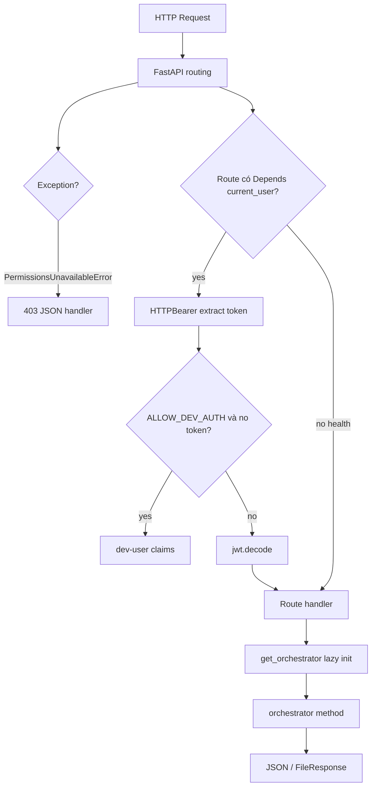

**app.py dòng 1** `from __future__ import annotations` — Bootstrap: `load_project_env()` trước import orchestrator để biến môi trường sẵn sàng.
**app.py dòng 2** *(trống)*
**app.py dòng 3** `import os` — Bootstrap: `load_project_env()` trước import orchestrator để biến môi trường sẵn sàng.
**app.py dòng 4** `from pathlib import Path` — Bootstrap: `load_project_env()` trước import orchestrator để biến môi trường sẵn sàng.
**app.py dòng 5** `from typing import Any` — Bootstrap: `load_project_env()` trước import orchestrator để biến môi trường sẵn sàng.
**app.py dòng 6** *(trống)*
**app.py dòng 7** `from fastapi import Depends, FastAPI, File, HTTPException, Request, UploadFile` — Bootstrap: `load_project_env()` trước import orchestrator để biến môi trường sẵn sàng.
**app.py dòng 8** `from fastapi.responses import FileResponse, JSONResponse` — Bootstrap: `load_project_env()` trước import orchestrator để biến môi trường sẵn sàng.
**app.py dòng 9** `from pydantic import BaseModel` — Bootstrap: `load_project_env()` trước import orchestrator để biến môi trường sẵn sàng.
**app.py dòng 10** *(trống)*
**app.py dòng 11** `from project_core.config.env import load_project_env` — Bootstrap: `load_project_env()` trước import orchestrator để biến môi trường sẵn sàng.
**app.py dòng 12** `from project_core.domain.contracts.clarification import ClarificationReply` — Bootstrap: `load_project_env()` trước import orchestrator để biến môi trường sẵn sàng.
**app.py dòng 13** `from project_core.domain.contracts.feedback import FeedbackRecord` — Bootstrap: `load_project_env()` trước import orchestrator để biến môi trường sẵn sàng.
**app.py dòng 14** `from project_core.domain.errors.codes import PermissionsUnavailableError` — Bootstrap: `load_project_env()` trước import orchestrator để biến môi trường sẵn sàng.
**app.py dòng 15** `from project_core.ingest.attachments import ingest_file` — Bootstrap: `load_project_env()` trước import orchestrator để biến môi trường sẵn sàng.
**app.py dòng 16** *(trống)*
**app.py dòng 17** `from chat_gateway.auth import current_user, issue_token` — Bootstrap: `load_project_env()` trước import orchestrator để biến môi trường sẵn sàng.
**app.py dòng 18** `from chat_gateway.orchestrator import ChatOrchestrator` — Bootstrap: `load_project_env()` trước import orchestrator để biến môi trường sẵn sàng.
**app.py dòng 19** *(trống)*
**app.py dòng 20** `load_project_env()` — Bootstrap: `load_project_env()` trước import orchestrator để biến môi trường sẵn sàng.
**app.py dòng 21** *(trống)*
**app.py dòng 22** `app = FastAPI(title="chat-gateway")` — Bootstrap: `load_project_env()` trước import orchestrator để biến môi trường sẵn sàng.
**app.py dòng 23** *(trống)*
**app.py dòng 24** *(trống)*
**app.py dòng 25** `@app.exception_handler(PermissionsUnavailableError)` — Exception handler toàn cục; chuyển `PermissionsUnavailableError` thành 403 thay vì stack trace.
**app.py dòng 26** `async def _permissions_unavailable_handler(` — Exception handler toàn cục; chuyển `PermissionsUnavailableError` thành 403 thay vì stack trace.
**app.py dòng 27** `    _request: Request, exc: PermissionsUnavailableError` — Exception handler toàn cục; chuyển `PermissionsUnavailableError` thành 403 thay vì stack trace.
**app.py dòng 28** `) -> JSONResponse:` — Exception handler toàn cục; chuyển `PermissionsUnavailableError` thành 403 thay vì stack trace.
**app.py dòng 29** `    return JSONResponse(` — Exception handler toàn cục; chuyển `PermissionsUnavailableError` thành 403 thay vì stack trace.
**app.py dòng 30** `        status_code=403,` — Exception handler toàn cục; chuyển `PermissionsUnavailableError` thành 403 thay vì stack trace.
**app.py dòng 31** `        content={"detail": "permissions_unavailable", "code": exc.code},` — Exception handler toàn cục; chuyển `PermissionsUnavailableError` thành 403 thay vì stack trace.
**app.py dòng 32** `    )` — Exception handler toàn cục; chuyển `PermissionsUnavailableError` thành 403 thay vì stack trace.
**app.py dòng 33** `_orchestrator: ChatOrchestrator | None = None` — Exception handler toàn cục; chuyển `PermissionsUnavailableError` thành 403 thay vì stack trace.
**app.py dòng 34** *(trống)*
**app.py dòng 35** *(trống)*
**app.py dòng 36** `def get_orchestrator() -> ChatOrchestrator:` — Singleton pattern; worker uvicorn giữ một orchestrator — Mongo/Redis init một lần.
**app.py dòng 37** `    global _orchestrator` — Singleton pattern; worker uvicorn giữ một orchestrator — Mongo/Redis init một lần.
**app.py dòng 38** `    if _orchestrator is None:` — Singleton pattern; worker uvicorn giữ một orchestrator — Mongo/Redis init một lần.
**app.py dòng 39** `        _orchestrator = ChatOrchestrator()` — Singleton pattern; worker uvicorn giữ một orchestrator — Mongo/Redis init một lần.
**app.py dòng 40** `    return _orchestrator` — Singleton pattern; worker uvicorn giữ một orchestrator — Mongo/Redis init một lần.
**app.py dòng 41** *(trống)*
**app.py dòng 42** *(trống)*
**app.py dòng 43** `class ChatRequest(BaseModel):` — Schema Pydantic validate body trước handler; lỗi 422 tự động FastAPI.
**app.py dòng 44** `    session_id: str` — Schema Pydantic validate body trước handler; lỗi 422 tự động FastAPI.
**app.py dòng 45** `    message: str` — Schema Pydantic validate body trước handler; lỗi 422 tự động FastAPI.
**app.py dòng 46** *(trống)*
**app.py dòng 47** *(trống)*
**app.py dòng 48** `class ClarifyRequest(BaseModel):` — Schema Pydantic validate body trước handler; lỗi 422 tự động FastAPI.
**app.py dòng 49** `    session_id: str` — Schema Pydantic validate body trước handler; lỗi 422 tự động FastAPI.
**app.py dòng 50** `    reply: ClarificationReply` — Schema Pydantic validate body trước handler; lỗi 422 tự động FastAPI.
**app.py dòng 51** *(trống)*
**app.py dòng 52** *(trống)*
**app.py dòng 53** `class FeedbackRequest(BaseModel):` — Schema Pydantic validate body trước handler; lỗi 422 tự động FastAPI.
**app.py dòng 54** `    session_id: str` — Schema Pydantic validate body trước handler; lỗi 422 tự động FastAPI.
**app.py dòng 55** `    analysis_id: str` — Schema Pydantic validate body trước handler; lỗi 422 tự động FastAPI.
**app.py dòng 56** `    trace_id: str` — Schema Pydantic validate body trước handler; lỗi 422 tự động FastAPI.
**app.py dòng 57** `    sentiment: str` — Schema Pydantic validate body trước handler; lỗi 422 tự động FastAPI.
**app.py dòng 58** `    comment: str | None = None` — Schema Pydantic validate body trước handler; lỗi 422 tự động FastAPI.
**app.py dòng 59** *(trống)*
**app.py dòng 60** *(trống)*
**app.py dòng 61** `class DomainRuleConfirmRequest(BaseModel):` — Schema Pydantic validate body trước handler; lỗi 422 tự động FastAPI.
**app.py dòng 62** `    rule_id: str` — Schema Pydantic validate body trước handler; lỗi 422 tự động FastAPI.
**app.py dòng 63** `    confirmed: bool = True` — Schema Pydantic validate body trước handler; lỗi 422 tự động FastAPI.
**app.py dòng 64** *(trống)*
**app.py dòng 65** *(trống)*
**app.py dòng 66** `class DevLoginRequest(BaseModel):` — Schema Pydantic validate body trước handler; lỗi 422 tự động FastAPI.
**app.py dòng 67** `    actor_id: str = "dev-user"` — Schema Pydantic validate body trước handler; lỗi 422 tự động FastAPI.
**app.py dòng 68** `    role: str = "hq_analyst"` — Schema Pydantic validate body trước handler; lỗi 422 tự động FastAPI.
**app.py dòng 69** *(trống)*
**app.py dòng 70** *(trống)*
**app.py dòng 71** `class LoginRequest(BaseModel):` — Schema Pydantic validate body trước handler; lỗi 422 tự động FastAPI.
**app.py dòng 72** `    username: str` — Schema Pydantic validate body trước handler; lỗi 422 tự động FastAPI.
**app.py dòng 73** `    password: str` — Schema Pydantic validate body trước handler; lỗi 422 tự động FastAPI.
**app.py dòng 74** *(trống)*
**app.py dòng 75** *(trống)*
**app.py dòng 76** `@app.get("/health")` — Route không auth; phù hợp probe nông.
**app.py dòng 77** `def health() -> dict:`
**app.py dòng 78** `    return {"ok": True, "redis": True, "mongo": get_orchestrator().feedback is not None, "agents": {}}`
**app.py dòng 79** *(trống)*
**app.py dòng 80** *(trống)*
**app.py dòng 81** `@app.get("/health/live")` — Health tier: live vs ready; ready mới ping Redis và agent URLs.
**app.py dòng 82** `def health_live() -> dict[str, bool]:`
**app.py dòng 83** `    return {"ok": True}`
**app.py dòng 84** *(trống)*
**app.py dòng 85** *(trống)*
**app.py dòng 86** `@app.get("/health/ready")` — Health tier: live vs ready; ready mới ping Redis và agent URLs.
**app.py dòng 87** `def health_ready() -> dict:`
**app.py dòng 88** `    import httpx`
**app.py dòng 89** *(trống)*
**app.py dòng 90** `    orch = get_orchestrator()`
**app.py dòng 91** `    agents: dict[str, str] = {}`
**app.py dòng 92** `    for key, url in orch.pipeline.agent_invoker.urls.items():  # type: ignore[attr-defined]`
**app.py dòng 93** `        try:`
**app.py dòng 94** `            resp = httpx.get(f"{url}/health", timeout=2.0)`
**app.py dòng 95** `            agents[key] = "ok" if resp.status_code == 200 else "error"`
**app.py dòng 96** `        except Exception:`
**app.py dòng 97** `            agents[key] = "error"`
**app.py dòng 98** `    redis_ok = True`
**app.py dòng 99** `    try:`
**app.py dòng 100** `        orch.stm.client.ping()  # type: ignore[attr-defined]`
**app.py dòng 101** `    except Exception:`
**app.py dòng 102** `        redis_ok = False`
**app.py dòng 103** `    mongo_ok = orch.feedback is not None`
**app.py dòng 104** `    return {"ok": redis_ok and mongo_ok, "redis": redis_ok, "mongo": mongo_ok, "agents": agents}`
**app.py dòng 105** *(trống)*
**app.py dòng 106** *(trống)*
**app.py dòng 107** `@app.post("/auth/dev-login")` — Nhánh auth: dev-login gated bởi ALLOW_DEV_AUTH; login thật qua auth_store.authenticate.
**app.py dòng 108** `def dev_login(body: DevLoginRequest) -> dict[str, str]:` — Nhánh auth: dev-login gated bởi ALLOW_DEV_AUTH; login thật qua auth_store.authenticate.
**app.py dòng 109** `    if os.getenv("ALLOW_DEV_AUTH") != "1":` — Nhánh auth: dev-login gated bởi ALLOW_DEV_AUTH; login thật qua auth_store.authenticate.
**app.py dòng 110** `        raise HTTPException(status_code=403, detail="dev_auth_disabled")` — Nhánh auth: dev-login gated bởi ALLOW_DEV_AUTH; login thật qua auth_store.authenticate.
**app.py dòng 111** `    token = issue_token(body.actor_id, body.role)` — Nhánh auth: dev-login gated bởi ALLOW_DEV_AUTH; login thật qua auth_store.authenticate.
**app.py dòng 112** `    return {"access_token": token, "token_type": "bearer"}` — Nhánh auth: dev-login gated bởi ALLOW_DEV_AUTH; login thật qua auth_store.authenticate.
**app.py dòng 113** *(trống)*
**app.py dòng 114** *(trống)*
**app.py dòng 115** `@app.post("/auth/login")` — Nhánh auth: dev-login gated bởi ALLOW_DEV_AUTH; login thật qua auth_store.authenticate.
**app.py dòng 116** `def login(body: LoginRequest) -> dict[str, str]:` — Nhánh auth: dev-login gated bởi ALLOW_DEV_AUTH; login thật qua auth_store.authenticate.
**app.py dòng 117** `    from chat_gateway.auth_store import authenticate` — Nhánh auth: dev-login gated bởi ALLOW_DEV_AUTH; login thật qua auth_store.authenticate.
**app.py dòng 118** *(trống)*
**app.py dòng 119** `    user = authenticate(body.username, body.password)` — Nhánh auth: dev-login gated bởi ALLOW_DEV_AUTH; login thật qua auth_store.authenticate.
**app.py dòng 120** `    if user is None:` — Nhánh auth: dev-login gated bởi ALLOW_DEV_AUTH; login thật qua auth_store.authenticate.
**app.py dòng 121** `        raise HTTPException(status_code=401, detail="invalid_credentials")` — Nhánh auth: dev-login gated bởi ALLOW_DEV_AUTH; login thật qua auth_store.authenticate.
**app.py dòng 122** `    token = issue_token(user.user_id, user.role, user.store_ids)` — Nhánh auth: dev-login gated bởi ALLOW_DEV_AUTH; login thật qua auth_store.authenticate.
**app.py dòng 123** `    return {` — Nhánh auth: dev-login gated bởi ALLOW_DEV_AUTH; login thật qua auth_store.authenticate.
**app.py dòng 124** `        "access_token": token,` — Nhánh auth: dev-login gated bởi ALLOW_DEV_AUTH; login thật qua auth_store.authenticate.
**app.py dòng 125** `        "token_type": "bearer",` — Nhánh auth: dev-login gated bởi ALLOW_DEV_AUTH; login thật qua auth_store.authenticate.
**app.py dòng 126** `        "role": user.role,` — Nhánh auth: dev-login gated bởi ALLOW_DEV_AUTH; login thật qua auth_store.authenticate.
**app.py dòng 127** `        "display_name": user.display_name,` — Nhánh auth: dev-login gated bởi ALLOW_DEV_AUTH; login thật qua auth_store.authenticate.
**app.py dòng 128** `    }` — Nhánh auth: dev-login gated bởi ALLOW_DEV_AUTH; login thật qua auth_store.authenticate.
**app.py dòng 129** *(trống)*
**app.py dòng 130** *(trống)*
**app.py dòng 131** `@app.get("/auth/login")` — OAuth stub/local/azure; callback trả JWT nội bộ.
**app.py dòng 132** `def oauth_login() -> dict[str, str]:` — OAuth stub/local/azure; callback trả JWT nội bộ.
**app.py dòng 133** `    from chat_gateway.oauth import oauth_provider_from_env` — OAuth stub/local/azure; callback trả JWT nội bộ.
**app.py dòng 134** *(trống)*
**app.py dòng 135** `    provider = oauth_provider_from_env()` — OAuth stub/local/azure; callback trả JWT nội bộ.
**app.py dòng 136** `    state = "dev"` — OAuth stub/local/azure; callback trả JWT nội bộ.
**app.py dòng 137** `    return {"authorization_url": provider.authorization_url(state)}` — OAuth stub/local/azure; callback trả JWT nội bộ.
**app.py dòng 138** *(trống)*
**app.py dòng 139** *(trống)*
**app.py dòng 140** `@app.get("/auth/callback")` — OAuth stub/local/azure; callback trả JWT nội bộ.
**app.py dòng 141** `def oauth_callback(code: str) -> dict[str, Any]:` — OAuth stub/local/azure; callback trả JWT nội bộ.
**app.py dòng 142** `    from chat_gateway.oauth import oauth_provider_from_env` — OAuth stub/local/azure; callback trả JWT nội bộ.
**app.py dòng 143** *(trống)*
**app.py dòng 144** `    return oauth_provider_from_env().exchange_code(code)` — OAuth stub/local/azure; callback trả JWT nội bộ.
**app.py dòng 145** *(trống)*
**app.py dòng 146** *(trống)*
**app.py dòng 147** `@app.post("/chat")` — `/chat`: Depends(current_user) bắt buộc trừ dev; model_dump flatten ChatResponse.
**app.py dòng 148** `def chat(body: ChatRequest, user: dict[str, Any] = Depends(current_user)) -> dict[str, Any]:` — `/chat`: Depends(current_user) bắt buộc trừ dev; model_dump flatten ChatResponse.
**app.py dòng 149** `    resp = get_orchestrator().handle_chat(session_id=body.session_id, message=body.message, user=user)` — `/chat`: Depends(current_user) bắt buộc trừ dev; model_dump flatten ChatResponse.
**app.py dòng 150** `    return resp.model_dump()` — `/chat`: Depends(current_user) bắt buộc trừ dev; model_dump flatten ChatResponse.
**app.py dòng 151** *(trống)*
**app.py dòng 152** *(trống)*
**app.py dòng 153** `@app.post("/chat/clarify")` — `/chat/clarify`: cùng auth; reply là ClarificationReply typed.
**app.py dòng 154** `def chat_clarify(body: ClarifyRequest, user: dict[str, Any] = Depends(current_user)) -> dict[str, Any]:` — `/chat/clarify`: cùng auth; reply là ClarificationReply typed.
**app.py dòng 155** `    resp = get_orchestrator().handle_clarify(session_id=body.session_id, reply=body.reply, user=user)` — `/chat/clarify`: cùng auth; reply là ClarificationReply typed.
**app.py dòng 156** `    return resp.model_dump()` — `/chat/clarify`: cùng auth; reply là ClarificationReply typed.
**app.py dòng 157** *(trống)*
**app.py dòng 158** *(trống)*
**app.py dòng 159** `@app.post("/attachments")` — Upload 20MB cap; ingest_file → attach_external_sources trên workflow brief.
**app.py dòng 160** `async def upload_attachment(` — Upload 20MB cap; ingest_file → attach_external_sources trên workflow brief.
**app.py dòng 161** `    session_id: str,` — Upload 20MB cap; ingest_file → attach_external_sources trên workflow brief.
**app.py dòng 162** `    file: UploadFile = File(...),` — Upload 20MB cap; ingest_file → attach_external_sources trên workflow brief.
**app.py dòng 163** `    user: dict[str, Any] = Depends(current_user),` — Upload 20MB cap; ingest_file → attach_external_sources trên workflow brief.
**app.py dòng 164** `) -> dict[str, Any]:` — Upload 20MB cap; ingest_file → attach_external_sources trên workflow brief.
**app.py dòng 165** `    content = await file.read()` — Upload 20MB cap; ingest_file → attach_external_sources trên workflow brief.
**app.py dòng 166** `    if len(content) > 20 * 1024 * 1024:` — Upload 20MB cap; ingest_file → attach_external_sources trên workflow brief.
**app.py dòng 167** `        raise HTTPException(status_code=413, detail="file_too_large")` — Upload 20MB cap; ingest_file → attach_external_sources trên workflow brief.
**app.py dòng 168** `    source = ingest_file(` — Upload 20MB cap; ingest_file → attach_external_sources trên workflow brief.
**app.py dòng 169** `        session_id=session_id,` — Upload 20MB cap; ingest_file → attach_external_sources trên workflow brief.
**app.py dòng 170** `        file_name=file.filename or "upload.bin",` — Upload 20MB cap; ingest_file → attach_external_sources trên workflow brief.
**app.py dòng 171** `        content=content,` — Upload 20MB cap; ingest_file → attach_external_sources trên workflow brief.
**app.py dòng 172** `    )` — Upload 20MB cap; ingest_file → attach_external_sources trên workflow brief.
**app.py dòng 173** `    get_orchestrator().attach_external_sources(session_id, [source.model_dump()])` — Upload 20MB cap; ingest_file → attach_external_sources trên workflow brief.
**app.py dòng 174** `    return {"status": "ok", "source": source.model_dump()}` — Upload 20MB cap; ingest_file → attach_external_sources trên workflow brief.
**app.py dòng 175** *(trống)*
**app.py dòng 176** *(trống)*
**app.py dòng 177** `@app.post("/domain-rules/confirm")` — Domain rule confirm/reject Mongo qua orchestrator.
**app.py dòng 178** `def confirm_domain_rule(` — Domain rule confirm/reject Mongo qua orchestrator.
**app.py dòng 179** `    body: DomainRuleConfirmRequest,` — Domain rule confirm/reject Mongo qua orchestrator.
**app.py dòng 180** `    user: dict[str, Any] = Depends(current_user),` — Domain rule confirm/reject Mongo qua orchestrator.
**app.py dòng 181** `) -> dict[str, str]:` — Domain rule confirm/reject Mongo qua orchestrator.
**app.py dòng 182** `    return get_orchestrator().confirm_domain_rule(body.rule_id, confirmed=body.confirmed, user=user)` — Domain rule confirm/reject Mongo qua orchestrator.
**app.py dòng 183** *(trống)*
**app.py dòng 184** *(trống)*
**app.py dòng 185** `@app.post("/feedback")` — Feedback explicit; promote analysis tool nếu positive.
**app.py dòng 186** `def feedback(body: FeedbackRequest, user: dict[str, Any] = Depends(current_user)) -> dict[str, str]:` — Feedback explicit; promote analysis tool nếu positive.
**app.py dòng 187** `    orch = get_orchestrator()` — Feedback explicit; promote analysis tool nếu positive.
**app.py dòng 188** `    if orch.feedback:` — Feedback explicit; promote analysis tool nếu positive.
**app.py dòng 189** `        record = FeedbackRecord(` — Feedback explicit; promote analysis tool nếu positive.
**app.py dòng 190** `            id=str(body.trace_id),` — Feedback explicit; promote analysis tool nếu positive.
**app.py dòng 191** `            trace_id=body.trace_id,` — Feedback explicit; promote analysis tool nếu positive.
**app.py dòng 192** `            analysis_id=body.analysis_id,` — Feedback explicit; promote analysis tool nếu positive.
**app.py dòng 193** `            session_id=body.session_id,` — Feedback explicit; promote analysis tool nếu positive.
**app.py dòng 194** `            actor_id=user["sub"],` — Feedback explicit; promote analysis tool nếu positive.
**app.py dòng 195** `            source="explicit",` — Feedback explicit; promote analysis tool nếu positive.
**app.py dòng 196** `            sentiment=body.sentiment,  # type: ignore[arg-type]` — Feedback explicit; promote analysis tool nếu positive.
**app.py dòng 197** `            confidence=1.0,` — Feedback explicit; promote analysis tool nếu positive.
**app.py dòng 198** `            evidence=body.comment or "",` — Feedback explicit; promote analysis tool nếu positive.
**app.py dòng 199** `        )` — Feedback explicit; promote analysis tool nếu positive.
**app.py dòng 200** `        orch.feedback.on_user_feedback(record)` — Feedback explicit; promote analysis tool nếu positive.
**app.py dòng 201** `        if body.sentiment == "positive" and orch.analysis_tool_registry:` — Feedback explicit; promote analysis tool nếu positive.
**app.py dòng 202** `            tool = orch.analysis_tool_registry.find_by_trace(body.trace_id)` — Feedback explicit; promote analysis tool nếu positive.
**app.py dòng 203** `            if tool:` — Feedback explicit; promote analysis tool nếu positive.
**app.py dòng 204** `                orch.analysis_tool_registry.promote(tool["tool_id"])` — Feedback explicit; promote analysis tool nếu positive.
**app.py dòng 205** `    return {"status": "ok"}` — Feedback explicit; promote analysis tool nếu positive.
**app.py dòng 206** *(trống)*
**app.py dòng 207** *(trống)*
**app.py dòng 208** `@app.get("/analysis/{analysis_id}/status")` — Poll analysis status qua Redis find_by_analysis_id.
**app.py dòng 209** `def analysis_status(analysis_id: str, user: dict[str, Any] = Depends(current_user)) -> dict[str, Any]:` — Poll analysis status qua Redis find_by_analysis_id.
**app.py dòng 210** `    return get_orchestrator().analysis_status(analysis_id)` — Poll analysis status qua Redis find_by_analysis_id.
**app.py dòng 211** *(trống)*
**app.py dòng 212** *(trống)*
**app.py dòng 213** `@app.get("/artifacts/{trace_id}/{file_name}")` — Artifact download path traversal guard; optional behavioral download signal.
**app.py dòng 214** `def get_artifact(` — Artifact download path traversal guard; optional behavioral download signal.
**app.py dòng 215** `    trace_id: str,` — Artifact download path traversal guard; optional behavioral download signal.
**app.py dòng 216** `    file_name: str,` — Artifact download path traversal guard; optional behavioral download signal.
**app.py dòng 217** `    session_id: str | None = None,` — Artifact download path traversal guard; optional behavioral download signal.
**app.py dòng 218** `    user: dict[str, Any] = Depends(current_user),` — Artifact download path traversal guard; optional behavioral download signal.
**app.py dòng 219** `) -> FileResponse:` — Artifact download path traversal guard; optional behavioral download signal.
**app.py dòng 220** `    if ".." in file_name or "/" in file_name or "\\" in file_name:` — Artifact download path traversal guard; optional behavioral download signal.
**app.py dòng 221** `        raise HTTPException(status_code=400, detail="invalid_path")` — Artifact download path traversal guard; optional behavioral download signal.
**app.py dòng 222** `    base = Path(os.getenv("ARTIFACTS_DIR", "data/artifacts")) / trace_id / "out"` — Artifact download path traversal guard; optional behavioral download signal.
**app.py dòng 223** `    path = base / file_name` — Artifact download path traversal guard; optional behavioral download signal.
**app.py dòng 224** `    if not path.exists():` — Artifact download path traversal guard; optional behavioral download signal.
**app.py dòng 225** `        raise HTTPException(status_code=404, detail="not_found")` — Artifact download path traversal guard; optional behavioral download signal.
**app.py dòng 226** `    if session_id:` — Artifact download path traversal guard; optional behavioral download signal.
**app.py dòng 227** `        get_orchestrator().record_artifact_download(session_id, trace_id)` — Artifact download path traversal guard; optional behavioral download signal.
**app.py dòng 228** `    return FileResponse(path)` — Artifact download path traversal guard; optional behavioral download signal.
**app.py dòng 229** *(trống)*
**app.py dòng 230** *(trống)*
**app.py dòng 231** `def main() -> None:` — Entry uvicorn; port CHAT_GATEWAY_PORT default 18300.
**app.py dòng 232** `    import uvicorn` — Entry uvicorn; port CHAT_GATEWAY_PORT default 18300.
**app.py dòng 233** *(trống)*
**app.py dòng 234** `    uvicorn.run("chat_gateway.app:app", host="0.0.0.0", port=int(os.getenv("CHAT_GATEWAY_PORT", "18300")))` — Entry uvicorn; port CHAT_GATEWAY_PORT default 18300.
**app.py dòng 235** *(trống)*
**app.py dòng 236** *(trống)*
**app.py dòng 237** `if __name__ == "__main__":` — Entry uvicorn; port CHAT_GATEWAY_PORT default 18300.
**app.py dòng 238** `    main()` — Entry uvicorn; port CHAT_GATEWAY_PORT default 18300.

### §Z.4.14 — Luồng xác thực và phân quyền tích hợp

Ba kênh đăng nhập cùng tồn tại; sau đó mọi route bảo vệ dùng cùng `current_user`.

| Kênh | Endpoint | Điều kiện | Token output |
|------|----------|-----------|--------------|
| Dev | POST /auth/dev-login | ALLOW_DEV_AUTH=1 | issue_token(actor_id, role) |
| Password | POST /auth/login | AUTH_DB_DSN + users table | issue_token + store_ids |
| OAuth | GET /auth/login → callback | OAUTH_PROVIDER azure/local | issue_token mapped user |
| Anonymous dev | *(no header)* | ALLOW_DEV_AUTH=1 on protected routes | synthetic dev-user |

**auth.py — từng dòng runtime:**

**auth.py dòng 1** `from __future__ import annotations`
**auth.py dòng 2** *(trống)*
**auth.py dòng 3** `import logging`
**auth.py dòng 4** `import os`
**auth.py dòng 5** `from datetime import timedelta`
**auth.py dòng 6** *(trống)*
**auth.py dòng 7** `import jwt`
**auth.py dòng 8** `from fastapi import Depends, HTTPException, Request`
**auth.py dòng 9** `from fastapi.security import HTTPAuthorizationCredentials, HTTPBearer`
**auth.py dòng 10** *(trống)*
**auth.py dòng 11** `from project_core.domain.access.user_claims import normalize_store_ids`
**auth.py dòng 12** `from project_core.domain.time import utc_now`
**auth.py dòng 13** *(trống)*
**auth.py dòng 14** `logger = logging.getLogger(__name__)`
**auth.py dòng 15** `_bearer = HTTPBearer(auto_error=False)`
**auth.py dòng 16** `JWT_SECRET = os.getenv("JWT_SECRET", "change-me-in-production")`
**auth.py dòng 17** `JWT_ALG = "HS256"`
**auth.py dòng 18** `_WEAK_SECRETS = frozenset({"change-me-in-production", "changeme", "secret", "dev"})`
**auth.py dòng 19** *(trống)*
**auth.py dòng 20** *(trống)*
**auth.py dòng 21** `def _validate_jwt_secret_at_startup() -> None:` — Startup guard: REQUIRE_PROD_AUTH=1 buộc secret ≥32 ký tự.
**auth.py dòng 22** `    if os.getenv("REQUIRE_PROD_AUTH") == "1":`
**auth.py dòng 23** `        if not JWT_SECRET or JWT_SECRET.lower() in _WEAK_SECRETS or len(JWT_SECRET) < 32:`
**auth.py dòng 24** `            raise RuntimeError("JWT_SECRET too weak for production — set REQUIRE_PROD_AUTH=0 for dev only")`
**auth.py dòng 25** `    elif JWT_SECRET.lower() in _WEAK_SECRETS:`
**auth.py dòng 26** `        logger.warning("JWT_SECRET is default — do not use in production")`
**auth.py dòng 27** *(trống)*
**auth.py dòng 28** *(trống)*
**auth.py dòng 29** `_validate_jwt_secret_at_startup()` — Startup guard: REQUIRE_PROD_AUTH=1 buộc secret ≥32 ký tự.
**auth.py dòng 30** *(trống)*
**auth.py dòng 31** *(trống)*
**auth.py dòng 32** `def issue_token(actor_id: str, role: str, store_ids: list[int] | None = None) -> str:` — Payload JWT: sub, role, store_ids normalized, exp 8h HS256.
**auth.py dòng 33** `    normalized_stores = normalize_store_ids(store_ids)`
**auth.py dòng 34** `    payload = {`
**auth.py dòng 35** `        "sub": actor_id,`
**auth.py dòng 36** `        "role": role,`
**auth.py dòng 37** `        "store_ids": normalized_stores,`
**auth.py dòng 38** `        "exp": utc_now() + timedelta(hours=8),`
**auth.py dòng 39** `    }`
**auth.py dòng 40** `    return jwt.encode(payload, JWT_SECRET, algorithm=JWT_ALG)`
**auth.py dòng 41** *(trống)*
**auth.py dòng 42** *(trống)*
**auth.py dòng 43** `def decode_token(token: str) -> dict:` — PyJWT decode; lỗi → HTTPException 401 invalid_token.
**auth.py dòng 44** `    try:`
**auth.py dòng 45** `        return jwt.decode(token, JWT_SECRET, algorithms=[JWT_ALG])`
**auth.py dòng 46** `    except jwt.PyJWTError as exc:`
**auth.py dòng 47** `        raise HTTPException(status_code=401, detail="invalid_token") from exc`
**auth.py dòng 48** *(trống)*
**auth.py dòng 49** *(trống)*
**auth.py dòng 50** `async def current_user(` — FastAPI dependency; thiếu token + không dev → 401 missing_token.
**auth.py dòng 51** `    credentials: HTTPAuthorizationCredentials | None = Depends(_bearer),`
**auth.py dòng 52** `) -> dict:`
**auth.py dòng 53** `    if credentials is None:`
**auth.py dòng 54** `        if os.getenv("ALLOW_DEV_AUTH") == "1":`
**auth.py dòng 55** `            return {"sub": "dev-user", "role": "hq_analyst", "store_ids": None}`
**auth.py dòng 56** `        raise HTTPException(status_code=401, detail="missing_token")`
**auth.py dòng 57** `    claims = decode_token(credentials.credentials)` — PyJWT decode; lỗi → HTTPException 401 invalid_token.
**auth.py dòng 58** `    claims["store_ids"] = normalize_store_ids(claims.get("store_ids"))`
**auth.py dòng 59** `    return claims`

**auth_store.py — từng dòng (kết nối AUTH DB):**

**auth_store.py dòng 1** `from __future__ import annotations`
**auth_store.py dòng 2** *(trống)*
**auth_store.py dòng 3** `import logging`
**auth_store.py dòng 4** `import os`
**auth_store.py dòng 5** `import time`
**auth_store.py dòng 6** `from dataclasses import dataclass`
**auth_store.py dòng 7** `from typing import Any`
**auth_store.py dòng 8** *(trống)*
**auth_store.py dòng 9** `import bcrypt`
**auth_store.py dòng 10** `import pyodbc`
**auth_store.py dòng 11** *(trống)*
**auth_store.py dòng 12** `from project_core.domain.access.permission_set import PermissionSet`
**auth_store.py dòng 13** `from project_core.domain.access.user_claims import normalize_store_ids`
**auth_store.py dòng 14** *(trống)*
**auth_store.py dòng 15** `logger = logging.getLogger(__name__)`
**auth_store.py dòng 16** *(trống)*
**auth_store.py dòng 17** `_perm_cache: dict[str, tuple[float, PermissionSet]] = {}` — Cache TTL monotonic; giảm tải SQL mỗi /chat.
**auth_store.py dòng 18** `_PERM_CACHE_TTL = float(os.getenv("AUTH_PERMISSIONS_CACHE_TTL", "60"))`
**auth_store.py dòng 19** *(trống)*
**auth_store.py dòng 20** *(trống)*
**auth_store.py dòng 21** `@dataclass(frozen=True)`
**auth_store.py dòng 22** `class AuthUser:`
**auth_store.py dòng 23** `    user_id: str`
**auth_store.py dòng 24** `    username: str`
**auth_store.py dòng 25** `    role: str`
**auth_store.py dòng 26** `    store_ids: list[int] | None`
**auth_store.py dòng 27** `    display_name: str`
**auth_store.py dòng 28** `    email: str`
**auth_store.py dòng 29** *(trống)*
**auth_store.py dòng 30** *(trống)*
**auth_store.py dòng 31** `def _connect() -> pyodbc.Connection:` — pyodbc AUTH_DB_DSN; timeout 15s.
**auth_store.py dòng 32** `    dsn = os.getenv("AUTH_DB_DSN", "").strip()`
**auth_store.py dòng 33** `    if not dsn:`
**auth_store.py dòng 34** `        raise RuntimeError("AUTH_DB_DSN not configured")`
**auth_store.py dòng 35** `    return pyodbc.connect(dsn, timeout=15)`
**auth_store.py dòng 36** *(trống)*
**auth_store.py dòng 37** *(trống)*
**auth_store.py dòng 38** `def verify_password(password: str, password_hash: str) -> bool:` — bcrypt rounds=12; empty hash → False.
**auth_store.py dòng 39** `    if not password_hash:`
**auth_store.py dòng 40** `        return False`
**auth_store.py dòng 41** `    try:`
**auth_store.py dòng 42** `        return bcrypt.checkpw(password.encode("utf-8"), password_hash.encode("utf-8"))`
**auth_store.py dòng 43** `    except ValueError:`
**auth_store.py dòng 44** `        return False`
**auth_store.py dòng 45** *(trống)*
**auth_store.py dòng 46** *(trống)*
**auth_store.py dòng 47** `def hash_password(password: str) -> str:` — bcrypt rounds=12; empty hash → False.
**auth_store.py dòng 48** `    return bcrypt.hashpw(password.encode("utf-8"), bcrypt.gensalt(rounds=12)).decode("utf-8")`
**auth_store.py dòng 49** *(trống)*
**auth_store.py dòng 50** *(trống)*
**auth_store.py dòng 51** `def _row_to_user(row: Any) -> AuthUser:`
**auth_store.py dòng 52** `    store_raw = row.store_ids if hasattr(row, "store_ids") else row[4]`
**auth_store.py dòng 53** `    return AuthUser(`
**auth_store.py dòng 54** `        user_id=str(row.user_id if hasattr(row, "user_id") else row[0]),`
**auth_store.py dòng 55** `        username=str(row.username if hasattr(row, "username") else row[1]),`
**auth_store.py dòng 56** `        role=str(row.role if hasattr(row, "role") else row[2]),`
**auth_store.py dòng 57** `        store_ids=normalize_store_ids(store_raw),`
**auth_store.py dòng 58** `        display_name=str(row.display_name if hasattr(row, "display_name") else row[5]),`
**auth_store.py dòng 59** `        email=str(row.email if hasattr(row, "email") else row[6]),`
**auth_store.py dòng 60** `    )`
**auth_store.py dòng 61** *(trống)*
**auth_store.py dòng 62** *(trống)*
**auth_store.py dòng 63** `def authenticate(username: str, password: str) -> AuthUser | None:` — SELECT users WHERE active; bcrypt verify; None nếu sai.
**auth_store.py dòng 64** `    """Lookup user by username and verify bcrypt password_hash."""`
**auth_store.py dòng 65** `    username = username.strip()`
**auth_store.py dòng 66** `    if not username or not password:`
**auth_store.py dòng 67** `        return None`
**auth_store.py dòng 68** `    try:`
**auth_store.py dòng 69** `        with _connect() as conn:` — pyodbc AUTH_DB_DSN; timeout 15s.
**auth_store.py dòng 70** `            cursor = conn.cursor()`
**auth_store.py dòng 71** `            cursor.execute(`
**auth_store.py dòng 72** `                """`
**auth_store.py dòng 73** `                SELECT user_id, username, role, password_hash, store_ids, display_name, email`
**auth_store.py dòng 74** `                FROM users`
**auth_store.py dòng 75** `                WHERE username = ? AND is_active = 1`
**auth_store.py dòng 76** `                """,`
**auth_store.py dòng 77** `                username,`
**auth_store.py dòng 78** `            )`
**auth_store.py dòng 79** `            row = cursor.fetchone()`
**auth_store.py dòng 80** `            if row is None:`
**auth_store.py dòng 81** `                return None`
**auth_store.py dòng 82** `            password_hash = str(row.password_hash if hasattr(row, "password_hash") else row[3])`
**auth_store.py dòng 83** `            if not verify_password(password, password_hash):` — bcrypt rounds=12; empty hash → False.
**auth_store.py dòng 84** `                return None`
**auth_store.py dòng 85** `            return _row_to_user(row)`
**auth_store.py dòng 86** `    except pyodbc.Error as exc:`
**auth_store.py dòng 87** `        logger.warning("AUTH_DB login failed: %s", exc)`
**auth_store.py dòng 88** `        return None`
**auth_store.py dòng 89** `    except RuntimeError:`
**auth_store.py dòng 90** `        logger.warning("AUTH_DB_DSN missing — cannot authenticate")`
**auth_store.py dòng 91** `        return None`
**auth_store.py dòng 92** *(trống)*
**auth_store.py dòng 93** *(trống)*
**auth_store.py dòng 94** `def load_effective_permissions(user_id: str) -> PermissionSet | None:` — UNION role perms ± user grant/revoke → PermissionSet.
**auth_store.py dòng 95** `    """Resolve capability keys for a user from the AUTH DB.`
**auth_store.py dòng 96** *(trống)*
**auth_store.py dòng 97** `    Effective = role_permissions[user.role] UNION user_permissions(grant)`
**auth_store.py dòng 98** `                MINUS user_permissions(revoke).`
**auth_store.py dòng 99** *(trống)*
**auth_store.py dòng 100** `    Returns ``None`` when the user is inactive/absent or the DB / permission`
**auth_store.py dòng 101** `    tables are unavailable. Callers treat ``None`` as fail-closed (deny access);`
**auth_store.py dòng 102** `    only dev mode (``ALLOW_DEV_AUTH=1``) falls back to YAML roles. Cached per`
**auth_store.py dòng 103** `    user with a short TTL to avoid a DB round-trip on every ``/chat``.`
**auth_store.py dòng 104** `    """`
**auth_store.py dòng 105** `    now = time.monotonic()`
**auth_store.py dòng 106** `    cached = _perm_cache.get(user_id)` — Cache TTL monotonic; giảm tải SQL mỗi /chat.
**auth_store.py dòng 107** `    if cached and cached[0] > now:`
**auth_store.py dòng 108** `        return cached[1]`
**auth_store.py dòng 109** `    try:`
**auth_store.py dòng 110** `        with _connect() as conn:` — pyodbc AUTH_DB_DSN; timeout 15s.
**auth_store.py dòng 111** `            cursor = conn.cursor()`
**auth_store.py dòng 112** `            cursor.execute(`
**auth_store.py dòng 113** `                "SELECT role FROM users WHERE user_id = ? AND is_active = 1",`
**auth_store.py dòng 114** `                user_id,`
**auth_store.py dòng 115** `            )`
**auth_store.py dòng 116** `            row = cursor.fetchone()`
**auth_store.py dòng 117** `            if row is None:`
**auth_store.py dòng 118** `                return None`
**auth_store.py dòng 119** `            role = str(row[0])`
**auth_store.py dòng 120** `            cursor.execute(`
**auth_store.py dòng 121** `                "SELECT permission_key FROM role_permissions WHERE role_key = ?",`
**auth_store.py dòng 122** `                role,`
**auth_store.py dòng 123** `            )`
**auth_store.py dòng 124** `            keys = {str(r[0]) for r in cursor.fetchall()}`
**auth_store.py dòng 125** `            cursor.execute(`
**auth_store.py dòng 126** `                "SELECT permission_key, effect FROM user_permissions WHERE user_id = ?",`
**auth_store.py dòng 127** `                user_id,`
**auth_store.py dòng 128** `            )`
**auth_store.py dòng 129** `            for pk, effect in cursor.fetchall():`
**auth_store.py dòng 130** `                if str(effect).lower() == "revoke":`
**auth_store.py dòng 131** `                    keys.discard(str(pk))`
**auth_store.py dòng 132** `                else:`
**auth_store.py dòng 133** `                    keys.add(str(pk))`
**auth_store.py dòng 134** `            perm_set = PermissionSet.from_keys(keys)`
**auth_store.py dòng 135** `            _perm_cache[user_id] = (now + _PERM_CACHE_TTL, perm_set)` — Cache TTL monotonic; giảm tải SQL mỗi /chat.
**auth_store.py dòng 136** `            return perm_set`
**auth_store.py dòng 137** `    except pyodbc.Error as exc:`
**auth_store.py dòng 138** `        logger.warning("AUTH_DB permissions load failed: %s", exc)`
**auth_store.py dòng 139** `        return None`
**auth_store.py dòng 140** `    except RuntimeError:`
**auth_store.py dòng 141** `        logger.warning("AUTH_DB_DSN missing — cannot load permissions")`
**auth_store.py dòng 142** `        return None`
**auth_store.py dòng 143** *(trống)*
**auth_store.py dòng 144** *(trống)*
**auth_store.py dòng 145** `def get_user_by_id(user_id: str) -> AuthUser | None:`
**auth_store.py dòng 146** `    try:`
**auth_store.py dòng 147** `        with _connect() as conn:` — pyodbc AUTH_DB_DSN; timeout 15s.
**auth_store.py dòng 148** `            cursor = conn.cursor()`
**auth_store.py dòng 149** `            cursor.execute(`
**auth_store.py dòng 150** `                """`
**auth_store.py dòng 151** `                SELECT user_id, username, role, password_hash, store_ids, display_name, email`
**auth_store.py dòng 152** `                FROM users`
**auth_store.py dòng 153** `                WHERE user_id = ? AND is_active = 1`
**auth_store.py dòng 154** `                """,`
**auth_store.py dòng 155** `                user_id,`
**auth_store.py dòng 156** `            )`
**auth_store.py dòng 157** `            row = cursor.fetchone()`
**auth_store.py dòng 158** `            if row is None:`
**auth_store.py dòng 159** `                return None`
**auth_store.py dòng 160** `            return _row_to_user(row)`
**auth_store.py dòng 161** `    except Exception as exc:  # noqa: BLE001`
**auth_store.py dòng 162** `        logger.warning("AUTH_DB lookup failed: %s", exc)`
**auth_store.py dòng 163** `        return None`

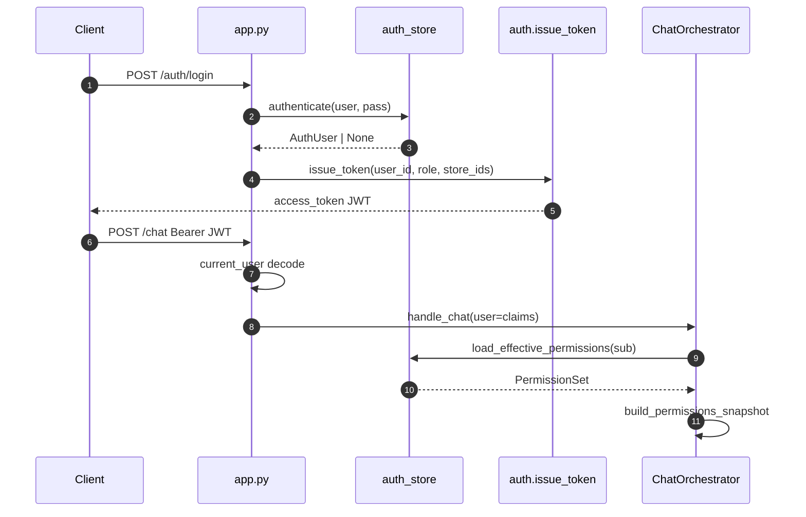

### §Z.4.15 — `HttpAgentInvoker` — giao thức HTTP agent

Triển khai `AgentInvoker` — pipeline và orchestrator gọi `invoke(agent, payload, metadata)`.

**clients.py dòng 1** `from __future__ import annotations`
**clients.py dòng 2** *(trống)*
**clients.py dòng 3** `import logging`
**clients.py dòng 4** `import os`
**clients.py dòng 5** `from typing import Any`
**clients.py dòng 6** *(trống)*
**clients.py dòng 7** `import httpx`
**clients.py dòng 8** `from agent_core.io.schemas import AgentRequest`
**clients.py dòng 9** *(trống)*
**clients.py dòng 10** `from project_core.domain.budget import AgentInvoker, SqlGatewayClient`
**clients.py dòng 11** `from project_core.domain.contracts.sql_acl import SqlAclContext`
**clients.py dòng 12** `from project_core.domain.errors.codes import AgentUnavailableError`
**clients.py dòng 13** `from project_core.infra.auth_internal import internal_auth_headers` — Header service-to-service; không phải JWT user.
**clients.py dòng 14** `from project_core.infra.resilience import CircuitBreaker` — Mở circuit sau lỗi liên tiếp → AgentUnavailableError.
**clients.py dòng 15** *(trống)*
**clients.py dòng 16** `logger = logging.getLogger(__name__)`
**clients.py dòng 17** *(trống)*
**clients.py dòng 18** *(trống)*
**clients.py dòng 19** `class HttpAgentInvoker(AgentInvoker):` — Adapter HTTP cho I/II/III/IV.
**clients.py dòng 20** `    def __init__(`
**clients.py dòng 21** `        self,`
**clients.py dòng 22** `        *,`
**clients.py dòng 23** `        client: httpx.Client | None = None,`
**clients.py dòng 24** `        circuit: CircuitBreaker | None = None,` — Mở circuit sau lỗi liên tiếp → AgentUnavailableError.
**clients.py dòng 25** `        trace_id: str | None = None,`
**clients.py dòng 26** `        analysis_id: str | None = None,`
**clients.py dòng 27** `    ) -> None:`
**clients.py dòng 28** `        self.urls = {` — URL từ env AGENT_*_URL; health_ready đọc dict này.
**clients.py dòng 29** `            "I": os.getenv("AGENT_I_URL", "http://localhost:18201"),`
**clients.py dòng 30** `            "II": os.getenv("AGENT_II_URL", "http://localhost:18202"),`
**clients.py dòng 31** `            "III": os.getenv("AGENT_III_URL", "http://localhost:18203"),`
**clients.py dòng 32** `            "IV": os.getenv("AGENT_IV_URL", "http://localhost:18204"),`
**clients.py dòng 33** `        }`
**clients.py dòng 34** `        self._client = client`
**clients.py dòng 35** `        self._owns_client = client is None`
**clients.py dòng 36** `        self._circuit = circuit or CircuitBreaker()` — Mở circuit sau lỗi liên tiếp → AgentUnavailableError.
**clients.py dòng 37** `        self._trace_id = trace_id`
**clients.py dòng 38** `        self._analysis_id = analysis_id`
**clients.py dòng 39** *(trống)*
**clients.py dòng 40** `    def _get_client(self) -> httpx.Client:`
**clients.py dòng 41** `        if self._client is None:`
**clients.py dòng 42** `            self._client = httpx.Client(timeout=120.0)`
**clients.py dòng 43** `        return self._client`
**clients.py dòng 44** *(trống)*
**clients.py dòng 45** `    def close(self) -> None:`
**clients.py dòng 46** `        if self._owns_client and self._client is not None:`
**clients.py dòng 47** `            self._client.close()`
**clients.py dòng 48** `            self._client = None`
**clients.py dòng 49** *(trống)*
**clients.py dòng 50** `    def set_trace(self, *, trace_id: str | None = None, analysis_id: str | None = None) -> None:`
**clients.py dòng 51** `        if trace_id is not None:`
**clients.py dòng 52** `            self._trace_id = trace_id`
**clients.py dòng 53** `        if analysis_id is not None:`
**clients.py dòng 54** `            self._analysis_id = analysis_id`
**clients.py dòng 55** *(trống)*
**clients.py dòng 56** `    def invoke(self, agent: str, payload: dict[str, Any], metadata: dict[str, Any]) -> dict[str, Any]:` — POST {agent}/run với AgentRequest JSON; circuit breaker trước network.
**clients.py dòng 57** `        if self._circuit.is_open():` — Mở circuit sau lỗi liên tiếp → AgentUnavailableError.
**clients.py dòng 58** `            raise AgentUnavailableError(f"Circuit open for agent {agent}")`
**clients.py dòng 59** `        url = f"{self.urls[agent]}/run"` — URL từ env AGENT_*_URL; health_ready đọc dict này.
**clients.py dòng 60** `        req = AgentRequest(`
**clients.py dòng 61** `            session_id=metadata.get("session_id", "system"),`
**clients.py dòng 62** `            actor_id=metadata.get("actor_id", "system"),`
**clients.py dòng 63** `            message=__import__("json").dumps(payload),`
**clients.py dòng 64** `            metadata=metadata,`
**clients.py dòng 65** `        )`
**clients.py dòng 66** `        headers = {**internal_auth_headers()}` — Header service-to-service; không phải JWT user.
**clients.py dòng 67** `        if self._trace_id:`
**clients.py dòng 68** `            headers["X-Trace-Id"] = self._trace_id` — Correlation; pipeline gọi set_trace trước run.
**clients.py dòng 69** `        if self._analysis_id:`
**clients.py dòng 70** `            headers["X-Analysis-Id"] = self._analysis_id` — Correlation; pipeline gọi set_trace trước run.
**clients.py dòng 71** `        try:`
**clients.py dòng 72** `            resp = self._get_client().post(url, json=req.model_dump(), headers=headers)`
**clients.py dòng 73** `            resp.raise_for_status()`
**clients.py dòng 74** `            data = resp.json()`
**clients.py dòng 75** `            self._circuit.record_success()` — Mở circuit sau lỗi liên tiếp → AgentUnavailableError.
**clients.py dòng 76** `        except Exception:`
**clients.py dòng 77** `            self._circuit.record_failure()` — Mở circuit sau lỗi liên tiếp → AgentUnavailableError.
**clients.py dòng 78** `            raise`
**clients.py dòng 79** `        usage = int((data.get("metadata") or {}).get("usage_tokens") or 0)` — Charge budget orchestrator qua pop usage_tokens.
**clients.py dòng 80** `        if usage:`
**clients.py dòng 81** `            out_meta = data.setdefault("metadata", {})`
**clients.py dòng 82** `            out_meta["usage_tokens"] = usage` — Charge budget orchestrator qua pop usage_tokens.
**clients.py dòng 83** `        out = data.get("payload") or {}`
**clients.py dòng 84** `        if not out and data.get("content"):`
**clients.py dòng 85** `            try:`
**clients.py dòng 86** `                out = __import__("json").loads(data["content"])`
**clients.py dòng 87** `            except __import__("json").JSONDecodeError:`
**clients.py dòng 88** `                out = {"content": data["content"]}`
**clients.py dòng 89** `        return out`
**clients.py dòng 90** *(trống)*

**Bảng mode Agent I do orchestrator truyền trong metadata:**

| mode | Gọi từ | payload message | Mục đích |
|------|--------|-----------------|----------|
| ingress | handle_chat | text + external_sources | Phân loại analysis vs chat thường |
| synthesize | _run_pipeline_and_respond | technical_summary | Viết lời user-facing tiếng Việt |
| clarification_bridge | clarify paths | clarification_request + transcript | Tự resolve hoặc exploration |
| clarify | _handle_clarification_needed | clarification_request | Sinh câu hỏi UI |

### §Z.4.16 — `HttpSqlGatewayClient` — giao thức sql-gateway

**clients.py dòng 92** `class HttpSqlGatewayClient(SqlGatewayClient):`
**clients.py dòng 93** `    def __init__(`
**clients.py dòng 94** `        self,`
**clients.py dòng 95** `        *,`
**clients.py dòng 96** `        client: httpx.Client | None = None,`
**clients.py dòng 97** `        circuit: CircuitBreaker | None = None,`
**clients.py dòng 98** `        trace_id: str | None = None,`
**clients.py dòng 99** `    ) -> None:`
**clients.py dòng 100** `        self.base = os.getenv("SQL_GATEWAY_URL", "http://localhost:18101")`
**clients.py dòng 101** `        self._client = client`
**clients.py dòng 102** `        self._owns_client = client is None`
**clients.py dòng 103** `        self._circuit = circuit or CircuitBreaker()`
**clients.py dòng 104** `        self._trace_id = trace_id`
**clients.py dòng 105** *(trống)*
**clients.py dòng 106** `    def _get_client(self) -> httpx.Client:`
**clients.py dòng 107** `        if self._client is None:`
**clients.py dòng 108** `            self._client = httpx.Client(timeout=60.0)`
**clients.py dòng 109** `        return self._client`
**clients.py dòng 110** *(trống)*
**clients.py dòng 111** `    def close(self) -> None:`
**clients.py dòng 112** `        if self._owns_client and self._client is not None:`
**clients.py dòng 113** `            self._client.close()`
**clients.py dòng 114** `            self._client = None`
**clients.py dòng 115** *(trống)*
**clients.py dòng 116** `    def set_trace(self, trace_id: str | None) -> None:`
**clients.py dòng 117** `        self._trace_id = trace_id`
**clients.py dòng 118** *(trống)*
**clients.py dòng 119** `    def _call(self, tool: str, arguments: dict[str, Any]) -> dict[str, Any]:`
**clients.py dòng 120** `        if self._circuit.is_open():`
**clients.py dòng 121** `            raise AgentUnavailableError(f"Circuit open for sql-gateway tool {tool}")`
**clients.py dòng 122** `        if os.getenv("SQL_GATEWAY_INPROCESS") == "1":` — Bypass HTTP: gọi trực tiếp tools_impl — dev/test.
**clients.py dòng 123** `            from sql_gateway import tools_impl as impl`
**clients.py dòng 124** *(trống)*
**clients.py dòng 125** `            fn = getattr(impl, tool)`
**clients.py dòng 126** `            return fn(**arguments)`
**clients.py dòng 127** `        headers = {**internal_auth_headers()}`
**clients.py dòng 128** `        if self._trace_id:`
**clients.py dòng 129** `            headers["X-Trace-Id"] = self._trace_id`
**clients.py dòng 130** `        try:`
**clients.py dòng 131** `            resp = self._get_client().post(f"{self.base}/tools/{tool}", json=arguments, headers=headers)`
**clients.py dòng 132** `            if resp.status_code == 404:` — Soft error gateway_not_found thay vì raise — pipeline xử lý.
**clients.py dòng 133** `                logger.warning("sql-gateway HTTP 404 for %s — check SQL_GATEWAY_URL", tool)` — Soft error gateway_not_found thay vì raise — pipeline xử lý.
**clients.py dòng 134** `                return {"error": "gateway_not_found", "status": 404}` — Soft error gateway_not_found thay vì raise — pipeline xử lý.
**clients.py dòng 135** `            resp.raise_for_status()`
**clients.py dòng 136** `            self._circuit.record_success()`
**clients.py dòng 137** `            return resp.json()`
**clients.py dòng 138** `        except Exception:`
**clients.py dòng 139** `            self._circuit.record_failure()`
**clients.py dòng 140** `            raise`
**clients.py dòng 141** *(trống)*
**clients.py dòng 142** `    def _acl_args(self, acl: SqlAclContext) -> dict[str, Any]:` — Chuyển SqlAclContext → allowed_tables, store filter.
**clients.py dòng 143** `        return acl.to_gateway_args()`
**clients.py dòng 144** *(trống)*
**clients.py dòng 145** `    def validate_sql(self, sql: str, acl: SqlAclContext) -> dict[str, Any]:` — Facade tool; merge acl.to_gateway_args vào body POST.
**clients.py dòng 146** `        return self._call("validate_sql", {"sql": sql, **self._acl_args(acl)})` — Chuyển SqlAclContext → allowed_tables, store filter.
**clients.py dòng 147** *(trống)*
**clients.py dòng 148** `    def explain_sql(self, sql: str, acl: SqlAclContext, *, target_db: str = "db2") -> dict[str, Any]:` — Facade tool; merge acl.to_gateway_args vào body POST.
**clients.py dòng 149** `        return self._call(`
**clients.py dòng 150** `            "explain_sql",`
**clients.py dòng 151** `            {"sql": sql, "target_db": target_db, **self._acl_args(acl)},` — Chuyển SqlAclContext → allowed_tables, store filter.
**clients.py dòng 152** `        )`
**clients.py dòng 153** *(trống)*
**clients.py dòng 154** `    def execute_readonly(self, sql: str, acl: SqlAclContext, *, target_db: str = "db2") -> dict[str, Any]:` — Facade tool; merge acl.to_gateway_args vào body POST.
**clients.py dòng 155** `        return self._call(`
**clients.py dòng 156** `            "execute_readonly",`
**clients.py dòng 157** `            {"sql": sql, "target_db": target_db, **self._acl_args(acl)},` — Chuyển SqlAclContext → allowed_tables, store filter.
**clients.py dòng 158** `        )`

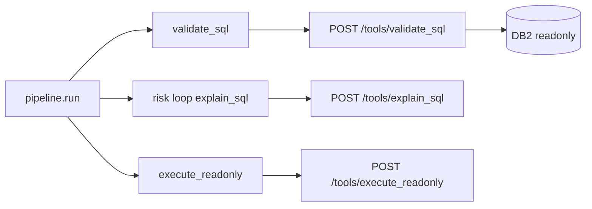

### §Z.4.17 — Sơ đồ hoạt động tổng hợp (prose + Mermaid)

#### §Z.4.17.1 — Phiên chat mới đến kết quả phân tích

User mở session_id mới, gửi câu hỏi phân tích. Gateway xác thực JWT, orchestrator tạo workflow IDLE, ghi transcript user, Agent I trả route=analysis với brief. Permissions load từ AUTH DB. Pipeline chạy II→III→SQL→IV. Thành công: Agent I synthesize, assistant turn và artifact URLs trong ChatResponse.

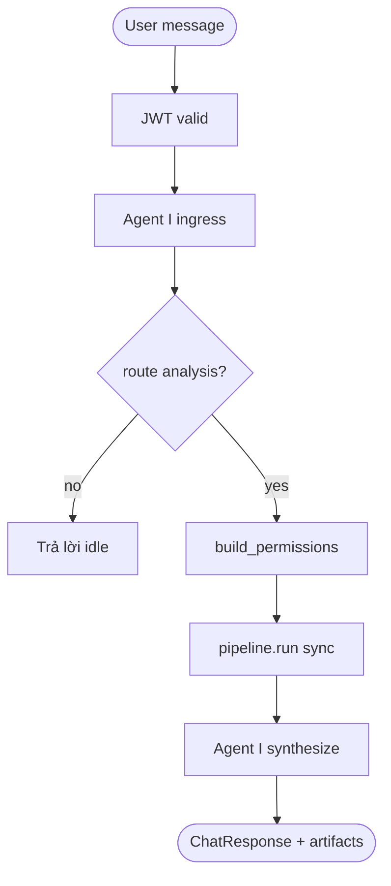

#### §Z.4.17.2 — Vòng clarify hai lần (ingress + pipeline)

Pipeline II hoặc IV yêu cầu clarify: orchestrator gọi clarification_bridge. Nếu transcript đủ → auto rerun pipeline. Nếu không → Agent I clarify → status AWAITING_CLARIFICATION, client POST /chat/clarify hoặc user chat tiếp kích hoạt ingress clarify.

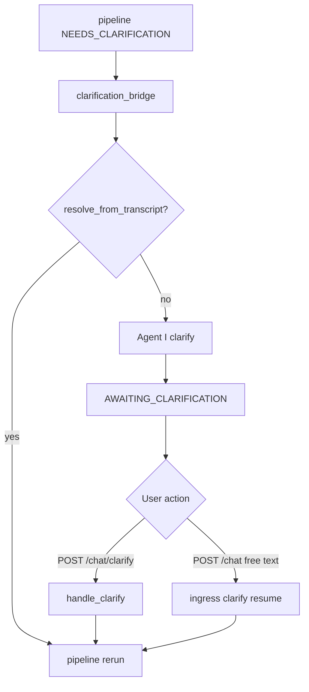

#### §Z.4.17.3 — Fail-closed permissions

Production: load_effective_permissions None → PermissionsUnavailableError → HTTP 403. Dev ALLOW_DEV_AUTH=1: fallback YAML roles không cần AUTH DB cho snapshot.

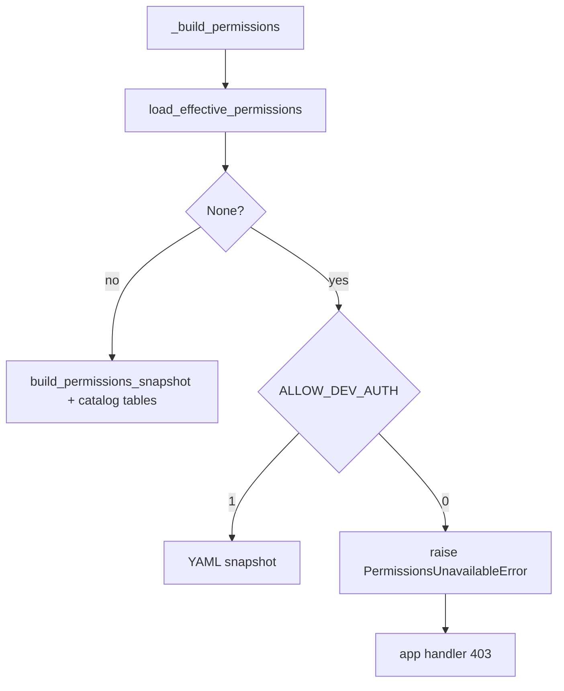

#### §Z.4.17.4 — Budget và token charge

Mỗi _invoke_agent_i gọi budget.record('I'). usage_tokens từ agent response charge trace_budget. Vượt ngưỡng → BudgetExceededError → ChatResponse error, budget_spent persist Redis.

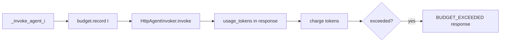

#### §Z.4.17.5 — Health readiness vs liveness

/health/live luôn ok. /health/ready ping Redis và kiểm Mongo feedback != None; đồng thời GET /health từng agent URL — kết quả trong map nhưng ok chỉ cần redis+mongo.

```mermaid
flowchart TD
  L[/health/live] --> OK1[ok true]
  R[/health/ready] --> P[stm.client.ping]
  R --> M[feedback is not None]
  R --> A[GET each agent /health]
  P --> J{redis and mongo}
  M --> J
  J --> OK2[ok aggregate]
```

### §Z.4.18 — Ma trận Redis persist theo phương thức orchestrator

| Phương thức | STM call | Khi nào |
|-------------|----------|---------|
| handle_chat | save_transcript | Sau user turn và sau assistant idle |
| handle_chat | save_workflow | Sau gán brief + permissions trước pipeline |
| handle_clarify | save_clarification(None) | Xóa pending sau apply reply |
| handle_clarify | save_workflow | Sau resume_analysis |
| attach_external_sources | save_workflow | Brief external_sources merge |
| _run_pipeline_and_respond | save_workflow via on_progress | Mỗi bước pipeline nếu poll_enabled |
| _run_pipeline_and_respond | save_transcript | Sau synthesize assistant turn |
| _handle_clarification_needed | save_clarification | Lưu request khi suspend |
| _resume_from_pending | save_clarification(None) | Sau bridge resolve |

### §Z.4.19 — Ma trận lỗi ChatResponse và HTTP

| code | Nguồn | HTTP / body | Ghi chú |
|------|-------|-------------|---------|
| BUDGET_EXCEEDED | handle_chat, _run_pipeline, clarify paths | 429/200 với error body | retryable: false |
| NO_PENDING_CLARIFICATION | handle_clarify | 200 + error | Không có bundle.clarification |
| CLARIFY_ROUNDS_EXCEEDED | _run_pipeline second exceed | STALE workflow | exploration retry thất bại |
| permissions_unavailable | PermissionsUnavailableError | HTTP 403 | AUTH DB down hoặc user inactive |
| invalid_credentials | login | HTTP 401 | authenticate None |
| missing_token | current_user | HTTP 401 | Không dev auth |
| dev_auth_disabled | dev-login | HTTP 403 | ALLOW_DEV_AUTH không set |

### §Z.4.20 — Biến môi trường ảnh hưởng gateway (cross-file)

| Biến | Tệp | Vai trò |
|------|-----|---------|
| `JWT_SECRET` | auth.py | Ký JWT |
| `REQUIRE_PROD_AUTH` | auth.py | Ép secret mạnh |
| `ALLOW_DEV_AUTH` | auth.py, orchestrator | Dev user + YAML permissions |
| `AUTH_DB_DSN` | auth_store.py | SQL Server AUTH |
| `AUTH_PERMISSIONS_CACHE_TTL` | auth_store.py | Cache permissions giây |
| `AGENT_I_URL … IV` | clients.py | Base URL agents |
| `SQL_GATEWAY_URL` | clients.py | sql-gateway HTTP |
| `SQL_GATEWAY_INPROCESS` | clients.py | Gọi local impl |
| `MONGODB_URI` | orchestrator | RAG feedback |
| `MONGODB_CONNECT_TIMEOUT_MS` | orchestrator | Timeout Mongo init |
| `ARTIFACTS_DIR` | app.py | Download artifact path |
| `CHAT_GATEWAY_PORT` | app.py | uvicorn bind |
| `OAUTH_PROVIDER` | oauth.py | local vs azure |

### §Z.4.21 — Chú giải bổ sung theo khối logic orchestrator

#### Khối Đầu handle_chat (dòng 97–109)
Trích claims, đảm bảo workflow tồn tại, kiểm tra clarify ingress trước khi append message mới.
- Dòng 97: `    def handle_chat(self, *, session_id: str, message: str, user: dict[str, Any]) -> ChatResponse:`
- Dòng 98: `        actor_id, role, store_ids = claims_from_user_dict(user)`
- Dòng 99: `        bundle = self.stm.load_session(session_id)`
- Dòng 100: `        if bundle.workflow is None:`
- Dòng 101: `            bundle.workflow = new_workflow(session_id, actor_id)`
- Dòng 102: ``
- Dòng 103: `        if self.clarify.on_ingress_clarify(bundle):`
- Dòng 104: `            return self._resume_from_pending_clarification(`
- Dòng 105: `                session_id=session_id,`
- Dòng 106: `                message=message,`
- Dòng 107: `                user=user,`
- Dòng 108: `                bundle=bundle,`
- Dòng 109: `            )`

#### Khối Transcript user (dòng 111–115)
Mọi message đi qua đây đều persist Redis ngay — crash sau đó vẫn có lịch sử.
- Dòng 111: `        self._maybe_emit_re_ask_signal(session_id, bundle, message)`
- Dòng 112: ``
- Dòng 113: `        turn = TranscriptTurn(id=str(uuid4()), role="user", content=message, at=utc_now().isoformat())`
- Dòng 114: `        bundle.transcript.append(turn)`
- Dòng 115: `        self.stm.save_transcript(session_id, bundle.transcript)`

#### Khối Ingress Agent I (dòng 117–137)
Invoker mới mỗi request nhưng dùng chung httpx client; budget session restore từ workflow.budget_spent.
- Dòng 117: `        invoker = HttpAgentInvoker(client=self._http)`
- Dòng 118: `        session_budget = self._session_budget(bundle)`
- Dòng 119: `        external_sources = []`
- Dòng 120: `        if bundle.workflow.brief and bundle.workflow.brief.external_sources:`
- Dòng 121: `            external_sources = [s.model_dump() for s in bundle.workflow.brief.external_sources]`
- Dòng 122: ``
- Dòng 123: `        try:`
- Dòng 124: `            ingress = self._invoke_agent_i(`
- Dòng 125: `                invoker,`
- Dòng 126: `                {"text": message, "external_sources": external_sources},`
- Dòng 127: `                {"mode": "ingress", "session_id": session_id, "actor_id": actor_id},`
- Dòng 128: `                session_budget,`
- Dòng 129: `                bundle,`
- Dòng 130: `            )`
- Dòng 131: `        except BudgetExceededError as exc:`
- Dòng 132: `            return ChatResponse(`
- Dòng 133: `                session_id=session_id,`
- Dòng 134: `                workflow_status=bundle.workflow.status.value,`
- Dòng 135: `                message=str(exc),`
- Dòng 136: `                error={"code": "BUDGET_EXCEEDED", "retryable": False},`
- Dòng 137: `            )`

#### Khối Nhánh non-analysis (dòng 139–154)
route khác analysis: không chạm pipeline, workflow về IDLE semantic qua response.
- Dòng 139: `        self._handle_satisfaction_signal(ingress, bundle)`
- Dòng 140: ``
- Dòng 141: `        if ingress.get("route") != "analysis":`
- Dòng 142: `            assistant = TranscriptTurn(`
- Dòng 143: `                id=str(uuid4()),`
- Dòng 144: `                role="assistant",`
- Dòng 145: `                content=ingress.get("user_message", ""),`
- Dòng 146: `                at=utc_now().isoformat(),`
- Dòng 147: `            )`
- Dòng 148: `            bundle.transcript.append(assistant)`
- Dòng 149: `            self.stm.save_transcript(session_id, bundle.transcript)`
- Dòng 150: `            return ChatResponse(`
- Dòng 151: `                session_id=session_id,`
- Dòng 152: `                workflow_status=WorkflowStatus.IDLE.value,`
- Dòng 153: `                message=ingress.get("user_message", ""),`
- Dòng 154: `            )`

#### Khối Nhánh analysis (dòng 156–174)
start_analysis sinh analysis_id; permissions_snapshot gắn workflow cho lần clarify sau.
- Dòng 156: `        brief = AnalysisBrief.model_validate(ingress.get("brief") or {"intent": message})`
- Dòng 157: `        if bundle.workflow.brief and bundle.workflow.brief.external_sources:`
- Dòng 158: `            brief.external_sources = bundle.workflow.brief.external_sources`
- Dòng 159: ``
- Dòng 160: `        analysis_id = start_analysis(bundle.workflow, reset_clarify=True)`
- Dòng 161: `        bundle.workflow.brief = brief`
- Dòng 162: `        permissions = self._build_permissions(actor_id, role, store_ids)`
- Dòng 163: `        bundle.workflow.permissions_snapshot = permissions`
- Dòng 164: `        self.stm.save_workflow(session_id, bundle.workflow)`
- Dòng 165: ``
- Dòng 166: `        return self._run_pipeline_and_respond(`
- Dòng 167: `            session_id=session_id,`
- Dòng 168: `            analysis_id=analysis_id,`
- Dòng 169: `            brief=brief,`
- Dòng 170: `            bundle=bundle,`
- Dòng 171: `            permissions=permissions,`
- Dòng 172: `            invoker=invoker,`
- Dòng 173: `            session_budget=session_budget,`
- Dòng 174: `        )`

#### Khối Pipeline invoke (dòng 424–447)
on_progress = save_workflow khi poll_enabled; deadline = monotonic + max_sync_seconds.
- Dòng 424: `    def _run_pipeline_and_respond(`
- Dòng 425: `        self,`
- Dòng 426: `        *,`
- Dòng 427: `        session_id: str,`
- Dòng 428: `        analysis_id: str,`
- Dòng 429: `        brief: AnalysisBrief,`
- Dòng 430: `        bundle: SessionBundle,`
- Dòng 431: `        permissions: Any,`
- Dòng 432: `        invoker: HttpAgentInvoker,`
- Dòng 433: `        session_budget: SessionTraceBudget,`
- Dòng 434: `    ) -> ChatResponse:`
- Dòng 435: `        def on_progress(workflow: Any) -> None:`
- Dòng 436: `            self.stm.save_workflow(session_id, workflow)`
- Dòng 437: ``
- Dòng 438: `        deadline = time.monotonic() + float(self.cfg.pipeline.max_sync_seconds)`
- Dòng 439: `        try:`
- Dòng 440: `            result = self.pipeline.run(`
- Dòng 441: `                brief=brief,`
- Dòng 442: `                workflow=bundle.workflow,`
- Dòng 443: `                permissions=permissions,`
- Dòng 444: `                trace_budget=session_budget.trace_budget,`
- Dòng 445: `                on_progress=on_progress if self.cfg.pipeline.poll_enabled else None,`
- Dòng 446: `                deadline=deadline,`
- Dòng 447: `            )`

#### Khối ClarifyRoundsExceeded (dòng 448–471)
Lần một: exploration_mode; lần hai: STALE + error code.
- Dòng 448: `        except ClarifyRoundsExceededError as exc:`
- Dòng 449: `            brief.exploration_mode = True`
- Dòng 450: `            brief.user_knowledge_level = "unknown"`
- Dòng 451: `            bundle.workflow.brief = brief`
- Dòng 452: `            resume_analysis(bundle.workflow)`
- Dòng 453: `            self.stm.save_workflow(session_id, bundle.workflow)`
- Dòng 454: `            try:`
- Dòng 455: `                result = self.pipeline.run(`
- Dòng 456: `                    brief=brief,`
- Dòng 457: `                    workflow=bundle.workflow,`
- Dòng 458: `                    permissions=permissions,`
- Dòng 459: `                    trace_budget=session_budget.trace_budget,`
- Dòng 460: `                    on_progress=on_progress if self.cfg.pipeline.poll_enabled else None,`
- Dòng 461: `                    deadline=deadline,`
- Dòng 462: `                )`
- Dòng 463: `            except ClarifyRoundsExceededError:`
- Dòng 464: `                return ChatResponse(`
- Dòng 465: `                    session_id=session_id,`
- Dòng 466: `                    analysis_id=analysis_id,`
- Dòng 467: `                    workflow_status=WorkflowStatus.STALE.value,`
- Dòng 468: `                    outcome="error",`
- Dòng 469: `                    message=str(exc),`
- Dòng 470: `                    error={"code": "CLARIFY_ROUNDS_EXCEEDED", "retryable": False},`
- Dòng 471: `                )`

#### Khối needs_clarification (dòng 486–496)
Ủy quyền _handle_clarification_needed thay vì synthesize.
- Dòng 486: `        if result.needs_clarification:`
- Dòng 487: `            return self._handle_clarification_needed(`
- Dòng 488: `                session_id=session_id,`
- Dòng 489: `                analysis_id=analysis_id,`
- Dòng 490: `                result=result,`
- Dòng 491: `                brief=brief,`
- Dòng 492: `                bundle=bundle,`
- Dòng 493: `                permissions=permissions,`
- Dòng 494: `                invoker=invoker,`
- Dòng 495: `                session_budget=session_budget,`
- Dòng 496: `            )`

#### Khối Synthesize path (dòng 498–543)
technical_summary từ pipeline; artifacts chỉ basename URL relative.
- Dòng 498: `        try:`
- Dòng 499: `            synth = self._invoke_agent_i(`
- Dòng 500: `                invoker,`
- Dòng 501: `                {},`
- Dòng 502: `                {`
- Dòng 503: `                    "mode": "synthesize",`
- Dòng 504: `                    "session_id": session_id,`
- Dòng 505: `                    "actor_id": permissions.actor_id,`
- Dòng 506: `                    "technical_summary": result.technical_summary.model_dump(),`
- Dòng 507: `                },`
- Dòng 508: `                session_budget,`
- Dòng 509: `                bundle,`
- Dòng 510: `            )`
- Dòng 511: `        except BudgetExceededError as exc:`
- Dòng 512: `            bundle.workflow.budget_spent = session_budget.trace_budget.spent`
- Dòng 513: `            self.stm.save_workflow(session_id, bundle.workflow)`
- Dòng 514: `            return ChatResponse(`
- Dòng 515: `                session_id=session_id,`
- Dòng 516: `                analysis_id=analysis_id,`
- Dòng 517: `                trace_id=result.trace_id,`
- Dòng 518: `                workflow_status=bundle.workflow.status.value,`
- Dòng 519: `                outcome=result.outcome,`
- Dòng 520: `                message=result.technical_summary.outcome,`
- Dòng 521: `                error={"code": "BUDGET_EXCEEDED", "retryable": False},`
- Dòng 522: `            )`
- Dòng 523: ``
- Dòng 524: `        assistant = TranscriptTurn(`
- Dòng 525: `            id=str(uuid4()),`
- Dòng 526: `            role="assistant",`
- Dòng 527: `            content=synth.get("user_message", ""),`
- Dòng 528: `            at=utc_now().isoformat(),`
- Dòng 529: `            analysis_id=analysis_id,`
- Dòng 530: `            trace_id=result.trace_id,`
- Dòng 531: `        )`
- Dòng 532: `        bundle.transcript.append(assistant)`
- Dòng 533: `        self.stm.save_transcript(session_id, bundle.transcript)`
- Dòng 534: `        self.stm.save_workflow(session_id, bundle.workflow)`
- Dòng 535: `        return ChatResponse(`
- Dòng 536: `            session_id=session_id,`
- Dòng 537: `            analysis_id=analysis_id,`
- Dòng 538: `            trace_id=result.trace_id,`
- Dòng 539: `            workflow_status=bundle.workflow.status.value,`
- Dòng 540: `            outcome=result.outcome,`
- Dòng 541: `            message=synth.get("user_message", ""),`
- Dòng 542: `            artifacts=[{"url": u} for u in result.technical_summary.artifact_urls],`
- Dòng 543: `        )`

#### Khối Bridge auto-resolve (dòng 585–605)
clarify.on_pipeline_clarify quyết should_rerun; có thể gọi đệ quy _run_pipeline_and_respond.
- Dòng 585: `        if bridge.get("action") == "resolve_from_transcript":`
- Dòng 586: `            brief, should_rerun = self.clarify.on_pipeline_clarify(`
- Dòng 587: `                result=result,`
- Dòng 588: `                brief=brief,`
- Dòng 589: `                bridge=bridge,`
- Dòng 590: `                analysis_id=analysis_id,`
- Dòng 591: `            )`
- Dòng 592: `            if should_rerun:`
- Dòng 593: `                bundle.workflow.brief = brief`
- Dòng 594: `                resume_analysis(bundle.workflow)`
- Dòng 595: `                bundle.workflow.budget_spent = session_budget.trace_budget.spent`
- Dòng 596: `                self.stm.save_workflow(session_id, bundle.workflow)`
- Dòng 597: `                return self._run_pipeline_and_respond(`
- Dòng 598: `                    session_id=session_id,`
- Dòng 599: `                    analysis_id=analysis_id,`
- Dòng 600: `                    brief=brief,`
- Dòng 601: `                    bundle=bundle,`
- Dòng 602: `                    permissions=permissions,`
- Dòng 603: `                    invoker=invoker,`
- Dòng 604: `                    session_budget=session_budget,`
- Dòng 605: `                )`

#### Khối Suspend clarify (dòng 607–648)
save_clarification + suspend_response; bridge_action ask_user trong model_copy.
- Dòng 607: `        try:`
- Dòng 608: `            clarify = self._invoke_agent_i(`
- Dòng 609: `                invoker,`
- Dòng 610: `                {},`
- Dòng 611: `                {`
- Dòng 612: `                    "mode": "clarify",`
- Dòng 613: `                    "session_id": session_id,`
- Dòng 614: `                    "actor_id": permissions.actor_id,`
- Dòng 615: `                    "clarification_request": result.needs_clarification.model_dump(),`
- Dòng 616: `                },`
- Dòng 617: `                session_budget,`
- Dòng 618: `                bundle,`
- Dòng 619: `            )`
- Dòng 620: `        except BudgetExceededError as exc:`
- Dòng 621: `            bundle.workflow.budget_spent = session_budget.trace_budget.spent`
- Dòng 622: `            self.stm.save_workflow(session_id, bundle.workflow)`
- Dòng 623: `            return ChatResponse(`
- Dòng 624: `                session_id=session_id,`
- Dòng 625: `                analysis_id=analysis_id,`
- Dòng 626: `                trace_id=result.trace_id,`
- Dòng 627: `                workflow_status=WorkflowStatus.AWAITING_CLARIFICATION.value,`
- Dòng 628: `                outcome=result.outcome,`
- Dòng 629: `                message=str(exc),`
- Dòng 630: `                error={"code": "BUDGET_EXCEEDED", "retryable": False},`
- Dòng 631: `            )`
- Dòng 632: ``
- Dòng 633: `        bundle.workflow.budget_spent = session_budget.trace_budget.spent`
- Dòng 634: `        self.stm.save_clarification(session_id, result.needs_clarification.model_dump())`
- Dòng 635: `        self.stm.save_workflow(session_id, bundle.workflow)`
- Dòng 636: `        return self.clarify.suspend_response(`
- Dòng 637: `            session_id=session_id,`
- Dòng 638: `            analysis_id=analysis_id,`
- Dòng 639: `            request=result.needs_clarification,`
- Dòng 640: `            clarify_payload=clarify,`
- Dòng 641: `            workflow_status=WorkflowStatus.AWAITING_CLARIFICATION.value,`
- Dòng 642: `        ).model_copy(`
- Dòng 643: `            update={`
- Dòng 644: `                "trace_id": result.trace_id,`
- Dòng 645: `                "outcome": result.outcome,`
- Dòng 646: `                "bridge_action": "ask_user",`
- Dòng 647: `            }`
- Dòng 648: `        )`

### §Z.4.22 — Tương tác orchestrator ↔ pipeline (ranh giới)

Orchestrator **không** gọi trực tiếp Agent II/III/IV — chỉ qua `self.pipeline.run`. Orchestrator **có** gọi Agent I cho ingress, synthesize, clarify, clarification_bridge. Pipeline gọi II/III/IV và sql-gateway qua client inject lúc `__init__`.

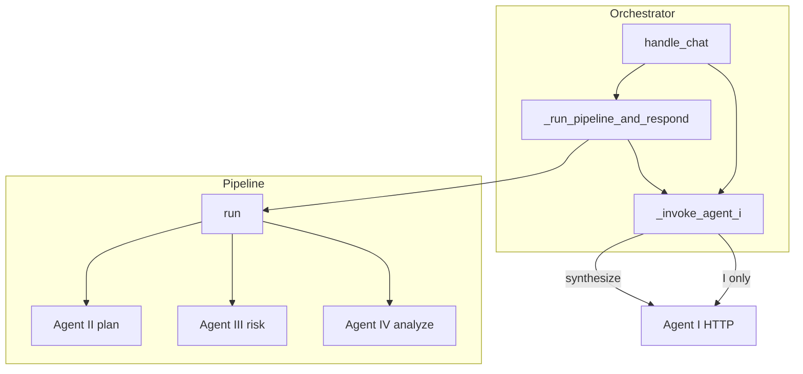

### §Z.4.23 — Checklist debug theo triệu chứng (gateway-only)

1. **Triệu chứng:** Chat trả lời chung chung, không SQL
   - **Nguyên nhân thường gặp:** ingress route != analysis
   - **Hướng xử lý:** Xem Agent I response route và brief

1. **Triệu chứng:** 403 permissions_unavailable ngay khi chat
   - **Nguyên nhân thường gặp:** _build_permissions raise
   - **Hướng xử lý:** AUTH_DB_DSN, user active, hoặc bật ALLOW_DEV_AUTH local

1. **Triệu chứng:** AWAITING_CLARIFICATION mãi
   - **Nguyên nhân thường gặp:** save_clarification không clear
   - **Hướng xử lý:** Kiểm POST /chat/clarify vs free-text ingress

1. **Triệu chứng:** STALE + CLARIFY_ROUNDS_EXCEEDED
   - **Nguyên nhân thường gặp:** exploration vẫn exceed
   - **Hướng xử lý:** Tăng max_clarify_rounds config hoặc sửa brief

1. **Triệu chứng:** AgentUnavailableError / 5xx
   - **Nguyên nhân thường gặp:** circuit open HttpAgentInvoker
   - **Hướng xử lý:** Restart agent, kiểm AGENT_*_URL

1. **Triệu chứng:** gateway_not_found SQL
   - **Nguyên nhân thường gặp:** SQL_GATEWAY_URL sai
   - **Hướng xử lý:** health_ready agents + sql 404 soft

1. **Triệu chứng:** Mongo warning lúc start
   - **Nguyên nhân thường gặp:** feedback None
   - **Hướng xử lý:** RAG/registry tắt; pipeline vẫn chạy rank_candidates fallback

1. **Triệu chứng:** Artifact 404
   - **Nguyên nhân thường gặp:** trace_id/out/file
   - **Hướng xử lý:** ARTIFACTS_DIR mount docker

### §Z.4.24 — Dòng thời gian đồng bộ một request /chat (ước lượng)

- T0: FastAPI nhận body, Pydantic validate ChatRequest.
- T1: current_user decode JWT (~1ms).
- T2: get_orchestrator — no-op nếu đã init.
- T3: stm.load_session Redis RTT.
- T4: _invoke_agent_i ingress — HTTP Agent I (LLM, vài giây).
- T5: _build_permissions — có thể cache hit AUTH DB.
- T6: pipeline.run — II plan + III loop + SQL execute + IV analyze (phần lớn thời gian).
- T7: on_progress save_workflow nếu poll_enabled — nhiều lần trong T6.
- T8: _invoke_agent_i synthesize — HTTP Agent I.
- T9: save_transcript + model_dump response.

### §Z.4.25 — Kết luận phần §Z.4

ChatOrchestrator là **state machine phiên** trên Redis: mọi quyết định clarify, budget, permissions được chốt trước khi pipeline đồng bộ chạy. app.py giữ mỏng — auth và routing — còn HttpAgentInvoker/HttpSqlGatewayClient là cầu nối HTTP duy nhất tới agent và SQL. Vận hành production cần `/health/ready`, AUTH DB ổn định, và JWT không dùng secret mặc định.

*Hết §Z.4 — ChatOrchestrator và chat-gateway.*

## §J.1 — Từng biến môi trường (chi tiết)

Phụ lục này mô tả **từng biến** xuất hiện trong `.env.example` (và một số biến liên quan
được compose hoặc mã nguồn đọc trực tiếp). Nội dung được rút ra từ grep mã nguồn Python/YAML
và file compose — không sao chép từ tài liệu khác trong `docs/`.

Cấu trúc mỗi mục:

1. Tên và giá trị mặc định trong repo.
2. Dịch vụ nào đọc biến khi khởi động hoặc xử lý request.
3. File tham chiếu cụ thể.
4. Khác biệt prod vs dev.
5. Rủi ro bảo mật.
6. Triệu chứng khi thiếu/sai.
7. Cách Docker Compose truyền biến (base vs prod overlay).

---

### §J.1.0 — Nhóm biến theo chức năng

| Nhóm | Biến |
|------|------|
| LLM | OPENROUTER_API_KEY, ALLOW_LLM_STUB |
| Hạ tầng session/RAG | REDIS_URL, MONGODB_URI, MONGODB_CONNECT_TIMEOUT_MS |
| URL dịch vụ | SQL_GATEWAY_URL, AGENT_I_URL … AGENT_IV_URL, CHAT_GATEWAY_URL |
| SQL kinh doanh (readonly) | ANALYTICS_DB_DSN, ANALYTICS_DB_DSN_2 |
| SQL xác thực | AUTH_DB_DSN |
| JWT / auth người dùng | JWT_SECRET, REQUIRE_PROD_AUTH, ALLOW_DEV_AUTH |
| Auth nội bộ gateway↔agents | REQUIRE_INTERNAL_AUTH, INTERNAL_SERVICE_TOKEN |
| OAuth (tùy chọn) | OAUTH_PROVIDER, OAUTH_CLIENT_ID, OAUTH_CLIENT_SECRET, OAUTH_REDIRECT_URI, AZURE_TENANT_ID |
| Runner / transport | PLATFORM_TRANSPORT |
| Seed mật khẩu AUTH DB | AUTH_SEED_*_PASSWORD (3 biến) |
| Tuning vận hành | LOG_LEVEL, AUTH_PERMISSIONS_CACHE_TTL, SANDBOX_MAX_*, SQL_GATEWAY_MAX_CONCURRENT, SQL_AUDIT_LOG_PATH |
| Prod overlay infra | REDIS_PASSWORD, MONGO_ROOT_USER, MONGO_ROOT_PASSWORD, PUBLIC_DOMAIN, TLS_EMAIL |
| Dev-only (không trong .env.example chính) | SQL_GATEWAY_INPROCESS |
| Compose runtime ports | AGENT_HTTP_PORT, CHAT_GATEWAY_PORT, SQL_GATEWAY_HTTP_PORT |
| Đường dẫn làm việc | AGENT_ROOT_DIR |

Tất cả container ứng dụng trong `docker-compose.yaml` khai báo `env_file: .env`, nghĩa là
biến không bị override trong block `environment:` vẫn được nạp từ file `.env` trên host.

---

#### §J.1.1 — `OPENROUTER_API_KEY`

**Tên biến:** `OPENROUTER_API_KEY`

**Giá trị mặc định (khi không set trong shell):** Không có — bắt buộc khi gọi LLM thật (trừ ALLOW_LLM_STUB=1 hoặc OPENAI_API_KEY).

**Dịch vụ / thành phần đọc biến:**
- chat-gateway (pipeline gọi agents qua HTTP)
- conversational-router (Agent I)
- sql-planner (Agent II)
- risk-reviewer (Agent III)
- data-analyst (Agent IV)
- project-core: OpenRouterClient, EmbeddingClient
- libs/agent-core: OpenAICompatibleProvider, openai_embeddings
- libs/platform-core: BaseAgentService.has_llm()

**Tham chiếu mã nguồn (đường dẫn tương đối repo):**
- `packages/project-core/src/project_core/config/loader.py`
- `libs/agent-core/src/agent_core/capabilities/models/openai_compatible.py`
- `libs/agent-core/src/agent_core/capabilities/retrieval/openai_embeddings.py`
- `libs/platform-core/src/platform_core/service/base.py`

**Hành vi production so với development:**
- Production: ALLOW_LLM_STUB=0; key bắt buộc cho mọi bước reasoning LLM.
- Development: ALLOW_LLM_STUB=1 cho phép bỏ qua key — agents dùng heuristic cố định.
- Alias legacy `openroute_api_key` vẫn đọc được nhưng warnings.warn deprecation.

**Ghi chú bảo mật:**
- Không commit vào git; dùng secret manager trên prod.
- Key có quyền billing — giới hạn quota trên dashboard OpenRouter.
- OPENAI_API_KEY là fallback thứ hai trong agent-core, không có trong .env.example.

**Chế độ lỗi / triệu chứng khi cấu hình sai:**
- RuntimeError Missing required environment variable khi stub tắt và không có key.
- test_live_llm.py skip khi ALLOW_LLM_STUB=1 hoặc thiếu key.
- Embedding/index schema fail nếu thiếu key khi chạy scripts/index_schema_docs.py.

**Ánh xạ Docker Compose:**
- docker-compose.yaml: env_file .env cho mọi service agent + sql-gateway.
- docker-compose.prod.yaml: không override; vẫn từ .env host.

**Chi tiết bổ sung:**
- Model profile cụ thể nằm trong config/models.yaml, không phải env.

---

#### §J.1.2 — `ALLOW_LLM_STUB`

**Tên biến:** `ALLOW_LLM_STUB`

**Giá trị mặc định (khi không set trong shell):** `0` trong .env.example (production template).

**Dịch vụ / thành phần đọc biến:**
- conversational-router/service.py
- sql-planner/service.py
- risk-reviewer/service.py
- project-core/domain/analysis/decomposer.py
- project-core/domain/analysis/recipe_selector.py
- packages/project-test/conftest.py (setdefault 1 cho test)

**Tham chiếu mã nguồn (đường dẫn tương đối repo):**
- `agents/conversational-router/src/conversational_router/service.py`
- `agents/sql-planner/src/sql_planner/service.py`
- `agents/risk-reviewer/src/risk_reviewer/service.py`
- `packages/project-core/src/project_core/domain/analysis/decomposer.py`
- `packages/project-core/src/project_core/domain/analysis/recipe_selector.py`

**Hành vi production so với development:**
- Prod: phải 0 — mọi quyết định routing/SQL/risk dùng LLM thật.
- Dev: .env.dev.example gợi ý 1 — stub keyword heuristic, không tốn token.
- CI test luôn set 1 trong conftest để không cần API key.

**Ghi chú bảo mật:**
- .env.example ghi rõ Do NOT set ALLOW_LLM_STUB=1 in production.
- Stub không kiểm tra chất lượng output — chỉ phù hợp dev/CI.

**Chế độ lỗi / triệu chứng khi cấu hình sai:**
- =1: route analysis nếu message chứa từ khóa vip/doanh/bán/chart/điểm.
- =0: gọi OpenRouterClient; lỗi network/API propagate lên pipeline.
- decomposer: use_llm = ALLOW_LLM_STUB != 1.

**Ánh xạ Docker Compose:**
- Không có override compose; đọc từ env_file .env.
- Prod overlay không đụng biến này.

---

#### §J.1.3 — `REDIS_URL`

**Tên biến:** `REDIS_URL`

**Giá trị mặc định (khi không set trong shell):** `redis://localhost:18379/0` (host dev; map port compose 18379→6379).

**Dịch vụ / thành phần đọc biến:**
- chat-gateway: RedisSessionStore (STM — transcript, workflow, clarification)
- project-core/infra/stm/redis_store.py

**Tham chiếu mã nguồn (đường dẫn tương đối repo):**
- `packages/project-core/src/project_core/infra/stm/redis_store.py`
- `agents/chat-gateway/src/chat_gateway/orchestrator.py — khởi tạo RedisSessionStore`
- `agents/chat-gateway/src/chat_gateway/app.py — health_ready ping redis`

**Hành vi production so với development:**
- Dev host: localhost:18379 qua port publish compose.
- Compose base: chat-gateway override REDIS_URL=redis://redis:6379/0 (DNS nội bộ).
- Compose prod: redis://:${REDIS_PASSWORD}@redis:6379/0 — cần REDIS_PASSWORD.

**Ghi chú bảo mật:**
- Base compose: Redis không password — chỉ chấp nhận được trên mạng dev.
- Prod overlay bật --requirepass; URL phải chứa password.
- Session data trong Redis có thể chứa nội dung chat — bảo vệ volume/network.

**Chế độ lỗi / triệu chứng khi cấu hình sai:**
- Sai URL: ConnectionError, /health/ready redis=false.
- Thiếu password trên prod: NOAUTH Authentication required.
- TTL session theo config/project.yaml stm.session_ttl_days, không phải env.

**Ánh xạ Docker Compose:**
- docker-compose.yaml redis service ports 18379:6379.
- chat-gateway environment REDIS_URL=redis://redis:6379/0.
- docker-compose.prod.yaml: command requirepass ${REDIS_PASSWORD}; chat-gateway URL có password.

---

#### §J.1.4 — `MONGODB_URI`

**Tên biến:** `MONGODB_URI`

**Giá trị mặc định (khi không set trong shell):** `mongodb://localhost:18217/supermarket_agent` (host); compose dùng hostname mongodb.

**Dịch vụ / thành phần đọc biến:**
- chat-gateway/orchestrator — FeedbackLoop, HybridMongoRetriever, DomainRuleStore
- sql-planner — hybrid retriever schema docs (mongo_factory)
- project-core/infra/mongo_factory.py
- scripts/index_schema_docs.py

**Tham chiếu mã nguồn (đường dẫn tương đối repo):**
- `packages/project-core/src/project_core/infra/mongo_factory.py`
- `agents/chat-gateway/src/chat_gateway/orchestrator.py`
- `docker-compose.yaml sql-planner + chat-gateway overrides`

**Hành vi production so với development:**
- Dev: không auth, port host 18217.
- Compose base: mongodb://mongodb:27017/supermarket_agent.
- Prod overlay: URI có MONGO_ROOT_USER/PASSWORD và authSource=admin.

**Ghi chú bảo mật:**
- Prod: root creds chỉ áp dụng khi volume mongo mới (MONGO_INITDB_*).
- Đổi password sau khi volume đã init cần thao tác admin Mongo thủ công.
- DB chứa vector RAG, case studies — không public port trên prod.

**Chế độ lỗi / triệu chứng khi cấu hình sai:**
- Sai URI: orchestrator log Mongo/RAG unavailable; feedback=None.
- /health/ready mongo=false khi feedback loop không khởi tạo.
- sql-planner retriever None — giảm chất lượng schema retrieval.

**Ánh xạ Docker Compose:**
- mongodb service ports 18217:27017 (base).
- sql-planner + chat-gateway override MONGODB_URI internal.
- prod: ports [] trên mongodb; credentialed URI trên chat-gateway + sql-planner.

---

#### §J.1.5 — `SQL_GATEWAY_URL`

**Tên biến:** `SQL_GATEWAY_URL`

**Giá trị mặc định (khi không set trong shell):** `http://localhost:18101` khi chạy gateway trên host.

**Dịch vụ / thành phần đọc biến:**
- chat-gateway/clients.py — HttpSqlGatewayClient.base
- platform-supermarket.yaml — url_env cho MCP sql-gateway

**Tham chiếu mã nguồn (đường dẫn tương đối repo):**
- `agents/chat-gateway/src/chat_gateway/clients.py`
- `platform-supermarket.yaml`
- `docker-compose.yaml chat-gateway environment`

**Hành vi production so với development:**
- Host dev: localhost:18101.
- Compose: http://sql-gateway:18101 — chỉ reachable trong network compose.
- Prod: không publish port sql-gateway; URL vẫn internal DNS.

**Ghi chú bảo mật:**
- Endpoint chỉ nên reachable từ chat-gateway và mạng nội bộ.
- POST /tools/* yêu cầu internal auth khi REQUIRE_INTERNAL_AUTH=1.

**Chế độ lỗi / triệu chứng khi cấu hình sai:**
- Sai URL: HTTP 404 log check SQL_GATEWAY_URL; circuit breaker mở.
- Gateway down: AgentUnavailableError trong pipeline EXECUTE step.
- SQL_GATEWAY_INPROCESS=1 bỏ qua HTTP — import trực tiếp tools_impl.

**Ánh xạ Docker Compose:**
- sql-gateway ports 18101:18101 (base only).
- chat-gateway sets SQL_GATEWAY_URL=http://sql-gateway:18101.
- prod: sql-gateway ports [] — chỉ chat-gateway gọi được.

---

#### §J.1.6 — `AGENT_I_URL`

**Tên biến:** `AGENT_I_URL`

**Giá trị mặc định (khi không set trong shell):** `http://localhost:18201` — conversational-router.

**Dịch vụ / thành phần đọc biến:**
- chat-gateway HttpAgentInvoker.urls['I']

**Tham chiếu mã nguồn (đường dẫn tương đối repo):**
- `agents/chat-gateway/src/chat_gateway/clients.py`
- `agents/conversational-router/src/conversational_router/app.py — AGENT_HTTP_PORT`
- `docker-compose.yaml`

**Hành vi production so với development:**
- Map tới Agent I (ingress, clarify, synthesize).
- Compose: http://conversational-router:18201.
- Prod: internal only, không host port.

**Ghi chú bảo mật:**
- POST /run cần INTERNAL_SERVICE_TOKEN khi auth nội bộ bật.

**Chế độ lỗi / triệu chứng khi cấu hình sai:**
- Sai URL: circuit open, AgentUnavailableError ở bước I.
- /health/ready agents.I=error.

**Ánh xạ Docker Compose:**
- conversational-router AGENT_HTTP_PORT=18201.
- chat-gateway AGENT_I_URL=http://conversational-router:18201.

---

#### §J.1.7 — `AGENT_II_URL`

**Tên biến:** `AGENT_II_URL`

**Giá trị mặc định (khi không set trong shell):** `http://localhost:18202` — sql-planner.

**Dịch vụ / thành phần đọc biến:**
- chat-gateway HttpAgentInvoker.urls['II']

**Tham chiếu mã nguồn (đường dẫn tương đối repo):**
- `agents/chat-gateway/src/chat_gateway/clients.py`
- `agents/sql-planner/src/sql_planner/app.py`

**Hành vi production so với development:**
- Agent II sinh/validate SQL plan; cần MONGODB_URI cho schema hybrid retriever.

**Ghi chú bảo mật:**
- Internal auth trên /run giống Agent I.

**Chế độ lỗi / triệu chứng khi cấu hình sai:**
- Unavailable: pipeline kẹt ở bước SQL planning.

**Ánh xạ Docker Compose:**
- sql-planner AGENT_HTTP_PORT=18202; chat-gateway override AGENT_II_URL.

---

#### §J.1.8 — `AGENT_III_URL`

**Tên biến:** `AGENT_III_URL`

**Giá trị mặc định (khi không set trong shell):** `http://localhost:18203` — risk-reviewer.

**Dịch vụ / thành phần đọc biến:**
- chat-gateway HttpAgentInvoker.urls['III']

**Tham chiếu mã nguồn (đường dẫn tương đối repo):**
- `agents/chat-gateway/src/chat_gateway/clients.py`
- `agents/risk-reviewer/src/risk_reviewer/app.py`

**Hành vi production so với development:**
- Vòng risk review trước execute SQL.

**Ghi chú bảo mật:**
- Token nội bộ bắt buộc khi REQUIRE_INTERNAL_AUTH=1.

**Chế độ lỗi / triệu chứng khi cấu hình sai:**
- Reject risk → pipeline RISK_REJECT hoặc retry theo max_risk_retries.

**Ánh xạ Docker Compose:**
- risk-reviewer port 18203; compose internal URL.

---

#### §J.1.9 — `AGENT_IV_URL`

**Tên biến:** `AGENT_IV_URL`

**Giá trị mặc định (khi không set trong shell):** `http://localhost:18204` — data-analyst / sandbox.

**Dịch vụ / thành phần đọc biến:**
- chat-gateway HttpAgentInvoker.urls['IV']

**Tham chiếu mã nguồn (đường dẫn tương đối repo):**
- `agents/chat-gateway/src/chat_gateway/clients.py`
- `agents/data-analyst/src/data_analyst/app.py`

**Hành vi production so với development:**
- Agent IV chạy phân tích sandbox; volume artifacts shared với chat-gateway.

**Ghi chú bảo mật:**
- Sandbox giới hạn bởi SANDBOX_MAX_ROWS/SECONDS trên python-sandbox tools.

**Chế độ lỗi / triệu chứng khi cấu hình sai:**
- IV timeout hoặc lỗi → ERROR hoặc partial trong pipeline.

**Ánh xạ Docker Compose:**
- data-analyst volumes supermarket-artifacts; AGENT_IV_URL internal.

---

#### §J.1.10 — `CHAT_GATEWAY_URL`

**Tên biến:** `CHAT_GATEWAY_URL`

**Giá trị mặc định (khi không set trong shell):** `http://localhost:18300` trong .env.example.

**Dịch vụ / thành phần đọc biến:**
- Không có đọc trực tiếp trong mã Python application — dành cho client/UI/scripts bên ngoài
- Caddy prod proxy tới chat-gateway:18300 qua DNS nội bộ, không đọc biến này

**Tham chiếu mã nguồn (đường dẫn tương đối repo):**
- `.env.example dòng 18`
- `deploy/caddy/Caddyfile — reverse_proxy chat-gateway:18300`

**Hành vi production so với development:**
- Dev: client (Postman, frontend) trỏ localhost:18300.
- Prod: user truy cập https://PUBLIC_DOMAIN qua Caddy, không dùng CHAT_GATEWAY_URL trong server.

**Ghi chú bảo mật:**
- Document URL công khai cho team frontend; không phải secret.

**Chế độ lỗi / triệu chứng khi cấu hình sai:**
- Nếu client trỏ sai port: connection refused.
- OAuth OAUTH_REDIRECT_URI mặc định localhost:18300 — phải khớp public URL prod.

**Ánh xạ Docker Compose:**
- chat-gateway CHAT_GATEWAY_PORT=18300 trong container.
- prod: không publish 18300 ra host; chỉ Caddy 80/443.

---

#### §J.1.11 — `ANALYTICS_DB_DSN`

**Tên biến:** `ANALYTICS_DB_DSN`

**Giá trị mặc định (khi không set trong shell):** Trống trong template — bắt buộc khi execute SQL thật trên db1.

**Dịch vụ / thành phần đọc biến:**
- mcp-servers/sql-gateway/tools_impl.py — _connect db1
- config/project.yaml target_dbs.db1.env_dsn
- scripts: explore_db_*, validate_data_dictionary.py

**Tham chiếu mã nguồn (đường dẫn tương đối repo):**
- `mcp-servers/sql-gateway/src/sql_gateway/tools_impl.py`
- `config/project.yaml`
- `docker-compose.yaml sql-gateway environment`

**Hành vi production so với development:**
- ODBC connection string tới SQL Server readonly warehouse db1.
- Host chạy script: DSN trỏ server thật.
- Container sql-gateway: extra_hosts host.docker.internal cho SQL trên host.

**Ghi chú bảo mật:**
- Readonly credential — không dùng user có quyền ghi.
- DSN chứa password — chỉ .env/secret manager.
- TrustServerCertificate=yes phổ biến trên dev SQL.

**Chế độ lỗi / triệu chứng khi cấu hình sai:**
- Thiếu: RuntimeError ANALYTICS_DB_DSN not configured khi target_db=db1.
- test_live_sql.py skip khi không set.
- Pipeline EXECUTE fail policy hoặc gateway error.

**Ánh xạ Docker Compose:**
- sql-gateway environment ANALYTICS_DB_DSN=${ANALYTICS_DB_DSN}.
- prod: không publish port; DSN từ .env host.

---

#### §J.1.12 — `ANALYTICS_DB_DSN_2`

**Tên biến:** `ANALYTICS_DB_DSN_2`

**Giá trị mặc định (khi không set trong shell):** Trống — db2 (RESTORED_DB2) trong config/project.yaml.

**Dịch vụ / thành phần đọc biến:**
- sql-gateway tools_impl _DSN_BY_DB db2
- scripts explore/validate db2

**Tham chiếu mã nguồn (đường dẫn tương đối repo):**
- `mcp-servers/sql-gateway/src/sql_gateway/tools_impl.py`
- `config/project.yaml target_dbs.db2`
- `docker-compose.yaml`

**Hành vi production so với development:**
- Pipeline mặc định execute_readonly target_db db2 trong HttpSqlGatewayClient.
- Hai DSN cho phép tách warehouse logic.

**Ghi chú bảo mật:**
- Tách quyền readonly giữa hai DB nếu cần compliance.

**Chế độ lỗi / triệu chứng khi cấu hình sai:**
- Thiếu khi gọi db2: RuntimeError ANALYTICS_DB_DSN_2 not configured.
- test_sql_gateway có case xóa ANALYTICS_DB_DSN.

**Ánh xạ Docker Compose:**
- Inject song song ANALYTICS_DB_DSN_2 trên sql-gateway service.

---

#### §J.1.13 — `AUTH_DB_DSN`

**Tên biến:** `AUTH_DB_DSN`

**Giá trị mặc định (khi không set trong shell):** Template ODBC tới host.docker.internal:14330 supermarket_auth.

**Dịch vụ / thành phần đọc biến:**
- chat-gateway/auth_store.py — authenticate, load_effective_permissions
- scripts/init_auth_db.py, scripts/seed_auth.py

**Tham chiếu mã nguồn (đường dẫn tương đối repo):**
- `agents/chat-gateway/src/chat_gateway/auth_store.py`
- `scripts/init_auth_db.py`
- `scripts/seed_auth.py`

**Hành vi production so với development:**
- Docker: Server=host.docker.internal — SQL Auth trên host Windows.
- Host-native chat-gateway: đổi Server=localhost,14330 hoặc tên instance.
- Uid/Pwd trong DSN phải khớp login SQL đã tạo bởi deploy/sql/auth/.

**Ghi chú bảo mật:**
- Chứa password SQL — rotate định kỳ.
- pyodbc timeout 15s — tránh treo worker.
- Bảng users chứa bcrypt hash — không log password.

**Chế độ lỗi / triệu chứng khi cấu hình sai:**
- Thiếu/empty: RuntimeError AUTH_DB_DSN not configured; login luôn fail.
- authenticate trả None → HTTP 401 invalid credentials.
- permissions None + không ALLOW_DEV_AUTH → 403 permissions_unavailable.

**Ánh xạ Docker Compose:**
- Không có trong compose environment block — từ env_file .env.
- chat-gateway extra_hosts host.docker.internal.

---

#### §J.1.14 — `JWT_SECRET`

**Tên biến:** `JWT_SECRET`

**Giá trị mặc định (khi không set trong shell):** Mặc định code `change-me-in-production` nếu không set.

**Dịch vụ / thành phần đọc biến:**
- chat-gateway/auth.py — issue_token, decode_token, startup validation

**Tham chiếu mã nguồn (đường dẫn tương đối repo):**
- `agents/chat-gateway/src/chat_gateway/auth.py`

**Hành vi production so với development:**
- REQUIRE_PROD_AUTH=1: secret >=32 ký tự, không thuộc _WEAK_SECRETS.
- Dev: có thể để default với cảnh báo log.
- Token TTL 8 giờ hardcoded trong issue_token.

**Ghi chú bảo mật:**
- HS256 — một secret cho toàn cluster chat-gateway.
- Rotate secret invalidate mọi JWT đang phát hành.
- Không dùng chung secret với INTERNAL_SERVICE_TOKEN.

**Chế độ lỗi / triệu chứng khi cấu hình sai:**
- Weak + REQUIRE_PROD_AUTH=1: RuntimeError at import auth module — process không start.
- Sai secret khi decode: HTTP 401 invalid_token.
- Missing token + ALLOW_DEV_AUTH=0: 401 missing_token.

**Ánh xạ Docker Compose:**
- Từ env_file .env; không override compose.

---

#### §J.1.15 — `REQUIRE_PROD_AUTH`

**Tên biến:** `REQUIRE_PROD_AUTH`

**Giá trị mặc định (khi không set trong shell):** `1` trong .env.example.

**Dịch vụ / thành phần đọc biến:**
- chat-gateway/auth.py _validate_jwt_secret_at_startup

**Tham chiếu mã nguồn (đường dẫn tương đối repo):**
- `agents/chat-gateway/src/chat_gateway/auth.py`

**Hành vi production so với development:**
- =1: enforce JWT_SECRET mạnh trước khi app listen.
- =0: chỉ warn nếu secret yếu — phù hợp dev (.env.dev.example).
- conftest setdefault 0 cho pytest.

**Ghi chú bảo mật:**
- Cờ fail-fast — ngăn deploy prod với secret mặc định.

**Chế độ lỗi / triệu chứng khi cấu hình sai:**
- =1 + secret yếu: crash startup — container restart loop.
- =0: có thể chạy với change-me-in-production (không an toàn).

**Ánh xạ Docker Compose:**
- Không có trong compose environment; .env only.

---

#### §J.1.16 — `ALLOW_DEV_AUTH`

**Tên biến:** `ALLOW_DEV_AUTH`

**Giá trị mặc định (khi không set trong shell):** `0` production template; `.env.dev.example` gợi ý `1`.

**Dịch vụ / thành phần đọc biến:**
- chat-gateway/auth.py current_user
- chat-gateway/app.py dev-login, orchestrator permissions fallback
- project-core/infra/auth_internal.py
- project-core/domain/access/acl.py

**Tham chiếu mã nguồn (đường dẫn tương đối repo):**
- `agents/chat-gateway/src/chat_gateway/auth.py`
- `agents/chat-gateway/src/chat_gateway/app.py`
- `agents/chat-gateway/src/chat_gateway/orchestrator.py`
- `packages/project-core/src/project_core/infra/auth_internal.py`

**Hành vi production so với development:**
- =1: không cần Bearer token — user dev-user hq_analyst.
- =1: POST /auth/dev-login phát JWT tùy chỉnh.
- =1: fallback quyền từ config/project.yaml roles khi AUTH DB fail.
- Prod: phải 0 — mọi /chat cần JWT từ /auth/login.

**Ghi chú bảo mật:**
- .env.example cảnh báo Do NOT set ALLOW_DEV_AUTH=1 in production.
- dev-login bypass toàn bộ password DB.

**Chế độ lỗi / triệu chứng khi cấu hình sai:**
- =0 + không token: 401 missing_token.
- =0 + AUTH DB down: PermissionsUnavailableError 403.
- Internal auth: ALLOW_DEV_AUTH=1 tắt yêu cầu token nội bộ nếu REQUIRE_INTERNAL_AUTH=0.

**Ánh xạ Docker Compose:**
- env_file .env only.

---

#### §J.1.17 — `REQUIRE_INTERNAL_AUTH`

**Tên biến:** `REQUIRE_INTERNAL_AUTH`

**Giá trị mặc định (khi không set trong shell):** `1` trong .env.example.

**Dịch vụ / thành phần đọc biến:**
- project-core/infra/auth_internal.py
- Tất cả agents /run và sql-gateway /tools/* qua verify_internal_service

**Tham chiếu mã nguồn (đường dẫn tương đối repo):**
- `packages/project-core/src/project_core/infra/auth_internal.py`
- `agents/*/app.py Depends(verify_internal_service)`
- `mcp-servers/sql-gateway/src/sql_gateway/http_app.py`

**Hành vi production so với development:**
- =1: luôn yêu cầu INTERNAL_SERVICE_TOKEN khớp.
- =0: có thể tắt nếu không set token và ALLOW_DEV_AUTH=1.
- Test security_regression set =1.

**Ghi chú bảo mật:**
- Ngăn gọi trực tiếp agent port từ mạng ngoài compose.

**Chế độ lỗi / triệu chứng khi cấu hình sai:**
- =1 + token trống: HTTP 500 internal_service_token_not_configured.
- Sai token: 401 invalid_service_token.
- chat-gateway clients gửi Bearer + X-Service-Token.

**Ánh xạ Docker Compose:**
- Không override compose; .env.

---

#### §J.1.18 — `INTERNAL_SERVICE_TOKEN`

**Tên biến:** `INTERNAL_SERVICE_TOKEN`

**Giá trị mặc định (khi không set trong shell):** Trống trong template — bắt buộc khi REQUIRE_INTERNAL_AUTH=1.

**Dịch vụ / thành phần đọc biến:**
- auth_internal verify + internal_auth_headers
- chat-gateway/clients HttpAgentInvoker + HttpSqlGatewayClient

**Tham chiếu mã nguồn (đường dẫn tương đối repo):**
- `packages/project-core/src/project_core/infra/auth_internal.py`
- `agents/chat-gateway/src/chat_gateway/clients.py`

**Hành vi production so với development:**
- Shared secret đồng nhất trên chat-gateway và tất cả agents + sql-gateway.
- Dev .env.dev.example để trống khi REQUIRE_INTERNAL_AUTH=0.

**Ghi chú bảo mật:**
- Rotate độc lập JWT_SECRET.
- Độ dài >=32 bytes random; không commit.
- Lộ token = caller có thể invoke /run và /tools.

**Chế độ lỗi / triệu chứng khi cấu hình sai:**
- Mismatch: 401 invalid_service_token giữa gateway và agent.
- Empty + REQUIRE_INTERNAL_AUTH=1: 500 trên mọi invoke nội bộ.

**Ánh xạ Docker Compose:**
- env_file .env; all services đọc cùng giá trị.

---

#### §J.1.19 — `OAUTH_PROVIDER`

**Tên biến:** `OAUTH_PROVIDER`

**Giá trị mặc định (khi không set trong shell):** Mặc định code `local` nếu không set.

**Dịch vụ / thành phần đọc biến:**
- chat-gateway/oauth.py oauth_provider_from_env

**Tham chiếu mã nguồn (đường dẫn tương đối repo):**
- `agents/chat-gateway/src/chat_gateway/oauth.py`

**Hành vi production so với development:**
- local: LocalDevOAuthProvider — redirect /auth/dev-login.
- azure: AzureOAuthProvider — Microsoft identity platform.
- .env.example comment: không cần nếu chỉ user/pass AUTH_DB.

**Ghi chú bảo mật:**
- azure cần OAUTH_CLIENT_SECRET — secret app registration.

**Chế độ lỗi / triệu chứng khi cấu hình sai:**
- local trên prod vô nghĩa nếu ALLOW_DEV_AUTH=0.
- azure + thiếu client_id: authorization URL lỗi từ Microsoft.

**Ánh xạ Docker Compose:**
- env_file .env.

---

#### §J.1.20 — `OAUTH_CLIENT_ID`

**Tên biến:** `OAUTH_CLIENT_ID`

**Giá trị mặc định (khi không set trong shell):** Trống — Azure App Registration Application (client) ID.

**Dịch vụ / thành phần đọc biến:**
- AzureOAuthProvider.__init__

**Tham chiếu mã nguồn (đường dẫn tương đối repo):**
- `agents/chat-gateway/src/chat_gateway/oauth.py`

**Hành vi production so với development:**
- Chỉ dùng khi OAUTH_PROVIDER=azure.

**Ghi chú bảo mật:**
- Public identifier — không phải secret nhưng gắn với tenant.

**Chế độ lỗi / triệu chứng khi cấu hình sai:**
- Trống: Microsoft từ chối authorize request.

**Ánh xạ Docker Compose:**
- env_file .env.

---

#### §J.1.21 — `OAUTH_CLIENT_SECRET`

**Tên biến:** `OAUTH_CLIENT_SECRET`

**Giá trị mặc định (khi không set trong shell):** Trống — client secret từ Azure portal.

**Dịch vụ / thành phần đọc biến:**
- AzureOAuthProvider exchange_code

**Tham chiếu mã nguồn (đường dẫn tương đối repo):**
- `agents/chat-gateway/src/chat_gateway/oauth.py`

**Hành vi production so với development:**
- Rotate trong Azure khi lộ; cập nhật .env đồng bộ.

**Ghi chú bảo mật:**
- Gửi trong POST token endpoint — chỉ server-side.

**Chế độ lỗi / triệu chứng khi cấu hình sai:**
- Sai secret: HTTP error từ login.microsoftonline.com.

**Ánh xạ Docker Compose:**
- env_file .env.

---

#### §J.1.22 — `OAUTH_REDIRECT_URI`

**Tên biến:** `OAUTH_REDIRECT_URI`

**Giá trị mặc định (khi không set trong shell):** Mặc định `http://localhost:18300/auth/callback`.

**Dịch vụ / thành phần đọc biến:**
- AzureOAuthProvider authorization_url + exchange_code

**Tham chiếu mã nguồn (đường dẫn tương đối repo):**
- `agents/chat-gateway/src/chat_gateway/oauth.py`

**Hành vi production so với development:**
- Prod: phải khớp redirect URI đăng ký trong Azure và URL Caddy.
- Dev: localhost:18300.

**Ghi chú bảo mật:**
- Mismatch redirect → Azure error AADSTS50011.

**Chế độ lỗi / triệu chứng khi cấu hình sai:**
- env_file .env; không có route callback documented trong app.py grep — kiểm tra khi bật SSO.

**Ánh xạ Docker Compose:**
- env_file .env.

---

#### §J.1.23 — `AZURE_TENANT_ID`

**Tên biến:** `AZURE_TENANT_ID`

**Giá trị mặc định (khi không set trong shell):** Mặc định `common` — multi-tenant Microsoft login.

**Dịch vụ / thành phần đọc biến:**
- AzureOAuthProvider tenant trong URL authorize/token

**Tham chiếu mã nguồn (đường dẫn tương đối repo):**
- `agents/chat-gateway/src/chat_gateway/oauth.py`

**Hành vi production so với development:**
- Single-tenant doanh nghiệp: set GUID tenant cụ thể.

**Ghi chú bảo mật:**
- common cho phép mọi org Microsoft — cân nhắc hạn chế prod.

**Chế độ lỗi / triệu chứng khi cấu hình sai:**
- Sai tenant: user không thuộc tenant không login được.

**Ánh xạ Docker Compose:**
- env_file .env.

---

#### §J.1.24 — `PLATFORM_TRANSPORT`

**Tên biến:** `PLATFORM_TRANSPORT`

**Giá trị mặc định (khi không set trong shell):** Mặc định `in_process` trong base_runner; .env.example `http`.

**Dịch vụ / thành phần đọc biến:**
- agents/base-runner/src/base_runner/runner.py — AgentPlatform.from_config

**Tham chiếu mã nguồn (đường dẫn tương đối repo):**
- `agents/base-runner/src/base_runner/runner.py`
- `libs/platform-core (AgentPlatform transport resolution)`

**Hành vi production so với development:**
- in_process: gọi agent trong cùng process — dev tooling.
- http: platform gọi agent qua HTTP theo registry.
- Compose stack chính không dùng base-runner — dùng chat-gateway orchestration.

**Ghi chú bảo mật:**
- Không ảnh hưởng docker compose services chính.

**Chế độ lỗi / triệu chứng khi cấu hình sai:**
- Sai transport: platform không resolve endpoint.

**Ánh xạ Docker Compose:**
- Không map trong docker-compose.yaml services list.

---

#### §J.1.25 — `AUTH_SEED_STORE_MANAGER_PASSWORD`

**Tên biến:** `AUTH_SEED_STORE_MANAGER_PASSWORD`

**Giá trị mặc định (khi không set trong shell):** Không set → script seed_auth.py dùng default_password bootstrap (chỉ dev).

**Dịch vụ / thành phần đọc biến:**
- scripts/seed_auth.py — user store.manager

**Tham chiếu mã nguồn (đường dẫn tương đối repo):**
- `scripts/seed_auth.py`

**Hành vi production so với development:**
- Prod: BẮT BUỘC set trước seed; rotate default trong source.
- Dev: có thể rely default St0reManager!Seed#26 — đổi trước go-live.

**Ghi chú bảo mật:**
- Mật khẩu seed không commit; chỉ env lúc chạy script.
- bcrypt rounds=12 per user tại runtime.

**Chế độ lỗi / triệu chứng khi cấu hình sai:**
- Quên set trên prod: user vẫn tạo với password known từ repo script — rủi ro cao.

**Ánh xạ Docker Compose:**
- Chạy trên host, không phải container routine; không trong compose.

---

#### §J.1.26 — `AUTH_SEED_HQ_ANALYST_PASSWORD`

**Tên biến:** `AUTH_SEED_HQ_ANALYST_PASSWORD`

**Giá trị mặc định (khi không set trong shell):** Tương tự — user hq.analyst.

**Dịch vụ / thành phần đọc biến:**
- scripts/seed_auth.py

**Tham chiếu mã nguồn (đường dẫn tương đối repo):**
- `scripts/seed_auth.py`

**Hành vi production so với development:**
- Prod: set unique password mạnh.

**Ghi chú bảo mật:**
- Không share password giữa các seed user.

**Chế độ lỗi / triệu chứng khi cấu hình sai:**
- Default HqAn@lyst!Seed#26 nếu unset.

**Ánh xạ Docker Compose:**
- Host script only.

---

#### §J.1.27 — `AUTH_SEED_ADMIN_PASSWORD`

**Tên biến:** `AUTH_SEED_ADMIN_PASSWORD`

**Giá trị mặc định (khi không set trong shell):** Tương tự — user admin role admin.

**Dịch vụ / thành phần đọc biến:**
- scripts/seed_auth.py

**Tham chiếu mã nguồn (đường dẫn tương đối repo):**
- `scripts/seed_auth.py`

**Hành vi production so với development:**
- Admin có quyền rộng — password phức tạp nhất.

**Ghi chú bảo mật:**
- Không log env khi chạy seed.

**Chế độ lỗi / triệu chứng khi cấu hình sai:**
- Default Adm1n@Superm@rket#26 nếu unset.

**Ánh xạ Docker Compose:**
- Host script only.

---

#### §J.1.28 — `LOG_LEVEL`

**Tên biến:** `LOG_LEVEL`

**Giá trị mặc định (khi không set trong shell):** Mặc định `INFO`.

**Dịch vụ / thành phần đọc biến:**
- libs/commons/logging.py — root logger mọi service dùng get_logger

**Tham chiếu mã nguồn (đường dẫn tương đối repo):**
- `libs/commons/src/commons/logging.py`

**Hành vi production so với development:**
- DEBUG: verbose trên dev — có thể lộ SQL hash/metadata.
- WARNING/ERROR prod để giảm noise.

**Ghi chú bảo mật:**
- DEBUG có thể in payload nhạy cảm nếu code log thêm sau này.

**Chế độ lỗi / triệu chứng khi cấu hình sai:**
- Typo level: Python fallback có thể không set đúng — dùng INFO/DEBUG/WARNING/ERROR.

**Ánh xạ Docker Compose:**
- env_file .env tất cả containers.

---

#### §J.1.29 — `AUTH_PERMISSIONS_CACHE_TTL`

**Tên biến:** `AUTH_PERMISSIONS_CACHE_TTL`

**Giá trị mặc định (khi không set trong shell):** Mặc định `60` (giây).

**Dịch vụ / thành phần đọc biến:**
- chat-gateway/auth_store.py _PERM_CACHE_TTL

**Tham chiếu mã nguồn (đường dẫn tương đối repo):**
- `agents/chat-gateway/src/chat_gateway/auth_store.py`

**Hành vi production so với development:**
- Cache per-process in-memory — không shared giữa replicas.
- Giảm TTL khi vừa đổi quyền trong AUTH DB cần hiệu lực nhanh.

**Ghi chú bảo mật:**
- TTL cao: user bị revoke vẫn dùng được tối đa TTL giây.

**Chế độ lỗi / triệu chứng khi cấu hình sai:**
- =0 hoặc âm: cache hết hạn ngay hoặc hành vi lạ — nên giữ 30-120.

**Ánh xạ Docker Compose:**
- env_file .env chat-gateway.

---

#### §J.1.30 — `SANDBOX_MAX_ROWS`

**Tên biến:** `SANDBOX_MAX_ROWS`

**Giá trị mặc định (khi không set trong shell):** Mặc định `200000`.

**Dịch vụ / thành phần đọc biến:**
- mcp-servers/python-sandbox/tools_impl.py load_dataset

**Tham chiếu mã nguồn (đường dẫn tương đối repo):**
- `mcp-servers/python-sandbox/src/python_sandbox/tools_impl.py`

**Hành vi production so với development:**
- Giới hạn hàng đọc parquet/csv trong sandbox Agent IV.
- Prod: có thể hạ để giảm RAM container data-analyst.

**Ghi chú bảo mật:**
- Tránh OOM khi dataset lớn.

**Chế độ lỗi / triệu chứng khi cấu hình sai:**
- Vượt cap: dataframe head truncate silently — kết quả phân tích thiếu hàng.

**Ánh xạ Docker Compose:**
- data-analyst container env_file; không override compose.

---

#### §J.1.31 — `SANDBOX_MAX_SECONDS`

**Tên biến:** `SANDBOX_MAX_SECONDS`

**Giá trị mặc định (khi không set trong shell):** Mặc định `30`.

**Dịch vụ / thành phần đọc biến:**
- python-sandbox tools_impl subprocess timeout

**Tham chiếu mã nguồn (đường dẫn tương đối repo):**
- `mcp-servers/python-sandbox/src/python_sandbox/tools_impl.py`

**Hành vi production so với development:**
- Subprocess runner_child.py kill sau N giây.

**Ghi chú bảo mật:**
- Ngăn code LLM sinh ra chạy vô hạn.

**Chế độ lỗi / triệu chứng khi cấu hình sai:**
- Timeout: sandbox step error trong pipeline.

**Ánh xạ Docker Compose:**
- env_file data-analyst.

---

#### §J.1.32 — `SQL_GATEWAY_MAX_CONCURRENT`

**Tên biến:** `SQL_GATEWAY_MAX_CONCURRENT`

**Giá trị mặc định (khi không set trong shell):** Mặc định `8`.

**Dịch vụ / thành phần đọc biến:**
- sql-gateway tools_impl _semaphore

**Tham chiếu mã nguồn (đường dẫn tương đối repo):**
- `mcp-servers/sql-gateway/src/sql_gateway/tools_impl.py`

**Hành vi production so với development:**
- Giới hạn query ODBC đồng thời trên sql-gateway.
- Tăng khi warehouse chịu tải và có pool connection.

**Ghi chú bảo mật:**
- Quá cao: có thể làm quá tải SQL Server readonly.

**Chế độ lỗi / triệu chứng khi cấu hình sai:**
- Chờ semaphore — latency tăng, không fail ngay.

**Ánh xạ Docker Compose:**
- sql-gateway env_file .env.

---

#### §J.1.33 — `MONGODB_CONNECT_TIMEOUT_MS`

**Tên biến:** `MONGODB_CONNECT_TIMEOUT_MS`

**Giá trị mặc định (khi không set trong shell):** Mặc định `2000`.

**Dịch vụ / thành phần đọc biến:**
- chat-gateway/orchestrator MongoClient serverSelectionTimeoutMS

**Tham chiếu mã nguồn (đường dẫn tương đối repo):**
- `agents/chat-gateway/src/chat_gateway/orchestrator.py`

**Hành vi production so với development:**
- Fail nhanh khi mongo chưa ready — tránh treo startup.
- Prod overlay depends_on healthy — có thể tăng nhẹ.

**Ghi chú bảo mật:**
- Quá thấp trên mạng chậm: false negative RAG unavailable.

**Chế độ lỗi / triệu chứng khi cấu hình sai:**
- Timeout: exception trong try → feedback None.

**Ánh xạ Docker Compose:**
- chat-gateway env_file.

---

#### §J.1.34 — `SQL_AUDIT_LOG_PATH`

**Tên biến:** `SQL_AUDIT_LOG_PATH`

**Giá trị mặc định (khi không set trong shell):** Mặc định project_core.paths.AUDIT_LOG (data/state/audit.jsonl).

**Dịch vụ / thành phần đọc biến:**
- project-core/domain/audit/logger.py AuditLogger

**Tham chiếu mã nguồn (đường dẫn tương đối repo):**
- `packages/project-core/src/project_core/domain/audit/logger.py`
- `project-core/paths.py AUDIT_LOG`

**Hành vi production so với development:**
- Pipeline chat-gateway ghi sql_execute/sql_explain events JSONL.
- Compose mount supermarket-state:/app/data/state.

**Ghi chú bảo mật:**
- File chứa sql hash, actor_id — bảo vệ volume.
- Không ghi full SQL text — chỉ hash 16 hex.

**Chế độ lỗi / triệu chứng khi cấu hình sai:**
- OSError khi ghi: silently pass — mất audit trail.
- Sai path read-only FS: không tạo được file.

**Ánh xạ Docker Compose:**
- Volume supermarket-state trên chat-gateway.

---

#### §J.1.35 — `REDIS_PASSWORD`

**Tên biến:** `REDIS_PASSWORD`

**Giá trị mặc định (khi không set trong shell):** Trống — chỉ dùng docker-compose.prod.yaml.

**Dịch vụ / thành phần đọc biến:**
- redis-server --requirepass
- chat-gateway REDIS_URL interpolation

**Tham chiếu mã nguồn (đường dẫn tương đối repo):**
- `docker-compose.prod.yaml redis command + healthcheck`
- `docker-compose.prod.yaml chat-gateway REDIS_URL`

**Hành vi production so với development:**
- Bắt buộc khi chạy prod overlay.
- Dev base compose không dùng.

**Ghi chú bảo mật:**
- Password trong URL Redis — tránh log connection string.
- Đổi password cần restart redis + update .env + chat-gateway.

**Chế độ lỗi / triệu chứng khi cấu hình sai:**
- Thiếu trên prod: redis start fail hoặc NOAUTH.
- Sai password: chat-gateway không ping redis.

**Ánh xạ Docker Compose:**
- Substituted ${REDIS_PASSWORD} trong prod compose only.

---

#### §J.1.36 — `MONGO_ROOT_USER`

**Tên biến:** `MONGO_ROOT_USER`

**Giá trị mặc định (khi không set trong shell):** Trống — MONGO_INITDB_ROOT_USERNAME prod overlay.

**Dịch vụ / thành phần đọc biến:**
- mongodb service environment prod
- MONGODB_URI trên chat-gateway + sql-planner

**Tham chiếu mã nguồn (đường dẫn tương đối repo):**
- `docker-compose.prod.yaml mongodb environment`
- `docker-compose.prod.yaml chat-gateway + sql-planner MONGODB_URI`

**Hành vi production so với development:**
- Chỉ hiệu lực khi volume mongo mới.
- User root admin authSource=admin.

**Ghi chú bảo mật:**
- Root creds mạnh — không dùng cho app trừ khi thiết kế hiện tại.

**Chế độ lỗi / triệu chứng khi cấu hình sai:**
- Volume cũ không có user: init script không chạy lại — mismatch creds.

**Ánh xạ Docker Compose:**
- ${MONGO_ROOT_USER} trong prod compose.

---

#### §J.1.37 — `MONGO_ROOT_PASSWORD`

**Tên biến:** `MONGO_ROOT_PASSWORD`

**Giá trị mặc định (khi không set trong shell):** Trống — cặp với MONGO_ROOT_USER.

**Dịch vụ / thành phần đọc biến:**
- Giống MONGO_ROOT_USER

**Tham chiếu mã nguồn (đường dẫn tương đối repo):**
- `docker-compose.prod.yaml`

**Hành vi production so với development:**
- Rotate: tạo user app riêng là improvement tương lai.
- Hiện tại URI embed root password.

**Ghi chú bảo mật:**
- Lộ password = full read/write mongo.

**Chế độ lỗi / triệu chứng khi cấu hình sai:**
- Auth fail: orchestrator Mongo/RAG unavailable.

**Ánh xạ Docker Compose:**
- prod compose interpolation.

---

#### §J.1.38 — `PUBLIC_DOMAIN`

**Tên biến:** `PUBLIC_DOMAIN`

**Giá trị mặc định (khi không set trong shell):** Mặc định `localhost` trong .env.example.

**Dịch vụ / thành phần đọc biến:**
- Caddyfile {$PUBLIC_DOMAIN} server block
- caddy service environment

**Tham chiếu mã nguồn (đường dẫn tương đối repo):**
- `deploy/caddy/Caddyfile`
- `docker-compose.prod.yaml caddy environment`

**Hành vi production so với development:**
- localhost: cert self-signed — browser warning.
- Domain thật: Let's Encrypt auto qua Caddy.
- Cần DNS public trỏ host và mở 80/443.

**Ghi chú bảo mật:**
- PUBLIC_DOMAIN lộ trong TLS cert — không phải secret nhưng xác định deployment.

**Chế độ lỗi / triệu chứng khi cấu hình sai:**
- Domain sai: cert không match, client TLS error.

**Ánh xạ Docker Compose:**
- prod only — service caddy không có trong base compose; caddy environment PUBLIC_DOMAIN.

---

#### §J.1.39 — `TLS_EMAIL`

**Tên biến:** `TLS_EMAIL`

**Giá trị mặc định (khi không set trong shell):** Mặc định `admin@example.com` — đổi trên prod.

**Dịch vụ / thành phần đọc biến:**
- Caddyfile global email {$TLS_EMAIL}

**Tham chiếu mã nguồn (đường dẫn tương đối repo):**
- `deploy/caddy/Caddyfile`
- `docker-compose.prod.yaml`

**Hành vi production so với development:**
- Let's Encrypt ACME registration email.
- Không ảnh hưởng runtime app logic.

**Ghi chú bảo mật:**
- Email ACME có thể nhận thông báo hết hạn cert — dùng alias ops team.

**Chế độ lỗi / triệu chứng khi cấu hình sai:**
- Email không hợp lệ: LE có thể từ chối rate limit recovery.

**Ánh xạ Docker Compose:**
- caddy environment prod overlay TLS_EMAIL=${TLS_EMAIL}.

---

#### §J.1.40 — `SQL_GATEWAY_INPROCESS`

**Tên biến:** `SQL_GATEWAY_INPROCESS`

**Giá trị mặc định (khi không set trong shell):** Không set (mặc định HTTP client).

**Dịch vụ / thành phần đọc biến:**
- chat-gateway/clients HttpSqlGatewayClient._call

**Tham chiếu mã nguồn (đường dẫn tương đối repo):**
- `agents/chat-gateway/src/chat_gateway/clients.py`

**Hành vi production so với development:**
- =1: import sql_gateway.tools_impl trong process chat-gateway — test nhanh.
- Prod: không set — tách process sql-gateway.

**Ghi chú bảo mật:**
- In-process bỏ qua network auth boundary — chỉ dev.

**Chế độ lỗi / triệu chứng khi cấu hình sai:**
- Import fail nếu thiếu dependency sql-gateway trong image chat-gateway.

**Ánh xạ Docker Compose:**
- .env.dev.example comment SQL_GATEWAY_INPROCESS=1.
- test_chat_gateway monkeypatch set 1.

---

#### §J.1.41 — `AGENT_HTTP_PORT`

**Tên biến:** `AGENT_HTTP_PORT`

**Giá trị mặc định (khi không set trong shell):** 18201/18202/18203/18204 tùy agent; base-agent legacy default 8200.

**Dịch vụ / thành phần đọc biến:**
- Mỗi agents/*/app.py uvicorn port
- docker-compose environment per service

**Tham chiếu mã nguồn (đường dẫn tương đối repo):**
- `agents/conversational-router/src/conversational_router/app.py`
- `agents/sql-planner/src/sql_planner/app.py`
- `agents/risk-reviewer/src/risk_reviewer/app.py`
- `agents/data-analyst/src/data_analyst/app.py`
- `docker-compose.yaml`

**Hành vi production so với development:**
- Compose set cố định 1820x khớp AGENT_*_URL.
- Local uv run không qua compose: dùng default trong app.py.

**Ghi chú bảo mật:**
- Port publish ra host trên dev — prod overlay ports [].

**Chế độ lỗi / triệu chứng khi cấu hình sai:**
- Mismatch port vs URL: connection refused từ chat-gateway.

**Ánh xạ Docker Compose:**
- environment AGENT_HTTP_PORT trên từng agent service.

---

#### §J.1.42 — `CHAT_GATEWAY_PORT`

**Tên biến:** `CHAT_GATEWAY_PORT`

**Giá trị mặc định (khi không set trong shell):** Mặc định `18300`.

**Dịch vụ / thành phần đọc biến:**
- chat-gateway/app.py uvicorn

**Tham chiếu mã nguồn (đường dẫn tương đối repo):**
- `agents/chat-gateway/src/chat_gateway/app.py`
- `docker-compose.yaml`
- `deploy/caddy/Caddyfile reverse_proxy chat-gateway:18300`

**Hành vi production so với development:**
- Container listen 18300; Caddy proxy cùng port nội bộ.

**Ghi chú bảo mật:**
- Prod không expose ra host.

**Chế độ lỗi / triệu chứng khi cấu hình sai:**
- Đổi port phải sync Caddyfile + compose.

**Ánh xạ Docker Compose:**
- environment CHAT_GATEWAY_PORT=18300.

---

#### §J.1.43 — `SQL_GATEWAY_HTTP_PORT`

**Tên biến:** `SQL_GATEWAY_HTTP_PORT`

**Giá trị mặc định (khi không set trong shell):** Mặc định `18101`.

**Dịch vụ / thành phần đọc biến:**
- sql-gateway/http_app.py uvicorn

**Tham chiếu mã nguồn (đường dẫn tương đối repo):**
- `mcp-servers/sql-gateway/src/sql_gateway/http_app.py`
- `docker-compose.yaml sql-gateway environment`

**Hành vi production so với development:**
- Map host 18101 trên dev compose.

**Ghi chú bảo mật:**
- Prod không publish.

**Chế độ lỗi / triệu chứng khi cấu hình sai:**
- Conflict port nếu process khác chiếm 18101.

**Ánh xạ Docker Compose:**
- SQL_GATEWAY_HTTP_PORT=18101 trong sql-gateway service.

---

#### §J.1.44 — `AGENT_ROOT_DIR`

**Tên biến:** `AGENT_ROOT_DIR`

**Giá trị mặc định (khi không set trong shell):** Mặc định Path.cwd() hoặc set bởi base_runner.

**Dịch vụ / thành phần đọc biến:**
- project_core/config/env.py project_root
- project_core/paths.py ROOT
- base_runner __init__ setdefault

**Tham chiếu mã nguồn (đường dẫn tương đối repo):**
- `packages/project-core/src/project_core/config/env.py`
- `packages/project-core/src/project_core/paths.py`
- `agents/base-runner/src/base_runner/runner.py`

**Hành vi production so với development:**
- Xác định vị trí .env, config/, data/.
- Docker: WORKDIR /app — cwd là repo root trong image.

**Ghi chú bảo mật:**
- Sai root: load sai project.yaml hoặc không tìm thấy .env.

**Chế độ lỗi / triệu chứng khi cấu hình sai:**
- WORKDIR /app trong Dockerfile — thường không cần set env.

**Ánh xạ Docker Compose:**
- Không trong compose environment block.

---

#### §J.1.45 — `openroute_api_key (legacy)`

**Tên biến:** `openroute_api_key (legacy)`

**Giá trị mặc định (khi không set trong shell):** Không có trong .env.example — alias deprecated.

**Dịch vụ / thành phần đọc biến:**
- get_openrouter_api_key, OpenAICompatibleProvider, sample_code

**Tham chiếu mã nguồn (đường dẫn tương đối repo):**
- `packages/project-core/src/project_core/config/loader.py`
- `sample_code/model_calling.py`

**Hành vi production so với development:**
- Chỉ dùng khi chưa migrate sang OPENROUTER_API_KEY.

**Ghi chú bảo mật:**
- Deprecation warning — xóa sau migrate.

**Chế độ lỗi / triệu chứng khi cấu hình sai:**
- Cùng failure mode OPENROUTER_API_KEY.

**Ánh xạ Docker Compose:**
- Không document trong compose.

---

#### §J.1.46 — `OPENAI_API_KEY`

**Tên biến:** `OPENAI_API_KEY`

**Giá trị mặc định (khi không set trong shell):** Không trong .env.example — fallback thứ hai agent-core.

**Dịch vụ / thành phần đọc biến:**
- openai_compatible.py, openai_embeddings.py

**Tham chiếu mã nguồn (đường dẫn tương đối repo):**
- `libs/agent-core/src/agent_core/capabilities/models/openai_compatible.py`

**Hành vi production so với development:**
- Dùng nếu không set OPENROUTER_API_KEY nhưng có OpenAI trực tiếp.

**Ghi chú bảo mật:**
- Billing OpenAI riêng — không mix key trong log.

**Chế độ lỗi / triệu chứng khi cấu hình sai:**
- Thiếu cả hai key: LLM call fail.

**Ánh xạ Docker Compose:**
- env_file nếu set thủ công.

---

### §J.1.47 — Ma trận service × biến môi trường

Bảng dưới tóm tắt **ai đọc gì** khi container khởi động (qua `env_file: .env` + override).

| Service | Biến đọc trực tiếp / quan trọng |
|---------|----------------------------------|
| chat-gateway | REDIS_URL, MONGODB_URI, MONGODB_CONNECT_TIMEOUT_MS, SQL_GATEWAY_URL, AGENT_I–IV_URL, AUTH_DB_DSN, JWT_*, ALLOW_DEV_AUTH, REQUIRE_PROD_AUTH, INTERNAL_*, OPENROUTER (agents), LOG_LEVEL, SQL_AUDIT_LOG_PATH, AUTH_PERMISSIONS_CACHE_TTL |
| sql-gateway | ANALYTICS_DB_DSN, ANALYTICS_DB_DSN_2, SQL_GATEWAY_MAX_CONCURRENT, INTERNAL_*, LOG_LEVEL |
| conversational-router | ALLOW_LLM_STUB, OPENROUTER_API_KEY, AGENT_HTTP_PORT, INTERNAL_* |
| sql-planner | ALLOW_LLM_STUB, MONGODB_URI, OPENROUTER, AGENT_HTTP_PORT, INTERNAL_* |
| risk-reviewer | ALLOW_LLM_STUB, OPENROUTER, AGENT_HTTP_PORT, INTERNAL_* |
| data-analyst | ALLOW_LLM_STUB, OPENROUTER, SANDBOX_MAX_*, AGENT_HTTP_PORT, INTERNAL_* |
| redis (prod) | REDIS_PASSWORD (command line) |
| mongodb (prod) | MONGO_ROOT_USER, MONGO_ROOT_PASSWORD |
| caddy (prod) | PUBLIC_DOMAIN, TLS_EMAIL |

---

### §J.1.48 — Thứ tự nạp biến môi trường

1. Shell export trước khi chạy process có hiệu lực cao nhất.
2. `load_project_env()` gọi `dotenv.load_dotenv(<root>/.env)` — không ghi đè biến đã có trong shell.
3. Docker Compose `environment:` override `env_file` cho cùng tên biến.
4. Một số giá trị mặc định hardcode trong `os.getenv(name, default)` khi cả shell và .env đều thiếu.

File tham chiếu: `packages/project-core/src/project_core/config/env.py`.

Implication cho vận hành:

- Sửa `.env` trên host **không** tự reload container — cần `docker compose up -d` recreate hoặc restart service.
- Test pytest dùng `monkeypatch.setenv` — không đọc .env thật trừ integration có load_project_env.
- `conftest.py` setdefault ALLOW_LLM_STUB=1, ALLOW_DEV_AUTH=1, REQUIRE_PROD_AUTH=0 — test không đại diện prod.

---

### §J.1.49 — Checklist prod tối thiểu (chỉ env)

Trước `docker compose -f docker-compose.yaml -f docker-compose.prod.yaml up -d`:

1. OPENROUTER_API_KEY — set; ALLOW_LLM_STUB=0.
2. ANALYTICS_DB_DSN và ANALYTICS_DB_DSN_2 — ODBC tới warehouse readonly.
3. AUTH_DB_DSN — tới supermarket_auth; đã chạy init_all.sql + seed với AUTH_SEED_*.
4. JWT_SECRET — >=32 ký tự random; REQUIRE_PROD_AUTH=1; ALLOW_DEV_AUTH=0.
5. REQUIRE_INTERNAL_AUTH=1; INTERNAL_SERVICE_TOKEN — random dài, giống nhau mọi service.
6. REDIS_PASSWORD, MONGO_ROOT_USER, MONGO_ROOT_PASSWORD — mạnh, unique.
7. PUBLIC_DOMAIN — FQDN thật; TLS_EMAIL — email ops hợp lệ.
8. Không set SQL_GATEWAY_INPROCESS, ALLOW_DEV_AUTH, ALLOW_LLM_STUB.

---

### §J.1.50 — Luồng auth: biến env tham gia thế nào

```
Client → POST /auth/login (username/password)
         ↓ AUTH_DB_DSN → auth_store.authenticate (bcrypt)
         ↓ JWT_SECRET → issue_token (HS256, 8h)
Client → POST /chat + Authorization Bearer
         ↓ decode JWT; load_effective_permissions (AUTH_DB + AUTH_PERMISSIONS_CACHE_TTL)
         ↓ nếu None và ALLOW_DEV_AUTH=0 → 403 permissions_unavailable
chat-gateway → POST agent/run + INTERNAL_SERVICE_TOKEN
         ↓ verify_internal_service trên agent
chat-gateway → POST sql-gateway/tools/* + token
         ↓ ANALYTICS_DB_DSN(_2) execute readonly
```

---

### §J.1.51 — Góc nhìn vận hành: `chat-gateway`

- Điểm vào duy nhất cho HTTP client (trừ Caddy terminate TLS).
- Khởi tạo RedisSessionStore ngay — phụ thuộc REDIS_URL.
- Khởi tạo Mongo optional — MONGODB_URI + MONGODB_CONNECT_TIMEOUT_MS.
- HttpAgentInvoker đọc AGENT_I_URL … IV_URL lúc __init__ — đổi env cần restart.
- Pipeline SupermarketAnalysisPipeline dùng chung httpx client 120s timeout.
- Volume artifacts + state cho parquet và SQL_AUDIT_LOG_PATH.
- extra_hosts host.docker.internal cho AUTH_DB_DSN tới SQL trên host Windows.

---

### §J.1.52 — Góc nhìn vận hành: `sql-gateway`

- FastAPI /health không cần internal auth.
- Mọi /tools/{name} require verify_internal_service.
- tools_impl đọc DSN env at connection time — có thể đổi DSN sau restart.
- Semaphore SQL_GATEWAY_MAX_CONCURRENT toàn process.
- Rate limit 30 req/phút/actor_id trong explain/execute.
- depends_on redis mongodb trên base compose — redis/mongo không dùng trực tiếp trong tools_impl hiện tại.

---

### §J.1.53 — Góc nhìn vận hành: `conversational-router`

- Agent I — mode ingress/clarify/synthesize/clarification_bridge trong metadata.
- ALLOW_LLM_STUB quyết định heuristic vs OpenRouterClient.
- Không đọc MONGODB_URI trực tiếp trong service.py grep.
- AGENT_HTTP_PORT expose 18201 trên dev.

---

### §J.1.54 — Góc nhìn vận hành: `sql-planner`

- Agent II — SQL generation và validation logic.
- Compose inject MONGODB_URI riêng — schema hybrid retrieval.
- ALLOW_LLM_STUB trả SQL stub cố định cho test.

---

### §J.1.55 — Góc nhìn vận hành: `risk-reviewer`

- Agent III — risk review trước execute.
- Stub mode bỏ qua LLM risk scoring.

---

### §J.1.56 — Góc nhìn vận hành: `data-analyst`

- Agent IV — gọi python-sandbox MCP tools.
- SANDBOX_MAX_ROWS và SANDBOX_MAX_SECONDS đọc trong tools_impl.
- Shared volume supermarket-artifacts với chat-gateway.

---

### §J.1.57 — Tra cứu nhanh triệu chứng × biến

- **Triệu chứng:** Container chat-gateway restart loop ngay khi start → kiểm tra **JWT_SECRET + REQUIRE_PROD_AUTH=1**.
- **Triệu chứng:** 401 missing_token trên /chat → kiểm tra **ALLOW_DEV_AUTH=0 và thiếu Authorization header**.
- **Triệu chứng:** 403 dev_auth_disabled trên /auth/dev-login → kiểm tra **ALLOW_DEV_AUTH không phải 1**.
- **Triệu chứng:** 403 permissions_unavailable → kiểm tra **AUTH_DB_DSN sai hoặc user không có role_permissions**.
- **Triệu chứng:** 500 internal_service_token_not_configured → kiểm tra **REQUIRE_INTERNAL_AUTH=1 nhưng INTERNAL_SERVICE_TOKEN trống**.
- **Triệu chứng:** 401 invalid_service_token giữa services → kiểm tra **Token khác nhau giữa .env các container — recreate all**.
- **Triệu chứng:** NOAUTH redis → kiểm tra **Prod REDIS_URL thiếu :password@ hoặc REDIS_PASSWORD sai**.
- **Triệu chứng:** Mongo/RAG unavailable warning → kiểm tra **MONGODB_URI sai, mongo chưa healthy, hoặc timeout quá ngắn**.
- **Triệu chứng:** ANALYTICS_DB_DSN not configured → kiểm tra **sql-gateway thiếu DSN cho target_db đang gọi**.
- **Triệu chứng:** sql-gateway HTTP 404 → kiểm tra **SQL_GATEWAY_URL sai path hoặc tool name**.
- **Triệu chứng:** Circuit open for agent II → kiểm tra **AGENT_II_URL sai hoặc sql-planner down**.
- **Triệu chứng:** RuntimeError Missing OPENROUTER_API_KEY → kiểm tra **ALLOW_LLM_STUB=0 mà không có key**.
- **Triệu chứng:** Let's Encrypt không cấp cert → kiểm tra **PUBLIC_DOMAIN DNS, port 80/443, TLS_EMAIL**.
- **Triệu chứng:** ODBC login failed AUTH → kiểm tra **AUTH_DB_DSN Uid/Pwd không khớp SQL login**.
- **Triệu chứng:** Seed user password known publicly → kiểm tra **AUTH_SEED_* không set trước seed_auth.py trên prod**.

---

### §J.1.58 — docker-compose.yaml: từng service environment block

- project-base / mcp-base / agent-base: profile docker-bases — không env app.
- redis: image redis:7-alpine; ports 18379:6379; không env; volume supermarket-redis.
- mongodb: image mongo:7; ports 18217:27017; không auth env trên base.
- sql-gateway: env_file .env; environment ANALYTICS_DB_DSN, ANALYTICS_DB_DSN_2, SQL_GATEWAY_HTTP_PORT=18101.
- sql-gateway: ports 18101; extra_hosts host.docker.internal; depends_on redis mongodb.
- conversational-router: env_file .env; AGENT_HTTP_PORT=18201; ports 18201.
- sql-planner: env_file .env; AGENT_HTTP_PORT=18202; MONGODB_URI override internal; depends_on mongodb.
- risk-reviewer: env_file .env; AGENT_HTTP_PORT=18203; ports 18203.
- data-analyst: env_file .env; AGENT_HTTP_PORT=18204; volumes artifacts + attachments.
- chat-gateway: env_file .env; override REDIS_URL, MONGODB_URI, SQL_GATEWAY_URL, AGENT_I–IV_URL.
- chat-gateway: CHAT_GATEWAY_PORT=18300; ports 18300; volumes artifacts, attachments, state.
- chat-gateway: depends_on full agent stack + sql-gateway + redis + mongodb.

---

### §J.1.59 — docker-compose.prod.yaml: delta so với base

- redis: ports []; requirepass REDIS_PASSWORD; healthcheck AUTH ping.
- mongodb: ports []; MONGO_INITDB_ROOT_USERNAME/PASSWORD; healthcheck mongosh ping.
- sql-gateway: ports []; healthcheck HTTP /health; depends_on redis+mongo healthy.
- Tất cả agents: ports [] — không expose ra host.
- sql-planner: MONGODB_URI credentialed với MONGO_ROOT_* authSource=admin.
- chat-gateway: REDIS_URL và MONGODB_URI credentialed; depends_on healthy conditions.
- caddy: NEW service; ports 80+443; PUBLIC_DOMAIN TLS_EMAIL; proxy chat-gateway:18300.
- Volumes thêm: caddy-data, caddy-config cho cert persistence.

---

### §J.1.60 — Nhóm `LLM`: tương tác chéo

Các biến: `OPENROUTER_API_KEY`, `ALLOW_LLM_STUB`.

**OPENROUTER_API_KEY** — khi thay đổi biến này, cân nhắc restart các service phụ thuộc và chạy lại smoke test /health/ready.
- Dev: xác minh bằng `curl localhost:18300/health/ready` sau khi sửa OPENROUTER_API_KEY.
- Prod: sau khi sửa OPENROUTER_API_KEY, recreate container liên quan; kiểm tra log không lộ giá trị secret.
- Rollback OPENROUTER_API_KEY: giữ bản backup .env trước deploy; thời gian propagate tối đa 1 chu kỳ restart.

**ALLOW_LLM_STUB** — khi thay đổi biến này, cân nhắc restart các service phụ thuộc và chạy lại smoke test /health/ready.
- Dev: xác minh bằng `curl localhost:18300/health/ready` sau khi sửa ALLOW_LLM_STUB.
- Prod: sau khi sửa ALLOW_LLM_STUB, recreate container liên quan; kiểm tra log không lộ giá trị secret.
- Rollback ALLOW_LLM_STUB: giữ bản backup .env trước deploy; thời gian propagate tối đa 1 chu kỳ restart.

---

### §J.1.61 — Nhóm `Session`: tương tác chéo

Các biến: `REDIS_URL`.

**REDIS_URL** — khi thay đổi biến này, cân nhắc restart các service phụ thuộc và chạy lại smoke test /health/ready.
- Dev: xác minh bằng `curl localhost:18300/health/ready` sau khi sửa REDIS_URL.
- Prod: sau khi sửa REDIS_URL, recreate container liên quan; kiểm tra log không lộ giá trị secret.
- Rollback REDIS_URL: giữ bản backup .env trước deploy; thời gian propagate tối đa 1 chu kỳ restart.

---

### §J.1.62 — Nhóm `RAG`: tương tác chéo

Các biến: `MONGODB_URI`, `MONGODB_CONNECT_TIMEOUT_MS`.

**MONGODB_URI** — khi thay đổi biến này, cân nhắc restart các service phụ thuộc và chạy lại smoke test /health/ready.
- Dev: xác minh bằng `curl localhost:18300/health/ready` sau khi sửa MONGODB_URI.
- Prod: sau khi sửa MONGODB_URI, recreate container liên quan; kiểm tra log không lộ giá trị secret.
- Rollback MONGODB_URI: giữ bản backup .env trước deploy; thời gian propagate tối đa 1 chu kỳ restart.

**MONGODB_CONNECT_TIMEOUT_MS** — khi thay đổi biến này, cân nhắc restart các service phụ thuộc và chạy lại smoke test /health/ready.
- Dev: xác minh bằng `curl localhost:18300/health/ready` sau khi sửa MONGODB_CONNECT_TIMEOUT_MS.
- Prod: sau khi sửa MONGODB_CONNECT_TIMEOUT_MS, recreate container liên quan; kiểm tra log không lộ giá trị secret.
- Rollback MONGODB_CONNECT_TIMEOUT_MS: giữ bản backup .env trước deploy; thời gian propagate tối đa 1 chu kỳ restart.

---

### §J.1.63 — Nhóm `Routing`: tương tác chéo

Các biến: `AGENT_I_URL`, `AGENT_II_URL`, `AGENT_III_URL`, `AGENT_IV_URL`, `SQL_GATEWAY_URL`.

**AGENT_I_URL** — khi thay đổi biến này, cân nhắc restart các service phụ thuộc và chạy lại smoke test /health/ready.
- Dev: xác minh bằng `curl localhost:18300/health/ready` sau khi sửa AGENT_I_URL.
- Prod: sau khi sửa AGENT_I_URL, recreate container liên quan; kiểm tra log không lộ giá trị secret.
- Rollback AGENT_I_URL: giữ bản backup .env trước deploy; thời gian propagate tối đa 1 chu kỳ restart.

**AGENT_II_URL** — khi thay đổi biến này, cân nhắc restart các service phụ thuộc và chạy lại smoke test /health/ready.
- Dev: xác minh bằng `curl localhost:18300/health/ready` sau khi sửa AGENT_II_URL.
- Prod: sau khi sửa AGENT_II_URL, recreate container liên quan; kiểm tra log không lộ giá trị secret.
- Rollback AGENT_II_URL: giữ bản backup .env trước deploy; thời gian propagate tối đa 1 chu kỳ restart.

**AGENT_III_URL** — khi thay đổi biến này, cân nhắc restart các service phụ thuộc và chạy lại smoke test /health/ready.
- Dev: xác minh bằng `curl localhost:18300/health/ready` sau khi sửa AGENT_III_URL.
- Prod: sau khi sửa AGENT_III_URL, recreate container liên quan; kiểm tra log không lộ giá trị secret.
- Rollback AGENT_III_URL: giữ bản backup .env trước deploy; thời gian propagate tối đa 1 chu kỳ restart.

**AGENT_IV_URL** — khi thay đổi biến này, cân nhắc restart các service phụ thuộc và chạy lại smoke test /health/ready.
- Dev: xác minh bằng `curl localhost:18300/health/ready` sau khi sửa AGENT_IV_URL.
- Prod: sau khi sửa AGENT_IV_URL, recreate container liên quan; kiểm tra log không lộ giá trị secret.
- Rollback AGENT_IV_URL: giữ bản backup .env trước deploy; thời gian propagate tối đa 1 chu kỳ restart.

**SQL_GATEWAY_URL** — khi thay đổi biến này, cân nhắc restart các service phụ thuộc và chạy lại smoke test /health/ready.
- Dev: xác minh bằng `curl localhost:18300/health/ready` sau khi sửa SQL_GATEWAY_URL.
- Prod: sau khi sửa SQL_GATEWAY_URL, recreate container liên quan; kiểm tra log không lộ giá trị secret.
- Rollback SQL_GATEWAY_URL: giữ bản backup .env trước deploy; thời gian propagate tối đa 1 chu kỳ restart.

---

### §J.1.64 — Nhóm `Data`: tương tác chéo

Các biến: `ANALYTICS_DB_DSN`, `ANALYTICS_DB_DSN_2`.

**ANALYTICS_DB_DSN** — khi thay đổi biến này, cân nhắc restart các service phụ thuộc và chạy lại smoke test /health/ready.
- Dev: xác minh bằng `curl localhost:18300/health/ready` sau khi sửa ANALYTICS_DB_DSN.
- Prod: sau khi sửa ANALYTICS_DB_DSN, recreate container liên quan; kiểm tra log không lộ giá trị secret.
- Rollback ANALYTICS_DB_DSN: giữ bản backup .env trước deploy; thời gian propagate tối đa 1 chu kỳ restart.

**ANALYTICS_DB_DSN_2** — khi thay đổi biến này, cân nhắc restart các service phụ thuộc và chạy lại smoke test /health/ready.
- Dev: xác minh bằng `curl localhost:18300/health/ready` sau khi sửa ANALYTICS_DB_DSN_2.
- Prod: sau khi sửa ANALYTICS_DB_DSN_2, recreate container liên quan; kiểm tra log không lộ giá trị secret.
- Rollback ANALYTICS_DB_DSN_2: giữ bản backup .env trước deploy; thời gian propagate tối đa 1 chu kỳ restart.

---

### §J.1.65 — Nhóm `Identity`: tương tác chéo

Các biến: `AUTH_DB_DSN`, `JWT_SECRET`, `REQUIRE_PROD_AUTH`, `ALLOW_DEV_AUTH`.

**AUTH_DB_DSN** — khi thay đổi biến này, cân nhắc restart các service phụ thuộc và chạy lại smoke test /health/ready.
- Dev: xác minh bằng `curl localhost:18300/health/ready` sau khi sửa AUTH_DB_DSN.
- Prod: sau khi sửa AUTH_DB_DSN, recreate container liên quan; kiểm tra log không lộ giá trị secret.
- Rollback AUTH_DB_DSN: giữ bản backup .env trước deploy; thời gian propagate tối đa 1 chu kỳ restart.

**JWT_SECRET** — khi thay đổi biến này, cân nhắc restart các service phụ thuộc và chạy lại smoke test /health/ready.
- Dev: xác minh bằng `curl localhost:18300/health/ready` sau khi sửa JWT_SECRET.
- Prod: sau khi sửa JWT_SECRET, recreate container liên quan; kiểm tra log không lộ giá trị secret.
- Rollback JWT_SECRET: giữ bản backup .env trước deploy; thời gian propagate tối đa 1 chu kỳ restart.

**REQUIRE_PROD_AUTH** — khi thay đổi biến này, cân nhắc restart các service phụ thuộc và chạy lại smoke test /health/ready.
- Dev: xác minh bằng `curl localhost:18300/health/ready` sau khi sửa REQUIRE_PROD_AUTH.
- Prod: sau khi sửa REQUIRE_PROD_AUTH, recreate container liên quan; kiểm tra log không lộ giá trị secret.
- Rollback REQUIRE_PROD_AUTH: giữ bản backup .env trước deploy; thời gian propagate tối đa 1 chu kỳ restart.

**ALLOW_DEV_AUTH** — khi thay đổi biến này, cân nhắc restart các service phụ thuộc và chạy lại smoke test /health/ready.
- Dev: xác minh bằng `curl localhost:18300/health/ready` sau khi sửa ALLOW_DEV_AUTH.
- Prod: sau khi sửa ALLOW_DEV_AUTH, recreate container liên quan; kiểm tra log không lộ giá trị secret.
- Rollback ALLOW_DEV_AUTH: giữ bản backup .env trước deploy; thời gian propagate tối đa 1 chu kỳ restart.

---

### §J.1.66 — Nhóm `Mesh`: tương tác chéo

Các biến: `REQUIRE_INTERNAL_AUTH`, `INTERNAL_SERVICE_TOKEN`.

**REQUIRE_INTERNAL_AUTH** — khi thay đổi biến này, cân nhắc restart các service phụ thuộc và chạy lại smoke test /health/ready.
- Dev: xác minh bằng `curl localhost:18300/health/ready` sau khi sửa REQUIRE_INTERNAL_AUTH.
- Prod: sau khi sửa REQUIRE_INTERNAL_AUTH, recreate container liên quan; kiểm tra log không lộ giá trị secret.
- Rollback REQUIRE_INTERNAL_AUTH: giữ bản backup .env trước deploy; thời gian propagate tối đa 1 chu kỳ restart.

**INTERNAL_SERVICE_TOKEN** — khi thay đổi biến này, cân nhắc restart các service phụ thuộc và chạy lại smoke test /health/ready.
- Dev: xác minh bằng `curl localhost:18300/health/ready` sau khi sửa INTERNAL_SERVICE_TOKEN.
- Prod: sau khi sửa INTERNAL_SERVICE_TOKEN, recreate container liên quan; kiểm tra log không lộ giá trị secret.
- Rollback INTERNAL_SERVICE_TOKEN: giữ bản backup .env trước deploy; thời gian propagate tối đa 1 chu kỳ restart.

---

### §J.1.67 — Nhóm `SSO`: tương tác chéo

Các biến: `OAUTH_PROVIDER`, `OAUTH_CLIENT_ID`, `OAUTH_CLIENT_SECRET`, `OAUTH_REDIRECT_URI`, `AZURE_TENANT_ID`.

**OAUTH_PROVIDER** — khi thay đổi biến này, cân nhắc restart các service phụ thuộc và chạy lại smoke test /health/ready.
- Dev: xác minh bằng `curl localhost:18300/health/ready` sau khi sửa OAUTH_PROVIDER.
- Prod: sau khi sửa OAUTH_PROVIDER, recreate container liên quan; kiểm tra log không lộ giá trị secret.
- Rollback OAUTH_PROVIDER: giữ bản backup .env trước deploy; thời gian propagate tối đa 1 chu kỳ restart.

**OAUTH_CLIENT_ID** — khi thay đổi biến này, cân nhắc restart các service phụ thuộc và chạy lại smoke test /health/ready.
- Dev: xác minh bằng `curl localhost:18300/health/ready` sau khi sửa OAUTH_CLIENT_ID.
- Prod: sau khi sửa OAUTH_CLIENT_ID, recreate container liên quan; kiểm tra log không lộ giá trị secret.
- Rollback OAUTH_CLIENT_ID: giữ bản backup .env trước deploy; thời gian propagate tối đa 1 chu kỳ restart.

**OAUTH_CLIENT_SECRET** — khi thay đổi biến này, cân nhắc restart các service phụ thuộc và chạy lại smoke test /health/ready.
- Dev: xác minh bằng `curl localhost:18300/health/ready` sau khi sửa OAUTH_CLIENT_SECRET.
- Prod: sau khi sửa OAUTH_CLIENT_SECRET, recreate container liên quan; kiểm tra log không lộ giá trị secret.
- Rollback OAUTH_CLIENT_SECRET: giữ bản backup .env trước deploy; thời gian propagate tối đa 1 chu kỳ restart.

**OAUTH_REDIRECT_URI** — khi thay đổi biến này, cân nhắc restart các service phụ thuộc và chạy lại smoke test /health/ready.
- Dev: xác minh bằng `curl localhost:18300/health/ready` sau khi sửa OAUTH_REDIRECT_URI.
- Prod: sau khi sửa OAUTH_REDIRECT_URI, recreate container liên quan; kiểm tra log không lộ giá trị secret.
- Rollback OAUTH_REDIRECT_URI: giữ bản backup .env trước deploy; thời gian propagate tối đa 1 chu kỳ restart.

**AZURE_TENANT_ID** — khi thay đổi biến này, cân nhắc restart các service phụ thuộc và chạy lại smoke test /health/ready.
- Dev: xác minh bằng `curl localhost:18300/health/ready` sau khi sửa AZURE_TENANT_ID.
- Prod: sau khi sửa AZURE_TENANT_ID, recreate container liên quan; kiểm tra log không lộ giá trị secret.
- Rollback AZURE_TENANT_ID: giữ bản backup .env trước deploy; thời gian propagate tối đa 1 chu kỳ restart.

---

### §J.1.68 — Nhóm `Hardening`: tương tác chéo

Các biến: `REDIS_PASSWORD`, `MONGO_ROOT_USER`, `MONGO_ROOT_PASSWORD`, `PUBLIC_DOMAIN`, `TLS_EMAIL`.

**REDIS_PASSWORD** — khi thay đổi biến này, cân nhắc restart các service phụ thuộc và chạy lại smoke test /health/ready.
- Dev: xác minh bằng `curl localhost:18300/health/ready` sau khi sửa REDIS_PASSWORD.
- Prod: sau khi sửa REDIS_PASSWORD, recreate container liên quan; kiểm tra log không lộ giá trị secret.
- Rollback REDIS_PASSWORD: giữ bản backup .env trước deploy; thời gian propagate tối đa 1 chu kỳ restart.

**MONGO_ROOT_USER** — khi thay đổi biến này, cân nhắc restart các service phụ thuộc và chạy lại smoke test /health/ready.
- Dev: xác minh bằng `curl localhost:18300/health/ready` sau khi sửa MONGO_ROOT_USER.
- Prod: sau khi sửa MONGO_ROOT_USER, recreate container liên quan; kiểm tra log không lộ giá trị secret.
- Rollback MONGO_ROOT_USER: giữ bản backup .env trước deploy; thời gian propagate tối đa 1 chu kỳ restart.

**MONGO_ROOT_PASSWORD** — khi thay đổi biến này, cân nhắc restart các service phụ thuộc và chạy lại smoke test /health/ready.
- Dev: xác minh bằng `curl localhost:18300/health/ready` sau khi sửa MONGO_ROOT_PASSWORD.
- Prod: sau khi sửa MONGO_ROOT_PASSWORD, recreate container liên quan; kiểm tra log không lộ giá trị secret.
- Rollback MONGO_ROOT_PASSWORD: giữ bản backup .env trước deploy; thời gian propagate tối đa 1 chu kỳ restart.

**PUBLIC_DOMAIN** — khi thay đổi biến này, cân nhắc restart các service phụ thuộc và chạy lại smoke test /health/ready.
- Dev: xác minh bằng `curl localhost:18300/health/ready` sau khi sửa PUBLIC_DOMAIN.
- Prod: sau khi sửa PUBLIC_DOMAIN, recreate container liên quan; kiểm tra log không lộ giá trị secret.
- Rollback PUBLIC_DOMAIN: giữ bản backup .env trước deploy; thời gian propagate tối đa 1 chu kỳ restart.

**TLS_EMAIL** — khi thay đổi biến này, cân nhắc restart các service phụ thuộc và chạy lại smoke test /health/ready.
- Dev: xác minh bằng `curl localhost:18300/health/ready` sau khi sửa TLS_EMAIL.
- Prod: sau khi sửa TLS_EMAIL, recreate container liên quan; kiểm tra log không lộ giá trị secret.
- Rollback TLS_EMAIL: giữ bản backup .env trước deploy; thời gian propagate tối đa 1 chu kỳ restart.

## §AP.1 — libs/platform-core module-by-module

> **Phạm vi:** Phụ lục chi tiết thư viện `libs/platform-core` — control plane cấu hình-driven cho hệ multi-agent. Trong khi §AH mô tả contracts domain; §AP tập trung vào *platform wiring*.

**Package root:** `libs/platform-core/src/platform_core/`
**Entry CLI:** `agent-platform` (`cli.py`)
**Phụ thuộc:** `commons`, `agent-core`, `mcp-core`, `pydantic`, `pyyaml`, optional `fastapi`/`httpx`.

### §AP.1.1 — Tổng quan kiến trúc platform-core
`platform-core` là lớp *điều phối* (control plane) đọc `platform.yaml` / `platform-supermarket.yaml` và nối registry agent, registry MCP, router A2A, graph orchestrator thành một facade `AgentPlatform`.
```
platform.yaml
  ├─ agents{}          → PlatformAgentRegistry (factory dotted-path)
  ├─ mcp_servers{}     → PlatformMCPRegistry (stdio | SSE | streamable-http)
  ├─ orchestration     → GraphOrchestrator → GraphEngine (agent-core)
  ├─ memory/cache/communication → build_platform_backends()
  └─ prompts.skills_dirname
AgentPlatform.from_config()
  ├─ agents: PlatformAgentRegistry
  ├─ mcp: PlatformMCPRegistry
  ├─ router: MessageRouter (in_process | http | https)
  └─ orchestrator: GraphOrchestrator
```
**Luồng runtime điển hình (supermarket):**
1. Mỗi agent service (`conversational-router`, `sql-planner`, …) gọi `load_platform_config()` khi khởi động.
2. `BaseAgentService.run()` mở session STM, recall LTM, load skill bundle, kết nối MCP (nếu khai báo).
3. `ChatOrchestrator` + `SupermarketAnalysisPipeline` gọi agent qua HTTP A2A (`AGENT_*_URL`), không qua `AgentPlatform` graph.
4. CLI `agent-platform --goal ...` dùng graph orchestration khi cần chạy toàn bộ DAG từ YAML.
### §AP.1.2 — Package `config/`

#### `libs/platform-core/src/platform_core/config/schema.py`

**Docstring:** Pydantic schema for ``platform.yaml`` - the single source of truth.

| Symbol | Mô tả ngắn |
|--------|------------|
| `class MCPServerAuthSpec` | — |
| `class MCPServerSpec` | One MCP server entry. |
| `class AgentSpec` | One agent entry. |
| `class GraphEdge` | — |
| `class ConditionalRouteSpec` | One branch in a conditional node. |
| `class GraphNodeSpecModel` | Extended node behaviour (parallel, conditional, join, debate). |
| `class StateChannelSpecModel` | — |
| `class OrchestrationStateConfig` | — |
| `def build_state_schema` | — |
| `class OrchestrationConfig` | How agents are composed. |
| `class MemoryConfig` | Shared memory/state backends (legacy flat fields + nested overrides). |
| `class PromptsConfig` | Where skill bundles / prompts live, relative to each agent package. |
| `class PlatformConfig` | Root config object. |

**Pydantic models chính:**
| Model | Vai trò |
|-------|---------|
| `MCPServerAuthSpec` | Auth MCP: `none`/`bearer`/`jwt`/`composite`, token env |
| `MCPServerSpec` | Một MCP server: transport, command/args hoặc url_env |
| `AgentSpec` | Một agent: factory, capabilities, endpoint_env, mcp_servers, skill, reasoning |
| `GraphEdge` | Cạnh DAG: `from`, `to`, `when` (điều kiện) |
| `GraphNodeSpecModel` | Node đặc biệt: parallel, conditional, join, debate |
| `OrchestrationConfig` | `type`, `entry`, `runtime`, `graph[]`, `nodes{}`, `state` |
| `MemoryConfig` | STM/LTM/checkpoint + nested `STMBackendConfig`/`LTMBackendConfig` |
| `PlatformConfig` | Root: agents, mcp_servers, orchestration, memory, cache, communication |
**Hàm quan trọng:**
- `build_state_schema()` — chuyển YAML reducer (`last_write`/`append`) → `StateSchema` agent-core.
- `OrchestrationConfig.to_execution_plan()` — YAML graph → `ExecutionPlan` trung lập framework.
- `OrchestrationConfig.order()` — thứ tự tuyến tính backward-compatible cho chain đơn giản.
- `PlatformConfig.agent_by_capability(cap)` — tìm agent theo capability string.
- `PlatformConfig.resolve_path(rel)` — resolve path tương đối theo `base_dir` của file config.
**Tích hợp agent-core:** import `GraphEdgeSpec`, `GraphNodeSpec`, `ConditionalRoute`, `ExecutionPlan`, `build_plan`, `StateChannel`, `AppendReducer`, `LastWriteWins` từ `agent_core.multiagent.orchestration.graph` và `agent_core.state.schema.base`.
#### `libs/platform-core/src/platform_core/config/loader.py`

**Docstring:** Load and normalise ``platform.yaml``.

| Symbol | Mô tả ngắn |
|--------|------------|
| `def load_platform_config` | Parse platform.yaml into a :class:`PlatformConfig`. |

**`load_platform_config(path)`:**
1. Resolve path: tham số → `PLATFORM_CONFIG` env → `./platform.yaml` CWD → walk parents.
2. `yaml.safe_load` → inject `name` vào mỗi entry `mcp_servers` và `agents`.
3. Construct `PlatformConfig(**raw)`; set `base_dir = cfg_path.parent`.
4. Raise `commons.errors.ConfigError` nếu file không tồn tại.
**Env liên quan:** `PLATFORM_CONFIG` (default `platform-supermarket.yaml` ở repo root trong deploy).
#### `libs/platform-core/src/platform_core/config/__init__.py`

**Docstring:** Platform configuration: schema + loader for platform.yaml.


### §AP.1.3 — Package `registry/`

#### `libs/platform-core/src/platform_core/registry/agent_registry.py`

**Docstring:** Item 26 concrete - the central agent registry / factory.

| Symbol | Mô tả ngắn |
|--------|------------|
| `class PlatformAgentRegistry` | Central registry + factory backed by the platform config. |

**`PlatformAgentRegistry`** kế thừa `AgentRegistry` + `AgentFactory` (agent-core).
Khởi tạo: duyệt `config.agents`, đăng ký `AgentCard(name, capabilities, endpoint, metadata)`.
Endpoint resolve: `spec.endpoint_env` → `os.getenv` → fallback `spec.endpoint`.
**`create(name)`** — lazy import factory:
```python
module_path, _, attr = spec.factory.partition(':')
factory = getattr(importlib.import_module(module_path), attr)
service = factory(self._config, spec)  # cached trong _services
```
Ví dụ factory supermarket: `conversational_router.service:build_service`.
#### `libs/platform-core/src/platform_core/registry/mcp_registry.py`

**Docstring:** Item 49 concrete - the central MCP server registry.

| Symbol | Mô tả ngắn |
|--------|------------|
| `class PlatformMCPRegistry` | Resolve MCP ``ServerEndpoint``s from the platform config. |

**`PlatformMCPRegistry.endpoints_for(server_names)`** trả `list[ServerEndpoint]` (mcp-core).
Logic transport:
- Có `url`/`url_env` → remote transport (`sse` hoặc `streamable-http`).
- Không có URL → stdio với `command` + `args`, env `MCP_TRANSPORT=stdio`.
- `tool_filters` và `prefix` được copy sang endpoint.
Supermarket: `sql-gateway` (SSE + `SQL_GATEWAY_URL`), `python-sandbox` (stdio `uv run python-sandbox`).
#### `libs/platform-core/src/platform_core/registry/__init__.py`

**Docstring:** Central registries built from platform.yaml.


### §AP.1.4 — Package `router/`

#### `libs/platform-core/src/platform_core/router/message_router.py`

**Docstring:** Item 24 concrete - the central A2A message router.

| Symbol | Mô tả ngắn |
|--------|------------|
| `class MessageRouter` | Resolve + deliver requests to agents. |

**Transport modes:**
| Mode | Hành vi |
|------|---------|
| `in_process` | `registry.create(name).run(request)` |
| `http`/`https` | POST `{endpoint}/run` với JSON `AgentRequest`, optional Bearer |
**Bảo mật HTTP:**
- Token: `A2AClientConfig.bearer_token` hoặc `AgentSpec.auth_token_env`.
- TLS: `require_https` trên config; `tls_verify` per agent; `ca_bundle`/`client_cert` trên A2A config.
- Timeout mặc định 300s.
#### `libs/platform-core/src/platform_core/router/a2a_client.py`

**Docstring:** HTTPS client configuration for A2A routing.

| Symbol | Mô tả ngắn |
|--------|------------|
| `class A2AClientConfig` | — |

**`A2AClientConfig`** dataclass: verify_ssl, ca_bundle, client_cert, bearer_token, timeout=300.
#### `libs/platform-core/src/platform_core/router/__init__.py`

**Docstring:** A2A message router.


### §AP.1.5 — Package `orchestration/`

#### `libs/platform-core/src/platform_core/orchestration/graph_orchestrator.py`

**Docstring:** Item 25 concrete - graph orchestration from config.

| Symbol | Mô tả ngắn |
|--------|------------|
| `class GraphOrchestrator` | Execute the agent graph defined in the platform config. |

**`GraphOrchestrator.run(goal, inputs, actor_id)`:**
1. `plan = config.orchestration.to_execution_plan()`.
2. Tạo `session_id = sess-{uuid8}`.
3. Executor closure: `AgentRequest` → `router.send_to_agent(node_id, request)`.
4. `GraphEngine(plan, executor, runtime, event_bus).run(...)`.
5. Trả dict: goal, order, execution_levels, node_outputs, final, workflow snapshot.
**Runtime:** `sync` → `SyncRuntime`; `thread_pool` → `ThreadPoolRuntime(max_workers)`.
**Event bus:** `build_event_bus(config.communication.event_bus)` — in-memory hoặc Redis.
#### `libs/platform-core/src/platform_core/orchestration/__init__.py`

**Docstring:** Graph orchestration driven by platform.yaml.


### §AP.1.6 — Package `runtime/`

#### `libs/platform-core/src/platform_core/runtime/platform.py`

**Docstring:** The ``AgentPlatform`` facade: load config and wire the control plane.

| Symbol | Mô tả ngắn |
|--------|------------|
| `class AgentPlatform` | Top-level control plane assembled from platform.yaml. |

**`AgentPlatform`** — facade top-level:
- `from_config(path, transport)` → load config + wire 4 thành phần.
- `run_goal(goal, inputs, actor_id)` → delegate `orchestrator.run`.
Đây là điểm vào cho CLI và integration test graph-level; pipeline supermarket thường bypass graph.
#### `libs/platform-core/src/platform_core/runtime/__init__.py`

**Docstring:** Platform runtime facade.


### §AP.1.7 — Package `service/`

#### `libs/platform-core/src/platform_core/service/base.py`

**Docstring:** BaseAgentService - the integration layer.

| Symbol | Mô tả ngắn |
|--------|------------|
| `class DecisionContext` | Everything ``decide`` needs for one turn. |
| `class BaseAgentService` | Common scaffolding shared by every agent service. |

**`BaseAgentService`** — scaffolding chung mọi agent service:
**Pipeline `run(AgentRequest)` (7 bước):**
1. STM append user message.
2. LTM retrieve (top 5) theo actor_id + query.
3. Retriever RAG (nếu cấu hình) top_k từ memory.retrieval.
4. `DefaultContextBuilder` → context window (skill + LTM + STM + inbox metadata).
5. MCP: `StrandsMCPServerRegistry` + `StrandsMCPAgentAdapter` → tools.
6. Subclass `decide(DecisionContext)` → `AgentResponse`.
7. Persist: STM assistant, LTM store, SQLite checkpoint.
**`DecisionContext`:** request, tools, mcp registry, context_text, system_prompt.
**`run_strands()`:** optional `ReasoningLoop` wrapper quanh Strands Agent.
**Backends:** `build_platform_backends(config)` — stm, ltm, retriever, cache.
#### `libs/platform-core/src/platform_core/service/http.py`

**Docstring:** Optional FastAPI inbound helper for A2A ``/run`` endpoints.

| Symbol | Mô tả ngắn |
|--------|------------|
| `def create_a2a_app` | Create a minimal FastAPI app exposing ``POST /run``. |

**`create_a2a_app(run_handler, token_env)`** — FastAPI minimal:
- Route `POST /run` → `AgentResponse`.
- Optional Bearer auth từ env `token_env`.
- Requires extra `platform-core[fastapi]`.
Mỗi agent deploy expose endpoint này; chat-gateway gọi qua HTTP.
#### `libs/platform-core/src/platform_core/service/__init__.py`

**Docstring:** BaseAgentService: the wiring layer that turns abstractions into a running agent.


### §AP.1.8 — Package `infra/`

#### `libs/platform-core/src/platform_core/infra/backends.py`

**Docstring:** Wire platform backends from :class:`PlatformConfig`.

| Symbol | Mô tả ngắn |
|--------|------------|
| `def build_platform_backends` | Instantiate memory, cache, communication backends from config. |

**`build_platform_backends(config)`** trả dict:
- `stm` — `build_stm(mem.resolved_stm(), base_dir)`.
- `ltm` — `build_ltm(mem.resolved_ltm(), base_dir)`.
- `retriever` — `build_retriever(mem.retrieval, base_dir)`.
- `cache` — `build_cache(config.cache)`.
- `event_bus`, `transport` — từ `config.communication`.

### §AP.1.9 — Packaging và phụ thuộc
**File:** `libs/platform-core/pyproject.toml`

- Package name: `platform-core`.
- Console script: `agent-platform = platform_core.cli:main`.
- Extras: `[fastapi]` cho `create_a2a_app`.
- Workspace member trong uv monorepo; import path `platform_core.*`.
### §AP.1.10 — Inventory đầy đủ file Python

| File | Docstring đầu | Class/Func chính |
|------|---------------|------------------|
| `libs/platform-core/src/platform_core/__init__.py` | platform-core: config-driven control plane for the multi-agent system. | — |
| `libs/platform-core/src/platform_core/cli.py` | CLI entry point: ``agent-platform``. | def main |
| `libs/platform-core/src/platform_core/config/__init__.py` | Platform configuration: schema + loader for platform.yaml. | — |
| `libs/platform-core/src/platform_core/config/loader.py` | Load and normalise ``platform.yaml``. | def load_platform_config |
| `libs/platform-core/src/platform_core/config/schema.py` | Pydantic schema for ``platform.yaml`` - the single source of truth. | class MCPServerAuthSpec, class MCPServerSpec, class AgentSpec, class GraphEdge, class ConditionalRouteSpec |
| `libs/platform-core/src/platform_core/infra/backends.py` | Wire platform backends from :class:`PlatformConfig`. | def build_platform_backends |
| `libs/platform-core/src/platform_core/orchestration/__init__.py` | Graph orchestration driven by platform.yaml. | — |
| `libs/platform-core/src/platform_core/orchestration/graph_orchestrator.py` | Item 25 concrete - graph orchestration from config. | class GraphOrchestrator |
| `libs/platform-core/src/platform_core/registry/__init__.py` | Central registries built from platform.yaml. | — |
| `libs/platform-core/src/platform_core/registry/agent_registry.py` | Item 26 concrete - the central agent registry / factory. | class PlatformAgentRegistry |
| `libs/platform-core/src/platform_core/registry/mcp_registry.py` | Item 49 concrete - the central MCP server registry. | class PlatformMCPRegistry |
| `libs/platform-core/src/platform_core/router/__init__.py` | A2A message router. | — |
| `libs/platform-core/src/platform_core/router/a2a_client.py` | HTTPS client configuration for A2A routing. | class A2AClientConfig |
| `libs/platform-core/src/platform_core/router/message_router.py` | Item 24 concrete - the central A2A message router. | class MessageRouter |
| `libs/platform-core/src/platform_core/runtime/__init__.py` | Platform runtime facade. | — |
| `libs/platform-core/src/platform_core/runtime/platform.py` | The ``AgentPlatform`` facade: load config and wire the control plane. | class AgentPlatform |
| `libs/platform-core/src/platform_core/service/__init__.py` | BaseAgentService: the wiring layer that turns abstractions into a running agent. | — |
| `libs/platform-core/src/platform_core/service/base.py` | BaseAgentService - the integration layer. | class DecisionContext, class BaseAgentService |
| `libs/platform-core/src/platform_core/service/http.py` | Optional FastAPI inbound helper for A2A ``/run`` endpoints. | def create_a2a_app |

### §AP.1.11 — Ghi chú vận hành và troubleshooting

**ConfigError: platform.yaml not found**
- Kiểm tra `PLATFORM_CONFIG`, CWD khi chạy agent, hoặc copy `platform-supermarket.yaml`.
- Log namespace: `platform_core.*` — set `LOG_LEVEL=DEBUG`.
- Test liên quan: `packages/project-test/integration/test_orchestrator_wiring.py`.

**Agent has no endpoint for HTTP routing**
- Set `AGENT_I_URL`…`AGENT_IV_URL` trong `.env`; hoặc dùng `--transport in_process`.
- Log namespace: `platform_core.*` — set `LOG_LEVEL=DEBUG`.
- Test liên quan: `packages/project-test/integration/test_orchestrator_wiring.py`.

**MCP server has neither url nor stdio command**
- Bổ sung `url_env` (remote) hoặc `command`+`args` (local stdio) trong YAML.
- Log namespace: `platform_core.*` — set `LOG_LEVEL=DEBUG`.
- Test liên quan: `packages/project-test/integration/test_orchestrator_wiring.py`.

**Unknown agent / Unknown MCP server**
- Tên trong code phải khớp key trong YAML `agents`/`mcp_servers`.
- Log namespace: `platform_core.*` — set `LOG_LEVEL=DEBUG`.
- Test liên quan: `packages/project-test/integration/test_orchestrator_wiring.py`.

**Factory import failure**
- Verify dotted-path `module:callable`; package agent phải có trong PYTHONPATH/uv workspace.
- Log namespace: `platform_core.*` — set `LOG_LEVEL=DEBUG`.
- Test liên quan: `packages/project-test/integration/test_orchestrator_wiring.py`.

**require_https violation**
- Prod: endpoint agent phải `https://`; dev có thể tắt flag.
- Log namespace: `platform_core.*` — set `LOG_LEVEL=DEBUG`.
- Test liên quan: `packages/project-test/integration/test_orchestrator_wiring.py`.

**STM/LTM connection**
- Redis/Mongo URI từ env; supermarket dùng `REDIS_URL`, `MONGODB_URI`.
- Log namespace: `platform_core.*` — set `LOG_LEVEL=DEBUG`.
- Test liên quan: `packages/project-test/integration/test_orchestrator_wiring.py`.

**Checkpoint DB locked**
- SQLite `./data/checkpoints.db` — tránh multi-writer; mount volume Docker.
- Log namespace: `platform_core.*` — set `LOG_LEVEL=DEBUG`.
- Test liên quan: `packages/project-test/integration/test_orchestrator_wiring.py`.

**Graph empty entry**
- orchestration cần `entry` hoặc `graph[]`; supermarket chỉ khai báo `entry: conversational-router`.
- Log namespace: `platform_core.*` — set `LOG_LEVEL=DEBUG`.
- Test liên quan: `packages/project-test/integration/test_orchestrator_wiring.py`.

**Skill bundle missing**
- Thư mục `skills/{skill}/SKILL.md` trong package agent tương ứng.
- Log namespace: `platform_core.*` — set `LOG_LEVEL=DEBUG`.
- Test liên quan: `packages/project-test/integration/test_orchestrator_wiring.py`.

### §AP.1.12 — Ma trận tương tác module

| From | To | Mối quan hệ |
|------|-----|-------------|
| `loader` | `schema` | Parse YAML → Pydantic PlatformConfig |
| `runtime.platform` | `loader` | AgentPlatform.from_config |
| `runtime.platform` | `registry.agent_registry` | self.agents |
| `runtime.platform` | `registry.mcp_registry` | self.mcp |
| `runtime.platform` | `router.message_router` | self.router |
| `runtime.platform` | `orchestration.graph_orchestrator` | self.orchestrator |
| `service.base` | `registry.mcp_registry` | endpoints_for(spec.mcp_servers) |
| `service.base` | `infra.backends` | build_platform_backends |
| `orchestration.graph_orchestrator` | `router.message_router` | send_to_agent per node |
| `orchestration.graph_orchestrator` | `agent_core GraphEngine` | DAG execution |
| `router.message_router` | `registry.agent_registry` | create / get / resolve_capability |
| `cli` | `runtime.platform` | run_goal |

### §AP.1.13 — Capability → agent mapping (supermarket)

- **`router`** → agent `conversational-router`: ingress, synthesize, clarification_bridge
  - Resolve: `PlatformAgentRegistry.resolve_capability('router')`.
  - Endpoint env: xem `platform-supermarket.yaml` → `endpoint_env`.

- **`sql_plan`** → agent `sql-planner`: SQL plan + clarify
  - Resolve: `PlatformAgentRegistry.resolve_capability('sql_plan')`.
  - Endpoint env: xem `platform-supermarket.yaml` → `endpoint_env`.

- **`clarify`** → agent `sql-planner`: Clarification rounds
  - Resolve: `PlatformAgentRegistry.resolve_capability('clarify')`.
  - Endpoint env: xem `platform-supermarket.yaml` → `endpoint_env`.

- **`risk_review`** → agent `risk-reviewer`: Policy/risk gate trước execute
  - Resolve: `PlatformAgentRegistry.resolve_capability('risk_review')`.
  - Endpoint env: xem `platform-supermarket.yaml` → `endpoint_env`.

- **`analytics`** → agent `data-analyst`: Phân tích parquet + sandbox
  - Resolve: `PlatformAgentRegistry.resolve_capability('analytics')`.
  - Endpoint env: xem `platform-supermarket.yaml` → `endpoint_env`.

### §AP.1.14 — `cli.py` và entrypoint `agent-platform`

**File:** `libs/platform-core/src/platform_core/cli.py`

| Tham số CLI | Mặc định | Ý nghĩa |
|-------------|----------|---------|
| `--goal` | `Run the configured agent graph` | Chuỗi goal truyền vào GraphOrchestrator |
| `--inputs` | `{}` | JSON object merge vào metadata mỗi AgentRequest |
| `--config` | `None` | Override path platform YAML; fallback `PLATFORM_CONFIG` env |
| `--transport` | `in_process` | `in_process` \| `http` \| `https` — cách MessageRouter gọi agent |

**Ví dụ debug graph locally:**
```bash
cd Monorepo-Trading-Agent
export PLATFORM_CONFIG=platform-supermarket.yaml
uv run agent-platform --goal "smoke test" --transport in_process --inputs '{"debug":true}'
```

**Khác biệt với hot path supermarket:** CLI chạy `GraphOrchestrator` theo YAML; chat-gateway gọi trực tiếp `SupermarketAnalysisPipeline` + HTTP agents — không qua `run_goal()`.

### §AP.1.15 — Checklist deploy platform-core

1. `PLATFORM_CONFIG` trỏ đúng file wiring (supermarket vs generic).
2. Mọi `endpoint_env` có giá trị khi `--transport http`.
3. Redis/Mongo reachable trước khi start agent (STM/LTM).
4. `LOG_LEVEL=INFO` prod; `DEBUG` chỉ dev.
5. Sau đổi factory path — restart agent container (cache `_services` in-process).


## §AP.2 — libs/agent-core overview

> **Phạm vi:** Framework agent đa lớp (items 1–36 trong docstring nội bộ). `platform-core` và `project-core` build trên các abstraction này.

### §AP.2.1 — Cấu trúc package

| Package | Vai trò | File count (approx) |
|---------|---------|---------------------|
| `core/` | Vòng đời agent & suy luận nội bộ | 19 |
| `capabilities/` | Khả năng plug-in: model, memory, retrieval, tools, prompts | 32 |
| `state/` | State machine, session, workflow, checkpoint | 19 |
| `multiagent/` | Graph orchestration, event bus, registry, runtime | 24 |
| `infra/` | Backend config, cache, budget, guardrails, observability | 19 |
| `tasks/` | Phân rã task, aggregation | 7 |
| `io/` | AgentRequest/AgentResponse schemas | 2 |
| `skills/` | SkillBundle loader | 2 |

### §AP.2.2 — Package `agent_core.core`

#### `libs/agent-core/src/agent_core/core/agent/base.py` — `AbstractAgent`

- observe()
- plan()
- step()
- run() — vòng ReAct canonical

#### `libs/agent-core/src/agent_core/core/agent/strands_agent.py` — `StrandsAgent`

- Impl Strands-backed; wiring model + tools + context

#### `libs/agent-core/src/agent_core/core/persona/base.py` — `Persona`

- PersonaConfig → system prompt fragment

#### `libs/agent-core/src/agent_core/core/reasoning/base.py` — `ReasoningStrategy`

- Interface chiến lược suy luận intra-agent

#### `libs/agent-core/src/agent_core/core/reasoning/react.py` — `ReActStrategy`

- Reason-Act loop

#### `libs/agent-core/src/agent_core/core/reasoning/chain_of_thought.py` — `ChainOfThoughtStrategy`

- CoT prompting

#### `libs/agent-core/src/agent_core/core/reasoning/plan_execute.py` — `PlanAndExecuteStrategy`

- Plan rồi execute từng bước

#### `libs/agent-core/src/agent_core/core/reasoning/passthrough.py` — `PassthroughStrategy`

- Không wrap — gọi LLM trực tiếp

#### `libs/agent-core/src/agent_core/core/reasoning/loop.py` — `ReasoningLoop`

- Orchestrate strategy + invoke callback

#### `libs/agent-core/src/agent_core/core/reasoning/factory.py` — `build_reasoning`

- Map YAML string → strategy instance

#### `libs/agent-core/src/agent_core/core/termination/base.py` — `TerminationCondition`

- MaxIterations, StopToken, Composite

#### `libs/agent-core/src/agent_core/core/evaluation/base.py` — `AbstractEvaluator`

- ReflectionLoop, HeuristicEvaluator

### §AP.2.3 — Package `agent_core.capabilities`

#### `libs/agent-core/src/agent_core/capabilities/models/openai_compatible.py` — `OpenAICompatibleProvider`

- OpenRouter/OpenAI compatible API

#### `libs/agent-core/src/agent_core/capabilities/memory/factory.py` — `build_stm/build_ltm`

- Factory Redis/SQLite/Mongo/Strands/in_memory

#### `libs/agent-core/src/agent_core/capabilities/memory/redis_stm.py` — `RedisSTM`

- Session TTL, append history

#### `libs/agent-core/src/agent_core/capabilities/memory/mongodb_ltm.py` — `MongoDBLTM`

- Long-term recall per actor

#### `libs/agent-core/src/agent_core/capabilities/retrieval/factory.py` — `build_retriever`

- Chroma, in-memory vector

#### `libs/agent-core/src/agent_core/capabilities/context/default_builder.py` — `DefaultContextBuilder`

- Assemble context window per turn

#### `libs/agent-core/src/agent_core/capabilities/tools/base.py` — `AbstractTool`

- Framework-neutral tool contract

#### `libs/agent-core/src/agent_core/capabilities/tool_registry/simple.py` — `SimpleToolRegistry`

- Register + select tools

#### `libs/agent-core/src/agent_core/capabilities/output_parsers/json_parser.py` — `JsonOutputParser`

- Parse structured agent output

#### `libs/agent-core/src/agent_core/capabilities/prompts/file_repository.py` — `FilePromptRepository`

- Versioned prompt files

### §AP.2.4 — Package `agent_core.state`

#### `libs/agent-core/src/agent_core/state/agent_state/in_memory.py` — `InMemoryAgentState`

- Per-agent KV private state

#### `libs/agent-core/src/agent_core/state/session_state/strands_session.py` — `StrandsSessionStore`

- Conversation session adapter

#### `libs/agent-core/src/agent_core/state/shared_state/in_memory.py` — `InMemoryBlackboard`

- Multi-agent blackboard

#### `libs/agent-core/src/agent_core/state/workflow_state/base.py` — `WorkflowState`

- Orchestration run progress + status enum

#### `libs/agent-core/src/agent_core/state/schema/base.py` — `StateSchema`

- LangGraph-style reducers LastWriteWins/Append

#### `libs/agent-core/src/agent_core/state/persistence/sqlite_checkpoint.py` — `SQLiteCheckpointStore`

- Resume checkpoints

#### `libs/agent-core/src/agent_core/state/transition/base.py` — `StateMachine`

- FSM transitions

### §AP.2.5 — Package `agent_core.multiagent`

#### `libs/agent-core/src/agent_core/multiagent/orchestration/graph/engine.py` — `GraphEngine`

- Execute DAG: parallel, conditional, join

#### `libs/agent-core/src/agent_core/multiagent/orchestration/graph/model.py` — `ExecutionPlan`

- Neutral graph plan model

#### `libs/agent-core/src/agent_core/multiagent/orchestration/graph/builder.py` — `build_plan`

- Construct plan from edges/nodes

#### `libs/agent-core/src/agent_core/multiagent/orchestration/graph/conditions.py` — `ConditionEvaluator`

- Evaluate `when` expressions

#### `libs/agent-core/src/agent_core/multiagent/runtime/base.py` — `SyncRuntime`

- Sequential sync execution

#### `libs/agent-core/src/agent_core/multiagent/runtime/thread_pool.py` — `ThreadPoolRuntime`

- Parallel node execution

#### `libs/agent-core/src/agent_core/multiagent/communication/redis_transport.py` — `RedisTransport`

- A2A message queue via Redis

#### `libs/agent-core/src/agent_core/multiagent/event_bus/redis_bus.py` — `RedisEventBus`

- Pub/sub coordination

#### `libs/agent-core/src/agent_core/multiagent/registry/base.py` — `AgentRegistry`

- AgentCard discovery by capability

#### `libs/agent-core/src/agent_core/multiagent/human_in_loop/base.py` — `HumanInLoop`

- Approval gates AutoApprove

### §AP.2.6 — Package `agent_core.infra`

#### `libs/agent-core/src/agent_core/infra/backends/config.py` — `STMBackendConfig`

- Nested backend configuration models

#### `libs/agent-core/src/agent_core/infra/backends/resolve.py` — `resolve_url`

- Env var URL resolution

#### `libs/agent-core/src/agent_core/infra/caching/factory.py` — `build_cache`

- In-memory / Redis cache

#### `libs/agent-core/src/agent_core/infra/budget/base.py` — `BudgetGuard`

- Token/cost/concurrency caps

#### `libs/agent-core/src/agent_core/infra/guardrails/base.py` — `Guardrail`

- Input/output validation, PermissionPolicy

#### `libs/agent-core/src/agent_core/infra/observability/base.py` — `Tracer`

- Span, CostAccountant, UsageRecord

#### `libs/agent-core/src/agent_core/infra/hooks/base.py` — `HookRegistry`

- Lifecycle hooks register/emit

#### `libs/agent-core/src/agent_core/infra/errors/base.py` — `AgentError`

- Structured agent errors

#### `libs/agent-core/src/agent_core/infra/di/base.py` — `ServiceLocator`

- Lightweight DI container

### §AP.2.7 — Package `agent_core.tasks`

#### `libs/agent-core/src/agent_core/tasks/decomposition/base.py` — `TaskDecomposer`

- Split complex goals

#### `libs/agent-core/src/agent_core/tasks/aggregation/base.py` — `ResultAggregator`

- Merge parallel agent outputs

### §AP.2.8 — Package `agent_core.io`

#### `libs/agent-core/src/agent_core/io/schemas.py` — `AgentRequest`

- message, session_id, actor_id, metadata.inbox

#### `libs/agent-core/src/agent_core/io/schemas.py` — `AgentResponse`

- content, payload, tool_calls, state_updates

### §AP.2.9 — Package `agent_core.skills`

#### `libs/agent-core/src/agent_core/skills/bundle.py` — `SkillBundle`

- Load SKILL.md + TOOLS.md + prompts from skills/

### §AP.2.10 — Sơ đồ phụ thuộc giữa packages

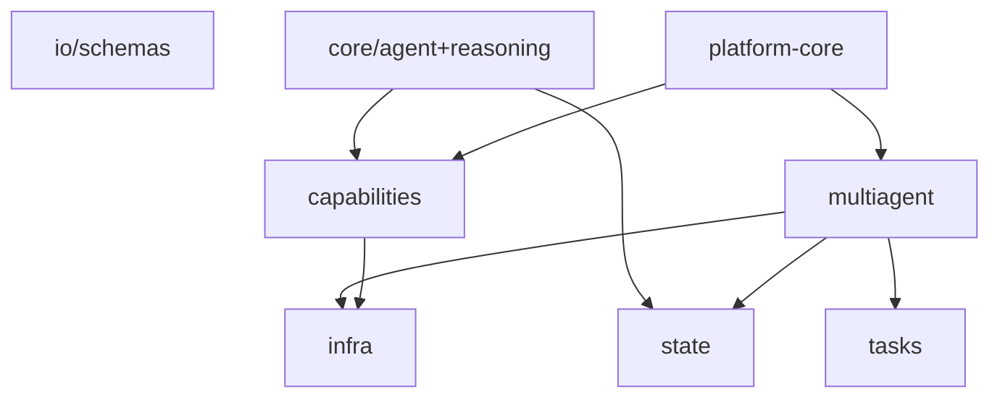

### §AP.2.11 — Chiến lược reasoning (YAML → factory)

| YAML `reasoning` | Class | Hành vi |
|------------------|-------|---------|
| `null / omitted` | `PassthroughStrategy` | Gọi LLM một lần, không wrap |
| `react` | `ReActStrategy` | Reason + Act + Observe loop |
| `cot` | `ChainOfThoughtStrategy` | Chain-of-thought prompting |
| `plan_execute` | `PlanAndExecuteStrategy` | Lập kế hoạch rồi thực thi |

### §AP.2.12 — Memory & retrieval backends

| Layer | Backend key | Ghi chú |
|-------|-------------|---------|
| stm | `in_memory` | Dict in-process — test/dev |
| stm | `redis` | REDIS_URL — production supermarket |
| stm | `strands` | Strands session manager integration |
| ltm | `sqlite` | File ./data/ltm.db |
| ltm | `mongodb` | MONGODB_URI — production supermarket |
| ltm | `redis` | Redis-backed LTM |
| retrieval | `in_memory` | Vector in RAM |
| retrieval | `chroma` | ChromaDB persistent |

### §AP.2.13 — GraphEngine — node kinds

- **`agent`**: Gọi executor với node_id = agent name
- **`parallel`**: Chạy nhiều agent song song, merge concat/list
- **`conditional`**: Evaluate routes[].when → branch
- **`join`**: Đợi parallel branches, merge state
- **`debate`**: Round-robin participants + facilitator

### §AP.2.14 — Hợp đồng A2A (io/schemas.py)

**AgentRequest fields:**
- `message: str` — user goal / prompt turn.
- `session_id: str | None` — conversation id; auto-generate nếu null.
- `actor_id: str` — user identity cho LTM/ACL.
- `metadata: dict` — `inbox` (pipeline feedback), `shared_state`, `permissions`, custom.
**AgentResponse fields:**
- `content: str | None` — natural language cho user.
- `payload: dict` — structured JSON (SQL plan, risk verdict, analysis result).
- `tool_calls: list` — audit tool invocations.
- `state_updates: dict` — mutate shared blackboard.
- `session_id`, `actor_id`, `memory_refs` — persistence hints.

## §AP.3 — libs/mcp-core + commons

> **Phạm vi:** MCP protocol layer (items 37–50) và shared utilities `libs/commons`. MCP = JSON-RPC cho tools/resources/prompts qua stdio hoặc HTTP/SSE.

### §AP.3.1 — libs/commons

| File | Exports | Mô tả |
|------|---------|-------|
| `libs/commons/src/commons/errors.py` | CommonsError, ConfigError | Hierarchy exception; ConfigError code=config_error |
| `libs/commons/src/commons/logging.py` | get_logger | LOG_LEVEL env; format structured stderr |
| `libs/commons/src/commons/settings.py` | BaseAppSettings | pydantic-settings + .env loading |
| `libs/commons/src/commons/types.py` | Result, JSONValue | Generic Result ok/err; JSON type alias |
| `libs/commons/src/commons/__init__.py` | — | Package marker |

**Sử dụng trong monorepo:**
- Mọi service/agent gọi `commons.logging.get_logger(__name__)`.
- Config loader raise `commons.errors.ConfigError` — catch thống nhất.
- Agent settings subclass `BaseAppSettings` cho env-driven config.
- `Result[T,E]` dùng khi hot path tránh exception (optional).
### §AP.3.2 — mcp-core server layer

| Module | Class | Vai trò |
|--------|-------|---------|
| `mcp_core/server/lifecycle/fastmcp_server.py` | `FastMCPServer` | FastMCP lifecycle wrapper |
| `mcp_core/server/lifecycle/base.py` | `ServerLifecycle` | Start/stop hooks |
| `mcp_core/server/transport/base.py` | `Transport` | stdio / streamable-http / SSE abstraction |
| `mcp_core/server/session/base.py` | `SessionManager` | MCP session state |
| `mcp_core/server/auth/base.py` | `AuthProvider` | Bearer/JWT/composite |
| `mcp_core/server/auth/middleware.py` | `auth_middleware` | Request auth gate |
| `mcp_core/server/auth/factory.py` | `build_auth` | Auth from spec |
| `mcp_core/server/providers/tools/base.py` | `ToolProvider` | Register + invoke tools |
| `mcp_core/server/providers/resources/base.py` | `ResourceProvider` | MCP resources → retrieval |
| `mcp_core/server/providers/prompts/base.py` | `PromptProvider` | MCP prompts → templates |
| `mcp_core/server/capabilities/base.py` | `CapabilityNegotiation` | Protocol handshake |
| `mcp_core/server/callbacks/base.py` | `CallbackHandler` | Progress/logging callbacks |
| `mcp_core/server/notifications/base.py` | `NotificationService` | Server push notifications |
| `mcp_core/server/errors/base.py` | `MCPError` | Structured MCP errors |

### §AP.3.3 — mcp-core client layer

| Module | Class | Vai trò |
|--------|-------|---------|
| `mcp_core/client/connector/base.py` | `MCPConnector, ServerEndpoint` | Connect + discover remote tools |
| `mcp_core/client/connector/strands_connector.py` | `StrandsMCPConnector` | Strands-specific transport |
| `mcp_core/client/registry/base.py` | `MCPServerRegistry` | Multi-server registry + prefixes |
| `mcp_core/client/registry/strands_registry.py` | `StrandsMCPServerRegistry` | Used by BaseAgentService |
| `mcp_core/client/registry/tool_filter.py` | `ToolFilter` | Allow/deny tool names |
| `mcp_core/client/adapter/base.py` | `MCPAgentAdapter` | MCP tool → agent tool handle |
| `mcp_core/client/adapter/strands_adapter.py` | `StrandsMCPAgentAdapter` | → Strands Agent tools |

### §AP.3.4 — Luồng MCP JSON-RPC

```
Agent (Strands)                    MCP Server (sql-gateway)
     |                                      |
     |--- initialize ----------------------->|
     |<-- capabilities ----------------------|
     |--- tools/list ----------------------->|
     |<-- [{name, inputSchema}] -------------|
     |--- tools/call {name, arguments} ----->|
     |<-- {content:[{type:text}], isError} --|
```
**Mapping sang agent-core (README mcp-core):**
- MCP tool → `capabilities.tools.AbstractTool`
- MCP resource → `capabilities.retrieval` / memory
- MCP prompt → `capabilities.prompts.PromptTemplate`
### §AP.3.5 — Wiring supermarket

| Server | Transport | Prefix | Thực thi bởi |
|--------|-----------|--------|--------------|
| sql-gateway | SSE (`SQL_GATEWAY_URL`) | `sql` | Pipeline `HttpSqlGatewayClient`, không agent ReAct |
| python-sandbox | stdio (`uv run python-sandbox`) | `sandbox` | Pipeline process, không agent ReAct |
Comment trong `platform-supermarket.yaml`: tool ownership thuộc pipeline/gateway — agents trả JSON; chat-gateway + SupermarketAnalysisPipeline gọi MCP.
### §AP.3.6 — Adapter chain (tool → LLM)

1. `PlatformMCPRegistry.endpoints_for(['sql-gateway'])` → `ServerEndpoint`.
2. `StrandsMCPServerRegistry.add(endpoint)` + context manager connect.
3. `registry.adapted_tools(StrandsMCPAgentAdapter)` → list Strands-compatible tools.
4. `StrandsAgent(model, tools=...)` — LLM nhận tool specs trong API call.
5. LLM emit tool_call → adapter → MCP `tools/call` → result text → next turn.
**ToolFilter:** `MCPServerSpec.tool_filters` giới hạn expose subset tools per server.
### §AP.3.7 — Inventory file mcp-core

| File | Docstring |
|------|-----------|
| `libs/mcp-core/src/mcp_core/__init__.py` | mcp-core: abstract building blocks for MCP servers and clients (items 37-50). |
| `libs/mcp-core/src/mcp_core/client/__init__.py` | G (client side): connector, multi-server registry, MCP<->Agent adapter |
| `libs/mcp-core/src/mcp_core/client/adapter/__init__.py` | Item 50 - MCP <-> Agent adapter (bridge). |
| `libs/mcp-core/src/mcp_core/client/adapter/base.py` | Item 50 - MCP <-> Agent adapter (bridge). |
| `libs/mcp-core/src/mcp_core/client/adapter/strands_adapter.py` | Strands implementation of the MCP <-> Agent adapter. |
| `libs/mcp-core/src/mcp_core/client/connector/__init__.py` | Item 48 - MCP Client / Connector. |
| `libs/mcp-core/src/mcp_core/client/connector/base.py` | Item 48 - MCP Client / Connector. |
| `libs/mcp-core/src/mcp_core/client/connector/strands_connector.py` | Strands-backed reference implementation of :class:`MCPConnector`. |
| `libs/mcp-core/src/mcp_core/client/registry/__init__.py` | Item 49 - MCP server registry / Multi-server manager. |
| `libs/mcp-core/src/mcp_core/client/registry/base.py` | Item 49 - MCP server registry / Multi-server manager. |
| `libs/mcp-core/src/mcp_core/client/registry/strands_registry.py` | Strands-backed multi-server registry: builds StrandsMCPConnector per endpoint. |
| `libs/mcp-core/src/mcp_core/client/registry/tool_filter.py` | Tool name filtering for MCP server endpoints. |
| `libs/mcp-core/src/mcp_core/server/__init__.py` | G (server side): MCP server lifecycle, transport, capabilities, providers, |
| `libs/mcp-core/src/mcp_core/server/auth/__init__.py` | Item 45 - Auth / Authorization. |
| `libs/mcp-core/src/mcp_core/server/auth/base.py` | MCP server authentication and authorization. |
| `libs/mcp-core/src/mcp_core/server/auth/factory.py` | Build MCP authorizers from config. |
| `libs/mcp-core/src/mcp_core/server/auth/middleware.py` | Auth middleware wrapping MCP tool handlers. |
| `libs/mcp-core/src/mcp_core/server/callbacks/__init__.py` | Item 43 - Client-callback handler (server calls back to client). |
| `libs/mcp-core/src/mcp_core/server/callbacks/base.py` | Item 43 - Client-callback handler (server -> client). |
| `libs/mcp-core/src/mcp_core/server/capabilities/__init__.py` | Item 39 - Capability negotiation. |
| `libs/mcp-core/src/mcp_core/server/capabilities/base.py` | Item 39 - Capability negotiation. |
| `libs/mcp-core/src/mcp_core/server/errors/__init__.py` | Item 47 - Error handling (domain -> JSON-RPC). |
| `libs/mcp-core/src/mcp_core/server/errors/base.py` | Item 47 - Error handling. |
| `libs/mcp-core/src/mcp_core/server/lifecycle/__init__.py` | Item 37 - MCP Server (base / lifecycle). |
| `libs/mcp-core/src/mcp_core/server/lifecycle/base.py` | Item 37 - MCP Server (base / lifecycle). |
| `libs/mcp-core/src/mcp_core/server/lifecycle/fastmcp_server.py` | FastMCP-backed reference implementation of :class:`AbstractMCPServer`. |
| `libs/mcp-core/src/mcp_core/server/notifications/__init__.py` | Item 46 - Notifications / Progress / Cancellation. |
| `libs/mcp-core/src/mcp_core/server/notifications/base.py` | Item 46 - Notifications / Progress / Cancellation. |
| `libs/mcp-core/src/mcp_core/server/providers/__init__.py` | MCP primitives exposed by a server: tools (40), resources (41), prompts (42). |
| `libs/mcp-core/src/mcp_core/server/providers/prompts/__init__.py` | Item 42 - Prompt provider (primitive: template). |
| `libs/mcp-core/src/mcp_core/server/providers/prompts/base.py` | Item 42 - Prompt provider (primitive: template). |
| `libs/mcp-core/src/mcp_core/server/providers/resources/__init__.py` | Item 41 - Resource provider (primitive: read-only data). |
| `libs/mcp-core/src/mcp_core/server/providers/resources/base.py` | Item 41 - Resource provider (primitive: read-only data). |
| `libs/mcp-core/src/mcp_core/server/providers/tools/__init__.py` | Item 40 - Tool provider (primitive: action, has side-effects). |
| `libs/mcp-core/src/mcp_core/server/providers/tools/base.py` | Item 40 - Tool provider (primitive: action). |
| `libs/mcp-core/src/mcp_core/server/session/__init__.py` | Item 44 - Session / Connection. |
| `libs/mcp-core/src/mcp_core/server/session/base.py` | Item 44 - Session / Connection. |
| `libs/mcp-core/src/mcp_core/server/transport/__init__.py` | Item 38 - Transport (stdio / streamable-http). |
| `libs/mcp-core/src/mcp_core/server/transport/base.py` | Item 38 - Transport. |

### §AP.3.8 — Chi tiết `commons` từng module

#### `commons/errors.py`

- **`CommonsError`**: base exception với `code` machine-readable và `details` dict.
- **`ConfigError`**: subclass với `code=config_error` — platform loader, registry raise khi YAML thiếu/sai.
- **Pattern catch:** service layer catch `ConfigError` → HTTP 503; log `exc.details`.

#### `commons/logging.py`

- **`get_logger(name)`**: lazy configure root logger một lần (`_CONFIGURED` flag).
- **Format:** `%(asctime)s %(levelname)-7s %(name)s :: %(message)s` trên stderr.
- **Env:** `LOG_LEVEL` (default INFO) — áp dụng toàn monorepo thống nhất.

#### `commons/settings.py`

- **`BaseAppSettings`**: pydantic-settings với `env_file=.env`, `extra=ignore`.
- **Field mặc định:** `log_level: str = "INFO"`.
- **Subclass:** mỗi agent/service (`ChatGatewaySettings`, …) kế thừa pattern này.

#### `commons/types.py`

- **`JSONValue`**: type alias JSON-compatible (recursive dict/list).
- **`Result[T,E]`**: dataclass `ok()` / `err()` / `unwrap()` — optional thay exception trên hot path.

### §AP.3.9 — MCP server lifecycle (items 37–47)

| Item | Module | Trách nhiệm |
|------|--------|-------------|
| 37 | `lifecycle/base.py`, `fastmcp_server.py` | Khởi tạo/dừng server; FastMCP reference impl |
| 38 | `transport/base.py` | stdio subprocess vs streamable-http vs SSE |
| 39 | `capabilities/base.py` | Handshake `initialize` — protocol version |
| 40 | `providers/tools/base.py` | `tools/list`, `tools/call` — side-effect actions |
| 41 | `providers/resources/base.py` | Read-only data exposure |
| 42 | `providers/prompts/base.py` | Template prompts cho client |
| 43 | `callbacks/base.py` | Server → client callback (progress) |
| 44 | `session/base.py` | Connection/session state |
| 45 | `auth/base.py`, `middleware.py`, `factory.py` | Bearer/JWT/composite auth |
| 46 | `notifications/base.py` | Push notifications, cancellation |
| 47 | `errors/base.py` | Domain error → JSON-RPC error object |

**Repo consumers:** `mcp-servers/sql-gateway` và `mcp-servers/python-sandbox` implement tool providers; không dùng full server stack trực tiếp từ mcp-core trong mọi case — FastMCP wrapper là reference.

### §AP.3.10 — MCP client stack (items 48–50)

**Item 48 — Connector (`client/connector/`):**
- `ServerEndpoint`: dataclass mô tả transport, url/command, prefix, tool_filters.
- `MCPConnector`: connect, `list_tools()`, `call_tool(name, args)`.
- `StrandsMCPConnector`: Strands SDK transport binding.

**Item 49 — Registry (`client/registry/`):**
- `MCPServerRegistry`: quản lý nhiều server; prefix tránh collision tên tool.
- `StrandsMCPServerRegistry`: context manager `with registry:` auto connect/disconnect.
- `ToolFilter`: allowlist/denylist pattern trên tên tool.

**Item 50 — Adapter (`client/adapter/`):**
- `MCPAgentAdapter`: abstract bridge MCP → framework agent tools.
- `StrandsMCPAgentAdapter`: produce Strands `@tool` handles cho `StrandsAgent`.

### §AP.3.11 — sql-gateway MCP tools (supermarket)

Pipeline gọi qua `HttpSqlGatewayClient`, không qua agent ReAct. Tools logic (prefix `sql_`):

| Tool (logical) | Mô tả | ACL |
|----------------|-------|-----|
| validate_sql | Parse + policy pre-check | SqlAclContext required |
| explain_sql | EXPLAIN plan cho Agent III | Read-only |
| execute_readonly | Chạy SELECT → parquet path | Row cap + store filter |

Transport SSE: client giữ long-lived connection tới `SQL_GATEWAY_URL`; retry khi gateway restart.

### §AP.3.12 — python-sandbox MCP tools

Stdio subprocess — pipeline spawn trong cùng host hoặc sidecar:

| Tool (logical) | Mô tả |
|----------------|-------|
| run_python | Execute sandboxed Python trên parquet artifact |
| describe_dataset | Schema + sample rows parquet |

**Security:** sandbox tách process; không mount credentials SQL; chỉ đọc artifact paths pipeline cấp.

### §AP.3.13 — Troubleshooting MCP

| Triệu chứng | Nguyên nhân | Cách xử lý |
|-------------|-------------|------------|
| Connection refused SSE | SQL_GATEWAY down | `curl $SQL_GATEWAY_URL/health` |
| stdio spawn fail | `uv` không trong PATH container | Kiểm tra Dockerfile CMD |
| Tool not found | prefix mismatch | Verify `MCPServerSpec.prefix` |
| Auth 401 MCP | Bearer thiếu | Set token env trên client |
| Timeout tools/call | Query nặng | Giảm `policy.max_rows`; index DB |

### §AP.3.14 — So sánh transport MCP trong repo

| Transport | Server | Ưu điểm | Nhược điểm |
|-----------|--------|---------|------------|
| SSE | sql-gateway | Remote, scale riêng gateway | Cần stable URL, firewall |
| stdio | python-sandbox | Đơn giản local, ít port | Khó scale multi-host |
| streamable-http | (generic) | HTTP standard | Cấu hình TLS phức tạp hơn |

**Chọn transport:** remote shared service → SSE/HTTP; one-shot sidecar cùng pod → stdio.

**Env MCP client:** `MCP_TRANSPORT`, `MCP_HTTP_HOST`, `MCP_HTTP_PORT`, TLS bundle paths — xem `mcp_core/client/connector/base.py`.

**Test liên quan:** `test_sandbox_tools.py`, `test_sql_gateway.py`, `test_sql_gateway_acl_enforcement.py`.

**Versioning:** mcp-core README đánh số items 37–50; thay đổi protocol phải update cả server (`mcp-servers/*`) và client adapter.

### §AP.3.15 — Dependency graph commons ↔ mcp-core ↔ platform-core

```
commons (logging, errors)
    ↑           ↑
agent-core ← platform-core → mcp-core client (adapter, registry)
                    ↓
              mcp-servers (sql-gateway, python-sandbox)
```

- **platform-core** import `commons`, `mcp_core.client.*`, `agent_core.*`.
- **Agents** (I–IV) extend `BaseAgentService` — inherit MCP wiring dù supermarket để `mcp_servers: []`.
- **Pipeline** gọi MCP trực tiếp qua HTTP client — bypass `StrandsMCPServerRegistry` trong agent process.
- **Regenerate doc:** `uv run python scripts/gen_ap_append.py` sau thay đổi libs/config/tests.


## §I.1-DETAIL — Mọi khóa trong config/project.yaml

> **Phạm vi:** Giải thích chi tiết từng khóa top-level và nested trong `config/project.yaml`. Stub §I.1 giữ tổng quan; section này là reference đầy đủ.

### §I.1-DETAIL.1 — Khóa scalar và nested

#### `app_name`

- **Nhóm:** `root`
- **Giá trị mặc định (repo):** `supermarket-analysis-agent`
- **Ý nghĩa:** Tên logical app; logging, metrics label.
- **Loader:** `project_core.config.loader.load_project_config()` merge vào `ProjectConfig`.
- **Override:** env không override trực tiếp — sửa YAML hoặc mount config map K8s.

#### `pipeline.max_sql_queries_per_plan`

- **Nhóm:** `pipeline`
- **Giá trị mặc định (repo):** `6`
- **Ý nghĩa:** Giới hạn số query SQL trong một plan Agent II; tránh runaway.
- **Loader:** `project_core.config.loader.load_project_config()` merge vào `ProjectConfig`.
- **Override:** env không override trực tiếp — sửa YAML hoặc mount config map K8s.

#### `pipeline.max_sql_retries`

- **Nhóm:** `pipeline`
- **Giá trị mặc định (repo):** `3`
- **Ý nghĩa:** Vòng lặp ngoài khi plan/execute fail; mỗi vòng có thể nhận policy/risk feedback.
- **Loader:** `project_core.config.loader.load_project_config()` merge vào `ProjectConfig`.
- **Override:** env không override trực tiếp — sửa YAML hoặc mount config map K8s.

#### `pipeline.max_risk_retries`

- **Nhóm:** `pipeline`
- **Giá trị mặc định (repo):** `2`
- **Ý nghĩa:** Số lần Agent III reject trước khi pipeline abort hoặc clarify.
- **Loader:** `project_core.config.loader.load_project_config()` merge vào `ProjectConfig`.
- **Override:** env không override trực tiếp — sửa YAML hoặc mount config map K8s.

#### `pipeline.max_clarify_rounds`

- **Nhóm:** `pipeline`
- **Giá trị mặc định (repo):** `3`
- **Ý nghĩa:** Tối đa vòng hỏi user qua clarification bridge.
- **Loader:** `project_core.config.loader.load_project_config()` merge vào `ProjectConfig`.
- **Override:** env không override trực tiếp — sửa YAML hoặc mount config map K8s.

#### `pipeline.max_sync_seconds`

- **Nhóm:** `pipeline`
- **Giá trị mặc định (repo):** `120`
- **Ý nghĩa:** Deadline đồng bộ pipeline; timeout → partial/error outcome.
- **Loader:** `project_core.config.loader.load_project_config()` merge vào `ProjectConfig`.
- **Override:** env không override trực tiếp — sửa YAML hoặc mount config map K8s.

#### `pipeline.iv_max_steps`

- **Nhóm:** `pipeline`
- **Giá trị mặc định (repo):** `8`
- **Ý nghĩa:** Max bước reasoning Agent IV (analyst).
- **Loader:** `project_core.config.loader.load_project_config()` merge vào `ProjectConfig`.
- **Override:** env không override trực tiếp — sửa YAML hoặc mount config map K8s.

#### `pipeline.poll_enabled`

- **Nhóm:** `pipeline`
- **Giá trị mặc định (repo):** `true`
- **Ý nghĩa:** Cho phép UI poll workflow progress qua STM.
- **Loader:** `project_core.config.loader.load_project_config()` merge vào `ProjectConfig`.
- **Override:** env không override trực tiếp — sửa YAML hoặc mount config map K8s.

#### `pipeline.workflow_stale_ttl_seconds`

- **Nhóm:** `pipeline`
- **Giá trị mặc định (repo):** `900`
- **Ý nghĩa:** Workflow cũ hơn 15 phút coi là stale; cleanup/recreate.
- **Loader:** `project_core.config.loader.load_project_config()` merge vào `ProjectConfig`.
- **Override:** env không override trực tiếp — sửa YAML hoặc mount config map K8s.

#### `pipeline.workflow_steps_max`

- **Nhóm:** `pipeline`
- **Giá trị mặc định (repo):** `200`
- **Ý nghĩa:** Cap số WorkflowStep ghi vào trace — tránh bloat.
- **Loader:** `project_core.config.loader.load_project_config()` merge vào `ProjectConfig`.
- **Override:** env không override trực tiếp — sửa YAML hoặc mount config map K8s.

#### `pipeline.workflow_steps_scope`

- **Nhóm:** `pipeline`
- **Giá trị mặc định (repo):** `analysis`
- **Ý nghĩa:** Scope filter khi persist steps (analysis vs chat-only).
- **Loader:** `project_core.config.loader.load_project_config()` merge vào `ProjectConfig`.
- **Override:** env không override trực tiếp — sửa YAML hoặc mount config map K8s.

#### `clarification.hard_enforce`

- **Nhóm:** `clarification`
- **Giá trị mặc định (repo):** `true`
- **Ý nghĩa:** Bắt buộc clarify khi confidence thấp; không bypass silently.
- **Loader:** `project_core.config.loader.load_project_config()` merge vào `ProjectConfig`.
- **Override:** env không override trực tiếp — sửa YAML hoặc mount config map K8s.

#### `clarification.bridge_min_confidence`

- **Nhóm:** `clarification`
- **Giá trị mặc định (repo):** `0.75`
- **Ý nghĩa:** Ngưỡng Agent I bridge chấp nhận brief không cần clarify.
- **Loader:** `project_core.config.loader.load_project_config()` merge vào `ProjectConfig`.
- **Override:** env không override trực tiếp — sửa YAML hoặc mount config map K8s.

#### `rag.clarify_min_score`

- **Nhóm:** `rag`
- **Giá trị mặc định (repo):** `0.72`
- **Ý nghĩa:** RAG retrieval score tối thiểu để auto-answer clarify.
- **Loader:** `project_core.config.loader.load_project_config()` merge vào `ProjectConfig`.
- **Override:** env không override trực tiếp — sửa YAML hoặc mount config map K8s.

#### `rag.top_k`

- **Nhóm:** `rag`
- **Giá trị mặc định (repo):** `5`
- **Ý nghĩa:** Số chunk retrieval inject vào context.
- **Loader:** `project_core.config.loader.load_project_config()` merge vào `ProjectConfig`.
- **Override:** env không override trực tiếp — sửa YAML hoặc mount config map K8s.

#### `budget.agent_caps.I`

- **Nhóm:** `budget`
- **Giá trị mặc định (repo):** `5`
- **Ý nghĩa:** Token/step budget cap Agent I (router).
- **Loader:** `project_core.config.loader.load_project_config()` merge vào `ProjectConfig`.
- **Override:** env không override trực tiếp — sửa YAML hoặc mount config map K8s.

#### `budget.agent_caps.II`

- **Nhóm:** `budget`
- **Giá trị mặc định (repo):** `6`
- **Ý nghĩa:** Cap Agent II (SQL planner).
- **Loader:** `project_core.config.loader.load_project_config()` merge vào `ProjectConfig`.
- **Override:** env không override trực tiếp — sửa YAML hoặc mount config map K8s.

#### `budget.agent_caps.III`

- **Nhóm:** `budget`
- **Giá trị mặc định (repo):** `18`
- **Ý nghĩa:** Cap Agent III (risk — nhiều bước hơn).
- **Loader:** `project_core.config.loader.load_project_config()` merge vào `ProjectConfig`.
- **Override:** env không override trực tiếp — sửa YAML hoặc mount config map K8s.

#### `budget.agent_caps.IV`

- **Nhóm:** `budget`
- **Giá trị mặc định (repo):** `4`
- **Ý nghĩa:** Cap Agent IV (analyst).
- **Loader:** `project_core.config.loader.load_project_config()` merge vào `ProjectConfig`.
- **Override:** env không override trực tiếp — sửa YAML hoặc mount config map K8s.

#### `budget.max_tokens_per_trace`

- **Nhóm:** `budget`
- **Giá trị mặc định (repo):** `200000`
- **Ý nghĩa:** Hard ceiling toàn trace pipeline.
- **Loader:** `project_core.config.loader.load_project_config()` merge vào `ProjectConfig`.
- **Override:** env không override trực tiếp — sửa YAML hoặc mount config map K8s.

#### `policy.max_rows`

- **Nhóm:** `policy`
- **Giá trị mặc định (repo):** `50000`
- **Ý nghĩa:** PolicyEngine reject SELECT trả quá N rows.
- **Loader:** `project_core.config.loader.load_project_config()` merge vào `ProjectConfig`.
- **Override:** env không override trực tiếp — sửa YAML hoặc mount config map K8s.

#### `policy.max_join_depth`

- **Nhóm:** `policy`
- **Giá trị mặc định (repo):** `5`
- **Ý nghĩa:** Giới hạn độ sâu JOIN — anti-complexity.
- **Loader:** `project_core.config.loader.load_project_config()` merge vào `ProjectConfig`.
- **Override:** env không override trực tiếp — sửa YAML hoặc mount config map K8s.

#### `policy.default_schema`

- **Nhóm:** `policy`
- **Giá trị mặc định (repo):** `dbo`
- **Ý nghĩa:** Schema SQL mặc định khi không qualify.
- **Loader:** `project_core.config.loader.load_project_config()` merge vào `ProjectConfig`.
- **Override:** env không override trực tiếp — sửa YAML hoặc mount config map K8s.

#### `artifacts.base_dir`

- **Nhóm:** `artifacts`
- **Giá trị mặc định (repo):** `data/artifacts`
- **Ý nghĩa:** Thư mục parquet, explain plans, temp files.
- **Loader:** `project_core.config.loader.load_project_config()` merge vào `ProjectConfig`.
- **Override:** env không override trực tiếp — sửa YAML hoặc mount config map K8s.

#### `artifacts.ttl_days`

- **Nhóm:** `artifacts`
- **Giá trị mặc định (repo):** `7`
- **Ý nghĩa:** Retention cleanup (`scripts/cleanup_artifacts.py`).
- **Loader:** `project_core.config.loader.load_project_config()` merge vào `ProjectConfig`.
- **Override:** env không override trực tiếp — sửa YAML hoặc mount config map K8s.

#### `artifacts.max_bytes_per_trace`

- **Nhóm:** `artifacts`
- **Giá trị mặc định (repo):** `52428800`
- **Ý nghĩa:** 50 MiB cap artifact size per trace.
- **Loader:** `project_core.config.loader.load_project_config()` merge vào `ProjectConfig`.
- **Override:** env không override trực tiếp — sửa YAML hoặc mount config map K8s.

#### `stm.session_ttl_days`

- **Nhóm:** `stm`
- **Giá trị mặc định (repo):** `30`
- **Ý nghĩa:** Redis/Mongo session expiry cho workflow state.
- **Loader:** `project_core.config.loader.load_project_config()` merge vào `ProjectConfig`.
- **Override:** env không override trực tiếp — sửa YAML hoặc mount config map K8s.

#### `data_sources.db1.env_dsn`

- **Nhóm:** `data_sources`
- **Giá trị mặc định (repo):** `ANALYTICS_DB_DSN`
- **Ý nghĩa:** DSN SQL Server shard HQ (db1).
- **Loader:** `project_core.config.loader.load_project_config()` merge vào `ProjectConfig`.
- **Override:** env không override trực tiếp — sửa YAML hoặc mount config map K8s.

#### `data_sources.db2.env_dsn`

- **Nhóm:** `data_sources`
- **Giá trị mặc định (repo):** `ANALYTICS_DB_DSN_2`
- **Ý nghĩa:** DSN DB phụ (db2) nếu có.
- **Loader:** `project_core.config.loader.load_project_config()` merge vào `ProjectConfig`.
- **Override:** env không override trực tiếp — sửa YAML hoặc mount config map K8s.

### §I.1-DETAIL.2 — YAML anchors `_HQ_TABLES` / `_STORE_TABLES`

File dùng YAML anchor/alias để DRY danh sách bảng:
- `&hq_tables` — ~40 bảng HQ (STRANS, PMTRANS, TRANSHDR, CRDTRANS, CUSTOMER, SKU_DEF, WebRpt_*, …).
- `&store_tables` — subset ~15 bảng store-level (bỏ ARC/TMP/admin tables).
- `roles.*.allowed_tables: *hq_tables` hoặc `*store_tables` — alias reference.
**Lưu ý shard:** Comment line 50: SQL runtime có thể dùng `STRANS_YYYYMM`, `PMTRANS_YYYYMM` — logical name trong dictionary khác physical shard table.
**Đồng bộ AUTH DB:** Comment line 111–112: dev/test grants phải mirror `deploy/sql/auth/004_permissions.sql` khi `ALLOW_DEV_AUTH=1`.
### §I.1-DETAIL.3 — Block `roles`

#### Role `store_manager`

- **`allowed_tables`:** Whitelist bảng SQL — PolicyEngine + SqlGateway enforce.
- **`denied_columns`:** Blacklist cột nhạy cảm (SPPRICE, cogs, PASSCODE, …).
- **`store_filter_required`:** true → bắt buộc `store_id IN (...)` predicate.
- **`tool_grants`:** Pattern MCP/tool ACL, ví dụ `tool:*`.
- **`allowed_functions`:** SQL function whitelist pattern `function:*`.
- **denied_columns:** SPPRICE, LASTSPPR, cogs, gross_profit, free_cogs, value_onhand, PASSCODE, PERSON_ID.
- **store_filter_required:** `true` — row-level security theo store_ids từ AUTH.

#### Role `hq_analyst`

- **`allowed_tables`:** Whitelist bảng SQL — PolicyEngine + SqlGateway enforce.
- **`denied_columns`:** Blacklist cột nhạy cảm (SPPRICE, cogs, PASSCODE, …).
- **`store_filter_required`:** true → bắt buộc `store_id IN (...)` predicate.
- **`tool_grants`:** Pattern MCP/tool ACL, ví dụ `tool:*`.
- **`allowed_functions`:** SQL function whitelist pattern `function:*`.
- **denied_columns:** `[]` — full column access trong allowed_tables.
- **store_filter_required:** `false` — HQ xem cross-store.

### §I.1-DETAIL.4 — Danh sách bảng HQ (`_HQ_TABLES`)

- `STRANS` — bảng #1 trong grant HQ; kiểm tra data_dictionary tương ứng.
- `PMTRANS` — bảng #2 trong grant HQ; kiểm tra data_dictionary tương ứng.
- `TRANSHDR` — bảng #3 trong grant HQ; kiểm tra data_dictionary tương ứng.
- `TRANSHDR_ARC` — bảng #4 trong grant HQ; kiểm tra data_dictionary tương ứng.
- `CRDTRANS` — bảng #5 trong grant HQ; kiểm tra data_dictionary tương ứng.
- `CRDTRANS_ARC` — bảng #6 trong grant HQ; kiểm tra data_dictionary tương ứng.
- `CRDTRANS_TMP` — bảng #7 trong grant HQ; kiểm tra data_dictionary tương ứng.
- `STRANS_TMP` — bảng #8 trong grant HQ; kiểm tra data_dictionary tương ứng.
- `SUSPEND` — bảng #9 trong grant HQ; kiểm tra data_dictionary tương ứng.
- `CASH_ST` — bảng #10 trong grant HQ; kiểm tra data_dictionary tương ứng.
- `CTRANS` — bảng #11 trong grant HQ; kiểm tra data_dictionary tương ứng.
- `CUSTOMER` — bảng #12 trong grant HQ; kiểm tra data_dictionary tương ứng.
- `CSCARD` — bảng #13 trong grant HQ; kiểm tra data_dictionary tương ứng.
- `CRD_INFO` — bảng #14 trong grant HQ; kiểm tra data_dictionary tương ứng.
- `CUSTHIST` — bảng #15 trong grant HQ; kiểm tra data_dictionary tương ứng.
- `CustSumm` — bảng #16 trong grant HQ; kiểm tra data_dictionary tương ứng.
- `SKU_DEF` — bảng #17 trong grant HQ; kiểm tra data_dictionary tương ứng.
- `PLU` — bảng #18 trong grant HQ; kiểm tra data_dictionary tương ứng.
- `BARCODE` — bảng #19 trong grant HQ; kiểm tra data_dictionary tương ứng.
- `ASSOLST` — bảng #20 trong grant HQ; kiểm tra data_dictionary tương ứng.
- `ASSO_INF` — bảng #21 trong grant HQ; kiểm tra data_dictionary tương ứng.
- `SUPPLIER` — bảng #22 trong grant HQ; kiểm tra data_dictionary tương ứng.
- `PARTNER` — bảng #23 trong grant HQ; kiểm tra data_dictionary tương ứng.
- `HISRTPR` — bảng #24 trong grant HQ; kiểm tra data_dictionary tương ứng.
- `HISSPPR` — bảng #25 trong grant HQ; kiểm tra data_dictionary tương ứng.
- `RDISCINF` — bảng #26 trong grant HQ; kiểm tra data_dictionary tương ứng.
- `STK_DTL` — bảng #27 trong grant HQ; kiểm tra data_dictionary tương ứng.
- `ST_ORDER` — bảng #28 trong grant HQ; kiểm tra data_dictionary tương ứng.
- `INV_HDR` — bảng #29 trong grant HQ; kiểm tra data_dictionary tương ứng.
- `INV_ISS` — bảng #30 trong grant HQ; kiểm tra data_dictionary tương ứng.
- `PMCRDINF` — bảng #31 trong grant HQ; kiểm tra data_dictionary tương ứng.
- `PMCRDSTK` — bảng #32 trong grant HQ; kiểm tra data_dictionary tương ứng.
- `PMCRDISS` — bảng #33 trong grant HQ; kiểm tra data_dictionary tương ứng.
- `PMCRDRCV` — bảng #34 trong grant HQ; kiểm tra data_dictionary tương ứng.
- `ACCOUNT` — bảng #35 trong grant HQ; kiểm tra data_dictionary tương ứng.
- `DEBT` — bảng #36 trong grant HQ; kiểm tra data_dictionary tương ứng.
- `sku_activity` — bảng #37 trong grant HQ; kiểm tra data_dictionary tương ứng.
- `WebRpt_sales_sku_daily` — bảng #38 trong grant HQ; kiểm tra data_dictionary tương ứng.
- `WebRpt_inventory_daily` — bảng #39 trong grant HQ; kiểm tra data_dictionary tương ứng.
- `WebRpt_rfm_snapshot` — bảng #40 trong grant HQ; kiểm tra data_dictionary tương ứng.

### §I.1-DETAIL.5 — Danh sách bảng Store (`_STORE_TABLES`)

- `STRANS` — allowed cho store_manager; có thể thiếu cột denied.
- `PMTRANS` — allowed cho store_manager; có thể thiếu cột denied.
- `TRANSHDR` — allowed cho store_manager; có thể thiếu cột denied.
- `CRDTRANS` — allowed cho store_manager; có thể thiếu cột denied.
- `CUSTOMER` — allowed cho store_manager; có thể thiếu cột denied.
- `CSCARD` — allowed cho store_manager; có thể thiếu cột denied.
- `CustSumm` — allowed cho store_manager; có thể thiếu cột denied.
- `CUSTHIST` — allowed cho store_manager; có thể thiếu cột denied.
- `SKU_DEF` — allowed cho store_manager; có thể thiếu cột denied.
- `BARCODE` — allowed cho store_manager; có thể thiếu cột denied.
- `PLU` — allowed cho store_manager; có thể thiếu cột denied.
- `SUPPLIER` — allowed cho store_manager; có thể thiếu cột denied.
- `WebRpt_sales_sku_daily` — allowed cho store_manager; có thể thiếu cột denied.
- `WebRpt_inventory_daily` — allowed cho store_manager; có thể thiếu cột denied.
- `WebRpt_rfm_snapshot` — allowed cho store_manager; có thể thiếu cột denied.

### §I.1-DETAIL.6 — Ánh xạ config → code consumer

| Config prefix | Module | Usage |
|---------------|--------|-------|
| `pipeline.*` | `SupermarketAnalysisPipeline` | Retry loops, deadline, IV steps |
| `clarification.*` | `ClarificationCoordinator` | Bridge + hard enforce |
| `rag.*` | `SchemaRetriever, clarify RAG` | top_k, min_score |
| `budget.*` | `BudgetGuard, SessionBudgetTracker` | Per-agent caps |
| `policy.*` | `PolicyEngine` | SQL validation rules |
| `artifacts.*` | `ArtifactStore` | Parquet paths, TTL cleanup |
| `stm.*` | `RedisSTMStore` | Session/workflow TTL |
| `data_sources.*` | `SqlGateway shard resolver` | DSN per db1/db2 |
| `roles.*` | `build_permissions_snapshot, PermissionSet` | ACL at login + pipeline |

### §I.1-DETAIL.7 — Hướng dẫn tuning production

- **Tăng max_sql_retries:** Khi false negative policy; watch latency.
- **Giảm max_rows:** Bảo vệ SQL Server; trade-off với analyst completeness.
- **Tăng workflow_stale_ttl:** User để tab lâu; risk memory STM.
- **Giảm agent_caps.III:** Risk agent hay loop — cap sớm.
- **artifacts.ttl_days:** Disk pressure — cron cleanup_artifacts.
- **clarification.bridge_min_confidence:** UX vs accuracy trade-off.

### §I.1-DETAIL.8 — Giải thích từng bảng HQ (domain)

| Bảng | Domain | Ghi chú pipeline |
|------|--------|------------------|
| `STRANS` | Giao dịch bán hàng line-item | Shard `STRANS_YYYYMM`; store filter store_manager |
| `PMTRANS` | Thanh toán | Liên kết TRANSHDR; TRANS_CODE 221/008 |
| `TRANSHDR` | Header hóa đơn | Join STRANS; ARC variant archive |
| `CRDTRANS` | Thẻ tín dụng / loyalty | Denied cols store_manager ít hơn HQ |
| `CUSTOMER` | Master khách hàng | PII — cột PASSCODE denied store |
| `SKU_DEF` / `PLU` / `BARCODE` | Master sản phẩm | Schema retrieval ưu tiên |
| `WebRpt_sales_sku_daily` | Aggregate doanh thu | Pre-aggregated — analyst hay dùng |
| `WebRpt_inventory_daily` | Tồn kho ngày | Không expose value_onhand store |
| `WebRpt_rfm_snapshot` | RFM segmentation | Marketing analytics |
| `STK_DTL` / `ST_ORDER` | Kho / đặt hàng | HQ only trong `_HQ_TABLES` |
| `INV_HDR` / `INV_ISS` | Kiểm kê | HQ inventory ops |
| `PMCRD*` | Thẻ PM | Payment card stock/issue/receive |
| `ACCOUNT` / `DEBT` | Công nợ | Finance — HQ analyst |
| `sku_activity` | Hoạt động SKU | Web/reporting derived |

### §I.1-DETAIL.9 — `roles.store_manager.denied_columns` chi tiết

| Cột | Lý do deny |
|-----|------------|
| `SPPRICE`, `LASTSPPR` | Giá mua / supplier price — margin sensitive |
| `cogs`, `gross_profit`, `free_cogs` | COGS / lợi nhuận — chỉ HQ |
| `value_onhand` | Giá trị tồn kho tổng |
| `PASSCODE`, `PERSON_ID` | PII / auth |

PolicyEngine + SqlGateway double-enforce: YAML roles + AUTH DB seed (`004_permissions.sql`).

### §I.1-DETAIL.10 — `data_sources` và shard resolver

- **`db1`**: primary analytics — `ANALYTICS_DB_DSN`; logical `STRANS` → physical `STRANS_202504` etc.
- **`db2`**: secondary — `ANALYTICS_DB_DSN_2`; optional cho cross-DB (hiếm).
- **Resolver:** `project_core.domain.schema.shard_resolver` chọn shard theo date range trong brief.
- **Test:** `test_shard_resolver.py`, `test_live_sql.py` (optional CI).

### §I.1-DETAIL.11 — Fail-closed grants dev (`ALLOW_DEV_AUTH=1`)

Khi dev auth bật, pipeline đọc `roles` từ YAML thay vì AUTH DB. **Bắt buộc** mirror seed SQL — nếu lệch, test ACL (`test_sql_gateway_acl_enforcement.py`) fail. Production: `ALLOW_DEV_AUTH=0`, permissions từ JWT + AUTH DB only.

### §I.1-DETAIL.12 — Quick reference YAML path → Python attribute

| YAML path | Python (`ProjectConfig`) |
|-----------|--------------------------|
| `pipeline.max_sql_retries` | `config.pipeline.max_sql_retries` |
| `budget.agent_caps.III` | `config.budget.agent_caps["III"]` |
| `roles.hq_analyst.allowed_tables` | list resolved từ anchor `*hq_tables` |
| `artifacts.base_dir` | `Path(config.artifacts.base_dir)` |

Loader: `packages/project-core/src/project_core/config/loader.py` — merge với env overrides nếu có trong tương lai.


## §I.2-DETAIL — models.yaml profiles

> **File:** `config/models.yaml` — mapping agent role → LLM profile → OpenRouter model.

### §I.2-DETAIL.1 — agent_profiles mapping

| Key | Profile | Agent |
|-----|---------|-------|
| `default_profile` | `openrouter_mimo` | Fallback khi agent_profiles không chỉ định. |
| `agent_profiles.router` | `openrouter_mimo` | Agent I conversational-router. |
| `agent_profiles.sql_planner` | `openrouter_mimo` | Agent II SQL planning. |
| `agent_profiles.risk_reviewer` | `openrouter_fast` | Agent III — model nhanh, structured JSON. |
| `agent_profiles.analyst` | `openrouter_mimo` | Agent IV text analysis. |
| `agent_profiles.analyst_vision` | `openrouter_vision` | IV khi payload có chart/image. |
| `agent_profiles.embed` | `openrouter_embed` | Embedding RAG — text-embedding-3-small. |

### §I.2-DETAIL.2 — profiles definition

| Profile | provider | model_id | vision | max_tokens | temp | embed_dims | Ghi chú |
|---------|----------|----------|--------|------------|------|------------|---------|
| `openrouter_mimo` | openrouter | xiaomi/mimo-v2.5 | true | 4096 | 0.5 | — | General + vision capable |
| `openrouter_fast` | openrouter | google/gemini-2.0-flash-001 | false | 4096 | 0.5 | — | Fast risk review |
| `openrouter_vision` | openrouter | xiaomi/mimo-v2.5 | true | 4096 | 0.5 | — | Explicit vision tasks |
| `openrouter_embed` | openrouter | openai/text-embedding-3-small | false | — | — | 1536 | RAG embeddings |

### §I.2-DETAIL.3 — Env và runtime
- **API key:** `OPENROUTER_API_KEY` (hoặc legacy `openroute_api_key`) — `BaseAgentService.has_llm()`.
- **Loader:** `project_core` đọc models.yaml; `OpenAICompatibleProvider` dùng profile params.
- **Stub test:** `ALLOW_LLM_STUB=1` trong conftest bypass real LLM.
- **Đổi model prod:** sửa `model_id` trong profile; không cần redeploy agent code nếu API compatible.
### §I.2-DETAIL.4 — Chọn profile theo workload
| Workload | Khuyến nghị | Lý do |
|----------|-------------|-------|
| SQL generation | mimo | Cân bằng reasoning + cost |
| Risk JSON schema | fast (Gemini Flash) | Latency thấp, output ngắn |
| Long report | mimo + tăng max_tokens | Narrative quality |
| Chart analysis | vision | supports_vision=true |
| Schema RAG | embed | 1536-dim vectors |

## §I.3-DETAIL — platform-supermarket.yaml

> **File:** `platform-supermarket.yaml` (repo root) — wiring agents + MCP + memory cho deployment supermarket.

### §I.3-DETAIL.1 — memory block

```yaml
memory:
  stm:
    backend: redis
    url_env: REDIS_URL
  ltm:
    backend: mongodb
    uri_env: MONGODB_URI
    db_name: supermarket_agent
  checkpoint_db_path: ./data/checkpoints.db
```
| Khóa | Giá trị | Consumer |
|------|---------|----------|
| stm.backend | redis | `build_stm` → session + workflow STM |
| stm.url_env | REDIS_URL | Docker compose service redis |
| ltm.backend | mongodb | Case studies, feedback loop indexer |
| ltm.uri_env | MONGODB_URI | `FeedbackLoop`, LTM recall |
| ltm.db_name | supermarket_agent | Database name Mongo |
| checkpoint_db_path | ./data/checkpoints.db | SQLite per-agent checkpoint |
### §I.3-DETAIL.2 — mcp_servers block

**sql-gateway:**
- prefix: `sql` — tool names namespaced `sql_*`.
- transport: `sse` — remote HTTP Server-Sent Events.
- url_env: `SQL_GATEWAY_URL` (default port 18101).
- command/args: fallback local `uv run sql-gateway`.
**python-sandbox:**
- prefix: `sandbox`.
- transport: `stdio` — subprocess MCP.
- command: `uv`, args: `["run", "python-sandbox"]`.
**Tool ownership note:** Pipeline executes tools — agents have `mcp_servers: []`.
### §I.3-DETAIL.3 — agents block

| Agent key | capabilities | endpoint_env | skill | factory |
|-----------|--------------|--------------|-------|---------|
| `conversational-router` | router, ingress, synthesize, clarification_bridge | `AGENT_I_URL` | `router` | `conversational_router.service:build_service` |
| `sql-planner` | sql_plan, clarify | `AGENT_II_URL` | `sql_planner` | `sql_planner.service:build_service` |
| `risk-reviewer` | risk_review | `AGENT_III_URL` | `risk_reviewer` | `risk_reviewer.service:build_service` |
| `data-analyst` | analytics | `AGENT_IV_URL` | `analyst` | `data_analyst.service:build_service` |

### §I.3-DETAIL.4 — orchestration block

```yaml
orchestration:
  type: pipeline
  entry: conversational-router
```
Supermarket dùng **pipeline-centric** architecture — `type: pipeline` không phải full graph DAG.
Entry agent I; thực tế `SupermarketAnalysisPipeline` trong project-core điều phối II→III→IV.
`GraphOrchestrator` available qua CLI nhưng không phải hot path chat-gateway.
### §I.3-DETAIL.5 — Env matrix
| Biến env | Mặc định / ví dụ | Service |
|----------|------------------|---------|
| PLATFORM_CONFIG | platform-supermarket.yaml | All agents app.py |
| REDIS_URL | redis://localhost:6379 | STM |
| MONGODB_URI | mongodb://.../supermarket_agent | LTM, feedback |
| SQL_GATEWAY_URL | http://localhost:18101 | MCP sql tools |
| AGENT_I_URL … AGENT_IV_URL | http://localhost:1820x | HTTP A2A |

## §W.1 — Test files trong packages/project-test

> **Phạm vi:** Inventory và mô tả pytest suite — unit (project_core, agents) và integration (gateway, pipeline, auth).

### §W.1.1 — Cấu trúc thư mục

```
packages/project-test/
  conftest.py          # fixtures: fake_redis, platform_config, pipeline_factory, …
  unit/project_core/   # domain, policy, pipeline helpers
  unit/agents/         # agent I–IV behavior
  integration/         # HTTP gateway, live DB, end-to-end pipeline
  src/project_test/helpers/  # stub_sql, llm_stub, fake_mongo, scripted_invoker
  fixtures/            # golden_supermarket.yaml
```

### §W.1.2 — `unit/project_core/`

#### `packages/project-test/unit/project_core/test_acl_context.py`

**Mục đích:** SqlAclContext từ PermissionsSnapshot.

**Test cases:**
- `test_store_manager_requires_store_filter()`
- `test_hq_analyst_has_broader_tables()`
- `test_context_policy_agent_II_gets_brief()`
- `test_context_policy_IV_sandbox_tools_only()`

**Chạy:** `uv run pytest packages/project-test/unit/project_core/test_acl_context.py -v`

#### `packages/project-test/unit/project_core/test_agent_intelligence.py`

**Mục đích:** Agent heuristic behaviors.

**Test cases:**
- `test_product_resolver_generates_probes()`
- `test_apply_data_feedback_sets_exploration()`
- `test_ingest_txt_file()`
- `test_iv_analyzer_empty_result()`

**Chạy:** `uv run pytest packages/project-test/unit/project_core/test_agent_intelligence.py -v`

#### `packages/project-test/unit/project_core/test_agent_output_parse.py`

**Mục đích:** Parse structured agent JSON output.

**Test cases:**
- `test_parse_agent_ii_valid()`
- `test_parse_agent_iii_invalid_verdict()`
- `test_parse_agent_iv_missing_action()`

**Chạy:** `uv run pytest packages/project-test/unit/project_core/test_agent_output_parse.py -v`

#### `packages/project-test/unit/project_core/test_brief_templates.py`

**Mục đích:** Template rendering cho analysis brief.

**Test cases:**
- `test_brief_templates_excerpt_not_empty()`

**Chạy:** `uv run pytest packages/project-test/unit/project_core/test_brief_templates.py -v`

#### `packages/project-test/unit/project_core/test_budget.py`

**Mục đích:** BudgetGuard token caps per agent.

**Test cases:**
- `test_budget_records_agent_calls()`
- `test_budget_exceeds_agent_cap_raises()`

**Chạy:** `uv run pytest packages/project-test/unit/project_core/test_budget.py -v`

#### `packages/project-test/unit/project_core/test_catalog_policy.py`

**Mục đích:** Schema catalog policy filters.

**Test cases:**
- `test_sql_table_names_include_shards()`
- `test_policy_blocks_non_dictionary_table()`
- `test_policy_allows_dictionary_table()`
- `test_policy_blocks_delete()`
- `test_store_manager_cannot_query_hissppr()`
- `test_agent_schema_bundle_has_descriptions()`

**Chạy:** `uv run pytest packages/project-test/unit/project_core/test_catalog_policy.py -v`

#### `packages/project-test/unit/project_core/test_clarification.py`

**Mục đích:** ClarificationCoordinator rounds + suspend.

**Test cases:**
- `test_bridge_resolves_vip_from_transcript()`
- `test_bridge_ask_user_when_transcript_insufficient()`
- `test_apply_clarification_reply_updates_brief()`
- `test_enforce_clarify_source_II_only()`
- `test_can_emit_clarify_within_round_cap()`

**Chạy:** `uv run pytest packages/project-test/unit/project_core/test_clarification.py -v`

#### `packages/project-test/unit/project_core/test_clarification_bridge.py`

**Mục đích:** Agent I bridge confidence threshold.

**Chạy:** `uv run pytest packages/project-test/unit/project_core/test_clarification_bridge.py -v`

#### `packages/project-test/unit/project_core/test_compose_analysis.py`

**Mục đích:** Brief composition templates.

**Test cases:**
- `test_decompose_macro_intent()`
- `test_rank_candidates_partial_match()`
- `test_build_execution_plan_reuse_and_generate()`
- `test_resolve_params_from_brief_filters()`
- `test_hybrid_rank_prefers_embedding_overlap()`
- `test_select_recipe_stub_picks_top_candidate()`
- `test_registry_mcp_descriptors_and_invoke()`
- `test_decompose_heuristic_unchanged_with_stub()`

**Chạy:** `uv run pytest packages/project-test/unit/project_core/test_compose_analysis.py -v`

#### `packages/project-test/unit/project_core/test_context_policy_pipeline.py`

**Mục đích:** Pipeline + policy integration unit.

**Test cases:**
- `test_filter_schema_excerpt_respects_allowed_tables()`
- `test_is_tool_allowed_per_agent()`
- `test_can_invoke_tool_respects_grants()`
- `test_tool_wildcard_grant_matches_all()`
- `test_can_invoke_function_wildcard_and_specific()`
- `test_pipeline_explain_sql_on_performance_reject()`

**Chạy:** `uv run pytest packages/project-test/unit/project_core/test_context_policy_pipeline.py -v`

#### `packages/project-test/unit/project_core/test_contracts.py`

**Mục đích:** Pydantic contracts round-trip.

**Test cases:**
- `test_analysis_brief_roundtrip()`
- `test_intent_slice_from_brief()`
- `test_clarification_request_source_must_be_II()`
- `test_data_feedback_requires_issue_and_summary()`
- `test_workflow_state_defaults_idle()`

**Chạy:** `uv run pytest packages/project-test/unit/project_core/test_contracts.py -v`

#### `packages/project-test/unit/project_core/test_feedback_loop.py`

**Mục đích:** CaseStudyIndexer + FeedbackLoop Mongo.

**Test cases:**
- `test_on_pipeline_complete_stages_success()`
- `test_on_pipeline_complete_skips_impossible()`
- `test_on_user_feedback_promotes()`
- `test_on_satisfaction_signal_demotes()`
- `test_behavioral_signal_increases_promote_score()`

**Chạy:** `uv run pytest packages/project-test/unit/project_core/test_feedback_loop.py -v`

#### `packages/project-test/unit/project_core/test_iv_impossible.py`

**Mục đích:** Agent IV impossible outcome path.

**Test cases:**
- `test_is_impossible_for_unmappable_metric()`

**Chạy:** `uv run pytest packages/project-test/unit/project_core/test_iv_impossible.py -v`

#### `packages/project-test/unit/project_core/test_permission_set.py`

**Mục đích:** PermissionSet RBAC logic.

**Test cases:**
- `test_capability_granted_exact_and_wildcard()`
- `test_tool_capability_mapping()`
- `test_full_access_snapshot_expands_all_tables()`
- `test_restricted_snapshot_from_keys()`
- `test_user_permission_revoke_override()`

**Chạy:** `uv run pytest packages/project-test/unit/project_core/test_permission_set.py -v`

#### `packages/project-test/unit/project_core/test_policy_engine.py`

**Mục đích:** PolicyEngine validate SQL — joins, rows, denied columns.

**Test cases:**
- `test_policy_allows_select()`
- `test_policy_blocks_delete()`
- `test_policy_blocks_disallowed_table()`
- `test_policy_injects_row_limit()`
- `test_policy_store_filter_when_required()`
- `test_policy_blocks_semicolon_injection()`

**Chạy:** `uv run pytest packages/project-test/unit/project_core/test_policy_engine.py -v`

#### `packages/project-test/unit/project_core/test_schema_retrieval.py`

**Mục đích:** RAG schema chunks từ data_dictionary.

**Test cases:**
- `test_hybrid_retriever_merges_collections()`
- `test_schema_retriever_skips_status_filter()`

**Chạy:** `uv run pytest packages/project-test/unit/project_core/test_schema_retrieval.py -v`

#### `packages/project-test/unit/project_core/test_session_budget.py`

**Mục đích:** Session-level budget tracking qua pipeline.

**Test cases:**
- `test_session_budget_records_agent_i()`
- `test_session_budget_enforces_cap()`
- `test_pipeline_uses_shared_trace_budget()`
- `test_orchestrator_syncs_budget_spent()`

**Chạy:** `uv run pytest packages/project-test/unit/project_core/test_session_budget.py -v`

#### `packages/project-test/unit/project_core/test_shard_resolver.py`

**Mục đích:** STRANS_YYYYMM shard resolution.

**Test cases:**
- `test_rolling_cutoff_june_2026()`
- `test_shards_for_range_filters_by_month()`
- `test_suggest_query_plan_spanning_cutoff()`

**Chạy:** `uv run pytest packages/project-test/unit/project_core/test_shard_resolver.py -v`

#### `packages/project-test/unit/project_core/test_smoke.py`

**Mục đích:** Scaffold smoke — parse_duration, paths import.

**Test cases:**
- `test_parse_duration_60s()`
- `test_parse_duration_5m()`
- `test_paths_module_importable()`

**Chạy:** `uv run pytest packages/project-test/unit/project_core/test_smoke.py -v`

#### `packages/project-test/unit/project_core/test_tcvn3.py`

**Mục đích:** Vietnamese encoding TCVN3 samples.

**Test cases:**
- `test_sample_file_pairs()`
- `test_map_lengths_match()`
- `test_multi_char_sequence()`
- `test_single_char_d()`
- `test_remark_string_no_double_replace()`
- `test_copyright_to_circumflex()`

**Chạy:** `uv run pytest packages/project-test/unit/project_core/test_tcvn3.py -v`

#### `packages/project-test/unit/project_core/test_user_claims.py`

**Mục đích:** JWT claims → permissions mapping.

**Test cases:**
- `test_normalize_store_ids_empty_list()`

**Chạy:** `uv run pytest packages/project-test/unit/project_core/test_user_claims.py -v`

#### `packages/project-test/unit/project_core/test_workflow.py`

**Mục đích:** WorkflowState transitions, IDLE→ANALYSIS→COMPLETE.

**Test cases:**
- `test_start_analysis_resets_counters()`
- `test_suspend_and_resume_clarification()`
- `test_summarize_steps_and_detect_data_feedback()`

**Chạy:** `uv run pytest packages/project-test/unit/project_core/test_workflow.py -v`

### §W.1.3 — `unit/agents/`

#### `packages/project-test/unit/agents/test_agent_I.py`

**Mục đích:** Conversational router — ingress, synthesize.

**Test cases:**
- `test_ingress_routes_analysis_for_vip()`
- `test_ingress_chitchat()`
- `test_clarification_bridge_ask_user()`
- `test_clarify_mode_returns_mcq()`
- `test_synthesize_returns_outcome_message()`

**Chạy:** `uv run pytest packages/project-test/unit/agents/test_agent_I.py -v`

#### `packages/project-test/unit/agents/test_agent_II.py`

**Mục đích:** SQL planner — plan_sql, clarify, probe.

**Test cases:**
- `test_II_clarify_when_vip_ambiguous()`
- `test_II_plan_sql_after_filter_set()`
- `test_II_reads_policy_feedback_in_inbox()`
- `test_II_denied_without_permissions()`

**Chạy:** `uv run pytest packages/project-test/unit/agents/test_agent_II.py -v`

#### `packages/project-test/unit/agents/test_agent_III.py`

**Mục đích:** Risk reviewer — approve/reject/explain.

**Test cases:**
- `test_III_approves_safe_select()`
- `test_III_rejects_drop()`
- `test_III_denied_without_permissions()`

**Chạy:** `uv run pytest packages/project-test/unit/agents/test_agent_III.py -v`

#### `packages/project-test/unit/agents/test_agent_IV.py`

**Mục đích:** Data analyst — parquet analysis, sandbox.

**Test cases:**
- `test_IV_complete_with_rows()`
- `test_IV_data_feedback_when_empty()`
- `test_IV_artifact_paths_map_raw_to_out()`
- `test_IV_denied_without_permissions()`

**Chạy:** `uv run pytest packages/project-test/unit/agents/test_agent_IV.py -v`

#### `packages/project-test/unit/agents/test_circuit_breaker.py`

**Mục đích:** Circuit breaker khi agent down.

**Test cases:**
- `test_circuit_opens_after_failures()`
- `test_http_sql_gateway_fast_fail_when_open()`

**Chạy:** `uv run pytest packages/project-test/unit/agents/test_circuit_breaker.py -v`

#### `packages/project-test/unit/agents/test_orchestrator_feedback.py`

**Mục đích:** Orchestrator ↔ pipeline feedback.

**Test cases:**
- `test_satisfaction_signal_calls_feedback_loop()`
- `test_artifact_download_behavioral_signal()`

**Chạy:** `uv run pytest packages/project-test/unit/agents/test_orchestrator_feedback.py -v`

#### `packages/project-test/unit/agents/test_skill_bundles.py`

**Mục đích:** SKILL.md + TOOLS.md loading.

**Test cases:**
- `test_skill_bundle_loads()`
- `test_router_guides_exist()`
- `test_sql_planner_guides_exist()`
- `test_ingress_prompt_assembles()`

**Chạy:** `uv run pytest packages/project-test/unit/agents/test_skill_bundles.py -v`

### §W.1.4 — `integration/`

#### `packages/project-test/integration/test_agent_communication.py`

**Mục đích:** A2A message between agents.

**Test cases:**
- `test_communication_II_to_III_to_IV_order()`
- `test_communication_III_receives_sql_from_II()`
- `test_communication_IV_receives_dataset_manifest()`
- `test_communication_IV_to_II_data_feedback_inbox()`
- `test_communication_I_not_in_pipeline_invoke()`
- `test_communication_sql_gateway_executes_after_III_approve()`

**Chạy:** `uv run pytest packages/project-test/integration/test_agent_communication.py -v`

#### `packages/project-test/integration/test_auth_login.py`

**Mục đích:** AUTH login + JWT issuance.

**Test cases:**
- `test_normalize_store_ids_from_csv()`
- `test_claims_from_user_dict()`
- `test_bcrypt_roundtrip()`
- `test_store_manager_sql_acl_blocks_sensitive_column()`
- `test_password_login_endpoint()`

**Chạy:** `uv run pytest packages/project-test/integration/test_auth_login.py -v`

#### `packages/project-test/integration/test_chat_gateway.py`

**Mục đích:** Chat API — /chat, workflow poll.

**Test cases:**
- `test_health()`
- `test_dev_login_issues_token()`
- `test_chat_analysis_route()`
- `test_feedback_endpoint()`
- `test_analysis_status_endpoint()`

**Chạy:** `uv run pytest packages/project-test/integration/test_chat_gateway.py -v`

#### `packages/project-test/integration/test_error_paths.py`

**Mục đích:** HTTP 4xx/5xx error handling.

**Test cases:**
- `test_error_codes_have_stable_strings()`
- `test_clarify_rounds_exceeded_is_project_error()`
- `test_outcome_eligibility_matrix()`
- `test_satisfaction_negative_detected()`
- `test_satisfaction_positive_detected()`
- `test_result_profile_flags_empty()`
- `test_pipeline_IV_impossible_outcome()`
- `test_stub_sql_policy_block_path()`

**Chạy:** `uv run pytest packages/project-test/integration/test_error_paths.py -v`

#### `packages/project-test/integration/test_live_llm.py`

**Mục đích:** Live LLM (optional, no stub).

**Test cases:**
- `test_live_openrouter_ping()`

**Chạy:** `uv run pytest packages/project-test/integration/test_live_llm.py -v`

#### `packages/project-test/integration/test_live_sql.py`

**Mục đích:** Live SQL Server (optional CI).

**Test cases:**
- `test_live_sql_gateway_health()`

**Chạy:** `uv run pytest packages/project-test/integration/test_live_sql.py -v`

#### `packages/project-test/integration/test_orchestrator_wiring.py`

**Mục đích:** ChatOrchestrator + platform config wiring.

**Test cases:**
- `test_analysis_status_after_chat()`
- `test_analysis_status_not_found()`
- `test_re_ask_behavioral_after_negative_outcome()`

**Chạy:** `uv run pytest packages/project-test/integration/test_orchestrator_wiring.py -v`

#### `packages/project-test/integration/test_pipeline_deadline.py`

**Mục đích:** max_sync_seconds timeout behavior.

**Test cases:**
- `test_pipeline_sync_deadline_exceeded()`

**Chạy:** `uv run pytest packages/project-test/integration/test_pipeline_deadline.py -v`

#### `packages/project-test/integration/test_pipeline_explain.py`

**Mục đích:** EXPLAIN plan flow Agent III.

**Test cases:**
- `test_pipeline_explain_path()`

**Chạy:** `uv run pytest packages/project-test/integration/test_pipeline_explain.py -v`

#### `packages/project-test/integration/test_pipeline_explain_target_db.py`

**Mục đích:** Explain against target DB shard.

**Test cases:**
- `test_explain_sql_uses_query_target_db()`

**Chạy:** `uv run pytest packages/project-test/integration/test_pipeline_explain_target_db.py -v`

#### `packages/project-test/integration/test_pipeline_flows.py`

**Mục đích:** E2E pipeline happy/clarify/impossible paths.

**Test cases:**
- `test_pipeline_success_happy_path()`
- `test_pipeline_needs_clarification()`
- `test_pipeline_II_impossible()`
- `test_pipeline_risk_reject_then_retry()`
- `test_pipeline_IV_data_feedback_loop()`
- `test_pipeline_policy_blocked_exhausted()`
- `test_pipeline_clarify_rounds_exceeded()`
- `test_pipeline_stages_case_study_on_success()`

**Chạy:** `uv run pytest packages/project-test/integration/test_pipeline_flows.py -v`

#### `packages/project-test/integration/test_pipeline_progress.py`

**Mục đích:** on_progress callback steps.

**Test cases:**
- `test_pipeline_progress_callback()`

**Chạy:** `uv run pytest packages/project-test/integration/test_pipeline_progress.py -v`

#### `packages/project-test/integration/test_pipeline_stub.py`

**Mục đích:** Pipeline với stub invoker + SQL.

**Chạy:** `uv run pytest packages/project-test/integration/test_pipeline_stub.py -v`

#### `packages/project-test/integration/test_sandbox_tools.py`

**Mục đích:** Python sandbox MCP tools.

**Test cases:**
- `test_sandbox_load_dataset()`
- `test_sandbox_preview_dataframe()`
- `test_sandbox_export_excel()`
- `test_sandbox_plot_chart()`
- `test_sandbox_run_analysis_script()`
- `test_sandbox_missing_file_returns_error()`

**Chạy:** `uv run pytest packages/project-test/integration/test_sandbox_tools.py -v`

#### `packages/project-test/integration/test_security_regression.py`

**Mục đích:** Security regression suite.

**Test cases:**
- `test_agent_run_requires_token_when_auth_enabled()`
- `test_agent_run_with_valid_token()`
- `test_sandbox_escape_read_outside_dataset()`
- `test_sandbox_output_dir_outside_artifacts_rejected()`

**Chạy:** `uv run pytest packages/project-test/integration/test_security_regression.py -v`

#### `packages/project-test/integration/test_sql_audit.py`

**Mục đích:** Audit log SQL executions.

**Test cases:**
- `test_pipeline_emits_sql_execute_audit()`

**Chạy:** `uv run pytest packages/project-test/integration/test_sql_audit.py -v`

#### `packages/project-test/integration/test_sql_gateway.py`

**Mục đích:** SQL gateway HTTP — validate, execute.

**Test cases:**
- `test_validate_sql_allows_select()`
- `test_validate_sql_blocks_delete()`
- `test_get_schema_snapshot_has_tables()`
- `test_execute_readonly_without_dsn_returns_error_or_rows()`

**Chạy:** `uv run pytest packages/project-test/integration/test_sql_gateway.py -v`

#### `packages/project-test/integration/test_sql_gateway_acl_enforcement.py`

**Mục đích:** ACL deny column/table/store.

**Test cases:**
- `test_store_manager_blocked_on_forbidden_table()`
- `test_explain_sql_validates_before_plan()`
- `test_hq_analyst_allowed_select()`
- `test_empty_allowed_tables_denied_by_default()`
- `test_tool_gate_denies_when_no_grants()`
- `test_execute_denied_without_execute_tool_grant()`

**Chạy:** `uv run pytest packages/project-test/integration/test_sql_gateway_acl_enforcement.py -v`

#### `packages/project-test/integration/test_stm_gateway.py`

**Mục đích:** STM gateway session CRUD.

**Test cases:**
- `test_stm_save_and_load_transcript()`
- `test_stm_save_workflow()`
- `test_stm_clarification_roundtrip()`
- `test_stm_append_turn()`
- `test_stm_find_by_analysis_id()`

**Chạy:** `uv run pytest packages/project-test/integration/test_stm_gateway.py -v`

### §W.1.5 — Fixtures (conftest.py)

| Fixture | Mô tả |
|---------|-------|
| `fake_redis` | In-memory Redis mock — STM tests without Docker. |
| `decision_ctx` | Factory DecisionContext cho agent unit tests. |
| `platform_config` | load_platform_config(platform-supermarket.yaml). |
| `schema_catalog` | SchemaCatalog.from_dictionary_dir() full. |
| `mini_schema_catalog` | Minimal 1-table catalog. |
| `sample_parquet` | Temp parquet file cho analyst tests. |
| `pipeline_factory` | SupermarketAnalysisPipeline builder với inject mocks. |
| `workflow_state` | new_workflow + start_analysis. |
| `hq_permissions` | build_permissions_snapshot('hq_analyst'). |
| `store_manager_permissions` | build_permissions_snapshot('store_manager', store_ids=[1,2]). |
| `fake_mongo_collection` | InMemoryCollection cho feedback tests. |
| `feedback_loop` | FeedbackLoop với fake Mongo. |

### §W.1.6 — Helpers (`src/project_test/helpers/`)

- **`scripted_invoker.py`:** AgentInvoker trả canned responses theo script.
- **`stub_sql.py`:** SqlGatewayClient mock — validate/execute without DB.
- **`llm_stub.py`:** Bypass LLM calls khi ALLOW_LLM_STUB=1.
- **`fake_mongo.py`:** InMemoryCollection mimicking pymongo.

### §W.1.7 — Lệnh chạy test

```bash
# Toàn bộ suite (stub mode)
uv run pytest packages/project-test -v
# Chỉ unit
uv run pytest packages/project-test/unit -v
# Integration (cần services hoặc mocks)
uv run pytest packages/project-test/integration -v -m 'not live'
# Live SQL/LLM (optional)
uv run pytest packages/project-test/integration/test_live_sql.py -v
```

## §Y.1 — Mọi script trong scripts/

> **Phạm vi:** Operational và dev scripts tại `scripts/` — không bao gồm generator tạm `_gen_*` nội bộ trừ khi ghi chú.

### §Y.1.1 — Bảng tổng hợp

| Script | Nhóm | Mô tả | Lệnh |
|--------|------|-------|------|
| `init_auth_db.py` | DB init | Schema + RBAC + seed users trên AUTH DB | `uv run python scripts/init_auth_db.py` |
| `seed_auth.py` | Auth | Upsert 3 users bcrypt — env AUTH_SEED_*_PASSWORD | `uv run python scripts/seed_auth.py` |
| `hash_password.py` | Auth util | Hash password one-off cho manual seed | `uv run python scripts/hash_password.py 'secret'` |
| `gen_rbac_seed.py` | Auth codegen | Generate RBAC seed SQL/data | `uv run python scripts/gen_rbac_seed.py` |
| `index_schema_docs.py` | Docs | Index data_dictionary → search docs | `uv run python scripts/index_schema_docs.py` |
| `generate_data_dictionary.py` | Schema | Generate data_dictionary YAML từ DB | `uv run python scripts/generate_data_dictionary.py` |
| `validate_data_dictionary.py` | Schema QA | Validate dictionary structure/consistency | `uv run python scripts/validate_data_dictionary.py` |
| `validate_tcvn3_samples.py` | Encoding | Validate TCVN3 sample files | `uv run python scripts/validate_tcvn3_samples.py` |
| `explore_db_samples.py` | DB explore | Export TOP-N row samples từ analytics DB | `uv run python scripts/explore_db_samples.py` |
| `explore_db_deep.py` | DB explore | Deep column stats + semantics hints | `uv run python scripts/explore_db_deep.py` |
| `audit_semantics.py` | DB QA | Audit dictionary semantics vs TOP-20 samples | `uv run python scripts/audit_semantics.py` |
| `semantic_evidence.py` | DB QA | Collect semantic evidence for columns | `uv run python scripts/semantic_evidence.py` |
| `cleanup_artifacts.py` | Ops | TTL cleanup data/artifacts per project.yaml | `uv run python scripts/cleanup_artifacts.py` |
| `docker-build.ps1` | Deploy | PowerShell multi-image Docker build | `./scripts/docker-build.ps1` |
| `gen_z3_append.py` | Docs gen | Generate §Z.3 pipeline line-by-line appendix | `uv run python scripts/gen_z3_append.py` |
| `gen_ah1_contracts_append.py` | Docs gen | Generate §AH.1 Pydantic contracts appendix | `uv run python scripts/gen_ah1_contracts_append.py` |
| `_gen_j1_append.py` | Docs gen | Generate §J.1 env var appendix (internal) | `uv run python scripts/_gen_j1_append.py` |
| `gen_ap_append.py` | Docs gen | Generate §AP/I/W/Y appendix (this script) | `uv run python scripts/gen_ap_append.py` |

### §Y.1.2 — `init_auth_db.py`

**Nhóm:** DB init
**Mô tả:** Schema + RBAC + seed users trên AUTH DB
**Lệnh:** `uv run python scripts/init_auth_db.py`

**Docstring:** Initialize AUTH DB contents: schema + capability RBAC + seed users.

**Functions:**
- `parse_dsn()`
- `run_file()`
- `main()`

**Khi nào chạy:**
- Lần đầu setup AUTH DB; sau migrate SQL auth/*.sql.

**Phụ thuộc env:**
- AUTH_DB_DSN, AUTH_DB_INIT_SERVER (optional)

### §Y.1.3 — `seed_auth.py`

**Nhóm:** Auth
**Mô tả:** Upsert 3 users bcrypt — env AUTH_SEED_*_PASSWORD
**Lệnh:** `uv run python scripts/seed_auth.py`

**Docstring:** Seed AUTH DB users. Passwords are hashed + salted at runtime (bcrypt).

**Functions:**
- `main()`

**Khi nào chạy:**
- Sau init_auth_db; rotate password qua env.

**Phụ thuộc env:**
- AUTH_DB_DSN, AUTH_SEED_ADMIN_PASSWORD, AUTH_SEED_HQ_ANALYST_PASSWORD, AUTH_SEED_STORE_MANAGER_PASSWORD

### §Y.1.4 — `hash_password.py`

**Nhóm:** Auth util
**Mô tả:** Hash password one-off cho manual seed
**Lệnh:** `uv run python scripts/hash_password.py 'secret'`

**Docstring:** Print bcrypt hash for AUTH DB seed / user setup.

**Functions:**
- `main()`

**Khi nào chạy:**
- Theo nhu cầu dev/ops.

**Phụ thuộc env:**
- Xem docstring script.

### §Y.1.5 — `gen_rbac_seed.py`

**Nhóm:** Auth codegen
**Mô tả:** Generate RBAC seed SQL/data
**Lệnh:** `uv run python scripts/gen_rbac_seed.py`

**Docstring:** Generate deploy/sql/auth/004_permissions.sql from a single source of truth.

**Functions:**
- `render()`
- `main()`

**Khi nào chạy:**
- Theo nhu cầu dev/ops.

**Phụ thuộc env:**
- Xem docstring script.

### §Y.1.6 — `index_schema_docs.py`

**Nhóm:** Docs
**Mô tả:** Index data_dictionary → search docs
**Lệnh:** `uv run python scripts/index_schema_docs.py`

**Docstring:** Index schema markdown files into Mongo vector collections.

**Functions:**
- `main()`

**Khi nào chạy:**
- Theo nhu cầu dev/ops.

**Phụ thuộc env:**
- Xem docstring script.

### §Y.1.7 — `generate_data_dictionary.py`

**Nhóm:** Schema
**Mô tả:** Generate data_dictionary YAML từ DB
**Lệnh:** `uv run python scripts/generate_data_dictionary.py`

**Docstring:** Generate data_dictionary/tables/db1|db2/*.md from JSON schema exports + exploration report.

**Functions:**
- `db1_table_meta()`
- `db2_table_meta()`
- `describe_column()`
- `load_json_tables()`
- `pick_schema()`
- `yaml_scalar()`
- `render_table_md()`
- `main()`

**Khi nào chạy:**
- Theo nhu cầu dev/ops.

**Phụ thuộc env:**
- Xem docstring script.

### §Y.1.8 — `validate_data_dictionary.py`

**Nhóm:** Schema QA
**Mô tả:** Validate dictionary structure/consistency
**Lệnh:** `uv run python scripts/validate_data_dictionary.py`

**Docstring:** Validate data_dictionary against live db1/db2 (read-only).

**Functions:**
- `connect()`
- `list_user_tables()`
- `table_columns()`
- `min_max_date()`
- `cutoff_date()`
- `parse_md_columns()`
- `load_json_tables()`
- `main()`

**Khi nào chạy:**
- Theo nhu cầu dev/ops.

**Phụ thuộc env:**
- Xem docstring script.

### §Y.1.9 — `validate_tcvn3_samples.py`

**Nhóm:** Encoding
**Mô tả:** Validate TCVN3 sample files
**Lệnh:** `uv run python scripts/validate_tcvn3_samples.py`

**Docstring:** Validate tcvn3_to_unicode against tests/sample_tcvn3/sampletcvn3.txt.

**Functions:**
- `main()`

**Khi nào chạy:**
- Theo nhu cầu dev/ops.

**Phụ thuộc env:**
- Xem docstring script.

### §Y.1.10 — `explore_db_samples.py`

**Nhóm:** DB explore
**Mô tả:** Export TOP-N row samples từ analytics DB
**Lệnh:** `uv run python scripts/explore_db_samples.py`

**Docstring:** Read-only sample explorer — tables from JSON exports only, TOP 20 per table.

**Functions:**
- `load_table_names()`
- `connect()`
- `sample_table()`
- `summarize_key_columns()`
- `explore_db()`
- `main()`

**Khi nào chạy:**
- Theo nhu cầu dev/ops.

**Phụ thuộc env:**
- ANALYTICS_DB_DSN

### §Y.1.11 — `explore_db_deep.py`

**Nhóm:** DB explore
**Mô tả:** Deep column stats + semantics hints
**Lệnh:** `uv run python scripts/explore_db_deep.py`

**Docstring:** Deep read-only DB exploration (TOP 20 / table) — raw stats to db_exploration_samples/.

**Functions:**
- `load_schema()`
- `connect()`
- `cell_str()`
- `is_text_column()`
- `sample_table()`
- `analyze_table()`
- `global_aggregates()`
- `logical_group()`
- `render_report()`
- `explore_db()`

**Khi nào chạy:**
- Theo nhu cầu dev/ops.

**Phụ thuộc env:**
- Xem docstring script.

### §Y.1.12 — `audit_semantics.py`

**Nhóm:** DB QA
**Mô tả:** Audit dictionary semantics vs TOP-20 samples
**Lệnh:** `uv run python scripts/audit_semantics.py`

**Docstring:** Audit table/column semantics in data_dictionary against TOP-20 samples.

**Functions:**
- `load_samples()`
- `parse_md()`
- `col_values()`
- `is_generic()`
- `check_mark_amount_ratio()`
- `audit_table()`
- `main()`

**Khi nào chạy:**
- Sau update data_dictionary hoặc DB schema change.

**Phụ thuộc env:**
- Xem docstring script.

### §Y.1.13 — `semantic_evidence.py`

**Nhóm:** DB QA
**Mô tả:** Collect semantic evidence for columns
**Lệnh:** `uv run python scripts/semantic_evidence.py`

**Docstring:** Extract semantic evidence from TOP-20 samples for manual review.

**Functions:**
- `parse_md()`
- `profile_table()`
- `main()`

**Khi nào chạy:**
- Theo nhu cầu dev/ops.

**Phụ thuộc env:**
- Xem docstring script.

### §Y.1.14 — `cleanup_artifacts.py`

**Nhóm:** Ops
**Mô tả:** TTL cleanup data/artifacts per project.yaml
**Lệnh:** `uv run python scripts/cleanup_artifacts.py`

**Docstring:** Remove artifact traces older than configured TTL.

**Functions:**
- `cleanup()`
- `main()`

**Khi nào chạy:**
- Cron hàng ngày; trước khi disk full.

**Phụ thuộc env:**
- Đọc config/project.yaml artifacts.*

### §Y.1.15 — `docker-build.ps1`

**Nhóm:** Deploy
**Mô tả:** PowerShell multi-image Docker build
**Lệnh:** `./scripts/docker-build.ps1`

**Khi nào chạy:**
- CI/CD build images trước deploy.

**Phụ thuộc env:**
- Xem docstring script.

### §Y.1.16 — `gen_z3_append.py`

**Nhóm:** Docs gen
**Mô tả:** Generate §Z.3 pipeline line-by-line appendix
**Lệnh:** `uv run python scripts/gen_z3_append.py`

**Docstring:** Generate Z.3 appendix for TAI_LIEU_VAN_HANH_TOAN_BO_REPO.md

**Functions:**
- `add_subsection()`

**Khi nào chạy:**
- Theo nhu cầu dev/ops.

**Phụ thuộc env:**
- Xem docstring script.

### §Y.1.17 — `gen_ah1_contracts_append.py`

**Nhóm:** Docs gen
**Mô tả:** Generate §AH.1 Pydantic contracts appendix
**Lệnh:** `uv run python scripts/gen_ah1_contracts_append.py`

**Docstring:** Generate §AH.1 Pydantic contracts appendix for TAI_LIEU_VAN_HANH_TOAN_BO_REPO.md.

**Functions:**
- `set_field()`
- `set_class()`
- `extract_models_from_file()`
- `json_example_for()`
- `validation_notes()`
- `producer_consumer_field()`
- `field_detail_block()`
- `json_fragment()`
- `enum_section()`
- `model_section()`

**Khi nào chạy:**
- Theo nhu cầu dev/ops.

**Phụ thuộc env:**
- Xem docstring script.

### §Y.1.18 — `_gen_j1_append.py`

**Nhóm:** Docs gen
**Mô tả:** Generate §J.1 env var appendix (internal)
**Lệnh:** `uv run python scripts/_gen_j1_append.py`

**Docstring:** One-off generator for §J.1 env var appendix. Run then delete.

**Functions:**
- `env_section()`
- `main()`

**Khi nào chạy:**
- Theo nhu cầu dev/ops.

**Phụ thuộc env:**
- Xem docstring script.

### §Y.1.19 — `gen_ap_append.py`

**Nhóm:** Docs gen
**Mô tả:** Generate §AP/I/W/Y appendix (this script)
**Lệnh:** `uv run python scripts/gen_ap_append.py`

**Docstring:** Generate AP/I/W/Y appendix sections for TAI_LIEU_VAN_HANH_TOAN_BO_REPO.md.

**Functions:**
- `section_ap1()`
- `section_ap2()`
- `section_ap3()`
- `section_i1_detail()`
- `section_i2_detail()`
- `section_i3_detail()`
- `section_w1()`
- `section_y1()`
- `main()`

**Khi nào chạy:**
- Regenerate doc appendix sau thay đổi libs/config/tests.

**Phụ thuộc env:**
- Xem docstring script.

