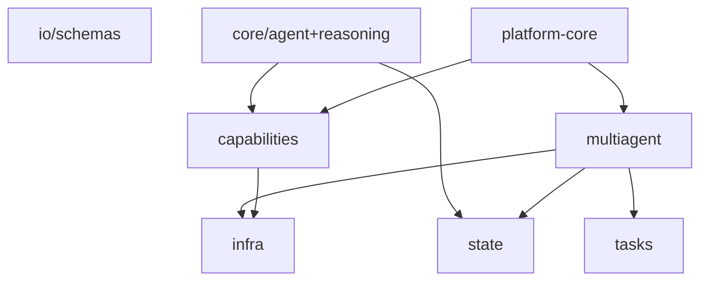

## §AP.1 — libs/platform-core module-by-module

> **Phạm vi:** Phụ lục chi tiết thư viện `libs/platform-core` — control plane cấu hình-driven cho hệ multi-agent. Tiempo §AH mô tả contracts domain; §AP tập trung vào *platform wiring*.

**Package root:** `libs/platform-core/src/platform_core/`
**Entry CLI:** `agent-platform` (`cli.py`)
**Phụ thuộc:** `commons`, `agent-core`, `mcp-core`, `pydantic`, `pyyaml`, optional `fastapi`/`httpx`.

### §AP.1.1 — Tổng quan kiến trúc platform-core
`platform-core` là lớp *điều phối* (control plane) đọc `platform.yaml` / `platform-supermarket.yaml` và nối registry agent, registry MCP, router A2A, graph orchestrator thành một facade `AgentPlatform`.
```
platform.yaml
  ├─ agents{}          → PlatformAgentRegistry (factory dotted-path)
  ├─ mcp_servers{}     → PlatformMCPRegistry (stdio | SSE | streamable-http)
  ├─ orchestration     → GraphOrchestrator → GraphEngine (agent-core)
  ├─ memory/cache/communication → build_platform_backends()
  └─ prompts.skills_dirname
AgentPlatform.from_config()
  ├─ agents: PlatformAgentRegistry
  ├─ mcp: PlatformMCPRegistry
  ├─ router: MessageRouter (in_process | http | https)
  └─ orchestrator: GraphOrchestrator
```
**Luồng runtime điển hình (supermarket):**
1. Mỗi agent service (`conversational-router`, `sql-planner`, …) gọi `load_platform_config()` khi khởi động.
2. `BaseAgentService.run()` mở session STM, recall LTM, load skill bundle, kết nối MCP (nếu khai báo).
3. `ChatOrchestrator` + `SupermarketAnalysisPipeline` gọi agent qua HTTP A2A (`AGENT_*_URL`), không qua `AgentPlatform` graph.
4. CLI `agent-platform --goal ...` dùng graph orchestration khi cần chạy toàn bộ DAG từ YAML.
### §AP.1.2 — Package `config/`

#### `libs/platform-core/src/platform_core/config/schema.py`

**Docstring:** Pydantic schema for ``platform.yaml`` - the single source of truth.

| Symbol | Mô tả ngắn |
|--------|------------|
| `class MCPServerAuthSpec` | — |
| `class MCPServerSpec` | One MCP server entry. |
| `class AgentSpec` | One agent entry. |
| `class GraphEdge` | — |
| `class ConditionalRouteSpec` | One branch in a conditional node. |
| `class GraphNodeSpecModel` | Extended node behaviour (parallel, conditional, join, debate). |
| `class StateChannelSpecModel` | — |
| `class OrchestrationStateConfig` | — |
| `def build_state_schema` | — |
| `class OrchestrationConfig` | How agents are composed. |
| `class MemoryConfig` | Shared memory/state backends (legacy flat fields + nested overrides). |
| `class PromptsConfig` | Where skill bundles / prompts live, relative to each agent package. |
| `class PlatformConfig` | Root config object. |

**Pydantic models chính:**
| Model | Vai trò |
|-------|---------|
| `MCPServerAuthSpec` | Auth MCP: `none`/`bearer`/`jwt`/`composite`, token env |
| `MCPServerSpec` | Một MCP server: transport, command/args hoặc url_env |
| `AgentSpec` | Một agent: factory, capabilities, endpoint_env, mcp_servers, skill, reasoning |
| `GraphEdge` | Cạnh DAG: `from`, `to`, `when` (điều kiện) |
| `GraphNodeSpecModel` | Node đặc biệt: parallel, conditional, join, debate |
| `OrchestrationConfig` | `type`, `entry`, `runtime`, `graph[]`, `nodes{}`, `state` |
| `MemoryConfig` | STM/LTM/checkpoint + nested `STMBackendConfig`/`LTMBackendConfig` |
| `PlatformConfig` | Root: agents, mcp_servers, orchestration, memory, cache, communication |
**Hàm quan trọng:**
- `build_state_schema()` — chuyển YAML reducer (`last_write`/`append`) → `StateSchema` agent-core.
- `OrchestrationConfig.to_execution_plan()` — YAML graph → `ExecutionPlan` trung lập framework.
- `OrchestrationConfig.order()` — thứ tự tuyến tính backward-compatible cho chain đơn giản.
- `PlatformConfig.agent_by_capability(cap)` — tìm agent theo capability string.
- `PlatformConfig.resolve_path(rel)` — resolve path tương đối theo `base_dir` của file config.
**Tích hợp agent-core:** import `GraphEdgeSpec`, `GraphNodeSpec`, `ConditionalRoute`, `ExecutionPlan`, `build_plan`, `StateChannel`, `AppendReducer`, `LastWriteWins` từ `agent_core.multiagent.orchestration.graph` và `agent_core.state.schema.base`.
#### `libs/platform-core/src/platform_core/config/loader.py`

**Docstring:** Load and normalise ``platform.yaml``.

| Symbol | Mô tả ngắn |
|--------|------------|
| `def load_platform_config` | Parse platform.yaml into a :class:`PlatformConfig`. |

**`load_platform_config(path)`:**
1. Resolve path: tham số → `PLATFORM_CONFIG` env → `./platform.yaml` CWD → walk parents.
2. `yaml.safe_load` → inject `name` vào mỗi entry `mcp_servers` và `agents`.
3. Construct `PlatformConfig(**raw)`; set `base_dir = cfg_path.parent`.
4. Raise `commons.errors.ConfigError` nếu file không tồn tại.
**Env liên quan:** `PLATFORM_CONFIG` (default `platform-supermarket.yaml` ở repo root trong deploy).
#### `libs/platform-core/src/platform_core/config/__init__.py`

**Docstring:** Platform configuration: schema + loader for platform.yaml.


### §AP.1.3 — Package `registry/`

#### `libs/platform-core/src/platform_core/registry/agent_registry.py`

**Docstring:** Item 26 concrete - the central agent registry / factory.

| Symbol | Mô tả ngắn |
|--------|------------|
| `class PlatformAgentRegistry` | Central registry + factory backed by the platform config. |

**`PlatformAgentRegistry`** kế thừa `AgentRegistry` + `AgentFactory` (agent-core).
Khởi tạo: duyệt `config.agents`, đăng ký `AgentCard(name, capabilities, endpoint, metadata)`.
Endpoint resolve: `spec.endpoint_env` → `os.getenv` → fallback `spec.endpoint`.
**`create(name)`** — lazy import factory:
```python
module_path, _, attr = spec.factory.partition(':')
factory = getattr(importlib.import_module(module_path), attr)
service = factory(self._config, spec)  # cached trong _services
```
Ví dụ factory supermarket: `conversational_router.service:build_service`.
#### `libs/platform-core/src/platform_core/registry/mcp_registry.py`

**Docstring:** Item 49 concrete - the central MCP server registry.

| Symbol | Mô tả ngắn |
|--------|------------|
| `class PlatformMCPRegistry` | Resolve MCP ``ServerEndpoint``s from the platform config. |

**`PlatformMCPRegistry.endpoints_for(server_names)`** trả `list[ServerEndpoint]` (mcp-core).
Logic transport:
- Có `url`/`url_env` → remote transport (`sse` hoặc `streamable-http`).
- Không có URL → stdio với `command` + `args`, env `MCP_TRANSPORT=stdio`.
- `tool_filters` và `prefix` được copy sang endpoint.
Supermarket: `sql-gateway` (SSE + `SQL_GATEWAY_URL`), `python-sandbox` (stdio `uv run python-sandbox`).
#### `libs/platform-core/src/platform_core/registry/__init__.py`

**Docstring:** Central registries built from platform.yaml.


### §AP.1.4 — Package `router/`

#### `libs/platform-core/src/platform_core/router/message_router.py`

**Docstring:** Item 24 concrete - the central A2A message router.

| Symbol | Mô tả ngắn |
|--------|------------|
| `class MessageRouter` | Resolve + deliver requests to agents. |

**Transport modes:**
| Mode | Hành vi |
|------|---------|
| `in_process` | `registry.create(name).run(request)` |
| `http`/`https` | POST `{endpoint}/run` với JSON `AgentRequest`, optional Bearer |
**Bảo mật HTTP:**
- Token: `A2AClientConfig.bearer_token` hoặc `AgentSpec.auth_token_env`.
- TLS: `require_https` trên config; `tls_verify` per agent; `ca_bundle`/`client_cert` trên A2A config.
- Timeout mặc định 300s.
#### `libs/platform-core/src/platform_core/router/a2a_client.py`

**Docstring:** HTTPS client configuration for A2A routing.

| Symbol | Mô tả ngắn |
|--------|------------|
| `class A2AClientConfig` | — |

**`A2AClientConfig`** dataclass: verify_ssl, ca_bundle, client_cert, bearer_token, timeout=300.
#### `libs/platform-core/src/platform_core/router/__init__.py`

**Docstring:** A2A message router.


### §AP.1.5 — Package `orchestration/`

#### `libs/platform-core/src/platform_core/orchestration/graph_orchestrator.py`

**Docstring:** Item 25 concrete - graph orchestration from config.

| Symbol | Mô tả ngắn |
|--------|------------|
| `class GraphOrchestrator` | Execute the agent graph defined in the platform config. |

**`GraphOrchestrator.run(goal, inputs, actor_id)`:**
1. `plan = config.orchestration.to_execution_plan()`.
2. Tạo `session_id = sess-{uuid8}`.
3. Executor closure: `AgentRequest` → `router.send_to_agent(node_id, request)`.
4. `GraphEngine(plan, executor, runtime, event_bus).run(...)`.
5. Trả dict: goal, order, execution_levels, node_outputs, final, workflow snapshot.
**Runtime:** `sync` → `SyncRuntime`; `thread_pool` → `ThreadPoolRuntime(max_workers)`.
**Event bus:** `build_event_bus(config.communication.event_bus)` — in-memory hoặc Redis.
#### `libs/platform-core/src/platform_core/orchestration/__init__.py`

**Docstring:** Graph orchestration driven by platform.yaml.


### §AP.1.6 — Package `runtime/`

#### `libs/platform-core/src/platform_core/runtime/platform.py`

**Docstring:** The ``AgentPlatform`` facade: load config and wire the control plane.

| Symbol | Mô tả ngắn |
|--------|------------|
| `class AgentPlatform` | Top-level control plane assembled from platform.yaml. |

**`AgentPlatform`** — facade top-level:
- `from_config(path, transport)` → load config + wire 4 thành phần.
- `run_goal(goal, inputs, actor_id)` → delegate `orchestrator.run`.
Đây là điểm vào cho CLI và integration test graph-level; pipeline supermarket thường bypass graph.
#### `libs/platform-core/src/platform_core/runtime/__init__.py`

**Docstring:** Platform runtime facade.


### §AP.1.7 — Package `service/`

#### `libs/platform-core/src/platform_core/service/base.py`

**Docstring:** BaseAgentService - the integration layer.

| Symbol | Mô tả ngắn |
|--------|------------|
| `class DecisionContext` | Everything ``decide`` needs for one turn. |
| `class BaseAgentService` | Common scaffolding shared by every agent service. |

**`BaseAgentService`** — scaffolding chung mọi agent service:
**Pipeline `run(AgentRequest)` (7 bước):**
1. STM append user message.
2. LTM retrieve (top 5) theo actor_id + query.
3. Retriever RAG (nếu cấu hình) top_k từ memory.retrieval.
4. `DefaultContextBuilder` → context window (skill + LTM + STM + inbox metadata).
5. MCP: `StrandsMCPServerRegistry` + `StrandsMCPAgentAdapter` → tools.
6. Subclass `decide(DecisionContext)` → `AgentResponse`.
7. Persist: STM assistant, LTM store, SQLite checkpoint.
**`DecisionContext`:** request, tools, mcp registry, context_text, system_prompt.
**`run_strands()`:** optional `ReasoningLoop` wrapper quanh Strands Agent.
**Backends:** `build_platform_backends(config)` — stm, ltm, retriever, cache.
#### `libs/platform-core/src/platform_core/service/http.py`

**Docstring:** Optional FastAPI inbound helper for A2A ``/run`` endpoints.

| Symbol | Mô tả ngắn |
|--------|------------|
| `def create_a2a_app` | Create a minimal FastAPI app exposing ``POST /run``. |

**`create_a2a_app(run_handler, token_env)`** — FastAPI minimal:
- Route `POST /run` → `AgentResponse`.
- Optional Bearer auth từ env `token_env`.
- Requires extra `platform-core[fastapi]`.
Mỗi agent deploy expose endpoint này; chat-gateway gọi qua HTTP.
#### `libs/platform-core/src/platform_core/service/__init__.py`

**Docstring:** BaseAgentService: the wiring layer that turns abstractions into a running agent.


### §AP.1.8 — Package `infra/`

#### `libs/platform-core/src/platform_core/infra/backends.py`

**Docstring:** Wire platform backends from :class:`PlatformConfig`.

| Symbol | Mô tả ngắn |
|--------|------------|
| `def build_platform_backends` | Instantiate memory, cache, communication backends from config. |

**`build_platform_backends(config)`** trả dict:
- `stm` — `build_stm(mem.resolved_stm(), base_dir)`.
- `ltm` — `build_ltm(mem.resolved_ltm(), base_dir)`.
- `retriever` — `build_retriever(mem.retrieval, base_dir)`.
- `cache` — `build_cache(config.cache)`.
- `event_bus`, `transport` — từ `config.communication`.

### §AP.1.9 — Packaging và phụ thuộc
**File:** `libs/platform-core/pyproject.toml`

- Package name: `platform-core`.
- Console script: `agent-platform = platform_core.cli:main`.
- Extras: `[fastapi]` cho `create_a2a_app`.
- Workspace member trong uv monorepo; import path `platform_core.*`.
### §AP.1.10 — Inventory đầy đủ file Python

| File | Docstring đầu | Class/Func chính |
|------|---------------|------------------|
| `libs/platform-core/src/platform_core/__init__.py` | platform-core: config-driven control plane for the multi-agent system. | — |
| `libs/platform-core/src/platform_core/cli.py` | CLI entry point: ``agent-platform``. | def main |
| `libs/platform-core/src/platform_core/config/__init__.py` | Platform configuration: schema + loader for platform.yaml. | — |
| `libs/platform-core/src/platform_core/config/loader.py` | Load and normalise ``platform.yaml``. | def load_platform_config |
| `libs/platform-core/src/platform_core/config/schema.py` | Pydantic schema for ``platform.yaml`` - the single source of truth. | class MCPServerAuthSpec, class MCPServerSpec, class AgentSpec, class GraphEdge, class ConditionalRouteSpec |
| `libs/platform-core/src/platform_core/infra/backends.py` | Wire platform backends from :class:`PlatformConfig`. | def build_platform_backends |
| `libs/platform-core/src/platform_core/orchestration/__init__.py` | Graph orchestration driven by platform.yaml. | — |
| `libs/platform-core/src/platform_core/orchestration/graph_orchestrator.py` | Item 25 concrete - graph orchestration from config. | class GraphOrchestrator |
| `libs/platform-core/src/platform_core/registry/__init__.py` | Central registries built from platform.yaml. | — |
| `libs/platform-core/src/platform_core/registry/agent_registry.py` | Item 26 concrete - the central agent registry / factory. | class PlatformAgentRegistry |
| `libs/platform-core/src/platform_core/registry/mcp_registry.py` | Item 49 concrete - the central MCP server registry. | class PlatformMCPRegistry |
| `libs/platform-core/src/platform_core/router/__init__.py` | A2A message router. | — |
| `libs/platform-core/src/platform_core/router/a2a_client.py` | HTTPS client configuration for A2A routing. | class A2AClientConfig |
| `libs/platform-core/src/platform_core/router/message_router.py` | Item 24 concrete - the central A2A message router. | class MessageRouter |
| `libs/platform-core/src/platform_core/runtime/__init__.py` | Platform runtime facade. | — |
| `libs/platform-core/src/platform_core/runtime/platform.py` | The ``AgentPlatform`` facade: load config and wire the control plane. | class AgentPlatform |
| `libs/platform-core/src/platform_core/service/__init__.py` | BaseAgentService: the wiring layer that turns abstractions into a running agent. | — |
| `libs/platform-core/src/platform_core/service/base.py` | BaseAgentService - the integration layer. | class DecisionContext, class BaseAgentService |
| `libs/platform-core/src/platform_core/service/http.py` | Optional FastAPI inbound helper for A2A ``/run`` endpoints. | def create_a2a_app |

### §AP.1.11 — Ghi chú vận hành và troubleshooting

**ConfigError: platform.yaml not found**
- Kiểm tra `PLATFORM_CONFIG`, CWD khi chạy agent, hoặc copy `platform-supermarket.yaml`.
- Log namespace: `platform_core.*` — set `LOG_LEVEL=DEBUG`.
- Test liên quan: `packages/project-test/integration/test_orchestrator_wiring.py`.

**Agent has no endpoint for HTTP routing**
- Set `AGENT_I_URL`…`AGENT_IV_URL` trong `.env`; hoặc dùng `--transport in_process`.
- Log namespace: `platform_core.*` — set `LOG_LEVEL=DEBUG`.
- Test liên quan: `packages/project-test/integration/test_orchestrator_wiring.py`.

**MCP server has neither url nor stdio command**
- Bổ sung `url_env` (remote) hoặc `command`+`args` (local stdio) trong YAML.
- Log namespace: `platform_core.*` — set `LOG_LEVEL=DEBUG`.
- Test liên quan: `packages/project-test/integration/test_orchestrator_wiring.py`.

**Unknown agent / Unknown MCP server**
- Tên trong code phải khớp key trong YAML `agents`/`mcp_servers`.
- Log namespace: `platform_core.*` — set `LOG_LEVEL=DEBUG`.
- Test liên quan: `packages/project-test/integration/test_orchestrator_wiring.py`.

**Factory import failure**
- Verify dotted-path `module:callable`; package agent phải có trong PYTHONPATH/uv workspace.
- Log namespace: `platform_core.*` — set `LOG_LEVEL=DEBUG`.
- Test liên quan: `packages/project-test/integration/test_orchestrator_wiring.py`.

**require_https violation**
- Prod: endpoint agent phải `https://`; dev có thể tắt flag.
- Log namespace: `platform_core.*` — set `LOG_LEVEL=DEBUG`.
- Test liên quan: `packages/project-test/integration/test_orchestrator_wiring.py`.

**STM/LTM connection**
- Redis/Mongo URI từ env; supermarket dùng `REDIS_URL`, `MONGODB_URI`.
- Log namespace: `platform_core.*` — set `LOG_LEVEL=DEBUG`.
- Test liên quan: `packages/project-test/integration/test_orchestrator_wiring.py`.

**Checkpoint DB locked**
- SQLite `./data/checkpoints.db` — tránh multi-writer; mount volume Docker.
- Log namespace: `platform_core.*` — set `LOG_LEVEL=DEBUG`.
- Test liên quan: `packages/project-test/integration/test_orchestrator_wiring.py`.

**Graph empty entry**
- orchestration cần `entry` hoặc `graph[]`; supermarket chỉ khai báo `entry: conversational-router`.
- Log namespace: `platform_core.*` — set `LOG_LEVEL=DEBUG`.
- Test liên quan: `packages/project-test/integration/test_orchestrator_wiring.py`.

**Skill bundle missing**
- Thư mục `skills/{skill}/SKILL.md` trong package agent tương ứng.
- Log namespace: `platform_core.*` — set `LOG_LEVEL=DEBUG`.
- Test liên quan: `packages/project-test/integration/test_orchestrator_wiring.py`.

### §AP.1.12 — Ma trận tương tác module

| From | To | Mối quan hệ |
|------|-----|-------------|
| `loader` | `schema` | Parse YAML → Pydantic PlatformConfig |
| `runtime.platform` | `loader` | AgentPlatform.from_config |
| `runtime.platform` | `registry.agent_registry` | self.agents |
| `runtime.platform` | `registry.mcp_registry` | self.mcp |
| `runtime.platform` | `router.message_router` | self.router |
| `runtime.platform` | `orchestration.graph_orchestrator` | self.orchestrator |
| `service.base` | `registry.mcp_registry` | endpoints_for(spec.mcp_servers) |
| `service.base` | `infra.backends` | build_platform_backends |
| `orchestration.graph_orchestrator` | `router.message_router` | send_to_agent per node |
| `orchestration.graph_orchestrator` | `agent_core GraphEngine` | DAG execution |
| `router.message_router` | `registry.agent_registry` | create / get / resolve_capability |
| `cli` | `runtime.platform` | run_goal |

### §AP.1.13 — Capability → agent mapping (supermarket)

- **`router`** → agent `conversational-router`: ingress, synthesize, clarification_bridge
  - Resolve: `PlatformAgentRegistry.resolve_capability('router')`.
  - Endpoint env: xem `platform-supermarket.yaml` → `endpoint_env`.

- **`sql_plan`** → agent `sql-planner`: SQL plan + clarify
  - Resolve: `PlatformAgentRegistry.resolve_capability('sql_plan')`.
  - Endpoint env: xem `platform-supermarket.yaml` → `endpoint_env`.

- **`clarify`** → agent `sql-planner`: Clarification rounds
  - Resolve: `PlatformAgentRegistry.resolve_capability('clarify')`.
  - Endpoint env: xem `platform-supermarket.yaml` → `endpoint_env`.

- **`risk_review`** → agent `risk-reviewer`: Policy/risk gate trước execute
  - Resolve: `PlatformAgentRegistry.resolve_capability('risk_review')`.
  - Endpoint env: xem `platform-supermarket.yaml` → `endpoint_env`.

- **`analytics`** → agent `data-analyst`: Phân tích parquet + sandbox
  - Resolve: `PlatformAgentRegistry.resolve_capability('analytics')`.
  - Endpoint env: xem `platform-supermarket.yaml` → `endpoint_env`.


## §AP.2 — libs/agent-core overview

> **Phạm vi:** Framework agent đa lớp (items 1–36 trong docstring nội bộ). `platform-core` và `project-core` build trên các abstraction này.

### §AP.2.1 — Cấu trúc package

| Package | Vai trò | File count (approx) |
|---------|---------|---------------------|
| `core/` | Vòng đời agent & suy luận nội bộ | 19 |
| `capabilities/` | Khả năng plug-in: model, memory, retrieval, tools, prompts | 32 |
| `state/` | State machine, session, workflow, checkpoint | 19 |
| `multiagent/` | Graph orchestration, event bus, registry, runtime | 24 |
| `infra/` | Backend config, cache, budget, guardrails, observability | 19 |
| `tasks/` | Phân rã task, aggregation | 7 |
| `io/` | AgentRequest/AgentResponse schemas | 2 |
| `skills/` | SkillBundle loader | 2 |

### §AP.2.2 — Package `agent_core.core`

#### `libs/agent-core/src/agent_core/core/agent/base.py` — `AbstractAgent`

- observe()
- plan()
- step()
- run() — vòng ReAct canonical

#### `libs/agent-core/src/agent_core/core/agent/strands_agent.py` — `StrandsAgent`

- Impl Strands-backed; wiring model + tools + context

#### `libs/agent-core/src/agent_core/core/persona/base.py` — `Persona`

- PersonaConfig → system prompt fragment

#### `libs/agent-core/src/agent_core/core/reasoning/base.py` — `ReasoningStrategy`

- Interface chiến lược suy luận intra-agent

#### `libs/agent-core/src/agent_core/core/reasoning/react.py` — `ReActStrategy`

- Reason-Act loop

#### `libs/agent-core/src/agent_core/core/reasoning/chain_of_thought.py` — `ChainOfThoughtStrategy`

- CoT prompting

#### `libs/agent-core/src/agent_core/core/reasoning/plan_execute.py` — `PlanAndExecuteStrategy`

- Plan rồi execute từng bước

#### `libs/agent-core/src/agent_core/core/reasoning/passthrough.py` — `PassthroughStrategy`

- Không wrap — gọi LLM trực tiếp

#### `libs/agent-core/src/agent_core/core/reasoning/loop.py` — `ReasoningLoop`

- Orchestrate strategy + invoke callback

#### `libs/agent-core/src/agent_core/core/reasoning/factory.py` — `build_reasoning`

- Map YAML string → strategy instance

#### `libs/agent-core/src/agent_core/core/termination/base.py` — `TerminationCondition`

- MaxIterations, StopToken, Composite

#### `libs/agent-core/src/agent_core/core/evaluation/base.py` — `AbstractEvaluator`

- ReflectionLoop, HeuristicEvaluator

### §AP.2.3 — Package `agent_core.capabilities`

#### `libs/agent-core/src/agent_core/capabilities/models/openai_compatible.py` — `OpenAICompatibleProvider`

- OpenRouter/OpenAI compatible API

#### `libs/agent-core/src/agent_core/capabilities/memory/factory.py` — `build_stm/build_ltm`

- Factory Redis/SQLite/Mongo/Strands/in_memory

#### `libs/agent-core/src/agent_core/capabilities/memory/redis_stm.py` — `RedisSTM`

- Session TTL, append history

#### `libs/agent-core/src/agent_core/capabilities/memory/mongodb_ltm.py` — `MongoDBLTM`

- Long-term recall per actor

#### `libs/agent-core/src/agent_core/capabilities/retrieval/factory.py` — `build_retriever`

- Chroma, in-memory vector

#### `libs/agent-core/src/agent_core/capabilities/context/default_builder.py` — `DefaultContextBuilder`

- Assemble context window per turn

#### `libs/agent-core/src/agent_core/capabilities/tools/base.py` — `AbstractTool`

- Framework-neutral tool contract

#### `libs/agent-core/src/agent_core/capabilities/tool_registry/simple.py` — `SimpleToolRegistry`

- Register + select tools

#### `libs/agent-core/src/agent_core/capabilities/output_parsers/json_parser.py` — `JsonOutputParser`

- Parse structured agent output

#### `libs/agent-core/src/agent_core/capabilities/prompts/file_repository.py` — `FilePromptRepository`

- Versioned prompt files

### §AP.2.4 — Package `agent_core.state`

#### `libs/agent-core/src/agent_core/state/agent_state/in_memory.py` — `InMemoryAgentState`

- Per-agent KV private state

#### `libs/agent-core/src/agent_core/state/session_state/strands_session.py` — `StrandsSessionStore`

- Conversation session adapter

#### `libs/agent-core/src/agent_core/state/shared_state/in_memory.py` — `InMemoryBlackboard`

- Multi-agent blackboard

#### `libs/agent-core/src/agent_core/state/workflow_state/base.py` — `WorkflowState`

- Orchestration run progress + status enum

#### `libs/agent-core/src/agent_core/state/schema/base.py` — `StateSchema`

- LangGraph-style reducers LastWriteWins/Append

#### `libs/agent-core/src/agent_core/state/persistence/sqlite_checkpoint.py` — `SQLiteCheckpointStore`

- Resume checkpoints

#### `libs/agent-core/src/agent_core/state/transition/base.py` — `StateMachine`

- FSM transitions

### §AP.2.5 — Package `agent_core.multiagent`

#### `libs/agent-core/src/agent_core/multiagent/orchestration/graph/engine.py` — `GraphEngine`

- Execute DAG: parallel, conditional, join

#### `libs/agent-core/src/agent_core/multiagent/orchestration/graph/model.py` — `ExecutionPlan`

- Neutral graph plan model

#### `libs/agent-core/src/agent_core/multiagent/orchestration/graph/builder.py` — `build_plan`

- Construct plan from edges/nodes

#### `libs/agent-core/src/agent_core/multiagent/orchestration/graph/conditions.py` — `ConditionEvaluator`

- Evaluate `when` expressions

#### `libs/agent-core/src/agent_core/multiagent/runtime/base.py` — `SyncRuntime`

- Sequential sync execution

#### `libs/agent-core/src/agent_core/multiagent/runtime/thread_pool.py` — `ThreadPoolRuntime`

- Parallel node execution

#### `libs/agent-core/src/agent_core/multiagent/communication/redis_transport.py` — `RedisTransport`

- A2A message queue via Redis

#### `libs/agent-core/src/agent_core/multiagent/event_bus/redis_bus.py` — `RedisEventBus`

- Pub/sub coordination

#### `libs/agent-core/src/agent_core/multiagent/registry/base.py` — `AgentRegistry`

- AgentCard discovery by capability

#### `libs/agent-core/src/agent_core/multiagent/human_in_loop/base.py` — `HumanInLoop`

- Approval gates AutoApprove

### §AP.2.6 — Package `agent_core.infra`

#### `libs/agent-core/src/agent_core/infra/backends/config.py` — `STMBackendConfig`

- Nested backend configuration models

#### `libs/agent-core/src/agent_core/infra/backends/resolve.py` — `resolve_url`

- Env var URL resolution

#### `libs/agent-core/src/agent_core/infra/caching/factory.py` — `build_cache`

- In-memory / Redis cache

#### `libs/agent-core/src/agent_core/infra/budget/base.py` — `BudgetGuard`

- Token/cost/concurrency caps

#### `libs/agent-core/src/agent_core/infra/guardrails/base.py` — `Guardrail`

- Input/output validation, PermissionPolicy

#### `libs/agent-core/src/agent_core/infra/observability/base.py` — `Tracer`

- Span, CostAccountant, UsageRecord

#### `libs/agent-core/src/agent_core/infra/hooks/base.py` — `HookRegistry`

- Lifecycle hooks register/emit

#### `libs/agent-core/src/agent_core/infra/errors/base.py` — `AgentError`

- Structured agent errors

#### `libs/agent-core/src/agent_core/infra/di/base.py` — `ServiceLocator`

- Lightweight DI container

### §AP.2.7 — Package `agent_core.tasks`

#### `libs/agent-core/src/agent_core/tasks/decomposition/base.py` — `TaskDecomposer`

- Split complex goals

#### `libs/agent-core/src/agent_core/tasks/aggregation/base.py` — `ResultAggregator`

- Merge parallel agent outputs

### §AP.2.8 — Package `agent_core.io`

#### `libs/agent-core/src/agent_core/io/schemas.py` — `AgentRequest`

- message, session_id, actor_id, metadata.inbox

#### `libs/agent-core/src/agent_core/io/schemas.py` — `AgentResponse`

- content, payload, tool_calls, state_updates

### §AP.2.9 — Package `agent_core.skills`

#### `libs/agent-core/src/agent_core/skills/bundle.py` — `SkillBundle`

- Load SKILL.md + TOOLS.md + prompts from skills/

### §AP.2.10 — Sơ đồ phụ thuộc giữa packages



### §AP.2.11 — Chiến lược reasoning (YAML → factory)

| YAML `reasoning` | Class | Hành vi |
|------------------|-------|---------|
| `null / omitted` | `PassthroughStrategy` | Gọi LLM một lần, không wrap |
| `react` | `ReActStrategy` | Reason + Act + Observe loop |
| `cot` | `ChainOfThoughtStrategy` | Chain-of-thought prompting |
| `plan_execute` | `PlanAndExecuteStrategy` | Lập kế hoạch rồi thực thi |

### §AP.2.12 — Memory & retrieval backends

| Layer | Backend key | Ghi chú |
|-------|-------------|---------|
| stm | `in_memory` | Dict in-process — test/dev |
| stm | `redis` | REDIS_URL — production supermarket |
| stm | `strands` | Strands session manager integration |
| ltm | `sqlite` | File ./data/ltm.db |
| ltm | `mongodb` | MONGODB_URI — production supermarket |
| ltm | `redis` | Redis-backed LTM |
| retrieval | `in_memory` | Vector in RAM |
| retrieval | `chroma` | ChromaDB persistent |

### §AP.2.13 — GraphEngine — node kinds

- **`agent`**: Gọi executor với node_id = agent name
- **`parallel`**: Chạy nhiều agent song song, merge concat/list
- **`conditional`**: Evaluate routes[].when → branch
- **`join`**: Đợi parallel branches, merge state
- **`debate`**: Round-robin participants + facilitator

### §AP.2.14 — Hợp đồng A2A (io/schemas.py)

**AgentRequest fields:**
- `message: str` — user goal / prompt turn.
- `session_id: str | None` — conversation id; auto-generate nếu null.
- `actor_id: str` — user identity cho LTM/ACL.
- `metadata: dict` — `inbox` (pipeline feedback), `shared_state`, `permissions`, custom.
**AgentResponse fields:**
- `content: str | None` — natural language cho user.
- `payload: dict` — structured JSON (SQL plan, risk verdict, analysis result).
- `tool_calls: list` — audit tool invocations.
- `state_updates: dict` — mutate shared blackboard.
- `session_id`, `actor_id`, `memory_refs` — persistence hints.

## §AP.3 — libs/mcp-core + commons

> **Phạm vi:** MCP protocol layer (items 37–50) và shared utilities `libs/commons`. MCP = JSON-RPC cho tools/resources/prompts qua stdio hoặc HTTP/SSE.

### §AP.3.1 — libs/commons

| File | Exports | Mô tả |
|------|---------|-------|
| `libs/commons/src/commons/errors.py` | CommonsError, ConfigError | Hierarchy exception; ConfigError code=config_error |
| `libs/commons/src/commons/logging.py` | get_logger | LOG_LEVEL env; format structured stderr |
| `libs/commons/src/commons/settings.py` | BaseAppSettings | pydantic-settings + .env loading |
| `libs/commons/src/commons/types.py` | Result, JSONValue | Generic Result ok/err; JSON type alias |
| `libs/commons/src/commons/__init__.py` | — | Package marker |

**Sử dụng trong monorepo:**
- Mọi service/agent gọi `commons.logging.get_logger(__name__)`.
- Config loader raise `commons.errors.ConfigError` — catch thống nhất.
- Agent settings subclass `BaseAppSettings` cho env-driven config.
- `Result[T,E]` dùng khi hot path tránh exception (optional).
### §AP.3.2 — mcp-core server layer

| Module | Class | Vai trò |
|--------|-------|---------|
| `mcp_core/server/lifecycle/fastmcp_server.py` | `FastMCPServer` | FastMCP lifecycle wrapper |
| `mcp_core/server/lifecycle/base.py` | `ServerLifecycle` | Start/stop hooks |
| `mcp_core/server/transport/base.py` | `Transport` | stdio / streamable-http / SSE abstraction |
| `mcp_core/server/session/base.py` | `SessionManager` | MCP session state |
| `mcp_core/server/auth/base.py` | `AuthProvider` | Bearer/JWT/composite |
| `mcp_core/server/auth/middleware.py` | `auth_middleware` | Request auth gate |
| `mcp_core/server/auth/factory.py` | `build_auth` | Auth from spec |
| `mcp_core/server/providers/tools/base.py` | `ToolProvider` | Register + invoke tools |
| `mcp_core/server/providers/resources/base.py` | `ResourceProvider` | MCP resources → retrieval |
| `mcp_core/server/providers/prompts/base.py` | `PromptProvider` | MCP prompts → templates |
| `mcp_core/server/capabilities/base.py` | `CapabilityNegotiation` | Protocol handshake |
| `mcp_core/server/callbacks/base.py` | `CallbackHandler` | Progress/logging callbacks |
| `mcp_core/server/notifications/base.py` | `NotificationService` | Server push notifications |
| `mcp_core/server/errors/base.py` | `MCPError` | Structured MCP errors |

### §AP.3.3 — mcp-core client layer

| Module | Class | Vai trò |
|--------|-------|---------|
| `mcp_core/client/connector/base.py` | `MCPConnector, ServerEndpoint` | Connect + discover remote tools |
| `mcp_core/client/connector/strands_connector.py` | `StrandsMCPConnector` | Strands-specific transport |
| `mcp_core/client/registry/base.py` | `MCPServerRegistry` | Multi-server registry + prefixes |
| `mcp_core/client/registry/strands_registry.py` | `StrandsMCPServerRegistry` | Used by BaseAgentService |
| `mcp_core/client/registry/tool_filter.py` | `ToolFilter` | Allow/deny tool names |
| `mcp_core/client/adapter/base.py` | `MCPAgentAdapter` | MCP tool → agent tool handle |
| `mcp_core/client/adapter/strands_adapter.py` | `StrandsMCPAgentAdapter` | → Strands Agent tools |

### §AP.3.4 — Luồng MCP JSON-RPC

```
Agent (Strands)                    MCP Server (sql-gateway)
     |                                      |
     |--- initialize ----------------------->|
     |<-- capabilities ----------------------|
     |--- tools/list ----------------------->|
     |<-- [{name, inputSchema}] -------------|
     |--- tools/call {name, arguments} ----->|
     |<-- {content:[{type:text}], isError} --|
```
**Mapping sang agent-core (README mcp-core):**
- MCP tool → `capabilities.tools.AbstractTool`
- MCP resource → `capabilities.retrieval` / memory
- MCP prompt → `capabilities.prompts.PromptTemplate`
### §AP.3.5 — Wiring supermarket

| Server | Transport | Prefix | Thực thi bởi |
|--------|-----------|--------|--------------|
| sql-gateway | SSE (`SQL_GATEWAY_URL`) | `sql` | Pipeline `HttpSqlGatewayClient`, không agent ReAct |
| python-sandbox | stdio (`uv run python-sandbox`) | `sandbox` | Pipeline process, không agent ReAct |
Comment trong `platform-supermarket.yaml`: tool ownership thuộc pipeline/gateway — agents trả JSON; chat-gateway + SupermarketAnalysisPipeline gọi MCP.
### §AP.3.6 — Adapter chain (tool → LLM)

1. `PlatformMCPRegistry.endpoints_for(['sql-gateway'])` → `ServerEndpoint`.
2. `StrandsMCPServerRegistry.add(endpoint)` + context manager connect.
3. `registry.adapted_tools(StrandsMCPAgentAdapter)` → list Strands-compatible tools.
4. `StrandsAgent(model, tools=...)` — LLM nhận tool specs trong API call.
5. LLM emit tool_call → adapter → MCP `tools/call` → result text → next turn.
**ToolFilter:** `MCPServerSpec.tool_filters` giới hạn expose subset tools per server.
### §AP.3.7 — Inventory file mcp-core

| File | Docstring |
|------|-----------|
| `libs/mcp-core/src/mcp_core/__init__.py` | mcp-core: abstract building blocks for MCP servers and clients (items 37-50). |
| `libs/mcp-core/src/mcp_core/client/__init__.py` | G (client side): connector, multi-server registry, MCP<->Agent adapter |
| `libs/mcp-core/src/mcp_core/client/adapter/__init__.py` | Item 50 - MCP <-> Agent adapter (bridge). |
| `libs/mcp-core/src/mcp_core/client/adapter/base.py` | Item 50 - MCP <-> Agent adapter (bridge). |
| `libs/mcp-core/src/mcp_core/client/adapter/strands_adapter.py` | Strands implementation of the MCP <-> Agent adapter. |
| `libs/mcp-core/src/mcp_core/client/connector/__init__.py` | Item 48 - MCP Client / Connector. |
| `libs/mcp-core/src/mcp_core/client/connector/base.py` | Item 48 - MCP Client / Connector. |
| `libs/mcp-core/src/mcp_core/client/connector/strands_connector.py` | Strands-backed reference implementation of :class:`MCPConnector`. |
| `libs/mcp-core/src/mcp_core/client/registry/__init__.py` | Item 49 - MCP server registry / Multi-server manager. |
| `libs/mcp-core/src/mcp_core/client/registry/base.py` | Item 49 - MCP server registry / Multi-server manager. |
| `libs/mcp-core/src/mcp_core/client/registry/strands_registry.py` | Strands-backed multi-server registry: builds StrandsMCPConnector per endpoint. |
| `libs/mcp-core/src/mcp_core/client/registry/tool_filter.py` | Tool name filtering for MCP server endpoints. |
| `libs/mcp-core/src/mcp_core/server/__init__.py` | G (server side): MCP server lifecycle, transport, capabilities, providers, |
| `libs/mcp-core/src/mcp_core/server/auth/__init__.py` | Item 45 - Auth / Authorization. |
| `libs/mcp-core/src/mcp_core/server/auth/base.py` | MCP server authentication and authorization. |
| `libs/mcp-core/src/mcp_core/server/auth/factory.py` | Build MCP authorizers from config. |
| `libs/mcp-core/src/mcp_core/server/auth/middleware.py` | Auth middleware wrapping MCP tool handlers. |
| `libs/mcp-core/src/mcp_core/server/callbacks/__init__.py` | Item 43 - Client-callback handler (server calls back to client). |
| `libs/mcp-core/src/mcp_core/server/callbacks/base.py` | Item 43 - Client-callback handler (server -> client). |
| `libs/mcp-core/src/mcp_core/server/capabilities/__init__.py` | Item 39 - Capability negotiation. |
| `libs/mcp-core/src/mcp_core/server/capabilities/base.py` | Item 39 - Capability negotiation. |
| `libs/mcp-core/src/mcp_core/server/errors/__init__.py` | Item 47 - Error handling (domain -> JSON-RPC). |
| `libs/mcp-core/src/mcp_core/server/errors/base.py` | Item 47 - Error handling. |
| `libs/mcp-core/src/mcp_core/server/lifecycle/__init__.py` | Item 37 - MCP Server (base / lifecycle). |
| `libs/mcp-core/src/mcp_core/server/lifecycle/base.py` | Item 37 - MCP Server (base / lifecycle). |
| `libs/mcp-core/src/mcp_core/server/lifecycle/fastmcp_server.py` | FastMCP-backed reference implementation of :class:`AbstractMCPServer`. |
| `libs/mcp-core/src/mcp_core/server/notifications/__init__.py` | Item 46 - Notifications / Progress / Cancellation. |
| `libs/mcp-core/src/mcp_core/server/notifications/base.py` | Item 46 - Notifications / Progress / Cancellation. |
| `libs/mcp-core/src/mcp_core/server/providers/__init__.py` | MCP primitives exposed by a server: tools (40), resources (41), prompts (42). |
| `libs/mcp-core/src/mcp_core/server/providers/prompts/__init__.py` | Item 42 - Prompt provider (primitive: template). |
| `libs/mcp-core/src/mcp_core/server/providers/prompts/base.py` | Item 42 - Prompt provider (primitive: template). |
| `libs/mcp-core/src/mcp_core/server/providers/resources/__init__.py` | Item 41 - Resource provider (primitive: read-only data). |
| `libs/mcp-core/src/mcp_core/server/providers/resources/base.py` | Item 41 - Resource provider (primitive: read-only data). |
| `libs/mcp-core/src/mcp_core/server/providers/tools/__init__.py` | Item 40 - Tool provider (primitive: action, has side-effects). |
| `libs/mcp-core/src/mcp_core/server/providers/tools/base.py` | Item 40 - Tool provider (primitive: action). |
| `libs/mcp-core/src/mcp_core/server/session/__init__.py` | Item 44 - Session / Connection. |
| `libs/mcp-core/src/mcp_core/server/session/base.py` | Item 44 - Session / Connection. |
| `libs/mcp-core/src/mcp_core/server/transport/__init__.py` | Item 38 - Transport (stdio / streamable-http). |
| `libs/mcp-core/src/mcp_core/server/transport/base.py` | Item 38 - Transport. |


## §I.1-DETAIL — Mọi khóa trong config/project.yaml

> **Phạm vi:** Giải thích chi tiết từng khóa top-level và nested trong `config/project.yaml`. Stub §I.1 giữ tổng quan; section này là reference đầy đủ.

### §I.1-DETAIL.1 — Khóa scalar và nested

#### `app_name`

- **Nhóm:** `root`
- **Giá trị mặc định (repo):** `supermarket-analysis-agent`
- **Ý nghĩa:** Tên logical app; logging, metrics label.
- **Loader:** `project_core.config.loader.load_project_config()` merge vào `ProjectConfig`.
- **Override:** env không override trực tiếp — sửa YAML hoặc mount config map K8s.

#### `pipeline.max_sql_queries_per_plan`

- **Nhóm:** `pipeline`
- **Giá trị mặc định (repo):** `6`
- **Ý nghĩa:** Giới hạn số query SQL trong một plan Agent II; tránh runaway.
- **Loader:** `project_core.config.loader.load_project_config()` merge vào `ProjectConfig`.
- **Override:** env không override trực tiếp — sửa YAML hoặc mount config map K8s.

#### `pipeline.max_sql_retries`

- **Nhóm:** `pipeline`
- **Giá trị mặc định (repo):** `3`
- **Ý nghĩa:** Vòng lặp ngoài khi plan/execute fail; mỗi vòng có thể nhận policy/risk feedback.
- **Loader:** `project_core.config.loader.load_project_config()` merge vào `ProjectConfig`.
- **Override:** env không override trực tiếp — sửa YAML hoặc mount config map K8s.

#### `pipeline.max_risk_retries`

- **Nhóm:** `pipeline`
- **Giá trị mặc định (repo):** `2`
- **Ý nghĩa:** Số lần Agent III reject trước khi pipeline abort hoặc clarify.
- **Loader:** `project_core.config.loader.load_project_config()` merge vào `ProjectConfig`.
- **Override:** env không override trực tiếp — sửa YAML hoặc mount config map K8s.

#### `pipeline.max_clarify_rounds`

- **Nhóm:** `pipeline`
- **Giá trị mặc định (repo):** `3`
- **Ý nghĩa:** Tối đa vòng hỏi user qua clarification bridge.
- **Loader:** `project_core.config.loader.load_project_config()` merge vào `ProjectConfig`.
- **Override:** env không override trực tiếp — sửa YAML hoặc mount config map K8s.

#### `pipeline.max_sync_seconds`

- **Nhóm:** `pipeline`
- **Giá trị mặc định (repo):** `120`
- **Ý nghĩa:** Deadline đồng bộ pipeline; timeout → partial/error outcome.
- **Loader:** `project_core.config.loader.load_project_config()` merge vào `ProjectConfig`.
- **Override:** env không override trực tiếp — sửa YAML hoặc mount config map K8s.

#### `pipeline.iv_max_steps`

- **Nhóm:** `pipeline`
- **Giá trị mặc định (repo):** `8`
- **Ý nghĩa:** Max bước reasoning Agent IV (analyst).
- **Loader:** `project_core.config.loader.load_project_config()` merge vào `ProjectConfig`.
- **Override:** env không override trực tiếp — sửa YAML hoặc mount config map K8s.

#### `pipeline.poll_enabled`

- **Nhóm:** `pipeline`
- **Giá trị mặc định (repo):** `true`
- **Ý nghĩa:** Cho phép UI poll workflow progress qua STM.
- **Loader:** `project_core.config.loader.load_project_config()` merge vào `ProjectConfig`.
- **Override:** env không override trực tiếp — sửa YAML hoặc mount config map K8s.

#### `pipeline.workflow_stale_ttl_seconds`

- **Nhóm:** `pipeline`
- **Giá trị mặc định (repo):** `900`
- **Ý nghĩa:** Workflow cũ hơn 15 phút coi là stale; cleanup/recreate.
- **Loader:** `project_core.config.loader.load_project_config()` merge vào `ProjectConfig`.
- **Override:** env không override trực tiếp — sửa YAML hoặc mount config map K8s.

#### `pipeline.workflow_steps_max`

- **Nhóm:** `pipeline`
- **Giá trị mặc định (repo):** `200`
- **Ý nghĩa:** Cap số WorkflowStep ghi vào trace — tránh bloat.
- **Loader:** `project_core.config.loader.load_project_config()` merge vào `ProjectConfig`.
- **Override:** env không override trực tiếp — sửa YAML hoặc mount config map K8s.

#### `pipeline.workflow_steps_scope`

- **Nhóm:** `pipeline`
- **Giá trị mặc định (repo):** `analysis`
- **Ý nghĩa:** Scope filter khi persist steps (analysis vs chat-only).
- **Loader:** `project_core.config.loader.load_project_config()` merge vào `ProjectConfig`.
- **Override:** env không override trực tiếp — sửa YAML hoặc mount config map K8s.

#### `clarification.hard_enforce`

- **Nhóm:** `clarification`
- **Giá trị mặc định (repo):** `true`
- **Ý nghĩa:** Bắt buộc clarify khi confidence thấp; không bypass silently.
- **Loader:** `project_core.config.loader.load_project_config()` merge vào `ProjectConfig`.
- **Override:** env không override trực tiếp — sửa YAML hoặc mount config map K8s.

#### `clarification.bridge_min_confidence`

- **Nhóm:** `clarification`
- **Giá trị mặc định (repo):** `0.75`
- **Ý nghĩa:** Ngưỡng Agent I bridge chấp nhận brief không cần clarify.
- **Loader:** `project_core.config.loader.load_project_config()` merge vào `ProjectConfig`.
- **Override:** env không override trực tiếp — sửa YAML hoặc mount config map K8s.

#### `rag.clarify_min_score`

- **Nhóm:** `rag`
- **Giá trị mặc định (repo):** `0.72`
- **Ý nghĩa:** RAG retrieval score tối thiểu để auto-answer clarify.
- **Loader:** `project_core.config.loader.load_project_config()` merge vào `ProjectConfig`.
- **Override:** env không override trực tiếp — sửa YAML hoặc mount config map K8s.

#### `rag.top_k`

- **Nhóm:** `rag`
- **Giá trị mặc định (repo):** `5`
- **Ý nghĩa:** Số chunk retrieval inject vào context.
- **Loader:** `project_core.config.loader.load_project_config()` merge vào `ProjectConfig`.
- **Override:** env không override trực tiếp — sửa YAML hoặc mount config map K8s.

#### `budget.agent_caps.I`

- **Nhóm:** `budget`
- **Giá trị mặc định (repo):** `5`
- **Ý nghĩa:** Token/step budget cap Agent I (router).
- **Loader:** `project_core.config.loader.load_project_config()` merge vào `ProjectConfig`.
- **Override:** env không override trực tiếp — sửa YAML hoặc mount config map K8s.

#### `budget.agent_caps.II`

- **Nhóm:** `budget`
- **Giá trị mặc định (repo):** `6`
- **Ý nghĩa:** Cap Agent II (SQL planner).
- **Loader:** `project_core.config.loader.load_project_config()` merge vào `ProjectConfig`.
- **Override:** env không override trực tiếp — sửa YAML hoặc mount config map K8s.

#### `budget.agent_caps.III`

- **Nhóm:** `budget`
- **Giá trị mặc định (repo):** `18`
- **Ý nghĩa:** Cap Agent III (risk — nhiều bước hơn).
- **Loader:** `project_core.config.loader.load_project_config()` merge vào `ProjectConfig`.
- **Override:** env không override trực tiếp — sửa YAML hoặc mount config map K8s.

#### `budget.agent_caps.IV`

- **Nhóm:** `budget`
- **Giá trị mặc định (repo):** `4`
- **Ý nghĩa:** Cap Agent IV (analyst).
- **Loader:** `project_core.config.loader.load_project_config()` merge vào `ProjectConfig`.
- **Override:** env không override trực tiếp — sửa YAML hoặc mount config map K8s.

#### `budget.max_tokens_per_trace`

- **Nhóm:** `budget`
- **Giá trị mặc định (repo):** `200000`
- **Ý nghĩa:** Hard ceiling toàn trace pipeline.
- **Loader:** `project_core.config.loader.load_project_config()` merge vào `ProjectConfig`.
- **Override:** env không override trực tiếp — sửa YAML hoặc mount config map K8s.

#### `policy.max_rows`

- **Nhóm:** `policy`
- **Giá trị mặc định (repo):** `50000`
- **Ý nghĩa:** PolicyEngine reject SELECT trả quá N rows.
- **Loader:** `project_core.config.loader.load_project_config()` merge vào `ProjectConfig`.
- **Override:** env không override trực tiếp — sửa YAML hoặc mount config map K8s.

#### `policy.max_join_depth`

- **Nhóm:** `policy`
- **Giá trị mặc định (repo):** `5`
- **Ý nghĩa:** Giới hạn độ sâu JOIN — anti-complexity.
- **Loader:** `project_core.config.loader.load_project_config()` merge vào `ProjectConfig`.
- **Override:** env không override trực tiếp — sửa YAML hoặc mount config map K8s.

#### `policy.default_schema`

- **Nhóm:** `policy`
- **Giá trị mặc định (repo):** `dbo`
- **Ý nghĩa:** Schema SQL mặc định khi không qualify.
- **Loader:** `project_core.config.loader.load_project_config()` merge vào `ProjectConfig`.
- **Override:** env không override trực tiếp — sửa YAML hoặc mount config map K8s.

#### `artifacts.base_dir`

- **Nhóm:** `artifacts`
- **Giá trị mặc định (repo):** `data/artifacts`
- **Ý nghĩa:** Thư mục parquet, explain plans, temp files.
- **Loader:** `project_core.config.loader.load_project_config()` merge vào `ProjectConfig`.
- **Override:** env không override trực tiếp — sửa YAML hoặc mount config map K8s.

#### `artifacts.ttl_days`

- **Nhóm:** `artifacts`
- **Giá trị mặc định (repo):** `7`
- **Ý nghĩa:** Retention cleanup (`scripts/cleanup_artifacts.py`).
- **Loader:** `project_core.config.loader.load_project_config()` merge vào `ProjectConfig`.
- **Override:** env không override trực tiếp — sửa YAML hoặc mount config map K8s.

#### `artifacts.max_bytes_per_trace`

- **Nhóm:** `artifacts`
- **Giá trị mặc định (repo):** `52428800`
- **Ý nghĩa:** 50 MiB cap artifact size per trace.
- **Loader:** `project_core.config.loader.load_project_config()` merge vào `ProjectConfig`.
- **Override:** env không override trực tiếp — sửa YAML hoặc mount config map K8s.

#### `stm.session_ttl_days`

- **Nhóm:** `stm`
- **Giá trị mặc định (repo):** `30`
- **Ý nghĩa:** Redis/Mongo session expiry cho workflow state.
- **Loader:** `project_core.config.loader.load_project_config()` merge vào `ProjectConfig`.
- **Override:** env không override trực tiếp — sửa YAML hoặc mount config map K8s.

#### `data_sources.db1.env_dsn`

- **Nhóm:** `data_sources`
- **Giá trị mặc định (repo):** `ANALYTICS_DB_DSN`
- **Ý nghĩa:** DSN SQL Server shard HQ (db1).
- **Loader:** `project_core.config.loader.load_project_config()` merge vào `ProjectConfig`.
- **Override:** env không override trực tiếp — sửa YAML hoặc mount config map K8s.

#### `data_sources.db2.env_dsn`

- **Nhóm:** `data_sources`
- **Giá trị mặc định (repo):** `ANALYTICS_DB_DSN_2`
- **Ý nghĩa:** DSN DB phụ (db2) nếu có.
- **Loader:** `project_core.config.loader.load_project_config()` merge vào `ProjectConfig`.
- **Override:** env không override trực tiếp — sửa YAML hoặc mount config map K8s.

### §I.1-DETAIL.2 — YAML anchors `_HQ_TABLES` / `_STORE_TABLES`

File dùng YAML anchor/alias để DRY danh sách bảng:
- `&hq_tables` — ~40 bảng HQ (STRANS, PMTRANS, TRANSHDR, CRDTRANS, CUSTOMER, SKU_DEF, WebRpt_*, …).
- `&store_tables` — subset ~15 bảng store-level (bỏ ARC/TMP/admin tables).
- `roles.*.allowed_tables: *hq_tables` hoặc `*store_tables` — alias reference.
**Lưu ý shard:** Comment line 50: SQL runtime có thể dùng `STRANS_YYYYMM`, `PMTRANS_YYYYMM` — logical name trong dictionary khác physical shard table.
**Đồng bộ AUTH DB:** Comment line 111–112: dev/test grants phải mirror `deploy/sql/auth/004_permissions.sql` khi `ALLOW_DEV_AUTH=1`.
### §I.1-DETAIL.3 — Block `roles`

#### Role `store_manager`

- **`allowed_tables`:** Whitelist bảng SQL — PolicyEngine + SqlGateway enforce.
- **`denied_columns`:** Blacklist cột nhạy cảm (SPPRICE, cogs, PASSCODE, …).
- **`store_filter_required`:** true → bắt buộc `store_id IN (...)` predicate.
- **`tool_grants`:** Pattern MCP/tool ACL, ví dụ `tool:*`.
- **`allowed_functions`:** SQL function whitelist pattern `function:*`.
- **denied_columns:** SPPRICE, LASTSPPR, cogs, gross_profit, free_cogs, value_onhand, PASSCODE, PERSON_ID.
- **store_filter_required:** `true` — row-level security theo store_ids từ AUTH.

#### Role `hq_analyst`

- **`allowed_tables`:** Whitelist bảng SQL — PolicyEngine + SqlGateway enforce.
- **`denied_columns`:** Blacklist cột nhạy cảm (SPPRICE, cogs, PASSCODE, …).
- **`store_filter_required`:** true → bắt buộc `store_id IN (...)` predicate.
- **`tool_grants`:** Pattern MCP/tool ACL, ví dụ `tool:*`.
- **`allowed_functions`:** SQL function whitelist pattern `function:*`.
- **denied_columns:** `[]` — full column access trong allowed_tables.
- **store_filter_required:** `false` — HQ xem cross-store.

### §I.1-DETAIL.4 — Danh sách bảng HQ (`_HQ_TABLES`)

- `STRANS` — bảng #1 trong grant HQ; kiểm tra data_dictionary tương ứng.
- `PMTRANS` — bảng #2 trong grant HQ; kiểm tra data_dictionary tương ứng.
- `TRANSHDR` — bảng #3 trong grant HQ; kiểm tra data_dictionary tương ứng.
- `TRANSHDR_ARC` — bảng #4 trong grant HQ; kiểm tra data_dictionary tương ứng.
- `CRDTRANS` — bảng #5 trong grant HQ; kiểm tra data_dictionary tương ứng.
- `CRDTRANS_ARC` — bảng #6 trong grant HQ; kiểm tra data_dictionary tương ứng.
- `CRDTRANS_TMP` — bảng #7 trong grant HQ; kiểm tra data_dictionary tương ứng.
- `STRANS_TMP` — bảng #8 trong grant HQ; kiểm tra data_dictionary tương ứng.
- `SUSPEND` — bảng #9 trong grant HQ; kiểm tra data_dictionary tương ứng.
- `CASH_ST` — bảng #10 trong grant HQ; kiểm tra data_dictionary tương ứng.
- `CTRANS` — bảng #11 trong grant HQ; kiểm tra data_dictionary tương ứng.
- `CUSTOMER` — bảng #12 trong grant HQ; kiểm tra data_dictionary tương ứng.
- `CSCARD` — bảng #13 trong grant HQ; kiểm tra data_dictionary tương ứng.
- `CRD_INFO` — bảng #14 trong grant HQ; kiểm tra data_dictionary tương ứng.
- `CUSTHIST` — bảng #15 trong grant HQ; kiểm tra data_dictionary tương ứng.
- `CustSumm` — bảng #16 trong grant HQ; kiểm tra data_dictionary tương ứng.
- `SKU_DEF` — bảng #17 trong grant HQ; kiểm tra data_dictionary tương ứng.
- `PLU` — bảng #18 trong grant HQ; kiểm tra data_dictionary tương ứng.
- `BARCODE` — bảng #19 trong grant HQ; kiểm tra data_dictionary tương ứng.
- `ASSOLST` — bảng #20 trong grant HQ; kiểm tra data_dictionary tương ứng.
- `ASSO_INF` — bảng #21 trong grant HQ; kiểm tra data_dictionary tương ứng.
- `SUPPLIER` — bảng #22 trong grant HQ; kiểm tra data_dictionary tương ứng.
- `PARTNER` — bảng #23 trong grant HQ; kiểm tra data_dictionary tương ứng.
- `HISRTPR` — bảng #24 trong grant HQ; kiểm tra data_dictionary tương ứng.
- `HISSPPR` — bảng #25 trong grant HQ; kiểm tra data_dictionary tương ứng.
- `RDISCINF` — bảng #26 trong grant HQ; kiểm tra data_dictionary tương ứng.
- `STK_DTL` — bảng #27 trong grant HQ; kiểm tra data_dictionary tương ứng.
- `ST_ORDER` — bảng #28 trong grant HQ; kiểm tra data_dictionary tương ứng.
- `INV_HDR` — bảng #29 trong grant HQ; kiểm tra data_dictionary tương ứng.
- `INV_ISS` — bảng #30 trong grant HQ; kiểm tra data_dictionary tương ứng.
- `PMCRDINF` — bảng #31 trong grant HQ; kiểm tra data_dictionary tương ứng.
- `PMCRDSTK` — bảng #32 trong grant HQ; kiểm tra data_dictionary tương ứng.
- `PMCRDISS` — bảng #33 trong grant HQ; kiểm tra data_dictionary tương ứng.
- `PMCRDRCV` — bảng #34 trong grant HQ; kiểm tra data_dictionary tương ứng.
- `ACCOUNT` — bảng #35 trong grant HQ; kiểm tra data_dictionary tương ứng.
- `DEBT` — bảng #36 trong grant HQ; kiểm tra data_dictionary tương ứng.
- `sku_activity` — bảng #37 trong grant HQ; kiểm tra data_dictionary tương ứng.
- `WebRpt_sales_sku_daily` — bảng #38 trong grant HQ; kiểm tra data_dictionary tương ứng.
- `WebRpt_inventory_daily` — bảng #39 trong grant HQ; kiểm tra data_dictionary tương ứng.
- `WebRpt_rfm_snapshot` — bảng #40 trong grant HQ; kiểm tra data_dictionary tương ứng.

### §I.1-DETAIL.5 — Danh sách bảng Store (`_STORE_TABLES`)

- `STRANS` — allowed cho store_manager; có thể thiếu cột denied.
- `PMTRANS` — allowed cho store_manager; có thể thiếu cột denied.
- `TRANSHDR` — allowed cho store_manager; có thể thiếu cột denied.
- `CRDTRANS` — allowed cho store_manager; có thể thiếu cột denied.
- `CUSTOMER` — allowed cho store_manager; có thể thiếu cột denied.
- `CSCARD` — allowed cho store_manager; có thể thiếu cột denied.
- `CustSumm` — allowed cho store_manager; có thể thiếu cột denied.
- `CUSTHIST` — allowed cho store_manager; có thể thiếu cột denied.
- `SKU_DEF` — allowed cho store_manager; có thể thiếu cột denied.
- `BARCODE` — allowed cho store_manager; có thể thiếu cột denied.
- `PLU` — allowed cho store_manager; có thể thiếu cột denied.
- `SUPPLIER` — allowed cho store_manager; có thể thiếu cột denied.
- `WebRpt_sales_sku_daily` — allowed cho store_manager; có thể thiếu cột denied.
- `WebRpt_inventory_daily` — allowed cho store_manager; có thể thiếu cột denied.
- `WebRpt_rfm_snapshot` — allowed cho store_manager; có thể thiếu cột denied.

### §I.1-DETAIL.6 — Ánh xạ config → code consumer

| Config prefix | Module | Usage |
|---------------|--------|-------|
| `pipeline.*` | `SupermarketAnalysisPipeline` | Retry loops, deadline, IV steps |
| `clarification.*` | `ClarificationCoordinator` | Bridge + hard enforce |
| `rag.*` | `SchemaRetriever, clarify RAG` | top_k, min_score |
| `budget.*` | `BudgetGuard, SessionBudgetTracker` | Per-agent caps |
| `policy.*` | `PolicyEngine` | SQL validation rules |
| `artifacts.*` | `ArtifactStore` | Parquet paths, TTL cleanup |
| `stm.*` | `RedisSTMStore` | Session/workflow TTL |
| `data_sources.*` | `SqlGateway shard resolver` | DSN per db1/db2 |
| `roles.*` | `build_permissions_snapshot, PermissionSet` | ACL at login + pipeline |

### §I.1-DETAIL.7 — Hướng dẫn tuning production

- **Tăng max_sql_retries:** Khi false negative policy; watch latency.
- **Giảm max_rows:** Bảo vệ SQL Server; trade-off với analyst completeness.
- **Tăng workflow_stale_ttl:** User để tab lâu; risk memory STM.
- **Giảm agent_caps.III:** Risk agent hay loop — cap sớm.
- **artifacts.ttl_days:** Disk pressure — cron cleanup_artifacts.
- **clarification.bridge_min_confidence:** UX vs accuracy trade-off.


## §I.2-DETAIL — models.yaml profiles

> **File:** `config/models.yaml` — mapping agent role → LLM profile → OpenRouter model.

### §I.2-DETAIL.1 — agent_profiles mapping

| Key | Profile | Agent |
|-----|---------|-------|
| `default_profile` | `openrouter_mimo` | Fallback khi agent_profiles không chỉ định. |
| `agent_profiles.router` | `openrouter_mimo` | Agent I conversational-router. |
| `agent_profiles.sql_planner` | `openrouter_mimo` | Agent II SQL planning. |
| `agent_profiles.risk_reviewer` | `openrouter_fast` | Agent III — model nhanh, structured JSON. |
| `agent_profiles.analyst` | `openrouter_mimo` | Agent IV text analysis. |
| `agent_profiles.analyst_vision` | `openrouter_vision` | IV khi payload có chart/image. |
| `agent_profiles.embed` | `openrouter_embed` | Embedding RAG — text-embedding-3-small. |

### §I.2-DETAIL.2 — profiles definition

| Profile | provider | model_id | vision | max_tokens | temp | embed_dims | Ghi chú |
|---------|----------|----------|--------|------------|------|------------|---------|
| `openrouter_mimo` | openrouter | xiaomi/mimo-v2.5 | true | 4096 | 0.5 | — | General + vision capable |
| `openrouter_fast` | openrouter | google/gemini-2.0-flash-001 | false | 4096 | 0.5 | — | Fast risk review |
| `openrouter_vision` | openrouter | xiaomi/mimo-v2.5 | true | 4096 | 0.5 | — | Explicit vision tasks |
| `openrouter_embed` | openrouter | openai/text-embedding-3-small | false | — | — | 1536 | RAG embeddings |

### §I.2-DETAIL.3 — Env và runtime
- **API key:** `OPENROUTER_API_KEY` (hoặc legacy `openroute_api_key`) — `BaseAgentService.has_llm()`.
- **Loader:** `project_core` đọc models.yaml; `OpenAICompatibleProvider` dùng profile params.
- **Stub test:** `ALLOW_LLM_STUB=1` trong conftest bypass real LLM.
- **Đổi model prod:** sửa `model_id` trong profile; không cần redeploy agent code nếu API compatible.
### §I.2-DETAIL.4 — Chọn profile theo workload
| Workload | Khuyến nghị | Lý do |
|----------|-------------|-------|
| SQL generation | mimo | Cân bằng reasoning + cost |
| Risk JSON schema | fast (Gemini Flash) | Latency thấp, output ngắn |
| Long report | mimo + tăng max_tokens | Narrative quality |
| Chart analysis | vision | supports_vision=true |
| Schema RAG | embed | 1536-dim vectors |

## §I.3-DETAIL — platform-supermarket.yaml

> **File:** `platform-supermarket.yaml` (repo root) — wiring agents + MCP + memory cho deployment supermarket.

### §I.3-DETAIL.1 — memory block

```yaml
memory:
  stm:
    backend: redis
    url_env: REDIS_URL
  ltm:
    backend: mongodb
    uri_env: MONGODB_URI
    db_name: supermarket_agent
  checkpoint_db_path: ./data/checkpoints.db
```
| Khóa | Giá trị | Consumer |
|------|---------|----------|
| stm.backend | redis | `build_stm` → session + workflow STM |
| stm.url_env | REDIS_URL | Docker compose service redis |
| ltm.backend | mongodb | Case studies, feedback loop indexer |
| ltm.uri_env | MONGODB_URI | `FeedbackLoop`, LTM recall |
| ltm.db_name | supermarket_agent | Database name Mongo |
| checkpoint_db_path | ./data/checkpoints.db | SQLite per-agent checkpoint |
### §I.3-DETAIL.2 — mcp_servers block

**sql-gateway:**
- prefix: `sql` — tool names namespaced `sql_*`.
- transport: `sse` — remote HTTP Server-Sent Events.
- url_env: `SQL_GATEWAY_URL` (default port 18101).
- command/args: fallback local `uv run sql-gateway`.
**python-sandbox:**
- prefix: `sandbox`.
- transport: `stdio` — subprocess MCP.
- command: `uv`, args: `["run", "python-sandbox"]`.
**Tool ownership note:** Pipeline executes tools — agents have `mcp_servers: []`.
### §I.3-DETAIL.3 — agents block

| Agent key | capabilities | endpoint_env | skill | factory |
|-----------|--------------|--------------|-------|---------|
| `conversational-router` | router, ingress, synthesize, clarification_bridge | `AGENT_I_URL` | `router` | `conversational_router.service:build_service` |
| `sql-planner` | sql_plan, clarify | `AGENT_II_URL` | `sql_planner` | `sql_planner.service:build_service` |
| `risk-reviewer` | risk_review | `AGENT_III_URL` | `risk_reviewer` | `risk_reviewer.service:build_service` |
| `data-analyst` | analytics | `AGENT_IV_URL` | `analyst` | `data_analyst.service:build_service` |

### §I.3-DETAIL.4 — orchestration block

```yaml
orchestration:
  type: pipeline
  entry: conversational-router
```
Supermarket dùng **pipeline-centric** architecture — `type: pipeline` không phải full graph DAG.
Entry agent I; thực tế `SupermarketAnalysisPipeline` trong project-core điều phối II→III→IV.
`GraphOrchestrator` available qua CLI nhưng không phải hot path chat-gateway.
### §I.3-DETAIL.5 — Env matrix
| Biến env | Mặc định / ví dụ | Service |
|----------|------------------|---------|
| PLATFORM_CONFIG | platform-supermarket.yaml | All agents app.py |
| REDIS_URL | redis://localhost:6379 | STM |
| MONGODB_URI | mongodb://.../supermarket_agent | LTM, feedback |
| SQL_GATEWAY_URL | http://localhost:18101 | MCP sql tools |
| AGENT_I_URL … AGENT_IV_URL | http://localhost:1820x | HTTP A2A |

## §W.1 — Test files trong packages/project-test

> **Phạm vi:** Inventory và mô tả pytest suite — unit (project_core, agents) và integration (gateway, pipeline, auth).

### §W.1.1 — Cấu trúc thư mục

```
packages/project-test/
  conftest.py          # fixtures: fake_redis, platform_config, pipeline_factory, …
  unit/project_core/   # domain, policy, pipeline helpers
  unit/agents/         # agent I–IV behavior
  integration/         # HTTP gateway, live DB, end-to-end pipeline
  src/project_test/helpers/  # stub_sql, llm_stub, fake_mongo, scripted_invoker
  fixtures/            # golden_supermarket.yaml
```

### §W.1.2 — `unit/project_core/`

#### `packages/project-test/unit/project_core/test_acl_context.py`

**Mục đích:** SqlAclContext từ PermissionsSnapshot.

**Test cases:**
- `test_store_manager_requires_store_filter()`
- `test_hq_analyst_has_broader_tables()`
- `test_context_policy_agent_II_gets_brief()`
- `test_context_policy_IV_sandbox_tools_only()`

**Chạy:** `uv run pytest packages/project-test/unit/project_core/test_acl_context.py -v`

#### `packages/project-test/unit/project_core/test_agent_intelligence.py`

**Mục đích:** Agent heuristic behaviors.

**Test cases:**
- `test_product_resolver_generates_probes()`
- `test_apply_data_feedback_sets_exploration()`
- `test_ingest_txt_file()`
- `test_iv_analyzer_empty_result()`

**Chạy:** `uv run pytest packages/project-test/unit/project_core/test_agent_intelligence.py -v`

#### `packages/project-test/unit/project_core/test_agent_output_parse.py`

**Mục đích:** Parse structured agent JSON output.

**Test cases:**
- `test_parse_agent_ii_valid()`
- `test_parse_agent_iii_invalid_verdict()`
- `test_parse_agent_iv_missing_action()`

**Chạy:** `uv run pytest packages/project-test/unit/project_core/test_agent_output_parse.py -v`

#### `packages/project-test/unit/project_core/test_brief_templates.py`

**Mục đích:** Template rendering cho analysis brief.

**Test cases:**
- `test_brief_templates_excerpt_not_empty()`

**Chạy:** `uv run pytest packages/project-test/unit/project_core/test_brief_templates.py -v`

#### `packages/project-test/unit/project_core/test_budget.py`

**Mục đích:** BudgetGuard token caps per agent.

**Test cases:**
- `test_budget_records_agent_calls()`
- `test_budget_exceeds_agent_cap_raises()`

**Chạy:** `uv run pytest packages/project-test/unit/project_core/test_budget.py -v`

#### `packages/project-test/unit/project_core/test_catalog_policy.py`

**Mục đích:** Schema catalog policy filters.

**Test cases:**
- `test_sql_table_names_include_shards()`
- `test_policy_blocks_non_dictionary_table()`
- `test_policy_allows_dictionary_table()`
- `test_policy_blocks_delete()`
- `test_store_manager_cannot_query_hissppr()`
- `test_agent_schema_bundle_has_descriptions()`

**Chạy:** `uv run pytest packages/project-test/unit/project_core/test_catalog_policy.py -v`

#### `packages/project-test/unit/project_core/test_clarification.py`

**Mục đích:** ClarificationCoordinator rounds + suspend.

**Test cases:**
- `test_bridge_resolves_vip_from_transcript()`
- `test_bridge_ask_user_when_transcript_insufficient()`
- `test_apply_clarification_reply_updates_brief()`
- `test_enforce_clarify_source_II_only()`
- `test_can_emit_clarify_within_round_cap()`

**Chạy:** `uv run pytest packages/project-test/unit/project_core/test_clarification.py -v`

#### `packages/project-test/unit/project_core/test_clarification_bridge.py`

**Mục đích:** Agent I bridge confidence threshold.

**Chạy:** `uv run pytest packages/project-test/unit/project_core/test_clarification_bridge.py -v`

#### `packages/project-test/unit/project_core/test_compose_analysis.py`

**Mục đích:** Brief composition templates.

**Test cases:**
- `test_decompose_macro_intent()`
- `test_rank_candidates_partial_match()`
- `test_build_execution_plan_reuse_and_generate()`
- `test_resolve_params_from_brief_filters()`
- `test_hybrid_rank_prefers_embedding_overlap()`
- `test_select_recipe_stub_picks_top_candidate()`
- `test_registry_mcp_descriptors_and_invoke()`
- `test_decompose_heuristic_unchanged_with_stub()`

**Chạy:** `uv run pytest packages/project-test/unit/project_core/test_compose_analysis.py -v`

#### `packages/project-test/unit/project_core/test_context_policy_pipeline.py`

**Mục đích:** Pipeline + policy integration unit.

**Test cases:**
- `test_filter_schema_excerpt_respects_allowed_tables()`
- `test_is_tool_allowed_per_agent()`
- `test_can_invoke_tool_respects_grants()`
- `test_tool_wildcard_grant_matches_all()`
- `test_can_invoke_function_wildcard_and_specific()`
- `test_pipeline_explain_sql_on_performance_reject()`

**Chạy:** `uv run pytest packages/project-test/unit/project_core/test_context_policy_pipeline.py -v`

#### `packages/project-test/unit/project_core/test_contracts.py`

**Mục đích:** Pydantic contracts round-trip.

**Test cases:**
- `test_analysis_brief_roundtrip()`
- `test_intent_slice_from_brief()`
- `test_clarification_request_source_must_be_II()`
- `test_data_feedback_requires_issue_and_summary()`
- `test_workflow_state_defaults_idle()`

**Chạy:** `uv run pytest packages/project-test/unit/project_core/test_contracts.py -v`

#### `packages/project-test/unit/project_core/test_feedback_loop.py`

**Mục đích:** CaseStudyIndexer + FeedbackLoop Mongo.

**Test cases:**
- `test_on_pipeline_complete_stages_success()`
- `test_on_pipeline_complete_skips_impossible()`
- `test_on_user_feedback_promotes()`
- `test_on_satisfaction_signal_demotes()`
- `test_behavioral_signal_increases_promote_score()`

**Chạy:** `uv run pytest packages/project-test/unit/project_core/test_feedback_loop.py -v`

#### `packages/project-test/unit/project_core/test_iv_impossible.py`

**Mục đích:** Agent IV impossible outcome path.

**Test cases:**
- `test_is_impossible_for_unmappable_metric()`

**Chạy:** `uv run pytest packages/project-test/unit/project_core/test_iv_impossible.py -v`

#### `packages/project-test/unit/project_core/test_permission_set.py`

**Mục đích:** PermissionSet RBAC logic.

**Test cases:**
- `test_capability_granted_exact_and_wildcard()`
- `test_tool_capability_mapping()`
- `test_full_access_snapshot_expands_all_tables()`
- `test_restricted_snapshot_from_keys()`
- `test_user_permission_revoke_override()`

**Chạy:** `uv run pytest packages/project-test/unit/project_core/test_permission_set.py -v`

#### `packages/project-test/unit/project_core/test_policy_engine.py`

**Mục đích:** PolicyEngine validate SQL — joins, rows, denied columns.

**Test cases:**
- `test_policy_allows_select()`
- `test_policy_blocks_delete()`
- `test_policy_blocks_disallowed_table()`
- `test_policy_injects_row_limit()`
- `test_policy_store_filter_when_required()`
- `test_policy_blocks_semicolon_injection()`

**Chạy:** `uv run pytest packages/project-test/unit/project_core/test_policy_engine.py -v`

#### `packages/project-test/unit/project_core/test_schema_retrieval.py`

**Mục đích:** RAG schema chunks từ data_dictionary.

**Test cases:**
- `test_hybrid_retriever_merges_collections()`
- `test_schema_retriever_skips_status_filter()`

**Chạy:** `uv run pytest packages/project-test/unit/project_core/test_schema_retrieval.py -v`

#### `packages/project-test/unit/project_core/test_session_budget.py`

**Mục đích:** Session-level budget tracking qua pipeline.

**Test cases:**
- `test_session_budget_records_agent_i()`
- `test_session_budget_enforces_cap()`
- `test_pipeline_uses_shared_trace_budget()`
- `test_orchestrator_syncs_budget_spent()`

**Chạy:** `uv run pytest packages/project-test/unit/project_core/test_session_budget.py -v`

#### `packages/project-test/unit/project_core/test_shard_resolver.py`

**Mục đích:** STRANS_YYYYMM shard resolution.

**Test cases:**
- `test_rolling_cutoff_june_2026()`
- `test_shards_for_range_filters_by_month()`
- `test_suggest_query_plan_spanning_cutoff()`

**Chạy:** `uv run pytest packages/project-test/unit/project_core/test_shard_resolver.py -v`

#### `packages/project-test/unit/project_core/test_smoke.py`

**Mục đích:** Scaffold smoke — parse_duration, paths import.

**Test cases:**
- `test_parse_duration_60s()`
- `test_parse_duration_5m()`
- `test_paths_module_importable()`

**Chạy:** `uv run pytest packages/project-test/unit/project_core/test_smoke.py -v`

#### `packages/project-test/unit/project_core/test_tcvn3.py`

**Mục đích:** Vietnamese encoding TCVN3 samples.

**Test cases:**
- `test_sample_file_pairs()`
- `test_map_lengths_match()`
- `test_multi_char_sequence()`
- `test_single_char_d()`
- `test_remark_string_no_double_replace()`
- `test_copyright_to_circumflex()`

**Chạy:** `uv run pytest packages/project-test/unit/project_core/test_tcvn3.py -v`

#### `packages/project-test/unit/project_core/test_user_claims.py`

**Mục đích:** JWT claims → permissions mapping.

**Test cases:**
- `test_normalize_store_ids_empty_list()`

**Chạy:** `uv run pytest packages/project-test/unit/project_core/test_user_claims.py -v`

#### `packages/project-test/unit/project_core/test_workflow.py`

**Mục đích:** WorkflowState transitions, IDLE→ANALYSIS→COMPLETE.

**Test cases:**
- `test_start_analysis_resets_counters()`
- `test_suspend_and_resume_clarification()`
- `test_summarize_steps_and_detect_data_feedback()`

**Chạy:** `uv run pytest packages/project-test/unit/project_core/test_workflow.py -v`

### §W.1.3 — `unit/agents/`

#### `packages/project-test/unit/agents/test_agent_I.py`

**Mục đích:** Conversational router — ingress, synthesize.

**Test cases:**
- `test_ingress_routes_analysis_for_vip()`
- `test_ingress_chitchat()`
- `test_clarification_bridge_ask_user()`
- `test_clarify_mode_returns_mcq()`
- `test_synthesize_returns_outcome_message()`

**Chạy:** `uv run pytest packages/project-test/unit/agents/test_agent_I.py -v`

#### `packages/project-test/unit/agents/test_agent_II.py`

**Mục đích:** SQL planner — plan_sql, clarify, probe.

**Test cases:**
- `test_II_clarify_when_vip_ambiguous()`
- `test_II_plan_sql_after_filter_set()`
- `test_II_reads_policy_feedback_in_inbox()`
- `test_II_denied_without_permissions()`

**Chạy:** `uv run pytest packages/project-test/unit/agents/test_agent_II.py -v`

#### `packages/project-test/unit/agents/test_agent_III.py`

**Mục đích:** Risk reviewer — approve/reject/explain.

**Test cases:**
- `test_III_approves_safe_select()`
- `test_III_rejects_drop()`
- `test_III_denied_without_permissions()`

**Chạy:** `uv run pytest packages/project-test/unit/agents/test_agent_III.py -v`

#### `packages/project-test/unit/agents/test_agent_IV.py`

**Mục đích:** Data analyst — parquet analysis, sandbox.

**Test cases:**
- `test_IV_complete_with_rows()`
- `test_IV_data_feedback_when_empty()`
- `test_IV_artifact_paths_map_raw_to_out()`
- `test_IV_denied_without_permissions()`

**Chạy:** `uv run pytest packages/project-test/unit/agents/test_agent_IV.py -v`

#### `packages/project-test/unit/agents/test_circuit_breaker.py`

**Mục đích:** Circuit breaker khi agent down.

**Test cases:**
- `test_circuit_opens_after_failures()`
- `test_http_sql_gateway_fast_fail_when_open()`

**Chạy:** `uv run pytest packages/project-test/unit/agents/test_circuit_breaker.py -v`

#### `packages/project-test/unit/agents/test_orchestrator_feedback.py`

**Mục đích:** Orchestrator ↔ pipeline feedback.

**Test cases:**
- `test_satisfaction_signal_calls_feedback_loop()`
- `test_artifact_download_behavioral_signal()`

**Chạy:** `uv run pytest packages/project-test/unit/agents/test_orchestrator_feedback.py -v`

#### `packages/project-test/unit/agents/test_skill_bundles.py`

**Mục đích:** SKILL.md + TOOLS.md loading.

**Test cases:**
- `test_skill_bundle_loads()`
- `test_router_guides_exist()`
- `test_sql_planner_guides_exist()`
- `test_ingress_prompt_assembles()`

**Chạy:** `uv run pytest packages/project-test/unit/agents/test_skill_bundles.py -v`

### §W.1.4 — `integration/`

#### `packages/project-test/integration/test_agent_communication.py`

**Mục đích:** A2A message between agents.

**Test cases:**
- `test_communication_II_to_III_to_IV_order()`
- `test_communication_III_receives_sql_from_II()`
- `test_communication_IV_receives_dataset_manifest()`
- `test_communication_IV_to_II_data_feedback_inbox()`
- `test_communication_I_not_in_pipeline_invoke()`
- `test_communication_sql_gateway_executes_after_III_approve()`

**Chạy:** `uv run pytest packages/project-test/integration/test_agent_communication.py -v`

#### `packages/project-test/integration/test_auth_login.py`

**Mục đích:** AUTH login + JWT issuance.

**Test cases:**
- `test_normalize_store_ids_from_csv()`
- `test_claims_from_user_dict()`
- `test_bcrypt_roundtrip()`
- `test_store_manager_sql_acl_blocks_sensitive_column()`
- `test_password_login_endpoint()`

**Chạy:** `uv run pytest packages/project-test/integration/test_auth_login.py -v`

#### `packages/project-test/integration/test_chat_gateway.py`

**Mục đích:** Chat API — /chat, workflow poll.

**Test cases:**
- `test_health()`
- `test_dev_login_issues_token()`
- `test_chat_analysis_route()`
- `test_feedback_endpoint()`
- `test_analysis_status_endpoint()`

**Chạy:** `uv run pytest packages/project-test/integration/test_chat_gateway.py -v`

#### `packages/project-test/integration/test_error_paths.py`

**Mục đích:** HTTP 4xx/5xx error handling.

**Test cases:**
- `test_error_codes_have_stable_strings()`
- `test_clarify_rounds_exceeded_is_project_error()`
- `test_outcome_eligibility_matrix()`
- `test_satisfaction_negative_detected()`
- `test_satisfaction_positive_detected()`
- `test_result_profile_flags_empty()`
- `test_pipeline_IV_impossible_outcome()`
- `test_stub_sql_policy_block_path()`

**Chạy:** `uv run pytest packages/project-test/integration/test_error_paths.py -v`

#### `packages/project-test/integration/test_live_llm.py`

**Mục đích:** Live LLM (optional, no stub).

**Test cases:**
- `test_live_openrouter_ping()`

**Chạy:** `uv run pytest packages/project-test/integration/test_live_llm.py -v`

#### `packages/project-test/integration/test_live_sql.py`

**Mục đích:** Live SQL Server (optional CI).

**Test cases:**
- `test_live_sql_gateway_health()`

**Chạy:** `uv run pytest packages/project-test/integration/test_live_sql.py -v`

#### `packages/project-test/integration/test_orchestrator_wiring.py`

**Mục đích:** ChatOrchestrator + platform config wiring.

**Test cases:**
- `test_analysis_status_after_chat()`
- `test_analysis_status_not_found()`
- `test_re_ask_behavioral_after_negative_outcome()`

**Chạy:** `uv run pytest packages/project-test/integration/test_orchestrator_wiring.py -v`

#### `packages/project-test/integration/test_pipeline_deadline.py`

**Mục đích:** max_sync_seconds timeout behavior.

**Test cases:**
- `test_pipeline_sync_deadline_exceeded()`

**Chạy:** `uv run pytest packages/project-test/integration/test_pipeline_deadline.py -v`

#### `packages/project-test/integration/test_pipeline_explain.py`

**Mục đích:** EXPLAIN plan flow Agent III.

**Test cases:**
- `test_pipeline_explain_path()`

**Chạy:** `uv run pytest packages/project-test/integration/test_pipeline_explain.py -v`

#### `packages/project-test/integration/test_pipeline_explain_target_db.py`

**Mục đích:** Explain against target DB shard.

**Test cases:**
- `test_explain_sql_uses_query_target_db()`

**Chạy:** `uv run pytest packages/project-test/integration/test_pipeline_explain_target_db.py -v`

#### `packages/project-test/integration/test_pipeline_flows.py`

**Mục đích:** E2E pipeline happy/clarify/impossible paths.

**Test cases:**
- `test_pipeline_success_happy_path()`
- `test_pipeline_needs_clarification()`
- `test_pipeline_II_impossible()`
- `test_pipeline_risk_reject_then_retry()`
- `test_pipeline_IV_data_feedback_loop()`
- `test_pipeline_policy_blocked_exhausted()`
- `test_pipeline_clarify_rounds_exceeded()`
- `test_pipeline_stages_case_study_on_success()`

**Chạy:** `uv run pytest packages/project-test/integration/test_pipeline_flows.py -v`

#### `packages/project-test/integration/test_pipeline_progress.py`

**Mục đích:** on_progress callback steps.

**Test cases:**
- `test_pipeline_progress_callback()`

**Chạy:** `uv run pytest packages/project-test/integration/test_pipeline_progress.py -v`

#### `packages/project-test/integration/test_pipeline_stub.py`

**Mục đích:** Pipeline với stub invoker + SQL.

**Chạy:** `uv run pytest packages/project-test/integration/test_pipeline_stub.py -v`

#### `packages/project-test/integration/test_sandbox_tools.py`

**Mục đích:** Python sandbox MCP tools.

**Test cases:**
- `test_sandbox_load_dataset()`
- `test_sandbox_preview_dataframe()`
- `test_sandbox_export_excel()`
- `test_sandbox_plot_chart()`
- `test_sandbox_run_analysis_script()`
- `test_sandbox_missing_file_returns_error()`

**Chạy:** `uv run pytest packages/project-test/integration/test_sandbox_tools.py -v`

#### `packages/project-test/integration/test_security_regression.py`

**Mục đích:** Security regression suite.

**Test cases:**
- `test_agent_run_requires_token_when_auth_enabled()`
- `test_agent_run_with_valid_token()`
- `test_sandbox_escape_read_outside_dataset()`
- `test_sandbox_output_dir_outside_artifacts_rejected()`

**Chạy:** `uv run pytest packages/project-test/integration/test_security_regression.py -v`

#### `packages/project-test/integration/test_sql_audit.py`

**Mục đích:** Audit log SQL executions.

**Test cases:**
- `test_pipeline_emits_sql_execute_audit()`

**Chạy:** `uv run pytest packages/project-test/integration/test_sql_audit.py -v`

#### `packages/project-test/integration/test_sql_gateway.py`

**Mục đích:** SQL gateway HTTP — validate, execute.

**Test cases:**
- `test_validate_sql_allows_select()`
- `test_validate_sql_blocks_delete()`
- `test_get_schema_snapshot_has_tables()`
- `test_execute_readonly_without_dsn_returns_error_or_rows()`

**Chạy:** `uv run pytest packages/project-test/integration/test_sql_gateway.py -v`

#### `packages/project-test/integration/test_sql_gateway_acl_enforcement.py`

**Mục đích:** ACL deny column/table/store.

**Test cases:**
- `test_store_manager_blocked_on_forbidden_table()`
- `test_explain_sql_validates_before_plan()`
- `test_hq_analyst_allowed_select()`
- `test_empty_allowed_tables_denied_by_default()`
- `test_tool_gate_denies_when_no_grants()`
- `test_execute_denied_without_execute_tool_grant()`

**Chạy:** `uv run pytest packages/project-test/integration/test_sql_gateway_acl_enforcement.py -v`

#### `packages/project-test/integration/test_stm_gateway.py`

**Mục đích:** STM gateway session CRUD.

**Test cases:**
- `test_stm_save_and_load_transcript()`
- `test_stm_save_workflow()`
- `test_stm_clarification_roundtrip()`
- `test_stm_append_turn()`
- `test_stm_find_by_analysis_id()`

**Chạy:** `uv run pytest packages/project-test/integration/test_stm_gateway.py -v`

### §W.1.5 — Fixtures (conftest.py)

| Fixture | Mô tả |
|---------|-------|
| `fake_redis` | In-memory Redis mock — STM tests without Docker. |
| `decision_ctx` | Factory DecisionContext cho agent unit tests. |
| `platform_config` | load_platform_config(platform-supermarket.yaml). |
| `schema_catalog` | SchemaCatalog.from_dictionary_dir() full. |
| `mini_schema_catalog` | Minimal 1-table catalog. |
| `sample_parquet` | Temp parquet file cho analyst tests. |
| `pipeline_factory` | SupermarketAnalysisPipeline builder với inject mocks. |
| `workflow_state` | new_workflow + start_analysis. |
| `hq_permissions` | build_permissions_snapshot('hq_analyst'). |
| `store_manager_permissions` | build_permissions_snapshot('store_manager', store_ids=[1,2]). |
| `fake_mongo_collection` | InMemoryCollection cho feedback tests. |
| `feedback_loop` | FeedbackLoop với fake Mongo. |

### §W.1.6 — Helpers (`src/project_test/helpers/`)

- **`scripted_invoker.py`:** AgentInvoker trả canned responses theo script.
- **`stub_sql.py`:** SqlGatewayClient mock — validate/execute without DB.
- **`llm_stub.py`:** Bypass LLM calls khi ALLOW_LLM_STUB=1.
- **`fake_mongo.py`:** InMemoryCollection mimicking pymongo.

### §W.1.7 — Lệnh chạy test

```bash
# Toàn bộ suite (stub mode)
uv run pytest packages/project-test -v
# Chỉ unit
uv run pytest packages/project-test/unit -v
# Integration (cần services hoặc mocks)
uv run pytest packages/project-test/integration -v -m 'not live'
# Live SQL/LLM (optional)
uv run pytest packages/project-test/integration/test_live_sql.py -v
```

## §Y.1 — Mọi script trong scripts/

> **Phạm vi:** Operational và dev scripts tại `scripts/` — không bao gồm generator tạm `_gen_*` nội bộ trừ khi ghi chú.

### §Y.1.1 — Bảng tổng hợp

| Script | Nhóm | Mô tả | Lệnh |
|--------|------|-------|------|
| `init_auth_db.py` | DB init | Schema + RBAC + seed users trên AUTH DB | `uv run python scripts/init_auth_db.py` |
| `seed_auth.py` | Auth | Upsert 3 users bcrypt — env AUTH_SEED_*_PASSWORD | `uv run python scripts/seed_auth.py` |
| `hash_password.py` | Auth util | Hash password one-off cho manual seed | `uv run python scripts/hash_password.py 'secret'` |
| `gen_rbac_seed.py` | Auth codegen | Generate RBAC seed SQL/data | `uv run python scripts/gen_rbac_seed.py` |
| `index_schema_docs.py` | Docs | Index data_dictionary → search docs | `uv run python scripts/index_schema_docs.py` |
| `generate_data_dictionary.py` | Schema | Generate data_dictionary YAML từ DB | `uv run python scripts/generate_data_dictionary.py` |
| `validate_data_dictionary.py` | Schema QA | Validate dictionary structure/consistency | `uv run python scripts/validate_data_dictionary.py` |
| `validate_tcvn3_samples.py` | Encoding | Validate TCVN3 sample files | `uv run python scripts/validate_tcvn3_samples.py` |
| `explore_db_samples.py` | DB explore | Export TOP-N row samples từ analytics DB | `uv run python scripts/explore_db_samples.py` |
| `explore_db_deep.py` | DB explore | Deep column stats + semantics hints | `uv run python scripts/explore_db_deep.py` |
| `audit_semantics.py` | DB QA | Audit dictionary semantics vs TOP-20 samples | `uv run python scripts/audit_semantics.py` |
| `semantic_evidence.py` | DB QA | Collect semantic evidence for columns | `uv run python scripts/semantic_evidence.py` |
| `cleanup_artifacts.py` | Ops | TTL cleanup data/artifacts per project.yaml | `uv run python scripts/cleanup_artifacts.py` |
| `docker-build.ps1` | Deploy | PowerShell multi-image Docker build | `./scripts/docker-build.ps1` |
| `gen_z3_append.py` | Docs gen | Generate §Z.3 pipeline line-by-line appendix | `uv run python scripts/gen_z3_append.py` |
| `gen_ah1_contracts_append.py` | Docs gen | Generate §AH.1 Pydantic contracts appendix | `uv run python scripts/gen_ah1_contracts_append.py` |
| `_gen_j1_append.py` | Docs gen | Generate §J.1 env var appendix (internal) | `uv run python scripts/_gen_j1_append.py` |
| `gen_ap_append.py` | Docs gen | Generate §AP/I/W/Y appendix (this script) | `uv run python scripts/gen_ap_append.py` |

### §Y.1.2 — `init_auth_db.py`

**Nhóm:** DB init
**Mô tả:** Schema + RBAC + seed users trên AUTH DB
**Lệnh:** `uv run python scripts/init_auth_db.py`

**Docstring:** Initialize AUTH DB contents: schema + capability RBAC + seed users.

**Functions:**
- `parse_dsn()`
- `run_file()`
- `main()`

**Khi nào chạy:**
- Lần đầu setup AUTH DB; sau migrate SQL auth/*.sql.

**Phụ thuộc env:**
- AUTH_DB_DSN, AUTH_DB_INIT_SERVER (optional)

### §Y.1.3 — `seed_auth.py`

**Nhóm:** Auth
**Mô tả:** Upsert 3 users bcrypt — env AUTH_SEED_*_PASSWORD
**Lệnh:** `uv run python scripts/seed_auth.py`

**Docstring:** Seed AUTH DB users. Passwords are hashed + salted at runtime (bcrypt).

**Functions:**
- `main()`

**Khi nào chạy:**
- Sau init_auth_db; rotate password qua env.

**Phụ thuộc env:**
- AUTH_DB_DSN, AUTH_SEED_ADMIN_PASSWORD, AUTH_SEED_HQ_ANALYST_PASSWORD, AUTH_SEED_STORE_MANAGER_PASSWORD

### §Y.1.4 — `hash_password.py`

**Nhóm:** Auth util
**Mô tả:** Hash password one-off cho manual seed
**Lệnh:** `uv run python scripts/hash_password.py 'secret'`

**Docstring:** Print bcrypt hash for AUTH DB seed / user setup.

**Functions:**
- `main()`

**Khi nào chạy:**
- Theo nhu cầu dev/ops.

**Phụ thuộc env:**
- Xem docstring script.

### §Y.1.5 — `gen_rbac_seed.py`

**Nhóm:** Auth codegen
**Mô tả:** Generate RBAC seed SQL/data
**Lệnh:** `uv run python scripts/gen_rbac_seed.py`

**Docstring:** Generate deploy/sql/auth/004_permissions.sql from a single source of truth.

**Functions:**
- `render()`
- `main()`

**Khi nào chạy:**
- Theo nhu cầu dev/ops.

**Phụ thuộc env:**
- Xem docstring script.

### §Y.1.6 — `index_schema_docs.py`

**Nhóm:** Docs
**Mô tả:** Index data_dictionary → search docs
**Lệnh:** `uv run python scripts/index_schema_docs.py`

**Docstring:** Index schema markdown files into Mongo vector collections.

**Functions:**
- `main()`

**Khi nào chạy:**
- Theo nhu cầu dev/ops.

**Phụ thuộc env:**
- Xem docstring script.

### §Y.1.7 — `generate_data_dictionary.py`

**Nhóm:** Schema
**Mô tả:** Generate data_dictionary YAML từ DB
**Lệnh:** `uv run python scripts/generate_data_dictionary.py`

**Docstring:** Generate data_dictionary/tables/db1|db2/*.md from JSON schema exports + exploration report.

**Functions:**
- `db1_table_meta()`
- `db2_table_meta()`
- `describe_column()`
- `load_json_tables()`
- `pick_schema()`
- `yaml_scalar()`
- `render_table_md()`
- `main()`

**Khi nào chạy:**
- Theo nhu cầu dev/ops.

**Phụ thuộc env:**
- Xem docstring script.

### §Y.1.8 — `validate_data_dictionary.py`

**Nhóm:** Schema QA
**Mô tả:** Validate dictionary structure/consistency
**Lệnh:** `uv run python scripts/validate_data_dictionary.py`

**Docstring:** Validate data_dictionary against live db1/db2 (read-only).

**Functions:**
- `connect()`
- `list_user_tables()`
- `table_columns()`
- `min_max_date()`
- `cutoff_date()`
- `parse_md_columns()`
- `load_json_tables()`
- `main()`

**Khi nào chạy:**
- Theo nhu cầu dev/ops.

**Phụ thuộc env:**
- Xem docstring script.

### §Y.1.9 — `validate_tcvn3_samples.py`

**Nhóm:** Encoding
**Mô tả:** Validate TCVN3 sample files
**Lệnh:** `uv run python scripts/validate_tcvn3_samples.py`

**Docstring:** Validate tcvn3_to_unicode against tests/sample_tcvn3/sampletcvn3.txt.

**Functions:**
- `main()`

**Khi nào chạy:**
- Theo nhu cầu dev/ops.

**Phụ thuộc env:**
- Xem docstring script.

### §Y.1.10 — `explore_db_samples.py`

**Nhóm:** DB explore
**Mô tả:** Export TOP-N row samples từ analytics DB
**Lệnh:** `uv run python scripts/explore_db_samples.py`

**Docstring:** Read-only sample explorer — tables from JSON exports only, TOP 20 per table.

**Functions:**
- `load_table_names()`
- `connect()`
- `sample_table()`
- `summarize_key_columns()`
- `explore_db()`
- `main()`

**Khi nào chạy:**
- Theo nhu cầu dev/ops.

**Phụ thuộc env:**
- ANALYTICS_DB_DSN

### §Y.1.11 — `explore_db_deep.py`

**Nhóm:** DB explore
**Mô tả:** Deep column stats + semantics hints
**Lệnh:** `uv run python scripts/explore_db_deep.py`

**Docstring:** Deep read-only DB exploration (TOP 20 / table) — raw stats to db_exploration_samples/.

**Functions:**
- `load_schema()`
- `connect()`
- `cell_str()`
- `is_text_column()`
- `sample_table()`
- `analyze_table()`
- `global_aggregates()`
- `logical_group()`
- `render_report()`
- `explore_db()`

**Khi nào chạy:**
- Theo nhu cầu dev/ops.

**Phụ thuộc env:**
- Xem docstring script.

### §Y.1.12 — `audit_semantics.py`

**Nhóm:** DB QA
**Mô tả:** Audit dictionary semantics vs TOP-20 samples
**Lệnh:** `uv run python scripts/audit_semantics.py`

**Docstring:** Audit table/column semantics in data_dictionary against TOP-20 samples.

**Functions:**
- `load_samples()`
- `parse_md()`
- `col_values()`
- `is_generic()`
- `check_mark_amount_ratio()`
- `audit_table()`
- `main()`

**Khi nào chạy:**
- Sau update data_dictionary hoặc DB schema change.

**Phụ thuộc env:**
- Xem docstring script.

### §Y.1.13 — `semantic_evidence.py`

**Nhóm:** DB QA
**Mô tả:** Collect semantic evidence for columns
**Lệnh:** `uv run python scripts/semantic_evidence.py`

**Docstring:** Extract semantic evidence from TOP-20 samples for manual review.

**Functions:**
- `parse_md()`
- `profile_table()`
- `main()`

**Khi nào chạy:**
- Theo nhu cầu dev/ops.

**Phụ thuộc env:**
- Xem docstring script.

### §Y.1.14 — `cleanup_artifacts.py`

**Nhóm:** Ops
**Mô tả:** TTL cleanup data/artifacts per project.yaml
**Lệnh:** `uv run python scripts/cleanup_artifacts.py`

**Docstring:** Remove artifact traces older than configured TTL.

**Functions:**
- `cleanup()`
- `main()`

**Khi nào chạy:**
- Cron hàng ngày; trước khi disk full.

**Phụ thuộc env:**
- Đọc config/project.yaml artifacts.*

### §Y.1.15 — `docker-build.ps1`

**Nhóm:** Deploy
**Mô tả:** PowerShell multi-image Docker build
**Lệnh:** `./scripts/docker-build.ps1`

**Khi nào chạy:**
- CI/CD build images trước deploy.

**Phụ thuộc env:**
- Xem docstring script.

### §Y.1.16 — `gen_z3_append.py`

**Nhóm:** Docs gen
**Mô tả:** Generate §Z.3 pipeline line-by-line appendix
**Lệnh:** `uv run python scripts/gen_z3_append.py`

**Docstring:** Generate Z.3 appendix for TAI_LIEU_VAN_HANH_TOAN_BO_REPO.md

**Functions:**
- `add_subsection()`

**Khi nào chạy:**
- Theo nhu cầu dev/ops.

**Phụ thuộc env:**
- Xem docstring script.

### §Y.1.17 — `gen_ah1_contracts_append.py`

**Nhóm:** Docs gen
**Mô tả:** Generate §AH.1 Pydantic contracts appendix
**Lệnh:** `uv run python scripts/gen_ah1_contracts_append.py`

**Docstring:** Generate §AH.1 Pydantic contracts appendix for TAI_LIEU_VAN_HANH_TOAN_BO_REPO.md.

**Functions:**
- `set_field()`
- `set_class()`
- `extract_models_from_file()`
- `json_example_for()`
- `validation_notes()`
- `producer_consumer_field()`
- `field_detail_block()`
- `json_fragment()`
- `enum_section()`
- `model_section()`

**Khi nào chạy:**
- Theo nhu cầu dev/ops.

**Phụ thuộc env:**
- Xem docstring script.

### §Y.1.18 — `_gen_j1_append.py`

**Nhóm:** Docs gen
**Mô tả:** Generate §J.1 env var appendix (internal)
**Lệnh:** `uv run python scripts/_gen_j1_append.py`

**Docstring:** One-off generator for §J.1 env var appendix. Run then delete.

**Functions:**
- `env_section()`
- `main()`

**Khi nào chạy:**
- Theo nhu cầu dev/ops.

**Phụ thuộc env:**
- Xem docstring script.

### §Y.1.19 — `gen_ap_append.py`

**Nhóm:** Docs gen
**Mô tả:** Generate §AP/I/W/Y appendix (this script)
**Lệnh:** `uv run python scripts/gen_ap_append.py`

**Docstring:** Generate AP/I/W/Y appendix sections for TAI_LIEU_VAN_HANH_TOAN_BO_REPO.md.

**Functions:**
- `section_ap1()`
- `section_ap2()`
- `section_ap3()`
- `section_i1_detail()`
- `section_i2_detail()`
- `section_i3_detail()`
- `section_w1()`
- `section_y1()`
- `main()`

**Khi nào chạy:**
- Regenerate doc appendix sau thay đổi libs/config/tests.

**Phụ thuộc env:**
- Xem docstring script.

