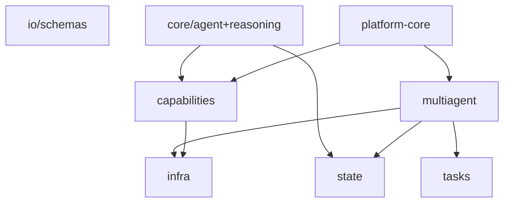

## §AP.2 — libs/agent-core overview

> **Phạm vi:** Framework agent đa lớp (items 1–36 trong docstring nội bộ). `platform-core` và `project-core` build trên các abstraction này.

### §AP.2.1 — Cấu trúc package

| Package | Vai trò | File count (approx) |
|---------|---------|---------------------|
| `core/` | Vòng đời agent & suy luận nội bộ | 19 |
| `capabilities/` | Khả năng plug-in: model, memory, retrieval, tools, prompts | 32 |
| `state/` | State machine, session, workflow, checkpoint | 19 |
| `multiagent/` | Graph orchestration, event bus, registry, runtime | 24 |
| `infra/` | Backend config, cache, budget, guardrails, observability | 19 |
| `tasks/` | Phân rã task, aggregation | 7 |
| `io/` | AgentRequest/AgentResponse schemas | 2 |
| `skills/` | SkillBundle loader | 2 |

### §AP.2.2 — Package `agent_core.core`

#### `libs/agent-core/src/agent_core/core/agent/base.py` — `AbstractAgent`

- observe()
- plan()
- step()
- run() — vòng ReAct canonical

#### `libs/agent-core/src/agent_core/core/agent/strands_agent.py` — `StrandsAgent`

- Impl Strands-backed; wiring model + tools + context

#### `libs/agent-core/src/agent_core/core/persona/base.py` — `Persona`

- PersonaConfig → system prompt fragment

#### `libs/agent-core/src/agent_core/core/reasoning/base.py` — `ReasoningStrategy`

- Interface chiến lược suy luận intra-agent

#### `libs/agent-core/src/agent_core/core/reasoning/react.py` — `ReActStrategy`

- Reason-Act loop

#### `libs/agent-core/src/agent_core/core/reasoning/chain_of_thought.py` — `ChainOfThoughtStrategy`

- CoT prompting

#### `libs/agent-core/src/agent_core/core/reasoning/plan_execute.py` — `PlanAndExecuteStrategy`

- Plan rồi execute từng bước

#### `libs/agent-core/src/agent_core/core/reasoning/passthrough.py` — `PassthroughStrategy`

- Không wrap — gọi LLM trực tiếp

#### `libs/agent-core/src/agent_core/core/reasoning/loop.py` — `ReasoningLoop`

- Orchestrate strategy + invoke callback

#### `libs/agent-core/src/agent_core/core/reasoning/factory.py` — `build_reasoning`

- Map YAML string → strategy instance

#### `libs/agent-core/src/agent_core/core/termination/base.py` — `TerminationCondition`

- MaxIterations, StopToken, Composite

#### `libs/agent-core/src/agent_core/core/evaluation/base.py` — `AbstractEvaluator`

- ReflectionLoop, HeuristicEvaluator

### §AP.2.3 — Package `agent_core.capabilities`

#### `libs/agent-core/src/agent_core/capabilities/models/openai_compatible.py` — `OpenAICompatibleProvider`

- OpenRouter/OpenAI compatible API

#### `libs/agent-core/src/agent_core/capabilities/memory/factory.py` — `build_stm/build_ltm`

- Factory Redis/SQLite/Mongo/Strands/in_memory

#### `libs/agent-core/src/agent_core/capabilities/memory/redis_stm.py` — `RedisSTM`

- Session TTL, append history

#### `libs/agent-core/src/agent_core/capabilities/memory/mongodb_ltm.py` — `MongoDBLTM`

- Long-term recall per actor

#### `libs/agent-core/src/agent_core/capabilities/retrieval/factory.py` — `build_retriever`

- Chroma, in-memory vector

#### `libs/agent-core/src/agent_core/capabilities/context/default_builder.py` — `DefaultContextBuilder`

- Assemble context window per turn

#### `libs/agent-core/src/agent_core/capabilities/tools/base.py` — `AbstractTool`

- Framework-neutral tool contract

#### `libs/agent-core/src/agent_core/capabilities/tool_registry/simple.py` — `SimpleToolRegistry`

- Register + select tools

#### `libs/agent-core/src/agent_core/capabilities/output_parsers/json_parser.py` — `JsonOutputParser`

- Parse structured agent output

#### `libs/agent-core/src/agent_core/capabilities/prompts/file_repository.py` — `FilePromptRepository`

- Versioned prompt files

### §AP.2.4 — Package `agent_core.state`

#### `libs/agent-core/src/agent_core/state/agent_state/in_memory.py` — `InMemoryAgentState`

- Per-agent KV private state

#### `libs/agent-core/src/agent_core/state/session_state/strands_session.py` — `StrandsSessionStore`

- Conversation session adapter

#### `libs/agent-core/src/agent_core/state/shared_state/in_memory.py` — `InMemoryBlackboard`

- Multi-agent blackboard

#### `libs/agent-core/src/agent_core/state/workflow_state/base.py` — `WorkflowState`

- Orchestration run progress + status enum

#### `libs/agent-core/src/agent_core/state/schema/base.py` — `StateSchema`

- LangGraph-style reducers LastWriteWins/Append

#### `libs/agent-core/src/agent_core/state/persistence/sqlite_checkpoint.py` — `SQLiteCheckpointStore`

- Resume checkpoints

#### `libs/agent-core/src/agent_core/state/transition/base.py` — `StateMachine`

- FSM transitions

### §AP.2.5 — Package `agent_core.multiagent`

#### `libs/agent-core/src/agent_core/multiagent/orchestration/graph/engine.py` — `GraphEngine`

- Execute DAG: parallel, conditional, join

#### `libs/agent-core/src/agent_core/multiagent/orchestration/graph/model.py` — `ExecutionPlan`

- Neutral graph plan model

#### `libs/agent-core/src/agent_core/multiagent/orchestration/graph/builder.py` — `build_plan`

- Construct plan from edges/nodes

#### `libs/agent-core/src/agent_core/multiagent/orchestration/graph/conditions.py` — `ConditionEvaluator`

- Evaluate `when` expressions

#### `libs/agent-core/src/agent_core/multiagent/runtime/base.py` — `SyncRuntime`

- Sequential sync execution

#### `libs/agent-core/src/agent_core/multiagent/runtime/thread_pool.py` — `ThreadPoolRuntime`

- Parallel node execution

#### `libs/agent-core/src/agent_core/multiagent/communication/redis_transport.py` — `RedisTransport`

- A2A message queue via Redis

#### `libs/agent-core/src/agent_core/multiagent/event_bus/redis_bus.py` — `RedisEventBus`

- Pub/sub coordination

#### `libs/agent-core/src/agent_core/multiagent/registry/base.py` — `AgentRegistry`

- AgentCard discovery by capability

#### `libs/agent-core/src/agent_core/multiagent/human_in_loop/base.py` — `HumanInLoop`

- Approval gates AutoApprove

### §AP.2.6 — Package `agent_core.infra`

#### `libs/agent-core/src/agent_core/infra/backends/config.py` — `STMBackendConfig`

- Nested backend configuration models

#### `libs/agent-core/src/agent_core/infra/backends/resolve.py` — `resolve_url`

- Env var URL resolution

#### `libs/agent-core/src/agent_core/infra/caching/factory.py` — `build_cache`

- In-memory / Redis cache

#### `libs/agent-core/src/agent_core/infra/budget/base.py` — `BudgetGuard`

- Token/cost/concurrency caps

#### `libs/agent-core/src/agent_core/infra/guardrails/base.py` — `Guardrail`

- Input/output validation, PermissionPolicy

#### `libs/agent-core/src/agent_core/infra/observability/base.py` — `Tracer`

- Span, CostAccountant, UsageRecord

#### `libs/agent-core/src/agent_core/infra/hooks/base.py` — `HookRegistry`

- Lifecycle hooks register/emit

#### `libs/agent-core/src/agent_core/infra/errors/base.py` — `AgentError`

- Structured agent errors

#### `libs/agent-core/src/agent_core/infra/di/base.py` — `ServiceLocator`

- Lightweight DI container

### §AP.2.7 — Package `agent_core.tasks`

#### `libs/agent-core/src/agent_core/tasks/decomposition/base.py` — `TaskDecomposer`

- Split complex goals

#### `libs/agent-core/src/agent_core/tasks/aggregation/base.py` — `ResultAggregator`

- Merge parallel agent outputs

### §AP.2.8 — Package `agent_core.io`

#### `libs/agent-core/src/agent_core/io/schemas.py` — `AgentRequest`

- message, session_id, actor_id, metadata.inbox

#### `libs/agent-core/src/agent_core/io/schemas.py` — `AgentResponse`

- content, payload, tool_calls, state_updates

### §AP.2.9 — Package `agent_core.skills`

#### `libs/agent-core/src/agent_core/skills/bundle.py` — `SkillBundle`

- Load SKILL.md + TOOLS.md + prompts from skills/

### §AP.2.10 — Sơ đồ phụ thuộc giữa packages

### §AP.2.11 — Chiến lược reasoning (YAML → factory)

| YAML `reasoning` | Class | Hành vi |
|------------------|-------|---------|
| `null / omitted` | `PassthroughStrategy` | Gọi LLM một lần, không wrap |
| `react` | `ReActStrategy` | Reason + Act + Observe loop |
| `cot` | `ChainOfThoughtStrategy` | Chain-of-thought prompting |
| `plan_execute` | `PlanAndExecuteStrategy` | Lập kế hoạch rồi thực thi |

### §AP.2.12 — Memory & retrieval backends

| Layer | Backend key | Ghi chú |
|-------|-------------|---------|
| stm | `in_memory` | Dict in-process — test/dev |
| stm | `redis` | REDIS_URL — production supermarket |
| stm | `strands` | Strands session manager integration |
| ltm | `sqlite` | File ./data/ltm.db |
| ltm | `mongodb` | MONGODB_URI — production supermarket |
| ltm | `redis` | Redis-backed LTM |
| retrieval | `in_memory` | Vector in RAM |
| retrieval | `chroma` | ChromaDB persistent |

### §AP.2.13 — GraphEngine — node kinds

- **`agent`**: Gọi executor với node_id = agent name
- **`parallel`**: Chạy nhiều agent song song, merge concat/list
- **`conditional`**: Evaluate routes[].when → branch
- **`join`**: Đợi parallel branches, merge state
- **`debate`**: Round-robin participants + facilitator

### §AP.2.14 — Hợp đồng A2A (io/schemas.py)

**AgentRequest fields:**
- `message: str` — user goal / prompt turn.
- `session_id: str | None` — conversation id; auto-generate nếu null.
- `actor_id: str` — user identity cho LTM/ACL.
- `metadata: dict` — `inbox` (pipeline feedback), `shared_state`, `permissions`, custom.
**AgentResponse fields:**
- `content: str | None` — natural language cho user.
- `payload: dict` — structured JSON (SQL plan, risk verdict, analysis result).
- `tool_calls: list` — audit tool invocations.
- `state_updates: dict` — mutate shared blackboard.
- `session_id`, `actor_id`, `memory_refs` — persistence hints.

