## §Z.4 — ChatOrchestrator và chat-gateway

*Phần này bổ sung §Z.2 bằng góc nhìn vận hành end-to-end: phân tích từng dòng `orchestrator.py`, chuỗi middleware FastAPI, luồng JWT→permissions→pipeline, và sơ đồ hoạt động Mermaid. Nội dung sinh trực tiếp từ mã nguồn tại thời điểm biên soạn; không trích lại bảng route §Z.2.5.*

### §Z.4.0 — Tổng quan kiến trúc gateway

Chat-gateway là **cạnh duy nhất** mà UI gọi. Ba lớp chính:

1. **Lớp HTTP (`app.py`)** — FastAPI nhận request, `Depends(current_user)` gắn JWT claims, gọi orchestrator.
2. **Lớp điều phối (`orchestrator.py`)** — Quản lý phiên Redis, gọi Agent I (ingress/synthesize/clarify), ủy quyền `SupermarketAnalysisPipeline`.
3. **Lớp hạ tầng (`clients.py`, `auth_store.py`)** — HTTP tới agent I–IV và sql-gateway; pyodbc tới AUTH DB.

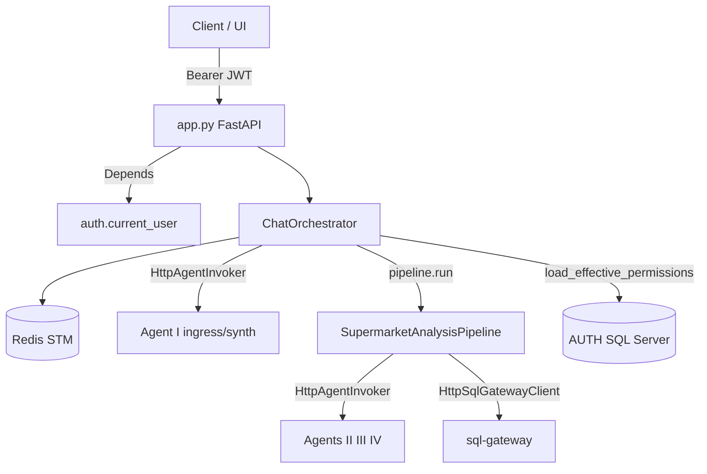

### §Z.4.1 — `orchestrator.py` — khối import và hằng số (dòng 1–43)

### §Z.4.1.1 — Dòng 1–43

Toàn bộ import và `_NEGATIVE_OUTCOMES`.

**Dòng 1** `from __future__ import annotations` — Import phụ thuộc `annotations`; orchestrator không tự triển khai logic này mà ủy quyền cho thư viện/domain.
**Dòng 2** *(dòng trống)* — Ngắt đoạn mã; không thực thi logic.
**Dòng 3** `import logging` — Import phụ thuộc `logging`; orchestrator không tự triển khai logic này mà ủy quyền cho thư viện/domain.
**Dòng 4** `import os` — Import phụ thuộc `os`; orchestrator không tự triển khai logic này mà ủy quyền cho thư viện/domain.
**Dòng 5** `import time` — Import phụ thuộc `time`; orchestrator không tự triển khai logic này mà ủy quyền cho thư viện/domain.
**Dòng 6** `from typing import Any` — Import phụ thuộc `Any`; orchestrator không tự triển khai logic này mà ủy quyền cho thư viện/domain.
**Dòng 7** `from uuid import uuid4` — Import phụ thuộc `uuid4`; orchestrator không tự triển khai logic này mà ủy quyền cho thư viện/domain.
**Dòng 8** *(dòng trống)* — Ngắt đoạn mã; không thực thi logic.
**Dòng 9** `import httpx` — Import phụ thuộc `httpx`; orchestrator không tự triển khai logic này mà ủy quyền cho thư viện/domain.
**Dòng 10** `from project_core.config.loader import load_project_config` — Import phụ thuộc `load_project_config`; orchestrator không tự triển khai logic này mà ủy quyền cho thư viện/domain.
**Dòng 11** `from project_core.domain.access.acl import build_permissions_snapshot` — Import phụ thuộc `build_permissions_snapshot`; orchestrator không tự triển khai logic này mà ủy quyền cho thư viện/domain.
**Dòng 12** `from project_core.domain.access.user_claims import claims_from_user_dict` — Import phụ thuộc `claims_from_user_dict`; orchestrator không tự triển khai logic này mà ủy quyền cho thư viện/domain.
**Dòng 13** `from project_core.domain.access.context_policy import ContextPolicy` — Import phụ thuộc `ContextPolicy`; orchestrator không tự triển khai logic này mà ủy quyền cho thư viện/domain.
**Dòng 14** `from project_core.domain.budget import SessionTraceBudget, TraceBudget` — Import phụ thuộc `TraceBudget`; orchestrator không tự triển khai logic này mà ủy quyền cho thư viện/domain.
**Dòng 15** `from project_core.domain.clarification.resolver import apply_clarification_reply` — Import phụ thuộc `apply_clarification_reply`; orchestrator không tự triển khai logic này mà ủy quyền cho thư viện/domain.
**Dòng 16** `from project_core.domain.contracts.brief import AnalysisBrief` — Import phụ thuộc `AnalysisBrief`; orchestrator không tự triển khai logic này mà ủy quyền cho thư viện/domain.
**Dòng 17** `from project_core.domain.contracts.clarification import ClarificationReply, ClarificationRequest` — Import phụ thuộc `ClarificationRequest`; orchestrator không tự triển khai logic này mà ủy quyền cho thư viện/domain.
**Dòng 18** `from project_core.domain.contracts.feedback import SatisfactionSignal` — Import phụ thuộc `SatisfactionSignal`; orchestrator không tự triển khai logic này mà ủy quyền cho thư viện/domain.
**Dòng 19** `from project_core.domain.contracts.pipeline import ChatResponse` — Import phụ thuộc `ChatResponse`; orchestrator không tự triển khai logic này mà ủy quyền cho thư viện/domain.
**Dòng 20** `from project_core.domain.contracts.workflow import WorkflowStatus` — Import phụ thuộc `WorkflowStatus`; orchestrator không tự triển khai logic này mà ủy quyền cho thư viện/domain.
**Dòng 21** `from project_core.domain.errors.codes import (` — Import phụ thuộc `(`; orchestrator không tự triển khai logic này mà ủy quyền cho thư viện/domain.
**Dòng 22** `    BudgetExceededError,` — Thực thi bước trung gian trong luồng điều phối phiên.
**Dòng 23** `    ClarifyRoundsExceededError,` — Thực thi bước trung gian trong luồng điều phối phiên.
**Dòng 24** `    PermissionsUnavailableError,` — Thực thi bước trung gian trong luồng điều phối phiên.
**Dòng 25** `)` — Thực thi bước trung gian trong luồng điều phối phiên.
**Dòng 26** `from project_core.domain.feedback.analysis_tool_registry import AnalysisToolRegistry` — Import phụ thuộc `AnalysisToolRegistry`; orchestrator không tự triển khai logic này mà ủy quyền cho thư viện/domain.
**Dòng 27** `from project_core.domain.feedback.domain_rule_store import DomainRuleStore` — Import phụ thuộc `DomainRuleStore`; orchestrator không tự triển khai logic này mà ủy quyền cho thư viện/domain.
**Dòng 28** `from project_core.domain.feedback.loop import CaseStudyIndexer, FeedbackLoop` — Import phụ thuộc `FeedbackLoop`; orchestrator không tự triển khai logic này mà ủy quyền cho thư viện/domain.
**Dòng 29** `from project_core.domain.feedback.store import BehavioralSignal` — Import phụ thuộc `BehavioralSignal`; orchestrator không tự triển khai logic này mà ủy quyền cho thư viện/domain.
**Dòng 30** `from project_core.domain.memory.session_bundle import SessionBundle, TranscriptTurn` — Import phụ thuộc `TranscriptTurn`; orchestrator không tự triển khai logic này mà ủy quyền cho thư viện/domain.
**Dòng 31** `from project_core.domain.retrieval.mongo_vector import HybridMongoRetriever, MongoVectorRetriever` — Import phụ thuộc `MongoVectorRetriever`; orchestrator không tự triển khai logic này mà ủy quyền cho thư viện/domain.
**Dòng 32** `from project_core.domain.schema.catalog import SchemaCatalog` — Import phụ thuộc `SchemaCatalog`; orchestrator không tự triển khai logic này mà ủy quyền cho thư viện/domain.
**Dòng 33** `from project_core.domain.workflow.state import new_workflow, resume_analysis, start_analysis` — Import phụ thuộc `start_analysis`; orchestrator không tự triển khai logic này mà ủy quyền cho thư viện/domain.
**Dòng 34** `from project_core.domain.time import utc_now` — Import phụ thuộc `utc_now`; orchestrator không tự triển khai logic này mà ủy quyền cho thư viện/domain.
**Dòng 35** `from project_core.infra.stm.redis_store import RedisSessionStore` — Import phụ thuộc `RedisSessionStore`; orchestrator không tự triển khai logic này mà ủy quyền cho thư viện/domain.
**Dòng 36** `from project_core.orchestration.clarification_coordinator import ClarificationCoordinator` — Import phụ thuộc `ClarificationCoordinator`; orchestrator không tự triển khai logic này mà ủy quyền cho thư viện/domain.
**Dòng 37** `from project_core.orchestration.pipeline import SupermarketAnalysisPipeline` — Import phụ thuộc `SupermarketAnalysisPipeline`; orchestrator không tự triển khai logic này mà ủy quyền cho thư viện/domain.
**Dòng 38** *(dòng trống)* — Ngắt đoạn mã; không thực thi logic.
**Dòng 39** `from chat_gateway.clients import HttpAgentInvoker, HttpSqlGatewayClient` — Import phụ thuộc `HttpSqlGatewayClient`; orchestrator không tự triển khai logic này mà ủy quyền cho thư viện/domain.
**Dòng 40** *(dòng trống)* — Ngắt đoạn mã; không thực thi logic.
**Dòng 41** `logger = logging.getLogger(__name__)` — Thực thi bước trung gian trong luồng điều phối phiên.
**Dòng 42** *(dòng trống)* — Ngắt đoạn mã; không thực thi logic.
**Dòng 43** `_NEGATIVE_OUTCOMES = frozenset({"error", "impossible", "policy_blocked", "partial"})` — Thực thi bước trung gian trong luồng điều phối phiên.
### §Z.4.2 — `ChatOrchestrator.__init__` (dòng 47–88)

Khởi tạo **một lần** khi `get_orchestrator()` lần đầu. Thứ tự quan trọng: Redis → config → HTTP client → Mongo (best-effort) → pipeline wiring.

### §Z.4.2.1 — Constructor từng dòng


**Dòng 47** `    def __init__(self) -> None:` — Định nghĩa phương thức `__init__`; xem khối thân bên dưới để biết side-effect Redis/Mongo/HTTP.
**Dòng 48** `        self.stm = RedisSessionStore()` — Thao tác trên thuộc tính instance (stm, pipeline, feedback, …); có thể ghi Redis hoặc gọi HTTP gián tiếp.
**Dòng 49** `        self.cfg = load_project_config()` — Thao tác trên thuộc tính instance (stm, pipeline, feedback, …); có thể ghi Redis hoặc gọi HTTP gián tiếp.
**Dòng 50** `        self.context_policy = ContextPolicy()` — Thao tác trên thuộc tính instance (stm, pipeline, feedback, …); có thể ghi Redis hoặc gọi HTTP gián tiếp.
**Dòng 51** `        self.clarify = ClarificationCoordinator()` — Thao tác trên thuộc tính instance (stm, pipeline, feedback, …); có thể ghi Redis hoặc gọi HTTP gián tiếp.
**Dòng 52** `        self._http = httpx.Client(timeout=120.0)` — Thao tác trên thuộc tính instance (stm, pipeline, feedback, …); có thể ghi Redis hoặc gọi HTTP gián tiếp.
**Dòng 53** `        self.feedback: FeedbackLoop | None = None` — Thao tác trên thuộc tính instance (stm, pipeline, feedback, …); có thể ghi Redis hoặc gọi HTTP gián tiếp.
**Dòng 54** `        self.analysis_tool_registry: AnalysisToolRegistry | None = None` — Thao tác trên thuộc tính instance (stm, pipeline, feedback, …); có thể ghi Redis hoặc gọi HTTP gián tiếp.
**Dòng 55** `        self.domain_rule_store: DomainRuleStore | None = None` — Thao tác trên thuộc tính instance (stm, pipeline, feedback, …); có thể ghi Redis hoặc gọi HTTP gián tiếp.
**Dòng 56** `        try:` — Khối bảo vệ gọi agent/budget; lỗi budget → response có `BUDGET_EXCEEDED`.
**Dòng 57** `            from pymongo import MongoClient` — Import phụ thuộc `MongoClient`; orchestrator không tự triển khai logic này mà ủy quyền cho thư viện/domain.
**Dòng 58** *(dòng trống)* — Ngắt đoạn mã; không thực thi logic.
**Dòng 59** `            from project_core.domain.analysis.recipe_runtime import set_registry` — Import phụ thuộc `set_registry`; orchestrator không tự triển khai logic này mà ủy quyền cho thư viện/domain.
**Dòng 60** `            from project_core.llm.embedding_client import EmbeddingClient` — Import phụ thuộc `EmbeddingClient`; orchestrator không tự triển khai logic này mà ủy quyền cho thư viện/domain.
**Dòng 61** *(dòng trống)* — Ngắt đoạn mã; không thực thi logic.
**Dòng 62** `            mongo_timeout = int(os.getenv("MONGODB_CONNECT_TIMEOUT_MS", "2000"))` — Thực thi bước trung gian trong luồng điều phối phiên.
**Dòng 63** `            mongo = MongoClient(` — Thực thi bước trung gian trong luồng điều phối phiên.
**Dòng 64** `                os.getenv("MONGODB_URI", "mongodb://localhost:18217/supermarket_agent"),` — Thực thi bước trung gian trong luồng điều phối phiên.
**Dòng 65** `                serverSelectionTimeoutMS=mongo_timeout,` — Thực thi bước trung gian trong luồng điều phối phiên.
**Dòng 66** `            )` — Thực thi bước trung gian trong luồng điều phối phiên.
**Dòng 67** `            mongo.admin.command("ping")` — Thực thi bước trung gian trong luồng điều phối phiên.
**Dòng 68** `            db = mongo.get_default_database()` — Thực thi bước trung gian trong luồng điều phối phiên.
**Dòng 69** `            indexer = CaseStudyIndexer(db["case_studies"])` — Thực thi bước trung gian trong luồng điều phối phiên.
**Dòng 70** *(dòng trống)* — Ngắt đoạn mã; không thực thi logic.
**Dòng 71** `            def _embed_text(text: str) -> list[float]:` — Định nghĩa phương thức `_embed_text`; xem khối thân bên dưới để biết side-effect Redis/Mongo/HTTP.
**Dòng 72** `                return EmbeddingClient().embed([text])[0]` — Thoát sớm hoặc cuối nhánh; giá trị trả về được `app.py` serialize qua `model_dump()` nếu là `ChatResponse`.
**Dòng 73** *(dòng trống)* — Ngắt đoạn mã; không thực thi logic.
**Dòng 74** `            retriever = HybridMongoRetriever(db)` — Thực thi bước trung gian trong luồng điều phối phiên.
**Dòng 75** `            self.analysis_tool_registry = AnalysisToolRegistry(db["analysis_tools"], embed_fn=_embed_text)` — Thao tác trên thuộc tính instance (stm, pipeline, feedback, …); có thể ghi Redis hoặc gọi HTTP gián tiếp.
**Dòng 76** `            set_registry(self.analysis_tool_registry)` — Thực thi bước trung gian trong luồng điều phối phiên.
**Dòng 77** `            self.domain_rule_store = DomainRuleStore(db["domain_rules"])` — Thao tác trên thuộc tính instance (stm, pipeline, feedback, …); có thể ghi Redis hoặc gọi HTTP gián tiếp.
**Dòng 78** `            self.feedback = FeedbackLoop(indexer=indexer, retriever=retriever, embed_fn=_embed_text)` — Thao tác trên thuộc tính instance (stm, pipeline, feedback, …); có thể ghi Redis hoặc gọi HTTP gián tiếp.
**Dòng 79** `        except Exception as exc:  # noqa: BLE001` — Bắt exception; orchestrator ưu tiên trả `ChatResponse` có `error` thay vì 500.
**Dòng 80** `            logger.warning("Mongo/RAG unavailable: %s", exc)` — Thực thi bước trung gian trong luồng điều phối phiên.
**Dòng 81** `        self.pipeline = SupermarketAnalysisPipeline(` — Thao tác trên thuộc tính instance (stm, pipeline, feedback, …); có thể ghi Redis hoặc gọi HTTP gián tiếp.
**Dòng 82** `            agent_invoker=HttpAgentInvoker(client=self._http),` — Thực thi bước trung gian trong luồng điều phối phiên.
**Dòng 83** `            sql_gateway=HttpSqlGatewayClient(client=self._http),` — Thực thi bước trung gian trong luồng điều phối phiên.
**Dòng 84** `            catalog=SchemaCatalog.from_dictionary_dir(),` — Thực thi bước trung gian trong luồng điều phối phiên.
**Dòng 85** `            feedback_loop=self.feedback,` — Thực thi bước trung gian trong luồng điều phối phiên.
**Dòng 86** `            analysis_tool_registry=self.analysis_tool_registry,` — Thực thi bước trung gian trong luồng điều phối phiên.
**Dòng 87** `            domain_rule_store=self.domain_rule_store,` — Thực thi bước trung gian trong luồng điều phối phiên.
**Dòng 88** `        )` — Thực thi bước trung gian trong luồng điều phối phiên.
**Sơ đồ hoạt động khởi tạo:**

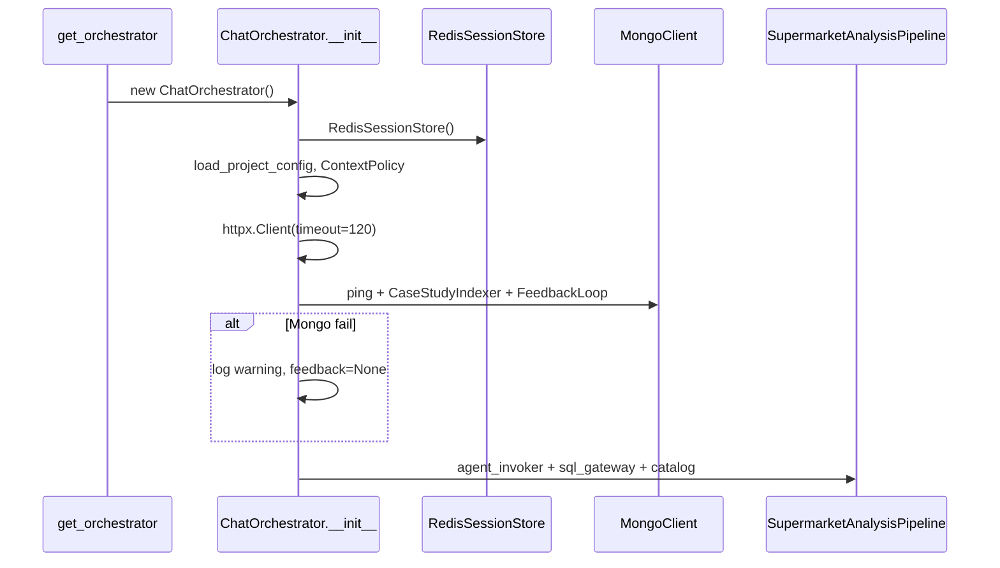

Sau init, `self.pipeline.agent_invoker` và `self.pipeline.sql_gateway` **chia sẻ** `self._http` với các `HttpAgentInvoker` tạm tạo trong `handle_chat` — cùng connection pool httpx.

### §Z.4.3 — `close()` (dòng 90–95)

### §Z.4.3.1

Giải phóng httpx; gọi close trên invoker/gateway nếu có.

**Dòng 90** `    def close(self) -> None:` — Định nghĩa phương thức `close`; xem khối thân bên dưới để biết side-effect Redis/Mongo/HTTP.
**Dòng 91** `        self._http.close()` — Thao tác trên thuộc tính instance (stm, pipeline, feedback, …); có thể ghi Redis hoặc gọi HTTP gián tiếp.
**Dòng 92** `        if hasattr(self.pipeline.agent_invoker, "close"):` — Phân nhánh điều kiện; quyết định luồng clarify, analysis, hoặc idle.
**Dòng 93** `            self.pipeline.agent_invoker.close()  # type: ignore[attr-defined]` — Thao tác trên thuộc tính instance (stm, pipeline, feedback, …); có thể ghi Redis hoặc gọi HTTP gián tiếp.
**Dòng 94** `        if hasattr(self.pipeline.sql_gateway, "close"):` — Phân nhánh điều kiện; quyết định luồng clarify, analysis, hoặc idle.
**Dòng 95** `            self.pipeline.sql_gateway.close()  # type: ignore[attr-defined]` — Thao tác trên thuộc tính instance (stm, pipeline, feedback, …); có thể ghi Redis hoặc gọi HTTP gián tiếp.
### §Z.4.4 — `handle_chat` (dòng 97–174)

Điểm vào chính `POST /chat`. Luồng: load session → clarify ingress? → transcript → Agent I ingress → analysis hoặc idle.

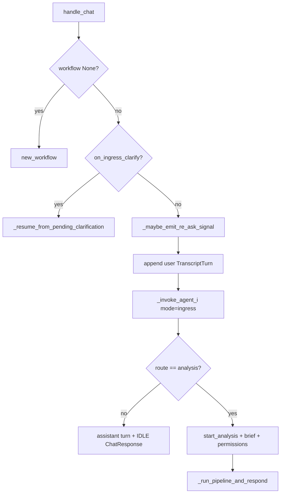

### §Z.4.4.1 — handle_chat từng dòng


**Dòng 97** `    def handle_chat(self, *, session_id: str, message: str, user: dict[str, Any]) -> ChatResponse:` — Định nghĩa phương thức `handle_chat`; xem khối thân bên dưới để biết side-effect Redis/Mongo/HTTP.
**Dòng 98** `        actor_id, role, store_ids = claims_from_user_dict(user)` — Thực thi bước trung gian trong luồng điều phối phiên.
**Dòng 99** `        bundle = self.stm.load_session(session_id)` — Thực thi bước trung gian trong luồng điều phối phiên.
**Dòng 100** `        if bundle.workflow is None:` — Phân nhánh điều kiện; quyết định luồng clarify, analysis, hoặc idle.
**Dòng 101** `            bundle.workflow = new_workflow(session_id, actor_id)` — Đọc/ghi `SessionBundle` trong bộ nhớ; cần `stm.save_*` để persist.
**Dòng 102** *(dòng trống)* — Ngắt đoạn mã; không thực thi logic.
**Dòng 103** `        if self.clarify.on_ingress_clarify(bundle):` — Phân nhánh điều kiện; quyết định luồng clarify, analysis, hoặc idle.
**Dòng 104** `            return self._resume_from_pending_clarification(` — Thoát sớm hoặc cuối nhánh; giá trị trả về được `app.py` serialize qua `model_dump()` nếu là `ChatResponse`.
**Dòng 105** `                session_id=session_id,` — Thực thi bước trung gian trong luồng điều phối phiên.
**Dòng 106** `                message=message,` — Thực thi bước trung gian trong luồng điều phối phiên.
**Dòng 107** `                user=user,` — Thực thi bước trung gian trong luồng điều phối phiên.
**Dòng 108** `                bundle=bundle,` — Thực thi bước trung gian trong luồng điều phối phiên.
**Dòng 109** `            )` — Thực thi bước trung gian trong luồng điều phối phiên.
**Dòng 110** *(dòng trống)* — Ngắt đoạn mã; không thực thi logic.
**Dòng 111** `        self._maybe_emit_re_ask_signal(session_id, bundle, message)` — Thao tác trên thuộc tính instance (stm, pipeline, feedback, …); có thể ghi Redis hoặc gọi HTTP gián tiếp.
**Dòng 112** *(dòng trống)* — Ngắt đoạn mã; không thực thi logic.
**Dòng 113** `        turn = TranscriptTurn(id=str(uuid4()), role="user", content=message, at=utc_now().isoformat())` — Thực thi bước trung gian trong luồng điều phối phiên.
**Dòng 114** `        bundle.transcript.append(turn)` — Đọc/ghi `SessionBundle` trong bộ nhớ; cần `stm.save_*` để persist.
**Dòng 115** `        self.stm.save_transcript(session_id, bundle.transcript)` — Thao tác trên thuộc tính instance (stm, pipeline, feedback, …); có thể ghi Redis hoặc gọi HTTP gián tiếp.
**Dòng 116** *(dòng trống)* — Ngắt đoạn mã; không thực thi logic.
**Dòng 117** `        invoker = HttpAgentInvoker(client=self._http)` — Thực thi bước trung gian trong luồng điều phối phiên.
**Dòng 118** `        session_budget = self._session_budget(bundle)` — Thực thi bước trung gian trong luồng điều phối phiên.
**Dòng 119** `        external_sources = []` — Thực thi bước trung gian trong luồng điều phối phiên.
**Dòng 120** `        if bundle.workflow.brief and bundle.workflow.brief.external_sources:` — Phân nhánh điều kiện; quyết định luồng clarify, analysis, hoặc idle.
**Dòng 121** `            external_sources = [s.model_dump() for s in bundle.workflow.brief.external_sources]` — Thực thi bước trung gian trong luồng điều phối phiên.
**Dòng 122** *(dòng trống)* — Ngắt đoạn mã; không thực thi logic.
**Dòng 123** `        try:` — Khối bảo vệ gọi agent/budget; lỗi budget → response có `BUDGET_EXCEEDED`.
**Dòng 124** `            ingress = self._invoke_agent_i(` — Thực thi bước trung gian trong luồng điều phối phiên.
**Dòng 125** `                invoker,` — Thực thi bước trung gian trong luồng điều phối phiên.
**Dòng 126** `                {"text": message, "external_sources": external_sources},` — Thực thi bước trung gian trong luồng điều phối phiên.
**Dòng 127** `                {"mode": "ingress", "session_id": session_id, "actor_id": actor_id},` — Thực thi bước trung gian trong luồng điều phối phiên.
**Dòng 128** `                session_budget,` — Thực thi bước trung gian trong luồng điều phối phiên.
**Dòng 129** `                bundle,` — Thực thi bước trung gian trong luồng điều phối phiên.
**Dòng 130** `            )` — Thực thi bước trung gian trong luồng điều phối phiên.
**Dòng 131** `        except BudgetExceededError as exc:` — Bắt exception; orchestrator ưu tiên trả `ChatResponse` có `error` thay vì 500.
**Dòng 132** `            return ChatResponse(` — Thoát sớm hoặc cuối nhánh; giá trị trả về được `app.py` serialize qua `model_dump()` nếu là `ChatResponse`.
**Dòng 133** `                session_id=session_id,` — Thực thi bước trung gian trong luồng điều phối phiên.
**Dòng 134** `                workflow_status=bundle.workflow.status.value,` — Thực thi bước trung gian trong luồng điều phối phiên.
**Dòng 135** `                message=str(exc),` — Thực thi bước trung gian trong luồng điều phối phiên.
**Dòng 136** `                error={"code": "BUDGET_EXCEEDED", "retryable": False},` — Thực thi bước trung gian trong luồng điều phối phiên.
**Dòng 137** `            )` — Thực thi bước trung gian trong luồng điều phối phiên.
**Dòng 138** *(dòng trống)* — Ngắt đoạn mã; không thực thi logic.
**Dòng 139** `        self._handle_satisfaction_signal(ingress, bundle)` — Thao tác trên thuộc tính instance (stm, pipeline, feedback, …); có thể ghi Redis hoặc gọi HTTP gián tiếp.
**Dòng 140** *(dòng trống)* — Ngắt đoạn mã; không thực thi logic.
**Dòng 141** `        if ingress.get("route") != "analysis":` — Phân nhánh điều kiện; quyết định luồng clarify, analysis, hoặc idle.
**Dòng 142** `            assistant = TranscriptTurn(` — Thực thi bước trung gian trong luồng điều phối phiên.
**Dòng 143** `                id=str(uuid4()),` — Thực thi bước trung gian trong luồng điều phối phiên.
**Dòng 144** `                role="assistant",` — Thực thi bước trung gian trong luồng điều phối phiên.
**Dòng 145** `                content=ingress.get("user_message", ""),` — Thực thi bước trung gian trong luồng điều phối phiên.
**Dòng 146** `                at=utc_now().isoformat(),` — Thực thi bước trung gian trong luồng điều phối phiên.
**Dòng 147** `            )` — Thực thi bước trung gian trong luồng điều phối phiên.
**Dòng 148** `            bundle.transcript.append(assistant)` — Đọc/ghi `SessionBundle` trong bộ nhớ; cần `stm.save_*` để persist.
**Dòng 149** `            self.stm.save_transcript(session_id, bundle.transcript)` — Thao tác trên thuộc tính instance (stm, pipeline, feedback, …); có thể ghi Redis hoặc gọi HTTP gián tiếp.
**Dòng 150** `            return ChatResponse(` — Thoát sớm hoặc cuối nhánh; giá trị trả về được `app.py` serialize qua `model_dump()` nếu là `ChatResponse`.
**Dòng 151** `                session_id=session_id,` — Thực thi bước trung gian trong luồng điều phối phiên.
**Dòng 152** `                workflow_status=WorkflowStatus.IDLE.value,` — Thực thi bước trung gian trong luồng điều phối phiên.
**Dòng 153** `                message=ingress.get("user_message", ""),` — Thực thi bước trung gian trong luồng điều phối phiên.
**Dòng 154** `            )` — Thực thi bước trung gian trong luồng điều phối phiên.
**Dòng 155** *(dòng trống)* — Ngắt đoạn mã; không thực thi logic.
**Dòng 156** `        brief = AnalysisBrief.model_validate(ingress.get("brief") or {"intent": message})` — Thực thi bước trung gian trong luồng điều phối phiên.
**Dòng 157** `        if bundle.workflow.brief and bundle.workflow.brief.external_sources:` — Phân nhánh điều kiện; quyết định luồng clarify, analysis, hoặc idle.
**Dòng 158** `            brief.external_sources = bundle.workflow.brief.external_sources` — Thực thi bước trung gian trong luồng điều phối phiên.
**Dòng 159** *(dòng trống)* — Ngắt đoạn mã; không thực thi logic.
**Dòng 160** `        analysis_id = start_analysis(bundle.workflow, reset_clarify=True)` — Thực thi bước trung gian trong luồng điều phối phiên.
**Dòng 161** `        bundle.workflow.brief = brief` — Đọc/ghi `SessionBundle` trong bộ nhớ; cần `stm.save_*` để persist.
**Dòng 162** `        permissions = self._build_permissions(actor_id, role, store_ids)` — Thực thi bước trung gian trong luồng điều phối phiên.
**Dòng 163** `        bundle.workflow.permissions_snapshot = permissions` — Đọc/ghi `SessionBundle` trong bộ nhớ; cần `stm.save_*` để persist.
**Dòng 164** `        self.stm.save_workflow(session_id, bundle.workflow)` — Thao tác trên thuộc tính instance (stm, pipeline, feedback, …); có thể ghi Redis hoặc gọi HTTP gián tiếp.
**Dòng 165** *(dòng trống)* — Ngắt đoạn mã; không thực thi logic.
**Dòng 166** `        return self._run_pipeline_and_respond(` — Thoát sớm hoặc cuối nhánh; giá trị trả về được `app.py` serialize qua `model_dump()` nếu là `ChatResponse`.
**Dòng 167** `            session_id=session_id,` — Thực thi bước trung gian trong luồng điều phối phiên.
**Dòng 168** `            analysis_id=analysis_id,` — Thực thi bước trung gian trong luồng điều phối phiên.
**Dòng 169** `            brief=brief,` — Thực thi bước trung gian trong luồng điều phối phiên.
**Dòng 170** `            bundle=bundle,` — Thực thi bước trung gian trong luồng điều phối phiên.
**Dòng 171** `            permissions=permissions,` — Thực thi bước trung gian trong luồng điều phối phiên.
**Dòng 172** `            invoker=invoker,` — Thực thi bước trung gian trong luồng điều phối phiên.
**Dòng 173** `            session_budget=session_budget,` — Thực thi bước trung gian trong luồng điều phối phiên.
**Dòng 174** `        )` — Thực thi bước trung gian trong luồng điều phối phiên.
### §Z.4.5 — `handle_clarify` (dòng 176–210)

Được gọi từ `POST /chat/clarify` khi user trả lời form clarify có cấu trúc.

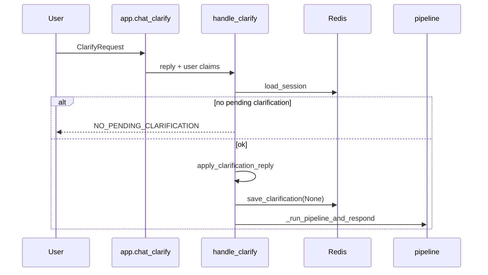

### §Z.4.5.1


**Dòng 176** `    def handle_clarify(` — Định nghĩa phương thức `handle_clarify`; xem khối thân bên dưới để biết side-effect Redis/Mongo/HTTP.
**Dòng 177** `        self,` — Thực thi bước trung gian trong luồng điều phối phiên.
**Dòng 178** `        *,` — Thực thi bước trung gian trong luồng điều phối phiên.
**Dòng 179** `        session_id: str,` — Thực thi bước trung gian trong luồng điều phối phiên.
**Dòng 180** `        reply: ClarificationReply,` — Thực thi bước trung gian trong luồng điều phối phiên.
**Dòng 181** `        user: dict[str, Any],` — Thực thi bước trung gian trong luồng điều phối phiên.
**Dòng 182** `    ) -> ChatResponse:` — Thực thi bước trung gian trong luồng điều phối phiên.
**Dòng 183** `        bundle = self.stm.load_session(session_id)` — Thực thi bước trung gian trong luồng điều phối phiên.
**Dòng 184** `        if bundle.workflow is None or not bundle.clarification:` — Phân nhánh điều kiện; quyết định luồng clarify, analysis, hoặc idle.
**Dòng 185** `            return ChatResponse(` — Thoát sớm hoặc cuối nhánh; giá trị trả về được `app.py` serialize qua `model_dump()` nếu là `ChatResponse`.
**Dòng 186** `                session_id=session_id,` — Thực thi bước trung gian trong luồng điều phối phiên.
**Dòng 187** `                workflow_status=WorkflowStatus.IDLE.value,` — Thực thi bước trung gian trong luồng điều phối phiên.
**Dòng 188** `                message="No pending clarification",` — Thực thi bước trung gian trong luồng điều phối phiên.
**Dòng 189** `                error={"code": "NO_PENDING_CLARIFICATION", "retryable": False},` — Thực thi bước trung gian trong luồng điều phối phiên.
**Dòng 190** `            )` — Thực thi bước trung gian trong luồng điều phối phiên.
**Dòng 191** `        request = ClarificationRequest.model_validate(bundle.clarification)` — Thực thi bước trung gian trong luồng điều phối phiên.
**Dòng 192** `        brief = bundle.workflow.brief or request.partial_brief` — Thực thi bước trung gian trong luồng điều phối phiên.
**Dòng 193** `        brief = apply_clarification_reply(brief, reply, request)` — Thực thi bước trung gian trong luồng điều phối phiên.
**Dòng 194** `        bundle.workflow.brief = brief` — Đọc/ghi `SessionBundle` trong bộ nhớ; cần `stm.save_*` để persist.
**Dòng 195** `        resume_analysis(bundle.workflow)` — Thực thi bước trung gian trong luồng điều phối phiên.
**Dòng 196** `        self.stm.save_clarification(session_id, None)` — Thao tác trên thuộc tính instance (stm, pipeline, feedback, …); có thể ghi Redis hoặc gọi HTTP gián tiếp.
**Dòng 197** `        self.stm.save_workflow(session_id, bundle.workflow)` — Thao tác trên thuộc tính instance (stm, pipeline, feedback, …); có thể ghi Redis hoặc gọi HTTP gián tiếp.
**Dòng 198** *(dòng trống)* — Ngắt đoạn mã; không thực thi logic.
**Dòng 199** `        permissions = bundle.workflow.permissions_snapshot or self._build_permissions(*claims_from_user_dict(user))` — Thực thi bước trung gian trong luồng điều phối phiên.
**Dòng 200** `        invoker = HttpAgentInvoker(client=self._http)` — Thực thi bước trung gian trong luồng điều phối phiên.
**Dòng 201** `        session_budget = self._session_budget(bundle)` — Thực thi bước trung gian trong luồng điều phối phiên.
**Dòng 202** `        return self._run_pipeline_and_respond(` — Thoát sớm hoặc cuối nhánh; giá trị trả về được `app.py` serialize qua `model_dump()` nếu là `ChatResponse`.
**Dòng 203** `            session_id=session_id,` — Thực thi bước trung gian trong luồng điều phối phiên.
**Dòng 204** `            analysis_id=reply.analysis_id,` — Thực thi bước trung gian trong luồng điều phối phiên.
**Dòng 205** `            brief=brief,` — Thực thi bước trung gian trong luồng điều phối phiên.
**Dòng 206** `            bundle=bundle,` — Thực thi bước trung gian trong luồng điều phối phiên.
**Dòng 207** `            permissions=permissions,` — Thực thi bước trung gian trong luồng điều phối phiên.
**Dòng 208** `            invoker=invoker,` — Thực thi bước trung gian trong luồng điều phối phiên.
**Dòng 209** `            session_budget=session_budget,` — Thực thi bước trung gian trong luồng điều phối phiên.
**Dòng 210** `        )` — Thực thi bước trung gian trong luồng điều phối phiên.
### §Z.4.6 — API phụ: confirm, attach, status, download (dòng 212–262)

### §Z.4.6.1

Các phương thức public không qua pipeline đầy đủ.

**Dòng 212** `    def confirm_domain_rule(self, rule_id: str, *, confirmed: bool, user: dict[str, Any]) -> dict[str, str]:` — Định nghĩa phương thức `confirm_domain_rule`; xem khối thân bên dưới để biết side-effect Redis/Mongo/HTTP.
**Dòng 213** `        if self.domain_rule_store is None:` — Phân nhánh điều kiện; quyết định luồng clarify, analysis, hoặc idle.
**Dòng 214** `            return {"status": "no_store"}` — Thoát sớm hoặc cuối nhánh; giá trị trả về được `app.py` serialize qua `model_dump()` nếu là `ChatResponse`.
**Dòng 215** `        if confirmed:` — Phân nhánh điều kiện; quyết định luồng clarify, analysis, hoặc idle.
**Dòng 216** `            self.domain_rule_store.confirm(rule_id, confirmed_by=user["sub"])` — Thao tác trên thuộc tính instance (stm, pipeline, feedback, …); có thể ghi Redis hoặc gọi HTTP gián tiếp.
**Dòng 217** `        else:` — Thực thi bước trung gian trong luồng điều phối phiên.
**Dòng 218** `            self.domain_rule_store.reject(rule_id)` — Thao tác trên thuộc tính instance (stm, pipeline, feedback, …); có thể ghi Redis hoặc gọi HTTP gián tiếp.
**Dòng 219** `        return {"status": "ok"}` — Thoát sớm hoặc cuối nhánh; giá trị trả về được `app.py` serialize qua `model_dump()` nếu là `ChatResponse`.
**Dòng 220** *(dòng trống)* — Ngắt đoạn mã; không thực thi logic.
**Dòng 221** `    def attach_external_sources(self, session_id: str, sources: list[dict[str, Any]]) -> None:` — Định nghĩa phương thức `attach_external_sources`; xem khối thân bên dưới để biết side-effect Redis/Mongo/HTTP.
**Dòng 222** `        bundle = self.stm.load_session(session_id)` — Thực thi bước trung gian trong luồng điều phối phiên.
**Dòng 223** `        if bundle.workflow is None:` — Phân nhánh điều kiện; quyết định luồng clarify, analysis, hoặc idle.
**Dòng 224** `            bundle.workflow = new_workflow(session_id, "unknown")` — Đọc/ghi `SessionBundle` trong bộ nhớ; cần `stm.save_*` để persist.
**Dòng 225** `        brief = bundle.workflow.brief or AnalysisBrief()` — Thực thi bước trung gian trong luồng điều phối phiên.
**Dòng 226** `        from project_core.domain.contracts.external_source import ExternalSource` — Import phụ thuộc `ExternalSource`; orchestrator không tự triển khai logic này mà ủy quyền cho thư viện/domain.
**Dòng 227** *(dòng trống)* — Ngắt đoạn mã; không thực thi logic.
**Dòng 228** `        existing = {s.file_id for s in brief.external_sources}` — Thực thi bước trung gian trong luồng điều phối phiên.
**Dòng 229** `        for raw in sources:` — Vòng lặp xử lý tập phần tử hoặc retry.
**Dòng 230** `            src = ExternalSource.model_validate(raw)` — Thực thi bước trung gian trong luồng điều phối phiên.
**Dòng 231** `            if src.file_id not in existing:` — Phân nhánh điều kiện; quyết định luồng clarify, analysis, hoặc idle.
**Dòng 232** `                brief.external_sources.append(src)` — Thực thi bước trung gian trong luồng điều phối phiên.
**Dòng 233** `        bundle.workflow.brief = brief` — Đọc/ghi `SessionBundle` trong bộ nhớ; cần `stm.save_*` để persist.
**Dòng 234** `        self.stm.save_workflow(session_id, bundle.workflow)` — Thao tác trên thuộc tính instance (stm, pipeline, feedback, …); có thể ghi Redis hoặc gọi HTTP gián tiếp.
**Dòng 235** *(dòng trống)* — Ngắt đoạn mã; không thực thi logic.
**Dòng 236** `    def analysis_status(self, analysis_id: str) -> dict[str, Any]:` — Định nghĩa phương thức `analysis_status`; xem khối thân bên dưới để biết side-effect Redis/Mongo/HTTP.
**Dòng 237** `        found = self.stm.find_by_analysis_id(analysis_id)` — Thực thi bước trung gian trong luồng điều phối phiên.
**Dòng 238** `        if not found:` — Phân nhánh điều kiện; quyết định luồng clarify, analysis, hoặc idle.
**Dòng 239** `            return {"analysis_id": analysis_id, "status": "not_found"}` — Thoát sớm hoặc cuối nhánh; giá trị trả về được `app.py` serialize qua `model_dump()` nếu là `ChatResponse`.
**Dòng 240** `        session_id, workflow = found` — Thực thi bước trung gian trong luồng điều phối phiên.
**Dòng 241** `        return {` — Thoát sớm hoặc cuối nhánh; giá trị trả về được `app.py` serialize qua `model_dump()` nếu là `ChatResponse`.
**Dòng 242** `            "analysis_id": analysis_id,` — Thực thi bước trung gian trong luồng điều phối phiên.
**Dòng 243** `            "session_id": session_id,` — Thực thi bước trung gian trong luồng điều phối phiên.
**Dòng 244** `            "status": workflow.status.value,` — Thực thi bước trung gian trong luồng điều phối phiên.
**Dòng 245** `            "last_outcome": workflow.last_outcome,` — Thực thi bước trung gian trong luồng điều phối phiên.
**Dòng 246** `            "progress_step": workflow.progress_step,` — Thực thi bước trung gian trong luồng điều phối phiên.
**Dòng 247** `            "active_analysis_id": workflow.active_analysis_id,` — Thực thi bước trung gian trong luồng điều phối phiên.
**Dòng 248** `            "clarify_round": str(workflow.clarify_round),` — Thực thi bước trung gian trong luồng điều phối phiên.
**Dòng 249** `        }` — Thực thi bước trung gian trong luồng điều phối phiên.
**Dòng 250** *(dòng trống)* — Ngắt đoạn mã; không thực thi logic.
**Dòng 251** `    def record_artifact_download(self, session_id: str, trace_id: str) -> None:` — Định nghĩa phương thức `record_artifact_download`; xem khối thân bên dưới để biết side-effect Redis/Mongo/HTTP.
**Dòng 252** `        if not self.feedback:` — Phân nhánh điều kiện; quyết định luồng clarify, analysis, hoặc idle.
**Dòng 253** `            return` — Thực thi bước trung gian trong luồng điều phối phiên.
**Dòng 254** `        self.feedback.on_behavioral_signal(` — Thao tác trên thuộc tính instance (stm, pipeline, feedback, …); có thể ghi Redis hoặc gọi HTTP gián tiếp.
**Dòng 255** `            session_id,` — Thực thi bước trung gian trong luồng điều phối phiên.
**Dòng 256** `            BehavioralSignal(` — Thực thi bước trung gian trong luồng điều phối phiên.
**Dòng 257** `                session_id=session_id,` — Thực thi bước trung gian trong luồng điều phối phiên.
**Dòng 258** `                signal_type="download",` — Thực thi bước trung gian trong luồng điều phối phiên.
**Dòng 259** `                trace_id=trace_id,` — Thực thi bước trung gian trong luồng điều phối phiên.
**Dòng 260** `                weight=0.3,` — Thực thi bước trung gian trong luồng điều phối phiên.
**Dòng 261** `            ),` — Thực thi bước trung gian trong luồng điều phối phiên.
**Dòng 262** `        )` — Thực thi bước trung gian trong luồng điều phối phiên.
### §Z.4.7 — `_build_permissions` (dòng 264–288)

Cầu nối JWT claims → `PermissionsSnapshot` cho pipeline và agent metadata.

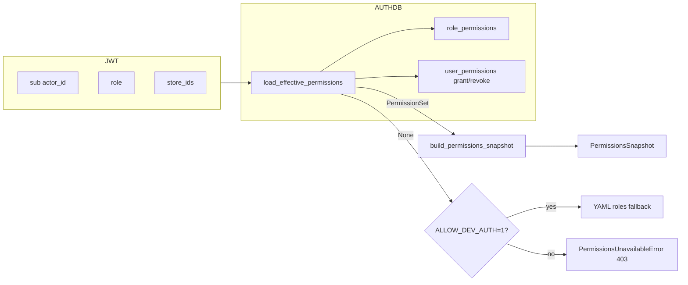

### §Z.4.7.1


**Dòng 264** `    def _build_permissions(self, actor_id: str, role: str, store_ids: list[int] | None) -> Any:` — Định nghĩa phương thức `_build_permissions`; xem khối thân bên dưới để biết side-effect Redis/Mongo/HTTP.
**Dòng 265** `        perm_set = None` — Thực thi bước trung gian trong luồng điều phối phiên.
**Dòng 266** `        try:` — Khối bảo vệ gọi agent/budget; lỗi budget → response có `BUDGET_EXCEEDED`.
**Dòng 267** `            from chat_gateway.auth_store import load_effective_permissions` — Import phụ thuộc `load_effective_permissions`; orchestrator không tự triển khai logic này mà ủy quyền cho thư viện/domain.
**Dòng 268** *(dòng trống)* — Ngắt đoạn mã; không thực thi logic.
**Dòng 269** `            perm_set = load_effective_permissions(actor_id)` — Thực thi bước trung gian trong luồng điều phối phiên.
**Dòng 270** `        except Exception as exc:  # noqa: BLE001` — Bắt exception; orchestrator ưu tiên trả `ChatResponse` có `error` thay vì 500.
**Dòng 271** `            logger.warning("permission resolve error: %s", exc)` — Thực thi bước trung gian trong luồng điều phối phiên.
**Dòng 272** `            perm_set = None` — Thực thi bước trung gian trong luồng điều phối phiên.
**Dòng 273** `        if perm_set is not None:` — Phân nhánh điều kiện; quyết định luồng clarify, analysis, hoặc idle.
**Dòng 274** `            return build_permissions_snapshot(` — Thoát sớm hoặc cuối nhánh; giá trị trả về được `app.py` serialize qua `model_dump()` nếu là `ChatResponse`.
**Dòng 275** `                actor_id,` — Thực thi bước trung gian trong luồng điều phối phiên.
**Dòng 276** `                role,` — Thực thi bước trung gian trong luồng điều phối phiên.
**Dòng 277** `                store_ids=store_ids,` — Thực thi bước trung gian trong luồng điều phối phiên.
**Dòng 278** `                permission_set=perm_set,` — Thực thi bước trung gian trong luồng điều phối phiên.
**Dòng 279** `                all_tables=self.pipeline.catalog.logical_table_names(),` — Thực thi bước trung gian trong luồng điều phối phiên.
**Dòng 280** `            )` — Thực thi bước trung gian trong luồng điều phối phiên.
**Dòng 281** `        # Fail-closed: no capabilities resolvable from the AUTH DB -> deny access.` — Chú thích nguồn.
**Dòng 282** `        # Dev-only convenience: ALLOW_DEV_AUTH falls back to YAML roles so local` — Chú thích nguồn.
**Dòng 283** `        # runs work without an AUTH DB.` — Chú thích nguồn.
**Dòng 284** `        if os.getenv("ALLOW_DEV_AUTH") == "1":` — Phân nhánh điều kiện; quyết định luồng clarify, analysis, hoặc idle.
**Dòng 285** `            return build_permissions_snapshot(actor_id, role, store_ids=store_ids)` — Thoát sớm hoặc cuối nhánh; giá trị trả về được `app.py` serialize qua `model_dump()` nếu là `ChatResponse`.
**Dòng 286** `        raise PermissionsUnavailableError(` — Ném exception domain; FastAPI có thể map sang HTTP 403/401 tùy loại.
**Dòng 287** `            "cannot resolve permissions from AUTH DB (user inactive/absent or DB unavailable)"` — Thực thi bước trung gian trong luồng điều phối phiên.
**Dòng 288** `        )` — Thực thi bước trung gian trong luồng điều phối phiên.
### §Z.4.8 — Budget và Agent I helper (dòng 290–337)

### §Z.4.8.1 — _session_budget, _invoke_agent_i, _handle_satisfaction_signal


**Dòng 290** `    def _session_budget(self, bundle: SessionBundle) -> SessionTraceBudget:` — Định nghĩa phương thức `_session_budget`; xem khối thân bên dưới để biết side-effect Redis/Mongo/HTTP.
**Dòng 291** `        spent = bundle.workflow.budget_spent if bundle.workflow else {}` — Thực thi bước trung gian trong luồng điều phối phiên.
**Dòng 292** `        if isinstance(spent, dict) and spent:` — Phân nhánh điều kiện; quyết định luồng clarify, analysis, hoặc idle.
**Dòng 293** `            tb = TraceBudget(spent={**TraceBudget().spent, **spent})` — Thực thi bước trung gian trong luồng điều phối phiên.
**Dòng 294** `            return SessionTraceBudget(tb)` — Thoát sớm hoặc cuối nhánh; giá trị trả về được `app.py` serialize qua `model_dump()` nếu là `ChatResponse`.
**Dòng 295** `        return SessionTraceBudget()` — Thoát sớm hoặc cuối nhánh; giá trị trả về được `app.py` serialize qua `model_dump()` nếu là `ChatResponse`.
**Dòng 296** *(dòng trống)* — Ngắt đoạn mã; không thực thi logic.
**Dòng 297** `    def _invoke_agent_i(` — Định nghĩa phương thức `_invoke_agent_i`; xem khối thân bên dưới để biết side-effect Redis/Mongo/HTTP.
**Dòng 298** `        self,` — Thực thi bước trung gian trong luồng điều phối phiên.
**Dòng 299** `        invoker: HttpAgentInvoker,` — Thực thi bước trung gian trong luồng điều phối phiên.
**Dòng 300** `        payload: dict[str, Any],` — Thực thi bước trung gian trong luồng điều phối phiên.
**Dòng 301** `        metadata: dict[str, Any],` — Thực thi bước trung gian trong luồng điều phối phiên.
**Dòng 302** `        budget: SessionTraceBudget,` — Thực thi bước trung gian trong luồng điều phối phiên.
**Dòng 303** `        bundle: SessionBundle,` — Thực thi bước trung gian trong luồng điều phối phiên.
**Dòng 304** `    ) -> dict[str, Any]:` — Thực thi bước trung gian trong luồng điều phối phiên.
**Dòng 305** `        budget.record("I")` — Thực thi bước trung gian trong luồng điều phối phiên.
**Dòng 306** `        meta = {` — Thực thi bước trung gian trong luồng điều phối phiên.
**Dòng 307** `            **metadata,` — Thực thi bước trung gian trong luồng điều phối phiên.
**Dòng 308** `            "session_bundle": {` — Thực thi bước trung gian trong luồng điều phối phiên.
**Dòng 309** `                "session_id": bundle.session_id,` — Thực thi bước trung gian trong luồng điều phối phiên.
**Dòng 310** `                "actor_id": bundle.actor_id,` — Thực thi bước trung gian trong luồng điều phối phiên.
**Dòng 311** `                "transcript": [t.model_dump() for t in bundle.transcript],` — Thực thi bước trung gian trong luồng điều phối phiên.
**Dòng 312** `                "workflow_summary": self.context_policy.build_request_context(` — Thực thi bước trung gian trong luồng điều phối phiên.
**Dòng 313** `                    "I", bundle.actor_id, bundle` — Thực thi bước trung gian trong luồng điều phối phiên.
**Dòng 314** `                ).get("workflow_summary", {}),` — Thực thi bước trung gian trong luồng điều phối phiên.
**Dòng 315** `            },` — Thực thi bước trung gian trong luồng điều phối phiên.
**Dòng 316** `        }` — Thực thi bước trung gian trong luồng điều phối phiên.
**Dòng 317** `        out = invoker.invoke("I", payload, meta)` — Thực thi bước trung gian trong luồng điều phối phiên.
**Dòng 318** `        tokens = int(out.pop("usage_tokens", 0) or 0)` — Thực thi bước trung gian trong luồng điều phối phiên.
**Dòng 319** `        if tokens:` — Phân nhánh điều kiện; quyết định luồng clarify, analysis, hoặc idle.
**Dòng 320** `            budget.trace_budget.charge("tokens", tokens=tokens)` — Thực thi bước trung gian trong luồng điều phối phiên.
**Dòng 321** `        return out` — Thoát sớm hoặc cuối nhánh; giá trị trả về được `app.py` serialize qua `model_dump()` nếu là `ChatResponse`.
**Dòng 322** *(dòng trống)* — Ngắt đoạn mã; không thực thi logic.
**Dòng 323** `    def _handle_satisfaction_signal(self, ingress: dict[str, Any], bundle: SessionBundle) -> None:` — Định nghĩa phương thức `_handle_satisfaction_signal`; xem khối thân bên dưới để biết side-effect Redis/Mongo/HTTP.
**Dòng 324** `        raw = ingress.get("satisfaction_signal")` — Thực thi bước trung gian trong luồng điều phối phiên.
**Dòng 325** `        if not raw or not self.feedback:` — Phân nhánh điều kiện; quyết định luồng clarify, analysis, hoặc idle.
**Dòng 326** `            return` — Thực thi bước trung gian trong luồng điều phối phiên.
**Dòng 327** `        trace_id = bundle.workflow.last_completed_trace_id if bundle.workflow else None` — Thực thi bước trung gian trong luồng điều phối phiên.
**Dòng 328** `        if not trace_id:` — Phân nhánh điều kiện; quyết định luồng clarify, analysis, hoặc idle.
**Dòng 329** `            return` — Thực thi bước trung gian trong luồng điều phối phiên.
**Dòng 330** `        signal = SatisfactionSignal(` — Thực thi bước trung gian trong luồng điều phối phiên.
**Dòng 331** `            applies_to_trace_id=trace_id,` — Thực thi bước trung gian trong luồng điều phối phiên.
**Dòng 332** `            sentiment=raw.get("sentiment", "unknown"),` — Thực thi bước trung gian trong luồng điều phối phiên.
**Dòng 333** `            confidence=float(raw.get("confidence", 0)),` — Thực thi bước trung gian trong luồng điều phối phiên.
**Dòng 334** `            failure_mode=raw.get("intent"),` — Thực thi bước trung gian trong luồng điều phối phiên.
**Dòng 335** `            evidence=raw.get("evidence", ""),` — Thực thi bước trung gian trong luồng điều phối phiên.
**Dòng 336** `        )` — Thực thi bước trung gian trong luồng điều phối phiên.
**Dòng 337** `        self.feedback.on_satisfaction_signal(signal)` — Thao tác trên thuộc tính instance (stm, pipeline, feedback, …); có thể ghi Redis hoặc gọi HTTP gián tiếp.
### §Z.4.9 — `_maybe_emit_re_ask_signal` (dòng 339–357)

### §Z.4.9.1

Phát hiện user hỏi lại sau outcome tiêu cực — ghi behavioral signal Mongo.

**Dòng 339** `    def _maybe_emit_re_ask_signal(self, session_id: str, bundle: SessionBundle, message: str) -> None:` — Định nghĩa phương thức `_maybe_emit_re_ask_signal`; xem khối thân bên dưới để biết side-effect Redis/Mongo/HTTP.
**Dòng 340** `        wf = bundle.workflow` — Thực thi bước trung gian trong luồng điều phối phiên.
**Dòng 341** `        if not wf or not self.feedback:` — Phân nhánh điều kiện; quyết định luồng clarify, analysis, hoặc idle.
**Dòng 342** `            return` — Thực thi bước trung gian trong luồng điều phối phiên.
**Dòng 343** `        if wf.last_outcome not in _NEGATIVE_OUTCOMES:` — Phân nhánh điều kiện; quyết định luồng clarify, analysis, hoặc idle.
**Dòng 344** `            return` — Thực thi bước trung gian trong luồng điều phối phiên.
**Dòng 345** `        if not wf.last_completed_trace_id:` — Phân nhánh điều kiện; quyết định luồng clarify, analysis, hoặc idle.
**Dòng 346** `            return` — Thực thi bước trung gian trong luồng điều phối phiên.
**Dòng 347** `        prev_intent = (wf.brief.intent if wf.brief else "") or ""` — Thực thi bước trung gian trong luồng điều phối phiên.
**Dòng 348** `        if prev_intent and message.strip().lower()[:40] in prev_intent.lower()[:80]:` — Phân nhánh điều kiện; quyết định luồng clarify, analysis, hoặc idle.
**Dòng 349** `            self.feedback.on_behavioral_signal(` — Thao tác trên thuộc tính instance (stm, pipeline, feedback, …); có thể ghi Redis hoặc gọi HTTP gián tiếp.
**Dòng 350** `                session_id,` — Thực thi bước trung gian trong luồng điều phối phiên.
**Dòng 351** `                BehavioralSignal(` — Thực thi bước trung gian trong luồng điều phối phiên.
**Dòng 352** `                    session_id=session_id,` — Thực thi bước trung gian trong luồng điều phối phiên.
**Dòng 353** `                    signal_type="re_ask",` — Thực thi bước trung gian trong luồng điều phối phiên.
**Dòng 354** `                    trace_id=wf.last_completed_trace_id,` — Thực thi bước trung gian trong luồng điều phối phiên.
**Dòng 355** `                    weight=0.4,` — Thực thi bước trung gian trong luồng điều phối phiên.
**Dòng 356** `                ),` — Thực thi bước trung gian trong luồng điều phối phiên.
**Dòng 357** `            )` — Thực thi bước trung gian trong luồng điều phối phiên.
### §Z.4.10 — `_resume_from_pending_clarification` (dòng 359–422)

Khi user gửi tin nhắn tự do trong khi `bundle.clarification` còn pending — Agent I `clarification_bridge` quyết định resolve hoặc exploration.

### §Z.4.10.1


**Dòng 359** `    def _resume_from_pending_clarification(` — Định nghĩa phương thức `_resume_from_pending_clarification`; xem khối thân bên dưới để biết side-effect Redis/Mongo/HTTP.
**Dòng 360** `        self,` — Thực thi bước trung gian trong luồng điều phối phiên.
**Dòng 361** `        *,` — Thực thi bước trung gian trong luồng điều phối phiên.
**Dòng 362** `        session_id: str,` — Thực thi bước trung gian trong luồng điều phối phiên.
**Dòng 363** `        message: str,` — Thực thi bước trung gian trong luồng điều phối phiên.
**Dòng 364** `        user: dict[str, Any],` — Thực thi bước trung gian trong luồng điều phối phiên.
**Dòng 365** `        bundle: SessionBundle,` — Thực thi bước trung gian trong luồng điều phối phiên.
**Dòng 366** `    ) -> ChatResponse:` — Thực thi bước trung gian trong luồng điều phối phiên.
**Dòng 367** `        invoker = HttpAgentInvoker(client=self._http)` — Thực thi bước trung gian trong luồng điều phối phiên.
**Dòng 368** `        session_budget = self._session_budget(bundle)` — Thực thi bước trung gian trong luồng điều phối phiên.
**Dòng 369** `        request = ClarificationRequest.model_validate(bundle.clarification)` — Thực thi bước trung gian trong luồng điều phối phiên.
**Dòng 370** `        try:` — Khối bảo vệ gọi agent/budget; lỗi budget → response có `BUDGET_EXCEEDED`.
**Dòng 371** `            bridge = self._invoke_agent_i(` — Thực thi bước trung gian trong luồng điều phối phiên.
**Dòng 372** `                invoker,` — Thực thi bước trung gian trong luồng điều phối phiên.
**Dòng 373** `                {},` — Thực thi bước trung gian trong luồng điều phối phiên.
**Dòng 374** `                {` — Thực thi bước trung gian trong luồng điều phối phiên.
**Dòng 375** `                    "mode": "clarification_bridge",` — Thực thi bước trung gian trong luồng điều phối phiên.
**Dòng 376** `                    "session_id": session_id,` — Thực thi bước trung gian trong luồng điều phối phiên.
**Dòng 377** `                    "actor_id": user["sub"],` — Thực thi bước trung gian trong luồng điều phối phiên.
**Dòng 378** `                    "clarification_request": request.model_dump(),` — Thực thi bước trung gian trong luồng điều phối phiên.
**Dòng 379** `                    "transcript": [t.model_dump() for t in bundle.transcript]` — Thực thi bước trung gian trong luồng điều phối phiên.
**Dòng 380** `                    + [` — Thực thi bước trung gian trong luồng điều phối phiên.
**Dòng 381** `                        {` — Thực thi bước trung gian trong luồng điều phối phiên.
**Dòng 382** `                            "id": str(uuid4()),` — Thực thi bước trung gian trong luồng điều phối phiên.
**Dòng 383** `                            "role": "user",` — Thực thi bước trung gian trong luồng điều phối phiên.
**Dòng 384** `                            "content": message,` — Thực thi bước trung gian trong luồng điều phối phiên.
**Dòng 385** `                            "at": utc_now().isoformat(),` — Thực thi bước trung gian trong luồng điều phối phiên.
**Dòng 386** `                        }` — Thực thi bước trung gian trong luồng điều phối phiên.
**Dòng 387** `                    ],` — Thực thi bước trung gian trong luồng điều phối phiên.
**Dòng 388** `                },` — Thực thi bước trung gian trong luồng điều phối phiên.
**Dòng 389** `                session_budget,` — Thực thi bước trung gian trong luồng điều phối phiên.
**Dòng 390** `                bundle,` — Thực thi bước trung gian trong luồng điều phối phiên.
**Dòng 391** `            )` — Thực thi bước trung gian trong luồng điều phối phiên.
**Dòng 392** `        except BudgetExceededError as exc:` — Bắt exception; orchestrator ưu tiên trả `ChatResponse` có `error` thay vì 500.
**Dòng 393** `            return ChatResponse(` — Thoát sớm hoặc cuối nhánh; giá trị trả về được `app.py` serialize qua `model_dump()` nếu là `ChatResponse`.
**Dòng 394** `                session_id=session_id,` — Thực thi bước trung gian trong luồng điều phối phiên.
**Dòng 395** `                workflow_status=bundle.workflow.status.value if bundle.workflow else "idle",` — Thực thi bước trung gian trong luồng điều phối phiên.
**Dòng 396** `                message=str(exc),` — Thực thi bước trung gian trong luồng điều phối phiên.
**Dòng 397** `                error={"code": "BUDGET_EXCEEDED", "retryable": False},` — Thực thi bước trung gian trong luồng điều phối phiên.
**Dòng 398** `            )` — Thực thi bước trung gian trong luồng điều phối phiên.
**Dòng 399** *(dòng trống)* — Ngắt đoạn mã; không thực thi logic.
**Dòng 400** `        brief = bundle.workflow.brief or request.partial_brief` — Thực thi bước trung gian trong luồng điều phối phiên.
**Dòng 401** `        analysis_id = bundle.workflow.active_analysis_id or str(uuid4())` — Thực thi bước trung gian trong luồng điều phối phiên.
**Dòng 402** `        if bridge.get("action") == "resolve_from_transcript":` — Phân nhánh điều kiện; quyết định luồng clarify, analysis, hoặc idle.
**Dòng 403** `            reply = ClarificationReply(analysis_id=analysis_id, answers=bridge.get("answers") or [])` — Thực thi bước trung gian trong luồng điều phối phiên.
**Dòng 404** `            brief = apply_clarification_reply(brief, reply, request)` — Thực thi bước trung gian trong luồng điều phối phiên.
**Dòng 405** `        else:` — Thực thi bước trung gian trong luồng điều phối phiên.
**Dòng 406** `            brief.exploration_mode = True` — Thực thi bước trung gian trong luồng điều phối phiên.
**Dòng 407** `            brief.user_knowledge_level = "unknown"` — Thực thi bước trung gian trong luồng điều phối phiên.
**Dòng 408** *(dòng trống)* — Ngắt đoạn mã; không thực thi logic.
**Dòng 409** `        bundle.workflow.brief = brief` — Đọc/ghi `SessionBundle` trong bộ nhớ; cần `stm.save_*` để persist.
**Dòng 410** `        resume_analysis(bundle.workflow)` — Thực thi bước trung gian trong luồng điều phối phiên.
**Dòng 411** `        self.stm.save_clarification(session_id, None)` — Thao tác trên thuộc tính instance (stm, pipeline, feedback, …); có thể ghi Redis hoặc gọi HTTP gián tiếp.
**Dòng 412** `        self.stm.save_workflow(session_id, bundle.workflow)` — Thao tác trên thuộc tính instance (stm, pipeline, feedback, …); có thể ghi Redis hoặc gọi HTTP gián tiếp.
**Dòng 413** `        permissions = bundle.workflow.permissions_snapshot or self._build_permissions(*claims_from_user_dict(user))` — Thực thi bước trung gian trong luồng điều phối phiên.
**Dòng 414** `        return self._run_pipeline_and_respond(` — Thoát sớm hoặc cuối nhánh; giá trị trả về được `app.py` serialize qua `model_dump()` nếu là `ChatResponse`.
**Dòng 415** `            session_id=session_id,` — Thực thi bước trung gian trong luồng điều phối phiên.
**Dòng 416** `            analysis_id=analysis_id,` — Thực thi bước trung gian trong luồng điều phối phiên.
**Dòng 417** `            brief=brief,` — Thực thi bước trung gian trong luồng điều phối phiên.
**Dòng 418** `            bundle=bundle,` — Thực thi bước trung gian trong luồng điều phối phiên.
**Dòng 419** `            permissions=permissions,` — Thực thi bước trung gian trong luồng điều phối phiên.
**Dòng 420** `            invoker=invoker,` — Thực thi bước trung gian trong luồng điều phối phiên.
**Dòng 421** `            session_budget=session_budget,` — Thực thi bước trung gian trong luồng điều phối phiên.
**Dòng 422** `        )` — Thực thi bước trung gian trong luồng điều phối phiên.
### §Z.4.11 — `_run_pipeline_and_respond` (dòng 424–543)

Trái tim đồng bộ: gọi `pipeline.run`, xử lý clarify/budget/ClarifyRoundsExceeded, synthesize Agent I, cập nhật transcript.

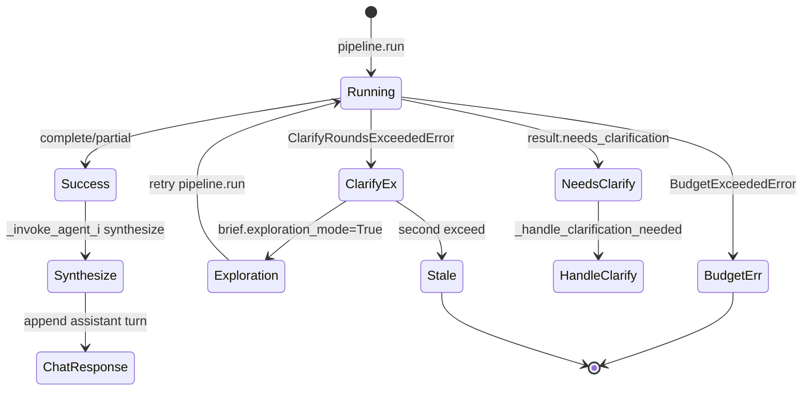

### §Z.4.11.1


**Dòng 424** `    def _run_pipeline_and_respond(` — Định nghĩa phương thức `_run_pipeline_and_respond`; xem khối thân bên dưới để biết side-effect Redis/Mongo/HTTP.
**Dòng 425** `        self,` — Thực thi bước trung gian trong luồng điều phối phiên.
**Dòng 426** `        *,` — Thực thi bước trung gian trong luồng điều phối phiên.
**Dòng 427** `        session_id: str,` — Thực thi bước trung gian trong luồng điều phối phiên.
**Dòng 428** `        analysis_id: str,` — Thực thi bước trung gian trong luồng điều phối phiên.
**Dòng 429** `        brief: AnalysisBrief,` — Thực thi bước trung gian trong luồng điều phối phiên.
**Dòng 430** `        bundle: SessionBundle,` — Thực thi bước trung gian trong luồng điều phối phiên.
**Dòng 431** `        permissions: Any,` — Thực thi bước trung gian trong luồng điều phối phiên.
**Dòng 432** `        invoker: HttpAgentInvoker,` — Thực thi bước trung gian trong luồng điều phối phiên.
**Dòng 433** `        session_budget: SessionTraceBudget,` — Thực thi bước trung gian trong luồng điều phối phiên.
**Dòng 434** `    ) -> ChatResponse:` — Thực thi bước trung gian trong luồng điều phối phiên.
**Dòng 435** `        def on_progress(workflow: Any) -> None:` — Định nghĩa phương thức `on_progress`; xem khối thân bên dưới để biết side-effect Redis/Mongo/HTTP.
**Dòng 436** `            self.stm.save_workflow(session_id, workflow)` — Thao tác trên thuộc tính instance (stm, pipeline, feedback, …); có thể ghi Redis hoặc gọi HTTP gián tiếp.
**Dòng 437** *(dòng trống)* — Ngắt đoạn mã; không thực thi logic.
**Dòng 438** `        deadline = time.monotonic() + float(self.cfg.pipeline.max_sync_seconds)` — Thực thi bước trung gian trong luồng điều phối phiên.
**Dòng 439** `        try:` — Khối bảo vệ gọi agent/budget; lỗi budget → response có `BUDGET_EXCEEDED`.
**Dòng 440** `            result = self.pipeline.run(` — Thực thi bước trung gian trong luồng điều phối phiên.
**Dòng 441** `                brief=brief,` — Thực thi bước trung gian trong luồng điều phối phiên.
**Dòng 442** `                workflow=bundle.workflow,` — Thực thi bước trung gian trong luồng điều phối phiên.
**Dòng 443** `                permissions=permissions,` — Thực thi bước trung gian trong luồng điều phối phiên.
**Dòng 444** `                trace_budget=session_budget.trace_budget,` — Thực thi bước trung gian trong luồng điều phối phiên.
**Dòng 445** `                on_progress=on_progress if self.cfg.pipeline.poll_enabled else None,` — Thực thi bước trung gian trong luồng điều phối phiên.
**Dòng 446** `                deadline=deadline,` — Thực thi bước trung gian trong luồng điều phối phiên.
**Dòng 447** `            )` — Thực thi bước trung gian trong luồng điều phối phiên.
**Dòng 448** `        except ClarifyRoundsExceededError as exc:` — Bắt exception; orchestrator ưu tiên trả `ChatResponse` có `error` thay vì 500.
**Dòng 449** `            brief.exploration_mode = True` — Thực thi bước trung gian trong luồng điều phối phiên.
**Dòng 450** `            brief.user_knowledge_level = "unknown"` — Thực thi bước trung gian trong luồng điều phối phiên.
**Dòng 451** `            bundle.workflow.brief = brief` — Đọc/ghi `SessionBundle` trong bộ nhớ; cần `stm.save_*` để persist.
**Dòng 452** `            resume_analysis(bundle.workflow)` — Thực thi bước trung gian trong luồng điều phối phiên.
**Dòng 453** `            self.stm.save_workflow(session_id, bundle.workflow)` — Thao tác trên thuộc tính instance (stm, pipeline, feedback, …); có thể ghi Redis hoặc gọi HTTP gián tiếp.
**Dòng 454** `            try:` — Khối bảo vệ gọi agent/budget; lỗi budget → response có `BUDGET_EXCEEDED`.
**Dòng 455** `                result = self.pipeline.run(` — Thực thi bước trung gian trong luồng điều phối phiên.
**Dòng 456** `                    brief=brief,` — Thực thi bước trung gian trong luồng điều phối phiên.
**Dòng 457** `                    workflow=bundle.workflow,` — Thực thi bước trung gian trong luồng điều phối phiên.
**Dòng 458** `                    permissions=permissions,` — Thực thi bước trung gian trong luồng điều phối phiên.
**Dòng 459** `                    trace_budget=session_budget.trace_budget,` — Thực thi bước trung gian trong luồng điều phối phiên.
**Dòng 460** `                    on_progress=on_progress if self.cfg.pipeline.poll_enabled else None,` — Thực thi bước trung gian trong luồng điều phối phiên.
**Dòng 461** `                    deadline=deadline,` — Thực thi bước trung gian trong luồng điều phối phiên.
**Dòng 462** `                )` — Thực thi bước trung gian trong luồng điều phối phiên.
**Dòng 463** `            except ClarifyRoundsExceededError:` — Bắt exception; orchestrator ưu tiên trả `ChatResponse` có `error` thay vì 500.
**Dòng 464** `                return ChatResponse(` — Thoát sớm hoặc cuối nhánh; giá trị trả về được `app.py` serialize qua `model_dump()` nếu là `ChatResponse`.
**Dòng 465** `                    session_id=session_id,` — Thực thi bước trung gian trong luồng điều phối phiên.
**Dòng 466** `                    analysis_id=analysis_id,` — Thực thi bước trung gian trong luồng điều phối phiên.
**Dòng 467** `                    workflow_status=WorkflowStatus.STALE.value,` — Thực thi bước trung gian trong luồng điều phối phiên.
**Dòng 468** `                    outcome="error",` — Thực thi bước trung gian trong luồng điều phối phiên.
**Dòng 469** `                    message=str(exc),` — Thực thi bước trung gian trong luồng điều phối phiên.
**Dòng 470** `                    error={"code": "CLARIFY_ROUNDS_EXCEEDED", "retryable": False},` — Thực thi bước trung gian trong luồng điều phối phiên.
**Dòng 471** `                )` — Thực thi bước trung gian trong luồng điều phối phiên.
**Dòng 472** `        except BudgetExceededError as exc:` — Bắt exception; orchestrator ưu tiên trả `ChatResponse` có `error` thay vì 500.
**Dòng 473** `            bundle.workflow.budget_spent = session_budget.trace_budget.spent` — Đọc/ghi `SessionBundle` trong bộ nhớ; cần `stm.save_*` để persist.
**Dòng 474** `            self.stm.save_workflow(session_id, bundle.workflow)` — Thao tác trên thuộc tính instance (stm, pipeline, feedback, …); có thể ghi Redis hoặc gọi HTTP gián tiếp.
**Dòng 475** `            return ChatResponse(` — Thoát sớm hoặc cuối nhánh; giá trị trả về được `app.py` serialize qua `model_dump()` nếu là `ChatResponse`.
**Dòng 476** `                session_id=session_id,` — Thực thi bước trung gian trong luồng điều phối phiên.
**Dòng 477** `                analysis_id=analysis_id,` — Thực thi bước trung gian trong luồng điều phối phiên.
**Dòng 478** `                workflow_status=bundle.workflow.status.value,` — Thực thi bước trung gian trong luồng điều phối phiên.
**Dòng 479** `                outcome="error",` — Thực thi bước trung gian trong luồng điều phối phiên.
**Dòng 480** `                message=str(exc),` — Thực thi bước trung gian trong luồng điều phối phiên.
**Dòng 481** `                error={"code": "BUDGET_EXCEEDED", "retryable": False},` — Thực thi bước trung gian trong luồng điều phối phiên.
**Dòng 482** `            )` — Thực thi bước trung gian trong luồng điều phối phiên.
**Dòng 483** *(dòng trống)* — Ngắt đoạn mã; không thực thi logic.
**Dòng 484** `        bundle.workflow.budget_spent = session_budget.trace_budget.spent` — Đọc/ghi `SessionBundle` trong bộ nhớ; cần `stm.save_*` để persist.
**Dòng 485** *(dòng trống)* — Ngắt đoạn mã; không thực thi logic.
**Dòng 486** `        if result.needs_clarification:` — Phân nhánh điều kiện; quyết định luồng clarify, analysis, hoặc idle.
**Dòng 487** `            return self._handle_clarification_needed(` — Thoát sớm hoặc cuối nhánh; giá trị trả về được `app.py` serialize qua `model_dump()` nếu là `ChatResponse`.
**Dòng 488** `                session_id=session_id,` — Thực thi bước trung gian trong luồng điều phối phiên.
**Dòng 489** `                analysis_id=analysis_id,` — Thực thi bước trung gian trong luồng điều phối phiên.
**Dòng 490** `                result=result,` — Thực thi bước trung gian trong luồng điều phối phiên.
**Dòng 491** `                brief=brief,` — Thực thi bước trung gian trong luồng điều phối phiên.
**Dòng 492** `                bundle=bundle,` — Thực thi bước trung gian trong luồng điều phối phiên.
**Dòng 493** `                permissions=permissions,` — Thực thi bước trung gian trong luồng điều phối phiên.
**Dòng 494** `                invoker=invoker,` — Thực thi bước trung gian trong luồng điều phối phiên.
**Dòng 495** `                session_budget=session_budget,` — Thực thi bước trung gian trong luồng điều phối phiên.
**Dòng 496** `            )` — Thực thi bước trung gian trong luồng điều phối phiên.
**Dòng 497** *(dòng trống)* — Ngắt đoạn mã; không thực thi logic.
**Dòng 498** `        try:` — Khối bảo vệ gọi agent/budget; lỗi budget → response có `BUDGET_EXCEEDED`.
**Dòng 499** `            synth = self._invoke_agent_i(` — Thực thi bước trung gian trong luồng điều phối phiên.
**Dòng 500** `                invoker,` — Thực thi bước trung gian trong luồng điều phối phiên.
**Dòng 501** `                {},` — Thực thi bước trung gian trong luồng điều phối phiên.
**Dòng 502** `                {` — Thực thi bước trung gian trong luồng điều phối phiên.
**Dòng 503** `                    "mode": "synthesize",` — Thực thi bước trung gian trong luồng điều phối phiên.
**Dòng 504** `                    "session_id": session_id,` — Thực thi bước trung gian trong luồng điều phối phiên.
**Dòng 505** `                    "actor_id": permissions.actor_id,` — Thực thi bước trung gian trong luồng điều phối phiên.
**Dòng 506** `                    "technical_summary": result.technical_summary.model_dump(),` — Thực thi bước trung gian trong luồng điều phối phiên.
**Dòng 507** `                },` — Thực thi bước trung gian trong luồng điều phối phiên.
**Dòng 508** `                session_budget,` — Thực thi bước trung gian trong luồng điều phối phiên.
**Dòng 509** `                bundle,` — Thực thi bước trung gian trong luồng điều phối phiên.
**Dòng 510** `            )` — Thực thi bước trung gian trong luồng điều phối phiên.
**Dòng 511** `        except BudgetExceededError as exc:` — Bắt exception; orchestrator ưu tiên trả `ChatResponse` có `error` thay vì 500.
**Dòng 512** `            bundle.workflow.budget_spent = session_budget.trace_budget.spent` — Đọc/ghi `SessionBundle` trong bộ nhớ; cần `stm.save_*` để persist.
**Dòng 513** `            self.stm.save_workflow(session_id, bundle.workflow)` — Thao tác trên thuộc tính instance (stm, pipeline, feedback, …); có thể ghi Redis hoặc gọi HTTP gián tiếp.
**Dòng 514** `            return ChatResponse(` — Thoát sớm hoặc cuối nhánh; giá trị trả về được `app.py` serialize qua `model_dump()` nếu là `ChatResponse`.
**Dòng 515** `                session_id=session_id,` — Thực thi bước trung gian trong luồng điều phối phiên.
**Dòng 516** `                analysis_id=analysis_id,` — Thực thi bước trung gian trong luồng điều phối phiên.
**Dòng 517** `                trace_id=result.trace_id,` — Thực thi bước trung gian trong luồng điều phối phiên.
**Dòng 518** `                workflow_status=bundle.workflow.status.value,` — Thực thi bước trung gian trong luồng điều phối phiên.
**Dòng 519** `                outcome=result.outcome,` — Thực thi bước trung gian trong luồng điều phối phiên.
**Dòng 520** `                message=result.technical_summary.outcome,` — Thực thi bước trung gian trong luồng điều phối phiên.
**Dòng 521** `                error={"code": "BUDGET_EXCEEDED", "retryable": False},` — Thực thi bước trung gian trong luồng điều phối phiên.
**Dòng 522** `            )` — Thực thi bước trung gian trong luồng điều phối phiên.
**Dòng 523** *(dòng trống)* — Ngắt đoạn mã; không thực thi logic.
**Dòng 524** `        assistant = TranscriptTurn(` — Thực thi bước trung gian trong luồng điều phối phiên.
**Dòng 525** `            id=str(uuid4()),` — Thực thi bước trung gian trong luồng điều phối phiên.
**Dòng 526** `            role="assistant",` — Thực thi bước trung gian trong luồng điều phối phiên.
**Dòng 527** `            content=synth.get("user_message", ""),` — Thực thi bước trung gian trong luồng điều phối phiên.
**Dòng 528** `            at=utc_now().isoformat(),` — Thực thi bước trung gian trong luồng điều phối phiên.
**Dòng 529** `            analysis_id=analysis_id,` — Thực thi bước trung gian trong luồng điều phối phiên.
**Dòng 530** `            trace_id=result.trace_id,` — Thực thi bước trung gian trong luồng điều phối phiên.
**Dòng 531** `        )` — Thực thi bước trung gian trong luồng điều phối phiên.
**Dòng 532** `        bundle.transcript.append(assistant)` — Đọc/ghi `SessionBundle` trong bộ nhớ; cần `stm.save_*` để persist.
**Dòng 533** `        self.stm.save_transcript(session_id, bundle.transcript)` — Thao tác trên thuộc tính instance (stm, pipeline, feedback, …); có thể ghi Redis hoặc gọi HTTP gián tiếp.
**Dòng 534** `        self.stm.save_workflow(session_id, bundle.workflow)` — Thao tác trên thuộc tính instance (stm, pipeline, feedback, …); có thể ghi Redis hoặc gọi HTTP gián tiếp.
**Dòng 535** `        return ChatResponse(` — Thoát sớm hoặc cuối nhánh; giá trị trả về được `app.py` serialize qua `model_dump()` nếu là `ChatResponse`.
**Dòng 536** `            session_id=session_id,` — Thực thi bước trung gian trong luồng điều phối phiên.
**Dòng 537** `            analysis_id=analysis_id,` — Thực thi bước trung gian trong luồng điều phối phiên.
**Dòng 538** `            trace_id=result.trace_id,` — Thực thi bước trung gian trong luồng điều phối phiên.
**Dòng 539** `            workflow_status=bundle.workflow.status.value,` — Thực thi bước trung gian trong luồng điều phối phiên.
**Dòng 540** `            outcome=result.outcome,` — Thực thi bước trung gian trong luồng điều phối phiên.
**Dòng 541** `            message=synth.get("user_message", ""),` — Thực thi bước trung gian trong luồng điều phối phiên.
**Dòng 542** `            artifacts=[{"url": u} for u in result.technical_summary.artifact_urls],` — Thực thi bước trung gian trong luồng điều phối phiên.
**Dòng 543** `        )` — Thực thi bước trung gian trong luồng điều phối phiên.
### §Z.4.12 — `_handle_clarification_needed` (dòng 545–648)

Pipeline trả NEEDS_CLARIFICATION: thử bridge tự resolve từ transcript; nếu không → Agent I clarify → suspend AWAITING_CLARIFICATION.

### §Z.4.12.1


**Dòng 545** `    def _handle_clarification_needed(` — Định nghĩa phương thức `_handle_clarification_needed`; xem khối thân bên dưới để biết side-effect Redis/Mongo/HTTP.
**Dòng 546** `        self,` — Thực thi bước trung gian trong luồng điều phối phiên.
**Dòng 547** `        *,` — Thực thi bước trung gian trong luồng điều phối phiên.
**Dòng 548** `        session_id: str,` — Thực thi bước trung gian trong luồng điều phối phiên.
**Dòng 549** `        analysis_id: str,` — Thực thi bước trung gian trong luồng điều phối phiên.
**Dòng 550** `        result: Any,` — Thực thi bước trung gian trong luồng điều phối phiên.
**Dòng 551** `        brief: AnalysisBrief,` — Thực thi bước trung gian trong luồng điều phối phiên.
**Dòng 552** `        bundle: SessionBundle,` — Thực thi bước trung gian trong luồng điều phối phiên.
**Dòng 553** `        permissions: Any,` — Thực thi bước trung gian trong luồng điều phối phiên.
**Dòng 554** `        invoker: HttpAgentInvoker,` — Thực thi bước trung gian trong luồng điều phối phiên.
**Dòng 555** `        session_budget: SessionTraceBudget,` — Thực thi bước trung gian trong luồng điều phối phiên.
**Dòng 556** `    ) -> ChatResponse:` — Thực thi bước trung gian trong luồng điều phối phiên.
**Dòng 557** `        assert result.needs_clarification is not None` — Thực thi bước trung gian trong luồng điều phối phiên.
**Dòng 558** `        try:` — Khối bảo vệ gọi agent/budget; lỗi budget → response có `BUDGET_EXCEEDED`.
**Dòng 559** `            bridge = self._invoke_agent_i(` — Thực thi bước trung gian trong luồng điều phối phiên.
**Dòng 560** `                invoker,` — Thực thi bước trung gian trong luồng điều phối phiên.
**Dòng 561** `                {},` — Thực thi bước trung gian trong luồng điều phối phiên.
**Dòng 562** `                {` — Thực thi bước trung gian trong luồng điều phối phiên.
**Dòng 563** `                    "mode": "clarification_bridge",` — Thực thi bước trung gian trong luồng điều phối phiên.
**Dòng 564** `                    "session_id": session_id,` — Thực thi bước trung gian trong luồng điều phối phiên.
**Dòng 565** `                    "actor_id": permissions.actor_id,` — Thực thi bước trung gian trong luồng điều phối phiên.
**Dòng 566** `                    "clarification_request": result.needs_clarification.model_dump(),` — Thực thi bước trung gian trong luồng điều phối phiên.
**Dòng 567** `                    "transcript": [t.model_dump() for t in bundle.transcript],` — Thực thi bước trung gian trong luồng điều phối phiên.
**Dòng 568** `                },` — Thực thi bước trung gian trong luồng điều phối phiên.
**Dòng 569** `                session_budget,` — Thực thi bước trung gian trong luồng điều phối phiên.
**Dòng 570** `                bundle,` — Thực thi bước trung gian trong luồng điều phối phiên.
**Dòng 571** `            )` — Thực thi bước trung gian trong luồng điều phối phiên.
**Dòng 572** `        except BudgetExceededError as exc:` — Bắt exception; orchestrator ưu tiên trả `ChatResponse` có `error` thay vì 500.
**Dòng 573** `            bundle.workflow.budget_spent = session_budget.trace_budget.spent` — Đọc/ghi `SessionBundle` trong bộ nhớ; cần `stm.save_*` để persist.
**Dòng 574** `            self.stm.save_workflow(session_id, bundle.workflow)` — Thao tác trên thuộc tính instance (stm, pipeline, feedback, …); có thể ghi Redis hoặc gọi HTTP gián tiếp.
**Dòng 575** `            return ChatResponse(` — Thoát sớm hoặc cuối nhánh; giá trị trả về được `app.py` serialize qua `model_dump()` nếu là `ChatResponse`.
**Dòng 576** `                session_id=session_id,` — Thực thi bước trung gian trong luồng điều phối phiên.
**Dòng 577** `                analysis_id=analysis_id,` — Thực thi bước trung gian trong luồng điều phối phiên.
**Dòng 578** `                trace_id=result.trace_id,` — Thực thi bước trung gian trong luồng điều phối phiên.
**Dòng 579** `                workflow_status=WorkflowStatus.AWAITING_CLARIFICATION.value,` — Thực thi bước trung gian trong luồng điều phối phiên.
**Dòng 580** `                outcome=result.outcome,` — Thực thi bước trung gian trong luồng điều phối phiên.
**Dòng 581** `                message=str(exc),` — Thực thi bước trung gian trong luồng điều phối phiên.
**Dòng 582** `                error={"code": "BUDGET_EXCEEDED", "retryable": False},` — Thực thi bước trung gian trong luồng điều phối phiên.
**Dòng 583** `            )` — Thực thi bước trung gian trong luồng điều phối phiên.
**Dòng 584** *(dòng trống)* — Ngắt đoạn mã; không thực thi logic.
**Dòng 585** `        if bridge.get("action") == "resolve_from_transcript":` — Phân nhánh điều kiện; quyết định luồng clarify, analysis, hoặc idle.
**Dòng 586** `            brief, should_rerun = self.clarify.on_pipeline_clarify(` — Thực thi bước trung gian trong luồng điều phối phiên.
**Dòng 587** `                result=result,` — Thực thi bước trung gian trong luồng điều phối phiên.
**Dòng 588** `                brief=brief,` — Thực thi bước trung gian trong luồng điều phối phiên.
**Dòng 589** `                bridge=bridge,` — Thực thi bước trung gian trong luồng điều phối phiên.
**Dòng 590** `                analysis_id=analysis_id,` — Thực thi bước trung gian trong luồng điều phối phiên.
**Dòng 591** `            )` — Thực thi bước trung gian trong luồng điều phối phiên.
**Dòng 592** `            if should_rerun:` — Phân nhánh điều kiện; quyết định luồng clarify, analysis, hoặc idle.
**Dòng 593** `                bundle.workflow.brief = brief` — Đọc/ghi `SessionBundle` trong bộ nhớ; cần `stm.save_*` để persist.
**Dòng 594** `                resume_analysis(bundle.workflow)` — Thực thi bước trung gian trong luồng điều phối phiên.
**Dòng 595** `                bundle.workflow.budget_spent = session_budget.trace_budget.spent` — Đọc/ghi `SessionBundle` trong bộ nhớ; cần `stm.save_*` để persist.
**Dòng 596** `                self.stm.save_workflow(session_id, bundle.workflow)` — Thao tác trên thuộc tính instance (stm, pipeline, feedback, …); có thể ghi Redis hoặc gọi HTTP gián tiếp.
**Dòng 597** `                return self._run_pipeline_and_respond(` — Thoát sớm hoặc cuối nhánh; giá trị trả về được `app.py` serialize qua `model_dump()` nếu là `ChatResponse`.
**Dòng 598** `                    session_id=session_id,` — Thực thi bước trung gian trong luồng điều phối phiên.
**Dòng 599** `                    analysis_id=analysis_id,` — Thực thi bước trung gian trong luồng điều phối phiên.
**Dòng 600** `                    brief=brief,` — Thực thi bước trung gian trong luồng điều phối phiên.
**Dòng 601** `                    bundle=bundle,` — Thực thi bước trung gian trong luồng điều phối phiên.
**Dòng 602** `                    permissions=permissions,` — Thực thi bước trung gian trong luồng điều phối phiên.
**Dòng 603** `                    invoker=invoker,` — Thực thi bước trung gian trong luồng điều phối phiên.
**Dòng 604** `                    session_budget=session_budget,` — Thực thi bước trung gian trong luồng điều phối phiên.
**Dòng 605** `                )` — Thực thi bước trung gian trong luồng điều phối phiên.
**Dòng 606** *(dòng trống)* — Ngắt đoạn mã; không thực thi logic.
**Dòng 607** `        try:` — Khối bảo vệ gọi agent/budget; lỗi budget → response có `BUDGET_EXCEEDED`.
**Dòng 608** `            clarify = self._invoke_agent_i(` — Thực thi bước trung gian trong luồng điều phối phiên.
**Dòng 609** `                invoker,` — Thực thi bước trung gian trong luồng điều phối phiên.
**Dòng 610** `                {},` — Thực thi bước trung gian trong luồng điều phối phiên.
**Dòng 611** `                {` — Thực thi bước trung gian trong luồng điều phối phiên.
**Dòng 612** `                    "mode": "clarify",` — Thực thi bước trung gian trong luồng điều phối phiên.
**Dòng 613** `                    "session_id": session_id,` — Thực thi bước trung gian trong luồng điều phối phiên.
**Dòng 614** `                    "actor_id": permissions.actor_id,` — Thực thi bước trung gian trong luồng điều phối phiên.
**Dòng 615** `                    "clarification_request": result.needs_clarification.model_dump(),` — Thực thi bước trung gian trong luồng điều phối phiên.
**Dòng 616** `                },` — Thực thi bước trung gian trong luồng điều phối phiên.
**Dòng 617** `                session_budget,` — Thực thi bước trung gian trong luồng điều phối phiên.
**Dòng 618** `                bundle,` — Thực thi bước trung gian trong luồng điều phối phiên.
**Dòng 619** `            )` — Thực thi bước trung gian trong luồng điều phối phiên.
**Dòng 620** `        except BudgetExceededError as exc:` — Bắt exception; orchestrator ưu tiên trả `ChatResponse` có `error` thay vì 500.
**Dòng 621** `            bundle.workflow.budget_spent = session_budget.trace_budget.spent` — Đọc/ghi `SessionBundle` trong bộ nhớ; cần `stm.save_*` để persist.
**Dòng 622** `            self.stm.save_workflow(session_id, bundle.workflow)` — Thao tác trên thuộc tính instance (stm, pipeline, feedback, …); có thể ghi Redis hoặc gọi HTTP gián tiếp.
**Dòng 623** `            return ChatResponse(` — Thoát sớm hoặc cuối nhánh; giá trị trả về được `app.py` serialize qua `model_dump()` nếu là `ChatResponse`.
**Dòng 624** `                session_id=session_id,` — Thực thi bước trung gian trong luồng điều phối phiên.
**Dòng 625** `                analysis_id=analysis_id,` — Thực thi bước trung gian trong luồng điều phối phiên.
**Dòng 626** `                trace_id=result.trace_id,` — Thực thi bước trung gian trong luồng điều phối phiên.
**Dòng 627** `                workflow_status=WorkflowStatus.AWAITING_CLARIFICATION.value,` — Thực thi bước trung gian trong luồng điều phối phiên.
**Dòng 628** `                outcome=result.outcome,` — Thực thi bước trung gian trong luồng điều phối phiên.
**Dòng 629** `                message=str(exc),` — Thực thi bước trung gian trong luồng điều phối phiên.
**Dòng 630** `                error={"code": "BUDGET_EXCEEDED", "retryable": False},` — Thực thi bước trung gian trong luồng điều phối phiên.
**Dòng 631** `            )` — Thực thi bước trung gian trong luồng điều phối phiên.
**Dòng 632** *(dòng trống)* — Ngắt đoạn mã; không thực thi logic.
**Dòng 633** `        bundle.workflow.budget_spent = session_budget.trace_budget.spent` — Đọc/ghi `SessionBundle` trong bộ nhớ; cần `stm.save_*` để persist.
**Dòng 634** `        self.stm.save_clarification(session_id, result.needs_clarification.model_dump())` — Thao tác trên thuộc tính instance (stm, pipeline, feedback, …); có thể ghi Redis hoặc gọi HTTP gián tiếp.
**Dòng 635** `        self.stm.save_workflow(session_id, bundle.workflow)` — Thao tác trên thuộc tính instance (stm, pipeline, feedback, …); có thể ghi Redis hoặc gọi HTTP gián tiếp.
**Dòng 636** `        return self.clarify.suspend_response(` — Thoát sớm hoặc cuối nhánh; giá trị trả về được `app.py` serialize qua `model_dump()` nếu là `ChatResponse`.
**Dòng 637** `            session_id=session_id,` — Thực thi bước trung gian trong luồng điều phối phiên.
**Dòng 638** `            analysis_id=analysis_id,` — Thực thi bước trung gian trong luồng điều phối phiên.
**Dòng 639** `            request=result.needs_clarification,` — Thực thi bước trung gian trong luồng điều phối phiên.
**Dòng 640** `            clarify_payload=clarify,` — Thực thi bước trung gian trong luồng điều phối phiên.
**Dòng 641** `            workflow_status=WorkflowStatus.AWAITING_CLARIFICATION.value,` — Thực thi bước trung gian trong luồng điều phối phiên.
**Dòng 642** `        ).model_copy(` — Thực thi bước trung gian trong luồng điều phối phiên.
**Dòng 643** `            update={` — Thực thi bước trung gian trong luồng điều phối phiên.
**Dòng 644** `                "trace_id": result.trace_id,` — Thực thi bước trung gian trong luồng điều phối phiên.
**Dòng 645** `                "outcome": result.outcome,` — Thực thi bước trung gian trong luồng điều phối phiên.
**Dòng 646** `                "bridge_action": "ask_user",` — Thực thi bước trung gian trong luồng điều phối phiên.
**Dòng 647** `            }` — Thực thi bước trung gian trong luồng điều phối phiên.
**Dòng 648** `        )` — Thực thi bước trung gian trong luồng điều phối phiên.
### §Z.4.13 — `app.py`: vòng đời request và middleware ẩn

FastAPI không định nghĩa middleware tùy chỉnh trong mã; thay vào đó dùng **exception handler**, **Depends injection**, và **lazy singleton**. Phần này mô tả thứ tự thực thi thực tế trên mỗi request — khác với bảng route §Z.2.5.

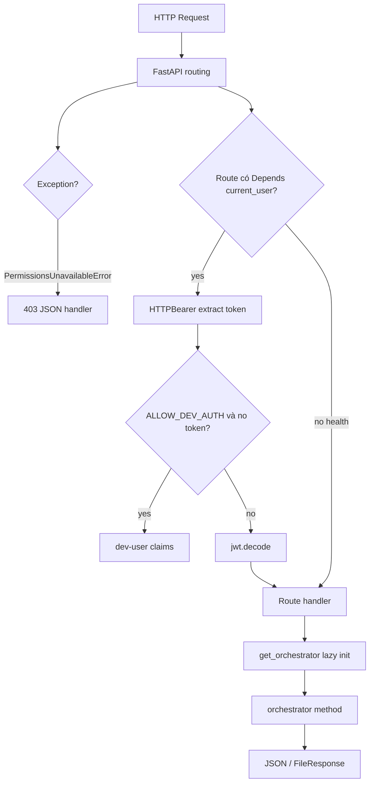

**app.py dòng 1** `from __future__ import annotations` — Bootstrap: `load_project_env()` trước import orchestrator để biến môi trường sẵn sàng.
**app.py dòng 2** *(trống)*
**app.py dòng 3** `import os` — Bootstrap: `load_project_env()` trước import orchestrator để biến môi trường sẵn sàng.
**app.py dòng 4** `from pathlib import Path` — Bootstrap: `load_project_env()` trước import orchestrator để biến môi trường sẵn sàng.
**app.py dòng 5** `from typing import Any` — Bootstrap: `load_project_env()` trước import orchestrator để biến môi trường sẵn sàng.
**app.py dòng 6** *(trống)*
**app.py dòng 7** `from fastapi import Depends, FastAPI, File, HTTPException, Request, UploadFile` — Bootstrap: `load_project_env()` trước import orchestrator để biến môi trường sẵn sàng.
**app.py dòng 8** `from fastapi.responses import FileResponse, JSONResponse` — Bootstrap: `load_project_env()` trước import orchestrator để biến môi trường sẵn sàng.
**app.py dòng 9** `from pydantic import BaseModel` — Bootstrap: `load_project_env()` trước import orchestrator để biến môi trường sẵn sàng.
**app.py dòng 10** *(trống)*
**app.py dòng 11** `from project_core.config.env import load_project_env` — Bootstrap: `load_project_env()` trước import orchestrator để biến môi trường sẵn sàng.
**app.py dòng 12** `from project_core.domain.contracts.clarification import ClarificationReply` — Bootstrap: `load_project_env()` trước import orchestrator để biến môi trường sẵn sàng.
**app.py dòng 13** `from project_core.domain.contracts.feedback import FeedbackRecord` — Bootstrap: `load_project_env()` trước import orchestrator để biến môi trường sẵn sàng.
**app.py dòng 14** `from project_core.domain.errors.codes import PermissionsUnavailableError` — Bootstrap: `load_project_env()` trước import orchestrator để biến môi trường sẵn sàng.
**app.py dòng 15** `from project_core.ingest.attachments import ingest_file` — Bootstrap: `load_project_env()` trước import orchestrator để biến môi trường sẵn sàng.
**app.py dòng 16** *(trống)*
**app.py dòng 17** `from chat_gateway.auth import current_user, issue_token` — Bootstrap: `load_project_env()` trước import orchestrator để biến môi trường sẵn sàng.
**app.py dòng 18** `from chat_gateway.orchestrator import ChatOrchestrator` — Bootstrap: `load_project_env()` trước import orchestrator để biến môi trường sẵn sàng.
**app.py dòng 19** *(trống)*
**app.py dòng 20** `load_project_env()` — Bootstrap: `load_project_env()` trước import orchestrator để biến môi trường sẵn sàng.
**app.py dòng 21** *(trống)*
**app.py dòng 22** `app = FastAPI(title="chat-gateway")` — Bootstrap: `load_project_env()` trước import orchestrator để biến môi trường sẵn sàng.
**app.py dòng 23** *(trống)*
**app.py dòng 24** *(trống)*
**app.py dòng 25** `@app.exception_handler(PermissionsUnavailableError)` — Exception handler toàn cục; chuyển `PermissionsUnavailableError` thành 403 thay vì stack trace.
**app.py dòng 26** `async def _permissions_unavailable_handler(` — Exception handler toàn cục; chuyển `PermissionsUnavailableError` thành 403 thay vì stack trace.
**app.py dòng 27** `    _request: Request, exc: PermissionsUnavailableError` — Exception handler toàn cục; chuyển `PermissionsUnavailableError` thành 403 thay vì stack trace.
**app.py dòng 28** `) -> JSONResponse:` — Exception handler toàn cục; chuyển `PermissionsUnavailableError` thành 403 thay vì stack trace.
**app.py dòng 29** `    return JSONResponse(` — Exception handler toàn cục; chuyển `PermissionsUnavailableError` thành 403 thay vì stack trace.
**app.py dòng 30** `        status_code=403,` — Exception handler toàn cục; chuyển `PermissionsUnavailableError` thành 403 thay vì stack trace.
**app.py dòng 31** `        content={"detail": "permissions_unavailable", "code": exc.code},` — Exception handler toàn cục; chuyển `PermissionsUnavailableError` thành 403 thay vì stack trace.
**app.py dòng 32** `    )` — Exception handler toàn cục; chuyển `PermissionsUnavailableError` thành 403 thay vì stack trace.
**app.py dòng 33** `_orchestrator: ChatOrchestrator | None = None` — Exception handler toàn cục; chuyển `PermissionsUnavailableError` thành 403 thay vì stack trace.
**app.py dòng 34** *(trống)*
**app.py dòng 35** *(trống)*
**app.py dòng 36** `def get_orchestrator() -> ChatOrchestrator:` — Singleton pattern; worker uvicorn giữ một orchestrator — Mongo/Redis init một lần.
**app.py dòng 37** `    global _orchestrator` — Singleton pattern; worker uvicorn giữ một orchestrator — Mongo/Redis init một lần.
**app.py dòng 38** `    if _orchestrator is None:` — Singleton pattern; worker uvicorn giữ một orchestrator — Mongo/Redis init một lần.
**app.py dòng 39** `        _orchestrator = ChatOrchestrator()` — Singleton pattern; worker uvicorn giữ một orchestrator — Mongo/Redis init một lần.
**app.py dòng 40** `    return _orchestrator` — Singleton pattern; worker uvicorn giữ một orchestrator — Mongo/Redis init một lần.
**app.py dòng 41** *(trống)*
**app.py dòng 42** *(trống)*
**app.py dòng 43** `class ChatRequest(BaseModel):` — Schema Pydantic validate body trước handler; lỗi 422 tự động FastAPI.
**app.py dòng 44** `    session_id: str` — Schema Pydantic validate body trước handler; lỗi 422 tự động FastAPI.
**app.py dòng 45** `    message: str` — Schema Pydantic validate body trước handler; lỗi 422 tự động FastAPI.
**app.py dòng 46** *(trống)*
**app.py dòng 47** *(trống)*
**app.py dòng 48** `class ClarifyRequest(BaseModel):` — Schema Pydantic validate body trước handler; lỗi 422 tự động FastAPI.
**app.py dòng 49** `    session_id: str` — Schema Pydantic validate body trước handler; lỗi 422 tự động FastAPI.
**app.py dòng 50** `    reply: ClarificationReply` — Schema Pydantic validate body trước handler; lỗi 422 tự động FastAPI.
**app.py dòng 51** *(trống)*
**app.py dòng 52** *(trống)*
**app.py dòng 53** `class FeedbackRequest(BaseModel):` — Schema Pydantic validate body trước handler; lỗi 422 tự động FastAPI.
**app.py dòng 54** `    session_id: str` — Schema Pydantic validate body trước handler; lỗi 422 tự động FastAPI.
**app.py dòng 55** `    analysis_id: str` — Schema Pydantic validate body trước handler; lỗi 422 tự động FastAPI.
**app.py dòng 56** `    trace_id: str` — Schema Pydantic validate body trước handler; lỗi 422 tự động FastAPI.
**app.py dòng 57** `    sentiment: str` — Schema Pydantic validate body trước handler; lỗi 422 tự động FastAPI.
**app.py dòng 58** `    comment: str | None = None` — Schema Pydantic validate body trước handler; lỗi 422 tự động FastAPI.
**app.py dòng 59** *(trống)*
**app.py dòng 60** *(trống)*
**app.py dòng 61** `class DomainRuleConfirmRequest(BaseModel):` — Schema Pydantic validate body trước handler; lỗi 422 tự động FastAPI.
**app.py dòng 62** `    rule_id: str` — Schema Pydantic validate body trước handler; lỗi 422 tự động FastAPI.
**app.py dòng 63** `    confirmed: bool = True` — Schema Pydantic validate body trước handler; lỗi 422 tự động FastAPI.
**app.py dòng 64** *(trống)*
**app.py dòng 65** *(trống)*
**app.py dòng 66** `class DevLoginRequest(BaseModel):` — Schema Pydantic validate body trước handler; lỗi 422 tự động FastAPI.
**app.py dòng 67** `    actor_id: str = "dev-user"` — Schema Pydantic validate body trước handler; lỗi 422 tự động FastAPI.
**app.py dòng 68** `    role: str = "hq_analyst"` — Schema Pydantic validate body trước handler; lỗi 422 tự động FastAPI.
**app.py dòng 69** *(trống)*
**app.py dòng 70** *(trống)*
**app.py dòng 71** `class LoginRequest(BaseModel):` — Schema Pydantic validate body trước handler; lỗi 422 tự động FastAPI.
**app.py dòng 72** `    username: str` — Schema Pydantic validate body trước handler; lỗi 422 tự động FastAPI.
**app.py dòng 73** `    password: str` — Schema Pydantic validate body trước handler; lỗi 422 tự động FastAPI.
**app.py dòng 74** *(trống)*
**app.py dòng 75** *(trống)*
**app.py dòng 76** `@app.get("/health")` — Route không auth; phù hợp probe nông.
**app.py dòng 77** `def health() -> dict:`
**app.py dòng 78** `    return {"ok": True, "redis": True, "mongo": get_orchestrator().feedback is not None, "agents": {}}`
**app.py dòng 79** *(trống)*
**app.py dòng 80** *(trống)*
**app.py dòng 81** `@app.get("/health/live")` — Health tier: live vs ready; ready mới ping Redis và agent URLs.
**app.py dòng 82** `def health_live() -> dict[str, bool]:`
**app.py dòng 83** `    return {"ok": True}`
**app.py dòng 84** *(trống)*
**app.py dòng 85** *(trống)*
**app.py dòng 86** `@app.get("/health/ready")` — Health tier: live vs ready; ready mới ping Redis và agent URLs.
**app.py dòng 87** `def health_ready() -> dict:`
**app.py dòng 88** `    import httpx`
**app.py dòng 89** *(trống)*
**app.py dòng 90** `    orch = get_orchestrator()`
**app.py dòng 91** `    agents: dict[str, str] = {}`
**app.py dòng 92** `    for key, url in orch.pipeline.agent_invoker.urls.items():  # type: ignore[attr-defined]`
**app.py dòng 93** `        try:`
**app.py dòng 94** `            resp = httpx.get(f"{url}/health", timeout=2.0)`
**app.py dòng 95** `            agents[key] = "ok" if resp.status_code == 200 else "error"`
**app.py dòng 96** `        except Exception:`
**app.py dòng 97** `            agents[key] = "error"`
**app.py dòng 98** `    redis_ok = True`
**app.py dòng 99** `    try:`
**app.py dòng 100** `        orch.stm.client.ping()  # type: ignore[attr-defined]`
**app.py dòng 101** `    except Exception:`
**app.py dòng 102** `        redis_ok = False`
**app.py dòng 103** `    mongo_ok = orch.feedback is not None`
**app.py dòng 104** `    return {"ok": redis_ok and mongo_ok, "redis": redis_ok, "mongo": mongo_ok, "agents": agents}`
**app.py dòng 105** *(trống)*
**app.py dòng 106** *(trống)*
**app.py dòng 107** `@app.post("/auth/dev-login")` — Nhánh auth: dev-login gated bởi ALLOW_DEV_AUTH; login thật qua auth_store.authenticate.
**app.py dòng 108** `def dev_login(body: DevLoginRequest) -> dict[str, str]:` — Nhánh auth: dev-login gated bởi ALLOW_DEV_AUTH; login thật qua auth_store.authenticate.
**app.py dòng 109** `    if os.getenv("ALLOW_DEV_AUTH") != "1":` — Nhánh auth: dev-login gated bởi ALLOW_DEV_AUTH; login thật qua auth_store.authenticate.
**app.py dòng 110** `        raise HTTPException(status_code=403, detail="dev_auth_disabled")` — Nhánh auth: dev-login gated bởi ALLOW_DEV_AUTH; login thật qua auth_store.authenticate.
**app.py dòng 111** `    token = issue_token(body.actor_id, body.role)` — Nhánh auth: dev-login gated bởi ALLOW_DEV_AUTH; login thật qua auth_store.authenticate.
**app.py dòng 112** `    return {"access_token": token, "token_type": "bearer"}` — Nhánh auth: dev-login gated bởi ALLOW_DEV_AUTH; login thật qua auth_store.authenticate.
**app.py dòng 113** *(trống)*
**app.py dòng 114** *(trống)*
**app.py dòng 115** `@app.post("/auth/login")` — Nhánh auth: dev-login gated bởi ALLOW_DEV_AUTH; login thật qua auth_store.authenticate.
**app.py dòng 116** `def login(body: LoginRequest) -> dict[str, str]:` — Nhánh auth: dev-login gated bởi ALLOW_DEV_AUTH; login thật qua auth_store.authenticate.
**app.py dòng 117** `    from chat_gateway.auth_store import authenticate` — Nhánh auth: dev-login gated bởi ALLOW_DEV_AUTH; login thật qua auth_store.authenticate.
**app.py dòng 118** *(trống)*
**app.py dòng 119** `    user = authenticate(body.username, body.password)` — Nhánh auth: dev-login gated bởi ALLOW_DEV_AUTH; login thật qua auth_store.authenticate.
**app.py dòng 120** `    if user is None:` — Nhánh auth: dev-login gated bởi ALLOW_DEV_AUTH; login thật qua auth_store.authenticate.
**app.py dòng 121** `        raise HTTPException(status_code=401, detail="invalid_credentials")` — Nhánh auth: dev-login gated bởi ALLOW_DEV_AUTH; login thật qua auth_store.authenticate.
**app.py dòng 122** `    token = issue_token(user.user_id, user.role, user.store_ids)` — Nhánh auth: dev-login gated bởi ALLOW_DEV_AUTH; login thật qua auth_store.authenticate.
**app.py dòng 123** `    return {` — Nhánh auth: dev-login gated bởi ALLOW_DEV_AUTH; login thật qua auth_store.authenticate.
**app.py dòng 124** `        "access_token": token,` — Nhánh auth: dev-login gated bởi ALLOW_DEV_AUTH; login thật qua auth_store.authenticate.
**app.py dòng 125** `        "token_type": "bearer",` — Nhánh auth: dev-login gated bởi ALLOW_DEV_AUTH; login thật qua auth_store.authenticate.
**app.py dòng 126** `        "role": user.role,` — Nhánh auth: dev-login gated bởi ALLOW_DEV_AUTH; login thật qua auth_store.authenticate.
**app.py dòng 127** `        "display_name": user.display_name,` — Nhánh auth: dev-login gated bởi ALLOW_DEV_AUTH; login thật qua auth_store.authenticate.
**app.py dòng 128** `    }` — Nhánh auth: dev-login gated bởi ALLOW_DEV_AUTH; login thật qua auth_store.authenticate.
**app.py dòng 129** *(trống)*
**app.py dòng 130** *(trống)*
**app.py dòng 131** `@app.get("/auth/login")` — OAuth stub/local/azure; callback trả JWT nội bộ.
**app.py dòng 132** `def oauth_login() -> dict[str, str]:` — OAuth stub/local/azure; callback trả JWT nội bộ.
**app.py dòng 133** `    from chat_gateway.oauth import oauth_provider_from_env` — OAuth stub/local/azure; callback trả JWT nội bộ.
**app.py dòng 134** *(trống)*
**app.py dòng 135** `    provider = oauth_provider_from_env()` — OAuth stub/local/azure; callback trả JWT nội bộ.
**app.py dòng 136** `    state = "dev"` — OAuth stub/local/azure; callback trả JWT nội bộ.
**app.py dòng 137** `    return {"authorization_url": provider.authorization_url(state)}` — OAuth stub/local/azure; callback trả JWT nội bộ.
**app.py dòng 138** *(trống)*
**app.py dòng 139** *(trống)*
**app.py dòng 140** `@app.get("/auth/callback")` — OAuth stub/local/azure; callback trả JWT nội bộ.
**app.py dòng 141** `def oauth_callback(code: str) -> dict[str, Any]:` — OAuth stub/local/azure; callback trả JWT nội bộ.
**app.py dòng 142** `    from chat_gateway.oauth import oauth_provider_from_env` — OAuth stub/local/azure; callback trả JWT nội bộ.
**app.py dòng 143** *(trống)*
**app.py dòng 144** `    return oauth_provider_from_env().exchange_code(code)` — OAuth stub/local/azure; callback trả JWT nội bộ.
**app.py dòng 145** *(trống)*
**app.py dòng 146** *(trống)*
**app.py dòng 147** `@app.post("/chat")` — `/chat`: Depends(current_user) bắt buộc trừ dev; model_dump flatten ChatResponse.
**app.py dòng 148** `def chat(body: ChatRequest, user: dict[str, Any] = Depends(current_user)) -> dict[str, Any]:` — `/chat`: Depends(current_user) bắt buộc trừ dev; model_dump flatten ChatResponse.
**app.py dòng 149** `    resp = get_orchestrator().handle_chat(session_id=body.session_id, message=body.message, user=user)` — `/chat`: Depends(current_user) bắt buộc trừ dev; model_dump flatten ChatResponse.
**app.py dòng 150** `    return resp.model_dump()` — `/chat`: Depends(current_user) bắt buộc trừ dev; model_dump flatten ChatResponse.
**app.py dòng 151** *(trống)*
**app.py dòng 152** *(trống)*
**app.py dòng 153** `@app.post("/chat/clarify")` — `/chat/clarify`: cùng auth; reply là ClarificationReply typed.
**app.py dòng 154** `def chat_clarify(body: ClarifyRequest, user: dict[str, Any] = Depends(current_user)) -> dict[str, Any]:` — `/chat/clarify`: cùng auth; reply là ClarificationReply typed.
**app.py dòng 155** `    resp = get_orchestrator().handle_clarify(session_id=body.session_id, reply=body.reply, user=user)` — `/chat/clarify`: cùng auth; reply là ClarificationReply typed.
**app.py dòng 156** `    return resp.model_dump()` — `/chat/clarify`: cùng auth; reply là ClarificationReply typed.
**app.py dòng 157** *(trống)*
**app.py dòng 158** *(trống)*
**app.py dòng 159** `@app.post("/attachments")` — Upload 20MB cap; ingest_file → attach_external_sources trên workflow brief.
**app.py dòng 160** `async def upload_attachment(` — Upload 20MB cap; ingest_file → attach_external_sources trên workflow brief.
**app.py dòng 161** `    session_id: str,` — Upload 20MB cap; ingest_file → attach_external_sources trên workflow brief.
**app.py dòng 162** `    file: UploadFile = File(...),` — Upload 20MB cap; ingest_file → attach_external_sources trên workflow brief.
**app.py dòng 163** `    user: dict[str, Any] = Depends(current_user),` — Upload 20MB cap; ingest_file → attach_external_sources trên workflow brief.
**app.py dòng 164** `) -> dict[str, Any]:` — Upload 20MB cap; ingest_file → attach_external_sources trên workflow brief.
**app.py dòng 165** `    content = await file.read()` — Upload 20MB cap; ingest_file → attach_external_sources trên workflow brief.
**app.py dòng 166** `    if len(content) > 20 * 1024 * 1024:` — Upload 20MB cap; ingest_file → attach_external_sources trên workflow brief.
**app.py dòng 167** `        raise HTTPException(status_code=413, detail="file_too_large")` — Upload 20MB cap; ingest_file → attach_external_sources trên workflow brief.
**app.py dòng 168** `    source = ingest_file(` — Upload 20MB cap; ingest_file → attach_external_sources trên workflow brief.
**app.py dòng 169** `        session_id=session_id,` — Upload 20MB cap; ingest_file → attach_external_sources trên workflow brief.
**app.py dòng 170** `        file_name=file.filename or "upload.bin",` — Upload 20MB cap; ingest_file → attach_external_sources trên workflow brief.
**app.py dòng 171** `        content=content,` — Upload 20MB cap; ingest_file → attach_external_sources trên workflow brief.
**app.py dòng 172** `    )` — Upload 20MB cap; ingest_file → attach_external_sources trên workflow brief.
**app.py dòng 173** `    get_orchestrator().attach_external_sources(session_id, [source.model_dump()])` — Upload 20MB cap; ingest_file → attach_external_sources trên workflow brief.
**app.py dòng 174** `    return {"status": "ok", "source": source.model_dump()}` — Upload 20MB cap; ingest_file → attach_external_sources trên workflow brief.
**app.py dòng 175** *(trống)*
**app.py dòng 176** *(trống)*
**app.py dòng 177** `@app.post("/domain-rules/confirm")` — Domain rule confirm/reject Mongo qua orchestrator.
**app.py dòng 178** `def confirm_domain_rule(` — Domain rule confirm/reject Mongo qua orchestrator.
**app.py dòng 179** `    body: DomainRuleConfirmRequest,` — Domain rule confirm/reject Mongo qua orchestrator.
**app.py dòng 180** `    user: dict[str, Any] = Depends(current_user),` — Domain rule confirm/reject Mongo qua orchestrator.
**app.py dòng 181** `) -> dict[str, str]:` — Domain rule confirm/reject Mongo qua orchestrator.
**app.py dòng 182** `    return get_orchestrator().confirm_domain_rule(body.rule_id, confirmed=body.confirmed, user=user)` — Domain rule confirm/reject Mongo qua orchestrator.
**app.py dòng 183** *(trống)*
**app.py dòng 184** *(trống)*
**app.py dòng 185** `@app.post("/feedback")` — Feedback explicit; promote analysis tool nếu positive.
**app.py dòng 186** `def feedback(body: FeedbackRequest, user: dict[str, Any] = Depends(current_user)) -> dict[str, str]:` — Feedback explicit; promote analysis tool nếu positive.
**app.py dòng 187** `    orch = get_orchestrator()` — Feedback explicit; promote analysis tool nếu positive.
**app.py dòng 188** `    if orch.feedback:` — Feedback explicit; promote analysis tool nếu positive.
**app.py dòng 189** `        record = FeedbackRecord(` — Feedback explicit; promote analysis tool nếu positive.
**app.py dòng 190** `            id=str(body.trace_id),` — Feedback explicit; promote analysis tool nếu positive.
**app.py dòng 191** `            trace_id=body.trace_id,` — Feedback explicit; promote analysis tool nếu positive.
**app.py dòng 192** `            analysis_id=body.analysis_id,` — Feedback explicit; promote analysis tool nếu positive.
**app.py dòng 193** `            session_id=body.session_id,` — Feedback explicit; promote analysis tool nếu positive.
**app.py dòng 194** `            actor_id=user["sub"],` — Feedback explicit; promote analysis tool nếu positive.
**app.py dòng 195** `            source="explicit",` — Feedback explicit; promote analysis tool nếu positive.
**app.py dòng 196** `            sentiment=body.sentiment,  # type: ignore[arg-type]` — Feedback explicit; promote analysis tool nếu positive.
**app.py dòng 197** `            confidence=1.0,` — Feedback explicit; promote analysis tool nếu positive.
**app.py dòng 198** `            evidence=body.comment or "",` — Feedback explicit; promote analysis tool nếu positive.
**app.py dòng 199** `        )` — Feedback explicit; promote analysis tool nếu positive.
**app.py dòng 200** `        orch.feedback.on_user_feedback(record)` — Feedback explicit; promote analysis tool nếu positive.
**app.py dòng 201** `        if body.sentiment == "positive" and orch.analysis_tool_registry:` — Feedback explicit; promote analysis tool nếu positive.
**app.py dòng 202** `            tool = orch.analysis_tool_registry.find_by_trace(body.trace_id)` — Feedback explicit; promote analysis tool nếu positive.
**app.py dòng 203** `            if tool:` — Feedback explicit; promote analysis tool nếu positive.
**app.py dòng 204** `                orch.analysis_tool_registry.promote(tool["tool_id"])` — Feedback explicit; promote analysis tool nếu positive.
**app.py dòng 205** `    return {"status": "ok"}` — Feedback explicit; promote analysis tool nếu positive.
**app.py dòng 206** *(trống)*
**app.py dòng 207** *(trống)*
**app.py dòng 208** `@app.get("/analysis/{analysis_id}/status")` — Poll analysis status qua Redis find_by_analysis_id.
**app.py dòng 209** `def analysis_status(analysis_id: str, user: dict[str, Any] = Depends(current_user)) -> dict[str, Any]:` — Poll analysis status qua Redis find_by_analysis_id.
**app.py dòng 210** `    return get_orchestrator().analysis_status(analysis_id)` — Poll analysis status qua Redis find_by_analysis_id.
**app.py dòng 211** *(trống)*
**app.py dòng 212** *(trống)*
**app.py dòng 213** `@app.get("/artifacts/{trace_id}/{file_name}")` — Artifact download path traversal guard; optional behavioral download signal.
**app.py dòng 214** `def get_artifact(` — Artifact download path traversal guard; optional behavioral download signal.
**app.py dòng 215** `    trace_id: str,` — Artifact download path traversal guard; optional behavioral download signal.
**app.py dòng 216** `    file_name: str,` — Artifact download path traversal guard; optional behavioral download signal.
**app.py dòng 217** `    session_id: str | None = None,` — Artifact download path traversal guard; optional behavioral download signal.
**app.py dòng 218** `    user: dict[str, Any] = Depends(current_user),` — Artifact download path traversal guard; optional behavioral download signal.
**app.py dòng 219** `) -> FileResponse:` — Artifact download path traversal guard; optional behavioral download signal.
**app.py dòng 220** `    if ".." in file_name or "/" in file_name or "\\" in file_name:` — Artifact download path traversal guard; optional behavioral download signal.
**app.py dòng 221** `        raise HTTPException(status_code=400, detail="invalid_path")` — Artifact download path traversal guard; optional behavioral download signal.
**app.py dòng 222** `    base = Path(os.getenv("ARTIFACTS_DIR", "data/artifacts")) / trace_id / "out"` — Artifact download path traversal guard; optional behavioral download signal.
**app.py dòng 223** `    path = base / file_name` — Artifact download path traversal guard; optional behavioral download signal.
**app.py dòng 224** `    if not path.exists():` — Artifact download path traversal guard; optional behavioral download signal.
**app.py dòng 225** `        raise HTTPException(status_code=404, detail="not_found")` — Artifact download path traversal guard; optional behavioral download signal.
**app.py dòng 226** `    if session_id:` — Artifact download path traversal guard; optional behavioral download signal.
**app.py dòng 227** `        get_orchestrator().record_artifact_download(session_id, trace_id)` — Artifact download path traversal guard; optional behavioral download signal.
**app.py dòng 228** `    return FileResponse(path)` — Artifact download path traversal guard; optional behavioral download signal.
**app.py dòng 229** *(trống)*
**app.py dòng 230** *(trống)*
**app.py dòng 231** `def main() -> None:` — Entry uvicorn; port CHAT_GATEWAY_PORT default 18300.
**app.py dòng 232** `    import uvicorn` — Entry uvicorn; port CHAT_GATEWAY_PORT default 18300.
**app.py dòng 233** *(trống)*
**app.py dòng 234** `    uvicorn.run("chat_gateway.app:app", host="0.0.0.0", port=int(os.getenv("CHAT_GATEWAY_PORT", "18300")))` — Entry uvicorn; port CHAT_GATEWAY_PORT default 18300.
**app.py dòng 235** *(trống)*
**app.py dòng 236** *(trống)*
**app.py dòng 237** `if __name__ == "__main__":` — Entry uvicorn; port CHAT_GATEWAY_PORT default 18300.
**app.py dòng 238** `    main()` — Entry uvicorn; port CHAT_GATEWAY_PORT default 18300.

### §Z.4.14 — Luồng xác thực và phân quyền tích hợp

Ba kênh đăng nhập cùng tồn tại; sau đó mọi route bảo vệ dùng cùng `current_user`.

| Kênh | Endpoint | Điều kiện | Token output |
|------|----------|-----------|--------------|
| Dev | POST /auth/dev-login | ALLOW_DEV_AUTH=1 | issue_token(actor_id, role) |
| Password | POST /auth/login | AUTH_DB_DSN + users table | issue_token + store_ids |
| OAuth | GET /auth/login → callback | OAUTH_PROVIDER azure/local | issue_token mapped user |
| Anonymous dev | *(no header)* | ALLOW_DEV_AUTH=1 on protected routes | synthetic dev-user |

**auth.py — từng dòng runtime:**

**auth.py dòng 1** `from __future__ import annotations`
**auth.py dòng 2** *(trống)*
**auth.py dòng 3** `import logging`
**auth.py dòng 4** `import os`
**auth.py dòng 5** `from datetime import timedelta`
**auth.py dòng 6** *(trống)*
**auth.py dòng 7** `import jwt`
**auth.py dòng 8** `from fastapi import Depends, HTTPException, Request`
**auth.py dòng 9** `from fastapi.security import HTTPAuthorizationCredentials, HTTPBearer`
**auth.py dòng 10** *(trống)*
**auth.py dòng 11** `from project_core.domain.access.user_claims import normalize_store_ids`
**auth.py dòng 12** `from project_core.domain.time import utc_now`
**auth.py dòng 13** *(trống)*
**auth.py dòng 14** `logger = logging.getLogger(__name__)`
**auth.py dòng 15** `_bearer = HTTPBearer(auto_error=False)`
**auth.py dòng 16** `JWT_SECRET = os.getenv("JWT_SECRET", "change-me-in-production")`
**auth.py dòng 17** `JWT_ALG = "HS256"`
**auth.py dòng 18** `_WEAK_SECRETS = frozenset({"change-me-in-production", "changeme", "secret", "dev"})`
**auth.py dòng 19** *(trống)*
**auth.py dòng 20** *(trống)*
**auth.py dòng 21** `def _validate_jwt_secret_at_startup() -> None:` — Startup guard: REQUIRE_PROD_AUTH=1 buộc secret ≥32 ký tự.
**auth.py dòng 22** `    if os.getenv("REQUIRE_PROD_AUTH") == "1":`
**auth.py dòng 23** `        if not JWT_SECRET or JWT_SECRET.lower() in _WEAK_SECRETS or len(JWT_SECRET) < 32:`
**auth.py dòng 24** `            raise RuntimeError("JWT_SECRET too weak for production — set REQUIRE_PROD_AUTH=0 for dev only")`
**auth.py dòng 25** `    elif JWT_SECRET.lower() in _WEAK_SECRETS:`
**auth.py dòng 26** `        logger.warning("JWT_SECRET is default — do not use in production")`
**auth.py dòng 27** *(trống)*
**auth.py dòng 28** *(trống)*
**auth.py dòng 29** `_validate_jwt_secret_at_startup()` — Startup guard: REQUIRE_PROD_AUTH=1 buộc secret ≥32 ký tự.
**auth.py dòng 30** *(trống)*
**auth.py dòng 31** *(trống)*
**auth.py dòng 32** `def issue_token(actor_id: str, role: str, store_ids: list[int] | None = None) -> str:` — Payload JWT: sub, role, store_ids normalized, exp 8h HS256.
**auth.py dòng 33** `    normalized_stores = normalize_store_ids(store_ids)`
**auth.py dòng 34** `    payload = {`
**auth.py dòng 35** `        "sub": actor_id,`
**auth.py dòng 36** `        "role": role,`
**auth.py dòng 37** `        "store_ids": normalized_stores,`
**auth.py dòng 38** `        "exp": utc_now() + timedelta(hours=8),`
**auth.py dòng 39** `    }`
**auth.py dòng 40** `    return jwt.encode(payload, JWT_SECRET, algorithm=JWT_ALG)`
**auth.py dòng 41** *(trống)*
**auth.py dòng 42** *(trống)*
**auth.py dòng 43** `def decode_token(token: str) -> dict:` — PyJWT decode; lỗi → HTTPException 401 invalid_token.
**auth.py dòng 44** `    try:`
**auth.py dòng 45** `        return jwt.decode(token, JWT_SECRET, algorithms=[JWT_ALG])`
**auth.py dòng 46** `    except jwt.PyJWTError as exc:`
**auth.py dòng 47** `        raise HTTPException(status_code=401, detail="invalid_token") from exc`
**auth.py dòng 48** *(trống)*
**auth.py dòng 49** *(trống)*
**auth.py dòng 50** `async def current_user(` — FastAPI dependency; thiếu token + không dev → 401 missing_token.
**auth.py dòng 51** `    credentials: HTTPAuthorizationCredentials | None = Depends(_bearer),`
**auth.py dòng 52** `) -> dict:`
**auth.py dòng 53** `    if credentials is None:`
**auth.py dòng 54** `        if os.getenv("ALLOW_DEV_AUTH") == "1":`
**auth.py dòng 55** `            return {"sub": "dev-user", "role": "hq_analyst", "store_ids": None}`
**auth.py dòng 56** `        raise HTTPException(status_code=401, detail="missing_token")`
**auth.py dòng 57** `    claims = decode_token(credentials.credentials)` — PyJWT decode; lỗi → HTTPException 401 invalid_token.
**auth.py dòng 58** `    claims["store_ids"] = normalize_store_ids(claims.get("store_ids"))`
**auth.py dòng 59** `    return claims`

**auth_store.py — từng dòng (kết nối AUTH DB):**

**auth_store.py dòng 1** `from __future__ import annotations`
**auth_store.py dòng 2** *(trống)*
**auth_store.py dòng 3** `import logging`
**auth_store.py dòng 4** `import os`
**auth_store.py dòng 5** `import time`
**auth_store.py dòng 6** `from dataclasses import dataclass`
**auth_store.py dòng 7** `from typing import Any`
**auth_store.py dòng 8** *(trống)*
**auth_store.py dòng 9** `import bcrypt`
**auth_store.py dòng 10** `import pyodbc`
**auth_store.py dòng 11** *(trống)*
**auth_store.py dòng 12** `from project_core.domain.access.permission_set import PermissionSet`
**auth_store.py dòng 13** `from project_core.domain.access.user_claims import normalize_store_ids`
**auth_store.py dòng 14** *(trống)*
**auth_store.py dòng 15** `logger = logging.getLogger(__name__)`
**auth_store.py dòng 16** *(trống)*
**auth_store.py dòng 17** `_perm_cache: dict[str, tuple[float, PermissionSet]] = {}` — Cache TTL monotonic; giảm tải SQL mỗi /chat.
**auth_store.py dòng 18** `_PERM_CACHE_TTL = float(os.getenv("AUTH_PERMISSIONS_CACHE_TTL", "60"))`
**auth_store.py dòng 19** *(trống)*
**auth_store.py dòng 20** *(trống)*
**auth_store.py dòng 21** `@dataclass(frozen=True)`
**auth_store.py dòng 22** `class AuthUser:`
**auth_store.py dòng 23** `    user_id: str`
**auth_store.py dòng 24** `    username: str`
**auth_store.py dòng 25** `    role: str`
**auth_store.py dòng 26** `    store_ids: list[int] | None`
**auth_store.py dòng 27** `    display_name: str`
**auth_store.py dòng 28** `    email: str`
**auth_store.py dòng 29** *(trống)*
**auth_store.py dòng 30** *(trống)*
**auth_store.py dòng 31** `def _connect() -> pyodbc.Connection:` — pyodbc AUTH_DB_DSN; timeout 15s.
**auth_store.py dòng 32** `    dsn = os.getenv("AUTH_DB_DSN", "").strip()`
**auth_store.py dòng 33** `    if not dsn:`
**auth_store.py dòng 34** `        raise RuntimeError("AUTH_DB_DSN not configured")`
**auth_store.py dòng 35** `    return pyodbc.connect(dsn, timeout=15)`
**auth_store.py dòng 36** *(trống)*
**auth_store.py dòng 37** *(trống)*
**auth_store.py dòng 38** `def verify_password(password: str, password_hash: str) -> bool:` — bcrypt rounds=12; empty hash → False.
**auth_store.py dòng 39** `    if not password_hash:`
**auth_store.py dòng 40** `        return False`
**auth_store.py dòng 41** `    try:`
**auth_store.py dòng 42** `        return bcrypt.checkpw(password.encode("utf-8"), password_hash.encode("utf-8"))`
**auth_store.py dòng 43** `    except ValueError:`
**auth_store.py dòng 44** `        return False`
**auth_store.py dòng 45** *(trống)*
**auth_store.py dòng 46** *(trống)*
**auth_store.py dòng 47** `def hash_password(password: str) -> str:` — bcrypt rounds=12; empty hash → False.
**auth_store.py dòng 48** `    return bcrypt.hashpw(password.encode("utf-8"), bcrypt.gensalt(rounds=12)).decode("utf-8")`
**auth_store.py dòng 49** *(trống)*
**auth_store.py dòng 50** *(trống)*
**auth_store.py dòng 51** `def _row_to_user(row: Any) -> AuthUser:`
**auth_store.py dòng 52** `    store_raw = row.store_ids if hasattr(row, "store_ids") else row[4]`
**auth_store.py dòng 53** `    return AuthUser(`
**auth_store.py dòng 54** `        user_id=str(row.user_id if hasattr(row, "user_id") else row[0]),`
**auth_store.py dòng 55** `        username=str(row.username if hasattr(row, "username") else row[1]),`
**auth_store.py dòng 56** `        role=str(row.role if hasattr(row, "role") else row[2]),`
**auth_store.py dòng 57** `        store_ids=normalize_store_ids(store_raw),`
**auth_store.py dòng 58** `        display_name=str(row.display_name if hasattr(row, "display_name") else row[5]),`
**auth_store.py dòng 59** `        email=str(row.email if hasattr(row, "email") else row[6]),`
**auth_store.py dòng 60** `    )`
**auth_store.py dòng 61** *(trống)*
**auth_store.py dòng 62** *(trống)*
**auth_store.py dòng 63** `def authenticate(username: str, password: str) -> AuthUser | None:` — SELECT users WHERE active; bcrypt verify; None nếu sai.
**auth_store.py dòng 64** `    """Lookup user by username and verify bcrypt password_hash."""`
**auth_store.py dòng 65** `    username = username.strip()`
**auth_store.py dòng 66** `    if not username or not password:`
**auth_store.py dòng 67** `        return None`
**auth_store.py dòng 68** `    try:`
**auth_store.py dòng 69** `        with _connect() as conn:` — pyodbc AUTH_DB_DSN; timeout 15s.
**auth_store.py dòng 70** `            cursor = conn.cursor()`
**auth_store.py dòng 71** `            cursor.execute(`
**auth_store.py dòng 72** `                """`
**auth_store.py dòng 73** `                SELECT user_id, username, role, password_hash, store_ids, display_name, email`
**auth_store.py dòng 74** `                FROM users`
**auth_store.py dòng 75** `                WHERE username = ? AND is_active = 1`
**auth_store.py dòng 76** `                """,`
**auth_store.py dòng 77** `                username,`
**auth_store.py dòng 78** `            )`
**auth_store.py dòng 79** `            row = cursor.fetchone()`
**auth_store.py dòng 80** `            if row is None:`
**auth_store.py dòng 81** `                return None`
**auth_store.py dòng 82** `            password_hash = str(row.password_hash if hasattr(row, "password_hash") else row[3])`
**auth_store.py dòng 83** `            if not verify_password(password, password_hash):` — bcrypt rounds=12; empty hash → False.
**auth_store.py dòng 84** `                return None`
**auth_store.py dòng 85** `            return _row_to_user(row)`
**auth_store.py dòng 86** `    except pyodbc.Error as exc:`
**auth_store.py dòng 87** `        logger.warning("AUTH_DB login failed: %s", exc)`
**auth_store.py dòng 88** `        return None`
**auth_store.py dòng 89** `    except RuntimeError:`
**auth_store.py dòng 90** `        logger.warning("AUTH_DB_DSN missing — cannot authenticate")`
**auth_store.py dòng 91** `        return None`
**auth_store.py dòng 92** *(trống)*
**auth_store.py dòng 93** *(trống)*
**auth_store.py dòng 94** `def load_effective_permissions(user_id: str) -> PermissionSet | None:` — UNION role perms ± user grant/revoke → PermissionSet.
**auth_store.py dòng 95** `    """Resolve capability keys for a user from the AUTH DB.`
**auth_store.py dòng 96** *(trống)*
**auth_store.py dòng 97** `    Effective = role_permissions[user.role] UNION user_permissions(grant)`
**auth_store.py dòng 98** `                MINUS user_permissions(revoke).`
**auth_store.py dòng 99** *(trống)*
**auth_store.py dòng 100** `    Returns ``None`` when the user is inactive/absent or the DB / permission`
**auth_store.py dòng 101** `    tables are unavailable. Callers treat ``None`` as fail-closed (deny access);`
**auth_store.py dòng 102** `    only dev mode (``ALLOW_DEV_AUTH=1``) falls back to YAML roles. Cached per`
**auth_store.py dòng 103** `    user with a short TTL to avoid a DB round-trip on every ``/chat``.`
**auth_store.py dòng 104** `    """`
**auth_store.py dòng 105** `    now = time.monotonic()`
**auth_store.py dòng 106** `    cached = _perm_cache.get(user_id)` — Cache TTL monotonic; giảm tải SQL mỗi /chat.
**auth_store.py dòng 107** `    if cached and cached[0] > now:`
**auth_store.py dòng 108** `        return cached[1]`
**auth_store.py dòng 109** `    try:`
**auth_store.py dòng 110** `        with _connect() as conn:` — pyodbc AUTH_DB_DSN; timeout 15s.
**auth_store.py dòng 111** `            cursor = conn.cursor()`
**auth_store.py dòng 112** `            cursor.execute(`
**auth_store.py dòng 113** `                "SELECT role FROM users WHERE user_id = ? AND is_active = 1",`
**auth_store.py dòng 114** `                user_id,`
**auth_store.py dòng 115** `            )`
**auth_store.py dòng 116** `            row = cursor.fetchone()`
**auth_store.py dòng 117** `            if row is None:`
**auth_store.py dòng 118** `                return None`
**auth_store.py dòng 119** `            role = str(row[0])`
**auth_store.py dòng 120** `            cursor.execute(`
**auth_store.py dòng 121** `                "SELECT permission_key FROM role_permissions WHERE role_key = ?",`
**auth_store.py dòng 122** `                role,`
**auth_store.py dòng 123** `            )`
**auth_store.py dòng 124** `            keys = {str(r[0]) for r in cursor.fetchall()}`
**auth_store.py dòng 125** `            cursor.execute(`
**auth_store.py dòng 126** `                "SELECT permission_key, effect FROM user_permissions WHERE user_id = ?",`
**auth_store.py dòng 127** `                user_id,`
**auth_store.py dòng 128** `            )`
**auth_store.py dòng 129** `            for pk, effect in cursor.fetchall():`
**auth_store.py dòng 130** `                if str(effect).lower() == "revoke":`
**auth_store.py dòng 131** `                    keys.discard(str(pk))`
**auth_store.py dòng 132** `                else:`
**auth_store.py dòng 133** `                    keys.add(str(pk))`
**auth_store.py dòng 134** `            perm_set = PermissionSet.from_keys(keys)`
**auth_store.py dòng 135** `            _perm_cache[user_id] = (now + _PERM_CACHE_TTL, perm_set)` — Cache TTL monotonic; giảm tải SQL mỗi /chat.
**auth_store.py dòng 136** `            return perm_set`
**auth_store.py dòng 137** `    except pyodbc.Error as exc:`
**auth_store.py dòng 138** `        logger.warning("AUTH_DB permissions load failed: %s", exc)`
**auth_store.py dòng 139** `        return None`
**auth_store.py dòng 140** `    except RuntimeError:`
**auth_store.py dòng 141** `        logger.warning("AUTH_DB_DSN missing — cannot load permissions")`
**auth_store.py dòng 142** `        return None`
**auth_store.py dòng 143** *(trống)*
**auth_store.py dòng 144** *(trống)*
**auth_store.py dòng 145** `def get_user_by_id(user_id: str) -> AuthUser | None:`
**auth_store.py dòng 146** `    try:`
**auth_store.py dòng 147** `        with _connect() as conn:` — pyodbc AUTH_DB_DSN; timeout 15s.
**auth_store.py dòng 148** `            cursor = conn.cursor()`
**auth_store.py dòng 149** `            cursor.execute(`
**auth_store.py dòng 150** `                """`
**auth_store.py dòng 151** `                SELECT user_id, username, role, password_hash, store_ids, display_name, email`
**auth_store.py dòng 152** `                FROM users`
**auth_store.py dòng 153** `                WHERE user_id = ? AND is_active = 1`
**auth_store.py dòng 154** `                """,`
**auth_store.py dòng 155** `                user_id,`
**auth_store.py dòng 156** `            )`
**auth_store.py dòng 157** `            row = cursor.fetchone()`
**auth_store.py dòng 158** `            if row is None:`
**auth_store.py dòng 159** `                return None`
**auth_store.py dòng 160** `            return _row_to_user(row)`
**auth_store.py dòng 161** `    except Exception as exc:  # noqa: BLE001`
**auth_store.py dòng 162** `        logger.warning("AUTH_DB lookup failed: %s", exc)`
**auth_store.py dòng 163** `        return None`

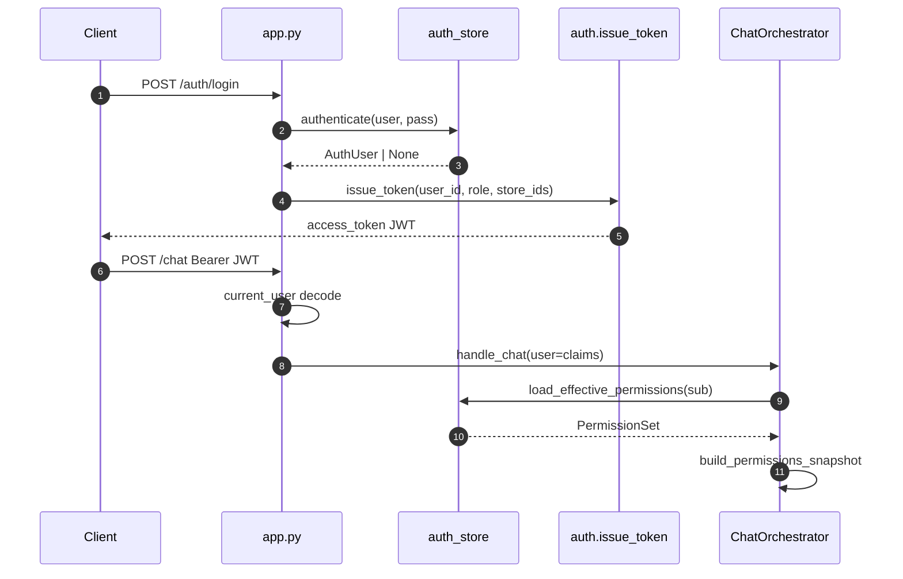

### §Z.4.15 — `HttpAgentInvoker` — giao thức HTTP agent

Triển khai `AgentInvoker` — pipeline và orchestrator gọi `invoke(agent, payload, metadata)`.

**clients.py dòng 1** `from __future__ import annotations`
**clients.py dòng 2** *(trống)*
**clients.py dòng 3** `import logging`
**clients.py dòng 4** `import os`
**clients.py dòng 5** `from typing import Any`
**clients.py dòng 6** *(trống)*
**clients.py dòng 7** `import httpx`
**clients.py dòng 8** `from agent_core.io.schemas import AgentRequest`
**clients.py dòng 9** *(trống)*
**clients.py dòng 10** `from project_core.domain.budget import AgentInvoker, SqlGatewayClient`
**clients.py dòng 11** `from project_core.domain.contracts.sql_acl import SqlAclContext`
**clients.py dòng 12** `from project_core.domain.errors.codes import AgentUnavailableError`
**clients.py dòng 13** `from project_core.infra.auth_internal import internal_auth_headers` — Header service-to-service; không phải JWT user.
**clients.py dòng 14** `from project_core.infra.resilience import CircuitBreaker` — Mở circuit sau lỗi liên tiếp → AgentUnavailableError.
**clients.py dòng 15** *(trống)*
**clients.py dòng 16** `logger = logging.getLogger(__name__)`
**clients.py dòng 17** *(trống)*
**clients.py dòng 18** *(trống)*
**clients.py dòng 19** `class HttpAgentInvoker(AgentInvoker):` — Adapter HTTP cho I/II/III/IV.
**clients.py dòng 20** `    def __init__(`
**clients.py dòng 21** `        self,`
**clients.py dòng 22** `        *,`
**clients.py dòng 23** `        client: httpx.Client | None = None,`
**clients.py dòng 24** `        circuit: CircuitBreaker | None = None,` — Mở circuit sau lỗi liên tiếp → AgentUnavailableError.
**clients.py dòng 25** `        trace_id: str | None = None,`
**clients.py dòng 26** `        analysis_id: str | None = None,`
**clients.py dòng 27** `    ) -> None:`
**clients.py dòng 28** `        self.urls = {` — URL từ env AGENT_*_URL; health_ready đọc dict này.
**clients.py dòng 29** `            "I": os.getenv("AGENT_I_URL", "http://localhost:18201"),`
**clients.py dòng 30** `            "II": os.getenv("AGENT_II_URL", "http://localhost:18202"),`
**clients.py dòng 31** `            "III": os.getenv("AGENT_III_URL", "http://localhost:18203"),`
**clients.py dòng 32** `            "IV": os.getenv("AGENT_IV_URL", "http://localhost:18204"),`
**clients.py dòng 33** `        }`
**clients.py dòng 34** `        self._client = client`
**clients.py dòng 35** `        self._owns_client = client is None`
**clients.py dòng 36** `        self._circuit = circuit or CircuitBreaker()` — Mở circuit sau lỗi liên tiếp → AgentUnavailableError.
**clients.py dòng 37** `        self._trace_id = trace_id`
**clients.py dòng 38** `        self._analysis_id = analysis_id`
**clients.py dòng 39** *(trống)*
**clients.py dòng 40** `    def _get_client(self) -> httpx.Client:`
**clients.py dòng 41** `        if self._client is None:`
**clients.py dòng 42** `            self._client = httpx.Client(timeout=120.0)`
**clients.py dòng 43** `        return self._client`
**clients.py dòng 44** *(trống)*
**clients.py dòng 45** `    def close(self) -> None:`
**clients.py dòng 46** `        if self._owns_client and self._client is not None:`
**clients.py dòng 47** `            self._client.close()`
**clients.py dòng 48** `            self._client = None`
**clients.py dòng 49** *(trống)*
**clients.py dòng 50** `    def set_trace(self, *, trace_id: str | None = None, analysis_id: str | None = None) -> None:`
**clients.py dòng 51** `        if trace_id is not None:`
**clients.py dòng 52** `            self._trace_id = trace_id`
**clients.py dòng 53** `        if analysis_id is not None:`
**clients.py dòng 54** `            self._analysis_id = analysis_id`
**clients.py dòng 55** *(trống)*
**clients.py dòng 56** `    def invoke(self, agent: str, payload: dict[str, Any], metadata: dict[str, Any]) -> dict[str, Any]:` — POST {agent}/run với AgentRequest JSON; circuit breaker trước network.
**clients.py dòng 57** `        if self._circuit.is_open():` — Mở circuit sau lỗi liên tiếp → AgentUnavailableError.
**clients.py dòng 58** `            raise AgentUnavailableError(f"Circuit open for agent {agent}")`
**clients.py dòng 59** `        url = f"{self.urls[agent]}/run"` — URL từ env AGENT_*_URL; health_ready đọc dict này.
**clients.py dòng 60** `        req = AgentRequest(`
**clients.py dòng 61** `            session_id=metadata.get("session_id", "system"),`
**clients.py dòng 62** `            actor_id=metadata.get("actor_id", "system"),`
**clients.py dòng 63** `            message=__import__("json").dumps(payload),`
**clients.py dòng 64** `            metadata=metadata,`
**clients.py dòng 65** `        )`
**clients.py dòng 66** `        headers = {**internal_auth_headers()}` — Header service-to-service; không phải JWT user.
**clients.py dòng 67** `        if self._trace_id:`
**clients.py dòng 68** `            headers["X-Trace-Id"] = self._trace_id` — Correlation; pipeline gọi set_trace trước run.
**clients.py dòng 69** `        if self._analysis_id:`
**clients.py dòng 70** `            headers["X-Analysis-Id"] = self._analysis_id` — Correlation; pipeline gọi set_trace trước run.
**clients.py dòng 71** `        try:`
**clients.py dòng 72** `            resp = self._get_client().post(url, json=req.model_dump(), headers=headers)`
**clients.py dòng 73** `            resp.raise_for_status()`
**clients.py dòng 74** `            data = resp.json()`
**clients.py dòng 75** `            self._circuit.record_success()` — Mở circuit sau lỗi liên tiếp → AgentUnavailableError.
**clients.py dòng 76** `        except Exception:`
**clients.py dòng 77** `            self._circuit.record_failure()` — Mở circuit sau lỗi liên tiếp → AgentUnavailableError.
**clients.py dòng 78** `            raise`
**clients.py dòng 79** `        usage = int((data.get("metadata") or {}).get("usage_tokens") or 0)` — Charge budget orchestrator qua pop usage_tokens.
**clients.py dòng 80** `        if usage:`
**clients.py dòng 81** `            out_meta = data.setdefault("metadata", {})`
**clients.py dòng 82** `            out_meta["usage_tokens"] = usage` — Charge budget orchestrator qua pop usage_tokens.
**clients.py dòng 83** `        out = data.get("payload") or {}`
**clients.py dòng 84** `        if not out and data.get("content"):`
**clients.py dòng 85** `            try:`
**clients.py dòng 86** `                out = __import__("json").loads(data["content"])`
**clients.py dòng 87** `            except __import__("json").JSONDecodeError:`
**clients.py dòng 88** `                out = {"content": data["content"]}`
**clients.py dòng 89** `        return out`
**clients.py dòng 90** *(trống)*

**Bảng mode Agent I do orchestrator truyền trong metadata:**

| mode | Gọi từ | payload message | Mục đích |
|------|--------|-----------------|----------|
| ingress | handle_chat | text + external_sources | Phân loại analysis vs chat thường |
| synthesize | _run_pipeline_and_respond | technical_summary | Viết lời user-facing tiếng Việt |
| clarification_bridge | clarify paths | clarification_request + transcript | Tự resolve hoặc exploration |
| clarify | _handle_clarification_needed | clarification_request | Sinh câu hỏi UI |

### §Z.4.16 — `HttpSqlGatewayClient` — giao thức sql-gateway

**clients.py dòng 92** `class HttpSqlGatewayClient(SqlGatewayClient):`
**clients.py dòng 93** `    def __init__(`
**clients.py dòng 94** `        self,`
**clients.py dòng 95** `        *,`
**clients.py dòng 96** `        client: httpx.Client | None = None,`
**clients.py dòng 97** `        circuit: CircuitBreaker | None = None,`
**clients.py dòng 98** `        trace_id: str | None = None,`
**clients.py dòng 99** `    ) -> None:`
**clients.py dòng 100** `        self.base = os.getenv("SQL_GATEWAY_URL", "http://localhost:18101")`
**clients.py dòng 101** `        self._client = client`
**clients.py dòng 102** `        self._owns_client = client is None`
**clients.py dòng 103** `        self._circuit = circuit or CircuitBreaker()`
**clients.py dòng 104** `        self._trace_id = trace_id`
**clients.py dòng 105** *(trống)*
**clients.py dòng 106** `    def _get_client(self) -> httpx.Client:`
**clients.py dòng 107** `        if self._client is None:`
**clients.py dòng 108** `            self._client = httpx.Client(timeout=60.0)`
**clients.py dòng 109** `        return self._client`
**clients.py dòng 110** *(trống)*
**clients.py dòng 111** `    def close(self) -> None:`
**clients.py dòng 112** `        if self._owns_client and self._client is not None:`
**clients.py dòng 113** `            self._client.close()`
**clients.py dòng 114** `            self._client = None`
**clients.py dòng 115** *(trống)*
**clients.py dòng 116** `    def set_trace(self, trace_id: str | None) -> None:`
**clients.py dòng 117** `        self._trace_id = trace_id`
**clients.py dòng 118** *(trống)*
**clients.py dòng 119** `    def _call(self, tool: str, arguments: dict[str, Any]) -> dict[str, Any]:`
**clients.py dòng 120** `        if self._circuit.is_open():`
**clients.py dòng 121** `            raise AgentUnavailableError(f"Circuit open for sql-gateway tool {tool}")`
**clients.py dòng 122** `        if os.getenv("SQL_GATEWAY_INPROCESS") == "1":` — Bypass HTTP: gọi trực tiếp tools_impl — dev/test.
**clients.py dòng 123** `            from sql_gateway import tools_impl as impl`
**clients.py dòng 124** *(trống)*
**clients.py dòng 125** `            fn = getattr(impl, tool)`
**clients.py dòng 126** `            return fn(**arguments)`
**clients.py dòng 127** `        headers = {**internal_auth_headers()}`
**clients.py dòng 128** `        if self._trace_id:`
**clients.py dòng 129** `            headers["X-Trace-Id"] = self._trace_id`
**clients.py dòng 130** `        try:`
**clients.py dòng 131** `            resp = self._get_client().post(f"{self.base}/tools/{tool}", json=arguments, headers=headers)`
**clients.py dòng 132** `            if resp.status_code == 404:` — Soft error gateway_not_found thay vì raise — pipeline xử lý.
**clients.py dòng 133** `                logger.warning("sql-gateway HTTP 404 for %s — check SQL_GATEWAY_URL", tool)` — Soft error gateway_not_found thay vì raise — pipeline xử lý.
**clients.py dòng 134** `                return {"error": "gateway_not_found", "status": 404}` — Soft error gateway_not_found thay vì raise — pipeline xử lý.
**clients.py dòng 135** `            resp.raise_for_status()`
**clients.py dòng 136** `            self._circuit.record_success()`
**clients.py dòng 137** `            return resp.json()`
**clients.py dòng 138** `        except Exception:`
**clients.py dòng 139** `            self._circuit.record_failure()`
**clients.py dòng 140** `            raise`
**clients.py dòng 141** *(trống)*
**clients.py dòng 142** `    def _acl_args(self, acl: SqlAclContext) -> dict[str, Any]:` — Chuyển SqlAclContext → allowed_tables, store filter.
**clients.py dòng 143** `        return acl.to_gateway_args()`
**clients.py dòng 144** *(trống)*
**clients.py dòng 145** `    def validate_sql(self, sql: str, acl: SqlAclContext) -> dict[str, Any]:` — Facade tool; merge acl.to_gateway_args vào body POST.
**clients.py dòng 146** `        return self._call("validate_sql", {"sql": sql, **self._acl_args(acl)})` — Chuyển SqlAclContext → allowed_tables, store filter.
**clients.py dòng 147** *(trống)*
**clients.py dòng 148** `    def explain_sql(self, sql: str, acl: SqlAclContext, *, target_db: str = "db2") -> dict[str, Any]:` — Facade tool; merge acl.to_gateway_args vào body POST.
**clients.py dòng 149** `        return self._call(`
**clients.py dòng 150** `            "explain_sql",`
**clients.py dòng 151** `            {"sql": sql, "target_db": target_db, **self._acl_args(acl)},` — Chuyển SqlAclContext → allowed_tables, store filter.
**clients.py dòng 152** `        )`
**clients.py dòng 153** *(trống)*
**clients.py dòng 154** `    def execute_readonly(self, sql: str, acl: SqlAclContext, *, target_db: str = "db2") -> dict[str, Any]:` — Facade tool; merge acl.to_gateway_args vào body POST.
**clients.py dòng 155** `        return self._call(`
**clients.py dòng 156** `            "execute_readonly",`
**clients.py dòng 157** `            {"sql": sql, "target_db": target_db, **self._acl_args(acl)},` — Chuyển SqlAclContext → allowed_tables, store filter.
**clients.py dòng 158** `        )`

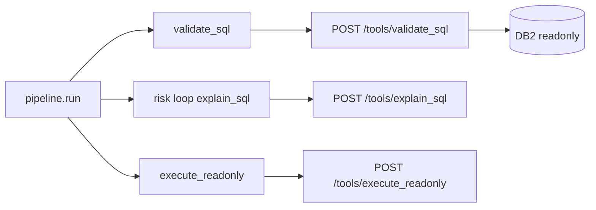

### §Z.4.17 — Sơ đồ hoạt động tổng hợp (prose + Mermaid)

#### §Z.4.17.1 — Phiên chat mới đến kết quả phân tích

User mở session_id mới, gửi câu hỏi phân tích. Gateway xác thực JWT, orchestrator tạo workflow IDLE, ghi transcript user, Agent I trả route=analysis với brief. Permissions load từ AUTH DB. Pipeline chạy II→III→SQL→IV. Thành công: Agent I synthesize, assistant turn và artifact URLs trong ChatResponse.

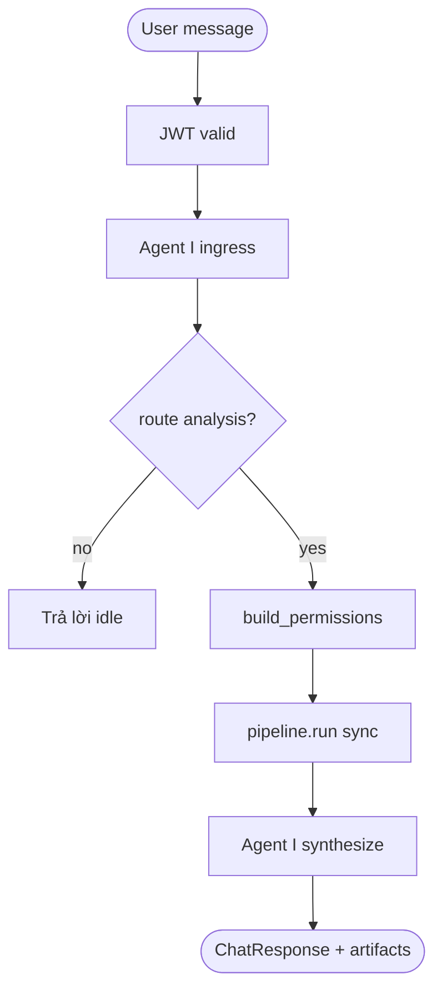

#### §Z.4.17.2 — Vòng clarify hai lần (ingress + pipeline)

Pipeline II hoặc IV yêu cầu clarify: orchestrator gọi clarification_bridge. Nếu transcript đủ → auto rerun pipeline. Nếu không → Agent I clarify → status AWAITING_CLARIFICATION, client POST /chat/clarify hoặc user chat tiếp kích hoạt ingress clarify.

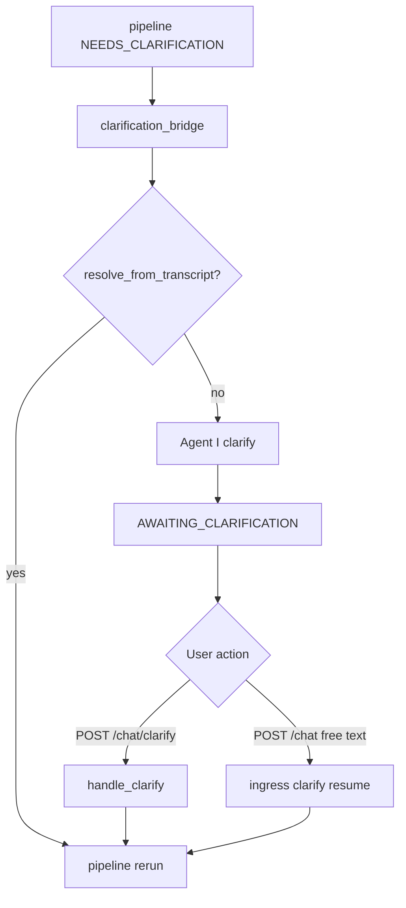

#### §Z.4.17.3 — Fail-closed permissions

Production: load_effective_permissions None → PermissionsUnavailableError → HTTP 403. Dev ALLOW_DEV_AUTH=1: fallback YAML roles không cần AUTH DB cho snapshot.

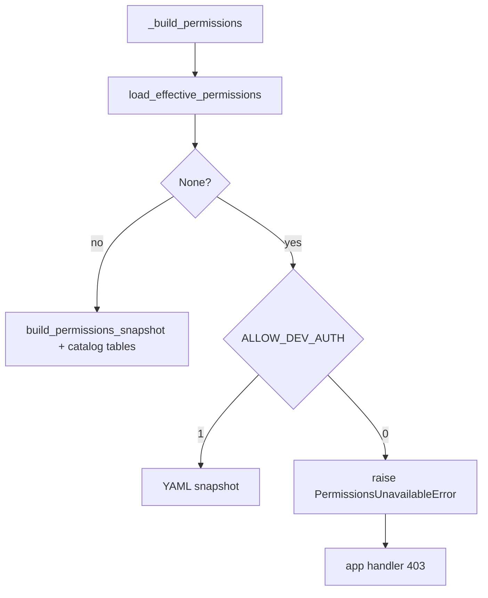

#### §Z.4.17.4 — Budget và token charge

Mỗi _invoke_agent_i gọi budget.record('I'). usage_tokens từ agent response charge trace_budget. Vượt ngưỡng → BudgetExceededError → ChatResponse error, budget_spent persist Redis.

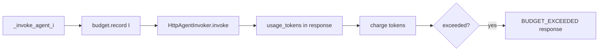

#### §Z.4.17.5 — Health readiness vs liveness

/health/live luôn ok. /health/ready ping Redis và kiểm Mongo feedback != None; đồng thời GET /health từng agent URL — kết quả trong map nhưng ok chỉ cần redis+mongo.

```mermaid
flowchart TD
  L[/health/live] --> OK1[ok true]
  R[/health/ready] --> P[stm.client.ping]
  R --> M[feedback is not None]
  R --> A[GET each agent /health]
  P --> J{redis and mongo}
  M --> J
  J --> OK2[ok aggregate]
```

### §Z.4.18 — Ma trận Redis persist theo phương thức orchestrator

| Phương thức | STM call | Khi nào |
|-------------|----------|---------|
| handle_chat | save_transcript | Sau user turn và sau assistant idle |
| handle_chat | save_workflow | Sau gán brief + permissions trước pipeline |
| handle_clarify | save_clarification(None) | Xóa pending sau apply reply |
| handle_clarify | save_workflow | Sau resume_analysis |
| attach_external_sources | save_workflow | Brief external_sources merge |
| _run_pipeline_and_respond | save_workflow via on_progress | Mỗi bước pipeline nếu poll_enabled |
| _run_pipeline_and_respond | save_transcript | Sau synthesize assistant turn |
| _handle_clarification_needed | save_clarification | Lưu request khi suspend |
| _resume_from_pending | save_clarification(None) | Sau bridge resolve |

### §Z.4.19 — Ma trận lỗi ChatResponse và HTTP

| code | Nguồn | HTTP / body | Ghi chú |
|------|-------|-------------|---------|
| BUDGET_EXCEEDED | handle_chat, _run_pipeline, clarify paths | 429/200 với error body | retryable: false |
| NO_PENDING_CLARIFICATION | handle_clarify | 200 + error | Không có bundle.clarification |
| CLARIFY_ROUNDS_EXCEEDED | _run_pipeline second exceed | STALE workflow | exploration retry thất bại |
| permissions_unavailable | PermissionsUnavailableError | HTTP 403 | AUTH DB down hoặc user inactive |
| invalid_credentials | login | HTTP 401 | authenticate None |
| missing_token | current_user | HTTP 401 | Không dev auth |
| dev_auth_disabled | dev-login | HTTP 403 | ALLOW_DEV_AUTH không set |

### §Z.4.20 — Biến môi trường ảnh hưởng gateway (cross-file)

| Biến | Tệp | Vai trò |
|------|-----|---------|
| `JWT_SECRET` | auth.py | Ký JWT |
| `REQUIRE_PROD_AUTH` | auth.py | Ép secret mạnh |
| `ALLOW_DEV_AUTH` | auth.py, orchestrator | Dev user + YAML permissions |
| `AUTH_DB_DSN` | auth_store.py | SQL Server AUTH |
| `AUTH_PERMISSIONS_CACHE_TTL` | auth_store.py | Cache permissions giây |
| `AGENT_I_URL … IV` | clients.py | Base URL agents |
| `SQL_GATEWAY_URL` | clients.py | sql-gateway HTTP |
| `SQL_GATEWAY_INPROCESS` | clients.py | Gọi local impl |
| `MONGODB_URI` | orchestrator | RAG feedback |
| `MONGODB_CONNECT_TIMEOUT_MS` | orchestrator | Timeout Mongo init |
| `ARTIFACTS_DIR` | app.py | Download artifact path |
| `CHAT_GATEWAY_PORT` | app.py | uvicorn bind |
| `OAUTH_PROVIDER` | oauth.py | local vs azure |

### §Z.4.21 — Chú giải bổ sung theo khối logic orchestrator

#### Khối Đầu handle_chat (dòng 97–109)
Trích claims, đảm bảo workflow tồn tại, kiểm tra clarify ingress trước khi append message mới.
- Dòng 97: `    def handle_chat(self, *, session_id: str, message: str, user: dict[str, Any]) -> ChatResponse:`
- Dòng 98: `        actor_id, role, store_ids = claims_from_user_dict(user)`
- Dòng 99: `        bundle = self.stm.load_session(session_id)`
- Dòng 100: `        if bundle.workflow is None:`
- Dòng 101: `            bundle.workflow = new_workflow(session_id, actor_id)`
- Dòng 102: ``
- Dòng 103: `        if self.clarify.on_ingress_clarify(bundle):`
- Dòng 104: `            return self._resume_from_pending_clarification(`
- Dòng 105: `                session_id=session_id,`
- Dòng 106: `                message=message,`
- Dòng 107: `                user=user,`
- Dòng 108: `                bundle=bundle,`
- Dòng 109: `            )`

#### Khối Transcript user (dòng 111–115)
Mọi message đi qua đây đều persist Redis ngay — crash sau đó vẫn có lịch sử.
- Dòng 111: `        self._maybe_emit_re_ask_signal(session_id, bundle, message)`
- Dòng 112: ``
- Dòng 113: `        turn = TranscriptTurn(id=str(uuid4()), role="user", content=message, at=utc_now().isoformat())`
- Dòng 114: `        bundle.transcript.append(turn)`
- Dòng 115: `        self.stm.save_transcript(session_id, bundle.transcript)`

#### Khối Ingress Agent I (dòng 117–137)
Invoker mới mỗi request nhưng dùng chung httpx client; budget session restore từ workflow.budget_spent.
- Dòng 117: `        invoker = HttpAgentInvoker(client=self._http)`
- Dòng 118: `        session_budget = self._session_budget(bundle)`
- Dòng 119: `        external_sources = []`
- Dòng 120: `        if bundle.workflow.brief and bundle.workflow.brief.external_sources:`
- Dòng 121: `            external_sources = [s.model_dump() for s in bundle.workflow.brief.external_sources]`
- Dòng 122: ``
- Dòng 123: `        try:`
- Dòng 124: `            ingress = self._invoke_agent_i(`
- Dòng 125: `                invoker,`
- Dòng 126: `                {"text": message, "external_sources": external_sources},`
- Dòng 127: `                {"mode": "ingress", "session_id": session_id, "actor_id": actor_id},`
- Dòng 128: `                session_budget,`
- Dòng 129: `                bundle,`
- Dòng 130: `            )`
- Dòng 131: `        except BudgetExceededError as exc:`
- Dòng 132: `            return ChatResponse(`
- Dòng 133: `                session_id=session_id,`
- Dòng 134: `                workflow_status=bundle.workflow.status.value,`
- Dòng 135: `                message=str(exc),`
- Dòng 136: `                error={"code": "BUDGET_EXCEEDED", "retryable": False},`
- Dòng 137: `            )`

#### Khối Nhánh non-analysis (dòng 139–154)
route khác analysis: không chạm pipeline, workflow về IDLE semantic qua response.
- Dòng 139: `        self._handle_satisfaction_signal(ingress, bundle)`
- Dòng 140: ``
- Dòng 141: `        if ingress.get("route") != "analysis":`
- Dòng 142: `            assistant = TranscriptTurn(`
- Dòng 143: `                id=str(uuid4()),`
- Dòng 144: `                role="assistant",`
- Dòng 145: `                content=ingress.get("user_message", ""),`
- Dòng 146: `                at=utc_now().isoformat(),`
- Dòng 147: `            )`
- Dòng 148: `            bundle.transcript.append(assistant)`
- Dòng 149: `            self.stm.save_transcript(session_id, bundle.transcript)`
- Dòng 150: `            return ChatResponse(`
- Dòng 151: `                session_id=session_id,`
- Dòng 152: `                workflow_status=WorkflowStatus.IDLE.value,`
- Dòng 153: `                message=ingress.get("user_message", ""),`
- Dòng 154: `            )`

#### Khối Nhánh analysis (dòng 156–174)
start_analysis sinh analysis_id; permissions_snapshot gắn workflow cho lần clarify sau.
- Dòng 156: `        brief = AnalysisBrief.model_validate(ingress.get("brief") or {"intent": message})`
- Dòng 157: `        if bundle.workflow.brief and bundle.workflow.brief.external_sources:`
- Dòng 158: `            brief.external_sources = bundle.workflow.brief.external_sources`
- Dòng 159: ``
- Dòng 160: `        analysis_id = start_analysis(bundle.workflow, reset_clarify=True)`
- Dòng 161: `        bundle.workflow.brief = brief`
- Dòng 162: `        permissions = self._build_permissions(actor_id, role, store_ids)`
- Dòng 163: `        bundle.workflow.permissions_snapshot = permissions`
- Dòng 164: `        self.stm.save_workflow(session_id, bundle.workflow)`
- Dòng 165: ``
- Dòng 166: `        return self._run_pipeline_and_respond(`
- Dòng 167: `            session_id=session_id,`
- Dòng 168: `            analysis_id=analysis_id,`
- Dòng 169: `            brief=brief,`
- Dòng 170: `            bundle=bundle,`
- Dòng 171: `            permissions=permissions,`
- Dòng 172: `            invoker=invoker,`
- Dòng 173: `            session_budget=session_budget,`
- Dòng 174: `        )`

#### Khối Pipeline invoke (dòng 424–447)
on_progress = save_workflow khi poll_enabled; deadline = monotonic + max_sync_seconds.
- Dòng 424: `    def _run_pipeline_and_respond(`
- Dòng 425: `        self,`
- Dòng 426: `        *,`
- Dòng 427: `        session_id: str,`
- Dòng 428: `        analysis_id: str,`
- Dòng 429: `        brief: AnalysisBrief,`
- Dòng 430: `        bundle: SessionBundle,`
- Dòng 431: `        permissions: Any,`
- Dòng 432: `        invoker: HttpAgentInvoker,`
- Dòng 433: `        session_budget: SessionTraceBudget,`
- Dòng 434: `    ) -> ChatResponse:`
- Dòng 435: `        def on_progress(workflow: Any) -> None:`
- Dòng 436: `            self.stm.save_workflow(session_id, workflow)`
- Dòng 437: ``
- Dòng 438: `        deadline = time.monotonic() + float(self.cfg.pipeline.max_sync_seconds)`
- Dòng 439: `        try:`
- Dòng 440: `            result = self.pipeline.run(`
- Dòng 441: `                brief=brief,`
- Dòng 442: `                workflow=bundle.workflow,`
- Dòng 443: `                permissions=permissions,`
- Dòng 444: `                trace_budget=session_budget.trace_budget,`
- Dòng 445: `                on_progress=on_progress if self.cfg.pipeline.poll_enabled else None,`
- Dòng 446: `                deadline=deadline,`
- Dòng 447: `            )`

#### Khối ClarifyRoundsExceeded (dòng 448–471)
Lần một: exploration_mode; lần hai: STALE + error code.
- Dòng 448: `        except ClarifyRoundsExceededError as exc:`
- Dòng 449: `            brief.exploration_mode = True`
- Dòng 450: `            brief.user_knowledge_level = "unknown"`
- Dòng 451: `            bundle.workflow.brief = brief`
- Dòng 452: `            resume_analysis(bundle.workflow)`
- Dòng 453: `            self.stm.save_workflow(session_id, bundle.workflow)`
- Dòng 454: `            try:`
- Dòng 455: `                result = self.pipeline.run(`
- Dòng 456: `                    brief=brief,`
- Dòng 457: `                    workflow=bundle.workflow,`
- Dòng 458: `                    permissions=permissions,`
- Dòng 459: `                    trace_budget=session_budget.trace_budget,`
- Dòng 460: `                    on_progress=on_progress if self.cfg.pipeline.poll_enabled else None,`
- Dòng 461: `                    deadline=deadline,`
- Dòng 462: `                )`
- Dòng 463: `            except ClarifyRoundsExceededError:`
- Dòng 464: `                return ChatResponse(`
- Dòng 465: `                    session_id=session_id,`
- Dòng 466: `                    analysis_id=analysis_id,`
- Dòng 467: `                    workflow_status=WorkflowStatus.STALE.value,`
- Dòng 468: `                    outcome="error",`
- Dòng 469: `                    message=str(exc),`
- Dòng 470: `                    error={"code": "CLARIFY_ROUNDS_EXCEEDED", "retryable": False},`
- Dòng 471: `                )`

#### Khối needs_clarification (dòng 486–496)
Ủy quyền _handle_clarification_needed thay vì synthesize.
- Dòng 486: `        if result.needs_clarification:`
- Dòng 487: `            return self._handle_clarification_needed(`
- Dòng 488: `                session_id=session_id,`
- Dòng 489: `                analysis_id=analysis_id,`
- Dòng 490: `                result=result,`
- Dòng 491: `                brief=brief,`
- Dòng 492: `                bundle=bundle,`
- Dòng 493: `                permissions=permissions,`
- Dòng 494: `                invoker=invoker,`
- Dòng 495: `                session_budget=session_budget,`
- Dòng 496: `            )`

#### Khối Synthesize path (dòng 498–543)
technical_summary từ pipeline; artifacts chỉ basename URL relative.
- Dòng 498: `        try:`
- Dòng 499: `            synth = self._invoke_agent_i(`
- Dòng 500: `                invoker,`
- Dòng 501: `                {},`
- Dòng 502: `                {`
- Dòng 503: `                    "mode": "synthesize",`
- Dòng 504: `                    "session_id": session_id,`
- Dòng 505: `                    "actor_id": permissions.actor_id,`
- Dòng 506: `                    "technical_summary": result.technical_summary.model_dump(),`
- Dòng 507: `                },`
- Dòng 508: `                session_budget,`
- Dòng 509: `                bundle,`
- Dòng 510: `            )`
- Dòng 511: `        except BudgetExceededError as exc:`
- Dòng 512: `            bundle.workflow.budget_spent = session_budget.trace_budget.spent`
- Dòng 513: `            self.stm.save_workflow(session_id, bundle.workflow)`
- Dòng 514: `            return ChatResponse(`
- Dòng 515: `                session_id=session_id,`
- Dòng 516: `                analysis_id=analysis_id,`
- Dòng 517: `                trace_id=result.trace_id,`
- Dòng 518: `                workflow_status=bundle.workflow.status.value,`
- Dòng 519: `                outcome=result.outcome,`
- Dòng 520: `                message=result.technical_summary.outcome,`
- Dòng 521: `                error={"code": "BUDGET_EXCEEDED", "retryable": False},`
- Dòng 522: `            )`
- Dòng 523: ``
- Dòng 524: `        assistant = TranscriptTurn(`
- Dòng 525: `            id=str(uuid4()),`
- Dòng 526: `            role="assistant",`
- Dòng 527: `            content=synth.get("user_message", ""),`
- Dòng 528: `            at=utc_now().isoformat(),`
- Dòng 529: `            analysis_id=analysis_id,`
- Dòng 530: `            trace_id=result.trace_id,`
- Dòng 531: `        )`
- Dòng 532: `        bundle.transcript.append(assistant)`
- Dòng 533: `        self.stm.save_transcript(session_id, bundle.transcript)`
- Dòng 534: `        self.stm.save_workflow(session_id, bundle.workflow)`
- Dòng 535: `        return ChatResponse(`
- Dòng 536: `            session_id=session_id,`
- Dòng 537: `            analysis_id=analysis_id,`
- Dòng 538: `            trace_id=result.trace_id,`
- Dòng 539: `            workflow_status=bundle.workflow.status.value,`
- Dòng 540: `            outcome=result.outcome,`
- Dòng 541: `            message=synth.get("user_message", ""),`
- Dòng 542: `            artifacts=[{"url": u} for u in result.technical_summary.artifact_urls],`
- Dòng 543: `        )`

#### Khối Bridge auto-resolve (dòng 585–605)
clarify.on_pipeline_clarify quyết should_rerun; có thể gọi đệ quy _run_pipeline_and_respond.
- Dòng 585: `        if bridge.get("action") == "resolve_from_transcript":`
- Dòng 586: `            brief, should_rerun = self.clarify.on_pipeline_clarify(`
- Dòng 587: `                result=result,`
- Dòng 588: `                brief=brief,`
- Dòng 589: `                bridge=bridge,`
- Dòng 590: `                analysis_id=analysis_id,`
- Dòng 591: `            )`
- Dòng 592: `            if should_rerun:`
- Dòng 593: `                bundle.workflow.brief = brief`
- Dòng 594: `                resume_analysis(bundle.workflow)`
- Dòng 595: `                bundle.workflow.budget_spent = session_budget.trace_budget.spent`
- Dòng 596: `                self.stm.save_workflow(session_id, bundle.workflow)`
- Dòng 597: `                return self._run_pipeline_and_respond(`
- Dòng 598: `                    session_id=session_id,`
- Dòng 599: `                    analysis_id=analysis_id,`
- Dòng 600: `                    brief=brief,`
- Dòng 601: `                    bundle=bundle,`
- Dòng 602: `                    permissions=permissions,`
- Dòng 603: `                    invoker=invoker,`
- Dòng 604: `                    session_budget=session_budget,`
- Dòng 605: `                )`

#### Khối Suspend clarify (dòng 607–648)
save_clarification + suspend_response; bridge_action ask_user trong model_copy.
- Dòng 607: `        try:`
- Dòng 608: `            clarify = self._invoke_agent_i(`
- Dòng 609: `                invoker,`
- Dòng 610: `                {},`
- Dòng 611: `                {`
- Dòng 612: `                    "mode": "clarify",`
- Dòng 613: `                    "session_id": session_id,`
- Dòng 614: `                    "actor_id": permissions.actor_id,`
- Dòng 615: `                    "clarification_request": result.needs_clarification.model_dump(),`
- Dòng 616: `                },`
- Dòng 617: `                session_budget,`
- Dòng 618: `                bundle,`
- Dòng 619: `            )`
- Dòng 620: `        except BudgetExceededError as exc:`
- Dòng 621: `            bundle.workflow.budget_spent = session_budget.trace_budget.spent`
- Dòng 622: `            self.stm.save_workflow(session_id, bundle.workflow)`
- Dòng 623: `            return ChatResponse(`
- Dòng 624: `                session_id=session_id,`
- Dòng 625: `                analysis_id=analysis_id,`
- Dòng 626: `                trace_id=result.trace_id,`
- Dòng 627: `                workflow_status=WorkflowStatus.AWAITING_CLARIFICATION.value,`
- Dòng 628: `                outcome=result.outcome,`
- Dòng 629: `                message=str(exc),`
- Dòng 630: `                error={"code": "BUDGET_EXCEEDED", "retryable": False},`
- Dòng 631: `            )`
- Dòng 632: ``
- Dòng 633: `        bundle.workflow.budget_spent = session_budget.trace_budget.spent`
- Dòng 634: `        self.stm.save_clarification(session_id, result.needs_clarification.model_dump())`
- Dòng 635: `        self.stm.save_workflow(session_id, bundle.workflow)`
- Dòng 636: `        return self.clarify.suspend_response(`
- Dòng 637: `            session_id=session_id,`
- Dòng 638: `            analysis_id=analysis_id,`
- Dòng 639: `            request=result.needs_clarification,`
- Dòng 640: `            clarify_payload=clarify,`
- Dòng 641: `            workflow_status=WorkflowStatus.AWAITING_CLARIFICATION.value,`
- Dòng 642: `        ).model_copy(`
- Dòng 643: `            update={`
- Dòng 644: `                "trace_id": result.trace_id,`
- Dòng 645: `                "outcome": result.outcome,`
- Dòng 646: `                "bridge_action": "ask_user",`
- Dòng 647: `            }`
- Dòng 648: `        )`

### §Z.4.22 — Tương tác orchestrator ↔ pipeline (ranh giới)

Orchestrator **không** gọi trực tiếp Agent II/III/IV — chỉ qua `self.pipeline.run`. Orchestrator **có** gọi Agent I cho ingress, synthesize, clarify, clarification_bridge. Pipeline gọi II/III/IV và sql-gateway qua client inject lúc `__init__`.

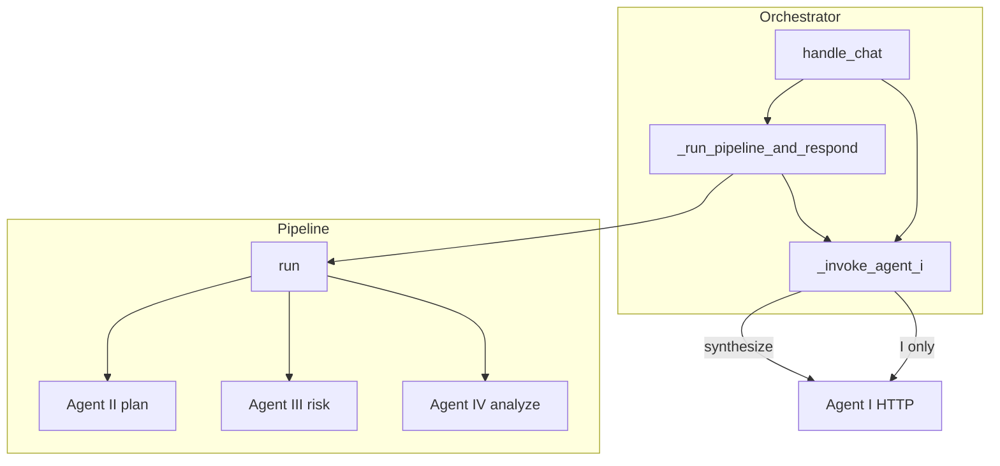

### §Z.4.23 — Checklist debug theo triệu chứng (gateway-only)

1. **Triệu chứng:** Chat trả lời chung chung, không SQL
   - **Nguyên nhân thường gặp:** ingress route != analysis
   - **Hướng xử lý:** Xem Agent I response route và brief

1. **Triệu chứng:** 403 permissions_unavailable ngay khi chat
   - **Nguyên nhân thường gặp:** _build_permissions raise
   - **Hướng xử lý:** AUTH_DB_DSN, user active, hoặc bật ALLOW_DEV_AUTH local

1. **Triệu chứng:** AWAITING_CLARIFICATION mãi
   - **Nguyên nhân thường gặp:** save_clarification không clear
   - **Hướng xử lý:** Kiểm POST /chat/clarify vs free-text ingress

1. **Triệu chứng:** STALE + CLARIFY_ROUNDS_EXCEEDED
   - **Nguyên nhân thường gặp:** exploration vẫn exceed
   - **Hướng xử lý:** Tăng max_clarify_rounds config hoặc sửa brief

1. **Triệu chứng:** AgentUnavailableError / 5xx
   - **Nguyên nhân thường gặp:** circuit open HttpAgentInvoker
   - **Hướng xử lý:** Restart agent, kiểm AGENT_*_URL

1. **Triệu chứng:** gateway_not_found SQL
   - **Nguyên nhân thường gặp:** SQL_GATEWAY_URL sai
   - **Hướng xử lý:** health_ready agents + sql 404 soft

1. **Triệu chứng:** Mongo warning lúc start
   - **Nguyên nhân thường gặp:** feedback None
   - **Hướng xử lý:** RAG/registry tắt; pipeline vẫn chạy rank_candidates fallback

1. **Triệu chứng:** Artifact 404
   - **Nguyên nhân thường gặp:** trace_id/out/file
   - **Hướng xử lý:** ARTIFACTS_DIR mount docker

### §Z.4.24 — Dòng thời gian đồng bộ một request /chat (ước lượng)

- T0: FastAPI nhận body, Pydantic validate ChatRequest.
- T1: current_user decode JWT (~1ms).
- T2: get_orchestrator — no-op nếu đã init.
- T3: stm.load_session Redis RTT.
- T4: _invoke_agent_i ingress — HTTP Agent I (LLM, vài giây).
- T5: _build_permissions — có thể cache hit AUTH DB.
- T6: pipeline.run — II plan + III loop + SQL execute + IV analyze (phần lớn thời gian).
- T7: on_progress save_workflow nếu poll_enabled — nhiều lần trong T6.
- T8: _invoke_agent_i synthesize — HTTP Agent I.
- T9: save_transcript + model_dump response.

### §Z.4.25 — Kết luận phần §Z.4

ChatOrchestrator là **state machine phiên** trên Redis: mọi quyết định clarify, budget, permissions được chốt trước khi pipeline đồng bộ chạy. app.py giữ mỏng — auth và routing — còn HttpAgentInvoker/HttpSqlGatewayClient là cầu nối HTTP duy nhất tới agent và SQL. Vận hành production cần `/health/ready`, AUTH DB ổn định, và JWT không dùng secret mặc định.

*Hết §Z.4 — ChatOrchestrator và chat-gateway.*
