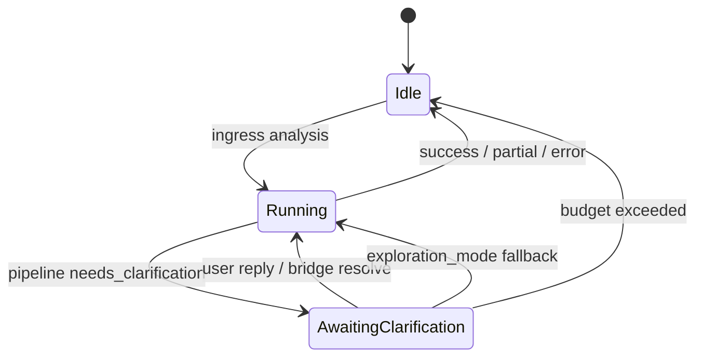

# Clarification state machine

`ClarificationCoordinator` centralizes transitions:

- `on_ingress_clarify` — resume when session has pending clarification
- `on_pipeline_clarify` — bridge auto-resolve from transcript vs suspend
- `on_resume_reply` — heuristic bridge on new user message
- `on_bridge_result` — apply resolved answers or enable exploration mode
- `suspend_response` — build `ChatResponse` for `AWAITING_CLARIFICATION`
