# Thiết kế mục tiêu hệ multi-agent (should-have design)

> **Mục đích:** Đây là tài liệu **thiết kế mục tiêu** (target/should-be), mô tả cách hệ thống multi-agent **nên** hoạt động — làm nền tảng cho việc **refactor toàn bộ Agent IV** và siết lại các luồng còn thiếu.
>
> Tài liệu này **khác** với các file mô tả hiện trạng (as-is) trong `docs2/08–18`. Nơi nào hiện trạng lệch với thiết kế, phần "Khoảng cách hiện trạng" sẽ chỉ rõ.
>
> ← [Mục lục docs2](README.md)

**Số sơ đồ:** 21 (Mermaid), **sắp xếp theo chiều sâu — từ bao quát đến chi tiết:**
- **Sơ đồ 1–5 · Nền tảng kiến trúc (bao quát nhất):** Context (C4 L1) → Container (C4 L2) → Infrastructure → Deployment → Kiến trúc tổng thể logic.
- **Sơ đồ 6–8 · Luồng vận hành tổng thể:** End-to-end → Vòng suy luận giữa các agent → Ma trận định tuyến (Agent I).
- **Sơ đồ 9–12 · Vòng lặp phối hợp chi tiết:** Clarify → Data feedback II↔IV → Agent IV reasoning → Thành phần Agent IV.
- **Sơ đồ 13–20 · Cơ chế xuyên suốt:** Defense-in-depth → RBAC → Auth → SQL policy → Sandbox → Budget → Workflow state → Vòng đời phiên.
- **Sơ đồ 21 · Mô hình dữ liệu (chi tiết nhất):** ER Diagram (AUTH DB + RBAC).

**Phạm vi:** toàn hệ — Agent I–IV, chat-gateway, sql-gateway, python-sandbox, Redis, MongoDB, AUTH DB, Analytics DB, hạ tầng Docker/Caddy.

---

## Mục lục

1. [Triết lý thiết kế](#1-triết-lý-thiết-kế)
2. [Vai trò mục tiêu từng thành phần](#2-vai-trò-mục-tiêu-từng-thành-phần)
3. [Sơ đồ 1 — Context Diagram (C4 Level 1)](#sơ-đồ-1--context-diagram-c4-level-1)
4. [Sơ đồ 2 — Container Diagram (C4 Level 2)](#sơ-đồ-2--container-diagram-c4-level-2)
5. [Sơ đồ 3 — Infrastructure Diagram (network topology prod)](#sơ-đồ-3--infrastructure-diagram-network-topology-prod)
6. [Sơ đồ 4 — Deployment Diagram (dev vs prod)](#sơ-đồ-4--deployment-diagram-dev-vs-prod)
7. [Sơ đồ 5 — Kiến trúc tổng thể mục tiêu](#sơ-đồ-5--kiến-trúc-tổng-thể-mục-tiêu)
8. [Sơ đồ 6 — Luồng end-to-end một câu hỏi](#sơ-đồ-6--luồng-end-to-end-một-câu-hỏi)
9. [Sơ đồ 7 — Vòng suy luận giữa các agent (reasoning loop)](#sơ-đồ-7--vòng-suy-luận-giữa-các-agent-reasoning-loop)
10. [Sơ đồ 8 — Ma trận quyết định định tuyến (Agent I)](#sơ-đồ-8--ma-trận-quyết-định-định-tuyến-agent-i)
11. [Sơ đồ 9 — Clarify loop đầy đủ](#sơ-đồ-9--clarify-loop-đầy-đủ)
12. [Sơ đồ 10 — Data feedback loop II ↔ IV](#sơ-đồ-10--data-feedback-loop-ii--iv)
13. [Sơ đồ 11 — Agent IV reasoning loop (mục tiêu refactor)](#sơ-đồ-11--agent-iv-reasoning-loop-mục-tiêu-refactor)
14. [Sơ đồ 12 — Sơ đồ thành phần Agent IV sau refactor](#sơ-đồ-12--sơ-đồ-thành-phần-agent-iv-sau-refactor)
15. [Sơ đồ 13 — Các lớp bảo mật (defense in depth)](#sơ-đồ-13--các-lớp-bảo-mật-defense-in-depth)
16. [Sơ đồ 14 — Phân quyền tool (capability RBAC)](#sơ-đồ-14--phân-quyền-tool-capability-rbac)
17. [Sơ đồ 15 — Auth sequence (login → chat)](#sơ-đồ-15--auth-sequence-login--chat)
18. [Sơ đồ 16 — SQL policy + risk review](#sơ-đồ-16--sql-policy--risk-review)
19. [Sơ đồ 17 — Sandbox execution an toàn](#sơ-đồ-17--sandbox-execution-an-toàn)
20. [Sơ đồ 18 — Budget + circuit breaker](#sơ-đồ-18--budget--circuit-breaker)
21. [Sơ đồ 19 — Workflow state machine](#sơ-đồ-19--workflow-state-machine)
22. [Sơ đồ 20 — Vòng đời phiên và bộ nhớ](#sơ-đồ-20--vòng-đời-phiên-và-bộ-nhớ)
23. [Sơ đồ 21 — ER Diagram (AUTH DB + RBAC)](#sơ-đồ-21--er-diagram-auth-db--rbac)
24. [Bao quát mọi case](#19-bao-quát-mọi-case-case-matrix)
25. [Khoảng cách hiện trạng và kế hoạch refactor IV](#20-khoảng-cách-hiện-trạng-và-kế-hoạch-refactor-iv)

---

## 1. Triết lý thiết kế

Hệ thống là một **chatbot phân tích siêu thị** nhiều tác nhân (multi-agent). Nguyên tắc chủ đạo:

1. **Mỗi agent là một chuyên gia có suy luận riêng (LLM-driven).** Không có agent nào chỉ là "ống dẫn" (passthrough). Đặc biệt **Agent IV phải là bộ não phân tích** — tự quyết định phân tích gì, chạy gì, đánh giá kết quả và lặp lại.

2. **Ranh giới trách nhiệm rõ ràng (separation of concerns).**
   - Agent I: hiểu người dùng, định tuyến, tổng hợp câu trả lời.
   - Agent II: dịch ý định → SQL an toàn.
   - Agent III: thẩm định rủi ro SQL.
   - Agent IV: phân tích dữ liệu, tạo insight/biểu đồ/báo cáo.
   - Pipeline/orchestrator: điều phối, **không** chứa "trí tuệ phân tích".

3. **Fail-closed, deny-by-default.** Mọi quyền (bảng, cột, tool, function) mặc định bị từ chối; chỉ cho phép khi có capability tường minh.

4. **Vòng lặp có kiểm soát ngân sách.** Mọi loop (clarify, SQL retry, risk retry, analysis step) đều có trần (cap) để tránh treo hoặc cháy token.

5. **Người dùng được hỏi lại khi mơ hồ (clarify), nhưng không hỏi vô hạn.** Sau ngưỡng, hệ chuyển sang chế độ khám phá (exploration) tự động.

6. **Tách suy luận khỏi thực thi.** LLM sinh *ý định/kế hoạch*; code deterministic thực thi (SQL, pandas) trong sandbox có ACL.

---

## 2. Vai trò mục tiêu từng thành phần

| Thành phần | Vai trò mục tiêu | LLM? |
|-----------|------------------|------|
| **chat-gateway** | API công khai, auth JWT, quản lý phiên Redis, điều phối pipeline | Không |
| **Agent I — conversational-router** | Phân loại ý định, xây `AnalysisBrief`, clarify bridge, tổng hợp trả lời VI | **Có** |
| **Agent II — sql-planner** | Lập kế hoạch SQL readonly từ brief + schema RAG | **Có** |
| **Agent III — risk-reviewer** | Thẩm định ngữ nghĩa/rủi ro SQL sau policy deterministic | **Có** |
| **Agent IV — data-analyst** | **Bộ não phân tích**: chọn phân tích, chạy sandbox, đánh giá, lặp, tạo chart/excel/insight | **Có (mục tiêu)** |
| **pipeline** | Điều phối II→III→execute→IV, giữ state, ngân sách | Không |
| **sql-gateway** | validate/explain/execute SQL readonly + ACL + TCVN3 | Không |
| **python-sandbox** | Thực thi pandas/plot/excel cô lập | Không |

> **Điểm mấu chốt refactor:** Ở hiện trạng, "trí tuệ phân tích" nằm trong pipeline (`decompose_brief`, `build_execution_plan`, `recipe_selector`). Thiết kế mục tiêu **dời trí tuệ này vào Agent IV** để IV thực sự là bộ não, còn pipeline chỉ điều phối.

---

## Sơ đồ 1 — Context Diagram (C4 Level 1)

Góc nhìn cao nhất: **hệ thống là một hộp đen**, xung quanh là người dùng và các hệ thống ngoài mà nó phụ thuộc.

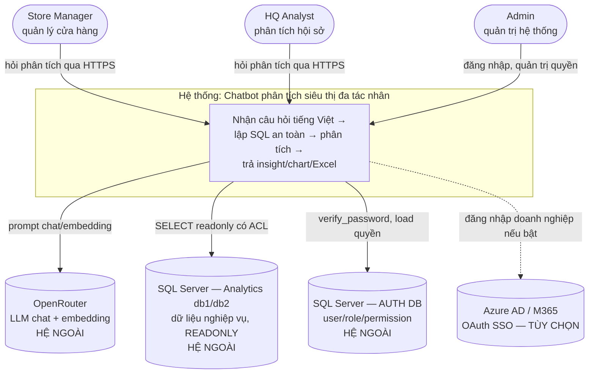
```mermaid
flowchart TB
  SM([Store Manager<br/>quản lý cửa hàng])
  HQ([HQ Analyst<br/>phân tích hội sở])
  AD([Admin<br/>quản trị hệ thống])

  subgraph SYS [Hệ thống: Chatbot phân tích siêu thị đa tác nhân]
    S[Nhận câu hỏi tiếng Việt →<br/>lập SQL an toàn → phân tích →<br/>trả insight/chart/Excel]
  end

  OR[(OpenRouter<br/>LLM chat + embedding<br/>HỆ NGOÀI)]
  SQLB[(SQL Server — Analytics db1/db2<br/>dữ liệu nghiệp vụ, READONLY<br/>HỆ NGOÀI)]
  SQLA[(SQL Server — AUTH DB<br/>user/role/permission<br/>HỆ NGOÀI)]
  AAD[(Azure AD / M365<br/>OAuth SSO — TÙY CHỌN)]

  SM -->|hỏi phân tích qua HTTPS| S
  HQ -->|hỏi phân tích qua HTTPS| S
  AD -->|đăng nhập, quản trị quyền| S
  S -->|prompt chat/embedding| OR
  S -->|SELECT readonly có ACL| SQLB
  S -->|verify_password, load quyền| SQLA
  S -.->|đăng nhập doanh nghiệp nếu bật| AAD
```

### Diễn giải

Context Diagram (C4 mức 1) trả lời câu hỏi *"hệ thống này phục vụ ai và phụ thuộc cái gì bên ngoài?"* — cố tình **giấu toàn bộ chi tiết nội bộ** (không có agent, không container). Ba nhóm **actor** là con người: `store_manager`, `hq_analyst`, `admin` (khớp đúng 3 role trong AUTH DB). Bốn **hệ ngoài** hệ thống phải tích hợp: OpenRouter (nhà cung cấp LLM — mọi "trí tuệ" của agent đến từ đây qua HTTP), SQL Server Analytics (dữ liệu bán hàng, chỉ đọc), SQL Server AUTH DB (danh tính + quyền), và Azure AD (SSO tùy chọn, chỉ bật khi cấu hình OAuth).

Điểm quan trọng: **Redis và MongoDB không xuất hiện ở mức context** vì chúng là thành phần *nội bộ* của hệ thống (chạy trong compose), không phải hệ bên thứ ba — chúng sẽ hiện ở Container Diagram.

### Ví dụ thực tiễn

- **Store manager hỏi doanh thu:** actor `Store Manager` → hệ thống → gọi OpenRouter để hiểu ý định + SQL Server Analytics để lấy số → trả lời. Ba mũi tên ngoài đều được dùng trong một câu hỏi.
- **Triển khai không có Internet công ty/SSO:** cạnh nét đứt tới Azure AD bị bỏ; hệ vẫn chạy đầy đủ bằng đăng nhập username/password trên AUTH DB.
- **OpenRouter mất kết nối:** vì LLM là hệ ngoài, sự cố của nó làm suy giảm toàn hệ — lý do có circuit breaker (Sơ đồ 18).

> **Lược bỏ tạm thời ở sơ đồ này (sẽ giải thích rõ ở sơ đồ sau):** toàn bộ *bên trong hộp* (agents, gateway, tools, Redis/Mongo) được bung ở **Sơ đồ 2 (Container)**; cách chúng chạy trên hạ tầng ở **Sơ đồ 4–20**; cấu trúc AUTH DB ở **Sơ đồ 21**.

---

## Sơ đồ 2 — Container Diagram (C4 Level 2)

Mở hộp đen ở Sơ đồ 1 ra thành **các container triển khai được** (mỗi service Docker = 1 container).

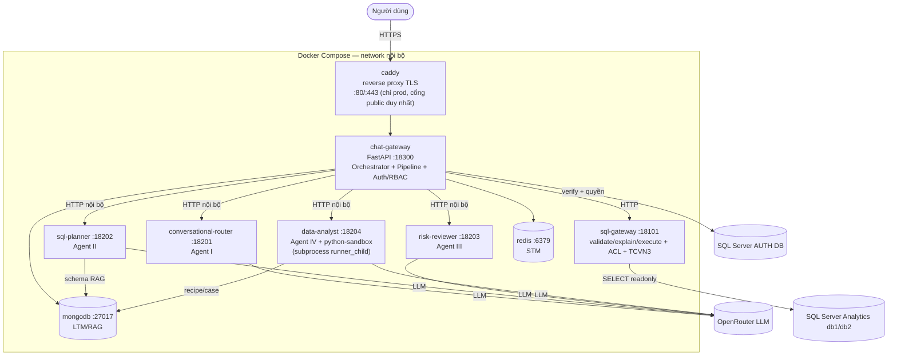
```mermaid
flowchart TB
  U([Người dùng])

  subgraph net [Docker Compose — network nội bộ]
    CADDY["caddy<br/>reverse proxy TLS<br/>:80/:443 (chỉ prod, cổng public duy nhất)"]
    GW["chat-gateway<br/>FastAPI :18300<br/>Orchestrator + Pipeline + Auth/RBAC"]
    A1["conversational-router :18201<br/>Agent I"]
    A2["sql-planner :18202<br/>Agent II"]
    A3["risk-reviewer :18203<br/>Agent III"]
    A4["data-analyst :18204<br/>Agent IV + python-sandbox<br/>(subprocess runner_child)"]
    SG["sql-gateway :18101<br/>validate/explain/execute + ACL + TCVN3"]
    RED[("redis :6379<br/>STM")]
    MON[("mongodb :27017<br/>LTM/RAG")]
  end

  ORT[(OpenRouter LLM)]
  ADB[(SQL Server AUTH DB)]
  BDB[(SQL Server Analytics db1/db2)]

  U -->|HTTPS| CADDY --> GW
  GW -->|HTTP nội bộ| A1 & A2 & A3 & A4
  GW -->|HTTP| SG
  GW --> RED
  GW --> MON
  GW -->|verify + quyền| ADB
  A2 -->|schema RAG| MON
  A4 -->|recipe/case| MON
  A1 & A2 & A3 & A4 -->|LLM| ORT
  SG -->|SELECT readonly| BDB
```

### Diễn giải

Container Diagram (C4 mức 2) cho thấy **8 container nội bộ** và cách chúng nói chuyện. Điểm cực kỳ quan trọng cần tránh hiểu sai: **`python-sandbox` KHÔNG phải một service/container riêng** — nó chạy như **tiến trình con (`runner_child.py`) bên trong container `data-analyst`**. Vì vậy Agent IV và sandbox nằm chung một ranh giới triển khai; đây là lý do IV có thể trực tiếp gọi sandbox mà không qua mạng. Tương tự, **Orchestrator và Pipeline không phải container riêng** mà là module *trong* `chat-gateway`.

Mọi giao tiếp giữa container dùng **HTTP nội bộ theo DNS service** (ví dụ `http://sql-planner:18202`); chỉ `caddy` (ở prod) mở cổng ra ngoài. Ba hình trụ bên phải là hệ ngoài từ Sơ đồ 1, nay nối tới đúng container tiêu thụ chúng: agents↔OpenRouter, sql-gateway↔Analytics, chat-gateway↔AUTH DB.

### Ví dụ thực tiễn

- **Một câu hỏi phân tích:** `caddy → chat-gateway → (A1 phân loại, A2 lập SQL, A3 duyệt) → sql-gateway → Analytics → A4 phân tích (gọi sandbox nội bộ)`. Mỗi mũi tên là một lời gọi HTTP/subprocess thực tế.
- **Vì sao artifacts chia sẻ được:** `chat-gateway` và `data-analyst` cùng mount volume `supermarket-artifacts` — pipeline ghi parquet, Agent IV đọc/ghi chart trên cùng đường dẫn (thấy ở Sơ đồ 4).
- **Chỉ Agent II & IV nối Mongo:** II cần schema RAG, IV cần recipe/case; III và I không cần nên không có cạnh tới Mongo.

> **Lược bỏ tạm thời ở sơ đồ này (sẽ giải thích rõ ở sơ đồ sau):** **cấu hình chạy thực tế** (cổng publish dev vs prod, volumes, healthcheck, secrets) ở **Sơ đồ 4 (Deployment)**; **topology mạng/host và ranh giới bảo mật** ở **Sơ đồ 3 (Infrastructure)**; hành vi động bên trong các container này là toàn bộ **Sơ đồ 5–16**.

---

## Sơ đồ 3 — Infrastructure Diagram (network topology prod)

Topology hạ tầng khi chạy prod: đường đi gói tin từ Internet, ranh giới mạng, và kết nối ra SQL Server ngoài host.

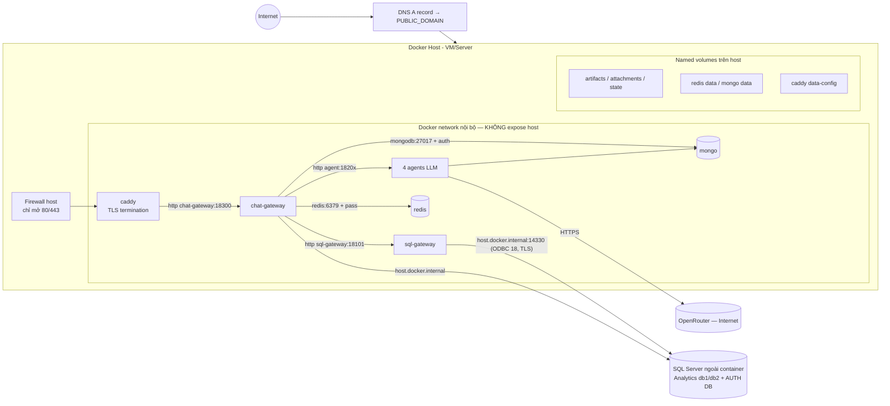
```mermaid
flowchart LR
  NET((Internet)) --> DNS["DNS A record → PUBLIC_DOMAIN"]
  DNS --> HOST

  subgraph HOST [Docker Host - VM/Server]
    direction TB
    FW["Firewall host<br/>chỉ mở 80/443"]
    FW --> CADDY["caddy<br/>TLS termination"]

    subgraph INET [Docker network nội bộ — KHÔNG expose host]
      direction TB
      CADDY -->|http chat-gateway:18300| GW[chat-gateway]
      GW -->|http agent:1820x| AGS[4 agents LLM]
      GW -->|http sql-gateway:18101| SG[sql-gateway]
      GW -->|redis:6379 + pass| RED[(redis)]
      GW -->|mongodb:27017 + auth| MON[(mongo)]
      AGS --> MON
    end

    subgraph VOLS [Named volumes trên host]
      VA[artifacts / attachments / state]
      VB[redis data / mongo data]
      VC[caddy data-config]
    end
  end

  AGS -->|HTTPS| ORT[(OpenRouter — Internet)]
  SG -->|"host.docker.internal:14330 (ODBC 18, TLS)"| SQL[(SQL Server ngoài container<br/>Analytics db1/db2 + AUTH DB)]
  GW -->|host.docker.internal| SQL
```

### Diễn giải

Infrastructure Diagram tập trung vào **ranh giới tin cậy và đường mạng**, không phải logic ứng dụng. Từ Internet, DNS trỏ về host; **firewall chỉ mở 80/443**; `caddy` là điểm chấm dứt TLS và là **thành phần duy nhất chạm được từ ngoài**. Toàn bộ container còn lại nằm trong **docker network nội bộ**, gọi nhau bằng DNS service, không có cổng host — nên kẻ tấn công không thể chạm chat-gateway/agents/DB trực tiếp. Hai đường ra ngoài đặc biệt: agents gọi **OpenRouter qua Internet (HTTPS)**, và `sql-gateway`/`chat-gateway` chạm **SQL Server chạy NGOÀI Docker** (trên host hoặc máy khác) qua `host.docker.internal:14330` với ODBC Driver 18 + TLS — đây là lý do `.env` dùng `host.docker.internal` chứ không phải `localhost`.

Volumes gắn trên host đảm bảo dữ liệu bền vững độc lập vòng đời container.

### Ví dụ thực tiễn

- **Quét cổng từ Internet:** chỉ thấy 443 (và 80 redirect); 18300/18101/18217... đều đóng → giảm bề mặt tấn công.
- **Container tới DB:** `sql-gateway` không dùng `localhost` (sẽ trỏ vào chính container) mà `host.docker.internal,14330` để ra SQL Server trên host — cấu hình sẵn trong `.env.example`.
- **Đặt DB ở máy khác:** chỉ cần đổi `ANALYTICS_DB_DSN`/`AUTH_DB_DSN` sang host DB thật; topology mạng nội bộ không đổi.

> **Lược bỏ tạm thời ở sơ đồ này (sẽ giải thích rõ ở sơ đồ sau):** **các lớp bảo mật logic** áp trên những đường mạng này (JWT, RBAC, internal token, sandbox) ở **Sơ đồ 13**; **cấu trúc bảng bên trong SQL Server** ở **Sơ đồ 21**; ánh xạ container↔volume chi tiết ở **Sơ đồ 4**.

---

## Sơ đồ 4 — Deployment Diagram (dev vs prod)

So sánh hai cấu hình triển khai từ `docker-compose.yaml` (dev) và overlay `docker-compose.prod.yaml`.

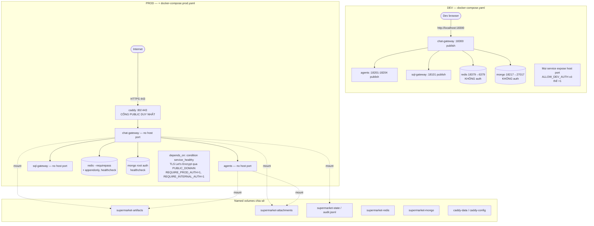
```mermaid
flowchart TB
  subgraph DEV [DEV — docker-compose.yaml]
    direction TB
    dU([Dev browser]) -->|http://localhost:18300| dGW[chat-gateway :18300 publish]
    dGW --> dAgents[agents :18201-18204 publish]
    dGW --> dSG[sql-gateway :18101 publish]
    dGW --> dRED[("redis 18379→6379<br/>KHÔNG auth")]
    dGW --> dMON[("mongo 18217→27017<br/>KHÔNG auth")]
    dNote["Mọi service expose host port<br/>ALLOW_DEV_AUTH có thể =1"]
  end

  subgraph PROD [PROD — + docker-compose.prod.yaml]
    direction TB
    pU([Internet]) -->|HTTPS 443| pCaddy["caddy :80/:443<br/>CỔNG PUBLIC DUY NHẤT"]
    pCaddy --> pGW[chat-gateway — no host port]
    pGW --> pAgents[agents — no host port]
    pGW --> pSG[sql-gateway — no host port]
    pGW --> pRED[("redis --requirepass<br/>+ appendonly, healthcheck")]
    pGW --> pMON[("mongo root auth<br/>healthcheck")]
    pNote["depends_on: condition service_healthy<br/>TLS Let's Encrypt qua PUBLIC_DOMAIN<br/>REQUIRE_PROD_AUTH=1, REQUIRE_INTERNAL_AUTH=1"]
  end

  subgraph VOL [Named volumes chia sẻ]
    v1[supermarket-artifacts]
    v2[supermarket-attachments]
    v3[supermarket-state / audit.jsonl]
    v4[supermarket-redis]
    v5[supermarket-mongo]
    v6[caddy-data / caddy-config]
  end
  pGW -. mount .-> v1 & v2 & v3
  pAgents -. mount .-> v1 & v2
```

### Diễn giải

Deployment Diagram cho thấy **cùng một bộ container nhưng cấu hình chạy khác nhau** giữa dev và prod — điều mà Container Diagram (tĩnh) không thể hiện. **DEV**: mọi service publish cổng ra host (tiện gọi trực tiếp `localhost:182xx`), Redis/Mongo chạy không mật khẩu, có thể bật `ALLOW_DEV_AUTH`. **PROD** (đắp overlay lên dev): tất cả `ports: []` bị gỡ — **chỉ `caddy` mở 80/443**, mọi thứ khác ẩn trong network nội bộ; Redis bật `--requirepass` + `appendonly`, Mongo bật root auth; khởi động có thứ tự nhờ `depends_on: condition: service_healthy`; TLS tự cấp qua Let's Encrypt dựa trên `PUBLIC_DOMAIN`.

Khối **Named volumes** giải thích cách dữ liệu tồn tại qua restart và được chia sẻ: `chat-gateway` (nơi pipeline chạy) ghi parquet + audit, `data-analyst` đọc/ghi artifacts trên **cùng** volume — nền tảng cho phối hợp pipeline↔IV.

### Ví dụ thực tiễn

- **Chạy dev nhanh:** `docker compose up -d` → gọi thẳng `http://localhost:18300/chat`, xem Mongo qua `localhost:18217`.
- **Lên prod:** `docker compose -f docker-compose.yaml -f docker-compose.prod.yaml up -d` → chỉ `https://PUBLIC_DOMAIN` truy cập được; thử `localhost:18202` sẽ **không** kết nối vì cổng đã bị gỡ.
- **Mất điện/restart:** nhờ volume `supermarket-mongo` + `supermarket-redis(appendonly)`, LTM và STM không mất; `audit.jsonl` trong `supermarket-state` giữ vết SQL.

> **Lược bỏ tạm thời ở sơ đồ này (sẽ giải thích rõ ở sơ đồ sau):** **luồng gói tin/ranh giới mạng và cách chạm SQL Server ngoài host** ở **Sơ đồ 3**; **quan hệ giữa auth/secrets** (`REQUIRE_PROD_AUTH`, `INTERNAL_SERVICE_TOKEN`) với luồng đăng nhập ở **Sơ đồ 15**; danh mục biến môi trường đầy đủ ở `docs2/03`.

---

## Sơ đồ 5 — Kiến trúc tổng thể mục tiêu

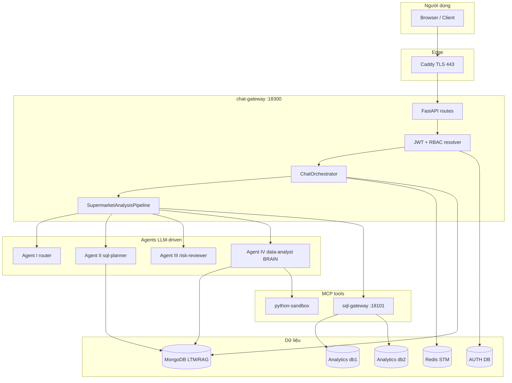
```mermaid
flowchart TB
  subgraph client [Người dùng]
    U[Browser / Client]
  end

  subgraph edge [Edge]
    CADDY[Caddy TLS 443]
  end

  subgraph gw [chat-gateway :18300]
    API[FastAPI routes]
    AUTHM[JWT + RBAC resolver]
    ORCH[ChatOrchestrator]
    PIPE[SupermarketAnalysisPipeline]
  end

  subgraph agents [Agents LLM-driven]
    I[Agent I router]
    II[Agent II sql-planner]
    III[Agent III risk-reviewer]
    IV[Agent IV data-analyst BRAIN]
  end

  subgraph tools [MCP tools]
    SG[sql-gateway :18101]
    SB[python-sandbox]
  end

  subgraph data [Dữ liệu]
    R[(Redis STM)]
    M[(MongoDB LTM/RAG)]
    AUTH[(AUTH DB)]
    DB1[(Analytics db1)]
    DB2[(Analytics db2)]
  end

  U --> CADDY --> API --> AUTHM --> ORCH --> PIPE
  ORCH --> R
  AUTHM --> AUTH
  PIPE --> I & II & III & IV
  II --> M
  IV --> M
  PIPE --> SG
  IV --> SB
  SG --> DB1 & DB2
  ORCH --> M
```

**Ghi chú thiết kế:** IV được nối trực tiếp tới `python-sandbox` và MongoDB (recipe registry), vì IV tự quyết định và tự thực thi phân tích — không còn phụ thuộc pipeline soạn sẵn `execution_plan`.

### Diễn giải

Sơ đồ chia hệ thống thành 5 tầng đi từ ngoài vào trong: **client → edge (Caddy TLS) → chat-gateway → agents LLM → tools/dữ liệu**. Mọi request công khai chỉ đi qua một cửa duy nhất là Caddy (443), sau đó tới `chat-gateway` — nơi chịu trách nhiệm xác thực JWT, giải quyết quyền (RBAC), quản lý phiên trên Redis, và khởi chạy pipeline. Pipeline điều phối bốn agent qua HTTP; các agent tự gọi công cụ (sql-gateway cho SQL, python-sandbox cho phân tích). Bốn kho dữ liệu (Redis, MongoDB, AUTH DB, Analytics db1/db2) tách biệt theo vai trò: Redis giữ ngữ cảnh ngắn hạn, MongoDB giữ tri thức dài hạn (RAG + recipe), AUTH DB giữ người dùng/quyền, còn db1/db2 là dữ liệu nghiệp vụ chỉ-đọc.

Điểm khác biệt của thiết kế mục tiêu nằm ở hai mũi tên `IV → SB` và `IV → M`: Agent IV được trao quyền tự gọi sandbox và tự đọc/ghi recipe, thay vì nhận kế hoạch đúc sẵn từ pipeline.

### Ví dụ thực tiễn

- **Doanh thu cửa hàng 10001 tháng này:** trình duyệt → Caddy → gateway (xác thực + lấy quyền role `store_manager`, chỉ thấy cửa 10001) → pipeline → II sinh SQL → sql-gateway chạy trên db2 → IV phân tích → gateway trả biểu đồ.
- **Redis chết:** gateway không lưu được `WorkflowState`/transcript → phiên mất ngữ cảnh, câu hỏi nối tiếp không nhớ kết quả trước; hệ vẫn trả lời được câu đơn lẻ.
- **MongoDB chết:** mất RAG schema cho II và recipe cho IV → hệ vẫn chạy nhờ fallback (II dùng schema tĩnh, IV sinh script template) nhưng chất lượng gợi ý giảm.

> **Lược bỏ tạm thời ở sơ đồ này (sẽ giải thích rõ ở sơ đồ sau):**
> - **Mọi vòng lặp/feedback** (II↔IV, clarify, retry) chỉ thể hiện bằng các mũi tên tĩnh giữa thành phần — luồng động xem **Sơ đồ 6, 7, 10**.
> - **Bất đối xứng "II thấy schema / IV thấy data"** không hiện trong sơ đồ kiến trúc — xem **Sơ đồ 6** (Note) và **Sơ đồ 10**.
> - **Chuỗi kiểm định bảo mật/quyền** trên đường `PIPE→SG→DB`: xem **Sơ đồ 14, 13, 16**.
> - **Ngân sách, phiên/bộ nhớ**: xem **Sơ đồ 18** và **Sơ đồ 20**.

---

## Sơ đồ 6 — Luồng end-to-end một câu hỏi

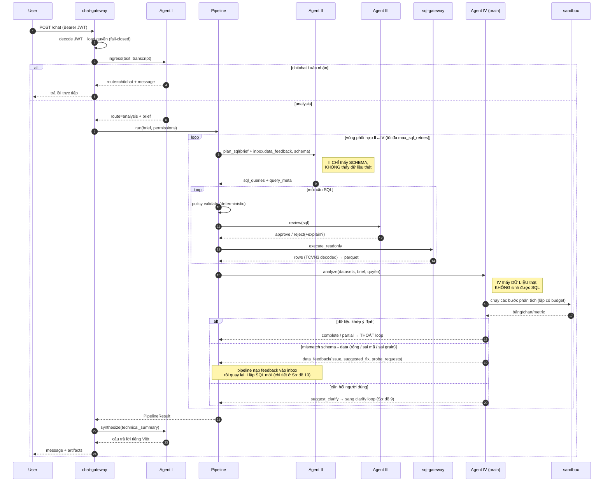
```mermaid
sequenceDiagram
  autonumber
  participant U as User
  participant GW as chat-gateway
  participant I as Agent I
  participant P as Pipeline
  participant II as Agent II
  participant III as Agent III
  participant SG as sql-gateway
  participant IV as Agent IV (brain)
  participant SB as sandbox

  U->>GW: POST /chat (Bearer JWT)
  GW->>GW: decode JWT + load quyền (fail-closed)
  GW->>I: ingress(text, transcript)
  alt chitchat / xác nhận
    I-->>GW: route=chitchat + message
    GW-->>U: trả lời trực tiếp
  else analysis
    I-->>GW: route=analysis + brief
    GW->>P: run(brief, permissions)
    loop vòng phối hợp II↔IV (tối đa max_sql_retries)
      P->>II: plan_sql(brief + inbox.data_feedback, schema)
      Note right of II: II CHỈ thấy SCHEMA,<br/>KHÔNG thấy dữ liệu thật
      II-->>P: sql_queries + query_meta
      loop mỗi câu SQL
        P->>P: policy validate (deterministic)
        P->>III: review(sql)
        III-->>P: approve / reject(+explain?)
        P->>SG: execute_readonly
        SG-->>P: rows (TCVN3 decoded) → parquet
      end
      P->>IV: analyze(datasets, brief, quyền)
      Note right of IV: IV thấy DỮ LIỆU thật,<br/>KHÔNG sinh được SQL
      IV->>SB: chạy các bước phân tích (lặp có budget)
      SB-->>IV: bảng/chart/metric
      alt dữ liệu khớp ý định
        IV-->>P: complete / partial → THOÁT loop
      else mismatch schema↔data (rỗng / sai mã / sai grain)
        IV-->>P: data_feedback(issue, suggested_fix, probe_requests)
        Note over P,II: pipeline nạp feedback vào inbox<br/>rồi quay lại II lập SQL mới (chi tiết ở Sơ đồ 10)
      else cần hỏi người dùng
        IV-->>P: suggest_clarify → sang clarify loop (Sơ đồ 9)
      end
    end
    P-->>GW: PipelineResult
    GW->>I: synthesize(technical_summary)
    I-->>GW: câu trả lời tiếng Việt
    GW-->>U: message + artifacts
  end
```

### Diễn giải

Đây là trình tự thời gian (sequence) của **một** lượt chat. Sau khi xác thực, gateway hỏi Agent I để phân loại: nếu là tán gẫu/xác nhận thì trả lời ngay (nhánh `chitchat`), nếu là yêu cầu phân tích thì Agent I dựng `AnalysisBrief` và trao cho pipeline. Vòng `loop mỗi câu SQL` cho thấy mỗi truy vấn phải qua ba cửa trước khi chạy: policy deterministic → Agent III review → sql-gateway execute; kết quả được ghi ra parquet đã giải mã TCVN3. Sau đó IV phân tích (có thể lặp trong ngân sách), rồi Agent I tổng hợp kết quả kỹ thuật thành câu trả lời tiếng Việt cho người dùng.

**Vòng phối hợp II↔IV (điểm mấu chốt):** hai `Note` trong sơ đồ nêu rõ sự bất đối xứng thông tin — **Agent II chỉ nhìn thấy schema (cấu trúc bảng/cột), không bao giờ thấy dữ liệu thật**; ngược lại **Agent IV thấy dữ liệu thật nhưng không có khả năng sinh SQL**. Vì vậy khi ý tưởng của II (dựa trên schema) không khớp thực tế dữ liệu (rỗng, mã sai định dạng, sai độ mịn/grain), chỉ IV mới phát hiện được, và nó **bắt buộc phải feedback ngược cho II** để II viết lại SQL. Đó là lý do toàn bộ nhánh `analysis` được bọc trong `loop vòng phối hợp II↔IV (tối đa max_sql_retries)`: II→(policy/III/exec)→IV→(nếu mismatch) data_feedback→II→... cho tới khi dữ liệu khớp ý định hoặc hết lượt.

Ý tưởng cốt lõi: **người dùng chỉ nói chuyện với Agent I** (đầu vào và đầu ra), còn II/III/IV là chuyên gia hậu trường; gateway/pipeline là nhạc trưởng điều phối vòng lặp phối hợp đó.

### Ví dụ thực tiễn

- **"Chào bạn":** Agent I trả `route=chitchat`, gateway đáp thẳng, không chạm pipeline — tiết kiệm token và thời gian.
- **"Top 10 SKU bán chạy quý trước":** đi nhánh `analysis`; nếu quý trước nằm ngoài 2 tháng gần thì II sẽ nhắm db1 shard, III duyệt, sql-gateway chạy, IV xếp hạng và vẽ chart.
- **II đoán sai cột mã hàng:** II thấy schema có cả `SKU_ID` lẫn `BARCODE`, chọn `SKU_ID` để lọc → IV chạy thấy kết quả **rỗng** → `data_feedback(identifier_mismatch)` → vòng lặp quay lại II, lần này II probe rồi lọc theo `BARCODE` → có dữ liệu. Đây chính là tương tác II↔IV mà bạn hỏi, thể hiện trong `loop` và chi tiết ở Sơ đồ 10.
- **SQL bị III từ chối vì thiếu filter cửa hàng:** vòng `loop mỗi câu SQL` không execute câu đó; feedback quay lại II để thêm điều kiện `STK_ID` trước khi thử lại.

> **Lược bỏ tạm thời ở sơ đồ này (sẽ giải thích rõ ở sơ đồ sau):**
> - **Chi tiết vòng phối hợp II↔IV** (các loại mismatch, `probe_requests`, `apply_data_feedback`, đếm `attempt`): vẽ gộp thành một nhánh `alt` — xem đầy đủ ở **Sơ đồ 7** (tổng thể các feedback) và **Sơ đồ 10** (riêng loop II↔IV).
> - **Bên trong Agent IV** (`analyze` được vẽ như một hộp; profile→plan→step→eval): xem **Sơ đồ 11** và **Sơ đồ 12**.
> - **Các cửa `policy validate` / `III review`** (chỉ ghi một dòng): chi tiết luật và tiêu chí ở **Sơ đồ 16**.
> - **Clarify** (`suggest_clarify` chỉ trỏ ra ngoài): cơ chế bridge/hỏi user/exploration ở **Sơ đồ 9**.
> - **Xác thực & quyền** (`decode JWT + load quyền` gộp một dòng): chi tiết ở **Sơ đồ 14** (RBAC) và **Sơ đồ 15** (auth sequence).
> - **Ngân sách & circuit breaker** (không vẽ ở đây): xem **Sơ đồ 18**.
> - **Sandbox** (`SB` được vẽ như hộp chạy bước): chi tiết cô lập/giới hạn ở **Sơ đồ 17**.

---

## Sơ đồ 7 — Vòng suy luận giữa các agent (reasoning loop)

Đây là vòng lặp điều phối cấp cao: mỗi agent có thể **đẩy phản hồi ngược** (feedback) khiến vòng lặp quay lại agent trước đó.

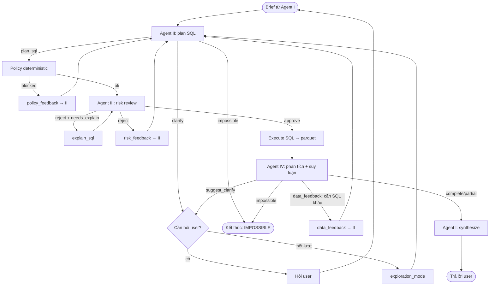
```mermaid
flowchart TD
  START([Brief từ Agent I]) --> II[Agent II: plan SQL]
  II -->|clarify| CLAR{Cần hỏi user?}
  II -->|impossible| END_IMP([Kết thúc: IMPOSSIBLE])
  II -->|plan_sql| POL[Policy deterministic]

  POL -->|blocked| FB_POL[policy_feedback → II] --> II
  POL -->|ok| III[Agent III: risk review]

  III -->|reject + needs_explain| EXP[explain_sql] --> III
  III -->|reject| FB_RISK[risk_feedback → II] --> II
  III -->|approve| EXEC[Execute SQL → parquet]

  EXEC --> IV[Agent IV: phân tích + suy luận]
  IV -->|data_feedback: cần SQL khác| FB_DATA[data_feedback → II] --> II
  IV -->|suggest_clarify| CLAR
  IV -->|impossible| END_IMP
  IV -->|complete/partial| SYN[Agent I: synthesize] --> END_OK([Trả lời user])

  CLAR -->|có| ASK[Hỏi user] --> START
  CLAR -->|hết lượt| EXPL[exploration_mode] --> II
```

**Nguyên tắc:** feedback (`policy_feedback`, `risk_feedback`, `data_feedback`) tích lũy trong `inbox` và được đưa lại vào agent đích ở vòng kế tiếp — tạo vòng suy luận có bộ nhớ ngắn hạn trong một lần chạy (trace).

### Diễn giải

Khác với Sơ đồ 6 (mô tả trình tự thành công), sơ đồ này nhấn mạnh **các đường phản hồi ngược**. Bất kỳ agent nào phát hiện vấn đề đều không "chết" mà đẩy một gói feedback vào `inbox` chung, khiến pipeline quay lại agent phù hợp ở vòng sau. Có ba loại phản hồi: `policy_feedback` (SQL vi phạm luật → quay về II), `risk_feedback` (III thấy rủi ro → quay về II), và `data_feedback` (IV thấy dữ liệu không đủ → quay về II để lấy SQL khác). Mỗi loại vòng lặp có trần riêng (`max_sql_retries`, `max_risk_retries`) để không lặp vô hạn. Khi hết lượt clarify, hệ chuyển sang `exploration_mode` thay vì bỏ cuộc.

Đây chính là "trí thông minh tập thể": lời giải được tinh chỉnh dần qua nhiều vòng, mỗi agent học từ phản hồi của agent khác trong cùng một trace.

### Ví dụ thực tiễn

- **Mã sản phẩm "123" không ra kết quả:** IV trả `data_feedback (identifier_mismatch)` → II thêm bước probe `SKU_DEF`/`BARCODE` → tìm được mã chuẩn → chạy lại thành công.
- **SQL quét toàn bảng lớn:** III trả `risk_feedback` kèm `needs_explain` → pipeline gọi `explain_sql` → nếu kế hoạch vẫn xấu, II viết lại truy vấn có filter thời gian.
- **SQL đụng cột giá vốn `cogs` (bị cấm với store_manager):** policy chặn → `policy_feedback` → II loại cột đó khỏi SELECT rồi thử lại.

> **Lược bỏ tạm thời ở sơ đồ này (sẽ giải thích rõ ở sơ đồ sau):**
> - **Chi tiết riêng loop II↔IV** (attempt, `apply_data_feedback`, các loại mismatch): sơ đồ này gộp `data_feedback` thành một cạnh → xem đầy đủ ở **Sơ đồ 10**.
> - **Bên trong node "Agent IV: phân tích + suy luận"**: xem **Sơ đồ 11** (reasoning loop nội bộ) và **Sơ đồ 12** (thành phần).
> - **Bên trong "Policy deterministic" và "Agent III"**: các luật/tiêu chí cụ thể ở **Sơ đồ 16**.
> - **Nhánh `CLAR` (Cần hỏi user?)**: cơ chế bridge/exploration đầy đủ ở **Sơ đồ 9**.

---

## Sơ đồ 8 — Ma trận quyết định định tuyến (Agent I)

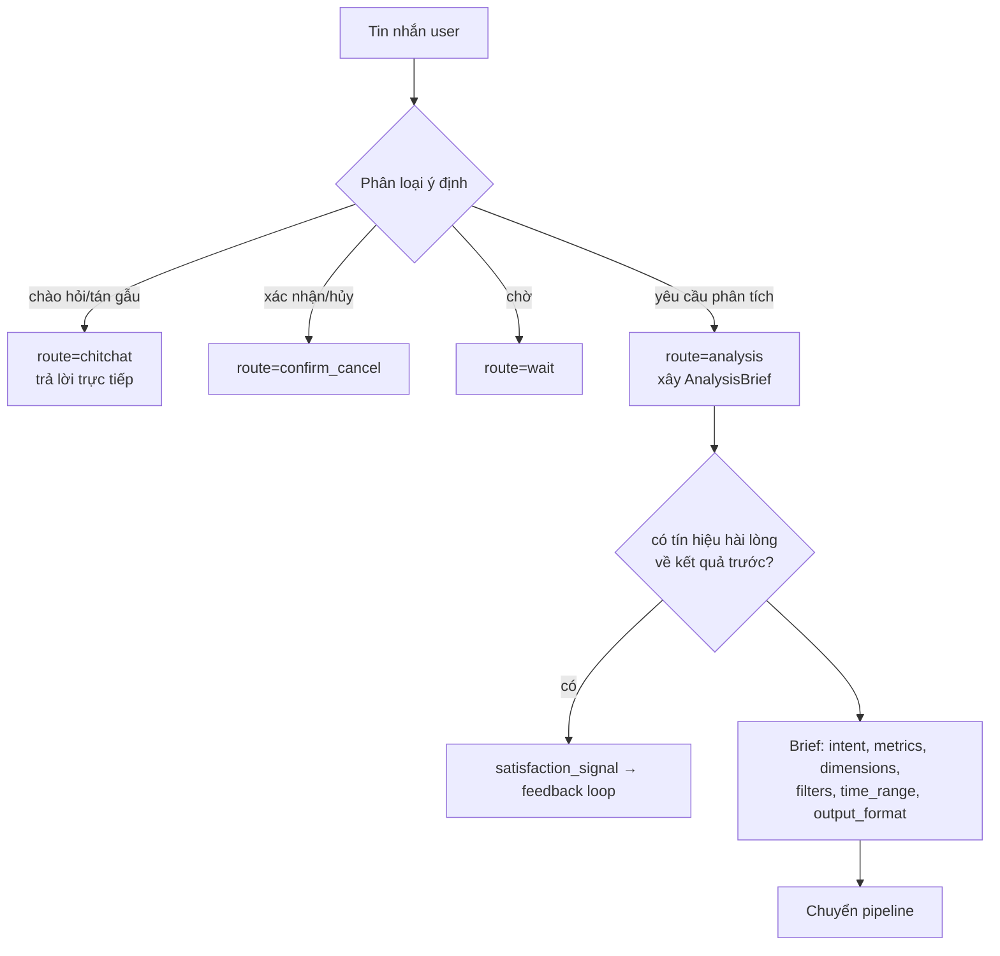
```mermaid
flowchart TD
  MSG[Tin nhắn user] --> CLS{Phân loại ý định}
  CLS -->|chào hỏi/tán gẫu| CHIT[route=chitchat\ntrả lời trực tiếp]
  CLS -->|xác nhận/hủy| CC[route=confirm_cancel]
  CLS -->|chờ| WAIT[route=wait]
  CLS -->|yêu cầu phân tích| ANA[route=analysis\nxây AnalysisBrief]

  ANA --> SIG{có tín hiệu hài lòng\nvề kết quả trước?}
  SIG -->|có| SAT[satisfaction_signal → feedback loop]
  SIG --> BRIEF[Brief: intent, metrics, dimensions,\nfilters, time_range, output_format]
  BRIEF --> PIPE[Chuyển pipeline]
```

### Diễn giải

Sơ đồ mô tả cách Agent I — cửa ngõ hội thoại — quyết định làm gì với mỗi tin nhắn. Bước đầu là **phân loại ý định** thành các nhánh: chào hỏi/tán gẫu (`chitchat`), xác nhận/hủy (`confirm_cancel`), yêu cầu chờ (`wait`), hoặc yêu cầu phân tích (`analysis`). Chỉ nhánh `analysis` mới đi tiếp: Agent I kiểm tra có **tín hiệu hài lòng** về kết quả trước không (để kích hoạt vòng feedback/học hỏi), rồi trích xuất một `AnalysisBrief` có cấu trúc (intent, metrics, dimensions, filters, time_range, output_format) trước khi trao cho pipeline.

Việc phân loại sớm giúp hệ **không phí tài nguyên**: câu xã giao được đáp ngay, chỉ câu phân tích thật mới huy động cả dây chuyền II→III→IV.

### Ví dụ thực tiễn

- **"Cảm ơn nhé":** phân loại `chitchat` → đáp lịch sự, dừng.
- **"Ừ đúng rồi, chạy đi":** `confirm_cancel`=confirm → tiếp tục hành động đang chờ xác nhận.
- **"Cho tôi doanh thu 3 tháng gần nhất theo ngành hàng, xuất Excel":** `analysis` → brief `{intent: revenue_trend, dimensions:[category], time_range: last_3_months, output_format:[excel]}` → pipeline.
- **"Kết quả vừa rồi hay đấy, phân tích sâu hơn phần bánh kẹo":** có `satisfaction_signal` + brief mới thu hẹp filter → kích hoạt vòng học hỏi và phân tích tiếp.

> **Lược bỏ tạm thời ở sơ đồ này (sẽ giải thích rõ ở sơ đồ sau):** node `Chuyển pipeline` là điểm bắt đầu của toàn bộ luồng phân tích (bao gồm vòng II↔IV) — bung ra ở **Sơ đồ 6, 7, 10**. Nhánh `chitchat/confirm/wait` kết thúc ngay tại Agent I nên không đi tiếp. `satisfaction_signal` nuôi vòng học hỏi ở **Sơ đồ 20**.

---

## Sơ đồ 9 — Clarify loop đầy đủ

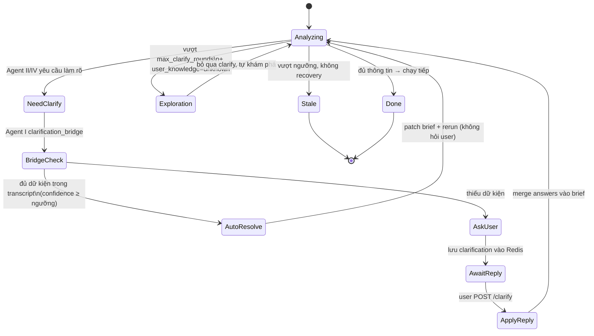
```mermaid
stateDiagram-v2
  [*] --> Analyzing
  Analyzing --> NeedClarify: Agent II/IV yêu cầu làm rõ
  NeedClarify --> BridgeCheck: Agent I clarification_bridge

  BridgeCheck --> AutoResolve: đủ dữ kiện trong transcript\n(confidence ≥ ngưỡng)
  BridgeCheck --> AskUser: thiếu dữ kiện

  AutoResolve --> Analyzing: patch brief + rerun (không hỏi user)

  AskUser --> AwaitReply: lưu clarification vào Redis
  AwaitReply --> ApplyReply: user POST /clarify
  ApplyReply --> Analyzing: merge answers vào brief

  Analyzing --> Exploration: vượt max_clarify_rounds\n+ user_knowledge=unknown
  Exploration --> Analyzing: bỏ qua clarify, tự khám phá
  Analyzing --> Stale: vượt ngưỡng, không recovery
  Analyzing --> Done: đủ thông tin → chạy tiếp
  Stale --> [*]
  Done --> [*]
```

**Quy tắc thiết kế:**
- **Bridge trước, hỏi sau:** Agent I luôn thử tự trả lời clarify từ transcript (bridge). Chỉ hỏi user khi thực sự thiếu.
- **Trần vòng lặp:** `max_clarify_rounds` (mặc định 3). Vượt trần + user "unknown" → **exploration_mode** thay vì hỏi mãi.
- **Nguồn clarify hợp lệ:** chỉ Agent II và Agent IV (không phải III).

### Diễn giải

Sơ đồ trạng thái này mô tả cách hệ **hỏi lại người dùng khi mơ hồ** mà không rơi vào vòng hỏi vô tận. Khi II/IV yêu cầu làm rõ, Agent I không hỏi ngay mà chạy `clarification_bridge`: nó đọc lại transcript xem người dùng đã từng nói đủ thông tin chưa. Nếu đủ và độ tự tin vượt ngưỡng → **tự trả lời (AutoResolve)** và chạy lại, người dùng không bị làm phiền. Chỉ khi thiếu dữ kiện, hệ mới lưu câu hỏi vào Redis và chờ `/clarify`. Nếu số vòng vượt `max_clarify_rounds` và người dùng thuộc nhóm "không rành" (`user_knowledge=unknown`), hệ chuyển sang **exploration_mode**: tự khám phá dữ liệu và gợi ý hướng, thay vì hỏi tiếp. Trạng thái `Stale` là lối thoát an toàn khi không thể phục hồi.

### Ví dụ thực tiễn

- **"Doanh thu VIP" (chưa rõ hạng thẻ):** II clarify → nhưng transcript trước đó user đã nói "thẻ hạng E" → bridge AutoResolve, chạy luôn không hỏi.
- **"Phân tích giúp tôi" (quá chung):** bridge thấy thiếu → hỏi user chọn: doanh thu / xu hướng / tồn kho → user bấm chọn → merge vào brief.
- **User bấm "Tôi không chắc" nhiều lần:** vượt 3 vòng → exploration_mode → IV lấy mẫu dữ liệu và tự đề xuất "Có vẻ bạn quan tâm doanh thu theo tháng, tôi phân tích hướng này nhé".

> **Lược bỏ tạm thời ở sơ đồ này (sẽ giải thích rõ ở sơ đồ sau):**
> - **Ai kích hoạt clarify và vì sao** (II do thiếu tham số, IV do dữ liệu mơ hồ): chi tiết nguồn phát ở **Sơ đồ 7** và **Sơ đồ 11**.
> - **Nội dung `Analyzing`** (thực chất là toàn bộ vòng II→III→exec→IV): gói gọn thành một trạng thái ở đây, xem **Sơ đồ 6, 7, 10**.
> - **Lưu/đọc clarification trên Redis**: liên hệ vòng đời phiên ở **Sơ đồ 20**; máy trạng thái workflow ở **Sơ đồ 19**.

---

## Sơ đồ 10 — Data feedback loop II ↔ IV

Khi IV phát hiện dữ liệu không đủ/không đúng để phân tích, nó phản hồi để II lập lại SQL — vòng lặp có trần `max_sql_retries`.

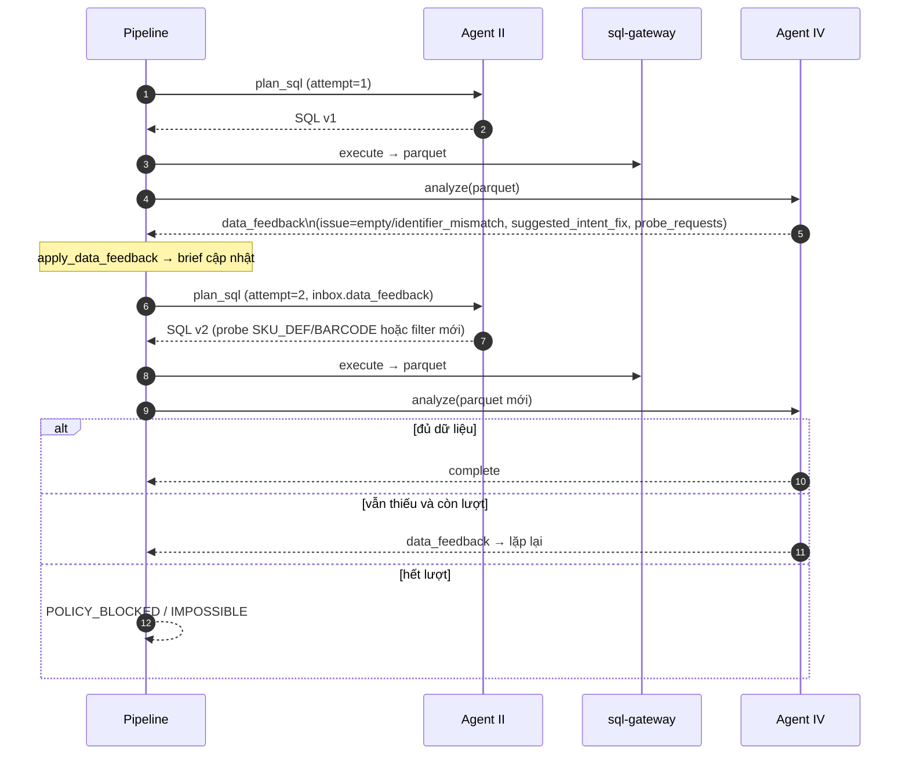
```mermaid
sequenceDiagram
  autonumber
  participant P as Pipeline
  participant II as Agent II
  participant SG as sql-gateway
  participant IV as Agent IV

  P->>II: plan_sql (attempt=1)
  II-->>P: SQL v1
  P->>SG: execute → parquet
  P->>IV: analyze(parquet)
  IV-->>P: data_feedback\n(issue=empty/identifier_mismatch, suggested_intent_fix, probe_requests)
  Note over P: apply_data_feedback → brief cập nhật
  P->>II: plan_sql (attempt=2, inbox.data_feedback)
  II-->>P: SQL v2 (probe SKU_DEF/BARCODE hoặc filter mới)
  P->>SG: execute → parquet
  P->>IV: analyze(parquet mới)
  alt đủ dữ liệu
    IV-->>P: complete
  else vẫn thiếu và còn lượt
    IV-->>P: data_feedback → lặp lại
  else hết lượt
    P-->>P: POLICY_BLOCKED / IMPOSSIBLE
  end
```

**Loại data_feedback thiết kế:**
- `empty_result` → gợi ý mở rộng filter hoặc probe master.
- `identifier_mismatch` → mã sản phẩm sai định dạng (barcode vs SKU nội bộ).
- `grain_mismatch` → cần line-level thay vì tổng hợp.
- `needs_probe` → chạy truy vấn dò trước.

### Diễn giải

Sơ đồ phóng to riêng vòng II ↔ IV để thấy cách **dữ liệu được cải thiện qua từng lần thử**. Pipeline giữ biến `attempt`; ở lần đầu II sinh SQL "ngây thơ", nếu IV báo dữ liệu không dùng được thì pipeline gọi `apply_data_feedback` để vá brief (thêm gợi ý intent, thêm `probe_requests`) rồi giao lại II với `attempt=2`. II lúc này biết nhiều hơn (ví dụ cần dò bảng master trước). Vòng lặp bị chặn bởi `max_sql_retries`; hết lượt mà vẫn thiếu thì pipeline kết thúc bằng `IMPOSSIBLE`/`POLICY_BLOCKED` thay vì trả kết quả sai.

Đây là cơ chế biến "SQL sai một phát là hỏng" thành "thử–học–thử lại" có kiểm soát.

### Ví dụ thực tiễn

- **`empty_result`:** hỏi doanh thu SKU "A123" nhưng filter `SKU_ID='A123'` trả rỗng → IV báo empty + gợi ý probe `SKU_DEF` → II thêm `WHERE BARCODE='A123'` → có dữ liệu.
- **`identifier_mismatch`:** người dùng đưa mã vạch 13 số nhưng bảng bán hàng dùng SKU nội bộ → probe ánh xạ barcode→SKU rồi mới truy vấn doanh thu.
- **`grain_mismatch`:** cần phân tích giỏ hàng (đơn hàng có gì) nhưng SQL v1 đã `SUM` theo ngày → feedback yêu cầu line-level → II bỏ GROUP BY, lấy chi tiết dòng.

> **Lược bỏ tạm thời ở sơ đồ này (sẽ giải thích rõ ở sơ đồ sau):** đây là sơ đồ *chuyên sâu* cho vòng II↔IV mà bạn hỏi, nên phần II↔IV đã đầy đủ; những gì được rút gọn chỉ là:
> - **Bước `execute → parquet`** gộp cả policy deterministic + Agent III review + sql-gateway: tách chi tiết ở **Sơ đồ 16**.
> - **Bên trong `analyze(...)` của IV** (quyết định complete/feedback dựa trên đánh giá LLM): xem **Sơ đồ 11**.
> - **Trần `max_sql_retries` và ngân sách token** khi lặp: cơ chế budget ở **Sơ đồ 18**.

---

## Sơ đồ 11 — Agent IV reasoning loop (mục tiêu refactor)

Đây là **trọng tâm refactor**. Agent IV chuyển từ "executor template" sang "vòng suy luận LLM có công cụ".

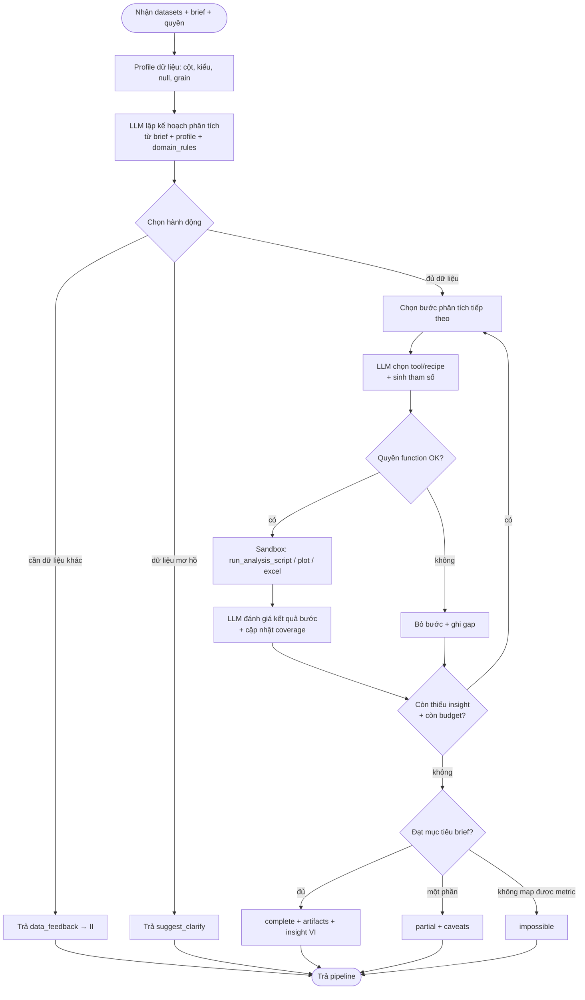
```mermaid
flowchart TD
  IN([Nhận datasets + brief + quyền]) --> PROFILE[Profile dữ liệu: cột, kiểu, null, grain]
  PROFILE --> PLAN[LLM lập kế hoạch phân tích\ntừ brief + profile + domain_rules]
  PLAN --> DECIDE{Chọn hành động}

  DECIDE -->|cần dữ liệu khác| DFB[Trả data_feedback → II]
  DECIDE -->|dữ liệu mơ hồ| CL[Trả suggest_clarify]
  DECIDE -->|đủ dữ liệu| STEP[Chọn bước phân tích tiếp theo]

  STEP --> TOOLSEL[LLM chọn tool/recipe\n+ sinh tham số]
  TOOLSEL --> GATE{Quyền function OK?}
  GATE -->|không| SKIP[Bỏ bước + ghi gap]
  GATE -->|có| RUN[Sandbox: run_analysis_script / plot / excel]

  RUN --> EVAL[LLM đánh giá kết quả bước\n+ cập nhật coverage]
  EVAL --> MORE{Còn thiếu insight\n+ còn budget?}
  MORE -->|có| STEP
  MORE -->|không| ASSESS{Đạt mục tiêu brief?}

  SKIP --> MORE
  ASSESS -->|đủ| DONE[complete + artifacts + insight VI]
  ASSESS -->|một phần| PART[partial + caveats]
  ASSESS -->|không map được metric| IMP[impossible]

  DFB --> OUT([Trả pipeline])
  CL --> OUT
  DONE --> OUT
  PART --> OUT
  IMP --> OUT
```

**Khác biệt then chốt so với hiện trạng:**
- Bước `PLAN`, `TOOLSEL`, `EVAL`, `ASSESS` **do LLM trong Agent IV** thực hiện (hiện tại là template/heuristic trong `iv_analyzer`).
- IV tự vẽ chart theo `chart_spec`, tự gọi `export_excel` khi cần (hiện tại chưa gọi).
- IV dùng `domain_rules_excerpt` trong prompt (hiện tại truyền vào nhưng không dùng).
- Vòng `STEP → EVAL → MORE` là **reasoning loop thực sự**, giới hạn bởi `iv_max_steps`.

### Diễn giải

Đây là bộ não mới của Agent IV. Sau khi nhận dữ liệu, IV **profile** trước (hiểu cột/kiểu/độ mịn/tỷ lệ null), rồi để **LLM lập kế hoạch** dựa trên brief + profile + luật nghiệp vụ (`domain_rules`). Từ kế hoạch, IV rẽ nhánh: cần dữ liệu khác thì trả `data_feedback`; dữ liệu mơ hồ thì `suggest_clarify`; đủ dữ liệu thì bước vào vòng lặp thực thi. Trong vòng lặp, mỗi bước LLM chọn công cụ/recipe và sinh tham số, qua cửa kiểm quyền function, chạy sandbox, rồi **LLM tự đánh giá kết quả** và quyết định còn phân tích tiếp hay dừng (giới hạn bởi `iv_max_steps` và ngân sách). Cuối cùng IV tự chấm: đạt (`complete`), một phần (`partial`), hay không map được metric (`impossible`) — kèm insight bằng tiếng Việt.

Điểm mấu chốt: vòng `STEP → EVAL → MORE` cho phép IV **tự sửa hướng** giữa chừng (ví dụ thấy chart đầu vô nghĩa thì đổi cách nhóm) — điều mà template tuyến tính hiện tại không làm được.

### Ví dụ thực tiễn

- **"So sánh doanh thu 3 cửa hàng theo tháng":** IV profile thấy có cột `STK_ID`, `TRAN_DATE`, `AMOUNT` → LLM lập plan groupby (cửa, tháng) → chạy → EVAL thấy đủ 3 cửa → vẽ line chart → complete.
- **"Phân tích khách VIP" nhưng dữ liệu chỉ có mã thẻ, thiếu tên:** IV chạy bước 1 (đếm theo hạng thẻ), EVAL thấy thiếu thông tin nhân khẩu → thêm bước join CUSTOMER trong budget, hoặc trả `data_feedback` xin thêm cột.
- **Yêu cầu Excel:** brief có `output_format=[excel]` → nhánh TOOLSEL chọn `export_excel` → artifact `.xlsx` (hiện trạng chưa làm được).

> **Lược bỏ tạm thời ở sơ đồ này (sẽ giải thích rõ ở sơ đồ sau):**
> - **Nhánh `DFB` (data_feedback → II)**: đây chính là đầu ra kết nối với vòng II↔IV — sơ đồ này chỉ vẽ IV *phát* feedback, còn *phía II nhận và lập lại SQL* xem **Sơ đồ 10**; bức tranh điều phối tổng ở **Sơ đồ 7**.
> - **Cách gọi sandbox trong node `RUN`**: cô lập/giới hạn/timeout ở **Sơ đồ 17**.
> - **Cửa `GATE (Quyền function OK?)`**: nguồn quyền và các tầng gate ở **Sơ đồ 14**.
> - **Cấu trúc thành phần hiện thực vòng lặp này** (`DataProfiler`, `Planner`, `Evaluator`...): xem **Sơ đồ 12**.

---

## Sơ đồ 12 — Sơ đồ thành phần Agent IV sau refactor

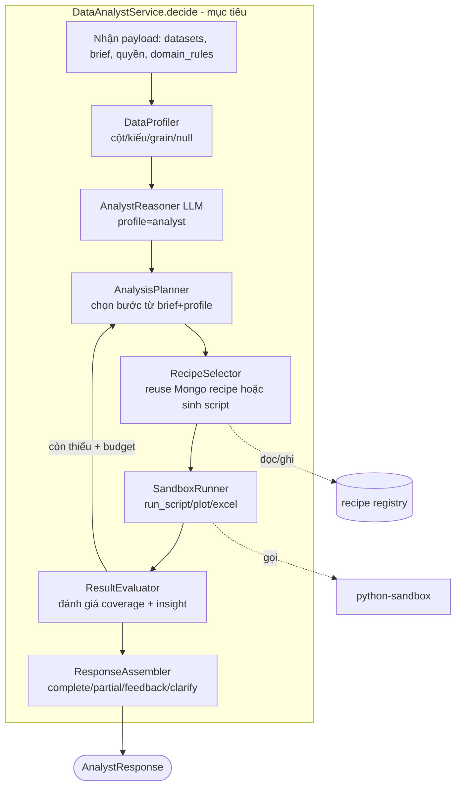
```mermaid
flowchart TB
  subgraph IVsvc [DataAnalystService.decide - mục tiêu]
    ENTRY[Nhận payload: datasets, brief, quyền, domain_rules]
    LLM[AnalystReasoner LLM\nprofile=analyst]
    PROFILER[DataProfiler\ncột/kiểu/grain/null]
    PLANNER[AnalysisPlanner\nchọn bước từ brief+profile]
    SELECTOR[RecipeSelector\nreuse Mongo recipe hoặc sinh script]
    RUNNER[SandboxRunner\nrun_script/plot/excel]
    EVALUATOR[ResultEvaluator\nđánh giá coverage + insight]
    ASSEMBLER[ResponseAssembler\ncomplete/partial/feedback/clarify]
  end

  ENTRY --> PROFILER --> LLM
  LLM --> PLANNER --> SELECTOR --> RUNNER --> EVALUATOR
  EVALUATOR -->|còn thiếu + budget| PLANNER
  EVALUATOR --> ASSEMBLER
  SELECTOR -. đọc/ghi .-> MONGO[(recipe registry)]
  RUNNER -. gọi .-> SB[python-sandbox]
  ASSEMBLER --> OUT([AnalystResponse])
```

**So với hiện trạng:** hiện `iv_analyzer` gộp tất cả thành hàm thủ tục + template; thiết kế mục tiêu tách thành các thành phần có `AnalystReasoner` (LLM) điều khiển vòng lặp `PLANNER→…→EVALUATOR`.

### Diễn giải

Sơ đồ thành phần cho thấy cấu trúc nội bộ mục tiêu của `DataAnalystService.decide()`. Thay vì một hàm thủ tục lớn, IV được tách thành các khối trách nhiệm đơn: `DataProfiler` (hiểu dữ liệu) → `AnalystReasoner`/`AnalysisPlanner` (LLM lập kế hoạch) → `RecipeSelector` (tái dùng recipe Mongo hoặc sinh script) → `SandboxRunner` (chạy) → `ResultEvaluator` (chấm coverage + rút insight) → `ResponseAssembler` (đóng gói kết cục). Mũi tên hồi tiếp `EVALUATOR → PLANNER` (khi còn thiếu và còn budget) chính là vòng suy luận. `RecipeSelector` đọc/ghi recipe registry, `SandboxRunner` gọi python-sandbox.

Kiến trúc này giúp test từng khối độc lập, thay LLM/recipe không ảnh hưởng phần còn lại, và biến IV thành "bộ não" thật sự thay vì lớp vỏ.

### Ví dụ thực tiễn

- **Câu hỏi lặp lại loại đã gặp:** `RecipeSelector` tìm thấy recipe "doanh thu theo tháng" trong Mongo → tái dùng, bỏ qua sinh script từ đầu → nhanh và ổn định.
- **Câu hỏi mới lạ:** không có recipe khớp → `AnalysisPlanner` để LLM sinh script mới; nếu chạy tốt, `ResponseAssembler` đề xuất promote thành recipe.
- **Kết quả chưa đủ sâu:** `ResultEvaluator` thấy coverage thấp và còn budget → quay lại `PLANNER` thêm bước (ví dụ phân rã theo ngành hàng).

> **Lược bỏ tạm thời ở sơ đồ này (sẽ giải thích rõ ở sơ đồ sau):** đây là góc nhìn *cấu trúc mã* (component) của IV; **hành vi động** của vòng `PLANNER→…→EVALUATOR` (rẽ nhánh feedback/clarify/complete) xem **Sơ đồ 11**. Đặc biệt, khi `ResponseAssembler` phát `data_feedback`, phần *II nhận và lập lại SQL* nằm ngoài IV — xem **Sơ đồ 10**. Cửa quyền quanh `SandboxRunner` xem **Sơ đồ 14, 17**.

---

## Sơ đồ 13 — Các lớp bảo mật (defense in depth)

```mermaid
flowchart LR
  U[User input] --> L1[L1: JWT auth\nchat-gateway]
  L1 --> L2[L2: RBAC fail-closed\nPermissionsSnapshot]
  L2 --> L3[L3: Prompt boundary\nAgent I lọc/chuẩn hóa]
  L3 --> L4[L4: SQL policy deterministic\nSELECT-only, no DDL/DML]
  L4 --> L5[L5: Risk review LLM\nAgent III]
  L5 --> L6[L6: sql-gateway ACL\ntable/column/tool grant]
  L6 --> L7[L7: Sandbox isolation\nsubprocess, path guard, timeout, row cap]
  L7 --> L8[L8: Internal service auth\nINTERNAL_SERVICE_TOKEN]

  style L4 fill:#ffe,stroke:#aa0
  style L7 fill:#fee,stroke:#a00
```

**Điểm cần siết khi refactor (hiện là điểm yếu):**
- **L7:** `runner_child` hiện kế thừa toàn bộ `os.environ` → thiết kế mục tiêu **strip env**, chỉ truyền biến tối thiểu (`MPLBACKEND`, path).
- **L3/L4:** `execution_composer` nội suy `card_prefix` vào chuỗi script → mục tiêu **tham số hóa/escape**, không nối chuỗi thô.
- **L8:** bật `REQUIRE_INTERNAL_AUTH=1` ở prod cho mọi lời gọi agent↔gateway↔sql-gateway.

### Diễn giải

Đây là bản đồ "phòng thủ theo chiều sâu": một request phải xuyên qua 8 lớp trước khi chạm dữ liệu, và mỗi lớp chặn một loại mối đe dọa khác nhau. L1–L2 chặn kẻ chưa xác thực/không đủ quyền; L3 chuẩn hóa đầu vào (chống prompt injection sơ khai); L4 là hàng rào **deterministic** cấm mọi thứ không phải SELECT; L5 là thẩm định ngữ nghĩa/hiệu năng bằng LLM; L6 áp ACL bảng/cột; L7 cô lập việc chạy code phân tích; L8 đảm bảo chỉ dịch vụ nội bộ mới gọi được nhau. Hai lớp được tô màu (L4 vàng, L7 đỏ) là hai điểm rủi ro cao nhất và là trọng tâm siết trong refactor.

Triết lý: **không tin lớp nào tuyệt đối**; một lỗ hổng đơn lẻ không đủ để chiếm hệ thống.

### Ví dụ thực tiễn

- **Token hết hạn:** dừng ở L1, không lộ bất kỳ dữ liệu nào.
- **SQL `DROP TABLE`:** L4 chặn ngay bằng luật cú pháp, không cần tốn LLM ở L5.
- **Script phân tích cố đọc `/etc/passwd` hay `os.environ['DB_PASSWORD']`:** L7 chặn bằng path guard + strip env (mục tiêu refactor); dù script "thông minh" cũng không lấy được secret.

> **Lược bỏ tạm thời ở sơ đồ này (sẽ giải thích rõ ở sơ đồ sau):** đây chỉ liệt kê *các lớp* theo thứ tự, chi tiết bên trong từng lớp nằm ở sơ đồ riêng — **L2 (RBAC)** → Sơ đồ 14; **L4+L5 (policy + risk)** → Sơ đồ 16; **L7 (sandbox)** → Sơ đồ 17; **L1 (JWT/auth)** → Sơ đồ 15. Cách các lớp này chen vào dòng chảy end-to-end xem **Sơ đồ 6**.

---

## Sơ đồ 14 — Phân quyền tool (capability RBAC)

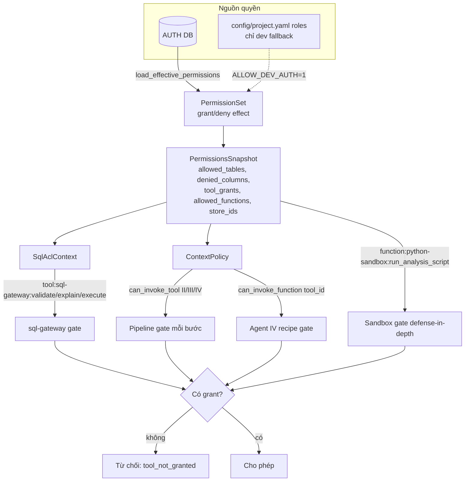
```mermaid
flowchart TB
  subgraph src [Nguồn quyền]
    AUTHDB[(AUTH DB)]
    YAML[config/project.yaml roles\nchỉ dev fallback]
  end

  AUTHDB -->|load_effective_permissions| PSET[PermissionSet\ngrant/deny effect]
  YAML -.->|ALLOW_DEV_AUTH=1| PSET

  PSET --> SNAP[PermissionsSnapshot\nallowed_tables, denied_columns,\ntool_grants, allowed_functions, store_ids]

  SNAP --> ACL[SqlAclContext]
  SNAP --> CP[ContextPolicy]

  ACL -->|tool:sql-gateway:validate/explain/execute| SG[sql-gateway gate]
  CP -->|can_invoke_tool II/III/IV| PIPEGATE[Pipeline gate mỗi bước]
  CP -->|can_invoke_function tool_id| IVGATE[Agent IV recipe gate]
  SNAP -->|function:python-sandbox:run_analysis_script| SBGATE[Sandbox gate defense-in-depth]

  SG --> DENY{Có grant?}
  PIPEGATE --> DENY
  IVGATE --> DENY
  SBGATE --> DENY
  DENY -->|không| BLOCK[Từ chối: tool_not_granted]
  DENY -->|có| ALLOW[Cho phép]
```

**Nguyên tắc capability:**
- Key dạng `tool:<server>:<action>`, `function:<tool_id>`, `table:<name>:select`, `column` deny.
- **Deny thắng grant.** Wildcard `tool:*` / `function:*` cho vai trò rộng (HQ).
- **Gate nhiều tầng:** pipeline gate → sql-gateway gate → sandbox gate (defense in depth), mỗi tầng re-check.

### Diễn giải

Sơ đồ cho thấy quyền **được tính một lần rồi tái sử dụng ở nhiều cửa**. Nguồn chân lý là AUTH DB (dev có thể fallback YAML khi bật `ALLOW_DEV_AUTH=1`); `load_effective_permissions` gộp các grant/deny thành `PermissionSet`, rồi "đóng băng" thành `PermissionsSnapshot` bất biến chứa: bảng được phép, cột bị cấm, tool được cấp, function được phép, và danh sách `store_ids`. Từ snapshot dẫn ra hai đối tượng thực thi: `SqlAclContext` (gác sql-gateway) và `ContextPolicy` (gác pipeline theo bước và gác recipe của IV). Mọi cửa đều hỏi cùng một câu "có grant không?" và áp quy tắc **deny thắng grant**.

Thiết kế "tính một lần, chặn nhiều tầng" vừa nhất quán (không tầng nào tự chế quyền), vừa an toàn (một tầng lọt vẫn còn tầng sau).

### Ví dụ thực tiễn

- **store_manager:** snapshot có `store_ids=[10001]`, `denied_columns=[cogs, margin]`, `tool:sql-gateway:execute` = grant → xem được doanh thu cửa mình, không xem giá vốn.
- **hq_analyst:** `tool:*`, `function:*`, không giới hạn store → chạy mọi recipe, mọi cửa.
- **Vai trò chỉ-xem báo cáo:** không có `tool:sql-gateway:execute` → pipeline gate chặn ngay ở bước II, trả `tool_not_granted`, không tốn lượt gọi sql-gateway.

> **Lược bỏ tạm thời ở sơ đồ này (sẽ giải thích rõ ở sơ đồ sau):** đây là góc nhìn *tĩnh* về nguồn và cửa quyền; **thời điểm** mỗi gate được gọi trong dòng chảy xem **Sơ đồ 6**; các gate này nằm ở lớp nào trong phòng thủ chiều sâu xem **Sơ đồ 13**; cách `SqlAclContext` áp vào từng câu SQL xem **Sơ đồ 16**; snapshot được nạp khi nào xem **Sơ đồ 15**.

---

## Sơ đồ 15 — Auth sequence (login → chat)

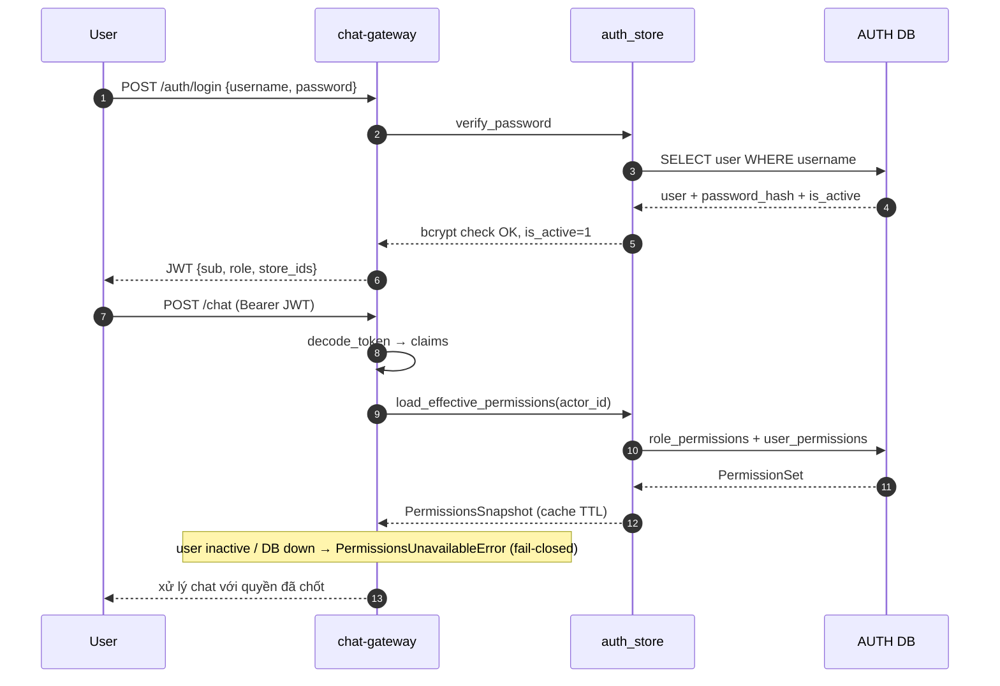
```mermaid
sequenceDiagram
  autonumber
  participant U as User
  participant GW as chat-gateway
  participant AS as auth_store
  participant DB as AUTH DB

  U->>GW: POST /auth/login {username, password}
  GW->>AS: verify_password
  AS->>DB: SELECT user WHERE username
  DB-->>AS: user + password_hash + is_active
  AS-->>GW: bcrypt check OK, is_active=1
  GW-->>U: JWT {sub, role, store_ids}

  U->>GW: POST /chat (Bearer JWT)
  GW->>GW: decode_token → claims
  GW->>AS: load_effective_permissions(actor_id)
  AS->>DB: role_permissions + user_permissions
  DB-->>AS: PermissionSet
  AS-->>GW: PermissionsSnapshot (cache TTL)
  Note over GW: user inactive / DB down → PermissionsUnavailableError (fail-closed)
  GW-->>U: xử lý chat với quyền đã chốt
```

### Diễn giải

Sơ đồ tách rõ hai pha: **đăng nhập** và **dùng dịch vụ**. Khi login, `auth_store` đọc user từ AUTH DB, kiểm bcrypt và cờ `is_active`, rồi phát JWT chứa `sub`, `role`, `store_ids`. Từ đó về sau, mỗi `/chat` chỉ mang Bearer JWT; gateway decode để lấy claims và gọi `load_effective_permissions` để dựng `PermissionsSnapshot` (có cache TTL để không truy AUTH DB mỗi request). Điểm quan trọng ghi ở `Note`: nếu user bị vô hiệu hóa hoặc AUTH DB sập, hệ ném `PermissionsUnavailableError` và **fail-closed** — thà từ chối còn hơn cấp nhầm quyền.

Tách JWT (danh tính) khỏi snapshot quyền (ủy quyền) cho phép thu hồi quyền tức thì: đổi quyền trong DB có hiệu lực khi cache hết hạn, không cần user đăng nhập lại.

### Ví dụ thực tiễn

- **Sai mật khẩu:** dừng ở `verify_password`, không phát token.
- **Admin khóa tài khoản giữa phiên:** JWT còn hạn nhưng `load_effective_permissions` thấy `is_active=0` → fail-closed, chặn chat.
- **AUTH DB bảo trì:** snapshot không dựng được → `PermissionsUnavailableError`, trả lỗi thay vì đoán quyền.

> **Lược bỏ tạm thời ở sơ đồ này (sẽ giải thích rõ ở sơ đồ sau):** nội dung `PermissionSet`/`PermissionsSnapshot` và cách nó dẫn ra các gate xem **Sơ đồ 14**; đây là lớp L1–L2 trong **Sơ đồ 13**; điều gì xảy ra *sau* khi "xử lý chat với quyền đã chốt" (toàn bộ pipeline) xem **Sơ đồ 6**.

---

## Sơ đồ 16 — SQL policy + risk review

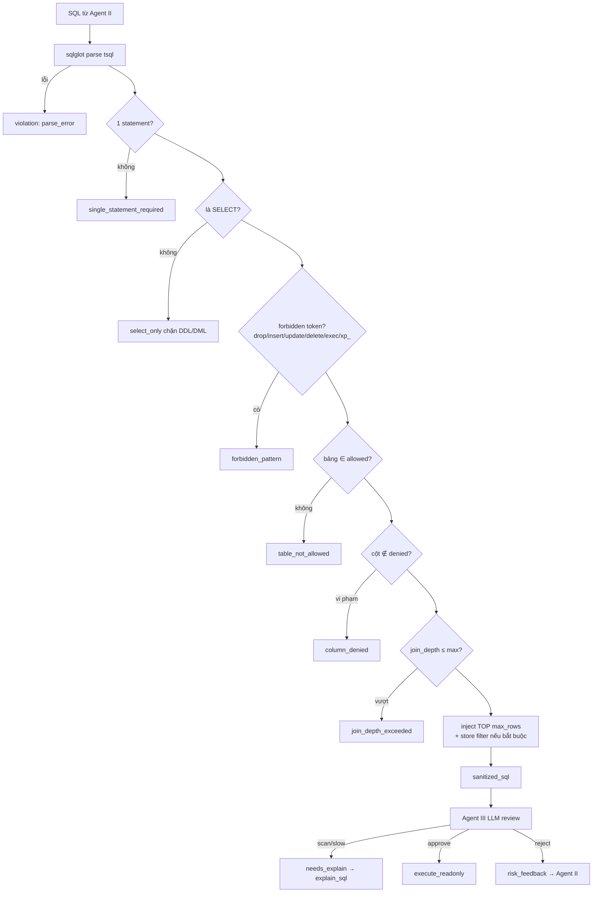
```mermaid
flowchart TD
  SQL[SQL từ Agent II] --> PARSE[sqlglot parse tsql]
  PARSE -->|lỗi| V1[violation: parse_error]
  PARSE --> N{1 statement?}
  N -->|không| V2[single_statement_required]
  N --> SEL{là SELECT?}
  SEL -->|không| V3[select_only chặn DDL/DML]
  SEL --> PAT{forbidden token?\ndrop/insert/update/delete/exec/xp_}
  PAT -->|có| V4[forbidden_pattern]
  PAT --> TBL{bảng ∈ allowed?}
  TBL -->|không| V5[table_not_allowed]
  TBL --> COL{cột ∉ denied?}
  COL -->|vi phạm| V6[column_denied]
  COL --> JOIN{join_depth ≤ max?}
  JOIN -->|vượt| V7[join_depth_exceeded]
  JOIN --> INJECT[inject TOP max_rows\n+ store filter nếu bắt buộc]
  INJECT --> OK[sanitized_sql]

  OK --> R[Agent III LLM review]
  R -->|scan/slow| NEEDEXP[needs_explain → explain_sql]
  R -->|approve| EXEC[execute_readonly]
  R -->|reject| BACK[risk_feedback → Agent II]
```

**Thiết kế:** policy deterministic chạy **trước** để loại bỏ SQL nguy hiểm/không hợp lệ (tiết kiệm token LLM); Agent III chỉ review ngữ nghĩa/hiệu năng trên SQL đã sạch.

### Diễn giải

Sơ đồ mô tả "dây chuyền kiểm định" một câu SQL. `sqlglot` parse theo phương ngữ T-SQL; nếu lỗi cú pháp dừng ngay. Sau đó là chuỗi cửa deterministic: đúng một statement → phải là SELECT → không chứa token cấm (`drop/insert/update/delete/exec/xp_`) → bảng nằm trong danh sách cho phép → không đụng cột bị cấm → độ sâu JOIN không vượt trần. Vượt hết thì hệ **tự tiêm** `TOP <max_rows>` và filter cửa hàng bắt buộc, cho ra `sanitized_sql`. Chỉ khi đó Agent III (LLM) mới vào cuộc để đánh giá những thứ máy không quyết được: truy vấn có quét chậm không, có cần `explain_sql` không, có nên từ chối và gửi feedback không.

Trật tự "máy trước, người/LLM sau" giúp loại bỏ phần lớn SQL xấu bằng luật rẻ tiền, dành LLM cho phán đoán tinh tế.

### Ví dụ thực tiễn

- **`SELECT * FROM SALES`:** qua các cửa nhưng bị tiêm `TOP 5000` + `WHERE STK_ID IN (10001)` trước khi chạy.
- **`SELECT ... ; DELETE FROM ...`:** rớt ở cửa "1 statement?" → `single_statement_required`.
- **JOIN 6 bảng lồng nhau:** rớt `join_depth_exceeded` → feedback yêu cầu II đơn giản hóa; nếu chỉ chậm chứ không sai, III trả `needs_explain` để xem kế hoạch thực thi.

> **Lược bỏ tạm thời ở sơ đồ này (sẽ giải thích rõ ở sơ đồ sau):**
> - **Nhánh `reject → risk_feedback → Agent II`** chỉ vẽ đầu ra; vòng II nhận và lập lại SQL xem **Sơ đồ 7** (và tương tự loop dữ liệu ở **Sơ đồ 10**).
> - **Nguồn `allowed`/`denied` tables/columns** dùng để kiểm ở đây đến từ **Sơ đồ 14** (RBAC snapshot).
> - **Vị trí của toàn bộ dây chuyền này** trong phòng thủ chiều sâu là L4+L5 của **Sơ đồ 13**.

---

## Sơ đồ 17 — Sandbox execution an toàn

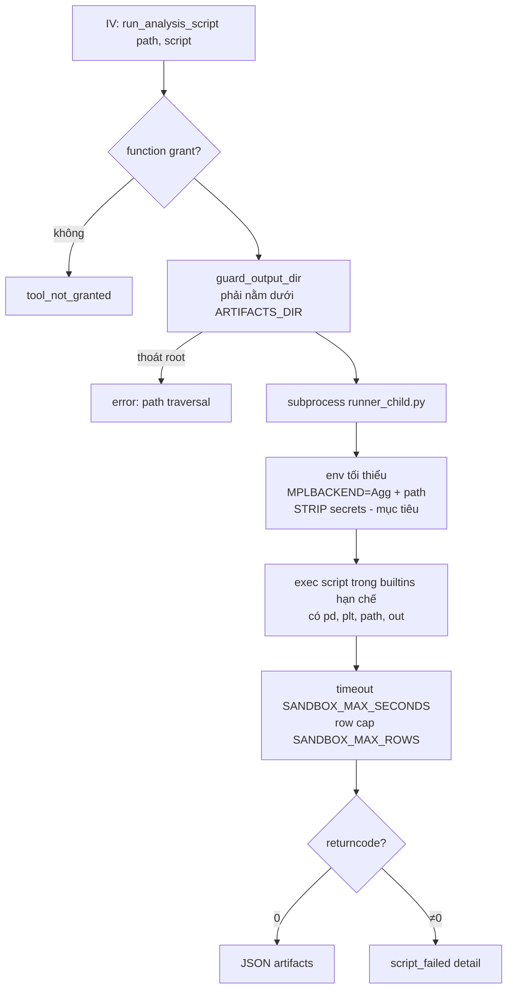
```mermaid
flowchart TD
  REQ[IV: run_analysis_script path, script] --> GRANT{function grant?}
  GRANT -->|không| DENY[tool_not_granted]
  GRANT --> GUARD[guard_output_dir\nphải nằm dưới ARTIFACTS_DIR]
  GUARD -->|thoát root| ERR[error: path traversal]
  GUARD --> SPAWN[subprocess runner_child.py]
  SPAWN --> ENV[env tối thiểu\nMPLBACKEND=Agg + path\nSTRIP secrets - mục tiêu]
  ENV --> EXECD[exec script trong builtins hạn chế\ncó pd, plt, path, out]
  EXECD --> LIMIT[timeout SANDBOX_MAX_SECONDS\nrow cap SANDBOX_MAX_ROWS]
  LIMIT --> RESULT{returncode?}
  RESULT -->|0| OK[JSON artifacts]
  RESULT -->|≠0| FAIL[script_failed detail]
```

**Mục tiêu hardening:** ô `ENV` — không copy toàn bộ `os.environ`; chỉ whitelist. Đây là một trong các fix bắt buộc kèm refactor IV.

### Diễn giải

Sơ đồ chi tiết hóa lớp L7 (sandbox). Khi IV muốn chạy script, hệ kiểm tra function grant trước; rồi `guard_output_dir` đảm bảo thư mục ghi kết quả nằm dưới `ARTIFACTS_DIR` (chống path traversal). Script được chạy trong **tiến trình con** riêng (`runner_child.py`) với môi trường tối thiểu và bộ builtins bị hạn chế (chỉ có `pd`, `plt`, `path`, `out`). Hai giới hạn cứng bảo vệ hệ: `SANDBOX_MAX_SECONDS` (chống treo/loop vô hạn) và `SANDBOX_MAX_ROWS` (chống ngốn RAM). Kết thúc, returncode 0 → trả JSON artifacts, khác 0 → trả lỗi `script_failed` có chi tiết. Ô `ENV` là điểm phải siết: hiện kế thừa toàn bộ `os.environ`, mục tiêu chỉ whitelist.

Nguyên tắc: **cô lập tối đa** — code do LLM sinh ra bị coi là không đáng tin và chạy trong "lồng kính".

### Ví dụ thực tiễn

- **Script `while True: pass`:** bị `SANDBOX_MAX_SECONDS` cắt → `script_failed (timeout)`, không treo dịch vụ.
- **Script ghi ra `../../secret.txt`:** `guard_output_dir` phát hiện thoát root → error path traversal.
- **Script đọc `os.environ`:** với thiết kế strip env, chỉ thấy `MPLBACKEND` và path an toàn, không thấy chuỗi kết nối DB.

> **Lược bỏ tạm thời ở sơ đồ này (sẽ giải thích rõ ở sơ đồ sau):** **ai** yêu cầu chạy script và **script từ đâu ra** (LLM của IV chọn recipe/sinh tham số) xem **Sơ đồ 11** và **Sơ đồ 12**; cửa `function grant?` lấy quyền từ **Sơ đồ 14**; vị trí sandbox trong phòng thủ chiều sâu là L7 của **Sơ đồ 13**.

---

## Sơ đồ 18 — Budget + circuit breaker

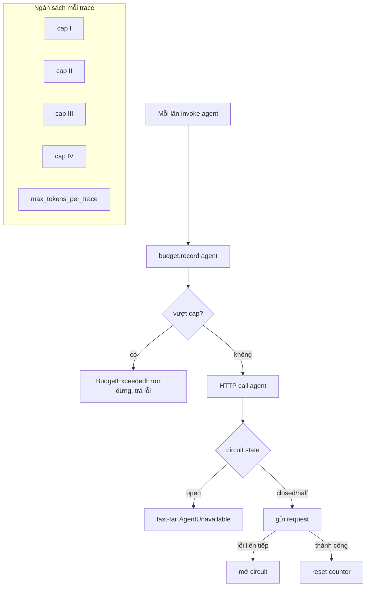
```mermaid
flowchart TB
  subgraph budget [Ngân sách mỗi trace]
    CAP_I[cap I]
    CAP_II[cap II]
    CAP_III[cap III]
    CAP_IV[cap IV]
    TOK[max_tokens_per_trace]
  end

  INV[Mỗi lần invoke agent] --> REC[budget.record agent]
  REC --> CHK{vượt cap?}
  CHK -->|có| BEX[BudgetExceededError → dừng, trả lỗi]
  CHK -->|không| CALL[HTTP call agent]

  CALL --> CB{circuit state}
  CB -->|open| FAST[fast-fail AgentUnavailable]
  CB -->|closed/half| DO[gửi request]
  DO -->|lỗi liên tiếp| OPEN[mở circuit]
  DO -->|thành công| RESET[reset counter]
```

Budget chống cháy token/loop; circuit breaker (trong `HttpAgentInvoker`/`HttpSqlGatewayClient`) chống lan lỗi khi một agent chết.

### Diễn giải

Sơ đồ ghép hai cơ chế bảo vệ chi phí và độ ổn định. **Budget** đặt trần cho mỗi trace: cap riêng từng agent (I/II/III/IV) và trần token tổng `max_tokens_per_trace`. Trước mỗi lần gọi agent, hệ `record` mức dùng và kiểm tra vượt cap chưa; vượt thì ném `BudgetExceededError` để dừng sớm — tránh một câu hỏi "ngốn" hết tài nguyên do vòng lặp phản hồi. **Circuit breaker** bọc quanh lời gọi HTTP: khi một agent lỗi liên tiếp, breaker chuyển sang `open` và **fast-fail** các request kế tiếp (không chờ timeout dài), sau một khoảng thử lại ở trạng thái `half`; thành công thì `reset`.

Hai cơ chế bổ trợ: budget chặn "cháy" do vòng lặp/token; breaker chặn "lan" lỗi khi một dịch vụ downstream chết.

### Ví dụ thực tiễn

- **Data feedback lặp nhiều vòng:** mỗi vòng cộng token; chạm `max_tokens_per_trace` → `BUDGET_EXCEEDED`, trả kết quả tốt nhất hiện có kèm cảnh báo.
- **sql-gateway sập:** sau N lỗi liên tiếp, breaker mở → các câu hỏi mới fail nhanh với `AgentUnavailable` thay vì treo 30s mỗi request.
- **Agent III phục hồi:** breaker ở `half`, một request thử thành công → `reset`, hệ trở lại bình thường.

> **Lược bỏ tạm thời ở sơ đồ này (sẽ giải thích rõ ở sơ đồ sau):** "Mỗi lần invoke agent" trừu tượng hóa các lời gọi cụ thể trong dòng chảy — xem chúng ở **Sơ đồ 6**; vòng lặp nào tiêu ngân sách (II↔IV, clarify) xem **Sơ đồ 7, 9, 10**; giá trị cap/token cấu hình ở phần biến môi trường (`docs2/03`).

---

## Sơ đồ 19 — Workflow state machine

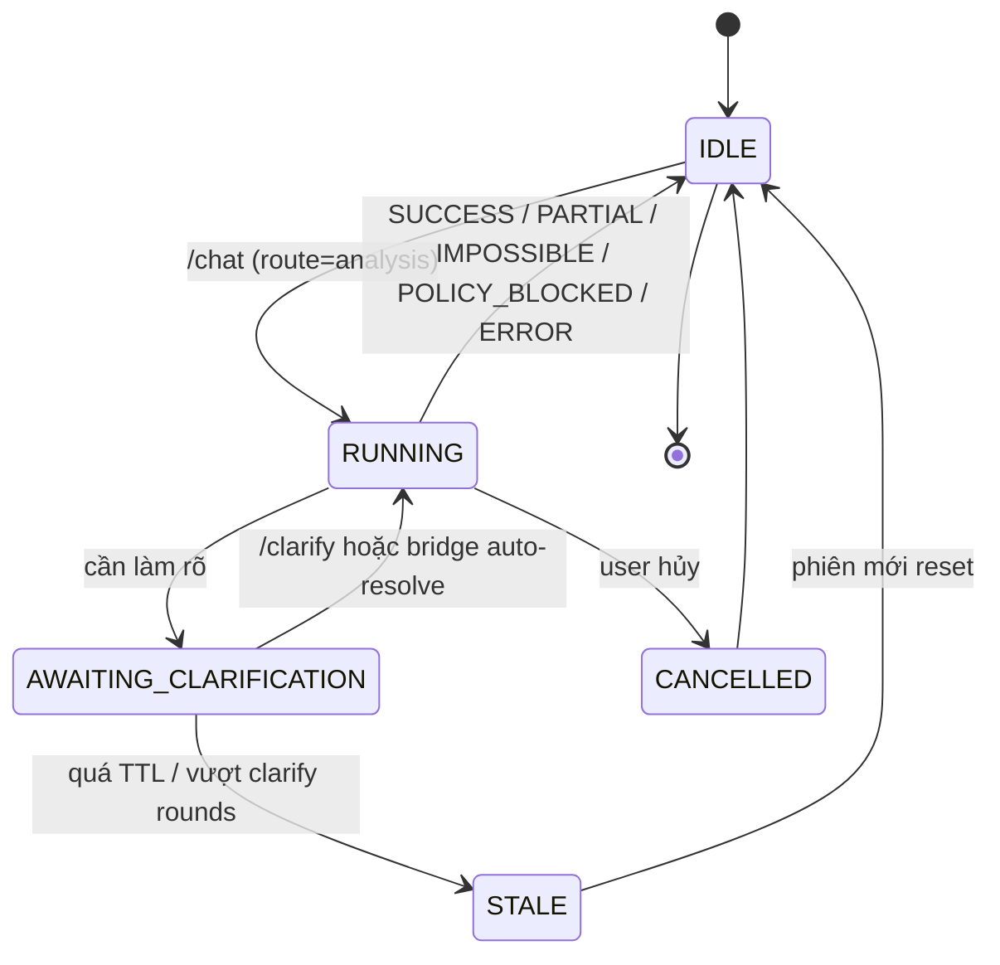
```mermaid
stateDiagram-v2
  [*] --> IDLE
  IDLE --> RUNNING: /chat (route=analysis)
  RUNNING --> AWAITING_CLARIFICATION: cần làm rõ
  AWAITING_CLARIFICATION --> RUNNING: /clarify hoặc bridge auto-resolve
  RUNNING --> IDLE: SUCCESS / PARTIAL / IMPOSSIBLE / POLICY_BLOCKED / ERROR
  AWAITING_CLARIFICATION --> STALE: quá TTL / vượt clarify rounds
  RUNNING --> CANCELLED: user hủy
  STALE --> IDLE: phiên mới reset
  CANCELLED --> IDLE
  IDLE --> [*]
```

Trạng thái lưu trong Redis (`WorkflowState`), refresh TTL mỗi lần ghi; `progress_step` cho client poll tiến độ.

### Diễn giải

Sơ đồ trạng thái cho biết một phiên phân tích tại mỗi thời điểm đang ở đâu. Mặc định là `IDLE`; khi có `/chat` phân tích thì sang `RUNNING`. Nếu cần làm rõ, phiên chờ ở `AWAITING_CLARIFICATION` và quay lại `RUNNING` khi user gọi `/clarify` hoặc khi bridge tự giải quyết. Mọi kết cục (thành công, một phần, bất khả, bị chặn policy, lỗi) đều đưa về `IDLE`. Hai lối rẽ đặc biệt: chờ clarify quá lâu/quá số vòng → `STALE`; user chủ động hủy → `CANCELLED`. Toàn bộ trạng thái sống trong Redis với TTL được làm mới mỗi lần ghi, và `progress_step` cho phép client hiển thị tiến độ.

Máy trạng thái này chính là "hợp đồng" giúp gateway biết được request tiếp theo của user nên xử lý ra sao (câu hỏi mới hay câu trả lời clarify).

### Ví dụ thực tiễn

- **Hỏi–đáp trơn tru:** IDLE → RUNNING → IDLE, client thấy các `progress_step`: "Đang lập SQL" → "Đang kiểm duyệt" → "Đang phân tích".
- **Cần làm rõ:** RUNNING → AWAITING_CLARIFICATION (UI hiện câu hỏi) → user trả lời `/clarify` → RUNNING → IDLE.
- **User bỏ đi:** phiên kẹt ở AWAITING_CLARIFICATION quá TTL → STALE; lần chat sau tạo phiên mới, không "kế thừa" câu hỏi cũ.

> **Lược bỏ tạm thời ở sơ đồ này (sẽ giải thích rõ ở sơ đồ sau):** trạng thái `RUNNING` gói toàn bộ hoạt động phân tích (vòng II↔IV, policy/III, IV reasoning) — bung ra ở **Sơ đồ 6, 7, 11, 10**. Nhánh vào/ra `AWAITING_CLARIFICATION` chi tiết ở **Sơ đồ 9**. Nơi lưu trữ (`WorkflowState` trên Redis) và quan hệ với transcript/clarification xem **Sơ đồ 20**.

---

## Sơ đồ 20 — Vòng đời phiên và bộ nhớ

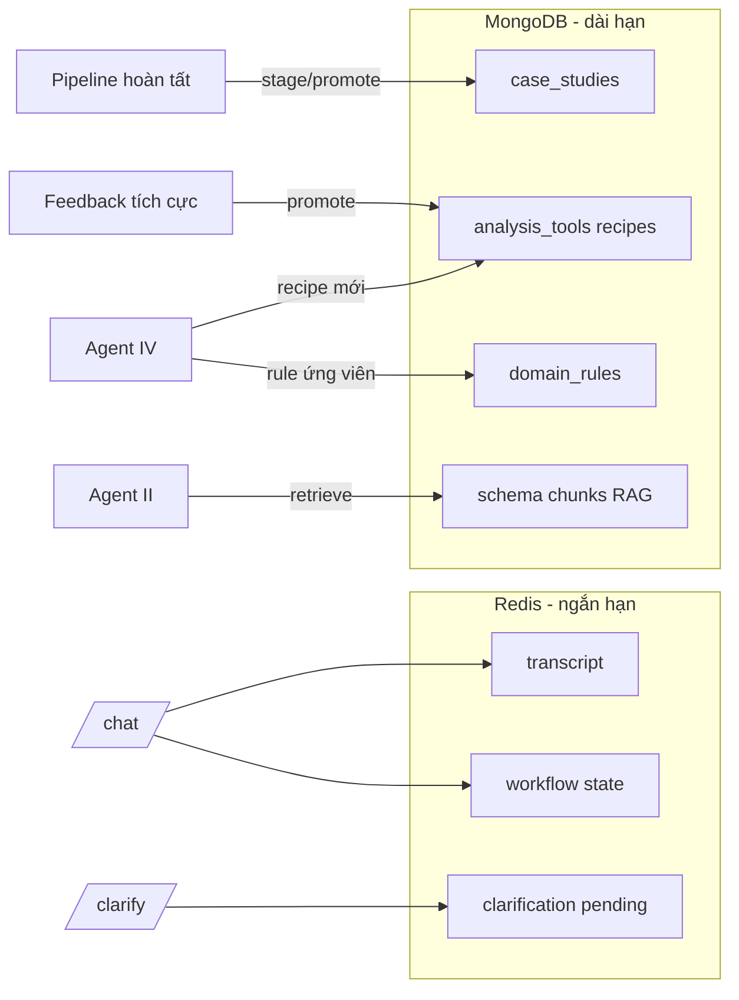
```mermaid
flowchart LR
  subgraph STM [Redis - ngắn hạn]
    T[transcript]
    W[workflow state]
    C[clarification pending]
  end
  subgraph LTM [MongoDB - dài hạn]
    CS[case_studies]
    AT[analysis_tools recipes]
    DR[domain_rules]
    SC[schema chunks RAG]
  end

  CHAT[/chat/] --> T
  CHAT --> W
  CLAR[/clarify/] --> C
  PIPE[Pipeline hoàn tất] -->|stage/promote| CS
  IV[Agent IV] -->|recipe mới| AT
  IV -->|rule ứng viên| DR
  II[Agent II] -->|retrieve| SC
  FB[Feedback tích cực] -->|promote| AT
```

**Thiết kế học hỏi:** phân tích thành công (attempt=1, không data_feedback) tự **promote** thành case study/recipe tái sử dụng; tín hiệu hành vi (download, re-ask) điều chỉnh điểm promote.

### Diễn giải

Sơ đồ phân tách bộ nhớ theo tuổi thọ. **STM (Redis)** giữ thứ nhất thời của phiên: transcript hội thoại, `workflow state`, câu clarify đang chờ — tất cả có TTL và biến mất sau phiên. **LTM (MongoDB)** giữ tri thức bền: case studies, recipe phân tích (`analysis_tools`), luật nghiệp vụ (`domain_rules`), và các chunk schema cho RAG. Các luồng ghi cho thấy vòng học hỏi: pipeline hoàn tất tốt thì stage/promote thành case study; IV tạo recipe/rule mới; II retrieve schema khi lập SQL; và tín hiệu phản hồi tích cực (user tải file, không hỏi lại) nâng điểm để promote recipe.

Ý tưởng: hệ **giỏi dần lên** — mỗi phân tích thành công làm giàu LTM để lần sau nhanh và chính xác hơn, còn STM đảm bảo mạch hội thoại liền lạc trong phiên.

### Ví dụ thực tiễn

- **Hỏi nối tiếp "còn tháng trước thì sao?":** nhờ transcript trong STM, Agent I hiểu "còn... thì sao" ám chỉ cùng metric của câu trước.
- **Recipe được tái dùng:** phân tích "top SKU theo doanh thu" thành công một lần → promote → lần sau câu tương tự dùng lại recipe, ra kết quả nhanh.
- **Rule ứng viên:** IV phát hiện "doanh thu luôn cần loại giao dịch hoàn trả" → đề xuất `domain_rule`; sau khi duyệt, các phân tích sau tự áp dụng.

> **Lược bỏ tạm thời ở sơ đồ này (sẽ giải thích rõ ở sơ đồ sau):** cạnh `II → retrieve → schema chunks` là đầu vào cho việc II lập SQL — vì sao II cần schema (và không thấy data) xem **Sơ đồ 6, 10**; máy trạng thái quản lý `workflow state`/`clarification pending` trên Redis xem **Sơ đồ 19**; điều kiện promote recipe/case study gắn với đánh giá của IV ở **Sơ đồ 11, 12**.

---

## Sơ đồ 21 — ER Diagram (AUTH DB + RBAC)

Mô hình thực thể–quan hệ của **AUTH DB** (nguồn chân lý cho danh tính và phân quyền), dựng từ `deploy/sql/auth/*.sql`.

```mermaid
erDiagram
  users ||--o{ oauth_accounts : "có tài khoản OAuth"
  users ||--o{ sessions_audit : "ghi phiên"
  users ||--o{ user_permissions : "grant/revoke riêng"
  roles ||--o{ role_permissions : "gồm quyền"
  permissions ||--o{ role_permissions : "được tham chiếu"
  permissions ||--o{ user_permissions : "được tham chiếu"
  roles ||..o{ users : "role (chuỗi, không FK cứng)"

  users {
    uniqueidentifier user_id PK
    nvarchar username UK "nullable, unique khi có"
    nvarchar email UK
    nvarchar display_name
    nvarchar role "default store_manager"
    nvarchar store_ids "CSV cửa hàng được phép"
    nvarchar password_hash "bcrypt, nullable nếu OAuth"
    bit is_active "fail-closed khi 0"
    datetime2 created_at
  }
  oauth_accounts {
    uniqueidentifier oauth_id PK
    uniqueidentifier user_id FK
    nvarchar provider
    nvarchar provider_user_id
    datetime2 created_at
  }
  sessions_audit {
    nvarchar session_id PK
    uniqueidentifier user_id FK
    datetime2 created_at
    datetime2 last_seen_at
  }
  permissions {
    nvarchar permission_key PK "vd tool:sql-gateway:execute"
    nvarchar category "data | tool | function"
    nvarchar description
  }
  roles {
    nvarchar role_key PK "admin|store_manager|hq_analyst"
    nvarchar description
  }
  role_permissions {
    nvarchar role_key PK "PK ghép"
    nvarchar permission_key PK "PK ghép"
  }
  user_permissions {
    uniqueidentifier user_id PK "PK ghép"
    nvarchar permission_key PK "PK ghép"
    nvarchar effect "grant | revoke"
  }
```

### Diễn giải

ER Diagram mô tả 7 bảng của AUTH DB và cách phân quyền capability được lưu. Trục danh tính: `users` (1) — (n) `oauth_accounts` và `sessions_audit` (FK cứng `user_id`). Trục phân quyền theo mô hình **capability-based RBAC**: `roles` và `permissions` là danh mục; `role_permissions` (PK ghép `role_key`+`permission_key`) gán quyền cho vai trò; `user_permissions` cho phép **ghi đè theo từng user** với cột `effect` = `grant`/`revoke`. Công thức giải quyền (ghi trong file SQL): `role_permissions UNION user_permissions(grant) MINUS user_permissions(revoke)`, wildcard dùng `:*` — chính là `PermissionSet`/`PermissionsSnapshot` ở Sơ đồ 14.

Hai lưu ý về ràng buộc thực tế cần tránh hiểu sai: (1) cột `users.role` là **chuỗi có default**, quan hệ tới `roles.role_key` là *khái niệm*, **không phải FK cứng** (nên vẽ nét đứt); (2) `role_permissions`/`user_permissions` trong schema chỉ có **PK ghép**, không khai báo FK ràng buộc tới `roles/permissions/users` — quan hệ tham chiếu là logic. Cột `is_active` là chốt **fail-closed**: =0 thì chặn dù JWT còn hạn.

### Ví dụ thực tiễn

- **store_manager:** trong `role_permissions` có `tool:*`, `function:*`, `data:store_filter:required`, danh sách `data:table:*` giới hạn và `data:column_deny:cogs/gross_profit/...` → snapshot suy ra đúng như Sơ đồ 14.
- **Nâng quyền tạm cho 1 user:** thêm dòng `user_permissions(user_id, 'data:table:DEBT', 'grant')` → user đó thấy thêm bảng `DEBT` mà không đổi vai trò.
- **Thu hồi có mục tiêu:** `user_permissions(..., effect='revoke')` cho một quyền cụ thể sẽ *thắng* grant từ role (MINUS ở cuối công thức).

> **Lược bỏ tạm thời ở sơ đồ này (sẽ giải thích rõ ở sơ đồ sau):**
> - **Cách snapshot quyền này được nạp và áp thành các gate** ở **Sơ đồ 14**; thời điểm nạp trong luồng đăng nhập ở **Sơ đồ 15**.
> - **ER của Analytics DB nghiệp vụ** (STRANS, TRANSHDR, CUSTOMER, SKU_DEF, WebRpt_*...): **không thuộc repo** (DB ngoài, chỉ đọc), nên không có DDL để dựng FK; mô tả bảng/cột/quan hệ logic xem `docs2/11` (data dictionary) và schema RAG trong Mongo.
> - **Các collection MongoDB** (`case_studies`, `analysis_tools`, `domain_rules`, schema chunks) là document store phi quan hệ — mô hình lưu trữ xem **Sơ đồ 20**.

---

## 19. Bao quát mọi case (case matrix)

| # | Tình huống | Luồng thiết kế | Kết cục |
|---|-----------|----------------|---------|
| 1 | Câu hỏi rõ, dữ liệu đủ | I→II→III→exec→IV complete→synthesize | SUCCESS + artifacts |
| 2 | Câu hỏi mơ hồ, transcript đủ | II clarify → I bridge auto-resolve → rerun | SUCCESS không hỏi user |
| 3 | Câu hỏi mơ hồ, transcript thiếu | II clarify → I ask_user → /clarify | Chờ user rồi tiếp |
| 4 | User không biết muốn gì | vượt clarify rounds → exploration_mode | IV tự khám phá, gợi ý focus |
| 5 | Mã sản phẩm sai định dạng | IV identifier_mismatch → probe SKU/BARCODE → II | Retry SQL hoặc clarify |
| 6 | SQL rỗng kết quả | IV empty_result → mở filter/probe → II | Retry hoặc IMPOSSIBLE |
| 7 | SQL vi phạm policy | policy blocked → policy_feedback → II | Retry hoặc POLICY_BLOCKED |
| 8 | SQL rủi ro hiệu năng | III needs_explain → explain → III | Approve sau explain hoặc reject |
| 9 | Thiếu quyền bảng/cột | policy/ACL từ chối | POLICY_BLOCKED (fail-closed) |
| 10 | Thiếu quyền tool/function | gate deny | tool_not_granted |
| 11 | Metric không map được cột | IV impossible | IMPOSSIBLE + lý do VI |
| 12 | Phân tích một phần | IV partial + caveats | PARTIAL |
| 13 | Vượt ngân sách agent/token | BudgetExceededError | ERROR: BUDGET_EXCEEDED |
| 14 | Agent chết / timeout | circuit breaker fast-fail | ERROR + retryable |
| 15 | Quá hạn đồng bộ | deadline exceeded | ERROR: sync_deadline |
| 16 | User upload file ngoài | IV merge parquet + phân tích | SUCCESS với dữ liệu gộp |
| 17 | Cần biểu đồ | IV đọc chart_spec → plot | artifact chart.png |
| 18 | Cần Excel | IV export_excel (mục tiêu) | artifact .xlsx |
| 19 | Câu hỏi nối tiếp | re_ask signal + LTM retrieve | Tận dụng case study |
| 20 | Prompt injection trong text | L3 lọc + L4 policy + L7 sandbox | Chặn nhiều tầng |

---

## 20. Khoảng cách hiện trạng và kế hoạch refactor IV

### 20.1 Bảng khoảng cách (as-is → to-be)

| Khía cạnh | Hiện trạng (as-is) | Mục tiêu (to-be) |
|-----------|--------------------|--------------------|
| Bộ não phân tích | Pipeline (`decompose_brief`, `build_execution_plan`, `recipe_selector`) | **Agent IV** (LLM reasoner) |
| IV `decide()` | Wrapper gọi `analyze_datasets`, không LLM | LLM điều khiển vòng plan→run→eval |
| Chọn script | Template `groupby/describe` | LLM chọn recipe/sinh script có đánh giá |
| Biểu đồ | 2 cột đầu, bỏ qua `chart_spec` | Đọc `chart_spec`, chọn loại chart hợp lý |
| Excel | `export_excel` không được gọi | Gọi khi `output_format` yêu cầu |
| `domain_rules_excerpt` | Truyền vào, không dùng | Đưa vào prompt IV |
| Vòng lặp phân tích | Tuyến tính, hết bước là xong | Reasoning loop có đánh giá + budget |
| Sandbox env | Kế thừa full `os.environ` | Strip, whitelist tối thiểu |
| Template injection | Nối chuỗi `card_prefix` | Tham số hóa/escape |

### 20.2 Kế hoạch refactor Agent IV (thứ tự đề xuất)

1. **Định nghĩa contract IV mở rộng:** giữ `AnalystResponse` nhưng chuẩn hóa các action (`complete/partial/data_feedback/suggest_clarify/impossible`) và thêm trường insight VI.
2. **Tách thành phần trong `data_analyst`:** `DataProfiler`, `AnalysisPlanner`, `RecipeSelector`, `SandboxRunner`, `ResultEvaluator`, `ResponseAssembler` (theo Sơ đồ 12).
3. **Đưa LLM vào `DataAnalystService.decide()`** với profile `analyst`; prompt gồm brief + profile + domain_rules + recipe candidates.
4. **Chuyển reasoning ra khỏi pipeline:** pipeline chỉ chuẩn bị datasets + quyền, không còn `build_execution_plan` (hoặc để lại như fallback khi IV không khả dụng).
5. **Wire chart_spec + export_excel + domain_rules** vào IV.
6. **Reasoning loop có budget:** `iv_max_steps` giới hạn số vòng `PLANNER→EVALUATOR`.
7. **Hardening kèm theo:** strip env sandbox, escape template, bật internal auth.
8. **Cập nhật test:** `test_agent_IV.py` cho các case ở mục 19; thêm test reasoning loop và budget.
9. **Cập nhật tài liệu as-is** (`docs2/10`, `docs2/11`) sau khi code đổi.

### 20.3 Nguyên tắc không phá vỡ (compatibility)

- Giữ HTTP contract `/run` và `AnalystResponse` để pipeline/orchestrator không phải đổi nhiều.
- Fallback: nếu LLM/Mongo không khả dụng, IV degrade về template hiện tại (không chết pipeline).
- Mọi thay đổi quyền vẫn qua `PermissionsSnapshot` — không nới lỏng RBAC.

---

*Tài liệu thiết kế mục tiêu — dùng làm chuẩn để refactor Agent IV và siết các luồng suy luận, clarify, phân quyền, bảo mật. 21 sơ đồ Mermaid sắp theo chiều sâu (bao quát → chi tiết): 1–5 nền tảng kiến trúc, 6–8 luồng tổng thể, 9–12 vòng lặp phối hợp, 13–20 cơ chế xuyên suốt, 21 ER. Mỗi sơ đồ đều kèm Diễn giải + Ví dụ thực tiễn + phần Lược bỏ tạm thời chỉ sang sơ đồ giải thích chi tiết.*
