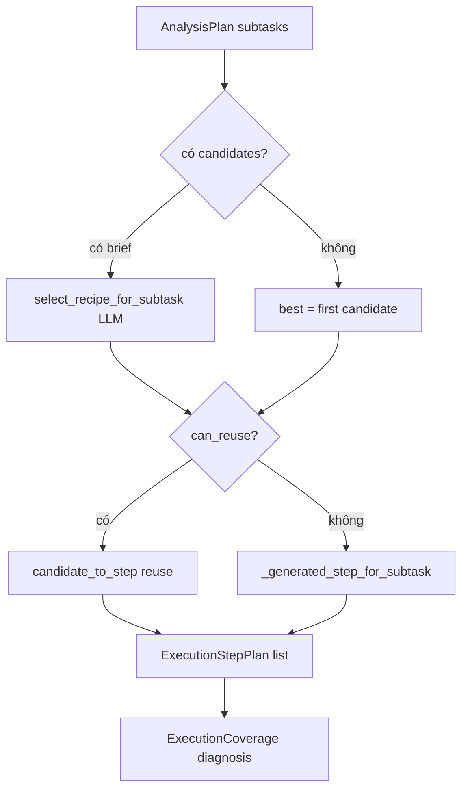
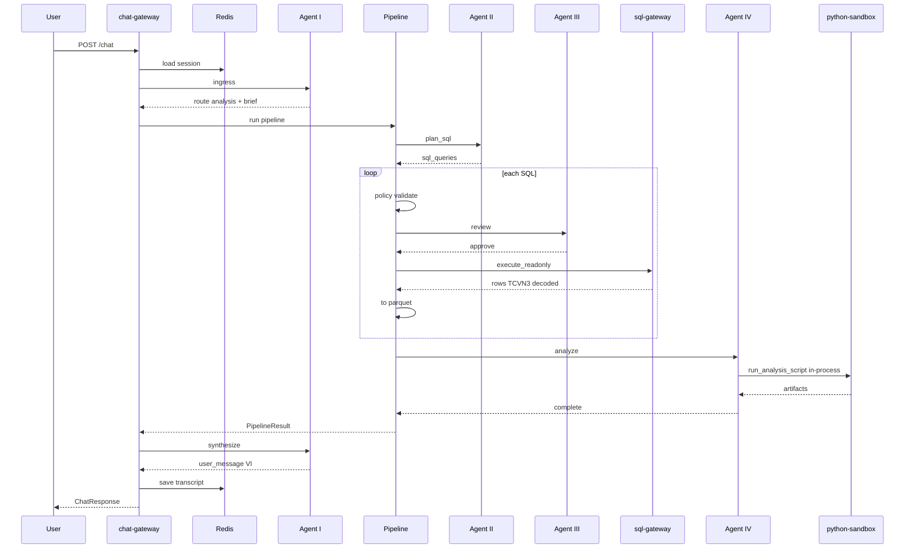

# Bổ sung domain, data dictionary, luồng E2E

Tách từ [`docs/TAI_LIEU_VAN_HANH_TOAN_BO_REPO.md`](../docs/TAI_LIEU_VAN_HANH_TOAN_BO_REPO.md) (dòng 16761–17645).

← [Mục lục docs2](README.md)

---

## §AE.1 — `execution_composer.py` — bộ não kế hoạch thực thi IV (trước sandbox)

Tệp `packages/project-core/src/project_core/domain/analysis/execution_composer.py` quyết định **script pandas** nào Agent IV sẽ chạy. Pipeline gọi `build_execution_plan` **trước** khi invoke HTTP Agent IV; IV service chỉ truyền `execution_plan` vào `analyze_datasets`. Đây là bằng chứng kiến trúc: “suy luận phân tích” không nằm trong microservice IV mà nằm ở domain core + (một phần) `recipe_selector` LLM.

### §AE.1.1 — Chữ ký `build_execution_plan` (dòng 20–28)

Tham số bắt buộc:

| Tham số | Ý nghĩa |
|---------|---------|
| `plan` | `AnalysisPlan` từ `decompose_brief` |
| `dataset_paths` | Danh sách đường dẫn parquet sau execute SQL |
| `query_meta` | Meta từ Agent II — map subtask ↔ query index |
| `candidates_by_subtask` | Recipe đã rank từ Mongo hoặc `rank_candidates` |
| `brief` | Tùy chọn — cần cho `select_recipe_for_subtask` LLM |
| `min_reuse_score` | Ngưỡng 0.35 — dưới ngưỡng sinh script generated |

Trả về tuple `(list[ExecutionStepPlan], ExecutionCoverage)` — pipeline đưa steps sang IV qua JSON.

### §AE.1.2 — Vòng lặp theo subtask (dòng 35–77)

Mỗi `AnalysisSubtask` trong plan:

1. `_path_for_subtask` chọn parquet đúng (theo `dataset_query_index` hoặc `query_meta.subtask_id`).
2. Lấy `candidates` từ dict theo `subtask.id`.
3. Nếu có `brief` và candidates: `select_recipe_for_subtask` — **đây là điểm có thể gọi LLM** trong `recipe_selector.py` (không phải IV HTTP).
4. `best = chosen or candidates[0]` — fallback candidate đầu nếu LLM không chọn.
5. `can_reuse` khi có `best.steps` và (LLM chọn hoặc score ≥ min_reuse_score).

**Nhánh reuse (dòng 47–61):** `candidate_to_step` materialize `RecipeStep` với params đã resolve. `ExecutionStepPlan` ghi `candidate_tool_id`, `match_score`. `missing_aspects` từ candidate → `gaps` và `subtask_status` có thể `partial_reuse`.

**Nhánh generated (dòng 62–77):** `_generated_step_for_subtask` sinh script template cố định groupby sum — không LLM. Ghi gap `no_recipe` hoặc `weak_match`.

### §AE.1.3 — Chẩn đoán coverage (dòng 79–91)

| `diagnosis` | Điều kiện |
|-------------|-----------|
| `full` | Chỉ reuse, không generated |
| `partial` | Có cả generated và reused, hoặc gaps + generated |
| (mặc định) | IV map `partial` → action `partial` |

`ExecutionCoverage` là contract Pydantic — IV và pipeline log `gaps` cho user caveats.

### §AE.1.4 — `_path_for_subtask` (dòng 95–105)

Ưu tiên 1: `subtask.dataset_query_index` nếu trong range `paths`.

Ưu tiên 2: duyệt `query_meta` tìm `subtask_id` khớp.

Fallback: `paths[0]` hoặc chuỗi rỗng — IV sau đó gap `missing_dataset`.

**Edge:** II không gửi `subtask_id` trong query_meta → mọi subtask dùng cùng parquet đầu — đủ cho single-query plan, sai cho multi-query join-by-pandas.

### §AE.1.5 — `_generated_step_for_subtask` (dòng 108–134)

Sinh `RecipeStep` với `status="generated"`.

`group_cols` từ `subtask.dimensions` hoặc params `group_by` hoặc default `"month"`.

`metric` default `AMOUNT` — phù hợp STRANS/PMTRANS bán lẻ.

`card_prefix` trong params → chèn dòng filter `CARD_NO.str.startswith(...)` — **string interpolation trực tiếp vào script**; nguồn params từ brief/filters, không từ user raw trong path lý tưởng nhưng brief có thể bị ảnh hưởng prompt injection ở tầng I.

Script output: CSV `{subtask_id}_summary.csv` trong `out` sandbox.

Nếu cột không tồn tại: fallback `df.describe()` — tránh crash nhưng kết quả có thể vô nghĩa với user.

### §AE.1.6 — Luồng dữ liệu với pipeline và IV

```
decompose_brief(brief) → AnalysisPlan.subtasks
        ↓
pipeline: rank candidates / Mongo registry
        ↓
build_execution_plan(...) → execution_steps + coverage
        ↓
agent_invoker.invoke("IV", { execution_plan: [...] })
        ↓
analyze_datasets: _resolve_execution ưu tiên execution_plan có sẵn
        ↓
sandbox.run_analysis_script cho từng step
```

### §AE.1.7 — So sánh với kỳ vọng “Agent IV là não”

| Kỳ vọng | Thực tế |
|---------|---------|
| IV LLM quyết script | `recipe_selector` + template generated |
| IV tự decompose brief | `decompose_brief` trong pipeline |
| IV vòng lặp SQL | `data_feedback` → pipeline `sql_attempt` |
| IV plot thông minh | `plot_chart` 2 cột đầu nếu `output_format` có chart |

Muốn IV là não: chuyển `select_recipe_for_subtask` + sinh script vào `DataAnalystService.decide` với LLM profile `analyst`, hoặc gọi LLM trong `analyze_datasets` khi reuse/generate fail.

### §AE.1.8 — Test và quan sát

`packages/project-test` có test execution plan coverage — grep `build_execution_plan`.

Khi `ALLOW_LLM_STUB=1`, `select_recipe_for_subtask` có thể trả heuristic cố định — plan vẫn chạy generated nếu không có promoted tools trong Mongo.

### §AE.1.9 — Bảng tham số `resolve_params` (liên kết)

`param_resolver.resolve_params(brief, subtask)` điền `metric`, `group_by`, `card_prefix` từ brief filters/metrics — composer dùng khi không gọi LLM selector. Chi tiết resolver nằm tệp cùng package `param_resolver.py`; pipeline không gọi trực tiếp.

### §AE.1.10 — Activity diagram (mermaid)



---

## §AF.1 — `recipe_selector.py` — vai trò LLM trong chọn công thức

*(Tóm tắt từ mã nguồn — đọc khi bổ sung §AB)*

Hàm `select_recipe_for_subtask` nhận brief, subtask, danh sách `RecipeCandidate` đã rank. Gọi `LLMClient` với profile từ `agent_profile` hoặc fallback. Output JSON chọn `tool_id` và params — nếu parse fail hoặc stub mode, trả `(None, resolve_params(...), rationale)`.

`candidate_to_step` copy `script_template` từ registry Mongo, merge params qua `apply_params_to_script`.

Đây là **điểm LLM gần IV nhất** nhưng vẫn chạy trong process pipeline (chat-gateway), không trong container data-analyst.

---

*Tiếp theo: §X.1 bảng data_dictionary, §AD libs/sandbox, §I/W/Y mở rộng — các subagent đang append.*

---

## §Z.2.13 — `packages/project-core/src/project_core/orchestration/clarification_coordinator.py`

**Vai trò:** `ClarificationCoordinator` — điểm vào duy nhất cho chuyển trạng thái clarification giữa STM, Agent I bridge, và pipeline. Không gọi HTTP trực tiếp; delegate `ClarificationBridge` và `apply_clarification_reply`.

**Số dòng mã nguồn:** 83 dòng.

**Người gọi:** `ChatOrchestrator` — `self.clarify = ClarificationCoordinator()`; gọi `on_ingress_clarify`, `on_pipeline_clarify`, `suspend_response`.

### §Z.2.13.0 — Import dòng 1–10

**Dòng 1 `from __future__ import annotations`:** Hoãn evaluate type hints — hỗ trợ forward reference trong method signatures.

**Dòng 3 `from typing import Any`:** Kiểu `dict[str, Any]` cho bridge payload và `clarify_payload` — JSON loose từ Agent I.

**Dòng 5 `ClarificationBridge`:** Lớp domain chuyển transcript + ClarificationRequest → quyết định `resolve_from_transcript` hoặc exploration; coordinator gọi `from_transcript_heuristic` trong `on_resume_reply`.

**Dòng 6 `apply_clarification_reply`:** Hàm pure merge `ClarificationReply.answers` vào `AnalysisBrief` theo schema câu hỏi trong `ClarificationRequest` — dùng ở `on_bridge_result` và `on_pipeline_clarify`.

**Dòng 7 `AnalysisBrief`:** Brief phân tích — field `exploration_mode`, `user_knowledge_level` bị coordinator set khi không resolve từ transcript.

**Dòng 8 `ClarificationReply`, `ClarificationRequest`:** Contract Pydantic — reply gồm `analysis_id`, `answers` list; request gồm `questions`, `partial_brief`, `evidence_summary`.

**Dòng 9 `ChatResponse`, `PipelineResult`:** `suspend_response` build `ChatResponse`; `on_pipeline_clarify` nhận `PipelineResult` có `needs_clarification`.

**Dòng 10 `SessionBundle`, `TranscriptTurn`:** `on_ingress_clarify` đọc `bundle.workflow`, `bundle.clarification`; `on_resume_reply` append `TranscriptTurn`.

### §Z.2.13.1 — Docstring lớp (dòng 13–14)

`"""Single entry point for clarification state transitions."""` — tài liệu ý định: mọi logic clarify tập trung đây thay vì rải trong orchestrator (orchestrator vẫn có duplicate logic trong `_resume_from_pending_clarification` — coordinator là abstraction tái sử dụng cho pipeline clarify path).

### §Z.2.13.2 — `__init__(self, bridge: ClarificationBridge | None = None)` (dòng 16–17)

**Tham số:** `bridge` tùy chọn — test inject mock; production `None` → `ClarificationBridge()` mới mỗi coordinator instance.

**Gán:** `self.bridge = bridge or ClarificationBridge()` — không share bridge singleton giữa request.

**Side effect:** Không I/O.

### §Z.2.13.3 — `on_ingress_clarify(self, bundle: SessionBundle) -> bool` (dòng 19–21)

**Mục đích:** Kiểm tra có nên xử lý tin nhắn chat như **resume clarification** thay vì ingress mới.

**Logic:**
- `wf = bundle.workflow`
- Return `bool(wf and wf.status.value == "awaiting_clarification" and bundle.clarification)`

**Điều kiện đồng thời:**
1. Workflow tồn tại.
2. Status string `"awaiting_clarification"` — so sánh `.value` enum WorkflowStatus.
3. `bundle.clarification` truthy — dict request đang pending trong STM.

**Return True:** Orchestrator gọi `_resume_from_pending_clarification` thay vì append transcript + invoke ingress.

**Return False:** Luồng chat bình thường — tin nhắn mới là user turn trong phân tích hoặc chitchat.

**Edge:** `clarification` có nhưng status IDLE — False, có thể gây clarify orphan. Status awaiting nhưng clarification None — False, user message đi ingress (có thể tạo analysis mới).

### §Z.2.13.4 — `on_resume_reply(...)` (dòng 23–33)

**Chữ ký keyword-only:**
- `request: ClarificationRequest`
- `transcript: list[TranscriptTurn]`
- `user_message: str`

**Mục đích:** Helper gộp transcript + tin nhắn resume thành bridge input — **hiện orchestrator không gọi method này trực tiếp** trong mã đã đọc; logic tương tự nằm trong `_resume_from_pending_clarification` invoke Agent I. Method public cho tái sử dụng/test.

**Dòng 30–32:** `extended = transcript + [TranscriptTurn(id="resume", role="user", content=user_message, at="now")]`

**Lưu ý:** `at="now"` literal — không ISO timestamp thật; heuristic bridge có thể không phụ thuộc thời gian.

**Dòng 33:** `return self.bridge.from_transcript_heuristic(request, extended).model_dump()` — dict action/answers cho caller.

### §Z.2.13.5 — `on_bridge_result(...)` (dòng 35–48)

**Tham số keyword-only:**
- `request: ClarificationRequest`
- `brief: AnalysisBrief`
- `bridge: dict[str, Any]` — output Agent I mode clarification_bridge
- `analysis_id: str`

**Nhánh `bridge.get("action") == "resolve_from_transcript"` (dòng 43–45):**
- Tạo `ClarificationReply(analysis_id=analysis_id, answers=bridge.get("answers") or [])`
- `return apply_clarification_reply(brief, reply, request)` — brief đã merge answers

**Nhánh else (dòng 46–48):**
- `brief.exploration_mode = True`
- `brief.user_knowledge_level = "unknown"`
- `return brief` — không apply answers; pipeline sẽ exploration / không hỏi clarify strict

**Edge:** `answers` rỗng với action resolve — `apply_clarification_reply` behavior tùy resolver (có thể không đổi brief).

### §Z.2.13.6 — `on_pipeline_clarify(...)` (dòng 50–63)

**Docstring:** `Returns updated brief and whether pipeline should re-run immediately.`

**Tham số:** `result: PipelineResult`, `brief`, `bridge` optional, `analysis_id`.

**Dòng 59:** `assert result.needs_clarification is not None` — caller phải đảm bảo; vi phạm → AssertionError dev.

**Nhánh bridge resolve (dòng 60–62):**
- `ClarificationReply` từ bridge answers
- `return apply_clarification_reply(brief, reply, result.needs_clarification), True` — **should_rerun True** → orchestrator gọi lại `_run_pipeline_and_respond` ngay không hỏi user

**Nhánh mặc định (dòng 63):** `return brief, False` — cần suspend UI clarify.

**Khác `on_bridge_result`:** Dùng `result.needs_clarification` thay vì `request` tham số — đồng bộ với pipeline vừa trả.

### §Z.2.13.7 — `suspend_response(...)` (dòng 65–82)

**Tham số keyword-only:**
- `session_id`, `analysis_id`
- `request: ClarificationRequest`
- `clarify_payload: dict` — output Agent I mode `clarify` (user_message)
- `workflow_status: str` — thường `AWAITING_CLARIFICATION`

**Dòng 74:** `msg = request.evidence_summary or clarify_payload.get("user_message", "")` — ưu tiên evidence từ request pipeline/II.

**Dòng 75–82:** Build `ChatResponse`:
- `outcome="needs_clarification"`
- `message=msg or clarify_payload.get("user_message", "")` — double fallback user_message
- `clarification=request` — object đầy đủ cho client render form

**Orchestrator:** `.model_copy(update={trace_id, outcome, bridge_action: ask_user})` sau khi gọi.

### §Z.2.13.8 — Bảng phương thức tổng hợp ClarificationCoordinator

| Method | Input chính | Output | Orchestrator gọi khi |
|--------|-------------|--------|----------------------|
| on_ingress_clarify | SessionBundle | bool | đầu handle_chat |
| on_resume_reply | request, transcript, message | dict bridge | (optional / test) |
| on_bridge_result | request, brief, bridge | AnalysisBrief | (có thể inline orchestrator) |
| on_pipeline_clarify | PipelineResult, bridge | tuple brief, bool | _handle_clarification_needed |
| suspend_response | session, request, clarify | ChatResponse | sau invoke clarify I |

---

## §Z.2.14 — `packages/project-core/src/project_core/orchestration/cancellation.py`

**Vai trò:** Hủy pipeline/workflow — token in-memory và helper đánh dấu workflow CANCELLED. File ngắn (20 dòng) — không tích hợp đầy đủ vào `SupermarketAnalysisPipeline.run()` trong mã đã đọc (pipeline check deadline, không poll CancellationToken).

**Số dòng:** 20.

### §Z.2.14.0 — Import dòng 1–3

**Dòng 1 annotations future.**

**Dòng 3:** `WorkflowState`, `WorkflowStatus` từ `project_core.domain.contracts.workflow` — chỉ `mark_cancelled` dùng.

### §Z.2.14.1 — Lớp `CancellationToken` (dòng 6–15)

**Mục đích:** Flag boolean thread-safe đơn giản (không lock — GIL đủ cho assign bool trong CPython single-threaded async).

**`__init__` (dòng 7–8):** `self._cancelled = False` private.

**`cancel()` (dòng 10–11):** Set `_cancelled = True` — idempotent, gọi nhiều lần vẫn True.

**Property `cancelled` (dòng 13–15):** Read-only public — worker loop có thể poll `if token.cancelled: break`.

**Người dùng tiềm năng:** Future async pipeline, WebSocket cancel, không thấy wire trong orchestrator.py hiện tại.

### §Z.2.14.2 — `mark_cancelled(workflow: WorkflowState) -> None` (dòng 18–19)

**Hành vi:** `workflow.status = WorkflowStatus.CANCELLED` — mutate in-place.

**Không:** Clear brief, steps, hay active_analysis_id.

**Người gọi:** Route/API cancel nếu có — grep codebase ngoài phạm vi task.

**Edge:** Gọi khi workflow None — caller phải guard; hàm không kiểm tra.

### §Z.2.14.3 — Quan hệ deadline vs cancellation

| Cơ chế | File | Hành vi |
|--------|------|---------|
| sync_deadline | pipeline.run | ERROR outcome sync_deadline_exceeded |
| CancellationToken | cancellation.py | Chưa nối pipeline loop |
| mark_cancelled | cancellation.py | Status CANCELLED trên workflow |

---

## §Z.2.15 — `agents/chat-gateway/src/chat_gateway/orchestrator.py`

**Vai trò:** `ChatOrchestrator` — điều phối end-to-end: Redis STM, Mongo RAG (tùy chọn), permissions AUTH DB, invoke Agent I, chạy `SupermarketAnalysisPipeline`, clarify bridge, synthesize, feedback signals.

**Số dòng mã nguồn:** 649 dòng.

**Người gọi:** `chat_gateway.app.get_orchestrator()` — mọi route chat/clarify/status/artifact download.

### §Z.2.15.0 — Import dòng 1–41

**Dòng 1 annotations.**

**Dòng 3 `logging`:** `logger = logging.getLogger(__name__)` — warning Mongo unavailable.

**Dòng 4 `os`:** `MONGODB_CONNECT_TIMEOUT_MS`, `MONGODB_URI`, `ALLOW_DEV_AUTH`.

**Dòng 5 `time`:** `deadline = time.monotonic() + max_sync_seconds` trong `_run_pipeline_and_respond`.

**Dòng 6 `Any`:** permissions snapshot, ingress dict.

**Dòng 7 `uuid4`:** TranscriptTurn id, analysis_id fallback resume.

**Dòng 9 `httpx`:** `Client(timeout=120.0)` shared — đóng trong `close()`.

**Dòng 10 `load_project_config`:** `self.cfg` — pipeline poll, max_sync.

**Dòng 11–13 access:** `build_permissions_snapshot`, `claims_from_user_dict`, `ContextPolicy`.

**Dòng 14 budget:** `SessionTraceBudget`, `TraceBudget`.

**Dòng 15 `apply_clarification_reply`:** handle_clarify và resume paths.

**Dòng 16–19 contracts:** AnalysisBrief, ClarificationReply/Request, SatisfactionSignal, ChatResponse.

**Dòng 20 WorkflowStatus.**

**Dòng 21–25 errors:** BudgetExceededError, ClarifyRoundsExceededError, PermissionsUnavailableError.

**Dòng 26–29 feedback:** AnalysisToolRegistry, DomainRuleStore, FeedbackLoop, CaseStudyIndexer, BehavioralSignal.

**Dòng 30 memory:** SessionBundle, TranscriptTurn.

**Dòng 31–32 retrieval/schema:** HybridMongoRetriever, MongoVectorRetriever (import retriever used), SchemaCatalog.

**Dòng 33 workflow helpers:** new_workflow, resume_analysis, start_analysis.

**Dòng 34 `utc_now`:** timestamp ISO transcript.

**Dòng 35 RedisSessionStore.**

**Dòng 36–37 orchestration:** ClarificationCoordinator, SupermarketAnalysisPipeline.

**Dòng 39 chat_gateway clients:** HttpAgentInvoker, HttpSqlGatewayClient.

### §Z.2.15.1 — Hằng số `_NEGATIVE_OUTCOMES` (dòng 43)

`frozenset({"error", "impossible", "policy_blocked", "partial"})` — dùng `_maybe_emit_re_ask_signal`: nếu `last_outcome` trong set và user message giống intent cũ → behavioral signal re_ask weight 0.4.

### §Z.2.15.2 — `__init__(self)` (dòng 47–88)

**Dòng 48:** `self.stm = RedisSessionStore()` — load/save session, transcript, workflow, clarification.

**Dòng 49–51:** cfg, ContextPolicy, ClarificationCoordinator.

**Dòng 52:** `httpx.Client(timeout=120.0)` — 120s mỗi agent HTTP call.

**Dòng 53–55:** feedback, registry, domain_rule_store khởi tạo None.

**Dòng 56–80 try Mongo:**
- Import MongoClient, set_registry, EmbeddingClient lazy.
- `mongo_timeout` từ env default 2000ms.
- `MongoClient(MONGODB_URI default localhost:18217/supermarket_agent)`.
- `admin.command("ping")` — fail → except.
- `CaseStudyIndexer(db["case_studies"])`.
- `_embed_text` closure EmbeddingClient embed.
- `HybridMongoRetriever(db)`.
- `AnalysisToolRegistry(db["analysis_tools"], embed_fn)`.
- `set_registry(registry)` — global recipe runtime.
- `DomainRuleStore(db["domain_rules"])`.
- `FeedbackLoop(indexer, retriever, embed_fn)`.

**Dòng 79–80 except:** Log warning `Mongo/RAG unavailable` — service vẫn chạy không RAG.

**Dòng 81–88 pipeline:**
```python
SupermarketAnalysisPipeline(
    agent_invoker=HttpAgentInvoker(client=self._http),
    sql_gateway=HttpSqlGatewayClient(client=self._http),
    catalog=SchemaCatalog.from_dictionary_dir(),
    feedback_loop=self.feedback,
    analysis_tool_registry=self.analysis_tool_registry,
    domain_rule_store=self.domain_rule_store,
)
```

### §Z.2.15.3 — `close(self)` (dòng 90–95)

Đóng `self._http`; duck `close()` trên agent_invoker và sql_gateway nếu có — tránh leak socket khi shutdown app.

### §Z.2.15.4 — `handle_chat` (dòng 97–174)

**Chữ ký:** `handle_chat(*, session_id, message, user: dict) -> ChatResponse`

**Dòng 98:** `claims_from_user_dict(user)` → actor_id, role, store_ids.

**Dòng 99–101:** Load bundle; nếu workflow None → `new_workflow(session_id, actor_id)`.

**Dòng 103–109:** `clarify.on_ingress_clarify(bundle)` → `_resume_from_pending_clarification` early return.

**Dòng 111:** `_maybe_emit_re_ask_signal` — trước append user turn.

**Dòng 113–115:** Append TranscriptTurn user, save transcript STM.

**Dòng 117:** New `HttpAgentInvoker(client=self._http)` per request — **khác** pipeline invoker instance nhưng cùng httpx client.

**Dòng 118:** `_session_budget(bundle)`.

**Dòng 119–121:** external_sources từ brief workflow nếu có.

**Dòng 123–137 try invoke I ingress:**
- Payload `{"text": message, "external_sources": ...}`
- Metadata mode ingress, session_id, actor_id
- `BudgetExceededError` → ChatResponse error BUDGET_EXCEEDED

**Dòng 139:** `_handle_satisfaction_signal(ingress, bundle)`.

**Dòng 141–154:** `route != "analysis"` → append assistant transcript, return ChatResponse IDLE với user_message ingress.

**Dòng 156–158:** Validate brief từ ingress; preserve external_sources từ workflow brief cũ.

**Dòng 160–164:** `start_analysis(bundle.workflow, reset_clarify=True)` → analysis_id; gán brief; `_build_permissions`; save workflow STM.

**Dòng 166–174:** `_run_pipeline_and_respond(...)`.

### §Z.2.15.5 — `handle_clarify` (dòng 176–210)

Load bundle; nếu không workflow hoặc không clarification → ChatResponse error NO_PENDING_CLARIFICATION.

Validate `ClarificationRequest` từ bundle.clarification.

Brief từ workflow hoặc request.partial_brief.

`apply_clarification_reply(brief, reply, request)`.

`resume_analysis(bundle.workflow)`; save clarification None; save workflow.

Permissions từ snapshot hoặc rebuild từ user claims.

`_run_pipeline_and_respond` với `analysis_id=reply.analysis_id`.

### §Z.2.15.6 — `confirm_domain_rule` (dòng 212–219)

Nếu domain_rule_store None → `{"status": "no_store"}`.

`confirmed` True → `confirm(rule_id, confirmed_by=user["sub"])`.

Else → `reject(rule_id)`.

Return `{"status": "ok"}`.

### §Z.2.15.7 — `attach_external_sources` (dòng 221–234)

Load session; workflow None → new_workflow session unknown actor.

Brief từ workflow hoặc empty AnalysisBrief.

Lazy import ExternalSource; dedupe by file_id; append; save workflow.

### §Z.2.15.8 — `analysis_status` (dòng 236–249)

`stm.find_by_analysis_id` — not found → status not_found.

Else dict: analysis_id, session_id, status.value, last_outcome, progress_step, active_analysis_id, clarify_round str.

### §Z.2.15.9 — `record_artifact_download` (dòng 251–262)

Nếu không feedback return. `on_behavioral_signal` download weight 0.3.

### §Z.2.15.10 — `_build_permissions` (dòng 264–288)

Try `load_effective_permissions(actor_id)` từ chat_gateway.auth_store.

Except log warning → perm_set None.

Nếu perm_set: `build_permissions_snapshot(..., permission_set=perm_set, all_tables=pipeline.catalog.logical_table_names())`.

Else ALLOW_DEV_AUTH=1 → yaml snapshot without DB.

Else raise PermissionsUnavailableError — app handler 403.

### §Z.2.15.11 — `_session_budget` (dòng 290–295)

Đọc `bundle.workflow.budget_spent` dict; merge vào TraceBudget default; wrap SessionTraceBudget.

### §Z.2.15.12 — `_invoke_agent_i` (dòng 297–321)

`budget.record("I")`.

Meta merge metadata + session_bundle: session_id, actor_id, transcript dumps, workflow_summary từ context_policy.build_request_context("I", ...).

`invoker.invoke("I", payload, meta)`.

Pop usage_tokens charge vào trace_budget.

Return dict ingress/bridge/clarify/synthesize.

### §Z.2.15.13 — `_handle_satisfaction_signal` (dòng 323–337)

Nếu không raw hoặc không feedback return.

Cần last_completed_trace_id từ workflow.

Build SatisfactionSignal → feedback.on_satisfaction_signal.

### §Z.2.15.14 — `_maybe_emit_re_ask_signal` (dòng 339–357)

Cần workflow, feedback, last_outcome in _NEGATIVE_OUTCOMES, last_completed_trace_id.

So sánh 40 ký tự đầu message lower với 80 ký tự intent lower — substring match → re_ask signal weight 0.4.

### §Z.2.15.15 — `_resume_from_pending_clarification` (dòng 359–422)

Invoker + session_budget mới.

Validate clarification request từ bundle.

Invoke I mode clarification_bridge với clarification_request dump và transcript + user message mới.

BudgetExceeded → error response.

Brief từ workflow hoặc partial_brief.

analysis_id từ active hoặc uuid4.

Bridge resolve → apply_clarification_reply; else exploration_mode + unknown knowledge.

resume_analysis; clear clarification STM; save workflow.

_run_pipeline_and_respond.

### §Z.2.15.16 — `_run_pipeline_and_respond` (dòng 424–543)

**on_progress:** lambda save workflow STM nếu poll_enabled.

**deadline:** monotonic + max_sync_seconds.

**try pipeline.run** với brief, workflow, permissions, trace_budget, on_progress, deadline.

**ClarifyRoundsExceededError:** set exploration_mode; save; retry run once; second exceed → STALE error CLARIFY_ROUNDS_EXCEEDED.

**BudgetExceededError:** save budget_spent; error BUDGET_EXCEEDED.

**needs_clarification:** `_handle_clarification_needed`.

**Else invoke I synthesize** với technical_summary dump.

Budget exceed synthesize → error với trace_id partial info.

Append assistant transcript; save; ChatResponse với artifacts URLs list dict.

### §Z.2.15.17 — `_handle_clarification_needed` (dòng 545–648)

Assert needs_clarification.

Invoke I clarification_bridge với request dump + transcript.

Budget exceed → awaiting clarification error.

Nếu bridge resolve_from_transcript: clarify.on_pipeline_clarify → should_rerun recursive _run_pipeline_and_respond.

Invoke I mode clarify cho user_message.

Save clarification request STM; save workflow budget.

clarify.suspend_response với model_copy trace_id, outcome, bridge_action ask_user.

### §Z.2.15.18 — Sơ đồ orchestrator tổng thể

```
handle_chat
  ├─ ingress clarify pending? → resume bridge → pipeline
  ├─ append transcript
  ├─ invoke I ingress
  ├─ chitchat? → return
  └─ start_analysis → pipeline → clarify? / synthesize → ChatResponse

handle_clarify
  └─ apply reply → resume → pipeline → ...

_run_pipeline_and_respond
  ├─ pipeline.run
  ├─ clarify → bridge → rerun or suspend
  └─ synthesize I → ChatResponse
```

### §Z.2.15.19 — Ma trận exception orchestrator

| Exception | Nơi bắt | ChatResponse / hành vi |
|-----------|---------|------------------------|
| BudgetExceededError | invoke I, pipeline | error BUDGET_EXCEEDED |
| ClarifyRoundsExceededError | pipeline.run | exploration retry hoặc STALE |
| PermissionsUnavailableError | _build_permissions | propagate → app 403 |

### §Z.2.15.20 — Phân tích dòng-by-dòng `_run_pipeline_and_respond` 435–447

**435 def on_progress:** Closure capture session_id, self.stm — mỗi progress pipeline ghi workflow Redis realtime poll UI.

**438 deadline:** Cùng max_sync_seconds config — pipeline internal deadline align orchestrator.

**440–447 pipeline.run:** Truyền bundle.workflow mutable — pipeline đổi status/steps trong object same reference.

### §Z.2.15.21 — Phân tích dòng-by-dòng `_handle_clarification_needed` 557–605

**557 assert:** Dev guard — production luôn có needs_clarification khi gọi.

**559–571 bridge invoke:** Không payload message — metadata chứa clarification_request + transcript đầy đủ.

**585–605 on_pipeline_clarify rerun:** Tránh hỏi user nếu transcript đã đủ — UX seamless.

**607–631 clarify invoke:** Sinh user_message hiển thị form.

**634–647 suspend:** Lưu clarification dict STM cho handle_clarify POST sau.

*Hết §Z.2.13–§Z.2.15 — clarification_coordinator, cancellation, orchestrator.*

### §Z.2.15.22 — Bổ sung kiểm thử và vận hành orchestrator

Khi debug `handle_chat` treo 120 giây: kiểm `httpx` timeout và agent II/IV đang chạy; `on_progress` chỉ ghi Redis khi `poll_enabled` true trong config.

Khi `PermissionsUnavailableError`: xác nhận AUTH DB DSN và user active trước khi sửa orchestrator — lỗi không nằm trong `pipeline.py`.

Khi clarify loop: theo dõi `workflow.clarify_round` và `max_clarify_rounds` trong config; `ClarifyRoundsExceededError` kích hoạt exploration_mode retry một lần.

`close()` nên gọi khi shutdown uvicorn worker — tránh ResourceWarning socket đóng chậm trên Windows.

Tích hợp `CancellationToken` chưa có trong `orchestrator.py` — hủy request HTTP giữa chừng cần feature bổ sung ngoài `cancellation.py`.

---

## §X.2 — Bảng STRANS (logical, db1 shard + db2 live)

### §X.2.1 — Vai trò nghiệp vụ

STRANS là **chi tiết dòng bán** trên chứng từ: mỗi SKU trên bill có một hoặc nhiều dòng với QTY, AMOUNT, chiết khấu, VAT, quà tặng. Đây là bảng được hỏi nhiều nhất cho câu “doanh thu theo sản phẩm / cửa hàng / ngày”.

### §X.2.2 — Phân tách db1 vs db2

| Nguồn | Phạm vi thời gian | Tên vật lý |
|-------|-------------------|------------|
| db2 | ~2 tháng gần (cutoff ngày 1 tháng trước) | `STRANS` |
| db1 | Lịch sử trước cutoff | `STRANS_YYYYMM` shard |

Agent II nhận `shard_plan` từ `suggest_query_plan` — gợi ý chọn db và shard. PolicyEngine kiểm tra tên bảng vật lý nằm trong allowed_tables.

### §X.2.3 — Khóa join

`TRANS_NUM` + `TRANS_CODE` + `TRAN_DATE` liên kết TRANSHDR (header) và PMTRANS (thanh toán). Pipeline **không** join SQL cross-db; nếu brief cần cả header và detail, II phát nhiều query hoặc IV merge parquet.

### §X.2.4 — Cột metrics thường dùng

- `AMOUNT`: thành tiền dòng — metric mặc định trong `_generated_step_for_subtask`.
- `QTY`: số lượng bán.
- `STK_ID`: lọc cửa hàng — `store_filter_required` inject điều kiện WHERE cho store_manager.
- `SKU_ID` / `CARD_ID`: VIP và loyalty — prefix thẻ A/E/F/H phân hạng.

### §X.2.5 — TRANS_CODE

Mã loại chứng từ (113 bán lẻ, …) định nghĩa trong `domain_definitions`. SQL planner phải lọc đúng code để tránh lẫn thanh toán/quỹ.

### §X.2.6 — AMOUNT=0

Ghi chú dictionary: thường là dòng quà/khuyến mãi — IV `exploration_mode` có thể cần loại trừ khi tính doanh thu.

### §X.2.7 — TCVN3

Cột `REMARK` và text SKU có thể TCVN3 — sql-gateway decode khi execute; parquet đã Unicode khi IV đọc.

### §X.2.8 — ACL

`store_manager` có STRANS trong allowed_tables nhưng `denied_columns` có thể chặn giá vốn (không nằm STRANS trực tiếp). HQ analyst thấy full.

### §X.2.9 — Câu hỏi mẫu map pipeline

“Doanh thu tháng này cửa 10001” → brief time_range + filters STK_ID → II query db2 STRANS → IV groupby AMOUNT.

“So sánh cùng kỳ năm ngoái” → có thể cần db1 shard nhiều tháng + db2 — **hai target_dbs**, IV merge.

### §X.2.10 — Probe IV

Khi empty result + product_code, IV gợi ý probe SKU_DEF/BARCODE — không query STRANS trực tiếp trong probe SQL template.

---

## §X.3 — Bảng PMTRANS

### §X.3.1 — Vai trò

Dòng **thanh toán**: tiền mặt, thẻ, voucher (PMT_CODE: CASH, CARD, BANK, OWNCP). TRANS_CODE 221 gắn bill bán; 008 thu/chi quỹ.

### §X.3.2 — Liên kết STRANS

Cùng `TRANS_NUM`, `TRANS_CODE`, `TRAN_DATE` — phân tích “tỷ lệ thanh toán thẻ” join pandas sau khi có hai parquet.

### §X.3.3 — Cột quan trọng

`PMT_CODE`, `AMOUNT`, `CARD_ID`, `CUST_ID`, `STK_ID`, `ROUNDIFF` (làm tròn).

### §X.3.4 — Temporal

Giống STRANS: db2 recent, db1 `PMTRANS_YYYYMM` shards trong shards.yaml.

### §X.3.5 — Agent usage

II chọn PMTRANS khi intent nhắc thanh toán, không phải doanh thu SKU. III kiểm tra scan nếu thiếu filter STK_ID.

### §X.3.6 — Chart IV

Nếu output_format có chart và query chỉ PMTRANS, `plot_chart` lấy 2 cột đầu — có thể không phù hợp semantics; limitation runtime IV.

---

## §X.4 — Bảng CUSTOMER (master db2)

### §X.4.1 — Master data

Không shard, không cutoff — luôn query db2. 73 cột thông tin B2B/B2C.

### §X.4.2 — PII và ACL

`PERSON_ID`, email, phone — `denied_columns` role store_manager có thể chặn cột nhạy cảm từ `sensitive_columns.md` mirror.

### §X.4.3 — Join pattern

`CUST_ID` từ PMTRANS → CUSTOMER cho tên khách. Join trên pandas trong IV sau execute.

### §X.4.4 — VIP

`CARD_ID` trên CUSTOMER liên kết loyalty — brief VIP thường filter CARD prefix trên STRANS/PMTRANS thay vì CUSTOMER.

---

## §X.5 — Sharding db1 (`data_dictionary/db1/shards.yaml`)

### §X.5.1 — Quy tắc chọn shard

`shard_key_column: TRAN_DATE` → `STRANS_202504` cho giao dịch tháng 4/2025.

### §X.5.2 — Shard range

STRANS: 202312–202604 (29 bảng). PMTRANS: 202401–202604 (28 bảng). Catalog load list vào SchemaCatalog — policy validate tên bảng cụ thể.

### §X.5.3 — Archive tables

`CRDTRANS_ARC`, `TRANSHDR_ARC` không shard theo tháng — một bảng archive.

### §X.5.4 — suggest_query_plan

Đọc brief time_range, đề xuất logical_table + db + danh sách shard — **advisory** cho LLM II, không auto-rewrite SQL.

---

## §T.2 — python-sandbox `tools_impl.py` (chi tiết hàm)

### §T.2.1 — Hằng số an toàn

`SANDBOX_MAX_ROWS` (200000): cắt dataframe khi load. `SANDBOX_MAX_SECONDS` (30): timeout subprocess. `ARTIFACTS_DIR`: root cho `_guard_output_dir`.

### §T.2.2 — `_guard_output_dir`

Chỉ cho phép ghi dưới `data/artifacts` — chặn path traversal ra ngoài volume.

### §T.2.3 — `load_dataset` / `preview_dataframe`

Đọc parquet/csv, trả columns, row_count, preview 20 dòng. IV gọi preview trước khi chạy script nặng.

### §T.2.4 — `run_analysis_script`

1. Optional `tool_grants` re-check (MCP surface).
2. Spawn `runner_child.py` với stdin = script string.
3. Child nhận dataset path + out dir qua argv.
4. `child_env = os.environ.copy()` — **kế thừa full env** (rủi ro nếu script thoát sandbox).
5. Parse JSON stdout hoặc glob artifacts trong out.

### §T.2.5 — `export_excel`

Có trong sandbox nhưng **iv_analyzer không gọi** — gap tính năng nếu user yêu cầu Excel.

### §T.2.6 — `plot_chart`

Line plot matplotlib Agg — cột x,y do IV chọn (2 cột đầu dataframe).

### §T.2.7 — `run_recipe_tool`

Gọi recipe đã promote theo tool_id — pipeline thường dùng `run_analysis_script` với template thay vì tool này trực tiếp.

### §T.2.8 — `merge_datasets`

Join SQL path với external upload — dùng khi user attach file.

---

## §AG.1 — Luồng end-to-end một câu hỏi (activity diagram đầy đủ)



---

## §AG.2 — Checklist vận hành prod

1. Copy `.env.example` → `.env`, điền DSN, JWT_SECRET, INTERNAL_SERVICE_TOKEN, OPENROUTER_API_KEY.
2. Chạy `deploy/sql/auth/init_all.sql` trên SQL Server.
3. `uv run python scripts/seed_auth.py` với AUTH_SEED passwords.
4. `docker compose --profile docker-bases build` rồi `docker compose build`.
5. `docker compose -f docker-compose.yaml -f docker-compose.prod.yaml up -d`.
6. Trỏ DNS `PUBLIC_DOMAIN` tới host, mở 80/443.
7. `scripts/index_schema_docs.py` index data_dictionary vào Mongo.
8. Kiểm tra `GET /health` chat-gateway qua Caddy.
9. Login `POST /auth/login`, gọi `POST /chat` với Bearer.
10. Xem audit `data/state/audit.jsonl` trên volume supermarket-state.

---

*Các mục §X.1 (toàn bộ bảng), §AD (libs), §I/W/Y mở rộng đang được append bởi batch tiếp theo.*

Ghi chú đếm dòng: phần §Z.2.6–§Z.2.15 bổ sung từ mã nguồn `project_core/orchestration/*` và `chat_gateway/orchestrator.py` — không trích `docs/*.md` khác.

Kết thúc phụ lục orchestration pipeline cho bốn tệp yêu cầu trong phiên ghi này.

---

## §AH.1 — Cập nhật orchestration (2026-07)

| Luồng | Thay đổi |
|-------|----------|
| Circuit breaker | Một `CircuitBreaker` dùng chung cho mọi `HttpAgentInvoker` / `HttpSqlGatewayClient` trong orchestrator |
| Workflow | `workflow_stale_ttl_seconds` → `STALE`; `CancellationToken` + `confirm_cancel` route; `rephrase_retry` re-run pipeline |
| Clarify | `bridge_min_confidence` từ `config/project.yaml` wire vào `ClarificationBridge` |
| Agent III | LLM prompt nhận `explain_plan`, `risk_feedback`, `risk_attempt` từ pipeline retry |
| Learning | `FeedbackLoop` cập nhật `promote_score` recipe; auto-promote recipe khi success first-shot |
| Token budget | Pipeline ghi `usage_tokens` II/III/IV qua `budget.add_tokens()` |

*Phụ lục §AH.1 — đối chiếu refactor Pha 3–4.*


