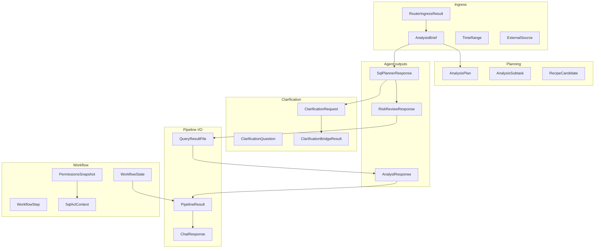

# Hợp đồng Pydantic (§AH.1)

Tách từ [`docs/TAI_LIEU_VAN_HANH_TOAN_BO_REPO.md`](../docs/TAI_LIEU_VAN_HANH_TOAN_BO_REPO.md) (dòng 17646–24387).

← [Mục lục docs2](README.md)

---

## §AH.1 — Toàn bộ contracts Pydantic

Phụ lục này liệt kê **mọi** model Pydantic (và StrEnum contract) trong gói
`packages/project-core/src/project_core/domain/contracts/`. Nội dung được suy ra trực tiếp từ mã nguồn
Python, **không** trích dẫn từ tài liệu `docs/*.md` khác.

### Phạm vi và quy ước

| Quy ước | Mô tả |
|---------|-------|
| **Producer** | Thành phần gán/ghi giá trị lần đầu hoặc cập nhật |
| **Consumer** | Thành phần đọc/validate/phản hồi dựa trên trường |
| **Validation** | Ràng buộc Pydantic v2 + validator tùy chỉnh (nếu có) |
| **JSON** | Ví dụ `model_dump()` / payload HTTP; datetime → ISO-8601 |

Module `parse.py` chứa hàm `parse_agent_response(agent, raw)` — không phải model — dùng để
`model_validate` output Agent II → `SqlPlannerResponse`, III → `RiskReviewResponse`, IV → `AnalystResponse`.
Lỗi validation ném `ContractInvalidError`.

```python
AgentKey = Literal["II", "III", "IV"]
```

### Sơ đồ phụ thuộc giữa các contract



**Tổng số class/enum documented:** 48

---

## §AH.1.1 — Module `brief.py`

### TimeRange

**Tệp nguồn:** `packages/project-core/src/project_core/domain/contracts/brief.py`

**Mục đích:** Khoảng thời gian phân tích
**Producer:** Agent I ingress brief; user filters
**Consumer:** AnalysisBrief; IntentSlice; decomposer payload

**Số trường:** 3

**Ví dụ JSON đầy đủ (minh họa):**
```json
{
  "start": "example_start",
  "end": "example_end",
  "grain": "example_grain"
}
```

#### Chi tiết từng trường

#### Trường `start` (#1)

| Thuộc tính | Giá trị |
|------------|---------|
| **Kiểu** | `str | None` |
| **Mặc định** | `None` |
| **Validation** | Trường optional; có thể null trong JSON; Mặc định: None |
| **Producer** | Agent I ingress brief; user filters |
| **Consumer** | AnalysisBrief; IntentSlice; decomposer payload |

**Ý nghĩa vận hành:** Trường `start` trên model `TimeRange` thuộc module `brief.py`, được serialize qua `model_dump()` / `model_dump_json()` khi vượt ranh giới agent HTTP hoặc STM JSON.

**Ví dụ JSON (fragment):**
```json
"start": null
```

**Ghi chú tích hợp:** Khi pipeline truyền `TimeRange` giữa Agent II/III/IV, trường `start` phải giữ nguyên kiểu để `parse_agent_response` và `model_validate` không raise `ContractInvalidError`.

#### Trường `end` (#2)

| Thuộc tính | Giá trị |
|------------|---------|
| **Kiểu** | `str | None` |
| **Mặc định** | `None` |
| **Validation** | Trường optional; có thể null trong JSON; Mặc định: None |
| **Producer** | Agent I ingress brief; user filters |
| **Consumer** | AnalysisBrief; IntentSlice; decomposer payload |

**Ý nghĩa vận hành:** Trường `end` trên model `TimeRange` thuộc module `brief.py`, được serialize qua `model_dump()` / `model_dump_json()` khi vượt ranh giới agent HTTP hoặc STM JSON.

**Ví dụ JSON (fragment):**
```json
"end": null
```

**Ghi chú tích hợp:** Khi pipeline truyền `TimeRange` giữa Agent II/III/IV, trường `end` phải giữ nguyên kiểu để `parse_agent_response` và `model_validate` không raise `ContractInvalidError`.

#### Trường `grain` (#3)

| Thuộc tính | Giá trị |
|------------|---------|
| **Kiểu** | `str | None` |
| **Mặc định** | `None` |
| **Validation** | Trường optional; có thể null trong JSON; Mặc định: None |
| **Producer** | Agent I ingress brief; user filters |
| **Consumer** | AnalysisBrief; IntentSlice; decomposer payload |

**Ý nghĩa vận hành:** Trường `grain` trên model `TimeRange` thuộc module `brief.py`, được serialize qua `model_dump()` / `model_dump_json()` khi vượt ranh giới agent HTTP hoặc STM JSON.

**Ví dụ JSON (fragment):**
```json
"grain": null
```

**Ghi chú tích hợp:** Khi pipeline truyền `TimeRange` giữa Agent II/III/IV, trường `grain` phải giữ nguyên kiểu để `parse_agent_response` và `model_validate` không raise `ContractInvalidError`.

**Round-trip:** ` TimeRange.model_validate(TimeRange().model_dump()) ` phải giữ schema (unit test `test_contracts.py` nếu có).

---

### AnalysisBrief

**Tệp nguồn:** `packages/project-core/src/project_core/domain/contracts/brief.py`

**Mục đích:** Hợp đồng ý định phân tích trung tâm
**Producer:** Conversational Router Agent I; merge clarify; apply_data_feedback
**Consumer:** Toàn pipeline II→IV; WorkflowState.brief

**Số trường:** 12

**Ví dụ JSON đầy đủ (minh họa):**
```json
{
  "intent": "Doanh thu theo cửa hàng tháng 3",
  "metrics": [
    "revenue"
  ],
  "dimensions": [
    "store_id"
  ],
  "filters": {
    "region": "north"
  },
  "time_range": {
    "start": "2025-03-01",
    "end": "2025-03-31",
    "grain": "day"
  },
  "output_format": [
    "table",
    "chart"
  ],
  "exploration_mode": false,
  "user_knowledge_level": "expert"
}
```

#### Chi tiết từng trường

#### Trường `intent` (#1)

| Thuộc tính | Giá trị |
|------------|---------|
| **Kiểu** | `str` |
| **Mặc định** | `''` |
| **Validation** | Mặc định: '' |
| **Producer** | Conversational Router Agent I; merge clarify; apply_data_feedback |
| **Consumer** | Toàn pipeline II→IV; WorkflowState.brief |

**Ý nghĩa vận hành:** Trường `intent` trên model `AnalysisBrief` thuộc module `brief.py`, được serialize qua `model_dump()` / `model_dump_json()` khi vượt ranh giới agent HTTP hoặc STM JSON.

**Ví dụ JSON (fragment):**
```json
"intent": "<intent>"
```

**Ghi chú tích hợp:** Khi pipeline truyền `AnalysisBrief` giữa Agent II/III/IV, trường `intent` phải giữ nguyên kiểu để `parse_agent_response` và `model_validate` không raise `ContractInvalidError`.

#### Trường `metrics` (#2)

| Thuộc tính | Giá trị |
|------------|---------|
| **Kiểu** | `list[str]` |
| **Mặc định** | `Field(default_factory=list)` |
| **Validation** | Mặc định factory (list/dict rỗng hoặc datetime.utcnow) |
| **Producer** | Conversational Router Agent I; merge clarify; apply_data_feedback |
| **Consumer** | Toàn pipeline II→IV; WorkflowState.brief |

**Ý nghĩa vận hành:** Trường `metrics` trên model `AnalysisBrief` thuộc module `brief.py`, được serialize qua `model_dump()` / `model_dump_json()` khi vượt ranh giới agent HTTP hoặc STM JSON.

**Ví dụ JSON (fragment):**
```json
"metrics": []
```

**Ghi chú tích hợp:** Khi pipeline truyền `AnalysisBrief` giữa Agent II/III/IV, trường `metrics` phải giữ nguyên kiểu để `parse_agent_response` và `model_validate` không raise `ContractInvalidError`.

#### Trường `dimensions` (#3)

| Thuộc tính | Giá trị |
|------------|---------|
| **Kiểu** | `list[str]` |
| **Mặc định** | `Field(default_factory=list)` |
| **Validation** | Mặc định factory (list/dict rỗng hoặc datetime.utcnow) |
| **Producer** | Conversational Router Agent I; merge clarify; apply_data_feedback |
| **Consumer** | Toàn pipeline II→IV; WorkflowState.brief |

**Ý nghĩa vận hành:** Trường `dimensions` trên model `AnalysisBrief` thuộc module `brief.py`, được serialize qua `model_dump()` / `model_dump_json()` khi vượt ranh giới agent HTTP hoặc STM JSON.

**Ví dụ JSON (fragment):**
```json
"dimensions": []
```

**Ghi chú tích hợp:** Khi pipeline truyền `AnalysisBrief` giữa Agent II/III/IV, trường `dimensions` phải giữ nguyên kiểu để `parse_agent_response` và `model_validate` không raise `ContractInvalidError`.

#### Trường `filters` (#4)

| Thuộc tính | Giá trị |
|------------|---------|
| **Kiểu** | `dict[str, Any]` |
| **Mặc định** | `Field(default_factory=dict)` |
| **Validation** | Mặc định factory (list/dict rỗng hoặc datetime.utcnow) |
| **Producer** | Conversational Router Agent I; merge clarify; apply_data_feedback |
| **Consumer** | Toàn pipeline II→IV; WorkflowState.brief |

**Ý nghĩa vận hành:** Trường `filters` trên model `AnalysisBrief` thuộc module `brief.py`, được serialize qua `model_dump()` / `model_dump_json()` khi vượt ranh giới agent HTTP hoặc STM JSON.

**Ví dụ JSON (fragment):**
```json
"filters": {}
```

**Ghi chú tích hợp:** Khi pipeline truyền `AnalysisBrief` giữa Agent II/III/IV, trường `filters` phải giữ nguyên kiểu để `parse_agent_response` và `model_validate` không raise `ContractInvalidError`.

#### Trường `time_range` (#5)

| Thuộc tính | Giá trị |
|------------|---------|
| **Kiểu** | `TimeRange` |
| **Mặc định** | `Field(default_factory=TimeRange)` |
| **Validation** | Mặc định factory (list/dict rỗng hoặc datetime.utcnow) |
| **Producer** | Conversational Router Agent I; merge clarify; apply_data_feedback |
| **Consumer** | Toàn pipeline II→IV; WorkflowState.brief |

**Ý nghĩa vận hành:** Trường `time_range` trên model `AnalysisBrief` thuộc module `brief.py`, được serialize qua `model_dump()` / `model_dump_json()` khi vượt ranh giới agent HTTP hoặc STM JSON.

**Ví dụ JSON (fragment):**
```json
"time_range": "<time_range>"
```

**Ghi chú tích hợp:** Khi pipeline truyền `AnalysisBrief` giữa Agent II/III/IV, trường `time_range` phải giữ nguyên kiểu để `parse_agent_response` và `model_validate` không raise `ContractInvalidError`.

#### Trường `output_format` (#6)

| Thuộc tính | Giá trị |
|------------|---------|
| **Kiểu** | `list[str]` |
| **Mặc định** | `Field(default_factory=list)` |
| **Validation** | Mặc định factory (list/dict rỗng hoặc datetime.utcnow) |
| **Producer** | Conversational Router Agent I; merge clarify; apply_data_feedback |
| **Consumer** | Toàn pipeline II→IV; WorkflowState.brief |

**Ý nghĩa vận hành:** Trường `output_format` trên model `AnalysisBrief` thuộc module `brief.py`, được serialize qua `model_dump()` / `model_dump_json()` khi vượt ranh giới agent HTTP hoặc STM JSON.

**Ví dụ JSON (fragment):**
```json
"output_format": []
```

**Ghi chú tích hợp:** Khi pipeline truyền `AnalysisBrief` giữa Agent II/III/IV, trường `output_format` phải giữ nguyên kiểu để `parse_agent_response` và `model_validate` không raise `ContractInvalidError`.

#### Trường `chart_spec` (#7)

| Thuộc tính | Giá trị |
|------------|---------|
| **Kiểu** | `dict[str, Any] | None` |
| **Mặc định** | `None` |
| **Validation** | Trường optional; có thể null trong JSON; Mặc định: None |
| **Producer** | Conversational Router Agent I; merge clarify; apply_data_feedback |
| **Consumer** | Toàn pipeline II→IV; WorkflowState.brief |

**Ý nghĩa vận hành:** Trường `chart_spec` trên model `AnalysisBrief` thuộc module `brief.py`, được serialize qua `model_dump()` / `model_dump_json()` khi vượt ranh giới agent HTTP hoặc STM JSON.

**Ví dụ JSON (fragment):**
```json
"chart_spec": {}
```

**Ghi chú tích hợp:** Khi pipeline truyền `AnalysisBrief` giữa Agent II/III/IV, trường `chart_spec` phải giữ nguyên kiểu để `parse_agent_response` và `model_validate` không raise `ContractInvalidError`.

#### Trường `exploration_mode` (#8)

| Thuộc tính | Giá trị |
|------------|---------|
| **Kiểu** | `bool` |
| **Mặc định** | `False` |
| **Validation** | Mặc định: False |
| **Producer** | Conversational Router Agent I; merge clarify; apply_data_feedback |
| **Consumer** | Toàn pipeline II→IV; WorkflowState.brief |

**Ý nghĩa vận hành:** Trường `exploration_mode` trên model `AnalysisBrief` thuộc module `brief.py`, được serialize qua `model_dump()` / `model_dump_json()` khi vượt ranh giới agent HTTP hoặc STM JSON.

**Ví dụ JSON (fragment):**
```json
"exploration_mode": false
```

**Ghi chú tích hợp:** Khi pipeline truyền `AnalysisBrief` giữa Agent II/III/IV, trường `exploration_mode` phải giữ nguyên kiểu để `parse_agent_response` và `model_validate` không raise `ContractInvalidError`.

#### Trường `user_knowledge_level` (#9)

| Thuộc tính | Giá trị |
|------------|---------|
| **Kiểu** | `Literal['expert', 'unknown']` |
| **Mặc định** | `'expert'` |
| **Validation** | Chỉ chấp nhận các giá trị literal trong Literal['expert', 'unknown']; Mặc định: 'expert' |
| **Producer** | Conversational Router Agent I; merge clarify; apply_data_feedback |
| **Consumer** | Toàn pipeline II→IV; WorkflowState.brief |

**Ý nghĩa vận hành:** Trường `user_knowledge_level` trên model `AnalysisBrief` thuộc module `brief.py`, được serialize qua `model_dump()` / `model_dump_json()` khi vượt ranh giới agent HTTP hoặc STM JSON.

**Ví dụ JSON (fragment):**
```json
"user_knowledge_level": "<literal>"
```

**Ghi chú tích hợp:** Khi pipeline truyền `AnalysisBrief` giữa Agent II/III/IV, trường `user_knowledge_level` phải giữ nguyên kiểu để `parse_agent_response` và `model_validate` không raise `ContractInvalidError`.

#### Trường `probe_hints` (#10)

| Thuộc tính | Giá trị |
|------------|---------|
| **Kiểu** | `list[str]` |
| **Mặc định** | `Field(default_factory=list)` |
| **Validation** | Mặc định factory (list/dict rỗng hoặc datetime.utcnow) |
| **Producer** | Conversational Router Agent I; merge clarify; apply_data_feedback |
| **Consumer** | Toàn pipeline II→IV; WorkflowState.brief |

**Ý nghĩa vận hành:** Trường `probe_hints` trên model `AnalysisBrief` thuộc module `brief.py`, được serialize qua `model_dump()` / `model_dump_json()` khi vượt ranh giới agent HTTP hoặc STM JSON.

**Ví dụ JSON (fragment):**
```json
"probe_hints": []
```

**Ghi chú tích hợp:** Khi pipeline truyền `AnalysisBrief` giữa Agent II/III/IV, trường `probe_hints` phải giữ nguyên kiểu để `parse_agent_response` và `model_validate` không raise `ContractInvalidError`.

#### Trường `external_sources` (#11)

| Thuộc tính | Giá trị |
|------------|---------|
| **Kiểu** | `list[ExternalSource]` |
| **Mặc định** | `Field(default_factory=list)` |
| **Validation** | Mặc định factory (list/dict rỗng hoặc datetime.utcnow) |
| **Producer** | Conversational Router Agent I; merge clarify; apply_data_feedback |
| **Consumer** | Toàn pipeline II→IV; WorkflowState.brief |

**Ý nghĩa vận hành:** Trường `external_sources` trên model `AnalysisBrief` thuộc module `brief.py`, được serialize qua `model_dump()` / `model_dump_json()` khi vượt ranh giới agent HTTP hoặc STM JSON.

**Ví dụ JSON (fragment):**
```json
"external_sources": []
```

**Ghi chú tích hợp:** Khi pipeline truyền `AnalysisBrief` giữa Agent II/III/IV, trường `external_sources` phải giữ nguyên kiểu để `parse_agent_response` và `model_validate` không raise `ContractInvalidError`.

#### Trường `plan` (#12)

| Thuộc tính | Giá trị |
|------------|---------|
| **Kiểu** | `AnalysisPlan | None` |
| **Mặc định** | `None` |
| **Validation** | Trường optional; có thể null trong JSON; Mặc định: None |
| **Producer** | Conversational Router Agent I; merge clarify; apply_data_feedback |
| **Consumer** | Toàn pipeline II→IV; WorkflowState.brief |

**Ý nghĩa vận hành:** Trường `plan` trên model `AnalysisBrief` thuộc module `brief.py`, được serialize qua `model_dump()` / `model_dump_json()` khi vượt ranh giới agent HTTP hoặc STM JSON.

**Ví dụ JSON (fragment):**
```json
"plan": null
```

**Ghi chú tích hợp:** Khi pipeline truyền `AnalysisBrief` giữa Agent II/III/IV, trường `plan` phải giữ nguyên kiểu để `parse_agent_response` và `model_validate` không raise `ContractInvalidError`.

**Round-trip:** ` AnalysisBrief.model_validate(AnalysisBrief().model_dump()) ` phải giữ schema (unit test `test_contracts.py` nếu có).

---

### IntentSlice

**Tệp nguồn:** `packages/project-core/src/project_core/domain/contracts/brief.py`

**Mục đích:** Projection metrics/dimensions không intent đầy đủ
**Producer:** IntentSlice.from_brief
**Consumer:** context_policy intent-only views; logging

**Số trường:** 5

**Ví dụ JSON đầy đủ (minh họa):**
```json
{
  "metrics": "example_metrics",
  "dimensions": "example_dimensions",
  "filters": "example_filters",
  "time_range": "<TimeRange>",
  "output_format": "example_output_format"
}
```

#### Chi tiết từng trường

#### Trường `metrics` (#1)

| Thuộc tính | Giá trị |
|------------|---------|
| **Kiểu** | `list[str]` |
| **Mặc định** | `Field(default_factory=list)` |
| **Validation** | Mặc định factory (list/dict rỗng hoặc datetime.utcnow) |
| **Producer** | IntentSlice.from_brief |
| **Consumer** | context_policy intent-only views; logging |

**Ý nghĩa vận hành:** Trường `metrics` trên model `IntentSlice` thuộc module `brief.py`, được serialize qua `model_dump()` / `model_dump_json()` khi vượt ranh giới agent HTTP hoặc STM JSON.

**Ví dụ JSON (fragment):**
```json
"metrics": []
```

**Ghi chú tích hợp:** Khi pipeline truyền `IntentSlice` giữa Agent II/III/IV, trường `metrics` phải giữ nguyên kiểu để `parse_agent_response` và `model_validate` không raise `ContractInvalidError`.

#### Trường `dimensions` (#2)

| Thuộc tính | Giá trị |
|------------|---------|
| **Kiểu** | `list[str]` |
| **Mặc định** | `Field(default_factory=list)` |
| **Validation** | Mặc định factory (list/dict rỗng hoặc datetime.utcnow) |
| **Producer** | IntentSlice.from_brief |
| **Consumer** | context_policy intent-only views; logging |

**Ý nghĩa vận hành:** Trường `dimensions` trên model `IntentSlice` thuộc module `brief.py`, được serialize qua `model_dump()` / `model_dump_json()` khi vượt ranh giới agent HTTP hoặc STM JSON.

**Ví dụ JSON (fragment):**
```json
"dimensions": []
```

**Ghi chú tích hợp:** Khi pipeline truyền `IntentSlice` giữa Agent II/III/IV, trường `dimensions` phải giữ nguyên kiểu để `parse_agent_response` và `model_validate` không raise `ContractInvalidError`.

#### Trường `filters` (#3)

| Thuộc tính | Giá trị |
|------------|---------|
| **Kiểu** | `dict[str, Any]` |
| **Mặc định** | `Field(default_factory=dict)` |
| **Validation** | Mặc định factory (list/dict rỗng hoặc datetime.utcnow) |
| **Producer** | IntentSlice.from_brief |
| **Consumer** | context_policy intent-only views; logging |

**Ý nghĩa vận hành:** Trường `filters` trên model `IntentSlice` thuộc module `brief.py`, được serialize qua `model_dump()` / `model_dump_json()` khi vượt ranh giới agent HTTP hoặc STM JSON.

**Ví dụ JSON (fragment):**
```json
"filters": {}
```

**Ghi chú tích hợp:** Khi pipeline truyền `IntentSlice` giữa Agent II/III/IV, trường `filters` phải giữ nguyên kiểu để `parse_agent_response` và `model_validate` không raise `ContractInvalidError`.

#### Trường `time_range` (#4)

| Thuộc tính | Giá trị |
|------------|---------|
| **Kiểu** | `TimeRange` |
| **Mặc định** | `Field(default_factory=TimeRange)` |
| **Validation** | Mặc định factory (list/dict rỗng hoặc datetime.utcnow) |
| **Producer** | IntentSlice.from_brief |
| **Consumer** | context_policy intent-only views; logging |

**Ý nghĩa vận hành:** Trường `time_range` trên model `IntentSlice` thuộc module `brief.py`, được serialize qua `model_dump()` / `model_dump_json()` khi vượt ranh giới agent HTTP hoặc STM JSON.

**Ví dụ JSON (fragment):**
```json
"time_range": "<time_range>"
```

**Ghi chú tích hợp:** Khi pipeline truyền `IntentSlice` giữa Agent II/III/IV, trường `time_range` phải giữ nguyên kiểu để `parse_agent_response` và `model_validate` không raise `ContractInvalidError`.

#### Trường `output_format` (#5)

| Thuộc tính | Giá trị |
|------------|---------|
| **Kiểu** | `list[str]` |
| **Mặc định** | `Field(default_factory=list)` |
| **Validation** | Mặc định factory (list/dict rỗng hoặc datetime.utcnow) |
| **Producer** | IntentSlice.from_brief |
| **Consumer** | context_policy intent-only views; logging |

**Ý nghĩa vận hành:** Trường `output_format` trên model `IntentSlice` thuộc module `brief.py`, được serialize qua `model_dump()` / `model_dump_json()` khi vượt ranh giới agent HTTP hoặc STM JSON.

**Ví dụ JSON (fragment):**
```json
"output_format": []
```

**Ghi chú tích hợp:** Khi pipeline truyền `IntentSlice` giữa Agent II/III/IV, trường `output_format` phải giữ nguyên kiểu để `parse_agent_response` và `model_validate` không raise `ContractInvalidError`.

**Round-trip:** ` IntentSlice.model_validate(IntentSlice().model_dump()) ` phải giữ schema (unit test `test_contracts.py` nếu có).

---

### TechnicalSummary

**Tệp nguồn:** `packages/project-core/src/project_core/domain/contracts/brief.py`

**Mục đích:** Tóm tắt kỹ thuật cho user-facing message
**Producer:** pipeline._finish
**Consumer:** PipelineResult; synthesize Agent I

**Số trường:** 6

**Ví dụ JSON đầy đủ (minh họa):**
```json
{
  "outcome": "example_outcome",
  "headline_metrics": "example_headline_metrics",
  "artifact_urls": "example_artifact_urls",
  "caveats": "example_caveats",
  "empty_reason": "example_empty_reason",
  "coverage": "example_coverage"
}
```

#### Chi tiết từng trường

#### Trường `outcome` (#1)

| Thuộc tính | Giá trị |
|------------|---------|
| **Kiểu** | `str` |
| **Mặc định** | `—` |
| **Validation** | Không có validator tùy chỉnh; pydantic v2 model_validate strict theo annotation |
| **Producer** | pipeline._finish |
| **Consumer** | PipelineResult; synthesize Agent I |

**Ý nghĩa vận hành:** Trường `outcome` trên model `TechnicalSummary` thuộc module `brief.py`, được serialize qua `model_dump()` / `model_dump_json()` khi vượt ranh giới agent HTTP hoặc STM JSON.

**Ví dụ JSON (fragment):**
```json
"outcome": "<outcome>"
```

**Ghi chú tích hợp:** Khi pipeline truyền `TechnicalSummary` giữa Agent II/III/IV, trường `outcome` phải giữ nguyên kiểu để `parse_agent_response` và `model_validate` không raise `ContractInvalidError`.

#### Trường `headline_metrics` (#2)

| Thuộc tính | Giá trị |
|------------|---------|
| **Kiểu** | `dict[str, Any]` |
| **Mặc định** | `Field(default_factory=dict)` |
| **Validation** | Mặc định factory (list/dict rỗng hoặc datetime.utcnow) |
| **Producer** | pipeline._finish |
| **Consumer** | PipelineResult; synthesize Agent I |

**Ý nghĩa vận hành:** Trường `headline_metrics` trên model `TechnicalSummary` thuộc module `brief.py`, được serialize qua `model_dump()` / `model_dump_json()` khi vượt ranh giới agent HTTP hoặc STM JSON.

**Ví dụ JSON (fragment):**
```json
"headline_metrics": {}
```

**Ghi chú tích hợp:** Khi pipeline truyền `TechnicalSummary` giữa Agent II/III/IV, trường `headline_metrics` phải giữ nguyên kiểu để `parse_agent_response` và `model_validate` không raise `ContractInvalidError`.

#### Trường `artifact_urls` (#3)

| Thuộc tính | Giá trị |
|------------|---------|
| **Kiểu** | `list[str]` |
| **Mặc định** | `Field(default_factory=list)` |
| **Validation** | Mặc định factory (list/dict rỗng hoặc datetime.utcnow) |
| **Producer** | pipeline._finish |
| **Consumer** | PipelineResult; synthesize Agent I |

**Ý nghĩa vận hành:** Trường `artifact_urls` trên model `TechnicalSummary` thuộc module `brief.py`, được serialize qua `model_dump()` / `model_dump_json()` khi vượt ranh giới agent HTTP hoặc STM JSON.

**Ví dụ JSON (fragment):**
```json
"artifact_urls": []
```

**Ghi chú tích hợp:** Khi pipeline truyền `TechnicalSummary` giữa Agent II/III/IV, trường `artifact_urls` phải giữ nguyên kiểu để `parse_agent_response` và `model_validate` không raise `ContractInvalidError`.

#### Trường `caveats` (#4)

| Thuộc tính | Giá trị |
|------------|---------|
| **Kiểu** | `list[str]` |
| **Mặc định** | `Field(default_factory=list)` |
| **Validation** | Mặc định factory (list/dict rỗng hoặc datetime.utcnow) |
| **Producer** | pipeline._finish |
| **Consumer** | PipelineResult; synthesize Agent I |

**Ý nghĩa vận hành:** Trường `caveats` trên model `TechnicalSummary` thuộc module `brief.py`, được serialize qua `model_dump()` / `model_dump_json()` khi vượt ranh giới agent HTTP hoặc STM JSON.

**Ví dụ JSON (fragment):**
```json
"caveats": []
```

**Ghi chú tích hợp:** Khi pipeline truyền `TechnicalSummary` giữa Agent II/III/IV, trường `caveats` phải giữ nguyên kiểu để `parse_agent_response` và `model_validate` không raise `ContractInvalidError`.

#### Trường `empty_reason` (#5)

| Thuộc tính | Giá trị |
|------------|---------|
| **Kiểu** | `str | None` |
| **Mặc định** | `None` |
| **Validation** | Trường optional; có thể null trong JSON; Mặc định: None |
| **Producer** | pipeline._finish |
| **Consumer** | PipelineResult; synthesize Agent I |

**Ý nghĩa vận hành:** Trường `empty_reason` trên model `TechnicalSummary` thuộc module `brief.py`, được serialize qua `model_dump()` / `model_dump_json()` khi vượt ranh giới agent HTTP hoặc STM JSON.

**Ví dụ JSON (fragment):**
```json
"empty_reason": null
```

**Ghi chú tích hợp:** Khi pipeline truyền `TechnicalSummary` giữa Agent II/III/IV, trường `empty_reason` phải giữ nguyên kiểu để `parse_agent_response` và `model_validate` không raise `ContractInvalidError`.

#### Trường `coverage` (#6)

| Thuộc tính | Giá trị |
|------------|---------|
| **Kiểu** | `dict[str, Any]` |
| **Mặc định** | `Field(default_factory=dict)` |
| **Validation** | Mặc định factory (list/dict rỗng hoặc datetime.utcnow) |
| **Producer** | pipeline._finish |
| **Consumer** | PipelineResult; synthesize Agent I |

**Ý nghĩa vận hành:** Trường `coverage` trên model `TechnicalSummary` thuộc module `brief.py`, được serialize qua `model_dump()` / `model_dump_json()` khi vượt ranh giới agent HTTP hoặc STM JSON.

**Ví dụ JSON (fragment):**
```json
"coverage": {}
```

**Ghi chú tích hợp:** Khi pipeline truyền `TechnicalSummary` giữa Agent II/III/IV, trường `coverage` phải giữ nguyên kiểu để `parse_agent_response` và `model_validate` không raise `ContractInvalidError`.

**Round-trip:** ` TechnicalSummary.model_validate(TechnicalSummary().model_dump()) ` phải giữ schema (unit test `test_contracts.py` nếu có).

---

### RouterIngressResult

**Tệp nguồn:** `packages/project-core/src/project_core/domain/contracts/brief.py`

**Mục đích:** Quyết định chitchat vs analysis
**Producer:** Agent I khi mode=ingress
**Consumer:** ChatOrchestrator.handle_chat routing

**Số trường:** 4

**Ví dụ JSON đầy đủ (minh họa):**
```json
{
  "route": "<Literal['chitchat', 'analysis', 'confirm_cancel', 'wait']>",
  "user_message": "example_user_message",
  "brief": null,
  "satisfaction_signal": null
}
```

#### Chi tiết từng trường

#### Trường `route` (#1)

| Thuộc tính | Giá trị |
|------------|---------|
| **Kiểu** | `Literal['chitchat', 'analysis', 'confirm_cancel', 'wait']` |
| **Mặc định** | `—` |
| **Validation** | Chỉ chấp nhận các giá trị literal trong Literal['chitchat', 'analysis', 'confirm_cancel', 'wait'] |
| **Producer** | Agent I khi mode=ingress |
| **Consumer** | ChatOrchestrator.handle_chat routing |

**Ý nghĩa vận hành:** Trường `route` trên model `RouterIngressResult` thuộc module `brief.py`, được serialize qua `model_dump()` / `model_dump_json()` khi vượt ranh giới agent HTTP hoặc STM JSON.

**Ví dụ JSON (fragment):**
```json
"route": "<literal>"
```

**Ghi chú tích hợp:** Khi pipeline truyền `RouterIngressResult` giữa Agent II/III/IV, trường `route` phải giữ nguyên kiểu để `parse_agent_response` và `model_validate` không raise `ContractInvalidError`.

#### Trường `user_message` (#2)

| Thuộc tính | Giá trị |
|------------|---------|
| **Kiểu** | `str` |
| **Mặc định** | `''` |
| **Validation** | Mặc định: '' |
| **Producer** | Agent I khi mode=ingress |
| **Consumer** | ChatOrchestrator.handle_chat routing |

**Ý nghĩa vận hành:** Trường `user_message` trên model `RouterIngressResult` thuộc module `brief.py`, được serialize qua `model_dump()` / `model_dump_json()` khi vượt ranh giới agent HTTP hoặc STM JSON.

**Ví dụ JSON (fragment):**
```json
"user_message": "<user_message>"
```

**Ghi chú tích hợp:** Khi pipeline truyền `RouterIngressResult` giữa Agent II/III/IV, trường `user_message` phải giữ nguyên kiểu để `parse_agent_response` và `model_validate` không raise `ContractInvalidError`.

#### Trường `brief` (#3)

| Thuộc tính | Giá trị |
|------------|---------|
| **Kiểu** | `AnalysisBrief | None` |
| **Mặc định** | `None` |
| **Validation** | Trường optional; có thể null trong JSON; Mặc định: None |
| **Producer** | Agent I khi mode=ingress |
| **Consumer** | ChatOrchestrator.handle_chat routing |

**Ý nghĩa vận hành:** Trường `brief` trên model `RouterIngressResult` thuộc module `brief.py`, được serialize qua `model_dump()` / `model_dump_json()` khi vượt ranh giới agent HTTP hoặc STM JSON.

**Ví dụ JSON (fragment):**
```json
"brief": null
```

**Ghi chú tích hợp:** Khi pipeline truyền `RouterIngressResult` giữa Agent II/III/IV, trường `brief` phải giữ nguyên kiểu để `parse_agent_response` và `model_validate` không raise `ContractInvalidError`.

#### Trường `satisfaction_signal` (#4)

| Thuộc tính | Giá trị |
|------------|---------|
| **Kiểu** | `SatisfactionSignal | None` |
| **Mặc định** | `None` |
| **Validation** | Trường optional; có thể null trong JSON; Mặc định: None |
| **Producer** | Agent I khi mode=ingress |
| **Consumer** | ChatOrchestrator.handle_chat routing |

**Ý nghĩa vận hành:** Trường `satisfaction_signal` trên model `RouterIngressResult` thuộc module `brief.py`, được serialize qua `model_dump()` / `model_dump_json()` khi vượt ranh giới agent HTTP hoặc STM JSON.

**Ví dụ JSON (fragment):**
```json
"satisfaction_signal": null
```

**Ghi chú tích hợp:** Khi pipeline truyền `RouterIngressResult` giữa Agent II/III/IV, trường `satisfaction_signal` phải giữ nguyên kiểu để `parse_agent_response` và `model_validate` không raise `ContractInvalidError`.

**Round-trip:** ` RouterIngressResult.model_validate(RouterIngressResult().model_dump()) ` phải giữ schema (unit test `test_contracts.py` nếu có).

---

## §AH.1.2 — Module `external_source.py`

### ExternalSource

**Tệp nguồn:** `packages/project-core/src/project_core/domain/contracts/external_source.py`

**Mục đích:** File user upload kèm chat
**Producer:** chat-gateway upload handler; ingress external_sources
**Consumer:** AnalysisBrief.external_sources; parquet staging

**Số trường:** 8

**Ví dụ JSON đầy đủ (minh họa):**
```json
{
  "file_id": "example_file_id",
  "path": "example_path",
  "mime": "example_mime",
  "original_name": "example_original_name",
  "text_excerpt": "example_text_excerpt",
  "parquet_path": "example_parquet_path",
  "schema_profile": "example_schema_profile",
  "row_count": 1
}
```

#### Chi tiết từng trường

#### Trường `file_id` (#1)

| Thuộc tính | Giá trị |
|------------|---------|
| **Kiểu** | `str` |
| **Mặc định** | `—` |
| **Validation** | Không có validator tùy chỉnh; pydantic v2 model_validate strict theo annotation |
| **Producer** | chat-gateway upload handler; ingress external_sources |
| **Consumer** | AnalysisBrief.external_sources; parquet staging |

**Ý nghĩa vận hành:** Trường `file_id` trên model `ExternalSource` thuộc module `external_source.py`, được serialize qua `model_dump()` / `model_dump_json()` khi vượt ranh giới agent HTTP hoặc STM JSON.

**Ví dụ JSON (fragment):**
```json
"file_id": "<file_id>"
```

**Ghi chú tích hợp:** Khi pipeline truyền `ExternalSource` giữa Agent II/III/IV, trường `file_id` phải giữ nguyên kiểu để `parse_agent_response` và `model_validate` không raise `ContractInvalidError`.

#### Trường `path` (#2)

| Thuộc tính | Giá trị |
|------------|---------|
| **Kiểu** | `str` |
| **Mặc định** | `—` |
| **Validation** | Không có validator tùy chỉnh; pydantic v2 model_validate strict theo annotation |
| **Producer** | chat-gateway upload handler; ingress external_sources |
| **Consumer** | AnalysisBrief.external_sources; parquet staging |

**Ý nghĩa vận hành:** Trường `path` trên model `ExternalSource` thuộc module `external_source.py`, được serialize qua `model_dump()` / `model_dump_json()` khi vượt ranh giới agent HTTP hoặc STM JSON.

**Ví dụ JSON (fragment):**
```json
"path": "<path>"
```

**Ghi chú tích hợp:** Khi pipeline truyền `ExternalSource` giữa Agent II/III/IV, trường `path` phải giữ nguyên kiểu để `parse_agent_response` và `model_validate` không raise `ContractInvalidError`.

#### Trường `mime` (#3)

| Thuộc tính | Giá trị |
|------------|---------|
| **Kiểu** | `str` |
| **Mặc định** | `''` |
| **Validation** | Mặc định: '' |
| **Producer** | chat-gateway upload handler; ingress external_sources |
| **Consumer** | AnalysisBrief.external_sources; parquet staging |

**Ý nghĩa vận hành:** Trường `mime` trên model `ExternalSource` thuộc module `external_source.py`, được serialize qua `model_dump()` / `model_dump_json()` khi vượt ranh giới agent HTTP hoặc STM JSON.

**Ví dụ JSON (fragment):**
```json
"mime": "<mime>"
```

**Ghi chú tích hợp:** Khi pipeline truyền `ExternalSource` giữa Agent II/III/IV, trường `mime` phải giữ nguyên kiểu để `parse_agent_response` và `model_validate` không raise `ContractInvalidError`.

#### Trường `original_name` (#4)

| Thuộc tính | Giá trị |
|------------|---------|
| **Kiểu** | `str` |
| **Mặc định** | `''` |
| **Validation** | Mặc định: '' |
| **Producer** | chat-gateway upload handler; ingress external_sources |
| **Consumer** | AnalysisBrief.external_sources; parquet staging |

**Ý nghĩa vận hành:** Trường `original_name` trên model `ExternalSource` thuộc module `external_source.py`, được serialize qua `model_dump()` / `model_dump_json()` khi vượt ranh giới agent HTTP hoặc STM JSON.

**Ví dụ JSON (fragment):**
```json
"original_name": "<original_name>"
```

**Ghi chú tích hợp:** Khi pipeline truyền `ExternalSource` giữa Agent II/III/IV, trường `original_name` phải giữ nguyên kiểu để `parse_agent_response` và `model_validate` không raise `ContractInvalidError`.

#### Trường `text_excerpt` (#5)

| Thuộc tính | Giá trị |
|------------|---------|
| **Kiểu** | `str` |
| **Mặc định** | `''` |
| **Validation** | Mặc định: '' |
| **Producer** | chat-gateway upload handler; ingress external_sources |
| **Consumer** | AnalysisBrief.external_sources; parquet staging |

**Ý nghĩa vận hành:** Trường `text_excerpt` trên model `ExternalSource` thuộc module `external_source.py`, được serialize qua `model_dump()` / `model_dump_json()` khi vượt ranh giới agent HTTP hoặc STM JSON.

**Ví dụ JSON (fragment):**
```json
"text_excerpt": "<text_excerpt>"
```

**Ghi chú tích hợp:** Khi pipeline truyền `ExternalSource` giữa Agent II/III/IV, trường `text_excerpt` phải giữ nguyên kiểu để `parse_agent_response` và `model_validate` không raise `ContractInvalidError`.

#### Trường `parquet_path` (#6)

| Thuộc tính | Giá trị |
|------------|---------|
| **Kiểu** | `str | None` |
| **Mặc định** | `None` |
| **Validation** | Trường optional; có thể null trong JSON; Mặc định: None |
| **Producer** | chat-gateway upload handler; ingress external_sources |
| **Consumer** | AnalysisBrief.external_sources; parquet staging |

**Ý nghĩa vận hành:** Trường `parquet_path` trên model `ExternalSource` thuộc module `external_source.py`, được serialize qua `model_dump()` / `model_dump_json()` khi vượt ranh giới agent HTTP hoặc STM JSON.

**Ví dụ JSON (fragment):**
```json
"parquet_path": null
```

**Ghi chú tích hợp:** Khi pipeline truyền `ExternalSource` giữa Agent II/III/IV, trường `parquet_path` phải giữ nguyên kiểu để `parse_agent_response` và `model_validate` không raise `ContractInvalidError`.

#### Trường `schema_profile` (#7)

| Thuộc tính | Giá trị |
|------------|---------|
| **Kiểu** | `dict[str, Any]` |
| **Mặc định** | `Field(default_factory=dict)` |
| **Validation** | Mặc định factory (list/dict rỗng hoặc datetime.utcnow) |
| **Producer** | chat-gateway upload handler; ingress external_sources |
| **Consumer** | AnalysisBrief.external_sources; parquet staging |

**Ý nghĩa vận hành:** Trường `schema_profile` trên model `ExternalSource` thuộc module `external_source.py`, được serialize qua `model_dump()` / `model_dump_json()` khi vượt ranh giới agent HTTP hoặc STM JSON.

**Ví dụ JSON (fragment):**
```json
"schema_profile": {}
```

**Ghi chú tích hợp:** Khi pipeline truyền `ExternalSource` giữa Agent II/III/IV, trường `schema_profile` phải giữ nguyên kiểu để `parse_agent_response` và `model_validate` không raise `ContractInvalidError`.

#### Trường `row_count` (#8)

| Thuộc tính | Giá trị |
|------------|---------|
| **Kiểu** | `int` |
| **Mặc định** | `0` |
| **Validation** | Mặc định: 0 |
| **Producer** | chat-gateway upload handler; ingress external_sources |
| **Consumer** | AnalysisBrief.external_sources; parquet staging |

**Ý nghĩa vận hành:** Trường `row_count` trên model `ExternalSource` thuộc module `external_source.py`, được serialize qua `model_dump()` / `model_dump_json()` khi vượt ranh giới agent HTTP hoặc STM JSON.

**Ví dụ JSON (fragment):**
```json
"row_count": 0
```

**Ghi chú tích hợp:** Khi pipeline truyền `ExternalSource` giữa Agent II/III/IV, trường `row_count` phải giữ nguyên kiểu để `parse_agent_response` và `model_validate` không raise `ContractInvalidError`.

**Round-trip:** ` ExternalSource.model_validate(ExternalSource().model_dump()) ` phải giữ schema (unit test `test_contracts.py` nếu có).

---

## §AH.1.3 — Module `analysis_plan.py`

### AnalysisSubtask

**Tệp nguồn:** `packages/project-core/src/project_core/domain/contracts/analysis_plan.py`

**Mục đích:** Đơn vị công việc con
**Producer:** decompose_brief_heuristic / decompose_brief_llm
**Consumer:** ExecutionStepPlan; recipe matcher

**Số trường:** 7

**Ví dụ JSON đầy đủ (minh họa):**
```json
{
  "id": "example_id",
  "intent": "example_intent",
  "metrics": "example_metrics",
  "dimensions": "example_dimensions",
  "filters": "example_filters",
  "status": "<Literal['pending', 'done', 'skipped', 'failed']>",
  "dataset_query_index": 1
}
```

#### Chi tiết từng trường

#### Trường `id` (#1)

| Thuộc tính | Giá trị |
|------------|---------|
| **Kiểu** | `str` |
| **Mặc định** | `—` |
| **Validation** | Không có validator tùy chỉnh; pydantic v2 model_validate strict theo annotation |
| **Producer** | decompose_brief_heuristic / decompose_brief_llm |
| **Consumer** | ExecutionStepPlan; recipe matcher |

**Ý nghĩa vận hành:** Trường `id` trên model `AnalysisSubtask` thuộc module `analysis_plan.py`, được serialize qua `model_dump()` / `model_dump_json()` khi vượt ranh giới agent HTTP hoặc STM JSON.

**Ví dụ JSON (fragment):**
```json
"id": "<id>"
```

**Ghi chú tích hợp:** Khi pipeline truyền `AnalysisSubtask` giữa Agent II/III/IV, trường `id` phải giữ nguyên kiểu để `parse_agent_response` và `model_validate` không raise `ContractInvalidError`.

#### Trường `intent` (#2)

| Thuộc tính | Giá trị |
|------------|---------|
| **Kiểu** | `str` |
| **Mặc định** | `—` |
| **Validation** | Không có validator tùy chỉnh; pydantic v2 model_validate strict theo annotation |
| **Producer** | decompose_brief_heuristic / decompose_brief_llm |
| **Consumer** | ExecutionStepPlan; recipe matcher |

**Ý nghĩa vận hành:** Trường `intent` trên model `AnalysisSubtask` thuộc module `analysis_plan.py`, được serialize qua `model_dump()` / `model_dump_json()` khi vượt ranh giới agent HTTP hoặc STM JSON.

**Ví dụ JSON (fragment):**
```json
"intent": "<intent>"
```

**Ghi chú tích hợp:** Khi pipeline truyền `AnalysisSubtask` giữa Agent II/III/IV, trường `intent` phải giữ nguyên kiểu để `parse_agent_response` và `model_validate` không raise `ContractInvalidError`.

#### Trường `metrics` (#3)

| Thuộc tính | Giá trị |
|------------|---------|
| **Kiểu** | `list[str]` |
| **Mặc định** | `Field(default_factory=list)` |
| **Validation** | Mặc định factory (list/dict rỗng hoặc datetime.utcnow) |
| **Producer** | decompose_brief_heuristic / decompose_brief_llm |
| **Consumer** | ExecutionStepPlan; recipe matcher |

**Ý nghĩa vận hành:** Trường `metrics` trên model `AnalysisSubtask` thuộc module `analysis_plan.py`, được serialize qua `model_dump()` / `model_dump_json()` khi vượt ranh giới agent HTTP hoặc STM JSON.

**Ví dụ JSON (fragment):**
```json
"metrics": []
```

**Ghi chú tích hợp:** Khi pipeline truyền `AnalysisSubtask` giữa Agent II/III/IV, trường `metrics` phải giữ nguyên kiểu để `parse_agent_response` và `model_validate` không raise `ContractInvalidError`.

#### Trường `dimensions` (#4)

| Thuộc tính | Giá trị |
|------------|---------|
| **Kiểu** | `list[str]` |
| **Mặc định** | `Field(default_factory=list)` |
| **Validation** | Mặc định factory (list/dict rỗng hoặc datetime.utcnow) |
| **Producer** | decompose_brief_heuristic / decompose_brief_llm |
| **Consumer** | ExecutionStepPlan; recipe matcher |

**Ý nghĩa vận hành:** Trường `dimensions` trên model `AnalysisSubtask` thuộc module `analysis_plan.py`, được serialize qua `model_dump()` / `model_dump_json()` khi vượt ranh giới agent HTTP hoặc STM JSON.

**Ví dụ JSON (fragment):**
```json
"dimensions": []
```

**Ghi chú tích hợp:** Khi pipeline truyền `AnalysisSubtask` giữa Agent II/III/IV, trường `dimensions` phải giữ nguyên kiểu để `parse_agent_response` và `model_validate` không raise `ContractInvalidError`.

#### Trường `filters` (#5)

| Thuộc tính | Giá trị |
|------------|---------|
| **Kiểu** | `dict[str, Any]` |
| **Mặc định** | `Field(default_factory=dict)` |
| **Validation** | Mặc định factory (list/dict rỗng hoặc datetime.utcnow) |
| **Producer** | decompose_brief_heuristic / decompose_brief_llm |
| **Consumer** | ExecutionStepPlan; recipe matcher |

**Ý nghĩa vận hành:** Trường `filters` trên model `AnalysisSubtask` thuộc module `analysis_plan.py`, được serialize qua `model_dump()` / `model_dump_json()` khi vượt ranh giới agent HTTP hoặc STM JSON.

**Ví dụ JSON (fragment):**
```json
"filters": {}
```

**Ghi chú tích hợp:** Khi pipeline truyền `AnalysisSubtask` giữa Agent II/III/IV, trường `filters` phải giữ nguyên kiểu để `parse_agent_response` và `model_validate` không raise `ContractInvalidError`.

#### Trường `status` (#6)

| Thuộc tính | Giá trị |
|------------|---------|
| **Kiểu** | `Literal['pending', 'done', 'skipped', 'failed']` |
| **Mặc định** | `'pending'` |
| **Validation** | Chỉ chấp nhận các giá trị literal trong Literal['pending', 'done', 'skipped', 'failed']; Mặc định: 'pending' |
| **Producer** | decompose_brief_heuristic / decompose_brief_llm |
| **Consumer** | ExecutionStepPlan; recipe matcher |

**Ý nghĩa vận hành:** Trường `status` trên model `AnalysisSubtask` thuộc module `analysis_plan.py`, được serialize qua `model_dump()` / `model_dump_json()` khi vượt ranh giới agent HTTP hoặc STM JSON.

**Ví dụ JSON (fragment):**
```json
"status": "<literal>"
```

**Ghi chú tích hợp:** Khi pipeline truyền `AnalysisSubtask` giữa Agent II/III/IV, trường `status` phải giữ nguyên kiểu để `parse_agent_response` và `model_validate` không raise `ContractInvalidError`.

#### Trường `dataset_query_index` (#7)

| Thuộc tính | Giá trị |
|------------|---------|
| **Kiểu** | `int | None` |
| **Mặc định** | `None` |
| **Validation** | Trường optional; có thể null trong JSON; Mặc định: None |
| **Producer** | decompose_brief_heuristic / decompose_brief_llm |
| **Consumer** | ExecutionStepPlan; recipe matcher |

**Ý nghĩa vận hành:** Trường `dataset_query_index` trên model `AnalysisSubtask` thuộc module `analysis_plan.py`, được serialize qua `model_dump()` / `model_dump_json()` khi vượt ranh giới agent HTTP hoặc STM JSON.

**Ví dụ JSON (fragment):**
```json
"dataset_query_index": 0
```

**Ghi chú tích hợp:** Khi pipeline truyền `AnalysisSubtask` giữa Agent II/III/IV, trường `dataset_query_index` phải giữ nguyên kiểu để `parse_agent_response` và `model_validate` không raise `ContractInvalidError`.

**Round-trip:** ` AnalysisSubtask.model_validate(AnalysisSubtask().model_dump()) ` phải giữ schema (unit test `test_contracts.py` nếu có).

---

### AnalysisPlan

**Tệp nguồn:** `packages/project-core/src/project_core/domain/contracts/analysis_plan.py`

**Mục đích:** Kế hoạch phân rã intent
**Producer:** decompose_brief trong pipeline nếu brief.plan None
**Consumer:** AnalysisBrief.plan; IV multi-step

**Số trường:** 2

**Ví dụ JSON đầy đủ (minh họa):**
```json
{
  "subtasks": [],
  "is_decomposed": false
}
```

#### Chi tiết từng trường

#### Trường `subtasks` (#1)

| Thuộc tính | Giá trị |
|------------|---------|
| **Kiểu** | `list[AnalysisSubtask]` |
| **Mặc định** | `Field(default_factory=list)` |
| **Validation** | Mặc định factory (list/dict rỗng hoặc datetime.utcnow) |
| **Producer** | decompose_brief trong pipeline nếu brief.plan None |
| **Consumer** | AnalysisBrief.plan; IV multi-step |

**Ý nghĩa vận hành:** Trường `subtasks` trên model `AnalysisPlan` thuộc module `analysis_plan.py`, được serialize qua `model_dump()` / `model_dump_json()` khi vượt ranh giới agent HTTP hoặc STM JSON.

**Ví dụ JSON (fragment):**
```json
"subtasks": []
```

**Ghi chú tích hợp:** Khi pipeline truyền `AnalysisPlan` giữa Agent II/III/IV, trường `subtasks` phải giữ nguyên kiểu để `parse_agent_response` và `model_validate` không raise `ContractInvalidError`.

#### Trường `is_decomposed` (#2)

| Thuộc tính | Giá trị |
|------------|---------|
| **Kiểu** | `bool` |
| **Mặc định** | `False` |
| **Validation** | Mặc định: False |
| **Producer** | decompose_brief trong pipeline nếu brief.plan None |
| **Consumer** | AnalysisBrief.plan; IV multi-step |

**Ý nghĩa vận hành:** Trường `is_decomposed` trên model `AnalysisPlan` thuộc module `analysis_plan.py`, được serialize qua `model_dump()` / `model_dump_json()` khi vượt ranh giới agent HTTP hoặc STM JSON.

**Ví dụ JSON (fragment):**
```json
"is_decomposed": false
```

**Ghi chú tích hợp:** Khi pipeline truyền `AnalysisPlan` giữa Agent II/III/IV, trường `is_decomposed` phải giữ nguyên kiểu để `parse_agent_response` và `model_validate` không raise `ContractInvalidError`.

**Round-trip:** ` AnalysisPlan.model_validate(AnalysisPlan().model_dump()) ` phải giữ schema (unit test `test_contracts.py` nếu có).

---

### RecipeParam

**Tệp nguồn:** `packages/project-core/src/project_core/domain/contracts/analysis_plan.py`

**Mục đích:** Schema tham số recipe
**Producer:** recipe catalog / tool registry
**Consumer:** RecipeStep.param_schema

**Số trường:** 4

**Ví dụ JSON đầy đủ (minh họa):**
```json
{
  "name": "example_name",
  "type": "example_type",
  "default": "<Any>",
  "enum": "example_enum"
}
```

#### Chi tiết từng trường

#### Trường `name` (#1)

| Thuộc tính | Giá trị |
|------------|---------|
| **Kiểu** | `str` |
| **Mặc định** | `—` |
| **Validation** | Không có validator tùy chỉnh; pydantic v2 model_validate strict theo annotation |
| **Producer** | recipe catalog / tool registry |
| **Consumer** | RecipeStep.param_schema |

**Ý nghĩa vận hành:** Trường `name` trên model `RecipeParam` thuộc module `analysis_plan.py`, được serialize qua `model_dump()` / `model_dump_json()` khi vượt ranh giới agent HTTP hoặc STM JSON.

**Ví dụ JSON (fragment):**
```json
"name": "<name>"
```

**Ghi chú tích hợp:** Khi pipeline truyền `RecipeParam` giữa Agent II/III/IV, trường `name` phải giữ nguyên kiểu để `parse_agent_response` và `model_validate` không raise `ContractInvalidError`.

#### Trường `type` (#2)

| Thuộc tính | Giá trị |
|------------|---------|
| **Kiểu** | `str` |
| **Mặc định** | `'string'` |
| **Validation** | Mặc định: 'string' |
| **Producer** | recipe catalog / tool registry |
| **Consumer** | RecipeStep.param_schema |

**Ý nghĩa vận hành:** Trường `type` trên model `RecipeParam` thuộc module `analysis_plan.py`, được serialize qua `model_dump()` / `model_dump_json()` khi vượt ranh giới agent HTTP hoặc STM JSON.

**Ví dụ JSON (fragment):**
```json
"type": "<type>"
```

**Ghi chú tích hợp:** Khi pipeline truyền `RecipeParam` giữa Agent II/III/IV, trường `type` phải giữ nguyên kiểu để `parse_agent_response` và `model_validate` không raise `ContractInvalidError`.

#### Trường `default` (#3)

| Thuộc tính | Giá trị |
|------------|---------|
| **Kiểu** | `Any` |
| **Mặc định** | `None` |
| **Validation** | Mặc định: None |
| **Producer** | recipe catalog / tool registry |
| **Consumer** | RecipeStep.param_schema |

**Ý nghĩa vận hành:** Trường `default` trên model `RecipeParam` thuộc module `analysis_plan.py`, được serialize qua `model_dump()` / `model_dump_json()` khi vượt ranh giới agent HTTP hoặc STM JSON.

**Ví dụ JSON (fragment):**
```json
"default": "<default>"
```

**Ghi chú tích hợp:** Khi pipeline truyền `RecipeParam` giữa Agent II/III/IV, trường `default` phải giữ nguyên kiểu để `parse_agent_response` và `model_validate` không raise `ContractInvalidError`.

#### Trường `enum` (#4)

| Thuộc tính | Giá trị |
|------------|---------|
| **Kiểu** | `list[str]` |
| **Mặc định** | `Field(default_factory=list)` |
| **Validation** | Mặc định factory (list/dict rỗng hoặc datetime.utcnow) |
| **Producer** | recipe catalog / tool registry |
| **Consumer** | RecipeStep.param_schema |

**Ý nghĩa vận hành:** Trường `enum` trên model `RecipeParam` thuộc module `analysis_plan.py`, được serialize qua `model_dump()` / `model_dump_json()` khi vượt ranh giới agent HTTP hoặc STM JSON.

**Ví dụ JSON (fragment):**
```json
"enum": []
```

**Ghi chú tích hợp:** Khi pipeline truyền `RecipeParam` giữa Agent II/III/IV, trường `enum` phải giữ nguyên kiểu để `parse_agent_response` và `model_validate` không raise `ContractInvalidError`.

**Round-trip:** ` RecipeParam.model_validate(RecipeParam().model_dump()) ` phải giữ schema (unit test `test_contracts.py` nếu có).

---

### RecipeStep

**Tệp nguồn:** `packages/project-core/src/project_core/domain/contracts/analysis_plan.py`

**Mục đích:** Một bước thực thi script
**Producer:** recipe promotion; IV new_steps
**Consumer:** ExecutionStepPlan; sandbox script runner

**Số trường:** 8

**Ví dụ JSON đầy đủ (minh họa):**
```json
{
  "step_id": "example_step_id",
  "name": "example_name",
  "script_template": "example_script_template",
  "source_tool_id": "example_source_tool_id",
  "params": "example_params",
  "param_schema": [],
  "dataset_role": "example_dataset_role",
  "status": "<Literal['reuse', 'generated', 'inline']>"
}
```

#### Chi tiết từng trường

#### Trường `step_id` (#1)

| Thuộc tính | Giá trị |
|------------|---------|
| **Kiểu** | `str` |
| **Mặc định** | `—` |
| **Validation** | Không có validator tùy chỉnh; pydantic v2 model_validate strict theo annotation |
| **Producer** | recipe promotion; IV new_steps |
| **Consumer** | ExecutionStepPlan; sandbox script runner |

**Ý nghĩa vận hành:** Trường `step_id` trên model `RecipeStep` thuộc module `analysis_plan.py`, được serialize qua `model_dump()` / `model_dump_json()` khi vượt ranh giới agent HTTP hoặc STM JSON.

**Ví dụ JSON (fragment):**
```json
"step_id": "<step_id>"
```

**Ghi chú tích hợp:** Khi pipeline truyền `RecipeStep` giữa Agent II/III/IV, trường `step_id` phải giữ nguyên kiểu để `parse_agent_response` và `model_validate` không raise `ContractInvalidError`.

#### Trường `name` (#2)

| Thuộc tính | Giá trị |
|------------|---------|
| **Kiểu** | `str` |
| **Mặc định** | `''` |
| **Validation** | Mặc định: '' |
| **Producer** | recipe promotion; IV new_steps |
| **Consumer** | ExecutionStepPlan; sandbox script runner |

**Ý nghĩa vận hành:** Trường `name` trên model `RecipeStep` thuộc module `analysis_plan.py`, được serialize qua `model_dump()` / `model_dump_json()` khi vượt ranh giới agent HTTP hoặc STM JSON.

**Ví dụ JSON (fragment):**
```json
"name": "<name>"
```

**Ghi chú tích hợp:** Khi pipeline truyền `RecipeStep` giữa Agent II/III/IV, trường `name` phải giữ nguyên kiểu để `parse_agent_response` và `model_validate` không raise `ContractInvalidError`.

#### Trường `script_template` (#3)

| Thuộc tính | Giá trị |
|------------|---------|
| **Kiểu** | `str` |
| **Mặc định** | `''` |
| **Validation** | Mặc định: '' |
| **Producer** | recipe promotion; IV new_steps |
| **Consumer** | ExecutionStepPlan; sandbox script runner |

**Ý nghĩa vận hành:** Trường `script_template` trên model `RecipeStep` thuộc module `analysis_plan.py`, được serialize qua `model_dump()` / `model_dump_json()` khi vượt ranh giới agent HTTP hoặc STM JSON.

**Ví dụ JSON (fragment):**
```json
"script_template": "<script_template>"
```

**Ghi chú tích hợp:** Khi pipeline truyền `RecipeStep` giữa Agent II/III/IV, trường `script_template` phải giữ nguyên kiểu để `parse_agent_response` và `model_validate` không raise `ContractInvalidError`.

#### Trường `source_tool_id` (#4)

| Thuộc tính | Giá trị |
|------------|---------|
| **Kiểu** | `str | None` |
| **Mặc định** | `None` |
| **Validation** | Trường optional; có thể null trong JSON; Mặc định: None |
| **Producer** | recipe promotion; IV new_steps |
| **Consumer** | ExecutionStepPlan; sandbox script runner |

**Ý nghĩa vận hành:** Trường `source_tool_id` trên model `RecipeStep` thuộc module `analysis_plan.py`, được serialize qua `model_dump()` / `model_dump_json()` khi vượt ranh giới agent HTTP hoặc STM JSON.

**Ví dụ JSON (fragment):**
```json
"source_tool_id": null
```

**Ghi chú tích hợp:** Khi pipeline truyền `RecipeStep` giữa Agent II/III/IV, trường `source_tool_id` phải giữ nguyên kiểu để `parse_agent_response` và `model_validate` không raise `ContractInvalidError`.

#### Trường `params` (#5)

| Thuộc tính | Giá trị |
|------------|---------|
| **Kiểu** | `dict[str, Any]` |
| **Mặc định** | `Field(default_factory=dict)` |
| **Validation** | Mặc định factory (list/dict rỗng hoặc datetime.utcnow) |
| **Producer** | recipe promotion; IV new_steps |
| **Consumer** | ExecutionStepPlan; sandbox script runner |

**Ý nghĩa vận hành:** Trường `params` trên model `RecipeStep` thuộc module `analysis_plan.py`, được serialize qua `model_dump()` / `model_dump_json()` khi vượt ranh giới agent HTTP hoặc STM JSON.

**Ví dụ JSON (fragment):**
```json
"params": {}
```

**Ghi chú tích hợp:** Khi pipeline truyền `RecipeStep` giữa Agent II/III/IV, trường `params` phải giữ nguyên kiểu để `parse_agent_response` và `model_validate` không raise `ContractInvalidError`.

#### Trường `param_schema` (#6)

| Thuộc tính | Giá trị |
|------------|---------|
| **Kiểu** | `list[RecipeParam]` |
| **Mặc định** | `Field(default_factory=list)` |
| **Validation** | Mặc định factory (list/dict rỗng hoặc datetime.utcnow) |
| **Producer** | recipe promotion; IV new_steps |
| **Consumer** | ExecutionStepPlan; sandbox script runner |

**Ý nghĩa vận hành:** Trường `param_schema` trên model `RecipeStep` thuộc module `analysis_plan.py`, được serialize qua `model_dump()` / `model_dump_json()` khi vượt ranh giới agent HTTP hoặc STM JSON.

**Ví dụ JSON (fragment):**
```json
"param_schema": []
```

**Ghi chú tích hợp:** Khi pipeline truyền `RecipeStep` giữa Agent II/III/IV, trường `param_schema` phải giữ nguyên kiểu để `parse_agent_response` và `model_validate` không raise `ContractInvalidError`.

#### Trường `dataset_role` (#7)

| Thuộc tính | Giá trị |
|------------|---------|
| **Kiểu** | `str` |
| **Mặc định** | `'primary'` |
| **Validation** | Mặc định: 'primary' |
| **Producer** | recipe promotion; IV new_steps |
| **Consumer** | ExecutionStepPlan; sandbox script runner |

**Ý nghĩa vận hành:** Trường `dataset_role` trên model `RecipeStep` thuộc module `analysis_plan.py`, được serialize qua `model_dump()` / `model_dump_json()` khi vượt ranh giới agent HTTP hoặc STM JSON.

**Ví dụ JSON (fragment):**
```json
"dataset_role": "<dataset_role>"
```

**Ghi chú tích hợp:** Khi pipeline truyền `RecipeStep` giữa Agent II/III/IV, trường `dataset_role` phải giữ nguyên kiểu để `parse_agent_response` và `model_validate` không raise `ContractInvalidError`.

#### Trường `status` (#8)

| Thuộc tính | Giá trị |
|------------|---------|
| **Kiểu** | `Literal['reuse', 'generated', 'inline']` |
| **Mặc định** | `'generated'` |
| **Validation** | Chỉ chấp nhận các giá trị literal trong Literal['reuse', 'generated', 'inline']; Mặc định: 'generated' |
| **Producer** | recipe promotion; IV new_steps |
| **Consumer** | ExecutionStepPlan; sandbox script runner |

**Ý nghĩa vận hành:** Trường `status` trên model `RecipeStep` thuộc module `analysis_plan.py`, được serialize qua `model_dump()` / `model_dump_json()` khi vượt ranh giới agent HTTP hoặc STM JSON.

**Ví dụ JSON (fragment):**
```json
"status": "<literal>"
```

**Ghi chú tích hợp:** Khi pipeline truyền `RecipeStep` giữa Agent II/III/IV, trường `status` phải giữ nguyên kiểu để `parse_agent_response` và `model_validate` không raise `ContractInvalidError`.

**Round-trip:** ` RecipeStep.model_validate(RecipeStep().model_dump()) ` phải giữ schema (unit test `test_contracts.py` nếu có).

---

### RecipeCandidate

**Tệp nguồn:** `packages/project-core/src/project_core/domain/contracts/analysis_plan.py`

**Mục đích:** Tool khớp intent kèm score
**Producer:** recipe_matcher trong pipeline
**Consumer:** IV analyze_datasets recipe_candidates

**Số trường:** 9

**Ví dụ JSON đầy đủ (minh họa):**
```json
{
  "tool_id": "example_tool_id",
  "name": "example_name",
  "intent_pattern": "example_intent_pattern",
  "score": 0.5,
  "matched_aspects": "example_matched_aspects",
  "missing_aspects": "example_missing_aspects",
  "steps": [],
  "script_template": "example_script_template",
  "param_schema": []
}
```

#### Chi tiết từng trường

#### Trường `tool_id` (#1)

| Thuộc tính | Giá trị |
|------------|---------|
| **Kiểu** | `str` |
| **Mặc định** | `—` |
| **Validation** | Không có validator tùy chỉnh; pydantic v2 model_validate strict theo annotation |
| **Producer** | recipe_matcher trong pipeline |
| **Consumer** | IV analyze_datasets recipe_candidates |

**Ý nghĩa vận hành:** Trường `tool_id` trên model `RecipeCandidate` thuộc module `analysis_plan.py`, được serialize qua `model_dump()` / `model_dump_json()` khi vượt ranh giới agent HTTP hoặc STM JSON.

**Ví dụ JSON (fragment):**
```json
"tool_id": "<tool_id>"
```

**Ghi chú tích hợp:** Khi pipeline truyền `RecipeCandidate` giữa Agent II/III/IV, trường `tool_id` phải giữ nguyên kiểu để `parse_agent_response` và `model_validate` không raise `ContractInvalidError`.

#### Trường `name` (#2)

| Thuộc tính | Giá trị |
|------------|---------|
| **Kiểu** | `str` |
| **Mặc định** | `—` |
| **Validation** | Không có validator tùy chỉnh; pydantic v2 model_validate strict theo annotation |
| **Producer** | recipe_matcher trong pipeline |
| **Consumer** | IV analyze_datasets recipe_candidates |

**Ý nghĩa vận hành:** Trường `name` trên model `RecipeCandidate` thuộc module `analysis_plan.py`, được serialize qua `model_dump()` / `model_dump_json()` khi vượt ranh giới agent HTTP hoặc STM JSON.

**Ví dụ JSON (fragment):**
```json
"name": "<name>"
```

**Ghi chú tích hợp:** Khi pipeline truyền `RecipeCandidate` giữa Agent II/III/IV, trường `name` phải giữ nguyên kiểu để `parse_agent_response` và `model_validate` không raise `ContractInvalidError`.

#### Trường `intent_pattern` (#3)

| Thuộc tính | Giá trị |
|------------|---------|
| **Kiểu** | `str` |
| **Mặc định** | `—` |
| **Validation** | Không có validator tùy chỉnh; pydantic v2 model_validate strict theo annotation |
| **Producer** | recipe_matcher trong pipeline |
| **Consumer** | IV analyze_datasets recipe_candidates |

**Ý nghĩa vận hành:** Trường `intent_pattern` trên model `RecipeCandidate` thuộc module `analysis_plan.py`, được serialize qua `model_dump()` / `model_dump_json()` khi vượt ranh giới agent HTTP hoặc STM JSON.

**Ví dụ JSON (fragment):**
```json
"intent_pattern": "<intent_pattern>"
```

**Ghi chú tích hợp:** Khi pipeline truyền `RecipeCandidate` giữa Agent II/III/IV, trường `intent_pattern` phải giữ nguyên kiểu để `parse_agent_response` và `model_validate` không raise `ContractInvalidError`.

#### Trường `score` (#4)

| Thuộc tính | Giá trị |
|------------|---------|
| **Kiểu** | `float` |
| **Mặc định** | `—` |
| **Validation** | Không có validator tùy chỉnh; pydantic v2 model_validate strict theo annotation |
| **Producer** | recipe_matcher trong pipeline |
| **Consumer** | IV analyze_datasets recipe_candidates |

**Ý nghĩa vận hành:** Trường `score` trên model `RecipeCandidate` thuộc module `analysis_plan.py`, được serialize qua `model_dump()` / `model_dump_json()` khi vượt ranh giới agent HTTP hoặc STM JSON.

**Ví dụ JSON (fragment):**
```json
"score": 0.0
```

**Ghi chú tích hợp:** Khi pipeline truyền `RecipeCandidate` giữa Agent II/III/IV, trường `score` phải giữ nguyên kiểu để `parse_agent_response` và `model_validate` không raise `ContractInvalidError`.

#### Trường `matched_aspects` (#5)

| Thuộc tính | Giá trị |
|------------|---------|
| **Kiểu** | `list[str]` |
| **Mặc định** | `Field(default_factory=list)` |
| **Validation** | Mặc định factory (list/dict rỗng hoặc datetime.utcnow) |
| **Producer** | recipe_matcher trong pipeline |
| **Consumer** | IV analyze_datasets recipe_candidates |

**Ý nghĩa vận hành:** Trường `matched_aspects` trên model `RecipeCandidate` thuộc module `analysis_plan.py`, được serialize qua `model_dump()` / `model_dump_json()` khi vượt ranh giới agent HTTP hoặc STM JSON.

**Ví dụ JSON (fragment):**
```json
"matched_aspects": []
```

**Ghi chú tích hợp:** Khi pipeline truyền `RecipeCandidate` giữa Agent II/III/IV, trường `matched_aspects` phải giữ nguyên kiểu để `parse_agent_response` và `model_validate` không raise `ContractInvalidError`.

#### Trường `missing_aspects` (#6)

| Thuộc tính | Giá trị |
|------------|---------|
| **Kiểu** | `list[str]` |
| **Mặc định** | `Field(default_factory=list)` |
| **Validation** | Mặc định factory (list/dict rỗng hoặc datetime.utcnow) |
| **Producer** | recipe_matcher trong pipeline |
| **Consumer** | IV analyze_datasets recipe_candidates |

**Ý nghĩa vận hành:** Trường `missing_aspects` trên model `RecipeCandidate` thuộc module `analysis_plan.py`, được serialize qua `model_dump()` / `model_dump_json()` khi vượt ranh giới agent HTTP hoặc STM JSON.

**Ví dụ JSON (fragment):**
```json
"missing_aspects": []
```

**Ghi chú tích hợp:** Khi pipeline truyền `RecipeCandidate` giữa Agent II/III/IV, trường `missing_aspects` phải giữ nguyên kiểu để `parse_agent_response` và `model_validate` không raise `ContractInvalidError`.

#### Trường `steps` (#7)

| Thuộc tính | Giá trị |
|------------|---------|
| **Kiểu** | `list[RecipeStep]` |
| **Mặc định** | `Field(default_factory=list)` |
| **Validation** | Mặc định factory (list/dict rỗng hoặc datetime.utcnow) |
| **Producer** | recipe_matcher trong pipeline |
| **Consumer** | IV analyze_datasets recipe_candidates |

**Ý nghĩa vận hành:** Trường `steps` trên model `RecipeCandidate` thuộc module `analysis_plan.py`, được serialize qua `model_dump()` / `model_dump_json()` khi vượt ranh giới agent HTTP hoặc STM JSON.

**Ví dụ JSON (fragment):**
```json
"steps": []
```

**Ghi chú tích hợp:** Khi pipeline truyền `RecipeCandidate` giữa Agent II/III/IV, trường `steps` phải giữ nguyên kiểu để `parse_agent_response` và `model_validate` không raise `ContractInvalidError`.

#### Trường `script_template` (#8)

| Thuộc tính | Giá trị |
|------------|---------|
| **Kiểu** | `str` |
| **Mặc định** | `''` |
| **Validation** | Mặc định: '' |
| **Producer** | recipe_matcher trong pipeline |
| **Consumer** | IV analyze_datasets recipe_candidates |

**Ý nghĩa vận hành:** Trường `script_template` trên model `RecipeCandidate` thuộc module `analysis_plan.py`, được serialize qua `model_dump()` / `model_dump_json()` khi vượt ranh giới agent HTTP hoặc STM JSON.

**Ví dụ JSON (fragment):**
```json
"script_template": "<script_template>"
```

**Ghi chú tích hợp:** Khi pipeline truyền `RecipeCandidate` giữa Agent II/III/IV, trường `script_template` phải giữ nguyên kiểu để `parse_agent_response` và `model_validate` không raise `ContractInvalidError`.

#### Trường `param_schema` (#9)

| Thuộc tính | Giá trị |
|------------|---------|
| **Kiểu** | `list[RecipeParam]` |
| **Mặc định** | `Field(default_factory=list)` |
| **Validation** | Mặc định factory (list/dict rỗng hoặc datetime.utcnow) |
| **Producer** | recipe_matcher trong pipeline |
| **Consumer** | IV analyze_datasets recipe_candidates |

**Ý nghĩa vận hành:** Trường `param_schema` trên model `RecipeCandidate` thuộc module `analysis_plan.py`, được serialize qua `model_dump()` / `model_dump_json()` khi vượt ranh giới agent HTTP hoặc STM JSON.

**Ví dụ JSON (fragment):**
```json
"param_schema": []
```

**Ghi chú tích hợp:** Khi pipeline truyền `RecipeCandidate` giữa Agent II/III/IV, trường `param_schema` phải giữ nguyên kiểu để `parse_agent_response` và `model_validate` không raise `ContractInvalidError`.

**Round-trip:** ` RecipeCandidate.model_validate(RecipeCandidate().model_dump()) ` phải giữ schema (unit test `test_contracts.py` nếu có).

---

### ExecutionStepPlan

**Tệp nguồn:** `packages/project-core/src/project_core/domain/contracts/analysis_plan.py`

**Mục đích:** Kế hoạch chạy từng step với dataset_path
**Producer:** execution planner sau match recipe
**Consumer:** IV sandbox step loop

**Số trường:** 5

**Ví dụ JSON đầy đủ (minh họa):**
```json
{
  "subtask_id": "example_subtask_id",
  "step": "<RecipeStep>",
  "dataset_path": "example_dataset_path",
  "candidate_tool_id": "example_candidate_tool_id",
  "match_score": 0.5
}
```

#### Chi tiết từng trường

#### Trường `subtask_id` (#1)

| Thuộc tính | Giá trị |
|------------|---------|
| **Kiểu** | `str` |
| **Mặc định** | `—` |
| **Validation** | Không có validator tùy chỉnh; pydantic v2 model_validate strict theo annotation |
| **Producer** | execution planner sau match recipe |
| **Consumer** | IV sandbox step loop |

**Ý nghĩa vận hành:** Trường `subtask_id` trên model `ExecutionStepPlan` thuộc module `analysis_plan.py`, được serialize qua `model_dump()` / `model_dump_json()` khi vượt ranh giới agent HTTP hoặc STM JSON.

**Ví dụ JSON (fragment):**
```json
"subtask_id": "<subtask_id>"
```

**Ghi chú tích hợp:** Khi pipeline truyền `ExecutionStepPlan` giữa Agent II/III/IV, trường `subtask_id` phải giữ nguyên kiểu để `parse_agent_response` và `model_validate` không raise `ContractInvalidError`.

#### Trường `step` (#2)

| Thuộc tính | Giá trị |
|------------|---------|
| **Kiểu** | `RecipeStep` |
| **Mặc định** | `—` |
| **Validation** | Không có validator tùy chỉnh; pydantic v2 model_validate strict theo annotation |
| **Producer** | execution planner sau match recipe |
| **Consumer** | IV sandbox step loop |

**Ý nghĩa vận hành:** Trường `step` trên model `ExecutionStepPlan` thuộc module `analysis_plan.py`, được serialize qua `model_dump()` / `model_dump_json()` khi vượt ranh giới agent HTTP hoặc STM JSON.

**Ví dụ JSON (fragment):**
```json
"step": "<step>"
```

**Ghi chú tích hợp:** Khi pipeline truyền `ExecutionStepPlan` giữa Agent II/III/IV, trường `step` phải giữ nguyên kiểu để `parse_agent_response` và `model_validate` không raise `ContractInvalidError`.

#### Trường `dataset_path` (#3)

| Thuộc tính | Giá trị |
|------------|---------|
| **Kiểu** | `str` |
| **Mặc định** | `''` |
| **Validation** | Mặc định: '' |
| **Producer** | execution planner sau match recipe |
| **Consumer** | IV sandbox step loop |

**Ý nghĩa vận hành:** Trường `dataset_path` trên model `ExecutionStepPlan` thuộc module `analysis_plan.py`, được serialize qua `model_dump()` / `model_dump_json()` khi vượt ranh giới agent HTTP hoặc STM JSON.

**Ví dụ JSON (fragment):**
```json
"dataset_path": "<dataset_path>"
```

**Ghi chú tích hợp:** Khi pipeline truyền `ExecutionStepPlan` giữa Agent II/III/IV, trường `dataset_path` phải giữ nguyên kiểu để `parse_agent_response` và `model_validate` không raise `ContractInvalidError`.

#### Trường `candidate_tool_id` (#4)

| Thuộc tính | Giá trị |
|------------|---------|
| **Kiểu** | `str | None` |
| **Mặc định** | `None` |
| **Validation** | Trường optional; có thể null trong JSON; Mặc định: None |
| **Producer** | execution planner sau match recipe |
| **Consumer** | IV sandbox step loop |

**Ý nghĩa vận hành:** Trường `candidate_tool_id` trên model `ExecutionStepPlan` thuộc module `analysis_plan.py`, được serialize qua `model_dump()` / `model_dump_json()` khi vượt ranh giới agent HTTP hoặc STM JSON.

**Ví dụ JSON (fragment):**
```json
"candidate_tool_id": null
```

**Ghi chú tích hợp:** Khi pipeline truyền `ExecutionStepPlan` giữa Agent II/III/IV, trường `candidate_tool_id` phải giữ nguyên kiểu để `parse_agent_response` và `model_validate` không raise `ContractInvalidError`.

#### Trường `match_score` (#5)

| Thuộc tính | Giá trị |
|------------|---------|
| **Kiểu** | `float` |
| **Mặc định** | `0.0` |
| **Validation** | Mặc định: 0.0 |
| **Producer** | execution planner sau match recipe |
| **Consumer** | IV sandbox step loop |

**Ý nghĩa vận hành:** Trường `match_score` trên model `ExecutionStepPlan` thuộc module `analysis_plan.py`, được serialize qua `model_dump()` / `model_dump_json()` khi vượt ranh giới agent HTTP hoặc STM JSON.

**Ví dụ JSON (fragment):**
```json
"match_score": 0.0
```

**Ghi chú tích hợp:** Khi pipeline truyền `ExecutionStepPlan` giữa Agent II/III/IV, trường `match_score` phải giữ nguyên kiểu để `parse_agent_response` và `model_validate` không raise `ContractInvalidError`.

**Round-trip:** ` ExecutionStepPlan.model_validate(ExecutionStepPlan().model_dump()) ` phải giữ schema (unit test `test_contracts.py` nếu có).

---

### ExecutionCoverage

**Tệp nguồn:** `packages/project-core/src/project_core/domain/contracts/analysis_plan.py`

**Mục đích:** Độ phủ recipe vs generated
**Producer:** IV sau chạy steps
**Consumer:** AnalystResponse.coverage; TechnicalSummary.coverage

**Số trường:** 5

**Ví dụ JSON đầy đủ (minh họa):**
```json
{
  "diagnosis": "<Literal['full', 'partial', 'none']>",
  "reused": "example_reused",
  "generated": "example_generated",
  "gaps": "example_gaps",
  "subtask_status": "example_subtask_status"
}
```

#### Chi tiết từng trường

#### Trường `diagnosis` (#1)

| Thuộc tính | Giá trị |
|------------|---------|
| **Kiểu** | `Literal['full', 'partial', 'none']` |
| **Mặc định** | `'none'` |
| **Validation** | Chỉ chấp nhận các giá trị literal trong Literal['full', 'partial', 'none']; Mặc định: 'none' |
| **Producer** | IV sau chạy steps |
| **Consumer** | AnalystResponse.coverage; TechnicalSummary.coverage |

**Ý nghĩa vận hành:** Trường `diagnosis` trên model `ExecutionCoverage` thuộc module `analysis_plan.py`, được serialize qua `model_dump()` / `model_dump_json()` khi vượt ranh giới agent HTTP hoặc STM JSON.

**Ví dụ JSON (fragment):**
```json
"diagnosis": "<literal>"
```

**Ghi chú tích hợp:** Khi pipeline truyền `ExecutionCoverage` giữa Agent II/III/IV, trường `diagnosis` phải giữ nguyên kiểu để `parse_agent_response` và `model_validate` không raise `ContractInvalidError`.

#### Trường `reused` (#2)

| Thuộc tính | Giá trị |
|------------|---------|
| **Kiểu** | `list[str]` |
| **Mặc định** | `Field(default_factory=list)` |
| **Validation** | Mặc định factory (list/dict rỗng hoặc datetime.utcnow) |
| **Producer** | IV sau chạy steps |
| **Consumer** | AnalystResponse.coverage; TechnicalSummary.coverage |

**Ý nghĩa vận hành:** Trường `reused` trên model `ExecutionCoverage` thuộc module `analysis_plan.py`, được serialize qua `model_dump()` / `model_dump_json()` khi vượt ranh giới agent HTTP hoặc STM JSON.

**Ví dụ JSON (fragment):**
```json
"reused": []
```

**Ghi chú tích hợp:** Khi pipeline truyền `ExecutionCoverage` giữa Agent II/III/IV, trường `reused` phải giữ nguyên kiểu để `parse_agent_response` và `model_validate` không raise `ContractInvalidError`.

#### Trường `generated` (#3)

| Thuộc tính | Giá trị |
|------------|---------|
| **Kiểu** | `list[str]` |
| **Mặc định** | `Field(default_factory=list)` |
| **Validation** | Mặc định factory (list/dict rỗng hoặc datetime.utcnow) |
| **Producer** | IV sau chạy steps |
| **Consumer** | AnalystResponse.coverage; TechnicalSummary.coverage |

**Ý nghĩa vận hành:** Trường `generated` trên model `ExecutionCoverage` thuộc module `analysis_plan.py`, được serialize qua `model_dump()` / `model_dump_json()` khi vượt ranh giới agent HTTP hoặc STM JSON.

**Ví dụ JSON (fragment):**
```json
"generated": []
```

**Ghi chú tích hợp:** Khi pipeline truyền `ExecutionCoverage` giữa Agent II/III/IV, trường `generated` phải giữ nguyên kiểu để `parse_agent_response` và `model_validate` không raise `ContractInvalidError`.

#### Trường `gaps` (#4)

| Thuộc tính | Giá trị |
|------------|---------|
| **Kiểu** | `list[str]` |
| **Mặc định** | `Field(default_factory=list)` |
| **Validation** | Mặc định factory (list/dict rỗng hoặc datetime.utcnow) |
| **Producer** | IV sau chạy steps |
| **Consumer** | AnalystResponse.coverage; TechnicalSummary.coverage |

**Ý nghĩa vận hành:** Trường `gaps` trên model `ExecutionCoverage` thuộc module `analysis_plan.py`, được serialize qua `model_dump()` / `model_dump_json()` khi vượt ranh giới agent HTTP hoặc STM JSON.

**Ví dụ JSON (fragment):**
```json
"gaps": []
```

**Ghi chú tích hợp:** Khi pipeline truyền `ExecutionCoverage` giữa Agent II/III/IV, trường `gaps` phải giữ nguyên kiểu để `parse_agent_response` và `model_validate` không raise `ContractInvalidError`.

#### Trường `subtask_status` (#5)

| Thuộc tính | Giá trị |
|------------|---------|
| **Kiểu** | `dict[str, str]` |
| **Mặc định** | `Field(default_factory=dict)` |
| **Validation** | Mặc định factory (list/dict rỗng hoặc datetime.utcnow) |
| **Producer** | IV sau chạy steps |
| **Consumer** | AnalystResponse.coverage; TechnicalSummary.coverage |

**Ý nghĩa vận hành:** Trường `subtask_status` trên model `ExecutionCoverage` thuộc module `analysis_plan.py`, được serialize qua `model_dump()` / `model_dump_json()` khi vượt ranh giới agent HTTP hoặc STM JSON.

**Ví dụ JSON (fragment):**
```json
"subtask_status": {}
```

**Ghi chú tích hợp:** Khi pipeline truyền `ExecutionCoverage` giữa Agent II/III/IV, trường `subtask_status` phải giữ nguyên kiểu để `parse_agent_response` và `model_validate` không raise `ContractInvalidError`.

**Round-trip:** ` ExecutionCoverage.model_validate(ExecutionCoverage().model_dump()) ` phải giữ schema (unit test `test_contracts.py` nếu có).

---

## §AH.1.4 — Module `agent_outputs.py`

### SqlPlannerResponse

**Tệp nguồn:** `packages/project-core/src/project_core/domain/contracts/agent_outputs.py`

**Mục đích:** Output structured của SQL planner
**Producer:** Agent II (sql-planner) JSON qua parse_agent_response
**Consumer:** pipeline PLAN_SQL; clarification từ II

**Số trường:** 7

**Ví dụ JSON đầy đủ (minh họa):**
```json
{
  "action": "plan_sql",
  "sql_queries": [
    "SELECT store_id, SUM(amount) FROM STRANS GROUP BY store_id"
  ],
  "target_dbs": [
    "db2"
  ],
  "target_db": "db2",
  "query_meta": [
    {
      "purpose": "revenue_by_store"
    }
  ]
}
```

#### Chi tiết từng trường

#### Trường `action` (#1)

| Thuộc tính | Giá trị |
|------------|---------|
| **Kiểu** | `str` |
| **Mặc định** | `—` |
| **Validation** | Không có validator tùy chỉnh; pydantic v2 model_validate strict theo annotation |
| **Producer** | Agent II (sql-planner) JSON qua parse_agent_response |
| **Consumer** | pipeline PLAN_SQL; clarification từ II |

**Ý nghĩa vận hành:** Trường `action` trên model `SqlPlannerResponse` thuộc module `agent_outputs.py`, được serialize qua `model_dump()` / `model_dump_json()` khi vượt ranh giới agent HTTP hoặc STM JSON.

**Ví dụ JSON (fragment):**
```json
"action": "<action>"
```

**Ghi chú tích hợp:** Khi pipeline truyền `SqlPlannerResponse` giữa Agent II/III/IV, trường `action` phải giữ nguyên kiểu để `parse_agent_response` và `model_validate` không raise `ContractInvalidError`.

#### Trường `sql_queries` (#2)

| Thuộc tính | Giá trị |
|------------|---------|
| **Kiểu** | `list[str]` |
| **Mặc định** | `Field(default_factory=list)` |
| **Validation** | Mặc định factory (list/dict rỗng hoặc datetime.utcnow) |
| **Producer** | Agent II (sql-planner) JSON qua parse_agent_response |
| **Consumer** | pipeline PLAN_SQL; clarification từ II |

**Ý nghĩa vận hành:** Trường `sql_queries` trên model `SqlPlannerResponse` thuộc module `agent_outputs.py`, được serialize qua `model_dump()` / `model_dump_json()` khi vượt ranh giới agent HTTP hoặc STM JSON.

**Ví dụ JSON (fragment):**
```json
"sql_queries": []
```

**Ghi chú tích hợp:** Khi pipeline truyền `SqlPlannerResponse` giữa Agent II/III/IV, trường `sql_queries` phải giữ nguyên kiểu để `parse_agent_response` và `model_validate` không raise `ContractInvalidError`.

#### Trường `target_dbs` (#3)

| Thuộc tính | Giá trị |
|------------|---------|
| **Kiểu** | `list[str]` |
| **Mặc định** | `Field(default_factory=list)` |
| **Validation** | Mặc định factory (list/dict rỗng hoặc datetime.utcnow) |
| **Producer** | Agent II (sql-planner) JSON qua parse_agent_response |
| **Consumer** | pipeline PLAN_SQL; clarification từ II |

**Ý nghĩa vận hành:** Trường `target_dbs` trên model `SqlPlannerResponse` thuộc module `agent_outputs.py`, được serialize qua `model_dump()` / `model_dump_json()` khi vượt ranh giới agent HTTP hoặc STM JSON.

**Ví dụ JSON (fragment):**
```json
"target_dbs": []
```

**Ghi chú tích hợp:** Khi pipeline truyền `SqlPlannerResponse` giữa Agent II/III/IV, trường `target_dbs` phải giữ nguyên kiểu để `parse_agent_response` và `model_validate` không raise `ContractInvalidError`.

#### Trường `target_db` (#4)

| Thuộc tính | Giá trị |
|------------|---------|
| **Kiểu** | `str | None` |
| **Mặc định** | `None` |
| **Validation** | Trường optional; có thể null trong JSON; Mặc định: None |
| **Producer** | Agent II (sql-planner) JSON qua parse_agent_response |
| **Consumer** | pipeline PLAN_SQL; clarification từ II |

**Ý nghĩa vận hành:** Trường `target_db` trên model `SqlPlannerResponse` thuộc module `agent_outputs.py`, được serialize qua `model_dump()` / `model_dump_json()` khi vượt ranh giới agent HTTP hoặc STM JSON.

**Ví dụ JSON (fragment):**
```json
"target_db": null
```

**Ghi chú tích hợp:** Khi pipeline truyền `SqlPlannerResponse` giữa Agent II/III/IV, trường `target_db` phải giữ nguyên kiểu để `parse_agent_response` và `model_validate` không raise `ContractInvalidError`.

#### Trường `query_meta` (#5)

| Thuộc tính | Giá trị |
|------------|---------|
| **Kiểu** | `list[dict[str, Any]]` |
| **Mặc định** | `Field(default_factory=list)` |
| **Validation** | Mặc định factory (list/dict rỗng hoặc datetime.utcnow) |
| **Producer** | Agent II (sql-planner) JSON qua parse_agent_response |
| **Consumer** | pipeline PLAN_SQL; clarification từ II |

**Ý nghĩa vận hành:** Trường `query_meta` trên model `SqlPlannerResponse` thuộc module `agent_outputs.py`, được serialize qua `model_dump()` / `model_dump_json()` khi vượt ranh giới agent HTTP hoặc STM JSON.

**Ví dụ JSON (fragment):**
```json
"query_meta": []
```

**Ghi chú tích hợp:** Khi pipeline truyền `SqlPlannerResponse` giữa Agent II/III/IV, trường `query_meta` phải giữ nguyên kiểu để `parse_agent_response` và `model_validate` không raise `ContractInvalidError`.

#### Trường `clarification_request` (#6)

| Thuộc tính | Giá trị |
|------------|---------|
| **Kiểu** | `dict[str, Any] | None` |
| **Mặc định** | `None` |
| **Validation** | Trường optional; có thể null trong JSON; Mặc định: None |
| **Producer** | Agent II (sql-planner) JSON qua parse_agent_response |
| **Consumer** | pipeline PLAN_SQL; clarification từ II |

**Ý nghĩa vận hành:** Trường `clarification_request` trên model `SqlPlannerResponse` thuộc module `agent_outputs.py`, được serialize qua `model_dump()` / `model_dump_json()` khi vượt ranh giới agent HTTP hoặc STM JSON.

**Ví dụ JSON (fragment):**
```json
"clarification_request": {}
```

**Ghi chú tích hợp:** Khi pipeline truyền `SqlPlannerResponse` giữa Agent II/III/IV, trường `clarification_request` phải giữ nguyên kiểu để `parse_agent_response` và `model_validate` không raise `ContractInvalidError`.

#### Trường `reason` (#7)

| Thuộc tính | Giá trị |
|------------|---------|
| **Kiểu** | `str | None` |
| **Mặc định** | `None` |
| **Validation** | Trường optional; có thể null trong JSON; Mặc định: None |
| **Producer** | Agent II (sql-planner) JSON qua parse_agent_response |
| **Consumer** | pipeline PLAN_SQL; clarification từ II |

**Ý nghĩa vận hành:** Trường `reason` trên model `SqlPlannerResponse` thuộc module `agent_outputs.py`, được serialize qua `model_dump()` / `model_dump_json()` khi vượt ranh giới agent HTTP hoặc STM JSON.

**Ví dụ JSON (fragment):**
```json
"reason": null
```

**Ghi chú tích hợp:** Khi pipeline truyền `SqlPlannerResponse` giữa Agent II/III/IV, trường `reason` phải giữ nguyên kiểu để `parse_agent_response` và `model_validate` không raise `ContractInvalidError`.

**Round-trip:** ` SqlPlannerResponse.model_validate(SqlPlannerResponse().model_dump()) ` phải giữ schema (unit test `test_contracts.py` nếu có).

---

### RiskReviewResponse

**Tệp nguồn:** `packages/project-core/src/project_core/domain/contracts/agent_outputs.py`

**Mục đích:** Verdict an toàn SQL
**Producer:** Agent III risk reviewer
**Consumer:** pipeline sau explain; reject/approve SQL

**Số trường:** 4

**Ví dụ JSON đầy đủ (minh họa):**
```json
{
  "verdict": "<Literal['approve', 'reject']>",
  "risk_feedback": "example_risk_feedback",
  "needs_explain": false,
  "concerns": "example_concerns"
}
```

#### Chi tiết từng trường

#### Trường `verdict` (#1)

| Thuộc tính | Giá trị |
|------------|---------|
| **Kiểu** | `Literal['approve', 'reject']` |
| **Mặc định** | `—` |
| **Validation** | Chỉ chấp nhận các giá trị literal trong Literal['approve', 'reject'] |
| **Producer** | Agent III risk reviewer |
| **Consumer** | pipeline sau explain; reject/approve SQL |

**Ý nghĩa vận hành:** Trường `verdict` trên model `RiskReviewResponse` thuộc module `agent_outputs.py`, được serialize qua `model_dump()` / `model_dump_json()` khi vượt ranh giới agent HTTP hoặc STM JSON.

**Ví dụ JSON (fragment):**
```json
"verdict": "<literal>"
```

**Ghi chú tích hợp:** Khi pipeline truyền `RiskReviewResponse` giữa Agent II/III/IV, trường `verdict` phải giữ nguyên kiểu để `parse_agent_response` và `model_validate` không raise `ContractInvalidError`.

#### Trường `risk_feedback` (#2)

| Thuộc tính | Giá trị |
|------------|---------|
| **Kiểu** | `dict[str, Any] | None` |
| **Mặc định** | `None` |
| **Validation** | Trường optional; có thể null trong JSON; Mặc định: None |
| **Producer** | Agent III risk reviewer |
| **Consumer** | pipeline sau explain; reject/approve SQL |

**Ý nghĩa vận hành:** Trường `risk_feedback` trên model `RiskReviewResponse` thuộc module `agent_outputs.py`, được serialize qua `model_dump()` / `model_dump_json()` khi vượt ranh giới agent HTTP hoặc STM JSON.

**Ví dụ JSON (fragment):**
```json
"risk_feedback": {}
```

**Ghi chú tích hợp:** Khi pipeline truyền `RiskReviewResponse` giữa Agent II/III/IV, trường `risk_feedback` phải giữ nguyên kiểu để `parse_agent_response` và `model_validate` không raise `ContractInvalidError`.

#### Trường `needs_explain` (#3)

| Thuộc tính | Giá trị |
|------------|---------|
| **Kiểu** | `bool` |
| **Mặc định** | `False` |
| **Validation** | Mặc định: False |
| **Producer** | Agent III risk reviewer |
| **Consumer** | pipeline sau explain; reject/approve SQL |

**Ý nghĩa vận hành:** Trường `needs_explain` trên model `RiskReviewResponse` thuộc module `agent_outputs.py`, được serialize qua `model_dump()` / `model_dump_json()` khi vượt ranh giới agent HTTP hoặc STM JSON.

**Ví dụ JSON (fragment):**
```json
"needs_explain": false
```

**Ghi chú tích hợp:** Khi pipeline truyền `RiskReviewResponse` giữa Agent II/III/IV, trường `needs_explain` phải giữ nguyên kiểu để `parse_agent_response` và `model_validate` không raise `ContractInvalidError`.

#### Trường `concerns` (#4)

| Thuộc tính | Giá trị |
|------------|---------|
| **Kiểu** | `list[str]` |
| **Mặc định** | `Field(default_factory=list)` |
| **Validation** | Mặc định factory (list/dict rỗng hoặc datetime.utcnow) |
| **Producer** | Agent III risk reviewer |
| **Consumer** | pipeline sau explain; reject/approve SQL |

**Ý nghĩa vận hành:** Trường `concerns` trên model `RiskReviewResponse` thuộc module `agent_outputs.py`, được serialize qua `model_dump()` / `model_dump_json()` khi vượt ranh giới agent HTTP hoặc STM JSON.

**Ví dụ JSON (fragment):**
```json
"concerns": []
```

**Ghi chú tích hợp:** Khi pipeline truyền `RiskReviewResponse` giữa Agent II/III/IV, trường `concerns` phải giữ nguyên kiểu để `parse_agent_response` và `model_validate` không raise `ContractInvalidError`.

**Round-trip:** ` RiskReviewResponse.model_validate(RiskReviewResponse().model_dump()) ` phải giữ schema (unit test `test_contracts.py` nếu có).

---

### AnalystResponse

**Tệp nguồn:** `packages/project-core/src/project_core/domain/contracts/agent_outputs.py`

**Mục đích:** Output phân tích và artifact
**Producer:** Agent IV data-analyst / iv_analyzer
**Consumer:** pipeline SANDBOX; data_feedback loop; synthesize

**Số trường:** 14

**Ví dụ JSON đầy đủ (minh họa):**
```json
{
  "action": "example_action",
  "data_feedback": "example_data_feedback",
  "artifact_paths": "example_artifact_paths",
  "headline_metrics": "example_headline_metrics",
  "explanation_vi": "example_explanation_vi",
  "reason": "example_reason",
  "impossible_reason": "example_impossible_reason",
  "suggest_clarify": "example_suggest_clarify",
  "clarification_request": "example_clarification_request",
  "sandbox_steps": 1,
  "coverage": "example_coverage",
  "caveats": "example_caveats",
  "new_steps": "example_new_steps",
  "analysis_script": "example_analysis_script"
}
```

#### Chi tiết từng trường

#### Trường `action` (#1)

| Thuộc tính | Giá trị |
|------------|---------|
| **Kiểu** | `str` |
| **Mặc định** | `—` |
| **Validation** | Không có validator tùy chỉnh; pydantic v2 model_validate strict theo annotation |
| **Producer** | Agent IV data-analyst / iv_analyzer |
| **Consumer** | pipeline SANDBOX; data_feedback loop; synthesize |

**Ý nghĩa vận hành:** Trường `action` trên model `AnalystResponse` thuộc module `agent_outputs.py`, được serialize qua `model_dump()` / `model_dump_json()` khi vượt ranh giới agent HTTP hoặc STM JSON.

**Ví dụ JSON (fragment):**
```json
"action": "<action>"
```

**Ghi chú tích hợp:** Khi pipeline truyền `AnalystResponse` giữa Agent II/III/IV, trường `action` phải giữ nguyên kiểu để `parse_agent_response` và `model_validate` không raise `ContractInvalidError`.

#### Trường `data_feedback` (#2)

| Thuộc tính | Giá trị |
|------------|---------|
| **Kiểu** | `dict[str, Any] | None` |
| **Mặc định** | `None` |
| **Validation** | Trường optional; có thể null trong JSON; Mặc định: None |
| **Producer** | Agent IV data-analyst / iv_analyzer |
| **Consumer** | pipeline SANDBOX; data_feedback loop; synthesize |

**Ý nghĩa vận hành:** Trường `data_feedback` trên model `AnalystResponse` thuộc module `agent_outputs.py`, được serialize qua `model_dump()` / `model_dump_json()` khi vượt ranh giới agent HTTP hoặc STM JSON.

**Ví dụ JSON (fragment):**
```json
"data_feedback": {}
```

**Ghi chú tích hợp:** Khi pipeline truyền `AnalystResponse` giữa Agent II/III/IV, trường `data_feedback` phải giữ nguyên kiểu để `parse_agent_response` và `model_validate` không raise `ContractInvalidError`.

#### Trường `artifact_paths` (#3)

| Thuộc tính | Giá trị |
|------------|---------|
| **Kiểu** | `list[str]` |
| **Mặc định** | `Field(default_factory=list)` |
| **Validation** | Mặc định factory (list/dict rỗng hoặc datetime.utcnow) |
| **Producer** | Agent IV data-analyst / iv_analyzer |
| **Consumer** | pipeline SANDBOX; data_feedback loop; synthesize |

**Ý nghĩa vận hành:** Trường `artifact_paths` trên model `AnalystResponse` thuộc module `agent_outputs.py`, được serialize qua `model_dump()` / `model_dump_json()` khi vượt ranh giới agent HTTP hoặc STM JSON.

**Ví dụ JSON (fragment):**
```json
"artifact_paths": []
```

**Ghi chú tích hợp:** Khi pipeline truyền `AnalystResponse` giữa Agent II/III/IV, trường `artifact_paths` phải giữ nguyên kiểu để `parse_agent_response` và `model_validate` không raise `ContractInvalidError`.

#### Trường `headline_metrics` (#4)

| Thuộc tính | Giá trị |
|------------|---------|
| **Kiểu** | `dict[str, Any]` |
| **Mặc định** | `Field(default_factory=dict)` |
| **Validation** | Mặc định factory (list/dict rỗng hoặc datetime.utcnow) |
| **Producer** | Agent IV data-analyst / iv_analyzer |
| **Consumer** | pipeline SANDBOX; data_feedback loop; synthesize |

**Ý nghĩa vận hành:** Trường `headline_metrics` trên model `AnalystResponse` thuộc module `agent_outputs.py`, được serialize qua `model_dump()` / `model_dump_json()` khi vượt ranh giới agent HTTP hoặc STM JSON.

**Ví dụ JSON (fragment):**
```json
"headline_metrics": {}
```

**Ghi chú tích hợp:** Khi pipeline truyền `AnalystResponse` giữa Agent II/III/IV, trường `headline_metrics` phải giữ nguyên kiểu để `parse_agent_response` và `model_validate` không raise `ContractInvalidError`.

#### Trường `explanation_vi` (#5)

| Thuộc tính | Giá trị |
|------------|---------|
| **Kiểu** | `str | None` |
| **Mặc định** | `None` |
| **Validation** | Trường optional; có thể null trong JSON; Mặc định: None |
| **Producer** | Agent IV data-analyst / iv_analyzer |
| **Consumer** | pipeline SANDBOX; data_feedback loop; synthesize |

**Ý nghĩa vận hành:** Trường `explanation_vi` trên model `AnalystResponse` thuộc module `agent_outputs.py`, được serialize qua `model_dump()` / `model_dump_json()` khi vượt ranh giới agent HTTP hoặc STM JSON.

**Ví dụ JSON (fragment):**
```json
"explanation_vi": null
```

**Ghi chú tích hợp:** Khi pipeline truyền `AnalystResponse` giữa Agent II/III/IV, trường `explanation_vi` phải giữ nguyên kiểu để `parse_agent_response` và `model_validate` không raise `ContractInvalidError`.

#### Trường `reason` (#6)

| Thuộc tính | Giá trị |
|------------|---------|
| **Kiểu** | `str | None` |
| **Mặc định** | `None` |
| **Validation** | Trường optional; có thể null trong JSON; Mặc định: None |
| **Producer** | Agent IV data-analyst / iv_analyzer |
| **Consumer** | pipeline SANDBOX; data_feedback loop; synthesize |

**Ý nghĩa vận hành:** Trường `reason` trên model `AnalystResponse` thuộc module `agent_outputs.py`, được serialize qua `model_dump()` / `model_dump_json()` khi vượt ranh giới agent HTTP hoặc STM JSON.

**Ví dụ JSON (fragment):**
```json
"reason": null
```

**Ghi chú tích hợp:** Khi pipeline truyền `AnalystResponse` giữa Agent II/III/IV, trường `reason` phải giữ nguyên kiểu để `parse_agent_response` và `model_validate` không raise `ContractInvalidError`.

#### Trường `impossible_reason` (#7)

| Thuộc tính | Giá trị |
|------------|---------|
| **Kiểu** | `str | None` |
| **Mặc định** | `None` |
| **Validation** | Trường optional; có thể null trong JSON; Mặc định: None |
| **Producer** | Agent IV data-analyst / iv_analyzer |
| **Consumer** | pipeline SANDBOX; data_feedback loop; synthesize |

**Ý nghĩa vận hành:** Trường `impossible_reason` trên model `AnalystResponse` thuộc module `agent_outputs.py`, được serialize qua `model_dump()` / `model_dump_json()` khi vượt ranh giới agent HTTP hoặc STM JSON.

**Ví dụ JSON (fragment):**
```json
"impossible_reason": null
```

**Ghi chú tích hợp:** Khi pipeline truyền `AnalystResponse` giữa Agent II/III/IV, trường `impossible_reason` phải giữ nguyên kiểu để `parse_agent_response` và `model_validate` không raise `ContractInvalidError`.

#### Trường `suggest_clarify` (#8)

| Thuộc tính | Giá trị |
|------------|---------|
| **Kiểu** | `dict[str, Any] | None` |
| **Mặc định** | `None` |
| **Validation** | Trường optional; có thể null trong JSON; Mặc định: None |
| **Producer** | Agent IV data-analyst / iv_analyzer |
| **Consumer** | pipeline SANDBOX; data_feedback loop; synthesize |

**Ý nghĩa vận hành:** Trường `suggest_clarify` trên model `AnalystResponse` thuộc module `agent_outputs.py`, được serialize qua `model_dump()` / `model_dump_json()` khi vượt ranh giới agent HTTP hoặc STM JSON.

**Ví dụ JSON (fragment):**
```json
"suggest_clarify": {}
```

**Ghi chú tích hợp:** Khi pipeline truyền `AnalystResponse` giữa Agent II/III/IV, trường `suggest_clarify` phải giữ nguyên kiểu để `parse_agent_response` và `model_validate` không raise `ContractInvalidError`.

#### Trường `clarification_request` (#9)

| Thuộc tính | Giá trị |
|------------|---------|
| **Kiểu** | `dict[str, Any] | None` |
| **Mặc định** | `None` |
| **Validation** | Trường optional; có thể null trong JSON; Mặc định: None |
| **Producer** | Agent IV data-analyst / iv_analyzer |
| **Consumer** | pipeline SANDBOX; data_feedback loop; synthesize |

**Ý nghĩa vận hành:** Trường `clarification_request` trên model `AnalystResponse` thuộc module `agent_outputs.py`, được serialize qua `model_dump()` / `model_dump_json()` khi vượt ranh giới agent HTTP hoặc STM JSON.

**Ví dụ JSON (fragment):**
```json
"clarification_request": {}
```

**Ghi chú tích hợp:** Khi pipeline truyền `AnalystResponse` giữa Agent II/III/IV, trường `clarification_request` phải giữ nguyên kiểu để `parse_agent_response` và `model_validate` không raise `ContractInvalidError`.

#### Trường `sandbox_steps` (#10)

| Thuộc tính | Giá trị |
|------------|---------|
| **Kiểu** | `int | None` |
| **Mặc định** | `None` |
| **Validation** | Trường optional; có thể null trong JSON; Mặc định: None |
| **Producer** | Agent IV data-analyst / iv_analyzer |
| **Consumer** | pipeline SANDBOX; data_feedback loop; synthesize |

**Ý nghĩa vận hành:** Trường `sandbox_steps` trên model `AnalystResponse` thuộc module `agent_outputs.py`, được serialize qua `model_dump()` / `model_dump_json()` khi vượt ranh giới agent HTTP hoặc STM JSON.

**Ví dụ JSON (fragment):**
```json
"sandbox_steps": 0
```

**Ghi chú tích hợp:** Khi pipeline truyền `AnalystResponse` giữa Agent II/III/IV, trường `sandbox_steps` phải giữ nguyên kiểu để `parse_agent_response` và `model_validate` không raise `ContractInvalidError`.

#### Trường `coverage` (#11)

| Thuộc tính | Giá trị |
|------------|---------|
| **Kiểu** | `dict[str, Any]` |
| **Mặc định** | `Field(default_factory=dict)` |
| **Validation** | Mặc định factory (list/dict rỗng hoặc datetime.utcnow) |
| **Producer** | Agent IV data-analyst / iv_analyzer |
| **Consumer** | pipeline SANDBOX; data_feedback loop; synthesize |

**Ý nghĩa vận hành:** Trường `coverage` trên model `AnalystResponse` thuộc module `agent_outputs.py`, được serialize qua `model_dump()` / `model_dump_json()` khi vượt ranh giới agent HTTP hoặc STM JSON.

**Ví dụ JSON (fragment):**
```json
"coverage": {}
```

**Ghi chú tích hợp:** Khi pipeline truyền `AnalystResponse` giữa Agent II/III/IV, trường `coverage` phải giữ nguyên kiểu để `parse_agent_response` và `model_validate` không raise `ContractInvalidError`.

#### Trường `caveats` (#12)

| Thuộc tính | Giá trị |
|------------|---------|
| **Kiểu** | `list[str]` |
| **Mặc định** | `Field(default_factory=list)` |
| **Validation** | Mặc định factory (list/dict rỗng hoặc datetime.utcnow) |
| **Producer** | Agent IV data-analyst / iv_analyzer |
| **Consumer** | pipeline SANDBOX; data_feedback loop; synthesize |

**Ý nghĩa vận hành:** Trường `caveats` trên model `AnalystResponse` thuộc module `agent_outputs.py`, được serialize qua `model_dump()` / `model_dump_json()` khi vượt ranh giới agent HTTP hoặc STM JSON.

**Ví dụ JSON (fragment):**
```json
"caveats": []
```

**Ghi chú tích hợp:** Khi pipeline truyền `AnalystResponse` giữa Agent II/III/IV, trường `caveats` phải giữ nguyên kiểu để `parse_agent_response` và `model_validate` không raise `ContractInvalidError`.

#### Trường `new_steps` (#13)

| Thuộc tính | Giá trị |
|------------|---------|
| **Kiểu** | `list[dict[str, Any]]` |
| **Mặc định** | `Field(default_factory=list)` |
| **Validation** | Mặc định factory (list/dict rỗng hoặc datetime.utcnow) |
| **Producer** | Agent IV data-analyst / iv_analyzer |
| **Consumer** | pipeline SANDBOX; data_feedback loop; synthesize |

**Ý nghĩa vận hành:** Trường `new_steps` trên model `AnalystResponse` thuộc module `agent_outputs.py`, được serialize qua `model_dump()` / `model_dump_json()` khi vượt ranh giới agent HTTP hoặc STM JSON.

**Ví dụ JSON (fragment):**
```json
"new_steps": []
```

**Ghi chú tích hợp:** Khi pipeline truyền `AnalystResponse` giữa Agent II/III/IV, trường `new_steps` phải giữ nguyên kiểu để `parse_agent_response` và `model_validate` không raise `ContractInvalidError`.

#### Trường `analysis_script` (#14)

| Thuộc tính | Giá trị |
|------------|---------|
| **Kiểu** | `str | None` |
| **Mặc định** | `None` |
| **Validation** | Trường optional; có thể null trong JSON; Mặc định: None |
| **Producer** | Agent IV data-analyst / iv_analyzer |
| **Consumer** | pipeline SANDBOX; data_feedback loop; synthesize |

**Ý nghĩa vận hành:** Trường `analysis_script` trên model `AnalystResponse` thuộc module `agent_outputs.py`, được serialize qua `model_dump()` / `model_dump_json()` khi vượt ranh giới agent HTTP hoặc STM JSON.

**Ví dụ JSON (fragment):**
```json
"analysis_script": null
```

**Ghi chú tích hợp:** Khi pipeline truyền `AnalystResponse` giữa Agent II/III/IV, trường `analysis_script` phải giữ nguyên kiểu để `parse_agent_response` và `model_validate` không raise `ContractInvalidError`.

**Round-trip:** ` AnalystResponse.model_validate(AnalystResponse().model_dump()) ` phải giữ schema (unit test `test_contracts.py` nếu có).

---

## §AH.1.5 — Module `feedback.py`

### BriefAlignment

**Tệp nguồn:** `packages/project-core/src/project_core/domain/contracts/feedback.py`

**Mục đích:** So khớp brief vs dữ liệu thực tế
**Producer:** Agent IV data_feedback
**Consumer:** DataFeedback; merge brief diagnostics

**Số trường:** 4

**Ví dụ JSON đầy đủ (minh họa):**
```json
{
  "metric_from_brief": "example_metric_from_brief",
  "dimensions_from_brief": "example_dimensions_from_brief",
  "what_brief_needed": "example_what_brief_needed",
  "what_data_showed": "example_what_data_showed"
}
```

#### Chi tiết từng trường

#### Trường `metric_from_brief` (#1)

| Thuộc tính | Giá trị |
|------------|---------|
| **Kiểu** | `str | None` |
| **Mặc định** | `None` |
| **Validation** | Trường optional; có thể null trong JSON; Mặc định: None |
| **Producer** | Agent IV data_feedback |
| **Consumer** | DataFeedback; merge brief diagnostics |

**Ý nghĩa vận hành:** Trường `metric_from_brief` trên model `BriefAlignment` thuộc module `feedback.py`, được serialize qua `model_dump()` / `model_dump_json()` khi vượt ranh giới agent HTTP hoặc STM JSON.

**Ví dụ JSON (fragment):**
```json
"metric_from_brief": null
```

**Ghi chú tích hợp:** Khi pipeline truyền `BriefAlignment` giữa Agent II/III/IV, trường `metric_from_brief` phải giữ nguyên kiểu để `parse_agent_response` và `model_validate` không raise `ContractInvalidError`.

#### Trường `dimensions_from_brief` (#2)

| Thuộc tính | Giá trị |
|------------|---------|
| **Kiểu** | `list[str]` |
| **Mặc định** | `Field(default_factory=list)` |
| **Validation** | Mặc định factory (list/dict rỗng hoặc datetime.utcnow) |
| **Producer** | Agent IV data_feedback |
| **Consumer** | DataFeedback; merge brief diagnostics |

**Ý nghĩa vận hành:** Trường `dimensions_from_brief` trên model `BriefAlignment` thuộc module `feedback.py`, được serialize qua `model_dump()` / `model_dump_json()` khi vượt ranh giới agent HTTP hoặc STM JSON.

**Ví dụ JSON (fragment):**
```json
"dimensions_from_brief": []
```

**Ghi chú tích hợp:** Khi pipeline truyền `BriefAlignment` giữa Agent II/III/IV, trường `dimensions_from_brief` phải giữ nguyên kiểu để `parse_agent_response` và `model_validate` không raise `ContractInvalidError`.

#### Trường `what_brief_needed` (#3)

| Thuộc tính | Giá trị |
|------------|---------|
| **Kiểu** | `str` |
| **Mặc định** | `''` |
| **Validation** | Mặc định: '' |
| **Producer** | Agent IV data_feedback |
| **Consumer** | DataFeedback; merge brief diagnostics |

**Ý nghĩa vận hành:** Trường `what_brief_needed` trên model `BriefAlignment` thuộc module `feedback.py`, được serialize qua `model_dump()` / `model_dump_json()` khi vượt ranh giới agent HTTP hoặc STM JSON.

**Ví dụ JSON (fragment):**
```json
"what_brief_needed": "<what_brief_needed>"
```

**Ghi chú tích hợp:** Khi pipeline truyền `BriefAlignment` giữa Agent II/III/IV, trường `what_brief_needed` phải giữ nguyên kiểu để `parse_agent_response` và `model_validate` không raise `ContractInvalidError`.

#### Trường `what_data_showed` (#4)

| Thuộc tính | Giá trị |
|------------|---------|
| **Kiểu** | `str` |
| **Mặc định** | `''` |
| **Validation** | Mặc định: '' |
| **Producer** | Agent IV data_feedback |
| **Consumer** | DataFeedback; merge brief diagnostics |

**Ý nghĩa vận hành:** Trường `what_data_showed` trên model `BriefAlignment` thuộc module `feedback.py`, được serialize qua `model_dump()` / `model_dump_json()` khi vượt ranh giới agent HTTP hoặc STM JSON.

**Ví dụ JSON (fragment):**
```json
"what_data_showed": "<what_data_showed>"
```

**Ghi chú tích hợp:** Khi pipeline truyền `BriefAlignment` giữa Agent II/III/IV, trường `what_data_showed` phải giữ nguyên kiểu để `parse_agent_response` và `model_validate` không raise `ContractInvalidError`.

**Round-trip:** ` BriefAlignment.model_validate(BriefAlignment().model_dump()) ` phải giữ schema (unit test `test_contracts.py` nếu có).

---

### ExpectedVsObserved

**Tệp nguồn:** `packages/project-core/src/project_core/domain/contracts/feedback.py`

**Mục đích:** Bảng so sánh kỳ vọng
**Producer:** Agent IV
**Consumer:** DataFeedback.expected_vs_observed

**Số trường:** 4

**Ví dụ JSON đầy đủ (minh họa):**
```json
{
  "aspect": "example_aspect",
  "expected": "example_expected",
  "observed": "example_observed",
  "source": "example_source"
}
```

#### Chi tiết từng trường

#### Trường `aspect` (#1)

| Thuộc tính | Giá trị |
|------------|---------|
| **Kiểu** | `str` |
| **Mặc định** | `—` |
| **Validation** | Không có validator tùy chỉnh; pydantic v2 model_validate strict theo annotation |
| **Producer** | Agent IV |
| **Consumer** | DataFeedback.expected_vs_observed |

**Ý nghĩa vận hành:** Trường `aspect` trên model `ExpectedVsObserved` thuộc module `feedback.py`, được serialize qua `model_dump()` / `model_dump_json()` khi vượt ranh giới agent HTTP hoặc STM JSON.

**Ví dụ JSON (fragment):**
```json
"aspect": "<aspect>"
```

**Ghi chú tích hợp:** Khi pipeline truyền `ExpectedVsObserved` giữa Agent II/III/IV, trường `aspect` phải giữ nguyên kiểu để `parse_agent_response` và `model_validate` không raise `ContractInvalidError`.

#### Trường `expected` (#2)

| Thuộc tính | Giá trị |
|------------|---------|
| **Kiểu** | `str` |
| **Mặc định** | `—` |
| **Validation** | Không có validator tùy chỉnh; pydantic v2 model_validate strict theo annotation |
| **Producer** | Agent IV |
| **Consumer** | DataFeedback.expected_vs_observed |

**Ý nghĩa vận hành:** Trường `expected` trên model `ExpectedVsObserved` thuộc module `feedback.py`, được serialize qua `model_dump()` / `model_dump_json()` khi vượt ranh giới agent HTTP hoặc STM JSON.

**Ví dụ JSON (fragment):**
```json
"expected": "<expected>"
```

**Ghi chú tích hợp:** Khi pipeline truyền `ExpectedVsObserved` giữa Agent II/III/IV, trường `expected` phải giữ nguyên kiểu để `parse_agent_response` và `model_validate` không raise `ContractInvalidError`.

#### Trường `observed` (#3)

| Thuộc tính | Giá trị |
|------------|---------|
| **Kiểu** | `str` |
| **Mặc định** | `—` |
| **Validation** | Không có validator tùy chỉnh; pydantic v2 model_validate strict theo annotation |
| **Producer** | Agent IV |
| **Consumer** | DataFeedback.expected_vs_observed |

**Ý nghĩa vận hành:** Trường `observed` trên model `ExpectedVsObserved` thuộc module `feedback.py`, được serialize qua `model_dump()` / `model_dump_json()` khi vượt ranh giới agent HTTP hoặc STM JSON.

**Ví dụ JSON (fragment):**
```json
"observed": "<observed>"
```

**Ghi chú tích hợp:** Khi pipeline truyền `ExpectedVsObserved` giữa Agent II/III/IV, trường `observed` phải giữ nguyên kiểu để `parse_agent_response` và `model_validate` không raise `ContractInvalidError`.

#### Trường `source` (#4)

| Thuộc tính | Giá trị |
|------------|---------|
| **Kiểu** | `str` |
| **Mặc định** | `''` |
| **Validation** | Mặc định: '' |
| **Producer** | Agent IV |
| **Consumer** | DataFeedback.expected_vs_observed |

**Ý nghĩa vận hành:** Trường `source` trên model `ExpectedVsObserved` thuộc module `feedback.py`, được serialize qua `model_dump()` / `model_dump_json()` khi vượt ranh giới agent HTTP hoặc STM JSON.

**Ví dụ JSON (fragment):**
```json
"source": "<source>"
```

**Ghi chú tích hợp:** Khi pipeline truyền `ExpectedVsObserved` giữa Agent II/III/IV, trường `source` phải giữ nguyên kiểu để `parse_agent_response` và `model_validate` không raise `ContractInvalidError`.

**Round-trip:** ` ExpectedVsObserved.model_validate(ExpectedVsObserved().model_dump()) ` phải giữ schema (unit test `test_contracts.py` nếu có).

---

### MissingForBrief

**Tệp nguồn:** `packages/project-core/src/project_core/domain/contracts/feedback.py`

**Mục đích:** Trường brief thiếu dữ liệu
**Producer:** Agent IV
**Consumer:** DataFeedback.missing_for_brief

**Số trường:** 2

**Ví dụ JSON đầy đủ (minh họa):**
```json
{
  "brief_field": "example_brief_field",
  "reason": "example_reason"
}
```

#### Chi tiết từng trường

#### Trường `brief_field` (#1)

| Thuộc tính | Giá trị |
|------------|---------|
| **Kiểu** | `str` |
| **Mặc định** | `—` |
| **Validation** | Không có validator tùy chỉnh; pydantic v2 model_validate strict theo annotation |
| **Producer** | Agent IV |
| **Consumer** | DataFeedback.missing_for_brief |

**Ý nghĩa vận hành:** Trường `brief_field` trên model `MissingForBrief` thuộc module `feedback.py`, được serialize qua `model_dump()` / `model_dump_json()` khi vượt ranh giới agent HTTP hoặc STM JSON.

**Ví dụ JSON (fragment):**
```json
"brief_field": "<brief_field>"
```

**Ghi chú tích hợp:** Khi pipeline truyền `MissingForBrief` giữa Agent II/III/IV, trường `brief_field` phải giữ nguyên kiểu để `parse_agent_response` và `model_validate` không raise `ContractInvalidError`.

#### Trường `reason` (#2)

| Thuộc tính | Giá trị |
|------------|---------|
| **Kiểu** | `str` |
| **Mặc định** | `—` |
| **Validation** | Không có validator tùy chỉnh; pydantic v2 model_validate strict theo annotation |
| **Producer** | Agent IV |
| **Consumer** | DataFeedback.missing_for_brief |

**Ý nghĩa vận hành:** Trường `reason` trên model `MissingForBrief` thuộc module `feedback.py`, được serialize qua `model_dump()` / `model_dump_json()` khi vượt ranh giới agent HTTP hoặc STM JSON.

**Ví dụ JSON (fragment):**
```json
"reason": "<reason>"
```

**Ghi chú tích hợp:** Khi pipeline truyền `MissingForBrief` giữa Agent II/III/IV, trường `reason` phải giữ nguyên kiểu để `parse_agent_response` và `model_validate` không raise `ContractInvalidError`.

**Round-trip:** ` MissingForBrief.model_validate(MissingForBrief().model_dump()) ` phải giữ schema (unit test `test_contracts.py` nếu có).

---

### ProbeRequest

**Tệp nguồn:** `packages/project-core/src/project_core/domain/contracts/feedback.py`

**Mục đích:** Yêu cầu SELECT khám phá
**Producer:** Agent IV khi diagnosis=needs_probe
**Consumer:** sql-planner retry với probe SQL

**Số trường:** 4

**Ví dụ JSON đầy đủ (minh họa):**
```json
{
  "table": "example_table",
  "purpose": "example_purpose",
  "suggested_sql": "example_suggested_sql",
  "priority": 1
}
```

#### Chi tiết từng trường

#### Trường `table` (#1)

| Thuộc tính | Giá trị |
|------------|---------|
| **Kiểu** | `str` |
| **Mặc định** | `—` |
| **Validation** | Không có validator tùy chỉnh; pydantic v2 model_validate strict theo annotation |
| **Producer** | Agent IV khi diagnosis=needs_probe |
| **Consumer** | sql-planner retry với probe SQL |

**Ý nghĩa vận hành:** Trường `table` trên model `ProbeRequest` thuộc module `feedback.py`, được serialize qua `model_dump()` / `model_dump_json()` khi vượt ranh giới agent HTTP hoặc STM JSON.

**Ví dụ JSON (fragment):**
```json
"table": "<table>"
```

**Ghi chú tích hợp:** Khi pipeline truyền `ProbeRequest` giữa Agent II/III/IV, trường `table` phải giữ nguyên kiểu để `parse_agent_response` và `model_validate` không raise `ContractInvalidError`.

#### Trường `purpose` (#2)

| Thuộc tính | Giá trị |
|------------|---------|
| **Kiểu** | `str` |
| **Mặc định** | `—` |
| **Validation** | Không có validator tùy chỉnh; pydantic v2 model_validate strict theo annotation |
| **Producer** | Agent IV khi diagnosis=needs_probe |
| **Consumer** | sql-planner retry với probe SQL |

**Ý nghĩa vận hành:** Trường `purpose` trên model `ProbeRequest` thuộc module `feedback.py`, được serialize qua `model_dump()` / `model_dump_json()` khi vượt ranh giới agent HTTP hoặc STM JSON.

**Ví dụ JSON (fragment):**
```json
"purpose": "<purpose>"
```

**Ghi chú tích hợp:** Khi pipeline truyền `ProbeRequest` giữa Agent II/III/IV, trường `purpose` phải giữ nguyên kiểu để `parse_agent_response` và `model_validate` không raise `ContractInvalidError`.

#### Trường `suggested_sql` (#3)

| Thuộc tính | Giá trị |
|------------|---------|
| **Kiểu** | `str` |
| **Mặc định** | `—` |
| **Validation** | Không có validator tùy chỉnh; pydantic v2 model_validate strict theo annotation |
| **Producer** | Agent IV khi diagnosis=needs_probe |
| **Consumer** | sql-planner retry với probe SQL |

**Ý nghĩa vận hành:** Trường `suggested_sql` trên model `ProbeRequest` thuộc module `feedback.py`, được serialize qua `model_dump()` / `model_dump_json()` khi vượt ranh giới agent HTTP hoặc STM JSON.

**Ví dụ JSON (fragment):**
```json
"suggested_sql": "<suggested_sql>"
```

**Ghi chú tích hợp:** Khi pipeline truyền `ProbeRequest` giữa Agent II/III/IV, trường `suggested_sql` phải giữ nguyên kiểu để `parse_agent_response` và `model_validate` không raise `ContractInvalidError`.

#### Trường `priority` (#4)

| Thuộc tính | Giá trị |
|------------|---------|
| **Kiểu** | `int` |
| **Mặc định** | `1` |
| **Validation** | Mặc định: 1 |
| **Producer** | Agent IV khi diagnosis=needs_probe |
| **Consumer** | sql-planner retry với probe SQL |

**Ý nghĩa vận hành:** Trường `priority` trên model `ProbeRequest` thuộc module `feedback.py`, được serialize qua `model_dump()` / `model_dump_json()` khi vượt ranh giới agent HTTP hoặc STM JSON.

**Ví dụ JSON (fragment):**
```json
"priority": 0
```

**Ghi chú tích hợp:** Khi pipeline truyền `ProbeRequest` giữa Agent II/III/IV, trường `priority` phải giữ nguyên kiểu để `parse_agent_response` và `model_validate` không raise `ContractInvalidError`.

**Round-trip:** ` ProbeRequest.model_validate(ProbeRequest().model_dump()) ` phải giữ schema (unit test `test_contracts.py` nếu có).

---

### DomainRuleCandidate

**Tệp nguồn:** `packages/project-core/src/project_core/domain/contracts/feedback.py`

**Mục đích:** Luật miền đề xuất từ evidence
**Producer:** Agent IV confirmed_rules
**Consumer:** domain_rule_store (tương lai); audit

**Số trường:** 4

**Ví dụ JSON đầy đủ (minh họa):**
```json
{
  "rule_id": "example_rule_id",
  "scope": "example_scope",
  "statement": "example_statement",
  "evidence_trace_ids": "example_evidence_trace_ids"
}
```

#### Chi tiết từng trường

#### Trường `rule_id` (#1)

| Thuộc tính | Giá trị |
|------------|---------|
| **Kiểu** | `str` |
| **Mặc định** | `''` |
| **Validation** | Mặc định: '' |
| **Producer** | Agent IV confirmed_rules |
| **Consumer** | domain_rule_store (tương lai); audit |

**Ý nghĩa vận hành:** Trường `rule_id` trên model `DomainRuleCandidate` thuộc module `feedback.py`, được serialize qua `model_dump()` / `model_dump_json()` khi vượt ranh giới agent HTTP hoặc STM JSON.

**Ví dụ JSON (fragment):**
```json
"rule_id": "<rule_id>"
```

**Ghi chú tích hợp:** Khi pipeline truyền `DomainRuleCandidate` giữa Agent II/III/IV, trường `rule_id` phải giữ nguyên kiểu để `parse_agent_response` và `model_validate` không raise `ContractInvalidError`.

#### Trường `scope` (#2)

| Thuộc tính | Giá trị |
|------------|---------|
| **Kiểu** | `str` |
| **Mặc định** | `''` |
| **Validation** | Mặc định: '' |
| **Producer** | Agent IV confirmed_rules |
| **Consumer** | domain_rule_store (tương lai); audit |

**Ý nghĩa vận hành:** Trường `scope` trên model `DomainRuleCandidate` thuộc module `feedback.py`, được serialize qua `model_dump()` / `model_dump_json()` khi vượt ranh giới agent HTTP hoặc STM JSON.

**Ví dụ JSON (fragment):**
```json
"scope": "<scope>"
```

**Ghi chú tích hợp:** Khi pipeline truyền `DomainRuleCandidate` giữa Agent II/III/IV, trường `scope` phải giữ nguyên kiểu để `parse_agent_response` và `model_validate` không raise `ContractInvalidError`.

#### Trường `statement` (#3)

| Thuộc tính | Giá trị |
|------------|---------|
| **Kiểu** | `str` |
| **Mặc định** | `''` |
| **Validation** | Mặc định: '' |
| **Producer** | Agent IV confirmed_rules |
| **Consumer** | domain_rule_store (tương lai); audit |

**Ý nghĩa vận hành:** Trường `statement` trên model `DomainRuleCandidate` thuộc module `feedback.py`, được serialize qua `model_dump()` / `model_dump_json()` khi vượt ranh giới agent HTTP hoặc STM JSON.

**Ví dụ JSON (fragment):**
```json
"statement": "<statement>"
```

**Ghi chú tích hợp:** Khi pipeline truyền `DomainRuleCandidate` giữa Agent II/III/IV, trường `statement` phải giữ nguyên kiểu để `parse_agent_response` và `model_validate` không raise `ContractInvalidError`.

#### Trường `evidence_trace_ids` (#4)

| Thuộc tính | Giá trị |
|------------|---------|
| **Kiểu** | `list[str]` |
| **Mặc định** | `Field(default_factory=list)` |
| **Validation** | Mặc định factory (list/dict rỗng hoặc datetime.utcnow) |
| **Producer** | Agent IV confirmed_rules |
| **Consumer** | domain_rule_store (tương lai); audit |

**Ý nghĩa vận hành:** Trường `evidence_trace_ids` trên model `DomainRuleCandidate` thuộc module `feedback.py`, được serialize qua `model_dump()` / `model_dump_json()` khi vượt ranh giới agent HTTP hoặc STM JSON.

**Ví dụ JSON (fragment):**
```json
"evidence_trace_ids": []
```

**Ghi chú tích hợp:** Khi pipeline truyền `DomainRuleCandidate` giữa Agent II/III/IV, trường `evidence_trace_ids` phải giữ nguyên kiểu để `parse_agent_response` và `model_validate` không raise `ContractInvalidError`.

**Round-trip:** ` DomainRuleCandidate.model_validate(DomainRuleCandidate().model_dump()) ` phải giữ schema (unit test `test_contracts.py` nếu có).

---

### DataFeedback

**Tệp nguồn:** `packages/project-core/src/project_core/domain/contracts/feedback.py`

**Mục đích:** Vòng phản hồi dữ liệu
**Producer:** Agent IV; sql-planner khi empty
**Consumer:** pipeline DATA_FEEDBACK; apply_data_feedback; II retry

**Số trường:** 12

**Ví dụ JSON đầy đủ (minh họa):**
```json
{
  "needs_sql_retry": true,
  "issue": "empty_result",
  "summary": "Không có dòng sau filter VIP",
  "diagnosis": "needs_probe",
  "affected_columns": [
    "card_type"
  ],
  "suggested_intent_fix": "Mở rộng filter VIP"
}
```

#### Chi tiết từng trường

#### Trường `needs_sql_retry` (#1)

| Thuộc tính | Giá trị |
|------------|---------|
| **Kiểu** | `bool` |
| **Mặc định** | `True` |
| **Validation** | Mặc định: True |
| **Producer** | Agent IV; sql-planner khi empty |
| **Consumer** | pipeline DATA_FEEDBACK; apply_data_feedback; II retry |

**Ý nghĩa vận hành:** Trường `needs_sql_retry` trên model `DataFeedback` thuộc module `feedback.py`, được serialize qua `model_dump()` / `model_dump_json()` khi vượt ranh giới agent HTTP hoặc STM JSON.

**Ví dụ JSON (fragment):**
```json
"needs_sql_retry": false
```

**Ghi chú tích hợp:** Khi pipeline truyền `DataFeedback` giữa Agent II/III/IV, trường `needs_sql_retry` phải giữ nguyên kiểu để `parse_agent_response` và `model_validate` không raise `ContractInvalidError`.

#### Trường `issue` (#2)

| Thuộc tính | Giá trị |
|------------|---------|
| **Kiểu** | `str` |
| **Mặc định** | `—` |
| **Validation** | Không có validator tùy chỉnh; pydantic v2 model_validate strict theo annotation |
| **Producer** | Agent IV; sql-planner khi empty |
| **Consumer** | pipeline DATA_FEEDBACK; apply_data_feedback; II retry |

**Ý nghĩa vận hành:** Trường `issue` trên model `DataFeedback` thuộc module `feedback.py`, được serialize qua `model_dump()` / `model_dump_json()` khi vượt ranh giới agent HTTP hoặc STM JSON.

**Ví dụ JSON (fragment):**
```json
"issue": "<issue>"
```

**Ghi chú tích hợp:** Khi pipeline truyền `DataFeedback` giữa Agent II/III/IV, trường `issue` phải giữ nguyên kiểu để `parse_agent_response` và `model_validate` không raise `ContractInvalidError`.

#### Trường `summary` (#3)

| Thuộc tính | Giá trị |
|------------|---------|
| **Kiểu** | `str` |
| **Mặc định** | `—` |
| **Validation** | Không có validator tùy chỉnh; pydantic v2 model_validate strict theo annotation |
| **Producer** | Agent IV; sql-planner khi empty |
| **Consumer** | pipeline DATA_FEEDBACK; apply_data_feedback; II retry |

**Ý nghĩa vận hành:** Trường `summary` trên model `DataFeedback` thuộc module `feedback.py`, được serialize qua `model_dump()` / `model_dump_json()` khi vượt ranh giới agent HTTP hoặc STM JSON.

**Ví dụ JSON (fragment):**
```json
"summary": "<summary>"
```

**Ghi chú tích hợp:** Khi pipeline truyền `DataFeedback` giữa Agent II/III/IV, trường `summary` phải giữ nguyên kiểu để `parse_agent_response` và `model_validate` không raise `ContractInvalidError`.

#### Trường `diagnosis` (#4)

| Thuộc tính | Giá trị |
|------------|---------|
| **Kiểu** | `Literal['solvable', 'needs_probe', 'impossible', 'needs_user_clarify']` |
| **Mặc định** | `'solvable'` |
| **Validation** | Chỉ chấp nhận các giá trị literal trong Literal['solvable', 'needs_probe', 'impossible', 'needs_user_clarify']; Mặc định: 'solvable' |
| **Producer** | Agent IV; sql-planner khi empty |
| **Consumer** | pipeline DATA_FEEDBACK; apply_data_feedback; II retry |

**Ý nghĩa vận hành:** Trường `diagnosis` trên model `DataFeedback` thuộc module `feedback.py`, được serialize qua `model_dump()` / `model_dump_json()` khi vượt ranh giới agent HTTP hoặc STM JSON.

**Ví dụ JSON (fragment):**
```json
"diagnosis": "<literal>"
```

**Ghi chú tích hợp:** Khi pipeline truyền `DataFeedback` giữa Agent II/III/IV, trường `diagnosis` phải giữ nguyên kiểu để `parse_agent_response` và `model_validate` không raise `ContractInvalidError`.

#### Trường `affected_columns` (#5)

| Thuộc tính | Giá trị |
|------------|---------|
| **Kiểu** | `list[str]` |
| **Mặc định** | `Field(default_factory=list)` |
| **Validation** | Mặc định factory (list/dict rỗng hoặc datetime.utcnow) |
| **Producer** | Agent IV; sql-planner khi empty |
| **Consumer** | pipeline DATA_FEEDBACK; apply_data_feedback; II retry |

**Ý nghĩa vận hành:** Trường `affected_columns` trên model `DataFeedback` thuộc module `feedback.py`, được serialize qua `model_dump()` / `model_dump_json()` khi vượt ranh giới agent HTTP hoặc STM JSON.

**Ví dụ JSON (fragment):**
```json
"affected_columns": []
```

**Ghi chú tích hợp:** Khi pipeline truyền `DataFeedback` giữa Agent II/III/IV, trường `affected_columns` phải giữ nguyên kiểu để `parse_agent_response` và `model_validate` không raise `ContractInvalidError`.

#### Trường `brief_alignment` (#6)

| Thuộc tính | Giá trị |
|------------|---------|
| **Kiểu** | `BriefAlignment | None` |
| **Mặc định** | `None` |
| **Validation** | Trường optional; có thể null trong JSON; Mặc định: None |
| **Producer** | Agent IV; sql-planner khi empty |
| **Consumer** | pipeline DATA_FEEDBACK; apply_data_feedback; II retry |

**Ý nghĩa vận hành:** Trường `brief_alignment` trên model `DataFeedback` thuộc module `feedback.py`, được serialize qua `model_dump()` / `model_dump_json()` khi vượt ranh giới agent HTTP hoặc STM JSON.

**Ví dụ JSON (fragment):**
```json
"brief_alignment": null
```

**Ghi chú tích hợp:** Khi pipeline truyền `DataFeedback` giữa Agent II/III/IV, trường `brief_alignment` phải giữ nguyên kiểu để `parse_agent_response` và `model_validate` không raise `ContractInvalidError`.

#### Trường `expected_vs_observed` (#7)

| Thuộc tính | Giá trị |
|------------|---------|
| **Kiểu** | `list[ExpectedVsObserved]` |
| **Mặc định** | `Field(default_factory=list)` |
| **Validation** | Mặc định factory (list/dict rỗng hoặc datetime.utcnow) |
| **Producer** | Agent IV; sql-planner khi empty |
| **Consumer** | pipeline DATA_FEEDBACK; apply_data_feedback; II retry |

**Ý nghĩa vận hành:** Trường `expected_vs_observed` trên model `DataFeedback` thuộc module `feedback.py`, được serialize qua `model_dump()` / `model_dump_json()` khi vượt ranh giới agent HTTP hoặc STM JSON.

**Ví dụ JSON (fragment):**
```json
"expected_vs_observed": []
```

**Ghi chú tích hợp:** Khi pipeline truyền `DataFeedback` giữa Agent II/III/IV, trường `expected_vs_observed` phải giữ nguyên kiểu để `parse_agent_response` và `model_validate` không raise `ContractInvalidError`.

#### Trường `missing_for_brief` (#8)

| Thuộc tính | Giá trị |
|------------|---------|
| **Kiểu** | `list[MissingForBrief]` |
| **Mặc định** | `Field(default_factory=list)` |
| **Validation** | Mặc định factory (list/dict rỗng hoặc datetime.utcnow) |
| **Producer** | Agent IV; sql-planner khi empty |
| **Consumer** | pipeline DATA_FEEDBACK; apply_data_feedback; II retry |

**Ý nghĩa vận hành:** Trường `missing_for_brief` trên model `DataFeedback` thuộc module `feedback.py`, được serialize qua `model_dump()` / `model_dump_json()` khi vượt ranh giới agent HTTP hoặc STM JSON.

**Ví dụ JSON (fragment):**
```json
"missing_for_brief": []
```

**Ghi chú tích hợp:** Khi pipeline truyền `DataFeedback` giữa Agent II/III/IV, trường `missing_for_brief` phải giữ nguyên kiểu để `parse_agent_response` và `model_validate` không raise `ContractInvalidError`.

#### Trường `suggested_intent_fix` (#9)

| Thuộc tính | Giá trị |
|------------|---------|
| **Kiểu** | `str` |
| **Mặc định** | `''` |
| **Validation** | Mặc định: '' |
| **Producer** | Agent IV; sql-planner khi empty |
| **Consumer** | pipeline DATA_FEEDBACK; apply_data_feedback; II retry |

**Ý nghĩa vận hành:** Trường `suggested_intent_fix` trên model `DataFeedback` thuộc module `feedback.py`, được serialize qua `model_dump()` / `model_dump_json()` khi vượt ranh giới agent HTTP hoặc STM JSON.

**Ví dụ JSON (fragment):**
```json
"suggested_intent_fix": "<suggested_intent_fix>"
```

**Ghi chú tích hợp:** Khi pipeline truyền `DataFeedback` giữa Agent II/III/IV, trường `suggested_intent_fix` phải giữ nguyên kiểu để `parse_agent_response` và `model_validate` không raise `ContractInvalidError`.

#### Trường `evidence_refs` (#10)

| Thuộc tính | Giá trị |
|------------|---------|
| **Kiểu** | `list[str]` |
| **Mặc định** | `Field(default_factory=list)` |
| **Validation** | Mặc định factory (list/dict rỗng hoặc datetime.utcnow) |
| **Producer** | Agent IV; sql-planner khi empty |
| **Consumer** | pipeline DATA_FEEDBACK; apply_data_feedback; II retry |

**Ý nghĩa vận hành:** Trường `evidence_refs` trên model `DataFeedback` thuộc module `feedback.py`, được serialize qua `model_dump()` / `model_dump_json()` khi vượt ranh giới agent HTTP hoặc STM JSON.

**Ví dụ JSON (fragment):**
```json
"evidence_refs": []
```

**Ghi chú tích hợp:** Khi pipeline truyền `DataFeedback` giữa Agent II/III/IV, trường `evidence_refs` phải giữ nguyên kiểu để `parse_agent_response` và `model_validate` không raise `ContractInvalidError`.

#### Trường `probe_requests` (#11)

| Thuộc tính | Giá trị |
|------------|---------|
| **Kiểu** | `list[ProbeRequest]` |
| **Mặc định** | `Field(default_factory=list)` |
| **Validation** | Mặc định factory (list/dict rỗng hoặc datetime.utcnow) |
| **Producer** | Agent IV; sql-planner khi empty |
| **Consumer** | pipeline DATA_FEEDBACK; apply_data_feedback; II retry |

**Ý nghĩa vận hành:** Trường `probe_requests` trên model `DataFeedback` thuộc module `feedback.py`, được serialize qua `model_dump()` / `model_dump_json()` khi vượt ranh giới agent HTTP hoặc STM JSON.

**Ví dụ JSON (fragment):**
```json
"probe_requests": []
```

**Ghi chú tích hợp:** Khi pipeline truyền `DataFeedback` giữa Agent II/III/IV, trường `probe_requests` phải giữ nguyên kiểu để `parse_agent_response` và `model_validate` không raise `ContractInvalidError`.

#### Trường `confirmed_rules` (#12)

| Thuộc tính | Giá trị |
|------------|---------|
| **Kiểu** | `list[DomainRuleCandidate]` |
| **Mặc định** | `Field(default_factory=list)` |
| **Validation** | Mặc định factory (list/dict rỗng hoặc datetime.utcnow) |
| **Producer** | Agent IV; sql-planner khi empty |
| **Consumer** | pipeline DATA_FEEDBACK; apply_data_feedback; II retry |

**Ý nghĩa vận hành:** Trường `confirmed_rules` trên model `DataFeedback` thuộc module `feedback.py`, được serialize qua `model_dump()` / `model_dump_json()` khi vượt ranh giới agent HTTP hoặc STM JSON.

**Ví dụ JSON (fragment):**
```json
"confirmed_rules": []
```

**Ghi chú tích hợp:** Khi pipeline truyền `DataFeedback` giữa Agent II/III/IV, trường `confirmed_rules` phải giữ nguyên kiểu để `parse_agent_response` và `model_validate` không raise `ContractInvalidError`.

**Round-trip:** ` DataFeedback.model_validate(DataFeedback().model_dump()) ` phải giữ schema (unit test `test_contracts.py` nếu có).

---

### SatisfactionSignal

**Tệp nguồn:** `packages/project-core/src/project_core/domain/contracts/feedback.py`

**Mục đích:** Cảm xúc user implicit từ transcript
**Producer:** Agent I ingress
**Consumer:** feedback loop; RouterIngressResult

**Số trường:** 5

**Ví dụ JSON đầy đủ (minh họa):**
```json
{
  "applies_to_trace_id": "example_applies_to_trace_id",
  "sentiment": "<Literal['positive', 'negative', 'neutral', 'unknown']>",
  "confidence": 0.5,
  "failure_mode": "example_failure_mode",
  "evidence": "example_evidence"
}
```

#### Chi tiết từng trường

#### Trường `applies_to_trace_id` (#1)

| Thuộc tính | Giá trị |
|------------|---------|
| **Kiểu** | `str | None` |
| **Mặc định** | `None` |
| **Validation** | Trường optional; có thể null trong JSON; Mặc định: None |
| **Producer** | Agent I ingress |
| **Consumer** | feedback loop; RouterIngressResult |

**Ý nghĩa vận hành:** Trường `applies_to_trace_id` trên model `SatisfactionSignal` thuộc module `feedback.py`, được serialize qua `model_dump()` / `model_dump_json()` khi vượt ranh giới agent HTTP hoặc STM JSON.

**Ví dụ JSON (fragment):**
```json
"applies_to_trace_id": null
```

**Ghi chú tích hợp:** Khi pipeline truyền `SatisfactionSignal` giữa Agent II/III/IV, trường `applies_to_trace_id` phải giữ nguyên kiểu để `parse_agent_response` và `model_validate` không raise `ContractInvalidError`.

#### Trường `sentiment` (#2)

| Thuộc tính | Giá trị |
|------------|---------|
| **Kiểu** | `Literal['positive', 'negative', 'neutral', 'unknown']` |
| **Mặc định** | `'unknown'` |
| **Validation** | Chỉ chấp nhận các giá trị literal trong Literal['positive', 'negative', 'neutral', 'unknown']; Mặc định: 'unknown' |
| **Producer** | Agent I ingress |
| **Consumer** | feedback loop; RouterIngressResult |

**Ý nghĩa vận hành:** Trường `sentiment` trên model `SatisfactionSignal` thuộc module `feedback.py`, được serialize qua `model_dump()` / `model_dump_json()` khi vượt ranh giới agent HTTP hoặc STM JSON.

**Ví dụ JSON (fragment):**
```json
"sentiment": "<literal>"
```

**Ghi chú tích hợp:** Khi pipeline truyền `SatisfactionSignal` giữa Agent II/III/IV, trường `sentiment` phải giữ nguyên kiểu để `parse_agent_response` và `model_validate` không raise `ContractInvalidError`.

#### Trường `confidence` (#3)

| Thuộc tính | Giá trị |
|------------|---------|
| **Kiểu** | `float` |
| **Mặc định** | `0.0` |
| **Validation** | Mặc định: 0.0 |
| **Producer** | Agent I ingress |
| **Consumer** | feedback loop; RouterIngressResult |

**Ý nghĩa vận hành:** Trường `confidence` trên model `SatisfactionSignal` thuộc module `feedback.py`, được serialize qua `model_dump()` / `model_dump_json()` khi vượt ranh giới agent HTTP hoặc STM JSON.

**Ví dụ JSON (fragment):**
```json
"confidence": 0.0
```

**Ghi chú tích hợp:** Khi pipeline truyền `SatisfactionSignal` giữa Agent II/III/IV, trường `confidence` phải giữ nguyên kiểu để `parse_agent_response` và `model_validate` không raise `ContractInvalidError`.

#### Trường `failure_mode` (#4)

| Thuộc tính | Giá trị |
|------------|---------|
| **Kiểu** | `str | None` |
| **Mặc định** | `None` |
| **Validation** | Trường optional; có thể null trong JSON; Mặc định: None |
| **Producer** | Agent I ingress |
| **Consumer** | feedback loop; RouterIngressResult |

**Ý nghĩa vận hành:** Trường `failure_mode` trên model `SatisfactionSignal` thuộc module `feedback.py`, được serialize qua `model_dump()` / `model_dump_json()` khi vượt ranh giới agent HTTP hoặc STM JSON.

**Ví dụ JSON (fragment):**
```json
"failure_mode": null
```

**Ghi chú tích hợp:** Khi pipeline truyền `SatisfactionSignal` giữa Agent II/III/IV, trường `failure_mode` phải giữ nguyên kiểu để `parse_agent_response` và `model_validate` không raise `ContractInvalidError`.

#### Trường `evidence` (#5)

| Thuộc tính | Giá trị |
|------------|---------|
| **Kiểu** | `str` |
| **Mặc định** | `''` |
| **Validation** | Mặc định: '' |
| **Producer** | Agent I ingress |
| **Consumer** | feedback loop; RouterIngressResult |

**Ý nghĩa vận hành:** Trường `evidence` trên model `SatisfactionSignal` thuộc module `feedback.py`, được serialize qua `model_dump()` / `model_dump_json()` khi vượt ranh giới agent HTTP hoặc STM JSON.

**Ví dụ JSON (fragment):**
```json
"evidence": "<evidence>"
```

**Ghi chú tích hợp:** Khi pipeline truyền `SatisfactionSignal` giữa Agent II/III/IV, trường `evidence` phải giữ nguyên kiểu để `parse_agent_response` và `model_validate` không raise `ContractInvalidError`.

**Round-trip:** ` SatisfactionSignal.model_validate(SatisfactionSignal().model_dump()) ` phải giữ schema (unit test `test_contracts.py` nếu có).

---

### FeedbackRecord

**Tệp nguồn:** `packages/project-core/src/project_core/domain/contracts/feedback.py`

**Mục đích:** Bản ghi feedback lưu trữ
**Producer:** feedback/loop.py persist
**Consumer:** LTM / analytics; không trả HTTP trực tiếp

**Số trường:** 10

**Ví dụ JSON đầy đủ (minh họa):**
```json
{
  "id": "example_id",
  "trace_id": "example_trace_id",
  "analysis_id": "example_analysis_id",
  "session_id": "example_session_id",
  "actor_id": "example_actor_id",
  "source": "<Literal['explicit', 'conversational', 'behavioral']>",
  "sentiment": "<Literal['positive', 'negative', 'neutral']>",
  "confidence": 0.5,
  "failure_mode": "example_failure_mode",
  "evidence": "example_evidence"
}
```

#### Chi tiết từng trường

#### Trường `id` (#1)

| Thuộc tính | Giá trị |
|------------|---------|
| **Kiểu** | `str` |
| **Mặc định** | `—` |
| **Validation** | Không có validator tùy chỉnh; pydantic v2 model_validate strict theo annotation |
| **Producer** | feedback/loop.py persist |
| **Consumer** | LTM / analytics; không trả HTTP trực tiếp |

**Ý nghĩa vận hành:** Trường `id` trên model `FeedbackRecord` thuộc module `feedback.py`, được serialize qua `model_dump()` / `model_dump_json()` khi vượt ranh giới agent HTTP hoặc STM JSON.

**Ví dụ JSON (fragment):**
```json
"id": "<id>"
```

**Ghi chú tích hợp:** Khi pipeline truyền `FeedbackRecord` giữa Agent II/III/IV, trường `id` phải giữ nguyên kiểu để `parse_agent_response` và `model_validate` không raise `ContractInvalidError`.

#### Trường `trace_id` (#2)

| Thuộc tính | Giá trị |
|------------|---------|
| **Kiểu** | `str` |
| **Mặc định** | `—` |
| **Validation** | Định danh bắt buộc không rỗng khi validate business logic (Pydantic chỉ kiểm tra str) |
| **Producer** | feedback/loop.py persist |
| **Consumer** | LTM / analytics; không trả HTTP trực tiếp |

**Ý nghĩa vận hành:** Trường `trace_id` trên model `FeedbackRecord` thuộc module `feedback.py`, được serialize qua `model_dump()` / `model_dump_json()` khi vượt ranh giới agent HTTP hoặc STM JSON.

**Ví dụ JSON (fragment):**
```json
"trace_id": "<trace_id>"
```

**Ghi chú tích hợp:** Khi pipeline truyền `FeedbackRecord` giữa Agent II/III/IV, trường `trace_id` phải giữ nguyên kiểu để `parse_agent_response` và `model_validate` không raise `ContractInvalidError`.

#### Trường `analysis_id` (#3)

| Thuộc tính | Giá trị |
|------------|---------|
| **Kiểu** | `str` |
| **Mặc định** | `—` |
| **Validation** | Định danh bắt buộc không rỗng khi validate business logic (Pydantic chỉ kiểm tra str) |
| **Producer** | feedback/loop.py persist |
| **Consumer** | LTM / analytics; không trả HTTP trực tiếp |

**Ý nghĩa vận hành:** Trường `analysis_id` trên model `FeedbackRecord` thuộc module `feedback.py`, được serialize qua `model_dump()` / `model_dump_json()` khi vượt ranh giới agent HTTP hoặc STM JSON.

**Ví dụ JSON (fragment):**
```json
"analysis_id": "<analysis_id>"
```

**Ghi chú tích hợp:** Khi pipeline truyền `FeedbackRecord` giữa Agent II/III/IV, trường `analysis_id` phải giữ nguyên kiểu để `parse_agent_response` và `model_validate` không raise `ContractInvalidError`.

#### Trường `session_id` (#4)

| Thuộc tính | Giá trị |
|------------|---------|
| **Kiểu** | `str` |
| **Mặc định** | `—` |
| **Validation** | Định danh bắt buộc không rỗng khi validate business logic (Pydantic chỉ kiểm tra str) |
| **Producer** | feedback/loop.py persist |
| **Consumer** | LTM / analytics; không trả HTTP trực tiếp |

**Ý nghĩa vận hành:** Trường `session_id` trên model `FeedbackRecord` thuộc module `feedback.py`, được serialize qua `model_dump()` / `model_dump_json()` khi vượt ranh giới agent HTTP hoặc STM JSON.

**Ví dụ JSON (fragment):**
```json
"session_id": "<session_id>"
```

**Ghi chú tích hợp:** Khi pipeline truyền `FeedbackRecord` giữa Agent II/III/IV, trường `session_id` phải giữ nguyên kiểu để `parse_agent_response` và `model_validate` không raise `ContractInvalidError`.

#### Trường `actor_id` (#5)

| Thuộc tính | Giá trị |
|------------|---------|
| **Kiểu** | `str` |
| **Mặc định** | `—` |
| **Validation** | Định danh bắt buộc không rỗng khi validate business logic (Pydantic chỉ kiểm tra str) |
| **Producer** | feedback/loop.py persist |
| **Consumer** | LTM / analytics; không trả HTTP trực tiếp |

**Ý nghĩa vận hành:** Trường `actor_id` trên model `FeedbackRecord` thuộc module `feedback.py`, được serialize qua `model_dump()` / `model_dump_json()` khi vượt ranh giới agent HTTP hoặc STM JSON.

**Ví dụ JSON (fragment):**
```json
"actor_id": "<actor_id>"
```

**Ghi chú tích hợp:** Khi pipeline truyền `FeedbackRecord` giữa Agent II/III/IV, trường `actor_id` phải giữ nguyên kiểu để `parse_agent_response` và `model_validate` không raise `ContractInvalidError`.

#### Trường `source` (#6)

| Thuộc tính | Giá trị |
|------------|---------|
| **Kiểu** | `Literal['explicit', 'conversational', 'behavioral']` |
| **Mặc định** | `—` |
| **Validation** | Chỉ chấp nhận các giá trị literal trong Literal['explicit', 'conversational', 'behavioral'] |
| **Producer** | feedback/loop.py persist |
| **Consumer** | LTM / analytics; không trả HTTP trực tiếp |

**Ý nghĩa vận hành:** Trường `source` trên model `FeedbackRecord` thuộc module `feedback.py`, được serialize qua `model_dump()` / `model_dump_json()` khi vượt ranh giới agent HTTP hoặc STM JSON.

**Ví dụ JSON (fragment):**
```json
"source": "<literal>"
```

**Ghi chú tích hợp:** Khi pipeline truyền `FeedbackRecord` giữa Agent II/III/IV, trường `source` phải giữ nguyên kiểu để `parse_agent_response` và `model_validate` không raise `ContractInvalidError`.

#### Trường `sentiment` (#7)

| Thuộc tính | Giá trị |
|------------|---------|
| **Kiểu** | `Literal['positive', 'negative', 'neutral']` |
| **Mặc định** | `—` |
| **Validation** | Chỉ chấp nhận các giá trị literal trong Literal['positive', 'negative', 'neutral'] |
| **Producer** | feedback/loop.py persist |
| **Consumer** | LTM / analytics; không trả HTTP trực tiếp |

**Ý nghĩa vận hành:** Trường `sentiment` trên model `FeedbackRecord` thuộc module `feedback.py`, được serialize qua `model_dump()` / `model_dump_json()` khi vượt ranh giới agent HTTP hoặc STM JSON.

**Ví dụ JSON (fragment):**
```json
"sentiment": "<literal>"
```

**Ghi chú tích hợp:** Khi pipeline truyền `FeedbackRecord` giữa Agent II/III/IV, trường `sentiment` phải giữ nguyên kiểu để `parse_agent_response` và `model_validate` không raise `ContractInvalidError`.

#### Trường `confidence` (#8)

| Thuộc tính | Giá trị |
|------------|---------|
| **Kiểu** | `float` |
| **Mặc định** | `—` |
| **Validation** | Không có validator tùy chỉnh; pydantic v2 model_validate strict theo annotation |
| **Producer** | feedback/loop.py persist |
| **Consumer** | LTM / analytics; không trả HTTP trực tiếp |

**Ý nghĩa vận hành:** Trường `confidence` trên model `FeedbackRecord` thuộc module `feedback.py`, được serialize qua `model_dump()` / `model_dump_json()` khi vượt ranh giới agent HTTP hoặc STM JSON.

**Ví dụ JSON (fragment):**
```json
"confidence": 0.0
```

**Ghi chú tích hợp:** Khi pipeline truyền `FeedbackRecord` giữa Agent II/III/IV, trường `confidence` phải giữ nguyên kiểu để `parse_agent_response` và `model_validate` không raise `ContractInvalidError`.

#### Trường `failure_mode` (#9)

| Thuộc tính | Giá trị |
|------------|---------|
| **Kiểu** | `str | None` |
| **Mặc định** | `None` |
| **Validation** | Trường optional; có thể null trong JSON; Mặc định: None |
| **Producer** | feedback/loop.py persist |
| **Consumer** | LTM / analytics; không trả HTTP trực tiếp |

**Ý nghĩa vận hành:** Trường `failure_mode` trên model `FeedbackRecord` thuộc module `feedback.py`, được serialize qua `model_dump()` / `model_dump_json()` khi vượt ranh giới agent HTTP hoặc STM JSON.

**Ví dụ JSON (fragment):**
```json
"failure_mode": null
```

**Ghi chú tích hợp:** Khi pipeline truyền `FeedbackRecord` giữa Agent II/III/IV, trường `failure_mode` phải giữ nguyên kiểu để `parse_agent_response` và `model_validate` không raise `ContractInvalidError`.

#### Trường `evidence` (#10)

| Thuộc tính | Giá trị |
|------------|---------|
| **Kiểu** | `str` |
| **Mặc định** | `''` |
| **Validation** | Mặc định: '' |
| **Producer** | feedback/loop.py persist |
| **Consumer** | LTM / analytics; không trả HTTP trực tiếp |

**Ý nghĩa vận hành:** Trường `evidence` trên model `FeedbackRecord` thuộc module `feedback.py`, được serialize qua `model_dump()` / `model_dump_json()` khi vượt ranh giới agent HTTP hoặc STM JSON.

**Ví dụ JSON (fragment):**
```json
"evidence": "<evidence>"
```

**Ghi chú tích hợp:** Khi pipeline truyền `FeedbackRecord` giữa Agent II/III/IV, trường `evidence` phải giữ nguyên kiểu để `parse_agent_response` và `model_validate` không raise `ContractInvalidError`.

**Round-trip:** ` FeedbackRecord.model_validate(FeedbackRecord().model_dump()) ` phải giữ schema (unit test `test_contracts.py` nếu có).

---

### BehavioralSignal

**Tệp nguồn:** `packages/project-core/src/project_core/domain/contracts/feedback.py`

**Mục đích:** re_ask / download / abandon
**Producer:** orchestrator behavioral detector
**Consumer:** feedback scoring

**Số trường:** 4

**Ví dụ JSON đầy đủ (minh họa):**
```json
{
  "session_id": "example_session_id",
  "signal_type": "<Literal['re_ask', 'download', 'abandon']>",
  "weight": 0.5,
  "trace_id": "example_trace_id"
}
```

#### Chi tiết từng trường

#### Trường `session_id` (#1)

| Thuộc tính | Giá trị |
|------------|---------|
| **Kiểu** | `str` |
| **Mặc định** | `—` |
| **Validation** | Định danh bắt buộc không rỗng khi validate business logic (Pydantic chỉ kiểm tra str) |
| **Producer** | orchestrator behavioral detector |
| **Consumer** | feedback scoring |

**Ý nghĩa vận hành:** Trường `session_id` trên model `BehavioralSignal` thuộc module `feedback.py`, được serialize qua `model_dump()` / `model_dump_json()` khi vượt ranh giới agent HTTP hoặc STM JSON.

**Ví dụ JSON (fragment):**
```json
"session_id": "<session_id>"
```

**Ghi chú tích hợp:** Khi pipeline truyền `BehavioralSignal` giữa Agent II/III/IV, trường `session_id` phải giữ nguyên kiểu để `parse_agent_response` và `model_validate` không raise `ContractInvalidError`.

#### Trường `signal_type` (#2)

| Thuộc tính | Giá trị |
|------------|---------|
| **Kiểu** | `Literal['re_ask', 'download', 'abandon']` |
| **Mặc định** | `—` |
| **Validation** | Chỉ chấp nhận các giá trị literal trong Literal['re_ask', 'download', 'abandon'] |
| **Producer** | orchestrator behavioral detector |
| **Consumer** | feedback scoring |

**Ý nghĩa vận hành:** Trường `signal_type` trên model `BehavioralSignal` thuộc module `feedback.py`, được serialize qua `model_dump()` / `model_dump_json()` khi vượt ranh giới agent HTTP hoặc STM JSON.

**Ví dụ JSON (fragment):**
```json
"signal_type": "<literal>"
```

**Ghi chú tích hợp:** Khi pipeline truyền `BehavioralSignal` giữa Agent II/III/IV, trường `signal_type` phải giữ nguyên kiểu để `parse_agent_response` và `model_validate` không raise `ContractInvalidError`.

#### Trường `weight` (#3)

| Thuộc tính | Giá trị |
|------------|---------|
| **Kiểu** | `float` |
| **Mặc định** | `0.5` |
| **Validation** | Mặc định: 0.5 |
| **Producer** | orchestrator behavioral detector |
| **Consumer** | feedback scoring |

**Ý nghĩa vận hành:** Trường `weight` trên model `BehavioralSignal` thuộc module `feedback.py`, được serialize qua `model_dump()` / `model_dump_json()` khi vượt ranh giới agent HTTP hoặc STM JSON.

**Ví dụ JSON (fragment):**
```json
"weight": 0.0
```

**Ghi chú tích hợp:** Khi pipeline truyền `BehavioralSignal` giữa Agent II/III/IV, trường `weight` phải giữ nguyên kiểu để `parse_agent_response` và `model_validate` không raise `ContractInvalidError`.

#### Trường `trace_id` (#4)

| Thuộc tính | Giá trị |
|------------|---------|
| **Kiểu** | `str | None` |
| **Mặc định** | `None` |
| **Validation** | Trường optional; có thể null trong JSON; Mặc định: None; Định danh bắt buộc không rỗng khi validate business logic (Pydantic chỉ kiểm tra str) |
| **Producer** | orchestrator behavioral detector |
| **Consumer** | feedback scoring |

**Ý nghĩa vận hành:** Trường `trace_id` trên model `BehavioralSignal` thuộc module `feedback.py`, được serialize qua `model_dump()` / `model_dump_json()` khi vượt ranh giới agent HTTP hoặc STM JSON.

**Ví dụ JSON (fragment):**
```json
"trace_id": null
```

**Ghi chú tích hợp:** Khi pipeline truyền `BehavioralSignal` giữa Agent II/III/IV, trường `trace_id` phải giữ nguyên kiểu để `parse_agent_response` và `model_validate` không raise `ContractInvalidError`.

**Round-trip:** ` BehavioralSignal.model_validate(BehavioralSignal().model_dump()) ` phải giữ schema (unit test `test_contracts.py` nếu có).

---

## §AH.1.6 — Module `clarification.py`

### ClarificationOption

**Tệp nguồn:** `packages/project-core/src/project_core/domain/contracts/clarification.py`

**Mục đích:** Lựa chọn trả lời structured
**Producer:** Agent II/IV trong clarification_request
**Consumer:** ClarificationQuestion.options; user chọn

**Số trường:** 3

**Ví dụ JSON đầy đủ (minh họa):**
```json
{
  "id": "example_id",
  "label": "example_label",
  "brief_value": "example_brief_value"
}
```

#### Chi tiết từng trường

#### Trường `id` (#1)

| Thuộc tính | Giá trị |
|------------|---------|
| **Kiểu** | `str` |
| **Mặc định** | `—` |
| **Validation** | Không có validator tùy chỉnh; pydantic v2 model_validate strict theo annotation |
| **Producer** | Agent II/IV trong clarification_request |
| **Consumer** | ClarificationQuestion.options; user chọn |

**Ý nghĩa vận hành:** Trường `id` trên model `ClarificationOption` thuộc module `clarification.py`, được serialize qua `model_dump()` / `model_dump_json()` khi vượt ranh giới agent HTTP hoặc STM JSON.

**Ví dụ JSON (fragment):**
```json
"id": "<id>"
```

**Ghi chú tích hợp:** Khi pipeline truyền `ClarificationOption` giữa Agent II/III/IV, trường `id` phải giữ nguyên kiểu để `parse_agent_response` và `model_validate` không raise `ContractInvalidError`.

#### Trường `label` (#2)

| Thuộc tính | Giá trị |
|------------|---------|
| **Kiểu** | `str` |
| **Mặc định** | `—` |
| **Validation** | Không có validator tùy chỉnh; pydantic v2 model_validate strict theo annotation |
| **Producer** | Agent II/IV trong clarification_request |
| **Consumer** | ClarificationQuestion.options; user chọn |

**Ý nghĩa vận hành:** Trường `label` trên model `ClarificationOption` thuộc module `clarification.py`, được serialize qua `model_dump()` / `model_dump_json()` khi vượt ranh giới agent HTTP hoặc STM JSON.

**Ví dụ JSON (fragment):**
```json
"label": "<label>"
```

**Ghi chú tích hợp:** Khi pipeline truyền `ClarificationOption` giữa Agent II/III/IV, trường `label` phải giữ nguyên kiểu để `parse_agent_response` và `model_validate` không raise `ContractInvalidError`.

#### Trường `brief_value` (#3)

| Thuộc tính | Giá trị |
|------------|---------|
| **Kiểu** | `dict[str, Any] | None` |
| **Mặc định** | `None` |
| **Validation** | Trường optional; có thể null trong JSON; Mặc định: None |
| **Producer** | Agent II/IV trong clarification_request |
| **Consumer** | ClarificationQuestion.options; user chọn |

**Ý nghĩa vận hành:** Trường `brief_value` trên model `ClarificationOption` thuộc module `clarification.py`, được serialize qua `model_dump()` / `model_dump_json()` khi vượt ranh giới agent HTTP hoặc STM JSON.

**Ví dụ JSON (fragment):**
```json
"brief_value": {}
```

**Ghi chú tích hợp:** Khi pipeline truyền `ClarificationOption` giữa Agent II/III/IV, trường `brief_value` phải giữ nguyên kiểu để `parse_agent_response` và `model_validate` không raise `ContractInvalidError`.

**Round-trip:** ` ClarificationOption.model_validate(ClarificationOption().model_dump()) ` phải giữ schema (unit test `test_contracts.py` nếu có).

---

### ClarificationQuestion

**Tệp nguồn:** `packages/project-core/src/project_core/domain/contracts/clarification.py`

**Mục đích:** Câu hỏi làm rõ một trường brief
**Producer:** Agent II/IV
**Consumer:** ClarificationRequest.questions

**Số trường:** 5

**Ví dụ JSON đầy đủ (minh họa):**
```json
{
  "id": "example_id",
  "prompt": "example_prompt",
  "options": [],
  "allow_multiple": false,
  "maps_to_brief_field": "example_maps_to_brief_field"
}
```

#### Chi tiết từng trường

#### Trường `id` (#1)

| Thuộc tính | Giá trị |
|------------|---------|
| **Kiểu** | `str` |
| **Mặc định** | `—` |
| **Validation** | Không có validator tùy chỉnh; pydantic v2 model_validate strict theo annotation |
| **Producer** | Agent II/IV |
| **Consumer** | ClarificationRequest.questions |

**Ý nghĩa vận hành:** Trường `id` trên model `ClarificationQuestion` thuộc module `clarification.py`, được serialize qua `model_dump()` / `model_dump_json()` khi vượt ranh giới agent HTTP hoặc STM JSON.

**Ví dụ JSON (fragment):**
```json
"id": "<id>"
```

**Ghi chú tích hợp:** Khi pipeline truyền `ClarificationQuestion` giữa Agent II/III/IV, trường `id` phải giữ nguyên kiểu để `parse_agent_response` và `model_validate` không raise `ContractInvalidError`.

#### Trường `prompt` (#2)

| Thuộc tính | Giá trị |
|------------|---------|
| **Kiểu** | `str` |
| **Mặc định** | `—` |
| **Validation** | Không có validator tùy chỉnh; pydantic v2 model_validate strict theo annotation |
| **Producer** | Agent II/IV |
| **Consumer** | ClarificationRequest.questions |

**Ý nghĩa vận hành:** Trường `prompt` trên model `ClarificationQuestion` thuộc module `clarification.py`, được serialize qua `model_dump()` / `model_dump_json()` khi vượt ranh giới agent HTTP hoặc STM JSON.

**Ví dụ JSON (fragment):**
```json
"prompt": "<prompt>"
```

**Ghi chú tích hợp:** Khi pipeline truyền `ClarificationQuestion` giữa Agent II/III/IV, trường `prompt` phải giữ nguyên kiểu để `parse_agent_response` và `model_validate` không raise `ContractInvalidError`.

#### Trường `options` (#3)

| Thuộc tính | Giá trị |
|------------|---------|
| **Kiểu** | `list[ClarificationOption]` |
| **Mặc định** | `—` |
| **Validation** | Không có validator tùy chỉnh; pydantic v2 model_validate strict theo annotation |
| **Producer** | Agent II/IV |
| **Consumer** | ClarificationRequest.questions |

**Ý nghĩa vận hành:** Trường `options` trên model `ClarificationQuestion` thuộc module `clarification.py`, được serialize qua `model_dump()` / `model_dump_json()` khi vượt ranh giới agent HTTP hoặc STM JSON.

**Ví dụ JSON (fragment):**
```json
"options": []
```

**Ghi chú tích hợp:** Khi pipeline truyền `ClarificationQuestion` giữa Agent II/III/IV, trường `options` phải giữ nguyên kiểu để `parse_agent_response` và `model_validate` không raise `ContractInvalidError`.

#### Trường `allow_multiple` (#4)

| Thuộc tính | Giá trị |
|------------|---------|
| **Kiểu** | `bool` |
| **Mặc định** | `False` |
| **Validation** | Mặc định: False |
| **Producer** | Agent II/IV |
| **Consumer** | ClarificationRequest.questions |

**Ý nghĩa vận hành:** Trường `allow_multiple` trên model `ClarificationQuestion` thuộc module `clarification.py`, được serialize qua `model_dump()` / `model_dump_json()` khi vượt ranh giới agent HTTP hoặc STM JSON.

**Ví dụ JSON (fragment):**
```json
"allow_multiple": false
```

**Ghi chú tích hợp:** Khi pipeline truyền `ClarificationQuestion` giữa Agent II/III/IV, trường `allow_multiple` phải giữ nguyên kiểu để `parse_agent_response` và `model_validate` không raise `ContractInvalidError`.

#### Trường `maps_to_brief_field` (#5)

| Thuộc tính | Giá trị |
|------------|---------|
| **Kiểu** | `str` |
| **Mặc định** | `—` |
| **Validation** | Không có validator tùy chỉnh; pydantic v2 model_validate strict theo annotation |
| **Producer** | Agent II/IV |
| **Consumer** | ClarificationRequest.questions |

**Ý nghĩa vận hành:** Trường `maps_to_brief_field` trên model `ClarificationQuestion` thuộc module `clarification.py`, được serialize qua `model_dump()` / `model_dump_json()` khi vượt ranh giới agent HTTP hoặc STM JSON.

**Ví dụ JSON (fragment):**
```json
"maps_to_brief_field": "<maps_to_brief_field>"
```

**Ghi chú tích hợp:** Khi pipeline truyền `ClarificationQuestion` giữa Agent II/III/IV, trường `maps_to_brief_field` phải giữ nguyên kiểu để `parse_agent_response` và `model_validate` không raise `ContractInvalidError`.

**Round-trip:** ` ClarificationQuestion.model_validate(ClarificationQuestion().model_dump()) ` phải giữ schema (unit test `test_contracts.py` nếu có).

---

### ClarificationRequest

**Tệp nguồn:** `packages/project-core/src/project_core/domain/contracts/clarification.py`

**Mục đích:** Gói hỏi user
**Producer:** Agent II/IV; pipeline khi needs_clarification
**Consumer:** ChatResponse.clarification; PendingClarification

**Số trường:** 6

**Ví dụ JSON đầy đủ (minh họa):**
```json
{
  "source_agent": "II",
  "reason": "Không rõ định nghĩa điểm thưởng",
  "trigger_context": "initial",
  "evidence_summary": "Brief thiếu công thức points",
  "partial_brief": {
    "intent": "Tổng điểm thưởng"
  },
  "questions": []
}
```

#### Chi tiết từng trường

#### Trường `source_agent` (#1)

| Thuộc tính | Giá trị |
|------------|---------|
| **Kiểu** | `Literal['II', 'IV']` |
| **Mặc định** | `'II'` |
| **Validation** | Chỉ chấp nhận các giá trị literal trong Literal['II', 'IV']; Mặc định: 'II' |
| **Producer** | Agent II/IV; pipeline khi needs_clarification |
| **Consumer** | ChatResponse.clarification; PendingClarification |

**Ý nghĩa vận hành:** Trường `source_agent` trên model `ClarificationRequest` thuộc module `clarification.py`, được serialize qua `model_dump()` / `model_dump_json()` khi vượt ranh giới agent HTTP hoặc STM JSON.

**Ví dụ JSON (fragment):**
```json
"source_agent": "<literal>"
```

**Ghi chú tích hợp:** Khi pipeline truyền `ClarificationRequest` giữa Agent II/III/IV, trường `source_agent` phải giữ nguyên kiểu để `parse_agent_response` và `model_validate` không raise `ContractInvalidError`.

#### Trường `reason` (#2)

| Thuộc tính | Giá trị |
|------------|---------|
| **Kiểu** | `str` |
| **Mặc định** | `—` |
| **Validation** | Không có validator tùy chỉnh; pydantic v2 model_validate strict theo annotation |
| **Producer** | Agent II/IV; pipeline khi needs_clarification |
| **Consumer** | ChatResponse.clarification; PendingClarification |

**Ý nghĩa vận hành:** Trường `reason` trên model `ClarificationRequest` thuộc module `clarification.py`, được serialize qua `model_dump()` / `model_dump_json()` khi vượt ranh giới agent HTTP hoặc STM JSON.

**Ví dụ JSON (fragment):**
```json
"reason": "<reason>"
```

**Ghi chú tích hợp:** Khi pipeline truyền `ClarificationRequest` giữa Agent II/III/IV, trường `reason` phải giữ nguyên kiểu để `parse_agent_response` và `model_validate` không raise `ContractInvalidError`.

#### Trường `partial_brief` (#3)

| Thuộc tính | Giá trị |
|------------|---------|
| **Kiểu** | `AnalysisBrief` |
| **Mặc định** | `—` |
| **Validation** | Không có validator tùy chỉnh; pydantic v2 model_validate strict theo annotation |
| **Producer** | Agent II/IV; pipeline khi needs_clarification |
| **Consumer** | ChatResponse.clarification; PendingClarification |

**Ý nghĩa vận hành:** Trường `partial_brief` trên model `ClarificationRequest` thuộc module `clarification.py`, được serialize qua `model_dump()` / `model_dump_json()` khi vượt ranh giới agent HTTP hoặc STM JSON.

**Ví dụ JSON (fragment):**
```json
"partial_brief": "<partial_brief>"
```

**Ghi chú tích hợp:** Khi pipeline truyền `ClarificationRequest` giữa Agent II/III/IV, trường `partial_brief` phải giữ nguyên kiểu để `parse_agent_response` và `model_validate` không raise `ContractInvalidError`.

#### Trường `trigger_context` (#4)

| Thuộc tính | Giá trị |
|------------|---------|
| **Kiểu** | `Literal['initial', 'after_policy', 'after_risk', 'after_data_feedback']` |
| **Mặc định** | `'initial'` |
| **Validation** | Chỉ chấp nhận các giá trị literal trong Literal['initial', 'after_policy', 'after_risk', 'after_data_feedback']; Mặc định: 'initial' |
| **Producer** | Agent II/IV; pipeline khi needs_clarification |
| **Consumer** | ChatResponse.clarification; PendingClarification |

**Ý nghĩa vận hành:** Trường `trigger_context` trên model `ClarificationRequest` thuộc module `clarification.py`, được serialize qua `model_dump()` / `model_dump_json()` khi vượt ranh giới agent HTTP hoặc STM JSON.

**Ví dụ JSON (fragment):**
```json
"trigger_context": "<literal>"
```

**Ghi chú tích hợp:** Khi pipeline truyền `ClarificationRequest` giữa Agent II/III/IV, trường `trigger_context` phải giữ nguyên kiểu để `parse_agent_response` và `model_validate` không raise `ContractInvalidError`.

#### Trường `questions` (#5)

| Thuộc tính | Giá trị |
|------------|---------|
| **Kiểu** | `list[ClarificationQuestion]` |
| **Mặc định** | `—` |
| **Validation** | Không có validator tùy chỉnh; pydantic v2 model_validate strict theo annotation |
| **Producer** | Agent II/IV; pipeline khi needs_clarification |
| **Consumer** | ChatResponse.clarification; PendingClarification |

**Ý nghĩa vận hành:** Trường `questions` trên model `ClarificationRequest` thuộc module `clarification.py`, được serialize qua `model_dump()` / `model_dump_json()` khi vượt ranh giới agent HTTP hoặc STM JSON.

**Ví dụ JSON (fragment):**
```json
"questions": []
```

**Ghi chú tích hợp:** Khi pipeline truyền `ClarificationRequest` giữa Agent II/III/IV, trường `questions` phải giữ nguyên kiểu để `parse_agent_response` và `model_validate` không raise `ContractInvalidError`.

#### Trường `evidence_summary` (#6)

| Thuộc tính | Giá trị |
|------------|---------|
| **Kiểu** | `str` |
| **Mặc định** | `''` |
| **Validation** | Mặc định: '' |
| **Producer** | Agent II/IV; pipeline khi needs_clarification |
| **Consumer** | ChatResponse.clarification; PendingClarification |

**Ý nghĩa vận hành:** Trường `evidence_summary` trên model `ClarificationRequest` thuộc module `clarification.py`, được serialize qua `model_dump()` / `model_dump_json()` khi vượt ranh giới agent HTTP hoặc STM JSON.

**Ví dụ JSON (fragment):**
```json
"evidence_summary": "<evidence_summary>"
```

**Ghi chú tích hợp:** Khi pipeline truyền `ClarificationRequest` giữa Agent II/III/IV, trường `evidence_summary` phải giữ nguyên kiểu để `parse_agent_response` và `model_validate` không raise `ContractInvalidError`.

**Round-trip:** ` ClarificationRequest.model_validate(ClarificationRequest().model_dump()) ` phải giữ schema (unit test `test_contracts.py` nếu có).

---

### ClarificationAnswer

**Tệp nguồn:** `packages/project-core/src/project_core/domain/contracts/clarification.py`

**Mục đích:** Một câu trả lời
**Producer:** user /chat/clarify; ClarificationBridge
**Consumer:** ClarificationReply.answers; merge vào brief

**Số trường:** 4

**Ví dụ JSON đầy đủ (minh họa):**
```json
{
  "question_id": "example_question_id",
  "selected_option_id": "example_selected_option_id",
  "other_text": "example_other_text",
  "evidence": "example_evidence"
}
```

#### Chi tiết từng trường

#### Trường `question_id` (#1)

| Thuộc tính | Giá trị |
|------------|---------|
| **Kiểu** | `str` |
| **Mặc định** | `—` |
| **Validation** | Không có validator tùy chỉnh; pydantic v2 model_validate strict theo annotation |
| **Producer** | user /chat/clarify; ClarificationBridge |
| **Consumer** | ClarificationReply.answers; merge vào brief |

**Ý nghĩa vận hành:** Trường `question_id` trên model `ClarificationAnswer` thuộc module `clarification.py`, được serialize qua `model_dump()` / `model_dump_json()` khi vượt ranh giới agent HTTP hoặc STM JSON.

**Ví dụ JSON (fragment):**
```json
"question_id": "<question_id>"
```

**Ghi chú tích hợp:** Khi pipeline truyền `ClarificationAnswer` giữa Agent II/III/IV, trường `question_id` phải giữ nguyên kiểu để `parse_agent_response` và `model_validate` không raise `ContractInvalidError`.

#### Trường `selected_option_id` (#2)

| Thuộc tính | Giá trị |
|------------|---------|
| **Kiểu** | `str` |
| **Mặc định** | `—` |
| **Validation** | Không có validator tùy chỉnh; pydantic v2 model_validate strict theo annotation |
| **Producer** | user /chat/clarify; ClarificationBridge |
| **Consumer** | ClarificationReply.answers; merge vào brief |

**Ý nghĩa vận hành:** Trường `selected_option_id` trên model `ClarificationAnswer` thuộc module `clarification.py`, được serialize qua `model_dump()` / `model_dump_json()` khi vượt ranh giới agent HTTP hoặc STM JSON.

**Ví dụ JSON (fragment):**
```json
"selected_option_id": "<selected_option_id>"
```

**Ghi chú tích hợp:** Khi pipeline truyền `ClarificationAnswer` giữa Agent II/III/IV, trường `selected_option_id` phải giữ nguyên kiểu để `parse_agent_response` và `model_validate` không raise `ContractInvalidError`.

#### Trường `other_text` (#3)

| Thuộc tính | Giá trị |
|------------|---------|
| **Kiểu** | `str | None` |
| **Mặc định** | `None` |
| **Validation** | Trường optional; có thể null trong JSON; Mặc định: None |
| **Producer** | user /chat/clarify; ClarificationBridge |
| **Consumer** | ClarificationReply.answers; merge vào brief |

**Ý nghĩa vận hành:** Trường `other_text` trên model `ClarificationAnswer` thuộc module `clarification.py`, được serialize qua `model_dump()` / `model_dump_json()` khi vượt ranh giới agent HTTP hoặc STM JSON.

**Ví dụ JSON (fragment):**
```json
"other_text": null
```

**Ghi chú tích hợp:** Khi pipeline truyền `ClarificationAnswer` giữa Agent II/III/IV, trường `other_text` phải giữ nguyên kiểu để `parse_agent_response` và `model_validate` không raise `ContractInvalidError`.

#### Trường `evidence` (#4)

| Thuộc tính | Giá trị |
|------------|---------|
| **Kiểu** | `str | None` |
| **Mặc định** | `None` |
| **Validation** | Trường optional; có thể null trong JSON; Mặc định: None |
| **Producer** | user /chat/clarify; ClarificationBridge |
| **Consumer** | ClarificationReply.answers; merge vào brief |

**Ý nghĩa vận hành:** Trường `evidence` trên model `ClarificationAnswer` thuộc module `clarification.py`, được serialize qua `model_dump()` / `model_dump_json()` khi vượt ranh giới agent HTTP hoặc STM JSON.

**Ví dụ JSON (fragment):**
```json
"evidence": null
```

**Ghi chú tích hợp:** Khi pipeline truyền `ClarificationAnswer` giữa Agent II/III/IV, trường `evidence` phải giữ nguyên kiểu để `parse_agent_response` và `model_validate` không raise `ContractInvalidError`.

**Round-trip:** ` ClarificationAnswer.model_validate(ClarificationAnswer().model_dump()) ` phải giữ schema (unit test `test_contracts.py` nếu có).

---

### ClarificationReply

**Tệp nguồn:** `packages/project-core/src/project_core/domain/contracts/clarification.py`

**Mục đích:** Payload client gửi câu trả lời
**Producer:** chat-gateway /chat/clarify body
**Consumer:** clarification_coordinator resume

**Số trường:** 2

**Ví dụ JSON đầy đủ (minh họa):**
```json
{
  "analysis_id": "example_analysis_id",
  "answers": []
}
```

#### Chi tiết từng trường

#### Trường `analysis_id` (#1)

| Thuộc tính | Giá trị |
|------------|---------|
| **Kiểu** | `str` |
| **Mặc định** | `—` |
| **Validation** | Định danh bắt buộc không rỗng khi validate business logic (Pydantic chỉ kiểm tra str) |
| **Producer** | chat-gateway /chat/clarify body |
| **Consumer** | clarification_coordinator resume |

**Ý nghĩa vận hành:** Trường `analysis_id` trên model `ClarificationReply` thuộc module `clarification.py`, được serialize qua `model_dump()` / `model_dump_json()` khi vượt ranh giới agent HTTP hoặc STM JSON.

**Ví dụ JSON (fragment):**
```json
"analysis_id": "<analysis_id>"
```

**Ghi chú tích hợp:** Khi pipeline truyền `ClarificationReply` giữa Agent II/III/IV, trường `analysis_id` phải giữ nguyên kiểu để `parse_agent_response` và `model_validate` không raise `ContractInvalidError`.

#### Trường `answers` (#2)

| Thuộc tính | Giá trị |
|------------|---------|
| **Kiểu** | `list[ClarificationAnswer]` |
| **Mặc định** | `—` |
| **Validation** | Không có validator tùy chỉnh; pydantic v2 model_validate strict theo annotation |
| **Producer** | chat-gateway /chat/clarify body |
| **Consumer** | clarification_coordinator resume |

**Ý nghĩa vận hành:** Trường `answers` trên model `ClarificationReply` thuộc module `clarification.py`, được serialize qua `model_dump()` / `model_dump_json()` khi vượt ranh giới agent HTTP hoặc STM JSON.

**Ví dụ JSON (fragment):**
```json
"answers": []
```

**Ghi chú tích hợp:** Khi pipeline truyền `ClarificationReply` giữa Agent II/III/IV, trường `answers` phải giữ nguyên kiểu để `parse_agent_response` và `model_validate` không raise `ContractInvalidError`.

**Round-trip:** ` ClarificationReply.model_validate(ClarificationReply().model_dump()) ` phải giữ schema (unit test `test_contracts.py` nếu có).

---

### ClarificationBridgeResult

**Tệp nguồn:** `packages/project-core/src/project_core/domain/contracts/clarification.py`

**Mục đích:** Tự động trả lời từ transcript
**Producer:** ClarificationBridge heuristic/LLM
**Consumer:** orchestrator quyết resolve vs ask_user

**Số trường:** 5

**Ví dụ JSON đầy đủ (minh họa):**
```json
{
  "action": "<Literal['resolve_from_transcript', 'ask_user']>",
  "answers": [],
  "confidence": 0.5,
  "user_message": "example_user_message",
  "clarification": null
}
```

#### Chi tiết từng trường

#### Trường `action` (#1)

| Thuộc tính | Giá trị |
|------------|---------|
| **Kiểu** | `Literal['resolve_from_transcript', 'ask_user']` |
| **Mặc định** | `—` |
| **Validation** | Chỉ chấp nhận các giá trị literal trong Literal['resolve_from_transcript', 'ask_user'] |
| **Producer** | ClarificationBridge heuristic/LLM |
| **Consumer** | orchestrator quyết resolve vs ask_user |

**Ý nghĩa vận hành:** Trường `action` trên model `ClarificationBridgeResult` thuộc module `clarification.py`, được serialize qua `model_dump()` / `model_dump_json()` khi vượt ranh giới agent HTTP hoặc STM JSON.

**Ví dụ JSON (fragment):**
```json
"action": "<literal>"
```

**Ghi chú tích hợp:** Khi pipeline truyền `ClarificationBridgeResult` giữa Agent II/III/IV, trường `action` phải giữ nguyên kiểu để `parse_agent_response` và `model_validate` không raise `ContractInvalidError`.

#### Trường `answers` (#2)

| Thuộc tính | Giá trị |
|------------|---------|
| **Kiểu** | `list[ClarificationAnswer]` |
| **Mặc định** | `Field(default_factory=list)` |
| **Validation** | Mặc định factory (list/dict rỗng hoặc datetime.utcnow) |
| **Producer** | ClarificationBridge heuristic/LLM |
| **Consumer** | orchestrator quyết resolve vs ask_user |

**Ý nghĩa vận hành:** Trường `answers` trên model `ClarificationBridgeResult` thuộc module `clarification.py`, được serialize qua `model_dump()` / `model_dump_json()` khi vượt ranh giới agent HTTP hoặc STM JSON.

**Ví dụ JSON (fragment):**
```json
"answers": []
```

**Ghi chú tích hợp:** Khi pipeline truyền `ClarificationBridgeResult` giữa Agent II/III/IV, trường `answers` phải giữ nguyên kiểu để `parse_agent_response` và `model_validate` không raise `ContractInvalidError`.

#### Trường `confidence` (#3)

| Thuộc tính | Giá trị |
|------------|---------|
| **Kiểu** | `float` |
| **Mặc định** | `0.0` |
| **Validation** | Mặc định: 0.0 |
| **Producer** | ClarificationBridge heuristic/LLM |
| **Consumer** | orchestrator quyết resolve vs ask_user |

**Ý nghĩa vận hành:** Trường `confidence` trên model `ClarificationBridgeResult` thuộc module `clarification.py`, được serialize qua `model_dump()` / `model_dump_json()` khi vượt ranh giới agent HTTP hoặc STM JSON.

**Ví dụ JSON (fragment):**
```json
"confidence": 0.0
```

**Ghi chú tích hợp:** Khi pipeline truyền `ClarificationBridgeResult` giữa Agent II/III/IV, trường `confidence` phải giữ nguyên kiểu để `parse_agent_response` và `model_validate` không raise `ContractInvalidError`.

#### Trường `user_message` (#4)

| Thuộc tính | Giá trị |
|------------|---------|
| **Kiểu** | `str | None` |
| **Mặc định** | `None` |
| **Validation** | Trường optional; có thể null trong JSON; Mặc định: None |
| **Producer** | ClarificationBridge heuristic/LLM |
| **Consumer** | orchestrator quyết resolve vs ask_user |

**Ý nghĩa vận hành:** Trường `user_message` trên model `ClarificationBridgeResult` thuộc module `clarification.py`, được serialize qua `model_dump()` / `model_dump_json()` khi vượt ranh giới agent HTTP hoặc STM JSON.

**Ví dụ JSON (fragment):**
```json
"user_message": null
```

**Ghi chú tích hợp:** Khi pipeline truyền `ClarificationBridgeResult` giữa Agent II/III/IV, trường `user_message` phải giữ nguyên kiểu để `parse_agent_response` và `model_validate` không raise `ContractInvalidError`.

#### Trường `clarification` (#5)

| Thuộc tính | Giá trị |
|------------|---------|
| **Kiểu** | `ClarificationRequest | None` |
| **Mặc định** | `None` |
| **Validation** | Trường optional; có thể null trong JSON; Mặc định: None |
| **Producer** | ClarificationBridge heuristic/LLM |
| **Consumer** | orchestrator quyết resolve vs ask_user |

**Ý nghĩa vận hành:** Trường `clarification` trên model `ClarificationBridgeResult` thuộc module `clarification.py`, được serialize qua `model_dump()` / `model_dump_json()` khi vượt ranh giới agent HTTP hoặc STM JSON.

**Ví dụ JSON (fragment):**
```json
"clarification": null
```

**Ghi chú tích hợp:** Khi pipeline truyền `ClarificationBridgeResult` giữa Agent II/III/IV, trường `clarification` phải giữ nguyên kiểu để `parse_agent_response` và `model_validate` không raise `ContractInvalidError`.

**Round-trip:** ` ClarificationBridgeResult.model_validate(ClarificationBridgeResult().model_dump()) ` phải giữ schema (unit test `test_contracts.py` nếu có).

---

## §AH.1.7 — Module `workflow.py`

### WorkflowStatus (StrEnum)

**Tệp nguồn:** `packages/project-core/src/project_core/domain/contracts/workflow.py`

**Mục đích:** Enum trạng thái phiên phân tích
**Producer:** WorkflowState khởi tạo IDLE; pipeline/orchestrator cập nhật
**Consumer:** ChatResponse.workflow_status; STM persist; UI polling

| Hằng | Giá trị chuỗi | Mô tả vận hành |
|------|---------------|----------------|
| `IDLE` | `idle` | Phiên không chạy pipeline; chờ message mới |
| `RUNNING` | `running` | Pipeline đang thực thi đồng bộ |
| `AWAITING_CLARIFICATION` | `awaiting_clarification` | Suspend chờ user trả lời clarify |
| `STALE` | `stale` | State cũ sau timeout hoặc session reset |
| `CANCELLED` | `cancelled` | User hoặc policy hủy phân tích |
| `IDLE` | `idle` | Phiên không chạy pipeline; chờ message mới |
| `RUNNING` | `running` | Pipeline đang thực thi đồng bộ |
| `AWAITING_CLARIFICATION` | `awaiting_clarification` | Suspend chờ user trả lời clarify |
| `STALE` | `stale` | State cũ sau timeout hoặc session reset |
| `CANCELLED` | `cancelled` | User hoặc policy hủy phân tích |

**Ví dụ JSON (dùng như string field):**
```json
"cancelled"
```

### AnalysisOutcome (StrEnum)

**Tệp nguồn:** `packages/project-core/src/project_core/domain/contracts/workflow.py`

**Mục đích:** Kết quả cuối pipeline
**Producer:** SupermarketAnalysisPipeline._finish và các nhánh return sớm
**Consumer:** WorkflowState.last_outcome; ChatResponse.outcome; TechnicalSummary.outcome

| Hằng | Giá trị chuỗi | Mô tả vận hành |
|------|---------------|----------------|
| `SUCCESS` | `success` | Hoàn tất có artifact/metrics |
| `EMPTY` | `empty` | SQL chạy nhưng 0 rows |
| `PARTIAL` | `partial` | Một phần subtask/plan thất bại |
| `IMPOSSIBLE` | `impossible` | IV khai báo không thể với dữ liệu hiện có |
| `POLICY_BLOCKED` | `policy_blocked` | PolicyEngine từ chối trước SQL |
| `NEEDS_CLARIFICATION` | `needs_clarification` | Cần hỏi user (không phải lỗi) |
| `ERROR` | `error` | Exception hoặc contract invalid |
| `CANCELLED` | `cancelled` | User hoặc policy hủy phân tích |
| `SUCCESS` | `success` | Hoàn tất có artifact/metrics |
| `EMPTY` | `empty` | SQL chạy nhưng 0 rows |
| `PARTIAL` | `partial` | Một phần subtask/plan thất bại |
| `IMPOSSIBLE` | `impossible` | IV khai báo không thể với dữ liệu hiện có |
| `POLICY_BLOCKED` | `policy_blocked` | PolicyEngine từ chối trước SQL |
| `NEEDS_CLARIFICATION` | `needs_clarification` | Cần hỏi user (không phải lỗi) |
| `ERROR` | `error` | Exception hoặc contract invalid |
| `CANCELLED` | `cancelled` | User hoặc policy hủy phân tích |

**Ví dụ JSON (dùng như string field):**
```json
"cancelled"
```

### WorkflowStepType (StrEnum)

**Tệp nguồn:** `packages/project-core/src/project_core/domain/contracts/workflow.py`

**Mục đích:** Loại bước trong DAG phân tích
**Producer:** pipeline ghi WorkflowStep.step_type
**Consumer:** audit timeline; debug workflow_steps

| Hằng | Giá trị chuỗi | Mô tả vận hành |
|------|---------------|----------------|
| `INGRESS_BRIEF` | `ingress_brief` | Agent I tạo/chuẩn hóa brief |
| `PLAN_SQL` | `plan_sql` | Agent II sinh SQL |
| `CLARIFY` | `clarify` | Bước hỏi làm rõ |
| `POLICY_REJECT` | `policy_reject` | Policy chặn |
| `RISK_REJECT` | `risk_reject` | Agent III reject |
| `EXECUTE` | `execute` | SQL gateway execute |
| `DATA_FEEDBACK` | `data_feedback` | Vòng IV→II feedback |
| `SANDBOX` | `sandbox` | IV chạy script |
| `SYNTHESIZE` | `synthesize` | Agent I tổng hợp message |
| `CANCEL` | `cancel` | Hủy theo user |
| `ERROR` | `error` | Exception hoặc contract invalid |
| `IMPOSSIBLE` | `impossible` | IV khai báo không thể với dữ liệu hiện có |
| `INGRESS_BRIEF` | `ingress_brief` | Agent I tạo/chuẩn hóa brief |
| `PLAN_SQL` | `plan_sql` | Agent II sinh SQL |
| `CLARIFY` | `clarify` | Bước hỏi làm rõ |
| `POLICY_REJECT` | `policy_reject` | Policy chặn |
| `RISK_REJECT` | `risk_reject` | Agent III reject |
| `EXECUTE` | `execute` | SQL gateway execute |
| `DATA_FEEDBACK` | `data_feedback` | Vòng IV→II feedback |
| `SANDBOX` | `sandbox` | IV chạy script |
| `SYNTHESIZE` | `synthesize` | Agent I tổng hợp message |
| `CANCEL` | `cancel` | Hủy theo user |
| `ERROR` | `error` | Exception hoặc contract invalid |
| `IMPOSSIBLE` | `impossible` | IV khai báo không thể với dữ liệu hiện có |

**Ví dụ JSON (dùng như string field):**
```json
"impossible"
```

### WorkflowStep

**Tệp nguồn:** `packages/project-core/src/project_core/domain/contracts/workflow.py`

**Mục đích:** Bản ghi một bước trong trace
**Producer:** SupermarketAnalysisPipeline mỗi nhánh quan trọng
**Consumer:** PipelineResult.workflow_steps; STM; audit

**Số trường:** 11

**Ví dụ JSON đầy đủ (minh họa):**
```json
{
  "step_id": "example_step_id",
  "trace_id": "example_trace_id",
  "analysis_id": "example_analysis_id",
  "step_type": "<WorkflowStepType>",
  "sql_attempt": 1,
  "query_index": 1,
  "risk_attempt": 1,
  "at": "<datetime>",
  "summary": "example_summary",
  "feedback_ref": "example_feedback_ref",
  "outcome_fragment": "example_outcome_fragment"
}
```

#### Chi tiết từng trường

#### Trường `step_id` (#1)

| Thuộc tính | Giá trị |
|------------|---------|
| **Kiểu** | `str` |
| **Mặc định** | `—` |
| **Validation** | Không có validator tùy chỉnh; pydantic v2 model_validate strict theo annotation |
| **Producer** | SupermarketAnalysisPipeline mỗi nhánh quan trọng |
| **Consumer** | PipelineResult.workflow_steps; STM; audit |

**Ý nghĩa vận hành:** Trường `step_id` trên model `WorkflowStep` thuộc module `workflow.py`, được serialize qua `model_dump()` / `model_dump_json()` khi vượt ranh giới agent HTTP hoặc STM JSON.

**Ví dụ JSON (fragment):**
```json
"step_id": "<step_id>"
```

**Ghi chú tích hợp:** Khi pipeline truyền `WorkflowStep` giữa Agent II/III/IV, trường `step_id` phải giữ nguyên kiểu để `parse_agent_response` và `model_validate` không raise `ContractInvalidError`.

#### Trường `trace_id` (#2)

| Thuộc tính | Giá trị |
|------------|---------|
| **Kiểu** | `str` |
| **Mặc định** | `—` |
| **Validation** | Định danh bắt buộc không rỗng khi validate business logic (Pydantic chỉ kiểm tra str) |
| **Producer** | SupermarketAnalysisPipeline mỗi nhánh quan trọng |
| **Consumer** | PipelineResult.workflow_steps; STM; audit |

**Ý nghĩa vận hành:** Trường `trace_id` trên model `WorkflowStep` thuộc module `workflow.py`, được serialize qua `model_dump()` / `model_dump_json()` khi vượt ranh giới agent HTTP hoặc STM JSON.

**Ví dụ JSON (fragment):**
```json
"trace_id": "<trace_id>"
```

**Ghi chú tích hợp:** Khi pipeline truyền `WorkflowStep` giữa Agent II/III/IV, trường `trace_id` phải giữ nguyên kiểu để `parse_agent_response` và `model_validate` không raise `ContractInvalidError`.

#### Trường `analysis_id` (#3)

| Thuộc tính | Giá trị |
|------------|---------|
| **Kiểu** | `str` |
| **Mặc định** | `—` |
| **Validation** | Định danh bắt buộc không rỗng khi validate business logic (Pydantic chỉ kiểm tra str) |
| **Producer** | SupermarketAnalysisPipeline mỗi nhánh quan trọng |
| **Consumer** | PipelineResult.workflow_steps; STM; audit |

**Ý nghĩa vận hành:** Trường `analysis_id` trên model `WorkflowStep` thuộc module `workflow.py`, được serialize qua `model_dump()` / `model_dump_json()` khi vượt ranh giới agent HTTP hoặc STM JSON.

**Ví dụ JSON (fragment):**
```json
"analysis_id": "<analysis_id>"
```

**Ghi chú tích hợp:** Khi pipeline truyền `WorkflowStep` giữa Agent II/III/IV, trường `analysis_id` phải giữ nguyên kiểu để `parse_agent_response` và `model_validate` không raise `ContractInvalidError`.

#### Trường `step_type` (#4)

| Thuộc tính | Giá trị |
|------------|---------|
| **Kiểu** | `WorkflowStepType` |
| **Mặc định** | `—` |
| **Validation** | Không có validator tùy chỉnh; pydantic v2 model_validate strict theo annotation |
| **Producer** | SupermarketAnalysisPipeline mỗi nhánh quan trọng |
| **Consumer** | PipelineResult.workflow_steps; STM; audit |

**Ý nghĩa vận hành:** Trường `step_type` trên model `WorkflowStep` thuộc module `workflow.py`, được serialize qua `model_dump()` / `model_dump_json()` khi vượt ranh giới agent HTTP hoặc STM JSON.

**Ví dụ JSON (fragment):**
```json
"step_type": "<step_type>"
```

**Ghi chú tích hợp:** Khi pipeline truyền `WorkflowStep` giữa Agent II/III/IV, trường `step_type` phải giữ nguyên kiểu để `parse_agent_response` và `model_validate` không raise `ContractInvalidError`.

#### Trường `sql_attempt` (#5)

| Thuộc tính | Giá trị |
|------------|---------|
| **Kiểu** | `int` |
| **Mặc định** | `1` |
| **Validation** | Mặc định: 1 |
| **Producer** | SupermarketAnalysisPipeline mỗi nhánh quan trọng |
| **Consumer** | PipelineResult.workflow_steps; STM; audit |

**Ý nghĩa vận hành:** Trường `sql_attempt` trên model `WorkflowStep` thuộc module `workflow.py`, được serialize qua `model_dump()` / `model_dump_json()` khi vượt ranh giới agent HTTP hoặc STM JSON.

**Ví dụ JSON (fragment):**
```json
"sql_attempt": 0
```

**Ghi chú tích hợp:** Khi pipeline truyền `WorkflowStep` giữa Agent II/III/IV, trường `sql_attempt` phải giữ nguyên kiểu để `parse_agent_response` và `model_validate` không raise `ContractInvalidError`.

#### Trường `query_index` (#6)

| Thuộc tính | Giá trị |
|------------|---------|
| **Kiểu** | `int | None` |
| **Mặc định** | `None` |
| **Validation** | Trường optional; có thể null trong JSON; Mặc định: None |
| **Producer** | SupermarketAnalysisPipeline mỗi nhánh quan trọng |
| **Consumer** | PipelineResult.workflow_steps; STM; audit |

**Ý nghĩa vận hành:** Trường `query_index` trên model `WorkflowStep` thuộc module `workflow.py`, được serialize qua `model_dump()` / `model_dump_json()` khi vượt ranh giới agent HTTP hoặc STM JSON.

**Ví dụ JSON (fragment):**
```json
"query_index": 0
```

**Ghi chú tích hợp:** Khi pipeline truyền `WorkflowStep` giữa Agent II/III/IV, trường `query_index` phải giữ nguyên kiểu để `parse_agent_response` và `model_validate` không raise `ContractInvalidError`.

#### Trường `risk_attempt` (#7)

| Thuộc tính | Giá trị |
|------------|---------|
| **Kiểu** | `int | None` |
| **Mặc định** | `None` |
| **Validation** | Trường optional; có thể null trong JSON; Mặc định: None |
| **Producer** | SupermarketAnalysisPipeline mỗi nhánh quan trọng |
| **Consumer** | PipelineResult.workflow_steps; STM; audit |

**Ý nghĩa vận hành:** Trường `risk_attempt` trên model `WorkflowStep` thuộc module `workflow.py`, được serialize qua `model_dump()` / `model_dump_json()` khi vượt ranh giới agent HTTP hoặc STM JSON.

**Ví dụ JSON (fragment):**
```json
"risk_attempt": 0
```

**Ghi chú tích hợp:** Khi pipeline truyền `WorkflowStep` giữa Agent II/III/IV, trường `risk_attempt` phải giữ nguyên kiểu để `parse_agent_response` và `model_validate` không raise `ContractInvalidError`.

#### Trường `at` (#8)

| Thuộc tính | Giá trị |
|------------|---------|
| **Kiểu** | `datetime` |
| **Mặc định** | `Field(default_factory=datetime.utcnow)` |
| **Validation** | Mặc định factory (list/dict rỗng hoặc datetime.utcnow); ISO-8601 khi serialize model_dump(mode='json') |
| **Producer** | SupermarketAnalysisPipeline mỗi nhánh quan trọng |
| **Consumer** | PipelineResult.workflow_steps; STM; audit |

**Ý nghĩa vận hành:** Trường `at` trên model `WorkflowStep` thuộc module `workflow.py`, được serialize qua `model_dump()` / `model_dump_json()` khi vượt ranh giới agent HTTP hoặc STM JSON.

**Ví dụ JSON (fragment):**
```json
"at": "<at>"
```

**Ghi chú tích hợp:** Khi pipeline truyền `WorkflowStep` giữa Agent II/III/IV, trường `at` phải giữ nguyên kiểu để `parse_agent_response` và `model_validate` không raise `ContractInvalidError`.

#### Trường `summary` (#9)

| Thuộc tính | Giá trị |
|------------|---------|
| **Kiểu** | `str` |
| **Mặc định** | `''` |
| **Validation** | Mặc định: '' |
| **Producer** | SupermarketAnalysisPipeline mỗi nhánh quan trọng |
| **Consumer** | PipelineResult.workflow_steps; STM; audit |

**Ý nghĩa vận hành:** Trường `summary` trên model `WorkflowStep` thuộc module `workflow.py`, được serialize qua `model_dump()` / `model_dump_json()` khi vượt ranh giới agent HTTP hoặc STM JSON.

**Ví dụ JSON (fragment):**
```json
"summary": "<summary>"
```

**Ghi chú tích hợp:** Khi pipeline truyền `WorkflowStep` giữa Agent II/III/IV, trường `summary` phải giữ nguyên kiểu để `parse_agent_response` và `model_validate` không raise `ContractInvalidError`.

#### Trường `feedback_ref` (#10)

| Thuộc tính | Giá trị |
|------------|---------|
| **Kiểu** | `str | None` |
| **Mặc định** | `None` |
| **Validation** | Trường optional; có thể null trong JSON; Mặc định: None |
| **Producer** | SupermarketAnalysisPipeline mỗi nhánh quan trọng |
| **Consumer** | PipelineResult.workflow_steps; STM; audit |

**Ý nghĩa vận hành:** Trường `feedback_ref` trên model `WorkflowStep` thuộc module `workflow.py`, được serialize qua `model_dump()` / `model_dump_json()` khi vượt ranh giới agent HTTP hoặc STM JSON.

**Ví dụ JSON (fragment):**
```json
"feedback_ref": null
```

**Ghi chú tích hợp:** Khi pipeline truyền `WorkflowStep` giữa Agent II/III/IV, trường `feedback_ref` phải giữ nguyên kiểu để `parse_agent_response` và `model_validate` không raise `ContractInvalidError`.

#### Trường `outcome_fragment` (#11)

| Thuộc tính | Giá trị |
|------------|---------|
| **Kiểu** | `str | None` |
| **Mặc định** | `None` |
| **Validation** | Trường optional; có thể null trong JSON; Mặc định: None |
| **Producer** | SupermarketAnalysisPipeline mỗi nhánh quan trọng |
| **Consumer** | PipelineResult.workflow_steps; STM; audit |

**Ý nghĩa vận hành:** Trường `outcome_fragment` trên model `WorkflowStep` thuộc module `workflow.py`, được serialize qua `model_dump()` / `model_dump_json()` khi vượt ranh giới agent HTTP hoặc STM JSON.

**Ví dụ JSON (fragment):**
```json
"outcome_fragment": null
```

**Ghi chú tích hợp:** Khi pipeline truyền `WorkflowStep` giữa Agent II/III/IV, trường `outcome_fragment` phải giữ nguyên kiểu để `parse_agent_response` và `model_validate` không raise `ContractInvalidError`.

**Round-trip:** ` WorkflowStep.model_validate(WorkflowStep().model_dump()) ` phải giữ schema (unit test `test_contracts.py` nếu có).

---

### PermissionsSnapshot

**Tệp nguồn:** `packages/project-core/src/project_core/domain/contracts/workflow.py`

**Mục đích:** Ảnh chụp quyền tại thời điểm chạy
**Producer:** build_permissions_snapshot / PermissionSet.to_snapshot
**Consumer:** WorkflowState; SqlAclContext.from_permissions; agent payload permissions

**Số trường:** 9

**Ví dụ JSON đầy đủ (minh họa):**
```json
{
  "actor_id": "example_actor_id",
  "role": "example_role",
  "allowed_tables": "example_allowed_tables",
  "denied_columns": "example_denied_columns",
  "store_ids": 1,
  "store_filter_required": false,
  "tool_grants": "example_tool_grants",
  "allowed_functions": "example_allowed_functions",
  "captured_at": "<datetime>"
}
```

#### Chi tiết từng trường

#### Trường `actor_id` (#1)

| Thuộc tính | Giá trị |
|------------|---------|
| **Kiểu** | `str` |
| **Mặc định** | `—` |
| **Validation** | Định danh bắt buộc không rỗng khi validate business logic (Pydantic chỉ kiểm tra str) |
| **Producer** | build_permissions_snapshot / PermissionSet.to_snapshot |
| **Consumer** | WorkflowState; SqlAclContext.from_permissions; agent payload permissions |

**Ý nghĩa vận hành:** Trường `actor_id` trên model `PermissionsSnapshot` thuộc module `workflow.py`, được serialize qua `model_dump()` / `model_dump_json()` khi vượt ranh giới agent HTTP hoặc STM JSON.

**Ví dụ JSON (fragment):**
```json
"actor_id": "<actor_id>"
```

**Ghi chú tích hợp:** Khi pipeline truyền `PermissionsSnapshot` giữa Agent II/III/IV, trường `actor_id` phải giữ nguyên kiểu để `parse_agent_response` và `model_validate` không raise `ContractInvalidError`.

#### Trường `role` (#2)

| Thuộc tính | Giá trị |
|------------|---------|
| **Kiểu** | `str` |
| **Mặc định** | `—` |
| **Validation** | Không có validator tùy chỉnh; pydantic v2 model_validate strict theo annotation |
| **Producer** | build_permissions_snapshot / PermissionSet.to_snapshot |
| **Consumer** | WorkflowState; SqlAclContext.from_permissions; agent payload permissions |

**Ý nghĩa vận hành:** Trường `role` trên model `PermissionsSnapshot` thuộc module `workflow.py`, được serialize qua `model_dump()` / `model_dump_json()` khi vượt ranh giới agent HTTP hoặc STM JSON.

**Ví dụ JSON (fragment):**
```json
"role": "<role>"
```

**Ghi chú tích hợp:** Khi pipeline truyền `PermissionsSnapshot` giữa Agent II/III/IV, trường `role` phải giữ nguyên kiểu để `parse_agent_response` và `model_validate` không raise `ContractInvalidError`.

#### Trường `allowed_tables` (#3)

| Thuộc tính | Giá trị |
|------------|---------|
| **Kiểu** | `list[str]` |
| **Mặc định** | `Field(default_factory=list)` |
| **Validation** | Mặc định factory (list/dict rỗng hoặc datetime.utcnow) |
| **Producer** | build_permissions_snapshot / PermissionSet.to_snapshot |
| **Consumer** | WorkflowState; SqlAclContext.from_permissions; agent payload permissions |

**Ý nghĩa vận hành:** Trường `allowed_tables` trên model `PermissionsSnapshot` thuộc module `workflow.py`, được serialize qua `model_dump()` / `model_dump_json()` khi vượt ranh giới agent HTTP hoặc STM JSON.

**Ví dụ JSON (fragment):**
```json
"allowed_tables": []
```

**Ghi chú tích hợp:** Khi pipeline truyền `PermissionsSnapshot` giữa Agent II/III/IV, trường `allowed_tables` phải giữ nguyên kiểu để `parse_agent_response` và `model_validate` không raise `ContractInvalidError`.

#### Trường `denied_columns` (#4)

| Thuộc tính | Giá trị |
|------------|---------|
| **Kiểu** | `list[str]` |
| **Mặc định** | `Field(default_factory=list)` |
| **Validation** | Mặc định factory (list/dict rỗng hoặc datetime.utcnow) |
| **Producer** | build_permissions_snapshot / PermissionSet.to_snapshot |
| **Consumer** | WorkflowState; SqlAclContext.from_permissions; agent payload permissions |

**Ý nghĩa vận hành:** Trường `denied_columns` trên model `PermissionsSnapshot` thuộc module `workflow.py`, được serialize qua `model_dump()` / `model_dump_json()` khi vượt ranh giới agent HTTP hoặc STM JSON.

**Ví dụ JSON (fragment):**
```json
"denied_columns": []
```

**Ghi chú tích hợp:** Khi pipeline truyền `PermissionsSnapshot` giữa Agent II/III/IV, trường `denied_columns` phải giữ nguyên kiểu để `parse_agent_response` và `model_validate` không raise `ContractInvalidError`.

#### Trường `store_ids` (#5)

| Thuộc tính | Giá trị |
|------------|---------|
| **Kiểu** | `list[int] | None` |
| **Mặc định** | `None` |
| **Validation** | Trường optional; có thể null trong JSON; Mặc định: None |
| **Producer** | build_permissions_snapshot / PermissionSet.to_snapshot |
| **Consumer** | WorkflowState; SqlAclContext.from_permissions; agent payload permissions |

**Ý nghĩa vận hành:** Trường `store_ids` trên model `PermissionsSnapshot` thuộc module `workflow.py`, được serialize qua `model_dump()` / `model_dump_json()` khi vượt ranh giới agent HTTP hoặc STM JSON.

**Ví dụ JSON (fragment):**
```json
"store_ids": []
```

**Ghi chú tích hợp:** Khi pipeline truyền `PermissionsSnapshot` giữa Agent II/III/IV, trường `store_ids` phải giữ nguyên kiểu để `parse_agent_response` và `model_validate` không raise `ContractInvalidError`.

#### Trường `store_filter_required` (#6)

| Thuộc tính | Giá trị |
|------------|---------|
| **Kiểu** | `bool` |
| **Mặc định** | `False` |
| **Validation** | Mặc định: False |
| **Producer** | build_permissions_snapshot / PermissionSet.to_snapshot |
| **Consumer** | WorkflowState; SqlAclContext.from_permissions; agent payload permissions |

**Ý nghĩa vận hành:** Trường `store_filter_required` trên model `PermissionsSnapshot` thuộc module `workflow.py`, được serialize qua `model_dump()` / `model_dump_json()` khi vượt ranh giới agent HTTP hoặc STM JSON.

**Ví dụ JSON (fragment):**
```json
"store_filter_required": false
```

**Ghi chú tích hợp:** Khi pipeline truyền `PermissionsSnapshot` giữa Agent II/III/IV, trường `store_filter_required` phải giữ nguyên kiểu để `parse_agent_response` và `model_validate` không raise `ContractInvalidError`.

#### Trường `tool_grants` (#7)

| Thuộc tính | Giá trị |
|------------|---------|
| **Kiểu** | `list[str]` |
| **Mặc định** | `Field(default_factory=list)` |
| **Validation** | Mặc định factory (list/dict rỗng hoặc datetime.utcnow) |
| **Producer** | build_permissions_snapshot / PermissionSet.to_snapshot |
| **Consumer** | WorkflowState; SqlAclContext.from_permissions; agent payload permissions |

**Ý nghĩa vận hành:** Trường `tool_grants` trên model `PermissionsSnapshot` thuộc module `workflow.py`, được serialize qua `model_dump()` / `model_dump_json()` khi vượt ranh giới agent HTTP hoặc STM JSON.

**Ví dụ JSON (fragment):**
```json
"tool_grants": []
```

**Ghi chú tích hợp:** Khi pipeline truyền `PermissionsSnapshot` giữa Agent II/III/IV, trường `tool_grants` phải giữ nguyên kiểu để `parse_agent_response` và `model_validate` không raise `ContractInvalidError`.

#### Trường `allowed_functions` (#8)

| Thuộc tính | Giá trị |
|------------|---------|
| **Kiểu** | `list[str]` |
| **Mặc định** | `Field(default_factory=list)` |
| **Validation** | Mặc định factory (list/dict rỗng hoặc datetime.utcnow) |
| **Producer** | build_permissions_snapshot / PermissionSet.to_snapshot |
| **Consumer** | WorkflowState; SqlAclContext.from_permissions; agent payload permissions |

**Ý nghĩa vận hành:** Trường `allowed_functions` trên model `PermissionsSnapshot` thuộc module `workflow.py`, được serialize qua `model_dump()` / `model_dump_json()` khi vượt ranh giới agent HTTP hoặc STM JSON.

**Ví dụ JSON (fragment):**
```json
"allowed_functions": []
```

**Ghi chú tích hợp:** Khi pipeline truyền `PermissionsSnapshot` giữa Agent II/III/IV, trường `allowed_functions` phải giữ nguyên kiểu để `parse_agent_response` và `model_validate` không raise `ContractInvalidError`.

#### Trường `captured_at` (#9)

| Thuộc tính | Giá trị |
|------------|---------|
| **Kiểu** | `datetime` |
| **Mặc định** | `Field(default_factory=datetime.utcnow)` |
| **Validation** | Mặc định factory (list/dict rỗng hoặc datetime.utcnow); ISO-8601 khi serialize model_dump(mode='json') |
| **Producer** | build_permissions_snapshot / PermissionSet.to_snapshot |
| **Consumer** | WorkflowState; SqlAclContext.from_permissions; agent payload permissions |

**Ý nghĩa vận hành:** Trường `captured_at` trên model `PermissionsSnapshot` thuộc module `workflow.py`, được serialize qua `model_dump()` / `model_dump_json()` khi vượt ranh giới agent HTTP hoặc STM JSON.

**Ví dụ JSON (fragment):**
```json
"captured_at": "<captured_at>"
```

**Ghi chú tích hợp:** Khi pipeline truyền `PermissionsSnapshot` giữa Agent II/III/IV, trường `captured_at` phải giữ nguyên kiểu để `parse_agent_response` và `model_validate` không raise `ContractInvalidError`.

**Round-trip:** ` PermissionsSnapshot.model_validate(PermissionsSnapshot().model_dump()) ` phải giữ schema (unit test `test_contracts.py` nếu có).

---

### PendingClarification

**Tệp nguồn:** `packages/project-core/src/project_core/domain/contracts/workflow.py`

**Mục đích:** Gói clarify đang chờ user
**Producer:** clarification_coordinator khi suspend pipeline
**Consumer:** WorkflowState.pending_clarification; resume sau /chat/clarify

**Số trường:** 3

**Ví dụ JSON đầy đủ (minh họa):**
```json
{
  "request": "<ClarificationRequest>",
  "partial_brief": "<AnalysisBrief>",
  "suspended_trace_id": "example_suspended_trace_id"
}
```

#### Chi tiết từng trường

#### Trường `request` (#1)

| Thuộc tính | Giá trị |
|------------|---------|
| **Kiểu** | `ClarificationRequest` |
| **Mặc định** | `—` |
| **Validation** | Không có validator tùy chỉnh; pydantic v2 model_validate strict theo annotation |
| **Producer** | clarification_coordinator khi suspend pipeline |
| **Consumer** | WorkflowState.pending_clarification; resume sau /chat/clarify |

**Ý nghĩa vận hành:** Trường `request` trên model `PendingClarification` thuộc module `workflow.py`, được serialize qua `model_dump()` / `model_dump_json()` khi vượt ranh giới agent HTTP hoặc STM JSON.

**Ví dụ JSON (fragment):**
```json
"request": "<request>"
```

**Ghi chú tích hợp:** Khi pipeline truyền `PendingClarification` giữa Agent II/III/IV, trường `request` phải giữ nguyên kiểu để `parse_agent_response` và `model_validate` không raise `ContractInvalidError`.

#### Trường `partial_brief` (#2)

| Thuộc tính | Giá trị |
|------------|---------|
| **Kiểu** | `AnalysisBrief` |
| **Mặc định** | `—` |
| **Validation** | Không có validator tùy chỉnh; pydantic v2 model_validate strict theo annotation |
| **Producer** | clarification_coordinator khi suspend pipeline |
| **Consumer** | WorkflowState.pending_clarification; resume sau /chat/clarify |

**Ý nghĩa vận hành:** Trường `partial_brief` trên model `PendingClarification` thuộc module `workflow.py`, được serialize qua `model_dump()` / `model_dump_json()` khi vượt ranh giới agent HTTP hoặc STM JSON.

**Ví dụ JSON (fragment):**
```json
"partial_brief": "<partial_brief>"
```

**Ghi chú tích hợp:** Khi pipeline truyền `PendingClarification` giữa Agent II/III/IV, trường `partial_brief` phải giữ nguyên kiểu để `parse_agent_response` và `model_validate` không raise `ContractInvalidError`.

#### Trường `suspended_trace_id` (#3)

| Thuộc tính | Giá trị |
|------------|---------|
| **Kiểu** | `str` |
| **Mặc định** | `—` |
| **Validation** | Không có validator tùy chỉnh; pydantic v2 model_validate strict theo annotation |
| **Producer** | clarification_coordinator khi suspend pipeline |
| **Consumer** | WorkflowState.pending_clarification; resume sau /chat/clarify |

**Ý nghĩa vận hành:** Trường `suspended_trace_id` trên model `PendingClarification` thuộc module `workflow.py`, được serialize qua `model_dump()` / `model_dump_json()` khi vượt ranh giới agent HTTP hoặc STM JSON.

**Ví dụ JSON (fragment):**
```json
"suspended_trace_id": "<suspended_trace_id>"
```

**Ghi chú tích hợp:** Khi pipeline truyền `PendingClarification` giữa Agent II/III/IV, trường `suspended_trace_id` phải giữ nguyên kiểu để `parse_agent_response` và `model_validate` không raise `ContractInvalidError`.

**Round-trip:** ` PendingClarification.model_validate(PendingClarification().model_dump()) ` phải giữ schema (unit test `test_contracts.py` nếu có).

---

### WorkflowState

**Tệp nguồn:** `packages/project-core/src/project_core/domain/contracts/workflow.py`

**Mục đích:** State machine phiên chat-phân tích
**Producer:** STM load/create session; orchestrator mutate
**Consumer:** pipeline.run; ChatOrchestrator; STM save_workflow

**Số trường:** 19

**Ví dụ JSON đầy đủ (minh họa):**
```json
{
  "session_id": "sess-x",
  "actor_id": "u1",
  "status": "running",
  "active_analysis_id": "ana-1",
  "sql_attempt": 1,
  "clarify_round": 0,
  "budget_spent": {
    "I": 1,
    "II": 2,
    "III": 1,
    "IV": 3,
    "tokens": 4500
  }
}
```

#### Chi tiết từng trường

#### Trường `session_id` (#1)

| Thuộc tính | Giá trị |
|------------|---------|
| **Kiểu** | `str` |
| **Mặc định** | `—` |
| **Validation** | Định danh bắt buộc không rỗng khi validate business logic (Pydantic chỉ kiểm tra str) |
| **Producer** | STM load/create session; orchestrator mutate |
| **Consumer** | pipeline.run; ChatOrchestrator; STM save_workflow |

**Ý nghĩa vận hành:** Trường `session_id` trên model `WorkflowState` thuộc module `workflow.py`, được serialize qua `model_dump()` / `model_dump_json()` khi vượt ranh giới agent HTTP hoặc STM JSON.

**Ví dụ JSON (fragment):**
```json
"session_id": "<session_id>"
```

**Ghi chú tích hợp:** Khi pipeline truyền `WorkflowState` giữa Agent II/III/IV, trường `session_id` phải giữ nguyên kiểu để `parse_agent_response` và `model_validate` không raise `ContractInvalidError`.

#### Trường `actor_id` (#2)

| Thuộc tính | Giá trị |
|------------|---------|
| **Kiểu** | `str` |
| **Mặc định** | `—` |
| **Validation** | Định danh bắt buộc không rỗng khi validate business logic (Pydantic chỉ kiểm tra str) |
| **Producer** | STM load/create session; orchestrator mutate |
| **Consumer** | pipeline.run; ChatOrchestrator; STM save_workflow |

**Ý nghĩa vận hành:** Trường `actor_id` trên model `WorkflowState` thuộc module `workflow.py`, được serialize qua `model_dump()` / `model_dump_json()` khi vượt ranh giới agent HTTP hoặc STM JSON.

**Ví dụ JSON (fragment):**
```json
"actor_id": "<actor_id>"
```

**Ghi chú tích hợp:** Khi pipeline truyền `WorkflowState` giữa Agent II/III/IV, trường `actor_id` phải giữ nguyên kiểu để `parse_agent_response` và `model_validate` không raise `ContractInvalidError`.

#### Trường `status` (#3)

| Thuộc tính | Giá trị |
|------------|---------|
| **Kiểu** | `WorkflowStatus` |
| **Mặc định** | `WorkflowStatus.IDLE` |
| **Validation** | Mặc định: WorkflowStatus.IDLE |
| **Producer** | STM load/create session; orchestrator mutate |
| **Consumer** | pipeline.run; ChatOrchestrator; STM save_workflow |

**Ý nghĩa vận hành:** Trường `status` trên model `WorkflowState` thuộc module `workflow.py`, được serialize qua `model_dump()` / `model_dump_json()` khi vượt ranh giới agent HTTP hoặc STM JSON.

**Ví dụ JSON (fragment):**
```json
"status": "<status>"
```

**Ghi chú tích hợp:** Khi pipeline truyền `WorkflowState` giữa Agent II/III/IV, trường `status` phải giữ nguyên kiểu để `parse_agent_response` và `model_validate` không raise `ContractInvalidError`.

#### Trường `active_analysis_id` (#4)

| Thuộc tính | Giá trị |
|------------|---------|
| **Kiểu** | `str | None` |
| **Mặc định** | `None` |
| **Validation** | Trường optional; có thể null trong JSON; Mặc định: None |
| **Producer** | STM load/create session; orchestrator mutate |
| **Consumer** | pipeline.run; ChatOrchestrator; STM save_workflow |

**Ý nghĩa vận hành:** Trường `active_analysis_id` trên model `WorkflowState` thuộc module `workflow.py`, được serialize qua `model_dump()` / `model_dump_json()` khi vượt ranh giới agent HTTP hoặc STM JSON.

**Ví dụ JSON (fragment):**
```json
"active_analysis_id": null
```

**Ghi chú tích hợp:** Khi pipeline truyền `WorkflowState` giữa Agent II/III/IV, trường `active_analysis_id` phải giữ nguyên kiểu để `parse_agent_response` và `model_validate` không raise `ContractInvalidError`.

#### Trường `suspended_trace_id` (#5)

| Thuộc tính | Giá trị |
|------------|---------|
| **Kiểu** | `str | None` |
| **Mặc định** | `None` |
| **Validation** | Trường optional; có thể null trong JSON; Mặc định: None |
| **Producer** | STM load/create session; orchestrator mutate |
| **Consumer** | pipeline.run; ChatOrchestrator; STM save_workflow |

**Ý nghĩa vận hành:** Trường `suspended_trace_id` trên model `WorkflowState` thuộc module `workflow.py`, được serialize qua `model_dump()` / `model_dump_json()` khi vượt ranh giới agent HTTP hoặc STM JSON.

**Ví dụ JSON (fragment):**
```json
"suspended_trace_id": null
```

**Ghi chú tích hợp:** Khi pipeline truyền `WorkflowState` giữa Agent II/III/IV, trường `suspended_trace_id` phải giữ nguyên kiểu để `parse_agent_response` và `model_validate` không raise `ContractInvalidError`.

#### Trường `last_completed_trace_id` (#6)

| Thuộc tính | Giá trị |
|------------|---------|
| **Kiểu** | `str | None` |
| **Mặc định** | `None` |
| **Validation** | Trường optional; có thể null trong JSON; Mặc định: None |
| **Producer** | STM load/create session; orchestrator mutate |
| **Consumer** | pipeline.run; ChatOrchestrator; STM save_workflow |

**Ý nghĩa vận hành:** Trường `last_completed_trace_id` trên model `WorkflowState` thuộc module `workflow.py`, được serialize qua `model_dump()` / `model_dump_json()` khi vượt ranh giới agent HTTP hoặc STM JSON.

**Ví dụ JSON (fragment):**
```json
"last_completed_trace_id": null
```

**Ghi chú tích hợp:** Khi pipeline truyền `WorkflowState` giữa Agent II/III/IV, trường `last_completed_trace_id` phải giữ nguyên kiểu để `parse_agent_response` và `model_validate` không raise `ContractInvalidError`.

#### Trường `last_outcome` (#7)

| Thuộc tính | Giá trị |
|------------|---------|
| **Kiểu** | `str | None` |
| **Mặc định** | `None` |
| **Validation** | Trường optional; có thể null trong JSON; Mặc định: None |
| **Producer** | STM load/create session; orchestrator mutate |
| **Consumer** | pipeline.run; ChatOrchestrator; STM save_workflow |

**Ý nghĩa vận hành:** Trường `last_outcome` trên model `WorkflowState` thuộc module `workflow.py`, được serialize qua `model_dump()` / `model_dump_json()` khi vượt ranh giới agent HTTP hoặc STM JSON.

**Ví dụ JSON (fragment):**
```json
"last_outcome": null
```

**Ghi chú tích hợp:** Khi pipeline truyền `WorkflowState` giữa Agent II/III/IV, trường `last_outcome` phải giữ nguyên kiểu để `parse_agent_response` và `model_validate` không raise `ContractInvalidError`.

#### Trường `permissions_snapshot` (#8)

| Thuộc tính | Giá trị |
|------------|---------|
| **Kiểu** | `PermissionsSnapshot | None` |
| **Mặc định** | `None` |
| **Validation** | Trường optional; có thể null trong JSON; Mặc định: None |
| **Producer** | STM load/create session; orchestrator mutate |
| **Consumer** | pipeline.run; ChatOrchestrator; STM save_workflow |

**Ý nghĩa vận hành:** Trường `permissions_snapshot` trên model `WorkflowState` thuộc module `workflow.py`, được serialize qua `model_dump()` / `model_dump_json()` khi vượt ranh giới agent HTTP hoặc STM JSON.

**Ví dụ JSON (fragment):**
```json
"permissions_snapshot": null
```

**Ghi chú tích hợp:** Khi pipeline truyền `WorkflowState` giữa Agent II/III/IV, trường `permissions_snapshot` phải giữ nguyên kiểu để `parse_agent_response` và `model_validate` không raise `ContractInvalidError`.

#### Trường `brief` (#9)

| Thuộc tính | Giá trị |
|------------|---------|
| **Kiểu** | `AnalysisBrief | None` |
| **Mặc định** | `None` |
| **Validation** | Trường optional; có thể null trong JSON; Mặc định: None |
| **Producer** | STM load/create session; orchestrator mutate |
| **Consumer** | pipeline.run; ChatOrchestrator; STM save_workflow |

**Ý nghĩa vận hành:** Trường `brief` trên model `WorkflowState` thuộc module `workflow.py`, được serialize qua `model_dump()` / `model_dump_json()` khi vượt ranh giới agent HTTP hoặc STM JSON.

**Ví dụ JSON (fragment):**
```json
"brief": null
```

**Ghi chú tích hợp:** Khi pipeline truyền `WorkflowState` giữa Agent II/III/IV, trường `brief` phải giữ nguyên kiểu để `parse_agent_response` và `model_validate` không raise `ContractInvalidError`.

#### Trường `sql_attempt` (#10)

| Thuộc tính | Giá trị |
|------------|---------|
| **Kiểu** | `int` |
| **Mặc định** | `1` |
| **Validation** | Mặc định: 1 |
| **Producer** | STM load/create session; orchestrator mutate |
| **Consumer** | pipeline.run; ChatOrchestrator; STM save_workflow |

**Ý nghĩa vận hành:** Trường `sql_attempt` trên model `WorkflowState` thuộc module `workflow.py`, được serialize qua `model_dump()` / `model_dump_json()` khi vượt ranh giới agent HTTP hoặc STM JSON.

**Ví dụ JSON (fragment):**
```json
"sql_attempt": 0
```

**Ghi chú tích hợp:** Khi pipeline truyền `WorkflowState` giữa Agent II/III/IV, trường `sql_attempt` phải giữ nguyên kiểu để `parse_agent_response` và `model_validate` không raise `ContractInvalidError`.

#### Trường `clarify_round` (#11)

| Thuộc tính | Giá trị |
|------------|---------|
| **Kiểu** | `int` |
| **Mặc định** | `0` |
| **Validation** | Mặc định: 0 |
| **Producer** | STM load/create session; orchestrator mutate |
| **Consumer** | pipeline.run; ChatOrchestrator; STM save_workflow |

**Ý nghĩa vận hành:** Trường `clarify_round` trên model `WorkflowState` thuộc module `workflow.py`, được serialize qua `model_dump()` / `model_dump_json()` khi vượt ranh giới agent HTTP hoặc STM JSON.

**Ví dụ JSON (fragment):**
```json
"clarify_round": 0
```

**Ghi chú tích hợp:** Khi pipeline truyền `WorkflowState` giữa Agent II/III/IV, trường `clarify_round` phải giữ nguyên kiểu để `parse_agent_response` và `model_validate` không raise `ContractInvalidError`.

#### Trường `pending_clarification` (#12)

| Thuộc tính | Giá trị |
|------------|---------|
| **Kiểu** | `PendingClarification | None` |
| **Mặc định** | `None` |
| **Validation** | Trường optional; có thể null trong JSON; Mặc định: None |
| **Producer** | STM load/create session; orchestrator mutate |
| **Consumer** | pipeline.run; ChatOrchestrator; STM save_workflow |

**Ý nghĩa vận hành:** Trường `pending_clarification` trên model `WorkflowState` thuộc module `workflow.py`, được serialize qua `model_dump()` / `model_dump_json()` khi vượt ranh giới agent HTTP hoặc STM JSON.

**Ví dụ JSON (fragment):**
```json
"pending_clarification": null
```

**Ghi chú tích hợp:** Khi pipeline truyền `WorkflowState` giữa Agent II/III/IV, trường `pending_clarification` phải giữ nguyên kiểu để `parse_agent_response` và `model_validate` không raise `ContractInvalidError`.

#### Trường `steps` (#13)

| Thuộc tính | Giá trị |
|------------|---------|
| **Kiểu** | `list[WorkflowStep]` |
| **Mặc định** | `Field(default_factory=list)` |
| **Validation** | Mặc định factory (list/dict rỗng hoặc datetime.utcnow) |
| **Producer** | STM load/create session; orchestrator mutate |
| **Consumer** | pipeline.run; ChatOrchestrator; STM save_workflow |

**Ý nghĩa vận hành:** Trường `steps` trên model `WorkflowState` thuộc module `workflow.py`, được serialize qua `model_dump()` / `model_dump_json()` khi vượt ranh giới agent HTTP hoặc STM JSON.

**Ví dụ JSON (fragment):**
```json
"steps": []
```

**Ghi chú tích hợp:** Khi pipeline truyền `WorkflowState` giữa Agent II/III/IV, trường `steps` phải giữ nguyên kiểu để `parse_agent_response` và `model_validate` không raise `ContractInvalidError`.

#### Trường `budget_spent` (#14)

| Thuộc tính | Giá trị |
|------------|---------|
| **Kiểu** | `dict[str, Any]` |
| **Mặc định** | `Field(default_factory=lambda : {'I': 0, 'II': 0, 'III': 0, 'IV': 0, 'tokens': 0})` |
| **Validation** | Mặc định factory (list/dict rỗng hoặc datetime.utcnow) |
| **Producer** | STM load/create session; orchestrator mutate |
| **Consumer** | pipeline.run; ChatOrchestrator; STM save_workflow |

**Ý nghĩa vận hành:** Trường `budget_spent` trên model `WorkflowState` thuộc module `workflow.py`, được serialize qua `model_dump()` / `model_dump_json()` khi vượt ranh giới agent HTTP hoặc STM JSON.

**Ví dụ JSON (fragment):**
```json
"budget_spent": {}
```

**Ghi chú tích hợp:** Khi pipeline truyền `WorkflowState` giữa Agent II/III/IV, trường `budget_spent` phải giữ nguyên kiểu để `parse_agent_response` và `model_validate` không raise `ContractInvalidError`.

#### Trường `progress_step` (#15)

| Thuộc tính | Giá trị |
|------------|---------|
| **Kiểu** | `str | None` |
| **Mặc định** | `None` |
| **Validation** | Trường optional; có thể null trong JSON; Mặc định: None |
| **Producer** | STM load/create session; orchestrator mutate |
| **Consumer** | pipeline.run; ChatOrchestrator; STM save_workflow |

**Ý nghĩa vận hành:** Trường `progress_step` trên model `WorkflowState` thuộc module `workflow.py`, được serialize qua `model_dump()` / `model_dump_json()` khi vượt ranh giới agent HTTP hoặc STM JSON.

**Ví dụ JSON (fragment):**
```json
"progress_step": null
```

**Ghi chú tích hợp:** Khi pipeline truyền `WorkflowState` giữa Agent II/III/IV, trường `progress_step` phải giữ nguyên kiểu để `parse_agent_response` và `model_validate` không raise `ContractInvalidError`.

#### Trường `last_artifact_urls` (#16)

| Thuộc tính | Giá trị |
|------------|---------|
| **Kiểu** | `list[str]` |
| **Mặc định** | `Field(default_factory=list)` |
| **Validation** | Mặc định factory (list/dict rỗng hoặc datetime.utcnow) |
| **Producer** | STM load/create session; orchestrator mutate |
| **Consumer** | pipeline.run; ChatOrchestrator; STM save_workflow |

**Ý nghĩa vận hành:** Trường `last_artifact_urls` trên model `WorkflowState` thuộc module `workflow.py`, được serialize qua `model_dump()` / `model_dump_json()` khi vượt ranh giới agent HTTP hoặc STM JSON.

**Ví dụ JSON (fragment):**
```json
"last_artifact_urls": []
```

**Ghi chú tích hợp:** Khi pipeline truyền `WorkflowState` giữa Agent II/III/IV, trường `last_artifact_urls` phải giữ nguyên kiểu để `parse_agent_response` và `model_validate` không raise `ContractInvalidError`.

#### Trường `analysis_history` (#17)

| Thuộc tính | Giá trị |
|------------|---------|
| **Kiểu** | `list[str]` |
| **Mặc định** | `Field(default_factory=list)` |
| **Validation** | Mặc định factory (list/dict rỗng hoặc datetime.utcnow) |
| **Producer** | STM load/create session; orchestrator mutate |
| **Consumer** | pipeline.run; ChatOrchestrator; STM save_workflow |

**Ý nghĩa vận hành:** Trường `analysis_history` trên model `WorkflowState` thuộc module `workflow.py`, được serialize qua `model_dump()` / `model_dump_json()` khi vượt ranh giới agent HTTP hoặc STM JSON.

**Ví dụ JSON (fragment):**
```json
"analysis_history": []
```

**Ghi chú tích hợp:** Khi pipeline truyền `WorkflowState` giữa Agent II/III/IV, trường `analysis_history` phải giữ nguyên kiểu để `parse_agent_response` và `model_validate` không raise `ContractInvalidError`.

#### Trường `created_at` (#18)

| Thuộc tính | Giá trị |
|------------|---------|
| **Kiểu** | `datetime` |
| **Mặc định** | `Field(default_factory=datetime.utcnow)` |
| **Validation** | Mặc định factory (list/dict rỗng hoặc datetime.utcnow); ISO-8601 khi serialize model_dump(mode='json') |
| **Producer** | STM load/create session; orchestrator mutate |
| **Consumer** | pipeline.run; ChatOrchestrator; STM save_workflow |

**Ý nghĩa vận hành:** Trường `created_at` trên model `WorkflowState` thuộc module `workflow.py`, được serialize qua `model_dump()` / `model_dump_json()` khi vượt ranh giới agent HTTP hoặc STM JSON.

**Ví dụ JSON (fragment):**
```json
"created_at": "<created_at>"
```

**Ghi chú tích hợp:** Khi pipeline truyền `WorkflowState` giữa Agent II/III/IV, trường `created_at` phải giữ nguyên kiểu để `parse_agent_response` và `model_validate` không raise `ContractInvalidError`.

#### Trường `updated_at` (#19)

| Thuộc tính | Giá trị |
|------------|---------|
| **Kiểu** | `datetime` |
| **Mặc định** | `Field(default_factory=datetime.utcnow)` |
| **Validation** | Mặc định factory (list/dict rỗng hoặc datetime.utcnow); ISO-8601 khi serialize model_dump(mode='json') |
| **Producer** | STM load/create session; orchestrator mutate |
| **Consumer** | pipeline.run; ChatOrchestrator; STM save_workflow |

**Ý nghĩa vận hành:** Trường `updated_at` trên model `WorkflowState` thuộc module `workflow.py`, được serialize qua `model_dump()` / `model_dump_json()` khi vượt ranh giới agent HTTP hoặc STM JSON.

**Ví dụ JSON (fragment):**
```json
"updated_at": "<updated_at>"
```

**Ghi chú tích hợp:** Khi pipeline truyền `WorkflowState` giữa Agent II/III/IV, trường `updated_at` phải giữ nguyên kiểu để `parse_agent_response` và `model_validate` không raise `ContractInvalidError`.

**Round-trip:** ` WorkflowState.model_validate(WorkflowState().model_dump()) ` phải giữ schema (unit test `test_contracts.py` nếu có).

---

### ClarificationState

**Tệp nguồn:** `packages/project-core/src/project_core/domain/contracts/workflow.py`

**Mục đích:** Theo dõi vòng hỏi-đáp theo analysis_id
**Producer:** clarification enforcement layer
**Consumer:** nội bộ orchestration clarify (không export __init__)

**Số trường:** 7

**Ví dụ JSON đầy đủ (minh họa):**
```json
{
  "analysis_id": "example_analysis_id",
  "source_agent": "<Literal['II', 'IV']>",
  "request": "<ClarificationRequest>",
  "partial_brief": "<AnalysisBrief>",
  "asked_question_ids": "example_asked_question_ids",
  "status": "<Literal['pending', 'answered']>",
  "created_at": "<datetime>"
}
```

#### Chi tiết từng trường

#### Trường `analysis_id` (#1)

| Thuộc tính | Giá trị |
|------------|---------|
| **Kiểu** | `str` |
| **Mặc định** | `—` |
| **Validation** | Định danh bắt buộc không rỗng khi validate business logic (Pydantic chỉ kiểm tra str) |
| **Producer** | clarification enforcement layer |
| **Consumer** | nội bộ orchestration clarify (không export __init__) |

**Ý nghĩa vận hành:** Trường `analysis_id` trên model `ClarificationState` thuộc module `workflow.py`, được serialize qua `model_dump()` / `model_dump_json()` khi vượt ranh giới agent HTTP hoặc STM JSON.

**Ví dụ JSON (fragment):**
```json
"analysis_id": "<analysis_id>"
```

**Ghi chú tích hợp:** Khi pipeline truyền `ClarificationState` giữa Agent II/III/IV, trường `analysis_id` phải giữ nguyên kiểu để `parse_agent_response` và `model_validate` không raise `ContractInvalidError`.

#### Trường `source_agent` (#2)

| Thuộc tính | Giá trị |
|------------|---------|
| **Kiểu** | `Literal['II', 'IV']` |
| **Mặc định** | `'II'` |
| **Validation** | Chỉ chấp nhận các giá trị literal trong Literal['II', 'IV']; Mặc định: 'II' |
| **Producer** | clarification enforcement layer |
| **Consumer** | nội bộ orchestration clarify (không export __init__) |

**Ý nghĩa vận hành:** Trường `source_agent` trên model `ClarificationState` thuộc module `workflow.py`, được serialize qua `model_dump()` / `model_dump_json()` khi vượt ranh giới agent HTTP hoặc STM JSON.

**Ví dụ JSON (fragment):**
```json
"source_agent": "<literal>"
```

**Ghi chú tích hợp:** Khi pipeline truyền `ClarificationState` giữa Agent II/III/IV, trường `source_agent` phải giữ nguyên kiểu để `parse_agent_response` và `model_validate` không raise `ContractInvalidError`.

#### Trường `request` (#3)

| Thuộc tính | Giá trị |
|------------|---------|
| **Kiểu** | `ClarificationRequest` |
| **Mặc định** | `—` |
| **Validation** | Không có validator tùy chỉnh; pydantic v2 model_validate strict theo annotation |
| **Producer** | clarification enforcement layer |
| **Consumer** | nội bộ orchestration clarify (không export __init__) |

**Ý nghĩa vận hành:** Trường `request` trên model `ClarificationState` thuộc module `workflow.py`, được serialize qua `model_dump()` / `model_dump_json()` khi vượt ranh giới agent HTTP hoặc STM JSON.

**Ví dụ JSON (fragment):**
```json
"request": "<request>"
```

**Ghi chú tích hợp:** Khi pipeline truyền `ClarificationState` giữa Agent II/III/IV, trường `request` phải giữ nguyên kiểu để `parse_agent_response` và `model_validate` không raise `ContractInvalidError`.

#### Trường `partial_brief` (#4)

| Thuộc tính | Giá trị |
|------------|---------|
| **Kiểu** | `AnalysisBrief` |
| **Mặc định** | `—` |
| **Validation** | Không có validator tùy chỉnh; pydantic v2 model_validate strict theo annotation |
| **Producer** | clarification enforcement layer |
| **Consumer** | nội bộ orchestration clarify (không export __init__) |

**Ý nghĩa vận hành:** Trường `partial_brief` trên model `ClarificationState` thuộc module `workflow.py`, được serialize qua `model_dump()` / `model_dump_json()` khi vượt ranh giới agent HTTP hoặc STM JSON.

**Ví dụ JSON (fragment):**
```json
"partial_brief": "<partial_brief>"
```

**Ghi chú tích hợp:** Khi pipeline truyền `ClarificationState` giữa Agent II/III/IV, trường `partial_brief` phải giữ nguyên kiểu để `parse_agent_response` và `model_validate` không raise `ContractInvalidError`.

#### Trường `asked_question_ids` (#5)

| Thuộc tính | Giá trị |
|------------|---------|
| **Kiểu** | `list[str]` |
| **Mặc định** | `Field(default_factory=list)` |
| **Validation** | Mặc định factory (list/dict rỗng hoặc datetime.utcnow) |
| **Producer** | clarification enforcement layer |
| **Consumer** | nội bộ orchestration clarify (không export __init__) |

**Ý nghĩa vận hành:** Trường `asked_question_ids` trên model `ClarificationState` thuộc module `workflow.py`, được serialize qua `model_dump()` / `model_dump_json()` khi vượt ranh giới agent HTTP hoặc STM JSON.

**Ví dụ JSON (fragment):**
```json
"asked_question_ids": []
```

**Ghi chú tích hợp:** Khi pipeline truyền `ClarificationState` giữa Agent II/III/IV, trường `asked_question_ids` phải giữ nguyên kiểu để `parse_agent_response` và `model_validate` không raise `ContractInvalidError`.

#### Trường `status` (#6)

| Thuộc tính | Giá trị |
|------------|---------|
| **Kiểu** | `Literal['pending', 'answered']` |
| **Mặc định** | `'pending'` |
| **Validation** | Chỉ chấp nhận các giá trị literal trong Literal['pending', 'answered']; Mặc định: 'pending' |
| **Producer** | clarification enforcement layer |
| **Consumer** | nội bộ orchestration clarify (không export __init__) |

**Ý nghĩa vận hành:** Trường `status` trên model `ClarificationState` thuộc module `workflow.py`, được serialize qua `model_dump()` / `model_dump_json()` khi vượt ranh giới agent HTTP hoặc STM JSON.

**Ví dụ JSON (fragment):**
```json
"status": "<literal>"
```

**Ghi chú tích hợp:** Khi pipeline truyền `ClarificationState` giữa Agent II/III/IV, trường `status` phải giữ nguyên kiểu để `parse_agent_response` và `model_validate` không raise `ContractInvalidError`.

#### Trường `created_at` (#7)

| Thuộc tính | Giá trị |
|------------|---------|
| **Kiểu** | `datetime` |
| **Mặc định** | `Field(default_factory=datetime.utcnow)` |
| **Validation** | Mặc định factory (list/dict rỗng hoặc datetime.utcnow); ISO-8601 khi serialize model_dump(mode='json') |
| **Producer** | clarification enforcement layer |
| **Consumer** | nội bộ orchestration clarify (không export __init__) |

**Ý nghĩa vận hành:** Trường `created_at` trên model `ClarificationState` thuộc module `workflow.py`, được serialize qua `model_dump()` / `model_dump_json()` khi vượt ranh giới agent HTTP hoặc STM JSON.

**Ví dụ JSON (fragment):**
```json
"created_at": "<created_at>"
```

**Ghi chú tích hợp:** Khi pipeline truyền `ClarificationState` giữa Agent II/III/IV, trường `created_at` phải giữ nguyên kiểu để `parse_agent_response` và `model_validate` không raise `ContractInvalidError`.

**Round-trip:** ` ClarificationState.model_validate(ClarificationState().model_dump()) ` phải giữ schema (unit test `test_contracts.py` nếu có).

---

## §AH.1.8 — Module `sql_acl.py`

### SqlAclContext

**Tệp nguồn:** `packages/project-core/src/project_core/domain/contracts/sql_acl.py`

**Mục đích:** Chuyển PermissionsSnapshot thành payload ACL cho SQL gateway HTTP
**Producer:** ChatOrchestrator._build_permissions → build_permissions_snapshot; pipeline.run gọi SqlAclContext.from_permissions
**Consumer:** SqlGatewayClient (validate_sql, explain_sql, execute_readonly); BudgetGuard; PolicyEngine

**Số trường:** 7

**Ví dụ JSON đầy đủ (minh họa):**
```json
{
  "actor_id": "user-42",
  "allowed_tables": [
    "STRANS",
    "SCARD"
  ],
  "denied_columns": [
    "card_pin"
  ],
  "store_ids": [
    101,
    102
  ],
  "store_filter_required": true,
  "tool_grants": [
    "tool:sql:execute"
  ],
  "role": "analyst"
}
```

#### Chi tiết từng trường

#### Trường `actor_id` (#1)

| Thuộc tính | Giá trị |
|------------|---------|
| **Kiểu** | `str` |
| **Mặc định** | `—` |
| **Validation** | Định danh bắt buộc không rỗng khi validate business logic (Pydantic chỉ kiểm tra str) |
| **Producer** | ChatOrchestrator._build_permissions → build_permissions_snapshot; pipeline.run gọi SqlAclContext.from_permissions |
| **Consumer** | SqlGatewayClient (validate_sql, explain_sql, execute_readonly); BudgetGuard; PolicyEngine |

**Ý nghĩa vận hành:** Trường `actor_id` trên model `SqlAclContext` thuộc module `sql_acl.py`, được serialize qua `model_dump()` / `model_dump_json()` khi vượt ranh giới agent HTTP hoặc STM JSON.

**Ví dụ JSON (fragment):**
```json
"actor_id": "<actor_id>"
```

**Ghi chú tích hợp:** Khi pipeline truyền `SqlAclContext` giữa Agent II/III/IV, trường `actor_id` phải giữ nguyên kiểu để `parse_agent_response` và `model_validate` không raise `ContractInvalidError`.

#### Trường `allowed_tables` (#2)

| Thuộc tính | Giá trị |
|------------|---------|
| **Kiểu** | `list[str]` |
| **Mặc định** | `Field(default_factory=list)` |
| **Validation** | Mặc định factory (list/dict rỗng hoặc datetime.utcnow) |
| **Producer** | ChatOrchestrator._build_permissions → build_permissions_snapshot; pipeline.run gọi SqlAclContext.from_permissions |
| **Consumer** | SqlGatewayClient (validate_sql, explain_sql, execute_readonly); BudgetGuard; PolicyEngine |

**Ý nghĩa vận hành:** Trường `allowed_tables` trên model `SqlAclContext` thuộc module `sql_acl.py`, được serialize qua `model_dump()` / `model_dump_json()` khi vượt ranh giới agent HTTP hoặc STM JSON.

**Ví dụ JSON (fragment):**
```json
"allowed_tables": []
```

**Ghi chú tích hợp:** Khi pipeline truyền `SqlAclContext` giữa Agent II/III/IV, trường `allowed_tables` phải giữ nguyên kiểu để `parse_agent_response` và `model_validate` không raise `ContractInvalidError`.

#### Trường `denied_columns` (#3)

| Thuộc tính | Giá trị |
|------------|---------|
| **Kiểu** | `list[str]` |
| **Mặc định** | `Field(default_factory=list)` |
| **Validation** | Mặc định factory (list/dict rỗng hoặc datetime.utcnow) |
| **Producer** | ChatOrchestrator._build_permissions → build_permissions_snapshot; pipeline.run gọi SqlAclContext.from_permissions |
| **Consumer** | SqlGatewayClient (validate_sql, explain_sql, execute_readonly); BudgetGuard; PolicyEngine |

**Ý nghĩa vận hành:** Trường `denied_columns` trên model `SqlAclContext` thuộc module `sql_acl.py`, được serialize qua `model_dump()` / `model_dump_json()` khi vượt ranh giới agent HTTP hoặc STM JSON.

**Ví dụ JSON (fragment):**
```json
"denied_columns": []
```

**Ghi chú tích hợp:** Khi pipeline truyền `SqlAclContext` giữa Agent II/III/IV, trường `denied_columns` phải giữ nguyên kiểu để `parse_agent_response` và `model_validate` không raise `ContractInvalidError`.

#### Trường `store_ids` (#4)

| Thuộc tính | Giá trị |
|------------|---------|
| **Kiểu** | `list[int] | None` |
| **Mặc định** | `None` |
| **Validation** | Trường optional; có thể null trong JSON; Mặc định: None |
| **Producer** | ChatOrchestrator._build_permissions → build_permissions_snapshot; pipeline.run gọi SqlAclContext.from_permissions |
| **Consumer** | SqlGatewayClient (validate_sql, explain_sql, execute_readonly); BudgetGuard; PolicyEngine |

**Ý nghĩa vận hành:** Trường `store_ids` trên model `SqlAclContext` thuộc module `sql_acl.py`, được serialize qua `model_dump()` / `model_dump_json()` khi vượt ranh giới agent HTTP hoặc STM JSON.

**Ví dụ JSON (fragment):**
```json
"store_ids": []
```

**Ghi chú tích hợp:** Khi pipeline truyền `SqlAclContext` giữa Agent II/III/IV, trường `store_ids` phải giữ nguyên kiểu để `parse_agent_response` và `model_validate` không raise `ContractInvalidError`.

#### Trường `store_filter_required` (#5)

| Thuộc tính | Giá trị |
|------------|---------|
| **Kiểu** | `bool` |
| **Mặc định** | `False` |
| **Validation** | Mặc định: False |
| **Producer** | ChatOrchestrator._build_permissions → build_permissions_snapshot; pipeline.run gọi SqlAclContext.from_permissions |
| **Consumer** | SqlGatewayClient (validate_sql, explain_sql, execute_readonly); BudgetGuard; PolicyEngine |

**Ý nghĩa vận hành:** Trường `store_filter_required` trên model `SqlAclContext` thuộc module `sql_acl.py`, được serialize qua `model_dump()` / `model_dump_json()` khi vượt ranh giới agent HTTP hoặc STM JSON.

**Ví dụ JSON (fragment):**
```json
"store_filter_required": false
```

**Ghi chú tích hợp:** Khi pipeline truyền `SqlAclContext` giữa Agent II/III/IV, trường `store_filter_required` phải giữ nguyên kiểu để `parse_agent_response` và `model_validate` không raise `ContractInvalidError`.

#### Trường `tool_grants` (#6)

| Thuộc tính | Giá trị |
|------------|---------|
| **Kiểu** | `list[str]` |
| **Mặc định** | `Field(default_factory=list)` |
| **Validation** | Mặc định factory (list/dict rỗng hoặc datetime.utcnow) |
| **Producer** | ChatOrchestrator._build_permissions → build_permissions_snapshot; pipeline.run gọi SqlAclContext.from_permissions |
| **Consumer** | SqlGatewayClient (validate_sql, explain_sql, execute_readonly); BudgetGuard; PolicyEngine |

**Ý nghĩa vận hành:** Trường `tool_grants` trên model `SqlAclContext` thuộc module `sql_acl.py`, được serialize qua `model_dump()` / `model_dump_json()` khi vượt ranh giới agent HTTP hoặc STM JSON.

**Ví dụ JSON (fragment):**
```json
"tool_grants": []
```

**Ghi chú tích hợp:** Khi pipeline truyền `SqlAclContext` giữa Agent II/III/IV, trường `tool_grants` phải giữ nguyên kiểu để `parse_agent_response` và `model_validate` không raise `ContractInvalidError`.

#### Trường `role` (#7)

| Thuộc tính | Giá trị |
|------------|---------|
| **Kiểu** | `str` |
| **Mặc định** | `''` |
| **Validation** | Mặc định: '' |
| **Producer** | ChatOrchestrator._build_permissions → build_permissions_snapshot; pipeline.run gọi SqlAclContext.from_permissions |
| **Consumer** | SqlGatewayClient (validate_sql, explain_sql, execute_readonly); BudgetGuard; PolicyEngine |

**Ý nghĩa vận hành:** Trường `role` trên model `SqlAclContext` thuộc module `sql_acl.py`, được serialize qua `model_dump()` / `model_dump_json()` khi vượt ranh giới agent HTTP hoặc STM JSON.

**Ví dụ JSON (fragment):**
```json
"role": "<role>"
```

**Ghi chú tích hợp:** Khi pipeline truyền `SqlAclContext` giữa Agent II/III/IV, trường `role` phải giữ nguyên kiểu để `parse_agent_response` và `model_validate` không raise `ContractInvalidError`.

**Round-trip:** ` SqlAclContext.model_validate(SqlAclContext().model_dump()) ` phải giữ schema (unit test `test_contracts.py` nếu có).

---

## §AH.1.9 — Module `pipeline.py`

### QueryResultFile

**Tệp nguồn:** `packages/project-core/src/project_core/domain/contracts/pipeline.py`

**Mục đích:** Metadata file kết quả SQL
**Producer:** pipeline sau execute_readonly → parquet
**Consumer:** ExtractedDataset; IV manifest

**Số trường:** 5

**Ví dụ JSON đầy đủ (minh họa):**
```json
{
  "query_index": 1,
  "path": "example_path",
  "format": "<Literal['parquet', 'csv', 'json']>",
  "row_count": 1,
  "columns": "example_columns"
}
```

#### Chi tiết từng trường

#### Trường `query_index` (#1)

| Thuộc tính | Giá trị |
|------------|---------|
| **Kiểu** | `int` |
| **Mặc định** | `—` |
| **Validation** | Không có validator tùy chỉnh; pydantic v2 model_validate strict theo annotation |
| **Producer** | pipeline sau execute_readonly → parquet |
| **Consumer** | ExtractedDataset; IV manifest |

**Ý nghĩa vận hành:** Trường `query_index` trên model `QueryResultFile` thuộc module `pipeline.py`, được serialize qua `model_dump()` / `model_dump_json()` khi vượt ranh giới agent HTTP hoặc STM JSON.

**Ví dụ JSON (fragment):**
```json
"query_index": 0
```

**Ghi chú tích hợp:** Khi pipeline truyền `QueryResultFile` giữa Agent II/III/IV, trường `query_index` phải giữ nguyên kiểu để `parse_agent_response` và `model_validate` không raise `ContractInvalidError`.

#### Trường `path` (#2)

| Thuộc tính | Giá trị |
|------------|---------|
| **Kiểu** | `str` |
| **Mặc định** | `—` |
| **Validation** | Không có validator tùy chỉnh; pydantic v2 model_validate strict theo annotation |
| **Producer** | pipeline sau execute_readonly → parquet |
| **Consumer** | ExtractedDataset; IV manifest |

**Ý nghĩa vận hành:** Trường `path` trên model `QueryResultFile` thuộc module `pipeline.py`, được serialize qua `model_dump()` / `model_dump_json()` khi vượt ranh giới agent HTTP hoặc STM JSON.

**Ví dụ JSON (fragment):**
```json
"path": "<path>"
```

**Ghi chú tích hợp:** Khi pipeline truyền `QueryResultFile` giữa Agent II/III/IV, trường `path` phải giữ nguyên kiểu để `parse_agent_response` và `model_validate` không raise `ContractInvalidError`.

#### Trường `format` (#3)

| Thuộc tính | Giá trị |
|------------|---------|
| **Kiểu** | `Literal['parquet', 'csv', 'json']` |
| **Mặc định** | `'parquet'` |
| **Validation** | Chỉ chấp nhận các giá trị literal trong Literal['parquet', 'csv', 'json']; Mặc định: 'parquet' |
| **Producer** | pipeline sau execute_readonly → parquet |
| **Consumer** | ExtractedDataset; IV manifest |

**Ý nghĩa vận hành:** Trường `format` trên model `QueryResultFile` thuộc module `pipeline.py`, được serialize qua `model_dump()` / `model_dump_json()` khi vượt ranh giới agent HTTP hoặc STM JSON.

**Ví dụ JSON (fragment):**
```json
"format": "<literal>"
```

**Ghi chú tích hợp:** Khi pipeline truyền `QueryResultFile` giữa Agent II/III/IV, trường `format` phải giữ nguyên kiểu để `parse_agent_response` và `model_validate` không raise `ContractInvalidError`.

#### Trường `row_count` (#4)

| Thuộc tính | Giá trị |
|------------|---------|
| **Kiểu** | `int` |
| **Mặc định** | `0` |
| **Validation** | Mặc định: 0 |
| **Producer** | pipeline sau execute_readonly → parquet |
| **Consumer** | ExtractedDataset; IV manifest |

**Ý nghĩa vận hành:** Trường `row_count` trên model `QueryResultFile` thuộc module `pipeline.py`, được serialize qua `model_dump()` / `model_dump_json()` khi vượt ranh giới agent HTTP hoặc STM JSON.

**Ví dụ JSON (fragment):**
```json
"row_count": 0
```

**Ghi chú tích hợp:** Khi pipeline truyền `QueryResultFile` giữa Agent II/III/IV, trường `row_count` phải giữ nguyên kiểu để `parse_agent_response` và `model_validate` không raise `ContractInvalidError`.

#### Trường `columns` (#5)

| Thuộc tính | Giá trị |
|------------|---------|
| **Kiểu** | `list[str]` |
| **Mặc định** | `Field(default_factory=list)` |
| **Validation** | Mặc định factory (list/dict rỗng hoặc datetime.utcnow) |
| **Producer** | pipeline sau execute_readonly → parquet |
| **Consumer** | ExtractedDataset; IV manifest |

**Ý nghĩa vận hành:** Trường `columns` trên model `QueryResultFile` thuộc module `pipeline.py`, được serialize qua `model_dump()` / `model_dump_json()` khi vượt ranh giới agent HTTP hoặc STM JSON.

**Ví dụ JSON (fragment):**
```json
"columns": []
```

**Ghi chú tích hợp:** Khi pipeline truyền `QueryResultFile` giữa Agent II/III/IV, trường `columns` phải giữ nguyên kiểu để `parse_agent_response` và `model_validate` không raise `ContractInvalidError`.

**Round-trip:** ` QueryResultFile.model_validate(QueryResultFile().model_dump()) ` phải giữ schema (unit test `test_contracts.py` nếu có).

---

### ExtractedDataset

**Tệp nguồn:** `packages/project-core/src/project_core/domain/contracts/pipeline.py`

**Mục đích:** Tập query files theo trace
**Producer:** pipeline extract phase
**Consumer:** STM artifact index; IV dataset_manifest

**Số trường:** 2

**Ví dụ JSON đầy đủ (minh họa):**
```json
{
  "trace_id": "example_trace_id",
  "queries": []
}
```

#### Chi tiết từng trường

#### Trường `trace_id` (#1)

| Thuộc tính | Giá trị |
|------------|---------|
| **Kiểu** | `str` |
| **Mặc định** | `—` |
| **Validation** | Định danh bắt buộc không rỗng khi validate business logic (Pydantic chỉ kiểm tra str) |
| **Producer** | pipeline extract phase |
| **Consumer** | STM artifact index; IV dataset_manifest |

**Ý nghĩa vận hành:** Trường `trace_id` trên model `ExtractedDataset` thuộc module `pipeline.py`, được serialize qua `model_dump()` / `model_dump_json()` khi vượt ranh giới agent HTTP hoặc STM JSON.

**Ví dụ JSON (fragment):**
```json
"trace_id": "<trace_id>"
```

**Ghi chú tích hợp:** Khi pipeline truyền `ExtractedDataset` giữa Agent II/III/IV, trường `trace_id` phải giữ nguyên kiểu để `parse_agent_response` và `model_validate` không raise `ContractInvalidError`.

#### Trường `queries` (#2)

| Thuộc tính | Giá trị |
|------------|---------|
| **Kiểu** | `list[QueryResultFile]` |
| **Mặc định** | `Field(default_factory=list)` |
| **Validation** | Mặc định factory (list/dict rỗng hoặc datetime.utcnow) |
| **Producer** | pipeline extract phase |
| **Consumer** | STM artifact index; IV dataset_manifest |

**Ý nghĩa vận hành:** Trường `queries` trên model `ExtractedDataset` thuộc module `pipeline.py`, được serialize qua `model_dump()` / `model_dump_json()` khi vượt ranh giới agent HTTP hoặc STM JSON.

**Ví dụ JSON (fragment):**
```json
"queries": []
```

**Ghi chú tích hợp:** Khi pipeline truyền `ExtractedDataset` giữa Agent II/III/IV, trường `queries` phải giữ nguyên kiểu để `parse_agent_response` và `model_validate` không raise `ContractInvalidError`.

**Round-trip:** ` ExtractedDataset.model_validate(ExtractedDataset().model_dump()) ` phải giữ schema (unit test `test_contracts.py` nếu có).

---

### ColumnStat

**Tệp nguồn:** `packages/project-core/src/project_core/domain/contracts/pipeline.py`

**Mục đích:** Thống kê cột dataset
**Producer:** build_result_profile từ pandas
**Consumer:** ResultProfile.columns

**Số trường:** 5

**Ví dụ JSON đầy đủ (minh họa):**
```json
{
  "name": "example_name",
  "null_pct": 0.5,
  "distinct_count": 1,
  "min": null,
  "max": null
}
```

#### Chi tiết từng trường

#### Trường `name` (#1)

| Thuộc tính | Giá trị |
|------------|---------|
| **Kiểu** | `str` |
| **Mặc định** | `—` |
| **Validation** | Không có validator tùy chỉnh; pydantic v2 model_validate strict theo annotation |
| **Producer** | build_result_profile từ pandas |
| **Consumer** | ResultProfile.columns |

**Ý nghĩa vận hành:** Trường `name` trên model `ColumnStat` thuộc module `pipeline.py`, được serialize qua `model_dump()` / `model_dump_json()` khi vượt ranh giới agent HTTP hoặc STM JSON.

**Ví dụ JSON (fragment):**
```json
"name": "<name>"
```

**Ghi chú tích hợp:** Khi pipeline truyền `ColumnStat` giữa Agent II/III/IV, trường `name` phải giữ nguyên kiểu để `parse_agent_response` và `model_validate` không raise `ContractInvalidError`.

#### Trường `null_pct` (#2)

| Thuộc tính | Giá trị |
|------------|---------|
| **Kiểu** | `float` |
| **Mặc định** | `0.0` |
| **Validation** | Mặc định: 0.0 |
| **Producer** | build_result_profile từ pandas |
| **Consumer** | ResultProfile.columns |

**Ý nghĩa vận hành:** Trường `null_pct` trên model `ColumnStat` thuộc module `pipeline.py`, được serialize qua `model_dump()` / `model_dump_json()` khi vượt ranh giới agent HTTP hoặc STM JSON.

**Ví dụ JSON (fragment):**
```json
"null_pct": 0.0
```

**Ghi chú tích hợp:** Khi pipeline truyền `ColumnStat` giữa Agent II/III/IV, trường `null_pct` phải giữ nguyên kiểu để `parse_agent_response` và `model_validate` không raise `ContractInvalidError`.

#### Trường `distinct_count` (#3)

| Thuộc tính | Giá trị |
|------------|---------|
| **Kiểu** | `int` |
| **Mặc định** | `0` |
| **Validation** | Mặc định: 0 |
| **Producer** | build_result_profile từ pandas |
| **Consumer** | ResultProfile.columns |

**Ý nghĩa vận hành:** Trường `distinct_count` trên model `ColumnStat` thuộc module `pipeline.py`, được serialize qua `model_dump()` / `model_dump_json()` khi vượt ranh giới agent HTTP hoặc STM JSON.

**Ví dụ JSON (fragment):**
```json
"distinct_count": 0
```

**Ghi chú tích hợp:** Khi pipeline truyền `ColumnStat` giữa Agent II/III/IV, trường `distinct_count` phải giữ nguyên kiểu để `parse_agent_response` và `model_validate` không raise `ContractInvalidError`.

#### Trường `min` (#4)

| Thuộc tính | Giá trị |
|------------|---------|
| **Kiểu** | `Any | None` |
| **Mặc định** | `None` |
| **Validation** | Trường optional; có thể null trong JSON; Mặc định: None |
| **Producer** | build_result_profile từ pandas |
| **Consumer** | ResultProfile.columns |

**Ý nghĩa vận hành:** Trường `min` trên model `ColumnStat` thuộc module `pipeline.py`, được serialize qua `model_dump()` / `model_dump_json()` khi vượt ranh giới agent HTTP hoặc STM JSON.

**Ví dụ JSON (fragment):**
```json
"min": null
```

**Ghi chú tích hợp:** Khi pipeline truyền `ColumnStat` giữa Agent II/III/IV, trường `min` phải giữ nguyên kiểu để `parse_agent_response` và `model_validate` không raise `ContractInvalidError`.

#### Trường `max` (#5)

| Thuộc tính | Giá trị |
|------------|---------|
| **Kiểu** | `Any | None` |
| **Mặc định** | `None` |
| **Validation** | Trường optional; có thể null trong JSON; Mặc định: None |
| **Producer** | build_result_profile từ pandas |
| **Consumer** | ResultProfile.columns |

**Ý nghĩa vận hành:** Trường `max` trên model `ColumnStat` thuộc module `pipeline.py`, được serialize qua `model_dump()` / `model_dump_json()` khi vượt ranh giới agent HTTP hoặc STM JSON.

**Ví dụ JSON (fragment):**
```json
"max": null
```

**Ghi chú tích hợp:** Khi pipeline truyền `ColumnStat` giữa Agent II/III/IV, trường `max` phải giữ nguyên kiểu để `parse_agent_response` và `model_validate` không raise `ContractInvalidError`.

**Round-trip:** ` ColumnStat.model_validate(ColumnStat().model_dump()) ` phải giữ schema (unit test `test_contracts.py` nếu có).

---

### ResultProfile

**Tệp nguồn:** `packages/project-core/src/project_core/domain/contracts/pipeline.py`

**Mục đích:** Profile tổng hợp cho analyst
**Producer:** build_result_profile; pipeline._merge_profiles
**Consumer:** IV payload result_profile

**Số trường:** 3

**Ví dụ JSON đầy đủ (minh họa):**
```json
{
  "row_count": 1,
  "columns": [],
  "flags": "example_flags"
}
```

#### Chi tiết từng trường

#### Trường `row_count` (#1)

| Thuộc tính | Giá trị |
|------------|---------|
| **Kiểu** | `int` |
| **Mặc định** | `0` |
| **Validation** | Mặc định: 0 |
| **Producer** | build_result_profile; pipeline._merge_profiles |
| **Consumer** | IV payload result_profile |

**Ý nghĩa vận hành:** Trường `row_count` trên model `ResultProfile` thuộc module `pipeline.py`, được serialize qua `model_dump()` / `model_dump_json()` khi vượt ranh giới agent HTTP hoặc STM JSON.

**Ví dụ JSON (fragment):**
```json
"row_count": 0
```

**Ghi chú tích hợp:** Khi pipeline truyền `ResultProfile` giữa Agent II/III/IV, trường `row_count` phải giữ nguyên kiểu để `parse_agent_response` và `model_validate` không raise `ContractInvalidError`.

#### Trường `columns` (#2)

| Thuộc tính | Giá trị |
|------------|---------|
| **Kiểu** | `list[ColumnStat]` |
| **Mặc định** | `Field(default_factory=list)` |
| **Validation** | Mặc định factory (list/dict rỗng hoặc datetime.utcnow) |
| **Producer** | build_result_profile; pipeline._merge_profiles |
| **Consumer** | IV payload result_profile |

**Ý nghĩa vận hành:** Trường `columns` trên model `ResultProfile` thuộc module `pipeline.py`, được serialize qua `model_dump()` / `model_dump_json()` khi vượt ranh giới agent HTTP hoặc STM JSON.

**Ví dụ JSON (fragment):**
```json
"columns": []
```

**Ghi chú tích hợp:** Khi pipeline truyền `ResultProfile` giữa Agent II/III/IV, trường `columns` phải giữ nguyên kiểu để `parse_agent_response` và `model_validate` không raise `ContractInvalidError`.

#### Trường `flags` (#3)

| Thuộc tính | Giá trị |
|------------|---------|
| **Kiểu** | `list[str]` |
| **Mặc định** | `Field(default_factory=list)` |
| **Validation** | Mặc định factory (list/dict rỗng hoặc datetime.utcnow) |
| **Producer** | build_result_profile; pipeline._merge_profiles |
| **Consumer** | IV payload result_profile |

**Ý nghĩa vận hành:** Trường `flags` trên model `ResultProfile` thuộc module `pipeline.py`, được serialize qua `model_dump()` / `model_dump_json()` khi vượt ranh giới agent HTTP hoặc STM JSON.

**Ví dụ JSON (fragment):**
```json
"flags": []
```

**Ghi chú tích hợp:** Khi pipeline truyền `ResultProfile` giữa Agent II/III/IV, trường `flags` phải giữ nguyên kiểu để `parse_agent_response` và `model_validate` không raise `ContractInvalidError`.

**Round-trip:** ` ResultProfile.model_validate(ResultProfile().model_dump()) ` phải giữ schema (unit test `test_contracts.py` nếu có).

---

### PipelineResult

**Tệp nguồn:** `packages/project-core/src/project_core/domain/contracts/pipeline.py`

**Mục đích:** Kết quả nội bộ pipeline
**Producer:** SupermarketAnalysisPipeline.run return
**Consumer:** ChatOrchestrator._run_pipeline_and_respond; synthesize

**Số trường:** 6

**Ví dụ JSON đầy đủ (minh họa):**
```json
{
  "trace_id": "example_trace_id",
  "analysis_id": "example_analysis_id",
  "outcome": "example_outcome",
  "technical_summary": "<TechnicalSummary>",
  "workflow_steps": [],
  "needs_clarification": null
}
```

#### Chi tiết từng trường

#### Trường `trace_id` (#1)

| Thuộc tính | Giá trị |
|------------|---------|
| **Kiểu** | `str` |
| **Mặc định** | `—` |
| **Validation** | Định danh bắt buộc không rỗng khi validate business logic (Pydantic chỉ kiểm tra str) |
| **Producer** | SupermarketAnalysisPipeline.run return |
| **Consumer** | ChatOrchestrator._run_pipeline_and_respond; synthesize |

**Ý nghĩa vận hành:** Trường `trace_id` trên model `PipelineResult` thuộc module `pipeline.py`, được serialize qua `model_dump()` / `model_dump_json()` khi vượt ranh giới agent HTTP hoặc STM JSON.

**Ví dụ JSON (fragment):**
```json
"trace_id": "<trace_id>"
```

**Ghi chú tích hợp:** Khi pipeline truyền `PipelineResult` giữa Agent II/III/IV, trường `trace_id` phải giữ nguyên kiểu để `parse_agent_response` và `model_validate` không raise `ContractInvalidError`.

#### Trường `analysis_id` (#2)

| Thuộc tính | Giá trị |
|------------|---------|
| **Kiểu** | `str` |
| **Mặc định** | `—` |
| **Validation** | Định danh bắt buộc không rỗng khi validate business logic (Pydantic chỉ kiểm tra str) |
| **Producer** | SupermarketAnalysisPipeline.run return |
| **Consumer** | ChatOrchestrator._run_pipeline_and_respond; synthesize |

**Ý nghĩa vận hành:** Trường `analysis_id` trên model `PipelineResult` thuộc module `pipeline.py`, được serialize qua `model_dump()` / `model_dump_json()` khi vượt ranh giới agent HTTP hoặc STM JSON.

**Ví dụ JSON (fragment):**
```json
"analysis_id": "<analysis_id>"
```

**Ghi chú tích hợp:** Khi pipeline truyền `PipelineResult` giữa Agent II/III/IV, trường `analysis_id` phải giữ nguyên kiểu để `parse_agent_response` và `model_validate` không raise `ContractInvalidError`.

#### Trường `outcome` (#3)

| Thuộc tính | Giá trị |
|------------|---------|
| **Kiểu** | `str` |
| **Mặc định** | `—` |
| **Validation** | Không có validator tùy chỉnh; pydantic v2 model_validate strict theo annotation |
| **Producer** | SupermarketAnalysisPipeline.run return |
| **Consumer** | ChatOrchestrator._run_pipeline_and_respond; synthesize |

**Ý nghĩa vận hành:** Trường `outcome` trên model `PipelineResult` thuộc module `pipeline.py`, được serialize qua `model_dump()` / `model_dump_json()` khi vượt ranh giới agent HTTP hoặc STM JSON.

**Ví dụ JSON (fragment):**
```json
"outcome": "<outcome>"
```

**Ghi chú tích hợp:** Khi pipeline truyền `PipelineResult` giữa Agent II/III/IV, trường `outcome` phải giữ nguyên kiểu để `parse_agent_response` và `model_validate` không raise `ContractInvalidError`.

#### Trường `technical_summary` (#4)

| Thuộc tính | Giá trị |
|------------|---------|
| **Kiểu** | `TechnicalSummary` |
| **Mặc định** | `—` |
| **Validation** | Không có validator tùy chỉnh; pydantic v2 model_validate strict theo annotation |
| **Producer** | SupermarketAnalysisPipeline.run return |
| **Consumer** | ChatOrchestrator._run_pipeline_and_respond; synthesize |

**Ý nghĩa vận hành:** Trường `technical_summary` trên model `PipelineResult` thuộc module `pipeline.py`, được serialize qua `model_dump()` / `model_dump_json()` khi vượt ranh giới agent HTTP hoặc STM JSON.

**Ví dụ JSON (fragment):**
```json
"technical_summary": "<technical_summary>"
```

**Ghi chú tích hợp:** Khi pipeline truyền `PipelineResult` giữa Agent II/III/IV, trường `technical_summary` phải giữ nguyên kiểu để `parse_agent_response` và `model_validate` không raise `ContractInvalidError`.

#### Trường `workflow_steps` (#5)

| Thuộc tính | Giá trị |
|------------|---------|
| **Kiểu** | `list[WorkflowStep]` |
| **Mặc định** | `Field(default_factory=list)` |
| **Validation** | Mặc định factory (list/dict rỗng hoặc datetime.utcnow) |
| **Producer** | SupermarketAnalysisPipeline.run return |
| **Consumer** | ChatOrchestrator._run_pipeline_and_respond; synthesize |

**Ý nghĩa vận hành:** Trường `workflow_steps` trên model `PipelineResult` thuộc module `pipeline.py`, được serialize qua `model_dump()` / `model_dump_json()` khi vượt ranh giới agent HTTP hoặc STM JSON.

**Ví dụ JSON (fragment):**
```json
"workflow_steps": []
```

**Ghi chú tích hợp:** Khi pipeline truyền `PipelineResult` giữa Agent II/III/IV, trường `workflow_steps` phải giữ nguyên kiểu để `parse_agent_response` và `model_validate` không raise `ContractInvalidError`.

#### Trường `needs_clarification` (#6)

| Thuộc tính | Giá trị |
|------------|---------|
| **Kiểu** | `ClarificationRequest | None` |
| **Mặc định** | `None` |
| **Validation** | Trường optional; có thể null trong JSON; Mặc định: None |
| **Producer** | SupermarketAnalysisPipeline.run return |
| **Consumer** | ChatOrchestrator._run_pipeline_and_respond; synthesize |

**Ý nghĩa vận hành:** Trường `needs_clarification` trên model `PipelineResult` thuộc module `pipeline.py`, được serialize qua `model_dump()` / `model_dump_json()` khi vượt ranh giới agent HTTP hoặc STM JSON.

**Ví dụ JSON (fragment):**
```json
"needs_clarification": null
```

**Ghi chú tích hợp:** Khi pipeline truyền `PipelineResult` giữa Agent II/III/IV, trường `needs_clarification` phải giữ nguyên kiểu để `parse_agent_response` và `model_validate` không raise `ContractInvalidError`.

**Round-trip:** ` PipelineResult.model_validate(PipelineResult().model_dump()) ` phải giữ schema (unit test `test_contracts.py` nếu có).

---

### ChatResponse

**Tệp nguồn:** `packages/project-core/src/project_core/domain/contracts/pipeline.py`

**Mục đích:** API response user-facing
**Producer:** ChatOrchestrator mọi nhánh handle_chat/clarify
**Consumer:** chat-gateway POST /chat JSON response; frontend

**Số trường:** 10

**Ví dụ JSON đầy đủ (minh họa):**
```json
{
  "session_id": "sess-a1b2",
  "analysis_id": "ana-9f3e",
  "trace_id": "trace-7c21",
  "workflow_status": "idle",
  "outcome": "success",
  "message": "Doanh thu tháng 3 đạt 12.4 tỷ VND.",
  "artifacts": [
    {
      "type": "chart",
      "url": "/artifacts/trace-7c21/out/revenue.png"
    }
  ]
}
```

#### Chi tiết từng trường

#### Trường `session_id` (#1)

| Thuộc tính | Giá trị |
|------------|---------|
| **Kiểu** | `str` |
| **Mặc định** | `—` |
| **Validation** | Định danh bắt buộc không rỗng khi validate business logic (Pydantic chỉ kiểm tra str) |
| **Producer** | ChatOrchestrator mọi nhánh handle_chat/clarify |
| **Consumer** | chat-gateway POST /chat JSON response; frontend |

**Ý nghĩa vận hành:** Trường `session_id` trên model `ChatResponse` thuộc module `pipeline.py`, được serialize qua `model_dump()` / `model_dump_json()` khi vượt ranh giới agent HTTP hoặc STM JSON.

**Ví dụ JSON (fragment):**
```json
"session_id": "<session_id>"
```

**Ghi chú tích hợp:** Khi pipeline truyền `ChatResponse` giữa Agent II/III/IV, trường `session_id` phải giữ nguyên kiểu để `parse_agent_response` và `model_validate` không raise `ContractInvalidError`.

#### Trường `analysis_id` (#2)

| Thuộc tính | Giá trị |
|------------|---------|
| **Kiểu** | `str | None` |
| **Mặc định** | `None` |
| **Validation** | Trường optional; có thể null trong JSON; Mặc định: None; Định danh bắt buộc không rỗng khi validate business logic (Pydantic chỉ kiểm tra str) |
| **Producer** | ChatOrchestrator mọi nhánh handle_chat/clarify |
| **Consumer** | chat-gateway POST /chat JSON response; frontend |

**Ý nghĩa vận hành:** Trường `analysis_id` trên model `ChatResponse` thuộc module `pipeline.py`, được serialize qua `model_dump()` / `model_dump_json()` khi vượt ranh giới agent HTTP hoặc STM JSON.

**Ví dụ JSON (fragment):**
```json
"analysis_id": null
```

**Ghi chú tích hợp:** Khi pipeline truyền `ChatResponse` giữa Agent II/III/IV, trường `analysis_id` phải giữ nguyên kiểu để `parse_agent_response` và `model_validate` không raise `ContractInvalidError`.

#### Trường `trace_id` (#3)

| Thuộc tính | Giá trị |
|------------|---------|
| **Kiểu** | `str | None` |
| **Mặc định** | `None` |
| **Validation** | Trường optional; có thể null trong JSON; Mặc định: None; Định danh bắt buộc không rỗng khi validate business logic (Pydantic chỉ kiểm tra str) |
| **Producer** | ChatOrchestrator mọi nhánh handle_chat/clarify |
| **Consumer** | chat-gateway POST /chat JSON response; frontend |

**Ý nghĩa vận hành:** Trường `trace_id` trên model `ChatResponse` thuộc module `pipeline.py`, được serialize qua `model_dump()` / `model_dump_json()` khi vượt ranh giới agent HTTP hoặc STM JSON.

**Ví dụ JSON (fragment):**
```json
"trace_id": null
```

**Ghi chú tích hợp:** Khi pipeline truyền `ChatResponse` giữa Agent II/III/IV, trường `trace_id` phải giữ nguyên kiểu để `parse_agent_response` và `model_validate` không raise `ContractInvalidError`.

#### Trường `workflow_status` (#4)

| Thuộc tính | Giá trị |
|------------|---------|
| **Kiểu** | `str` |
| **Mặc định** | `—` |
| **Validation** | Không có validator tùy chỉnh; pydantic v2 model_validate strict theo annotation |
| **Producer** | ChatOrchestrator mọi nhánh handle_chat/clarify |
| **Consumer** | chat-gateway POST /chat JSON response; frontend |

**Ý nghĩa vận hành:** Trường `workflow_status` trên model `ChatResponse` thuộc module `pipeline.py`, được serialize qua `model_dump()` / `model_dump_json()` khi vượt ranh giới agent HTTP hoặc STM JSON.

**Ví dụ JSON (fragment):**
```json
"workflow_status": "<workflow_status>"
```

**Ghi chú tích hợp:** Khi pipeline truyền `ChatResponse` giữa Agent II/III/IV, trường `workflow_status` phải giữ nguyên kiểu để `parse_agent_response` và `model_validate` không raise `ContractInvalidError`.

#### Trường `outcome` (#5)

| Thuộc tính | Giá trị |
|------------|---------|
| **Kiểu** | `str | None` |
| **Mặc định** | `None` |
| **Validation** | Trường optional; có thể null trong JSON; Mặc định: None |
| **Producer** | ChatOrchestrator mọi nhánh handle_chat/clarify |
| **Consumer** | chat-gateway POST /chat JSON response; frontend |

**Ý nghĩa vận hành:** Trường `outcome` trên model `ChatResponse` thuộc module `pipeline.py`, được serialize qua `model_dump()` / `model_dump_json()` khi vượt ranh giới agent HTTP hoặc STM JSON.

**Ví dụ JSON (fragment):**
```json
"outcome": null
```

**Ghi chú tích hợp:** Khi pipeline truyền `ChatResponse` giữa Agent II/III/IV, trường `outcome` phải giữ nguyên kiểu để `parse_agent_response` và `model_validate` không raise `ContractInvalidError`.

#### Trường `message` (#6)

| Thuộc tính | Giá trị |
|------------|---------|
| **Kiểu** | `str` |
| **Mặc định** | `''` |
| **Validation** | Mặc định: '' |
| **Producer** | ChatOrchestrator mọi nhánh handle_chat/clarify |
| **Consumer** | chat-gateway POST /chat JSON response; frontend |

**Ý nghĩa vận hành:** Trường `message` trên model `ChatResponse` thuộc module `pipeline.py`, được serialize qua `model_dump()` / `model_dump_json()` khi vượt ranh giới agent HTTP hoặc STM JSON.

**Ví dụ JSON (fragment):**
```json
"message": "<message>"
```

**Ghi chú tích hợp:** Khi pipeline truyền `ChatResponse` giữa Agent II/III/IV, trường `message` phải giữ nguyên kiểu để `parse_agent_response` và `model_validate` không raise `ContractInvalidError`.

#### Trường `bridge_action` (#7)

| Thuộc tính | Giá trị |
|------------|---------|
| **Kiểu** | `Literal['resolve_from_transcript', 'ask_user'] | None` |
| **Mặc định** | `None` |
| **Validation** | Chỉ chấp nhận các giá trị literal trong Literal['resolve_from_transcript', 'ask_user'] | None; Trường optional; có thể null trong JSON; Mặc định: None |
| **Producer** | ChatOrchestrator mọi nhánh handle_chat/clarify |
| **Consumer** | chat-gateway POST /chat JSON response; frontend |

**Ý nghĩa vận hành:** Trường `bridge_action` trên model `ChatResponse` thuộc module `pipeline.py`, được serialize qua `model_dump()` / `model_dump_json()` khi vượt ranh giới agent HTTP hoặc STM JSON.

**Ví dụ JSON (fragment):**
```json
"bridge_action": null
```

**Ghi chú tích hợp:** Khi pipeline truyền `ChatResponse` giữa Agent II/III/IV, trường `bridge_action` phải giữ nguyên kiểu để `parse_agent_response` và `model_validate` không raise `ContractInvalidError`.

#### Trường `clarification` (#8)

| Thuộc tính | Giá trị |
|------------|---------|
| **Kiểu** | `ClarificationRequest | None` |
| **Mặc định** | `None` |
| **Validation** | Trường optional; có thể null trong JSON; Mặc định: None |
| **Producer** | ChatOrchestrator mọi nhánh handle_chat/clarify |
| **Consumer** | chat-gateway POST /chat JSON response; frontend |

**Ý nghĩa vận hành:** Trường `clarification` trên model `ChatResponse` thuộc module `pipeline.py`, được serialize qua `model_dump()` / `model_dump_json()` khi vượt ranh giới agent HTTP hoặc STM JSON.

**Ví dụ JSON (fragment):**
```json
"clarification": null
```

**Ghi chú tích hợp:** Khi pipeline truyền `ChatResponse` giữa Agent II/III/IV, trường `clarification` phải giữ nguyên kiểu để `parse_agent_response` và `model_validate` không raise `ContractInvalidError`.

#### Trường `artifacts` (#9)

| Thuộc tính | Giá trị |
|------------|---------|
| **Kiểu** | `list[dict[str, str]]` |
| **Mặc định** | `Field(default_factory=list)` |
| **Validation** | Mặc định factory (list/dict rỗng hoặc datetime.utcnow) |
| **Producer** | ChatOrchestrator mọi nhánh handle_chat/clarify |
| **Consumer** | chat-gateway POST /chat JSON response; frontend |

**Ý nghĩa vận hành:** Trường `artifacts` trên model `ChatResponse` thuộc module `pipeline.py`, được serialize qua `model_dump()` / `model_dump_json()` khi vượt ranh giới agent HTTP hoặc STM JSON.

**Ví dụ JSON (fragment):**
```json
"artifacts": []
```

**Ghi chú tích hợp:** Khi pipeline truyền `ChatResponse` giữa Agent II/III/IV, trường `artifacts` phải giữ nguyên kiểu để `parse_agent_response` và `model_validate` không raise `ContractInvalidError`.

#### Trường `error` (#10)

| Thuộc tính | Giá trị |
|------------|---------|
| **Kiểu** | `dict[str, Any] | None` |
| **Mặc định** | `None` |
| **Validation** | Trường optional; có thể null trong JSON; Mặc định: None |
| **Producer** | ChatOrchestrator mọi nhánh handle_chat/clarify |
| **Consumer** | chat-gateway POST /chat JSON response; frontend |

**Ý nghĩa vận hành:** Trường `error` trên model `ChatResponse` thuộc module `pipeline.py`, được serialize qua `model_dump()` / `model_dump_json()` khi vượt ranh giới agent HTTP hoặc STM JSON.

**Ví dụ JSON (fragment):**
```json
"error": {}
```

**Ghi chú tích hợp:** Khi pipeline truyền `ChatResponse` giữa Agent II/III/IV, trường `error` phải giữ nguyên kiểu để `parse_agent_response` và `model_validate` không raise `ContractInvalidError`.

**Round-trip:** ` ChatResponse.model_validate(ChatResponse().model_dump()) ` phải giữ schema (unit test `test_contracts.py` nếu có).

---

### TraceArtifacts

**Tệp nguồn:** `packages/project-core/src/project_core/domain/contracts/pipeline.py`

**Mục đích:** Snapshot artifact theo trace
**Producer:** artifact bundler / audit writer
**Consumer:** LTM excerpt; debug bundle

**Số trường:** 7

**Ví dụ JSON đầy đủ (minh họa):**
```json
{
  "brief": "<Any>",
  "approved_sql": "example_approved_sql",
  "sql_attempt": 1,
  "correction_path": false,
  "artifact_paths": "example_artifact_paths",
  "headline_metrics": "example_headline_metrics",
  "workflow_steps_summary": "example_workflow_steps_summary"
}
```

#### Chi tiết từng trường

#### Trường `brief` (#1)

| Thuộc tính | Giá trị |
|------------|---------|
| **Kiểu** | `Any` |
| **Mặc định** | `—` |
| **Validation** | Không có validator tùy chỉnh; pydantic v2 model_validate strict theo annotation |
| **Producer** | artifact bundler / audit writer |
| **Consumer** | LTM excerpt; debug bundle |

**Ý nghĩa vận hành:** Trường `brief` trên model `TraceArtifacts` thuộc module `pipeline.py`, được serialize qua `model_dump()` / `model_dump_json()` khi vượt ranh giới agent HTTP hoặc STM JSON.

**Ví dụ JSON (fragment):**
```json
"brief": "<brief>"
```

**Ghi chú tích hợp:** Khi pipeline truyền `TraceArtifacts` giữa Agent II/III/IV, trường `brief` phải giữ nguyên kiểu để `parse_agent_response` và `model_validate` không raise `ContractInvalidError`.

#### Trường `approved_sql` (#2)

| Thuộc tính | Giá trị |
|------------|---------|
| **Kiểu** | `list[str]` |
| **Mặc định** | `Field(default_factory=list)` |
| **Validation** | Mặc định factory (list/dict rỗng hoặc datetime.utcnow) |
| **Producer** | artifact bundler / audit writer |
| **Consumer** | LTM excerpt; debug bundle |

**Ý nghĩa vận hành:** Trường `approved_sql` trên model `TraceArtifacts` thuộc module `pipeline.py`, được serialize qua `model_dump()` / `model_dump_json()` khi vượt ranh giới agent HTTP hoặc STM JSON.

**Ví dụ JSON (fragment):**
```json
"approved_sql": []
```

**Ghi chú tích hợp:** Khi pipeline truyền `TraceArtifacts` giữa Agent II/III/IV, trường `approved_sql` phải giữ nguyên kiểu để `parse_agent_response` và `model_validate` không raise `ContractInvalidError`.

#### Trường `sql_attempt` (#3)

| Thuộc tính | Giá trị |
|------------|---------|
| **Kiểu** | `int` |
| **Mặc định** | `1` |
| **Validation** | Mặc định: 1 |
| **Producer** | artifact bundler / audit writer |
| **Consumer** | LTM excerpt; debug bundle |

**Ý nghĩa vận hành:** Trường `sql_attempt` trên model `TraceArtifacts` thuộc module `pipeline.py`, được serialize qua `model_dump()` / `model_dump_json()` khi vượt ranh giới agent HTTP hoặc STM JSON.

**Ví dụ JSON (fragment):**
```json
"sql_attempt": 0
```

**Ghi chú tích hợp:** Khi pipeline truyền `TraceArtifacts` giữa Agent II/III/IV, trường `sql_attempt` phải giữ nguyên kiểu để `parse_agent_response` và `model_validate` không raise `ContractInvalidError`.

#### Trường `correction_path` (#4)

| Thuộc tính | Giá trị |
|------------|---------|
| **Kiểu** | `bool` |
| **Mặc định** | `False` |
| **Validation** | Mặc định: False |
| **Producer** | artifact bundler / audit writer |
| **Consumer** | LTM excerpt; debug bundle |

**Ý nghĩa vận hành:** Trường `correction_path` trên model `TraceArtifacts` thuộc module `pipeline.py`, được serialize qua `model_dump()` / `model_dump_json()` khi vượt ranh giới agent HTTP hoặc STM JSON.

**Ví dụ JSON (fragment):**
```json
"correction_path": false
```

**Ghi chú tích hợp:** Khi pipeline truyền `TraceArtifacts` giữa Agent II/III/IV, trường `correction_path` phải giữ nguyên kiểu để `parse_agent_response` và `model_validate` không raise `ContractInvalidError`.

#### Trường `artifact_paths` (#5)

| Thuộc tính | Giá trị |
|------------|---------|
| **Kiểu** | `list[str]` |
| **Mặc định** | `Field(default_factory=list)` |
| **Validation** | Mặc định factory (list/dict rỗng hoặc datetime.utcnow) |
| **Producer** | artifact bundler / audit writer |
| **Consumer** | LTM excerpt; debug bundle |

**Ý nghĩa vận hành:** Trường `artifact_paths` trên model `TraceArtifacts` thuộc module `pipeline.py`, được serialize qua `model_dump()` / `model_dump_json()` khi vượt ranh giới agent HTTP hoặc STM JSON.

**Ví dụ JSON (fragment):**
```json
"artifact_paths": []
```

**Ghi chú tích hợp:** Khi pipeline truyền `TraceArtifacts` giữa Agent II/III/IV, trường `artifact_paths` phải giữ nguyên kiểu để `parse_agent_response` và `model_validate` không raise `ContractInvalidError`.

#### Trường `headline_metrics` (#6)

| Thuộc tính | Giá trị |
|------------|---------|
| **Kiểu** | `dict[str, Any]` |
| **Mặc định** | `Field(default_factory=dict)` |
| **Validation** | Mặc định factory (list/dict rỗng hoặc datetime.utcnow) |
| **Producer** | artifact bundler / audit writer |
| **Consumer** | LTM excerpt; debug bundle |

**Ý nghĩa vận hành:** Trường `headline_metrics` trên model `TraceArtifacts` thuộc module `pipeline.py`, được serialize qua `model_dump()` / `model_dump_json()` khi vượt ranh giới agent HTTP hoặc STM JSON.

**Ví dụ JSON (fragment):**
```json
"headline_metrics": {}
```

**Ghi chú tích hợp:** Khi pipeline truyền `TraceArtifacts` giữa Agent II/III/IV, trường `headline_metrics` phải giữ nguyên kiểu để `parse_agent_response` và `model_validate` không raise `ContractInvalidError`.

#### Trường `workflow_steps_summary` (#7)

| Thuộc tính | Giá trị |
|------------|---------|
| **Kiểu** | `list[str]` |
| **Mặc định** | `Field(default_factory=list)` |
| **Validation** | Mặc định factory (list/dict rỗng hoặc datetime.utcnow) |
| **Producer** | artifact bundler / audit writer |
| **Consumer** | LTM excerpt; debug bundle |

**Ý nghĩa vận hành:** Trường `workflow_steps_summary` trên model `TraceArtifacts` thuộc module `pipeline.py`, được serialize qua `model_dump()` / `model_dump_json()` khi vượt ranh giới agent HTTP hoặc STM JSON.

**Ví dụ JSON (fragment):**
```json
"workflow_steps_summary": []
```

**Ghi chú tích hợp:** Khi pipeline truyền `TraceArtifacts` giữa Agent II/III/IV, trường `workflow_steps_summary` phải giữ nguyên kiểu để `parse_agent_response` và `model_validate` không raise `ContractInvalidError`.

**Round-trip:** ` TraceArtifacts.model_validate(TraceArtifacts().model_dump()) ` phải giữ schema (unit test `test_contracts.py` nếu có).

---

## §AH.1.10 — Module `plot_review.py`

### PlotReviewResult

**Tệp nguồn:** `packages/project-core/src/project_core/domain/contracts/plot_review.py`

**Mục đích:** QA biểu đồ
**Producer:** plot reviewer (IV post-process)
**Consumer:** pipeline replot loop

**Số trường:** 4

**Ví dụ JSON đầy đủ (minh họa):**
```json
{
  "verdict": "<Literal['pass', 'replot', 'data_mismatch']>",
  "issues": "example_issues",
  "suggested_plot_fix": "example_suggested_plot_fix",
  "artifact_path": "example_artifact_path"
}
```

#### Chi tiết từng trường

#### Trường `verdict` (#1)

| Thuộc tính | Giá trị |
|------------|---------|
| **Kiểu** | `Literal['pass', 'replot', 'data_mismatch']` |
| **Mặc định** | `—` |
| **Validation** | Chỉ chấp nhận các giá trị literal trong Literal['pass', 'replot', 'data_mismatch'] |
| **Producer** | plot reviewer (IV post-process) |
| **Consumer** | pipeline replot loop |

**Ý nghĩa vận hành:** Trường `verdict` trên model `PlotReviewResult` thuộc module `plot_review.py`, được serialize qua `model_dump()` / `model_dump_json()` khi vượt ranh giới agent HTTP hoặc STM JSON.

**Ví dụ JSON (fragment):**
```json
"verdict": "<literal>"
```

**Ghi chú tích hợp:** Khi pipeline truyền `PlotReviewResult` giữa Agent II/III/IV, trường `verdict` phải giữ nguyên kiểu để `parse_agent_response` và `model_validate` không raise `ContractInvalidError`.

#### Trường `issues` (#2)

| Thuộc tính | Giá trị |
|------------|---------|
| **Kiểu** | `list[str]` |
| **Mặc định** | `Field(default_factory=list)` |
| **Validation** | Mặc định factory (list/dict rỗng hoặc datetime.utcnow) |
| **Producer** | plot reviewer (IV post-process) |
| **Consumer** | pipeline replot loop |

**Ý nghĩa vận hành:** Trường `issues` trên model `PlotReviewResult` thuộc module `plot_review.py`, được serialize qua `model_dump()` / `model_dump_json()` khi vượt ranh giới agent HTTP hoặc STM JSON.

**Ví dụ JSON (fragment):**
```json
"issues": []
```

**Ghi chú tích hợp:** Khi pipeline truyền `PlotReviewResult` giữa Agent II/III/IV, trường `issues` phải giữ nguyên kiểu để `parse_agent_response` và `model_validate` không raise `ContractInvalidError`.

#### Trường `suggested_plot_fix` (#3)

| Thuộc tính | Giá trị |
|------------|---------|
| **Kiểu** | `str | None` |
| **Mặc định** | `None` |
| **Validation** | Trường optional; có thể null trong JSON; Mặc định: None |
| **Producer** | plot reviewer (IV post-process) |
| **Consumer** | pipeline replot loop |

**Ý nghĩa vận hành:** Trường `suggested_plot_fix` trên model `PlotReviewResult` thuộc module `plot_review.py`, được serialize qua `model_dump()` / `model_dump_json()` khi vượt ranh giới agent HTTP hoặc STM JSON.

**Ví dụ JSON (fragment):**
```json
"suggested_plot_fix": null
```

**Ghi chú tích hợp:** Khi pipeline truyền `PlotReviewResult` giữa Agent II/III/IV, trường `suggested_plot_fix` phải giữ nguyên kiểu để `parse_agent_response` và `model_validate` không raise `ContractInvalidError`.

#### Trường `artifact_path` (#4)

| Thuộc tính | Giá trị |
|------------|---------|
| **Kiểu** | `str | None` |
| **Mặc định** | `None` |
| **Validation** | Trường optional; có thể null trong JSON; Mặc định: None |
| **Producer** | plot reviewer (IV post-process) |
| **Consumer** | pipeline replot loop |

**Ý nghĩa vận hành:** Trường `artifact_path` trên model `PlotReviewResult` thuộc module `plot_review.py`, được serialize qua `model_dump()` / `model_dump_json()` khi vượt ranh giới agent HTTP hoặc STM JSON.

**Ví dụ JSON (fragment):**
```json
"artifact_path": null
```

**Ghi chú tích hợp:** Khi pipeline truyền `PlotReviewResult` giữa Agent II/III/IV, trường `artifact_path` phải giữ nguyên kiểu để `parse_agent_response` và `model_validate` không raise `ContractInvalidError`.

**Round-trip:** ` PlotReviewResult.model_validate(PlotReviewResult().model_dump()) ` phải giữ schema (unit test `test_contracts.py` nếu có).

---

## §AH.1.Z — Bảng tra cứu nhanh export `__init__.py`

Các symbol sau được re-export công khai từ `project_core.domain.contracts`:

| Symbol | Module gốc |
|--------|------------|
| `AnalysisBrief` | (xem import trong __init__.py) |
| `AnalysisOutcome` | (xem import trong __init__.py) |
| `ChatResponse` | (xem import trong __init__.py) |
| `ClarificationBridgeResult` | (xem import trong __init__.py) |
| `ClarificationOption` | (xem import trong __init__.py) |
| `ClarificationQuestion` | (xem import trong __init__.py) |
| `ClarificationReply` | (xem import trong __init__.py) |
| `ClarificationRequest` | (xem import trong __init__.py) |
| `DataFeedback` | (xem import trong __init__.py) |
| `ExtractedDataset` | (xem import trong __init__.py) |
| `FeedbackRecord` | (xem import trong __init__.py) |
| `IntentSlice` | (xem import trong __init__.py) |
| `PermissionsSnapshot` | (xem import trong __init__.py) |
| `PipelineResult` | (xem import trong __init__.py) |
| `PlotReviewResult` | (xem import trong __init__.py) |
| `QueryResultFile` | (xem import trong __init__.py) |
| `SatisfactionSignal` | (xem import trong __init__.py) |
| `TechnicalSummary` | (xem import trong __init__.py) |
| `WorkflowState` | (xem import trong __init__.py) |
| `WorkflowStatus` | (xem import trong __init__.py) |
| `WorkflowStep` | (xem import trong __init__.py) |
| `WorkflowStepType` | (xem import trong __init__.py) |

Các model **không** có trong `__all__` nhưng vẫn dùng nội bộ: `RouterIngressResult`, `ClarificationAnswer`,
`BehavioralSignal`, `TraceArtifacts`, `ColumnStat`, `ResultProfile`, `PendingClarification`, `ClarificationState`,
`RecipeParam`, `RecipeStep`, `ExecutionStepPlan`, `ExecutionCoverage`, và toàn bộ enum `WorkflowStepType`.

---

*Kết thúc §AH.1 — contracts Pydantic. Sinh từ `scripts/gen_ah1_contracts_append.py` đọc trực tiếp AST mã nguồn.*

---
