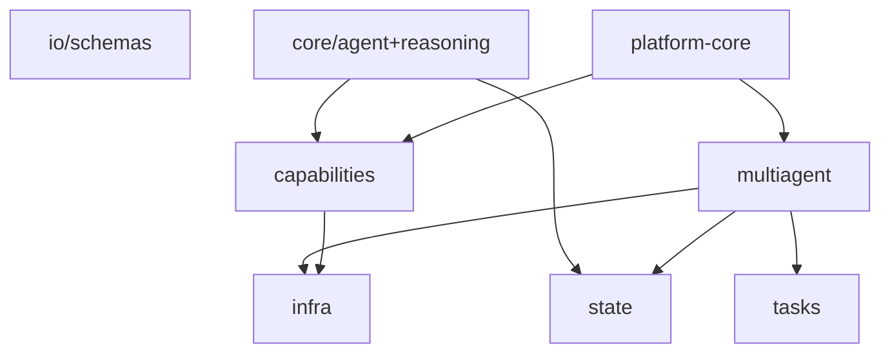

# Libs framework chi tiết (§AP)

Tách từ [`docs/TAI_LIEU_VAN_HANH_TOAN_BO_REPO.md`](../docs/TAI_LIEU_VAN_HANH_TOAN_BO_REPO.md) (dòng 28213–29183).

← [Mục lục docs2](README.md)

---

## §AP.1 — libs/platform-core module-by-module

> **Phạm vi:** Phụ lục chi tiết thư viện `libs/platform-core` — control plane cấu hình-driven cho hệ multi-agent. Trong khi §AH mô tả contracts domain; §AP tập trung vào *platform wiring*.

**Package root:** `libs/platform-core/src/platform_core/`
**Entry CLI:** `agent-platform` (`cli.py`)
**Phụ thuộc:** `commons`, `agent-core`, `mcp-core`, `pydantic`, `pyyaml`, optional `fastapi`/`httpx`.

### §AP.1.1 — Tổng quan kiến trúc platform-core
`platform-core` là lớp *điều phối* (control plane) đọc `platform.yaml` / `platform-supermarket.yaml` và nối registry agent, registry MCP, router A2A, graph orchestrator thành một facade `AgentPlatform`.
```
platform.yaml
  ├─ agents{}          → PlatformAgentRegistry (factory dotted-path)
  ├─ mcp_servers{}     → PlatformMCPRegistry (stdio | SSE | streamable-http)
  ├─ orchestration     → GraphOrchestrator → GraphEngine (agent-core)
  ├─ memory/cache/communication → build_platform_backends()
  └─ prompts.skills_dirname
AgentPlatform.from_config()
  ├─ agents: PlatformAgentRegistry
  ├─ mcp: PlatformMCPRegistry
  ├─ router: MessageRouter (in_process | http | https)
  └─ orchestrator: GraphOrchestrator
```
**Luồng runtime điển hình (supermarket):**
1. Mỗi agent service (`conversational-router`, `sql-planner`, …) gọi `load_platform_config()` khi khởi động.
2. `BaseAgentService.run()` mở session STM, recall LTM, load skill bundle, kết nối MCP (nếu khai báo).
3. `ChatOrchestrator` + `SupermarketAnalysisPipeline` gọi agent qua HTTP A2A (`AGENT_*_URL`), không qua `AgentPlatform` graph.
4. CLI `agent-platform --goal ...` dùng graph orchestration khi cần chạy toàn bộ DAG từ YAML.
### §AP.1.2 — Package `config/`

#### `libs/platform-core/src/platform_core/config/schema.py`

**Docstring:** Pydantic schema for ``platform.yaml`` - the single source of truth.

| Symbol | Mô tả ngắn |
|--------|------------|
| `class MCPServerAuthSpec` | — |
| `class MCPServerSpec` | One MCP server entry. |
| `class AgentSpec` | One agent entry. |
| `class GraphEdge` | — |
| `class ConditionalRouteSpec` | One branch in a conditional node. |
| `class GraphNodeSpecModel` | Extended node behaviour (parallel, conditional, join, debate). |
| `class StateChannelSpecModel` | — |
| `class OrchestrationStateConfig` | — |
| `def build_state_schema` | — |
| `class OrchestrationConfig` | How agents are composed. |
| `class MemoryConfig` | Shared memory/state backends (legacy flat fields + nested overrides). |
| `class PromptsConfig` | Where skill bundles / prompts live, relative to each agent package. |
| `class PlatformConfig` | Root config object. |

**Pydantic models chính:**
| Model | Vai trò |
|-------|---------|
| `MCPServerAuthSpec` | Auth MCP: `none`/`bearer`/`jwt`/`composite`, token env |
| `MCPServerSpec` | Một MCP server: transport, command/args hoặc url_env |
| `AgentSpec` | Một agent: factory, capabilities, endpoint_env, mcp_servers, skill, reasoning |
| `GraphEdge` | Cạnh DAG: `from`, `to`, `when` (điều kiện) |
| `GraphNodeSpecModel` | Node đặc biệt: parallel, conditional, join, debate |
| `OrchestrationConfig` | `type`, `entry`, `runtime`, `graph[]`, `nodes{}`, `state` |
| `MemoryConfig` | STM/LTM/checkpoint + nested `STMBackendConfig`/`LTMBackendConfig` |
| `PlatformConfig` | Root: agents, mcp_servers, orchestration, memory, cache, communication |
**Hàm quan trọng:**
- `build_state_schema()` — chuyển YAML reducer (`last_write`/`append`) → `StateSchema` agent-core.
- `OrchestrationConfig.to_execution_plan()` — YAML graph → `ExecutionPlan` trung lập framework.
- `OrchestrationConfig.order()` — thứ tự tuyến tính backward-compatible cho chain đơn giản.
- `PlatformConfig.agent_by_capability(cap)` — tìm agent theo capability string.
- `PlatformConfig.resolve_path(rel)` — resolve path tương đối theo `base_dir` của file config.
**Tích hợp agent-core:** import `GraphEdgeSpec`, `GraphNodeSpec`, `ConditionalRoute`, `ExecutionPlan`, `build_plan`, `StateChannel`, `AppendReducer`, `LastWriteWins` từ `agent_core.multiagent.orchestration.graph` và `agent_core.state.schema.base`.
#### `libs/platform-core/src/platform_core/config/loader.py`

**Docstring:** Load and normalise ``platform.yaml``.

| Symbol | Mô tả ngắn |
|--------|------------|
| `def load_platform_config` | Parse platform.yaml into a :class:`PlatformConfig`. |

**`load_platform_config(path)`:**
1. Resolve path: tham số → `PLATFORM_CONFIG` env → `./platform.yaml` CWD → walk parents.
2. `yaml.safe_load` → inject `name` vào mỗi entry `mcp_servers` và `agents`.
3. Construct `PlatformConfig(**raw)`; set `base_dir = cfg_path.parent`.
4. Raise `commons.errors.ConfigError` nếu file không tồn tại.
**Env liên quan:** `PLATFORM_CONFIG` (default `platform-supermarket.yaml` ở repo root trong deploy).
#### `libs/platform-core/src/platform_core/config/__init__.py`

**Docstring:** Platform configuration: schema + loader for platform.yaml.


### §AP.1.3 — Package `registry/`

#### `libs/platform-core/src/platform_core/registry/agent_registry.py`

**Docstring:** Item 26 concrete - the central agent registry / factory.

| Symbol | Mô tả ngắn |
|--------|------------|
| `class PlatformAgentRegistry` | Central registry + factory backed by the platform config. |

**`PlatformAgentRegistry`** kế thừa `AgentRegistry` + `AgentFactory` (agent-core).
Khởi tạo: duyệt `config.agents`, đăng ký `AgentCard(name, capabilities, endpoint, metadata)`.
Endpoint resolve: `spec.endpoint_env` → `os.getenv` → fallback `spec.endpoint`.
**`create(name)`** — lazy import factory:
```python
module_path, _, attr = spec.factory.partition(':')
factory = getattr(importlib.import_module(module_path), attr)
service = factory(self._config, spec)  # cached trong _services
```
Ví dụ factory supermarket: `conversational_router.service:build_service`.
#### `libs/platform-core/src/platform_core/registry/mcp_registry.py`

**Docstring:** Item 49 concrete - the central MCP server registry.

| Symbol | Mô tả ngắn |
|--------|------------|
| `class PlatformMCPRegistry` | Resolve MCP ``ServerEndpoint``s from the platform config. |

**`PlatformMCPRegistry.endpoints_for(server_names)`** trả `list[ServerEndpoint]` (mcp-core).
Logic transport:
- Có `url`/`url_env` → remote transport (`sse` hoặc `streamable-http`).
- Không có URL → stdio với `command` + `args`, env `MCP_TRANSPORT=stdio`.
- `tool_filters` và `prefix` được copy sang endpoint.
Supermarket: `sql-gateway` (SSE + `SQL_GATEWAY_URL`), `python-sandbox` (stdio `uv run python-sandbox`).
#### `libs/platform-core/src/platform_core/registry/__init__.py`

**Docstring:** Central registries built from platform.yaml.


### §AP.1.4 — Package `router/`

#### `libs/platform-core/src/platform_core/router/message_router.py`

**Docstring:** Item 24 concrete - the central A2A message router.

| Symbol | Mô tả ngắn |
|--------|------------|
| `class MessageRouter` | Resolve + deliver requests to agents. |

**Transport modes:**
| Mode | Hành vi |
|------|---------|
| `in_process` | `registry.create(name).run(request)` |
| `http`/`https` | POST `{endpoint}/run` với JSON `AgentRequest`, optional Bearer |
**Bảo mật HTTP:**
- Token: `A2AClientConfig.bearer_token` hoặc `AgentSpec.auth_token_env`.
- TLS: `require_https` trên config; `tls_verify` per agent; `ca_bundle`/`client_cert` trên A2A config.
- Timeout mặc định 300s.
#### `libs/platform-core/src/platform_core/router/a2a_client.py`

**Docstring:** HTTPS client configuration for A2A routing.

| Symbol | Mô tả ngắn |
|--------|------------|
| `class A2AClientConfig` | — |

**`A2AClientConfig`** dataclass: verify_ssl, ca_bundle, client_cert, bearer_token, timeout=300.
#### `libs/platform-core/src/platform_core/router/__init__.py`

**Docstring:** A2A message router.


### §AP.1.5 — Package `orchestration/`

#### `libs/platform-core/src/platform_core/orchestration/graph_orchestrator.py`

**Docstring:** Item 25 concrete - graph orchestration from config.

| Symbol | Mô tả ngắn |
|--------|------------|
| `class GraphOrchestrator` | Execute the agent graph defined in the platform config. |

**`GraphOrchestrator.run(goal, inputs, actor_id)`:**
1. `plan = config.orchestration.to_execution_plan()`.
2. Tạo `session_id = sess-{uuid8}`.
3. Executor closure: `AgentRequest` → `router.send_to_agent(node_id, request)`.
4. `GraphEngine(plan, executor, runtime, event_bus).run(...)`.
5. Trả dict: goal, order, execution_levels, node_outputs, final, workflow snapshot.
**Runtime:** `sync` → `SyncRuntime`; `thread_pool` → `ThreadPoolRuntime(max_workers)`.
**Event bus:** `build_event_bus(config.communication.event_bus)` — in-memory hoặc Redis.
#### `libs/platform-core/src/platform_core/orchestration/__init__.py`

**Docstring:** Graph orchestration driven by platform.yaml.


### §AP.1.6 — Package `runtime/`

#### `libs/platform-core/src/platform_core/runtime/platform.py`

**Docstring:** The ``AgentPlatform`` facade: load config and wire the control plane.

| Symbol | Mô tả ngắn |
|--------|------------|
| `class AgentPlatform` | Top-level control plane assembled from platform.yaml. |

**`AgentPlatform`** — facade top-level:
- `from_config(path, transport)` → load config + wire 4 thành phần.
- `run_goal(goal, inputs, actor_id)` → delegate `orchestrator.run`.
Đây là điểm vào cho CLI và integration test graph-level; pipeline supermarket thường bypass graph.
#### `libs/platform-core/src/platform_core/runtime/__init__.py`

**Docstring:** Platform runtime facade.


### §AP.1.7 — Package `service/`

#### `libs/platform-core/src/platform_core/service/base.py`

**Docstring:** BaseAgentService - the integration layer.

| Symbol | Mô tả ngắn |
|--------|------------|
| `class DecisionContext` | Everything ``decide`` needs for one turn. |
| `class BaseAgentService` | Common scaffolding shared by every agent service. |

**`BaseAgentService`** — scaffolding chung mọi agent service:
**Pipeline `run(AgentRequest)` (7 bước):**
1. STM append user message.
2. LTM retrieve (top 5) theo actor_id + query.
3. Retriever RAG (nếu cấu hình) top_k từ memory.retrieval.
4. `DefaultContextBuilder` → context window (skill + LTM + STM + inbox metadata).
5. MCP: `StrandsMCPServerRegistry` + `StrandsMCPAgentAdapter` → tools.
6. Subclass `decide(DecisionContext)` → `AgentResponse`.
7. Persist: STM assistant, LTM store, SQLite checkpoint.
**`DecisionContext`:** request, tools, mcp registry, context_text, system_prompt.
**`run_strands()`:** optional `ReasoningLoop` wrapper quanh Strands Agent.
**Backends:** `build_platform_backends(config)` — stm, ltm, retriever, cache.
#### `libs/platform-core/src/platform_core/service/http.py`

**Docstring:** Optional FastAPI inbound helper for A2A ``/run`` endpoints.

| Symbol | Mô tả ngắn |
|--------|------------|
| `def create_a2a_app` | Create a minimal FastAPI app exposing ``POST /run``. |

**`create_a2a_app(run_handler, token_env)`** — FastAPI minimal:
- Route `POST /run` → `AgentResponse`.
- Optional Bearer auth từ env `token_env`.
- Requires extra `platform-core[fastapi]`.
Mỗi agent deploy expose endpoint này; chat-gateway gọi qua HTTP.
#### `libs/platform-core/src/platform_core/service/__init__.py`

**Docstring:** BaseAgentService: the wiring layer that turns abstractions into a running agent.


### §AP.1.8 — Package `infra/`

#### `libs/platform-core/src/platform_core/infra/backends.py`

**Docstring:** Wire platform backends from :class:`PlatformConfig`.

| Symbol | Mô tả ngắn |
|--------|------------|
| `def build_platform_backends` | Instantiate memory, cache, communication backends from config. |

**`build_platform_backends(config)`** trả dict:
- `stm` — `build_stm(mem.resolved_stm(), base_dir)`.
- `ltm` — `build_ltm(mem.resolved_ltm(), base_dir)`.
- `retriever` — `build_retriever(mem.retrieval, base_dir)`.
- `cache` — `build_cache(config.cache)`.
- `event_bus`, `transport` — từ `config.communication`.

### §AP.1.9 — Packaging và phụ thuộc
**File:** `libs/platform-core/pyproject.toml`

- Package name: `platform-core`.
- Console script: `agent-platform = platform_core.cli:main`.
- Extras: `[fastapi]` cho `create_a2a_app`.
- Workspace member trong uv monorepo; import path `platform_core.*`.
### §AP.1.10 — Inventory đầy đủ file Python

| File | Docstring đầu | Class/Func chính |
|------|---------------|------------------|
| `libs/platform-core/src/platform_core/__init__.py` | platform-core: config-driven control plane for the multi-agent system. | — |
| `libs/platform-core/src/platform_core/cli.py` | CLI entry point: ``agent-platform``. | def main |
| `libs/platform-core/src/platform_core/config/__init__.py` | Platform configuration: schema + loader for platform.yaml. | — |
| `libs/platform-core/src/platform_core/config/loader.py` | Load and normalise ``platform.yaml``. | def load_platform_config |
| `libs/platform-core/src/platform_core/config/schema.py` | Pydantic schema for ``platform.yaml`` - the single source of truth. | class MCPServerAuthSpec, class MCPServerSpec, class AgentSpec, class GraphEdge, class ConditionalRouteSpec |
| `libs/platform-core/src/platform_core/infra/backends.py` | Wire platform backends from :class:`PlatformConfig`. | def build_platform_backends |
| `libs/platform-core/src/platform_core/orchestration/__init__.py` | Graph orchestration driven by platform.yaml. | — |
| `libs/platform-core/src/platform_core/orchestration/graph_orchestrator.py` | Item 25 concrete - graph orchestration from config. | class GraphOrchestrator |
| `libs/platform-core/src/platform_core/registry/__init__.py` | Central registries built from platform.yaml. | — |
| `libs/platform-core/src/platform_core/registry/agent_registry.py` | Item 26 concrete - the central agent registry / factory. | class PlatformAgentRegistry |
| `libs/platform-core/src/platform_core/registry/mcp_registry.py` | Item 49 concrete - the central MCP server registry. | class PlatformMCPRegistry |
| `libs/platform-core/src/platform_core/router/__init__.py` | A2A message router. | — |
| `libs/platform-core/src/platform_core/router/a2a_client.py` | HTTPS client configuration for A2A routing. | class A2AClientConfig |
| `libs/platform-core/src/platform_core/router/message_router.py` | Item 24 concrete - the central A2A message router. | class MessageRouter |
| `libs/platform-core/src/platform_core/runtime/__init__.py` | Platform runtime facade. | — |
| `libs/platform-core/src/platform_core/runtime/platform.py` | The ``AgentPlatform`` facade: load config and wire the control plane. | class AgentPlatform |
| `libs/platform-core/src/platform_core/service/__init__.py` | BaseAgentService: the wiring layer that turns abstractions into a running agent. | — |
| `libs/platform-core/src/platform_core/service/base.py` | BaseAgentService - the integration layer. | class DecisionContext, class BaseAgentService |
| `libs/platform-core/src/platform_core/service/http.py` | Optional FastAPI inbound helper for A2A ``/run`` endpoints. | def create_a2a_app |

### §AP.1.11 — Ghi chú vận hành và troubleshooting

**ConfigError: platform.yaml not found**
- Kiểm tra `PLATFORM_CONFIG`, CWD khi chạy agent, hoặc copy `platform-supermarket.yaml`.
- Log namespace: `platform_core.*` — set `LOG_LEVEL=DEBUG`.
- Test liên quan: `packages/project-test/integration/test_orchestrator_wiring.py`.

**Agent has no endpoint for HTTP routing**
- Set `AGENT_I_URL`…`AGENT_IV_URL` trong `.env`; hoặc dùng `--transport in_process`.
- Log namespace: `platform_core.*` — set `LOG_LEVEL=DEBUG`.
- Test liên quan: `packages/project-test/integration/test_orchestrator_wiring.py`.

**MCP server has neither url nor stdio command**
- Bổ sung `url_env` (remote) hoặc `command`+`args` (local stdio) trong YAML.
- Log namespace: `platform_core.*` — set `LOG_LEVEL=DEBUG`.
- Test liên quan: `packages/project-test/integration/test_orchestrator_wiring.py`.

**Unknown agent / Unknown MCP server**
- Tên trong code phải khớp key trong YAML `agents`/`mcp_servers`.
- Log namespace: `platform_core.*` — set `LOG_LEVEL=DEBUG`.
- Test liên quan: `packages/project-test/integration/test_orchestrator_wiring.py`.

**Factory import failure**
- Verify dotted-path `module:callable`; package agent phải có trong PYTHONPATH/uv workspace.
- Log namespace: `platform_core.*` — set `LOG_LEVEL=DEBUG`.
- Test liên quan: `packages/project-test/integration/test_orchestrator_wiring.py`.

**require_https violation**
- Prod: endpoint agent phải `https://`; dev có thể tắt flag.
- Log namespace: `platform_core.*` — set `LOG_LEVEL=DEBUG`.
- Test liên quan: `packages/project-test/integration/test_orchestrator_wiring.py`.

**STM/LTM connection**
- Redis/Mongo URI từ env; supermarket dùng `REDIS_URL`, `MONGODB_URI`.
- Log namespace: `platform_core.*` — set `LOG_LEVEL=DEBUG`.
- Test liên quan: `packages/project-test/integration/test_orchestrator_wiring.py`.

**Checkpoint DB locked**
- SQLite `./data/checkpoints.db` — tránh multi-writer; mount volume Docker.
- Log namespace: `platform_core.*` — set `LOG_LEVEL=DEBUG`.
- Test liên quan: `packages/project-test/integration/test_orchestrator_wiring.py`.

**Graph empty entry**
- orchestration cần `entry` hoặc `graph[]`; supermarket chỉ khai báo `entry: conversational-router`.
- Log namespace: `platform_core.*` — set `LOG_LEVEL=DEBUG`.
- Test liên quan: `packages/project-test/integration/test_orchestrator_wiring.py`.

**Skill bundle missing**
- Thư mục `skills/{skill}/SKILL.md` trong package agent tương ứng.
- Log namespace: `platform_core.*` — set `LOG_LEVEL=DEBUG`.
- Test liên quan: `packages/project-test/integration/test_orchestrator_wiring.py`.

### §AP.1.12 — Ma trận tương tác module

| From | To | Mối quan hệ |
|------|-----|-------------|
| `loader` | `schema` | Parse YAML → Pydantic PlatformConfig |
| `runtime.platform` | `loader` | AgentPlatform.from_config |
| `runtime.platform` | `registry.agent_registry` | self.agents |
| `runtime.platform` | `registry.mcp_registry` | self.mcp |
| `runtime.platform` | `router.message_router` | self.router |
| `runtime.platform` | `orchestration.graph_orchestrator` | self.orchestrator |
| `service.base` | `registry.mcp_registry` | endpoints_for(spec.mcp_servers) |
| `service.base` | `infra.backends` | build_platform_backends |
| `orchestration.graph_orchestrator` | `router.message_router` | send_to_agent per node |
| `orchestration.graph_orchestrator` | `agent_core GraphEngine` | DAG execution |
| `router.message_router` | `registry.agent_registry` | create / get / resolve_capability |
| `cli` | `runtime.platform` | run_goal |

### §AP.1.13 — Capability → agent mapping (supermarket)

- **`router`** → agent `conversational-router`: ingress, synthesize, clarification_bridge
  - Resolve: `PlatformAgentRegistry.resolve_capability('router')`.
  - Endpoint env: xem `platform-supermarket.yaml` → `endpoint_env`.

- **`sql_plan`** → agent `sql-planner`: SQL plan + clarify
  - Resolve: `PlatformAgentRegistry.resolve_capability('sql_plan')`.
  - Endpoint env: xem `platform-supermarket.yaml` → `endpoint_env`.

- **`clarify`** → agent `sql-planner`: Clarification rounds
  - Resolve: `PlatformAgentRegistry.resolve_capability('clarify')`.
  - Endpoint env: xem `platform-supermarket.yaml` → `endpoint_env`.

- **`risk_review`** → agent `risk-reviewer`: Policy/risk gate trước execute
  - Resolve: `PlatformAgentRegistry.resolve_capability('risk_review')`.
  - Endpoint env: xem `platform-supermarket.yaml` → `endpoint_env`.

- **`analytics`** → agent `data-analyst`: Phân tích parquet + sandbox
  - Resolve: `PlatformAgentRegistry.resolve_capability('analytics')`.
  - Endpoint env: xem `platform-supermarket.yaml` → `endpoint_env`.

### §AP.1.14 — `cli.py` và entrypoint `agent-platform`

**File:** `libs/platform-core/src/platform_core/cli.py`

| Tham số CLI | Mặc định | Ý nghĩa |
|-------------|----------|---------|
| `--goal` | `Run the configured agent graph` | Chuỗi goal truyền vào GraphOrchestrator |
| `--inputs` | `{}` | JSON object merge vào metadata mỗi AgentRequest |
| `--config` | `None` | Override path platform YAML; fallback `PLATFORM_CONFIG` env |
| `--transport` | `in_process` | `in_process` \| `http` \| `https` — cách MessageRouter gọi agent |

**Ví dụ debug graph locally:**
```bash
cd Monorepo-Trading-Agent
export PLATFORM_CONFIG=platform-supermarket.yaml
uv run agent-platform --goal "smoke test" --transport in_process --inputs '{"debug":true}'
```

**Khác biệt với hot path supermarket:** CLI chạy `GraphOrchestrator` theo YAML; chat-gateway gọi trực tiếp `SupermarketAnalysisPipeline` + HTTP agents — không qua `run_goal()`.

### §AP.1.15 — Checklist deploy platform-core

1. `PLATFORM_CONFIG` trỏ đúng file wiring (supermarket vs generic).
2. Mọi `endpoint_env` có giá trị khi `--transport http`.
3. Redis/Mongo reachable trước khi start agent (STM/LTM).
4. `LOG_LEVEL=INFO` prod; `DEBUG` chỉ dev.
5. Sau đổi factory path — restart agent container (cache `_services` in-process).


## §AP.2 — libs/agent-core overview

> **Phạm vi:** Framework agent đa lớp (items 1–36 trong docstring nội bộ). `platform-core` và `project-core` build trên các abstraction này.

### §AP.2.1 — Cấu trúc package

| Package | Vai trò | File count (approx) |
|---------|---------|---------------------|
| `core/` | Vòng đời agent & suy luận nội bộ | 19 |
| `capabilities/` | Khả năng plug-in: model, memory, retrieval, tools, prompts | 32 |
| `state/` | State machine, session, workflow, checkpoint | 19 |
| `multiagent/` | Graph orchestration, event bus, registry, runtime | 24 |
| `infra/` | Backend config, cache, budget, guardrails, observability | 19 |
| `tasks/` | Phân rã task, aggregation | 7 |
| `io/` | AgentRequest/AgentResponse schemas | 2 |
| `skills/` | SkillBundle loader | 2 |

### §AP.2.2 — Package `agent_core.core`

#### `libs/agent-core/src/agent_core/core/agent/base.py` — `AbstractAgent`

- observe()
- plan()
- step()
- run() — vòng ReAct canonical

#### `libs/agent-core/src/agent_core/core/agent/strands_agent.py` — `StrandsAgent`

- Impl Strands-backed; wiring model + tools + context

#### `libs/agent-core/src/agent_core/core/persona/base.py` — `Persona`

- PersonaConfig → system prompt fragment

#### `libs/agent-core/src/agent_core/core/reasoning/base.py` — `ReasoningStrategy`

- Interface chiến lược suy luận intra-agent

#### `libs/agent-core/src/agent_core/core/reasoning/react.py` — `ReActStrategy`

- Reason-Act loop

#### `libs/agent-core/src/agent_core/core/reasoning/chain_of_thought.py` — `ChainOfThoughtStrategy`

- CoT prompting

#### `libs/agent-core/src/agent_core/core/reasoning/plan_execute.py` — `PlanAndExecuteStrategy`

- Plan rồi execute từng bước

#### `libs/agent-core/src/agent_core/core/reasoning/passthrough.py` — `PassthroughStrategy`

- Không wrap — gọi LLM trực tiếp

#### `libs/agent-core/src/agent_core/core/reasoning/loop.py` — `ReasoningLoop`

- Orchestrate strategy + invoke callback

#### `libs/agent-core/src/agent_core/core/reasoning/factory.py` — `build_reasoning`

- Map YAML string → strategy instance

#### `libs/agent-core/src/agent_core/core/termination/base.py` — `TerminationCondition`

- MaxIterations, StopToken, Composite

#### `libs/agent-core/src/agent_core/core/evaluation/base.py` — `AbstractEvaluator`

- ReflectionLoop, HeuristicEvaluator

### §AP.2.3 — Package `agent_core.capabilities`

#### `libs/agent-core/src/agent_core/capabilities/models/openai_compatible.py` — `OpenAICompatibleProvider`

- OpenRouter/OpenAI compatible API

#### `libs/agent-core/src/agent_core/capabilities/memory/factory.py` — `build_stm/build_ltm`

- Factory Redis/SQLite/Mongo/Strands/in_memory

#### `libs/agent-core/src/agent_core/capabilities/memory/redis_stm.py` — `RedisSTM`

- Session TTL, append history

#### `libs/agent-core/src/agent_core/capabilities/memory/mongodb_ltm.py` — `MongoDBLTM`

- Long-term recall per actor

#### `libs/agent-core/src/agent_core/capabilities/retrieval/factory.py` — `build_retriever`

- Chroma, in-memory vector

#### `libs/agent-core/src/agent_core/capabilities/context/default_builder.py` — `DefaultContextBuilder`

- Assemble context window per turn

#### `libs/agent-core/src/agent_core/capabilities/tools/base.py` — `AbstractTool`

- Framework-neutral tool contract

#### `libs/agent-core/src/agent_core/capabilities/tool_registry/simple.py` — `SimpleToolRegistry`

- Register + select tools

#### `libs/agent-core/src/agent_core/capabilities/output_parsers/json_parser.py` — `JsonOutputParser`

- Parse structured agent output

#### `libs/agent-core/src/agent_core/capabilities/prompts/file_repository.py` — `FilePromptRepository`

- Versioned prompt files

### §AP.2.4 — Package `agent_core.state`

#### `libs/agent-core/src/agent_core/state/agent_state/in_memory.py` — `InMemoryAgentState`

- Per-agent KV private state

#### `libs/agent-core/src/agent_core/state/session_state/strands_session.py` — `StrandsSessionStore`

- Conversation session adapter

#### `libs/agent-core/src/agent_core/state/shared_state/in_memory.py` — `InMemoryBlackboard`

- Multi-agent blackboard

#### `libs/agent-core/src/agent_core/state/workflow_state/base.py` — `WorkflowState`

- Orchestration run progress + status enum

#### `libs/agent-core/src/agent_core/state/schema/base.py` — `StateSchema`

- LangGraph-style reducers LastWriteWins/Append

#### `libs/agent-core/src/agent_core/state/persistence/sqlite_checkpoint.py` — `SQLiteCheckpointStore`

- Resume checkpoints

#### `libs/agent-core/src/agent_core/state/transition/base.py` — `StateMachine`

- FSM transitions

### §AP.2.5 — Package `agent_core.multiagent`

#### `libs/agent-core/src/agent_core/multiagent/orchestration/graph/engine.py` — `GraphEngine`

- Execute DAG: parallel, conditional, join

#### `libs/agent-core/src/agent_core/multiagent/orchestration/graph/model.py` — `ExecutionPlan`

- Neutral graph plan model

#### `libs/agent-core/src/agent_core/multiagent/orchestration/graph/builder.py` — `build_plan`

- Construct plan from edges/nodes

#### `libs/agent-core/src/agent_core/multiagent/orchestration/graph/conditions.py` — `ConditionEvaluator`

- Evaluate `when` expressions

#### `libs/agent-core/src/agent_core/multiagent/runtime/base.py` — `SyncRuntime`

- Sequential sync execution

#### `libs/agent-core/src/agent_core/multiagent/runtime/thread_pool.py` — `ThreadPoolRuntime`

- Parallel node execution

#### `libs/agent-core/src/agent_core/multiagent/communication/redis_transport.py` — `RedisTransport`

- A2A message queue via Redis

#### `libs/agent-core/src/agent_core/multiagent/event_bus/redis_bus.py` — `RedisEventBus`

- Pub/sub coordination

#### `libs/agent-core/src/agent_core/multiagent/registry/base.py` — `AgentRegistry`

- AgentCard discovery by capability

#### `libs/agent-core/src/agent_core/multiagent/human_in_loop/base.py` — `HumanInLoop`

- Approval gates AutoApprove

### §AP.2.6 — Package `agent_core.infra`

#### `libs/agent-core/src/agent_core/infra/backends/config.py` — `STMBackendConfig`

- Nested backend configuration models

#### `libs/agent-core/src/agent_core/infra/backends/resolve.py` — `resolve_url`

- Env var URL resolution

#### `libs/agent-core/src/agent_core/infra/caching/factory.py` — `build_cache`

- In-memory / Redis cache

#### `libs/agent-core/src/agent_core/infra/budget/base.py` — `BudgetGuard`

- Token/cost/concurrency caps

#### `libs/agent-core/src/agent_core/infra/guardrails/base.py` — `Guardrail`

- Input/output validation, PermissionPolicy

#### `libs/agent-core/src/agent_core/infra/observability/base.py` — `Tracer`

- Span, CostAccountant, UsageRecord

#### `libs/agent-core/src/agent_core/infra/hooks/base.py` — `HookRegistry`

- Lifecycle hooks register/emit

#### `libs/agent-core/src/agent_core/infra/errors/base.py` — `AgentError`

- Structured agent errors

#### `libs/agent-core/src/agent_core/infra/di/base.py` — `ServiceLocator`

- Lightweight DI container

### §AP.2.7 — Package `agent_core.tasks`

#### `libs/agent-core/src/agent_core/tasks/decomposition/base.py` — `TaskDecomposer`

- Split complex goals

#### `libs/agent-core/src/agent_core/tasks/aggregation/base.py` — `ResultAggregator`

- Merge parallel agent outputs

### §AP.2.8 — Package `agent_core.io`

#### `libs/agent-core/src/agent_core/io/schemas.py` — `AgentRequest`

- message, session_id, actor_id, metadata.inbox

#### `libs/agent-core/src/agent_core/io/schemas.py` — `AgentResponse`

- content, payload, tool_calls, state_updates

### §AP.2.9 — Package `agent_core.skills`

#### `libs/agent-core/src/agent_core/skills/bundle.py` — `SkillBundle`

- Load SKILL.md + TOOLS.md + prompts from skills/

### §AP.2.10 — Sơ đồ phụ thuộc giữa packages



### §AP.2.11 — Chiến lược reasoning (YAML → factory)

| YAML `reasoning` | Class | Hành vi |
|------------------|-------|---------|
| `null / omitted` | `PassthroughStrategy` | Gọi LLM một lần, không wrap |
| `react` | `ReActStrategy` | Reason + Act + Observe loop |
| `cot` | `ChainOfThoughtStrategy` | Chain-of-thought prompting |
| `plan_execute` | `PlanAndExecuteStrategy` | Lập kế hoạch rồi thực thi |

### §AP.2.12 — Memory & retrieval backends

| Layer | Backend key | Ghi chú |
|-------|-------------|---------|
| stm | `in_memory` | Dict in-process — test/dev |
| stm | `redis` | REDIS_URL — production supermarket |
| stm | `strands` | Strands session manager integration |
| ltm | `sqlite` | File ./data/ltm.db |
| ltm | `mongodb` | MONGODB_URI — production supermarket |
| ltm | `redis` | Redis-backed LTM |
| retrieval | `in_memory` | Vector in RAM |
| retrieval | `chroma` | ChromaDB persistent |

### §AP.2.13 — GraphEngine — node kinds

- **`agent`**: Gọi executor với node_id = agent name
- **`parallel`**: Chạy nhiều agent song song, merge concat/list
- **`conditional`**: Evaluate routes[].when → branch
- **`join`**: Đợi parallel branches, merge state
- **`debate`**: Round-robin participants + facilitator

### §AP.2.14 — Hợp đồng A2A (io/schemas.py)

**AgentRequest fields:**
- `message: str` — user goal / prompt turn.
- `session_id: str | None` — conversation id; auto-generate nếu null.
- `actor_id: str` — user identity cho LTM/ACL.
- `metadata: dict` — `inbox` (pipeline feedback), `shared_state`, `permissions`, custom.
**AgentResponse fields:**
- `content: str | None` — natural language cho user.
- `payload: dict` — structured JSON (SQL plan, risk verdict, analysis result).
- `tool_calls: list` — audit tool invocations.
- `state_updates: dict` — mutate shared blackboard.
- `session_id`, `actor_id`, `memory_refs` — persistence hints.

## §AP.3 — libs/mcp-core + commons

> **Phạm vi:** MCP protocol layer (items 37–50) và shared utilities `libs/commons`. MCP = JSON-RPC cho tools/resources/prompts qua stdio hoặc HTTP/SSE.

### §AP.3.1 — libs/commons

| File | Exports | Mô tả |
|------|---------|-------|
| `libs/commons/src/commons/errors.py` | CommonsError, ConfigError | Hierarchy exception; ConfigError code=config_error |
| `libs/commons/src/commons/logging.py` | get_logger | LOG_LEVEL env; format structured stderr |
| `libs/commons/src/commons/settings.py` | BaseAppSettings | pydantic-settings + .env loading |
| `libs/commons/src/commons/types.py` | Result, JSONValue | Generic Result ok/err; JSON type alias |
| `libs/commons/src/commons/__init__.py` | — | Package marker |

**Sử dụng trong monorepo:**
- Mọi service/agent gọi `commons.logging.get_logger(__name__)`.
- Config loader raise `commons.errors.ConfigError` — catch thống nhất.
- Agent settings subclass `BaseAppSettings` cho env-driven config.
- `Result[T,E]` dùng khi hot path tránh exception (optional).
### §AP.3.2 — mcp-core server layer

| Module | Class | Vai trò |
|--------|-------|---------|
| `mcp_core/server/lifecycle/fastmcp_server.py` | `FastMCPServer` | FastMCP lifecycle wrapper |
| `mcp_core/server/lifecycle/base.py` | `ServerLifecycle` | Start/stop hooks |
| `mcp_core/server/transport/base.py` | `Transport` | stdio / streamable-http / SSE abstraction |
| `mcp_core/server/session/base.py` | `SessionManager` | MCP session state |
| `mcp_core/server/auth/base.py` | `AuthProvider` | Bearer/JWT/composite |
| `mcp_core/server/auth/middleware.py` | `auth_middleware` | Request auth gate |
| `mcp_core/server/auth/factory.py` | `build_auth` | Auth from spec |
| `mcp_core/server/providers/tools/base.py` | `ToolProvider` | Register + invoke tools |
| `mcp_core/server/providers/resources/base.py` | `ResourceProvider` | MCP resources → retrieval |
| `mcp_core/server/providers/prompts/base.py` | `PromptProvider` | MCP prompts → templates |
| `mcp_core/server/capabilities/base.py` | `CapabilityNegotiation` | Protocol handshake |
| `mcp_core/server/callbacks/base.py` | `CallbackHandler` | Progress/logging callbacks |
| `mcp_core/server/notifications/base.py` | `NotificationService` | Server push notifications |
| `mcp_core/server/errors/base.py` | `MCPError` | Structured MCP errors |

### §AP.3.3 — mcp-core client layer

| Module | Class | Vai trò |
|--------|-------|---------|
| `mcp_core/client/connector/base.py` | `MCPConnector, ServerEndpoint` | Connect + discover remote tools |
| `mcp_core/client/connector/strands_connector.py` | `StrandsMCPConnector` | Strands-specific transport |
| `mcp_core/client/registry/base.py` | `MCPServerRegistry` | Multi-server registry + prefixes |
| `mcp_core/client/registry/strands_registry.py` | `StrandsMCPServerRegistry` | Used by BaseAgentService |
| `mcp_core/client/registry/tool_filter.py` | `ToolFilter` | Allow/deny tool names |
| `mcp_core/client/adapter/base.py` | `MCPAgentAdapter` | MCP tool → agent tool handle |
| `mcp_core/client/adapter/strands_adapter.py` | `StrandsMCPAgentAdapter` | → Strands Agent tools |

### §AP.3.4 — Luồng MCP JSON-RPC

```
Agent (Strands)                    MCP Server (sql-gateway)
     |                                      |
     |--- initialize ----------------------->|
     |<-- capabilities ----------------------|
     |--- tools/list ----------------------->|
     |<-- [{name, inputSchema}] -------------|
     |--- tools/call {name, arguments} ----->|
     |<-- {content:[{type:text}], isError} --|
```
**Mapping sang agent-core (README mcp-core):**
- MCP tool → `capabilities.tools.AbstractTool`
- MCP resource → `capabilities.retrieval` / memory
- MCP prompt → `capabilities.prompts.PromptTemplate`
### §AP.3.5 — Wiring supermarket

| Server | Transport | Prefix | Thực thi bởi |
|--------|-----------|--------|--------------|
| sql-gateway | SSE (`SQL_GATEWAY_URL`) | `sql` | Pipeline `HttpSqlGatewayClient`, không agent ReAct |
| python-sandbox | stdio (`uv run python-sandbox`) | `sandbox` | Pipeline process, không agent ReAct |
Comment trong `platform-supermarket.yaml`: tool ownership thuộc pipeline/gateway — agents trả JSON; chat-gateway + SupermarketAnalysisPipeline gọi MCP.
### §AP.3.6 — Adapter chain (tool → LLM)

1. `PlatformMCPRegistry.endpoints_for(['sql-gateway'])` → `ServerEndpoint`.
2. `StrandsMCPServerRegistry.add(endpoint)` + context manager connect.
3. `registry.adapted_tools(StrandsMCPAgentAdapter)` → list Strands-compatible tools.
4. `StrandsAgent(model, tools=...)` — LLM nhận tool specs trong API call.
5. LLM emit tool_call → adapter → MCP `tools/call` → result text → next turn.
**ToolFilter:** `MCPServerSpec.tool_filters` giới hạn expose subset tools per server.
### §AP.3.7 — Inventory file mcp-core

| File | Docstring |
|------|-----------|
| `libs/mcp-core/src/mcp_core/__init__.py` | mcp-core: abstract building blocks for MCP servers and clients (items 37-50). |
| `libs/mcp-core/src/mcp_core/client/__init__.py` | G (client side): connector, multi-server registry, MCP<->Agent adapter |
| `libs/mcp-core/src/mcp_core/client/adapter/__init__.py` | Item 50 - MCP <-> Agent adapter (bridge). |
| `libs/mcp-core/src/mcp_core/client/adapter/base.py` | Item 50 - MCP <-> Agent adapter (bridge). |
| `libs/mcp-core/src/mcp_core/client/adapter/strands_adapter.py` | Strands implementation of the MCP <-> Agent adapter. |
| `libs/mcp-core/src/mcp_core/client/connector/__init__.py` | Item 48 - MCP Client / Connector. |
| `libs/mcp-core/src/mcp_core/client/connector/base.py` | Item 48 - MCP Client / Connector. |
| `libs/mcp-core/src/mcp_core/client/connector/strands_connector.py` | Strands-backed reference implementation of :class:`MCPConnector`. |
| `libs/mcp-core/src/mcp_core/client/registry/__init__.py` | Item 49 - MCP server registry / Multi-server manager. |
| `libs/mcp-core/src/mcp_core/client/registry/base.py` | Item 49 - MCP server registry / Multi-server manager. |
| `libs/mcp-core/src/mcp_core/client/registry/strands_registry.py` | Strands-backed multi-server registry: builds StrandsMCPConnector per endpoint. |
| `libs/mcp-core/src/mcp_core/client/registry/tool_filter.py` | Tool name filtering for MCP server endpoints. |
| `libs/mcp-core/src/mcp_core/server/__init__.py` | G (server side): MCP server lifecycle, transport, capabilities, providers, |
| `libs/mcp-core/src/mcp_core/server/auth/__init__.py` | Item 45 - Auth / Authorization. |
| `libs/mcp-core/src/mcp_core/server/auth/base.py` | MCP server authentication and authorization. |
| `libs/mcp-core/src/mcp_core/server/auth/factory.py` | Build MCP authorizers from config. |
| `libs/mcp-core/src/mcp_core/server/auth/middleware.py` | Auth middleware wrapping MCP tool handlers. |
| `libs/mcp-core/src/mcp_core/server/callbacks/__init__.py` | Item 43 - Client-callback handler (server calls back to client). |
| `libs/mcp-core/src/mcp_core/server/callbacks/base.py` | Item 43 - Client-callback handler (server -> client). |
| `libs/mcp-core/src/mcp_core/server/capabilities/__init__.py` | Item 39 - Capability negotiation. |
| `libs/mcp-core/src/mcp_core/server/capabilities/base.py` | Item 39 - Capability negotiation. |
| `libs/mcp-core/src/mcp_core/server/errors/__init__.py` | Item 47 - Error handling (domain -> JSON-RPC). |
| `libs/mcp-core/src/mcp_core/server/errors/base.py` | Item 47 - Error handling. |
| `libs/mcp-core/src/mcp_core/server/lifecycle/__init__.py` | Item 37 - MCP Server (base / lifecycle). |
| `libs/mcp-core/src/mcp_core/server/lifecycle/base.py` | Item 37 - MCP Server (base / lifecycle). |
| `libs/mcp-core/src/mcp_core/server/lifecycle/fastmcp_server.py` | FastMCP-backed reference implementation of :class:`AbstractMCPServer`. |
| `libs/mcp-core/src/mcp_core/server/notifications/__init__.py` | Item 46 - Notifications / Progress / Cancellation. |
| `libs/mcp-core/src/mcp_core/server/notifications/base.py` | Item 46 - Notifications / Progress / Cancellation. |
| `libs/mcp-core/src/mcp_core/server/providers/__init__.py` | MCP primitives exposed by a server: tools (40), resources (41), prompts (42). |
| `libs/mcp-core/src/mcp_core/server/providers/prompts/__init__.py` | Item 42 - Prompt provider (primitive: template). |
| `libs/mcp-core/src/mcp_core/server/providers/prompts/base.py` | Item 42 - Prompt provider (primitive: template). |
| `libs/mcp-core/src/mcp_core/server/providers/resources/__init__.py` | Item 41 - Resource provider (primitive: read-only data). |
| `libs/mcp-core/src/mcp_core/server/providers/resources/base.py` | Item 41 - Resource provider (primitive: read-only data). |
| `libs/mcp-core/src/mcp_core/server/providers/tools/__init__.py` | Item 40 - Tool provider (primitive: action, has side-effects). |
| `libs/mcp-core/src/mcp_core/server/providers/tools/base.py` | Item 40 - Tool provider (primitive: action). |
| `libs/mcp-core/src/mcp_core/server/session/__init__.py` | Item 44 - Session / Connection. |
| `libs/mcp-core/src/mcp_core/server/session/base.py` | Item 44 - Session / Connection. |
| `libs/mcp-core/src/mcp_core/server/transport/__init__.py` | Item 38 - Transport (stdio / streamable-http). |
| `libs/mcp-core/src/mcp_core/server/transport/base.py` | Item 38 - Transport. |

### §AP.3.8 — Chi tiết `commons` từng module

#### `commons/errors.py`

- **`CommonsError`**: base exception với `code` machine-readable và `details` dict.
- **`ConfigError`**: subclass với `code=config_error` — platform loader, registry raise khi YAML thiếu/sai.
- **Pattern catch:** service layer catch `ConfigError` → HTTP 503; log `exc.details`.

#### `commons/logging.py`

- **`get_logger(name)`**: lazy configure root logger một lần (`_CONFIGURED` flag).
- **Format:** `%(asctime)s %(levelname)-7s %(name)s :: %(message)s` trên stderr.
- **Env:** `LOG_LEVEL` (default INFO) — áp dụng toàn monorepo thống nhất.

#### `commons/settings.py`

- **`BaseAppSettings`**: pydantic-settings với `env_file=.env`, `extra=ignore`.
- **Field mặc định:** `log_level: str = "INFO"`.
- **Subclass:** mỗi agent/service (`ChatGatewaySettings`, …) kế thừa pattern này.

#### `commons/types.py`

- **`JSONValue`**: type alias JSON-compatible (recursive dict/list).
- **`Result[T,E]`**: dataclass `ok()` / `err()` / `unwrap()` — optional thay exception trên hot path.

### §AP.3.9 — MCP server lifecycle (items 37–47)

| Item | Module | Trách nhiệm |
|------|--------|-------------|
| 37 | `lifecycle/base.py`, `fastmcp_server.py` | Khởi tạo/dừng server; FastMCP reference impl |
| 38 | `transport/base.py` | stdio subprocess vs streamable-http vs SSE |
| 39 | `capabilities/base.py` | Handshake `initialize` — protocol version |
| 40 | `providers/tools/base.py` | `tools/list`, `tools/call` — side-effect actions |
| 41 | `providers/resources/base.py` | Read-only data exposure |
| 42 | `providers/prompts/base.py` | Template prompts cho client |
| 43 | `callbacks/base.py` | Server → client callback (progress) |
| 44 | `session/base.py` | Connection/session state |
| 45 | `auth/base.py`, `middleware.py`, `factory.py` | Bearer/JWT/composite auth |
| 46 | `notifications/base.py` | Push notifications, cancellation |
| 47 | `errors/base.py` | Domain error → JSON-RPC error object |

**Repo consumers:** `mcp-servers/sql-gateway` và `mcp-servers/python-sandbox` implement tool providers; không dùng full server stack trực tiếp từ mcp-core trong mọi case — FastMCP wrapper là reference.

### §AP.3.10 — MCP client stack (items 48–50)

**Item 48 — Connector (`client/connector/`):**
- `ServerEndpoint`: dataclass mô tả transport, url/command, prefix, tool_filters.
- `MCPConnector`: connect, `list_tools()`, `call_tool(name, args)`.
- `StrandsMCPConnector`: Strands SDK transport binding.

**Item 49 — Registry (`client/registry/`):**
- `MCPServerRegistry`: quản lý nhiều server; prefix tránh collision tên tool.
- `StrandsMCPServerRegistry`: context manager `with registry:` auto connect/disconnect.
- `ToolFilter`: allowlist/denylist pattern trên tên tool.

**Item 50 — Adapter (`client/adapter/`):**
- `MCPAgentAdapter`: abstract bridge MCP → framework agent tools.
- `StrandsMCPAgentAdapter`: produce Strands `@tool` handles cho `StrandsAgent`.

### §AP.3.11 — sql-gateway MCP tools (supermarket)

Pipeline gọi qua `HttpSqlGatewayClient`, không qua agent ReAct. Tools logic (prefix `sql_`):

| Tool (logical) | Mô tả | ACL |
|----------------|-------|-----|
| validate_sql | Parse + policy pre-check | SqlAclContext required |
| explain_sql | EXPLAIN plan cho Agent III | Read-only |
| execute_readonly | Chạy SELECT → parquet path | Row cap + store filter |

Transport SSE: client giữ long-lived connection tới `SQL_GATEWAY_URL`; retry khi gateway restart.

### §AP.3.12 — python-sandbox MCP tools

Stdio subprocess — pipeline spawn trong cùng host hoặc sidecar:

| Tool (logical) | Mô tả |
|----------------|-------|
| run_python | Execute sandboxed Python trên parquet artifact |
| describe_dataset | Schema + sample rows parquet |

**Security:** sandbox tách process; không mount credentials SQL; chỉ đọc artifact paths pipeline cấp.

### §AP.3.13 — Troubleshooting MCP

| Triệu chứng | Nguyên nhân | Cách xử lý |
|-------------|-------------|------------|
| Connection refused SSE | SQL_GATEWAY down | `curl $SQL_GATEWAY_URL/health` |
| stdio spawn fail | `uv` không trong PATH container | Kiểm tra Dockerfile CMD |
| Tool not found | prefix mismatch | Verify `MCPServerSpec.prefix` |
| Auth 401 MCP | Bearer thiếu | Set token env trên client |
| Timeout tools/call | Query nặng | Giảm `policy.max_rows`; index DB |

### §AP.3.14 — So sánh transport MCP trong repo

| Transport | Server | Ưu điểm | Nhược điểm |
|-----------|--------|---------|------------|
| SSE | sql-gateway | Remote, scale riêng gateway | Cần stable URL, firewall |
| stdio | python-sandbox | Đơn giản local, ít port | Khó scale multi-host |
| streamable-http | (generic) | HTTP standard | Cấu hình TLS phức tạp hơn |

**Chọn transport:** remote shared service → SSE/HTTP; one-shot sidecar cùng pod → stdio.

**Env MCP client:** `MCP_TRANSPORT`, `MCP_HTTP_HOST`, `MCP_HTTP_PORT`, TLS bundle paths — xem `mcp_core/client/connector/base.py`.

**Test liên quan:** `test_sandbox_tools.py`, `test_sql_gateway.py`, `test_sql_gateway_acl_enforcement.py`.

**Versioning:** mcp-core README đánh số items 37–50; thay đổi protocol phải update cả server (`mcp-servers/*`) và client adapter.

### §AP.3.15 — Dependency graph commons ↔ mcp-core ↔ platform-core

```
commons (logging, errors)
    ↑           ↑
agent-core ← platform-core → mcp-core client (adapter, registry)
                    ↓
              mcp-servers (sql-gateway, python-sandbox)
```

- **platform-core** import `commons`, `mcp_core.client.*`, `agent_core.*`.
- **Agents** (I–IV) extend `BaseAgentService` — inherit MCP wiring dù supermarket để `mcp_servers: []`.
- **Pipeline** gọi MCP trực tiếp qua HTTP client — bypass `StrandsMCPServerRegistry` trong agent process.
- **Regenerate doc:** `uv run python scripts/gen_ap_append.py` sau thay đổi libs/config/tests.


